# 6차시 고등학생 대화형 스토리 Agent 교육
## 역공부로 배우는 AI 시대 학습법

---

## 🎯 Hero Section

**배지**: "AI 시대의 역공부 마스터"  
**타이틀**: "완성작 분해 → 원리 이해 → 나만의 Agent 제작"  
**설명**: "제타(Zeta)처럼 대화하며 이야기를 만드는 AI Agent를 역공부 방식으로 이해하고 구현하는 6차시 프로젝트"

### Features

| 아이콘 | 라벨 | 설명 |
|--------|------|------|
| 🔄 | 역공부 | 완성작 분석 → 원리 파악 → 재구성 |
| 💬 | 대화형 스토리 | 50턴 대화로 완성되는 이야기 |
| 🤖 | Agent 자동화 | RAG 기반 맥락 유지 시스템 |
| 🌐 | 웹 구현 | 실제 작동하는 결과물 |

---

## 📊 Course Info

| 항목 | 아이콘 | 색상 | 내용 |
|------|--------|------|------|
| 수업 시간 | ⏰ Clock | purple | 6차시 (차시당 50분, 총 300분) |
| 수강 대상 | 🎓 GraduationCap | blue | 고등학교 1-2학년 (디지털 중점) |
| 준비물 | 💻 Laptop | green | 노트북 + ChatGPT + Python 환경 |
| 수업 방식 | 🔄 RefreshCw | orange | 역공부 (완성작 → 원리 → 구현) |
| 결과물 | 🏆 Trophy | red | 나만의 대화형 스토리 Agent 웹앱 |

---

## 📖 과정 소개

### 타이틀
"왜 역공부 방식인가?"

### 내용

**AI 시대의 학습법: 역공부(Reverse Learning)**

전통적 학습: 이론 → 실습 → 응용 → 결과물  
❌ 문제: 동기부여 부족, 지루함, 실용성 의문

역공부 학습: **완성작 → 분해 → 원리 이해 → 재구성 → 나만의 버전**  
✅ 장점: 즉각적 이해, 높은 동기부여, 실용적 학습

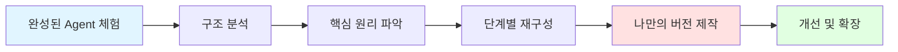

**그림자 프로젝트(Shadow Project) 개념**

완전히 새로운 것을 만드는 것이 아니라, **완성된 소스를 제공**하고:
- 🔍 어떻게 작동하는지 분석
- 🧩 각 부분의 역할 이해
- 🎨 제한된 틀 안에서 변형
- 🚀 점진적으로 개선

→ 창작의 부담 없이 **원리 이해**에 집중

**대화형 스토리 Agent란?**

제타(Zeta)처럼 사용자와 대화하며 하나의 이야기를 만들어가는 시스템:

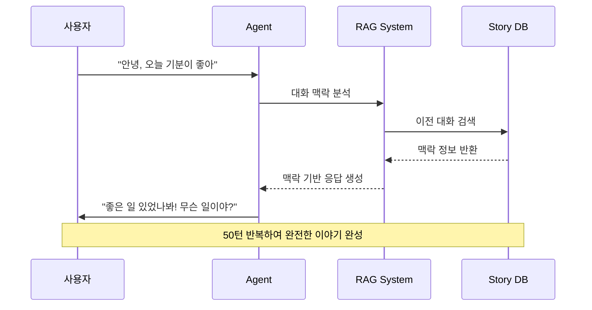

**핵심 기술 스택**

| 기술 | 역할 | 학습 방법 |
|------|------|----------|
| **ChatGPT API** | 대화 생성 엔진 | 완성 코드 분석 |
| **RAG (검색 증강 생성)** | 맥락 유지 시스템 | 동작 원리 이해 |
| **Vector DB** | 대화 기억 저장소 | 구조 파악 |
| **Streamlit** | 웹 인터페이스 | 제공된 코드 수정 |
| **Python** | 통합 구현 | 필요한 부분만 학습 |

**제한된 주제 안에서의 자유**

완전 자유 창작 ❌ → 주제는 정해져 있지만 **내용은 무한대**

```
주제 예시:
- "첫사랑 이야기"
- "진로 고민 상담"
- "판타지 모험"
- "SF 미래 세계"
- "일상 속 작은 기적"

→ 주제는 선택하지만, 대화 내용은 사용자마다 완전히 다름
```

**50턴 대화 = 하나의 완성된 이야기**

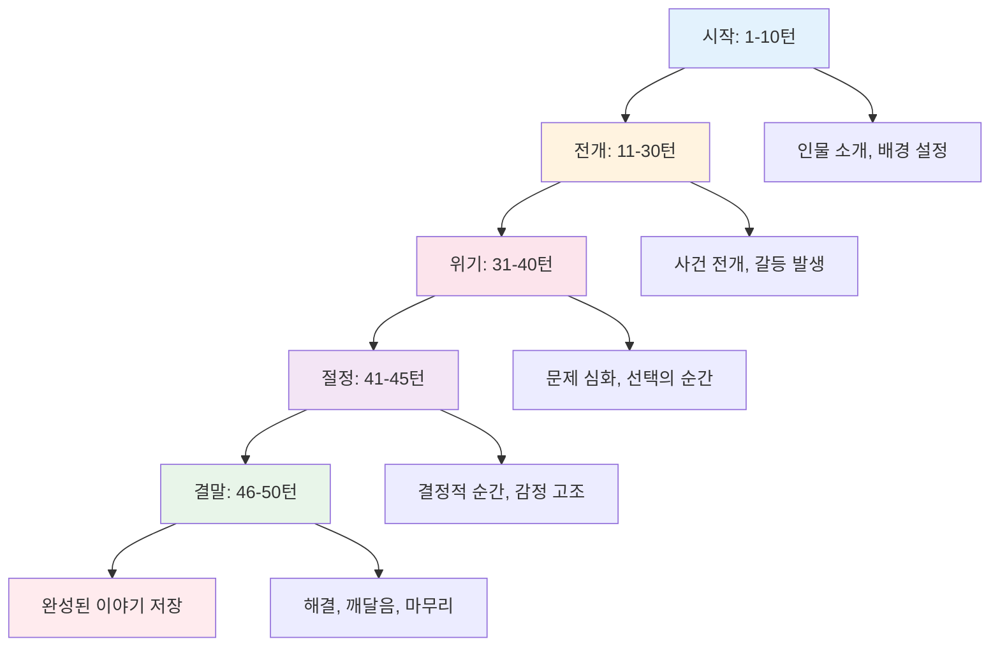

**주관식 vs 객관식 자동 전환**

```python
# Agent가 대화 맥락을 판단하여 자동 전환

if 대화_맥락_명확:
    응답_형식 = "주관식"  # 자유롭게 입력
    예시: "어떤 기분이었어?"
    
elif 대화_맥락_불명확 or 사용자_막힘:
    응답_형식 = "객관식"  # 선택지 제공
    예시: 
    1. 기뻤어
    2. 슬펐어
    3. 화났어
    4. 혼란스러웠어
```

**RAG 기반 맥락 유지**


---

## 🎯 학습 목표

### 지식 (Knowledge)

| 영역 | 학습 내용 |
|------|----------|
| **AI 원리** | - LLM 동작 방식<br>- RAG 시스템 구조<br>- Vector DB 개념 |
| **시스템 설계** | - Agent 아키텍처<br>- 대화 흐름 설계<br>- 상태 관리 |
| **역공부 방법론** | - 완성작 분석 기법<br>- 역설계 프로세스<br>- 점진적 이해 |

### 기능 (Skills)

| 영역 | 학습 내용 |
|------|----------|
| **코드 분석** | - Python 코드 읽기<br>- 함수 역할 파악<br>- 데이터 흐름 추적 |
| **API 활용** | - ChatGPT API 사용<br>- 프롬프트 엔지니어링<br>- 응답 처리 |
| **웹 구현** | - Streamlit 수정<br>- UI/UX 개선<br>- 배포 |

### 태도 (Attitude)

| 영역 | 학습 내용 |
|------|----------|
| **역공부 마인드** | - 완성작에서 배우기<br>- 두려움 없이 분해<br>- 점진적 이해 |
| **AI 시대 학습법** | - 효율적 학습<br>- 실용 중심<br>- 지속적 개선 |

---

## 📚 차시별 커리큘럼

---

## 1차시: 완성작 체험 & 역공부 시작

### 🎯 차시 목표
- 완성된 대화형 스토리 Agent 체험
- 역공부 방법론 이해
- 시스템 구조 파악

### 📖 수업 흐름 (50분)

#### 도입: 역공부란? (10분)

**교사 설명**

```
전통적 학습:
이론 공부 → 예제 → 실습 → 프로젝트
❌ 문제: 지루함, 동기부여 부족, "이게 왜 필요해?"

역공부:
완성작 체험 → "어떻게 만들었지?" → 분해 → 이해 → 재구성
✅ 장점: 즉각적 이해, 높은 동기, 실용적
```

**역공부 프로세스**

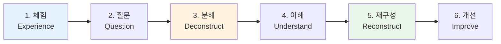

#### 전개 1: 완성작 체험 (15분)

**활동: 대화형 스토리 Agent 플레이**

**교사 시연 (5분)**

```
[화면 공유]
교사: "여러분, 이것이 오늘 우리가 만들 Agent입니다."

[Agent 실행]
Agent: "안녕! 나는 너의 이야기를 함께 만들어갈 친구야. 
        오늘 어떤 이야기를 만들고 싶어?"

교사: "첫사랑 이야기"

Agent: "좋아! 첫사랑 이야기구나. 
        그 사람을 처음 만난 순간을 떠올려봐. 
        어디서 만났어?"

교사: "고등학교 도서관에서..."

[대화 계속 진행 - 10턴 정도 시연]

교사: "보세요, Agent가 제 대답을 기억하고 
        맥락에 맞게 질문하죠?"
```

**학생 실습 (10분)**

```
활동 안내:
1. 제공된 Agent 웹사이트 접속
2. 주제 선택 (5가지 중 1개)
   - 첫사랑 이야기
   - 진로 고민
   - 판타지 모험
   - 미래 세계
   - 일상 속 기적
3. 10-15턴 대화 진행
4. 느낀 점 메모
```

**관찰 포인트 워크시트**

| 관찰 항목 | 내용 |
|----------|------|
| **Agent 반응** | 내 대답에 어떻게 반응했나? |
| **맥락 유지** | 이전 대화를 기억했나? |
| **질문 방식** | 어떤 질문을 했나? |
| **응답 형식** | 주관식? 객관식? |
| **흥미도** | 재미있었나? 왜? |

#### 전개 2: 시스템 구조 파악 (20분)

**활동: "어떻게 작동할까?" 추측하기**

**교사 질문**

```
Q1: Agent가 여러분의 이전 대화를 어떻게 기억할까?
Q2: 언제 주관식, 언제 객관식으로 물어볼까?
Q3: 50턴이 되면 자동으로 이야기가 완성될까?
Q4: 각자 다른 이야기가 만들어지는 원리는?
```

**학생 토론 (5분)**
- 2-3명씩 모둠
- 추측해서 답변 작성
- 모둠별 발표

**교사 공개: 실제 시스템 구조**


**각 구성 요소 설명**

| 구성 요소 | 역할 | 비유 |
|----------|------|------|
| **Streamlit 웹앱** | 사용자가 보는 화면 | 카페 창구 |
| **대화 관리자** | 전체 흐름 제어 | 카페 매니저 |
| **맥락 분석기** | 대화 맥락 파악 | 바리스타 (주문 이해) |
| **Vector DB** | 대화 기록 저장 | 주문 기록장 |
| **응답 생성기** | 다음 질문 만들기 | 레시피 제작 |
| **ChatGPT API** | 실제 응답 생성 | 커피 머신 |
| **Story DB** | 완성 이야기 저장 | 완성품 진열장 |

**핵심 원리: RAG (검색 증강 생성)**

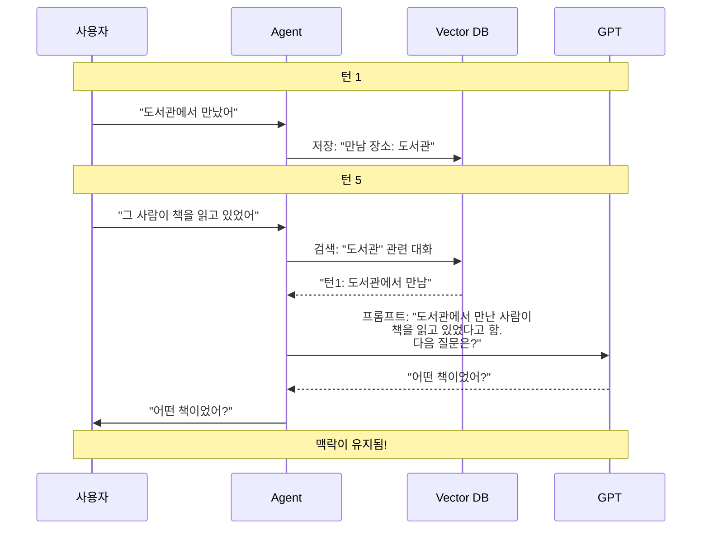

#### 정리: 학습 목표 설정 (5분)

**6차시 로드맵 공개**

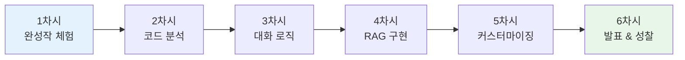

**학생 목표 설정**

```
워크시트: 나의 학습 목표

1. 이 Agent에서 가장 궁금한 부분:
   ________________________________

2. 내가 만들고 싶은 주제:
   ________________________________

3. 개선하고 싶은 기능:
   ________________________________

4. 6차시 후 나의 모습:
   ________________________________
```

### 📝 결과물
- [ ] Agent 체험 완료 (10-15턴)
- [ ] 시스템 구조 이해
- [ ] 관찰 포인트 워크시트 작성
- [ ] 학습 목표 설정

### 🏠 과제

```
1. Agent와 30턴 이상 대화하기
   - 다른 주제 선택해서 진행
   - 어떤 질문이 나오는지 기록
   - 맥락이 유지되는지 확인

2. 질문 3가지 준비:
   - 코드에 대해 궁금한 점
   - 개선하고 싶은 기능
   - 추가하고 싶은 주제
```

---

## 2차시: 코드 분석 & 구조 이해

### 🎯 차시 목표
- 제공된 소스 코드 구조 파악
- 각 파일의 역할 이해
- 핵심 함수 분석

### 📖 수업 흐름 (50분)

#### 도입: 과제 공유 (5분)

**학생 발표**
- 30턴 대화 경험 공유
- 발견한 흥미로운 패턴
- 궁금한 점 질문

#### 전개 1: 프로젝트 구조 파악 (15분)

**활동: 파일 탐험**

**프로젝트 구조 공개**

```
story-agent/
├── app.py                 # 메인 웹앱 (Streamlit)
├── agent/
│   ├── dialog_manager.py  # 대화 관리자
│   ├── context_analyzer.py # 맥락 분석기
│   └── response_generator.py # 응답 생성기
├── database/
│   ├── vector_db.py       # Vector DB 관리
│   └── story_db.py        # 완성 이야기 저장
├── prompts/
│   ├── system_prompt.py   # 시스템 프롬프트
│   └── templates.py       # 응답 템플릿
├── config/
│   └── settings.py        # 설정 파일
└── requirements.txt       # 필요한 패키지
```

**파일 역할 맵**

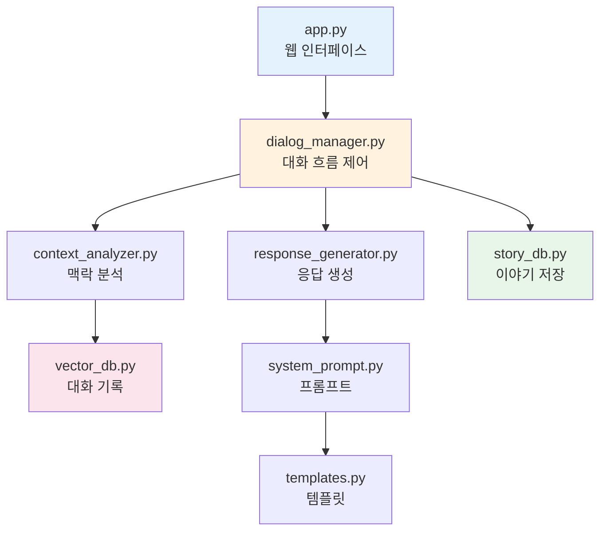

**학생 활동: 파일 열어보기**

```
미션:
1. VSCode에서 프로젝트 열기
2. 각 파일 간단히 훑어보기
3. 코드 줄 수 세기
4. 주석 찾아보기
```

**파일별 복잡도 분석**

| 파일 | 줄 수 | 난이도 | 역할 |
|------|-------|--------|------|
| app.py | ~100줄 | ⭐⭐☆☆☆ | 화면 구성 |
| dialog_manager.py | ~150줄 | ⭐⭐⭐☆☆ | 대화 제어 |
| context_analyzer.py | ~120줄 | ⭐⭐⭐⭐☆ | 맥락 분석 |
| response_generator.py | ~100줄 | ⭐⭐⭐☆☆ | 응답 생성 |
| vector_db.py | ~80줄 | ⭐⭐⭐⭐☆ | DB 관리 |
| story_db.py | ~60줄 | ⭐⭐☆☆☆ | 저장 |

#### 전개 2: 핵심 함수 분석 (25분)

**활동: 함수 역할 추적**

**1단계: app.py 분석 (5분)**

```python
# app.py - 핵심 부분만 발췌

import streamlit as st
from agent.dialog_manager import DialogManager

def main():
    st.title("💬 나만의 이야기 만들기")
    
    # 세션 초기화
    if 'manager' not in st.session_state:
        st.session_state.manager = DialogManager()
    
    # 사용자 입력
    user_input = st.text_input("당신의 이야기:")
    
    if user_input:
        # Agent 응답 생성
        response = st.session_state.manager.process(user_input)
        st.write(response)
```

**분석 워크시트**

| 코드 라인 | 역할 | 왜 필요한가? |
|----------|------|-------------|
| `import streamlit` | 웹 라이브러리 | 화면 만들기 |
| `st.title()` | 제목 표시 | 사용자에게 보여주기 |
| `DialogManager()` | 대화 관리자 생성 | 핵심 엔진 |
| `st.text_input()` | 입력창 | 사용자 입력 받기 |
| `.process()` | 입력 처리 | Agent 동작 |

**2단계: dialog_manager.py 분석 (10분)**

```python
# dialog_manager.py - 핵심 로직

class DialogManager:
    def __init__(self):
        self.context_analyzer = ContextAnalyzer()
        self.response_generator = ResponseGenerator()
        self.vector_db = VectorDB()
        self.turn_count = 0
        
    def process(self, user_input):
        # 1. 턴 증가
        self.turn_count += 1
        
        # 2. 대화 저장
        self.vector_db.save(user_input, self.turn_count)
        
        # 3. 맥락 분석
        context = self.context_analyzer.analyze(
            user_input, 
            self.turn_count
        )
        
        # 4. 응답 생성
        response = self.response_generator.generate(
            context,
            self.turn_count
        )
        
        # 5. 50턴 체크
        if self.turn_count >= 50:
            self.save_story()
            
        return response
```

**흐름도로 이해하기**

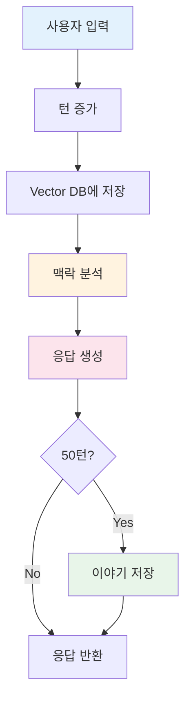

**학생 활동: 주석 달기**

```
미션:
1. dialog_manager.py 파일 열기
2. 각 줄에 한글 주석 달기
3. 이해 안 되는 부분 표시
4. 짝과 비교하기
```

**3단계: context_analyzer.py 분석 (10분)**

```python
# context_analyzer.py - RAG 핵심

class ContextAnalyzer:
    def __init__(self):
        self.vector_db = VectorDB()
        
    def analyze(self, user_input, turn_count):
        # 1. 이전 대화 검색 (RAG!)
        relevant_history = self.vector_db.search(
            query=user_input,
            top_k=5  # 가장 관련 있는 5개
        )
        
        # 2. 맥락 구성
        context = {
            'current_input': user_input,
            'turn': turn_count,
            'history': relevant_history,
            'clarity': self._check_clarity(user_input)
        }
        
        return context
    
    def _check_clarity(self, text):
        """대화 맥락이 명확한지 판단"""
        # 짧거나 모호하면 객관식 필요
        if len(text) < 5:
            return 'low'
        elif '모르겠' in text or '잘' in text:
            return 'low'
        else:
            return 'high'
```

**RAG 동작 원리 시각화**

```mermaid
graph LR
    subgraph "현재 입력"
        I[사용자: "그 사람이<br/>웃었어"]
    end
    
    subgraph "Vector DB 검색"
        V1[턴1: 도서관에서 만남]
        V2[턴3: 책 이야기]
        V3[턴5: 눈이 마주침]
        V4[턴7: 떨림]
        V5[턴9: 다가감]
    end
    
    subgraph "유사도 계산"
        S[가장 관련 있는<br/>대화 5개 선택]
    end
    
    subgraph "맥락 구성"
        C[종합 맥락:<br/>도서관에서 만나<br/>눈 마주치고<br/>다가갔더니<br/>웃음]
    end
    
    I --> S
    V1 --> S
    V2 --> S
    V3 --> S
    V4 --> S
    V5 --> S
    S --> C
    
    style I fill:#e3f2fd
    style S fill:#fff3e0
    style C fill:#e8f5e9
```

#### 정리: 핵심 개념 정리 (5분)

**3가지 핵심 개념**

| 개념 | 설명 | 코드 위치 |
|------|------|----------|
| **대화 관리** | 턴 제어, 흐름 관리 | dialog_manager.py |
| **RAG** | 이전 대화 검색하여 맥락 유지 | context_analyzer.py |
| **응답 생성** | GPT로 자연스러운 질문 만들기 | response_generator.py |

**이해도 체크**

```
퀴즈:
Q1: 사용자 입력이 들어오면 가장 먼저 하는 일은?
    A) 응답 생성  B) 턴 증가  C) 저장

Q2: RAG는 무엇을 검색하나?
    A) 인터넷  B) 이전 대화  C) 템플릿

Q3: 50턴이 되면 무슨 일이 일어나나?
    A) 종료  B) 이야기 저장  C) 초기화
```

### 📝 결과물
- [ ] 프로젝트 구조 이해
- [ ] 핵심 함수 분석 완료
- [ ] 주석 달기 완료
- [ ] 이해도 퀴즈 통과

### 🏠 과제

```
1. 코드 읽기 연습:
   - response_generator.py 전체 읽기
   - 각 함수에 한글 주석 달기
   - 이해 안 되는 부분 질문 준비

2. 개선 아이디어:
   - 코드에서 개선하고 싶은 부분 찾기
   - 어떻게 바꾸고 싶은지 작성
```

---

## 3차시: 대화 로직 이해 & 수정

### 🎯 차시 목표
- 대화 흐름 로직 완전 이해
- 주관식/객관식 전환 원리 파악
- 간단한 수정 실습

### 📖 수업 흐름 (50분)

#### 도입: 과제 공유 (5분)

**학생 발표**
- response_generator.py 분석 결과
- 이해 안 되는 부분 질문
- 개선 아이디어 공유

#### 전개 1: 대화 흐름 로직 (20분)

**활동: 턴별 전략 이해**

**50턴 전략 맵**

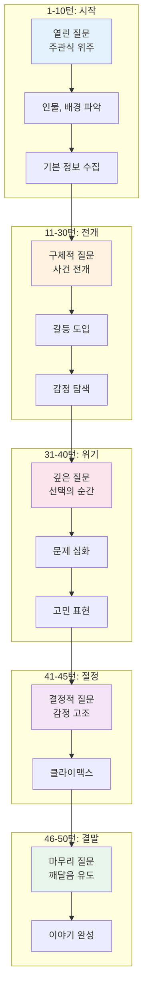

**코드로 보는 턴별 전략**

```python
# response_generator.py - 턴별 전략

def generate(self, context, turn_count):
    # 턴 구간 판단
    if turn_count <= 10:
        strategy = "opening"  # 시작
    elif turn_count <= 30:
        strategy = "development"  # 전개
    elif turn_count <= 40:
        strategy = "crisis"  # 위기
    elif turn_count <= 45:
        strategy = "climax"  # 절정
    else:
        strategy = "ending"  # 결말
    
    # 전략별 프롬프트
    prompt = self._build_prompt(strategy, context)
    
    # GPT 호출
    response = self._call_gpt(prompt)
    
    # 주관식/객관식 판단
    if context['clarity'] == 'low':
        response = self._add_choices(response)
    
    return response
```

**전략별 질문 예시**

| 턴 구간 | 전략 | 질문 예시 |
|---------|------|----------|
| **1-10턴** | 시작 | "어디서 만났어?"<br/>"첫인상이 어땠어?" |
| **11-30턴** | 전개 | "그 다음에 무슨 일이?"<br/>"어떤 대화를 나눴어?" |
| **31-40턴** | 위기 | "그때 어떤 선택을 했어?"<br/>"후회는 없었어?" |
| **41-45턴** | 절정 | "가장 중요한 순간이었어?"<br/>"어떤 감정이었어?" |
| **46-50턴** | 결말 | "그 경험이 너에게 뭘 남겼어?"<br/>"지금은 어때?" |

**학생 활동: 전략 분석**

```
미션:
1. 자신이 했던 대화 기록 보기
2. 각 턴이 어떤 전략이었는지 분류
3. 전략이 적절했는지 평가
4. 개선 아이디어 제시
```

#### 전개 2: 주관식/객관식 전환 로직 (15분)

**활동: 자동 전환 원리 파악**

**판단 기준 코드**

```python
# context_analyzer.py - 명확도 판단

def _check_clarity(self, text):
    """
    사용자 입력의 명확도 판단
    - high: 주관식 계속
    - low: 객관식 제공
    """
    
    # 1. 길이 체크
    if len(text) < 5:
        return 'low'  # 너무 짧음
    
    # 2. 모호한 표현 체크
    vague_words = ['모르겠', '잘', '그냥', '음', '어']
    if any(word in text for word in vague_words):
        return 'low'
    
    # 3. 질문으로 되물음
    if '?' in text:
        return 'low'
    
    # 4. 반복적 짧은 답변
    if self._is_repetitive(text):
        return 'low'
    
    return 'high'  # 명확함
```

**객관식 생성 로직**

```python
# response_generator.py - 선택지 추가

def _add_choices(self, response):
    """
    주관식 질문을 객관식으로 변환
    """
    
    # GPT에게 선택지 생성 요청
    prompt = f"""
    다음 질문에 대한 선택지 4개를 만들어줘:
    질문: {response}
    
    선택지는:
    - 구체적이고 다양해야 함
    - 정답이 없어야 함
    - 스토리 전개에 도움이 되어야 함
    """
    
    choices = self._call_gpt(prompt)
    
    # 형식 변환
    formatted = f"""
    {response}
    
    1. {choices[0]}
    2. {choices[1]}
    3. {choices[2]}
    4. {choices[3]}
    """
    
    return formatted
```

**전환 흐름도**

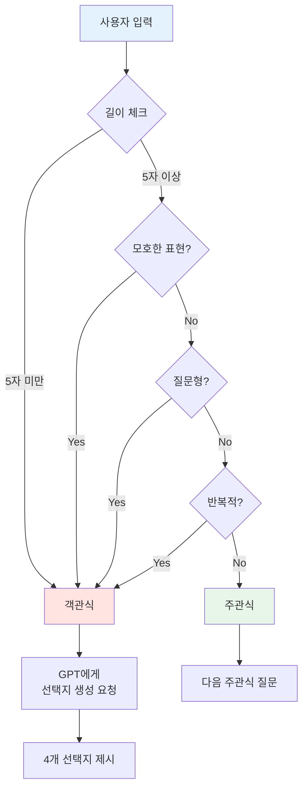

**학생 실습: 판단 로직 테스트**

```
워크시트: 명확도 판단 연습

다음 입력이 주관식/객관식 중 어떤 응답을 받을까?

1. "응..."
   → 예상: _______  이유: _______

2. "도서관에서 책을 읽고 있는 모습이 인상적이었어"
   → 예상: _______  이유: _______

3. "모르겠어"
   → 예상: _______  이유: _______

4. "그 순간 심장이 너무 빨리 뛰어서 말도 제대로 못했어"
   → 예상: _______  이유: _______
```

#### 전개 3: 코드 수정 실습 (10분)

**활동: 간단한 수정해보기**

**수정 1: 턴 구간 조정**

```python
# 원본 코드
if turn_count <= 10:
    strategy = "opening"
elif turn_count <= 30:
    strategy = "development"

# 수정 미션: 시작 구간을 15턴으로 늘리기
# 학생이 직접 수정
```

**수정 2: 모호한 표현 추가**

```python
# 원본 코드
vague_words = ['모르겠', '잘', '그냥', '음', '어']

# 수정 미션: 
# '아마', '대충' 추가하기
# 학생이 직접 수정
```

**수정 3: 선택지 개수 변경**

```python
# 원본 코드
# 선택지 4개

# 수정 미션:
# 선택지를 3개로 줄이기
# 학생이 직접 수정
```

**학생 활동**
1. VSCode에서 해당 파일 열기
2. 지정된 부분 찾기
3. 수정하기
4. 저장하고 실행해보기
5. 변화 확인

#### 정리: 핵심 정리 (10분)

**대화 로직 핵심 3가지**

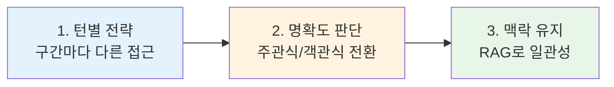

**이해도 체크 퀴즈**

```
Q1: 31-40턴은 어떤 전략인가?
    A) 시작  B) 위기  C) 결말

Q2: 사용자가 "음..."이라고 하면?
    A) 주관식  B) 객관식  C) 종료

Q3: 명확도를 판단하는 기준이 아닌 것은?
    A) 길이  B) 시간  C) 모호한 표현

정답: B, B, B
```

### 📝 결과물
- [ ] 턴별 전략 이해
- [ ] 주관식/객관식 전환 원리 파악
- [ ] 코드 수정 3가지 완료
- [ ] 수정 결과 테스트 완료

### 🏠 과제

```
1. 추가 수정 실습:
   - 자신만의 "모호한 표현" 5개 추가
   - 턴별 전략 구간 자신만의 방식으로 조정
   - 결과 비교 (수정 전 vs 후)

2. 개선 제안서 작성:
   - 현재 로직의 문제점 1가지
   - 개선 방법
   - 기대 효과
```

---

## 4차시: RAG 시스템 이해 & 구현

### 🎯 차시 목표
- RAG (검색 증강 생성) 원리 완전 이해
- Vector DB 동작 방식 파악
- 맥락 유지 메커니즘 구현

### 📖 수업 흐름 (50분)

#### 도입: RAG란? (10분)

**교사 설명**

**RAG 없이 대화하면?**

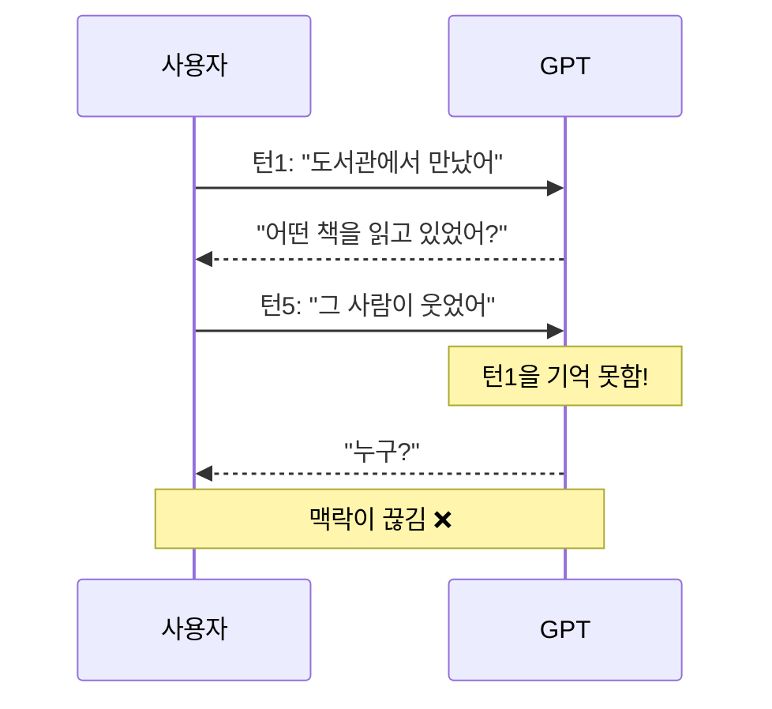

**RAG 있으면?**

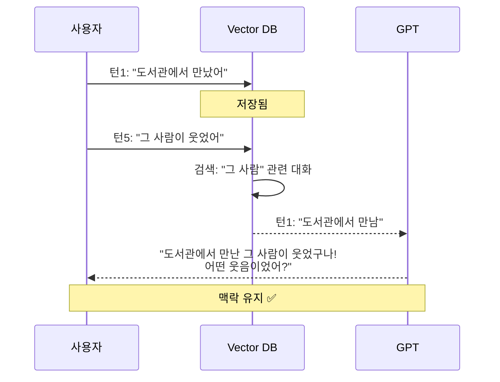

**RAG = Retrieval-Augmented Generation**

| 단어 | 의미 | 역할 |
|------|------|------|
| **Retrieval** | 검색 | 관련 정보 찾기 |
| **Augmented** | 증강 | 정보 추가 |
| **Generation** | 생성 | 응답 만들기 |

#### 전개 1: Vector DB 원리 (15분)

**활동: 벡터란 무엇인가?**

**텍스트를 숫자로 변환**

```python
# 예시: 간단한 벡터화

"도서관" → [0.8, 0.2, 0.1, 0.9, ...]  # 1536차원
"책"     → [0.7, 0.3, 0.2, 0.8, ...]
"운동장" → [0.1, 0.9, 0.8, 0.2, ...]

# 유사도 계산
similarity("도서관", "책") = 0.85  # 높음 (관련 있음)
similarity("도서관", "운동장") = 0.23  # 낮음 (관련 없음)
```

**시각화로 이해하기**

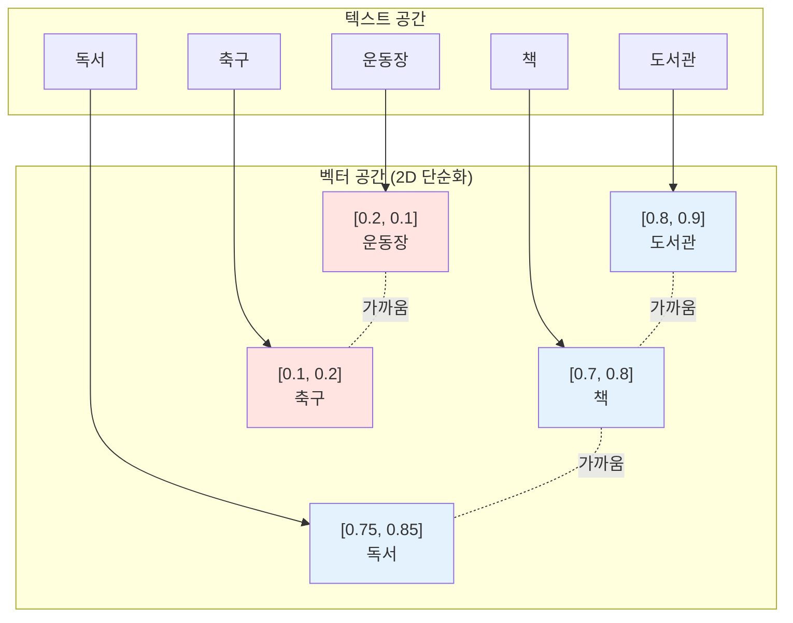

**Vector DB 코드 분석**

```python
# vector_db.py - 핵심 로직

import chromadb
from chromadb.utils import embedding_functions

class VectorDB:
    def __init__(self):
        # ChromaDB 초기화
        self.client = chromadb.Client()
        
        # 임베딩 함수 (텍스트 → 벡터)
        self.embedding_fn = embedding_functions.OpenAIEmbeddingFunction(
            api_key="YOUR_API_KEY"
        )
        
        # 컬렉션 생성
        self.collection = self.client.create_collection(
            name="story_history",
            embedding_function=self.embedding_fn
        )
    
    def save(self, text, turn):
        """대화 저장"""
        self.collection.add(
            documents=[text],
            metadatas=[{"turn": turn}],
            ids=[f"turn_{turn}"]
        )
    
    def search(self, query, top_k=5):
        """유사한 대화 검색"""
        results = self.collection.query(
            query_texts=[query],
            n_results=top_k
        )
        return results
```

**동작 과정 상세**

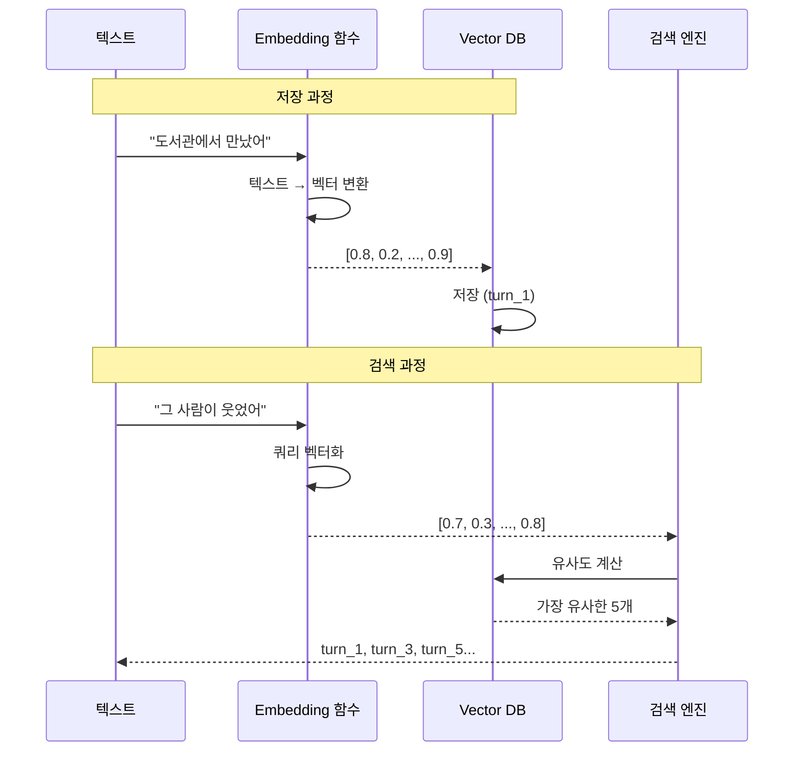

**학생 실습: Vector DB 테스트**

```python
# 실습 코드 (Jupyter Notebook)

# 1. Vector DB 생성
db = VectorDB()

# 2. 대화 저장
db.save("도서관에서 만났어", 1)
db.save("그 사람이 책을 읽고 있었어", 2)
db.save("눈이 마주쳤어", 3)
db.save("심장이 뛰었어", 4)
db.save("다가가서 말을 걸었어", 5)

# 3. 검색 테스트
results = db.search("그 사람", top_k=3)
print(results)

# 미션: 
# - 다른 쿼리로 검색해보기
# - 어떤 대화가 검색되는지 확인
# - 왜 그 대화가 검색되었는지 추측
```

#### 전개 2: 맥락 구성 메커니즘 (15분)

**활동: 검색 결과를 프롬프트로 변환**

**맥락 구성 코드**

```python
# context_analyzer.py - 맥락 구성

def analyze(self, user_input, turn_count):
    # 1. 유사한 대화 검색
    relevant_history = self.vector_db.search(
        query=user_input,
        top_k=5
    )
    
    # 2. 검색 결과 정리
    history_text = self._format_history(relevant_history)
    
    # 3. 맥락 딕셔너리 구성
    context = {
        'current_input': user_input,
        'turn': turn_count,
        'history_summary': history_text,
        'clarity': self._check_clarity(user_input)
    }
    
    return context

def _format_history(self, results):
    """검색 결과를 텍스트로 변환"""
    formatted = []
    
    for doc, metadata in zip(results['documents'], results['metadatas']):
        turn = metadata['turn']
        text = doc
        formatted.append(f"턴{turn}: {text}")
    
    return "\n".join(formatted)
```

**프롬프트 구성 예시**

```python
# response_generator.py - 프롬프트 빌드

def _build_prompt(self, strategy, context):
    """맥락을 포함한 프롬프트 생성"""
    
    prompt = f"""
당신은 사용자와 대화하며 이야기를 만드는 Agent입니다.

[이전 대화]
{context['history_summary']}

[현재 입력]
턴 {context['turn']}: {context['current_input']}

[전략]
{strategy} 단계입니다.

[임무]
- 이전 대화의 맥락을 유지하세요
- {strategy}에 맞는 질문을 하세요
- 자연스럽고 공감하는 톤으로 대화하세요
- 다음 질문을 생성하세요
"""
    
    return prompt
```

**맥락 유지 흐름**

```mermaid
graph TB
    A[사용자 입력<br/>"그 사람이 웃었어"] --> B[Vector DB 검색]
    
    B --> C1[턴1: 도서관에서 만남]
    B --> C2[턴3: 책 이야기]
    B --> C3[턴5: 눈 마주침]
    
    C1 --> D[맥락 구성]
    C2 --> D
    C3 --> D
    
    D --> E[프롬프트 생성<br/>---<br/>이전 대화:<br/>- 도서관에서 만남<br/>- 책 이야기<br/>- 눈 마주침<br/>---<br/>현재: 그 사람이 웃었어<br/>---<br/>다음 질문 생성]
    
    E --> F[GPT 호출]
    F --> G[응답:<br/>"도서관에서 만난<br/>그 사람이 웃었구나!<br/>어떤 웃음이었어?"]
    
    style A fill:#e3f2fd
    style D fill:#fff3e0
    style G fill:#e8f5e9
```

**학생 활동: 맥락 구성 실습**

```
워크시트: 맥락 구성 연습

주어진 대화:
턴1: "도서관에서 만났어"
턴2: "그 사람이 책을 읽고 있었어"
턴3: "눈이 마주쳤어"
턴4: "심장이 뛰었어"
턴5: "다가가서 말을 걸었어"

현재 입력: "그 사람이 웃으면서 대답했어"

미션:
1. 어떤 대화가 검색될까? (3개 선택)
   □ 턴1  □ 턴2  □ 턴3  □ 턴4  □ 턴5

2. 왜 그 대화들이 검색될까?

3. 이 맥락으로 어떤 질문을 할까?
```

#### 전개 3: RAG 파라미터 조정 (10분)

**활동: top_k 값 변경 실험**

**top_k란?**

```python
# top_k = 검색할 이전 대화 개수

results = db.search(query, top_k=3)  # 3개만
results = db.search(query, top_k=5)  # 5개
results = db.search(query, top_k=10) # 10개
```

**top_k 값에 따른 차이**

| top_k | 장점 | 단점 | 적합한 상황 |
|-------|------|------|------------|
| **3** | 빠름, 집중적 | 맥락 부족 가능 | 초반 턴 |
| **5** | 균형적 | - | 일반적 상황 |
| **10** | 풍부한 맥락 | 느림, 혼란 가능 | 후반 턴 |

**학생 실습: top_k 실험**

```python
# 실습: top_k 값 변경해보기

# 원본 코드
relevant_history = self.vector_db.search(
    query=user_input,
    top_k=5  # 기본값
)

# 미션 1: top_k=3으로 변경
# 미션 2: 대화해보고 차이 느끼기
# 미션 3: top_k=10으로 변경
# 미션 4: 어떤 값이 가장 좋은지 판단
```

**실험 결과 기록**

| top_k | 응답 품질 | 속도 | 맥락 유지 | 종합 평가 |
|-------|----------|------|----------|----------|
| 3 | | | | |
| 5 | | | | |
| 10 | | | | |

#### 정리: RAG 핵심 정리 (10분)

**RAG 3단계**

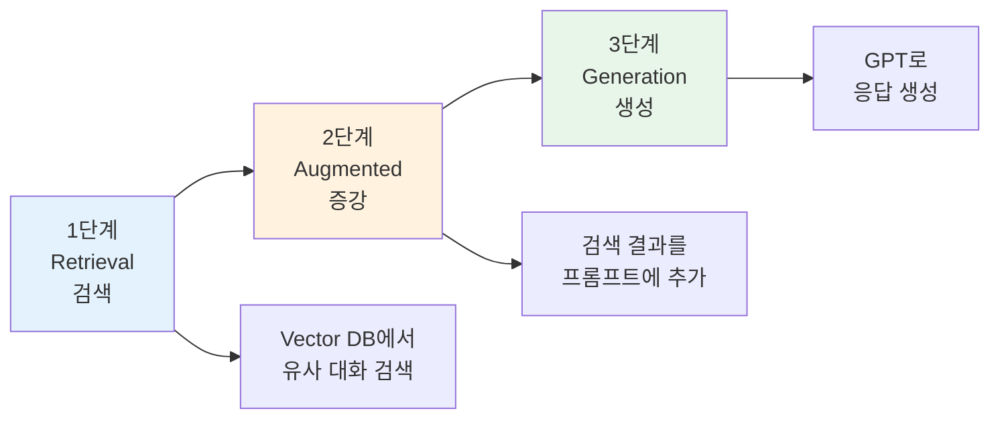

**핵심 개념 정리**

| 개념 | 설명 | 중요도 |
|------|------|--------|
| **Embedding** | 텍스트 → 벡터 변환 | ⭐⭐⭐⭐⭐ |
| **Vector DB** | 벡터 저장 & 검색 | ⭐⭐⭐⭐⭐ |
| **Similarity** | 유사도 계산 | ⭐⭐⭐⭐ |
| **top_k** | 검색 개수 조절 | ⭐⭐⭐ |

### 📝 결과물
- [ ] RAG 원리 이해
- [ ] Vector DB 동작 파악
- [ ] top_k 실험 완료
- [ ] 맥락 구성 실습 완료

### 🏠 과제

```
1. RAG 파라미터 최적화:
   - top_k 값을 3, 5, 7, 10으로 각각 테스트
   - 각 값에서 20턴씩 대화
   - 어떤 값이 가장 좋은지 보고서 작성

2. 개선 아이디어:
   - 턴 구간별로 top_k를 다르게 설정하면?
   - 초반(1-10턴): top_k=3
   - 중반(11-40턴): top_k=5
   - 후반(41-50턴): top_k=10
   - 코드로 구현해보기
```

---

## 5차시: 나만의 Agent 커스터마이징

### 🎯 차시 목표
- 제공된 Agent를 자신만의 버전으로 수정
- 주제 추가, 전략 변경, UI 개선
- 완전한 작동 확인

### 📖 수업 흐름 (50분)

#### 도입: 커스터마이징 계획 (5분)

**학생 발표**
- 과제 결과 (top_k 최적화)
- 오늘 수정하고 싶은 부분
- 목표 설정

#### 전개 1: 주제 추가하기 (15분)

**활동: 새로운 스토리 주제 만들기**

**기본 주제 구조**

```python
# config/settings.py - 주제 설정

STORY_THEMES = {
    "first_love": {
        "name": "첫사랑 이야기",
        "system_prompt": "사용자의 첫사랑 경험을 듣고 이야기로 만들어주세요.",
        "opening_question": "첫사랑을 처음 만난 순간을 떠올려봐. 어디서 만났어?",
        "keywords": ["만남", "감정", "기억", "순간"]
    },
    "career": {
        "name": "진로 고민",
        "system_prompt": "사용자의 진로 고민을 듣고 함께 탐색해주세요.",
        "opening_question": "어떤 진로를 고민하고 있어?",
        "keywords": ["꿈", "적성", "미래", "선택"]
    }
}
```

**학생 미션: 새 주제 추가**

```python
# 미션: 자신만의 주제 추가하기

STORY_THEMES["my_theme"] = {
    "name": "___________",  # 주제 이름
    "system_prompt": "___________",  # Agent 역할
    "opening_question": "___________",  # 첫 질문
    "keywords": ["___", "___", "___"]  # 핵심 키워드
}

# 예시 1: 우정 이야기
STORY_THEMES["friendship"] = {
    "name": "소중한 우정",
    "system_prompt": "사용자의 친구 이야기를 듣고 우정의 의미를 탐색해주세요.",
    "opening_question": "가장 기억에 남는 친구가 있어? 어떻게 친해졌어?",
    "keywords": ["친구", "추억", "신뢰", "함께"]
}

# 예시 2: 도전 이야기
STORY_THEMES["challenge"] = {
    "name": "나의 도전",
    "system_prompt": "사용자가 도전했던 경험을 듣고 성장 이야기로 만들어주세요.",
    "opening_question": "가장 어려웠던 도전이 뭐였어?",
    "keywords": ["도전", "극복", "성장", "배움"]
}
```

**주제별 전략 차별화**

```python
# prompts/templates.py - 주제별 템플릿

STRATEGY_TEMPLATES = {
    "first_love": {
        "opening": "감정과 순간에 집중",
        "development": "관계 발전 과정 탐색",
        "crisis": "어려움이나 이별",
        "climax": "가장 강렬한 순간",
        "ending": "그 경험의 의미"
    },
    "career": {
        "opening": "현재 상황 파악",
        "development": "적성과 흥미 탐색",
        "crisis": "고민과 갈등",
        "climax": "결정의 순간",
        "ending": "미래 계획"
    }
}
```

**학생 활동**
1. 자신만의 주제 1개 설계
2. 코드에 추가
3. 테스트 (10턴 대화)
4. 수정 및 개선

#### 전개 2: 전략 수정하기 (15분)

**활동: 턴별 전략 커스터마이징**

**기본 전략 수정**

```python
# agent/response_generator.py

# 원본
def _get_strategy(self, turn_count):
    if turn_count <= 10:
        return "opening"
    elif turn_count <= 30:
        return "development"
    # ...

# 커스터마이징 옵션들:

# 옵션 1: 빠른 전개 (액션 중심)
def _get_strategy_fast(self, turn_count):
    if turn_count <= 5:  # 시작 짧게
        return "opening"
    elif turn_count <= 20:  # 전개 빠르게
        return "development"
    elif turn_count <= 35:
        return "crisis"
    elif turn_count <= 45:
        return "climax"
    else:
        return "ending"

# 옵션 2: 느린 전개 (감정 중심)
def _get_strategy_slow(self, turn_count):
    if turn_count <= 15:  # 시작 길게
        return "opening"
    elif turn_count <= 35:  # 전개 천천히
        return "development"
    elif turn_count <= 42:
        return "crisis"
    elif turn_count <= 47:
        return "climax"
    else:
        return "ending"

# 옵션 3: 주제별 차별화
def _get_strategy_by_theme(self, turn_count, theme):
    if theme == "first_love":
        # 감정 중심 - 느리게
        return self._get_strategy_slow(turn_count)
    elif theme == "career":
        # 논리 중심 - 균형
        return self._get_strategy(turn_count)
    elif theme == "challenge":
        # 액션 중심 - 빠르게
        return self._get_strategy_fast(turn_count)
```

**전략 비교표**

| 전략 | 시작 | 전개 | 위기 | 절정 | 결말 | 특징 |
|------|------|------|------|------|------|------|
| **기본** | 1-10 | 11-30 | 31-40 | 41-45 | 46-50 | 균형적 |
| **빠름** | 1-5 | 6-20 | 21-35 | 36-45 | 46-50 | 액션 중심 |
| **느림** | 1-15 | 16-35 | 36-42 | 43-47 | 48-50 | 감정 중심 |

**학생 미션**

```
1. 자신의 주제에 맞는 전략 선택
2. 필요하면 커스텀 전략 만들기
3. 코드에 적용
4. 테스트 및 비교
```

#### 전개 3: UI 개선하기 (15분)

**활동: Streamlit UI 커스터마이징**

**기본 UI 구조**

```python
# app.py - 기본 UI

import streamlit as st

def main():
    st.title("💬 나만의 이야기 만들기")
    
    # 주제 선택
    theme = st.selectbox(
        "주제 선택",
        options=list(STORY_THEMES.keys())
    )
    
    # 대화 표시
    for msg in st.session_state.messages:
        st.chat_message(msg["role"]).write(msg["content"])
    
    # 입력
    user_input = st.chat_input("당신의 이야기:")
```

**커스터마이징 옵션**

**1. 진행도 표시**

```python
# 턴 진행도 바 추가

st.progress(turn_count / 50)
st.caption(f"진행: {turn_count}/50턴")
```

**2. 단계 표시**

```python
# 현재 단계 시각화

strategy = manager.get_current_strategy()
strategy_emoji = {
    "opening": "🌅 시작",
    "development": "📖 전개",
    "crisis": "⚡ 위기",
    "climax": "🔥 절정",
    "ending": "🌟 결말"
}

st.info(f"현재 단계: {strategy_emoji[strategy]}")
```

**3. 대화 히스토리 시각화**

```python
# 사이드바에 요약 표시

with st.sidebar:
    st.header("이야기 요약")
    
    # 주요 키워드 추출
    keywords = manager.get_keywords()
    for kw in keywords:
        st.badge(kw)
    
    # 턴별 감정 그래프
    emotions = manager.get_emotion_history()
    st.line_chart(emotions)
```

**4. 테마 색상**

```python
# 주제별 색상 테마

THEME_COLORS = {
    "first_love": "#FFB6C1",  # 핑크
    "career": "#87CEEB",      # 하늘색
    "friendship": "#FFD700",  # 금색
    "challenge": "#FF6347"    # 토마토색
}

st.markdown(f"""
<style>
    .stApp {{
        background-color: {THEME_COLORS[theme]};
    }}
</style>
""", unsafe_allow_html=True)
```

**5. 완성 이야기 다운로드**

```python
# 50턴 완료 시 다운로드 버튼

if turn_count >= 50:
    story_text = manager.get_full_story()
    
    st.success("🎉 이야기가 완성되었습니다!")
    
    st.download_button(
        label="📥 이야기 다운로드",
        data=story_text,
        file_name="my_story.txt",
        mime="text/plain"
    )
```

**학생 미션: UI 개선 3가지**

```
필수:
1. 진행도 표시 추가
2. 현재 단계 표시

선택 (1개 이상):
3. 테마 색상 변경
4. 사이드바 요약
5. 다운로드 기능
6. 자신만의 아이디어
```

#### 정리: 최종 테스트 (5분)

**통합 테스트 체크리스트**

| 항목 | 확인 |
|------|------|
| **새 주제 작동** | □ |
| **전략 적용** | □ |
| **UI 개선 반영** | □ |
| **50턴 완주** | □ |
| **이야기 저장** | □ |
| **오류 없음** | □ |

**짝 활동: 크로스 테스트**
- 옆 친구의 Agent 사용해보기
- 좋은 점, 개선점 피드백
- 서로 배우기

### 📝 결과물
- [ ] 새로운 주제 1개 추가
- [ ] 전략 커스터마이징
- [ ] UI 개선 3가지
- [ ] 통합 테스트 완료
- [ ] 크로스 테스트 피드백

### 🏠 과제

```
1. 최종 완성:
   - 모든 기능 통합
   - 버그 수정
   - 50턴 완주 테스트

2. 발표 준비:
   - 발표 자료 (PPT 또는 문서)
   - 시연 계획
   - 핵심 개선 사항 정리
   - 3분 발표 연습
```

---

## 6차시: 발표 & 역공부 성찰

### 🎯 차시 목표
- 완성된 Agent 발표 및 시연
- 역공부 경험 성찰
- AI 시대 학습법 내재화

### 📖 수업 흐름 (50분)

#### 도입: 역공부 여정 회고 (5분)

**교사 안내**

```mermaid
graph LR
    A[1차시<br/>완성작 체험] --> B[2차시<br/>코드 분석]
    B --> C[3차시<br/>로직 이해]
    C --> D[4차시<br/>RAG 구현]
    D --> E[5차시<br/>커스터마이징]
    E --> F[6차시<br/>완성!]
    
    style A fill:#e3f2fd
    style F fill:#e8f5e9
```

**학생 소감 (1분씩)**
- 가장 어려웠던 순간
- 가장 재미있었던 순간
- 가장 많이 배운 순간

#### 전개 1: Agent 발표 (30분)

**발표 구조 (1인당 3분)**

```
1. 주제 소개 (30초)
   - 어떤 주제를 추가했는지
   - 왜 이 주제를 선택했는지

2. 시연 (1분)
   - 실제 Agent 작동 보여주기
   - 10-15턴 대화 시연

3. 핵심 개선 사항 (1분)
   - 코드에서 수정한 부분
   - 전략 변경
   - UI 개선

4. 배운 점 (30초)
   - 역공부를 통해 배운 것
   - 가장 인상 깊었던 개념
```

**발표 예시**

```
[주제 소개]
"저는 '나의 도전' 주제를 추가했습니다.
고등학생들이 입시, 대회, 관계 등 다양한 도전을 하는데,
그 경험을 이야기로 남기면 의미있을 것 같았습니다."

[시연]
(화면 공유하며 Agent와 대화)
Agent: "가장 어려웠던 도전이 뭐였어?"
학생: "수학 경시대회 준비했을 때..."
(대화 계속)

[핵심 개선]
"1. 도전 주제에 맞게 '빠른 전개' 전략 적용
 2. 진행도 바와 단계 표시 UI 추가
 3. top_k를 턴별로 차별화 (초반 3, 후반 7)"

[배운 점]
"RAG 시스템이 어떻게 맥락을 유지하는지 이해했고,
완성된 코드를 분석하니 원리가 명확하게 보였습니다."
```

**청중 활동**

```
평가 시트:

발표자: ___________

1. 주제의 창의성: ⭐⭐⭐⭐⭐
2. 시연의 완성도: ⭐⭐⭐⭐⭐
3. 개선의 의미성: ⭐⭐⭐⭐⭐
4. 발표의 명확성: ⭐⭐⭐⭐⭐

좋았던 점:
_______________________________

질문:
_______________________________
```

**질의응답 (2분)**

```
예상 질문:
- "이 주제를 선택한 특별한 이유가 있나요?"
- "가장 어려웠던 부분은 무엇이었나요?"
- "RAG 시스템을 이해하는 데 얼마나 걸렸나요?"
- "다음에 추가하고 싶은 기능은?"
```

#### 전개 2: 베스트 Agent 선정 (5분)

**투표 카테고리**

| 카테고리 | 설명 |
|---------|------|
| 🎨 **가장 창의적인 주제** | 독창적이고 흥미로운 주제 |
| 🔧 **가장 기술적인 개선** | 코드 수정이 뛰어남 |
| 💎 **가장 완성도 높은 Agent** | 전체적으로 잘 작동 |
| 🎯 **가장 사용하고 싶은 Agent** | 실용적이고 매력적 |

**시상 및 축하**

#### 정리: 역공부 성찰 (10분)

**활동: 역공부 vs 전통 학습 비교**

**성찰 워크시트**

```
1. 역공부 경험

Q: 완성작을 먼저 체험한 것이 도움이 되었나요?
A: _________________________________

Q: 코드를 분석하며 이해하는 것이 어땠나요?
A: _________________________________

Q: 이론을 먼저 배우는 것과 어떤 차이가 있었나요?
A: _________________________________

2. AI 시대 학습법

Q: 앞으로 새로운 기술을 배울 때 어떻게 접근할 건가요?
A: _________________________________

Q: 역공부 방식을 다른 과목에도 적용할 수 있을까요?
A: _________________________________

3. 가장 중요한 배움

Q: 이 6차시에서 가장 중요하게 배운 것은?
A: _________________________________
```

**역공부의 힘**

```mermaid
graph TB
    subgraph "전통 학습"
        T1[이론 공부] --> T2[예제]
        T2 --> T3[실습]
        T3 --> T4[프로젝트]
        T4 --> T5[이해]
        
        T1 -.동기부여 낮음.- T2
        T2 -.지루함.- T3
    end
    
    subgraph "역공부"
        R1[완성작 체험] --> R2[흥미 발생]
        R2 --> R3[분석]
        R3 --> R4[이해]
        R4 --> R5[재구성]
        R5 --> R6[확장]
        
        R1 -.즉각적 동기.- R2
        R2 -.능동적 탐구.- R3
    end
    
    style T1 fill:#ffe4e1
    style R1 fill:#e8f5e9
    style R6 fill:#e3f2fd
```

**AI 시대의 학습 원칙**

| 원칙 | 설명 | 적용 |
|------|------|------|
| **1. 완성작부터** | 결과를 먼저 보고 역추적 | 역공부 |
| **2. 필요한 것만** | 모든 이론이 아닌 필요한 부분만 | 효율적 학습 |
| **3. 실용 중심** | 실제 작동하는 것 만들기 | 프로젝트 기반 |
| **4. AI 활용** | AI를 학습 파트너로 | ChatGPT 질문 |
| **5. 반복 개선** | 완벽보다 점진적 개선 | 지속적 수정 |

**학생 발표: 나의 학습 선언**

```
템플릿:

"앞으로 나는 _____________ 방식으로 배울 것입니다.

왜냐하면 _________________________________

이번 6차시를 통해 _______________________을(를) 배웠고,

이것을 ___________________에 적용할 것입니다."
```

**교사 마무리**

```
여러분은 6차시 동안:

✅ 완성된 Agent를 분해하고 이해했습니다
✅ RAG, Vector DB 등 최신 AI 기술을 경험했습니다
✅ 역공부 방식으로 효율적으로 학습했습니다
✅ 나만의 Agent를 만들어 냈습니다

이제 여러분은:
- 새로운 기술을 두려워하지 않습니다
- 완성작에서 배우는 방법을 압니다
- AI 시대에 맞는 학습법을 체득했습니다

이것이 진정한 AI 시대의 역량입니다! 🎉
```

### 📝 최종 결과물
- [ ] 완성된 대화형 스토리 Agent
- [ ] 발표 자료 및 시연
- [ ] 역공부 성찰 보고서
- [ ] 학습 선언문

---

## 📊 평가 기준

### 과정 평가 (60%)

| 영역 | 배점 | 평가 항목 |
|------|------|----------|
| **코드 이해** | 20% | - 시스템 구조 파악<br/>- 함수 역할 이해<br/>- RAG 원리 이해 |
| **분석 능력** | 20% | - 코드 분석 능력<br/>- 문제 발견 능력<br/>- 개선 방향 도출 |
| **구현 능력** | 20% | - 코드 수정 완성도<br/>- 새 기능 추가<br/>- 버그 수정 |

### 결과물 평가 (30%)

| 영역 | 배점 | 평가 항목 |
|------|------|----------|
| **완성도** | 15% | - Agent 작동 여부<br/>- 50턴 완주 가능<br/>- 오류 없음 |
| **창의성** | 15% | - 주제의 독창성<br/>- 개선의 의미성<br/>- UI 개선 |

### 발표 및 성찰 (10%)

| 영역 | 배점 | 평가 항목 |
|------|------|----------|
| **발표** | 5% | - 명확한 설명<br/>- 효과적인 시연 |
| **성찰** | 5% | - 역공부 이해<br/>- 학습 내재화 |

---

## 🎓 교사 가이드

### 수업 준비사항

**1. 기술 환경**

```
필수:
✅ Python 3.8 이상
✅ VSCode 또는 IDE
✅ Git (코드 배포용)
✅ ChatGPT API 키 (학생 수만큼)

권장:
✅ Jupyter Notebook (실습용)
✅ GitHub (코드 공유)
✅ Streamlit Cloud (배포)
```

**2. 소스 코드 준비**

```
story-agent/ (완성된 프로젝트)
├── README.md (설치 가이드)
├── requirements.txt
├── app.py
├── agent/
├── database/
├── prompts/
└── config/

→ GitHub에 업로드하여 학생들이 clone
```

**3. 환경 설정 가이드**

```bash
# 학생들이 따라할 설정 스크립트

# 1. 프로젝트 클론
git clone https://github.com/your-repo/story-agent.git
cd story-agent

# 2. 가상환경 생성
python -m venv venv
source venv/bin/activate  # Windows: venv\Scripts\activate

# 3. 패키지 설치
pip install -r requirements.txt

# 4. API 키 설정
cp .env.example .env
# .env 파일에 API 키 입력

# 5. 실행
streamlit run app.py
```

### 차시별 교사 팁

**1차시 팁**
- Agent 시연을 인상적으로 (학생들의 흥미 유발)
- 시스템 구조는 간단히 (너무 깊이 들어가지 말 것)
- "어떻게 만들었을까?" 호기심 자극
- 과제로 충분히 체험하게 하기

**2차시 팁**
- 코드가 많아 보여도 겁먹지 않게 안심시키기
- 전체를 다 이해할 필요 없음 강조
- 핵심 함수 위주로 설명
- 주석 달기 활동으로 능동적 참여

**3차시 팁**
- 대화 로직이 가장 이해하기 쉬운 부분
- 학생들이 직접 수정해보게 하기
- 수정 → 실행 → 확인 사이클 반복
- 작은 성공 경험 중요

**4차시 팁**
- RAG가 가장 어려운 개념
- 비유와 시각화 많이 사용
- Vector DB는 "기억 저장소" 정도로 단순화
- 원리보다 "어떻게 사용하는지"에 집중

**5차시 팁**
- 학생들의 창의성 최대한 존중
- 완벽하지 않아도 괜찮다는 분위기
- 서로의 아이디어 공유 장려
- 시간 부족 시 집에서 마무리 가능

**6차시 팁**
- 모든 학생 발표 기회 제공
- 긍정적 피드백 문화
- 역공부 성찰 시간 충분히
- 배움의 의미 내재화

### 학생 유형별 대응

**코딩 경험 있는 학생**
```
✅ 더 깊은 이해 유도 (임베딩 원리 등)
✅ 고급 기능 추가 도전 (감정 분석 등)
✅ 다른 학생 멘토 역할
✅ 오픈소스 기여 독려
```

**코딩 경험 없는 학생**
```
✅ 코드 읽기에 집중 (작성보다)
✅ 간단한 수정부터 시작
✅ UI 개선 위주로 참여
✅ 개념 이해에 더 시간 할애
```

**어려워하는 학생**
```
✅ 1:1 지도 시간 확보
✅ 페어 프로그래밍 활용
✅ 완성도보다 참여에 초점
✅ 작은 성취 칭찬
```

### 자주 발생하는 문제

**문제 1: 환경 설정 오류**
```
해결:
- 사전에 설정 스크립트 테스트
- 공통 오류 FAQ 문서 준비
- TA 또는 조교 배치
- Docker 이미지 제공 (선택)
```

**문제 2: API 키 관리**
```
해결:
- 학교에서 통합 API 키 발급
- 사용량 제한 설정
- 무료 티어 활용
- 대체 모델 준비 (로컬 LLM)
```

**문제 3: 코드 이해 어려움**
```
해결:
- 주석이 많은 버전 제공
- 단계별 설명 문서
- 영상 강의 보조 자료
- ChatGPT에게 질문하는 법 안내
```

**문제 4: 시간 부족**
```
해결:
- 핵심 부분만 수업에서
- 나머지는 과제로
- 온라인 자료 제공
- 7차시 추가 고려
```

---

## 💡 확장 활용

### 심화 프로젝트

**1. 멀티모달 Agent**
```
- 이미지 생성 추가 (DALL-E)
- 음성 대화 (Whisper + TTS)
- 영상 요약 (완성된 이야기 → 영상)
```

**2. 협업 스토리**
```
- 2명이 함께 이야기 만들기
- Agent가 중재자 역할
- 실시간 협업 기능
```

**3. 이야기 분석**
```
- 감정 분석 그래프
- 키워드 클라우드
- 스토리 구조 시각화
```

### 교과 연계

| 교과 | 연계 방법 |
|------|----------|
| **국어** | - 스토리텔링 구조<br/>- 서사 분석<br/>- 창작 실습 |
| **정보** | - AI 원리<br/>- 데이터베이스<br/>- 웹 개발 |
| **진로** | - AI 엔지니어<br/>- 프롬프트 엔지니어<br/>- 콘텐츠 크리에이터 |

### 대회 연계

```
✅ AI 활용 대회
✅ 소프트웨어 개발 대회
✅ 창의적 문제해결 대회
✅ 스토리텔링 대회
```

---

## 📚 참고 자료

### 학생용

**1. 기술 문서**
- LangChain 공식 문서
- Streamlit 튜토리얼
- ChromaDB 가이드

**2. 학습 자료**
- RAG 설명 영상
- Vector DB 개념
- 프롬프트 엔지니어링

### 교사용

**1. 교수법**
- 역공부(Reverse Learning) 논문
- 프로젝트 기반 학습(PBL)
- 구성주의 교육

**2. 기술 자료**
- LLM 파인튜닝
- RAG 최적화
- Agent 아키텍처

---

## 🎊 마무리

이 커리큘럼은 **역공부 방식**으로 AI 시대의 학습법을 체득하게 합니다.

### 핵심 가치

**1. 역공부 (Reverse Learning)**
- 완성작 → 분해 → 이해 → 재구성
- 높은 동기부여
- 효율적 학습

**2. 그림자 프로젝트**
- 완성된 소스 제공
- 제한된 틀 안에서 창의성
- 원리 이해 중심

**3. 실용적 결과물**
- 실제 작동하는 Agent
- 웹으로 배포 가능
- 포트폴리오 활용

**4. AI 시대 역량**
- 새로운 기술 학습법
- AI 활용 능력
- 문제 해결 능력

---

**제작**: AI메이커랩  
**버전**: 1.0  
**대상**: 고등학교 1-2학년 (디지털 중점)  
**방식**: 역공부 (Reverse Learning)  
**최종 수정**: 2026.02  

---

이 교육이 학생들에게 **AI 시대의 진정한 학습법**을 경험하게 하기를 바랍니다! 🚀✨
