# 6차시 중학생 앱인벤터 + PIC + ESP32 CAM 역공학 커리큘럼
## 스마트 보안 카메라 프로젝트 - 역공학으로 배우는 AI 메이커

---

## 🎯 프로젝트 개요

### 프로젝트 목표
완성된 **스마트 보안 카메라 시스템**을 분해하고 분석하며, 각 부품의 역할을 이해한 후 직접 조립하고 개선하는 역공학 방식의 학습

### 시스템 구조도

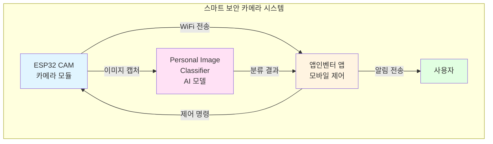

### 학습 흐름도

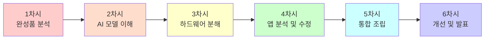

---

## 📊 커리큘럼 정보

### 과정 정보 표

| 항목 | 내용 |
|------|------|
| **수업 시간** | 6차시 (차시당 90분, 총 540분) |
| **수강 대상** | 중학교 1-3학년 |
| **수업 방식** | 프로젝트 기반 학습 (역공학) |
| **준비물** | ESP32 CAM, 노트북, 스마트폰, 완성품 키트 |
| **결과물** | 스마트 보안 카메라 시스템 + 개선 프로젝트 |

### 학습 목표 구조

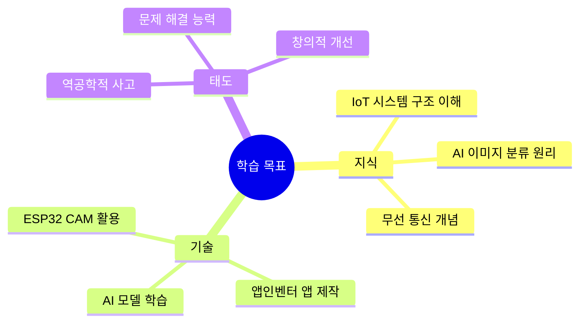

---

## 📚 차시별 커리큘럼

### 전체 커리큘럼 타임라인

```mermaid
gantt
    title 6차시 프로젝트 타임라인
    dateFormat X
    axisFormat %s차시
    
    section 분석 단계
    완성품 분석 및 테스트     :1, 0, 1
    AI 모델 이해 및 학습      :2, 1, 1
    
    section 분해 단계
    하드웨어 분해 및 이해     :3, 2, 1
    앱 분석 및 수정          :4, 3, 1
    
    section 조립 단계
    통합 조립 및 테스트      :5, 4, 1
    개선 및 발표            :6, 5, 1
```

---

## 1차시: 완성품 분석 및 시스템 이해 (역공학 시작)

### 🎯 차시 목표
- 완성된 스마트 보안 카메라 시스템 작동 원리 파악
- 각 구성 요소의 역할 이해
- 시스템 전체 흐름도 작성

### 📖 수업 흐름 (90분)

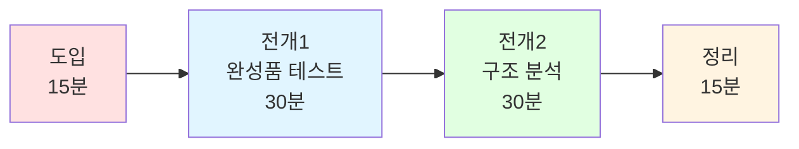

#### 도입 (15분)
**활동: 완성품 시연 및 질문 유도**

**교사 시연:**
```
1. 스마트 보안 카메라 작동 시연
   - 앱에서 카메라 실행
   - 사람 감지 시 알림 발송
   - 실시간 이미지 확인

2. 학생들에게 질문 던지기
   "어떻게 작동할까요?"
   "어떤 부품들이 필요할까요?"
   "앱은 어떻게 카메라와 통신할까요?"
```

**브레인스토밍:**
- 학생들이 예상하는 작동 원리 발표
- 필요한 기술 목록 작성
- 궁금한 점 정리

#### 전개 1: 완성품 테스트 (30분)
**활동: 조별로 완성품 테스트하기**

**테스트 체크리스트:**

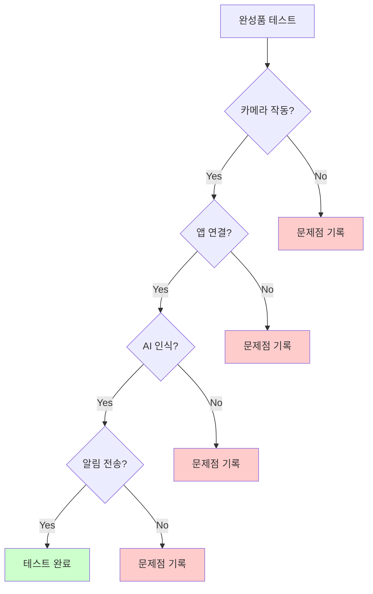

**테스트 워크시트:**

| 테스트 항목 | 예상 결과 | 실제 결과 | 관찰 내용 |
|------------|----------|----------|----------|
| 전원 연결 | LED 점등 |  |  |
| WiFi 연결 | 앱에서 연결 표시 |  |  |
| 카메라 촬영 | 이미지 전송 |  |  |
| AI 인식 | 사람/사물 분류 |  |  |
| 알림 전송 | 앱 알림 수신 |  |  |

**학생 활동:**
1. 4-5명씩 조 편성
2. 각 조에 완성품 키트 배부
3. 테스트 워크시트 작성
4. 작동 과정 동영상 촬영
5. 특이사항 기록

#### 전개 2: 구조 분석 (30분)
**활동: 시스템 구조도 그리기**

**교사 가이드:**
```
시스템을 3가지 레이어로 분석합니다:
1. 하드웨어 레이어 (ESP32 CAM)
2. AI 레이어 (Personal Image Classifier)
3. 앱 레이어 (앱인벤터)
```

**학생 활동: 구조도 작성**

학생들이 작성할 구조도 예시:

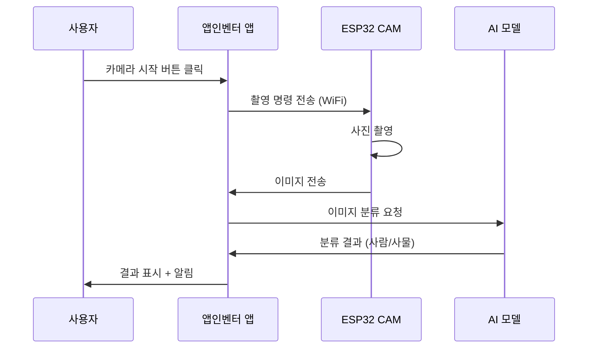

**구성 요소 분석표:**

| 구성 요소 | 역할 | 입력 | 출력 | 통신 방법 |
|----------|------|------|------|----------|
| ESP32 CAM | 카메라 촬영 | 촬영 명령 | 이미지 데이터 | WiFi |
| AI 모델 | 이미지 분류 | 이미지 | 분류 결과 | HTTP API |
| 앱인벤터 앱 | 제어 및 표시 | 사용자 입력 | 화면 표시 | WiFi/HTTP |

#### 정리 (15분)
**활동: 발견한 내용 공유**

**조별 발표:**
- 테스트 결과 공유 (2분/조)
- 작성한 구조도 발표
- 궁금한 점 질문

**교사 정리:**
```
오늘 우리는:
✅ 완성품이 어떻게 작동하는지 관찰했습니다
✅ 시스템을 3가지 레이어로 분석했습니다
✅ 각 부품의 역할을 파악했습니다

다음 시간에는:
→ AI 모델이 어떻게 이미지를 분류하는지 배웁니다
→ 직접 AI 모델을 학습시켜 봅니다
```

### 📝 결과물
- [ ] 완성품 테스트 워크시트
- [ ] 시스템 구조도
- [ ] 구성 요소 분석표
- [ ] 테스트 동영상

### 🏠 과제
```
집에서 관찰하기:
1. 집에 있는 스마트 기기 찾기 (예: 도어락, CCTV, 로봇청소기)
2. 어떤 센서를 사용하는지 관찰
3. 어떻게 통신하는지 추측
4. 사진 찍어오기
```

---

## 2차시: AI 모델 이해 및 학습 (Personal Image Classifier)

### 🎯 차시 목표
- Personal Image Classifier 작동 원리 이해
- 직접 AI 모델 학습시키기
- 학습된 모델 테스트 및 평가

### 📖 수업 흐름 (90분)

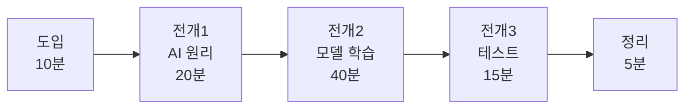

#### 도입 (10분)
**활동: 과제 공유 및 AI 소개**

**과제 발표:**
- 집에서 찾은 스마트 기기 공유
- 어떤 센서를 사용하는지 발표

**AI 이미지 분류 소개:**
```
Q: 컴퓨터는 어떻게 사진을 보고 사람인지 사물인지 구분할까요?

A: AI 모델 학습!
1. 많은 사진을 보여줍니다 (학습 데이터)
2. "이건 사람", "이건 사물" 라벨을 붙입니다
3. AI가 패턴을 학습합니다
4. 새로운 사진도 분류할 수 있게 됩니다
```

#### 전개 1: AI 원리 이해 (20분)
**활동: Personal Image Classifier 시연**

**AI 학습 과정 다이어그램:**

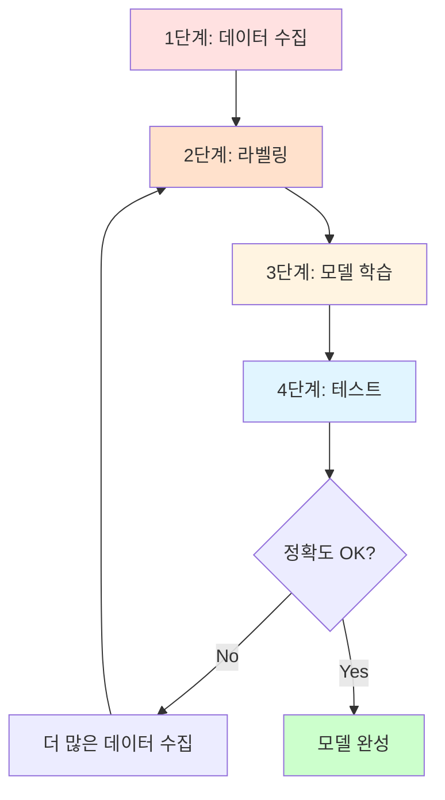

**교사 시연: Personal Image Classifier 사용법**

**단계별 시연:**

| 단계 | 작업 | 소요 시간 | 주의사항 |
|------|------|----------|----------|
| 1 | 웹사이트 접속 | 1분 | Chrome 브라우저 사용 |
| 2 | 클래스 생성 | 2분 | 명확한 이름 지정 |
| 3 | 이미지 수집 | 5분 | 다양한 각도 촬영 |
| 4 | 모델 학습 | 3분 | 학습 중 대기 |
| 5 | 테스트 | 2분 | 새로운 이미지로 테스트 |

**시연 예시:**
```
클래스 1: "사람_얼굴"
- 정면 사진 10장
- 측면 사진 10장
- 다양한 표정 10장
총 30장

클래스 2: "사물_컵"
- 다양한 컵 사진 30장
```

#### 전개 2: 모델 학습 실습 (40분)
**활동: 조별로 AI 모델 학습하기**

**실습 프로세스:**

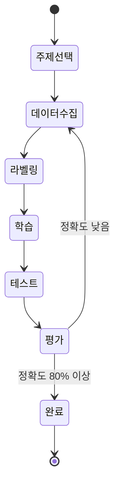

**학생 활동:**

**1단계: 주제 선택 (5분)**

주제 예시 표:

| 주제 | 클래스 1 | 클래스 2 | 난이도 |
|------|---------|---------|--------|
| 학용품 분류 | 연필 | 지우개 | ⭐ 쉬움 |
| 표정 인식 | 웃는 얼굴 | 찡그린 얼굴 | ⭐⭐ 보통 |
| 손동작 인식 | 가위 | 바위 | ⭐⭐ 보통 |
| 마스크 착용 | 마스크 착용 | 마스크 미착용 | ⭐⭐⭐ 어려움 |

**2단계: 데이터 수집 (15분)**

데이터 수집 가이드:

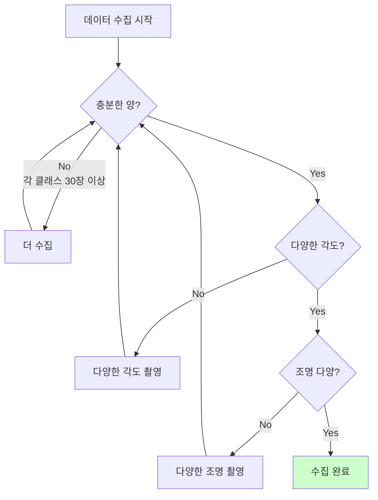

**데이터 수집 체크리스트:**

| 체크 항목 | 목표 | 완료 |
|----------|------|------|
| 클래스 1 이미지 수 | 30장 이상 | [ ] |
| 클래스 2 이미지 수 | 30장 이상 | [ ] |
| 다양한 각도 | 최소 3가지 | [ ] |
| 다양한 조명 | 밝음/어두움 | [ ] |
| 다양한 배경 | 최소 2가지 | [ ] |

**3단계: 모델 학습 (10분)**

```
Personal Image Classifier에서:
1. "Train Model" 버튼 클릭
2. 학습 진행 상황 관찰 (약 3-5분)
3. 학습 완료 대기
```

**4단계: 모델 테스트 (10분)**

테스트 결과 기록표:

| 테스트 번호 | 실제 클래스 | AI 예측 | 정확도(%) | 비고 |
|------------|------------|---------|----------|------|
| 1 | 클래스 1 |  |  |  |
| 2 | 클래스 1 |  |  |  |
| 3 | 클래스 1 |  |  |  |
| 4 | 클래스 2 |  |  |  |
| 5 | 클래스 2 |  |  |  |
| 6 | 클래스 2 |  |  |  |
| **평균 정확도** |  |  |  |  |

#### 전개 3: 모델 평가 및 개선 (15분)
**활동: 모델 성능 분석**

**성능 분석 다이어그램:**

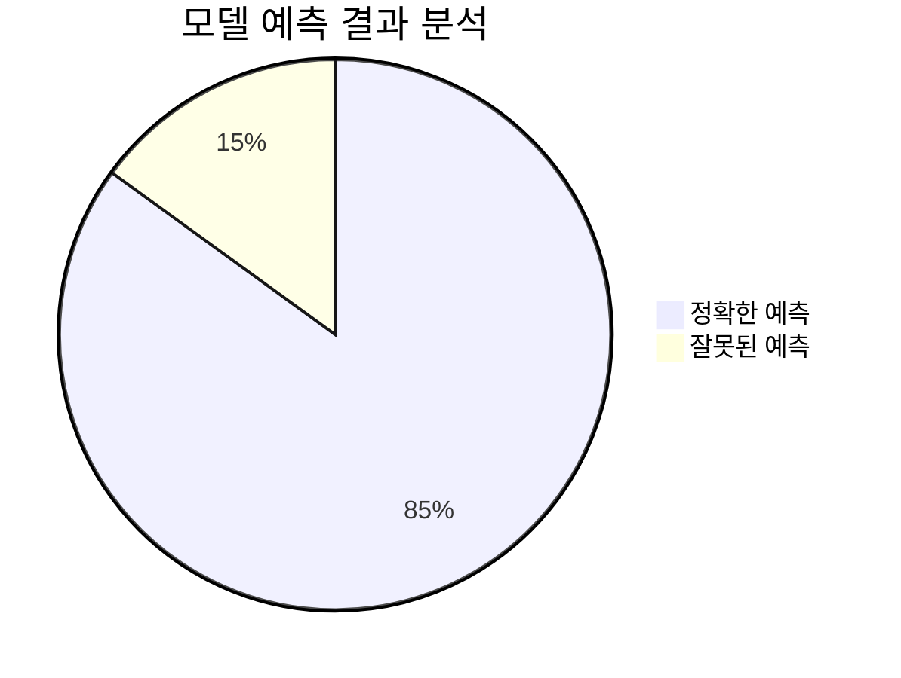

**개선 방법 토론:**

| 문제 상황 | 원인 분석 | 개선 방법 |
|----------|----------|----------|
| 정확도 낮음 (60% 이하) | 데이터 부족 | 이미지 30장 더 추가 |
| 특정 각도만 인식 | 각도 다양성 부족 | 다양한 각도 촬영 |
| 어두운 곳에서 인식 실패 | 조명 다양성 부족 | 다양한 조명 환경 촬영 |
| 비슷한 사물 혼동 | 특징 불명확 | 더 명확한 대상 선택 |

#### 정리 (5분)
**활동: 학습 내용 정리**

**AI 학습 프로세스 요약:**

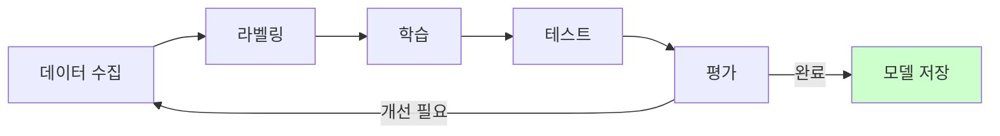

**교사 정리:**
```
오늘 우리는:
✅ AI가 이미지를 분류하는 원리를 배웠습니다
✅ 직접 AI 모델을 학습시켰습니다
✅ 모델의 정확도를 평가하고 개선했습니다

다음 시간에는:
→ ESP32 CAM 하드웨어를 분해하고 이해합니다
→ 각 부품의 역할을 파악합니다
```

### 📝 결과물
- [ ] 학습된 AI 모델
- [ ] 데이터 수집 기록
- [ ] 테스트 결과 기록표
- [ ] 모델 성능 분석 보고서

### 🏠 과제
```
AI 모델 개선하기:
1. 집에서 추가 이미지 30장 더 촬영
2. 다양한 환경에서 촬영 (밝음/어두움/실외/실내)
3. 모델 재학습
4. 정확도 비교 (이전 vs 개선 후)
```

---

## 3차시: 하드웨어 분해 및 이해 (ESP32 CAM)

### 🎯 차시 목표
- ESP32 CAM 하드웨어 구조 이해
- 각 부품의 역할 파악
- 회로 연결 원리 학습

### 📖 수업 흐름 (90분)

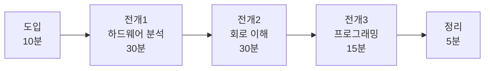

#### 도입 (10분)
**활동: 과제 공유 및 하드웨어 소개**

**과제 발표:**
- 개선한 AI 모델 정확도 비교
- 어떤 방법으로 개선했는지 공유

**ESP32 CAM 소개:**

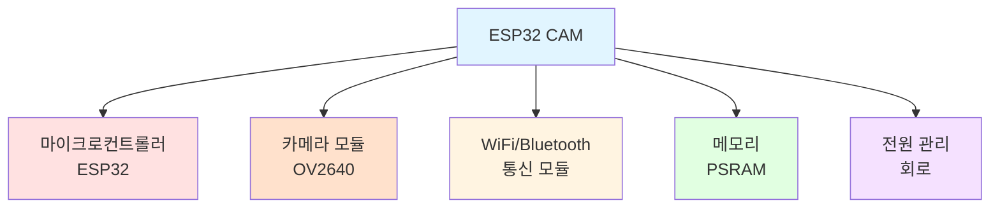

#### 전개 1: 하드웨어 분석 (30분)
**활동: ESP32 CAM 부품 관찰 및 분석**

**ESP32 CAM 구조 분석표:**

| 부품 | 위치 | 역할 | 사양 |
|------|------|------|------|
| ESP32 칩 | 중앙 | 메인 프로세서 | 240MHz, WiFi/BT |
| OV2640 카메라 | 상단 | 이미지 촬영 | 2MP, UXGA |
| PSRAM | ESP32 옆 | 메모리 확장 | 4MB |
| WiFi 안테나 | 우측 | 무선 통신 | 2.4GHz |
| LED | 카메라 옆 | 상태 표시 | 적색 |
| 전원 핀 | 하단 | 전원 공급 | 5V/3.3V |

**학생 활동: 부품 찾기 게임**

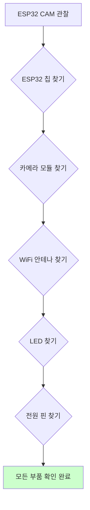

**부품 관찰 워크시트:**

| 부품 이름 | 찾았나요? | 크기 (mm) | 색상 | 특징 |
|----------|----------|----------|------|------|
| ESP32 칩 | [ ] |  |  |  |
| 카메라 모듈 | [ ] |  |  |  |
| PSRAM | [ ] |  |  |  |
| WiFi 안테나 | [ ] |  |  |  |
| LED | [ ] |  |  |  |

#### 전개 2: 회로 연결 이해 (30분)
**활동: 핀 배치 및 연결 학습**

**ESP32 CAM 핀 다이어그램:**

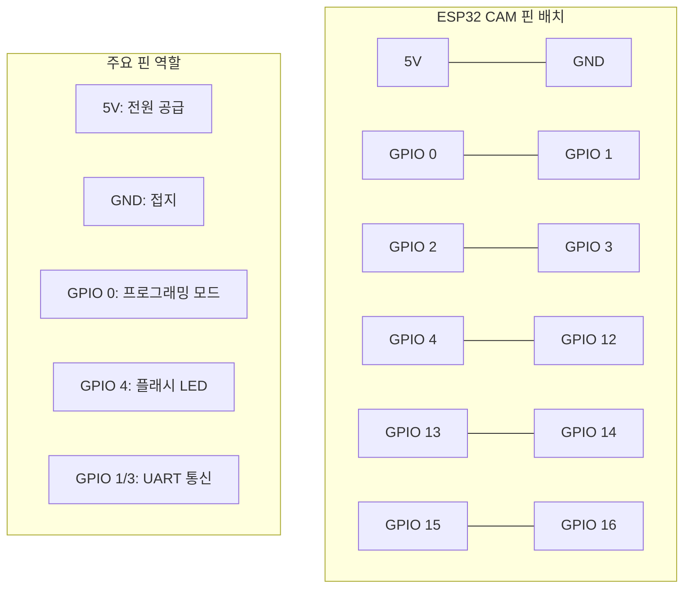

**회로 연결 실습:**

**FTDI 프로그래머 연결 방법:**

| ESP32 CAM 핀 | FTDI 핀 | 용도 |
|-------------|---------|------|
| 5V | VCC | 전원 공급 |
| GND | GND | 접지 |
| U0R (GPIO 3) | TX | 데이터 송신 |
| U0T (GPIO 1) | RX | 데이터 수신 |
| GPIO 0 | GND | 프로그래밍 모드 |

**연결 순서 다이어그램:**

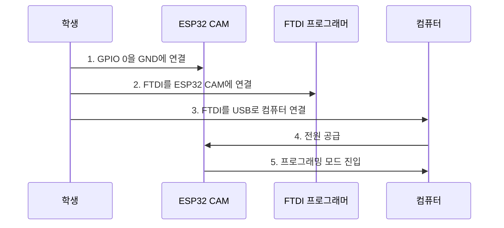

**안전 주의사항:**

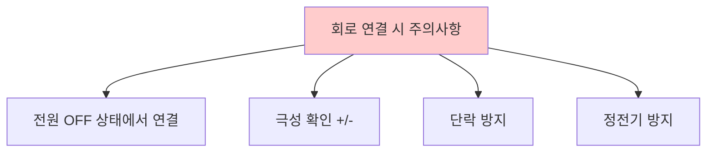

#### 전개 3: 기본 프로그래밍 (15분)
**활동: ESP32 CAM 펌웨어 업로드**

**프로그래밍 프로세스:**

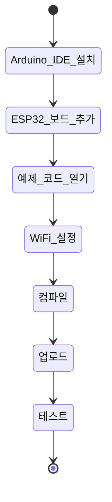

**WiFi 설정 코드 예시:**

```cpp
// WiFi 설정
const char* ssid = "교실_WiFi_이름";
const char* password = "WiFi_비밀번호";

// 카메라 설정
void setup() {
  Serial.begin(115200);
  
  // WiFi 연결
  WiFi.begin(ssid, password);
  while (WiFi.status() != WL_CONNECTED) {
    delay(500);
    Serial.print(".");
  }
  Serial.println("WiFi 연결 완료!");
  
  // 카메라 초기화
  camera_config_t config;
  config.ledc_channel = LEDC_CHANNEL_0;
  config.ledc_timer = LEDC_TIMER_0;
  config.pin_d0 = Y2_GPIO_NUM;
  // ... 추가 설정
  
  // 카메라 시작
  esp_camera_init(&config);
}
```

**업로드 체크리스트:**

| 단계 | 작업 | 확인 |
|------|------|------|
| 1 | Arduino IDE 설치 | [ ] |
| 2 | ESP32 보드 추가 | [ ] |
| 3 | 포트 선택 | [ ] |
| 4 | WiFi 정보 입력 | [ ] |
| 5 | 컴파일 성공 | [ ] |
| 6 | 업로드 성공 | [ ] |
| 7 | 시리얼 모니터 확인 | [ ] |

#### 정리 (5분)
**활동: 학습 내용 정리**

**하드웨어 이해도 점검:**

```mermaid
graph LR
    A[ESP32 CAM 이해] --> B[부품 역할 파악]
    B --> C[회로 연결 이해]
    C --> D[프로그래밍 기초]
    D --> E[다음 단계 준비]
    
    style E fill:#ccffcc
```

### 📝 결과물
- [ ] 부품 관찰 워크시트
- [ ] 회로 연결 사진
- [ ] 업로드 성공 스크린샷
- [ ] 시리얼 모니터 로그

### 🏠 과제
```
ESP32 CAM 추가 실습:
1. LED 깜빡이기 코드 작성
2. 다른 WiFi에 연결해보기
3. 시리얼 모니터로 메시지 출력
4. 결과 스크린샷 찍어오기
```

---

## 4차시: 앱인벤터 앱 분석 및 수정

### 🎯 차시 목표
- 앱인벤터 앱 구조 이해
- 블록 코딩 원리 파악
- 앱 기능 수정 및 개선

### 📖 수업 흐름 (90분)

```mermaid
graph LR
    A[도입<br/>10분] --> B[전개1<br/>앱 분석<br/>25분]
    B --> C[전개2<br/>블록 이해<br/>30분]
    C --> D[전개3<br/>앱 수정<br/>20분]
    D --> E[정리<br/>5분]
```

#### 도입 (10분)
**활동: 앱인벤터 소개**

**앱인벤터 구조:**

```mermaid
graph TB
    A[앱인벤터] --> B[디자이너<br/>Designer]
    A --> C[블록 에디터<br/>Blocks]
    
    B --> D[화면 레이아웃]
    B --> E[컴포넌트 배치]
    
    C --> F[이벤트 처리]
    C --> G[로직 구현]
    
    style A fill:#e1f5ff
    style B fill:#ffe1e1
    style C fill:#e1ffe1
```

#### 전개 1: 앱 구조 분석 (25분)
**활동: 완성된 앱 분해 분석**

**앱 화면 구조:**

```mermaid
graph TD
    A[메인 화면] --> B[상단: 제목 바]
    A --> C[중앙: 카메라 뷰]
    A --> D[하단: 제어 버튼]
    
    B --> B1[앱 제목]
    B --> B2[설정 버튼]
    
    C --> C1[실시간 이미지]
    C --> C2[AI 분류 결과]
    
    D --> D1[촬영 버튼]
    D --> D2[연결 버튼]
    D --> D3[설정 버튼]
    
    style A fill:#e1f5ff
```

**컴포넌트 분석표:**

| 컴포넌트 | 타입 | 역할 | 속성 |
|----------|------|------|------|
| TitleLabel | Label | 앱 제목 표시 | Text: "스마트 보안 카메라" |
| CameraImage | Image | 카메라 이미지 표시 | Width: Fill, Height: 300px |
| ResultLabel | Label | AI 분류 결과 표시 | Text: "", FontSize: 20 |
| CaptureButton | Button | 촬영 버튼 | Text: "촬영", BackgroundColor: Blue |
| ConnectButton | Button | WiFi 연결 버튼 | Text: "연결", BackgroundColor: Green |
| WebViewer | WebViewer | ESP32 통신 | Visible: False |
| PersonalImageClassifier | Extension | AI 분류 | Model: trained_model |

#### 전개 2: 블록 코딩 이해 (30분)
**활동: 주요 블록 분석**

**앱 로직 흐름도:**

```mermaid
flowchart TD
    A[앱 시작] --> B[WiFi 연결 확인]
    B --> C{연결됨?}
    C -->|No| D[연결 버튼 활성화]
    C -->|Yes| E[카메라 준비]
    
    D --> F[사용자가 연결 버튼 클릭]
    F --> G[ESP32 IP 입력]
    G --> H[연결 시도]
    H --> I{성공?}
    I -->|No| J[오류 메시지]
    I -->|Yes| E
    
    E --> K[촬영 버튼 대기]
    K --> L[사용자가 촬영 버튼 클릭]
    L --> M[ESP32에 촬영 명령]
    M --> N[이미지 수신]
    N --> O[AI 분류 실행]
    O --> P[결과 표시]
    P --> Q{사람 감지?}
    Q -->|Yes| R[알림 전송]
    Q -->|No| K
    
    style R fill:#ffcccc
```

**주요 블록 코드 분석:**

**1. WiFi 연결 블록:**

```mermaid
graph LR
    A[ConnectButton.Click] --> B[WebViewer.GoToUrl]
    B --> C["http://ESP32_IP/"]
    C --> D[연결 상태 확인]
    D --> E{성공?}
    E -->|Yes| F[ResultLabel.Text = 연결됨]
    E -->|No| G[ResultLabel.Text = 실패]
    
    style F fill:#ccffcc
    style G fill:#ffcccc
```

**2. 이미지 촬영 블록:**

```mermaid
graph LR
    A[CaptureButton.Click] --> B[WebViewer.GoToUrl]
    B --> C["http://ESP32_IP/capture"]
    C --> D[이미지 다운로드]
    D --> E[CameraImage.Picture = 이미지]
    E --> F[AI 분류 호출]
```

**3. AI 분류 블록:**

```mermaid
graph LR
    A[이미지 수신] --> B[PersonalImageClassifier.ClassifyImage]
    B --> C[분류 결과 대기]
    C --> D[결과 수신]
    D --> E{사람?}
    E -->|Yes| F[ResultLabel.Text = 사람 감지]
    E -->|No| G[ResultLabel.Text = 사물]
    F --> H[Notifier.ShowAlert]
    
    style F fill:#ffcccc
    style H fill:#ffcccc
```

**블록 코드 예시 (의사 코드):**

```
when ConnectButton.Click do
  set WebViewer.Url to join("http://", ESP32_IP_TextBox.Text, "/")
  if WebViewer.PageLoaded then
    set ResultLabel.Text to "연결 성공"
    set ConnectButton.Enabled to false
  else
    set ResultLabel.Text to "연결 실패"
  end if
end

when CaptureButton.Click do
  set WebViewer.Url to join("http://", ESP32_IP_TextBox.Text, "/capture")
  call WebViewer.GoToUrl
end

when WebViewer.PageLoaded do
  if contains(WebViewer.CurrentUrl, "capture") then
    set CameraImage.Picture to WebViewer.CurrentPageTitle
    call PersonalImageClassifier.ClassifyImage(CameraImage.Picture)
  end if
end

when PersonalImageClassifier.GotClassification(result, confidence) do
  set ResultLabel.Text to join("결과: ", result, " (", confidence, "%)")
  if result = "사람" then
    call Notifier.ShowAlert("사람이 감지되었습니다!")
  end if
end
```

#### 전개 3: 앱 수정 실습 (20분)
**활동: 앱 기능 개선하기**

**개선 아이디어 브레인스토밍:**

```mermaid
mindmap
  root((앱 개선))
    UI 개선
      색상 변경
      버튼 크기 조정
      아이콘 추가
    기능 추가
      사진 저장
      히스토리 보기
      설정 메뉴
    알림 개선
      소리 추가
      진동 추가
      메시지 커스터마이징
```

**학생 활동: 개선 실습**

**개선 과제 선택표:**

| 난이도 | 개선 과제 | 예상 시간 | 학습 목표 |
|--------|----------|----------|----------|
| ⭐ 쉬움 | 버튼 색상 변경 | 5분 | 디자이너 사용법 |
| ⭐ 쉬움 | 제목 텍스트 변경 | 5분 | 속성 수정 |
| ⭐⭐ 보통 | 알림 소리 추가 | 10분 | 사운드 컴포넌트 |
| ⭐⭐ 보통 | 사진 저장 기능 | 15분 | 파일 저장 블록 |
| ⭐⭐⭐ 어려움 | 히스토리 기능 | 20분 | 리스트 관리 |

**개선 예시 1: 알림 소리 추가**

```mermaid
graph LR
    A[사람 감지] --> B[알림 메시지]
    B --> C[Sound.Play]
    C --> D[alarm.mp3 재생]
    
    style C fill:#ffe1e1
```

**개선 예시 2: 사진 저장 기능**

```mermaid
graph LR
    A[이미지 수신] --> B[SaveButton.Click]
    B --> C[File.SaveFile]
    C --> D[이미지를 파일로 저장]
    D --> E[저장 완료 메시지]
    
    style C fill:#e1f5ff
```

#### 정리 (5분)
**활동: 개선 결과 공유**

**조별 발표:**
- 어떤 기능을 개선했는지
- 어떤 블록을 사용했는지
- 어려웠던 점

### 📝 결과물
- [ ] 앱 구조 분석 문서
- [ ] 블록 코드 스크린샷
- [ ] 개선된 앱 (.aia 파일)
- [ ] 개선 내용 보고서

### 🏠 과제
```
앱 추가 개선:
1. 선택한 개선 과제 완성하기
2. 추가로 2가지 기능 더 개선
3. 앱 테스트 동영상 촬영
4. 개선 전후 비교 문서 작성
```

---

## 5차시: 시스템 통합 조립 및 테스트

### 🎯 차시 목표
- ESP32 CAM + AI 모델 + 앱 통합
- 전체 시스템 작동 테스트
- 문제 해결 및 디버깅

### 📖 수업 흐름 (90분)

```mermaid
graph LR
    A[도입<br/>10분] --> B[전개1<br/>하드웨어 조립<br/>20분]
    B --> C[전개2<br/>소프트웨어 통합<br/>30분]
    C --> D[전개3<br/>테스트<br/>25분]
    D --> E[정리<br/>5분]
```

#### 도입 (10분)
**활동: 통합 계획 수립**

**시스템 통합 체크리스트:**

```mermaid
graph TD
    A[시스템 통합 준비] --> B[하드웨어 점검]
    A --> C[소프트웨어 점검]
    A --> D[네트워크 점검]
    
    B --> B1[ESP32 CAM 작동 확인]
    B --> B2[전원 공급 확인]
    B --> B3[카메라 촬영 확인]
    
    C --> C1[AI 모델 준비]
    C --> C2[앱 설치 확인]
    C --> C3[블록 코드 확인]
    
    D --> D1[WiFi 연결 확인]
    D --> D2[IP 주소 확인]
    D --> D3[통신 테스트]
    
    style A fill:#e1f5ff
```

#### 전개 1: 하드웨어 최종 조립 (20분)
**활동: ESP32 CAM 설치 및 연결**

**조립 순서:**

```mermaid
sequenceDiagram
    participant S as 학생
    participant E as ESP32 CAM
    participant P as 전원
    participant W as WiFi
    
    S->>E: 1. ESP32 CAM 케이스 장착
    S->>P: 2. 전원 어댑터 연결
    P->>E: 3. 전원 공급 (5V)
    E->>E: 4. 부팅 (LED 점등)
    E->>W: 5. WiFi 연결 시도
    W->>E: 6. IP 주소 할당
    E->>S: 7. 시리얼 모니터로 IP 확인
```

**조립 체크리스트:**

| 단계 | 작업 | 확인 | 문제 발생 시 |
|------|------|------|-------------|
| 1 | ESP32 CAM 케이스 장착 | [ ] | 케이스 방향 확인 |
| 2 | 전원 연결 (5V) | [ ] | 극성 확인 (+/-) |
| 3 | LED 점등 확인 | [ ] | 전원 재연결 |
| 4 | WiFi 연결 확인 | [ ] | SSID/비밀번호 확인 |
| 5 | IP 주소 확인 | [ ] | 시리얼 모니터 확인 |
| 6 | 카메라 테스트 | [ ] | 브라우저에서 접속 |

**하드웨어 설치 다이어그램:**

```mermaid
graph TB
    subgraph "ESP32 CAM 설치"
        A[ESP32 CAM] --> B[케이스]
        A --> C[전원 어댑터]
        A --> D[WiFi 라우터]
    end
    
    subgraph "연결 확인"
        E[LED 점등] --> F[WiFi 연결]
        F --> G[IP 주소 획득]
        G --> H[웹 서버 시작]
    end
    
    style H fill:#ccffcc
```

#### 전개 2: 소프트웨어 통합 (30분)
**활동: AI 모델 + 앱 연동**

**통합 프로세스:**

```mermaid
stateDiagram-v2
    [*] --> AI_모델_준비
    AI_모델_준비 --> 앱에_모델_업로드
    앱에_모델_업로드 --> ESP32_IP_설정
    ESP32_IP_설정 --> 연결_테스트
    연결_테스트 --> 이미지_전송_테스트
    이미지_전송_테스트 --> AI_분류_테스트
    AI_분류_테스트 --> 알림_테스트
    알림_테스트 --> [*]
```

**1단계: AI 모델 앱에 업로드**

```mermaid
graph LR
    A[Personal Image Classifier] --> B[모델 다운로드]
    B --> C[.mdl 파일 저장]
    C --> D[앱인벤터에 업로드]
    D --> E[PersonalImageClassifier 컴포넌트에 연결]
    
    style E fill:#ccffcc
```

**업로드 체크리스트:**

| 단계 | 작업 | 확인 |
|------|------|------|
| 1 | Personal Image Classifier에서 모델 다운로드 | [ ] |
| 2 | 파일 이름 확인 (model.mdl) | [ ] |
| 3 | 앱인벤터 Media에 업로드 | [ ] |
| 4 | PersonalImageClassifier.Model 속성 설정 | [ ] |
| 5 | 앱 빌드 (APK 생성) | [ ] |
| 6 | 스마트폰에 앱 설치 | [ ] |

**2단계: ESP32 IP 설정**

```mermaid
graph TD
    A[ESP32 부팅] --> B[시리얼 모니터 열기]
    B --> C[IP 주소 확인]
    C --> D[앱에 IP 입력]
    D --> E[연결 버튼 클릭]
    E --> F{연결 성공?}
    F -->|Yes| G[카메라 뷰 활성화]
    F -->|No| H[IP 재확인]
    H --> D
    
    style G fill:#ccffcc
    style H fill:#ffcccc
```

**3단계: 통신 테스트**

**통신 흐름 다이어그램:**

```mermaid
sequenceDiagram
    participant A as 앱인벤터 앱
    participant E as ESP32 CAM
    participant AI as AI 모델
    
    A->>E: 1. 연결 요청 (HTTP GET /)
    E->>A: 2. 연결 확인 (200 OK)
    A->>E: 3. 촬영 명령 (HTTP GET /capture)
    E->>E: 4. 사진 촬영
    E->>A: 5. 이미지 전송 (JPEG)
    A->>AI: 6. 이미지 분류 요청
    AI->>A: 7. 분류 결과 (사람/사물)
    A->>A: 8. 결과 표시
    A->>A: 9. 알림 전송 (사람 감지 시)
```

#### 전개 3: 전체 시스템 테스트 (25분)
**활동: 시나리오 기반 테스트**

**테스트 시나리오:**

```mermaid
graph TD
    A[테스트 시작] --> B[시나리오 1: 정상 작동]
    A --> C[시나리오 2: 사람 감지]
    A --> D[시나리오 3: 사물 감지]
    A --> E[시나리오 4: 오류 처리]
    
    B --> B1[앱 시작]
    B1 --> B2[WiFi 연결]
    B2 --> B3[카메라 촬영]
    B3 --> B4[이미지 표시]
    
    C --> C1[사람 앞에서 촬영]
    C1 --> C2[AI 분류 실행]
    C2 --> C3[사람 감지 결과]
    C3 --> C4[알림 전송]
    
    D --> D1[사물 앞에서 촬영]
    D1 --> D2[AI 분류 실행]
    D2 --> D3[사물 감지 결과]
    D3 --> D4[알림 없음]
    
    E --> E1[WiFi 연결 끊김]
    E1 --> E2[오류 메시지 표시]
    E2 --> E3[재연결 시도]
    
    style B4 fill:#ccffcc
    style C4 fill:#ccffcc
    style D4 fill:#ccffcc
    style E3 fill:#ffffcc
```

**테스트 결과 기록표:**

| 시나리오 | 테스트 항목 | 예상 결과 | 실제 결과 | 성공 여부 | 문제점 |
|---------|------------|----------|----------|----------|--------|
| 1 | 앱 시작 | 정상 실행 |  | [ ] |  |
| 1 | WiFi 연결 | 연결 성공 |  | [ ] |  |
| 1 | 카메라 촬영 | 이미지 표시 |  | [ ] |  |
| 2 | 사람 감지 | "사람" 표시 |  | [ ] |  |
| 2 | 알림 전송 | 알림 수신 |  | [ ] |  |
| 3 | 사물 감지 | "사물" 표시 |  | [ ] |  |
| 3 | 알림 없음 | 알림 미전송 |  | [ ] |  |
| 4 | 연결 끊김 | 오류 메시지 |  | [ ] |  |
| 4 | 재연결 | 연결 복구 |  | [ ] |  |

**문제 해결 가이드:**

```mermaid
graph TD
    A[문제 발생] --> B{어떤 문제?}
    
    B -->|연결 안됨| C[WiFi 확인]
    C --> C1[SSID/비밀번호 확인]
    C --> C2[IP 주소 확인]
    C --> C3[방화벽 확인]
    
    B -->|이미지 안나옴| D[카메라 확인]
    D --> D1[카메라 모듈 연결]
    D --> D2[조명 확인]
    D --> D3[코드 확인]
    
    B -->|AI 인식 안됨| E[모델 확인]
    E --> E1[모델 업로드 확인]
    E --> E2[학습 데이터 확인]
    E --> E3[재학습 필요]
    
    B -->|알림 안옴| F[앱 확인]
    F --> F1[알림 권한 확인]
    F --> F2[블록 코드 확인]
    F --> F3[조건문 확인]
    
    style C1 fill:#ffffcc
    style C2 fill:#ffffcc
    style C3 fill:#ffffcc
    style D1 fill:#ffffcc
    style D2 fill:#ffffcc
    style D3 fill:#ffffcc
    style E1 fill:#ffffcc
    style E2 fill:#ffffcc
    style E3 fill:#ffffcc
    style F1 fill:#ffffcc
    style F2 fill:#ffffcc
    style F3 fill:#ffffcc
```

#### 정리 (5분)
**활동: 테스트 결과 정리**

**성공률 분석:**

```mermaid
pie title 테스트 성공률
    "성공" : 85
    "실패" : 10
    "부분 성공" : 5
```

### 📝 결과물
- [ ] 통합 시스템 작동 동영상
- [ ] 테스트 결과 기록표
- [ ] 문제 해결 보고서
- [ ] 시스템 구조도

### 🏠 과제
```
시스템 안정화:
1. 집에서 추가 테스트 10회 실시
2. 다양한 환경에서 테스트 (밝음/어두움)
3. 문제 발생 시 해결 방법 기록
4. 개선 아이디어 3가지 작성
```

---

## 6차시: 시스템 개선 및 최종 발표

### 🎯 차시 목표
- 시스템 성능 개선
- 창의적 기능 추가
- 프로젝트 발표 및 평가

### 📖 수업 흐름 (90분)

```mermaid
graph LR
    A[도입<br/>10분] --> B[전개1<br/>개선 작업<br/>40분]
    B --> C[전개2<br/>발표 준비<br/>15분]
    C --> D[전개3<br/>최종 발표<br/>20분]
    D --> E[정리<br/>5분]
```

#### 도입 (10분)
**활동: 과제 공유 및 개선 계획**

**과제 발표:**
- 추가 테스트 결과 공유
- 발견한 문제점 공유
- 개선 아이디어 발표

**개선 방향 투표:**

```mermaid
graph TD
    A[개선 아이디어] --> B[성능 개선]
    A --> C[기능 추가]
    A --> D[UI/UX 개선]
    
    B --> B1[인식 정확도 향상]
    B --> B2[응답 속도 개선]
    B --> B3[안정성 향상]
    
    C --> C1[다중 클래스 인식]
    C --> C2[녹화 기능]
    C --> C3[클라우드 저장]
    
    D --> D1[화면 디자인 개선]
    D --> D2[사용자 편의성]
    D --> D3[접근성 향상]
    
    style A fill:#e1f5ff
```

#### 전개 1: 시스템 개선 작업 (40분)
**활동: 조별 개선 프로젝트**

**개선 프로젝트 선택표:**

| 난이도 | 프로젝트 | 예상 시간 | 필요 기술 | 학습 효과 |
|--------|---------|----------|----------|----------|
| ⭐⭐ | AI 정확도 향상 | 30분 | 데이터 추가 수집 | AI 학습 원리 |
| ⭐⭐ | 다중 클래스 인식 | 35분 | AI 모델 재학습 | 분류 확장 |
| ⭐⭐⭐ | 녹화 기능 추가 | 40분 | 비디오 처리 | 멀티미디어 |
| ⭐⭐⭐ | 클라우드 연동 | 40분 | API 통신 | 클라우드 서비스 |

**개선 프로젝트 1: AI 정확도 향상**

**프로세스:**

```mermaid
graph LR
    A[현재 정확도 측정] --> B[오류 사례 분석]
    B --> C[추가 데이터 수집]
    C --> D[모델 재학습]
    D --> E[정확도 재측정]
    E --> F{개선됨?}
    F -->|No| C
    F -->|Yes| G[완료]
    
    style G fill:#ccffcc
```

**정확도 향상 체크리스트:**

| 단계 | 작업 | 목표 | 완료 |
|------|------|------|------|
| 1 | 현재 정확도 측정 | 기준선 설정 | [ ] |
| 2 | 오류 사례 10개 수집 | 문제점 파악 | [ ] |
| 3 | 각 클래스별 20장 추가 | 데이터 보강 | [ ] |
| 4 | 모델 재학습 | 성능 개선 | [ ] |
| 5 | 정확도 재측정 | 10% 향상 | [ ] |

**개선 프로젝트 2: 다중 클래스 인식**

**확장 구조:**

```mermaid
graph TD
    A[기존: 2클래스] --> B[사람]
    A --> C[사물]
    
    D[확장: 4클래스] --> E[사람]
    D --> F[자동차]
    D --> G[동물]
    D --> H[기타]
    
    style D fill:#e1f5ff
```

**확장 프로세스:**

```mermaid
sequenceDiagram
    participant S as 학생
    participant P as Personal Image Classifier
    participant A as 앱인벤터
    
    S->>P: 1. 새 클래스 추가 (자동차, 동물)
    S->>P: 2. 각 클래스별 데이터 수집
    S->>P: 3. 모델 재학습
    P->>S: 4. 새 모델 다운로드
    S->>A: 5. 앱에 새 모델 업로드
    S->>A: 6. 블록 코드 수정 (4가지 결과 처리)
    A->>S: 7. 테스트
```

**개선 프로젝트 3: 녹화 기능 추가**

**기능 설계:**

```mermaid
stateDiagram-v2
    [*] --> 대기
    대기 --> 녹화중: 녹화 시작 버튼
    녹화중 --> 저장중: 녹화 중지 버튼
    저장중 --> 완료: 파일 저장
    완료 --> 대기: 새 녹화
    완료 --> [*]: 앱 종료
```

**개선 프로젝트 4: 클라우드 연동**

**시스템 확장:**

```mermaid
graph TB
    A[ESP32 CAM] -->|이미지| B[앱인벤터 앱]
    B -->|업로드| C[클라우드 저장소<br/>Google Drive/Firebase]
    C -->|저장| D[이미지 DB]
    C -->|알림| E[웹 대시보드]
    
    style C fill:#e1f5ff
    style E fill:#ffe1e1
```

#### 전개 2: 발표 준비 (15분)
**활동: 발표 자료 작성**

**발표 구조:**

```mermaid
graph LR
    A[1. 프로젝트 소개<br/>2분] --> B[2. 역공학 과정<br/>3분]
    B --> C[3. 개선 내용<br/>3분]
    C --> D[4. 시연<br/>2분]
    D --> E[5. 질의응답<br/>2분]
```

**발표 슬라이드 구성:**

| 슬라이드 | 내용 | 시간 |
|---------|------|------|
| 1 | 표지 (프로젝트명, 팀원) | 30초 |
| 2 | 프로젝트 개요 | 30초 |
| 3 | 시스템 구조도 | 1분 |
| 4 | 역공학 과정 (1-3차시) | 1분 |
| 5 | 통합 과정 (4-5차시) | 1분 |
| 6 | 개선 내용 (6차시) | 2분 |
| 7 | 시연 동영상 | 2분 |
| 8 | 배운 점 / 느낀 점 | 1분 |
| 9 | Q&A | 2분 |

**발표 체크리스트:**

| 항목 | 확인 |
|------|------|
| 발표 자료 완성 | [ ] |
| 시연 동영상 준비 | [ ] |
| 실물 시연 준비 | [ ] |
| 역할 분담 | [ ] |
| 리허설 완료 | [ ] |

#### 전개 3: 최종 발표 (20분)
**활동: 조별 발표 및 평가**

**발표 평가 기준:**

```mermaid
graph TD
    A[발표 평가] --> B[내용 50%]
    A --> C[전달력 30%]
    A --> D[창의성 20%]
    
    B --> B1[기술 이해도 20%]
    B --> B2[역공학 과정 15%]
    B --> B3[개선 내용 15%]
    
    C --> C1[발표 명확성 15%]
    C --> C2[시연 완성도 10%]
    C --> C3[질의응답 5%]
    
    D --> D1[독창성 10%]
    D --> D2[실용성 10%]
    
    style A fill:#e1f5ff
```

**평가 점수표:**

| 평가 항목 | 배점 | 평가 기준 | 점수 |
|----------|------|----------|------|
| 기술 이해도 | 20점 | 시스템 구조 이해, 각 부품 역할 설명 |  |
| 역공학 과정 | 15점 | 분석-분해-조립 과정 명확히 설명 |  |
| 개선 내용 | 15점 | 창의적 개선, 기술적 완성도 |  |
| 발표 명확성 | 15점 | 논리적 구성, 명확한 전달 |  |
| 시연 완성도 | 10점 | 실제 작동, 안정성 |  |
| 질의응답 | 5점 | 질문 이해, 적절한 답변 |  |
| 독창성 | 10점 | 차별화된 아이디어 |  |
| 실용성 | 10점 | 실제 활용 가능성 |  |
| **합계** | **100점** |  |  |

**동료 평가표:**

| 팀 | 가장 인상적인 점 | 개선 제안 | 점수 (10점) |
|----|----------------|----------|------------|
| 1조 |  |  |  |
| 2조 |  |  |  |
| 3조 |  |  |  |
| 4조 |  |  |  |

#### 정리 (5분)
**활동: 전체 프로젝트 회고**

**회고 질문:**

```mermaid
mindmap
  root((프로젝트 회고))
    배운 점
      기술적 지식
      문제 해결 능력
      협업 경험
    어려웠던 점
      기술적 어려움
      시간 관리
      팀워크
    개선할 점
      다음에 더 잘할 수 있는 것
      추가로 배우고 싶은 것
    느낀 점
      성취감
      흥미도
      진로 관심
```

**회고 작성표:**

| 질문 | 답변 |
|------|------|
| 가장 재미있었던 활동은? |  |
| 가장 어려웠던 부분은? |  |
| 어떻게 해결했나요? |  |
| 가장 많이 배운 것은? |  |
| 다음에 만들고 싶은 것은? |  |
| 이 프로젝트를 친구에게 추천하나요? (1-10점) |  |

### 📝 최종 결과물
- [ ] 완성된 스마트 보안 카메라 시스템
- [ ] 발표 자료 (PPT/PDF)
- [ ] 시연 동영상
- [ ] 프로젝트 보고서
- [ ] 회고록

### 🏆 우수 프로젝트 시상
```
시상 부문:
🥇 최우수상: 종합 점수 1위
🥈 기술상: 기술적 완성도 최고
🥉 창의상: 가장 창의적인 개선
🎨 디자인상: UI/UX 최고
👥 팀워크상: 협업 최고
```

---

## 📊 평가 기준

### 종합 평가 구조

```mermaid
graph TD
    A[종합 평가 100점] --> B[과정 평가 40점]
    A --> C[결과물 평가 40점]
    A --> D[발표 평가 20점]
    
    B --> B1[출석 및 참여 10점]
    B --> B2[과제 수행 15점]
    B --> B3[협업 태도 15점]
    
    C --> C1[시스템 완성도 20점]
    C --> C2[기술 이해도 10점]
    C --> C3[창의성 10점]
    
    D --> D1[발표 내용 10점]
    D --> D2[시연 완성도 10점]
    
    style A fill:#e1f5ff
```

### 차시별 평가 기준표

| 차시 | 평가 항목 | 배점 | 평가 방법 |
|------|----------|------|----------|
| 1차시 | 완성품 분석 워크시트 | 5점 | 체크리스트 |
| 1차시 | 시스템 구조도 작성 | 5점 | 완성도 평가 |
| 2차시 | AI 모델 학습 완료 | 5점 | 정확도 80% 이상 |
| 2차시 | 테스트 결과 기록 | 5점 | 기록 완성도 |
| 3차시 | 하드웨어 부품 이해 | 5점 | 워크시트 |
| 3차시 | 회로 연결 성공 | 5점 | 실습 평가 |
| 4차시 | 앱 구조 분석 | 5점 | 분석 보고서 |
| 4차시 | 앱 기능 개선 | 5점 | 개선 완성도 |
| 5차시 | 시스템 통합 성공 | 10점 | 작동 테스트 |
| 5차시 | 문제 해결 능력 | 5점 | 디버깅 과정 |
| 6차시 | 시스템 개선 | 10점 | 개선 완성도 |
| 6차시 | 최종 발표 | 20점 | 발표 평가표 |
| 과제 | 전체 과제 수행 | 15점 | 과제 제출률 |
| **합계** |  | **100점** |  |

### 상세 평가 루브릭

#### 1. 시스템 완성도 (20점)

| 점수 | 기준 |
|------|------|
| 18-20점 | 모든 기능 완벽 작동, 안정성 우수, 오류 없음 |
| 15-17점 | 주요 기능 작동, 가끔 오류 발생, 전반적으로 안정적 |
| 12-14점 | 기본 기능 작동, 자주 오류 발생, 개선 필요 |
| 9-11점 | 일부 기능만 작동, 불안정, 많은 오류 |
| 0-8점 | 작동 불가 또는 미완성 |

#### 2. 기술 이해도 (10점)

| 점수 | 기준 |
|------|------|
| 9-10점 | 모든 구성 요소의 역할과 작동 원리를 명확히 이해하고 설명 가능 |
| 7-8점 | 주요 구성 요소의 역할을 이해하고 설명 가능 |
| 5-6점 | 기본적인 구성 요소의 역할을 이해 |
| 3-4점 | 일부 구성 요소만 이해 |
| 0-2점 | 이해도 부족 |

#### 3. 창의성 (10점)

| 점수 | 기준 |
|------|------|
| 9-10점 | 매우 독창적이고 실용적인 개선, 기술적 도전 |
| 7-8점 | 창의적인 개선, 실용성 있음 |
| 5-6점 | 기본적인 개선, 일반적인 아이디어 |
| 3-4점 | 최소한의 개선만 수행 |
| 0-2점 | 개선 없음 또는 미완성 |

#### 4. 협업 태도 (15점)

| 점수 | 기준 |
|------|------|
| 13-15점 | 적극적 참여, 팀원 도움, 리더십 발휘 |
| 10-12점 | 성실한 참여, 협력적 태도 |
| 7-9점 | 보통 수준의 참여 |
| 4-6점 | 소극적 참여 |
| 0-3점 | 참여 부족 또는 비협조적 |

---

## 🎓 교사 가이드

### 수업 준비사항

#### 하드웨어 준비

```mermaid
graph TD
    A[하드웨어 준비] --> B[조당 1세트]
    
    B --> C[ESP32 CAM 모듈]
    B --> D[FTDI 프로그래머]
    B --> E[USB 케이블]
    B --> F[5V 전원 어댑터]
    B --> G[점퍼 케이블]
    B --> H[브레드보드]
    
    style A fill:#e1f5ff
```

**하드웨어 체크리스트:**

| 품목 | 수량 (조당) | 총 수량 (6조) | 단가 | 총액 |
|------|------------|-------------|------|------|
| ESP32 CAM | 1개 | 6개 | 15,000원 | 90,000원 |
| FTDI 프로그래머 | 1개 | 6개 | 8,000원 | 48,000원 |
| USB 케이블 | 1개 | 6개 | 3,000원 | 18,000원 |
| 5V 어댑터 | 1개 | 6개 | 5,000원 | 30,000원 |
| 점퍼 케이블 | 10개 | 60개 | 100원 | 6,000원 |
| 브레드보드 | 1개 | 6개 | 3,000원 | 18,000원 |
| **합계** |  |  |  | **210,000원** |

#### 소프트웨어 준비

```mermaid
graph LR
    A[소프트웨어 준비] --> B[Arduino IDE]
    A --> C[앱인벤터]
    A --> D[Personal Image Classifier]
    A --> E[Chrome 브라우저]
    
    B --> B1[ESP32 보드 패키지]
    C --> C1[MIT App Inventor 계정]
    D --> D1[Google 계정]
```

**소프트웨어 설치 가이드:**

| 소프트웨어 | 버전 | 다운로드 링크 | 설치 시간 |
|-----------|------|--------------|----------|
| Arduino IDE | 2.0 이상 | arduino.cc | 10분 |
| Chrome | 최신 버전 | google.com/chrome | 5분 |
| USB 드라이버 | CP210x | silabs.com | 5분 |

#### 네트워크 준비

**WiFi 설정:**

```mermaid
graph TD
    A[네트워크 설정] --> B[교실 WiFi]
    B --> C[SSID 설정]
    B --> D[비밀번호 설정]
    B --> E[방화벽 설정]
    
    C --> C1[간단한 이름]
    D --> D1[학생들과 공유]
    E --> E1[포트 80 허용]
    E --> E2[로컬 통신 허용]
    
    style A fill:#ffe1e1
```

### 차시별 교사 팁

#### 1차시 팁

```mermaid
mindmap
  root((1차시 팁))
    시연 준비
      완성품 미리 테스트
      예비 기기 준비
      시연 시나리오 작성
    학생 관리
      흥미 유발
      질문 유도
      관찰 독려
    시간 관리
      시연 15분 이내
      조별 활동 충분한 시간
```

**주의사항:**
- 완성품이 작동하지 않으면 수업 진행 어려움 → 반드시 사전 테스트
- 학생들이 너무 빨리 분해하려고 함 → "아직 분해하지 않습니다" 강조
- WiFi 연결 문제 빈번 → 예비 핫스팟 준비

#### 2차시 팁

```mermaid
mindmap
  root((2차시 팁))
    데이터 수집
      충분한 시간 배정
      다양성 강조
      품질 관리
    모델 학습
      학습 시간 활용
      (다른 활동 진행)
    문제 해결
      정확도 낮을 때
      재학습 유도
```

**주의사항:**
- Personal Image Classifier 웹사이트 접속 확인 (학교 방화벽)
- 카메라 권한 허용 필요
- 학습 시간(3-5분) 동안 대기 활동 준비

#### 3차시 팁

```mermaid
mindmap
  root((3차시 팁))
    안전 교육
      정전기 주의
      극성 확인
      단락 방지
    실습 지도
      1:1 지도 필요
      천천히 진행
      사진 촬영 권장
    문제 해결
      연결 오류 많음
      인내심 필요
```

**주의사항:**
- ESP32 CAM은 정전기에 민감 → 접지 후 작업
- 전원 극성 잘못 연결 시 고장 → 반드시 확인
- FTDI 드라이버 설치 필요 → 사전 설치

#### 4차시 팁

```mermaid
mindmap
  root((4차시 팁))
    앱인벤터
      계정 준비
      프로젝트 공유
      백업 강조
    블록 코딩
      단계별 설명
      예제 제공
      디버깅 방법
    시간 관리
      분석 충분히
      수정 시간 확보
```

**주의사항:**
- 앱인벤터 계정 사전 생성 권장 (Google 계정 필요)
- 프로젝트 자주 저장 강조
- 블록 코드 복잡 → 단계별로 천천히

#### 5차시 팁

```mermaid
mindmap
  root((5차시 팁))
    통합 작업
      체크리스트 활용
      단계별 확인
      문제 즉시 해결
    테스트
      다양한 시나리오
      오류 기록
      개선 방향 도출
    시간 관리
      통합 시간 충분히
      테스트 시간 확보
```

**주의사항:**
- 통합 시 문제 발생 많음 → 여유 시간 확보
- IP 주소 확인 어려워함 → 시리얼 모니터 사용법 숙지
- WiFi 연결 불안정 → 라우터 가까이 배치

#### 6차시 팁

```mermaid
mindmap
  root((6차시 팁))
    개선 작업
      난이도별 과제
      선택권 부여
      완성도 중시
    발표 준비
      시간 엄수
      리허설 권장
      긍정적 피드백
    평가
      공정성
      건설적 피드백
      격려
```

**주의사항:**
- 개선 작업 시간 부족할 수 있음 → 우선순위 설정
- 발표 시간 초과 방지 → 타이머 사용
- 모든 팀 칭찬 → 긍정적 분위기 조성

### 문제 해결 가이드

#### 하드웨어 문제

```mermaid
graph TD
    A[하드웨어 문제] --> B{증상?}
    
    B -->|LED 안켜짐| C[전원 문제]
    C --> C1[전원 연결 확인]
    C --> C2[극성 확인]
    C --> C3[어댑터 교체]
    
    B -->|업로드 실패| D[연결 문제]
    D --> D1[FTDI 연결 확인]
    D --> D2[GPIO 0 접지 확인]
    D --> D3[드라이버 재설치]
    
    B -->|카메라 안나옴| E[카메라 문제]
    E --> E1[카메라 모듈 재연결]
    E --> E2[조명 확인]
    E --> E3[코드 확인]
    
    B -->|WiFi 연결 안됨| F[네트워크 문제]
    F --> F1[SSID/비밀번호 확인]
    F --> F2[라우터 재시작]
    F --> F3[방화벽 확인]
```

#### 소프트웨어 문제

```mermaid
graph TD
    A[소프트웨어 문제] --> B{증상?}
    
    B -->|컴파일 오류| C[코드 문제]
    C --> C1[라이브러리 설치]
    C --> C2[보드 설정 확인]
    C --> C3[예제 코드 사용]
    
    B -->|앱 연결 안됨| D[앱 문제]
    D --> D1[IP 주소 확인]
    D --> D2[WiFi 동일 네트워크]
    D --> D3[방화벽 확인]
    
    B -->|AI 인식 안됨| E[모델 문제]
    E --> E1[모델 업로드 확인]
    E --> E2[데이터 재수집]
    E --> E3[모델 재학습]
```

### 학생 유형별 대응

#### 빠른 학생

```mermaid
graph LR
    A[빠른 학생] --> B[심화 과제 제공]
    A --> C[다른 학생 도우미]
    A --> D[추가 기능 개발]
    
    B --> B1[다중 클래스 인식]
    B --> B2[클라우드 연동]
    B --> B3[웹 대시보드]
    
    style A fill:#ccffcc
```

#### 느린 학생

```mermaid
graph LR
    A[느린 학생] --> B[1:1 지도]
    A --> C[단계 축소]
    A --> D[페어 프로그래밍]
    
    B --> B1[개별 진도 관리]
    C --> C1[핵심 기능만 구현]
    D --> D1[빠른 학생과 페어]
    
    style A fill:#ffffcc
```

#### 흥미 없는 학생

```mermaid
graph LR
    A[흥미 없는 학생] --> B[실생활 연계]
    A --> C[역할 부여]
    A --> D[성취감 제공]
    
    B --> B1[CCTV, 도어락 예시]
    C --> C1[발표자, 기록자 역할]
    D --> D1[작은 성공 경험]
    
    style A fill:#ffcccc
```

---

## 📚 참고 자료

### 학생용 참고 자료

#### 온라인 리소스

```mermaid
graph TD
    A[학습 자료] --> B[공식 문서]
    A --> C[튜토리얼]
    A --> D[커뮤니티]
    
    B --> B1[Arduino 공식 문서]
    B --> B2[ESP32 문서]
    B --> B3[앱인벤터 문서]
    
    C --> C1[YouTube 튜토리얼]
    C --> C2[블로그 포스트]
    C --> C3[온라인 강의]
    
    D --> D1[Arduino 포럼]
    D --> D2[앱인벤터 커뮤니티]
    D --> D3[GitHub 프로젝트]
```

#### 추천 웹사이트

| 사이트 | URL | 내용 |
|--------|-----|------|
| Arduino 공식 | arduino.cc | 공식 문서, 예제 코드 |
| ESP32 튜토리얼 | randomnerdtutorials.com | ESP32 CAM 튜토리얼 |
| 앱인벤터 | appinventor.mit.edu | 앱인벤터 공식 사이트 |
| Personal Image Classifier | classifier.appinventor.mit.edu | AI 모델 학습 |
| YouTube | youtube.com | 동영상 튜토리얼 |

### 교사용 참고 자료

#### 교수법 자료

```mermaid
mindmap
  root((교수법))
    프로젝트 기반 학습
      PBL 가이드
      평가 방법
      사례 연구
    역공학 교육
      역공학 방법론
      분석 기법
      재조립 전략
    메이커 교육
      메이커 교육 철학
      도구 활용
      공간 구성
```

#### 추가 프로젝트 아이디어

```mermaid
graph TD
    A[확장 프로젝트] --> B[스마트 홈]
    A --> C[로봇]
    A --> D[환경 모니터링]
    
    B --> B1[스마트 도어락]
    B --> B2[자동 조명]
    B --> B3[온도 제어]
    
    C --> C1[라인 트레이서]
    C --> C2[장애물 회피]
    C --> C3[제스처 제어]
    
    D --> D1[공기질 측정]
    D --> D2[소음 측정]
    D --> D3[날씨 관측]
```

---

## 💡 FAQ

### 학생 FAQ

**Q1: 프로그래밍을 전혀 몰라도 할 수 있나요?**
```
A: 네! 이 과정은 역공학 방식으로 진행되어, 완성품을 먼저 보고
단계별로 이해하면서 배웁니다. 앱인벤터는 블록 코딩이라 쉽습니다.
```

**Q2: ESP32 CAM을 집에서도 사용할 수 있나요?**
```
A: 네! 수업 후 가져가서 집에서도 사용할 수 있습니다.
집 WiFi에 연결하면 됩니다.
```

**Q3: AI 모델 학습이 어렵지 않나요?**
```
A: Personal Image Classifier는 매우 쉽습니다.
사진만 찍으면 자동으로 학습됩니다. 코딩 필요 없습니다.
```

**Q4: 앱을 친구들과 공유할 수 있나요?**
```
A: 네! APK 파일로 빌드하면 친구들에게 공유할 수 있습니다.
```

**Q5: 다른 프로젝트도 만들 수 있나요?**
```
A: 물론입니다! 배운 기술로 스마트 도어락, 자동 조명 등
다양한 IoT 프로젝트를 만들 수 있습니다.
```

### 교사 FAQ

**Q1: 6차시(540분)에 정말 완성할 수 있나요?**
```
A: 네! 역공학 방식이라 완성품을 먼저 주고 분석하므로
시간이 단축됩니다. 다만 학생 수준에 따라 조절이 필요합니다.
```

**Q2: 예산이 부족한데 대안이 있나요?**
```
A: 조별 활동(4-5명)으로 진행하면 비용을 줄일 수 있습니다.
또는 ESP32 CAM 대신 웹캠을 사용할 수도 있습니다.
```

**Q3: 학교 WiFi가 제한적인데 어떻게 하나요?**
```
A: 교사용 핫스팟을 사용하거나, 학교 IT 담당자에게
특정 포트(80번) 허용을 요청하세요.
```

**Q4: 학생들의 수준 차이가 큰데 어떻게 관리하나요?**
```
A: 난이도별 과제를 제공하고, 빠른 학생은 심화 과제를,
느린 학생은 핵심 기능만 구현하도록 합니다.
```

**Q5: 평가는 어떻게 하나요?**
```
A: 과정 평가(40%) + 결과물(40%) + 발표(20%)로 평가합니다.
완성도보다 이해도와 노력을 중시합니다.
```

---

## 🎊 마무리

### 프로젝트 요약

```mermaid
graph LR
    A[1차시<br/>분석] --> B[2차시<br/>AI]
    B --> C[3차시<br/>하드웨어]
    C --> D[4차시<br/>앱]
    D --> E[5차시<br/>통합]
    E --> F[6차시<br/>개선]
    
    style A fill:#ffcccc
    style B fill:#ffddcc
    style C fill:#ffffcc
    style D fill:#ccffcc
    style E fill:#ccffff
    style F fill:#ccccff
```

### 학습 성과

```mermaid
mindmap
  root((학습 성과))
    지식
      IoT 시스템 이해
      AI 이미지 분류
      무선 통신 원리
    기술
      ESP32 CAM 활용
      앱인벤터 앱 제작
      AI 모델 학습
      문제 해결
    태도
      역공학적 사고
      창의성
      협업 능력
      성취감
```

### 기대 효과

**학생들은 이 과정을 통해:**

```mermaid
graph TD
    A[역공학 학습] --> B[실제 제품 이해]
    B --> C[기술 원리 파악]
    C --> D[직접 제작 능력]
    D --> E[창의적 개선]
    E --> F[메이커 마인드셋]
    
    style F fill:#ccffcc
```

### 다음 단계

```mermaid
graph LR
    A[기본 프로젝트 완성] --> B[심화 프로젝트]
    B --> C[포트폴리오 구축]
    C --> D[대회 참가]
    D --> E[진로 탐색]
    
    B --> B1[스마트 홈 시스템]
    B --> B2[로봇 제작]
    B --> B3[환경 모니터링]
    
    D --> D1[메이커 페어]
    D --> D2[과학 경진대회]
    D --> D3[AI 대회]
    
    E --> E1[IoT 개발자]
    E --> E2[AI 엔지니어]
    E --> E3[메이커]
```

---

**제작**: AI메이커랩  
**대상**: 중학교 1-3학년  
**방식**: 역공학 프로젝트 기반 학습  
**기간**: 6차시 (총 540분)  
**버전**: 1.0  
**최종 수정**: 2026.02  

---

**이 커리큘럼이 학생들의 메이커 정신과 기술 역량을 키우는 데 도움이 되기를 바랍니다!** 🚀✨

