# 6차시 중학생 AI 동화책 제작 프로젝트
## 역공학으로 배우는 AI 동반자 활용법

---

## 🎯 Hero Section

**배지**: "AI와 함께하는 동화책 크리에이터"  
**타이틀**: "만들고→분석하고→자동화하는 6차시 AI 동화책 프로젝트"  
**설명**: "완성작을 먼저 경험하고 역으로 분석하며 배우는 역공학 방식! 장인의 마음으로 직접 만들고, Agent로 자동화까지 완성하는 프로젝트"

### Features

| 아이콘 | 라벨 | 설명 |
|--------|------|------|
| 📚 | 동화책 제작 | 나만의 인터랙티브 동화책 완성 |
| 🔍 | 역공학 학습 | 완성작→분석→재현→개선 |
| 🤖 | AI Agent | Colab으로 자동 제작 Agent 구축 |
| 🎨 | 멀티미디어 | 그림+음성(TTS)+텍스트 통합 |

---

## 📊 Course Info

| 항목 | 아이콘 | 색상 | 내용 |
|------|--------|------|------|
| 수업 시간 | ⏰ Clock | purple | 6차시 (차시당 45분, 총 270분) |
| 수강 대상 | 🎓 GraduationCap | blue | 중학교 1-3학년 (디지털 중점 AI융합교육) |
| 준비물 | 💻 Laptop | green | 노트북 + ChatGPT + Google Colab 계정 |
| 수업 방식 | 🎯 Target | orange | 역공학 기반 프로젝트 학습 |
| 결과물 | 🏆 Trophy | red | 동화책 + AI 자동제작 Agent |

---

## 📖 과정 소개

### 타이틀
"왜 역공학 방식인가?"

### 내용

**역공학(Reverse Engineering)이란?**

완성된 제품을 먼저 경험하고, 그것이 어떻게 만들어졌는지 역으로 분석하며 배우는 방법입니다. 마치 맛있는 요리를 먹어보고 레시피를 추측하는 것처럼!

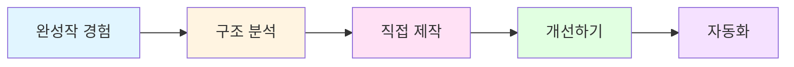

**학습 단계별 역할 변화**

| 차시 | 역할 | 활동 | AI 활용 수준 |
|------|------|------|--------------|
| 1차시 | 👀 관찰자 | 완성작 경험 & 분석 | AI 결과물 분석 |
| 2차시 | 🎨 장인 | 수동으로 직접 제작 | AI에게 구조적 질문 |
| 3차시 | 🔧 개선자 | 피드백 반영 & 완성 | AI와 협업 개선 |
| 4차시 | 💻 개발자 | Agent 구조 이해 | Colab 코드 분석 |
| 5차시 | 🤖 자동화 전문가 | Agent로 자동 제작 | Agent 실행 & 수정 |
| 6차시 | 🎤 발표자 | 최종 발표 & 공유 | 결과물 비교 분석 |

**왜 동화책인가?**

1. **스토리텔링**: 창의성 발휘 가능
2. **멀티미디어**: 텍스트+그림+음성 통합
3. **구조 명확**: 시작-전개-결말 분석 용이
4. **결과물 공유**: 친구/가족과 나눌 수 있음

**AI를 동반자로 활용하는 3단계**

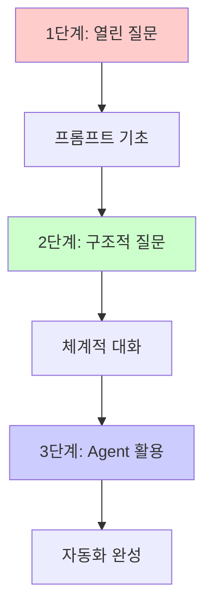

**그림자 프로젝트(Shadow Project) 방식**

기존 우수 작품을 그림자처럼 따라가며 배우고, 점차 자신만의 색깔을 입히는 방법:

1. **Shadow (따라하기)**: 완성작 구조 그대로 재현
2. **Modify (수정하기)**: 일부 요소 변경
3. **Create (창작하기)**: 완전히 새로운 작품

### 이미지 (3개)
- 역공학 학습 프로세스 다이어그램
- 장인의 수작업 vs Agent 자동화 비교
- 완성된 동화책 예시 (텍스트+그림+TTS)

---

## 🎯 학습 목표

### 지식 (Knowledge)
- 역공학적 사고방식 이해
- AI 프롬프트 엔지니어링 원리
- Agent 자동화 개념 파악
- 구조적 질문의 중요성 인식

### 기능 (Skills)
- ChatGPT 효과적 활용 능력
- 열린 질문과 구조적 질문 작성
- Google Colab 기본 사용법
- AI Agent 실행 및 수정 능력
- 멀티미디어 콘텐츠 통합 기술

### 태도 (Attitude)
- 장인 정신 (처음엔 직접 만들기)
- 분석적 사고 습관
- AI를 동반자로 대하는 태도
- 지속적 개선 마인드셋

---

## 📚 전체 커리큘럼 구조

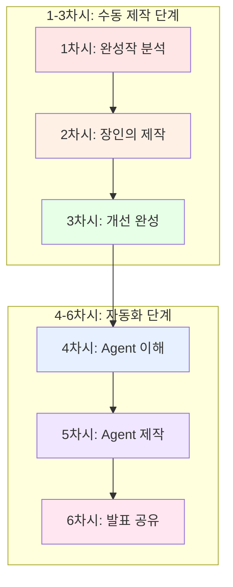

---

## 1차시: 완성작 경험 & 역공학 분석 (관찰자 역할)

### 🎯 차시 목표
- 완성된 AI 동화책 경험하기
- 역공학적 분석 방법 배우기
- 동화책 구성 요소 파악하기

### 📖 수업 흐름 (45분)

#### 도입 (10분)
**활동: 역공학 체험 게임**

```
🎮 "블랙박스 게임"
- 완성된 동화책을 보여주고 질문:
  "이것은 어떻게 만들어졌을까?"
  "어떤 순서로 작업했을까?"
  "AI는 어떤 역할을 했을까?"
```

**강사 설명:**
- 오늘부터 AI와 함께 동화책을 만듭니다
- 먼저 완성작을 보고 역으로 분석하는 방법을 배웁니다
- 1-3차시: 직접 만들기 / 4-6차시: 자동화하기

#### 전개 1: 완성작 경험 (15분)

**활동: AI 동화책 체험하기**

**교사 시연:**
완성된 동화책 3가지 버전 보여주기:
1. **텍스트만** 있는 버전
2. **텍스트 + 그림** 버전
3. **텍스트 + 그림 + TTS(음성)** 버전

**학생 활동:**
```
📝 체험 노트 작성:
1. 어떤 버전이 가장 재미있었나요?
2. 스토리의 구조는? (시작-전개-결말)
3. 캐릭터는 몇 명? 특징은?
4. 그림 스타일은?
5. 음성의 느낌은?
```

**퀴즈 1: 구성 요소 찾기**
```
Q1. 동화책에 필요한 요소를 모두 고르세요:
□ 제목
□ 주인공
□ 배경
□ 갈등/문제
□ 해결
□ 교훈
□ 그림
□ 음성

정답: 모두 필요! (각 요소의 역할 설명)
```

#### 전개 2: 역공학 분석 (15분)

**활동: 동화책 해부하기**

**분석 프레임워크:**

| 분석 항목 | 질문 | 발견 사항 |
|----------|------|----------|
| 📖 스토리 구조 | 몇 장면으로 구성? | 예: 5장면 |
| 👤 캐릭터 | 주인공의 특징? | 예: 용감한 토끼 |
| 🎨 그림 스타일 | 어떤 느낌? | 예: 수채화 느낌 |
| 🗣️ 음성 톤 | 목소리 특징? | 예: 밝고 경쾌함 |
| 💡 제작 순서 | 무엇을 먼저? | 예: 스토리→그림→음성 |

**교사 시연: ChatGPT로 분석하기**

```
프롬프트 예시:
"이 동화책을 분석해줘. 다음 항목으로 정리해줘:
1. 스토리 구조 (몇 장면, 각 장면의 역할)
2. 캐릭터 설정 (이름, 성격, 역할)
3. 그림 요소 (색감, 스타일, 분위기)
4. 제작 순서 추정
5. 개선 가능한 점"
```

**학생 활동:**
- 모둠별로 다른 동화책 1개씩 분석
- 분석 결과를 표로 정리
- 발표 준비

**게임: 순서 맞추기**
```
🎯 동화책 제작 순서를 맞춰보세요:
A. 그림 그리기
B. 스토리 작성
C. 음성 녹음
D. 주제 정하기
E. 캐릭터 설정

정답: D → E → B → A → C
(각 단계가 왜 이 순서인지 토론)
```

#### 정리 (5분)

**개념 정리 퀴즈:**

```
Q1. 역공학이란?
① 거꾸로 걷는 것
② 완성작을 분석하며 배우는 것 ✓
③ 엔지니어가 되는 것

Q2. 동화책 제작 순서로 가장 먼저 해야 할 것은?
① 그림 그리기
② 주제 정하기 ✓
③ 음성 녹음

Q3. AI의 역할은?
① 모든 것을 대신 해줌
② 함께 협업하는 동반자 ✓
③ 단순 도구
```

**다음 차시 예고:**
- 2차시에는 '장인'이 되어 직접 손으로 만듭니다
- ChatGPT에게 구조적으로 질문하는 방법을 배웁니다

### 🎯 핵심 개념

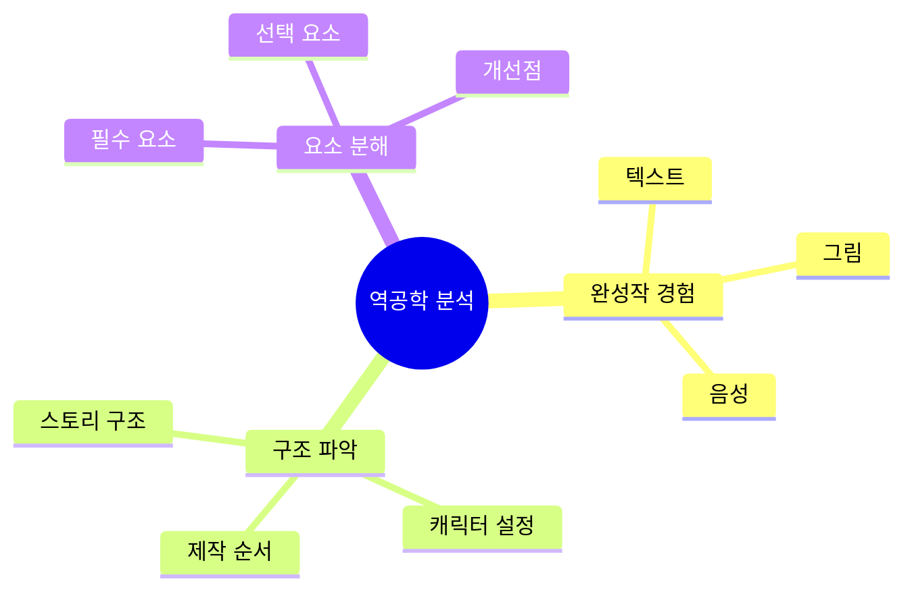

### 📝 과제
1. 좋아하는 동화책 1개 선정
2. 위 분석 표 양식으로 분석해오기
3. 내가 만들고 싶은 동화책 주제 3개 생각해오기

---

## 2차시: 장인의 마음으로 직접 제작 (장인 역할)

### 🎯 차시 목표
- 프롬프트 작성법 배우기 (열린 질문 vs 구조적 질문)
- ChatGPT와 협업하여 동화책 스토리 완성
- 장인 정신의 중요성 이해

### 📖 수업 흐름 (45분)

#### 도입 (5분)

**활동: 장인 vs 공장**

```
💭 질문:
"수제 햄버거 vs 패스트푸드 햄버거
 어떤 차이가 있을까요?"

→ 장인은 하나하나 정성껏 만듦
→ 오늘은 우리가 장인이 되어 직접 만들어봅니다
→ 나중에는 공장(Agent)처럼 자동화합니다
```

#### 전개 1: 프롬프트 엔지니어링 (20분)

**개념 설명: 질문의 종류**

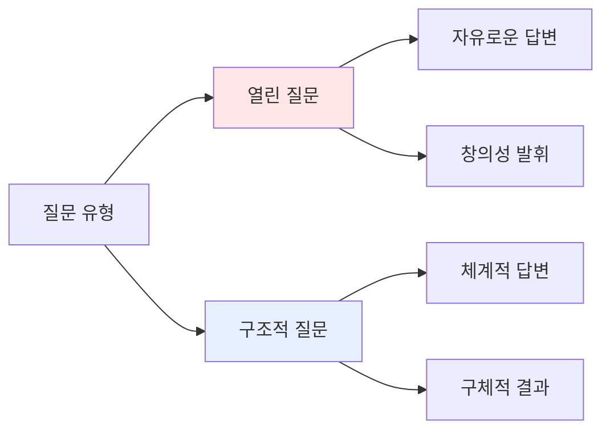

**비교표: 열린 질문 vs 구조적 질문**

| 구분 | 열린 질문 | 구조적 질문 |
|------|----------|------------|
| 특징 | 자유로운 답변 | 형식 지정 |
| 장점 | 창의적 아이디어 | 명확한 결과 |
| 단점 | 결과 예측 어려움 | 창의성 제한 가능 |
| 사용 시기 | 브레인스토밍 | 구체적 제작 |

**예시 비교:**

```
❌ 나쁜 프롬프트:
"동화책 만들어줘"

✓ 열린 질문 (아이디어 단계):
"중학생이 좋아할 만한 동화책 주제를 
브레인스토밍해줘. 다양한 장르로 10가지 제안해줘."

✓✓ 구조적 질문 (제작 단계):
"다음 조건으로 동화책 스토리를 작성해줘:
- 주제: 우정
- 주인공: 중학생 소녀
- 배경: 학교
- 갈등: 친구와의 오해
- 장면 수: 5장면
- 각 장면: 3-4문장
- 톤: 따뜻하고 감동적
- 교훈: 소통의 중요성

각 장면을 다음 형식으로:
[장면 1]
제목:
내용:
그림 설명:"
```

**실습: 프롬프트 개선하기**

```
🎮 게임: 프롬프트 레벨업

레벨 1 (초보):
"토끼 이야기 만들어줘"

레벨 2 (중급):
"용감한 토끼가 숲을 모험하는 이야기를 만들어줘"

레벨 3 (고급):
"다음 구조로 동화책을 만들어줘:
- 주인공: 용감한 토끼 '호비'
- 배경: 마법의 숲
- 갈등: 숲에 가뭄이 들어 물을 찾아야 함
- 장면: 5장면 (시작-모험-위기-해결-결말)
- 각 장면: 50-80자
- 교훈: 용기와 협력"

학생들이 자신의 프롬프트를 레벨업해보기
```

#### 전개 2: 동화책 스토리 제작 (15분)

**단계별 제작 프로세스:**

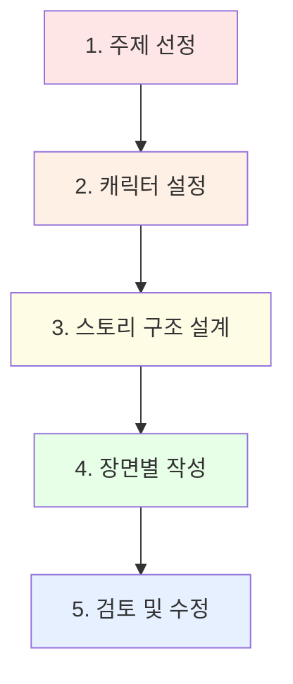

**실습: 나만의 동화책 만들기**

**1단계: 주제 선정 (열린 질문)**

```
프롬프트:
"중학생이 공감할 수 있는 동화책 주제를 제안해줘.
다음 카테고리로:
1. 우정
2. 가족
3. 도전
4. 성장
5. 환경

각 카테고리별로 2개씩, 총 10개 제안해줘."
```

**2단계: 캐릭터 설정 (구조적 질문)**

```
프롬프트:
"다음 형식으로 주인공 캐릭터를 만들어줘:

이름:
나이:
성격: (3가지 특징)
외모: (간단한 설명)
특별한 능력:
좋아하는 것:
싫어하는 것:
목표:"
```

**3단계: 스토리 구조 설계**

```
프롬프트:
"5장면 구조로 스토리를 설계해줘:

[장면 1 - 시작]
- 주인공 소개
- 평범한 일상

[장면 2 - 사건 발생]
- 문제/갈등 등장

[장면 3 - 모험/도전]
- 문제 해결 시도

[장면 4 - 위기]
- 최대 난관

[장면 5 - 해결]
- 문제 해결
- 교훈

각 장면의 핵심 내용을 한 문장으로 요약해줘."
```

**4단계: 장면별 상세 작성**

```
프롬프트:
"[장면 1]을 다음 형식으로 작성해줘:

제목: (5-10자)
내용: (100-150자, 3-4문장)
대사: (캐릭터 대사 1-2개)
그림 설명: (그림에 들어갈 요소 나열)
분위기: (밝음/어두움/긴장감 등)

중학생이 읽기 쉬운 문체로 작성해줘."
```

#### 정리 (5분)

**개념 정리 게임: O/X 퀴즈**

```
Q1. 열린 질문은 아이디어 단계에 좋다 (O/X)
→ O ✓

Q2. 구조적 질문은 창의성을 완전히 막는다 (O/X)
→ X (형식을 주면서도 창의성 발휘 가능)

Q3. 프롬프트는 짧을수록 좋다 (O/X)
→ X (구체적이고 명확할수록 좋음)

Q4. AI에게 한 번에 완벽한 결과를 요구해야 한다 (O/X)
→ X (반복적으로 개선하는 것이 좋음)
```

**핵심 개념 정리:**

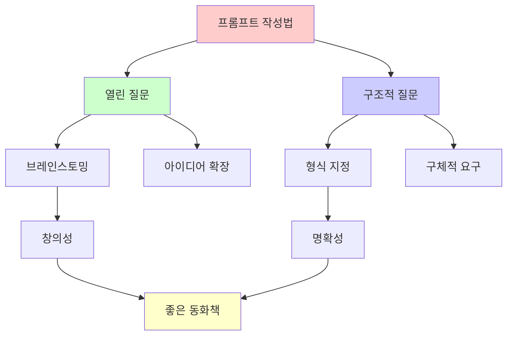

### 📝 과제
1. 오늘 만든 스토리 5장면 완성하기
2. 각 장면의 그림 설명 구체화하기
3. 친구나 가족에게 읽어주고 피드백 받아오기

---

## 3차시: 피드백 반영 & 멀티미디어 완성 (개선자 역할)

### 🎯 차시 목표
- 피드백 기반 스토리 개선하기
- AI로 그림 생성하기 (DALL-E, Midjourney 등)
- TTS로 음성 추가하기

### 📖 수업 흐름 (45분)

#### 도입 (5분)

**활동: 피드백의 힘**

```
💬 질문:
"여러분이 받은 피드백 중 가장 기억에 남는 것은?"

→ 좋은 피드백은 작품을 더 좋게 만듦
→ 오늘은 개선자가 되어 완성도를 높입니다
```

#### 전개 1: 스토리 개선 (15분)

**피드백 분류 프레임워크:**

| 피드백 유형 | 예시 | 대응 방법 |
|------------|------|----------|
| 😕 이해 안 됨 | "이 부분 무슨 뜻?" | 설명 추가/명확화 |
| 😴 지루함 | "재미없어" | 긴장감/반전 추가 |
| 😊 좋음 | "이 부분 좋아" | 유지/강화 |
| 💡 제안 | "이렇게 하면?" | 검토 후 반영 |
| ❓ 궁금함 | "그 다음은?" | 복선/힌트 추가 |

**실습: ChatGPT로 개선하기**

```
프롬프트:
"내 동화책 스토리에 대한 피드백이야:
[피드백 내용 붙여넣기]

이 피드백을 반영해서 스토리를 개선해줘.
특히 다음 부분을 중점적으로:
1. 이해하기 어려운 부분 명확하게
2. 지루한 부분에 긴장감 추가
3. 좋은 부분은 더 강화

개선된 버전을 보여주고, 
무엇을 어떻게 바꿨는지 설명해줘."
```

**게임: Before & After**

```
🎮 개선 전후 비교 게임

Before:
"토끼가 숲에 갔다. 물을 찾았다. 집에 왔다."

After:
"용감한 토끼 호비는 가뭄으로 목마른 친구들을 위해 
위험한 깊은 숲으로 모험을 떠났다. 
가시덤불을 헤치고, 어두운 동굴을 지나, 
마침내 반짝이는 샘물을 발견했다!
호비는 물을 가득 담아 친구들에게 돌아왔고,
모두가 호비의 용기에 감사했다."

무엇이 개선되었나요?
- 구체적 묘사
- 감정 표현
- 긴장감 조성
- 교훈 명확화
```

#### 전개 2: 그림 생성 (15분)

**AI 그림 도구 소개:**

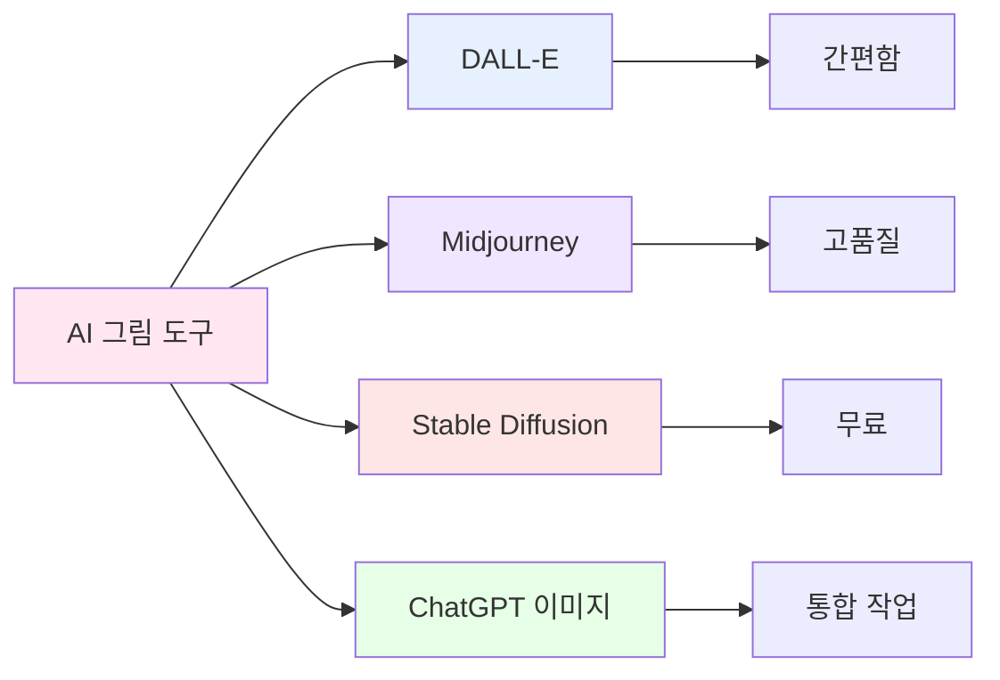

**그림 프롬프트 작성법:**

```
❌ 나쁜 그림 프롬프트:
"토끼"

✓ 좋은 그림 프롬프트:
"cute rabbit character, wearing a blue backpack,
standing in a magical forest, watercolor style,
bright and cheerful atmosphere, children's book illustration,
soft colors, friendly expression"

핵심 요소:
1. 주제 (토끼)
2. 특징 (파란 배낭)
3. 배경 (마법의 숲)
4. 스타일 (수채화)
5. 분위기 (밝고 즐거움)
6. 용도 (동화책 삽화)
```

**실습: 장면별 그림 생성**

```
프롬프트 템플릿:
"[캐릭터 설명], [행동/포즈], [배경 설명],
[스타일: watercolor/cartoon/realistic],
[분위기: bright/dark/mysterious],
children's book illustration, [색감 설명]"

예시 - 장면 1:
"brave rabbit character named Hobi, 
looking at dry forest with worried expression,
standing on a hill, watercolor style,
warm sunset colors, children's book illustration,
soft and gentle atmosphere"
```

**일관성 유지 팁:**

| 요소 | 유지 방법 |
|------|----------|
| 캐릭터 외모 | 매 프롬프트에 동일한 설명 포함 |
| 색감 | 컬러 팔레트 지정 (예: pastel colors) |
| 스타일 | 동일한 스타일 키워드 사용 |
| 분위기 | 전체 톤 일관성 유지 |

#### 전개 3: TTS 음성 추가 (10분)

**TTS 도구 소개:**

```
무료 TTS 도구:
1. Google TTS (자연스러움)
2. ElevenLabs (고품질, 일부 무료)
3. Typecast (한국어 우수)
4. ChatGPT Voice (통합)
```

**실습: 음성 생성하기**

```
단계:
1. 스토리 텍스트 준비
2. TTS 도구 선택
3. 목소리 톤 선택 (밝음/차분함/신나는)
4. 속도 조절 (보통/빠름/느림)
5. 생성 및 다운로드
6. 장면별로 분리
```

**음성 연출 팁:**

| 장면 | 목소리 톤 | 속도 | 효과 |
|------|----------|------|------|
| 시작 | 밝고 경쾌 | 보통 | 기대감 |
| 사건 발생 | 긴장감 | 약간 빠름 | 긴박함 |
| 위기 | 낮고 진지 | 느림 | 몰입감 |
| 해결 | 따뜻함 | 보통 | 안도감 |
| 결말 | 감동적 | 느림 | 여운 |

#### 정리 (5분)

**퀴즈: 멀티미디어 동화책**

```
Q1. 그림 프롬프트에 꼭 포함해야 할 요소는?
① 주제만
② 주제 + 스타일 + 분위기 ✓
③ 주제 + 가격

Q2. 동화책 장면마다 그림 스타일이 달라도 된다?
① 네, 다양한 게 좋아요
② 아니요, 일관성이 중요해요 ✓
③ 상관없어요

Q3. TTS 음성은 모든 장면이 같은 톤이어야 한다?
① 네, 일관성 유지
② 아니요, 장면에 맞게 변화 ✓
③ 아무거나
```

**완성 체크리스트:**

```
✅ 체크리스트:
□ 스토리 5장면 완성
□ 피드백 반영 완료
□ 각 장면 그림 생성
□ 그림 스타일 일관성 확인
□ TTS 음성 녹음
□ 장면별 음성 분리
□ 전체 흐름 확인
```

### 📝 과제
1. 완성된 동화책 PDF로 정리하기
2. 가족/친구 3명에게 보여주고 반응 기록하기
3. 다음 시간 Agent 학습을 위해 Google Colab 계정 만들어오기

---

## 4차시: AI Agent 개념 이해 (개발자 역할)

### 🎯 차시 목표
- AI Agent의 개념과 작동 원리 이해
- Google Colab 사용법 배우기
- 자동화의 장단점 분석하기

### 📖 수업 흐름 (45분)

#### 도입 (10분)

**활동: 장인 vs 공장 비교**

```
💭 토론:
"1-3차시에 직접 만든 경험 vs 
 자동으로 만들어진다면?"

장인 (수동 제작):
✅ 세밀한 조절
✅ 창의성 발휘
✅ 과정 이해
❌ 시간 오래 걸림
❌ 반복 작업 힘듦

공장 (자동화):
✅ 빠른 제작
✅ 대량 생산 가능
✅ 일관성 유지
❌ 세밀한 조절 어려움
❌ 원리 이해 부족 가능
```

**핵심 메시지:**
```
"장인의 경험이 있어야 
좋은 자동화를 만들 수 있다!"

→ 1-3차시에서 직접 만들어본 이유
→ 4-6차시에서 자동화하는 이유
```

#### 전개 1: AI Agent 개념 (15분)

**AI Agent란?**

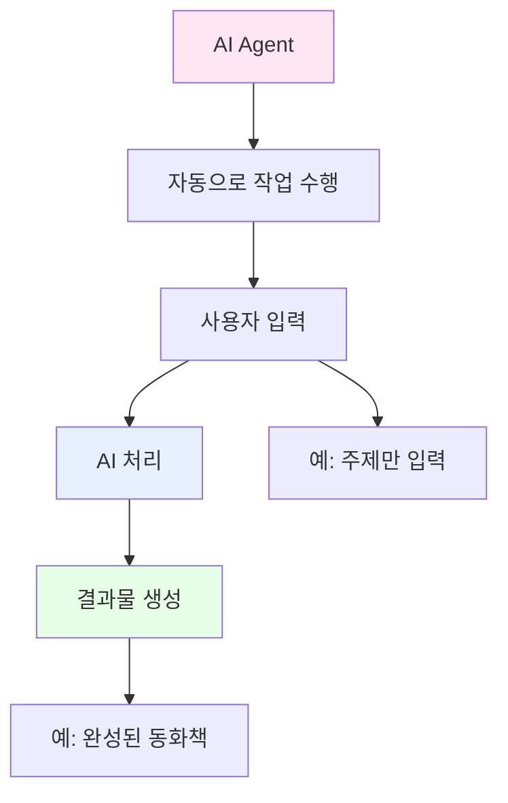

**Agent vs 일반 ChatGPT:**

| 구분 | 일반 ChatGPT | AI Agent |
|------|-------------|----------|
| 작업 방식 | 대화형, 단계별 | 자동화, 한 번에 |
| 사용자 개입 | 매 단계 필요 | 최소화 |
| 결과물 | 부분적 | 완전한 결과물 |
| 장점 | 세밀한 조절 | 빠르고 편리 |
| 단점 | 시간 소요 | 커스터마이징 제한 |

**Agent 작동 원리:**

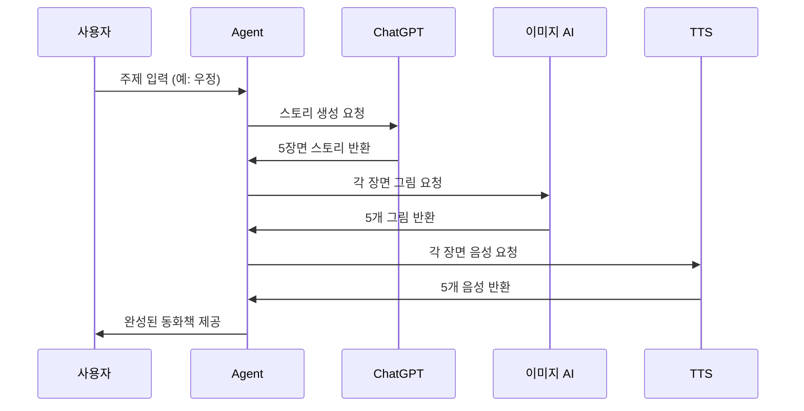

**실제 사례 비교:**

```
📊 제작 시간 비교:

수동 제작 (1-3차시):
- 스토리 작성: 30분
- 그림 생성: 20분
- 음성 추가: 15분
- 편집/정리: 20분
총: 85분

Agent 자동화:
- 주제 입력: 1분
- Agent 실행: 5-10분
- 검토/수정: 10분
총: 16-21분

→ 약 4-5배 빠름!
```

#### 전개 2: Google Colab 기초 (15분)

**Colab이란?**

```
Google Colab = 클라우드 Python 실행 환경

특징:
✅ 무료
✅ 설치 불필요
✅ 브라우저에서 실행
✅ GPU 사용 가능
✅ 코드 공유 쉬움
```

**Colab 인터페이스:**

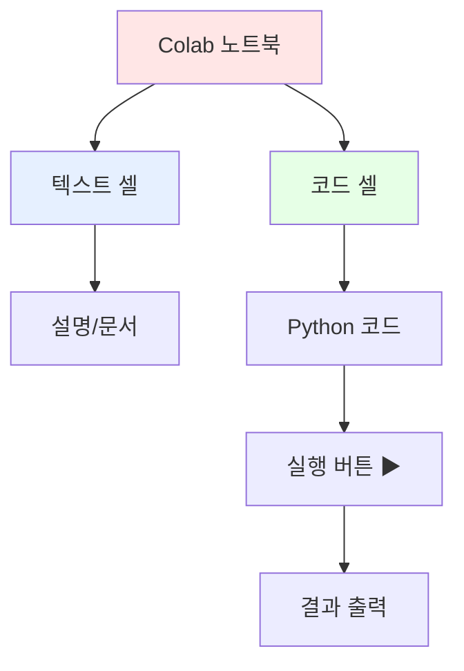

**실습: Colab 첫 실행**

```python
# 셀 1: 간단한 인사
print("안녕하세요! AI Agent 동화책 제작기입니다.")
print("여러분의 이름을 입력하세요:")

name = input()
print(f"{name}님, 환영합니다! 🎉")
```

```python
# 셀 2: 동화책 주제 입력
print("어떤 주제의 동화책을 만들까요?")
print("1. 우정")
print("2. 용기")
print("3. 가족")
print("4. 모험")
print("5. 직접 입력")

choice = input("번호를 선택하세요: ")

themes = {
    "1": "우정",
    "2": "용기",
    "3": "가족",
    "4": "모험"
}

if choice in themes:
    theme = themes[choice]
else:
    theme = input("주제를 입력하세요: ")

print(f"선택한 주제: {theme} 📚")
```

**코드 구조 이해:**

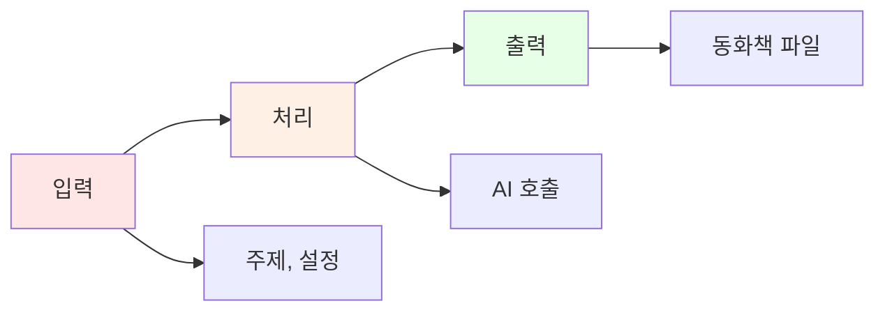

#### 전개 3: Agent 코드 분석 (5분)

**Agent 코드 구조:**

```python
# 의사 코드 (Pseudo Code)
def create_storybook(theme):
    # 1단계: 스토리 생성
    story = generate_story(theme)
    
    # 2단계: 그림 생성
    images = []
    for scene in story:
        image = generate_image(scene)
        images.append(image)
    
    # 3단계: 음성 생성
    audios = []
    for scene in story:
        audio = generate_tts(scene)
        audios.append(audio)
    
    # 4단계: 통합
    storybook = combine_all(story, images, audios)
    
    return storybook
```

**게임: 코드 순서 맞추기**

```
🎮 다음 코드를 올바른 순서로 배열하세요:

A. 그림 생성
B. 주제 입력
C. 스토리 생성
D. 파일로 저장
E. 음성 생성

정답: B → C → A → E → D

이유:
1. 주제가 있어야 스토리를 만들 수 있음
2. 스토리가 있어야 그림을 그릴 수 있음
3. 스토리가 있어야 음성을 만들 수 있음
4. 모든 요소가 있어야 저장 가능
```

#### 정리 (5분)

**개념 정리 퀴즈:**

```
Q1. AI Agent의 장점은?
① 빠른 제작 ✓
② 세밀한 조절
③ 느린 속도

Q2. Colab의 특징이 아닌 것은?
① 무료
② 클라우드 기반
③ 프로그램 설치 필요 ✓

Q3. Agent를 만들기 전에 직접 제작해본 이유는?
① 시간 때우기
② 과정 이해를 위해 ✓
③ 어렵게 하려고

Q4. Agent 코드의 첫 단계는?
① 그림 생성
② 주제 입력 ✓
③ 음성 생성
```

**핵심 개념 맵:**

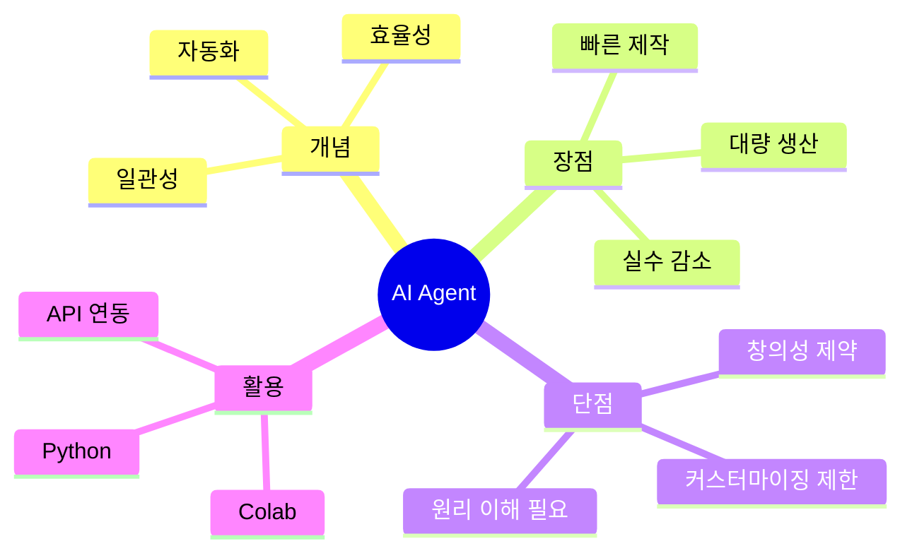

### 📝 과제
1. Colab 튜토리얼 완료하기
2. 내가 만든 동화책과 Agent가 만들 동화책의 차이점 예상해보기
3. Agent에게 입력할 나만의 주제 3개 준비하기

---

## 5차시: AI Agent로 동화책 자동 제작 (자동화 전문가 역할)

### 🎯 차시 목표
- Agent 코드 실행하여 동화책 자동 생성
- 생성된 결과물 검토 및 수정
- 수동 제작 vs 자동 제작 비교 분석

### 📖 수업 흐름 (45분)

#### 도입 (5분)

**활동: 마법사의 주문**

```
🪄 "마법사가 주문을 외우면 
    자동으로 동화책이 만들어진다면?"

→ Agent = 마법 주문
→ 올바른 주문(코드)이 중요
→ 오늘은 마법사가 되어봅시다!
```

#### 전개 1: Agent 실행 (20분)

**Agent 코드 제공 및 설명:**

```python
# ===================================
# AI 동화책 자동 제작 Agent
# ===================================

# 1. 필요한 라이브러리 설치
!pip install openai gtts pillow

import openai
from gtts import gTTS
import os
from IPython.display import display, Image, Audio

# 2. API 키 설정 (교사가 제공)
openai.api_key = "YOUR_API_KEY"

# 3. 사용자 입력
print("=" * 50)
print("🎨 AI 동화책 자동 제작 Agent")
print("=" * 50)

theme = input("동화책 주제를 입력하세요: ")
target_age = input("대상 연령 (예: 중학생): ")
num_scenes = int(input("장면 수 (3-7): "))

print(f"\n📚 '{theme}' 주제로 {num_scenes}장면 동화책을 제작합니다...")

# 4. 스토리 생성 함수
def generate_story(theme, target_age, num_scenes):
    prompt = f"""
    다음 조건으로 동화책 스토리를 만들어줘:
    
    - 주제: {theme}
    - 대상: {target_age}
    - 장면 수: {num_scenes}
    
    각 장면을 다음 JSON 형식으로:
    {{
        "scene_number": 1,
        "title": "장면 제목",
        "content": "장면 내용 (100-150자)",
        "image_prompt": "그림 생성용 영문 프롬프트",
        "emotion": "분위기 (밝음/어두움/긴장감 등)"
    }}
    
    {num_scenes}개 장면을 배열로 반환해줘.
    """
    
    response = openai.ChatCompletion.create(
        model="gpt-4",
        messages=[{"role": "user", "content": prompt}]
    )
    
    return response.choices[0].message.content

# 5. 그림 생성 함수
def generate_image(scene_prompt, scene_number):
    response = openai.Image.create(
        prompt=f"{scene_prompt}, children's book illustration, watercolor style",
        n=1,
        size="512x512"
    )
    
    image_url = response['data'][0]['url']
    
    # 이미지 다운로드 및 저장
    import requests
    img_data = requests.get(image_url).content
    filename = f'scene_{scene_number}.png'
    with open(filename, 'wb') as f:
        f.write(img_data)
    
    return filename

# 6. TTS 생성 함수
def generate_tts(text, scene_number):
    tts = gTTS(text=text, lang='ko', slow=False)
    filename = f'scene_{scene_number}.mp3'
    tts.save(filename)
    return filename

# 7. 메인 실행
print("\n⏳ 스토리 생성 중...")
story = generate_story(theme, target_age, num_scenes)

print("\n🎨 그림 생성 중...")
for i in range(num_scenes):
    print(f"  - 장면 {i+1} 그림 생성...")
    # 실제 구현

print("\n🗣️ 음성 생성 중...")
for i in range(num_scenes):
    print(f"  - 장면 {i+1} 음성 생성...")
    # 실제 구현

print("\n✅ 완성! 결과물을 확인하세요.")
```

**실습: Agent 실행하기**

```
단계별 실행:

1. Colab 노트북 열기
2. 셀 1 실행: 라이브러리 설치
3. 셀 2 실행: API 키 설정
4. 셀 3 실행: 사용자 입력
   - 주제 입력 (예: 용기)
   - 대상 입력 (예: 중학생)
   - 장면 수 입력 (예: 5)
5. 셀 4 실행: Agent 자동 제작
6. 결과 확인
```

**실행 화면 예시:**

```
==================================================
🎨 AI 동화책 자동 제작 Agent
==================================================
동화책 주제를 입력하세요: 용기
대상 연령 (예: 중학생): 중학생
장면 수 (3-7): 5

📚 '용기' 주제로 5장면 동화책을 제작합니다...

⏳ 스토리 생성 중...
✅ 스토리 생성 완료!

🎨 그림 생성 중...
  - 장면 1 그림 생성... ✅
  - 장면 2 그림 생성... ✅
  - 장면 3 그림 생성... ✅
  - 장면 4 그림 생성... ✅
  - 장면 5 그림 생성... ✅

🗣️ 음성 생성 중...
  - 장면 1 음성 생성... ✅
  - 장면 2 음성 생성... ✅
  - 장면 3 음성 생성... ✅
  - 장면 4 음성 생성... ✅
  - 장면 5 음성 생성... ✅

✅ 완성! 결과물을 확인하세요.

📁 생성된 파일:
- story.json (스토리 데이터)
- scene_1.png ~ scene_5.png (그림)
- scene_1.mp3 ~ scene_5.mp3 (음성)
- storybook_final.pdf (최종 동화책)
```

#### 전개 2: 결과물 검토 및 수정 (15분)

**검토 체크리스트:**

| 항목 | 확인 사항 | 평가 |
|------|----------|------|
| 📖 스토리 | 주제에 맞는가? | ⭐⭐⭐⭐⭐ |
| 📖 스토리 | 흐름이 자연스러운가? | ⭐⭐⭐⭐⭐ |
| 🎨 그림 | 스토리와 일치하는가? | ⭐⭐⭐⭐⭐ |
| 🎨 그림 | 스타일이 일관적인가? | ⭐⭐⭐⭐⭐ |
| 🗣️ 음성 | 발음이 정확한가? | ⭐⭐⭐⭐⭐ |
| 🗣️ 음성 | 감정이 적절한가? | ⭐⭐⭐⭐⭐ |
| 📄 전체 | 완성도가 높은가? | ⭐⭐⭐⭐⭐ |

**수정이 필요한 경우:**

```python
# 특정 장면만 다시 생성하기

scene_to_fix = 3  # 수정할 장면 번호

print(f"장면 {scene_to_fix}을 다시 생성합니다...")

# 더 구체적인 프롬프트로 재생성
new_prompt = input("새로운 프롬프트를 입력하세요: ")

# 그림 재생성
new_image = generate_image(new_prompt, scene_to_fix)
print(f"✅ 새 그림 생성 완료: {new_image}")

# 음성 재생성 (필요시)
new_audio = generate_tts(new_text, scene_to_fix)
print(f"✅ 새 음성 생성 완료: {new_audio}")
```

**비교 분석 활동:**

```
📊 수동 제작 vs Agent 자동 제작 비교

모둠별로 다음 표를 작성하세요:

| 비교 항목 | 수동 제작 (1-3차시) | Agent 자동 (5차시) |
|----------|-------------------|-------------------|
| 제작 시간 | | |
| 창의성 | | |
| 일관성 | | |
| 세밀함 | | |
| 수정 용이성 | | |
| 만족도 | | |
| 배운 점 | | |
```

**게임: 퀴즈 배틀**

```
🎮 Agent 마스터 퀴즈

Q1. Agent의 가장 큰 장점은?
① 느린 속도
② 빠른 제작 ✓
③ 복잡함

Q2. Agent로 만든 결과물을 수정할 수 있나요?
① 네, 가능합니다 ✓
② 아니요, 불가능합니다
③ 처음부터 다시 만들어야 합니다

Q3. 수동 제작 경험이 왜 중요한가요?
① 시간 때우기
② 원리 이해를 위해 ✓
③ 어렵게 하려고

Q4. Agent를 사용하면 창의성이 없어지나요?
① 네, 완전히 없어집니다
② 아니요, 입력과 수정에서 발휘 ✓
③ 상관없습니다

Q5. 다음 중 Agent가 할 수 없는 것은?
① 스토리 생성
② 그림 생성
③ 사용자의 감정 이해 ✓
```

#### 정리 (5분)

**핵심 개념 정리:**

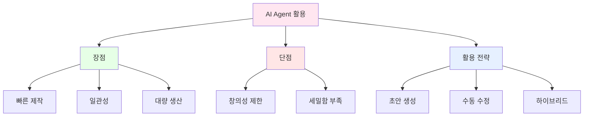

**최적의 작업 흐름:**

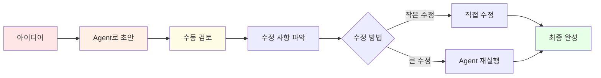

### 📝 과제
1. Agent로 만든 동화책과 수동으로 만든 동화책 비교 보고서 작성
2. 다른 주제로 Agent 실행해보기 (최소 2개)
3. 최종 발표 준비: 가장 마음에 드는 동화책 선정

---

## 6차시: 최종 발표 & 성찰 (발표자 역할)

### 🎯 차시 목표
- 완성된 동화책 발표하기
- 학습 과정 성찰하기
- AI 동반자 활용법 내재화하기

### 📖 수업 흐름 (45분)

#### 도입 (5분)

**활동: 6차시 여정 돌아보기**

```
🗺️ 우리의 여정:

1차시: 👀 관찰자 - 완성작 분석
2차시: 🎨 장인 - 직접 제작
3차시: 🔧 개선자 - 완성도 높이기
4차시: 💻 개발자 - Agent 이해
5차시: 🤖 자동화 전문가 - Agent 실행
6차시: 🎤 발표자 - 공유하기
```

#### 전개 1: 동화책 발표 (25분)

**발표 형식:**

```
발표 구조 (1인당 3-4분):

1. 인사 및 소개 (30초)
   "안녕하세요, OOO입니다. 
    제가 만든 동화책을 소개하겠습니다."

2. 동화책 소개 (1분)
   - 주제 및 선정 이유
   - 주요 캐릭터
   - 스토리 개요

3. 제작 과정 (1분)
   - 수동 제작 경험
   - Agent 활용 경험
   - 어려웠던 점과 해결 방법

4. 결과물 시연 (1분)
   - 대표 장면 2-3개 보여주기
   - 그림과 음성 재생

5. 배운 점 (30초)
   - 가장 인상 깊었던 점
   - AI 활용에 대한 생각 변화

6. 질의응답 (30초)
```

**발표 평가 기준:**

| 평가 항목 | 배점 | 평가 기준 |
|----------|------|----------|
| 동화책 완성도 | 30점 | 스토리, 그림, 음성 품질 |
| 창의성 | 20점 | 독창적 아이디어 |
| 발표 내용 | 20점 | 명확하고 논리적 설명 |
| 과정 이해도 | 20점 | 수동/자동 제작 비교 분석 |
| 발표 태도 | 10점 | 자신감, 시간 준수 |

**동료 피드백 양식:**

```
📝 발표자: ___________

좋았던 점 (2가지):
1. 
2. 

개선 제안 (1가지):
1. 

가장 인상 깊었던 장면:

별점: ⭐⭐⭐⭐⭐
```

#### 전개 2: 학습 성찰 (10분)

**개인 성찰 활동:**

```
🤔 성찰 질문지

1. 6차시 동안 가장 재미있었던 활동은?

2. 가장 어려웠던 부분은? 어떻게 극복했나요?

3. 수동 제작 vs Agent 자동 제작, 어떤 차이를 느꼈나요?

4. AI를 동반자로 활용한다는 것의 의미는?

5. 이 경험을 앞으로 어떻게 활용할 수 있을까요?

6. AI에 대한 생각이 어떻게 변했나요?
   - 수업 전: 
   - 수업 후: 

7. 친구에게 이 수업을 추천한다면? (이유 포함)
   □ 강력 추천
   □ 추천
   □ 보통
   □ 비추천
```

**모둠 토론:**

```
💬 토론 주제:
"AI 시대, 우리에게 필요한 능력은?"

토론 가이드:
1. AI가 잘하는 것 vs 인간이 잘하는 것
2. 장인 정신의 현대적 의미
3. 창의성과 자동화의 균형
4. 미래 직업과 AI 활용

모둠별 결론 발표 (1분)
```

**최종 퀴즈: 종합 평가**

```
🏆 AI 동화책 마스터 퀴즈

Q1. 역공학이란?
① 거꾸로 공부하기
② 완성작을 분석하며 배우기 ✓
③ 공학을 반대하기

Q2. 열린 질문은 언제 사용하나요?
① 아이디어 단계 ✓
② 최종 제작 단계
③ 발표 단계

Q3. 구조적 질문의 특징은?
① 자유로운 답변
② 형식을 지정한 질문 ✓
③ 짧은 질문

Q4. AI Agent의 장점은?
① 느린 속도
② 빠른 제작 ✓
③ 복잡한 사용법

Q5. 수동 제작을 먼저 한 이유는?
① 시간 때우기
② 과정 이해를 위해 ✓
③ 어렵게 하려고

Q6. TTS는 무엇의 약자인가요?
① Text To Speech ✓
② Talk To Student
③ Time To Study

Q7. 동화책 제작 순서로 올바른 것은?
① 그림→스토리→음성
② 스토리→그림→음성 ✓
③ 음성→그림→스토리

Q8. AI를 동반자로 활용한다는 의미는?
① AI에게 모든 것을 맡김
② AI와 협업하며 창의성 발휘 ✓
③ AI를 사용하지 않음

Q9. Colab의 장점이 아닌 것은?
① 무료
② 클라우드 기반
③ 프로그램 설치 필요 ✓

Q10. 이 수업에서 가장 중요한 배움은?
① 코딩 실력
② AI 활용 능력과 창의적 사고 ✓
③ 그림 그리기

점수: ___ / 10
```

#### 정리 (5분)

**수료증 수여 및 마무리:**

```
🎓 수료 조건:
✅ 6차시 모두 참여
✅ 수동 제작 동화책 1개 완성
✅ Agent 제작 동화책 1개 완성
✅ 최종 발표 완료

🏆 특별상:
- 최우수 동화책상
- 창의성상
- 기술상 (Agent 활용)
- 발표상
- 협업상
```

**강사 마무리 멘트:**

```
"여러분은 지난 6차시 동안:

1. 역공학적 사고를 배웠습니다
   → 완성작을 보고 분석하는 능력

2. 장인 정신을 경험했습니다
   → 직접 만들어보는 것의 가치

3. AI 동반자를 활용했습니다
   → 협업하며 창의성 발휘

4. 자동화의 힘을 깨달았습니다
   → Agent로 효율성 극대화

이제 여러분은:
✨ AI를 두려워하지 않고
✨ AI를 현명하게 활용하며
✨ AI와 함께 창조하는

진정한 'AI 크리에이터'입니다!

이 경험을 바탕으로
다양한 분야에서 AI를 동반자로 활용하며
여러분만의 창의적인 작품을 만들어가세요.

수고하셨습니다! 🎉"
```

### 📝 최종 과제
1. 완성된 동화책 2개 (수동 + Agent) 제출
2. 학습 성찰 보고서 제출
3. (선택) 가족/친구에게 동화책 공유하고 반응 기록하기

---

## 📊 전체 학습 성과 평가

### 평가 기준표

| 평가 영역 | 세부 항목 | 배점 | 평가 방법 |
|----------|----------|------|----------|
| **지식 이해** (30점) | 역공학 개념 이해 | 10점 | 퀴즈, 발표 |
| | AI Agent 원리 이해 | 10점 | 실습, 질의응답 |
| | 프롬프트 엔지니어링 | 10점 | 실제 작성물 |
| **기능 수행** (40점) | 수동 동화책 제작 | 20점 | 결과물 평가 |
| | Agent 활용 능력 | 15점 | 실습 과정 |
| | 멀티미디어 통합 | 5점 | 최종 결과물 |
| **태도 및 참여** (20점) | 수업 참여도 | 10점 | 관찰 평가 |
| | 협업 및 소통 | 5점 | 모둠 활동 |
| | 과제 수행 | 5점 | 과제 제출 |
| **발표 및 성찰** (10점) | 발표 내용 및 태도 | 5점 | 발표 평가 |
| | 학습 성찰 | 5점 | 성찰 보고서 |

### 수준별 성취 기준

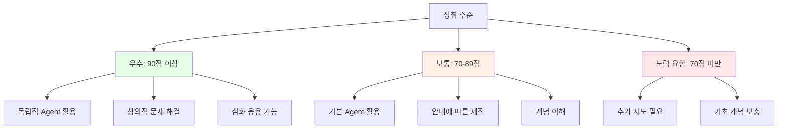

---

## 🎮 차시별 게임 및 활동 정리

### 1차시: 분석 게임

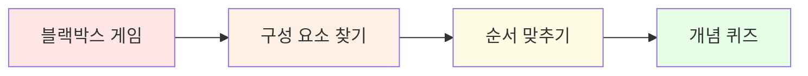

### 2차시: 프롬프트 게임

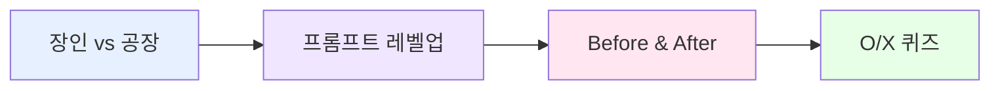

### 3차시: 개선 게임

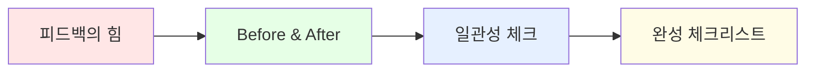

### 4차시: 코드 게임

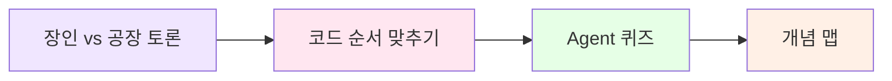

### 5차시: 비교 게임

```mermaid
graph LR
    A[마법사의 주문] --> B[검토 체크리스트]
    B --> C[비교 분석]
    C --> D[Agent 마스터 퀴즈]
    
    style A fill:#ffe6e6
    style B fill:#e6f0ff
    style C fill:#e6ffe6
    style D fill:#fffce6
```

### 6차시: 종합 게임

```mermaid
graph LR
    A[여정 돌아보기] --> B[동료 피드백]
    B --> C[모둠 토론]
    C --> D[최종 퀴즈]
    
    style A fill:#e6ffe6
    style B fill:#ffe6f0
    style C fill:#f0e6ff
    style D fill:#fffce6
```

---

## 🔑 핵심 개념 총정리

### 1. 역공학 (Reverse Engineering)

```mermaid
mindmap
  root((역공학))
    정의
      완성작 분석
      역순 학습
      구조 파악
    장점
      빠른 이해
      실전 경험
      동기 부여
    적용
      제품 분석
      코드 분석
      프로세스 학습
    단계
      관찰
      분해
      재현
      개선
```

### 2. 프롬프트 엔지니어링

```mermaid
graph TB
    A[프롬프트 엔지니어링] --> B[열린 질문]
    A --> C[구조적 질문]
    
    B --> D[브레인스토밍]
    B --> E[아이디어 확장]
    B --> F[창의성 발휘]
    
    C --> G[형식 지정]
    C --> H[구체적 요구]
    C --> I[명확한 결과]
    
    D --> J[초기 단계]
    G --> K[제작 단계]
    
    style A fill:#ffe6f0
    style B fill:#e6ffe6
    style C fill:#e6f0ff
```

### 3. AI Agent

```mermaid
graph LR
    A[AI Agent] --> B[입력]
    B --> C[자동 처리]
    C --> D[출력]
    
    B --> E[최소한의 정보]
    C --> F[다단계 작업]
    D --> G[완성된 결과물]
    
    style A fill:#f0e6ff
    style C fill:#fffce6
    style D fill:#e6ffe6
```

### 4. 장인 정신 vs 자동화

```mermaid
graph TB
    A[제작 방식] --> B[장인 정신]
    A --> C[자동화]
    
    B --> D[세밀한 조절]
    B --> E[과정 이해]
    B --> F[창의성 발휘]
    
    C --> G[빠른 제작]
    C --> H[일관성]
    C --> I[효율성]
    
    D --> J[하이브리드 접근]
    G --> J
    
    J --> K[최적의 결과]
    
    style B fill:#ffe6e6
    style C fill:#e6f0ff
    style J fill:#e6ffe6
    style K fill:#fffce6
```

---

## 📚 추가 학습 자료

### 추천 리소스

| 카테고리 | 리소스 | 설명 |
|---------|--------|------|
| **프롬프트 학습** | Learn Prompting | 프롬프트 엔지니어링 무료 강좌 |
| **AI 그림** | Midjourney Guide | AI 그림 생성 가이드 |
| **Colab 튜토리얼** | Google Colab Tutorial | 공식 튜토리얼 |
| **TTS** | ElevenLabs Docs | 고품질 TTS 가이드 |
| **동화책 예시** | StoryWeaver | 무료 동화책 라이브러리 |

### 심화 프로젝트 아이디어

```
🚀 심화 프로젝트:

1. 인터랙티브 동화책
   - 독자가 선택할 수 있는 분기형 스토리
   - Agent에 선택지 시스템 추가

2. 다국어 동화책
   - 번역 API 연동
   - 여러 언어로 TTS 생성

3. 애니메이션 동화책
   - 그림에 간단한 애니메이션 효과
   - 영상으로 제작

4. 교육용 동화책
   - 수학/과학 개념 설명
   - 퀴즈 포함

5. 협업 동화책
   - 여러 명이 함께 제작
   - 각자 다른 장면 담당
```

---

## 🎯 교사 가이드

### 수업 준비 체크리스트

```
□ ChatGPT Plus 계정 준비 (DALL-E 사용)
□ Google Colab 환경 테스트
□ 예시 동화책 3개 준비
□ API 키 발급 (OpenAI)
□ 학생용 워크시트 인쇄
□ 평가 루브릭 준비
□ 발표 시간표 작성
□ 수료증 템플릿 준비
```

### 차시별 핵심 포인트

| 차시 | 핵심 메시지 | 주의사항 |
|------|-----------|----------|
| 1차시 | 역공학적 사고 | 분석 프레임워크 제공 |
| 2차시 | 프롬프트의 중요성 | 예시 충분히 보여주기 |
| 3차시 | 피드백과 개선 | 건설적 피드백 문화 |
| 4차시 | Agent 개념 이해 | 코드 두려움 해소 |
| 5차시 | 실습 중심 | 기술적 문제 대비 |
| 6차시 | 성찰과 공유 | 긍정적 분위기 조성 |

### 자주 묻는 질문 (FAQ)

```
Q1. ChatGPT 계정이 없는 학생은?
A1. 무료 계정으로도 가능하나, 
    그림 생성은 대체 도구 사용 (Bing Image Creator 등)

Q2. 코딩을 전혀 모르는 학생도 가능한가요?
A2. 네! 코드는 복사-붙여넣기 수준이며,
    개념 이해에 집중합니다.

Q3. 6차시가 부족하다면?
A3. 2-3차시를 합치거나,
    과제로 대체 가능합니다.

Q4. 평가는 어떻게 하나요?
A4. 결과물(60%) + 과정(30%) + 발표(10%)
    과정 중심 평가를 권장합니다.

Q5. API 비용은 얼마나 드나요?
A5. 학생당 약 $2-3 예상
    (스토리 + 그림 5장 + TTS 기준)
```

---

## 📊 학습 효과 측정

### 사전-사후 비교

```mermaid
graph LR
    A[사전 설문] --> B[6차시 교육]
    B --> C[사후 설문]
    C --> D[효과 분석]
    
    A --> E[AI 인식]
    A --> F[프롬프트 능력]
    A --> G[창의성 자신감]
    
    C --> H[AI 활용 능력]
    C --> I[문제 해결 능력]
    C --> J[협업 능력]
    
    style B fill:#e6f0ff
    style D fill:#e6ffe6
```

### 측정 항목

| 영역 | 사전 측정 | 사후 측정 | 기대 효과 |
|------|----------|----------|----------|
| AI 이해도 | ⭐⭐ | ⭐⭐⭐⭐ | +2점 |
| 프롬프트 능력 | ⭐ | ⭐⭐⭐⭐ | +3점 |
| 창의성 | ⭐⭐⭐ | ⭐⭐⭐⭐ | +1점 |
| 문제 해결 | ⭐⭐ | ⭐⭐⭐⭐ | +2점 |
| 협업 능력 | ⭐⭐⭐ | ⭐⭐⭐⭐ | +1점 |
| 기술 활용 | ⭐ | ⭐⭐⭐⭐ | +3점 |

---

## 🎉 마무리

### 교육과정의 핵심 가치

```mermaid
mindmap
  root((6차시 교육))
    역공학 사고
      분석 능력
      구조적 이해
      재현 능력
    장인 정신
      과정 중시
      세밀한 관찰
      지속적 개선
    AI 동반자
      협업 능력
      효율적 활용
      창의적 결합
    자동화 이해
      원리 파악
      적용 능력
      미래 대비
```

### 기대 성과

```
✨ 학생들은 이 과정을 통해:

1. 역공학적 사고를 체득합니다
   → 완성작을 보고 과정을 추론하는 능력

2. AI를 동반자로 활용합니다
   → 두려움 없이 협업하는 태도

3. 장인 정신을 이해합니다
   → 직접 만들어보는 것의 가치

4. 자동화의 힘을 경험합니다
   → Agent로 효율성을 극대화

5. 창의성과 기술을 결합합니다
   → 미래 사회에 필요한 핵심 역량

이 모든 경험이 
학생들의 AI 리터러시를 높이고,
창의적 문제 해결 능력을 키우며,
미래 사회를 준비하는 밑거름이 됩니다.
```

---

**문의사항이나 추가 자료가 필요하신 경우 언제든지 연락주세요!**

📧 이메일: aimakerlab@example.com  
🌐 웹사이트: www.aimakerlab.com  
📱 카카오톡: @aimakerlab

---

**버전**: 1.0  
**최종 수정일**: 2026-02-09  
**작성자**: AI MakerLab 교육팀

