# ESP32 CAM + 앱인벤터 프로젝트 전체 목록

## 📚 프로젝트 개요

ESP32 CAM을 활용한 **AI 이미지 분류 프로젝트** 총 11개를 두 가지 AI 도구로 분류하여 제공합니다.

### 시스템 구성

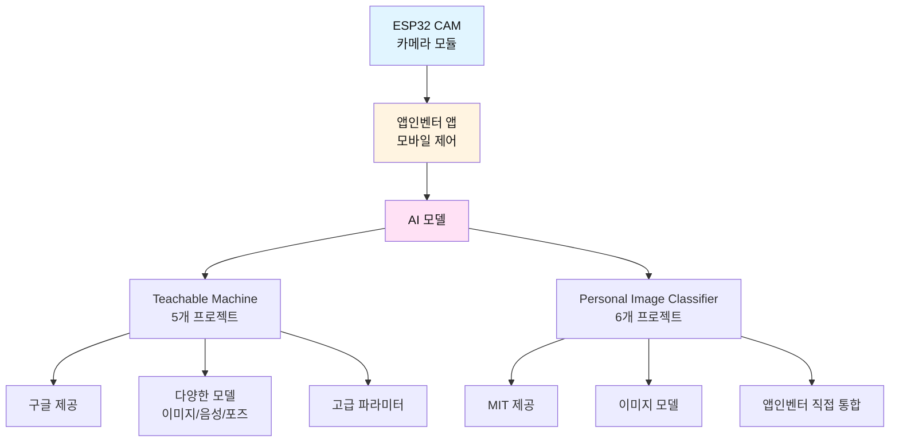

---

## 🎯 Teachable Machine + 앱인벤터 (5개)

### 비교표

| No | 프로젝트명 | 난이도 | 대상 | 예산 | AI 클래스 수 | 주요 기능 |
|----|-----------|--------|------|------|-------------|----------|
| 1 | 스마트 쓰레기 분리수거 | ⭐⭐ | 중1-3 | 24,000원 | 4개 | 재활용/일반/음식물/기타 자동 분류 |
| 2 | AI 출입 통제 시스템 | ⭐⭐⭐ | 중1-3 | 19,000원 | 5-10개 | 얼굴 인식 자동 출입 관리 |
| 3 | 스마트 주차 관리 | ⭐⭐⭐ | 중2-3 | 28,000원 | 6개 | 차량 종류 인식 주차 관리 |
| 4 | AI 학습 도우미 | ⭐⭐ | 중1-3 | 17,000원 | 5개 | 학습 자세/집중도 모니터링 |
| 5 | 스마트 냉장고 관리 | ⭐⭐ | 중1-3 | 21,000원 | 다양 | 식품 신선도 관리 |

### 1. 스마트 쓰레기 분리수거 시스템

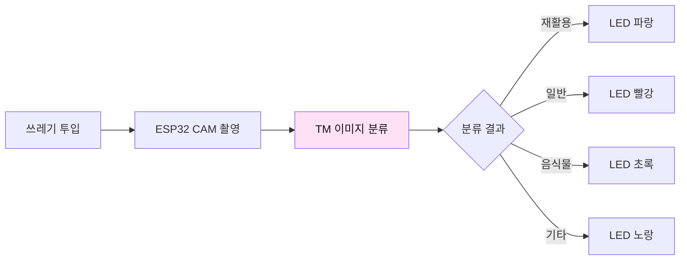

**핵심 특징:**
- 4가지 쓰레기 자동 분류
- LED로 분류 안내
- Google Sheets 통계
- 환경 교육 효과

---

### 2. AI 출입 통제 시스템

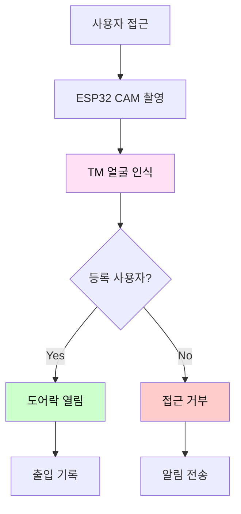

**핵심 특징:**
- 다중 사용자 얼굴 인식
- 자동 출입 통제
- 보안 로그 관리
- 개인정보 보호

---

### 3. 스마트 주차 관리 시스템

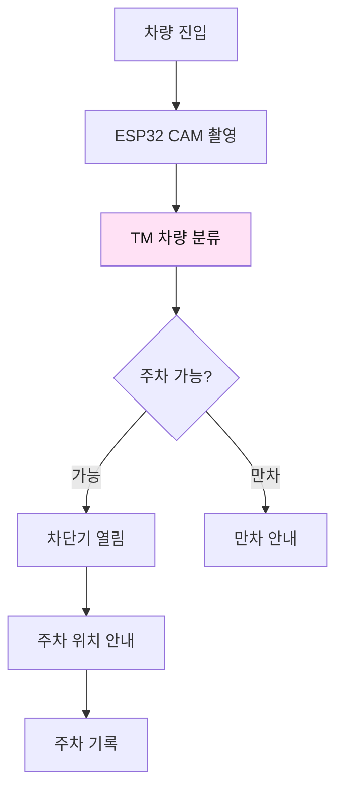

**핵심 특징:**
- 차량 종류 자동 인식
- 주차 현황 실시간 표시
- 통계 분석
- 스마트시티 학습

---

### 4. AI 학습 도우미

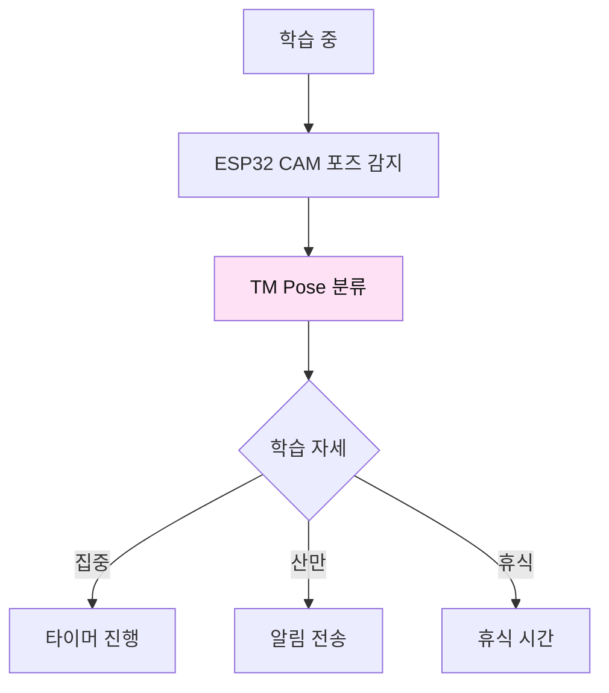

**핵심 특징:**
- 학습 자세 실시간 모니터링
- 포모도로 타이머 연동
- 집중도 통계
- 자기주도 학습 지원

---

### 5. 스마트 냉장고 관리

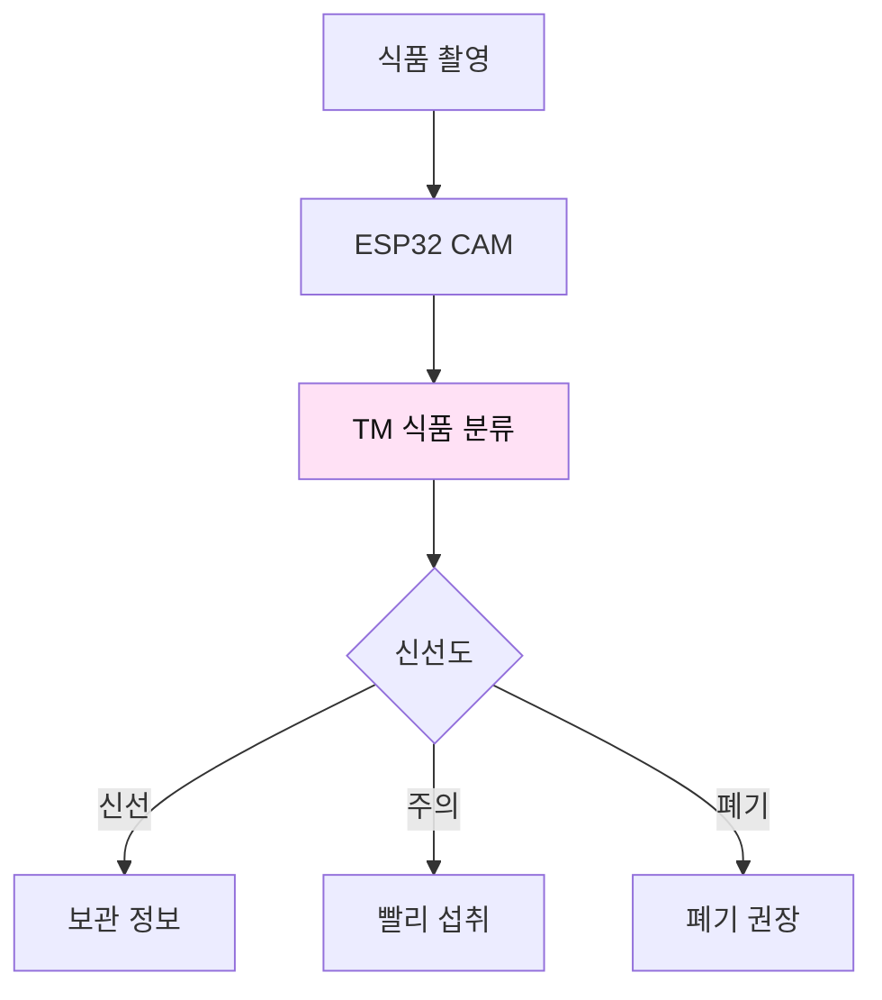

**핵심 특징:**
- 식품 신선도 자동 판단
- 유통기한 알림
- 레시피 추천
- 식품 낭비 감소

---

## 🎯 Personal Image Classifier + 앱인벤터 (6개)

### 비교표

| No | 프로젝트명 | 난이도 | 대상 | 예산 | AI 클래스 수 | 주요 기능 |
|----|-----------|--------|------|------|-------------|----------|
| 1 | 스마트 보안 카메라 | ⭐⭐ | 중1-3 | 24,000원 | 2개 | 사람/사물 감지 자동 알림 |
| 2 | 스마트 반려동물 모니터 | ⭐⭐ | 중1-3 | 16,000원 | 6개 | 반려동물 행동 분석 |
| 3 | AI 식물 질병 진단 | ⭐⭐ | 중1-3 | 23,000원 | 6개 | 식물 잎 질병 조기 진단 |
| 4 | 스마트 교실 출결 | ⭐⭐⭐ | 중2-3 | 23,000원 | 5-10개 | 학생 자동 출석 체크 |
| 5 | AI 손 씻기 도우미 | ⭐ | 중1/초등 | 25,000원 | 8개 | 손 씻기 단계 안내 |
| 6 | AI 표정 감정 인식 | ⭐⭐ | 중1-3 | 30,000원 | 6개 | 표정으로 감정 분석 |

### 1. 스마트 보안 카메라 (원본 프로젝트)

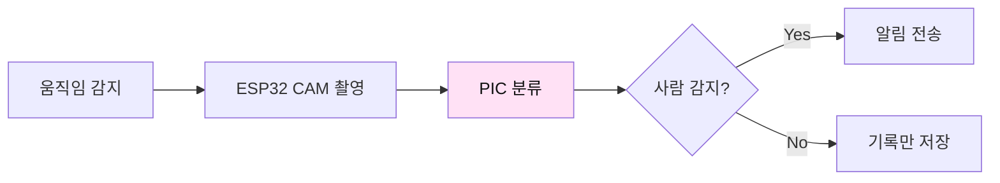

**핵심 특징:**
- 사람/사물 자동 구분
- 실시간 알림
- 클라우드 저장
- 보안 모니터링

---

### 2. 스마트 반려동물 모니터

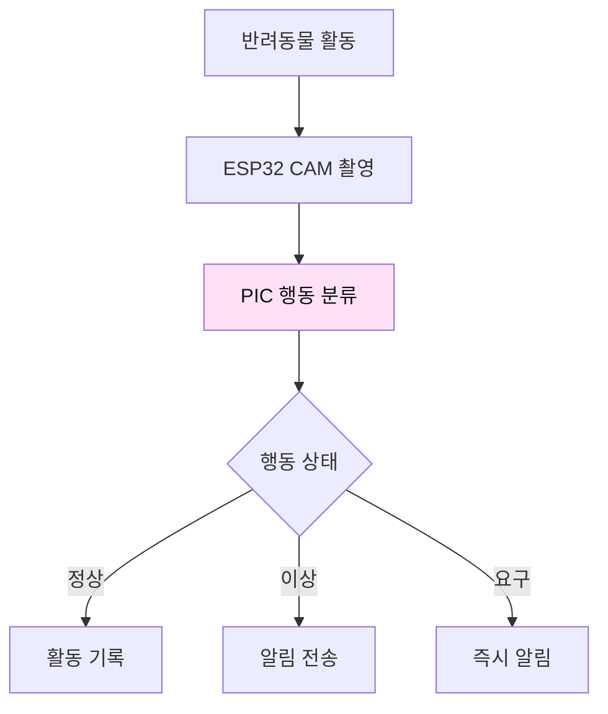

**핵심 특징:**
- 6가지 행동 인식
- 이상 행동 조기 감지
- 일일 활동 리포트
- 반려동물 건강 관리

---

### 3. AI 식물 질병 진단

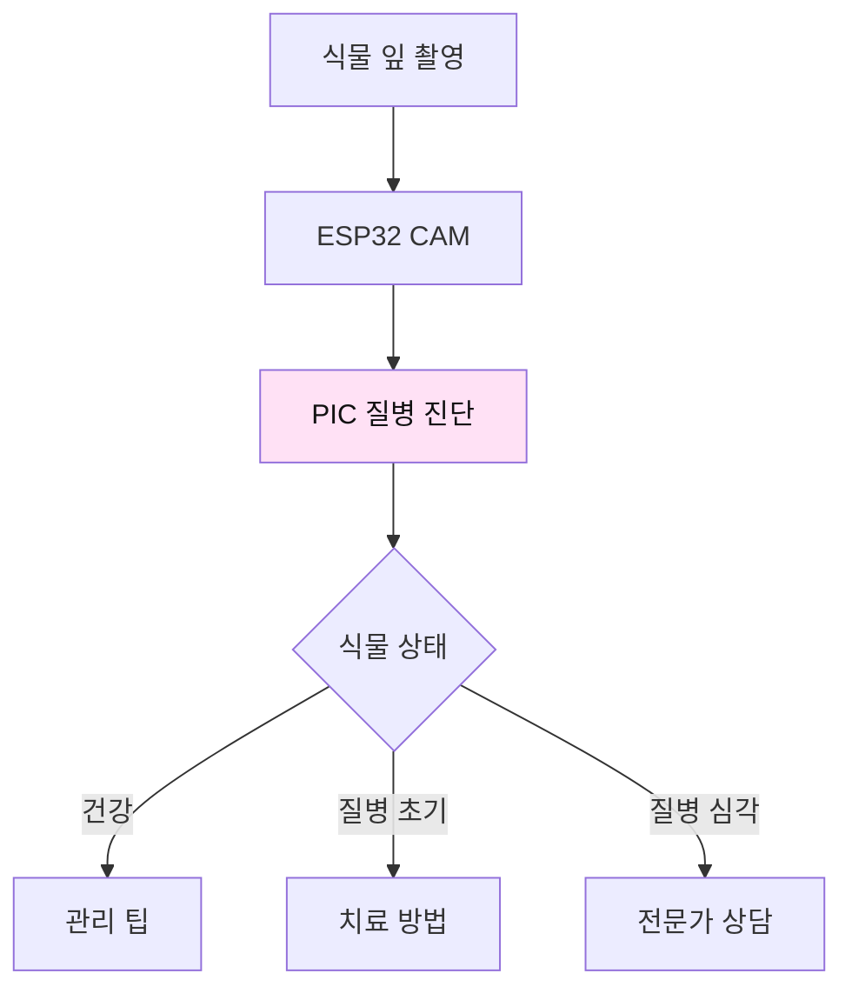

**핵심 특징:**
- 6가지 질병 조기 진단
- 치료 방법 안내
- 성장 기록 관리
- 스마트 농업 실습

---

### 4. 스마트 교실 출결 시스템

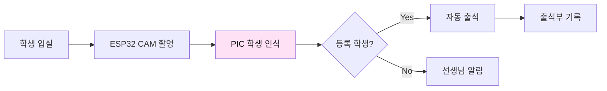

**핵심 특징:**
- 자동 출결 관리
- 중복 출석 방지
- 통계 분석
- 시간 절약

---

### 5. AI 손 씻기 도우미

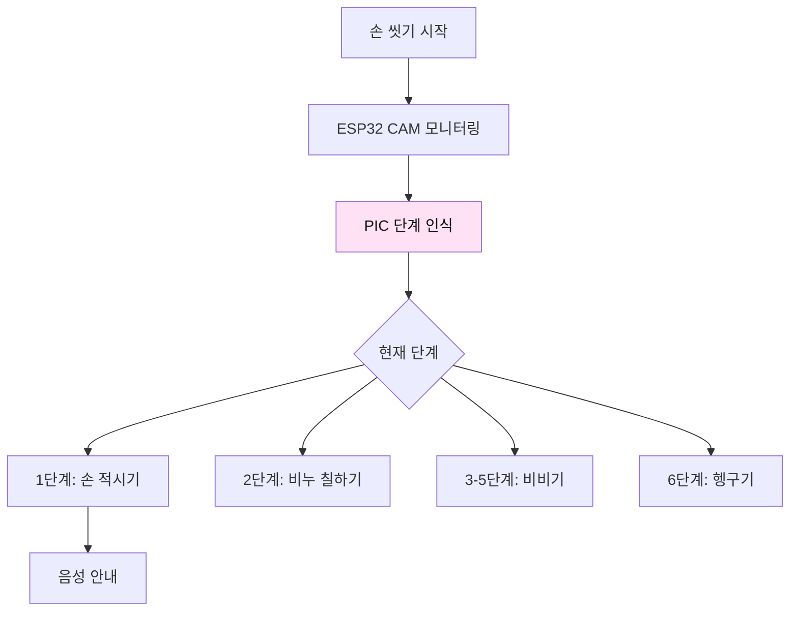

**핵심 특징:**
- WHO 6단계 손 씻기
- 단계별 음성 안내
- 30초 타이머
- 위생 교육 효과

---

### 6. AI 표정 감정 인식

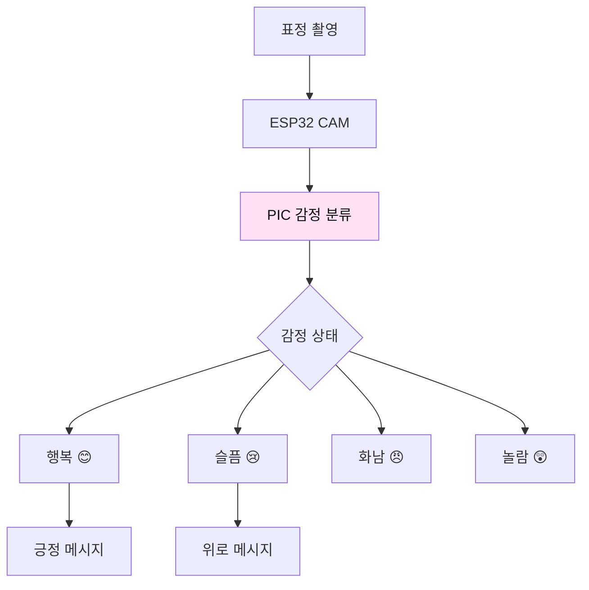

**핵심 특징:**
- 6가지 기본 감정 인식
- 감정 일기 자동 기록
- 감정 패턴 분석
- 감성 지능 발달

---

## 📊 Teachable Machine vs Personal Image Classifier

### 종합 비교표

| 구분 | Teachable Machine | Personal Image Classifier |
|------|-------------------|---------------------------|
| **제공사** | Google | MIT App Inventor |
| **학습 방식** | 웹 브라우저 | 웹 브라우저 |
| **모델 종류** | 이미지/음성/포즈 | 이미지만 |
| **앱인벤터 연동** | ⭐⭐⭐ 복잡 | ⭐⭐⭐⭐⭐ 매우 쉬움 |
| **학습 난이도** | ⭐⭐ 보통 | ⭐ 쉬움 |
| **파라미터 설정** | 고급 | 기본 |
| **정확도** | 90-95% | 85-90% |
| **모델 크기** | 다양 | 경량 |
| **오프라인 사용** | TFLite 변환 후 | 바로 가능 |
| **추천 대상** | 고급 사용자 복잡한 프로젝트 | 초보자 간단한 프로젝트 |

### 선택 가이드

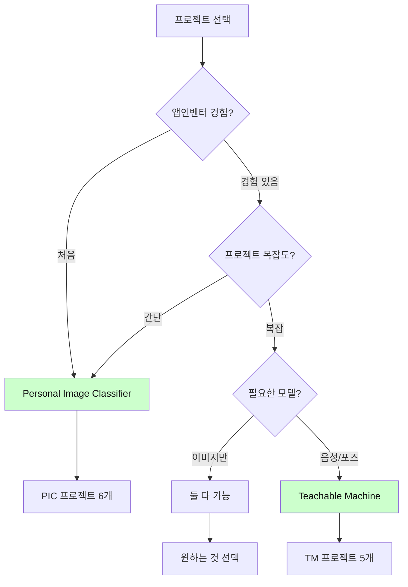

---

## 🎓 교육 커리큘럼 구조

### 공통 6차시 구조

### 차시별 학습 목표

| 차시 | 역할 | 핵심 활동 | 학습 도구 |
|------|------|----------|----------|
| 1 | 분석가 | 완성품 테스트, 구조 파악 | 관찰, 기록 |
| 2 | 데이터 수집가 | AI 학습 데이터 수집 | 카메라, TM/PIC |
| 3 | AI 트레이너 | 모델 학습 및 최적화 | TM/PIC 웹사이트 |
| 4 | 하드웨어 엔지니어 | ESP32 CAM 조립 | Arduino IDE |
| 5 | 앱 개발자 | 앱인벤터 통합 | 앱인벤터 |
| 6 | 프로젝트 매니저 | 개선 및 발표 | 발표 자료 |

---

## 💰 예산 비교

### 프로젝트별 예산

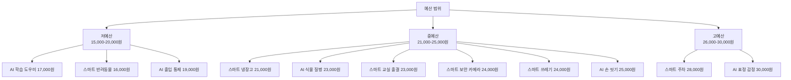

### 공통 필수 부품

| 부품 | 용도 | 가격 | 모든 프로젝트 필수 |
|------|------|------|--------------------|
| ESP32 CAM | 카메라 모듈 | 12,000원 | ✅ |
| USB 케이블 | 전원/업로드 | 3,000원 | ✅ |
| 전원 어댑터 | 전원 공급 | 5,000원 | ✅ |
| **기본 합계** |  | **20,000원** |  |

---

## 🌟 난이도별 프로젝트 추천

### 초보자 (⭐)

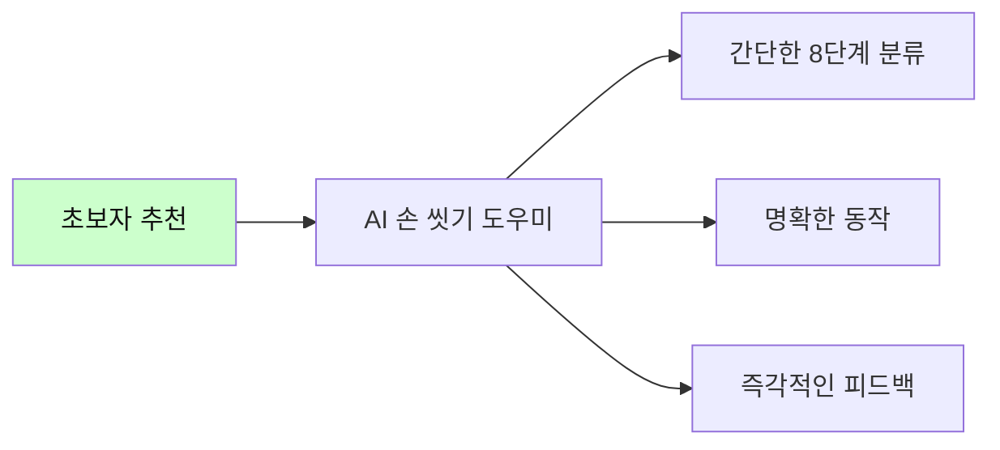

### 중급자 (⭐⭐)

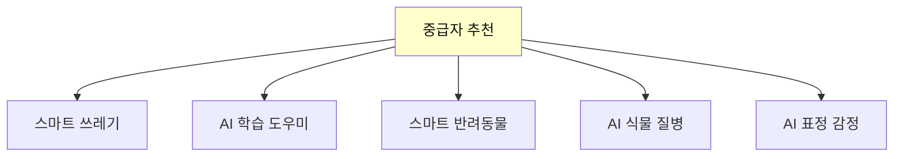

### 고급자 (⭐⭐⭐)

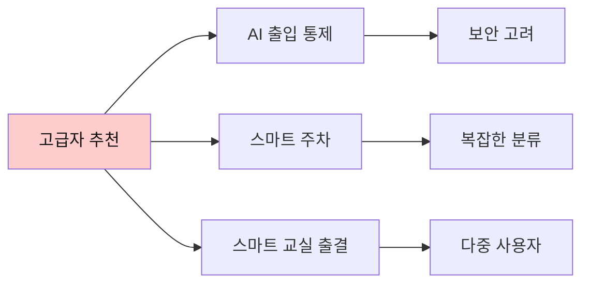

---

## 🎯 학습 목표별 프로젝트 선택

### 환경 교육

- ✅ 스마트 쓰레기 분리수거
- ✅ 스마트 냉장고 관리
- ✅ AI 식물 질병 진단

### 보건/위생 교육

- ✅ AI 손 씻기 도우미
- ✅ 스마트 반려동물 모니터

### 안전/보안 교육

- ✅ 스마트 보안 카메라
- ✅ AI 출입 통제 시스템

### 학습/자기관리

- ✅ AI 학습 도우미
- ✅ AI 표정 감정 인식
- ✅ 스마트 교실 출결

### 스마트시티

- ✅ 스마트 주차 관리

---

## 📚 참고 자료

### 공식 웹사이트

| 도구 | URL | 용도 |
|------|-----|------|
| Teachable Machine | https://teachablemachine.withgoogle.com/ | AI 모델 학습 |
| Personal Image Classifier | https://classifier.appinventor.mit.edu/ | AI 모델 학습 |
| MIT App Inventor | https://appinventor.mit.edu/ | 앱 제작 |
| Arduino | https://www.arduino.cc/ | ESP32 프로그래밍 |

### 추가 학습 자료

- ESP32 CAM 설정 가이드
- 앱인벤터 튜토리얼
- TM + 앱인벤터 연동 가이드
- PIC Extension 사용법

---

## 🎉 마무리

### 프로젝트 선택 체크리스트

- [ ] 학생 수준 확인 (초급/중급/고급)
- [ ] 예산 확인 (15,000 ~ 30,000원)
- [ ] 학습 목표 설정 (환경/보건/보안 등)
- [ ] AI 도구 선택 (TM vs PIC)
- [ ] 차시 계획 수립 (6차시)
- [ ] 준비물 확인
- [ ] 사전 테스트 완료

### 성공적인 프로젝트를 위한 팁

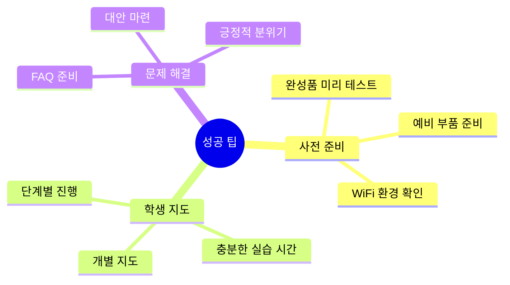

**모든 프로젝트가 여러분의 교육 현장에서 성공하기를 바랍니다!** 🚀✨

---

**제작**: AI메이커랩  
**버전**: 1.0  
**최종 수정**: 2026.02.09  
**문의**: [연락처]

