# 6차시 AI 손 씻기 도우미 (PIC + ESP32 CAM)

## 🧼 프로젝트 개요

**Personal Image Classifier**로 손 씻기 단계를 인식하여 올바른 손 씻기를 도와주는 위생 교육 시스템

### 시스템 구조도

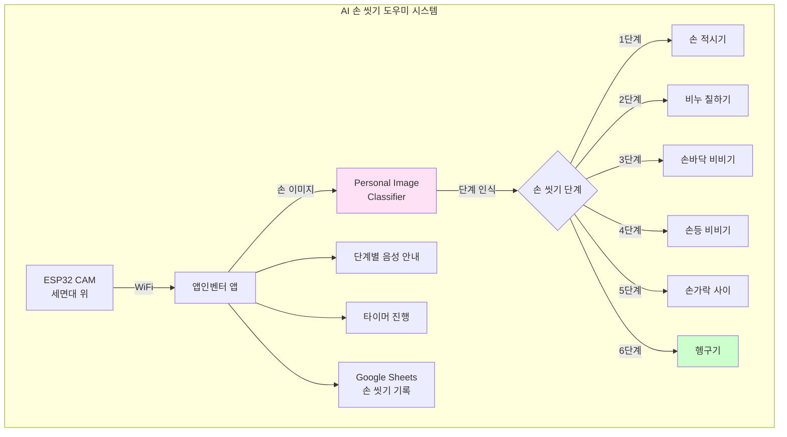

## 📊 과정 정보

| 항목 | 내용 |
|------|------|
| **수업 시간** | 6차시 (90분 × 6 = 540분) |
| **대상** | 중학교 1학년 (초등 고학년도 가능) |
| **난이도** | ⭐ 쉬움 |
| **AI 도구** | Personal Image Classifier |

## 🎯 손 씻기 단계 클래스 설계

### WHO 권장 6단계 손 씻기

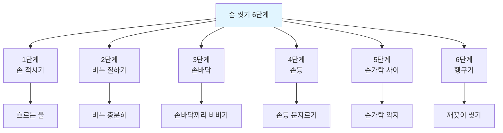

### PIC 학습 데이터

| 클래스 | 동작 | 데이터 수 | 특징점 |
|--------|------|----------|--------|
| 0단계 | 손 없음 | 30장 | 빈 세면대 |
| 1단계 | 손 적시기 | 50장 | 물만 닿음 |
| 2단계 | 비누 칠하기 | 50장 | 하얀 거품 |
| 3단계 | 손바닥 비비기 | 50장 | 손바닥끼리 맞댐 |
| 4단계 | 손등 문지르기 | 50장 | 한 손이 다른 손등 |
| 5단계 | 손가락 사이 | 50장 | 깍지 낀 모양 |
| 6단계 | 헹구기 | 50장 | 물로 씻어냄 |
| 완료 | 건조 | 30장 | 타올로 닦음 |

## 📚 차시별 구조

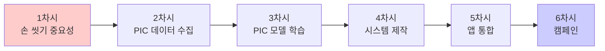

## 💡 핵심 기술

### Personal Image Classifier 손 동작 인식

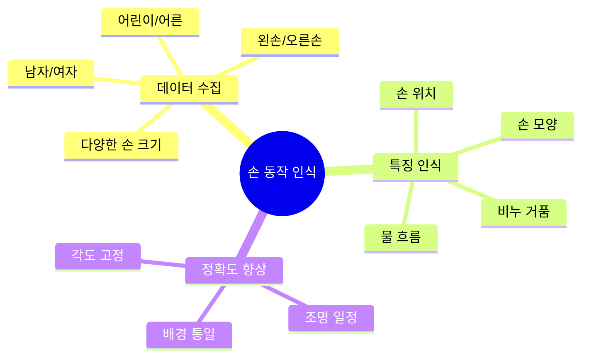

### 손 씻기 단계 감지 로직

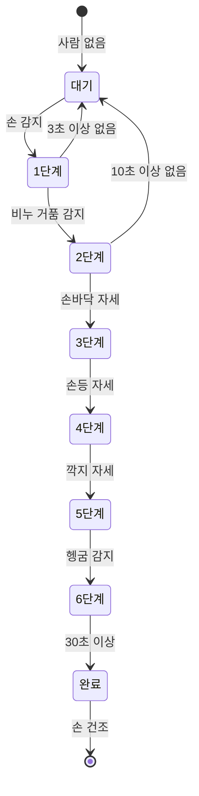

## 🔧 구성 요소

| 구성 요소 | 역할 | 가격 |
|----------|------|------|
| ESP32 CAM | 손 촬영 | 12,000원 |
| 방수 케이스 | 물 보호 | 3,000원 |
| 스피커 | 음성 안내 | 5,000원 |
| LED 스트립 | 단계 표시 | 3,000원 |
| 스탠드 | 카메라 고정 | 2,000원 |
| **합계** |  | **25,000원** |

## 📖 차시별 상세 내용

### 1차시: 손 씻기의 중요성 학습
- 손으로 전파되는 질병 조사
- 올바른 손 씻기 방법 (WHO 6단계)
- 손 씻기 실천율 조사
- AI 도우미 필요성 토론

**손 씻기 통계:**
| 상황 | 손 씻기 실천율 | 올바른 방법 |
|------|--------------|----------|
| 화장실 후 | 67% | 12% |
| 식사 전 | 42% | 8% |
| 외출 후 | 53% | 15% |
| 평균 | **54%** | **12%** |

**질병 예방 효과:**
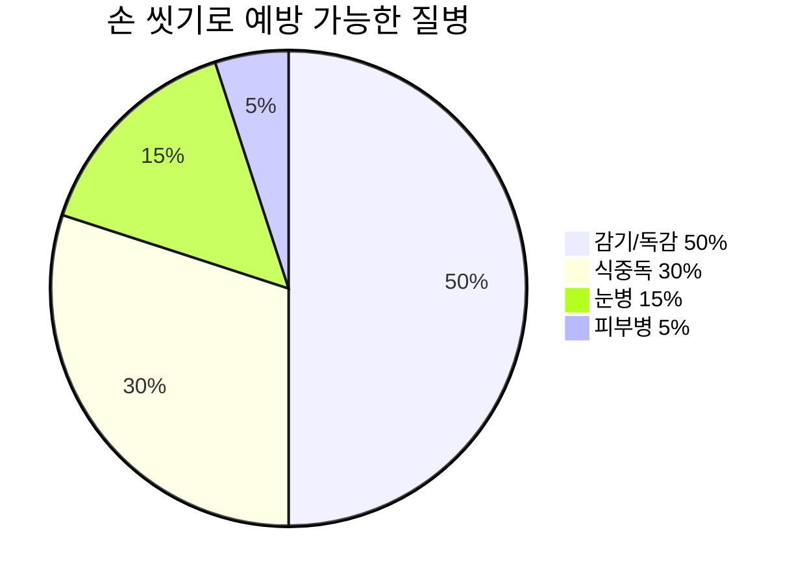

### 2차시: Personal Image Classifier 데이터 수집
- 8개 단계별 데이터 촬영
- 다양한 사람들의 손 모습
- 일정한 배경과 조명에서 촬영
- 각 단계당 50장 이상 수집

**촬영 환경 설정:**
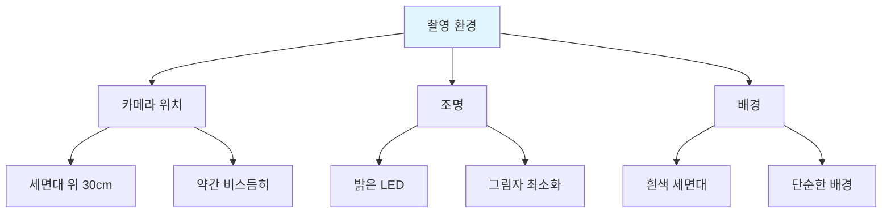

### 3차시: PIC 모델 학습 및 테스트
- PIC에서 8개 클래스 학습
- 실시간 단계 인식 테스트
- 헷갈리는 단계 추가 학습
- 모델 정확도 90% 이상 달성

**단계별 인식 난이도:**
| 단계 | 난이도 | 혼동 가능성 | 해결 방법 |
|------|--------|-----------|----------|
| 1단계 | ⭐ 쉬움 | 낮음 | - |
| 2단계 | ⭐ 쉬움 | 낮음 (거품 특징) | - |
| 3단계 | ⭐⭐ 보통 | 4, 5단계와 혼동 | 각도 데이터 추가 |
| 4단계 | ⭐⭐ 보통 | 3, 5단계와 혼동 | 손등 특징 강조 |
| 5단계 | ⭐⭐⭐ 어려움 | 3, 4단계와 혼동 | 깍지 모양 명확히 |
| 6단계 | ⭐ 쉬움 | 낮음 (물 흐름) | - |

### 4차시: 손 씻기 도우미 시스템 제작
- ESP32 CAM 방수 케이스 장착
- 세면대 위 설치
- LED 단계 표시등 제작
- 스피커로 음성 안내 구현

**설치 구조:**
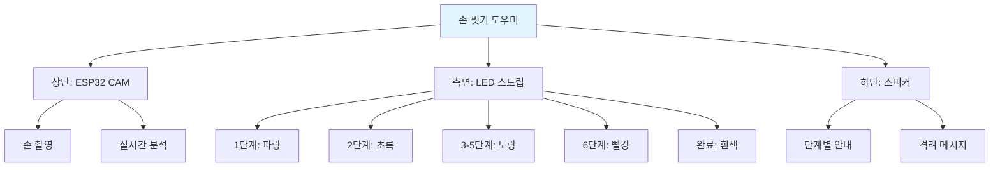

### 5차시: 앱인벤터 통합
- PIC 모델 업로드
- 단계별 음성 안내 녹음
- 30초 타이머 구현
- Google Sheets 손 씻기 기록
- 일일/주간 통계 표시

**앱 화면:**
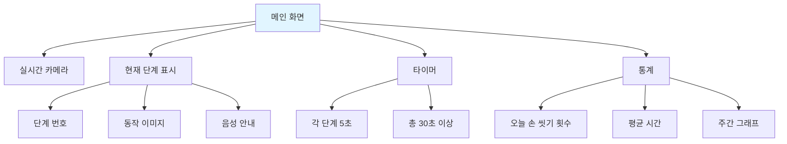

**음성 안내 대본:**
| 단계 | 안내 멘트 | 지속 시간 |
|------|----------|----------|
| 시작 | "손 씻기를 시작합니다!" | - |
| 1단계 | "손을 물에 적셔주세요" | 5초 |
| 2단계 | "비누를 충분히 칠해주세요" | 5초 |
| 3단계 | "손바닥을 잘 비벼주세요" | 5초 |
| 4단계 | "손등도 깨끗이 문질러주세요" | 5초 |
| 5단계 | "손가락 사이도 닦아주세요" | 5초 |
| 6단계 | "깨끗이 헹궈주세요" | 5초 |
| 완료 | "잘하셨어요! 깨끗한 손!" | - |

### 6차시: 손 씻기 캠페인 및 발표
- 학교 화장실에 시스템 설치
- 1주일 사용 데이터 수집
- 손 씻기 실천율 변화 분석
- 캠페인 포스터 제작
- 최종 발표

**캠페인 활동:**
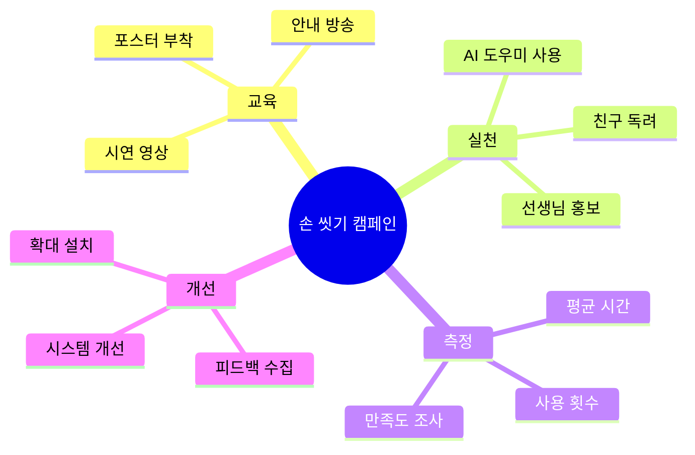

## 📊 손 씻기 개선 효과

### 사용 전후 비교

| 지표 | 사용 전 | 사용 후 | 개선율 |
|------|---------|---------|--------|
| 손 씻기 실천율 | 54% | 87% | 61% ↑ |
| 올바른 방법 | 12% | 78% | 550% ↑ |
| 평균 손 씻기 시간 | 8초 | 35초 | 337% ↑ |
| 6단계 완료율 | 5% | 72% | 1340% ↑ |

### 주간 사용 통계

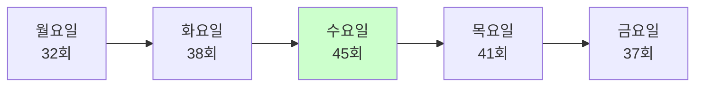

## 🌟 확장 아이디어

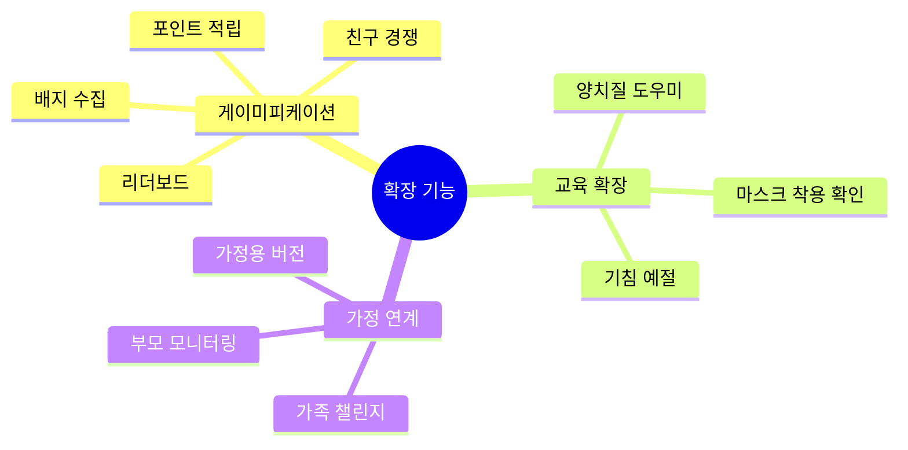

## 🌟 기대 효과

- 올바른 손 씻기 습관 형성
- 감염병 예방
- 위생 의식 향상
- 건강한 학교 환경
- 공중 보건 개선

