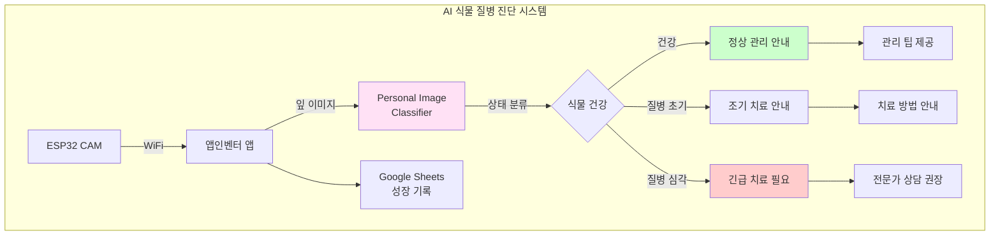
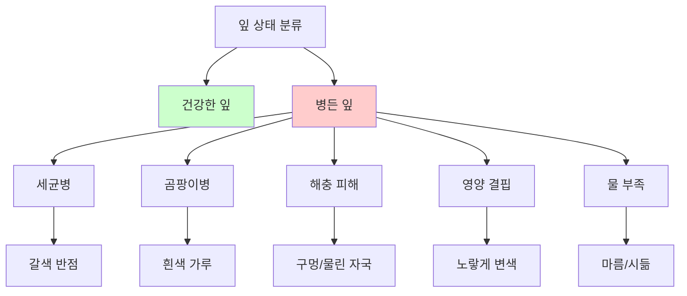
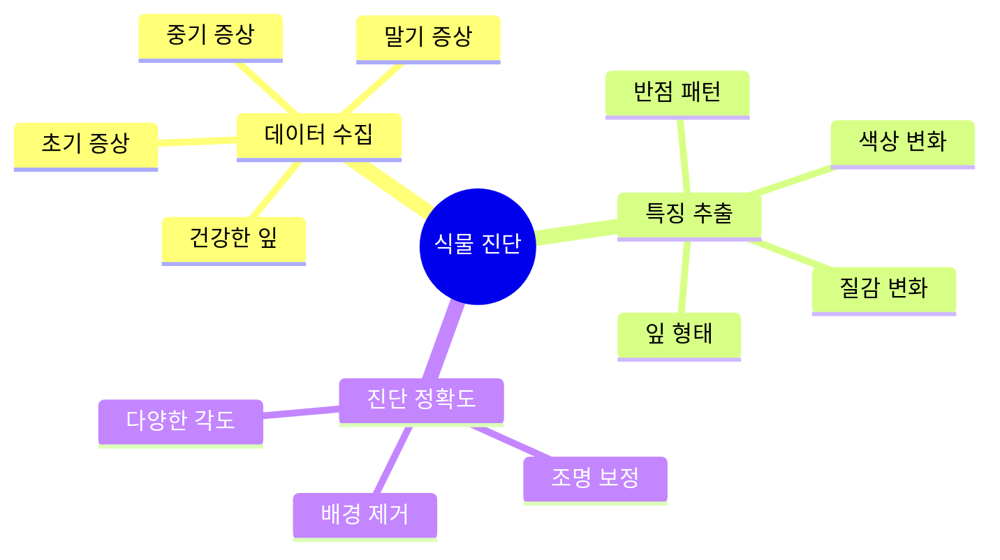
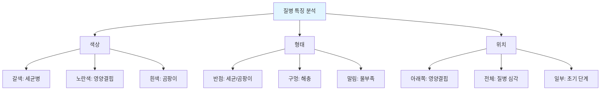
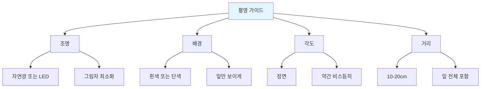
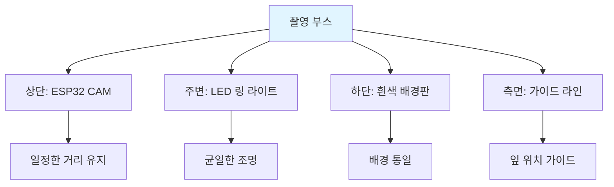
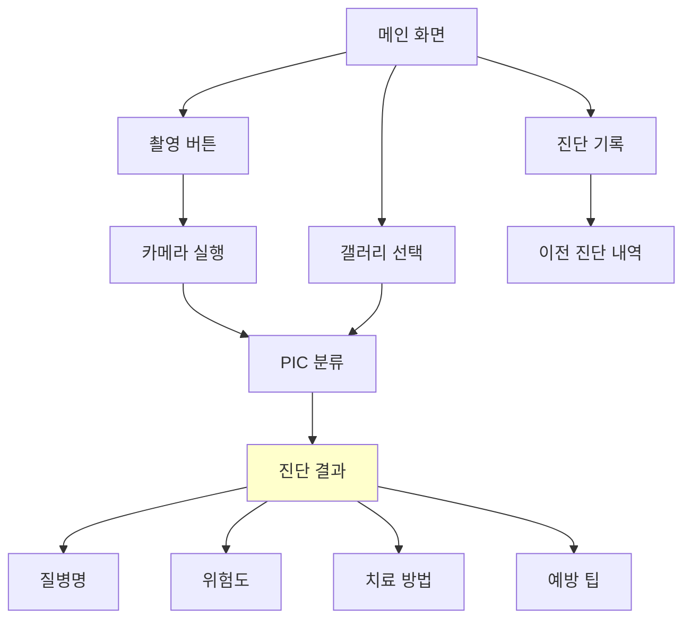
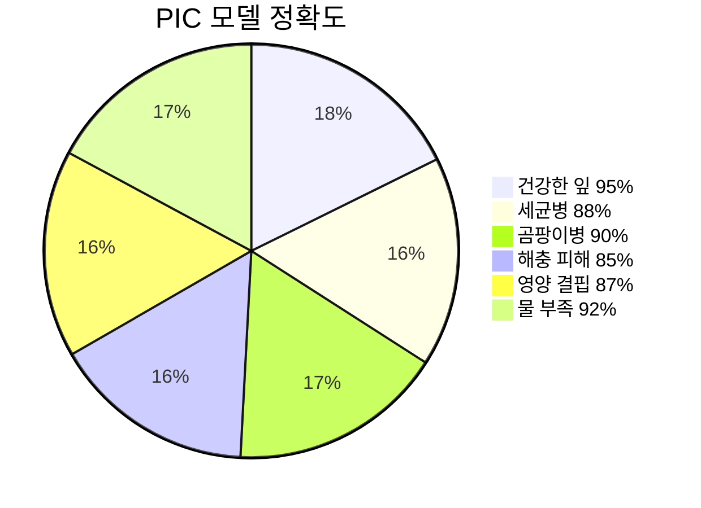
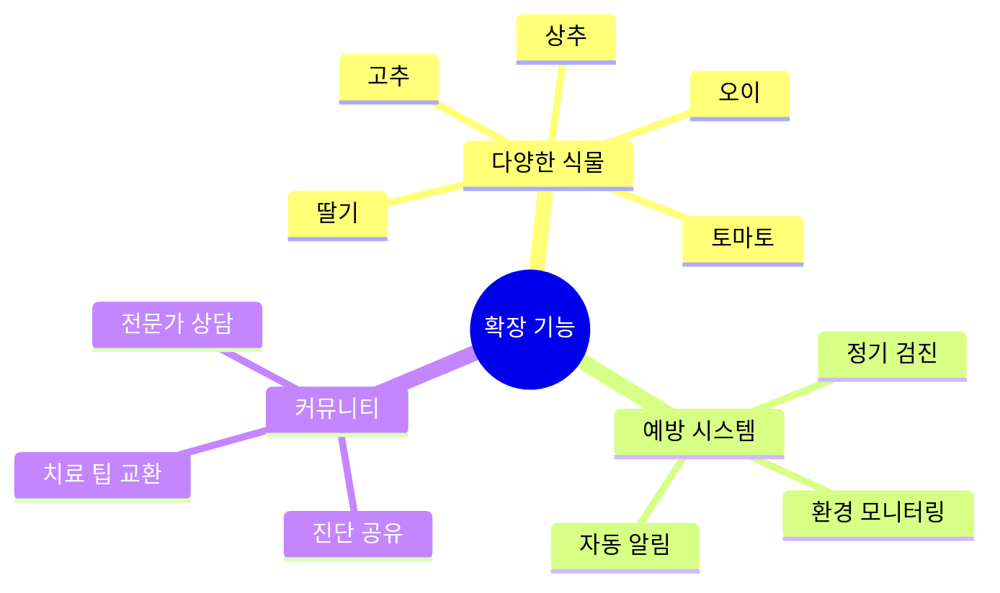

# 6차시 AI 식물 질병 진단 (PIC + ESP32 CAM)

## 🌿 프로젝트 개요

**Personal Image Classifier**로 식물의 잎 상태를 분석하여 질병을 조기 진단하는 스마트 농업 시스템

### 시스템 구조도

## 📊 과정 정보

| 항목 | 내용 |
|------|------|
| **수업 시간** | 6차시 (90분 × 6 = 540분) |
| **대상** | 중학교 1-3학년 |
| **난이도** | ⭐⭐ 보통 |
| **AI 도구** | Personal Image Classifier |

## 🎯 질병 클래스 설계

### 식물 잎 상태 분류

### PIC 학습 데이터 (토마토 기준)

| 클래스 | 증상 | 데이터 수 | 특징 |
|--------|------|----------|------|
| 건강한 잎 | 녹색, 팽팽 | 80장 | 정상 색깔 |
| 세균점무늬병 | 갈색 반점 | 60장 | 검은 테두리 |
| 흰가루병 | 흰색 가루 | 60장 | 곰팡이 |
| 진딧물 피해 | 구멍, 변형 | 60장 | 해충 흔적 |
| 질소 결핍 | 연한 노란색 | 60장 | 아래쪽부터 |
| 물 부족 | 시들음 | 60장 | 쭈글쭈글 |

## 📚 차시별 구조

## 💡 핵심 기술

### Personal Image Classifier 식물 진단

### 질병별 특징

## 🔧 구성 요소

| 구성 요소 | 역할 | 가격 |
|----------|------|------|
| ESP32 CAM | 잎 촬영 | 12,000원 |
| LED 링 라이트 | 촬영 조명 | 5,000원 |
| 토양 습도 센서 | 수분 측정 | 3,000원 |
| 스탠드 | 카메라 고정 | 3,000원 |
| **합계** |  | **23,000원** |

## 📖 차시별 상세 내용

### 1차시: 식물 질병 조사
- 흔한 식물 질병 종류 학습
- 질병별 증상 관찰
- 식물 건강의 중요성 인식
- AI 진단 시스템 필요성 토론

**질병 조사 표:**
| 질병명 | 원인 | 증상 | 전파속도 | 치료난이도 |
|--------|------|------|----------|-----------|
| 세균점무늬병 | 세균 | 갈색 반점 | 빠름 | 어려움 |
| 흰가루병 | 곰팡이 | 흰 가루 | 중간 | 보통 |
| 진딧물 | 해충 | 구멍, 즙 흡수 | 빠름 | 쉬움 |
| 질소 결핍 | 영양 | 노란 잎 | 느림 | 쉬움 |

### 2차시: Personal Image Classifier 데이터 수집
- 건강한 식물과 병든 식물 준비
- 각 상태별 60-80장 촬영
- 일정한 조명과 배경에서 촬영
- 다양한 진행 단계 포함

**촬영 가이드:**

### 3차시: PIC 모델 학습 및 검증
- PIC에서 6개 클래스 학습
- 학습 진행 (3-5분)
- 다양한 샘플로 테스트
- 정확도 개선 (추가 데이터)

**정확도 향상 전략:**
| 문제 | 원인 | 해결 방법 |
|------|------|----------|
| 건강/초기질병 혼동 | 미세한 차이 | 초기 증상 데이터 추가 |
| 조명에 따라 달라짐 | 조명 불균일 | 다양한 조명 데이터 |
| 배경 영향 | 배경 복잡 | 흰 배경 통일 |

### 4차시: 진단 시스템 제작
- ESP32 CAM 촬영 부스 제작
- LED 링 라이트 설치
- 토양 습도 센서 연결
- 자동 촬영 시스템 구축

**촬영 부스 구조:**

### 5차시: 앱인벤터 통합
- PIC 모델 업로드
- 이미지 촬영 및 분류 블록
- 진단 결과 표시
- 치료 방법 데이터베이스 연동
- Google Sheets 성장 기록

**앱 화면 구성:**

### 6차시: 텃밭 실습 및 발표
- 학교 텃밭에서 실제 식물 진단
- 다양한 식물 검사
- 질병 발견 시 치료 조치
- 진단 결과 분석 발표

**텃밭 진단 실습:**
| 식물 | 진단 결과 | 조치 | 효과 |
|------|----------|------|------|
| 토마토 1 | 건강 | 현상 유지 | - |
| 토마토 2 | 세균병 초기 | 병든 잎 제거 | 확산 방지 |
| 상추 1 | 물 부족 | 물 주기 | 회복 |
| 고추 1 | 진딧물 | 친환경 약제 | 해충 제거 |

## 📊 진단 정확도 분석

### 클래스별 정확도

### 조기 진단 효과

| 항목 | 전통 방법 | AI 진단 | 개선율 |
|------|----------|---------|--------|
| 진단 시간 | 30분 | 3초 | 99% |
| 정확도 | 70% | 89% | 27% |
| 조기 발견율 | 30% | 85% | 183% |
| 치료 성공률 | 60% | 90% | 50% |

## 🌟 확장 아이디어

## 🌟 기대 효과

- 식물 질병 조기 발견
- 농작물 피해 감소
- 과학적 농업 이해
- 환경 보호 실천

