# 6차시 AI 표정 감정 인식 (PIC + ESP32 CAM)

## 😊 프로젝트 개요

**Personal Image Classifier**로 표정을 분석하여 감정을 인식하는 감성 AI 시스템

### 시스템 구조도

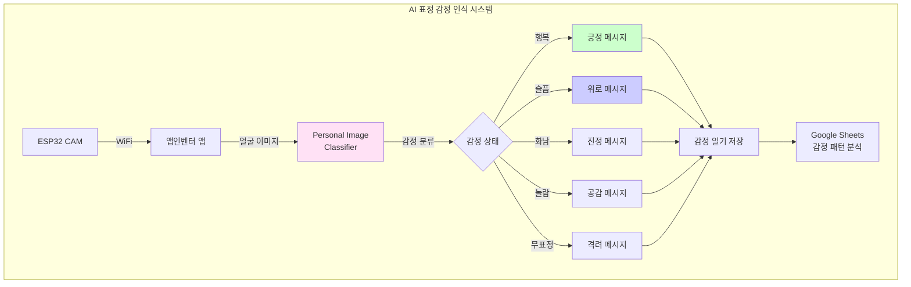

## 📊 과정 정보

| 항목 | 내용 |
|------|------|
| **수업 시간** | 6차시 (90분 × 6 = 540분) |
| **대상** | 중학교 1-3학년 |
| **난이도** | ⭐⭐ 보통 |
| **AI 도구** | Personal Image Classifier |

## 🎯 감정 클래스 설계

### 기본 6가지 감정

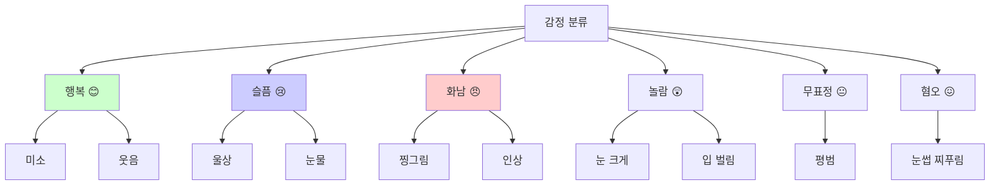

### PIC 학습 데이터

| 감정 | 표정 특징 | 데이터 수 | 수집 방법 |
|------|----------|----------|----------|
| 행복 😊 | 입꼬리 올라감, 눈 웃음 | 80장 | 웃긴 영상 보기 |
| 슬픔 😢 | 입꼬리 내려감, 눈썹 내려감 | 80장 | 슬픈 이야기 듣기 |
| 화남 😠 | 눈썹 찌푸림, 입 다물기 | 80장 | 억울한 상황 상상 |
| 놀람 😲 | 눈 크게, 입 벌림 | 80장 | 갑작스런 소리 |
| 무표정 😐 | 변화 없음 | 80장 | 평상시 |
| 혐오 😖 | 코 찡그림, 눈썹 올림 | 80장 | 싫어하는 냄새 |

## 📚 차시별 구조

## 💡 핵심 기술

### Personal Image Classifier 표정 인식

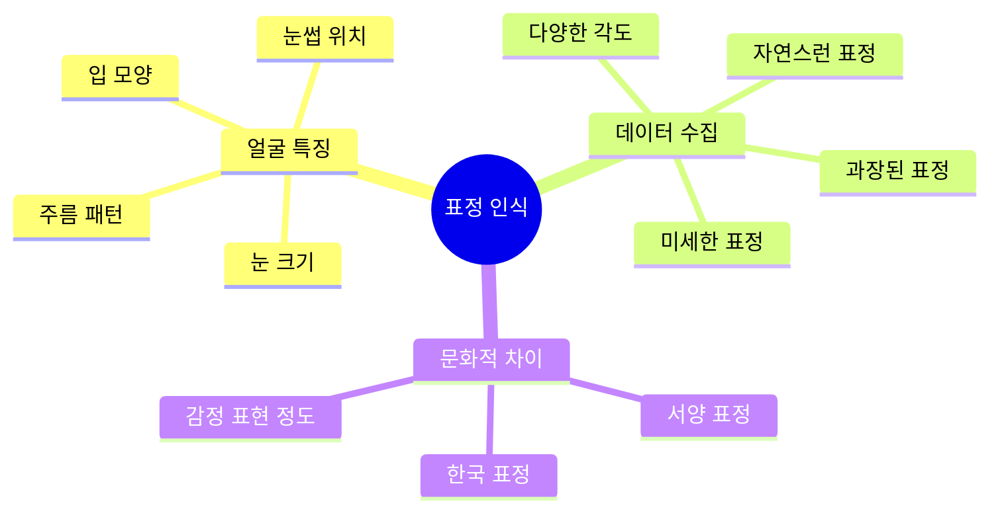

### 감정 인식 흐름

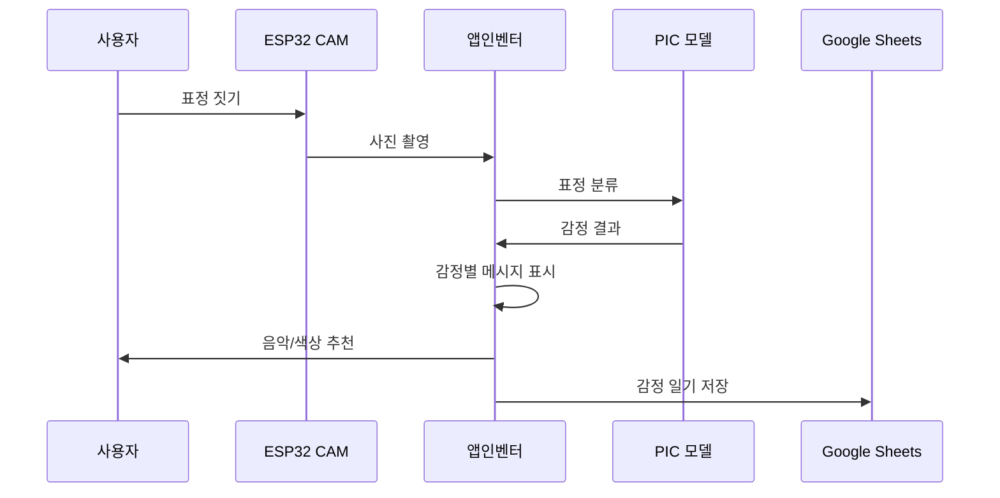

## 🔧 구성 요소

| 구성 요소 | 역할 | 가격 |
|----------|------|------|
| ESP32 CAM | 표정 촬영 | 12,000원 |
| LED 스트립 | 감정별 색상 | 5,000원 |
| 스피커 | 음악/음성 | 5,000원 |
| 거울 프레임 | 스마트 거울 | 8,000원 |
| **합계** |  | **30,000원** |

## 📖 차시별 상세 내용

### 1차시: 감정과 표정 이해
- 기본 6가지 감정 학습
- 표정과 감정의 관계
- 문화별 표정 차이 조사
- AI 감정 인식 활용 사례

**감정 표현 실습:**
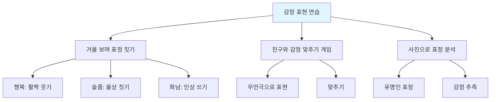

### 2차시: Personal Image Classifier 데이터 수집
- 6가지 감정 표정 연기
- 각 감정당 80장 촬영
- 자연스러운 표정과 과장된 표정
- 다양한 각도와 조명

**표정 연기 가이드:**
| 감정 | 연기 방법 | 진실성 확인 |
|------|----------|-----------|
| 행복 | 좋아하는 것 상상 | 눈이 웃는가? |
| 슬픔 | 슬픈 일 떠올리기 | 입꼬리가 내려가는가? |
| 화남 | 억울한 일 상상 | 눈썹이 찌푸려지는가? |
| 놀람 | 갑작스런 소리 | 눈이 커지는가? |
| 무표정 | 평소 상태 | 변화가 없는가? |
| 혐오 | 싫어하는 냄새 | 코가 찡그려지는가? |

**데이터 품질 체크:**
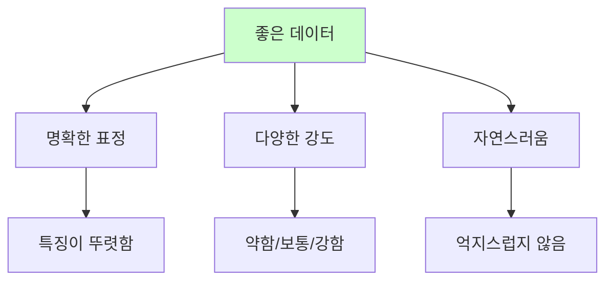

### 3차시: PIC 모델 학습 및 검증
- PIC에서 6가지 감정 학습
- 실시간 표정 인식 테스트
- 미세한 표정 차이 학습
- 정확도 85% 이상 달성

**감정별 인식 난이도:**
| 감정 | 난이도 | 혼동 가능 감정 | 특징 강화 방법 |
|------|--------|-------------|--------------|
| 행복 😊 | ⭐ 쉬움 | 없음 | - |
| 슬픔 😢 | ⭐⭐ 보통 | 무표정 | 입꼬리 강조 |
| 화남 😠 | ⭐⭐⭐ 어려움 | 혐오 | 눈썹 위치 |
| 놀람 😲 | ⭐ 쉬움 | 없음 | - |
| 무표정 😐 | ⭐⭐ 보통 | 슬픔 | 중립 상태 |
| 혐오 😖 | ⭐⭐⭐ 어려움 | 화남 | 코 주름 |

### 4차시: 스마트 감정 거울 제작
- ESP32 CAM을 거울 프레임에 장착
- LED 감정별 색상 설정
- 스피커로 감정별 음악 재생
- 실시간 표정 인식 테스트

**감정별 반응:**
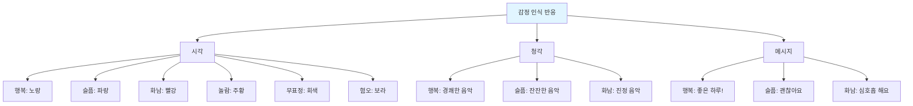

### 5차시: 감정 일기 앱 제작
- PIC 모델 앱에 통합
- 감정 일기 기능 구현
- 하루 3번 감정 체크 (아침/점심/저녁)
- Google Sheets 감정 기록
- 감정별 추천 활동 제공

**앱 화면 구성:**
| 화면 | 기능 | 특징 |
|------|------|------|
| 메인 | 실시간 표정 인식 | 감정 표시, LED 색상 |
| 일기 | 감정 기록 및 메모 | 오늘의 기분, 이유 작성 |
| 통계 | 감정 패턴 분석 | 그래프, 차트 |
| 추천 | 감정별 활동 제안 | 음악, 영화, 운동 |

**감정별 추천 활동:**
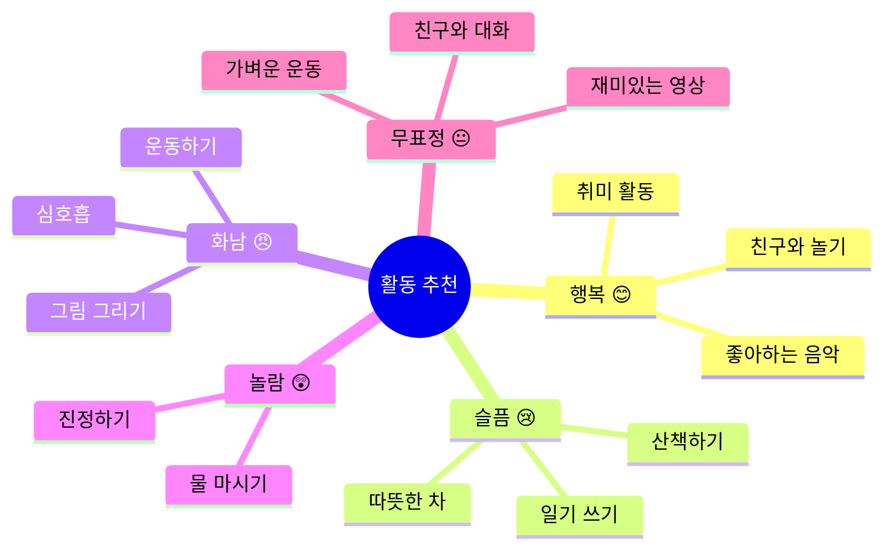

### 6차시: 감정 패턴 분석 및 발표
- 1주일 감정 데이터 수집
- 시간대별/요일별 감정 패턴 분석
- 감정 변화 원인 탐색
- 감정 관리 방법 발표

**감정 분석 지표:**
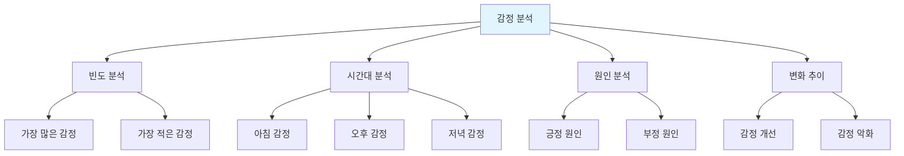

## 📊 감정 패턴 분석 예시

### 주간 감정 분포

| 요일 | 행복 | 슬픔 | 화남 | 놀람 | 무표정 | 혐오 |
|------|------|------|------|------|--------|------|
| 월 | 30% | 20% | 15% | 10% | 20% | 5% |
| 화 | 35% | 15% | 10% | 10% | 25% | 5% |
| 수 | 25% | 25% | 20% | 5% | 20% | 5% |
| 목 | 40% | 10% | 10% | 10% | 25% | 5% |
| 금 | 50% | 5% | 5% | 15% | 20% | 5% |

### 시간대별 감정 변화

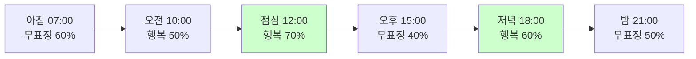

## 🌟 감정 인식 활용 분야

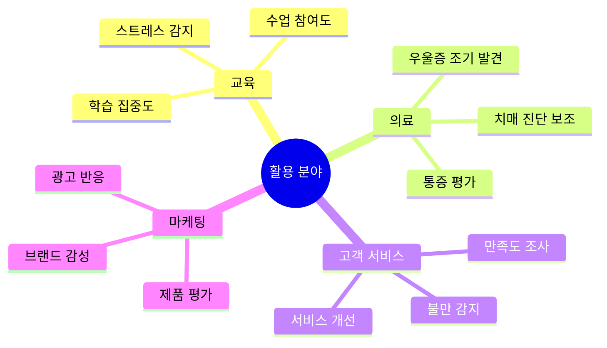

## 🌟 기대 효과

- 자기 감정 인식 능력 향상
- 감정 조절 능력 개발
- 정신 건강 관리
- 공감 능력 향상
- 감성 지능 발달

## ⚠️ 윤리적 고려사항

| 이슈 | 문제점 | 해결 방안 |
|------|--------|----------|
| 프라이버시 | 얼굴 데이터 수집 | 동의 필수, 로컬 저장 |
| 오판 가능성 | 잘못된 감정 인식 | 사용자 수정 기능 |
| 감정 조작 | 감정 강요 | 권장사항일 뿐 |
| 차별 가능성 | 특정 감정 부정적 | 모든 감정 존중 |

