# 6차시 스마트 교실 출결 시스템 (PIC + ESP32 CAM)

## 👥 프로젝트 개요

**Personal Image Classifier**로 학생을 인식하여 자동으로 출결을 관리하는 스마트 교실 시스템

### 시스템 구조도

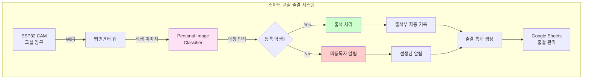

## 📊 과정 정보

| 항목 | 내용 |
|------|------|
| **수업 시간** | 6차시 (90분 × 6 = 540분) |
| **대상** | 중학교 2-3학년 |
| **난이도** | ⭐⭐⭐ 어려움 |
| **AI 도구** | Personal Image Classifier |

## 🎯 학생 인식 클래스 설계

### 출결 상태 분류

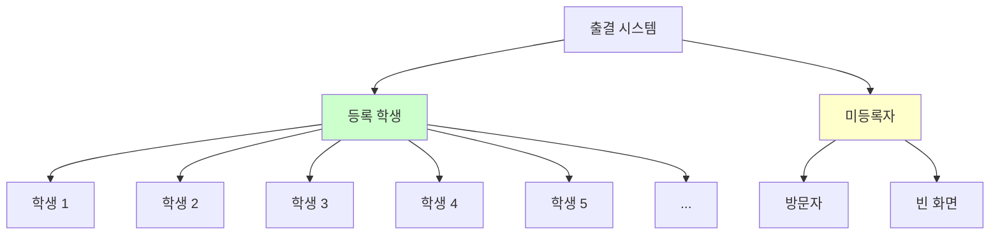

### PIC 학습 데이터 (5명 기준)

| 클래스 | 설명 | 데이터 수 | 촬영 조건 |
|--------|------|----------|----------|
| 학생1 | 김민수 | 50장 | 다양한 표정/각도 |
| 학생2 | 이지은 | 50장 | 안경 착용/미착용 |
| 학생3 | 박준영 | 50장 | 모자 착용/미착용 |
| 학생4 | 최서연 | 50장 | 다양한 옷/헤어스타일 |
| 학생5 | 정현우 | 50장 | 마스크 착용/미착용 |
| 방문자 | 기타 사람들 | 100장 | 다양한 사람 |
| 빈 화면 | 사람 없음 | 50장 | 빈 배경 |

## 📚 차시별 구조

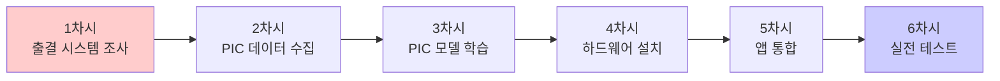

## 💡 핵심 기술

### Personal Image Classifier 얼굴 인식

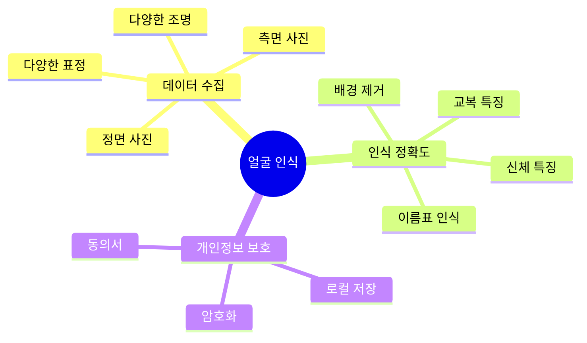

### 출결 처리 흐름

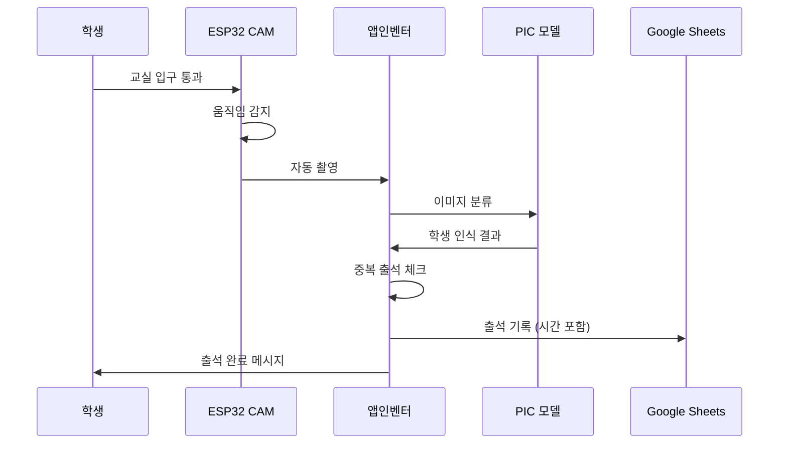

## 🔧 구성 요소

| 구성 요소 | 역할 | 가격 |
|----------|------|------|
| ESP32 CAM | 학생 촬영 | 12,000원 |
| PIR 센서 | 움직임 감지 | 2,000원 |
| LED 디스플레이 | 출석 안내 | 8,000원 |
| 부저 | 출석 확인음 | 1,000원 |
| **합계** |  | **23,000원** |

## 📖 차시별 상세 내용

### 1차시: 출결 관리 시스템 조사
- 현재 출석 방법의 문제점
- AI 출결 시스템 장단점
- 개인정보 보호 중요성
- 시스템 설계 및 기획

**출석 방법 비교:**
| 방법 | 장점 | 단점 | 시간 |
|------|------|------|------|
| 점호 | 정확 | 시간 소요 | 5분 |
| 카드 | 빠름 | 대리 출석 가능 | 2분 |
| 지문 | 정확, 빠름 | 위생 문제 | 3분 |
| **AI 인식** | **정확, 자동** | **초기 설정 필요** | **즉시** |

### 2차시: Personal Image Classifier 데이터 수집
- 팀원 5명 얼굴 데이터 수집
- 각 학생당 50장 이상 촬영
- 다양한 조건에서 촬영
- 방문자/빈 화면 데이터 수집

**데이터 수집 가이드:**
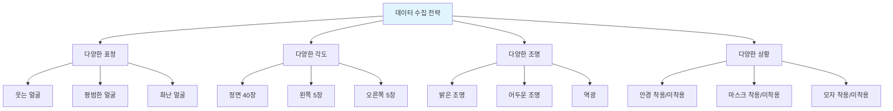

### 3차시: PIC 모델 학습 및 검증
- PIC에서 7개 클래스 학습
- 실시간 인식 테스트
- 오인식 사례 추가 학습
- 신뢰도 임계값 설정

**인식 정확도 목표:**
| 클래스 | 목표 정확도 | 중요도 | 오인식 허용 |
|--------|------------|--------|------------|
| 학생 1-5 | 95% 이상 | 매우 높음 | 거의 없음 |
| 방문자 | 90% 이상 | 높음 | 낮음 |
| 빈 화면 | 98% 이상 | 높음 | 거의 없음 |

### 4차시: 하드웨어 설치
- ESP32 CAM 교실 입구 설치
- PIR 센서로 움직임 감지
- LED 디스플레이 출석 안내
- 부저로 출석 확인음

**설치 위치 선정:**
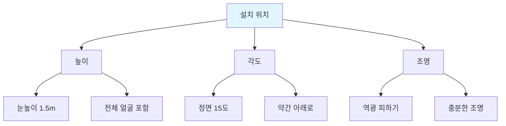

### 5차시: 앱인벤터 통합
- PIC 모델 업로드
- 자동 출석 처리 블록
- 중복 출석 방지 로직
- Google Sheets 출석부 연동
- 출결 통계 대시보드

**앱 기능:**
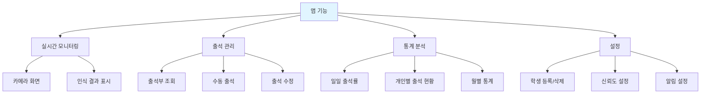

### 6차시: 실전 테스트 및 발표
- 1주일 실제 출석 체크
- 정확도 및 오류 분석
- 개선 방안 도출
- 개인정보 보호 점검
- 최종 발표

**테스트 시나리오:**
| 시나리오 | 기대 결과 | 실제 결과 | 개선 방안 |
|---------|----------|----------|----------|
| 정상 출석 | 자동 인식 | 95% 성공 | - |
| 안경 착용 | 정상 인식 | 92% 성공 | 데이터 추가 |
| 마스크 착용 | 낮은 신뢰도 | 70% 성공 | 눈 주변 학습 |
| 동시 입실 | 순차 인식 | 85% 성공 | 대기 시간 증가 |

## 📊 출결 통계 분석

### 일주일 출석 현황

| 학생 | 월 | 화 | 수 | 목 | 금 | 출석률 |
|------|---|---|---|---|---|----|
| 김민수 | O | O | O | O | O | 100% |
| 이지은 | O | O | X | O | O | 80% |
| 박준영 | O | O | O | O | O | 100% |
| 최서연 | O | X | O | O | O | 80% |
| 정현우 | O | O | O | O | O | 100% |
| **평균** |  |  |  |  |  | **92%** |

### 시간대별 입실 패턴

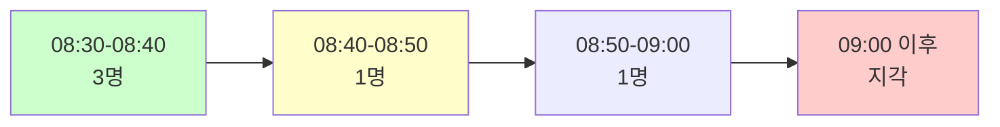

## 🔒 개인정보 보호

### 보안 조치

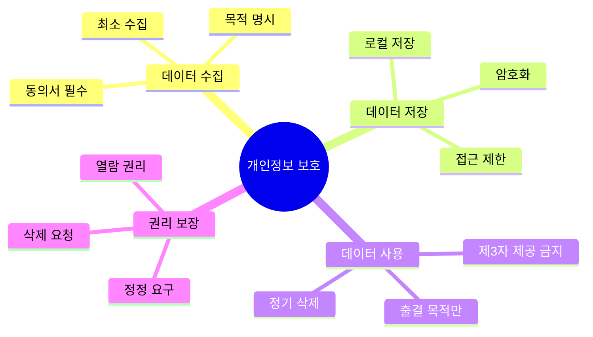

### 윤리적 고려사항

| 이슈 | 문제점 | 해결 방안 |
|------|--------|----------|
| 사생활 침해 | 지속적 감시 | 입구에서만 촬영 |
| 차별 가능성 | 특정 학생 불리 | 공정성 검증 |
| 데이터 유출 | 해킹 위험 | 암호화, 정기 삭제 |
| 동의 없는 사용 | 강제성 | 동의서, 대안 제공 |

## 🌟 확장 아이디어

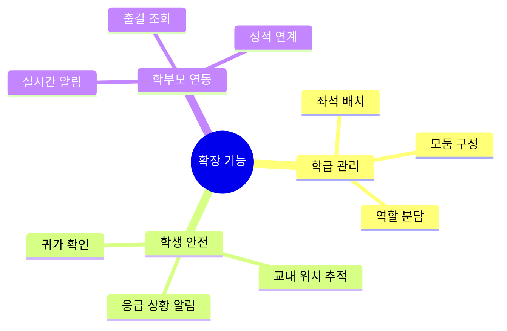

## 🌟 기대 효과

- 출석 체크 자동화 (시간 절약)
- 정확한 출결 관리
- 통계 기반 관리
- 학생 안전 확보
- 행정 업무 경감

