# 6차시 스마트 반려동물 모니터 (PIC + ESP32 CAM)

## 🐕 프로젝트 개요

**Personal Image Classifier**로 반려동물의 행동을 분석하고 건강을 관리하는 스마트 모니터링 시스템

### 시스템 구조도

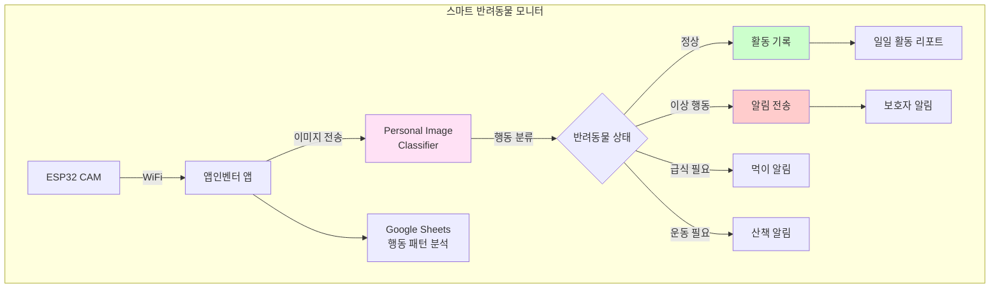

## 📊 과정 정보

| 항목 | 내용 |
|------|------|
| **수업 시간** | 6차시 (90분 × 6 = 540분) |
| **대상** | 중학교 1-3학년 |
| **난이도** | ⭐⭐ 보통 |
| **AI 도구** | Personal Image Classifier |

## 🎯 행동 클래스 설계

### 반려동물 행동 분류

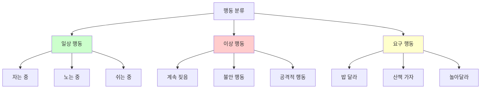

### PIC 학습 데이터

| 클래스 | 설명 | 데이터 수 | 특징 |
|--------|------|----------|------|
| 자는 중 | 눈 감고 누워있음 | 50장 | 움직임 없음 |
| 노는 중 | 활발하게 움직임 | 50장 | 빠른 움직임 |
| 쉬는 중 | 앉거나 누워서 휴식 | 50장 | 느긋한 자세 |
| 짖는 중 | 입 벌리고 짖음 | 50장 | 머리 들어올림 |
| 밥 요구 | 그릇 앞에서 대기 | 50장 | 그릇 응시 |
| 산책 요구 | 문 앞에서 대기 | 50장 | 흥분 상태 |

## 📚 차시별 구조

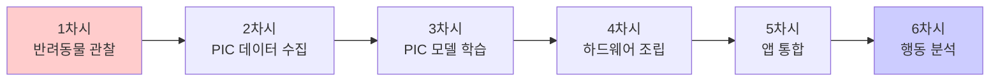

## 💡 핵심 기술

### Personal Image Classifier 특징

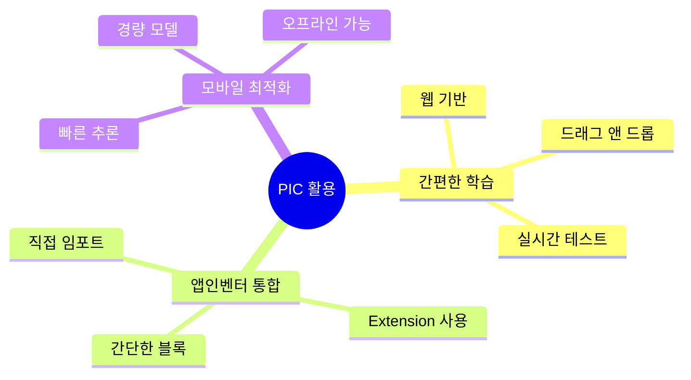

### 행동 패턴 분석

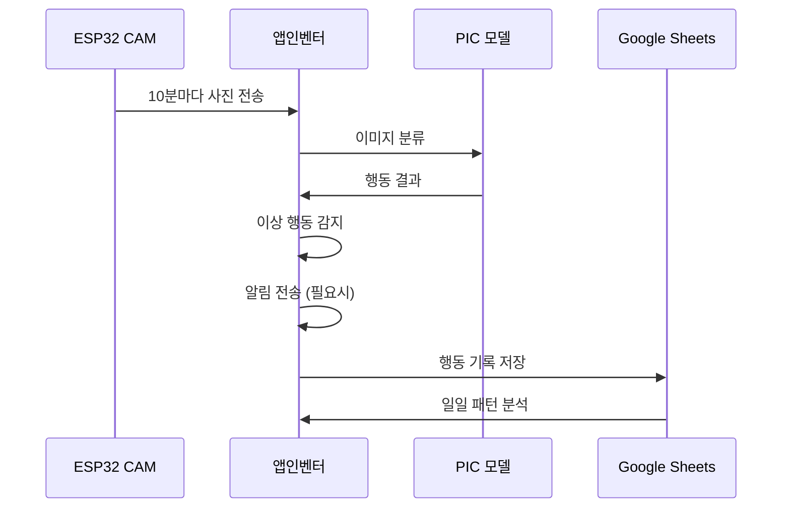

## 🔧 구성 요소

| 구성 요소 | 역할 | 가격 |
|----------|------|------|
| ESP32 CAM | 반려동물 촬영 | 12,000원 |
| PIR 센서 | 움직임 감지 | 2,000원 |
| 부저 | 알림음 | 1,000원 |
| LED | 상태 표시 | 1,000원 |
| **합계** |  | **16,000원** |

## 📖 차시별 상세 내용

### 1차시: 반려동물 행동 관찰
- 반려동물 행동 특성 이해
- 일상 행동 vs 이상 행동 구분
- 보호자가 알아야 할 신호들
- 모니터링 필요성 인식

**행동 관찰 일지:**
| 시간 | 행동 | 상태 | 특이사항 |
|------|------|------|----------|
| 07:00 | 밥 요구 | 정상 | 그릇 앞 대기 |
| 10:00 | 자는 중 | 정상 | 조용함 |
| 12:00 | 노는 중 | 정상 | 장난감과 놀이 |
| 15:00 | 계속 짖음 | 이상 | 분리불안? |

### 2차시: Personal Image Classifier 데이터 수집
- PIC 웹사이트 접속
- 6개 행동 클래스 생성
- 각 클래스별 50장 이상 촬영
- 다양한 시간대/장소에서 수집

**데이터 수집 팁:**
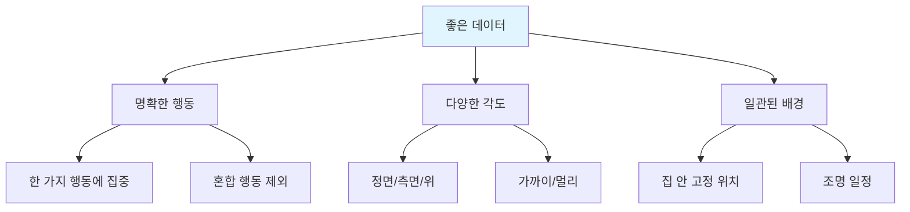

### 3차시: PIC 모델 학습 및 테스트
- PIC에서 모델 학습 (3-5분)
- 실시간 테스트
- 정확도 확인 및 개선
- 모델 다운로드 (.mdl 파일)

**학습 체크리스트:**
| 단계 | 작업 | 완료 |
|------|------|------|
| 1 | 각 클래스 50장 이상 | [ ] |
| 2 | Train Model 클릭 | [ ] |
| 3 | 학습 완료 대기 | [ ] |
| 4 | 실시간 테스트 | [ ] |
| 5 | 정확도 80% 이상 확인 | [ ] |
| 6 | 모델 다운로드 | [ ] |

### 4차시: 하드웨어 조립
- ESP32 CAM 설치 (반려동물 관찰 위치)
- PIR 센서로 움직임 감지
- 움직임 감지 시 자동 촬영
- LED/부저로 상태 표시

**설치 위치 선정:**
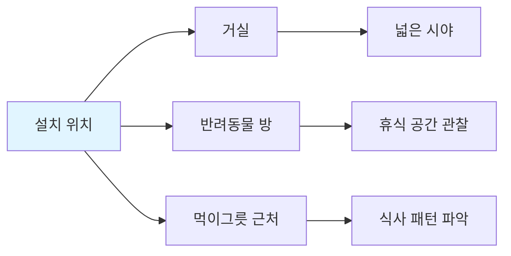

### 5차시: 앱인벤터 통합
- PIC 모델을 앱에 업로드
- PersonalImageClassifier Extension 사용
- 10분마다 자동 촬영 및 분류
- 이상 행동 감지 시 알림
- Google Sheets 행동 기록

**앱 블록 구조:**
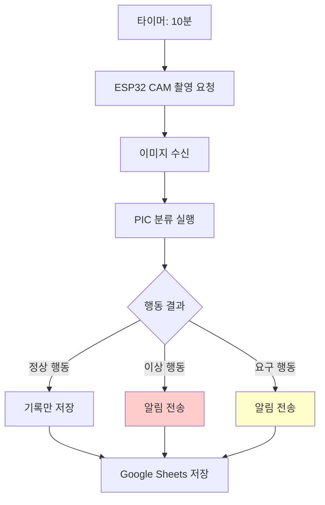

### 6차시: 행동 패턴 분석 및 발표
- 1주일 행동 데이터 수집
- 시간대별 행동 패턴 분석
- 이상 행동 발견 및 원인 추측
- 건강 상태 평가
- 최종 발표

**행동 패턴 분석:**
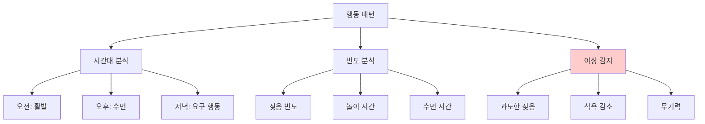

## 📊 일주일 행동 분석 예시

### 행동 빈도 통계

| 행동 | 월 | 화 | 수 | 목 | 금 | 토 | 일 | 평균 |
|------|---|---|---|---|---|---|---|----|
| 자는 중 | 8h | 9h | 7h | 8h | 8h | 10h | 9h | 8.4h |
| 노는 중 | 2h | 1.5h | 2h | 2h | 1h | 3h | 3h | 2.1h |
| 쉬는 중 | 4h | 4h | 5h | 4h | 5h | 3h | 4h | 4.1h |
| 짖는 중 | 10회 | 8회 | 12회 | 9회 | 11회 | 6회 | 7회 | 9회 |

### 시간대별 활동 패턴

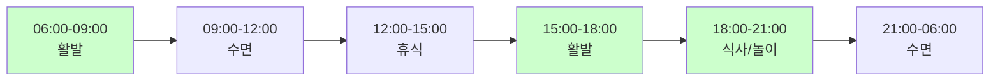

## 🌟 Personal Image Classifier vs Teachable Machine

| 구분 | Personal Image Classifier | Teachable Machine |
|------|---------------------------|-------------------|
| **개발사** | MIT App Inventor | Google |
| **학습 방식** | 웹 브라우저 | 웹 브라우저 |
| **앱인벤터 통합** | ⭐⭐⭐⭐⭐ 매우 쉬움 | ⭐⭐⭐ 보통 |
| **모델 종류** | 이미지만 | 이미지/음성/포즈 |
| **학습 난이도** | ⭐ 쉬움 | ⭐⭐ 보통 |
| **정확도** | 85-90% | 90-95% |
| **추천 대상** | 초보자, 간단한 프로젝트 | 고급 사용자, 복잡한 프로젝트 |

## 🌟 확장 아이디어

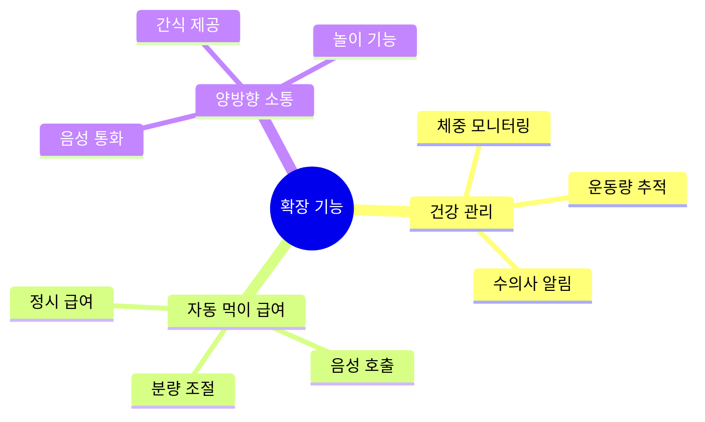

## 🌟 기대 효과

- 반려동물 건강 관리
- 분리불안 감소
- 행동 이상 조기 발견
- 보호자 안심

