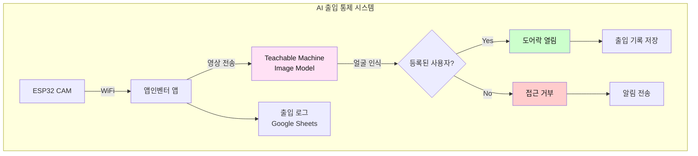
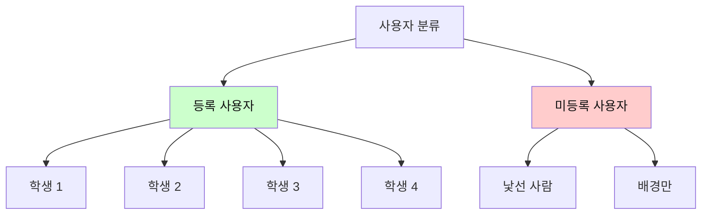
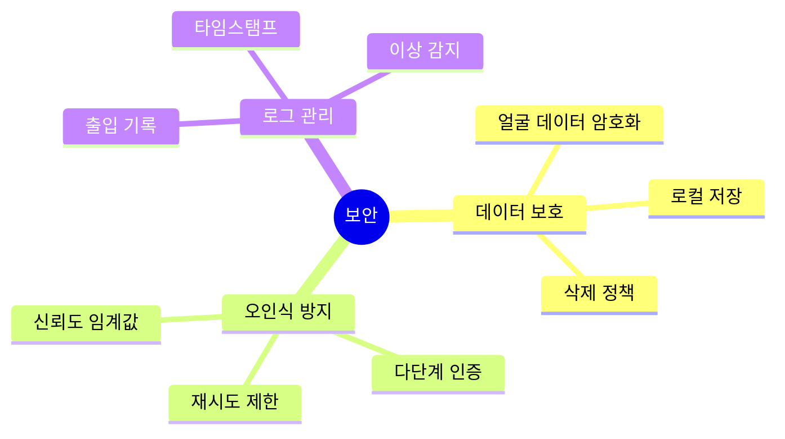
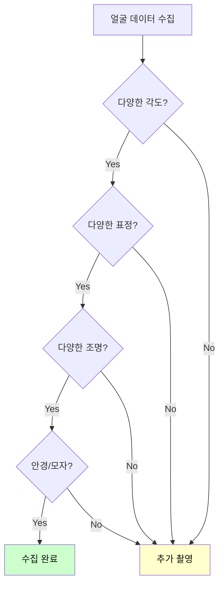
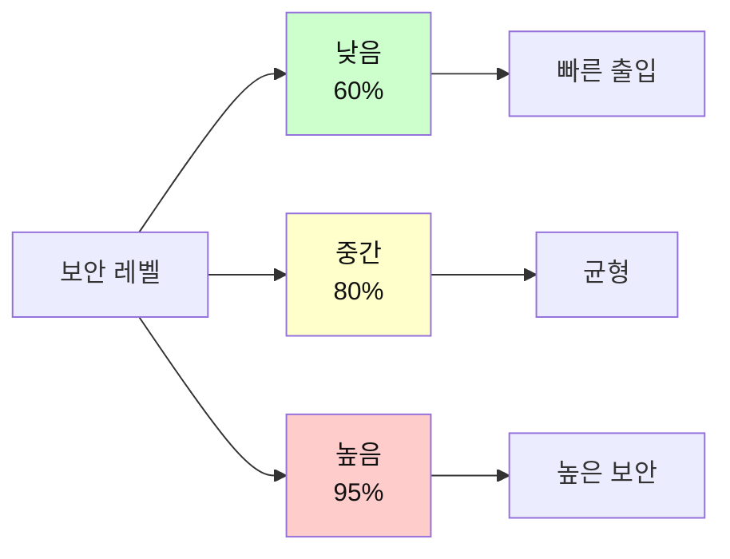

# 6차시 AI 출입 통제 시스템 (TM + ESP32 CAM)

## 🔐 프로젝트 개요

**Teachable Machine Pose Model**로 얼굴 또는 신체 인식을 통한 스마트 출입 통제 시스템

### 시스템 구조도

## 📊 과정 정보

| 항목 | 내용 |
|------|------|
| **수업 시간** | 6차시 (90분 × 6 = 540분) |
| **대상** | 중학교 1-3학년 |
| **난이도** | ⭐⭐⭐ 어려움 |
| **AI 도구** | Teachable Machine Image Model |

## 🎯 학습 목표

### 인식 클래스 설계

## 📚 차시별 구조

## 💡 핵심 기술

### Teachable Machine 얼굴 인식 팁

| 단계 | 작업 | 주의사항 |
|------|------|----------|
| 데이터 수집 | 각 사용자 50-100장 | 다양한 각도, 표정, 조명 |
| 배경 학습 | 빈 배경 50장 | 오인식 방지 |
| 미등록자 | 다양한 사람 100장 | 보안 강화 |
| 테스트 | 실시간 테스트 | 조명 변화 확인 |

### 보안 고려사항

## 🔧 구성 요소

| 구성 요소 | 역할 | 가격 |
|----------|------|------|
| ESP32 CAM | 카메라 모듈 | 12,000원 |
| 서보모터 | 도어락 개폐 | 5,000원 |
| 부저 | 알림음 | 1,000원 |
| LED (빨강/초록) | 상태 표시 | 1,000원 |
| **합계** |  | **19,000원** |

## 📖 차시별 상세 내용

### 1차시: 출입 통제 시스템 분석
- 기존 출입 통제 방식 조사 (카드키, 지문, 얼굴)
- AI 얼굴 인식 원리 이해
- 완성 시스템 작동 테스트
- 보안 요구사항 정리

### 2차시: Teachable Machine 데이터 수집
- 각 팀원 얼굴 데이터 50장 수집
- 다양한 조건에서 촬영
- 미등록자 데이터 수집
- 배경만 있는 이미지 수집

**데이터 수집 체크리스트:**

### 3차시: 모델 학습 및 테스트
- TM에서 모델 학습
- 실시간 인식 테스트
- 정확도 개선 (데이터 추가)
- TFLite 모델 내보내기

### 4차시: 하드웨어 조립
- ESP32 CAM 설치
- 서보모터 도어락 제작
- LED 및 부저 연결
- 회로 통합 테스트

### 5차시: 앱인벤터 통합
- TM 모델 임포트
- 얼굴 인식 블록 구현
- 도어락 제어 로직
- 출입 로그 Google Sheets 연동

### 6차시: 보안 테스트 및 발표
- 다양한 시나리오 테스트
- 오인식률 측정
- 보안 취약점 분석
- 최종 발표

## 🛡️ 보안 레벨 설정

## 🌟 기대 효과

- 생체 인식 기술 이해
- 보안 시스템 원리 학습
- 개인정보 보호 인식
- AI 윤리 교육

