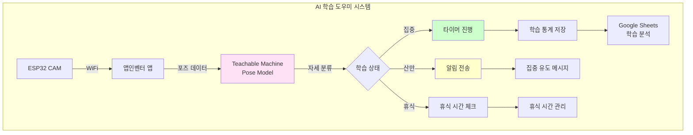
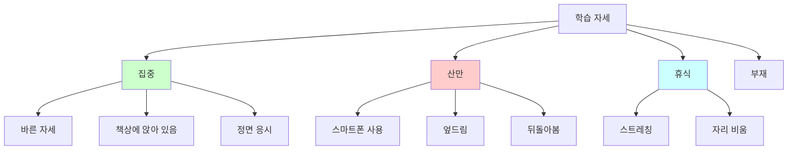
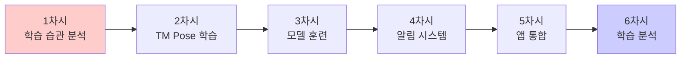
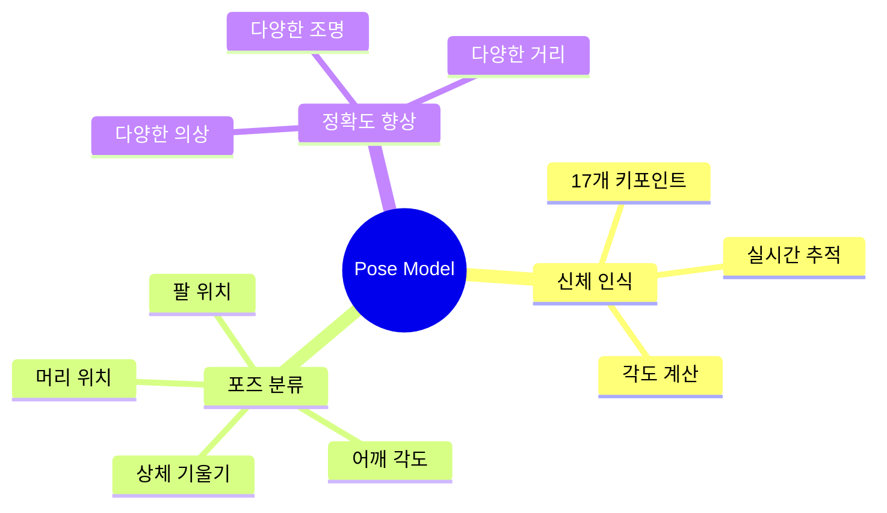
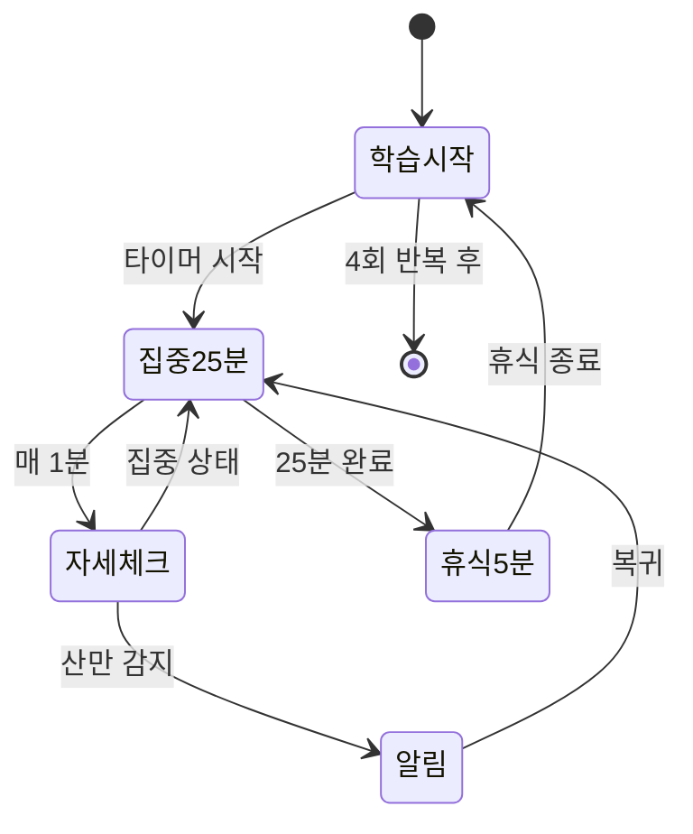
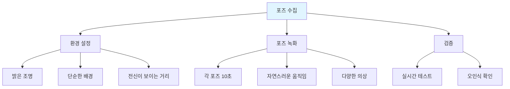
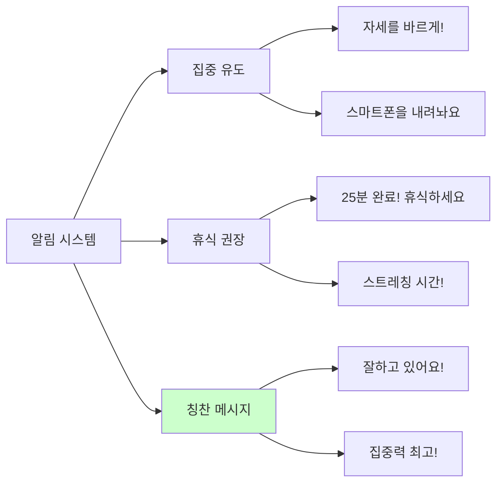
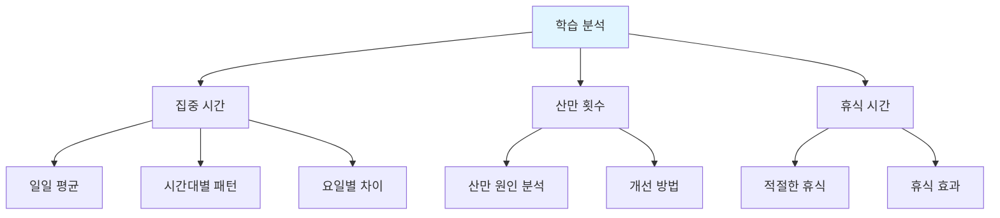
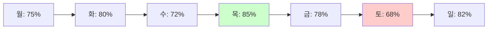
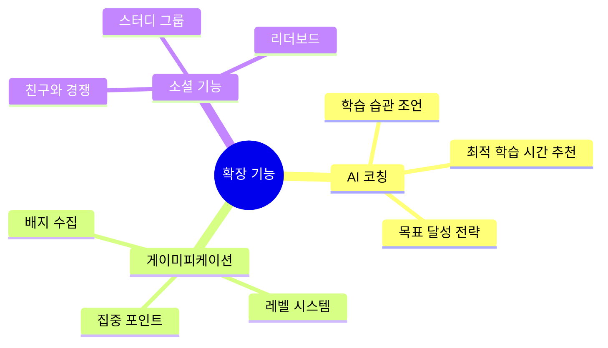

# 6차시 AI 학습 도우미 (TM + ESP32 CAM)

## 📚 프로젝트 개요

**Teachable Machine Pose Model**로 학습 자세 및 집중도를 모니터링하는 스마트 학습 도우미

### 시스템 구조도

## 📊 과정 정보

| 항목 | 내용 |
|------|------|
| **수업 시간** | 6차시 (90분 × 6 = 540분) |
| **대상** | 중학교 1-3학년 |
| **난이도** | ⭐⭐ 보통 |
| **AI 도구** | Teachable Machine Pose Model |

## 🎯 자세 클래스 설계

### 학습 자세 분류

### 포즈 인식 데이터

| 클래스 | 설명 | 데이터 수 | 특징점 |
|--------|------|----------|--------|
| 집중 | 바른 자세로 공부 | 100개 포즈 | 머리/어깨/팔 위치 |
| 산만 (스마트폰) | 고개 숙이고 스마트폰 | 80개 포즈 | 팔 내려감, 고개 숙임 |
| 산만 (엎드림) | 책상에 엎드림 | 80개 포즈 | 머리 낮아짐 |
| 휴식 | 스트레칭 | 60개 포즈 | 팔 들어올림 |
| 부재 | 자리 비움 | 80개 포즈 | 사람 없음 |

## 📚 차시별 구조

## 💡 핵심 기술

### Teachable Machine Pose Model

### 포모도로 기법 통합

## 🔧 구성 요소

| 구성 요소 | 역할 | 가격 |
|----------|------|------|
| ESP32 CAM | 자세 모니터링 | 12,000원 |
| 부저 | 알림음 | 1,000원 |
| LED | 상태 표시 | 1,000원 |
| 스탠드 | 카메라 고정 | 3,000원 |
| **합계** |  | **17,000원** |

## 📖 차시별 상세 내용

### 1차시: 학습 습관 분석
- 나의 학습 습관 돌아보기
- 집중력 방해 요소 찾기
- 바른 학습 자세 연구
- AI 학습 도우미 필요성 토론

**학습 습관 체크리스트:**
| 항목 | 그렇다 | 보통 | 아니다 |
|------|--------|------|--------|
| 바른 자세로 공부한다 | [ ] | [ ] | [ ] |
| 25분 이상 집중한다 | [ ] | [ ] | [ ] |
| 스마트폰을 멀리 둔다 | [ ] | [ ] | [ ] |
| 규칙적으로 휴식한다 | [ ] | [ ] | [ ] |

### 2차시: Teachable Machine Pose 데이터 수집
- TM Pose Model 소개
- 웹캠으로 포즈 데이터 수집
- 5개 클래스별 포즈 녹화
- 다양한 환경에서 테스트

**포즈 수집 가이드:**

### 3차시: 모델 훈련 및 테스트
- TM에서 Pose 모델 학습
- 실시간 포즈 인식 테스트
- 정확도 측정 및 개선
- 모델 내보내기

**정확도 목표:**
| 클래스 | 목표 정확도 | 중요도 |
|--------|------------|--------|
| 집중 | 95% | 매우 높음 |
| 산만 (스마트폰) | 90% | 높음 |
| 산만 (엎드림) | 90% | 높음 |
| 휴식 | 85% | 중간 |
| 부재 | 95% | 높음 |

### 4차시: 알림 시스템 구현
- ESP32 CAM 설정
- 부저 알림 프로그래밍
- LED 상태 표시
- 알림 메시지 디자인

**알림 종류:**

### 5차시: 앱인벤터 통합
- TM Pose 모델 임포트
- 포모도로 타이머 구현
- 실시간 자세 모니터링
- 학습 통계 기록 (Google Sheets)

**앱 기능:**
| 기능 | 설명 |
|------|------|
| 실시간 모니터링 | 자세 실시간 표시 |
| 포모도로 타이머 | 25분 집중 / 5분 휴식 |
| 집중도 그래프 | 시간대별 집중도 시각화 |
| 일일 리포트 | 하루 학습 요약 |
| 목표 설정 | 일일/주간 목표 |

### 6차시: 학습 데이터 분석 및 발표
- 1주일 학습 데이터 수집
- 학습 패턴 분석
- 개선 방향 도출
- 최종 발표

**분석 지표:**

## 📊 학습 통계 예시

### 일일 학습 리포트

| 항목 | 데이터 |
|------|--------|
| 총 학습 시간 | 3시간 45분 |
| 집중 시간 | 2시간 50분 (76%) |
| 산만 시간 | 45분 (20%) |
| 휴식 시간 | 10분 (4%) |
| 포모도로 완료 | 6회 |
| 평균 집중 시간 | 28분 |

### 주간 집중도 그래프

## 🌟 확장 아이디어

## 🌟 기대 효과

- 자기주도 학습 능력 향상
- 집중력 개선
- 바른 학습 습관 형성
- 데이터 기반 자기 분석

