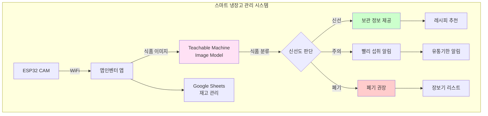
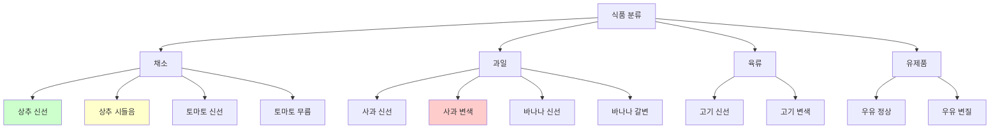
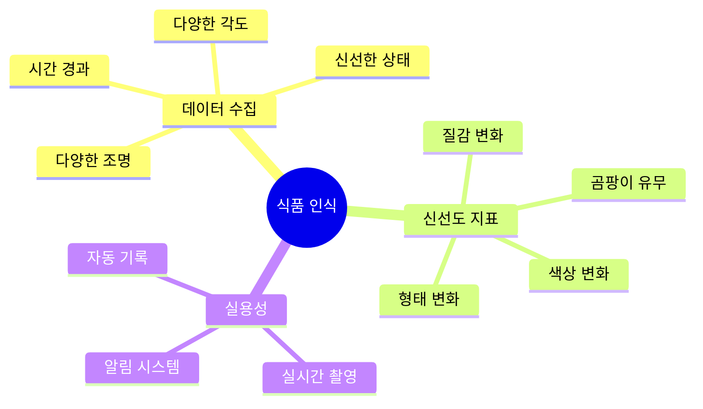
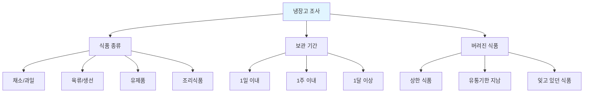
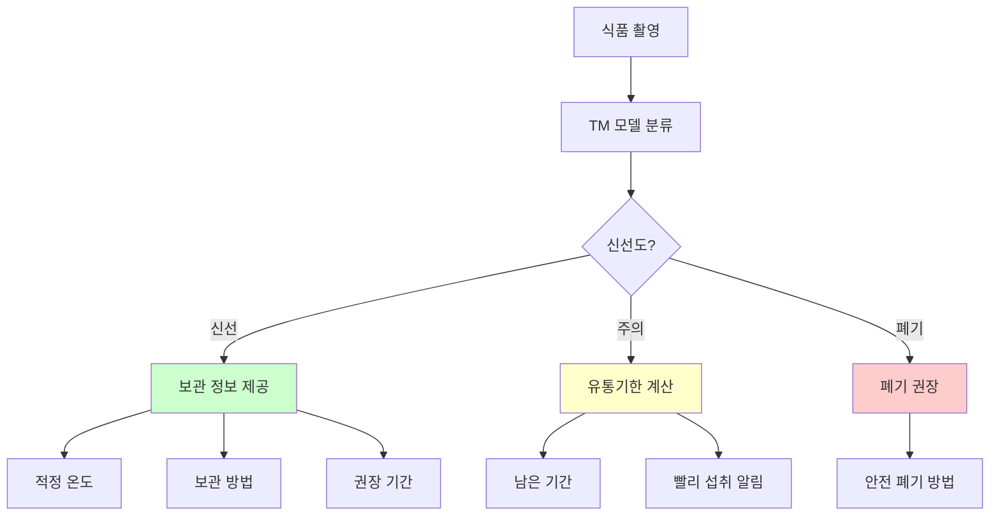
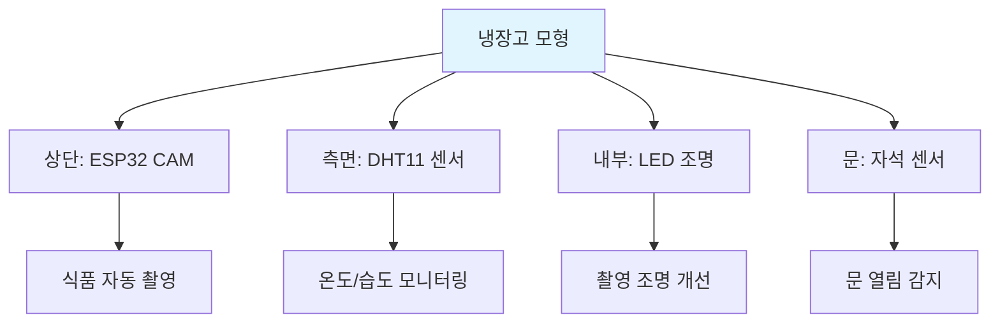
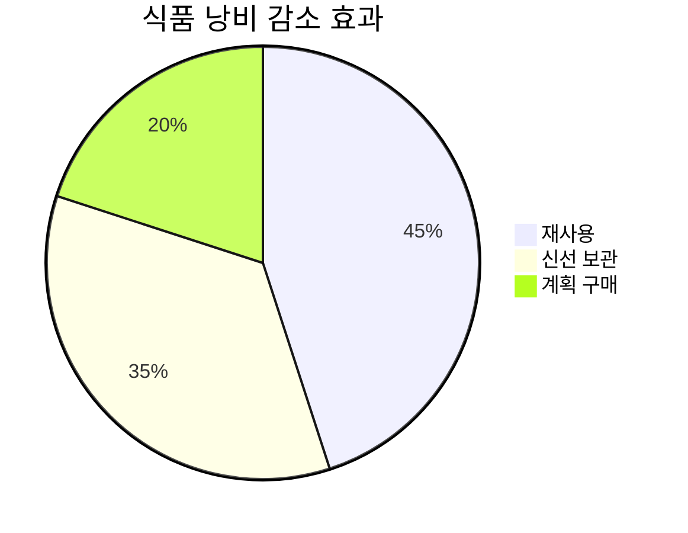
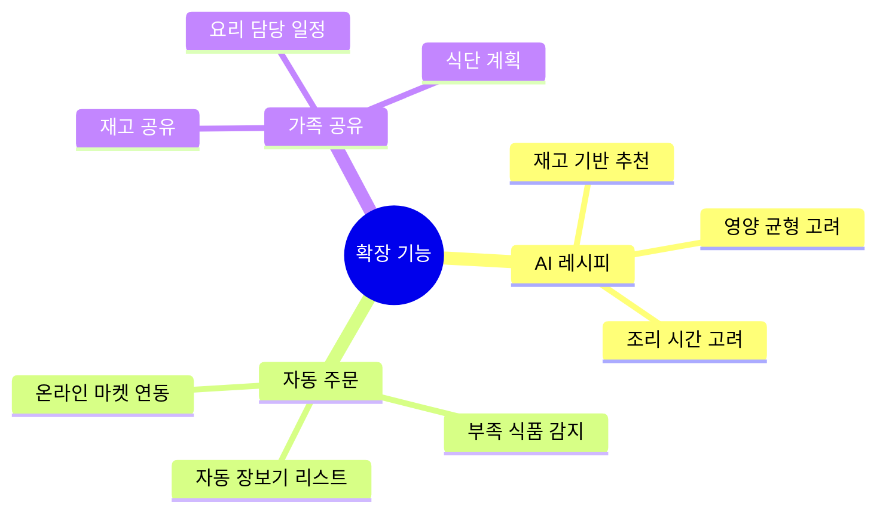

# 6차시 스마트 냉장고 관리 (TM + ESP32 CAM)

## 🧊 프로젝트 개요

**Teachable Machine**으로 식품을 인식하고 신선도를 관리하는 스마트 냉장고 시스템

### 시스템 구조도

## 📊 과정 정보

| 항목 | 내용 |
|------|------|
| **수업 시간** | 6차시 (90분 × 6 = 540분) |
| **대상** | 중학교 1-3학년 |
| **난이도** | ⭐⭐ 보통 |
| **AI 도구** | Teachable Machine Image Model |

## 🎯 식품 클래스 설계

### 식품 및 신선도 분류

## 📚 차시별 구조

## 💡 핵심 기술

### Teachable Machine 식품 인식

### 신선도 판단 기준

| 식품 | 신선 | 주의 | 폐기 |
|------|------|------|------|
| 상추 | 녹색, 팽팽 | 약간 시들음 | 갈변, 물러짐 |
| 토마토 | 단단, 광택 | 약간 무름 | 곰팡이, 썩음 |
| 사과 | 단단, 광택 | 약간 변색 | 갈변, 물러짐 |
| 바나나 | 노란색 | 갈색 반점 | 검게 변색 |
| 고기 | 붉은색 | 갈색 | 회색, 악취 |
| 우유 | 흰색 | 유통기한 임박 | 응고, 악취 |

## 🔧 구성 요소

| 구성 요소 | 역할 | 가격 |
|----------|------|------|
| ESP32 CAM | 식품 촬영 | 12,000원 |
| DHT11 센서 | 온도/습도 측정 | 3,000원 |
| LED 스트립 | 냉장고 내부 조명 | 5,000원 |
| 부저 | 알림 | 1,000원 |
| **합계** |  | **21,000원** |

## 📖 차시별 상세 내용

### 1차시: 식품 관리 현황 분석
- 우리 집 냉장고 관찰
- 식품 쓰레기 문제 인식
- 신선도 관리의 중요성
- AI 식품 관리 필요성 토론

**냉장고 관찰 체크리스트:**

### 2차시: Teachable Machine 식품 데이터 수집
- 집에서 가져온 식품 촬영
- 신선/주의/폐기 3단계 분류
- 각 단계별 50장 이상 수집
- 다양한 조명 조건 테스트

**데이터 수집 전략:**
| 식품 | 신선 데이터 | 주의 데이터 | 폐기 데이터 |
|------|------------|------------|------------|
| 상추 | 구매 직후 | 3-4일 경과 | 7일 이상 |
| 토마토 | 단단한 상태 | 약간 물러짐 | 곰팡이 발생 |
| 바나나 | 노란색 | 반점 생김 | 검게 변색 |

### 3차시: 신선도 모델 학습
- TM에서 식품별 모델 학습
- 신선도 판단 정확도 테스트
- 헷갈리는 경우 추가 학습
- 모델 최적화

**신선도 판단 알고리즘:**

### 4차시: 센서 통합
- ESP32 CAM 설치
- DHT11 온도/습도 센서 연결
- LED 조명 설치
- 냉장고 모형 제작

**냉장고 모형 구조:**

### 5차시: 앱인벤터 앱 개발
- TM 모델 임포트
- 식품 재고 관리 UI
- 유통기한 알림 기능
- Google Sheets 재고 관리

**앱 화면 구성:**
| 화면 | 기능 | 특징 |
|------|------|------|
| 메인 | 냉장고 현황 | 온도, 습도, 재고 수 |
| 재고 목록 | 식품 리스트 | 신선도별 색상 구분 |
| 식품 상세 | 상세 정보 | 보관 팁, 레시피 |
| 알림 | 유통기한 알림 | 푸시 알림 |
| 통계 | 낭비 감소율 | 그래프 표시 |

### 6차시: 레시피 추천 및 발표
- 냉장고 재고 기반 레시피 추천
- 식품 낭비 통계 분석
- 개선 효과 측정
- 최종 발표

**레시피 추천 로직:**

## 📊 식품 낭비 감소 효과

### 사용 전/후 비교

| 항목 | 사용 전 | 사용 후 | 개선율 |
|------|---------|---------|--------|
| 월간 버려진 식품 | 2.5kg | 0.8kg | 68% 감소 |
| 식비 절약 | - | 월 15,000원 | - |
| 유통기한 확인 | 불규칙 | 자동 알림 | 100% |

### 환경 기여도

## 🌟 확장 아이디어

## 🌟 기대 효과

- 식품 낭비 감소
- 환경 보호 실천
- 가계 절약
- 건강한 식습관 형성

