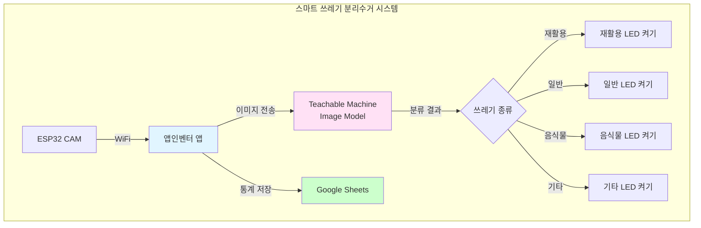
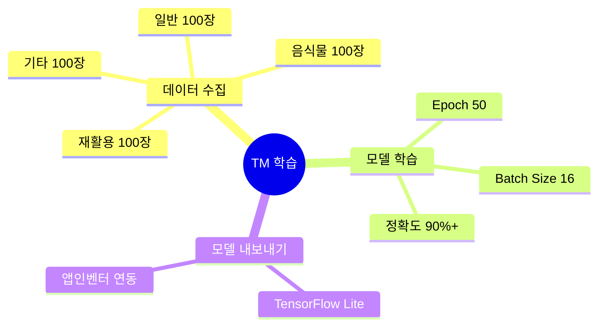
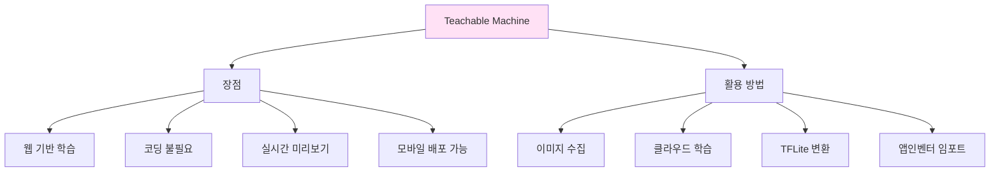
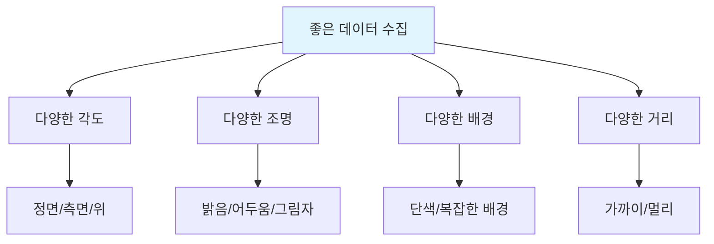
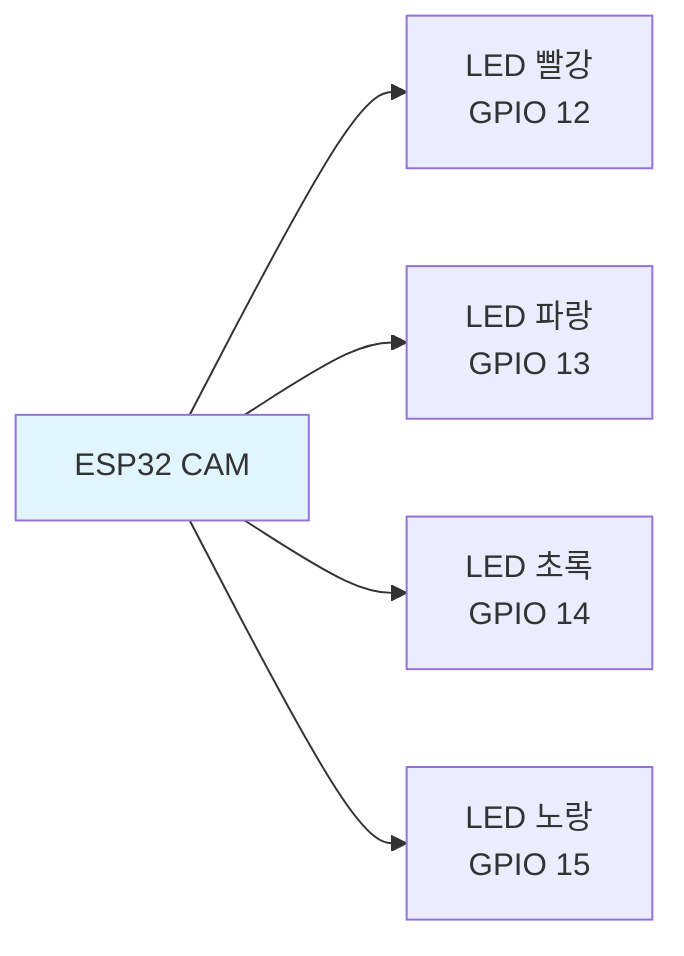
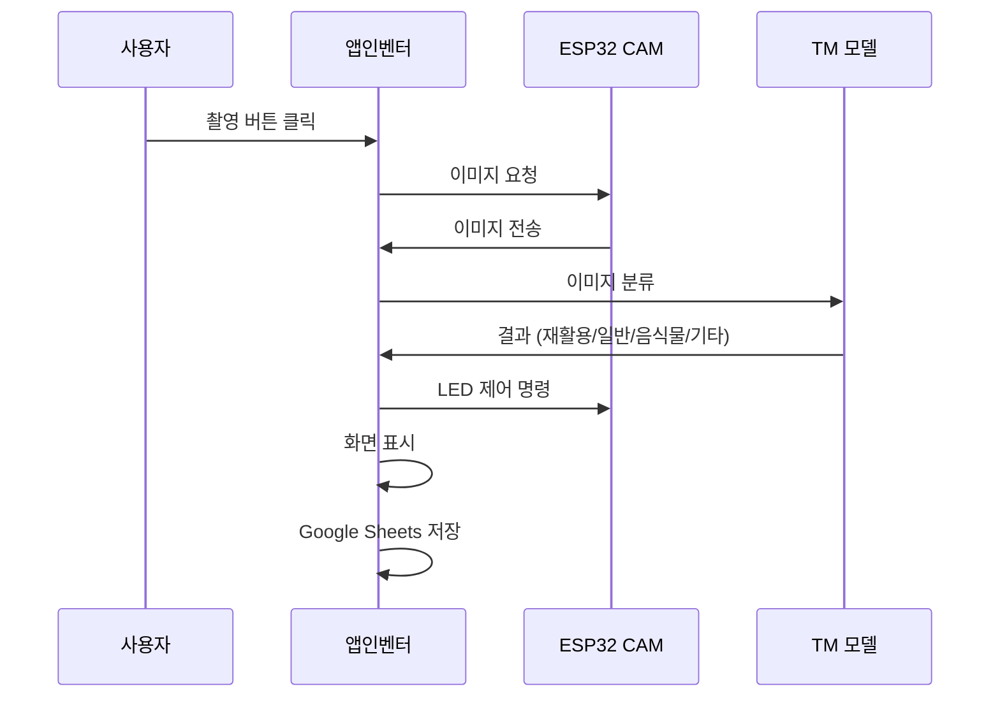
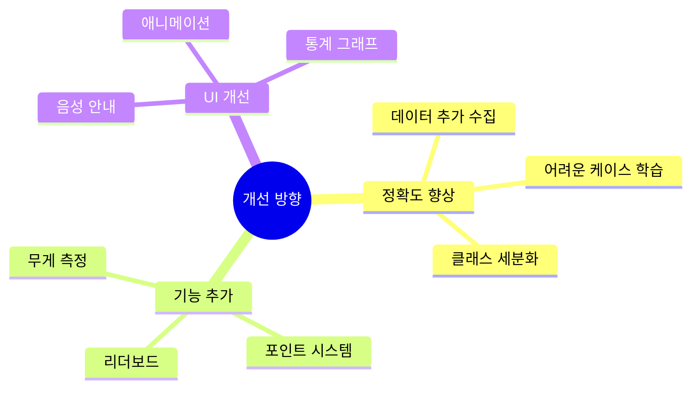

# 6차시 스마트 쓰레기 분리수거 시스템 (TM + ESP32 CAM)

## ♻️ 프로젝트 개요

**Teachable Machine**으로 쓰레기 종류를 인식하여 자동으로 분류하는 스마트 분리수거 시스템

### 시스템 구조도

## 📊 과정 정보

| 항목 | 내용 |
|------|------|
| **수업 시간** | 6차시 (90분 × 6 = 540분) |
| **대상** | 중학교 1-3학년 |
| **난이도** | ⭐⭐ 보통 |
| **AI 도구** | Teachable Machine Image Model |

## 📚 차시별 구조

## 🎯 학습 목표

### Teachable Machine 활용

### 분류 클래스

| 클래스 | 예시 | 데이터 수 | 특징 |
|--------|------|----------|------|
| 재활용 | 플라스틱병, 캔, 종이 | 100장+ | 투명/금속/종이 재질 |
| 일반쓰레기 | 비닐, 스티로폼, 기저귀 | 100장+ | 재활용 불가 |
| 음식물 | 과일껍질, 채소, 음식물 | 100장+ | 부패 가능 |
| 기타 | 건전지, 전구, 의약품 | 100장+ | 특수 처리 필요 |

## 💡 핵심 기술

### Teachable Machine 특징

## 🔧 구성 요소

| 구성 요소 | 역할 | 가격 | TM 연동 |
|----------|------|------|---------|
| ESP32 CAM | 카메라 모듈 | 12,000원 | 이미지 전송 |
| LED 4개 | 분류 표시 | 2,000원 | 결과 표시 |
| 서보모터 | 자동 개폐 | 5,000원 | 선택적 |
| 전원 어댑터 | 전원 공급 | 5,000원 | - |
| **합계** |  | **24,000원** |  |

## 📖 상세 차시별 내용

### 1차시: 완성 시스템 분석
- 쓰레기 분리수거의 중요성 이해
- 완성 시스템 작동 테스트
- 각 쓰레기 종류별 인식 확인
- 시스템 구조도 작성

### 2차시: Teachable Machine 데이터 수집
- TM 웹사이트 접속 및 프로젝트 생성
- 4개 클래스 생성 (재활용/일반/음식물/기타)
- 각 클래스별 100장 이상 이미지 수집
- 다양한 각도/조명에서 촬영

**데이터 수집 팁:**

### 3차시: Teachable Machine 모델 학습
- 학습 파라미터 설정
- 모델 학습 실행 (3-5분)
- 실시간 테스트로 정확도 확인
- 모델 내보내기 (TensorFlow Lite)

**학습 파라미터:**
| 파라미터 | 권장 값 | 설명 |
|---------|--------|------|
| Epochs | 50 | 학습 반복 횟수 |
| Batch Size | 16 | 한번에 처리하는 이미지 수 |
| Learning Rate | 0.001 | 학습 속도 |

### 4차시: 하드웨어 조립
- ESP32 CAM 연결 및 테스트
- LED 회로 연결 (4색 LED)
- WiFi 설정 및 웹서버 구동
- 카메라 테스트 촬영

**회로 연결:**

### 5차시: 앱인벤터 통합
- TM 모델을 앱인벤터로 임포트
- ESP32 CAM 연결 블록 작성
- 이미지 촬영 및 분류 블록 구현
- LED 제어 블록 추가
- Google Sheets 연동 (통계)

**앱 블록 구조:**

### 6차시: 개선 및 최종 발표
- 모델 정확도 개선 (데이터 추가)
- 통계 대시보드 구현
- 발표 자료 작성
- 시연 및 발표

**개선 아이디어:**

## 🎓 Teachable Machine vs Personal Image Classifier

| 구분 | Teachable Machine | Personal Image Classifier |
|------|-------------------|---------------------------|
| **제공** | Google | MIT App Inventor |
| **학습 환경** | 웹 브라우저 | 웹 브라우저 |
| **장점** | 다양한 모델(이미지/음성/포즈) 고급 파라미터 설정 TFLite 변환 가능 | 앱인벤터 직접 통합 간단한 인터페이스 |
| **단점** | 앱인벤터 연동 복잡 | 이미지 모델만 지원 |
| **추천** | 복잡한 프로젝트 | 간단한 프로젝트 |

## 🌟 기대 효과

- 환경 보호 의식 함양
- AI 이미지 분류 원리 이해
- Teachable Machine 활용 능력
- 실생활 문제 해결 경험

## 📈 평가 기준

| 평가 항목 | 배점 | TM 관련 평가 |
|----------|------|-------------|
| TM 모델 정확도 | 30점 | 90% 이상 → 30점 80-89% → 25점 70-79% → 20점 |
| 데이터 수집 | 20점 | 각 클래스 100장 이상 다양성 확보 |
| 시스템 완성도 | 30점 | 하드웨어 + 앱 통합 |
| 창의성 | 20점 | 추가 기능, UI 개선 |

## 🔗 참고 자료

- Teachable Machine 공식: https://teachablemachine.withgoogle.com/
- TM + 앱인벤터 연동 가이드
- ESP32 CAM 설정 매뉴얼

