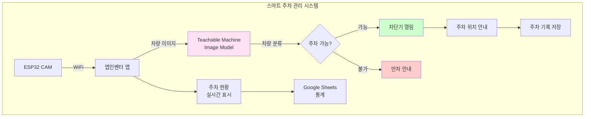
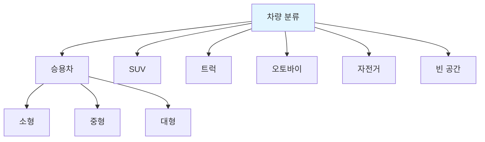
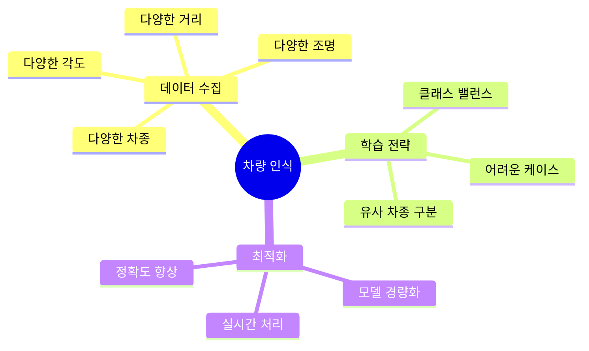
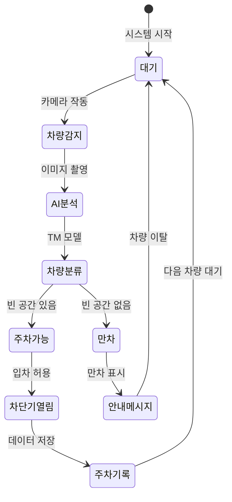
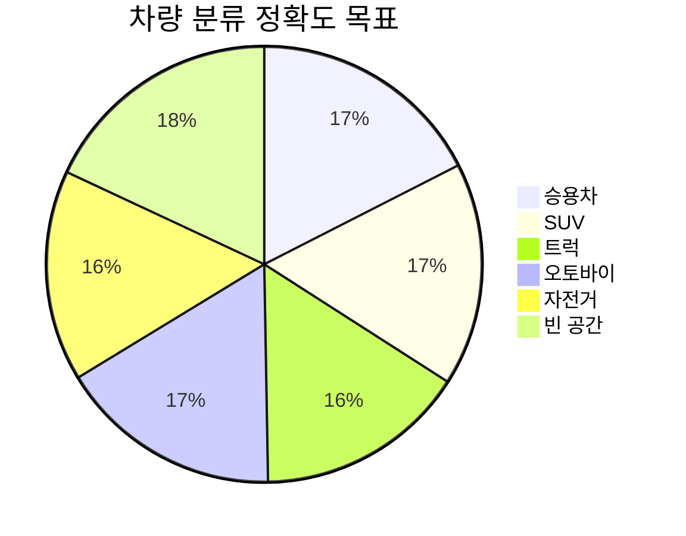
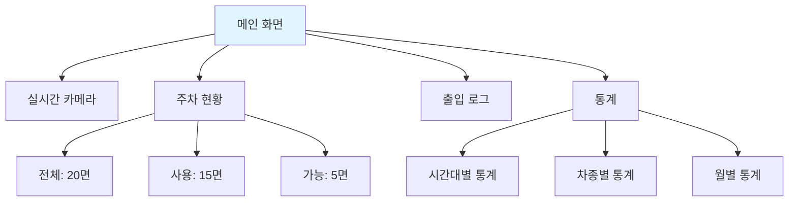
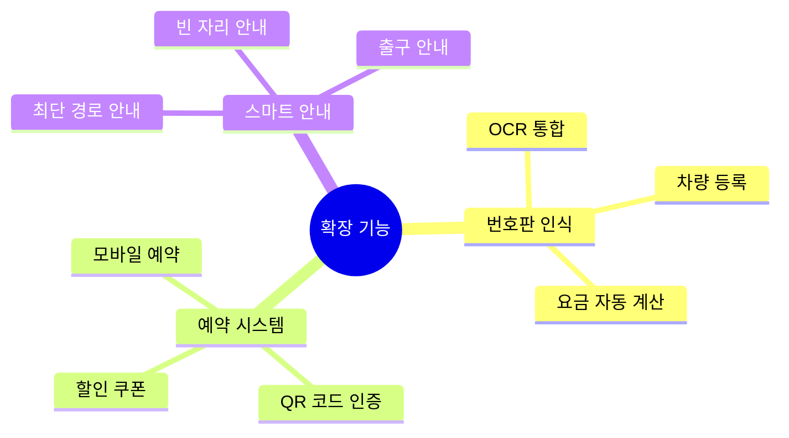

# 6차시 스마트 주차 관리 시스템 (TM + ESP32 CAM)

## 🚗 프로젝트 개요

**Teachable Machine**으로 차량 번호판 또는 차량 종류를 인식하는 스마트 주차 관리 시스템

### 시스템 구조도

## 📊 과정 정보

| 항목 | 내용 |
|------|------|
| **수업 시간** | 6차시 (90분 × 6 = 540분) |
| **대상** | 중학교 2-3학년 |
| **난이도** | ⭐⭐⭐ 어려움 |
| **AI 도구** | Teachable Machine Image Model |

## 🎯 인식 클래스 설계

### 차량 종류 분류

### 데이터 수집 계획

| 클래스 | 데이터 수 | 촬영 장소 | 특징 |
|--------|----------|----------|------|
| 승용차 | 150장 | 주차장, 도로 | 다양한 색상/각도 |
| SUV | 100장 | 주차장 | 큰 차체 |
| 트럭 | 80장 | 도로변 | 화물칸 특징 |
| 오토바이 | 80장 | 주차장 | 2륜 |
| 자전거 | 80장 | 자전거 거치대 | 소형 |
| 빈 공간 | 100장 | 주차 구역 | 차량 없음 |

## 📚 차시별 구조

## 💡 핵심 기술

### Teachable Machine 차량 인식

### 주차 관리 로직

## 🔧 구성 요소

| 구성 요소 | 역할 | 가격 |
|----------|------|------|
| ESP32 CAM | 차량 촬영 | 12,000원 |
| 서보모터 | 차단기 개폐 | 5,000원 |
| 초음파 센서 | 차량 감지 | 3,000원 |
| LED 매트릭스 | 주차 현황 표시 | 8,000원 |
| **합계** |  | **28,000원** |

## 📖 차시별 상세 내용

### 1차시: 주차 관리 시스템 분석
- 기존 주차 시스템 조사
- 주차 관리의 문제점 파악
- AI 주차 관리 사례 연구
- 시스템 요구사항 정의

### 2차시: Teachable Machine 데이터 수집
- 학교 주차장에서 차량 촬영
- 6개 클래스별 데이터 수집
- 다양한 시간대/날씨 조건
- 데이터 품질 검증

**촬영 가이드:**
| 조건 | 설정 | 이유 |
|------|------|------|
| 거리 | 5-10m | 번호판 인식 가능 |
| 각도 | 정면/측면 | 차량 특징 파악 |
| 조명 | 주간/야간 | 실제 환경 대응 |
| 날씨 | 맑음/흐림/비 | 다양한 조건 |

### 3차시: 모델 학습 및 최적화
- TM에서 차량 분류 모델 학습
- 혼동 행렬 분석
- 오분류 사례 추가 학습
- 모델 성능 평가

**성능 지표:**

### 4차시: 하드웨어 제작
- 미니 주차장 모형 제작
- 차단기 설치 (서보모터)
- 초음파 센서로 차량 감지
- LED로 주차 가능/불가 표시

### 5차시: 앱인벤터 통합
- TM 모델을 앱에 통합
- 실시간 주차 현황 대시보드
- 차량 입출차 자동 기록
- 주차 통계 Google Sheets 연동

**앱 화면 구성:**

### 6차시: 데이터 분석 및 발표
- 수집된 주차 데이터 분석
- 시간대별 주차 패턴 파악
- 개선 방안 도출
- 최종 발표

## 📊 데이터 분석 예시

### 시간대별 주차 현황

| 시간대 | 평균 주차 대수 | 만차 빈도 | 회전율 |
|--------|--------------|----------|--------|
| 08:00-10:00 | 18/20 | 높음 | 낮음 |
| 10:00-12:00 | 15/20 | 중간 | 중간 |
| 12:00-14:00 | 19/20 | 높음 | 중간 |
| 14:00-16:00 | 12/20 | 낮음 | 높음 |

## 🌟 확장 아이디어

## 🌟 기대 효과

- 도시 문제 해결 경험
- 컴퓨터 비전 기술 이해
- 데이터 분석 능력 향상
- 스마트시티 개념 학습

