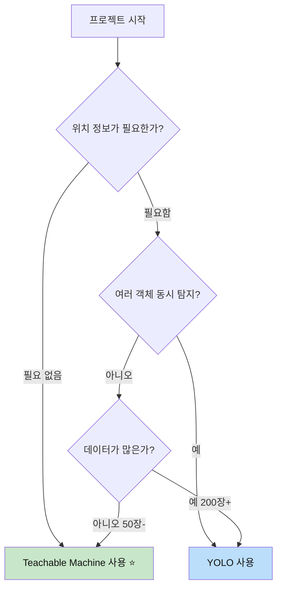

# 🤖 AI 모델 선택 가이드: Teachable Machine vs YOLO

## 📋 목차
1. [모델 선택 기준](#모델-선택-기준)
2. [방법 1: Teachable Machine (간단한 분류)](#방법-1-teachable-machine)
3. [방법 2: YOLO (객체 탐지 + 위치)](#방법-2-yolo)
4. [하이브리드 방식 (두 가지 조합)](#하이브리드-방식)
5. [실전 예시](#실전-예시)

---

## 모델 선택 기준

### 🎯 어떤 모델을 사용해야 할까요?



### 📊 상세 비교표

| 질문 | Teachable Machine | YOLO | 추천 |
|------|-------------------|------|------|
| **침입자가 있나요?** | ✅ 예/아니오 | ✅ 있음 + 위치 | TM ⭐ |
| **침입자가 어디에 있나요?** | ❌ 불가능 | ✅ xywh 좌표 제공 | YOLO ⭐ |
| **번호판을 인식하고 싶어요** | ⚠️ 전체 이미지만 분류 | ✅ 번호판 영역만 추출 | YOLO ⭐ |
| **사람이 몇 명 있나요?** | ❌ 불가능 (1개만 분류) | ✅ 여러 객체 개수 세기 | YOLO ⭐ |
| **강아지인가 고양이인가?** | ✅ 정확함 | ✅ 가능하지만 과한 | TM ⭐ |
| **데이터가 적어요 (50장)** | ✅ 가능 | ⚠️ 부족함 (200장+ 필요) | TM ⭐ |
| **빠르게 프로토타입 만들기** | ✅ 5분 완성 | ❌ 30분~2시간 | TM ⭐ |

---

## 방법 1: Teachable Machine

### ✨ 언제 사용하나요?

- ✅ **"있다/없다" 판단만 필요**
- ✅ **빠른 프로토타입 제작**
- ✅ **코딩 경험이 없음**
- ✅ **데이터가 적음 (50~100장)**

### 🎯 적합한 프로젝트

1. **침입자 감지**: 사람 있음 / 없음
2. **동물 분류**: 강아지 / 고양이 / 없음
3. **차량 유무**: 차량 있음 / 없음
4. **상태 확인**: 문 열림 / 닫힘

### 📝 전체 프로세스 (20분)

```
1단계: 데이터 수집 (10분)
  └─ ESP32 Cam으로 사진 촬영 (각 클래스별 50장)

2단계: Teachable Machine 학습 (5분)
  └─ 웹에서 이미지 업로드 → 학습 클릭

3단계: TFLite 내보내기 (1분)
  └─ Export Model → TensorFlow Lite

4단계: 앱인벤터 통합 (5분)
  └─ PersonalImageClassifier에 모델 업로드
```

### 🚀 Teachable Machine 사용 가이드

#### 1단계: 데이터 수집

**ESP32 Cam으로 촬영:**

```
클래스 1: 침입자 있음
  └─ 사람이 있는 사진 50장

클래스 2: 안전 (아무도 없음)
  └─ 빈 공간 사진 50장

클래스 3: 배경 (선택사항)
  └─ 가구, 반려동물 등 50장
```

**촬영 팁:**
- ✅ 다양한 각도에서 촬영
- ✅ 조명 변화 (밝음, 어두움)
- ✅ 다양한 자세 (서있음, 앉아있음)
- ✅ 시간대별 촬영 (아침, 저녁)

#### 2단계: Teachable Machine에서 학습

**2.1 웹사이트 접속**

1. https://teachablemachine.withgoogle.com/ 접속
2. **Get Started** 클릭
3. **Image Project** → **Standard image model** 선택

**2.2 데이터 업로드**

| 단계 | 작업 | 설명 |
|------|------|------|
| 1 | Class 1 이름 변경 | "침입자_있음" |
| 2 | 이미지 업로드 | Upload → 사진 50장 선택 |
| 3 | Class 2 추가 | Add a class → "안전_없음" |
| 4 | 이미지 업로드 | Upload → 사진 50장 선택 |
| 5 | (선택) Class 3 추가 | "배경_기타" |

**2.3 모델 학습**

```
1. "Train Model" 버튼 클릭
2. 학습 시작 (2~5분 소요)
3. 진행률 표시: "Training... Epoch 50/50"
4. 완료: "Model is ready!"
```

**2.4 테스트**

- **Webcam 탭**: 실시간 테스트
- **File 탭**: 이미지 파일로 테스트
- 결과 확인:
  ```
  침입자_있음: 98%
  안전_없음: 2%
  배경_기타: 0%
  ```

#### 3단계: TFLite 모델 내보내기

**3.1 모델 내보내기**

1. **Export Model** 버튼 클릭
2. **TensorFlow Lite** 탭 선택
3. **Model type**: 
   - **Floating point** (권장 - 정확도 높음, 3MB)
   - **Quantized** (크기 작음, 1MB)
4. **Download my model** 클릭

**3.2 다운로드된 파일**

```
📦 converted_tflite.zip
  ├── model.tflite (TFLite 모델 ⭐)
  └── labels.txt (클래스 레이블 ⭐)
```

**labels.txt 내용:**
```
0 침입자_있음
1 안전_없음
2 배경_기타
```

#### 4단계: 앱인벤터 통합

**4.1 파일 업로드**

1. 앱인벤터 프로젝트 열기
2. **Media** 섹션으로 이동
3. **Upload File** 클릭
4. `model.tflite`와 `labels.txt` 업로드

**4.2 PersonalImageClassifier 설정**

| 속성 | 값 | 설명 |
|------|-----|------|
| Model | `model.tflite` | Teachable Machine 모델 |
| Labels | `labels.txt` | 클래스 레이블 파일 |

**4.3 블록 코딩**

```
when Button_Detect.Click
  do
    if (global captured_image ≠ "")
      then
        call PersonalImageClassifier1.ClassifyImage
              image: global captured_image
      else
        call Notifier1.ShowAlert
              message: "먼저 사진을 촬영하세요"

when PersonalImageClassifier1.GotClassification
      classifications
  do
    // 결과 파싱
    set local result to get classifications
    
    // "침입자_있음"이 포함되어 있는지 확인
    if (contains result "침입자_있음")
      then
        // 신뢰도 추출
        set local confidence to [신뢰도 파싱 로직]
        
        // 신뢰도가 80% 이상이면 경고
        if (confidence > 0.8)
          then
            set Label_Status.Text to "⚠️ 침입자 탐지!"
            set Label_Status.TextColor to Red
            
            call TextToSpeech1.Speak
                  message: "침입자가 탐지되었습니다"
            
            call Notifier1.ShowAlert
                  message: "경고! 침입자가 감지되었습니다!"
      else if (contains result "안전_없음")
        then
          set Label_Status.Text to "✅ 안전"
          set Label_Status.TextColor to Green
    
    // 전체 결과 표시
    set Label_Result.Text to get result
```

### 📊 Teachable Machine 결과 예시

**입력:** ESP32 Cam에서 촬영한 이미지

**출력:**
```json
[
  {
    "class": "침입자_있음",
    "confidence": 0.95
  },
  {
    "class": "안전_없음",
    "confidence": 0.03
  },
  {
    "class": "배경_기타",
    "confidence": 0.02
  }
]
```

**앱에서 표시:**
```
⚠️ 침입자 탐지!
신뢰도: 95%
```

### 🎯 Teachable Machine 장점

| 장점 | 설명 | 비교 (YOLO) |
|------|------|-------------|
| **노코드** | 코딩 없이 웹에서 학습 | YOLO는 Colab 필요 |
| **빠른 학습** | 5분 이내 완료 | YOLO는 30분~2시간 |
| **적은 데이터** | 클래스당 50장으로 충분 | YOLO는 200장+ 필요 |
| **간단한 라벨링** | 폴더별 이미지만 업로드 | YOLO는 박스 그리기 필요 |
| **작은 모델** | 1~3MB | YOLO는 3~6MB |
| **높은 정확도** | 분류 작업에 최적화 | YOLO도 높지만 과함 |

### ⚠️ Teachable Machine 단점

| 단점 | 설명 | 해결 방법 |
|------|------|-----------|
| **위치 정보 없음** | xywh 좌표 제공 안 함 | YOLO 사용 |
| **1개 객체만** | 여러 객체 동시 탐지 불가 | YOLO 사용 |
| **영역 추출 불가** | 번호판만 잘라내기 불가 | YOLO 사용 |

---

## 방법 2: YOLO

### ✨ 언제 사용하나요?

- ✅ **위치 정보(xywh)가 필요**
- ✅ **여러 객체 동시 탐지**
- ✅ **바운딩 박스 표시**
- ✅ **영역 추출 (번호판 등)**

### 🎯 적합한 프로젝트

1. **번호판 인식**: 번호판 영역 추출 → OCR
2. **침입자 위치 추적**: "왼쪽 상단에 침입자 발견"
3. **다중 객체 탐지**: "사람 3명, 차량 2대"
4. **객체 계수**: 주차장 빈 자리 개수

### 📝 전체 프로세스 (2시간)

```
1단계: 데이터 수집 (30분)
  └─ ESP32 Cam으로 사진 촬영 (클래스별 200장)

2단계: Roboflow 라벨링 (1시간)
  └─ 바운딩 박스 그리기 (각 이미지마다)

3단계: Colab YOLO 학습 (30분)
  └─ `Colab_커스텀_YOLO_학습_가이드.md` 참조

4단계: TFLite 변환 (5분)
  └─ best.pt → TFLite

5단계: 앱인벤터 통합 (10분)
  └─ 커스텀 후처리 블록 추가
```

### 🚀 YOLO 사용 가이드

#### YOLO 출력 데이터

```json
{
  "detections": [
    {
      "class": "person",
      "confidence": 0.87,
      "bbox": {
        "x": 320,  // 중심점 X
        "y": 240,  // 중심점 Y
        "w": 150,  // 너비
        "h": 280   // 높이
      },
      "bbox_xyxy": {
        "x1": 245,  // 좌상단 X
        "y1": 100,  // 좌상단 Y
        "x2": 395,  // 우하단 X
        "y2": 380   // 우하단 Y
      }
    }
  ]
}
```

#### xywh 좌표 활용 방법

**1. Canvas에 바운딩 박스 그리기**

```
Procedure: DrawBoundingBox (bbox)
  do
    // 좌표 추출
    set x to bbox["x"]
    set y to bbox["y"]
    set w to bbox["w"]
    set h to bbox["h"]
    
    // 좌상단 좌표 계산
    set x1 to x - (w / 2)
    set y1 to y - (h / 2)
    set x2 to x + (w / 2)
    set y2 to y + (h / 2)
    
    // 사각형 그리기
    set Canvas1.LineWidth to 3
    set Canvas1.PaintColor to Red
    
    call Canvas1.DrawLine
          x1: x1, y1: y1
          x2: x2, y2: y1
    
    call Canvas1.DrawLine
          x1: x2, y1: y1
          x2: x2, y2: y2
    
    call Canvas1.DrawLine
          x1: x2, y1: y2
          x2: x1, y2: y2
    
    call Canvas1.DrawLine
          x1: x1, y1: y2
          x2: x1, y2: y1
```

**2. 영역 추출 (번호판 잘라내기)**

```python
# 서버 측 처리 (security_camera_server.py)
def crop_license_plate(image, bbox):
    """
    YOLO로 탐지한 번호판 영역만 잘라내기
    """
    x1 = int(bbox['x1'])
    y1 = int(bbox['y1'])
    x2 = int(bbox['x2'])
    y2 = int(bbox['y2'])
    
    # 이미지 자르기
    cropped = image[y1:y2, x1:x2]
    
    return cropped
```

**3. 위치 기반 알림**

```
Procedure: CheckLocation (bbox)
  do
    set x to bbox["x"]
    set y to bbox["y"]
    
    // 화면을 4등분하여 위치 판단
    set image_width to 640
    set image_height to 480
    
    if (x < image_width / 2)
      then set location to "왼쪽"
      else set location to "오른쪽"
    
    if (y < image_height / 2)
      then set location to location + " 위"
      else set location to location + " 아래"
    
    // 음성 안내
    call TextToSpeech1.Speak
          message: location + "에 침입자가 있습니다"
    
    return location
```

---

## 하이브리드 방식

### 🎯 두 가지 모델 조합

**시나리오: 번호판 인식 시스템**

```
1단계: Teachable Machine으로 빠른 필터링
  └─ "차량 있음" / "차량 없음" 판단 (0.5초)
  
2단계: 차량이 있으면 YOLO 실행
  └─ 번호판 영역 탐지 (xywh) (1.5초)
  
3단계: 번호판 영역 추출
  └─ OCR로 번호 인식
  
총 처리 시간: 2초 (차량 없으면 0.5초)
```

### 📊 비교 예시

**Teachable Machine만 사용:**
- ✅ 빠름: 0.5초
- ❌ 정보 부족: "차량 있음" 만 알 수 있음
- ❌ 번호판 추출 불가

**YOLO만 사용:**
- ⚠️ 느림: 2초
- ✅ 상세 정보: 번호판 위치(xywh) + 차량 위치
- ✅ 번호판 추출 가능

**하이브리드 (Teachable Machine → YOLO):**
- ✅ 효율적: 차량 없으면 0.5초, 있으면 2초
- ✅ 상세 정보: 필요할 때만 YOLO 실행
- ✅ 배터리 절약: 불필요한 YOLO 실행 방지

### 💻 하이브리드 구현 예시

```
// 전역 변수
global use_hybrid_mode (Boolean): true

when Button_Detect.Click
  do
    if (global use_hybrid_mode = true)
      then
        // 1단계: Teachable Machine으로 빠른 확인
        set Label_Status.Text to "1단계: 차량 확인 중..."
        call TeachableMachine_Classifier.ClassifyImage
              image: global captured_image
      else
        // 직접 YOLO 실행
        call YOLO_Classifier.ClassifyImage
              image: global captured_image

when TeachableMachine_Classifier.GotClassification
      result
  do
    if (contains result "차량_있음")
      then
        // 2단계: YOLO로 상세 탐지
        set Label_Status.Text to "2단계: 번호판 탐지 중..."
        call YOLO_Classifier.ClassifyImage
              image: global captured_image
      else
        // 차량 없음 - 종료
        set Label_Status.Text to "✅ 차량 없음"
        set Label_Result.Text to "빈 공간입니다"

when YOLO_Classifier.GotClassification
      result
  do
    // 번호판 위치 정보 처리
    set local bbox to [파싱 로직]
    
    // 번호판 영역 표시
    call DrawBoundingBox(bbox)
    
    // 번호판 영역 추출 (서버로 전송하여 OCR)
    call ExtractLicensePlate(bbox)
```

---

## 실전 예시

### 예시 1: 침입자 감지 (Teachable Machine 추천)

**요구사항:**
- "사람이 있나요?" 판단만 필요
- 위치 정보 불필요
- 빠른 응답 필요

**구현:**

1. **데이터 수집**
```
클래스 1: 침입자 (50장)
  - 다양한 사람 사진
  
클래스 2: 안전 (50장)
  - 빈 공간 사진
```

2. **Teachable Machine 학습** (5분)
```
https://teachablemachine.withgoogle.com
→ 이미지 업로드
→ Train Model
→ Export (TFLite)
```

3. **앱인벤터 구현**
```
결과: 
침입자: 95%
안전: 5%

→ 95% > 80% 이므로 알림 발송
```

### 예시 2: 번호판 인식 (YOLO 추천)

**요구사항:**
- 번호판 위치 추출 필요
- 영역을 잘라서 OCR 처리
- 여러 차량 동시 처리

**구현:**

1. **데이터 수집** (Roboflow)
```
클래스: license_plate
이미지: 200장
라벨링: 각 이미지에서 번호판 영역 박스 그리기
```

2. **YOLO 학습** (Colab)
```python
# Colab에서 실행
!yolo task=detect mode=train model=yolov8n.pt data=license_plate.yaml epochs=50
```

3. **TFLite 변환**
```python
from ultralytics import YOLO
model = YOLO('best.pt')
model.export(format='tflite', imgsz=320, int8=True)
```

4. **앱인벤터 구현**
```
결과:
{
  "class": "license_plate",
  "confidence": 0.89,
  "bbox": {
    "x": 450,
    "y": 380,
    "w": 80,
    "h": 30
  }
}

→ bbox 좌표로 영역 추출
→ OCR 서버로 전송
→ 번호판 번호 인식
```

### 예시 3: 하이브리드 (차량 모니터링)

**요구사항:**
- 차량이 있을 때만 상세 정보 필요
- 배터리 효율성 중요
- 빠른 응답 + 상세 정보

**구현:**

1. **Teachable Machine 모델** (1차 필터)
```
클래스 1: 차량_있음
클래스 2: 차량_없음
```

2. **YOLO 모델** (2차 상세 탐지)
```
클래스 1: car
클래스 2: truck
클래스 3: license_plate
```

3. **앱인벤터 로직**
```
1단계 (TM): 차량 있음? (0.5초)
  └─ 없음 → 종료 ✅ 빠름
  └─ 있음 → 2단계

2단계 (YOLO): 차량 종류 + 번호판 위치 (1.5초)
  └─ 차종: truck
  └─ 번호판: x=450, y=380, w=80, h=30
  
3단계: 번호판 추출 + OCR (1초)
  └─ 번호판 번호: "12가3456"
  
총 시간: 3초 (차량 없으면 0.5초)
```

---

## 📊 최종 권장 사항

### 프로젝트별 추천

| 프로젝트 | 추천 모델 | 이유 |
|----------|----------|------|
| **침입자 감지** | Teachable Machine ⭐ | 위치 불필요, 빠른 응답 |
| **동물 분류** | Teachable Machine ⭐ | 간단한 분류, 데이터 적음 |
| **번호판 인식** | YOLO ⭐ | 영역 추출 필요 |
| **주차 공간 감지** | YOLO ⭐ | 여러 차량 동시 탐지 |
| **얼굴 인식** | Teachable Machine | 간단한 본인 확인 |
| **물체 추적** | YOLO ⭐ | 위치 정보 필요 |
| **상태 모니터링** | Teachable Machine ⭐ | 문 열림/닫힘 등 |
| **차량 모니터링** | 하이브리드 ⭐ | 효율성 + 상세 정보 |

### 학습 난이도별 추천

| 수준 | 추천 모델 | 학습 시간 |
|------|----------|----------|
| **초급** (코딩 경험 없음) | Teachable Machine ⭐ | 20분 |
| **중급** (Python 기본) | YOLO (사전 학습 모델) | 1시간 |
| **고급** (머신러닝 경험) | YOLO (커스텀 학습) | 2시간+ |

---

## 🎓 학습 로드맵

### 1단계: Teachable Machine 마스터 (1일)

```
1. Teachable Machine 기본 사용법 (1시간)
2. 데이터 수집 및 전처리 (2시간)
3. 모델 학습 및 최적화 (2시간)
4. 앱인벤터 통합 (2시간)
5. 실전 프로젝트 (3시간)
```

**완성 후 제작 가능:**
- ✅ 침입자 감지 시스템
- ✅ 동물 분류 앱
- ✅ 상태 모니터링 시스템

### 2단계: YOLO 기초 (3일)

```
1일차: YOLO 이론 및 환경 설정
2일차: Roboflow 데이터 준비 및 라벨링
3일차: Colab 학습 및 TFLite 변환
```

**완성 후 제작 가능:**
- ✅ 번호판 인식 시스템
- ✅ 다중 객체 탐지
- ✅ 위치 추적 시스템

### 3단계: 하이브리드 시스템 (5일)

```
1~2일차: Teachable Machine 마스터
3~5일차: YOLO 학습
6일차: 두 모델 통합 및 최적화
```

**완성 후 제작 가능:**
- ✅ 프로덕션급 보안 시스템
- ✅ 상업용 차량 관리 시스템
- ✅ 스마트 홈 통합 시스템

---

## 💡 자주 묻는 질문

### Q1: Teachable Machine으로도 xywh 좌표를 얻을 수 있나요?

**A:** 아니요. Teachable Machine은 **분류(Classification)** 모델이므로 "클래스 + 신뢰도"만 출력합니다. 위치 정보가 필요하면 **YOLO (Object Detection)** 를 사용해야 합니다.

```
Teachable Machine 출력:
{
  "class": "person",
  "confidence": 0.95
}

YOLO 출력:
{
  "class": "person",
  "confidence": 0.95,
  "bbox": {"x": 320, "y": 240, "w": 150, "h": 280}  ← 위치 정보
}
```

### Q2: Teachable Machine이 YOLO보다 정확한가요?

**A:** **분류 작업에서는 Teachable Machine이 더 정확할 수 있습니다.** YOLO는 객체 탐지에 최적화되어 있고, Teachable Machine은 분류에 최적화되어 있습니다.

```
시나리오: "사람인가 아닌가?"

Teachable Machine: 98% 정확도 (분류에 특화)
YOLO: 95% 정확도 (탐지에 특화)
```

### Q3: 두 모델을 동시에 사용할 수 있나요?

**A:** 네! 하이브리드 방식을 사용하면 효율성과 정확도를 모두 얻을 수 있습니다.

```
1단계: Teachable Machine (빠른 필터링)
  └─ 관심 객체 있음? → 다음 단계
  └─ 없음? → 종료 (빠름!)

2단계: YOLO (상세 정보)
  └─ 위치 정보 (xywh)
  └─ 여러 객체 탐지
```

### Q4: 데이터가 50장밖에 없는데 YOLO를 사용할 수 있나요?

**A:** 가능하지만 권장하지 않습니다. YOLO는 최소 200장 이상의 데이터가 필요합니다. 데이터가 적다면 **Teachable Machine**을 사용하세요.

| 데이터 양 | Teachable Machine | YOLO |
|-----------|-------------------|------|
| 50장 | ✅ 충분 | ❌ 부족 |
| 100장 | ✅ 좋음 | ⚠️ 최소 |
| 200장+ | ✅ 매우 좋음 | ✅ 적합 |
| 500장+ | ✅ 과함 | ✅ 매우 좋음 |

### Q5: 번호판 인식은 어떤 모델을 사용해야 하나요?

**A:** **YOLO를 사용해야 합니다.** 번호판 영역을 추출(xywh)한 후 OCR로 번호를 읽어야 하기 때문입니다.

```
잘못된 방법 (Teachable Machine):
  전체 이미지 → "번호판 있음" / "번호판 없음"
  ❌ 번호판 영역을 추출할 수 없음

올바른 방법 (YOLO):
  전체 이미지 → 번호판 위치 (x, y, w, h)
  → 번호판 영역만 잘라내기
  → OCR로 번호 인식
  ✅ 성공!
```

---

## 🔗 관련 가이드

| 문서 | 내용 | 링크 |
|------|------|------|
| **ESP32 Cam 가이드** | ESP32 설정 및 WiFi 연결 | `ESP32_Cam_앱인벤터_완전가이드.md` |
| **TFLite 가이드** | TensorFlow Lite 변환 방법 | `앱인벤터_YOLO_TFLite_가이드.md` |
| **YOLO 학습 가이드** | Colab에서 커스텀 학습 | `Colab_커스텀_YOLO_학습_가이드.md` |
| **앱인벤터 블록** | 블록 코딩 상세 가이드 | `앱인벤터_블록_가이드.md` |

---

## 📝 체크리스트

### Teachable Machine 프로젝트

- [ ] 데이터 수집 (클래스별 50장)
- [ ] Teachable Machine 웹사이트 접속
- [ ] 모델 학습 (5분)
- [ ] TFLite 내보내기
- [ ] 앱인벤터 통합
- [ ] 테스트 및 배포

### YOLO 프로젝트

- [ ] 데이터 수집 (클래스별 200장)
- [ ] Roboflow 라벨링
- [ ] Colab 환경 설정
- [ ] YOLO 학습 (30분~2시간)
- [ ] TFLite 변환
- [ ] 앱인벤터 통합 (xywh 처리 포함)
- [ ] 테스트 및 배포

### 하이브리드 프로젝트

- [ ] Teachable Machine 모델 준비
- [ ] YOLO 모델 준비
- [ ] 앱인벤터에서 순차 처리 로직 구현
- [ ] 성능 최적화
- [ ] 테스트 및 배포

---

## 🎉 마무리

### 핵심 요약

```
📌 간단한 분류 (있다/없다) → Teachable Machine ⭐
📌 위치 정보 필요 (xywh) → YOLO ⭐
📌 효율성 + 상세 정보 → 하이브리드 ⭐⭐⭐
```

### 시작하기

1. **프로젝트 요구사항 확인**
   - 위치 정보가 필요한가?
   - 여러 객체를 동시에 탐지하나?
   - 데이터가 얼마나 있나?

2. **모델 선택**
   - Teachable Machine: 빠르고 간단
   - YOLO: 강력하고 상세
   - 하이브리드: 최고의 효율

3. **가이드 따라하기**
   - 단계별 가이드 문서 참조
   - 예시 코드 활용
   - 테스트 및 최적화

**Happy Making! 🚀✨**

---

**문서 끝**
