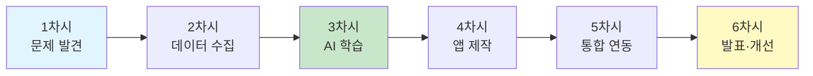

# 🌍 스마트 분리수거 도우미 - 6차시 AI융합 교육 프로그램

## 📋 프로그램 개요

### 🎯 프로젝트 주제
**"우리 학교를 위한 스마트 분리수거 도우미 만들기"**

### 👥 대상
- **학년**: 중학교 1~3학년
- **수준**: AI 초심자 (코딩 경험 무관)
- **인원**: 4~6명 팀 프로젝트

### ⏰ 총 교육 시간
- **6차시** (차시당 45분, 총 270분)
- **블록 수업** (2~3차시 연속 진행 권장)

### 🎓 교육 목표

#### 지식·이해
- AI와 이미지 인식의 기본 원리 이해
- 머신러닝 학습 과정 이해 (데이터 → 학습 → 예측)
- IoT 기기(ESP32 Cam)와 앱의 연동 원리 이해

#### 과정·기능
- 실생활 문제를 AI로 해결하는 설계 능력
- 이미지 데이터 수집 및 분류 능력
- 앱인벤터를 활용한 앱 제작 능력
- ESP32 Cam 설정 및 활용 능력

#### 가치·태도
- 환경 문제에 대한 관심과 책임감
- 협업을 통한 문제 해결 경험
- 실패와 개선을 반복하는 메이커 마인드

### 🔧 준비물

#### 하드웨어 (팀당 1세트)
| 품목 | 수량 | 용도 | 예상 비용 |
|------|------|------|-----------|
| **ESP32 Cam 모듈** | 1개 | 카메라 촬영 | $5~10 |
| **FTDI 어댑터** | 1개 | ESP32 프로그래밍 | $3~5 |
| **USB 케이블** | 1개 | 연결용 | $2 |
| **안드로이드 스마트폰/태블릿** | 1대 | 앱 실행 (학생 개인 기기 활용) | - |
| **분리수거 샘플** | 각 10개 | 테스트용 (플라스틱병, 캔, 종이) | - |

#### 소프트웨어 (무료)
- **Arduino IDE**: ESP32 Cam 프로그래밍
- **MIT 앱인벤터**: 앱 제작 (https://appinventor.mit.edu)
- **Teachable Machine**: AI 모델 학습 (https://teachablemachine.withgoogle.com)

#### 학습 자료
- 교사용 PPT (차시별 제공)
- 학생용 활동지 (워크시트)
- 코드 템플릿 (Arduino, 앱인벤터)

---

## 📚 교육과정 연계

### 과학과
- **중1 과학**: 기술과 발명
- **중2 과학**: 전기와 자기
- **중3 과학**: 과학과 인류 문명

### 정보과
- **중학교 정보**: 알고리즘, 프로그래밍, 정보문화

### 기술·가정
- **중학교 기술**: 기술 시스템, 제조 기술

---

## 🗓️ 차시별 교육 계획

### 전체 로드맵



---

## 1️⃣ 1차시: 문제 발견과 AI 이해

### 📌 학습 목표
- 생활 속 분리수거 문제 발견하기
- AI 이미지 인식의 원리 이해하기
- 프로젝트 계획 수립하기

### ⏰ 시간 배분 (45분)

| 활동 | 시간 | 내용 |
|------|------|------|
| **도입** | 10분 | 동기 유발 및 문제 제기 |
| **전개1** | 15분 | AI 이미지 인식 체험 |
| **전개2** | 15분 | 프로젝트 계획 수립 |
| **정리** | 5분 | 차시 정리 및 과제 안내 |

### 📖 교수·학습 활동

#### 도입 (10분) - 역공부 시작

**교사 발문:**
```
💬 "여러분, 급식실이나 교실에서 분리수거할 때 
    어떤 어려움을 겪어본 적 있나요?"

예상 학생 답변:
- "페트병인지 플라스틱인지 헷갈려요"
- "급하게 버릴 때 잘못 버려요"
- "외국인 학생은 더 어려워해요"
```

**문제 상황 제시:**
- 학교 분리수거 현황 사진 제시
- 잘못 분류된 쓰레기 통계 (학교 자료 활용)
- 청소 담당 학생들의 인터뷰 영상

**핵심 질문:**
```
🤔 "AI가 이 문제를 어떻게 해결할 수 있을까요?"
```

#### 전개1 (15분) - AI 이미지 인식 체험

**활동 1: Teachable Machine 체험** (10분)

1. **시연 사이트 접속**
```
https://teachablemachine.withgoogle.com/train/image
```

2. **실시간 시연** (교사 시연 + 학생 참여)
```
Step 1: 클래스 만들기
  - Class 1: 펜 (학생들에게 펜 보여주며 촬영)
  - Class 2: 지우개
  - Class 3: 휴대폰

Step 2: 학습하기
  - "Train Model" 클릭
  - 학습 과정 관찰 (30초)

Step 3: 테스트
  - 실시간 인식 확인
  - 정확도 확인
```

3. **원리 설명** (5분)
```
AI 학습 과정:

데이터 수집 → 학습 → 예측
   ↓           ↓        ↓
  사진 촬영   패턴 학습  분류

핵심 개념:
- 많은 사진 = 더 정확한 AI
- 다양한 각도 = 더 똑똑한 AI
- 학습 = 특징 찾기
```

**활동 2: 분류 실험** (5분)

학생들이 직접 물건을 들고 카메라 앞에서 테스트
- 제대로 인식되는 경우
- 헷갈리는 경우 (왜 헷갈릴까?)

#### 전개2 (15분) - 프로젝트 계획 수립

**활동 3: 팀 구성 및 역할 분담**

| 역할 | 담당 업무 | 인원 |
|------|----------|------|
| **PM (프로젝트 매니저)** | 전체 진행 관리, 발표 | 1명 |
| **데이터 팀** | 사진 촬영 및 정리 | 2명 |
| **개발 팀** | 앱 제작 및 ESP32 설정 | 2명 |
| **테스트 팀** | 테스트 및 개선 제안 | 1명 |

**활동 4: 프로젝트 계획서 작성** (활동지 1)

```
📝 우리 팀의 스마트 분리수거 도우미 계획

1. 팀명: _______________________

2. 분류할 쓰레기 종류 (3가지 선택)
   □ 플라스틱병
   □ 캔
   □ 종이
   □ 유리병
   □ 비닐
   □ 기타: _______

3. 어디에 설치할까요?
   □ 급식실 입구
   □ 교실 쓰레기통
   □ 복도 분리수거장
   □ 기타: _______

4. 어떤 기능이 있으면 좋을까요?
   - 필수: 쓰레기 종류 알려주기
   - 추가 아이디어:
     ✓ _______________________
     ✓ _______________________
     ✓ _______________________

5. 성공 기준 (어느 정도면 성공일까?)
   - 정확도: ___% 이상
   - 속도: ___ 초 이내
   - 기타: _______________________
```

#### 정리 (5분)

**학습 내용 정리:**
```
오늘 배운 것:
✓ AI는 사진을 보고 학습할 수 있다
✓ 많은 데이터가 있으면 더 정확하다
✓ 우리가 직접 AI를 만들 수 있다
```

**다음 차시 예고 및 과제:**
```
📸 과제: 집에서 분리수거 사진 찍어오기
- 플라스틱병 10장
- 캔 10장  
- 종이 10장
- 다양한 각도, 조명에서 촬영
```

### 📊 평가 계획

| 평가 요소 | 평가 방법 | 배점 |
|----------|----------|------|
| **참여도** | 관찰 평가 | 40% |
| **이해도** | 활동지 | 30% |
| **협업** | 팀 활동 관찰 | 30% |

### 💡 교사 Tip

```
✅ 성공 포인트:
- Teachable Machine 시연은 재미있는 물건으로 (학생들의 물건)
- 학생들이 직접 카메라 앞에서 테스트하게 하기
- "틀리는 것"도 보여주기 (완벽하지 않음을 이해)

⚠️ 주의 사항:
- 인터넷 연결 확인 (Teachable Machine 웹 사용)
- 카메라 권한 허용 필요
- 일부 학생만 참여하지 않도록 순서 정하기
```

---

## 2️⃣ 2차시: ESP32 Cam 설정과 데이터 수집

### 📌 학습 목표
- ESP32 Cam의 구조와 작동 원리 이해하기
- ESP32 Cam으로 사진 촬영하기
- 체계적으로 데이터 수집하기

### ⏰ 시간 배분 (45분)

| 활동 | 시간 | 내용 |
|------|------|------|
| **도입** | 5분 | 과제 확인 및 ESP32 Cam 소개 |
| **전개1** | 15분 | ESP32 Cam 설정 실습 |
| **전개2** | 20분 | 데이터 수집 실습 |
| **정리** | 5분 | 데이터 정리 및 확인 |

### 📖 교수·학습 활동

#### 도입 (5분)

**과제 확인:**
- 각 팀별로 촬영한 사진 개수 확인
- 잘 촬영된 사진, 아쉬운 사진 공유

**ESP32 Cam 소개:**
```
💡 ESP32 Cam이란?

크기: 손가락만큼 작은 카메라
가격: 약 5,000~10,000원
기능: WiFi로 사진을 보낼 수 있는 똑똑한 카메라

왜 사용할까?
✓ 저렴하다
✓ 작아서 어디든 설치 가능
✓ 무선으로 작동
✓ 프로그래밍 가능
```

#### 전개1 (15분) - ESP32 Cam 설정

**활동 1: ESP32 Cam 관찰** (5분)

학생 활동지:
```
🔍 ESP32 Cam 관찰하기

1. 카메라 렌즈는 어디에 있나요?
   위치: _______________________

2. 크기를 측정해보세요
   가로: ___cm, 세로: ___cm

3. 어떤 버튼이나 단자가 있나요?
   □ 리셋 버튼
   □ USB 단자
   □ 전원 단자
   □ 기타: _______

4. 어디에 설치하면 좋을까요?
   _______________________
```

**활동 2: ESP32 Cam 작동 확인** (10분)

**교사 시연 (또는 미리 준비된 ESP32):**

```
Step 1: ESP32 Cam 전원 연결
  - USB 케이블 연결
  - 빨간 LED 점등 확인

Step 2: WiFi 연결
  - 스마트폰 WiFi 설정 열기
  - "ESP32_CAM_xxxxx" 검색
  - 비밀번호: 12345678 입력

Step 3: 브라우저에서 접속
  - 브라우저 열기
  - 주소: http://192.168.4.1
  - 카메라 화면 확인!

Step 4: 사진 촬영 테스트
  - "Capture" 버튼 클릭
  - 사진 저장 확인
```

**학생 활동:**
- 팀별로 ESP32 Cam 작동 확인
- 스마트폰으로 접속하여 자기 얼굴 촬영해보기

#### 전개2 (20분) - 데이터 수집

**활동 3: 체계적 데이터 수집** (활동지 2)

```
📸 데이터 수집 계획표

우리 팀이 분류할 쓰레기:
1. _____________ (목표: 50장)
2. _____________ (목표: 50장)
3. _____________ (목표: 50장)

촬영 조건 체크리스트:

✓ 다양한 각도
  □ 정면
  □ 측면 (좌/우)
  □ 위에서
  □ 아래에서

✓ 다양한 거리
  □ 가까이 (10cm)
  □ 보통 (30cm)
  □ 멀리 (50cm)

✓ 다양한 배경
  □ 흰색 배경
  □ 어두운 배경
  □ 복잡한 배경

✓ 다양한 조명
  □ 밝은 곳
  □ 어두운 곳
  □ 형광등 아래

✓ 다양한 상태
  □ 깨끗한 상태
  □ 구겨진 상태
  □ 일부 가려진 상태
```

**촬영 전략:**

```
팀 역할 분담:

촬영자 (1명): ESP32 Cam 조작
보조자 (1명): 물건 위치 조정
기록자 (1명): 촬영 개수 체크
검수자 (1명): 사진 품질 확인

회전 시스템:
- 10장마다 역할 교체
- 모든 팀원이 모든 역할 경험
```

**활동 4: 실제 데이터 수집** (15분)

```
촬영 진행:

1단계: 플라스틱병 50장
  - 팀원들이 준비한 다양한 플라스틱병
  - 생수병, 음료수병, 세제병 등
  
2단계: 캔 50장
  - 음료수 캔 다양한 브랜드
  - 다양한 크기

3단계: 종이 50장
  - 종이컵, 종이박스
  - 신문지, 잡지

실시간 확인:
- 10장마다 사진 품질 확인
- 잘 안 나온 사진은 재촬영
```

#### 정리 (5분)

**데이터 품질 점검:**
```
✅ 체크리스트:
□ 각 클래스별 50장 이상 촬영
□ 다양한 각도로 촬영
□ 선명한 사진
□ 물건이 화면 중앙에 위치
□ 너무 어둡거나 밝지 않음

⚠️ 재촬영 필요한 경우:
- 흐릿한 사진
- 물건이 너무 작게 나온 사진
- 비슷한 사진이 너무 많은 경우
```

**다음 차시 예고:**
```
다음 시간에는:
- 촬영한 사진으로 AI 학습하기
- Teachable Machine 사용
- 우리만의 AI 모델 만들기!
```

### 💡 교사 Tip

```
✅ 준비 사항:
- ESP32 Cam 미리 펌웨어 업로드 (교사가 사전 준비)
- WiFi 비밀번호 안내 자료 준비
- 촬영용 배경 (흰색 종이, 검은색 종이 등) 준비
- 다양한 샘플 쓰레기 준비

⚠️ 주의 사항:
- ESP32 Cam 취급 주의 (정전기, 충격)
- WiFi 동시 접속 제한 (팀별 순서대로)
- 저장 공간 확인 (SD 카드 용량)
- 개인정보 보호 (얼굴 촬영 자제)

🎯 차별화 지도:
- 빠른 팀: 4개 이상의 클래스 촬영
- 느린 팀: 3개 클래스에 집중
- 어려워하는 학생: 기록 역할 우선 배정
```

### 📊 평가 계획

| 평가 요소 | 평가 방법 | 배점 |
|----------|----------|------|
| **데이터 품질** | 촬영 결과물 | 40% |
| **협업** | 역할 수행 관찰 | 30% |
| **참여도** | 활동 태도 | 30% |

---

## 3️⃣ 3차시: Personal Image Classifier로 AI 모델 학습

### 📌 학습 목표
- Teachable Machine으로 이미지 분류 모델 학습하기
- 학습된 모델의 성능 평가하기
- 모델 개선 방법 이해하기

### ⏰ 시간 배분 (45분)

| 활동 | 시간 | 내용 |
|------|------|------|
| **도입** | 5분 | 학습 과정 이해 |
| **전개1** | 20분 | 모델 학습 실습 |
| **전개2** | 15분 | 모델 테스트 및 개선 |
| **정리** | 5분 | 모델 내보내기 |

### 📖 교수·학습 활동

#### 도입 (5분)

**AI 학습 과정 설명:**

```
🧠 AI는 어떻게 학습할까?

사람의 학습:
  사과 사진 많이 보기 → 사과 특징 기억 → 사과 구별하기

AI의 학습:
  사과 사진 많이 입력 → 패턴 분석 → 사과 분류하기

공통점: 많이 보면 볼수록 정확해진다!
```

**오늘의 목표:**
```
우리 팀만의 분리수거 AI 만들기!

입력: 쓰레기 사진
출력: 플라스틱/캔/종이 판단
정확도 목표: 80% 이상
```

#### 전개1 (20분) - 모델 학습

**활동 1: Teachable Machine 프로젝트 생성** (5분)

```
Step 1: 웹사이트 접속
  - https://teachablemachine.withgoogle.com
  - "시작하기" 클릭
  - "이미지 프로젝트" 선택

Step 2: 프로젝트 설정
  - 표준 이미지 모델 선택
  - 프로젝트명: "우리팀_분리수거_AI"
```

**활동 2: 데이터 업로드** (10분)

학생 활동지:
```
📁 데이터 업로드 가이드

Class 1: 플라스틱
  1. "Class 1" 이름을 "플라스틱"으로 변경
  2. "업로드" 클릭
  3. 플라스틱 사진 50장 선택
  4. 업로드 완료 확인 (50개 표시)

Class 2: 캔
  1. "클래스 추가" 클릭
  2. 이름을 "캔"으로 변경
  3. "업로드" 클릭
  4. 캔 사진 50장 선택

Class 3: 종이
  1. "클래스 추가" 클릭
  2. 이름을 "종이"로 변경  
  3. "업로드" 클릭
  4. 종이 사진 50장 선택

✅ 업로드 확인:
□ 플라스틱: ___ 장
□ 캔: ___ 장
□ 종이: ___ 장
□ 총: ___ 장
```

**활동 3: 모델 학습 시작** (5분)

```
Step 1: "모델 학습" 버튼 클릭

Step 2: 학습 과정 관찰
  - 진행률 표시줄 관찰
  - "Epoch 1/50", "Epoch 2/50" ...
  - 예상 시간: 2~3분

Step 3: 학습 완료 확인
  - "모델 학습 완료!" 메시지
  - 미리보기 탭 활성화
```

**관찰 활동:**
```
🔍 학습 과정 관찰 일지

1. 학습 시작 시각: _____시 _____분

2. 학습 중 변화 관찰
   - Epoch 10/50일 때 정확도: ______%
   - Epoch 30/50일 때 정확도: ______%
   - Epoch 50/50일 때 정확도: ______%

3. 학습 완료 시각: _____시 _____분
   총 소요 시간: _____분

4. 최종 정확도: ______%

5. 궁금한 점:
   _________________________________
```

#### 전개2 (15분) - 모델 테스트 및 개선

**활동 4: 실시간 테스트** (8분)

```
테스트 방법:

1. "미리보기" 탭 클릭

2. 웹캠 또는 파일 업로드 선택
   - 웹캠: 실제 물건을 카메라에 비추기
   - 파일: 테스트용 사진 업로드

3. 결과 확인
   - 플라스틱: ___%
   - 캔: ___%
   - 종이: ___%

4. 여러 물건으로 반복 테스트
```

**테스트 결과 기록표:**

```
📊 모델 성능 테스트

테스트 1: 플라스틱병 (생수병)
  - 정답: 플라스틱
  - AI 예측: ____________
  - 신뢰도: _____%
  - 결과: □ 정답 □ 오답

테스트 2: 알루미늄 캔 (콜라)
  - 정답: 캔
  - AI 예측: ____________
  - 신뢰도: _____%
  - 결과: □ 정답 □ 오답

테스트 3: 종이컵
  - 정답: 종이
  - AI 예측: ____________
  - 신뢰도: _____%
  - 결과: □ 정답 □ 오답

... (10개 테스트)

✅ 정확도 계산:
맞춘 개수: ___ / 전체: 10개
정확도: ____%

목표 달성: □ 80% 이상 □ 80% 미만
```

**활동 5: 오답 분석 및 개선** (7분)

```
🔧 오답 분석

1. 어떤 경우에 틀렸나요?
   □ 물건이 너무 멀리 있을 때
   □ 조명이 어두울 때
   □ 비슷한 색깔의 배경일 때
   □ 물건이 구겨졌을 때
   □ 기타: _______________

2. 왜 틀렸을까요? (팀 토의)
   _________________________________
   _________________________________

3. 어떻게 개선할 수 있을까요?
   □ 해당 상황의 사진을 더 추가
   □ 배경을 단순하게
   □ 조명을 밝게
   □ 기타: _______________

4. 개선 실습 (선택)
   - 문제 상황의 사진 10장 추가 촬영
   - 재학습 버튼 클릭
   - 다시 테스트
```

#### 정리 (5분)

**활동 6: 모델 내보내기**

```
Step 1: "모델 내보내기" 클릭

Step 2: "Tensorflow Lite" 탭 선택
  - 부동 소수점 모델 (권장)
  - 양자화 모델 (더 작음)

Step 3: "모델 다운로드" 클릭
  - 파일명: converted_tflite.zip
  - 압축 해제

Step 4: 파일 확인
  ✓ model.tflite (AI 모델)
  ✓ labels.txt (클래스 이름)

Step 5: 파일 저장
  - 팀 폴더에 안전하게 저장
  - 구글 드라이브에 백업
```

**학습 정리:**
```
오늘 배운 것:
✓ AI 학습 = 많은 사진으로 패턴 찾기
✓ 다양한 상황의 사진이 필요
✓ 테스트를 통해 개선 가능

다음 시간:
- 우리가 만든 AI를 앱에 넣기
- 스마트폰으로 직접 사용하기
```

### 💡 교사 Tip

```
✅ 준비 사항:
- 인터넷 연결 안정성 확인
- 웹캠 또는 테스트용 실물 준비
- 학생 계정 또는 임시 저장 방법 안내

⚠️ 예상 문제 및 해결:
- 학습이 너무 느릴 때: 사진 개수 줄이기 (각 30장)
- 정확도가 낮을 때: 데이터 품질 확인
- 업로드 실패: 사진 크기 줄이기 (리사이즈)

🎯 차별화 지도:
- 빠른 팀: 4개 이상 클래스 추가
- 어려운 팀: 교사가 미리 학습한 모델 제공
- 심화: 데이터 증강 기법 소개
```

### 📊 평가 계획

| 평가 요소 | 평가 방법 | 배점 |
|----------|----------|------|
| **모델 정확도** | 테스트 결과 | 40% |
| **과정 이해도** | 활동지 | 30% |
| **개선 노력** | 재학습 여부 | 30% |

---

## 4️⃣ 4차시: 앱인벤터로 분리수거 앱 만들기

### 📌 학습 목표
- 앱인벤터로 간단한 앱 UI 디자인하기
- Personal Image Classifier 컴포넌트 사용하기
- 앱에 AI 모델 통합하기

### ⏰ 시간 배분 (45분)

| 활동 | 시간 | 내용 |
|------|------|------|
| **도입** | 5분 | 앱인벤터 소개 |
| **전개1** | 15분 | UI 디자인 |
| **전개2** | 20분 | 블록 코딩 |
| **정리** | 5분 | 앱 테스트 |

### 📖 교수·학습 활동

#### 도입 (5분)

**앱인벤터 소개:**
```
💡 앱인벤터란?

MIT에서 만든 무료 앱 제작 도구
특징:
✓ 블록으로 코딩 (레고처럼!)
✓ 복잡한 문법 불필요
✓ 실제 스마트폰 앱 제작 가능
✓ 전 세계 1000만 명 이상 사용

우리가 만들 앱:
📱 "분리수거 도우미"
  - 카메라로 촬영
  - AI가 자동 분류
  - 결과 표시
```

**계정 만들기:**
```
Step 1: https://appinventor.mit.edu 접속
Step 2: "Create Apps!" 클릭
Step 3: Gmail 계정으로 로그인
Step 4: "새 프로젝트 시작" 클릭
  - 프로젝트명: "팀명_분리수거앱"
```

#### 전개1 (15분) - UI 디자인

**활동 1: 화면 구성 설계** (5분)

학생 활동지:
```
📱 우리 앱 화면 설계하기

필요한 요소:
□ 제목 (Label)
□ 카메라 버튼 (Button)
□ 촬영한 사진 표시 (Image)
□ 분류 결과 표시 (Label)
□ 신뢰도 표시 (Label)
□ 설명 문구 (Label)

스케치: (화면 레이아웃 그리기)
┌─────────────────┐
│                 │
│                 │
│                 │
│                 │
│                 │
└─────────────────┘
```

**활동 2: 컴포넌트 배치** (10분)

```
화면 구성 (위→아래):

1. 제목 영역
   - Label_Title
     - Text: "🌍 분리수거 도우미"
     - FontSize: 24
     - FontBold: true
     - TextAlignment: center

2. 설명 영역
   - Label_Instruction
     - Text: "쓰레기를 촬영하면 AI가 분류해드려요!"
     - FontSize: 14

3. 버튼 영역
   - Button_Camera
     - Text: "📷 사진 촬영"
     - Width: Fill parent
     - Height: 60 pixels
     - BackgroundColor: 파란색

4. 이미지 영역
   - Image_Photo
     - Width: Fill parent
     - Height: 300 pixels

5. 결과 영역
   - Label_Result
     - Text: "결과가 여기에 표시됩니다"
     - FontSize: 20
     - FontBold: true
     - TextAlignment: center

   - Label_Confidence
     - Text: "신뢰도: -"
     - FontSize: 16
```

**비가시 컴포넌트 추가:**
```
확장 프로그램:
  - PersonalImageClassifier
    - 이름: ImageClassifier1

Media:
  - Camera
    - 이름: Camera1
```

**모델 파일 업로드:**
```
Step 1: "Media" 섹션으로 이동
Step 2: "파일 업로드" 클릭
Step 3: 업로드할 파일:
  ✓ model.tflite (3차시에서 만든 모델)
  ✓ labels.txt

Step 4: PersonalImageClassifier 설정
  - Model: "model.tflite" 선택
  - Labels: "labels.txt" 선택
```

#### 전개2 (20분) - 블록 코딩

**활동 3: 블록 코딩 기초** (5분)

```
블록 코딩이란?

명령어를 블록으로 조합
예시:
  [when] [Button_Camera] [.Click]
    [call] [Camera1] [.TakePicture]

→ "카메라 버튼을 클릭하면, 사진을 찍어라"
```

**활동 4: 핵심 블록 구성** (15분)

**블록 1: 초기화**
```
when Screen1.Initialize
  do
    set Label_Result.Text to "사진을 촬영해주세요"
    set Label_Confidence.Text to "신뢰도: -"
    set Image_Photo.Picture to ""
```

**블록 2: 사진 촬영**
```
when Button_Camera.Click
  do
    call Camera1.TakePicture
```

**블록 3: 사진 촬영 후 처리**
```
when Camera1.AfterPicture (image)
  do
    // 촬영한 사진 표시
    set Image_Photo.Picture to image
    
    // 분류 시작
    set Label_Result.Text to "분석 중..."
    set Label_Result.TextColor to 파란색
    
    call ImageClassifier1.ClassifyImage
          image: image
```

**블록 4: 분류 결과 처리**
```
when ImageClassifier1.GotClassification (result)
  do
    // 결과 표시
    set Label_Result.Text to result
    
    // 결과에 따라 색상 변경
    if (contains result "플라스틱")
      then set Label_Result.TextColor to 초록색
           set Label_Result.Text to "✓ 플라스틱"
    else if (contains result "캔")
      then set Label_Result.TextColor to 파란색
           set Label_Result.Text to "✓ 캔"
    else if (contains result "종이")
      then set Label_Result.TextColor to 주황색
           set Label_Result.Text to "✓ 종이"
```

**블록 구성 활동지:**
```
🧩 블록 코딩 체크리스트

□ Screen1.Initialize 블록 완성
□ Button_Camera.Click 블록 완성
□ Camera1.AfterPicture 블록 완성
□ ImageClassifier1.GotClassification 블록 완성

추가 기능 (선택):
□ 소리 알림 추가 (TextToSpeech)
□ 통계 기능 (TinyDB)
□ 촬영 기록 저장
```

#### 정리 (5분)

**활동 5: 앱 테스트**

```
테스트 방법:

방법 1: AI Companion (빠른 테스트)
  1. 스마트폰에 "MIT AI2 Companion" 설치
  2. 앱인벤터: Connect → AI Companion
  3. QR 코드 스캔
  4. 앱 실행

방법 2: APK 빌드 (정식 설치)
  1. Build → Android App (.apk)
  2. QR 코드 스캔 또는 다운로드
  3. APK 설치

테스트 항목:
□ 카메라 버튼 작동
□ 사진 촬영 가능
□ 사진 표시 정상
□ AI 분류 작동
□ 결과 표시 정상
```

### 💡 교사 Tip

```
✅ 준비 사항:
- 앱인벤터 계정 사전 생성 (학생용)
- MIT AI2 Companion 앱 설치 (스마트폰)
- 예시 프로젝트 파일 준비 (백업용)
- QR 코드 스캔 환경 확인

⚠️ 예상 문제:
- 로그인 안 될 때: 구글 계정 확인
- 모델 업로드 실패: 파일 크기 확인 (10MB 이하)
- 블록이 복잡할 때: 단계별로 천천히

🎯 차별화 지도:
- 빠른 학생: 디자인 꾸미기, 추가 기능
- 느린 학생: 교사 제공 템플릿 활용
- 시각적 학습자: 블록 예시 이미지 제공
```

### 📊 평가 계획

| 평가 요소 | 평가 방법 | 배점 |
|----------|----------|------|
| **앱 완성도** | 기능 작동 확인 | 50% |
| **창의성** | UI 디자인 | 25% |
| **이해도** | 블록 설명 | 25% |

---

## 5️⃣ 5차시: ESP32 Cam과 앱 통합

### 📌 학습 목표
- ESP32 Cam과 앱인벤터 앱 연동하기
- WiFi 통신으로 실시간 이미지 전송하기
- 통합 시스템 테스트 및 개선하기

### ⏰ 시간 배분 (45분)

| 활동 | 시간 | 내용 |
|------|------|------|
| **도입** | 5분 | 통합 시스템 설명 |
| **전개1** | 20분 | 연동 실습 |
| **전개2** | 15분 | 통합 테스트 |
| **정리** | 5분 | 시스템 점검 |

### 📖 교수·학습 활동

#### 도입 (5분)

**전체 시스템 흐름 설명:**

```
🔄 스마트 분리수거 시스템 완성!

ESP32 Cam          앱인벤터 앱
    ↓                  ↓
  촬영               WiFi 연결
    ↓                  ↓
WiFi 전송    ←────→   이미지 수신
                       ↓
                    AI 분류
                       ↓
                    결과 표시

실생활 사용 시나리오:
1. 쓰레기통 위에 ESP32 Cam 설치
2. 쓰레기 버릴 때 자동 촬영
3. 앱에서 분류 결과 확인
4. 올바른 쓰레기통에 버리기
```

#### 전개1 (20분) - 연동 실습

**활동 1: ESP32 Cam WiFi 설정** (10분)

```
Step 1: ESP32 Cam 전원 켜기
  - USB 연결
  - 빨간 LED 점등 확인

Step 2: WiFi 연결
  - 스마트폰 WiFi 설정
  - "ESP32_CAM_Team1" 검색 (팀별로 다름)
  - 비밀번호: 12345678

Step 3: IP 주소 확인
  - 브라우저: http://192.168.4.1
  - 화면에 표시된 IP 주소 메모
  - 예: 192.168.4.1

Step 4: 테스트 촬영
  - Capture 버튼 클릭
  - 사진 확인
```

**활동 2: 앱에 WiFi 기능 추가** (10분)

```
앱인벤터 컴포넌트 추가:

1. Web 컴포넌트 추가
   - 이름: Web_ESP32

2. TextBox 추가 (IP 입력용)
   - 이름: TextBox_IP
   - Hint: "ESP32 IP (예: 192.168.4.1)"

3. Button 추가 (연결 확인용)
   - 이름: Button_Connect
   - Text: "ESP32 연결"
```

**블록 코딩 추가:**

```
when Button_Connect.Click
  do
    // ESP32 상태 확인
    set Web_ESP32.Url to join ("http://")
                             (TextBox_IP.Text)
                             ("/status")
    call Web_ESP32.Get

when Web_ESP32.GotText (responseContent)
  do
    if (contains responseContent "ok")
      then call Notifier1.ShowAlert ("ESP32 연결 성공!")
      else call Notifier1.ShowAlert ("연결 실패")
```

**ESP32에서 이미지 가져오기:**

```
when Button_Capture_ESP32.Click
  do
    // ESP32에서 이미지 가져오기
    set Web_ESP32.Url to join ("http://")
                             (TextBox_IP.Text)
                             ("/capture")
    call Web_ESP32.Get

when Web_ESP32.GotFile (fileName)
  do
    // 받은 이미지 표시
    set Image_Photo.Picture to fileName
    
    // AI 분류 시작
    call ImageClassifier1.ClassifyImage
          image: fileName
```

#### 전개2 (15분) - 통합 테스트

**활동 3: 전체 시스템 테스트**

```
📋 통합 테스트 체크리스트

테스트 1: 연결 확인
  □ ESP32 WiFi 연결 성공
  □ 앱에서 ESP32 IP 입력
  □ "ESP32 연결" 버튼 클릭
  □ "연결 성공" 메시지 확인

테스트 2: 이미지 전송
  □ ESP32 앞에 쓰레기 놓기
  □ "ESP32 촬영" 버튼 클릭
  □ 앱에 사진 표시 확인
  □ 사진 선명도 확인

테스트 3: AI 분류
  □ 자동으로 분류 시작
  □ 결과 표시 (플라스틱/캔/종이)
  □ 신뢰도 확인
  □ 색상 변경 확인

테스트 4: 다양한 물건
  □ 플라스틱병 테스트: 결과 ______
  □ 캔 테스트: 결과 ______
  □ 종이 테스트: 결과 ______
  □ 정확도: _____% (3/3)
```

**활동 4: 실전 시나리오 테스트** (8분)

```
🎬 실전 테스트 시나리오

시나리오 1: 급식실 분리수거
  - ESP32를 급식실 입구에 설치 (가상)
  - 학생이 쟁반 들고 지나가는 상황
  - 남은 음식 용기 분류
  
  결과:
  □ 플라스틱 용기 → 플라스틱 (정확)
  □ 종이컵 → 종이 (정확)
  □ 캔 음료 → 캔 (정확)

시나리오 2: 교실 쓰레기통
  - ESP32를 교실 쓰레기통 위에 설치
  - 다양한 쓰레기 버리기
  
  결과:
  □ 과자 봉지 → _______
  □ 우유팩 → _______
  □ 휴지 → _______

시나리오 3: 복잡한 상황
  - 조명이 어두운 곳
  - 물건이 구겨진 경우
  - 여러 물건이 함께 있는 경우
  
  결과:
  □ 정확도: _____% 
  □ 문제점: _______________
  □ 개선 방안: _____________
```

**활동 5: 문제 해결** (7분)

```
⚠️ 문제 상황과 해결

문제 1: 연결이 안 돼요
  □ WiFi 이름 확인
  □ 비밀번호 확인
  □ ESP32 재시작
  □ 앱 재시작

문제 2: 사진이 안 보여요
  □ IP 주소 확인
  □ 네트워크 연결 확인
  □ 권한 설정 확인

문제 3: 분류가 틀려요
  □ 사진 선명도 확인
  □ 조명 밝기 확인
  □ 모델 재학습 고려

문제 4: 너무 느려요
  □ WiFi 신호 강도 확인
  □ 이미지 크기 조정
  □ ESP32 위치 조정
```

#### 정리 (5분)

**시스템 최종 점검:**

```
✅ 최종 체크리스트

기능 점검:
□ ESP32 WiFi 연결
□ 이미지 전송
□ AI 분류
□ 결과 표시
□ 전체 프로세스 작동

성능 점검:
□ 처리 속도: _____초
□ 정확도: _____%
□ 안정성: □ 좋음 □ 보통 □ 나쁨

개선 사항:
1. _______________________
2. _______________________
3. _______________________
```

### 💡 교사 Tip

```
✅ 준비 사항:
- ESP32 펌웨어 사전 업로드 (팀 이름 다르게)
- WiFi 비밀번호 통일 (12345678)
- 여분의 ESP32 준비 (고장 대비)
- 테스트용 쓰레기 샘플 준비

⚠️ 트러블슈팅:
- ESP32 작동 안 할 때: 전원 재연결, 펌웨어 재업로드
- 연결 끊길 때: WiFi 범위 확인, 동시 연결 수 제한
- 사진이 어두울 때: 조명 추가, 카메라 설정 조정

🎯 차별화 지도:
- 고급 팀: 자동 촬영 기능 추가 (타이머)
- 기본 팀: 수동 촬영 중심
- 지원 팀: 블루투스 대안 제시
```

### 📊 평가 계획

| 평가 요소 | 평가 방법 | 배점 |
|----------|----------|------|
| **연동 성공** | 작동 확인 | 40% |
| **문제 해결** | 트러블슈팅 | 30% |
| **협업** | 팀워크 관찰 | 30% |

---

## 6️⃣ 6차시: 프로젝트 발표 및 개선

### 📌 학습 목표
- 프로젝트 결과를 효과적으로 발표하기
- 피드백을 통해 개선 방안 도출하기
- AI 융합 프로젝트의 가치 성찰하기

### ⏰ 시간 배분 (45분)

| 활동 | 시간 | 내용 |
|------|------|------|
| **도입** | 5분 | 발표 준비 |
| **전개1** | 25분 | 팀별 발표 (팀당 5분) |
| **전개2** | 10분 | 개선 계획 수립 |
| **정리** | 5분 | 프로젝트 성찰 |

### 📖 교수·학습 활동

#### 도입 (5분)

**발표 가이드라인:**

```
📢 발표 구성 (5분)

1. 팀 소개 (30초)
   - 팀명, 팀원 역할

2. 문제 정의 (1분)
   - 어떤 문제를 해결하려고 했나?
   - 왜 이 문제가 중요한가?

3. 해결 방법 (2분)
   - 어떻게 만들었나?
   - 어떤 기술을 사용했나?
   - 시연 (필수!)

4. 결과 및 성능 (1분)
   - 정확도는?
   - 잘된 점은?
   - 아쉬운 점은?

5. 향후 계획 (30초)
   - 추가하고 싶은 기능
   - 실제 적용 계획
```

#### 전개1 (25분) - 팀별 발표

**발표 평가표:**

```
📊 동료 평가표

평가 팀: __________
발표 팀: __________

1. 문제 정의 명확성
   □ 매우 명확  □ 명확  □ 보통  □ 불명확

2. 시연 완성도
   □ 완벽 작동  □ 대부분 작동  □ 일부 작동  □ 미작동

3. 발표 태도
   □ 매우 좋음  □ 좋음  □ 보통  □ 미흡

4. 창의성
   □ 매우 창의적  □ 창의적  □ 보통  □ 평범

5. 가장 인상 깊었던 점:
   _________________________________

6. 개선 제안:
   _________________________________

7. 응원 메시지:
   _________________________________
```

**발표 예시 (템플릿):**

```
🎤 1팀 발표 스크립트

안녕하세요, 저희는 "에코 히어로즈"팀입니다.

[문제 정의]
급식실에서 학생들이 분리수거를 잘못하는 경우가 많아서
청소 담당 학생들이 다시 분류해야 하는 문제가 있었습니다.
실제로 설문조사 결과 80%의 학생이 헷갈린다고 답했습니다.

[해결 방법]
ESP32 카메라와 AI를 이용한 자동 분리수거 안내 시스템을
만들었습니다. 150장의 사진으로 AI를 학습시켰고,
앱인벤터로 누구나 쉽게 사용할 수 있는 앱을 만들었습니다.

[시연]
(실제 시연)
1. 플라스틱병을 ESP32 앞에 놓기
2. 앱에서 "ESP32 촬영" 버튼 클릭
3. 2초 후 "플라스틱" 결과 표시
4. 85% 신뢰도 표시

[결과]
30번 테스트 결과 83%의 정확도를 보였습니다.
특히 깨끗한 플라스틱병과 캔은 95% 이상 정확했습니다.
아쉬운 점은 구겨진 종이는 정확도가 낮았습니다.

[향후 계획]
- 구겨진 종이 데이터 추가 학습
- 음성 안내 기능 추가
- 실제 급식실에 설치 신청

이상입니다. 감사합니다!
```

#### 전개2 (10분) - 개선 계획

**활동 1: 피드백 정리** (5분)

```
📝 받은 피드백 정리

장점 (계속 유지):
1. _______________________
2. _______________________
3. _______________________

개선 필요 (보완 계획):
1. _______________________
   → 개선 방법: _____________
   
2. _______________________
   → 개선 방법: _____________
   
3. _______________________
   → 개선 방법: _____________
```

**활동 2: 개선 계획 수립** (5분)

```
🔧 단기 개선 계획 (1주일 이내)

우선순위 1:
  문제: _______________________
  해결: _______________________
  담당: _______________________

우선순위 2:
  문제: _______________________
  해결: _______________________
  담당: _______________________

🚀 장기 발전 계획 (1달 이후)

추가 기능 1: _______________________
  - 필요한 기술: _________________
  - 예상 난이도: □ 쉬움 □ 보통 □ 어려움

추가 기능 2: _______________________
  - 필요한 기술: _________________
  - 예상 난이도: □ 쉬움 □ 보통 □ 어려움

실제 적용 계획:
□ 학교 설치 신청
□ 환경 동아리 연계
□ 지역 커뮤니티 소개
□ 경진대회 참가
```

#### 정리 (5분)

**활동 3: 프로젝트 성찰**

```
🌟 6차시 프로젝트를 마치며...

1. 가장 재미있었던 활동은?
   _________________________________

2. 가장 어려웠던 부분은?
   _________________________________
   어떻게 극복했나요?
   _________________________________

3. AI에 대해 새롭게 알게 된 점은?
   _________________________________

4. 팀워크에서 배운 점은?
   _________________________________

5. 이 프로젝트가 환경 보호에 어떻게 도움이 될까요?
   _________________________________

6. 나의 역할 수행 자기 평가
   □ 매우 잘함  □ 잘함  □ 보통  □ 노력 필요

7. AI로 해결하고 싶은 다른 문제는?
   _________________________________

8. 이 프로젝트를 한 마디로 표현하면?
   _________________________________
```

**교사 총평:**

```
🎓 선생님의 한마디

여러분이 6차시 동안:
✓ 실생활 문제를 발견했고
✓ AI 기술로 해결책을 만들었고
✓ 협력하며 어려움을 극복했습니다

이것이 바로 진짜 메이커 교육이자
미래 인재의 모습입니다.

앞으로도 주변의 문제를 발견하고
기술로 해결하는 여러분이 되길 바랍니다.

수고하셨습니다! 👏
```

### 💡 교사 Tip

```
✅ 준비 사항:
- 발표 환경 (프로젝터, 스크린)
- 동료 평가 용지 인쇄
- 시연용 샘플 쓰레기 준비
- 타이머 (팀당 5분 엄수)

⚠️ 발표 지도:
- 시연이 실패해도 괜찮다는 분위기
- 모든 팀원이 발표에 참여하도록 유도
- 긍정적 피드백 문화 조성
- 시간 관리 철저

🎯 평가 유의점:
- 결과보다 과정을 강조
- 실패에서 배운 점 인정
- 협업 능력 중요하게 평가
- 창의적 시도 높이 평가
```

### 📊 최종 평가

| 평가 요소 | 평가 방법 | 배점 |
|----------|----------|------|
| **프로젝트 완성도** | 시연 평가 | 30% |
| **발표력** | 발표 평가 | 20% |
| **창의성** | 아이디어 평가 | 20% |
| **협업** | 팀워크 관찰 | 15% |
| **성찰** | 성찰 활동지 | 15% |

---

## 📊 전체 프로그램 평가

### 총괄 평가표

```
🎯 학생 총괄 평가표

학생 이름: ___________
팀명: ___________
역할: ___________

1. 지식·이해 (30점)
   □ AI 원리 이해: ___ / 10점
   □ 기술 활용 이해: ___ / 10점
   □ 문제 해결 이해: ___ / 10점

2. 과정·기능 (40점)
   □ 데이터 수집: ___ / 10점
   □ 모델 학습: ___ / 10점
   □ 앱 제작: ___ / 10점
   □ 통합 구현: ___ / 10점

3. 가치·태도 (30점)
   □ 환경 의식: ___ / 10점
   □ 협업 능력: ___ / 10점
   □ 도전 정신: ___ / 10점

총점: ___ / 100점

종합 의견:
_________________________________
_________________________________
_________________________________
```

### 팀 프로젝트 평가표

```
🏆 팀 프로젝트 평가표

팀명: ___________

1. 문제 정의 (15점)
   □ 문제의 명확성: ___ / 5점
   □ 문제의 중요성: ___ / 5점
   □ 해결 가능성: ___ / 5점

2. 기술 구현 (35점)
   □ ESP32 활용: ___ / 10점
   □ AI 모델 품질: ___ / 15점
   □ 앱 완성도: ___ / 10점

3. 결과 (30점)
   □ 시스템 작동: ___ / 15점
   □ 성능 (정확도): ___ / 10점
   □ 안정성: ___ / 5점

4. 발표 (20점)
   □ 발표 내용: ___ / 10점
   □ 발표 태도: ___ / 5점
   □ 질의응답: ___ / 5점

총점: ___ / 100점

강점:
_________________________________

개선 필요:
_________________________________
```

---

## 💡 교사를 위한 운영 가이드

### 사전 준비 (2주 전)

```
✅ 하드웨어 준비
□ ESP32 Cam 모듈 구매 (팀 수 + 예비 2개)
□ FTDI 어댑터 구매
□ USB 케이블, 전원 어댑터
□ ESP32 펌웨어 업로드 (모든 모듈)
□ 작동 테스트

✅ 소프트웨어 준비
□ Arduino IDE 설치 및 테스트
□ 앱인벤터 계정 생성
□ Teachable Machine 접근 테스트
□ 예시 프로젝트 파일 준비

✅ 수업 자료 준비
□ 차시별 PPT 제작
□ 학생 활동지 인쇄
□ 평가 루브릭 준비
□ 샘플 쓰레기 수집

✅ 환경 준비
□ WiFi 연결 확인 (안정성)
□ 컴퓨터실 예약
□ 프로젝터 및 스크린
□ 촬영 공간 확보
```

### 진행 중 체크리스트

```
✅ 매 차시 전
□ 기자재 작동 확인
□ 인터넷 연결 확인
□ 활동지 배부
□ 예비 자료 준비

✅ 매 차시 후
□ 학생 결과물 수집
□ 진도 기록
□ 다음 차시 준비 사항 확인
□ 기자재 정리 및 보관
```

### 트러블슈팅 가이드

```
⚠️ 자주 발생하는 문제

문제 1: ESP32 작동 불량
  원인: 정전기, 잘못된 연결, 펌웨어 오류
  해결: 
    - 재부팅
    - 전원 재연결
    - 펌웨어 재업로드
    - 예비 모듈 사용

문제 2: WiFi 연결 실패
  원인: 동시 연결 수 초과, 신호 약함
  해결:
    - 팀별 순차 연결
    - WiFi 범위 확인
    - 핫스팟 활용

문제 3: AI 정확도 낮음
  원인: 데이터 품질, 학습 부족
  해결:
    - 데이터 추가 수집
    - 다양한 각도 촬영
    - 재학습

문제 4: 앱 업로드 실패
  원인: 파일 크기, 네트워크
  해결:
    - 모델 압축 (Quantized)
    - WiFi 재연결
    - 파일 분할 업로드
```

### 차별화 전략

```
🎯 수준별 지도

상위권 학생:
  - 추가 기능 개발 (통계, 알림)
  - 4개 이상 클래스 분류
  - UI/UX 디자인 고도화
  - 경진대회 참가 유도

중위권 학생:
  - 기본 프로젝트 완성 중심
  - 팀 내 리더 역할 부여
  - 발표 기회 제공

하위권 학생:
  - 단계별 체크리스트 제공
  - 1:1 맞춤 지도
  - 성취감을 느낄 수 있는 역할 배정
  - 결과보다 과정 강조

특별 지원:
  - 시각적 학습자: 이미지 자료 강화
  - 청각적 학습자: 설명 위주
  - 운동감각 학습자: 실습 시간 확대
```

---

## 🌟 확장 활동 아이디어

### 심화 프로젝트

```
1. 다중 분류 (5개 이상 클래스)
   - 일반쓰레기 추가
   - 유리병 추가
   - 비닐 추가

2. 실시간 스트리밍
   - ESP32에서 연속 촬영
   - 실시간 분류 결과 표시

3. 클라우드 연동
   - Firebase 데이터베이스
   - 통계 데이터 저장
   - 웹 대시보드

4. 소셜 기능
   - 분리수거 챌린지
   - 포인트 시스템
   - 랭킹 시스템

5. 음성 안내
   - TextToSpeech 활용
   - 다국어 지원
   - 시각장애인 접근성
```

### 타 교과 융합

```
📚 교과 융합 아이디어

과학:
  - 플라스틱의 종류와 재활용
  - 환경오염과 분리수거의 중요성
  - 카메라의 원리 (빛과 렌즈)

수학:
  - 정확도 계산 및 통계
  - 좌표계 (x, y, w, h)
  - 그래프 분석

사회:
  - 쓰레기 문제의 사회적 영향
  - 자원 순환 경제
  - 환경 정책

영어:
  - 프로그래밍 용어 (Classification, Detection)
  - 프로젝트 영문 발표
  - 국제 환경 이슈

미술:
  - 앱 UI/UX 디자인
  - 로고 디자인
  - 포스터 제작
```

### 지역 사회 연계

```
🏘️ 지역 연계 프로젝트

1. 학교 급식실 적용
   - 실제 설치 신청
   - 효과 측정 (설치 전후 비교)
   - 학교 신문 기사화

2. 지역 커뮤니티 센터
   - 어르신 대상 사용 교육
   - 다문화 가정 지원 (다국어 지원)

3. 환경 단체 협력
   - 분리수거 캠페인 참여
   - 환경 교육 봉사활동

4. 경진대회 참가
   - AI 경진대회
   - 환경 프로젝트 대회
   - 메이커 페어
```

---

## 📖 참고 자료

### 학생용 학습 자료

```
📚 추천 도서
- "인공지능, 넌 누구니?" (초중등)
- "처음 만나는 인공지능" (중등)
- "10대를 위한 AI 수업" (중고등)

🎥 추천 영상
- YouTube: "Teachable Machine 튜토리얼"
- YouTube: "ESP32 Cam 기초"
- YouTube: "앱인벤터로 만드는 AI 앱"

🌐 추천 사이트
- MIT 앱인벤터: appinventor.mit.edu
- Teachable Machine: teachablemachine.withgoogle.com
- AI for Everyone (Coursera): 한글 자막
```

### 교사용 참고 자료

```
📘 교수 자료
- "AI 교육 가이드북" (한국과학창의재단)
- "메이커 교육 실천 가이드"
- "프로젝트 기반 학습 운영 매뉴얼"

💻 기술 문서
- ESP32 Cam 공식 문서
- MIT 앱인벤터 레퍼런스
- TensorFlow Lite 가이드

🎓 교사 커뮤니티
- AI 교육 교사 연구회
- 메이커 교육 실천 커뮤니티
- 코딩 교육 교사 네트워크
```

---

## 📝 부록

### A. 차시별 활동지

```
활동지는 별도 파일로 제공:
- 1차시_문제발견_활동지.pdf
- 2차시_데이터수집_활동지.pdf
- 3차시_AI학습_활동지.pdf
- 4차시_앱제작_활동지.pdf
- 5차시_통합연동_활동지.pdf
- 6차시_발표평가_활동지.pdf
```

### B. 평가 루브릭

```
상세 평가 기준표:
- 개인_평가_루브릭.xlsx
- 팀_프로젝트_평가_루브릭.xlsx
- 동료_평가_양식.pdf
```

### C. 코드 템플릿

```
제공 파일:
- ESP32_Cam_Basic_Setup.ino
- AppInventor_Template.aia
- 활동지_전체.pdf
```

---

## 🎉 마무리

이 6차시 교육 프로그램은 단순한 AI 기술 학습을 넘어서, 학생들이 실생활의 문제를 발견하고 기술로 해결하는 **메이커 마인드**를 기르도록 설계되었습니다.

### 핵심 가치

```
💡 발견: 우리 주변의 문제를 찾아내는 눈
🛠️ 제작: 직접 만들어보는 손
🤝 협력: 함께 해결하는 마음
🌍 나눔: 사회에 기여하는 실천
```

### 기대 효과

```
학생들은:
✓ AI가 더 이상 어려운 것이 아니라는 것을 알게 됩니다
✓ 내가 만든 AI가 실제로 작동하는 경험을 합니다
✓ 환경 문제를 기술로 해결하는 보람을 느낍니다
✓ 팀워크의 중요성을 배웁니다
✓ 실패와 개선의 과정을 경험합니다

그리고 무엇보다:
"나도 세상을 바꿀 수 있다"는 자신감을 얻게 됩니다!
```

**모든 학생이 AI 메이커가 되는 그날까지! 🚀**

---

**문서 끝**
