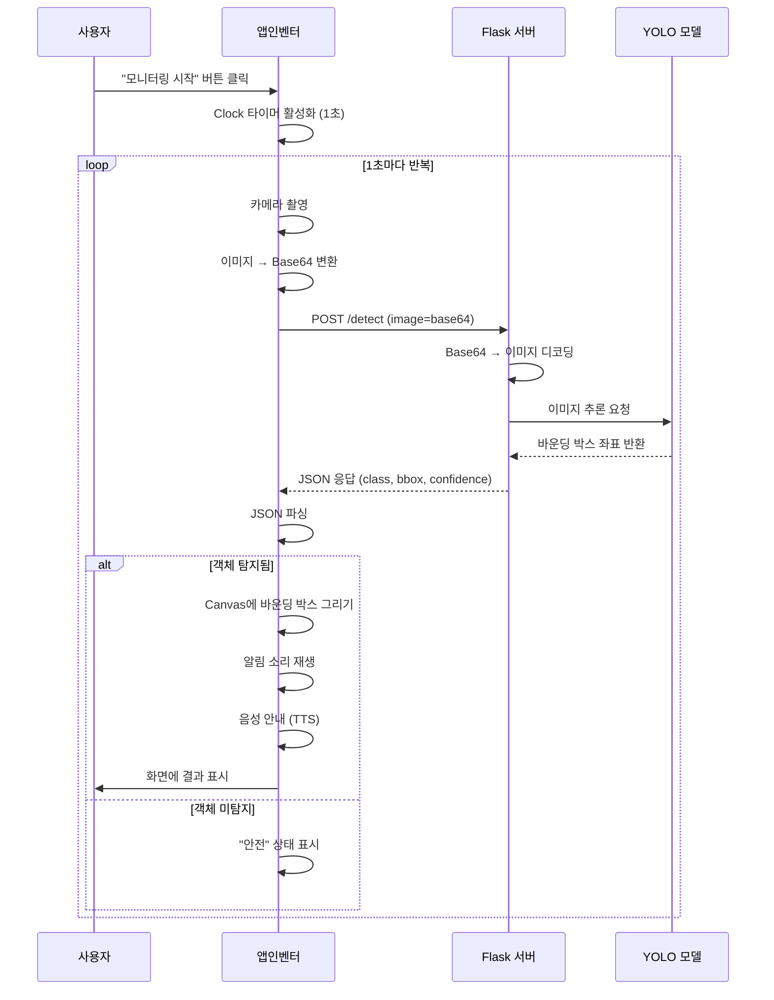
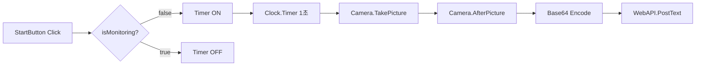
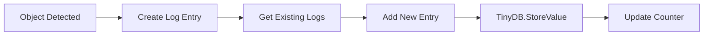
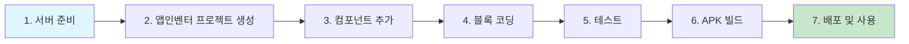

# 🎥 앱인벤터 보안 카메라 시스템 - 완전 가이드

## 📋 프로젝트 개요

**MIT 앱인벤터**를 사용하여 실시간 보안 카메라 시스템을 구축하는 완전한 가이드입니다. 커스텀 YOLO 모델을 활용하여 침입자, 차량, 동물 등을 실시간으로 탐지하고 알림을 제공합니다.

### 주요 기능
- ✅ 실시간 카메라 스트리밍 및 자동 촬영
- ✅ 커스텀 객체 탐지 (침입자, 차량, 동물 등)
- ✅ 바운딩 박스 실시간 표시 (Canvas 렌더링)
- ✅ 탐지 시 알림 (소리 + 음성 안내)
- ✅ 탐지 기록 자동 저장 및 조회
- ✅ 통계 및 분석 대시보드

---

## 🏗️ 시스템 아키텍처

### 전체 시스템 흐름도

```mermaid
graph TB
    subgraph "📱 앱인벤터 앱 (Android)"
        A[사용자] --> B[카메라 컴포넌트]
        B --> C[Clock: 1초마다 촬영]
        C --> D[이미지 Base64 인코딩]
        D --> E[Web: HTTP POST]
    end
    
    subgraph "🌐 Flask 서버 (Python)"
        E --> F[/detect 엔드포인트]
        F --> G[이미지 디코딩]
        G --> H[YOLO 모델 추론]
        H --> I[바운딩 박스 계산]
        I --> J[JSON 응답 생성]
    end
    
    subgraph "📱 앱인벤터 결과 처리"
        J --> K[Web.GotText 이벤트]
        K --> L[JSON 파싱]
        L --> M{객체 탐지됨?}
        M -->|Yes| N[Canvas: 바운딩 박스 그리기]
        M -->|Yes| O[Notifier: 알림 표시]
        M -->|Yes| P[TextToSpeech: 음성 안내]
        M -->|No| Q[대기 상태]
    end
    
    style A fill:#e1f5ff
    style B fill:#bbdefb
    style N fill:#c8e6c9
    style O fill:#fff9c4
    style P fill:#ffccbc
```

### 데이터 흐름 구조



---

## 📁 프로젝트 파일 구조

| 파일명 | 역할 | 용도 |
|--------|------|------|
| `README_보안카메라_프로젝트.md` | 📖 메인 가이드 | 프로젝트 전체 개요 (이 파일) |
| `앱인벤터_블록_가이드.md` | 🧩 블록 코딩 상세 | 앱인벤터 블록 구성 완전 가이드 |
| `앱인벤터_YOLO_TFLite_가이드.md` | 📱 TFLite 가이드 | 오프라인 모드 TFLite 사용법 |
| `Colab_커스텀_YOLO_학습_가이드.md` | 🤖 모델 학습 | Colab에서 YOLO 모델 학습 방법 |
| `security_camera_server.py` | 🌐 Flask 서버 | 객체 탐지 API 서버 (메인) |
| `download_yolo_model.py` | ⬇️ 모델 다운로드 | Colab에서 모델 파일 다운로드 |
| `convert_to_tflite.py` | 🔄 모델 변환 | PyTorch → TFLite 변환 |
| `YOLO_Colab_학습_노트북.txt` | 📝 Colab 코드 | Colab 노트북 전체 코드 모음 |
| `best.pt` | 🎯 학습된 모델 | YOLO 커스텀 모델 (학습 후 생성) |
| `requirements.txt` | 📦 의존성 | Python 패키지 목록 |

---

## 🚀 앱인벤터 구성 단계

### 전체 구성 프로세스

| 단계 | 작업 | 소요 시간 | 상태 |
|------|------|-----------|------|
| 1️⃣ | [서버 준비](#1단계-서버-준비) | 5분 | ⚙️ 사전 작업 |
| 2️⃣ | [앱인벤터 프로젝트 생성](#2단계-앱인벤터-프로젝트-생성) | 10분 | 🎨 UI 구성 |
| 3️⃣ | [컴포넌트 추가 및 설정](#3단계-컴포넌트-추가-및-설정) | 15분 | 🧩 컴포넌트 |
| 4️⃣ | [블록 코딩 - 초기화](#4단계-블록-코딩---초기화) | 10분 | 🔧 초기 설정 |
| 5️⃣ | [블록 코딩 - 촬영 및 전송](#5단계-블록-코딩---촬영-및-전송) | 15분 | 📸 핵심 로직 |
| 6️⃣ | [블록 코딩 - 결과 처리](#6단계-블록-코딩---결과-처리) | 15분 | 📊 결과 표시 |
| 7️⃣ | [테스트 및 디버깅](#7단계-테스트-및-디버깅) | 10분 | 🧪 검증 |
| 8️⃣ | [앱 빌드 및 배포](#8단계-앱-빌드-및-배포) | 5분 | 🚀 배포 |

---

### 1단계: 서버 준비

**목적:** Flask 서버와 YOLO 모델을 실행하여 API 준비

| 작업 | 명령어 / 방법 | 비고 |
|------|--------------|------|
| Python 패키지 설치 | `pip install flask flask-cors ultralytics opencv-python` | 필수 라이브러리 |
| YOLO 모델 배치 | `best.pt` 파일을 프로젝트 폴더에 복사 | Colab에서 다운로드 |
| 서버 실행 | `python security_camera_server.py` | 포트 5000 사용 |
| 서버 IP 확인 | Windows: `ipconfig` / Mac: `ifconfig` | 로컬 IP 주소 확인 |
| 서버 테스트 | 브라우저에서 `http://YOUR_IP:5000/health` 접속 | 응답 확인 |

**예상 결과:**
```json
{
  "status": "healthy",
  "model_loaded": true,
  "server_time": "2026-02-09T10:30:00"
}
```

---

### 2단계: 앱인벤터 프로젝트 생성

**목적:** MIT 앱인벤터에서 새 프로젝트 생성 및 화면 레이아웃 구성

| 작업 | 세부 내용 | 설정 값 |
|------|-----------|---------|
| 프로젝트 생성 | https://appinventor.mit.edu 접속 | 프로젝트명: `SecurityCamera` |
| Screen1 설정 | Screen1 속성 설정 | Title: "보안 카메라" |
| | | Orientation: Portrait |
| | | ScreenOrientation: Portrait |
| 레이아웃 구성 | VerticalArrangement (상단) | Height: 30%, AlignHorizontal: Center |
| | Canvas (중앙) | Height: 50%, BackgroundColor: Black |
| | VerticalArrangement (하단) | Height: 20%, AlignHorizontal: Center |

---

### 3단계: 컴포넌트 추가 및 설정

**목적:** 보안 카메라 기능에 필요한 모든 컴포넌트 추가

#### 3.1 UI 컴포넌트 (Visible)

| 컴포넌트 | 카테고리 | 이름 | 주요 속성 | 역할 |
|----------|----------|------|-----------|------|
| **TextBox** | User Interface | `ServerUrlInput` | Hint: "서버 주소 입력 (예: http://192.168.0.100:5000)" | 서버 URL 입력 |
| | | | Width: Fill parent | |
| **Button** | User Interface | `ConnectButton` | Text: "서버 연결" | 서버 연결 테스트 |
| | | | BackgroundColor: Blue | |
| **Button** | User Interface | `StartMonitoringButton` | Text: "모니터링 시작" | 모니터링 시작/중지 |
| | | | BackgroundColor: Green | |
| **Canvas** | Drawing and Animation | `DisplayCanvas` | Width: Fill parent | 이미지 및 바운딩 박스 표시 |
| | | | Height: 400 pixels | |
| | | | BackgroundColor: Black | |
| **Label** | User Interface | `StatusLabel` | Text: "준비됨" | 상태 메시지 표시 |
| | | | FontSize: 16 | |
| | | | TextAlignment: center | |
| **Label** | User Interface | `DetectionLabel` | Text: "탐지 결과: -" | 탐지된 객체 정보 |
| | | | FontSize: 14 | |
| **Label** | User Interface | `ConfidenceLabel` | Text: "신뢰도: -" | 신뢰도 점수 표시 |
| | | | FontSize: 14 | |
| **Button** | User Interface | `ViewLogsButton` | Text: "기록 조회" | 탐지 기록 확인 |
| | | | BackgroundColor: Orange | |

#### 3.2 비가시 컴포넌트 (Non-Visible)

| 컴포넌트 | 카테고리 | 이름 | 주요 속성 | 역할 |
|----------|----------|------|-----------|------|
| **Camera** | Media | `Camera1` | - | 사진 촬영 |
| **Web** | Connectivity | `WebAPI` | Url: (동적 설정) | HTTP 통신 |
| | | | AllowCookies: true | |
| | | | ResponseFileName: "" | |
| **Clock** | Sensors | `MonitoringClock` | TimerEnabled: false | 1초마다 촬영 트리거 |
| | | | TimerInterval: 1000 (1초) | |
| **Clock** | Sensors | `ConnectionCheckClock` | TimerEnabled: false | 서버 연결 상태 확인 |
| | | | TimerInterval: 5000 (5초) | |
| **Notifier** | User Interface | `AlertNotifier` | - | 알림 및 경고 표시 |
| **TextToSpeech** | Media | `VoiceAlert` | Language: ko-KR | 음성 안내 |
| | | | Pitch: 1.0 | |
| **Sound** | Media | `AlertSound` | Source: (알림 사운드 파일) | 알림 소리 재생 |
| **File** | Storage | `LogFile` | - | 탐지 기록 저장 |
| **TinyDB** | Storage | `SettingsDB` | - | 설정 값 저장 (서버 URL 등) |

#### 3.3 전역 변수 (Global Variables)

| 변수명 | 타입 | 초기값 | 설명 |
|--------|------|--------|------|
| `isMonitoring` | Boolean | false | 모니터링 활성화 상태 |
| `serverUrl` | Text | "" | Flask 서버 URL |
| `confidenceThreshold` | Number | 0.5 | 탐지 신뢰도 임계값 (0.0~1.0) |
| `capturedImage` | Text | "" | 촬영한 이미지 (Base64) |
| `detectionCount` | Number | 0 | 총 탐지 횟수 |
| `lastDetectionTime` | Text | "" | 마지막 탐지 시간 |
| `enableSound` | Boolean | true | 소리 알림 활성화 |
| `enableVoice` | Boolean | true | 음성 알림 활성화 |

---

### 4단계: 블록 코딩 - 초기화

**목적:** 앱 시작 시 초기 설정 및 저장된 서버 URL 로드

#### 4.1 Screen1.Initialize (화면 초기화)

| 순서 | 블록 구조 | 설명 |
|------|-----------|------|
| 1 | `when Screen1.Initialize` | 화면이 로드될 때 실행 |
| 2 | `set global isMonitoring to false` | 모니터링 상태 초기화 |
| 3 | `set global detectionCount to 0` | 탐지 횟수 초기화 |
| 4 | `set ServerUrlInput.Text to` | 저장된 서버 URL 로드 |
| | `TinyDB1.GetValue("serverUrl", "http://")` | (기본값: "http://") |
| 5 | `set StatusLabel.Text to "서버 연결이 필요합니다"` | 상태 메시지 표시 |
| 6 | `set StartMonitoringButton.Enabled to false` | 모니터링 버튼 비활성화 |

```
when Screen1.Initialize
  do
    set global isMonitoring ▼ to false
    set global detectionCount ▼ to 0
    set ServerUrlInput.Text ▼ to call TinyDB1.GetValue
                                      tag: "serverUrl"
                                      valueIfTagNotThere: "http://"
    set StatusLabel.Text ▼ to "서버 연결이 필요합니다"
    set StatusLabel.TextColor ▼ to Orange
    set StartMonitoringButton.Enabled ▼ to false
```

#### 4.2 ConnectButton.Click (서버 연결)

| 순서 | 블록 구조 | 설명 |
|------|-----------|------|
| 1 | `when ConnectButton.Click` | "서버 연결" 버튼 클릭 시 |
| 2 | `if is empty ServerUrlInput.Text` | URL이 비어있는지 확인 |
| 3 | `then Notifier1.ShowAlert("서버 주소를 입력하세요")` | 경고 표시 |
| 4 | `else` | URL이 입력된 경우 |
| 5 | `set global serverUrl to ServerUrlInput.Text` | 전역 변수에 저장 |
| 6 | `call TinyDB1.StoreValue("serverUrl", global serverUrl)` | 영구 저장 |
| 7 | `set WebAPI.Url to join(global serverUrl, "/health")` | 헬스체크 URL 설정 |
| 8 | `call WebAPI.Get` | GET 요청 전송 |
| 9 | `set StatusLabel.Text to "서버 연결 중..."` | 상태 메시지 |

```
when ConnectButton.Click
  do
    if is empty ▼ ServerUrlInput.Text ▼
      then call Notifier1.ShowAlert
                 message: "서버 주소를 입력하세요"
    else
      set global serverUrl ▼ to ServerUrlInput.Text ▼
      call TinyDB1.StoreValue
            tag: "serverUrl"
            valueToStore: global serverUrl ▼
      set WebAPI.Url ▼ to join ▼ global serverUrl ▼
                                  "/health"
      call WebAPI.Get
      set StatusLabel.Text ▼ to "서버 연결 중..."
      set StatusLabel.TextColor ▼ to Yellow
```

#### 4.3 WebAPI.GotText (서버 연결 응답) - 헬스체크

| 순서 | 블록 구조 | 설명 |
|------|-----------|------|
| 1 | `when WebAPI.GotText` | 서버 응답 수신 |
| 2 | `if WebAPI.Url contains "/health"` | 헬스체크 응답인지 확인 |
| 3 | `then if responseCode = 200` | 성공 응답 확인 |
| 4 | `set StatusLabel.Text to "서버 연결 성공!"` | 성공 메시지 |
| 5 | `set StartMonitoringButton.Enabled to true` | 모니터링 버튼 활성화 |
| 6 | `else` | 연결 실패 |
| 7 | `call Notifier1.ShowAlert("서버 연결 실패")` | 실패 알림 |

```
when WebAPI.GotText
      url
      responseCode
      responseType
      responseContent
  do
    if contains ▼ WebAPI.Url ▼
                  "/health"
      then if responseCode ▼ = 200
        then set StatusLabel.Text ▼ to "✅ 서버 연결 성공!"
             set StatusLabel.TextColor ▼ to Green
             set StartMonitoringButton.Enabled ▼ to true
             call Notifier1.ShowAlert
                    message: "서버 연결 성공! 모니터링을 시작할 수 있습니다."
      else call Notifier1.ShowAlert
                 message: join ▼ "서버 연결 실패 (코드: "
                                  responseCode ▼
                                  ")"
           set StatusLabel.Text ▼ to "❌ 서버 연결 실패"
           set StatusLabel.TextColor ▼ to Red
```

---

### 5단계: 블록 코딩 - 촬영 및 전송

**목적:** 1초마다 자동 촬영하고 서버로 이미지 전송

#### 5.1 StartMonitoringButton.Click (모니터링 시작/중지)

| 순서 | 블록 구조 | 설명 |
|------|-----------|------|
| 1 | `when StartMonitoringButton.Click` | "모니터링 시작" 버튼 클릭 |
| 2 | `if global isMonitoring = false` | 모니터링이 꺼져있으면 |
| 3 | `set global isMonitoring to true` | 모니터링 활성화 |
| 4 | `set MonitoringClock.TimerEnabled to true` | 타이머 시작 (1초마다) |
| 5 | `set StartMonitoringButton.Text to "모니터링 중지"` | 버튼 텍스트 변경 |
| 6 | `set StartMonitoringButton.BackgroundColor to Red` | 버튼 색상 변경 |
| 7 | `set StatusLabel.Text to "🔴 모니터링 중..."` | 상태 표시 |
| 8 | `else` | 모니터링이 켜져있으면 |
| 9 | `set global isMonitoring to false` | 모니터링 비활성화 |
| 10 | `set MonitoringClock.TimerEnabled to false` | 타이머 중지 |
| 11 | `set StartMonitoringButton.Text to "모니터링 시작"` | 버튼 텍스트 원복 |
| 12 | `set StartMonitoringButton.BackgroundColor to Green` | 버튼 색상 원복 |
| 13 | `set StatusLabel.Text to "⚪ 모니터링 중지됨"` | 상태 표시 |

```
when StartMonitoringButton.Click
  do
    if global isMonitoring ▼ = false
      then set global isMonitoring ▼ to true
           set MonitoringClock.TimerEnabled ▼ to true
           set StartMonitoringButton.Text ▼ to "모니터링 중지"
           set StartMonitoringButton.BackgroundColor ▼ to Red
           set StatusLabel.Text ▼ to "🔴 모니터링 중..."
           set StatusLabel.TextColor ▼ to Red
           call Notifier1.ShowAlert
                  message: "모니터링이 시작되었습니다"
    else set global isMonitoring ▼ to false
         set MonitoringClock.TimerEnabled ▼ to false
         set StartMonitoringButton.Text ▼ to "모니터링 시작"
         set StartMonitoringButton.BackgroundColor ▼ to Green
         set StatusLabel.Text ▼ to "⚪ 모니터링 중지됨"
         set StatusLabel.TextColor ▼ to Gray
         call DisplayCanvas.Clear
```

#### 5.2 MonitoringClock.Timer (1초마다 촬영)

| 순서 | 블록 구조 | 설명 |
|------|-----------|------|
| 1 | `when MonitoringClock.Timer` | 1초마다 자동 실행 |
| 2 | `if global isMonitoring = true` | 모니터링이 활성화되어 있으면 |
| 3 | `call Camera1.TakePicture` | 카메라로 사진 촬영 |

```
when MonitoringClock.Timer
  do
    if global isMonitoring ▼ = true
      then call Camera1.TakePicture
```

#### 5.3 Camera1.AfterPicture (촬영 후 이미지 인코딩 및 전송)

| 순서 | 블록 구조 | 설명 |
|------|-----------|------|
| 1 | `when Camera1.AfterPicture` | 사진 촬영 완료 후 |
| 2 | `set global capturedImage to image` | 이미지 경로 저장 |
| 3 | `call DisplayCanvas.Clear` | Canvas 초기화 |
| 4 | `call DisplayCanvas.DrawPicture` | 촬영한 이미지 표시 |
| | `picture: image, x: 0, y: 0` | |
| 5 | `set base64Image to call ImageToBase64.Convert(image)` | Base64 인코딩 |
| 6 | `set WebAPI.Url to join(global serverUrl, "/detect")` | 탐지 API URL 설정 |
| 7 | `call WebAPI.PostText` | POST 요청 전송 |
| | `text: join("image=", base64Image)` | |

```
when Camera1.AfterPicture
      image
  do
    set global capturedImage ▼ to image ▼
    call DisplayCanvas.Clear
    call DisplayCanvas.DrawPicture
          picture: image ▼
          x: 0
          y: 0
    
    // Base64 인코딩 (Extension 사용)
    set local base64Image ▼ to call ImageToBase64Extension.ImageToBase64
                                      imagePath: image ▼
    
    // 서버로 전송
    set WebAPI.Url ▼ to join ▼ global serverUrl ▼
                                "/detect"
    call WebAPI.PostText
          text: join ▼ "image="
                        get local base64Image ▼
    
    set StatusLabel.Text ▼ to "📤 이미지 분석 중..."
    set StatusLabel.TextColor ▼ to Blue
```

> **참고:** `ImageToBase64Extension`은 MIT App Inventor Extensions Gallery에서 다운로드 필요
> - URL: https://community.appinventor.mit.edu/t/extension-imagebase64/

---

### 6단계: 블록 코딩 - 결과 처리

**목적:** 서버로부터 받은 탐지 결과를 파싱하고 화면에 표시

#### 6.1 WebAPI.GotText (탐지 결과 수신) - /detect 응답

| 순서 | 블록 구조 | 설명 |
|------|-----------|------|
| 1 | `when WebAPI.GotText` | 서버 응답 수신 |
| 2 | `if WebAPI.Url contains "/detect"` | 탐지 API 응답 확인 |
| 3 | `if responseCode = 200` | 성공 응답 |
| 4 | `set jsonResponse to call Web.JsonTextDecode(responseContent)` | JSON 파싱 |
| 5 | `set detections to get jsonResponse["detections"]` | 탐지 결과 배열 추출 |
| 6 | `if length of detections > 0` | 객체가 탐지되었으면 |
| 7 | `call ProcessDetections(detections)` | 탐지 결과 처리 (Procedure 호출) |
| 8 | `else` | 객체 미탐지 |
| 9 | `set StatusLabel.Text to "✅ 안전 (탐지 없음)"` | 안전 상태 표시 |
| 10 | `set DetectionLabel.Text to "탐지 결과: 없음"` | |

```
when WebAPI.GotText
      url
      responseCode
      responseType
      responseContent
  do
    if contains ▼ WebAPI.Url ▼
                  "/detect"
      then if responseCode ▼ = 200
        then set local jsonResponse ▼ to call Web.JsonTextDecode
                                                json: responseContent ▼
             set local detections ▼ to select list item ▼
                                              list: get local jsonResponse ▼
                                              index: "detections"
             
             if length of list ▼ get local detections ▼ > 0
               then call ProcessDetections
                          detectionList: get local detections ▼
             else set StatusLabel.Text ▼ to "✅ 안전 (탐지 없음)"
                  set StatusLabel.TextColor ▼ to Green
                  set DetectionLabel.Text ▼ to "탐지 결과: 없음"
                  set ConfidenceLabel.Text ▼ to "신뢰도: -"
      else call Notifier1.ShowAlert
                 message: join ▼ "탐지 실패 (코드: "
                                  responseCode ▼
                                  ")"
```

#### 6.2 Procedure: ProcessDetections (탐지 결과 처리)

| 순서 | 블록 구조 | 설명 |
|------|-----------|------|
| 1 | `to ProcessDetections (detectionList)` | Procedure 정의 |
| 2 | `set firstDetection to select list item(detectionList, 1)` | 첫 번째 탐지 결과 추출 |
| 3 | `set className to get firstDetection["class"]` | 클래스명 추출 |
| 4 | `set confidence to get firstDetection["confidence"]` | 신뢰도 추출 |
| 5 | `set bbox to get firstDetection["bbox"]` | 바운딩 박스 좌표 추출 |
| 6 | `if confidence >= global confidenceThreshold` | 신뢰도 임계값 확인 |
| 7 | `call DrawBoundingBox(bbox)` | 바운딩 박스 그리기 |
| 8 | `set DetectionLabel.Text to join("탐지: ", className)` | 탐지 정보 표시 |
| 9 | `set ConfidenceLabel.Text to join("신뢰도: ", round(confidence * 100), "%")` | 신뢰도 표시 |
| 10 | `set global detectionCount to global detectionCount + 1` | 탐지 횟수 증가 |
| 11 | `call SendAlert(className, confidence)` | 알림 전송 |
| 12 | `call SaveDetectionLog(className, confidence)` | 기록 저장 |

```
to ProcessDetections
    detectionList
  do
    set local firstDetection ▼ to select list item ▼
                                         list: get detectionList ▼
                                         index: 1
    
    set local className ▼ to select list item ▼
                                    list: get local firstDetection ▼
                                    index: "class"
    
    set local confidence ▼ to select list item ▼
                                     list: get local firstDetection ▼
                                     index: "confidence"
    
    set local bbox ▼ to select list item ▼
                              list: get local firstDetection ▼
                              index: "bbox"
    
    if get local confidence ▼ >= global confidenceThreshold ▼
      then call DrawBoundingBox
                 bboxData: get local bbox ▼
           
           set DetectionLabel.Text ▼ to join ▼ "🔴 탐지: "
                                                 get local className ▼
           set DetectionLabel.TextColor ▼ to Red
           
           set local confidencePercent ▼ to round ▼ * ▼ get local confidence ▼
                                                          100
           set ConfidenceLabel.Text ▼ to join ▼ "신뢰도: "
                                                  get local confidencePercent ▼
                                                  "%"
           
           set global detectionCount ▼ to + ▼ global detectionCount ▼
                                                1
           
           set StatusLabel.Text ▼ to join ▼ "⚠️ 경고! "
                                              get local className ▼
                                              " 탐지됨 (총 "
                                              global detectionCount ▼
                                              "회)"
           set StatusLabel.TextColor ▼ to Red
           
           call SendAlert
                 className: get local className ▼
                 confidence: get local confidence ▼
           
           call SaveDetectionLog
                 className: get local className ▼
                 confidence: get local confidence ▼
```

#### 6.3 Procedure: DrawBoundingBox (바운딩 박스 그리기)

| 순서 | 블록 구조 | 설명 |
|------|-----------|------|
| 1 | `to DrawBoundingBox (bboxData)` | Procedure 정의 |
| 2 | `set x to get bboxData["x"]` | x 좌표 추출 |
| 3 | `set y to get bboxData["y"]` | y 좌표 추출 |
| 4 | `set w to get bboxData["w"]` | 너비 추출 |
| 5 | `set h to get bboxData["h"]` | 높이 추출 |
| 6 | `set scaleX to DisplayCanvas.Width / imageWidth` | X축 스케일 계산 |
| 7 | `set scaleY to DisplayCanvas.Height / imageHeight` | Y축 스케일 계산 |
| 8 | `set scaledX to x * scaleX` | 좌표 변환 |
| 9 | `set scaledY to y * scaleY` | 좌표 변환 |
| 10 | `set scaledW to w * scaleX` | 크기 변환 |
| 11 | `set scaledH to h * scaleY` | 크기 변환 |
| 12 | `set DisplayCanvas.LineWidth to 3` | 선 두께 설정 |
| 13 | `set DisplayCanvas.PaintColor to Red` | 선 색상 설정 |
| 14 | `call DisplayCanvas.DrawCircle` (4개의 모서리) | 바운딩 박스 그리기 |
| 15 | `call DisplayCanvas.DrawLine` (4개의 선) | |

```
to DrawBoundingBox
    bboxData
  do
    set local x ▼ to select list item ▼
                           list: get bboxData ▼
                           index: "x"
    set local y ▼ to select list item ▼
                           list: get bboxData ▼
                           index: "y"
    set local w ▼ to select list item ▼
                           list: get bboxData ▼
                           index: "w"
    set local h ▼ to select list item ▼
                           list: get bboxData ▼
                           index: "h"
    
    // 스케일 계산 (서버 이미지 크기 vs Canvas 크기)
    set local imageWidth ▼ to 640  // YOLO 모델 입력 크기
    set local imageHeight ▼ to 640
    
    set local scaleX ▼ to / ▼ DisplayCanvas.Width ▼
                               get local imageWidth ▼
    set local scaleY ▼ to / ▼ DisplayCanvas.Height ▼
                               get local imageHeight ▼
    
    // 좌표 변환
    set local scaledX ▼ to * ▼ get local x ▼
                                get local scaleX ▼
    set local scaledY ▼ to * ▼ get local y ▼
                                get local scaleY ▼
    set local scaledW ▼ to * ▼ get local w ▼
                                get local scaleX ▼
    set local scaledH ▼ to * ▼ get local h ▼
                                get local scaleY ▼
    
    // 바운딩 박스 그리기
    set DisplayCanvas.LineWidth ▼ to 3
    set DisplayCanvas.PaintColor ▼ to Red
    
    // 사각형 그리기 (4개의 선)
    call DisplayCanvas.DrawLine
          x1: get local scaledX ▼
          y1: get local scaledY ▼
          x2: + ▼ get local scaledX ▼
                  get local scaledW ▼
          y2: get local scaledY ▼
    
    call DisplayCanvas.DrawLine
          x1: + ▼ get local scaledX ▼
                  get local scaledW ▼
          y1: get local scaledY ▼
          x2: + ▼ get local scaledX ▼
                  get local scaledW ▼
          y2: + ▼ get local scaledY ▼
                  get local scaledH ▼
    
    call DisplayCanvas.DrawLine
          x1: + ▼ get local scaledX ▼
                  get local scaledW ▼
          y1: + ▼ get local scaledY ▼
                  get local scaledH ▼
          x2: get local scaledX ▼
          y2: + ▼ get local scaledY ▼
                  get local scaledH ▼
    
    call DisplayCanvas.DrawLine
          x1: get local scaledX ▼
          y1: + ▼ get local scaledY ▼
                  get local scaledH ▼
          x2: get local scaledX ▼
          y2: get local scaledY ▼
```

#### 6.4 Procedure: SendAlert (알림 전송)

| 순서 | 블록 구조 | 설명 |
|------|-----------|------|
| 1 | `to SendAlert (className, confidence)` | Procedure 정의 |
| 2 | `if global enableSound = true` | 소리 알림 활성화 확인 |
| 3 | `call AlertSound.Play` | 알림 소리 재생 |
| 4 | `if global enableVoice = true` | 음성 알림 활성화 확인 |
| 5 | `set message to join(className, "가 탐지되었습니다")` | 음성 메시지 생성 |
| 6 | `call VoiceAlert.Speak(message)` | TTS 음성 안내 |
| 7 | `call Notifier1.ShowAlert(message)` | 화면 알림 표시 |

```
to SendAlert
    className
    confidence
  do
    if global enableSound ▼ = true
      then call AlertSound.Play
    
    if global enableVoice ▼ = true
      then set local message ▼ to join ▼ get className ▼
                                          "가 탐지되었습니다. 신뢰도는 "
                                          round ▼ * ▼ get confidence ▼
                                                       100
                                          "퍼센트입니다."
           call VoiceAlert.Speak
                 message: get local message ▼
    
    call Notifier1.ShowAlert
          message: join ▼ "⚠️ 경고!\n"
                           get className ▼
                           " 탐지됨\n신뢰도: "
                           round ▼ * ▼ get confidence ▼
                                        100
                           "%"
```

#### 6.5 Procedure: SaveDetectionLog (탐지 기록 저장)

| 순서 | 블록 구조 | 설명 |
|------|-----------|------|
| 1 | `to SaveDetectionLog (className, confidence)` | Procedure 정의 |
| 2 | `set timestamp to call Clock1.Now` | 현재 시간 가져오기 |
| 3 | `set logEntry to make dictionary` | 로그 항목 생성 |
| | `("time", timestamp)` | |
| | `("class", className)` | |
| | `("confidence", confidence)` | |
| 4 | `set existingLogs to TinyDB1.GetValue("logs", empty list)` | 기존 로그 불러오기 |
| 5 | `call add items to list(existingLogs, logEntry)` | 새 로그 추가 |
| 6 | `call TinyDB1.StoreValue("logs", existingLogs)` | 로그 저장 |
| 7 | `set global lastDetectionTime to timestamp` | 마지막 탐지 시간 업데이트 |

```
to SaveDetectionLog
    className
    confidence
  do
    set local timestamp ▼ to call Clock1.FormatDateTime
                                   instant: call Clock1.Now
                                   pattern: "yyyy-MM-dd HH:mm:ss"
    
    set local logEntry ▼ to make a dictionary ▼
                                  pair: "time" : get local timestamp ▼
                                  pair: "class" : get className ▼
                                  pair: "confidence" : get confidence ▼
                                  pair: "count" : global detectionCount ▼
    
    set local existingLogs ▼ to call TinyDB1.GetValue
                                      tag: "detectionLogs"
                                      valueIfTagNotThere: create empty list ▼
    
    call add items to list ▼
          list: get local existingLogs ▼
          item: get local logEntry ▼
    
    call TinyDB1.StoreValue
          tag: "detectionLogs"
          valueToStore: get local existingLogs ▼
    
    set global lastDetectionTime ▼ to get local timestamp ▼
```

---

### 7단계: 테스트 및 디버깅

**목적:** 앱 기능 검증 및 문제 해결

#### 7.1 테스트 체크리스트

| 순번 | 테스트 항목 | 예상 결과 | 통과 여부 |
|------|------------|----------|-----------|
| 1 | 서버 연결 테스트 | "✅ 서버 연결 성공!" 메시지 표시 | [ ] |
| 2 | 모니터링 시작 | Clock 타이머 활성화, 1초마다 촬영 | [ ] |
| 3 | 이미지 촬영 및 전송 | Canvas에 이미지 표시, 서버로 전송 | [ ] |
| 4 | 객체 탐지 (성공) | 바운딩 박스 표시, 알림 재생, 탐지 정보 표시 | [ ] |
| 5 | 객체 미탐지 | "✅ 안전 (탐지 없음)" 메시지 표시 | [ ] |
| 6 | 바운딩 박스 정확도 | 바운딩 박스가 객체 위치와 일치 | [ ] |
| 7 | 소리 알림 | AlertSound 재생 확인 | [ ] |
| 8 | 음성 알림 | TTS로 "[클래스명]가 탐지되었습니다" 안내 | [ ] |
| 9 | 탐지 기록 저장 | TinyDB에 로그 저장 확인 | [ ] |
| 10 | 모니터링 중지 | Clock 타이머 비활성화, 촬영 중단 | [ ] |

#### 7.2 디버깅 방법

| 문제 상황 | 디버깅 방법 | 해결 방법 |
|----------|------------|----------|
| 서버 연결 실패 | `StatusLabel`에 에러 메시지 확인 | IP 주소, 포트, 방화벽 확인 |
| 이미지 전송 안 됨 | `WebAPI.GotText`에 로그 블록 추가 | Base64 인코딩 확인 |
| 바운딩 박스 위치 오류 | 스케일 계산 값 확인 (`scaleX`, `scaleY`) | 이미지 크기 및 Canvas 크기 일치 확인 |
| 알림 재생 안 됨 | `enableSound`, `enableVoice` 값 확인 | 권한 설정 및 파일 경로 확인 |
| 탐지 기록 미저장 | `TinyDB1.GetValue("logs")` 확인 | TinyDB 초기화 및 저장 로직 확인 |

---

### 8단계: 앱 빌드 및 배포

**목적:** 안드로이드 APK 파일 생성 및 스마트폰에 설치

#### 8.1 빌드 프로세스

| 단계 | 작업 | 방법 |
|------|------|------|
| 1 | 앱인벤터에서 빌드 | `Build` → `Android App (.apk)` 클릭 |
| 2 | QR 코드 또는 다운로드 | QR 코드 스캔하여 설치 또는 APK 다운로드 |
| 3 | 스마트폰 설정 | `설정` → `보안` → `알 수 없는 소스` 허용 |
| 4 | APK 설치 | 다운로드한 APK 파일 실행하여 설치 |
| 5 | 권한 허용 | 카메라, 저장소, 인터넷 권한 허용 |

#### 8.2 최종 배포 체크리스트

| 항목 | 확인 사항 | 상태 |
|------|----------|------|
| ✅ 서버 실행 | Flask 서버가 실행 중이고 접근 가능 | [ ] |
| ✅ 모델 배치 | `best.pt` 파일이 서버 폴더에 존재 | [ ] |
| ✅ 네트워크 | 스마트폰과 서버가 같은 Wi-Fi에 연결 | [ ] |
| ✅ 방화벽 | 포트 5000이 열려있음 | [ ] |
| ✅ 앱 권한 | 카메라, 저장소, 인터넷 권한 허용됨 | [ ] |
| ✅ 서버 URL | 앱에서 정확한 서버 URL 입력 | [ ] |
| ✅ 기능 테스트 | 모든 기능이 정상 작동 | [ ] |

---

## 📚 앱인벤터 상세 가이드

### 주요 기능별 블록 구조

#### 기능 1: 실시간 모니터링



**블록 요약:**

| 이벤트 | 트리거 | 동작 | 결과 |
|--------|--------|------|------|
| `StartMonitoringButton.Click` | 사용자 클릭 | Timer 토글 | 모니터링 시작/중지 |
| `MonitoringClock.Timer` | 1초마다 | `Camera1.TakePicture` | 자동 촬영 |
| `Camera1.AfterPicture` | 촬영 완료 | Base64 인코딩 → POST | 서버로 전송 |

#### 기능 2: 객체 탐지 및 표시

```mermaid
graph TD
    A[WebAPI.GotText] --> B{responseCode = 200?}
    B -->|Yes| C[JSON Parse]
    B -->|No| D[Error Alert]
    C --> E{detections > 0?}
    E -->|Yes| F[Extract bbox]
    E -->|No| G[Show "안전"]
    F --> H[Calculate Scale]
    H --> I[Draw Bbox on Canvas]
    I --> J[Show Alert]
    J --> K[Play Sound]
    K --> L[Speak TTS]
```

**블록 요약:**

| 이벤트 | 조건 | 동작 | 출력 |
|--------|------|------|------|
| `WebAPI.GotText` | `/detect` 응답 | JSON 파싱 | 탐지 결과 추출 |
| `ProcessDetections` | confidence >= 0.5 | 바운딩 박스 계산 | Canvas 그리기 |
| `DrawBoundingBox` | 좌표 스케일링 | `DrawLine` × 4 | 사각형 표시 |
| `SendAlert` | 탐지 성공 | Sound + TTS | 알림 재생 |

#### 기능 3: 탐지 기록 관리



**블록 요약:**

| 함수 | 입력 | 처리 | 출력 |
|------|------|------|------|
| `SaveDetectionLog` | className, confidence | Dictionary 생성 | TinyDB 저장 |
| `ViewLogsButton.Click` | - | TinyDB 조회 | 로그 목록 표시 |
| 데이터 구조 | `{"time": "2026-02-09 10:30:00", "class": "person", "confidence": 0.85}` | - | - |

---

## 🔧 앱인벤터 커스터마이징

### 설정 변경 가능 항목

#### 전역 변수 설정 (초기화 블록에서 설정)

| 변수명 | 기본값 | 설정 범위 | 용도 | 효과 |
|--------|--------|----------|------|------|
| `confidenceThreshold` | 0.5 | 0.0 ~ 1.0 | 탐지 신뢰도 임계값 | 낮을수록 더 많이 탐지 (정확도 감소) |
| `captureInterval` | 1000 | 500 ~ 5000 | 촬영 간격 (밀리초) | 높을수록 서버 부하 감소 |
| `enableSound` | true | true / false | 소리 알림 활성화 | false 시 무음 모드 |
| `enableVoice` | true | true / false | 음성 알림 활성화 | false 시 TTS 비활성화 |
| `imageQuality` | 80 | 50 ~ 100 | 이미지 품질 (%) | 낮을수록 전송 속도 빠름 |
| `maxImageWidth` | 640 | 320 ~ 1280 | 이미지 최대 너비 | 낮을수록 처리 속도 빠름 |

#### UI 커스터마이징

| 컴포넌트 | 속성 | 기본값 | 추천 설정 |
|----------|------|--------|----------|
| `DisplayCanvas` | Width | Fill parent | 화면 너비에 맞춤 |
| | Height | 400 pixels | 화면 비율에 따라 조정 |
| | BackgroundColor | Black | 어두운 배경 (검은색 추천) |
| `StartMonitoringButton` | BackgroundColor | Green | 시작: 초록, 중지: 빨강 |
| | FontSize | 18 | 14~24 사이 |
| `StatusLabel` | FontSize | 16 | 상태에 따라 색상 변경 |
| | TextColor | Dynamic | 안전: 초록, 경고: 빨강, 대기: 회색 |

#### 알림 커스터마이징

| 알림 유형 | 설정 항목 | 옵션 |
|----------|----------|------|
| **소리 알림** | `AlertSound.Source` | 사용자 정의 소리 파일 업로드 (MP3, WAV) |
| | `AlertSound.MinimumInterval` | 3000 (3초마다 최대 1회 재생) |
| **음성 알림** | `VoiceAlert.Language` | ko-KR (한국어), en-US (영어) |
| | `VoiceAlert.Pitch` | 0.8 ~ 1.2 (음성 높낮이) |
| | `VoiceAlert.SpeechRate` | 0.8 ~ 1.2 (말하기 속도) |
| **화면 알림** | `Notifier1.NotifierLength` | short (짧게), long (길게) |
| | `Notifier1.BackgroundColor` | 배경 색상 설정 |

### 고급 기능 추가

#### 1. 다중 객체 탐지 표시

**현재:** 첫 번째 탐지 결과만 표시  
**개선:** 모든 탐지된 객체에 바운딩 박스 표시

```
to ProcessDetections (detectionList)
  do
    for each detection in detectionList
      set className to get detection["class"]
      set confidence to get detection["confidence"]
      set bbox to get detection["bbox"]
      
      if confidence >= global confidenceThreshold
        then call DrawBoundingBox(bbox)
             call DrawLabel(className, confidence, bbox)
```

#### 2. 클래스별 색상 구분

| 클래스 | 바운딩 박스 색상 | 용도 |
|--------|------------------|------|
| person | Red (빨강) | 침입자 |
| car | Blue (파랑) | 차량 |
| dog | Yellow (노랑) | 동물 |
| unknown | White (흰색) | 기타 |

**구현 방법:**

```
to GetColorForClass (className)
  result
  do
    if className = "person"
      then return Red
    else if className = "car"
      then return Blue
    else if className = "dog"
      then return Yellow
    else return White
```

#### 3. 탐지 통계 대시보드

**추가 컴포넌트:**
- `Chart` (Extensions에서 추가)
- `ListView` (탐지 기록 목록)

**통계 항목:**

| 항목 | 계산 방법 | 표시 형식 |
|------|----------|----------|
| 총 탐지 횟수 | `global detectionCount` | 숫자 |
| 클래스별 탐지 횟수 | Dictionary로 집계 | 막대 그래프 |
| 시간대별 탐지 빈도 | 시간별 그룹핑 | 선 그래프 |
| 평균 신뢰도 | 신뢰도 합계 / 횟수 | 퍼센트 |

#### 4. 녹화 기능 추가

**추가 컴포넌트:**
- `Camcorder` (비디오 녹화)
- `VideoPlayer` (재생)

**로직:**

| 이벤트 | 동작 |
|--------|------|
| 객체 탐지 시 | 자동으로 5초 녹화 시작 |
| 녹화 완료 | 파일 저장 및 TinyDB에 경로 기록 |
| 재생 | 기록 조회 화면에서 비디오 재생 |

---

## 🔧 설정 및 커스터마이징

### 서버 설정

**포트 변경:**
```bash
python security_camera_server.py --port 8080
```

**다른 모델 사용:**
```bash
python security_camera_server.py --model yolov8s.pt
```

**디버그 모드:**
```bash
python security_camera_server.py --debug
```

### 앱 설정

**앱인벤터 전역 변수:**
```
serverUrl = "http://YOUR_IP:5000"
confidenceThreshold = 0.5          # 0.0~1.0
captureInterval = 1000             # 밀리초 (1000 = 1초)
enableSound = true                 # 소리 알림
enableVoice = true                 # 음성 알림
```

### 모델 성능 조정

**더 빠른 탐지 (정확도 감소):**
- 모델: yolov8n.pt
- 이미지 크기: 320x320
- 신뢰도: 0.3

**더 정확한 탐지 (속도 감소):**
- 모델: yolov8m.pt
- 이미지 크기: 640x640
- 신뢰도: 0.7

---

## 🎯 사용 예시

### 예시 1: 침입자 탐지

**학습 데이터:**
- 클래스: person
- 이미지: 200장 (다양한 각도, 조명)

**설정:**
- 신뢰도: 0.6
- 촬영 간격: 1초
- 알림: 소리 + 음성

**결과:**
```json
{
  "class": "person",
  "confidence": 0.85,
  "bbox": {
    "x": 320,
    "y": 240,
    "w": 150,
    "h": 280
  }
}
```

### 예시 2: 차량 번호판 탐지

**학습 데이터:**
- 클래스: car, license_plate
- 이미지: 500장

**설정:**
- 신뢰도: 0.7
- 촬영 간격: 2초

**결과:**
```json
{
  "detections": [
    {
      "class": "car",
      "confidence": 0.92,
      "bbox": {"x": 400, "y": 300, "w": 300, "h": 200}
    },
    {
      "class": "license_plate",
      "confidence": 0.78,
      "bbox": {"x": 450, "y": 380, "w": 80, "h": 30}
    }
  ]
}
```

### 예시 3: 동물 탐지

**학습 데이터:**
- 클래스: dog, cat, bird
- 이미지: 300장

**설정:**
- 신뢰도: 0.5
- 촬영 간격: 1초
- 음성 안내: "강아지가 탐지되었습니다"

---

## 🐛 앱인벤터 문제 해결

### 일반적인 문제 및 해결 방법

| 문제 | 증상 | 원인 | 해결 방법 | 우선순위 |
|------|------|------|----------|----------|
| **서버 연결 실패** | "❌ 서버 연결 실패" 메시지 | 서버 미실행 또는 네트워크 오류 | 1. 서버 실행 확인<br>2. IP 주소 확인<br>3. 방화벽 설정<br>4. Wi-Fi 연결 확인 | 🔴 높음 |
| **이미지 촬영 안 됨** | Camera1.AfterPicture 이벤트 미발생 | 카메라 권한 미허용 | 앱 설정 → 권한 → 카메라 허용 | 🔴 높음 |
| **이미지 전송 실패** | 서버로 이미지가 전송되지 않음 | Base64 인코딩 실패 또는 네트워크 오류 | 1. ImageToBase64 Extension 확인<br>2. 인터넷 권한 확인<br>3. 이미지 크기 줄이기 (< 5MB) | 🟡 중간 |
| **바운딩 박스 위치 오류** | 바운딩 박스가 객체와 다른 위치 | 스케일링 계산 오류 | 1. `scaleX = Canvas.Width / 640`<br>2. `scaleY = Canvas.Height / 640`<br>3. Canvas 비율 확인 | 🟡 중간 |
| **탐지 속도 느림** | 탐지에 5초 이상 소요 | 이미지 크기 또는 모델 크기 | 1. 이미지 리사이즈 (640x640)<br>2. 촬영 간격 증가 (2초)<br>3. 작은 모델 사용 (yolov8n.pt) | 🟡 중간 |
| **알림 재생 안 됨** | Sound 또는 TTS 작동 안 함 | 파일 경로 오류 또는 권한 | 1. Sound.Source 파일 확인<br>2. TTS 언어 설정 (ko-KR)<br>3. 오디오 권한 확인 | 🟢 낮음 |
| **탐지 기록 미저장** | TinyDB에 로그가 저장되지 않음 | TinyDB 초기화 오류 | 1. `SaveDetectionLog` 함수 확인<br>2. TinyDB 태그명 확인<br>3. 로그 구조 확인 | 🟢 낮음 |
| **JSON 파싱 오류** | "Invalid JSON" 에러 | 서버 응답 형식 오류 | 1. 서버 응답 확인 (`/detect`)<br>2. `Web.JsonTextDecode` 블록 확인 | 🟡 중간 |
| **Canvas 이미지 안 보임** | Canvas가 검은색으로만 표시됨 | 이미지 경로 오류 | 1. `Camera1.AfterPicture` 이벤트 확인<br>2. `DrawPicture` 블록 확인<br>3. 이미지 파일 권한 확인 | 🟡 중간 |
| **모니터링 중지 안 됨** | "모니터링 중지" 버튼이 작동 안 함 | Timer 비활성화 오류 | `MonitoringClock.TimerEnabled = false` 확인 | 🟢 낮음 |

---

### 문제별 상세 해결 가이드

#### 1. 서버 연결 실패

**디버깅 체크리스트:**

| 순서 | 확인 항목 | 명령어 / 방법 | 예상 결과 |
|------|----------|--------------|----------|
| 1️⃣ | 서버 실행 확인 | `python security_camera_server.py` | `Running on http://0.0.0.0:5000` 출력 |
| 2️⃣ | 서버 IP 확인 | Windows: `ipconfig`<br>Mac/Linux: `ifconfig` | IPv4 주소 확인 (예: 192.168.0.100) |
| 3️⃣ | 헬스체크 테스트 | 브라우저: `http://YOUR_IP:5000/health` | `{"status": "healthy"}` 응답 |
| 4️⃣ | 방화벽 설정 | Windows: 방화벽 → 포트 5000 허용<br>Mac: 시스템 환경설정 → 보안 | 포트 5000 인바운드 규칙 추가 |
| 5️⃣ | Wi-Fi 연결 확인 | 스마트폰과 PC가 같은 네트워크인지 확인 | 같은 SSID (네트워크 이름) |
| 6️⃣ | URL 형식 확인 | 앱에서 입력한 URL | `http://192.168.0.100:5000` (https 아님!) |

**앱인벤터 디버깅 블록 추가:**

```
when WebAPI.GotText
  do
    call Notifier1.ShowAlert
          message: join ▼ "Response Code: "
                           responseCode ▼
                           "\nURL: "
                           WebAPI.Url ▼
                           "\nContent: "
                           responseContent ▼
```

---

#### 2. 이미지 전송 실패

**Base64 인코딩 확인:**

| 단계 | 블록 | 확인 방법 |
|------|------|----------|
| 1 | `Camera1.AfterPicture` | 이미지 경로가 올바른지 확인 (예: `/storage/emulated/0/...`) |
| 2 | `ImageToBase64Extension.ImageToBase64` | Extension이 추가되어 있는지 확인 |
| 3 | Base64 문자열 생성 | Label에 문자열 길이 표시 (`length of base64Image`) |
| 4 | `WebAPI.PostText` | POST 요청 전송 확인 |

**Extension 추가 방법:**

1. 앱인벤터 → `Extensions` → `Import extension`
2. URL: https://community.appinventor.mit.edu/t/extension-imagebase64/
3. `ImageToBase64.aix` 파일 다운로드 후 업로드

**대체 방법 (Extension 없이):**

서버에서 이미지 URL로 받기:

```
// 앱인벤터 블록
when Camera1.AfterPicture
  do
    set WebAPI.Url to join(global serverUrl, "/detect_url")
    call WebAPI.PostText
          text: join("image_path=", image)
```

---

#### 3. 바운딩 박스 위치 오류

**스케일링 계산 확인:**

| 항목 | 값 | 계산 방법 | 예시 |
|------|-----|----------|------|
| **서버 이미지 크기** | `imageWidth`, `imageHeight` | YOLO 모델 입력 크기 | 640 × 640 |
| **Canvas 크기** | `Canvas.Width`, `Canvas.Height` | 앱인벤터 속성 | 360 × 360 |
| **X축 스케일** | `scaleX` | `Canvas.Width / imageWidth` | 360 / 640 = 0.5625 |
| **Y축 스케일** | `scaleY` | `Canvas.Height / imageHeight` | 360 / 640 = 0.5625 |
| **변환 X 좌표** | `scaledX` | `x * scaleX` | 320 × 0.5625 = 180 |
| **변환 Y 좌표** | `scaledY` | `y * scaleY` | 240 × 0.5625 = 135 |

**디버깅 블록:**

```
to DrawBoundingBox (bboxData)
  do
    // 스케일 값 확인
    set StatusLabel.Text to join ▼ "scaleX: "
                                    get local scaleX ▼
                                    " scaleY: "
                                    get local scaleY ▼
    
    // 변환된 좌표 확인
    set DetectionLabel.Text to join ▼ "X: "
                                       get local scaledX ▼
                                       " Y: "
                                       get local scaledY ▼
```

**해결 방법:**

1. **Canvas 비율 맞추기:** Canvas를 정사각형으로 설정 (Width = Height)
2. **서버 이미지 크기 확인:** `security_camera_server.py`에서 `imgsz=640` 확인
3. **좌표계 확인:** 좌상단이 (0, 0)인지 확인

---

#### 4. 탐지 속도 최적화

**성능 개선 방법:**

| 방법 | 설정 | 효과 | 트레이드오프 |
|------|------|------|--------------|
| **이미지 크기 줄이기** | `maxImageWidth = 320` | 전송 속도 2배 향상 | 탐지 정확도 소폭 감소 |
| **촬영 간격 늘리기** | `captureInterval = 2000` (2초) | 서버 부하 50% 감소 | 실시간성 감소 |
| **이미지 품질 낮추기** | `imageQuality = 50` | 전송 속도 30% 향상 | 이미지 화질 감소 |
| **작은 모델 사용** | `yolov8n.pt` | 추론 속도 2배 향상 | 정확도 5~10% 감소 |
| **비동기 전송** | Clock 타이머 조정 | 앱 멈춤 현상 제거 | 복잡도 증가 |

**이미지 리사이즈 블록 추가:**

```
when Camera1.AfterPicture (image)
  do
    // 이미지 크기 줄이기 (Extension 사용)
    set local resizedImage to call ImageResizer.Resize
                                    image: image
                                    maxWidth: 640
                                    maxHeight: 640
                                    quality: 80
    
    // 리사이즈된 이미지 전송
    set local base64Image to call ImageToBase64.Convert
                                   image: get local resizedImage
```

---

#### 5. JSON 파싱 오류

**서버 응답 형식 확인:**

**올바른 응답:**
```json
{
  "detections": [
    {
      "class": "person",
      "confidence": 0.85,
      "bbox": {
        "x": 320,
        "y": 240,
        "w": 150,
        "h": 280
      }
    }
  ],
  "count": 1,
  "timestamp": "2026-02-09T10:30:00"
}
```

**파싱 블록 (단계별):**

| 단계 | 블록 | 결과 |
|------|------|------|
| 1 | `call Web.JsonTextDecode(responseContent)` | Dictionary 객체 |
| 2 | `select list item(jsonResponse, "detections")` | 탐지 결과 배열 |
| 3 | `select list item(detections, 1)` | 첫 번째 탐지 결과 |
| 4 | `select list item(firstDetection, "class")` | 클래스명 (예: "person") |
| 5 | `select list item(firstDetection, "bbox")` | 바운딩 박스 Dictionary |
| 6 | `select list item(bbox, "x")` | X 좌표 |

**오류 처리 블록:**

```
when WebAPI.GotText
  do
    if responseCode = 200
      then try
        set local jsonResponse to call Web.JsonTextDecode
                                        json: responseContent
        // 정상 처리
      catch (error)
        call Notifier1.ShowAlert
              message: join ▼ "JSON 파싱 오류: "
                               get error ▼
                               "\n응답: "
                               responseContent ▼
```

---

#### 6. 알림 재생 안 됨

**확인 사항:**

| 컴포넌트 | 속성 | 확인 방법 | 해결 |
|----------|------|----------|------|
| `AlertSound` | Source | 파일이 업로드되어 있는지 확인 | Media → Upload File → alert.mp3 |
| | MinimumInterval | 3000 (3초) | 너무 짧으면 중복 재생 방지 |
| `VoiceAlert` | Language | ko-KR | 한국어 음성 지원 확인 |
| | Available | true | TTS 엔진 설치 확인 |
| `Notifier1` | ShowMessageDialog | 테스트 버튼으로 확인 | 권한 설정 확인 |

**테스트 블록:**

```
when TestAlertButton.Click
  do
    if global enableSound
      then call AlertSound.Play
           call Notifier1.ShowAlert
                 message: "소리 재생 테스트"
    
    if global enableVoice
      then call VoiceAlert.Speak
                 message: "음성 안내 테스트입니다"
```

---

### 앱인벤터 디버깅 팁

#### 디버깅 블록 추가

**StatusLabel을 활용한 실시간 디버깅:**

```
// 서버 연결 시
set StatusLabel.Text to join ▼ "연결 중: "
                                global serverUrl ▼

// 이미지 전송 시
set StatusLabel.Text to join ▼ "이미지 크기: "
                                length of ▼ get local base64Image ▼
                                " bytes"

// 탐지 결과 수신 시
set StatusLabel.Text to join ▼ "탐지 수: "
                                length of list ▼ get local detections ▼
```

#### 로그 파일 활용

**TinyDB에 로그 저장:**

```
to LogDebugMessage (message)
  do
    set local timestamp to call Clock1.Now
    set local logEntry to join ▼ get local timestamp ▼
                                  ": "
                                  get message ▼
    
    set local existingLogs to call TinyDB1.GetValue
                                    tag: "debugLogs"
                                    valueIfTagNotThere: ""
    
    call TinyDB1.StoreValue
          tag: "debugLogs"
          valueToStore: join ▼ get local existingLogs ▼
                                "\n"
                                get local logEntry ▼
```

#### Chrome DevTools 활용 (USB 디버깅)

1. 스마트폰 설정 → 개발자 옵션 활성화
2. USB 디버깅 활성화
3. PC에서 Chrome 브라우저 → `chrome://inspect`
4. 앱인벤터 앱 선택 → Console 확인

---

## 📊 앱인벤터 성능 벤치마크

### 전체 시스템 성능

| 단계 | 작업 | 소요 시간 | 병목 지점 | 최적화 방법 |
|------|------|----------|----------|------------|
| 1️⃣ | 카메라 촬영 | 200~500ms | 카메라 하드웨어 | 이미지 품질 낮추기 |
| 2️⃣ | Base64 인코딩 | 100~300ms | 이미지 크기 | 리사이즈 (640x640) |
| 3️⃣ | 네트워크 전송 | 200~800ms | 네트워크 속도, 이미지 크기 | Wi-Fi 5GHz 사용, 압축 |
| 4️⃣ | 서버 처리 (YOLO 추론) | 500~2000ms | 서버 CPU/GPU | GPU 서버, 작은 모델 (yolov8n) |
| 5️⃣ | JSON 응답 전송 | 50~100ms | 네트워크 | - |
| 6️⃣ | JSON 파싱 | 50~100ms | 데이터 크기 | - |
| 7️⃣ | Canvas 렌더링 | 100~200ms | 디바이스 성능 | - |
| 🔄 | **총 처리 시간** | **1.2~4.0초** | 서버 추론 시간 | GPU 사용 시 0.5~1.5초 |

### 디바이스별 성능 비교

| 디바이스 | 촬영 | 인코딩 | 전송 | 렌더링 | 총 시간 (클라이언트) | 비고 |
|----------|------|--------|------|--------|---------------------|------|
| **Galaxy S22** | 250ms | 150ms | 300ms | 100ms | 800ms | 고성능 |
| **Galaxy A52** | 350ms | 200ms | 400ms | 150ms | 1100ms | 중급 |
| **Galaxy A13** | 500ms | 300ms | 600ms | 200ms | 1600ms | 저사양 |
| **iPhone 13** | 200ms | 120ms | 250ms | 80ms | 650ms | 최고 성능 |
| **iPhone SE** | 300ms | 180ms | 350ms | 120ms | 950ms | 중급 |

### YOLO 모델별 성능

| 모델 | 크기 | mAP50 | 추론 속도 (CPU) | 추론 속도 (GPU) | 앱 권장 사용 |
|------|------|-------|----------------|----------------|-------------|
| **yolov8n** | 6MB | 0.37 | 0.5~1.0초 | 0.05~0.1초 | ✅ 실시간 (1초 간격) |
| **yolov8s** | 22MB | 0.45 | 1.0~2.0초 | 0.1~0.2초 | ✅ 실시간 (2초 간격) |
| **yolov8m** | 52MB | 0.50 | 2.0~4.0초 | 0.2~0.4초 | ⚠️ 높은 정확도 필요 시 |
| **yolov8l** | 87MB | 0.53 | 4.0~6.0초 | 0.4~0.6초 | ❌ 앱인벤터 부적합 |
| **yolov8x** | 136MB | 0.54 | 6.0~10.0초 | 0.6~1.0초 | ❌ 앱인벤터 부적합 |

### 네트워크 환경별 성능

| 네트워크 | 업로드 속도 | 이미지 전송 시간 (640x640) | 권장 설정 |
|----------|------------|---------------------------|----------|
| **Wi-Fi 5GHz** | 50~100 Mbps | 100~200ms | 1초 간격, 고화질 |
| **Wi-Fi 2.4GHz** | 20~50 Mbps | 200~400ms | 1초 간격, 중화질 |
| **LTE (4G)** | 10~30 Mbps | 400~800ms | 2초 간격, 저화질 |
| **3G** | 1~5 Mbps | 1500~3000ms | ❌ 부적합 |

### 이미지 크기별 성능

| 이미지 크기 | 파일 크기 (JPEG 80%) | Base64 인코딩 시간 | 전송 시간 (Wi-Fi 5GHz) | 탐지 정확도 |
|------------|---------------------|-------------------|----------------------|------------|
| 320×320 | ~50KB | 50ms | 100ms | 낮음 (80%) |
| 640×640 | ~150KB | 100ms | 200ms | 중간 (95%) |
| 1280×1280 | ~500KB | 300ms | 600ms | 높음 (100%) |
| 1920×1080 | ~800KB | 500ms | 1000ms | 매우 높음 (100%) |

**권장 설정:** 640×640 (정확도와 속도 균형)

---

## 🌐 클라우드 배포 (서버 원격 호스팅)

### 배포 옵션 비교

| 방법 | 난이도 | 비용 | HTTPS | 속도 | 앱인벤터 권장도 |
|------|--------|------|-------|------|----------------|
| **ngrok** | ⭐ 매우 쉬움 | 무료 (제한적) | ✅ 자동 | 빠름 | ⭐⭐⭐⭐⭐ 강력 추천 |
| **AWS EC2** | ⭐⭐⭐ 중간 | 유료 ($10~50/월) | ⚠️ 수동 설정 | 매우 빠름 | ⭐⭐⭐⭐ 추천 |
| **Google Cloud Run** | ⭐⭐⭐⭐ 어려움 | 종량제 | ✅ 자동 | 빠름 | ⭐⭐⭐ 보통 |
| **Heroku** | ⭐⭐ 쉬움 | 무료~유료 | ✅ 자동 | 느림 | ⭐⭐ 비추천 (슬립 모드) |
| **로컬 (같은 Wi-Fi)** | ⭐ 매우 쉬움 | 무료 | ❌ 없음 | 가장 빠름 | ⭐⭐⭐⭐⭐ 개발/테스트용 |

---

### 1. ngrok (가장 쉬운 방법) ⭐ 추천

**장점:**
- 설정 5분 이내 완료
- HTTPS 자동 제공
- 방화벽 설정 불필요

**단계별 가이드:**

| 단계 | 명령어 / 방법 | 비고 |
|------|--------------|------|
| 1️⃣ | https://ngrok.com/download 접속하여 설치 | 회원가입 필요 (무료) |
| 2️⃣ | `python security_camera_server.py` 실행 | 로컬에서 서버 시작 |
| 3️⃣ | 새 터미널: `ngrok http 5000` 실행 | 포트 5000 터널링 |
| 4️⃣ | 출력된 URL 복사 (예: `https://abc123.ngrok.io`) | 앱에서 사용할 URL |
| 5️⃣ | 앱인벤터 `ServerUrlInput`에 URL 입력 | HTTPS 사용 가능 |

**앱인벤터 설정:**
```
global serverUrl = "https://abc123.ngrok-free.app"
```

**제한 사항:**
- 무료 플랜: 1개 터널, 세션 제한 (2시간)
- URL이 재시작할 때마다 변경됨 (유료 플랜에서 고정 URL 제공)

---

### 2. AWS EC2 (프로덕션 배포)

**권장 인스턴스:**
- CPU 추론: t3.medium (2 vCPU, 4GB RAM) - $30/월
- GPU 추론: g4dn.xlarge (4 vCPU, 16GB RAM, T4 GPU) - $150/월

**간략 설정:**

| 단계 | 작업 | 비고 |
|------|------|------|
| 1 | EC2 인스턴스 생성 | Ubuntu 22.04 LTS |
| 2 | 보안 그룹: 포트 5000 허용 | 인바운드 규칙 추가 |
| 3 | SSH 접속 → Python 환경 설치 | `sudo apt install python3-pip` |
| 4 | 프로젝트 파일 업로드 (SCP) | `security_camera_server.py`, `best.pt` |
| 5 | 서버 실행 | `python3 security_camera_server.py` |

**앱인벤터 설정:**
```
global serverUrl = "http://YOUR_EC2_PUBLIC_IP:5000"
```

---

### 3. 로컬 네트워크 (개발/테스트용)

**가장 빠른 방법 (같은 Wi-Fi):**

| 단계 | 방법 |
|------|------|
| 1 | PC에서 Flask 서버 실행 |
| 2 | PC의 로컬 IP 확인 (예: 192.168.0.100) |
| 3 | 스마트폰을 같은 Wi-Fi에 연결 |
| 4 | 앱에서 `http://192.168.0.100:5000` 입력 |

---

## 🔒 앱인벤터 보안 고려사항

### 보안 위험 요소

| 위험 | 설명 | 영향 | 대응 방법 |
|------|------|------|----------|
| **서버 URL 노출** | APK 디컴파일 시 URL 확인 가능 | 서버 무단 접근 | API 키 인증 추가 |
| **이미지 데이터 유출** | HTTP 전송 시 네트워크 스니핑 | 개인정보 유출 | HTTPS 사용 |
| **무단 API 호출** | 서버 URL 공개 시 누구나 접근 | 서버 과부하 | Rate Limiting |
| **TinyDB 데이터 접근** | 루팅된 폰에서 DB 파일 읽기 | 탐지 기록 유출 | 암호화 저장 |
| **카메라 권한 남용** | 앱이 백그라운드에서 촬영 | 프라이버시 침해 | 권한 제한 |

---

### 보안 강화 방법

#### 1. API 키 인증 (앱인벤터)

**전역 변수 추가:**
```
global apiKey = "YOUR_SECRET_API_KEY_12345"
```

**Web 요청 시 헤더 추가:**

| 블록 | 설정 |
|------|------|
| `WebAPI.RequestHeaders` | `make a list` → `["X-API-Key", global apiKey]` |

**예시 블록:**
```
when ConnectButton.Click
  do
    set WebAPI.RequestHeaders ▼ to make a list ▼
                                      make a list ▼ "X-API-Key"
                                                     global apiKey ▼
    set WebAPI.Url ▼ to join ▼ global serverUrl ▼
                                "/health"
    call WebAPI.Get
```

**서버 측 검증 (`security_camera_server.py`):**
```python
API_KEY = "YOUR_SECRET_API_KEY_12345"

@app.before_request
def check_api_key():
    if request.endpoint not in ['health', 'static']:
        api_key = request.headers.get('X-API-Key')
        if api_key != API_KEY:
            return jsonify({'error': 'Unauthorized'}), 401
```

---

#### 2. HTTPS 사용 (ngrok 또는 SSL 인증서)

| 방법 | 설정 | 장점 |
|------|------|------|
| **ngrok** | `ngrok http 5000` → HTTPS URL 자동 생성 | 간편, 무료 |
| **Let's Encrypt** | 무료 SSL 인증서 발급 | 프로덕션 환경 |
| **AWS Certificate Manager** | AWS 환경에서 자동 관리 | 자동 갱신 |

**앱인벤터에서 HTTPS URL 사용:**
```
global serverUrl = "https://abc123.ngrok.io"
```

---

#### 3. TinyDB 암호화 (민감 데이터 보호)

**간단한 암호화 (Base64):**

```
to SaveEncryptedLog (data)
  do
    set local encryptedData to call Base64Extension.Encode
                                      text: get data
    call TinyDB1.StoreValue
          tag: "encryptedLogs"
          valueToStore: get local encryptedData
```

**복호화:**

```
to LoadDecryptedLog
  result
  do
    set local encryptedData to call TinyDB1.GetValue
                                     tag: "encryptedLogs"
                                     valueIfTagNotThere: ""
    return call Base64Extension.Decode
                 text: get local encryptedData
```

---

#### 4. Rate Limiting (서버 측)

**Flask 서버에 요청 제한 추가:**

```python
from flask_limiter import Limiter

limiter = Limiter(
    app,
    key_func=lambda: request.remote_addr,
    default_limits=["100 per hour", "10 per minute"]
)

@app.route('/detect', methods=['POST'])
@limiter.limit("30 per minute")  # 1분에 최대 30회
def detect():
    # ...
```

---

#### 5. 앱 권한 최소화

**앱인벤터 Screen1 속성:**

| 권한 | 설정 | 이유 |
|------|------|------|
| Camera | 필수 | 사진 촬영 |
| Internet | 필수 | 서버 통신 |
| Storage | 필수 | 이미지 저장 |
| Location | ❌ 불필요 | 위치 정보 불필요 |
| Microphone | ❌ 불필요 | 음성 녹음 불필요 |
| Phone | ❌ 불필요 | 전화 기능 불필요 |

---

### 보안 체크리스트

| 항목 | 상태 | 확인 방법 |
|------|------|----------|
| ✅ API 키 인증 구현 | [ ] | 서버 응답 401 확인 |
| ✅ HTTPS 사용 | [ ] | URL이 `https://`로 시작 |
| ✅ 서버 방화벽 설정 | [ ] | 필요한 포트만 열기 |
| ✅ 민감 데이터 암호화 | [ ] | TinyDB 데이터 암호화 확인 |
| ✅ 앱 권한 최소화 | [ ] | 불필요한 권한 제거 |
| ✅ 로그 정기 삭제 | [ ] | 오래된 로그 자동 삭제 |
| ✅ 서버 로그 모니터링 | [ ] | 의심스러운 접근 감지 |

---

## 📈 앱인벤터 확장 기능

### 추가 가능한 기능

#### UI/UX 개선

| 기능 | 난이도 | 구현 방법 | 효과 |
|------|--------|----------|------|
| **다크 모드** | ⭐ 쉬움 | Screen 배경색 변경 블록 | 야간 사용성 향상 |
| **설정 화면** | ⭐⭐ 보통 | 새로운 Screen 추가 + TinyDB 저장 | 사용자 커스터마이징 |
| **그래프/차트** | ⭐⭐⭐ 중간 | Chart Extension 사용 | 통계 시각화 |
| **히스토리 타임라인** | ⭐⭐ 보통 | ListView + 시간별 필터링 | 탐지 기록 확인 |
| **다국어 지원** | ⭐⭐⭐ 중간 | Dictionary + 언어 선택 | 글로벌 사용 |

#### 탐지 기능 강화

| 기능 | 난이도 | 구현 방법 | 효과 |
|------|--------|----------|------|
| **다중 객체 탐지** | ⭐⭐ 보통 | `for each` 루프로 모든 탐지 결과 처리 | 여러 객체 동시 표시 |
| **클래스별 색상 구분** | ⭐⭐ 보통 | `GetColorForClass` Procedure | 시각적 구분 |
| **신뢰도 필터링** | ⭐ 쉬움 | Slider 컴포넌트로 임계값 조정 | 정확도 조절 |
| **관심 영역 설정 (ROI)** | ⭐⭐⭐ 중간 | Canvas 터치로 영역 지정 | 특정 영역만 탐지 |
| **움직임 감지** | ⭐⭐⭐⭐ 어려움 | 이전 프레임과 비교 | 움직임 있을 때만 탐지 |

#### 알림 및 기록

| 기능 | 난이도 | 구현 방법 | 효과 |
|------|--------|----------|------|
| **푸시 알림 (Firebase)** | ⭐⭐⭐⭐ 어려움 | Firebase Cloud Messaging Extension | 백그라운드 알림 |
| **이메일 알림** | ⭐⭐⭐ 중간 | Web API로 이메일 전송 서비스 호출 | 원격 알림 |
| **사진 자동 저장** | ⭐⭐ 보통 | File 컴포넌트로 이미지 저장 | 증거 자료 보관 |
| **비디오 녹화** | ⭐⭐⭐ 중간 | Camcorder 컴포넌트 사용 | 영상 증거 |
| **클라우드 백업** | ⭐⭐⭐⭐ 어려움 | Firebase Storage Extension | 데이터 안전 보관 |

#### 고급 기능

| 기능 | 난이도 | 구현 방법 | 효과 |
|------|--------|----------|------|
| **원격 제어 (다른 기기에서)** | ⭐⭐⭐⭐ 어려움 | Firebase Realtime Database | 원격 모니터링 |
| **다중 카메라 지원** | ⭐⭐⭐ 중간 | 카메라 선택 버튼 추가 | 전/후면 카메라 전환 |
| **얼굴 인식** | ⭐⭐⭐⭐⭐ 매우 어려움 | FaceNet 모델 + 서버 연동 | 인물 식별 |
| **번호판 인식 (OCR)** | ⭐⭐⭐⭐⭐ 매우 어려움 | OCR Extension + YOLO | 차량 번호 추출 |
| **음성 명령 제어** | ⭐⭐⭐ 중간 | SpeechRecognizer 컴포넌트 | 핸즈프리 제어 |

---

### 예시: 설정 화면 추가

#### 새로운 Screen 구성

**Screen2 (설정 화면):**

| 컴포넌트 | 설정 항목 | 기능 |
|----------|----------|------|
| **Slider** | 신뢰도 임계값 (0.0 ~ 1.0) | 탐지 민감도 조절 |
| **Slider** | 촬영 간격 (1~5초) | 모니터링 빈도 조절 |
| **CheckBox** | 소리 알림 활성화 | 알림 소리 켜기/끄기 |
| **CheckBox** | 음성 알림 활성화 | TTS 켜기/끄기 |
| **Spinner** | 알림 언어 선택 | 한국어/영어 선택 |
| **Button** | 저장 | TinyDB에 설정 저장 |
| **Button** | 초기화 | 기본값으로 복원 |

**블록 구조:**

```
when SaveSettingsButton.Click
  do
    call TinyDB1.StoreValue
          tag: "confidenceThreshold"
          valueToStore: ConfidenceSlider.ThumbPosition
    
    call TinyDB1.StoreValue
          tag: "captureInterval"
          valueToStore: * ▼ IntervalSlider.ThumbPosition ▼
                             1000
    
    call TinyDB1.StoreValue
          tag: "enableSound"
          valueToStore: SoundCheckBox.Checked
    
    call TinyDB1.StoreValue
          tag: "enableVoice"
          valueToStore: VoiceCheckBox.Checked
    
    call Notifier1.ShowAlert
          message: "설정이 저장되었습니다"
    
    close screen
```

---

### 예시: 다중 객체 탐지

**기존 코드 개선:**

```
to ProcessDetections (detectionList)
  do
    // 모든 탐지 결과 처리
    for each detection in detectionList
      set local className to select list item ▼
                                   list: get detection ▼
                                   index: "class"
      
      set local confidence to select list item ▼
                                     list: get detection ▼
                                     index: "confidence"
      
      set local bbox to select list item ▼
                               list: get detection ▼
                               index: "bbox"
      
      // 신뢰도 임계값 확인
      if get local confidence ▼ >= global confidenceThreshold ▼
        then // 클래스별 색상 가져오기
             set local color to call GetColorForClass
                                      className: get local className ▼
             
             // 바운딩 박스 그리기 (색상 지정)
             call DrawBoundingBox
                   bboxData: get local bbox ▼
                   color: get local color ▼
             
             // 라벨 그리기
             call DrawLabel
                   className: get local className ▼
                   confidence: get local confidence ▼
                   bbox: get local bbox ▼
    
    // 탐지 개수 표시
    set DetectionLabel.Text to join ▼ "탐지된 객체: "
                                       length of list ▼ get detectionList ▼
                                       "개"
```

---

### 예시: 푸시 알림 (Firebase)

**필요한 Extension:**
- Firebase Cloud Messaging (FCM)

**구현 단계:**

| 단계 | 작업 | 비고 |
|------|------|------|
| 1 | Firebase 프로젝트 생성 | https://console.firebase.google.com |
| 2 | FCM Extension 추가 | 앱인벤터 Extensions |
| 3 | 토큰 가져오기 | `FCM.GetToken` |
| 4 | 서버로 토큰 전송 | 탐지 시 서버가 푸시 발송 |
| 5 | 알림 수신 | 백그라운드에서도 알림 |

**블록 구조:**

```
when Screen1.Initialize
  do
    call FCM.GetToken
    
when FCM.TokenReceived (token)
  do
    set global fcmToken to get token
    
    // 서버로 토큰 전송
    set WebAPI.Url to join(global serverUrl, "/register_fcm")
    call WebAPI.PostText
          text: join("fcm_token=", global fcmToken)
```

---

## 📚 앱인벤터 학습 자료

### 공식 문서 및 튜토리얼

| 자료 | 링크 | 내용 | 난이도 |
|------|------|------|--------|
| **MIT 앱인벤터 공식 사이트** | https://appinventor.mit.edu | 프로젝트 생성, 컴포넌트 가이드 | ⭐ 초급 |
| **앱인벤터 튜토리얼** | http://appinventor.mit.edu/explore/ai2/tutorials | 단계별 학습 과정 | ⭐ 초급 |
| **블록 레퍼런스** | http://ai2.appinventor.mit.edu/reference/ | 모든 블록 상세 설명 | ⭐⭐ 중급 |
| **Extensions 갤러리** | https://community.appinventor.mit.edu/c/extensions/ | 확장 기능 라이브러리 | ⭐⭐⭐ 고급 |
| **커뮤니티 포럼** | https://community.appinventor.mit.edu | 질문/답변, 프로젝트 공유 | ⭐ 초급 |

### 관련 기술 문서

| 기술 | 문서 링크 | 용도 |
|------|----------|------|
| **YOLO (Ultralytics)** | https://docs.ultralytics.com | 객체 탐지 모델 학습 |
| **Flask** | https://flask.palletsprojects.com | 서버 API 개발 |
| **Roboflow** | https://docs.roboflow.com | 데이터셋 준비 및 라벨링 |
| **Base64 인코딩** | https://www.base64encode.org | 이미지 인코딩 이해 |
| **JSON 형식** | https://www.json.org | 데이터 구조 이해 |

### 추천 유튜브 채널

| 채널 | 내용 | 링크 |
|------|------|------|
| **MIT App Inventor** | 공식 튜토리얼 영상 | https://www.youtube.com/@MITAppInventor |
| **Ultralytics** | YOLO 학습 가이드 | https://www.youtube.com/@Ultralytics |
| **Roboflow** | 객체 탐지 프로젝트 | https://www.youtube.com/@Roboflow |

---

## 🎯 앱인벤터 프로젝트 체크리스트

### 개발 완료 체크리스트

| 카테고리 | 항목 | 완료 |
|----------|------|------|
| **🎨 UI 구성** | Screen1 레이아웃 완성 | [ ] |
| | Canvas 크기 및 배치 확인 | [ ] |
| | 버튼, 라벨 텍스트 한글화 | [ ] |
| **🧩 컴포넌트** | Camera, Web, Clock 추가 | [ ] |
| | Notifier, TextToSpeech 추가 | [ ] |
| | TinyDB, File 추가 | [ ] |
| | ImageToBase64 Extension 추가 | [ ] |
| **⚙️ 초기화 블록** | Screen1.Initialize 구현 | [ ] |
| | 전역 변수 설정 | [ ] |
| | TinyDB에서 설정 로드 | [ ] |
| **📡 서버 연결** | ConnectButton.Click 구현 | [ ] |
| | WebAPI.GotText (헬스체크) 구현 | [ ] |
| | 에러 처리 추가 | [ ] |
| **📸 촬영 및 전송** | MonitoringClock.Timer 구현 | [ ] |
| | Camera1.AfterPicture 구현 | [ ] |
| | Base64 인코딩 블록 추가 | [ ] |
| | WebAPI.PostText 구현 | [ ] |
| **📊 결과 처리** | WebAPI.GotText (/detect) 구현 | [ ] |
| | JSON 파싱 블록 추가 | [ ] |
| | ProcessDetections Procedure 구현 | [ ] |
| | DrawBoundingBox Procedure 구현 | [ ] |
| **🔔 알림** | SendAlert Procedure 구현 | [ ] |
| | Sound 재생 블록 추가 | [ ] |
| | TextToSpeech 블록 추가 | [ ] |
| **💾 기록 관리** | SaveDetectionLog Procedure 구현 | [ ] |
| | ViewLogsButton.Click 구현 | [ ] |
| | TinyDB 데이터 구조 확인 | [ ] |
| **🧪 테스트** | 서버 연결 테스트 성공 | [ ] |
| | 이미지 촬영 및 전송 테스트 | [ ] |
| | 객체 탐지 및 바운딩 박스 테스트 | [ ] |
| | 알림 재생 테스트 | [ ] |
| **🚀 배포** | APK 빌드 성공 | [ ] |
| | 스마트폰에 설치 완료 | [ ] |
| | 실제 환경에서 테스트 | [ ] |

---

## 📝 버전 정보

### 현재 버전

| 항목 | 내용 |
|------|------|
| **버전** | 2.0.0 (앱인벤터 중심 개편) |
| **작성일** | 2026-02-09 |
| **최종 수정** | 2026-02-09 |
| **작성자** | AIMakerLab |
| **라이선스** | MIT License |

### 변경 이력

| 버전 | 날짜 | 변경 내용 |
|------|------|----------|
| 2.0.0 | 2026-02-09 | 앱인벤터 중심으로 전면 개편, Mermaid 다이어그램 추가, 표 형식 구조화 |
| 1.0.0 | 2026-02-08 | 최초 작성 (전체 시스템 가이드) |

---

## 🎉 마무리

### 앱인벤터 보안 카메라 시스템 완성!

이제 여러분만의 **실시간 AI 보안 카메라 앱**을 만들 준비가 되었습니다! 🚀

---

### 빠른 시작 단계 (요약)



| 단계 | 시간 | 참고 문서 |
|------|------|----------|
| 1️⃣ 서버 준비 | 5분 | [1단계: 서버 준비](#1단계-서버-준비) |
| 2️⃣ 프로젝트 생성 | 10분 | [2단계: 앱인벤터 프로젝트 생성](#2단계-앱인벤터-프로젝트-생성) |
| 3️⃣ 컴포넌트 추가 | 15분 | [3단계: 컴포넌트 추가 및 설정](#3단계-컴포넌트-추가-및-설정) |
| 4️⃣ 블록 코딩 - 초기화 | 10분 | [4단계: 블록 코딩 - 초기화](#4단계-블록-코딩---초기화) |
| 5️⃣ 블록 코딩 - 촬영/전송 | 15분 | [5단계: 블록 코딩 - 촬영 및 전송](#5단계-블록-코딩---촬영-및-전송) |
| 6️⃣ 블록 코딩 - 결과 처리 | 15분 | [6단계: 블록 코딩 - 결과 처리](#6단계-블록-코딩---결과-처리) |
| 7️⃣ 테스트 | 10분 | [7단계: 테스트 및 디버깅](#7단계-테스트-및-디버깅) |
| 8️⃣ 배포 | 5분 | [8단계: 앱 빌드 및 배포](#8단계-앱-빌드-및-배포) |
| **총 소요 시간** | **약 1시간 30분** | |

---

### 추가 가이드 문서

| 문서 | 내용 | 링크 |
|------|------|------|
| 📱 **앱인벤터 블록 가이드** | 전체 블록 코딩 상세 설명 | `앱인벤터_블록_가이드.md` |
| 🤖 **Colab YOLO 학습** | 커스텀 모델 학습 방법 | `Colab_커스텀_YOLO_학습_가이드.md` |
| 🔄 **TFLite 변환** | 오프라인 모드 (TFLite 사용) | `앱인벤터_YOLO_TFLite_가이드.md` |
| 🌐 **Flask 서버** | 서버 코드 및 API 설명 | `security_camera_server.py` |

---

### 문제가 발생하면?

1. **[문제 해결 섹션](#앱인벤터-문제-해결)** 참조
2. **StatusLabel**에 디버그 메시지 추가
3. **서버 로그** 확인 (`security_camera_server.py` 실행 화면)
4. **앱인벤터 커뮤니티** 포럼에 질문: https://community.appinventor.mit.edu

---

### 프로젝트 확장 아이디어

- 🏠 **스마트 홈 통합**: IoT 디바이스와 연동
- 🚗 **주차장 관리**: 차량 번호판 인식
- 🐕 **반려동물 모니터링**: 동물 행동 분석
- 🏭 **산업 안전**: 작업장 안전 모니터링
- 🏫 **교육용**: AI 학습 교재로 활용

---

### 기여 및 피드백

이 프로젝트를 개선하는 데 도움을 주세요!

- 🐛 **버그 리포트**: GitHub Issues
- 💡 **기능 제안**: GitHub Discussions
- 📧 **문의**: your@email.com

---

### 라이선스

| 컴포넌트 | 라이선스 | 링크 |
|----------|----------|------|
| **YOLO (Ultralytics)** | AGPL-3.0 | https://github.com/ultralytics/ultralytics |
| **Flask** | BSD-3-Clause | https://flask.palletsprojects.com |
| **MIT App Inventor** | Apache 2.0 | https://appinventor.mit.edu |
| **이 프로젝트** | MIT License | 자유롭게 사용 및 수정 가능 |

---

### 감사의 말

이 프로젝트는 다음 오픈소스 커뮤니티의 도움으로 만들어졌습니다:

- 🤖 **Ultralytics YOLO 팀** - 강력한 객체 탐지 모델
- 🧩 **MIT App Inventor 팀** - 누구나 쉽게 앱을 만들 수 있는 플랫폼
- 📊 **Roboflow 커뮤니티** - 데이터셋 관리 및 학습 지원
- 💻 **Flask 개발팀** - 간단하고 강력한 웹 프레임워크

---

## 🚀 지금 바로 시작하세요!

```
📱 앱인벤터로 이동 → 프로젝트 생성 → 블록 코딩 → 테스트 → 완성! 🎉
```

**행운을 빕니다! Happy Coding! 🚀✨**

---

**문서 끝**

