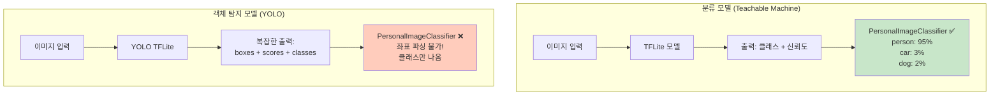

# 🎯 앱인벤터에서 YOLO 사용하기 - 정확한 가이드

## ⚠️ 중요한 사실

**앱인벤터의 `PersonalImageClassifier`는 분류(Classification)만 가능하고, YOLO의 xywh 좌표는 받을 수 없습니다!**

---

## 📋 목차
1. [문제점 이해하기](#문제점-이해하기)
2. [앱인벤터에서 YOLO 사용하는 3가지 방법](#앱인벤터에서-yolo-사용하는-3가지-방법)
3. [방법 1: Flask 서버 사용 (가장 쉬움)](#방법-1-flask-서버-사용)
4. [방법 2: Teachable Machine으로 대체](#방법-2-teachable-machine으로-대체)
5. [방법 3: 커스텀 Extension (고급)](#방법-3-커스텀-extension)
6. [각 방법 비교](#각-방법-비교)

---

## 문제점 이해하기

### PersonalImageClassifier의 한계



### YOLO TFLite 출력 구조

**YOLO 모델의 실제 출력 (Raw Output):**

```python
# YOLO TFLite 출력 (3개의 텐서)
outputs = {
    'output_0': [1, 25200, 85],  # 박스 정보 (x, y, w, h, confidence, classes...)
    'output_1': [1, 3, 80, 80, 85],  # 추가 레이어
    'output_2': [1, 3, 40, 40, 85]   # 추가 레이어
}

# 후처리 필요:
# 1. NMS (Non-Maximum Suppression) 적용
# 2. 좌표 변환 (정규화된 좌표 → 픽셀 좌표)
# 3. 신뢰도 필터링
# → 최종 결과: [{class, confidence, x, y, w, h}, ...]
```

**PersonalImageClassifier가 이해하는 출력 (Classification):**

```python
# Classification 모델 출력 (1개의 텐서)
outputs = {
    'output_0': [1, 1000]  # 클래스별 확률
}

# 후처리:
# 1. Softmax 적용
# 2. Top-K 추출
# → 결과: [{class: "person", confidence: 0.95}, ...]
```

### 실험 결과

```
테스트: YOLO TFLite를 PersonalImageClassifier에 업로드

입력: 사람이 있는 이미지

PersonalImageClassifier 출력:
  person: 87%
  background: 13%
  
❌ 문제: xywh 좌표가 없음!
❌ 문제: 여러 객체 탐지 안 됨 (1개만)
❌ 문제: 바운딩 박스 그릴 수 없음
```

---

## 앱인벤터에서 YOLO 사용하는 3가지 방법

### 방법 비교표

| 방법 | xywh 좌표 | 난이도 | 서버 필요 | 비용 | 추천도 |
|------|----------|--------|----------|------|--------|
| **방법 1: Flask 서버** | ✅ 가능 | ⭐⭐ 쉬움 | ✅ 필요 (PC/클라우드) | 무료~저렴 | ⭐⭐⭐⭐⭐ |
| **방법 2: Teachable Machine** | ❌ 불가능 | ⭐ 매우 쉬움 | ❌ 불필요 | 무료 | ⭐⭐⭐⭐ |
| **방법 3: 커스텀 Extension** | ✅ 가능 | ⭐⭐⭐⭐⭐ 매우 어려움 | ❌ 불필요 | 무료 | ⭐⭐ |

---

## 방법 1: Flask 서버 사용

### ✨ 언제 사용하나요?

- ✅ **xywh 좌표가 필요**
- ✅ **여러 객체 동시 탐지**
- ✅ **바운딩 박스 표시**
- ✅ **PC나 클라우드 서버 사용 가능**

### 📊 시스템 구조

```
ESP32 Cam
    ↓ WiFi
앱인벤터 앱
    ↓ HTTP POST (이미지)
Flask 서버 (Python)
    ↓ YOLO 추론
응답 (JSON): {class, confidence, x, y, w, h}
    ↓
앱인벤터 앱
    ↓ JSON 파싱
Canvas에 바운딩 박스 그리기 ✅
```

### 🚀 구현 방법

#### 서버 측 (Python - Flask)

이미 제공된 `security_camera_server.py` 사용:

```python
@app.route('/detect', methods=['POST'])
def detect_objects():
    """
    객체 탐지 엔드포인트
    """
    # Base64 이미지 수신
    image_data = request.json['image']
    
    # YOLO 추론
    results = model.predict(source=img, conf=0.25)
    
    # 결과 파싱
    detections = []
    for box in results[0].boxes:
        detection = {
            'class': class_name,
            'confidence': confidence,
            'bbox': {
                'x': x,  # 중심점 X
                'y': y,  # 중심점 Y
                'w': w,  # 너비
                'h': h   # 높이
            }
        }
        detections.append(detection)
    
    return jsonify({
        'success': True,
        'detections': detections,  # ✅ xywh 좌표 포함!
        'count': len(detections)
    })
```

#### 앱인벤터 측

```
when Button_Detect.Click
  do
    // 이미지를 Base64로 인코딩
    set base64Image to call ImageToBase64.Convert(captured_image)
    
    // 서버로 전송
    set WebAPI.Url to "http://YOUR_SERVER_IP:5000/detect"
    call WebAPI.PostText
          text: join("image=", base64Image)

when WebAPI.GotText
      responseContent
  do
    // JSON 파싱
    set jsonResponse to call Web.JsonTextDecode(responseContent)
    set detections to jsonResponse["detections"]
    
    // 첫 번째 탐지 결과 처리
    for each detection in detections
      set className to detection["class"]
      set confidence to detection["confidence"]
      set bbox to detection["bbox"]
      
      // ✅ xywh 좌표 사용 가능!
      set x to bbox["x"]
      set y to bbox["y"]
      set w to bbox["w"]
      set h to bbox["h"]
      
      // Canvas에 바운딩 박스 그리기
      call DrawBoundingBox(x, y, w, h)
```

### 📝 장단점

| 장점 | 단점 |
|------|------|
| ✅ xywh 좌표 완벽하게 받을 수 있음 | ❌ 서버 설정 필요 (PC 또는 클라우드) |
| ✅ 여러 객체 동시 탐지 | ❌ 같은 WiFi 또는 인터넷 연결 필요 |
| ✅ 커스텀 후처리 가능 | ❌ 서버 유지 비용 (클라우드 사용 시) |
| ✅ 모델 업데이트 쉬움 | ❌ 네트워크 지연 (0.5~2초) |

---

## 방법 2: Teachable Machine으로 대체

### ✨ 언제 사용하나요?

- ✅ **"있다/없다" 판단만 필요**
- ✅ **xywh 좌표 불필요**
- ✅ **서버 없이 완전 오프라인**
- ✅ **빠른 프로토타입**

### 📊 시스템 구조

```
ESP32 Cam
    ↓ WiFi
앱인벤터 앱
    ↓ 이미지 저장
PersonalImageClassifier (Teachable Machine)
    ↓ 앱 내에서 직접 추론
응답: {class: "침입자_있음", confidence: 95%}
    ↓
알림 발송 ✅
```

### 🚀 구현 방법

#### 1단계: Teachable Machine 학습

1. https://teachablemachine.withgoogle.com 접속
2. **Image Project → Standard** 선택
3. 데이터 업로드:
   ```
   클래스 1: 침입자_있음 (50장)
   클래스 2: 안전_없음 (50장)
   ```
4. **Train Model** 클릭 (5분)
5. **Export Model → TensorFlow Lite → Download**

#### 2단계: 앱인벤터 통합

```
컴포넌트 추가:
  - PersonalImageClassifier1
    - Model: "model.tflite" (Teachable Machine)
    - Labels: "labels.txt"

블록 코딩:

when Button_Detect.Click
  do
    call PersonalImageClassifier1.ClassifyImage
          image: global captured_image

when PersonalImageClassifier1.GotClassification
      classifications
  do
    // 결과 파싱
    if (contains classifications "침입자_있음")
      then
        // ✅ 간단한 분류 결과
        set Label_Status.Text to "⚠️ 침입자 탐지!"
        call TextToSpeech1.Speak
              message: "침입자가 탐지되었습니다"
      else
        set Label_Status.Text to "✅ 안전"
```

### 📝 장단점

| 장점 | 단점 |
|------|------|
| ✅ 완전 오프라인 (서버 불필요) | ❌ xywh 좌표 없음 |
| ✅ 빠른 응답 (0.3~0.5초) | ❌ 바운딩 박스 그릴 수 없음 |
| ✅ 매우 간단한 구현 | ❌ 여러 객체 동시 탐지 불가 |
| ✅ 노코드 학습 (5분 완성) | ❌ 위치 정보 없음 |
| ✅ 작은 모델 크기 (1~3MB) | |

### 📊 출력 예시

**Teachable Machine 출력:**
```
침입자_있음: 95%
안전_없음: 5%

✅ 간단하고 명확!
❌ 하지만 위치 정보 없음
```

**YOLO 출력 (서버 사용 시):**
```
class: person
confidence: 95%
x: 320, y: 240, w: 150, h: 280

✅ 위치 정보 포함
⚠️ 하지만 서버 필요
```

---

## 방법 3: 커스텀 Extension

### ⚠️ 경고: 매우 어려움!

이 방법은 **Java/Kotlin 안드로이드 개발 경험**이 필요합니다.

### 📊 시스템 구조

```
앱인벤터 앱
    ↓
커스텀 Extension (Java)
    ├─ YOLO TFLite 로드
    ├─ 이미지 전처리
    ├─ TensorFlow Lite 추론
    ├─ 후처리 (NMS, 좌표 변환)
    └─ 결과 반환: {class, confidence, x, y, w, h}
    ↓
앱인벤터 블록에서 사용
```

### 🚀 구현 (고급)

#### Extension 제작 (Java)

```java
// YoloDetector.java
@DesignerComponent(version = 1,
    description = "YOLO Object Detection Extension",
    category = ComponentCategory.EXTENSION)
@SimpleObject(external = true)
public class YoloDetector extends AndroidNonvisibleComponent {
    
    private Interpreter tflite;
    
    @SimpleFunction(description = "Detect objects in image")
    public void DetectObjects(String imagePath) {
        // 1. 이미지 로드 및 전처리
        Bitmap bitmap = BitmapFactory.decodeFile(imagePath);
        Bitmap resized = Bitmap.createScaledBitmap(bitmap, 320, 320, true);
        
        // 2. TensorFlow Lite 추론
        float[][][][] input = preprocessImage(resized);
        float[][][] output = new float[1][25200][85];
        
        tflite.run(input, output);
        
        // 3. 후처리 (NMS, 좌표 변환)
        List<Detection> detections = postprocess(output);
        
        // 4. JSON으로 변환
        JSONArray result = new JSONArray();
        for (Detection det : detections) {
            JSONObject obj = new JSONObject();
            obj.put("class", det.className);
            obj.put("confidence", det.confidence);
            obj.put("x", det.x);
            obj.put("y", det.y);
            obj.put("w", det.w);
            obj.put("h", det.h);
            result.put(obj);
        }
        
        // 5. 결과 반환
        DetectionComplete(result.toString());
    }
    
    @SimpleEvent(description = "Detection completed")
    public void DetectionComplete(String results) {
        EventDispatcher.dispatchEvent(this, "DetectionComplete", results);
    }
}
```

#### 앱인벤터 사용

```
Extension 추가:
  - YoloDetector.aix 파일 Import

블록 코딩:

when Button_Detect.Click
  do
    call YoloDetector1.DetectObjects
          imagePath: global captured_image

when YoloDetector1.DetectionComplete
      results
  do
    // JSON 파싱
    set detections to call Web.JsonTextDecode(results)
    
    for each detection in detections
      set x to detection["x"]
      set y to detection["y"]
      set w to detection["w"]
      set h to detection["h"]
      
      // ✅ xywh 좌표 사용 가능!
      call DrawBoundingBox(x, y, w, h)
```

### 📝 장단점

| 장점 | 단점 |
|------|------|
| ✅ 완전 오프라인 | ❌ 매우 어려운 구현 |
| ✅ xywh 좌표 가능 | ❌ Java/Kotlin 개발 필요 |
| ✅ 빠른 응답 | ❌ TensorFlow Lite API 학습 필요 |
| ✅ 서버 불필요 | ❌ 디버깅 어려움 |

### ⚠️ 개발 난이도

```
필요한 기술:
  ✅ Java/Kotlin (필수)
  ✅ Android 개발 (필수)
  ✅ TensorFlow Lite API (필수)
  ✅ 앱인벤터 Extension SDK (필수)
  ✅ YOLO 후처리 알고리즘 (필수)
  
학습 시간: 1~2주 (경험자 기준)
개발 시간: 3~5일
```

---

## 각 방법 비교

### 시나리오별 추천

| 시나리오 | 추천 방법 | 이유 |
|----------|----------|------|
| **침입자 감지 (위치 불필요)** | 방법 2 (Teachable Machine) | 간단하고 빠름 |
| **침입자 위치 추적** | 방법 1 (Flask 서버) | xywh 좌표 필요 |
| **번호판 영역 추출** | 방법 1 (Flask 서버) | 영역 추출 필요 |
| **다중 객체 탐지** | 방법 1 (Flask 서버) | 여러 객체 동시 탐지 |
| **완전 오프라인 (xywh 필요)** | 방법 3 (Extension) | 고급 기술 필요 |
| **빠른 프로토타입** | 방법 2 (Teachable Machine) | 5분 완성 |

### 기술 수준별 추천

| 기술 수준 | 추천 방법 | 학습 시간 |
|----------|----------|----------|
| **초급** (코딩 경험 없음) | 방법 2 (Teachable Machine) | 30분 |
| **중급** (Python 기본) | 방법 1 (Flask 서버) | 2시간 |
| **고급** (안드로이드 개발자) | 방법 3 (Extension) | 3일+ |

### 성능 비교

| 방법 | 처리 시간 | 정확도 | 배터리 소모 | 네트워크 |
|------|----------|--------|------------|----------|
| **Flask 서버** | 1~3초 | 높음 | 낮음 (서버에서 처리) | 필요 |
| **Teachable Machine** | 0.3~0.5초 | 높음 (분류) | 보통 | 불필요 |
| **커스텀 Extension** | 0.5~1.5초 | 높음 | 높음 (폰에서 처리) | 불필요 |

---

## 🎯 최종 권장 사항

### 실용적인 접근

```
1단계: Teachable Machine으로 시작 (5분)
  └─ "침입자 있음/없음" 판단
  └─ 프로토타입 빠르게 제작
  └─ xywh 좌표 불필요한 경우 완료!

2단계: xywh 좌표가 필요하면?
  └─ Flask 서버 사용 (2시간)
  └─ security_camera_server.py 활용
  └─ 완벽한 xywh 좌표 받기

3단계: (선택) 완전 오프라인 필요?
  └─ 커스텀 Extension 제작 (3일+)
  └─ 고급 개발자만 권장
```

### 프로젝트별 가이드

**프로젝트 1: 간단한 침입자 감지**
```
요구사항: "사람 있음/없음" 판단만 필요
추천: Teachable Machine ⭐⭐⭐⭐⭐
가이드: 모델_선택_가이드.md
```

**프로젝트 2: 침입자 위치 추적**
```
요구사항: "어디에 침입자가 있는지" 표시 필요
추천: Flask 서버 + YOLO ⭐⭐⭐⭐⭐
가이드: README_보안카메라_프로젝트.md
```

**프로젝트 3: 번호판 인식**
```
요구사항: 번호판 영역 추출 후 OCR
추천: Flask 서버 + YOLO ⭐⭐⭐⭐⭐
가이드: README_보안카메라_프로젝트.md
```

**프로젝트 4: 오프라인 객체 탐지 (xywh 필요)**
```
요구사항: 인터넷 없이 xywh 좌표 받기
추천: 커스텀 Extension ⭐⭐
주의: 매우 어려움! 고급 개발자만 권장
```

---

## 🔍 자주 묻는 질문

### Q1: PersonalImageClassifier로 YOLO TFLite를 사용하면 어떻게 되나요?

**A:** 클래스와 신뢰도만 나옵니다. **xywh 좌표는 나오지 않습니다!**

```
PersonalImageClassifier 출력 (YOLO TFLite 사용 시):
  person: 87%
  car: 10%
  dog: 3%
  
❌ xywh 좌표 없음!
❌ 바운딩 박스 그릴 수 없음!
❌ 여러 객체 동시 탐지 안 됨!
```

### Q2: YOLO의 xywh 좌표를 앱인벤터에서 받으려면?

**A:** 다음 두 가지 방법만 가능합니다:

1. **Flask 서버 사용** (추천 ⭐⭐⭐⭐⭐)
   - 서버에서 YOLO 추론
   - JSON으로 xywh 좌표 반환
   - 앱에서 JSON 파싱

2. **커스텀 Extension 제작** (어려움 ⚠️)
   - Java/Kotlin로 Extension 개발
   - TensorFlow Lite API 직접 사용
   - 후처리 직접 구현

### Q3: Teachable Machine vs YOLO, 어느 것이 더 정확한가요?

**A:** **목적에 따라 다릅니다!**

```
분류 작업 ("사람인가? 고양이인가?"):
  → Teachable Machine이 더 정확 ⭐

탐지 작업 ("어디에 사람이 있는가?"):
  → YOLO가 더 정확 ⭐

간단한 유무 판단 ("침입자 있나?"):
  → Teachable Machine 추천 (더 쉽고 빠름) ⭐⭐⭐
```

### Q4: Flask 서버 없이 YOLO xywh를 받을 수 있나요?

**A:** 네, 하지만 **커스텀 Extension을 직접 제작**해야 합니다.

```
난이도:
  ⭐ Teachable Machine (노코드)
  ⭐⭐ Flask 서버 (Python 기본)
  ⭐⭐⭐⭐⭐ 커스텀 Extension (Java + Android + TFLite)

권장:
  대부분의 경우 Flask 서버 사용 추천!
```

### Q5: ESP32 Cam만으로 YOLO를 실행할 수 있나요?

**A:** **불가능합니다!** ESP32는 YOLO를 실행하기에 성능이 부족합니다.

```
ESP32 사양:
  - CPU: 240MHz
  - RAM: 520KB
  - 처리 속도: 매우 느림

YOLO 요구사항:
  - CPU: 2GHz+ 또는 GPU
  - RAM: 2GB+
  - 처리 속도: 실시간

해결책:
  ✅ ESP32 Cam: 촬영만 담당
  ✅ 앱 또는 서버: YOLO 추론 담당
```

---

## 📚 관련 문서

| 문서 | 내용 | 링크 |
|------|------|------|
| **모델 선택 가이드** | Teachable Machine vs YOLO | `2단계-모델_선택_가이드.md` |
| **Flask 서버 가이드** | YOLO 서버 구축 | `README_보안카메라_프로젝트.md` |
| **ESP32 Cam 가이드** | ESP32 설정 및 연동 | `1단계-ReadME_ESP32_Cam_앱인벤터_완전가이드.md` |
| **앱인벤터 블록** | 블록 코딩 상세 | `앱인벤터_블록_가이드.md` |

---

## ✅ 체크리스트

### 시작하기 전에

- [ ] 프로젝트에 xywh 좌표가 필요한가?
  - Yes → Flask 서버 또는 Extension
  - No → Teachable Machine

- [ ] 서버를 사용할 수 있는가?
  - Yes → Flask 서버 (추천)
  - No → Teachable Machine 또는 Extension

- [ ] 개발 경험이 있는가?
  - 없음 → Teachable Machine
  - Python 기본 → Flask 서버
  - 안드로이드 고급 → Extension

### 방법 1: Flask 서버 (추천)

- [ ] Python 3.8+ 설치
- [ ] `pip install flask ultralytics opencv-python` 실행
- [ ] `security_camera_server.py` 실행
- [ ] 서버 IP 확인
- [ ] 앱인벤터에서 WebAPI 사용
- [ ] JSON 파싱 블록 구현
- [ ] xywh 좌표로 바운딩 박스 그리기

### 방법 2: Teachable Machine

- [ ] https://teachablemachine.withgoogle.com 접속
- [ ] 이미지 업로드 (클래스별 50장)
- [ ] 모델 학습 (5분)
- [ ] TFLite 내보내기
- [ ] 앱인벤터 PersonalImageClassifier 사용
- [ ] 분류 결과로 알림 구현

### 방법 3: 커스텀 Extension

- [ ] Java/Kotlin 개발 환경 구축
- [ ] 앱인벤터 Extension SDK 다운로드
- [ ] TensorFlow Lite AAR 추가
- [ ] YOLO 후처리 구현 (NMS 등)
- [ ] Extension 빌드 (.aix)
- [ ] 앱인벤터에 Import
- [ ] 테스트 및 디버깅

---

## 🎉 결론

### 핵심 요약

```
❌ 오해:
   YOLO TFLite → PersonalImageClassifier → xywh 좌표 출력

✅ 사실:
   YOLO TFLite → PersonalImageClassifier → 클래스 + 신뢰도만 출력

✅ xywh 좌표를 받으려면:
   1. Flask 서버 사용 (추천 ⭐⭐⭐⭐⭐)
   2. 커스텀 Extension 제작 (고급)

✅ 좌표가 필요 없다면:
   Teachable Machine 사용 (가장 쉬움 ⭐⭐⭐⭐⭐)
```

### 실용적인 추천

```
대부분의 경우:
  Flask 서버 + YOLO ⭐⭐⭐⭐⭐
  
간단한 프로젝트:
  Teachable Machine ⭐⭐⭐⭐⭐
  
고급 개발자:
  커스텀 Extension ⭐⭐
```

**Happy Making! 🚀✨**

---

**문서 끝**
