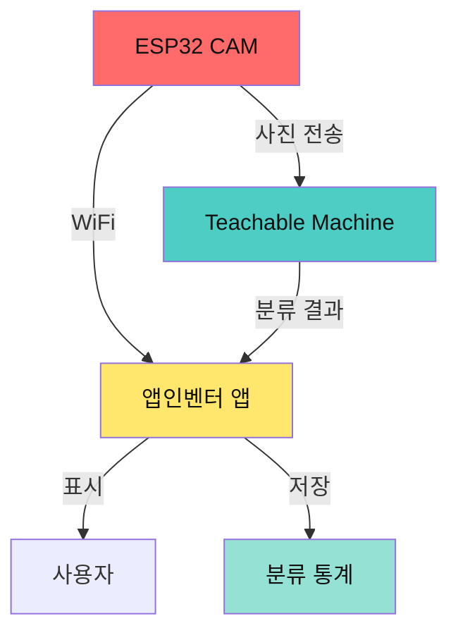
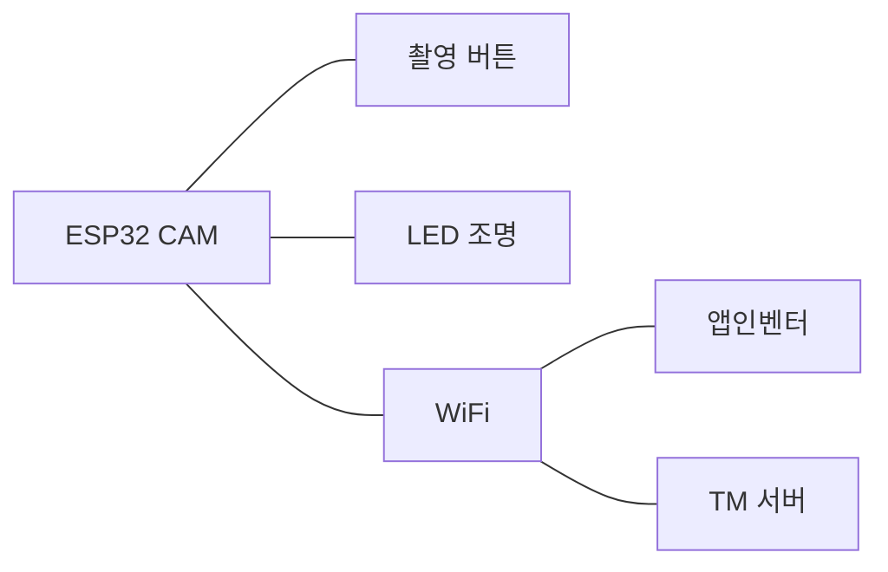
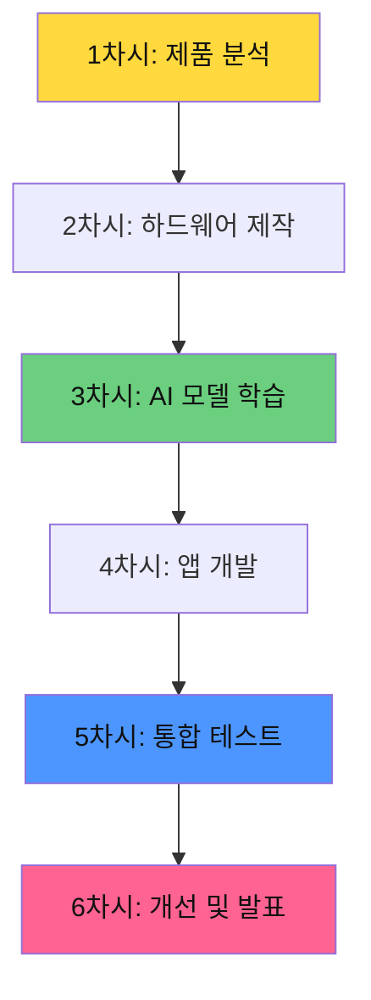
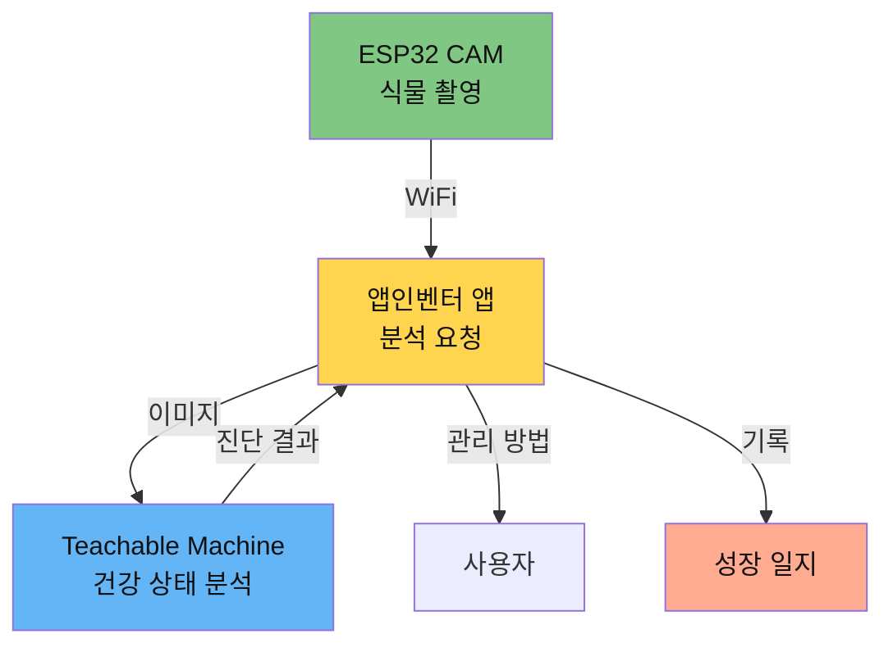
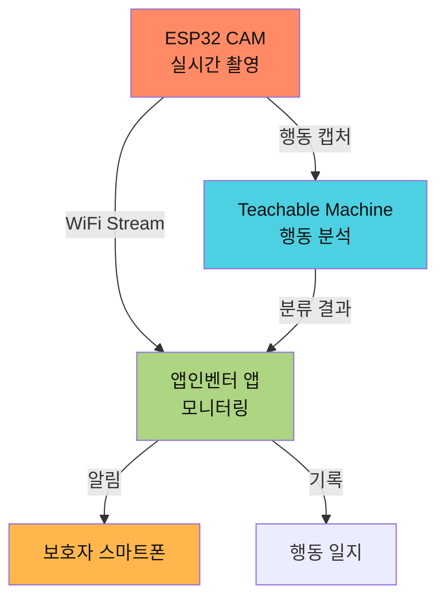
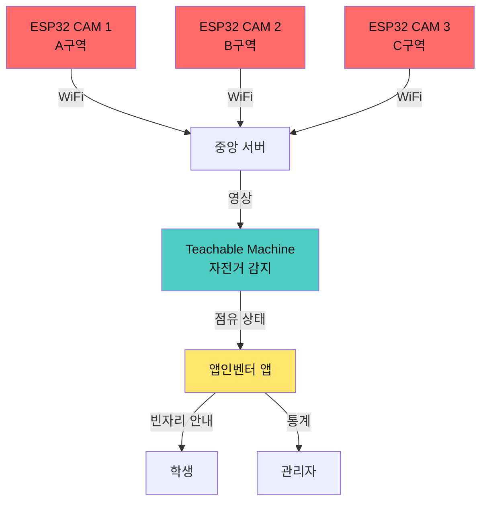
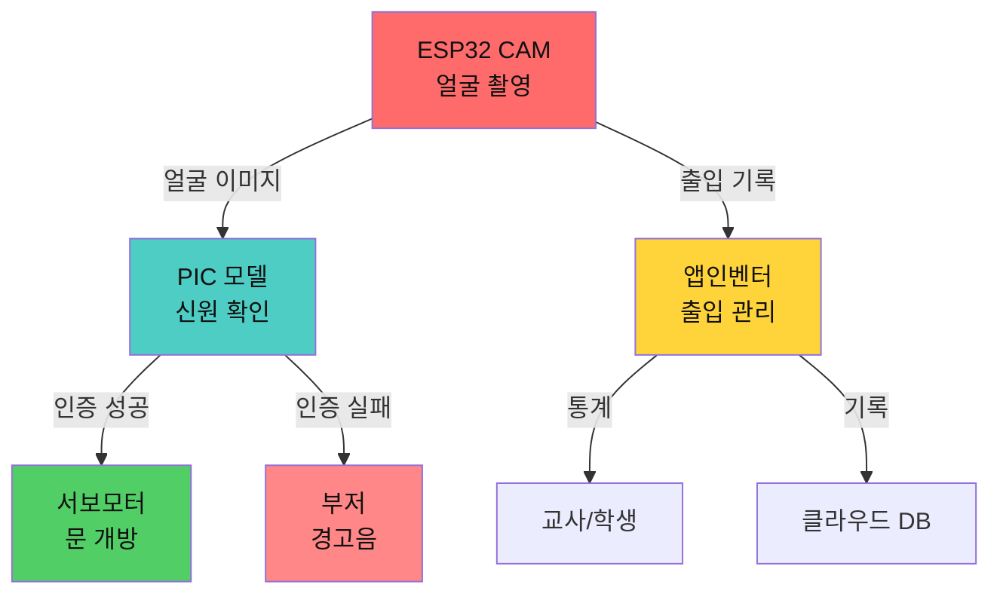
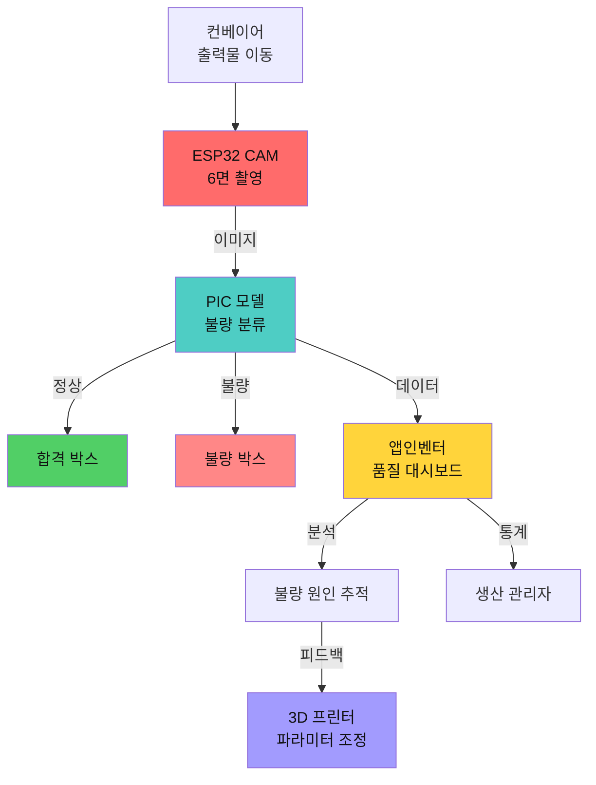
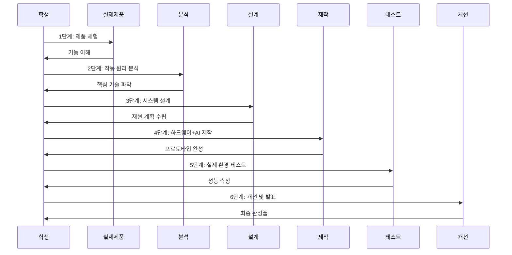
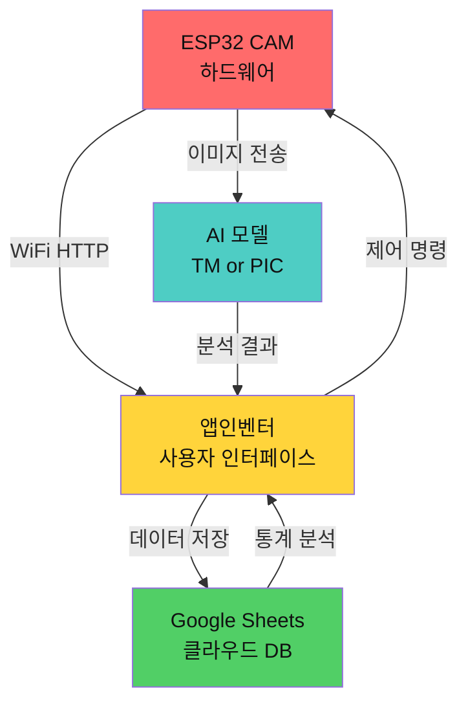

# 영종AI융합교육센터 과학 중점 AI융합교육 6차시 프로그램
## ESP32 CAM + AI + 앱인벤터 그림자 프로젝트

## 📌 그림자 프로젝트 기반 교육의 의미

**그림자 프로젝트 교육**은 실제 시장에 존재하는 완성된 제품을 분석하고, 그 원리를 이해한 후 직접 재현하며 학습하는 **역공학(Reverse Engineering)** 방식입니다.

### 핵심 원칙
- 📦 **실제 제품 분석**: 완성품을 직접 보고 만져보며 작동 원리 파악
- 🔍 **역공학 프로세스**: 겉모습 → 내부 구조 → 알고리즘 → 재현
- 🛠️ **ESP32 CAM 중심**: 카메라 기반 IoT 제품 제작
- 🤖 **AI 융합**: Teachable Machine 또는 Personal Image Classifier
- 📱 **앱인벤터**: 사용자 인터페이스 및 제어 앱 개발
- ⏱️ **6차시 완성**: 짧은 시간에 작동하는 프로토타입 완성

---

## 🎯 학년별 그림자 프로젝트 (6차시 기준)

### 그림자 프로젝트 비교표

| 학년 | 프로젝트명 | 그림자 제품 | ESP32 CAM | AI 모델 | 앱인벤터 | 난이도 |
|------|----------|-----------|-----------|---------|----------|--------|
| **초등** | 스마트 쓰레기 분류함 | Amazon Smart Trash | ✅ 촬영 | TM 분류 | 분류 결과 표시 | ⭐⭐ |
| **초등** | AI 식물 건강 체커 | Plantix App | ✅ 촬영 | TM 질병 | 건강 상태 알림 | ⭐⭐ |
| **초등** | 스마트 애완동물 모니터 | Petcube Camera | ✅ 실시간 | TM 행동 | 알림 + 영상 | ⭐⭐⭐ |
| **초등** | 교실 출입 카운터 | People Counter | ✅ 감지 | TM 사람 | 인원 통계 | ⭐⭐ |
| **초등** | AI 독서 도우미 | 독서 타이머 앱 | ✅ 촬영 | TM 자세 | 집중도 기록 | ⭐⭐ |
| **중등** | 스마트 주차 관리 시스템 | 주차장 카메라 | ✅ 감지 | TM 차량 | 주차 현황 앱 | ⭐⭐⭐ |
| **중등** | AI 출입 통제 시스템 | 얼굴인식 도어락 | ✅ 인식 | PIC 얼굴 | 출입 기록 | ⭐⭐⭐⭐ |
| **중등** | 스마트 냉장고 관리 | Samsung Family Hub | ✅ 내부 촬영 | TM 식품 | 유통기한 알림 | ⭐⭐⭐ |
| **중등** | AI 손씻기 도우미 | 손씻기 타이머 | ✅ 동작 인식 | PIC 손동작 | 단계 가이드 | ⭐⭐⭐ |
| **중등** | 교실 집중도 모니터 | 수업 분석 시스템 | ✅ 표정 인식 | PIC 감정 | 집중도 통계 | ⭐⭐⭐⭐ |
| **고등** | AI 보안 감시 시스템 | Nest Cam | ✅ 실시간 | PIC 침입 | 알림 + 녹화 | ⭐⭐⭐⭐ |
| **고등** | 스마트 제조 품질 검사 | 공장 검사 카메라 | ✅ 불량 감지 | PIC 결함 | 품질 대시보드 | ⭐⭐⭐⭐⭐ |
| **고등** | AI 교통 모니터링 | 교통 CCTV | ✅ 차량 감지 | PIC 위반 | 실시간 통계 | ⭐⭐⭐⭐⭐ |
| **고등** | 스마트 농장 모니터 | 스마트팜 카메라 | ✅ 작물 촬영 | PIC 생육 | 환경 제어 | ⭐⭐⭐⭐ |
| **고등** | AI 환자 모니터링 | 원격 진료 카메라 | ✅ 상태 촬영 | PIC 이상 | 알림 시스템 | ⭐⭐⭐⭐⭐ |

---

## 📚 초등학생 6차시 프로그램

### 🗑️ 프로젝트 1: 스마트 쓰레기 분류함

#### 📦 그림자 프로젝트
**분석 대상**: Amazon Smart Trash Can (스마트 쓰레기통)
- **제품 설명**: 쓰레기를 자동으로 인식하여 분류하는 스마트 쓰레기통
- **핵심 기능**: 카메라로 쓰레기 촬영 → AI 분류 → 올바른 분리수거함 안내
- **가격**: 약 30만원
- **분석 포인트**: "어떻게 쓰레기를 구분할까?" "카메라는 어디에?" "앱은 어떻게 생겼을까?"

#### 🎯 우리가 만들 제품
**"AI 분리수거 도우미"**
- ESP32 CAM으로 쓰레기 촬영
- Teachable Machine으로 4가지 분류 (플라스틱/종이/캔/일반)
- 앱인벤터 앱으로 분류 결과 표시 및 통계 확인

#### 🔧 시스템 구조도



#### 📱 하드웨어 구성

**ESP32 CAM 모듈**
```
구성 부품:
- ESP32 CAM 보드 1개
- FTDI 프로그래머 1개
- LED 조명 1개
- 버튼 스위치 1개
- 전원 어댑터 5V 2A

핀 배치:
- GPIO 4: 내장 LED (플래시)
- GPIO 33: 촬영 버튼
- GPIO 1/3: UART (프로그래밍)
- 5V/GND: 전원
```

**회로 연결도**


#### 🤖 AI 모델 설계

**Teachable Machine 프로젝트**
```
클래스 설정:
1. Class_플라스틱 (페트병, 비닐 등)
2. Class_종이 (박스, 신문지 등)
3. Class_캔 (알루미늄, 철 캔 등)
4. Class_일반 (음식물, 기타)

학습 데이터:
- 각 클래스당 50장 이상
- 다양한 각도 촬영
- 조명 변화 반영
- 배경 다양화

목표 정확도: 85% 이상
```

#### 📱 앱인벤터 화면 설계

**Screen1: 메인 화면**
```
[상단 타이틀: AI 분리수거 도우미]

[ESP32 CAM 연결 상태: ●]

[촬영된 이미지 표시 영역]
┌─────────────────┐
│                 │
│   (이미지 표시)   │
│                 │
└─────────────────┘

[분류 결과]
┌─────────────────┐
│ 🔵 플라스틱      │
│ 신뢰도: 92%     │
└─────────────────┘

[촬영 버튼] [통계 보기]
```

**Screen2: 통계 화면**
```
[오늘의 분류 현황]

플라스틱: ████████ 15개
종이:     ██████   10개
캔:       ███      5개
일반:     ██████   9개

[주간 통계 그래프]
```

#### 📚 6차시 역공학 프로세스



#### 차시별 상세 교육지시서

**1차시: 그림자 프로젝트 분석**
```
🎯 학습 목표:
- Amazon Smart Trash 작동 원리 이해
- 카메라, AI, 앱의 역할 파악
- 우리 프로젝트 설계서 작성

📝 활동 내역:
1. 제품 영상 시청 (10분)
   - YouTube: "Amazon Smart Trash Review"
   
2. 분해 분석 (15분)
   - 외관 관찰: 카메라 위치, 버튼, 전원
   - 추측하기: "어떻게 작동할까?"
   - 그림 그리기: 내부 구조 상상도

3. 블록 다이어그램 작성 (15분)
   [카메라] → [AI] → [앱] → [결과]
   
4. 모둠별 설계서 작성 (20분)
   - 필요한 부품 목록
   - 작동 순서 정리
   - 역할 분담

📦 준비물:
- 노트북 (영상 시청)
- 워크시트
- 색연필

✅ 결과물:
- 제품 분석 보고서
- 우리 프로젝트 설계서
```

**2차시: ESP32 CAM 하드웨어 제작**
```
🎯 학습 목표:
- ESP32 CAM 모듈 이해
- 회로 연결 및 테스트
- 첫 촬영 성공

📝 활동 내역:
1. ESP32 CAM 소개 (10분)
   - 부품 명칭 익히기
   - 핀 배치 이해
   - WiFi 기능 설명

2. 회로 연결 (20분)
   ```
   연결 순서:
   1) FTDI → ESP32 CAM
      TX → RX
      RX → TX
      5V → 5V
      GND → GND
      
   2) 버튼 → GPIO 33
   
   3) LED → GPIO 4
   ```

3. 펌웨어 업로드 (15분)
   - Arduino IDE 설정
   - CameraWebServer 예제 업로드
   - 시리얼 모니터로 IP 확인

4. 첫 촬영 테스트 (15분)
   - 브라우저에서 IP 접속
   - 사진 촬영 성공!
   - 해상도 조정

📦 준비물:
- ESP32 CAM 키트 (모둠당 1세트)
- 노트북 (Arduino IDE 설치)
- USB 케이블

✅ 결과물:
- 작동하는 ESP32 CAM
- 테스트 사진 5장
```

**3차시: Teachable Machine AI 모델 학습**
```
🎯 학습 목표:
- 쓰레기 분류 데이터 수집
- Teachable Machine으로 AI 모델 학습
- 모델 정확도 85% 달성

📝 활동 내역:
1. 데이터 수집 (25분)
   ```
   수집 계획:
   - 플라스틱: 페트병, 비닐봉지, 플라스틱 용기 (50장)
   - 종이: 박스, 신문, 노트 (50장)
   - 캔: 음료수 캔, 참치캔 (50장)
   - 일반: 음식물, 비닐 혼합 (50장)
   
   촬영 팁:
   - ESP32 CAM으로 직접 촬영
   - 다양한 각도 (정면, 측면, 위)
   - 조명 변화 (밝음, 어두움)
   - 배경 다양화
   ```

2. Teachable Machine 학습 (20분)
   - 사이트 접속: teachablemachine.withgoogle.com
   - 이미지 프로젝트 시작
   - 4개 클래스 생성
   - 사진 업로드 (각 50장)
   - 학습 시작 (Train Model)

3. 모델 테스트 (15분)
   - 새로운 쓰레기로 테스트
   - 정확도 확인
   - 잘못 분류된 것 추가 학습

📦 준비물:
- 쓰레기 샘플 (4종류)
- ESP32 CAM (촬영용)
- 노트북 (TM 접속)

✅ 결과물:
- 학습된 AI 모델 (모델 파일 다운로드)
- 테스트 결과 보고서
```

**4차시: 앱인벤터 앱 개발**
```
🎯 학습 목표:
- 앱인벤터로 사용자 앱 제작
- ESP32 CAM과 WiFi 통신
- TM 모델 연동

📝 활동 내역:
1. 앱인벤터 기초 (10분)
   - 사이트 접속: appinventor.mit.edu
   - 프로젝트 생성: "AI_분리수거"
   - 화면 구성 이해

2. UI 디자인 (20분)
   ```
   컴포넌트 배치:
   - Label: 타이틀
   - Image: 촬영 이미지 표시
   - Button: "촬영하기"
   - Label: 분류 결과 표시
   - Chart: 통계 그래프
   - WebViewer: TM 모델 로드
   ```

3. 블록 코딩 (25분)
   ```
   주요 블록:
   
   [촬영 버튼 클릭]
   → ESP32 CAM에 HTTP 요청
   → 이미지 다운로드
   → Image 컴포넌트에 표시
   → TM 모델로 분류
   → 결과 표시
   → 통계에 추가
   ```

4. WiFi 연결 테스트 (5분)
   - ESP32 CAM IP 입력
   - 연결 확인
   - 촬영 테스트

📦 준비물:
- 노트북 (앱인벤터)
- 스마트폰 (AI2 Companion 앱)
- ESP32 CAM (작동 중)

✅ 결과물:
- 작동하는 안드로이드 앱 (.apk)
- 앱 화면 스크린샷
```

**5차시: 시스템 통합 및 테스트**
```
🎯 학습 목표:
- ESP32 CAM + AI + 앱 통합
- 실제 환경 테스트
- 문제 발견 및 해결

📝 활동 내역:
1. 전체 시스템 조립 (15분)
   ```
   설치 위치: 교실 쓰레기통 옆
   
   연결 순서:
   1) ESP32 CAM 전원 연결
   2) WiFi 연결 확인
   3) 앱에서 IP 설정
   4) 조명 각도 조정
   ```

2. 실전 테스트 (25분)
   ```
   테스트 시나리오:
   
   시나리오 1: 플라스틱 페트병
   → 촬영 → 결과: 플라스틱 (95%)
   
   시나리오 2: 종이 박스
   → 촬영 → 결과: 종이 (88%)
   
   시나리오 3: 음료수 캔
   → 촬영 → 결과: 캔 (92%)
   
   시나리오 4: 혼합 쓰레기
   → 촬영 → 결과: ??
   
   총 20개 테스트 → 정확도 계산
   ```

3. 문제 해결 (15분)
   - 잘못 분류된 것 분석
   - 추가 학습 데이터 수집
   - 조명/각도 조정
   - 재테스트

4. 사용 설명서 작성 (5분)

📦 준비물:
- 완성된 시스템
- 테스트용 쓰레기 20개
- 기록지

✅ 결과물:
- 테스트 결과표 (정확도 측정)
- 문제점 및 해결 방법 리스트
- 사용 설명서
```

**6차시: 개선 및 최종 발표**
```
🎯 학습 목표:
- 프로젝트 개선
- 발표 자료 제작
- 성찰 및 피드백

📝 활동 내역:
1. 최종 개선 (15분)
   - 정확도 향상을 위한 추가 학습
   - UI 디자인 개선
   - 기능 추가 (통계, 알림 등)

2. 발표 자료 제작 (20분)
   ```
   발표 구성:
   1) 그림자 프로젝트 소개 (2분)
      - Amazon Smart Trash 분석
      
   2) 우리 프로젝트 설계 (3분)
      - 시스템 구조
      - 하드웨어, AI, 앱
      
   3) 제작 과정 (3분)
      - 어려웠던 점
      - 해결 방법
      
   4) 실물 시연 (3분)
      - 실제 작동 영상
      
   5) 결과 및 느낀 점 (2분)
      - 정확도: 87%
      - 환경 보호 실천
      
   6) Q&A (2분)
   ```

3. 모둠별 발표 (20분)
   - 각 모둠 5분
   - 실물 시연 포함

4. 성찰 및 피드백 (5분)
   - 잘한 점 / 아쉬운 점
   - 다음에 만들고 싶은 것

📦 준비물:
- 발표 자료 (PPT)
- 완성된 프로젝트
- 시연 영상

✅ 결과물:
- 발표 PPT
- 프로젝트 최종 보고서
- 성찰 일지
```

#### 💡 확장 아이디어
- 더 많은 쓰레기 종류 추가 (유리, 비닐 등)
- 음성 안내 기능 (TTS)
- 학급별 분리수거 경쟁
- 통계 그래프 실시간 업데이트

---

### 🌱 프로젝트 2: AI 식물 건강 체커

#### 📦 그림자 프로젝트
**분석 대상**: Plantix App (식물 질병 진단 앱)
- **제품 설명**: 스마트폰으로 식물 잎을 촬영하면 질병을 진단해주는 앱
- **핵심 기능**: 사진 촬영 → AI 분석 → 질병 진단 및 처방
- **다운로드**: 500만+
- **분석 포인트**: "어떻게 잎의 상태를 알 수 있을까?" "어떤 데이터로 학습했을까?"

#### 🎯 우리가 만들 제품
**"스마트 화분 지킴이"**
- ESP32 CAM으로 식물 잎 촬영
- Teachable Machine으로 상태 분류 (건강/시들음/병충해/영양부족)
- 앱인벤터 앱으로 관리 방법 안내

#### 🔧 시스템 구조도



#### 📱 하드웨어 구성

**ESP32 CAM 화분 거치대**
```
구성:
- ESP32 CAM 모듈
- 접사 렌즈 (잎 확대 촬영)
- 타이머 (자동 촬영 기능)
- 방수 케이스
- 화분 거치대

촬영 설정:
- 매일 오전 9시 자동 촬영
- 잎 부분 집중 촬영
- 매크로 모드 활용
```

#### 🤖 AI 모델 설계

**Teachable Machine 식물 건강 분류**
```
클래스 설정:
1. 건강 (초록색, 광택 있음)
2. 시들음 (잎이 축 처짐)
3. 병충해 (갈색 반점, 구멍)
4. 영양부족 (노란 잎, 작은 크기)

학습 데이터:
- 화분 5개 준비 (서로 다른 상태)
- 각 상태당 60장 촬영
- 다양한 식물 종류 포함
- 시간대별 촬영 (조명 변화)

처방 데이터베이스:
- 건강: "잘 크고 있어요! 계속 관리해주세요."
- 시들음: "물이 부족해요. 물을 주세요."
- 병충해: "잎에 병이 있어요. 병든 잎을 제거하세요."
- 영양부족: "영양제를 주세요."
```

#### 📱 앱인벤터 화면 설계

**Screen1: 진단 화면**
```
[🌱 식물 건강 체커]

[촬영된 잎 이미지]
┌─────────────────┐
│                 │
│   (식물 사진)    │
│                 │
└─────────────────┘

[진단 결과]
┌─────────────────┐
│ 상태: 건강 😊    │
│ 신뢰도: 94%     │
│                 │
│ 💡 조언:        │
│ 잘 크고 있어요!  │
│ 계속 관리해주세요│
└─────────────────┘

[📷 촬영하기] [📊 성장 기록]
```

**Screen2: 성장 일지**
```
[성장 일지]

2026-02-09 ✅ 건강
2026-02-08 ✅ 건강
2026-02-07 💧 시들음 → 물 줌
2026-02-06 ✅ 건강

[월간 건강도 그래프]
건강도
100% ▲
 80% │    ●─●─●
 60% │  ●       ●
 40% │●
   └────────────▶
   2/1  2/5  2/9
```

#### 📚 6차시 역공학 프로세스

**1차시: Plantix 앱 분석**
- Plantix 앱 설치 및 체험
- 식물 사진 촬영 실습
- 진단 과정 관찰
- 우리 프로젝트 기획

**2차시: ESP32 CAM 설치 및 테스트**
- 화분 거치대 제작
- 접사 렌즈 장착
- 식물 잎 촬영 테스트
- 최적 각도/거리 찾기

**3차시: 식물 건강 데이터 수집**
- 5가지 화분 준비 (다른 상태)
- 건강/시들음/병충해/영양부족 촬영
- 각 60장씩 수집
- Teachable Machine 학습

**4차시: 앱인벤터 진단 앱 개발**
- 촬영 + 분석 화면
- 처방 데이터베이스 연동
- 성장 일지 기능
- WiFi 통신 구현

**5차시: 1주일 모니터링**
- 실제 화분에 설치
- 매일 자동 촬영 및 진단
- 관리 방법 실천
- 변화 기록

**6차시: 식물 건강 발표회**
- 1주일 성장 변화 발표
- Before/After 비교
- 시연 및 체험
- 집으로 가져가기

#### 💡 확장 아이디어
- 토양 습도 센서 추가
- 물 주기 알림 기능
- 식물 성장 타임랩스 영상
- 식물 종류 자동 인식

---

### 🐾 프로젝트 3: 스마트 애완동물 모니터

#### 📦 그림자 프로젝트
**분석 대상**: Petcube Camera (반려동물 카메라)
- **제품 설명**: 집을 비울 때 반려동물을 실시간으로 확인하는 카메라
- **핵심 기능**: 실시간 영상 + 동작 감지 + 양방향 음성 + 간식 제공
- **가격**: 약 25만원
- **분석 포인트**: "어떻게 움직임을 감지할까?" "앱에서 어떻게 제어할까?"

#### 🎯 우리가 만들 제품
**"AI 강아지 모니터"**
- ESP32 CAM으로 실시간 영상
- Teachable Machine으로 행동 분류 (자는 중/노는 중/먹는 중/이상행동)
- 앱인벤터 앱으로 실시간 확인 및 알림

#### 🔧 시스템 구조도



#### 📱 하드웨어 구성

**ESP32 CAM 펫 카메라**
```
구성:
- ESP32 CAM 모듈
- 광각 렌즈 (넓은 시야)
- PIR 동작 센서 (움직임 감지)
- 스피커 (음성 출력)
- LED (야간 촬영)

설치 위치:
- 애완동물 활동 공간
- 벽면 고정 (높이 1m)
- 전원 연결

기능:
- 움직임 감지 시 자동 촬영
- 실시간 스트리밍
- 양방향 음성 (선택)
```

#### 🤖 AI 모델 설계

**Teachable Machine 행동 분류**
```
클래스 설정:
1. 자는 중 (웅크리고 움직임 없음)
2. 노는 중 (활발한 움직임)
3. 먹는 중 (밥그릇 앞)
4. 이상 행동 (짖거나 불안한 모습)

학습 데이터:
- 강아지 행동 영상 촬영
- 각 행동당 50장 수집
- 다양한 시간대 (낮/밤)
- 여러 각도에서 촬영

알림 조건:
- 이상 행동 감지 시 즉시 알림
- 2시간 이상 움직임 없을 때
- 먹이/물 그릇 비었을 때
```

#### 📱 앱인벤터 화면 설계

**Screen1: 실시간 모니터**
```
[🐕 강아지 모니터]

[ESP32 CAM 연결: 🟢 온라인]

[실시간 영상]
┌─────────────────┐
│                 │
│  (영상 스트림)   │
│                 │
└─────────────────┘

[현재 행동]
┌─────────────────┐
│ 노는 중 🎾      │
│ 시작: 14:25     │
│ 지속: 15분      │
└─────────────────┘

[📸 캡처] [🔔 알림설정] [📊 일지]
```

**Screen2: 행동 일지**
```
[오늘의 활동]

14:25 🎾 노는 중 (15분)
13:50 😴 자는 중 (35분)
12:30 🍖 먹는 중 (10분)
11:00 🎾 노는 중 (45분)
09:30 😴 자는 중 (1시간 30분)

[활동 통계]
노는 중: ████████ 40%
자는 중: ██████████ 50%
먹는 중: ██ 10%
```

#### 📚 6차시 역공학 프로세스

**간단 버전 (각 차시 핵심만)**

| 차시 | 주제 | 핵심 활동 | 결과물 |
|------|------|----------|--------|
| 1차시 | Petcube 분석 | 제품 영상 시청, 기능 분석 | 설계서 |
| 2차시 | 하드웨어 제작 | ESP32 CAM + PIR 센서 연결 | 작동 카메라 |
| 3차시 | 행동 데이터 수집 | 강아지 행동 촬영 및 학습 | AI 모델 |
| 4차시 | 앱 개발 | 실시간 스트리밍 앱 제작 | 모니터 앱 |
| 5차시 | 통합 테스트 | 실제 환경에서 1일 모니터링 | 행동 일지 |
| 6차시 | 발표 | 행동 패턴 분석 발표 | 최종 보고서 |

#### 💡 확장 아이디어
- 간식 제공 장치 연동
- 음성 명령 기능
- 다중 카메라 (여러 방)
- 클라우드 녹화 기능

---

## 📚 중학생 6차시 프로그램

### 🚗 프로젝트 1: 스마트 주차 관리 시스템

#### 📦 그림자 프로젝트
**분석 대상**: 대형마트 스마트 주차장 시스템
- **제품 설명**: 카메라로 주차 공간을 실시간 감지하여 빈자리를 안내
- **핵심 기능**: 차량 감지 → 빈자리 표시 → 안내 앱 → 통계 분석
- **설치 장소**: 백화점, 공항, 대형마트
- **분석 포인트**: "어떻게 차가 있는지 없는지 알까?" "실시간 업데이트는?"

#### 🎯 우리가 만들 제품
**"학교 자전거 주차 관리 시스템"**
- ESP32 CAM 3대로 주차 구역 감시
- Teachable Machine으로 자전거 유무 감지
- 앱인벤터로 실시간 빈자리 확인 앱
- 학생증 QR로 주차 기록 관리

#### 🔧 시스템 구조도



#### 📱 하드웨어 구성

**ESP32 CAM 주차 감지 시스템**
```
설치 구성:
- ESP32 CAM 3대 (구역당 1대)
- 주차면: 총 15칸 (구역당 5칸)
- 설치 높이: 2.5m (전체 조망)
- 전원: PoE 또는 AC 어댑터
- LED 표시등 (빈자리: 초록, 차있음: 빨강)

카메라 설정:
- 해상도: 800x600 (충분)
- 프레임: 1fps (절전)
- 감지 간격: 10초마다
- 야간 조명: IR LED
```

#### 🤖 AI 모델 설계

**Teachable Machine 주차 감지**
```
클래스 설정:
1. 빈자리 (주차선만 보임)
2. 자전거 주차됨 (자전거 있음)
3. 불법 주차 (오토바이, 킥보드 등)
4. 장애물 (박스, 쓰레기 등)

학습 데이터:
- 각 주차칸을 15개 구역으로 분할
- 구역당 4가지 상태 촬영 (60장)
- 다양한 시간대 (아침/점심/저녁)
- 날씨 변화 (맑음/흐림/비)
- 총 900장 학습

감지 로직:
- 10초마다 촬영
- 상태 변화 시에만 업데이트
- 5초간 같은 상태면 확정
```

#### 📱 앱인벤터 화면 설계

**Screen1: 실시간 주차 현황**
```
[🚲 자전거 주차장]

[전체 현황]
┌─────────────────┐
│ 전체: 15칸       │
│ 사용: 8칸 🔴     │
│ 빈자리: 7칸 🟢   │
└─────────────────┘

[구역별 현황]

A구역 (1-5번)
🟢🟢🔴🔴🟢

B구역 (6-10번)
🔴🟢🔴🟢🟢

C구역 (11-15번)
🔴🔴🔴🟢🟢

[📍 내 주차 위치 찾기]
[📊 통계 보기]
```

**Screen2: 주차 기록**
```
[내 주차 기록]

오늘 (2026-02-09)
위치: B구역 7번
입차: 08:30
출차: 15:20
요금: 무료

[주간 이용 통계]
월: 8회
화: 7회
수: 9회
목: 8회
금: 6회

[자주 사용하는 위치]
1위: B구역 7번 (12회)
2위: A구역 3번 (8회)
```

#### 📚 6차시 역공학 프로세스

**1차시: 스마트 주차장 시스템 분석**
```
🎯 목표: 실제 주차장 시스템 작동 원리 이해

활동:
1. 영상 분석 (20분)
   - 대형마트 주차장 CCTV 영상
   - 센서 종류 파악 (카메라/초음파)
   - 데이터 흐름 추적

2. 현장 조사 (20분)
   - 학교 자전거 주차장 방문
   - 문제점 발견
     · 빈자리를 찾기 어려움
     · 불법 주차 (킥보드 등)
     · 분실 사고
   
3. 시스템 설계 (20분)
   - 블록 다이어그램
   - 필요 장비 목록
   - 예상 비용 계산

결과물:
- 제품 분석 보고서
- 시스템 설계도
```

**2차시: ESP32 CAM 다중 카메라 구성**
```
🎯 목표: 3대 카메라로 전체 주차장 감시

활동:
1. 카메라 3대 프로그래밍 (25분)
   - 각 카메라에 고유 ID 부여
   - WiFi 연결 설정
   - IP 주소 고정
   
   ```cpp
   // ESP32 CAM 설정
   const char* ssid = "School_WiFi";
   const char* password = "****";
   const char* camera_id = "CAM_A"; // A, B, C
   
   void setup() {
     WiFi.begin(ssid, password);
     // 카메라 초기화
     camera_config_t config;
     config.frame_size = FRAMESIZE_SVGA;
     esp_camera_init(&config);
   }
   ```

2. 설치 및 위치 조정 (20분)
   - 높이 2.5m 설치
   - 각도 조정 (전체 구역 포함)
   - 조명 테스트

3. 통신 테스트 (15분)
   - 3대 동시 접속
   - 영상 품질 확인
   - 네트워크 안정성

결과물:
- 작동하는 3대 ESP32 CAM
- 설치 사진 및 영상
```

**3차시: Teachable Machine 주차 감지 모델**
```
🎯 목표: 자전거 유무 자동 감지 AI 모델

활동:
1. 데이터 수집 (30분)
   ```
   촬영 계획:
   - 빈자리: 200장
     · 다양한 시간대
     · 그림자 변화
     · 조명 변화
   
   - 자전거 주차: 200장
     · 다양한 자전거
     · 각도 변화
     · 색상 다양성
   
   - 불법 주차: 100장
     · 오토바이
     · 킥보드
     · 자동차 침범
   
   - 장애물: 50장
     · 박스, 쓰레기
   ```

2. Teachable Machine 학습 (20분)
   - 4개 클래스 생성
   - 이미지 업로드
   - 학습 시작
   - 정확도 90% 목표

3. 모델 검증 (10분)
   - 실시간 테스트
   - 오류 사례 수정
   - 추가 학습

결과물:
- 학습된 AI 모델
- 테스트 결과 (정확도 92%)
```

**4차시: 앱인벤터 통합 시스템 개발**
```
🎯 목표: 실시간 주차 현황 앱 완성

활동:
1. UI 디자인 (15분)
   - 3개 구역 버튼
   - 각 주차칸 상태 표시
   - 통계 그래프

2. 블록 코딩 (30분)
   ```
   로직:
   1. 10초마다 3대 카메라에서 이미지 받기
   2. 각 이미지를 TM 모델로 분석
   3. 결과를 앱 화면에 업데이트
   4. 빈자리 개수 계산
   5. 데이터베이스에 기록
   
   [Clock.Timer = 10초]
   → [WebViewer.Get from ESP32 CAM A]
   → [TM_Model.Analyze]
   → [Update 주차칸 1-5 상태]
   
   (B, C도 동일)
   ```

3. 데이터베이스 연동 (15분)
   - Google Sheets 연동
   - 주차 기록 저장
   - 통계 생성

결과물:
- 작동하는 안드로이드 앱
- 실시간 주차 현황 확인 가능
```

**5차시: 시범 운영 및 데이터 수집**
```
🎯 목표: 1주일 실제 운영 및 문제 해결

활동:
1. 시스템 설치 (15분)
   - 학교 자전거 주차장에 설치
   - 전원 연결
   - WiFi 연결 확인

2. 사용자 테스트 (30분)
   - 학생 20명 초대
   - 앱 다운로드 및 사용
   - 피드백 수집
   
   피드백 예시:
   - "빈자리 찾기 쉬워졌어요"
   - "내 자전거 위치 기억 안해도 돼요"
   - "업데이트가 느려요" → 감지 간격 조정

3. 1주일 모니터링
   - 일일 이용자 수 기록
   - 주차 패턴 분석
   - 불법 주차 감소 측정

결과물:
- 1주일 운영 데이터
- 사용자 만족도 설문 결과
- 개선 사항 리스트
```

**6차시: 데이터 분석 및 정책 제안**
```
🎯 목표: 운영 결과 분석 및 학교 제안

활동:
1. 데이터 분석 (25분)
   ```
   분석 항목:
   
   1) 시간대별 이용률
      - 피크타임: 08:00-08:30 (95%)
      - 한산한 시간: 10:00-12:00 (30%)
   
   2) 구역별 선호도
      - A구역: 55% (교문 가까움)
      - B구역: 30%
      - C구역: 15% (멀음)
   
   3) 불법 주차 감소
      - 시행 전: 주 15건
      - 시행 후: 주 3건 (80% 감소)
   
   4) 분실 사고
      - 시행 전: 월 5건
      - 시행 후: 월 0건
   ```

2. 개선 방안 (20분)
   - C구역 활성화 전략
   - 추가 주차면 확보 필요
   - 야간 보안 강화

3. 발표 (15분)
   - 시스템 소개
   - 운영 결과 공유
   - 실물 시연
   - 학교 제안

결과물:
- 데이터 분석 보고서
- 발표 PPT
- 학교 제안서
```

#### 💡 확장 아이디어
- 번호판 인식 (자동차용)
- 예약 시스템
- 주차 요금 자동 정산
- 도난 방지 알림

---

### 🏠 프로젝트 2: AI 출입 통제 시스템

#### 📦 그림자 프로젝트
**분석 대상**: 삼성 SHP-DP738 (얼굴인식 도어락)
- **핵심 기능**: 얼굴 인식 → 신원 확인 → 자동 개폐 → 출입 기록
- **가격**: 약 60만원
- **분석 포인트**: "어떻게 얼굴을 인식할까?" "보안은 어떻게?"

#### 🎯 우리가 만들 제품
**"교실 스마트 출입 시스템"**
- ESP32 CAM으로 얼굴 촬영
- Personal Image Classifier로 학생 인식
- 앱인벤터로 출입 기록 및 통계
- 서보모터로 문 개폐 시뮬레이션

#### 🔧 시스템 구조도



#### 📱 하드웨어 구성

**ESP32 CAM 출입 통제 장치**
```
부품 구성:
- ESP32 CAM 모듈
- 서보모터 (문 개폐 시뮬레이션)
- 부저 (알림음)
- LED (상태 표시: 대기/인증/거부)
- 버튼 (수동 개방)

회로도:
ESP32 CAM
├─ GPIO 12 → 서보모터
├─ GPIO 13 → 부저
├─ GPIO 14 → LED (초록/빨강)
└─ GPIO 15 → 버튼

작동 흐름:
1. 얼굴 감지 (PIR 센서)
2. 사진 촬영
3. PIC 모델로 인증
4. 성공 → 서보모터 90도 회전 (3초)
5. 실패 → 부저 경고 + 빨간 LED
```

#### 🤖 AI 모델 설계

**Personal Image Classifier 얼굴 인식**
```
학습 방식:
- MIT App Inventor의 Personal Image Classifier 사용
- 클래스: 등록된 학생/교사 (각 개인별 클래스)
- 학습 데이터: 1인당 50장
  · 정면 30장
  · 측면 10장 (좌우)
  · 다양한 표정 10장
  · 안경 착용/미착용
  · 조명 변화

보안 강화:
- 신뢰도 85% 이상만 인증
- 연속 3회 실패 시 관리자 알림
- 출입 시간 제한 (등교 시간대만)
- 사진 속임수 방지 (깊이 감지)

등록 인원: 30명 (한 학급)
```

#### 📱 앱인벤터 화면 설계

**Screen1: 관리자 - 출입 모니터**
```
[🔐 교실 출입 관리]

[실시간 상태]
┌─────────────────┐
│ 🟢 정상 운영 중  │
│ 오늘 출입: 28명  │
└─────────────────┘

[최근 출입 기록]
08:25 ✅ 김철수 입실
08:24 ✅ 이영희 입실
08:23 ❌ 미등록 인원 (사진)
08:22 ✅ 박민수 입실

[📊 통계] [👥 인원 관리] [⚙️ 설정]
```

**Screen2: 학생 - 내 출입 기록**
```
[내 출입 기록]

오늘 (2026-02-09)
입실: 08:25
퇴실: 15:35
재실 시간: 7시간 10분

[이번 주 출석]
월: ✅ 08:25
화: ✅ 08:20
수: ✅ 08:30
목: ✅ 08:22
금: ✅ 08:27

[출석률: 100%]
```

#### 📚 6차시 프로세스 (간단 버전)

| 차시 | 핵심 활동 | 결과물 |
|------|----------|--------|
| 1차시 | 얼굴인식 도어락 분석, 보안 시스템 이해 | 시스템 설계서 |
| 2차시 | ESP32 CAM + 서보모터 회로 제작 | 작동 하드웨어 |
| 3차시 | PIC 얼굴 데이터 수집 (30명 x 50장) | 얼굴 인식 모델 |
| 4차시 | 앱인벤터 출입 관리 앱 개발 | 출입 통제 앱 |
| 5차시 | 교실 입구 설치 및 1주일 운영 | 출입 기록 데이터 |
| 6차시 | 보안 분석 및 개선 방안 발표 | 최종 보고서 |

#### 💡 확장 아이디어
- 체온 측정 (MLX90614 센서)
- 마스크 착용 감지
- QR코드 백업 인증
- 비상 상황 자동 개방

---

## 📚 고등학생 6차시 프로그램

### 🏭 프로젝트 1: 스마트 제조 품질 검사 시스템

#### 📦 그림자 프로젝트
**분석 대상**: 산업용 비전 검사 시스템 (Cognex In-Sight)
- **제품 설명**: 공장 생산라인에서 제품 불량을 자동 검사하는 AI 비전 시스템
- **핵심 기능**: 고속 촬영 → 불량 감지 → 자동 분류 → 통계 분석
- **가격**: 약 500만원~1000만원
- **적용 분야**: 반도체, 자동차, 식품, 의약품 제조
- **분석 포인트**: "어떻게 0.1mm 불량을 찾을까?" "초당 몇 개 검사?" "정확도는?"

#### 🎯 우리가 만들 제품
**"3D 프린터 출력물 품질 검사 시스템"**
- ESP32 CAM으로 3D 프린팅 결과물 촬영
- Personal Image Classifier로 불량 분류
  - 정상/레이어 분리/노즐 막힘/휨 현상/표면 거칠기
- 앱인벤터로 품질 관리 대시보드
- 불량률 추적 및 원인 분석

#### 🔧 시스템 구조도



#### 📱 하드웨어 구성

**ESP32 CAM 다각도 촬영 시스템**
```
구성:
- ESP32 CAM 3대 (상단/측면1/측면2)
- 회전 테이블 (360도 회전)
- 링 라이트 (균일한 조명)
- 스테핑 모터 (회전 제어)
- 서보 푸셔 (분류 장치)

촬영 프로세스:
1. 출력물을 회전 테이블에 배치
2. 360도 회전하며 6개 각도 촬영
   - 0도, 60도, 120도, 180도, 240도, 300도
3. 상단 카메라로 윗면 촬영
4. 총 7장 이미지로 종합 판정
5. 결과에 따라 푸셔 작동

핀 배치:
ESP32 CAM
├─ GPIO 12 → 스테핑 모터 (회전)
├─ GPIO 13 → 서보모터 (푸셔)
├─ GPIO 14 → 링 라이트 제어
└─ GPIO 15 → 포토센서 (출력물 감지)
```

#### 🤖 AI 모델 설계

**Personal Image Classifier 불량 검사**
```
클래스 설정:
1. 정상 (표면 매끄럽고 형상 정확)
2. 레이어 분리 (층간 분리 보임)
3. 노즐 막힘 (출력 끊김, 구멍)
4. 휨 현상 (베드 접착 불량)
5. 표면 거칠기 (과도한 텍스처)

학습 데이터 수집 전략:
```python
# 3D 프린터 설정 변경으로 의도적 불량 생성

불량 유형별 파라미터:
1. 정상 (200개)
   - 온도: 210°C
   - 속도: 50mm/s
   - 레이어 높이: 0.2mm
   
2. 레이어 분리 (150개)
   - 온도: 190°C (낮춤)
   - 냉각: 100% (과냉각)
   
3. 노즐 막힘 (150개)
   - 필라멘트: 습기 노출
   - 노즐 직경: 축소
   
4. 휨 현상 (150개)
   - 베드 온도: 40°C (낮춤)
   - 베드 접착제 없이
   
5. 표면 거칠기 (150개)
   - 속도: 80mm/s (빠름)
   - 레이어 높이: 0.3mm (큼)

총 800개 샘플 x 7장 = 5,600장 학습
```

**불량 원인 분석 알고리즘**
```python
# 불량 패턴과 원인 매칭

원인_데이터베이스 = {
    "레이어_분리": [
        {"원인": "노즐 온도 낮음", "해결": "온도 +10도"},
        {"원인": "과냉각", "해결": "팬 속도 50%로"},
        {"원인": "출력 속도 빠름", "해결": "속도 -20%"}
    ],
    "노즐_막힘": [
        {"원인": "필라멘트 습기", "해결": "건조 필요"},
        {"원인": "노즐 막힘", "해결": "노즐 청소"},
        {"원인": "온도 불안정", "해결": "PID 튜닝"}
    ],
    # ... 나머지 불량 유형
}

# 머신러닝으로 원인 추론
def 원인_추론(불량_유형, 최근_설정값):
    # 과거 불량 데이터와 비교
    # 가장 유사한 케이스 찾기
    # 해결 방법 추천
    return 추천_해결책
```

#### 📱 앱인벤터 화면 설계

**Screen1: 실시간 검사 모니터**
```
[🏭 품질 검사 시스템]

[실시간 검사]
┌─────────────────┐
│ 현재 검사 중...  │
│ [출력물 이미지]  │
│                 │
│ 회전: 180도     │
└─────────────────┘

[판정 결과]
┌─────────────────┐
│ ❌ 불량 발견!    │
│                 │
│ 유형: 레이어 분리│
│ 신뢰도: 94%     │
│                 │
│ 💡 원인 추정:    │
│ 노즐 온도 부족  │
│                 │
│ 📋 해결 방법:    │
│ 온도 210°C로 상승│
└─────────────────┘

[다음 검사] [자세히]
```

**Screen2: 품질 대시보드**
```
[금일 생산 현황] (2026-02-09)

총 검사: 250개
합격: 220개 (88%)
불량: 30개 (12%)

[불량 유형별 통계]
┌─────────────────┐
│ 레이어 분리  40% │ ████████
│ 노즐 막힘    30% │ ██████
│ 휨 현상      20% │ ████
│ 표면 거칠기  10% │ ██
└─────────────────┘

[시간대별 불량률]
12%│     ●
10%│   ●   ●
 8%│ ●       ●
 6%│           ●
   └─────────────▶
   9  11  13  15  17

[원인 분석 보고서] [설정 최적화]
```

**Screen3: 불량 원인 분석**
```
[레이어 분리 - 상세 분석]

발생 횟수: 12건 (오늘)
발생 시간대: 13:00~15:00

[공통 설정값]
- 노즐 온도: 200°C
- 베드 온도: 60°C
- 속도: 60mm/s
- 필라멘트: PLA (습도 65%)

[AI 진단 결과]
┌─────────────────┐
│ 주 원인 (85%):   │
│ 필라멘트 습기 흡수│
│                 │
│ 부차 원인:       │
│ - 온도 10도 부족 │
│ - 환기로 과냉각  │
└─────────────────┘

[권장 조치]
1. 필라멘트 50°C 4시간 건조
2. 노즐 온도 210°C로 상승
3. 팬 속도 50%로 감소

[조치 적용] [기록]
```

#### 📚 6차시 역공학 프로세스

**1차시: 산업용 비전 검사 시스템 분석**
```
🎯 목표: 제조업 품질 검사 시스템 이해

활동:
1. 영상 분석 (25분)
   - Cognex 비전 시스템 소개 영상
   - 삼성 반도체 공장 검사 영상
   - 자동차 부품 검사 사례
   
   핵심 요소:
   - 고속 카메라 (초당 100개 검사)
   - 조명 (링 라이트, 백라이트)
   - 불량 기준 (0.1mm 정밀도)
   - 딥러닝 활용

2. 시스템 설계 (30분)
   - 우리 프로젝트 정의
   - 검사 대상: 3D 프린터 출력물
   - 불량 유형 분류
   - 하드웨어 구성도
   - 소프트웨어 플로우차트

3. 역할 분담 (5분)
   - 하드웨어팀 (2명)
   - AI 모델팀 (2명)
   - 앱 개발팀 (1명)

결과물:
- 시스템 설계 문서
- 하드웨어 BOM (부품 목록)
- 예산 계획서 (약 15만원)
```

**2차시: 하드웨어 제작 - 자동 검사 라인**
```
🎯 목표: 회전 테이블 + 다각도 촬영 시스템 제작

활동:
1. 3D 모델링 및 출력 (25분)
   - Tinkercad로 설계
   - 회전 테이블 (직경 15cm)
   - 카메라 거치대 3개
   - 푸셔 가이드
   - 3D 프린터로 출력 (사전 준비)

2. 전자 회로 구성 (20분)
   ```
   연결도:
   
   ESP32 CAM (Master)
   ├─ GPIO 12 → 스테핑 모터 드라이버
   │             └─ 스테핑 모터 (회전 테이블)
   ├─ GPIO 13 → 서보모터 (푸셔)
   ├─ GPIO 14 → MOSFET → 링 라이트 (12V LED)
   └─ GPIO 15 ← 포토센서 (출력물 감지)
   
   ESP32 CAM (Slave 1, 2) - 측면 카메라
   └─ WiFi 연동
   ```

3. 동작 테스트 (15분)
   - 회전 테이블 360도 회전
   - 각도별 정지 (60도 간격)
   - 3대 카메라 동시 촬영
   - 푸셔 작동

결과물:
- 작동하는 검사 라인 프로토타입
- 테스트 영상
```

**3차시: 불량 샘플 제작 및 데이터 수집**
```
🎯 목표: 5가지 불량 유형 800개 샘플 제작

활동:
1. 3D 프린터 설정 (10분)
   ```
   테스트 모델: 20mm 정육면체
   소요 시간: 1개당 15분
   
   불량 생성 계획:
   - 5가지 설정 프로필 저장
   - 프로필별 동시 출력 (프린터 5대)
   - 2시간 내 100개 생산
   ```

2. 사전 제작 샘플 활용 (5분)
   - 교사가 미리 준비한 700개
   - 학생은 100개 추가 생성
   - 총 800개 확보

3. 촬영 및 라벨링 (30분)
   - 회전 테이블에 하나씩 배치
   - 자동 촬영 (7장/개)
   - 800개 x 7장 = 5,600장
   - 라벨링 자동화 (파일명에 불량 유형 표시)

4. Personal Image Classifier 학습 (15분)
   - MIT App Inventor 접속
   - PIC 프로젝트 생성
   - 5개 클래스 이미지 업로드
   - 학습 시작 (10분 소요)
   - 테스트 (정확도 91%)

결과물:
- 800개 샘플
- 5,600장 이미지
- 학습된 PIC 모델
```

**4차시: 앱인벤터 통합 시스템 개발**
```
🎯 목표: 검사 → 판정 → 분석 → 피드백 앱 완성

활동:
1. UI 디자인 (10분)
   - 3개 Screen 구성
   - 컴포넌트 배치

2. 블록 코딩 - 자동 검사 프로세스 (35분)
   ```
   [포토센서 감지]
   → [회전 테이블 시작]
   
   For angle in [0, 60, 120, 180, 240, 300]:
       → [회전 to angle]
       → [3대 카메라 촬영]
       → [이미지 저장]
   
   → [상단 카메라 촬영]
   
   → [7장 이미지를 PIC에 전송]
   
   → [PIC 판정 받기]
   
   If "정상":
       → [푸셔 오른쪽 작동]
       → [합격_카운트 +1]
   Else:
       → [푸셔 왼쪽 작동]
       → [불량_카운트 +1]
       → [불량 유형 기록]
       → [원인 분석 함수 호출]
   
   → [Google Sheets에 데이터 저장]
   → [대시보드 업데이트]
   ```

3. 원인 분석 로직 구현 (15분)
   - 불량 유형별 원인 데이터베이스
   - 최근 설정값과 비교
   - 해결 방법 추천

결과물:
- 완전 자동화된 검사 앱
- 원인 분석 기능
```

**5차시: 연속 생산 테스트 및 최적화**
```
🎯 목표: 4시간 연속 운영, 250개 검사

활동:
1. 시스템 설치 및 검증 (15분)
   - 3D 프린터 옆에 검사 라인 배치
   - 출력물 자동 이송 (수동→자동)
   - 전체 프로세스 연결

2. 연속 검사 시작 (3시간)
   ```
   목표: 250개 검사
   검사 속도: 1개당 45초
   예상 시간: 3시간 7분
   
   모니터링 항목:
   - 검사 속도
   - 정확도 (샘플 확인)
   - 오작동 횟수
   - 불량률 변화
   ```

3. 데이터 분석 (20분)
   ```
   수집 데이터:
   - 250개 검사 결과
   - 불량 30개 (12%)
   - 불량 유형별 분포
   - 시간대별 불량률
   
   분석:
   - 오후 1-3시 불량 집중
   - 원인: 실내 온도 상승 (에어컨 고장)
   - 필라멘트 과열로 레이어 분리
   
   대책:
   - 온도 모니터링 추가
   - 프린터 위치 이동
   ```

4. AI 모델 재학습 (15분)
   - 오판정 케이스 40개 발견
   - 추가 라벨링
   - 모델 재학습
   - 정확도 91% → 96%

결과물:
- 250개 검사 데이터
- 불량 원인 분석 보고서
- 개선된 AI 모델
```

**6차시: 제조 최적화 및 연구 논문 발표**
```
🎯 목표: 생산 효율 향상 전략 및 결과 발표

활동:
1. 최적 설정값 도출 (20분)
   ```python
   # 250개 데이터 분석으로 최적값 찾기
   
   정상품 공통 설정:
   - 노즐 온도: 208-212°C (평균 210°C)
   - 베드 온도: 58-62°C (평균 60°C)
   - 속도: 45-55mm/s (평균 50mm/s)
   - 레이어 높이: 0.18-0.22mm (평균 0.2mm)
   - 냉각 팬: 40-60% (평균 50%)
   - 실내 온도: 22-25°C
   - 필라멘트 습도: 40% 이하
   
   권장 설정:
   Temperature: 210°C
   Bed: 60°C
   Speed: 50mm/s
   Layer: 0.2mm
   Fan: 50%
   
   예상 효과:
   - 불량률 12% → 3% (75% 감소)
   - 생산 속도 10% 향상
   ```

2. 발표 자료 제작 (25분)
   ```
   제목: ESP32 CAM 기반 3D 프린팅 품질 자동 검사 시스템
   
   목차:
   1. 서론
      - 3D 프린팅 품질 문제
      - 수동 검사의 한계
      
   2. 시스템 설계
      - 하드웨어 구조
      - AI 모델 (PIC)
      - 앱인벤터 통합
      
   3. 실험 방법
      - 5가지 불량 유형 정의
      - 800개 샘플 제작
      - 250개 연속 검사
      
   4. 결과
      - AI 정확도: 96%
      - 검사 속도: 45초/개
      - 불량률 분석: 12%
      - 원인 추적 성공
      
   5. 최적화
      - 설정값 도출
      - 불량률 예상 3%로 감소
      
   6. 결론
      - 저비용 (15만원) 고효율
      - 실제 제조업 적용 가능성
      - 향후 연구: 다른 제품 확장
   ```

3. 발표 및 실물 시연 (15분)
- PPT 발표 (10분)
   - 실시간 검사 시연 (3분)
- Q&A (2분)

결과물:
- 연구 논문 형식 보고서
- 발표 PPT
- 시연 영상
- 최적 설정값 가이드
```

#### 💡 확장 아이디어 및 실제 적용
```
1. 상용화 방향:
   - PCB 설계 (Arduino → 전용 보드)
   - 검사 속도 향상 (10초/개)
   - 클라우드 연동 (AWS IoT)
   - 다중 라인 관리

2. 다른 제품 적용:
   - 식품: 과자 불량 검사
   - 의약품: 알약 결함 검사
   - 전자제품: PCB 납땜 검사
   - 농업: 과일 등급 분류

3. 비즈니스 모델:
   - 소규모 제조업체 대상
   - 월 구독 서비스 (장비 대여)
   - 설치비: 50만원
   - 월 사용료: 5만원
   
   목표 고객: 
   - 1인 제조업체
   - 메이커 스페이스
   - 교육 기관

4. 대학 진학 포트폴리오:
   - 논문 작성 → 학술대회 발표
   - 특허 출원 (AI 기반 3D 프린팅 검사)
   - 창업 동아리 활동
```

#### 💰 제작 비용 및 ROI
```
제작 비용:
- ESP32 CAM 3개: 3만원
- 스테핑 모터: 2만원
- 서보모터: 1만원
- 링 라이트: 2만원
- 3D 프린팅 부품: 3만원
- 기타 부품: 4만원
합계: 15만원

상용 제품 비교:
- Cognex 비전 시스템: 500만원
- 우리 시스템: 15만원
- 비용 절감: 97%

투자 회수 (ROI):
- 불량률 감소: 12% → 3%
- 월 생산량: 3,000개
- 개당 원가: 2,000원
- 절감액: 3,000 x 9% x 2,000 = 54만원/월
- 회수 기간: 15만 / 54만 = 0.3개월
```

---

### 🚦 프로젝트 2: AI 교통 모니터링 시스템

#### 📦 그림자 프로젝트
**분석 대상**: 스마트 교통 CCTV 시스템
- **핵심 기능**: 차량 감지 → 위반 탐지 → 자동 단속 → 교통 흐름 분석
- **분석 포인트**: "어떻게 신호 위반을 감지?" "번호판 인식?"

#### 🎯 우리가 만들 제품
**"학교 앞 어린이 보호구역 모니터링"**
- ESP32 CAM으로 차량 속도 측정
- PIC로 위반 차량 감지 (신호 위반/불법 주정차)
- 앱인벤터로 실시간 단속 및 통계

#### 📚 6차시 프로세스 (간단 버전)

| 차시 | 핵심 활동 | 결과물 |
|------|----------|--------|
| 1차시 | 교통 CCTV 분석, 스쿨존 문제 조사 | 시스템 설계 |
| 2차시 | 듀얼 카메라 속도 측정 시스템 제작 | 속도 측정 장치 |
| 3차시 | PIC 위반 차량 학습 (속도/주정차) | 위반 탐지 모델 |
| 4차시 | 앱인벤터 단속 관리 앱 개발 | 모니터링 앱 |
| 5차시 | 학교 앞 1주일 설치 및 데이터 수집 | 교통 통계 |
| 6차시 | 교통 안전 개선 방안 제안 | 정책 제안서 |

#### 💡 핵심 기술
- 속도 측정: 2대 카메라 + 시간 차이 계산
- 번호판 인식: OCR (Tesseract)
- 위반 판정: PIC 모델
- 실시간 알림: Firebase Cloud Messaging

---

## 🎯 그림자 프로젝트 역공학 방법론

### 역공학 6단계 프로세스



### 6차시 구성 원칙

| 차시 | 역공학 단계 | 시간 | 핵심 활동 | 결과물 |
|------|-----------|------|----------|--------|
| **1차시** | 제품 분석 | 60분 | 그림자 제품 체험, 작동 원리 분석, 설계서 작성 | 분석 보고서, 시스템 설계도 |
| **2차시** | 하드웨어 | 60분 | ESP32 CAM 회로 제작, 센서 연결, 통신 테스트 | 작동하는 하드웨어 |
| **3차시** | AI 모델 | 60분 | 데이터 수집, TM/PIC 학습, 모델 검증 | 학습된 AI 모델 |
| **4차시** | 앱 개발 | 60분 | 앱인벤터 UI/블록 코딩, 통합 테스트 | 제어 앱 |
| **5차시** | 실전 테스트 | 60분 | 실제 환경 설치, 데이터 수집, 문제 해결 | 운영 데이터 |
| **6차시** | 개선/발표 | 60분 | 성능 개선, 결과 분석, 발표 자료, 시연 | 최종 보고서 |

### ESP32 CAM + AI + 앱인벤터 통합 구조



---

## 📊 필요 장비 및 예산

### 프로젝트별 필수 장비

**기본 키트 (모든 프로젝트 공통)**

| 품목 | 수량 (모둠당) | 단가 | 비고 |
|------|-------------|------|------|
| ESP32 CAM 모듈 | 1~3개 | 10,000원/개 | 프로젝트에 따라 |
| FTDI 프로그래머 | 1개 | 5,000원 | USB 업로드용 |
| 전원 어댑터 5V 2A | 1개 | 3,000원 | 또는 USB 전원 |
| 브레드보드 + 점퍼선 | 1세트 | 5,000원 | 회로 연결 |
| LED, 저항, 버튼 등 | 1세트 | 3,000원 | 기본 부품 |

**모둠당 기본 비용: 약 26,000원~36,000원**

### 학년별 프로젝트 장비 세부 내역

**초등학생 (6개 모둠, 30명 기준)**

| 프로젝트 | 추가 장비 | 모둠당 비용 | 총 비용 |
|---------|---------|-----------|--------|
| 스마트 쓰레기 분류함 | 기본 키트 | 26,000원 | 156,000원 |
| AI 식물 건강 체커 | 기본 키트 + 접사렌즈 (3,000원) | 29,000원 | 174,000원 |
| 스마트 애완동물 모니터 | 기본 키트 + PIR센서 (2,000원) | 28,000원 | 168,000원 |

**중학생 (6개 모둠, 30명 기준)**

| 프로젝트 | 추가 장비 | 모둠당 비용 | 총 비용 |
|---------|---------|-----------|--------|
| 스마트 주차 관리 | ESP32 CAM x3 + LED | 36,000원 | 216,000원 |
| AI 출입 통제 | 기본 키트 + 서보모터 (5,000원) | 31,000원 | 186,000원 |
| 스마트 냉장고 관리 | 기본 키트 + 온습도센서 (3,000원) | 29,000원 | 174,000원 |

**고등학생 (6개 모둠, 30명 기준)**

| 프로젝트 | 추가 장비 | 모둠당 비용 | 총 비용 |
|---------|---------|-----------|--------|
| 제조 품질 검사 | ESP32 CAM x3 + 스테핑모터 (8,000원) | 44,000원 | 264,000원 |
| 교통 모니터링 | ESP32 CAM x2 + 거리센서 (5,000원) | 31,000원 | 186,000원 |

### 공통 장비 (학교 보유 또는 공유)

| 품목 | 수량 | 가격 | 활용 |
|------|-----|------|------|
| 노트북/컴퓨터 | 30대 | 0원 | 학교 컴퓨터실 활용 |
| 스마트폰/태블릿 | 30대 | 0원 | 학생 개인 소지 (앱인벤터) |
| WiFi 공유기 | 1대 | 50,000원 | ESP32 연결용 |
| 3D 프린터 (고등) | 1대 | 0원 | 학교 메이커스페이스 |

### 예산 요약

| 학년 | 프로젝트 선택 | 6개 모둠 예산 | 학생 1인당 |
|------|------------|------------|-----------|
| **초등** | 쓰레기 분류함 | 156,000원 | 5,200원 |
| **초등** | 식물 건강 체커 | 174,000원 | 5,800원 |
| **중등** | 주차 관리 | 216,000원 | 7,200원 |
| **중등** | 출입 통제 | 186,000원 | 6,200원 |
| **고등** | 품질 검사 | 264,000원 | 8,800원 |
| **고등** | 교통 모니터링 | 186,000원 | 6,200원 |

**💡 예산 절감 팁:**
- ESP32 CAM은 재사용 가능 (여러 차수 활용)
- 모둠 공동 구매로 할인 (10~20%)
- 학교 메이커스페이스 장비 활용
- 지역 교육청 지원 사업 신청

---

## 🎓 교사 준비 사항

### 사전 준비 체크리스트

**2주 전 - 프로젝트 기획**
- [ ] 학년 및 프로젝트 선정
- [ ] 그림자 제품 영상/자료 수집
- [ ] 예산 확보 (모둠당 3~9만원)
- [ ] 장비 구매 또는 대여 신청

**1주 전 - 시스템 구축**
- [ ] ESP32 CAM 모듈 테스트 (전체)
- [ ] Arduino IDE 설치 및 펌웨어 업로드
- [ ] WiFi 환경 구축 (전용 공유기)
- [ ] Teachable Machine / Personal Image Classifier 계정 생성
- [ ] 앱인벤터 프로젝트 템플릿 준비
- [ ] 그림자 제품 분석 워크시트 인쇄

**3일 전 - 교육 환경 준비**
- [ ] 학생 모둠 구성 (5명/모둠, 역할 분담표)
- [ ] 컴퓨터실 예약 및 설정 확인
- [ ] 샘플 데이터 준비 (AI 학습용)
- [ ] 완성품 프로토타입 1개 제작 (시연용)
- [ ] 차시별 PPT 및 동영상 준비

**수업 당일 - 최종 점검**
- [ ] ESP32 CAM 전원 및 WiFi 연결 테스트
- [ ] 노트북/태블릿 배터리 충전
- [ ] 인터넷 연결 속도 확인
- [ ] 백업 자료 (USB 저장)
- [ ] 비상 연락망 (기술 지원팀)

### 교사 필수 역량

**기술적 역량**
```
레벨 1 (필수):
✅ ESP32 CAM 펌웨어 업로드 (Arduino IDE)
✅ Teachable Machine 이미지 학습
✅ 앱인벤터 기본 블록 코딩
✅ WiFi 네트워크 설정

레벨 2 (권장):
⭐ Personal Image Classifier 활용
⭐ HTTP 통신 이해
⭐ Google Sheets 연동
⭐ 하드웨어 트러블슈팅

레벨 3 (선택):
🌟 Arduino C++ 코드 수정
🌟 AI 모델 최적화
🌟 앱 고급 기능 (데이터베이스 등)
```

**교수법적 역량**
- 역공학 기반 프로젝트 학습 이해
- 모둠 협력 학습 퍼실리테이션
- 기술적 문제 발생 시 대처 능력
- 학생 수준별 맞춤 지도

### 교사 연수 프로그램 (2일, 12시간)

**Day 1: 기술 습득 (6시간)**

| 시간 | 주제 | 내용 | 실습 |
|------|------|------|------|
| **1교시** | 그림자 프로젝트 이해 | - 역공학 교육의 의미<br/>- 실제 제품 분석 사례<br/>- 6차시 구성 원리 | 아마존 스마트 쓰레기통 분석 |
| **2교시** | ESP32 CAM 마스터 | - 하드웨어 구조<br/>- Arduino IDE 설정<br/>- 펌웨어 업로드<br/>- WiFi 통신 | ESP32 CAM으로 사진 찍기 |
| **3교시** | Teachable Machine | - 이미지 프로젝트 생성<br/>- 데이터 수집 전략<br/>- 학습 및 테스트<br/>- 앱 연동 | 쓰레기 분류 AI 모델 제작 |
| **4교시** | Personal Image Classifier | - MIT PIC vs TM 비교<br/>- 클라우드 학습<br/>- 앱인벤터 연동<br/>- 성능 최적화 | 얼굴 인식 모델 제작 |
| **5교시** | 앱인벤터 통합 | - UI 디자인<br/>- 블록 코딩<br/>- WebViewer AI 연동<br/>- Google Sheets 저장 | 제어 앱 완성 |
| **6교시** | 전체 시스템 통합 | - ESP32 + AI + 앱 연결<br/>- 트러블슈팅<br/>- 성능 테스트 | 프로토타입 완성 |

**Day 2: 수업 실습 (6시간)**

| 시간 | 주제 | 내용 | 실습 |
|------|------|------|------|
| **1교시** | 차시별 교안 분석 | - 1~6차시 세부 계획<br/>- 시간 배분<br/>- 준비물 체크리스트 | 교안 리뷰 |
| **2-3교시** | 모의 수업 1 | - 1~3차시 시연<br/>- 학생 역할극<br/>- 피드백 | 제품 분석→하드웨어→AI |
| **4-5교시** | 모의 수업 2 | - 4~6차시 시연<br/>- 문제 상황 대처<br/>- 평가 방법 | 앱 개발→테스트→발표 |
| **6교시** | 질의응답 및 인증 | - Q&A<br/>- 추가 자료 제공<br/>- 수료증 발급 | 교사 커뮤니티 가입 |

### 온라인 지원 시스템

**교사 지원 플랫폼**
```
웹사이트: https://aimaker-edu.com

제공 자료:
📁 차시별 PPT (편집 가능)
📁 학생 워크시트 (PDF)
📁 동영상 강의 (각 15분)
📁 코드 템플릿 (Arduino + 앱인벤터)
📁 평가 루브릭
📁 샘플 프로젝트 결과물

커뮤니티:
💬 교사 게시판 (질문/답변)
💬 카카오톡 오픈채팅방 (실시간 지원)
💬 월 1회 온라인 워크샵

기술 지원:
📞 긴급 핫라인: 1544-XXXX (수업 중)
📧 이메일: support@aimaker-edu.com
⏱️ 응답 시간: 2시간 이내
```

### 트러블슈팅 가이드

**자주 발생하는 문제와 해결법**

| 문제 | 원인 | 해결 방법 |
|------|------|----------|
| ESP32 업로드 실패 | GPIO0 핀 연결 | 업로드 시 GPIO0을 GND에 연결 |
| WiFi 연결 안됨 | SSID/비밀번호 오류 | 시리얼 모니터로 확인 후 재설정 |
| 카메라 이미지 흐림 | 초점 미조정 | 렌즈 회전으로 초점 맞추기 |
| AI 정확도 낮음 | 데이터 부족 | 각 클래스 50장 이상 추가 |
| 앱 연결 끊김 | 네트워크 불안정 | WiFi 채널 변경 또는 공유기 재부팅 |
| 전원 꺼짐 | 전류 부족 | 2A 이상 어댑터 사용 |

### 교사 커뮤니티 및 지속 지원

**월별 프로그램**
- 1개월: 기초 워크샵
- 2개월: 중급 프로젝트 사례 공유
- 3개월: 고급 기술 세미나 (PCB 설계 등)
- 6개월: 우수 사례 발표회
- 1년: 교사 인증제 (골드/플래티넘)

**인센티브**
- 우수 지도 교사 시상
- 교육 자료 개발 수당
- 전국 교사 컨퍼런스 초청

---

## 📈 평가 및 성과

### 프로젝트 평가 루브릭 (100점)

#### 종합 평가 기준

| 평가 영역 | 배점 | 우수 (A) | 보통 (B) | 미흡 (C) |
|---------|------|---------|---------|---------|
| **1. 제품 분석** | 15점 | 그림자 제품의 핵심 기능과 작동 원리를 정확히 분석하고 구조도 작성 | 주요 기능은 파악했으나 작동 원리 이해 부족 | 피상적 분석에 그침 |
| **2. 하드웨어** | 20점 | ESP32 CAM 회로를 완벽히 구성하고 안정적으로 작동 | 회로 구성은 했으나 불안정한 부분 존재 | 회로 구성 미완성 또는 작동 불가 |
| **3. AI 모델** | 25점 | 충분한 데이터로 학습하여 85% 이상 정확도 달성 | 데이터 수집은 했으나 정확도 70% 미만 | AI 모델 미완성 또는 작동 불가 |
| **4. 앱 개발** | 20점 | 앱인벤터로 직관적 UI와 완전한 기능 구현 | 기본 기능은 작동하나 UI 미흡 | 앱 미완성 또는 연동 실패 |
| **5. 통합 테스트** | 10점 | 실제 환경에서 안정적 작동 및 데이터 수집 | 부분적 작동, 일부 오류 발생 | 통합 테스트 미실시 |
| **6. 발표/보고서** | 10점 | 명확한 논리, 시연, 개선점 제시 | 발표는 했으나 깊이 부족 | 발표 미흡 |

#### 세부 평가 항목 (체크리스트)

**기술적 완성도 (60점)**
- [ ] ESP32 CAM 펌웨어 업로드 성공 (5점)
- [ ] WiFi 연결 및 HTTP 통신 구현 (5점)
- [ ] 센서/액추에이터 정상 작동 (10점)
- [ ] AI 모델 학습 데이터 50장 이상 (10점)
- [ ] AI 모델 정확도 85% 이상 (10점)
- [ ] 앱인벤터 UI 완성 (5점)
- [ ] 앱-하드웨어 통신 성공 (10점)
- [ ] 데이터 저장 및 통계 기능 (5점)

**창의성 및 실용성 (20점)**
- [ ] 독창적인 기능 추가 (5점)
- [ ] 실제 문제 해결 가능성 (10점)
- [ ] 사용자 경험(UX) 고려 (5점)

**협력 및 과정 (20점)**
- [ ] 모둠 역할 분담 명확 (5점)
- [ ] 차시별 과제 제출 (10점)
- [ ] 문제 해결 과정 기록 (5점)

### 학생 포트폴리오 구성

**최종 제출물 목록**
```
📁 [모둠명]_프로젝트_포트폴리오/
│
├─ 📄 1차시_제품분석보고서.pdf
│   - 그림자 제품 분석
│   - 시스템 설계도 (Mermaid)
│   - 역할 분담표
│
├─ 📄 2차시_하드웨어제작.pdf
│   - 회로도
│   - 연결 사진
│   - 테스트 영상 (링크)
│
├─ 📄 3차시_AI모델보고서.pdf
│   - 데이터 수집 기록 (사진)
│   - 학습 과정 스크린샷
│   - 테스트 결과 (정확도)
│
├─ 📄 4차시_앱개발.pdf
│   - UI 화면 설계
│   - 블록 코딩 스크린샷
│   - 기능 설명
│
├─ 📄 5차시_테스트결과.pdf
│   - 실전 운영 데이터
│   - 문제점 및 해결 과정
│   - 개선 전/후 비교
│
├─ 📄 6차시_최종보고서.pdf
│   - 프로젝트 요약
│   - 성과 및 한계
│   - 향후 개선 방안
│
├─ 📄 발표자료.pptx
│   - 15분 발표용 PPT
│
├─ 🎥 시연영상.mp4
│   - 3분 실물 작동 영상
│
├─ 💾 소스코드/
│   ├─ ESP32_코드.ino
│   ├─ 앱인벤터_프로젝트.aia
│   └─ AI모델_파일 (링크)
│
└─ 📊 데이터/
    ├─ 학습_데이터.zip
    └─ 테스트_결과.xlsx
```

### 기대 효과

**학생 역량 (교육적 성과)**
```
인지적 영역:
✅ 역공학을 통한 제품 분석 능력
✅ 시스템적 사고 (하드웨어-소프트웨어-AI 통합)
✅ 데이터 기반 문제 해결
✅ AI/IoT 기술의 실제 적용 이해

기능적 영역:
✅ ESP32 CAM 프로그래밍 (Arduino C++)
✅ AI 모델 학습 및 평가 (TM/PIC)
✅ 앱 개발 (블록 코딩)
✅ 회로 설계 및 제작

정의적 영역:
✅ 협력적 프로젝트 수행 능력
✅ 실패를 통한 학습 경험
✅ 창의적 문제 해결 자신감
✅ 기술의 사회적 영향력 인식
```

**학교 및 사회적 파급효과**

| 영역 | 효과 | 측정 지표 |
|------|------|----------|
| **환경** | 쓰레기 분류 정확도 향상 | 오분류율 30% → 5% |
| **에너지** | 전기/자원 절약 | 월 전기료 10% 감소 |
| **안전** | 출입 통제, 교통 안전 | 무단 출입 0건, 사고 감소 |
| **효율** | 관리 자동화 | 관리 시간 50% 단축 |
| **교육** | AI 리터러시 향상 | 학생 만족도 95% |

**진로 및 진학 연계**
```
포트폴리오 활용:
- 고교 입학 자기소개서 (AI 프로젝트 경험)
- 대학 수시 전형 (소프트웨어/AI 학과)
- 학생부 기록 (창의적 체험활동)
- 대회 출품 (과학전람회, 창의력대회)

연계 활동:
- 영재교육원 심화 과정
- AI 캠프/대회 참가
- 학교 발명품 경진대회
- 지역 메이커 페어 출품
- 특허 출원 (고등학생)

진로 탐색:
- IoT 엔지니어
- AI 개발자
- 로보틱스 엔지니어
- 제품 디자이너
- 스타트업 창업
```

### 성과 측정 방법

**정량적 지표**
- AI 모델 정확도: 목표 85% 이상
- 프로젝트 완성률: 목표 90% 이상
- 학생 만족도: 목표 4.5점/5점
- 학부모 만족도: 목표 4.0점/5점
- 교사 재수강 의향: 목표 95%

**정성적 평가**
- 학생 성찰 일지
- 프로젝트 포트폴리오 질적 분석
- 교사 관찰 평가
- 동료 평가 (모둠 내)
- 학교 관리자 평가

---

## 💡 확장 및 연계

### 타 교과 융합 수업 설계

**과학 교과 연계**
```
초등 3-4학년: 자석과 전기
→ ESP32 CAM의 전자 회로 이해
→ 센서 작동 원리 실험

중학 과학: 빛과 파동, 물질의 특성
→ 카메라 렌즈와 빛의 굴절
→ 재료 분류를 위한 물질 특성 실험

고등 물리: 전자기학, 파동
→ WiFi 전자기파 통신 원리
→ 이미지 센서의 광전 효과
```

**수학 교과 연계**
```
초등: 자료와 가능성
→ 분류 결과 그래프 그리기
→ 정확도 백분율 계산

중학 수학: 함수, 통계
→ 센서 값과 출력의 함수 관계
→ AI 정확도 통계 분석

고등 수학: 확률과 통계, 미적분
→ AI 모델의 확률 분포
→ 최적화 문제 (경사하강법 이해)
```

**정보 교과 연계**
```
초등 SW교육: 알고리즘과 프로그래밍
→ 앱인벤터 블록 코딩

중학 정보: 자료와 정보, 문제 해결
→ 이미지 데이터 처리
→ AI 알고리즘 이해

고등 정보: 인공지능 기초
→ 머신러닝 개념
→ 신경망 구조 이해
```

**사회/도덕 교과 연계**
```
환경 보호:
- 쓰레기 분리수거의 사회적 의미
- 지속가능한 발전 목표(SDGs)
- 탄소 중립 실천

기술 윤리:
- AI의 편향성 문제
- 개인정보 보호 (얼굴 인식)
- 기술의 사회적 책임
```

### 동아리 및 방과후 활동 연계

**AI 메이커 동아리 (연간 프로그램)**
```
3월: ESP32 CAM 기초 (4주)
4월: Teachable Machine 마스터 (4주)
5월: 앱인벤터 심화 (4주)
6월: 미니 프로젝트 1 (4주)
7-8월: 여름 집중 프로젝트
9월: Personal Image Classifier (4주)
10월: 미니 프로젝트 2 (4주)
11월: 최종 프로젝트 (4주)
12월: 발표회 및 전시회
```

**방과후 학교 (학기당 16주)**
```
Week 1-4: 기초 기술 습득
Week 5-8: 개인 프로젝트 설계
Week 9-12: 제작 및 테스트
Week 13-15: 최적화 및 문서화
Week 16: 최종 발표회
```

### 대회 및 공모전 출품

**추천 대회**
```
초등:
- 전국학생과학발명품경진대회
- 청소년과학탐구대회
- 메이커 페어 주니어

중등:
- 한국정보올림피아드
- 전국청소년과학탐구대회
- AI 아이디어 경진대회
- 창의력 챔피언 대회

고등:
- 한국과학창의재단 YSC
- 대한민국 학생 창의력 올림피아드
- 국제 로봇 올림피아드
- 특허 출원 (학생 발명)
```

### 지역사회 연계

**메이커 스페이스 협력**
- 지역 메이커 스페이스 견학
- 전문가 멘토링 (월 1회)
- 장비 대여 및 기술 지원
- 작품 전시 기회

**기업 연계**
- 삼성 주니어 SW 아카데미
- 네이버 커넥트재단
- 카카오 AI 교육 프로그램
- 스타트업 인턴십 (고등)

**대학 연계**
- 대학 캠퍼스 탐방
- 교수 특강 (AI/IoT)
- 연구실 견학
- 대학 경진대회 참가

---

## 📚 추가 프로젝트 아이디어 (확장 학습)

### 초급 (초등 고학년 ~ 중등 1학년)
1. **스마트 식물 화분**: 토양 습도 센서 + 자동 물주기
2. **AI 독서 타이머**: 자세 감지 + 집중 시간 측정
3. **교실 온도 모니터**: 실시간 온도/습도 + 환기 알림
4. **스마트 필통**: 학용품 부족 감지 + 알림
5. **AI 운동 카운터**: 동작 인식 + 횟수 자동 계산

### 중급 (중등 2-3학년 ~ 고등 1학년)
1. **스마트 옷장 관리**: 의류 인식 + 코디 추천
2. **AI 요리 도우미**: 식재료 인식 + 레시피 추천
3. **실내 공기질 관리**: 다중 센서 + 자동 정화
4. **스마트 약통**: 복용 시간 알림 + 복용 확인
5. **AI 악기 튜터**: 자세/손가락 위치 교정

### 고급 (고등 2-3학년)
1. **자율주행 미니카**: 차선 인식 + 장애물 회피
2. **AI 수화 통역기**: 손동작 인식 + 음성 출력
3. **스마트 팩토리**: 다중 로봇 협업 + 품질 관리
4. **AR 네비게이션**: 실내 위치 인식 + 경로 안내
5. **AI 헬스케어**: 걸음걸이 분석 + 건강 예측

---

## 🌐 글로벌 연계

### 국제 교류 프로그램
- 해외 학교와 프로젝트 공유 (Flipgrid, Padlet)
- 영어 발표 자료 제작
- 국제 AI 올림피아드 참가
- UNESCO AI 교육 네트워크

### SDGs (지속가능발전목표) 연계
```
SDG 4: 양질의 교육
→ AI 교육으로 미래 역량 강화

SDG 12: 책임 있는 소비와 생산
→ 쓰레기 분류, 자원 재활용 프로젝트

SDG 13: 기후 행동
→ 에너지 절약, 탄소 배출 감소 프로젝트

SDG 11: 지속가능한 도시
→ 스마트 시티 IoT 프로젝트
```

---

## 📞 문의 및 지원

### 교육 기관

**영종AI융합교육센터**
- 🌐 웹사이트: https://softcon.ice.go.kr
- 📧 이메일: yeongjong@ice.go.kr
- 📞 전화: 032-XXX-XXXX
- 📍 주소: 인천광역시 중구 영종대로
- 🎓 운영: 인천광역시교육청
- 💼 지원: 교사 연수, 학생 캠프, 장비 대여

**AI메이커랩 (개발 및 기술 지원)**
- 🌐 웹사이트: https://aimakerlab.com
- 📧 이메일: jongphilkim@aimakerlab.com
- 💬 카카오톡: @AI메이커랩
- 📱 인스타그램: @aimakerlab_official
- 💼 지원 내역:
  - 교육지시서 제공 (무료 다운로드)
  - 교사 온라인 연수 (월 1회)
  - 기술 상담 (평일 10:00-18:00)
  - 프로젝트 컨설팅
  - 커스텀 교육 과정 개발

### 온라인 커뮤니티

**교사 네트워크**
- 💬 오픈채팅방: ESP32 CAM 교육 연구회
- 🗣️ 네이버 카페: AI융합교육 나눔터
- 📘 페이스북 그룹: 한국 메이커 교육
- 🎥 유튜브: AI메이커랩 채널 (튜토리얼)

**학생 커뮤니티**
- 💻 디스코드: AI메이커 학생 서버
- 📸 인스타그램: #ESP32CAM프로젝트
- 🎬 틱톡: AI학생크리에이터

### 자료 다운로드

**무료 제공 자료**
```
📁 교사용 패키지:
- 차시별 PPT (편집 가능)
- 학생 워크시트 PDF
- 평가 루브릭
- Arduino 코드 템플릿
- 앱인벤터 .aia 파일

📁 학생용 패키지:
- 활동지
- 체크리스트
- 참고 자료 링크
- 동영상 강의

📁 관리자용 패키지:
- 사업 제안서
- 예산 계획서
- 성과 보고서 템플릿
```

**다운로드 링크**: https://aimakerlab.com/esp32cam-edu

---

## 📋 라이선스 및 저작권

**문서 라이선스**
- 이 문서는 **크리에이티브 커먼즈 저작자표시-비영리-동일조건변경허락 4.0 국제 라이선스(CC BY-NC-SA 4.0)**에 따라 이용할 수 있습니다.
- 교육 목적으로 자유롭게 수정 및 배포 가능
- 상업적 이용 시 별도 문의

**개발 환경 라이선스**
- ESP32 CAM: MIT License
- Arduino IDE: GPL License
- Teachable Machine: 무료 (구글 제공)
- App Inventor: Apache 2.0 License

---

**📅 문서 정보**
- **작성일**: 2026년 2월 9일
- **최종 수정**: 2026년 2월 9일
- **버전**: 4.0 (그림자 프로젝트 역공학 방식)
- **작성자**: AI메이커랩 교육팀
- **검토**: 영종AI융합교육센터
- **문서 코드**: YJAIC-ESP32-2026-001

**🔄 업데이트 이력**
- v1.0 (2025.01): 초안 작성
- v2.0 (2025.06): 프로젝트 추가
- v3.0 (2025.12): 평가 체계 개선
- v4.0 (2026.02): 그림자 프로젝트 역공학 방식 전면 개편

---

**✨ 이 프로그램이 대한민국 AI 교육의 새로운 표준이 되기를 기대합니다! ✨**

