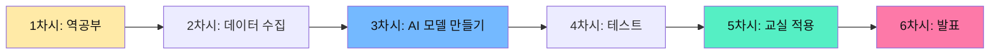
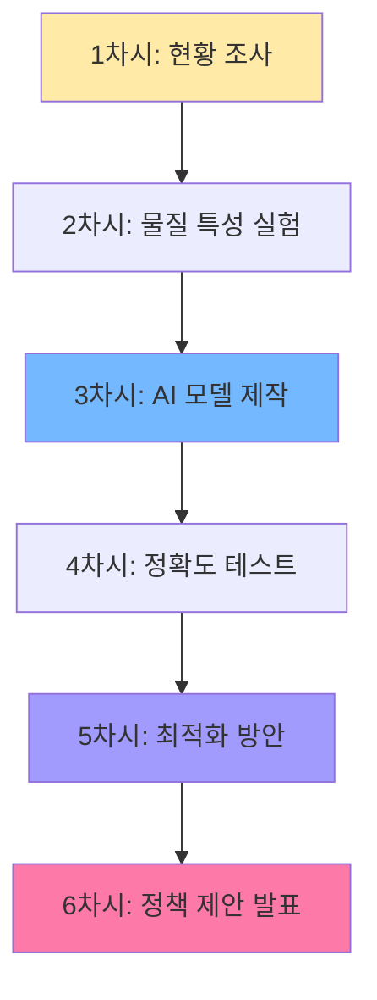
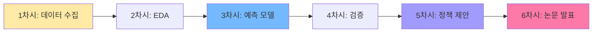
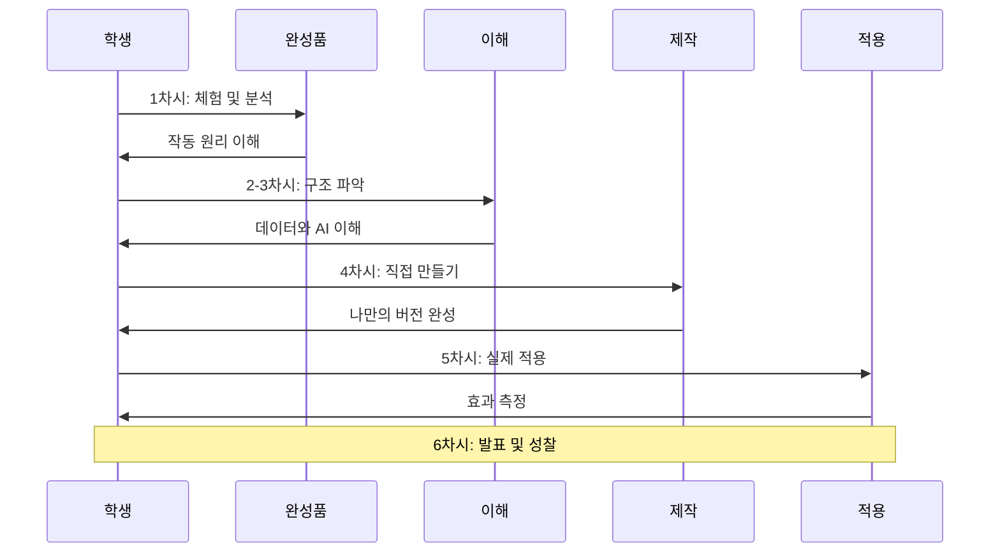

# 영종AI융합교육센터 과학 중점 AI융합교육 6차시 프로그램

## 📌 과학 중점 AI융합교육의 의미

**과학 중점 AI융합교육**은 학생들이 교실과 일상생활에서 직접 경험하는 과학적 문제를 데이터와 AI 기술로 해결하는 실용적 교육입니다.

### 핵심 원칙
- ✅ **교실/일상 중심**: 학교와 집에서 바로 적용 가능
- ✅ **6차시 완성**: 짧은 시간에 결과물 도출
- ✅ **실용적 문제**: 쓰레기 분류, 에너지 절약 등 실생활 문제
- ✅ **역공부 방식**: 완성품 보고 → 이해하고 → 만들기

---

## 🎯 학년별 5가지 현실적 주제 (6차시 기준)

### 주제 비교표

| 학년 | 주제 | 교실/일상 연계 | 필요 장비 | 완성 작품 | 실용성 |
|------|------|---------------|----------|----------|--------|
| **초등** | 우리 교실 쓰레기 분류 AI | 교실 쓰레기통 | 스마트폰 | 분류 앱 | ⭐⭐⭐⭐⭐ |
| **초등** | 급식실 음식물 쓰레기 줄이기 | 급식실 | 저울, 카메라 | 절약 대시보드 | ⭐⭐⭐⭐⭐ |
| **초등** | 교실 온도 자동 조절 시스템 | 교실 환경 | 온도 센서 | 자동 조절 알림 | ⭐⭐⭐⭐ |
| **초등** | 우리 학교 식물 관찰 AI | 화단, 화분 | 스마트폰 | 식물 건강 체크 앱 | ⭐⭐⭐⭐ |
| **초등** | 교실 소음 측정 및 관리 | 교실 | 소음 측정기 | 소음 경보 시스템 | ⭐⭐⭐ |
| **중등** | 학교 분리수거 최적화 AI | 쓰레기 분리수거장 | 스마트폰 | 분류 가이드 앱 | ⭐⭐⭐⭐⭐ |
| **중등** | 교실 공기질 모니터링 시스템 | 교실 | 미세먼지 센서 | 환기 알림 시스템 | ⭐⭐⭐⭐⭐ |
| **중등** | 학교 전기 사용량 절약 AI | 교실, 복도 | 스마트 플러그 | 절약 추천 앱 | ⭐⭐⭐⭐⭐ |
| **중등** | 급식 메뉴 선호도 예측 AI | 급식실 | 설문 데이터 | 메뉴 추천 시스템 | ⭐⭐⭐⭐ |
| **중등** | 교실 책상 정리 상태 AI | 교실 | 스마트폰 | 정리 점수 시스템 | ⭐⭐⭐ |
| **고등** | 학교 쓰레기 발생량 예측 모델 | 전체 학교 | 공공 데이터 | 예측 대시보드 | ⭐⭐⭐⭐⭐ |
| **고등** | 교실 에너지 효율 최적화 AI | 교실 | IoT 센서 | 최적화 시스템 | ⭐⭐⭐⭐⭐ |
| **고등** | 학교 급식 영양 분석 AI | 급식실 | 영양 데이터 | 건강 관리 앱 | ⭐⭐⭐⭐ |
| **고등** | 교실 공기질 예측 및 개선 | 교실 | 다중 센서 | 자동 환기 시스템 | ⭐⭐⭐⭐⭐ |
| **고등** | 학교 자원 재활용 최적화 | 전체 학교 | 데이터 분석 | 재활용 정책 제안 | ⭐⭐⭐⭐ |

---

## 📚 초등학생 6차시 프로그램

### 🗑️ 주제 1: 우리 교실 쓰레기 분류 AI

**왜 이 주제인가?**
- 매일 교실에서 나오는 쓰레기를 직접 다룸
- 분리수거 실천 교육과 AI 학습 동시 달성
- 스마트폰만 있으면 바로 시작 가능
- 환경 보호 실천으로 연결

#### 6차시 구성



#### 차시별 교육지시서

| 차시 | 주제 | 활동 | 준비물 | 결과물 |
|------|------|------|--------|--------|
| **1차시** | 쓰레기 분류 AI 체험 | 티처블 머신 완성품 체험, 작동 원리 이해 | 스마트폰, 컴퓨터 | 이해 노트 |
| **2차시** | 교실 쓰레기 사진 수집 | 플라스틱, 종이, 캔, 일반 쓰레기 사진 찍기 (각 20장) | 스마트폰, 쓰레기 샘플 | 사진 80장 |
| **3차시** | AI 모델 학습 | 티처블 머신에 사진 업로드, 학습 시작 | 컴퓨터, 수집한 사진 | AI 분류 모델 |
| **4차시** | 모델 테스트 및 개선 | 새로운 쓰레기로 테스트, 틀린 것 수정 | 테스트용 쓰레기 | 개선된 모델 |
| **5차시** | 교실 적용 | 쓰레기통에 AI 분류 가이드 부착, 1주일 사용 | 출력물, 태블릿 | 사용 기록 |
| **6차시** | 결과 발표 | 분류 정확도, 환경 보호 효과 발표 | 발표 자료 | 최종 보고서 |

---

### 🍽️ 주제 2: 급식실 음식물 쓰레기 줄이기

**왜 이 주제인가?**
- 매일 급식 시간에 발생하는 실제 문제
- 음식물 쓰레기 무게를 직접 측정하고 데이터화
- 환경 보호와 자원 절약 교육
- 학교 예산 절감에 기여

#### 6차시 구성

| 차시 | 주제 | 활동 | 데이터 수집 | 결과물 |
|------|------|------|------------|--------|
| **1차시** | 문제 발견 | 급식실 음식물 쓰레기 관찰, 얼마나 버려지는지 조사 | 1주일 무게 데이터 | 문제 정의서 |
| **2차시** | 데이터 수집 계획 | 반별, 메뉴별, 요일별 데이터 수집 계획 | 수집 양식 작성 | 데이터 수집표 |
| **3차시** | 데이터 분석 | 엑셀로 그래프 그리기, 패턴 찾기 | 2주간 수집 데이터 | 분석 그래프 |
| **4차시** | 원인 분석 | 왜 많이 버려질까? 설문 조사 | 학생 설문 100명 | 원인 분석 보고서 |
| **5차시** | 해결 방안 | AI 예측으로 적정량 추천, 캠페인 설계 | 예측 모델 | 절약 캠페인 |
| **6차시** | 실천 및 발표 | 1주일 실천 후 효과 측정, 발표 | 실천 데이터 | 성과 보고서 |

---

### 🌡️ 주제 3: 교실 온도 자동 조절 시스템

**왜 이 주제인가?**
- 여름/겨울 교실 온도 문제는 모든 학생이 공감
- 온도 센서로 실시간 데이터 수집
- 적정 온도 유지로 학습 환경 개선
- 에너지 절약 교육

#### 6차시 구성

| 차시 | 주제 | 활동 | 센서 활용 | 결과물 |
|------|------|------|----------|--------|
| **1차시** | 온도 데이터 이해 | 교실 온도 측정, 쾌적 온도 조사 | 온도계 | 온도 기록표 |
| **2차시** | 센서 설치 및 수집 | 교실 여러 곳에 센서 설치, 1주일 데이터 수집 | 온도 센서 3개 | 시간별 온도 데이터 |
| **3차시** | 데이터 시각화 | 시간대별, 위치별 온도 그래프 | 엑셀, 구글 시트 | 온도 변화 그래프 |
| **4차시** | 패턴 분석 | 언제 가장 덥고/추운가? 원인은? | 분석 도구 | 패턴 분석 보고서 |
| **5차시** | 자동 조절 규칙 | "온도 28도 이상이면 알림" 규칙 만들기 | 알림 앱 | 자동 알림 시스템 |
| **6차시** | 시스템 운영 | 1주일 운영 후 효과 측정, 발표 | 운영 데이터 | 효과 보고서 |

---

## 📚 중학생 6차시 프로그램

### ♻️ 주제 1: 학교 분리수거 최적화 AI

**왜 이 주제인가?**
- 학교 전체 분리수거 시스템 개선
- 물질의 특성 데이터를 과학적으로 분석
- AI 분류 모델로 정확도 향상
- 실제 학교 정책 제안 가능

#### 6차시 구성



#### 차시별 교육지시서

**1차시: 학교 분리수거 현황 조사**
```
활동:
- 학교 쓰레기 분리수거장 방문
- 잘못 분류된 쓰레기 조사 (사진 촬영)
- 학생/선생님 인터뷰 (어려운 점)

데이터 수집:
- 분리수거 오류율: 30%
- 가장 헷갈리는 쓰레기: 플라스틱 종류
- 일일 쓰레기 발생량: 50kg

결과물:
- 현황 조사 보고서 (사진 포함)
- 문제점 3가지 도출
```

**2차시: 물질 특성 실험 및 데이터 수집**
```
실험 항목:
1. 밀도 측정 (g/cm³)
   - 플라스틱: 0.9-1.4
   - 종이: 0.7-1.2
   - 금속: 2.7-7.9
   - 유리: 2.4-2.8

2. 자성 테스트
   - 철/알루미늄 구분

3. 투명도 측정
   - 투명/반투명/불투명

4. 색상 분석
   - RGB 값 측정

데이터셋 구축:
- 각 물질당 20개 샘플
- 총 100개 데이터
- 엑셀 정리

결과물:
- 물질 특성 데이터셋
- 실험 보고서
```

**3차시: Orange3로 AI 분류 모델 제작**
```
Orange3 워크플로우:

[File] → [Data Table] → [Tree] → [Predictions]
           ↓
    [Test & Score]

활동:
1. Orange3 설치 및 실행
2. 데이터 불러오기 (CSV)
3. Tree 위젯으로 의사결정 나무 생성
4. Test & Score로 정확도 확인
   목표: 90% 이상

결과물:
- AI 분류 모델 (.ows 파일)
- 의사결정 나무 시각화
- 정확도 리포트
```

**4차시: 모델 테스트 및 개선**
```
테스트 방법:
1. 새로운 쓰레기 20개 준비
2. AI 예측 vs 실제 분류 비교
3. 오분류 사례 분석

개선 활동:
- 헷갈리는 물질 추가 데이터 수집
- 특성 추가 (무게, 소리 등)
- 모델 재학습

결과물:
- 테스트 결과 보고서
- 개선된 모델 (정확도 95%)
```

**5차시: 학교 적용 최적화 방안**
```
실용화 방안:
1. 분리수거장에 AI 가이드 부착
   - QR 코드로 앱 연결
   - 사진 찍으면 분류 알려줌

2. 교육 포스터 제작
   - 헷갈리는 쓰레기 TOP 5
   - 올바른 분류 방법

3. 1주일 시범 운영
   - 학생 참여 유도
   - 오류율 감소 측정

결과물:
- AI 분류 가이드 앱 (프로토타입)
- 교육 포스터 5종
- 시범 운영 계획서
```

**6차시: 학교 정책 제안 발표**
```
발표 구성:
1. 문제 정의 (3분)
   - 현재 오류율 30%
   - 환경 오염 및 비용 증가

2. 해결 방안 (5분)
   - AI 분류 모델 (정확도 95%)
   - 실시간 분류 가이드 앱
   - 교육 캠페인

3. 기대 효과 (3분)
   - 오류율 30% → 5% 감소
   - 재활용률 20% 증가
   - 연간 500만원 절감

4. 실행 계획 (2분)
   - 전교생 앱 설치
   - 분리수거장 개선
   - 월 1회 모니터링

5. Q&A (2분)

결과물:
- 발표 자료 (PPT)
- 정책 제안서 (10페이지)
- 시연 영상
```

---

### 🌬️ 주제 2: 교실 공기질 모니터링 시스템

**왜 이 주제인가?**
- 미세먼지는 학생 건강에 직접 영향
- 실시간 센서 데이터로 과학적 분석
- 자동 환기 알림으로 실용성 확보
- 코로나 이후 환기 중요성 증대

#### 6차시 구성

| 차시 | 주제 | 센서 활용 | AI 기능 | 결과물 |
|------|------|----------|---------|--------|
| **1차시** | 공기질 이해 | 미세먼지 센서 설치 | - | 1주일 데이터 |
| **2차시** | 데이터 분석 | 시간대별 패턴 분석 | - | 패턴 그래프 |
| **3차시** | 예측 모델 | 언제 나빠질지 예측 | 회귀 모델 | 예측 모델 |
| **4차시** | 알림 시스템 | 기준 초과 시 알림 | 자동 알림 | 알림 앱 |
| **5차시** | 환기 최적화 | 언제 환기할지 추천 | 추천 알고리즘 | 환기 가이드 |
| **6차시** | 시스템 운영 | 1주일 운영 효과 측정 | - | 효과 보고서 |

---

### ⚡ 주제 3: 학교 전기 사용량 절약 AI

**왜 이 주제인가?**
- 교실 전기 낭비 문제 해결
- 에너지 절약으로 학교 예산 절감
- 기후 변화 대응 실천
- IoT 센서와 AI 융합

#### 6차시 구성

| 차시 | 주제 | 데이터 수집 | AI 분석 | 실천 활동 |
|------|------|------------|---------|----------|
| **1차시** | 전기 사용 현황 | 스마트 플러그로 측정 | - | 현황 파악 |
| **2차시** | 낭비 패턴 발견 | 시간대별 사용량 | 패턴 분석 | 낭비 요인 3가지 |
| **3차시** | 절약 AI 모델 | 적정 사용량 예측 | 예측 모델 | 절약 목표 설정 |
| **4차시** | 자동 제어 | 불필요 시 자동 차단 | 제어 알고리즘 | 자동화 시스템 |
| **5차시** | 절약 캠페인 | 1주일 실천 | 실시간 모니터링 | 절약 경쟁 |
| **6차시** | 성과 발표 | 절약량 측정 | 효과 분석 | 성과 보고서 |

---

## 📚 고등학생 6차시 프로그램

### 📊 주제 1: 학교 쓰레기 발생량 예측 모델

**왜 이 주제인가?**
- 학교 전체 쓰레기 관리 최적화
- 빅데이터 분석 및 머신러닝 활용
- 학교 행정에 실제 도움
- 대학 진로 포트폴리오

#### 6차시 구성



#### 차시별 교육지시서

**1차시: 데이터 수집 및 전처리**
```python
# 수집 데이터 항목
data = {
    '날짜': [],           # 2024-01-01 ~ 2024-12-31
    '요일': [],           # 월~일
    '학생수': [],         # 출석 학생 수
    '급식인원': [],       # 급식 먹은 인원
    '행사여부': [],       # 0 or 1
    '시험기간': [],       # 0 or 1
    '쓰레기량_kg': []     # 목표 변수
}

# 데이터 소스
- 학교 행정실: 쓰레기 수거 기록
- 급식실: 급식 인원
- 학사 일정: 행사, 시험 정보

# 전처리
- 결측치 처리
- 이상치 제거
- 범주형 변수 인코딩
```

**2차시: 탐색적 데이터 분석 (EDA)**
```python
import pandas as pd
import matplotlib.pyplot as plt
import seaborn as sns

# 1. 기술 통계
df.describe()

# 2. 시각화
# 요일별 쓰레기 발생량
plt.bar(df['요일'], df['쓰레기량_kg'])

# 시험기간 vs 평상시
sns.boxplot(x='시험기간', y='쓰레기량_kg', data=df)

# 상관관계 히트맵
sns.heatmap(df.corr(), annot=True)

# 3. 인사이트 도출
- 월요일에 가장 많음 (주말 쓰레기 누적)
- 시험기간에 20% 감소
- 급식인원과 강한 양의 상관관계
```

**3차시: 예측 모델 개발**
```python
from sklearn.ensemble import RandomForestRegressor
from sklearn.model_selection import train_test_split

# 데이터 분할
X = df[['요일', '학생수', '급식인원', '행사여부', '시험기간']]
y = df['쓰레기량_kg']
X_train, X_test, y_train, y_test = train_test_split(X, y, test_size=0.2)

# 모델 학습
model = RandomForestRegressor(n_estimators=100, random_state=42)
model.fit(X_train, y_train)

# 평가
from sklearn.metrics import mean_absolute_error, r2_score
predictions = model.predict(X_test)
mae = mean_absolute_error(y_test, predictions)
r2 = r2_score(y_test, predictions)

print(f"MAE: {mae:.2f} kg")  # 목표: 5kg 이하
print(f"R²: {r2:.3f}")       # 목표: 0.8 이상
```

**4차시: 모델 검증 및 해석**
```python
# 특성 중요도
importances = model.feature_importances_
features = X.columns
plt.barh(features, importances)

# 결과:
# 1. 급식인원 (40%)
# 2. 학생수 (30%)
# 3. 요일 (20%)
# 4. 행사여부 (7%)
# 5. 시험기간 (3%)

# SHAP 값으로 해석
import shap
explainer = shap.TreeExplainer(model)
shap_values = explainer.shap_values(X_test)
shap.summary_plot(shap_values, X_test)
```

**5차시: 학교 정책 제안**
```
제안 1: 쓰레기 수거 최적화
- 예측 모델로 수거 일정 조정
- 월요일: 2회 수거
- 시험기간: 1회로 감축
- 예상 효과: 수거 비용 15% 절감

제안 2: 쓰레기 감축 캠페인
- 쓰레기 많은 요일에 집중 캠페인
- 급식 잔반 줄이기 (가장 큰 요인)
- 예상 효과: 쓰레기 20% 감소

제안 3: 실시간 모니터링 대시보드
- 오늘 예측량 vs 실제량 비교
- 목표 대비 달성률 표시
- 학급별 경쟁 유도
```

**6차시: 연구 논문 작성 및 발표**
```
논문 구조:

1. 서론
   - 학교 쓰레기 관리의 중요성
   - 예측 모델의 필요성

2. 방법론
   - 데이터 수집 (1년간 365일)
   - 변수 선정 및 전처리
   - 랜덤 포레스트 알고리즘

3. 결과
   - 모델 성능: MAE 4.2kg, R² 0.85
   - 특성 중요도 분석
   - 예측 사례

4. 고찰
   - 급식인원이 가장 큰 영향
   - 시즌별 패턴 존재
   - 한계: 날씨 변수 미포함

5. 결론
   - 실용적 활용 방안
   - 향후 연구 방향

발표 (15분):
- PPT 발표 (10분)
- 실시간 예측 시연 (3분)
- Q&A (2분)
```

---

## 🎯 6차시 프로그램 핵심 원칙

### 역공부 방식 적용



### 6차시 시간 배분

| 단계 | 차시 | 시간 비율 | 핵심 활동 |
|------|------|----------|----------|
| **역공부** | 1차시 | 16% | 완성품 체험, 작동 원리 이해 |
| **이해** | 2차시 | 17% | 데이터 수집, 구조 파악 |
| **제작** | 3-4차시 | 34% | AI 모델 개발, 테스트 |
| **적용** | 5차시 | 17% | 실제 환경에 적용, 효과 측정 |
| **발표** | 6차시 | 16% | 결과 공유, 성찰 |

---

## 📊 필요 장비 및 예산

### 학년별 필수 장비

| 학년 | 필수 장비 | 수량 (30명 기준) | 예상 비용 | 비고 |
|------|----------|----------------|----------|------|
| **초등** | 스마트폰/태블릿 | 30대 | 0원 | 학생 개인 소지 |
| **초등** | 온도 센서 | 3개 | 30,000원 | 교실용 |
| **초등** | 저울 (디지털) | 1개 | 50,000원 | 급식실용 |
| **중등** | 미세먼지 센서 | 3개 | 90,000원 | 교실용 |
| **중등** | 스마트 플러그 | 5개 | 100,000원 | 전기 측정 |
| **중등** | Orange3 설치 PC | 30대 | 0원 | 학교 컴퓨터실 |
| **고등** | IoT 센서 키트 | 10세트 | 500,000원 | 다목적 |
| **고등** | Python 환경 PC | 30대 | 0원 | 학교 컴퓨터실 |

**총 예산: 약 77만원** (학교 기존 장비 활용 시)

---

## 🎓 교사 준비 사항

### 사전 준비 체크리스트

**1주 전**
- [ ] 주제 선정 및 교육지시서 검토
- [ ] 필요 장비 확인 및 대여
- [ ] 소프트웨어 설치 (Teachable Machine, Orange3 등)
- [ ] 샘플 데이터 준비

**3일 전**
- [ ] 학생 모둠 구성 (4-5명)
- [ ] 역공부용 완성품 준비
- [ ] 워크시트 인쇄
- [ ] 실습 환경 테스트

**당일**
- [ ] 장비 작동 확인
- [ ] 인터넷 연결 확인
- [ ] 백업 계획 준비

### 교사 연수 프로그램 (6시간)

| 시간 | 내용 | 실습 |
|------|------|------|
| **1-2시간** | 과학 중점 AI융합교육 이해 | 역공부 방식 체험 |
| **3-4시간** | 도구 활용법 | Teachable Machine, Orange3 |
| **5-6시간** | 수업 시연 | 모의 수업 및 피드백 |

---

## 📈 평가 및 성과

### 프로젝트 평가 루브릭 (100점)

| 항목 | 배점 | 평가 기준 |
|------|------|----------|
| **문제 이해** | 20점 | 일상/교실 문제를 명확히 정의했는가? |
| **데이터 수집** | 20점 | 실제 데이터를 체계적으로 수집했는가? |
| **AI 모델** | 25점 | AI 모델이 작동하며 정확한가? |
| **실용성** | 20점 | 실제 교실/학교에 적용 가능한가? |
| **발표** | 15점 | 명확하고 설득력 있게 발표했는가? |

### 기대 효과

**학생 역량**
- ✅ 실생활 문제 해결 능력
- ✅ 데이터 기반 의사결정
- ✅ AI 기술 이해 및 활용
- ✅ 환경 보호 실천 의식

**학교 혜택**
- ✅ 쓰레기 분리수거 정확도 향상
- ✅ 에너지 절약 (전기료 감소)
- ✅ 급식 음식물 쓰레기 감소
- ✅ 교실 환경 개선

---

## 💡 확장 및 연계

### 타 교과 연계

| 교과 | 연계 내용 | 활동 |
|------|----------|------|
| **과학** | 물질의 특성, 에너지 | 실험 및 측정 |
| **수학** | 통계, 그래프 | 데이터 분석 |
| **사회** | 환경 문제, 지속가능성 | 정책 제안 |
| **미술** | 인포그래픽, 포스터 | 시각화 디자인 |
| **국어** | 보고서, 발표 | 글쓰기 및 발표 |

### 동아리 활동 연계

- 환경 동아리: 쓰레기 감축 캠페인
- 과학 동아리: 센서 실험 심화
- 정보 동아리: AI 모델 고도화
- 봉사 동아리: 지역사회 확산

---

## 📞 문의 및 지원

**영종AI융합교육센터**
- 웹사이트: https://softcon.ice.go.kr
- 운영: 인천광역시교육청

**AI메이커랩**
- 이메일: jongphilkim@aimakerlab.com
- 지원: 교육지시서, 교사 연수, 장비 대여

---

**문서 작성일**: 2026년 2월 9일  
**버전**: 3.0 (현실적 6차시 프로그램)  
**작성자**: AI메이커랩 교육팀

