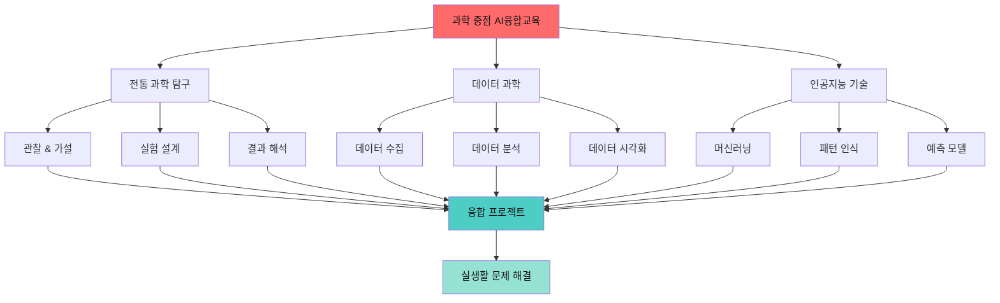
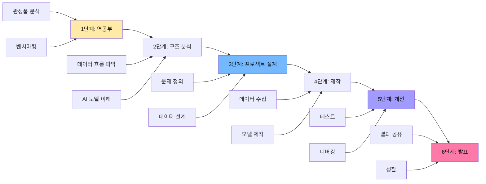
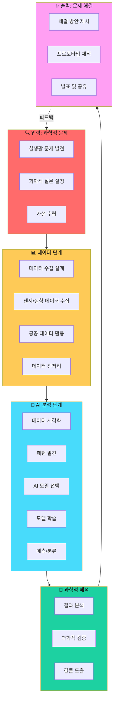
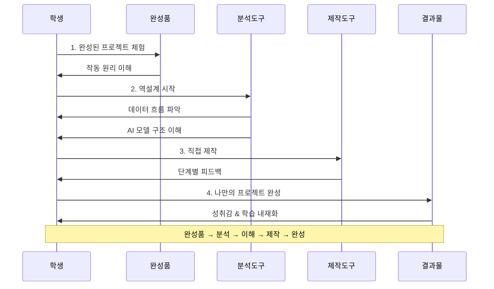
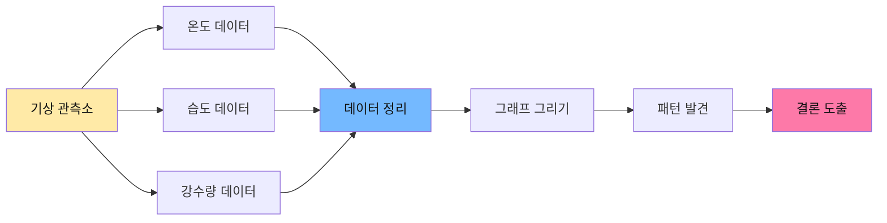
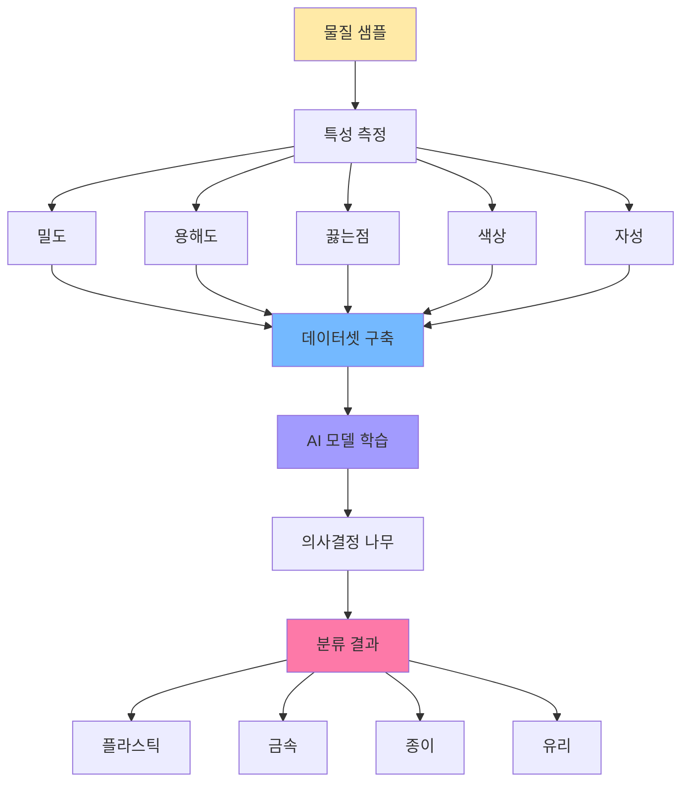
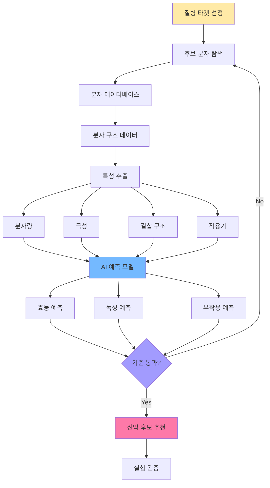
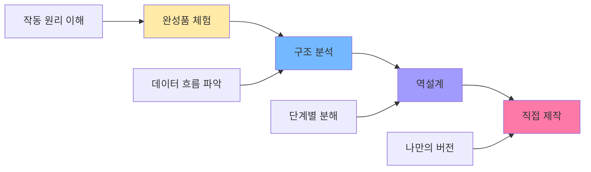
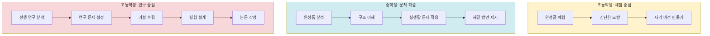
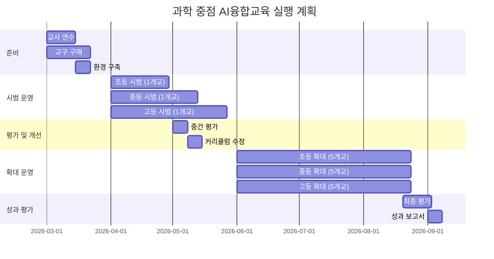

# 영종AI융합교육센터 과학 중점 AI융합교육 주제 제안서

## 📌 1단계: 과학 중점 AI융합교육 영역의 의미

### 영종AI융합교육센터 개요
**영종AI융합교육센터**(https://softcon.ice.go.kr)는 인천광역시교육청이 운영하는 학생 AI·SW교육 및 체험 프로그램 전문 기관입니다.

---

## 🔬 과학 중점 AI융합교육 구조

### 교육 철학 및 구조도



### 역공부 + 프로젝트 기반 교육 모델



### 과학 중점 AI융합교육의 핵심 구조



### 역공부 방식의 학습 흐름



### 교육적 가치

#### 1. 데이터 리터러시 함양
- **수집**: 센서, 실험, 공공 데이터 활용
- **분석**: 통계, 패턴 인식, 상관관계
- **시각화**: 그래프, 차트, 대시보드
- **의사소통**: 데이터 기반 주장, 증거 제시

#### 2. AI 활용 역량
- **AI 원리 이해**: 머신러닝, 딥러닝 개념
- **문제 해결**: AI를 도구로 활용
- **실행 계획**: 프로젝트 설계 및 구현
- **윤리적 사용**: 데이터 편향, 개인정보 보호

#### 3. 과학적 사고력
- **가설 설정**: 과학적 질문 만들기
- **실험 설계**: 변수 제어, 데이터 수집 계획
- **증거 기반 결론**: 데이터로 검증
- **반복 개선**: 실패를 통한 학습

#### 4. 융합적 문제 해결
- **과학**: 자연 현상, 생명, 물질
- **수학**: 통계, 확률, 함수
- **정보**: 프로그래밍, 데이터 구조
- **사회**: 환경, 건강, 지속가능성

---

## 📚 2단계: 학년별 주제별 세부 제품 비교표

### 주제 선정 기준
✓ **교육과정 연계**: 과학 교과 성취기준과 직접 연결  
✓ **실생활 문제**: 학생이 공감할 수 있는 실제 문제  
✓ **데이터 접근성**: 학생이 직접 수집하거나 공공 데이터 활용 가능  
✓ **단계적 난이도**: 초등(관찰·분류) → 중등(분석·예측) → 고등(모델링·연구)  
✓ **결과물 가시성**: 명확한 산출물로 성취감 제공

### 학년별 주제 및 세부 제품 비교표

| 학년 | 주제 | 세부 제품 | 사용 도구 | 데이터 유형 | 완성 기간 | 난이도 |
|------|------|----------|----------|------------|----------|--------|
| **초등** | 날씨 데이터 분석 | 기후 패턴 대시보드 | 엑셀, 구글 스프레드시트 | 온도, 습도, 강수량 | 4주 | ⭐⭐ |
| **초등** | 식물 성장 실험 | 성장 조건 비교 그래프 | 센서 키트, 엑셀 | 키, 잎 개수, 환경 데이터 | 6주 | ⭐⭐ |
| **초등** | 쓰레기 분류 조사 | 분류 현황 인포그래픽 | Canva, 파워포인트 | 쓰레기 종류별 개수 | 2주 | ⭐ |
| **초등** | 동물 분류 AI | 이미지 인식 모델 | Teachable Machine | 동물 사진 데이터셋 | 3주 | ⭐⭐ |
| **초등** | 물의 상태 변화 | 상태 변화 그래프 | 온도계, 엑셀 | 온도별 상태 데이터 | 2주 | ⭐ |
| **중등** | 혼합물 분리 AI | 물질 분류 모델 | Orange3, Python | 물질 특성 데이터 | 6주 | ⭐⭐⭐ |
| **중등** | 대기질 분석 | 대기질 예측 시스템 | Python, Pandas | 공공 대기질 데이터 | 5주 | ⭐⭐⭐ |
| **중등** | 에너지 소비 분석 | 절약 앱 프로토타입 | MIT App Inventor | 전기 사용량 데이터 | 6주 | ⭐⭐⭐ |
| **중등** | 질병 진단 AI | 증상 기반 진단 모델 | Orange3, Scikit-learn | 증상-질병 데이터셋 | 5주 | ⭐⭐⭐⭐ |
| **중등** | 해양 생태 모니터링 | 생태계 대시보드 | Python, Plotly | 생물 개체수 데이터 | 6주 | ⭐⭐⭐ |
| **고등** | 신약 개발 AI | 신약 후보 추천 시스템 | Python, TensorFlow | 분자 구조 데이터 | 8주 | ⭐⭐⭐⭐⭐ |
| **고등** | 기후 변화 예측 | 시나리오별 예측 모델 | Python, Scikit-learn | 위성 기상 데이터 | 10주 | ⭐⭐⭐⭐⭐ |
| **고등** | 유전체 분석 | 질병 위험도 예측 알고리즘 | Python, BioPython | 유전자 서열 데이터 | 10주 | ⭐⭐⭐⭐⭐ |
| **고등** | 우주 천체 분석 | 별 분류 AI 시스템 | Python, Keras | 천문 관측 데이터 | 8주 | ⭐⭐⭐⭐ |
| **고등** | 신소재 개발 | 물성 예측 플랫폼 | Python, PyTorch | 물질 물성 데이터 | 10주 | ⭐⭐⭐⭐⭐ |

### 세부 제품별 비교 분석표

#### 초등학생 제품 비교

| 비교 항목 | 기후 패턴 대시보드 | 성장 조건 그래프 | 분류 인포그래픽 | 이미지 인식 모델 | 상태 변화 그래프 |
|----------|------------------|----------------|----------------|----------------|----------------|
| **제작 난이도** | 중 | 중 | 하 | 중 | 하 |
| **데이터 수집** | 자동(기상청) | 수동(직접 측정) | 수동(직접 조사) | 자동(이미지 검색) | 수동(실험) |
| **AI 활용도** | 낮음 | 낮음 | 없음 | 높음 | 낮음 |
| **시각화 품질** | 높음 | 중 | 높음 | 중 | 중 |
| **실생활 연계** | 높음 | 중 | 높음 | 중 | 중 |
| **협업 가능성** | 중 | 높음 | 높음 | 중 | 중 |
| **발표 효과** | 높음 | 중 | 높음 | 높음 | 중 |

#### 중학생 제품 비교

| 비교 항목 | 물질 분류 모델 | 대기질 예측 시스템 | 절약 앱 프로토타입 | 증상 진단 모델 | 생태계 대시보드 |
|----------|--------------|------------------|------------------|--------------|---------------|
| **제작 난이도** | 중상 | 중상 | 중상 | 상 | 중상 |
| **데이터 수집** | 실험+문헌 | 공공 데이터 | 자동(스마트 플러그) | 의료 데이터셋 | 현장 조사 |
| **AI 활용도** | 높음 | 높음 | 중 | 매우 높음 | 중 |
| **교과 연계** | 화학(물질) | 지구과학(환경) | 물리(에너지) | 생물(인체) | 생물(생태계) |
| **사회적 가치** | 중 | 높음 | 높음 | 높음 | 중 |
| **진로 탐색** | 화학공학 | 환경공학 | 전기공학 | 의학/간호 | 생명과학 |
| **확장 가능성** | 높음 | 높음 | 중 | 높음 | 중 |

#### 고등학생 제품 비교

| 비교 항목 | 신약 추천 시스템 | 기후 예측 모델 | 질병 위험도 알고리즘 | 별 분류 AI | 물성 예측 플랫폼 |
|----------|----------------|--------------|-------------------|-----------|---------------|
| **제작 난이도** | 매우 높음 | 매우 높음 | 매우 높음 | 높음 | 매우 높음 |
| **데이터 규모** | 대규모 | 초대규모 | 대규모 | 대규모 | 중규모 |
| **AI 기술 수준** | 딥러닝 | 앙상블 | 통계+ML | CNN | 회귀+최적화 |
| **전문성 요구** | 화학+생물 | 지구과학+통계 | 생물+통계 | 물리+천문 | 화학+물리 |
| **산업 연계** | 제약 | 기상청/환경부 | 의료/보험 | 천문대/우주청 | 반도체/소재 |
| **연구 가치** | 매우 높음 | 매우 높음 | 매우 높음 | 높음 | 매우 높음 |
| **대회 출품** | 가능 | 가능 | 가능 | 가능 | 가능 |

---

## 🎓 초등학생 (5-6학년) 교육지시서

### 📋 주제 1: 날씨 데이터로 기후 패턴 찾기

#### 교육지시서

**과정명**: 날씨 데이터 과학자 되기  
**대상**: 초등학교 5-6학년  
**기간**: 4주 (주 2회, 총 8차시)  
**교육 방식**: 역공부 + 프로젝트 기반 학습

---

#### 1단계: 역공부 (1-2차시)

**완성품 분석**
- 기상청 날씨 예보 시스템 체험
- 전문가가 만든 기후 변화 대시보드 탐색
- "이 그래프는 어떤 데이터로 만들어졌을까?" 질문

**학습 활동**
```
활동 1: 기상청 웹사이트 탐험 (30분)
- 우리 지역 날씨 데이터 찾기
- 온도, 습도, 강수량 그래프 관찰
- 어떤 패턴이 보이는지 토론

활동 2: 완성된 대시보드 역설계 (30분)
- 샘플 대시보드 분석
- "어떤 데이터가 필요했을까?" 추론
- "어떤 순서로 만들었을까?" 단계 나열
```

---

#### 2단계: 구조 분석 (3차시)

**데이터 흐름 이해**



**학습 활동**
```
활동 1: 데이터 종류 이해 (20분)
- 온도: 섭씨 단위, 숫자 데이터
- 습도: 퍼센트, 0-100%
- 강수량: mm 단위

활동 2: 데이터 수집 계획 세우기 (40분)
- 언제: 매일 같은 시간
- 어디서: 기상청 웹사이트
- 무엇을: 온도, 습도, 강수량
- 어떻게: 엑셀 표에 기록
```

---

#### 3단계: 프로젝트 설계 (4차시)

**문제 정의**
- "우리 지역의 날씨는 어떻게 변하고 있을까?"
- "계절별로 어떤 차이가 있을까?"

**데이터 수집 설계**
```
수집 기간: 4주 (28일)
수집 항목:
  - 최고 온도 (°C)
  - 최저 온도 (°C)
  - 습도 (%)
  - 강수량 (mm)
  - 날씨 (맑음/흐림/비/눈)

기록 방법:
  - 구글 스프레드시트 사용
  - 매일 오후 3시 기록
  - 기상청 데이터 참조
```

---

#### 4단계: 제작 (5-6차시)

**데이터 수집 및 정리**
```
차시 5: 데이터 수집 (1주차)
- 매일 데이터 기록
- 빠진 데이터 확인
- 이상한 값 체크

차시 6: 데이터 시각화
- 꺾은선 그래프: 온도 변화
- 막대 그래프: 강수량
- 원 그래프: 날씨 비율
```

**사용 도구**
- 구글 스프레드시트
- 차트 기능 활용
- 색상과 레이블 추가

---

#### 5단계: 개선 (7차시)

**테스트 및 검증**
```
활동 1: 그래프 읽기 연습 (20분)
- "온도가 가장 높았던 날은?"
- "비가 온 날은 며칠?"
- "습도가 높으면 날씨는?"

활동 2: 개선하기 (40분)
- 그래프가 보기 쉬운가?
- 색상이 적절한가?
- 제목이 명확한가?
- 더 추가할 데이터는?
```

---

#### 6단계: 발표 (8차시)

**결과 공유**
```
발표 구성:
1. 문제 소개 (2분)
   - 왜 날씨를 조사했나?
   
2. 데이터 수집 과정 (3분)
   - 어떻게 데이터를 모았나?
   - 어려웠던 점은?
   
3. 결과 발표 (3분)
   - 그래프 보여주기
   - 발견한 패턴 설명
   
4. 결론 (2분)
   - 배운 점
   - 기후 변화와의 연결
```

---

#### 평가 기준

| 항목 | 배점 | 평가 내용 |
|------|------|----------|
| 데이터 수집 | 30점 | 정확성, 완성도, 꾸준함 |
| 시각화 | 30점 | 그래프 적절성, 가독성 |
| 패턴 발견 | 20점 | 과학적 해석, 논리성 |
| 발표 | 20점 | 명확성, 창의성 |

---

#### 완성 작품
**우리 지역 월별 날씨 변화 시각화 대시보드**
- 온도 변화 꺾은선 그래프
- 강수량 막대 그래프
- 날씨 비율 원 그래프
- 패턴 분석 보고서 (1페이지)

---

### 주제 2: 식물 성장과 환경 조건 실험

**왜 이 주제인가?**
- 식물 기르기는 초등학생이 직접 관찰하고 기록할 수 있는 장기 프로젝트
- 빛, 물, 온도 등 변수를 조절하며 과학적 실험 설계 경험
- 성장 데이터(키, 잎 개수)를 꾸준히 기록하며 데이터 수집 습관 형성
- 생명 과학의 기초 개념과 데이터 분석의 자연스러운 결합

**완성 작품**: 식물 성장 조건별 비교 그래프 및 최적 조건 발표 자료

---

### 주제 3: 우리 학교 쓰레기 분류 현황 조사

**왜 이 주제인가?**
- 학교 환경과 직접 연결되어 참여 동기 높음
- 쓰레기 종류별 개수를 세고 분류하며 기초 데이터 수집 경험
- 재활용, 일반 쓰레기 비율을 계산하고 시각화
- 환경 보호라는 실천적 가치와 연결

**완성 작품**: 학교 쓰레기 분류 현황 보고서 및 개선 캠페인 포스터

---

### 주제 4: 동물 분류 AI 만들기

**왜 이 주제인가?**
- 동물 사진이라는 시각 자료로 AI 개념을 직관적으로 이해
- 포유류, 조류, 파충류 등 동물 분류는 과학 교과 내용과 직접 연결
- 티처블 머신(Teachable Machine) 같은 도구로 코딩 없이 AI 모델 제작 가능
- "AI가 어떻게 학습하는가"를 체험적으로 이해

**완성 작품**: 동물 사진 인식 AI 모델 및 분류 기준 설명 자료

---

### 주제 5: 물의 상태 변화 데이터 분석

**왜 이 주제인가?**
- 얼음, 물, 수증기 상태 변화는 초등 과학의 핵심 개념
- 온도에 따른 상태 변화를 측정하고 그래프로 표현
- 물리적 변화를 정량적 데이터로 이해하는 과학적 사고 훈련
- 간단한 실험으로 명확한 데이터 수집 가능

**완성 작품**: 온도별 물의 상태 변화 그래프 및 예측 모델

---

## 🎓 중학생 (1-3학년) 교육지시서

### 📋 주제 1: 혼합물 분리와 AI 분류 모델

#### 교육지시서

**과정명**: 물질 분류 AI 과학자  
**대상**: 중학교 1-3학년  
**기간**: 6주 (주 2회, 총 12차시)  
**교육 방식**: 역공부 + 프로젝트 기반 학습  
**교과 연계**: 과학(물질의 특성), 정보(데이터와 정보)

---

#### 1단계: 역공부 (1-2차시)

**완성품 분석**
- 실제 분리수거 시설 영상 시청
- AI 물질 분류 시스템 데모 체험
- "AI는 어떻게 플라스틱과 종이를 구분할까?" 질문

**학습 활동**
```
활동 1: 분리수거 시스템 분석 (40분)
- 현대 분리수거 시설 견학 영상
- 센서와 AI가 어떻게 작동하는지 관찰
- 물질의 어떤 특성을 사용하는지 토론

활동 2: AI 분류 모델 체험 (50분)
- Orange3로 만든 샘플 모델 실행
- 물질 데이터 입력 → 분류 결과 확인
- "어떤 데이터가 필요했을까?" 역추적
- 모델 구조 분석 (의사결정 나무)
```

---

#### 2단계: 구조 분석 (3-4차시)

**AI 분류 모델 구조**



**학습 활동**
```
차시 3: 물질의 특성 데이터화 (45분)
- 밀도 측정 실험
- 용해도 실험
- 데이터 기록 방법 학습

차시 4: 분류 알고리즘 이해 (45분)
- 의사결정 나무란?
- "만약 밀도가 1보다 크면 → 금속"
- 분류 기준 만들기 실습
```

---

#### 3단계: 프로젝트 설계 (5-6차시)

**문제 정의**
```
핵심 질문:
"우리 학교 쓰레기를 AI로 자동 분류할 수 있을까?"

세부 목표:
1. 학교에서 나오는 쓰레기 5종류 분류
2. 물질의 특성 데이터 수집
3. Orange3로 분류 모델 제작
4. 정확도 90% 이상 달성
```

**데이터 수집 설계**
```
수집 대상 물질:
1. 플라스틱 (PET병, 비닐)
2. 종이 (신문지, 박스)
3. 금속 (캔, 철)
4. 유리 (병)
5. 일반 쓰레기 (음식물 제외)

측정 항목:
- 밀도 (g/cm³)
- 용해도 (물에 녹는가?)
- 자성 (자석에 붙는가?)
- 색상 (RGB 값)
- 투명도 (%)

샘플 수: 각 물질당 20개 (총 100개)
```

---

#### 4단계: 제작 (7-10차시)

**차시별 제작 과정**

```
차시 7-8: 데이터 수집 (90분)
- 5개 팀으로 나눠 물질별 데이터 수집
- 밀도 측정: 질량/부피
- 용해도 테스트: 물에 담그기
- 자성 테스트: 자석 가까이
- 색상 측정: 색상 센서 또는 앱
- 엑셀에 데이터 기록

차시 9: 데이터 전처리 (45분)
- 이상치 제거 (너무 다른 값)
- 결측치 처리 (빠진 값)
- 데이터 정규화 (0-1 범위로)

차시 10: AI 모델 제작 (45분)
- Orange3 실행
- 데이터 불러오기
- Tree 위젯으로 의사결정 나무 생성
- Test & Score로 정확도 확인
```

**Orange3 워크플로우**
```
[File] → [Data Table] → [Tree] → [Predictions]
                ↓
         [Test & Score]
```

---

#### 5단계: 개선 (11차시)

**모델 성능 개선**
```
활동 1: 정확도 분석 (20분)
- 어떤 물질이 잘 분류되는가?
- 어떤 물질이 헷갈리는가?
- 왜 헷갈릴까? (특성이 비슷해서)

활동 2: 특성 추가 (25분)
- 더 필요한 특성은?
- 예: 무게, 두께, 소리
- 추가 데이터 수집 및 재학습

활동 3: 최종 검증 (20분)
- 새로운 샘플로 테스트
- 정확도 90% 이상 확인
- 오분류 사례 분석
```

---

#### 6단계: 발표 (12차시)

**결과 공유 및 확장**
```
발표 구성:
1. 문제 정의 (3분)
   - 분리수거의 중요성
   - AI 활용 필요성
   
2. 데이터 수집 과정 (4분)
   - 어떤 특성을 측정했나?
   - 실험 과정 사진
   
3. AI 모델 설명 (5분)
   - 의사결정 나무 구조
   - 분류 기준 설명
   - 시연 (실시간 분류)
   
4. 결과 및 제안 (3분)
   - 정확도: XX%
   - 학교 분리수거 개선 방안
   - 한계점 및 향후 과제
```

---

#### 평가 기준

| 항목 | 배점 | 평가 내용 |
|------|------|----------|
| 데이터 수집 | 25점 | 정확성, 샘플 수, 다양성 |
| 모델 제작 | 30점 | 구조 이해, 정확도 |
| 과학적 해석 | 25점 | 물질 특성 이해, 논리성 |
| 발표 및 제안 | 20점 | 명확성, 실용성, 창의성 |

---

#### 완성 작품
**물질 특성 기반 AI 분류 모델**
- Orange3 워크플로우 파일 (.ows)
- 물질 특성 데이터셋 (100개 샘플)
- 의사결정 나무 시각화
- 분리수거 최적화 제안서 (5페이지)
- 시연 영상 (3분)

---

### 주제 2: 대기질 데이터 분석과 건강 영향 연구

**왜 이 주제인가?**
- 미세먼지는 학생들이 실제로 체감하는 환경 문제
- 공공 데이터(에어코리아)를 활용하여 지역별, 시간대별 대기질 분석
- 대기 오염도와 호흡기 질환의 상관관계 탐구
- 데이터 시각화, 통계 분석, 사회 문제 해결 통합

**완성 작품**: 우리 지역 대기질 분석 보고서 및 건강 보호 가이드

---

### 주제 3: 에너지 소비 패턴 분석과 절약 AI

**왜 이 주제인가?**
- 가정과 학교의 전기 사용량 데이터를 수집하고 분석
- 시간대별, 계절별 에너지 소비 패턴 발견
- 머신러닝으로 에너지 절약 방안 도출
- 지속 가능한 발전이라는 글로벌 이슈와 연결

**완성 작품**: 에너지 소비 패턴 분석 대시보드 및 절약 실천 앱 설계

---

### 주제 4: 질병 증상 데이터로 진단 AI 만들기

**왜 이 주제인가?**
- 증상(발열, 기침, 두통 등)을 입력하면 가능한 질병을 예측하는 AI
- 의료 분야 AI 적용 사례를 직접 체험
- 생명 과학(인체, 질병)과 정보 과학(분류 알고리즘)의 융합
- STEM 진로 탐색 기회 제공

**완성 작품**: 증상 기반 질병 예측 AI 모델 및 사용 가이드

---

### 주제 5: 해양 생물 생태 모니터링 시스템

**왜 이 주제인가?**
- 해양 생물 개체수 데이터를 수집하고 생태계 변화 추적
- 수온, 염도 등 환경 요인과 생물 개체수의 상관관계 분석
- 환경 과학과 생명 과학의 통합
- 영종 지역 특성(공항 인근 해안)과 연계 가능

**완성 작품**: 해양 생태계 모니터링 대시보드 및 보호 방안 제안서

---

## 🎓 고등학생 (1-3학년) 교육지시서

### 📋 주제 1: 신약 개발 데이터 분석과 AI 예측 모델

#### 교육지시서

**과정명**: AI 신약 개발 연구자  
**대상**: 고등학교 1-3학년 (이과 선택 학생)  
**기간**: 8주 (주 2회, 총 16차시)  
**교육 방식**: 역공부 + 연구 프로젝트 기반 학습  
**교과 연계**: 화학Ⅱ(분자 구조), 생명과학Ⅱ(생명공학), 정보(인공지능)

---

#### 1단계: 역공부 (1-3차시)

**완성품 분석**
- 실제 제약회사의 AI 신약 개발 사례 연구
- AlphaFold (단백질 구조 예측 AI) 논문 리뷰
- "AI가 어떻게 신약 개발 시간을 10년 → 1년으로 단축했을까?"

**학습 활동**
```
차시 1: 신약 개발 프로세스 이해 (45분)
- 전통적 방법: 10-15년, 수천억 원
- AI 활용 방법: 2-3년, 수백억 원
- 성공 사례: COVID-19 백신 개발

차시 2: 분자 구조와 약물 효능 (45분)
- 분자 구조 데이터란? (SMILES, 3D 좌표)
- 약물-표적 상호작용
- 독성 예측의 중요성

차시 3: AI 모델 역설계 (45분)
- 논문 속 AI 모델 구조 분석
- 입력: 분자 구조 데이터
- 출력: 효능 점수, 독성 점수
- 학습 데이터: 수만 개 분자 데이터베이스
```

---

#### 2단계: 구조 분석 (4-5차시)

**신약 개발 AI 파이프라인**



**학습 활동**
```
차시 4: 분자 데이터 이해 (45분)
- ChEMBL 데이터베이스 탐색
- SMILES 표기법 학습
  예: "CCO" = 에탄올
- RDKit 라이브러리로 분자 시각화

차시 5: 머신러닝 알고리즘 선택 (45분)
- 회귀 모델: 효능 점수 예측
- 분류 모델: 독성 유무 판별
- 랜덤 포레스트 vs 신경망
```

---

#### 3단계: 프로젝트 설계 (6-7차시)

**연구 문제 정의**
```
연구 주제:
"항암제 후보 물질의 효능 예측 AI 모델 개발"

연구 가설:
"분자 구조 특성(분자량, 극성, 작용기)을 기반으로
항암 효능을 80% 이상 정확도로 예측할 수 있다"

연구 범위:
- 타겟 질병: 폐암
- 데이터셋: ChEMBL 항암제 데이터 (5,000개 분자)
- 예측 항목: IC50 값 (효능 지표)
```

**데이터 수집 및 전처리 설계**
```
데이터 소스:
- ChEMBL 데이터베이스 (공개 데이터)
- PubChem (분자 특성 데이터)

수집 항목:
1. 분자 구조 (SMILES)
2. 분자량 (g/mol)
3. LogP (지용성)
4. 수소 결합 공여체/수용체 수
5. 회전 가능한 결합 수
6. IC50 값 (효능 데이터)
7. 독성 데이터 (LD50)

전처리 과정:
1. 결측치 제거
2. 이상치 탐지 (IQR 방법)
3. 특성 정규화 (StandardScaler)
4. 학습/검증/테스트 분할 (6:2:2)
```

---

#### 4단계: 제작 (8-13차시)

**차시별 개발 과정**

```
차시 8-9: 데이터 수집 및 전처리 (90분)
- Python + RDKit 환경 구축
- ChEMBL API로 데이터 다운로드
- SMILES → 분자 특성 변환
- 데이터프레임 생성 (Pandas)

코드 예시:
```python
from rdkit import Chem
from rdkit.Chem import Descriptors

# SMILES를 분자 객체로 변환
mol = Chem.MolFromSmiles('CCO')

# 분자 특성 추출
mw = Descriptors.MolWt(mol)  # 분자량
logp = Descriptors.MolLogP(mol)  # 지용성
hbd = Descriptors.NumHDonors(mol)  # 수소 결합 공여체
```

차시 10-11: 탐색적 데이터 분석 (90분)
- 분자량 분포 히스토그램
- IC50 값 분포 (로그 스케일)
- 상관관계 히트맵
- 특성 간 산점도

차시 12-13: AI 모델 학습 (90분)
- 모델 1: 랜덤 포레스트 회귀
- 모델 2: XGBoost
- 모델 3: 신경망 (Keras)
- 교차 검증 (5-Fold CV)
- 하이퍼파라미터 튜닝
```

**모델 학습 코드 구조**
```python
from sklearn.ensemble import RandomForestRegressor
from sklearn.model_selection import cross_val_score

# 모델 정의
model = RandomForestRegressor(
    n_estimators=100,
    max_depth=10,
    random_state=42
)

# 학습
model.fit(X_train, y_train)

# 평가
scores = cross_val_score(model, X_train, y_train, cv=5)
print(f"평균 R² 점수: {scores.mean():.3f}")
```

---

#### 5단계: 개선 및 검증 (14-15차시)

**모델 성능 개선**
```
차시 14: 모델 비교 및 앙상블 (45분)
- 3개 모델 성능 비교
  - R² 점수
  - RMSE (평균 제곱근 오차)
  - MAE (평균 절대 오차)
- 앙상블 기법 적용
  - Voting Regressor
  - Stacking

차시 15: 특성 중요도 분석 (45분)
- 어떤 분자 특성이 효능 예측에 중요한가?
- SHAP 값으로 해석 가능성 확보
- 화학적 의미 해석
  예: "분자량이 클수록 효능이 낮다"
```

**검증 및 한계 분석**
```
활동 1: 외부 검증 (20분)
- 테스트 데이터로 최종 평가
- 실제 신약과 비교
- 예측 오차 분석

활동 2: 한계점 도출 (25분)
- 데이터 편향 (특정 분자 구조 과다)
- 생체 내 실험 부재
- 부작용 예측 미포함
- 향후 개선 방향
```

---

#### 6단계: 연구 논문 작성 및 발표 (16차시)

**연구 논문 구조**
```
1. 서론 (Introduction)
   - 신약 개발의 어려움
   - AI 활용의 필요성
   - 연구 목적 및 가설

2. 방법론 (Methods)
   - 데이터 수집 방법
   - 전처리 과정
   - AI 모델 구조
   - 평가 지표

3. 결과 (Results)
   - 모델 성능 (R²=0.82)
   - 특성 중요도 분석
   - 예측 사례

4. 고찰 (Discussion)
   - 화학적 해석
   - 한계점
   - 향후 연구 방향

5. 결론 (Conclusion)
   - 연구 의의
   - 실용화 가능성
```

**발표 (15분)**
```
1. 연구 배경 (3분)
   - 신약 개발의 현실
   - AI의 역할

2. 연구 방법 (4분)
   - 데이터 및 모델
   - 시각 자료 활용

3. 연구 결과 (5분)
   - 성능 지표
   - 신약 후보 추천 시연
   - 특성 중요도 그래프

4. 결론 및 Q&A (3분)
   - 연구 의의
   - 질의응답
```

---

#### 평가 기준

| 항목 | 배점 | 평가 내용 |
|------|------|----------|
| 연구 설계 | 20점 | 문제 정의, 가설, 방법론 |
| 데이터 처리 | 25점 | 수집, 전처리, 품질 |
| 모델 개발 | 30점 | 알고리즘 선택, 성능, 해석 |
| 논문 작성 | 15점 | 논리성, 과학적 표현 |
| 발표 | 10점 | 명확성, 전문성 |

---

#### 완성 작품
**AI 기반 신약 후보 물질 추천 시스템**
1. Python 코드 (Jupyter Notebook)
2. 학습된 AI 모델 파일 (.pkl)
3. 분자 데이터셋 (5,000개)
4. 연구 논문 (10-15페이지)
5. 발표 자료 (PPT)
6. 시연 영상 (5분)

**확장 가능성**
- 과학 동아리 연구 프로젝트
- 청소년 과학 탐구대회 출품
- 대학 입시 포트폴리오
- 학술지 투고 (고교생 논문)

---

### 주제 2: 기후 변화 시나리오별 예측 모델

**왜 이 주제인가?**
- 위성 데이터, 기상 관측 데이터 등 대규모 데이터셋 활용
- 온실가스 배출 시나리오에 따른 미래 기후 예측
- 복잡한 다변수 시스템 모델링 경험
- 글로벌 환경 문제에 대한 과학적 접근

**완성 작품**: 기후 변화 시나리오별 예측 모델 및 정책 제안서

---

### 주제 3: 유전체 데이터 분석과 질병 연관성 규명

**왜 이 주제인가?**
- 유전자 서열 데이터를 분석하여 특정 질병과의 연관성 탐구
- 생물 정보학(Bioinformatics) 분야 체험
- 개인 맞춤 의료(Precision Medicine)의 원리 이해
- 통계적 검증과 과학적 추론 능력 향상

**완성 작품**: 유전 질환 위험도 예측 알고리즘 및 연구 보고서

---

### 주제 4: 우주 천체 빅데이터 분석과 별 분류 AI

**왜 이 주제인가?**
- 천문 관측 데이터(밝기, 색상, 스펙트럼)로 별의 종류 분류
- 우주 과학과 빅데이터 분석의 결합
- 실제 천문학 연구 방법론 체험
- 우주 탐사, 천문학 진로 탐색

**완성 작품**: 별 분류 AI 모델 및 천체 발견 예측 시스템

---

### 주제 5: 신소재 개발 AI 가속화 시뮬레이션

**왜 이 주제인가?**
- 물질의 물성 데이터(강도, 전도도, 내열성)를 기반으로 신소재 특성 예측
- 재료 공학과 AI의 융합
- 반도체, 배터리 등 첨단 산업과 연결
- 실험 비용과 시간을 줄이는 AI의 실용적 가치 이해

**완성 작품**: 신소재 설계 최적화 플랫폼 및 특성 예측 모델

---

## 📊 주제 선택의 핵심 원리 요약

### 학년별 접근 방식

| 학년 | 초점 | 데이터 유형 | AI 기술 수준 |
|------|------|------------|-------------|
| **초등** | 관찰·분류·시각화 | 단순 측정 데이터 | 노코드 도구 (티처블 머신) |
| **중등** | 분석·예측·문제해결 | 공공 데이터, 실험 데이터 | 노코드 플랫폼 (Orange3) |
| **고등** | 모델링·연구·심화 | 빅데이터, 전문 데이터셋 | 파이썬, 딥러닝 라이브러리 |

### 공통 핵심 가치

1. **교육과정 연계**: 과학 교과 성취기준과 직접 연결
2. **실생활 문제**: 환경, 건강, 에너지 등 사회적 이슈 해결
3. **데이터 리터러시**: 수집 → 분석 → 시각화 → 의사소통 전 과정
4. **AI 윤리**: 데이터 편향, 개인정보 보호, 책임 있는 AI 사용
5. **진로 탐색**: 과학자, 데이터 과학자, AI 엔지니어 등 미래 직업 체험

---

## 📊 전체 교육지시서 요약표

### 초등학생 교육지시서 요약

| 주제 | 기간 | 핵심 도구 | 역공부 대상 | 최종 산출물 | 평가 방식 |
|------|------|----------|------------|------------|----------|
| 날씨 데이터 분석 | 4주 | 구글 스프레드시트 | 기상청 시스템 | 기후 패턴 대시보드 | 포트폴리오 |
| 식물 성장 실험 | 6주 | 센서 키트, 엑셀 | 농업 연구 데이터 | 성장 조건 비교 그래프 | 실험 보고서 |
| 쓰레기 분류 조사 | 2주 | Canva, PPT | 분리수거 시스템 | 분류 현황 인포그래픽 | 캠페인 발표 |
| 동물 분류 AI | 3주 | Teachable Machine | 동물원 분류 시스템 | 이미지 인식 모델 | 시연 평가 |
| 물의 상태 변화 | 2주 | 온도계, 엑셀 | 물리 실험 데이터 | 상태 변화 그래프 | 실험 보고서 |

### 중학생 교육지시서 요약

| 주제 | 기간 | 핵심 도구 | 역공부 대상 | 최종 산출물 | 평가 방식 |
|------|------|----------|------------|------------|----------|
| 혼합물 분리 AI | 6주 | Orange3, Python | 분리수거 AI 시스템 | 물질 분류 모델 | 프로젝트 평가 |
| 대기질 분석 | 5주 | Python, Pandas | 에어코리아 시스템 | 대기질 예측 시스템 | 연구 보고서 |
| 에너지 소비 분석 | 6주 | MIT App Inventor | 스마트홈 시스템 | 절약 앱 프로토타입 | 앱 시연 |
| 질병 진단 AI | 5주 | Orange3, Scikit-learn | 의료 진단 AI | 증상 진단 모델 | 정확도 평가 |
| 해양 생태 모니터링 | 6주 | Python, Plotly | 해양 연구 시스템 | 생태계 대시보드 | 데이터 분석 |

### 고등학생 교육지시서 요약

| 주제 | 기간 | 핵심 도구 | 역공부 대상 | 최종 산출물 | 평가 방식 |
|------|------|----------|------------|------------|----------|
| 신약 개발 AI | 8주 | Python, RDKit, TensorFlow | AlphaFold, 제약 AI | 신약 추천 시스템 + 논문 | 연구 논문 |
| 기후 변화 예측 | 10주 | Python, Scikit-learn | 기상청 예측 모델 | 시나리오별 예측 모델 | 논문 + 발표 |
| 유전체 분석 | 10주 | Python, BioPython | 유전자 분석 시스템 | 질병 위험도 알고리즘 | 연구 평가 |
| 우주 천체 분석 | 8주 | Python, Keras | 천문대 분류 시스템 | 별 분류 AI | 정확도 평가 |
| 신소재 개발 | 10주 | Python, PyTorch | 소재 연구 AI | 물성 예측 플랫폼 | 논문 + 시연 |

---

## 🎯 역공부 + 프로젝트 교육의 핵심 원칙

### 1. 역공부 3단계 프로세스



**역공부의 장점**
- ✅ 목표가 명확함 (완성품을 이미 봤으므로)
- ✅ 동기 부여 (나도 만들 수 있다는 확신)
- ✅ 학습 효율 (필요한 것만 배움)
- ✅ 성취감 (완성품과 비교 가능)

### 2. 프로젝트 기반 학습 6단계

| 단계 | 활동 | 시간 비율 | 핵심 역량 |
|------|------|----------|----------|
| 1. 역공부 | 완성품 분석 | 15% | 분석력, 관찰력 |
| 2. 구조 분석 | 데이터 흐름 이해 | 10% | 논리적 사고 |
| 3. 프로젝트 설계 | 문제 정의, 계획 | 15% | 기획력, 설계 능력 |
| 4. 제작 | 데이터 수집, 모델 개발 | 40% | 실행력, 기술력 |
| 5. 개선 | 테스트, 디버깅 | 10% | 문제 해결력 |
| 6. 발표 | 결과 공유, 성찰 | 10% | 의사소통, 성찰 |

### 3. 학년별 교육 방식 차별화



---

## 📚 교육 도구 및 플랫폼 가이드

### 학년별 추천 도구

| 학년 | 데이터 수집 | 데이터 분석 | AI 모델 | 시각화 | 발표 |
|------|------------|------------|---------|--------|------|
| **초등** | 구글 폼, 센서 키트 | 엑셀, 구글 스프레드시트 | Teachable Machine | Canva, PPT | 구글 슬라이드 |
| **중등** | 공공 데이터, 센서 | Python (Pandas), Orange3 | Orange3, Scikit-learn | Plotly, Matplotlib | PPT, Prezi |
| **고등** | API, 크롤링 | Python (Pandas, NumPy) | TensorFlow, PyTorch | Seaborn, Plotly | LaTeX, 학술 PPT |

### 필수 소프트웨어 설치 가이드

**초등학생**
```
1. 웹 브라우저 (Chrome)
2. 구글 계정
3. Teachable Machine (웹 기반)
4. Canva (웹 기반)
```

**중학생**
```
1. Python 3.8+ (Anaconda 배포판)
2. Orange3 (노코드 ML 플랫폼)
3. Jupyter Notebook
4. 기본 라이브러리:
   - pandas
   - matplotlib
   - scikit-learn
```

**고등학생**
```
1. Python 3.9+ (Anaconda)
2. Jupyter Lab
3. 고급 라이브러리:
   - tensorflow / pytorch
   - rdkit (화학)
   - biopython (생물)
   - astropy (천문)
4. Git / GitHub (버전 관리)
```

---

## 🎓 교사 역량 개발 가이드

### 교사 연수 프로그램

| 단계 | 내용 | 시간 | 목표 |
|------|------|------|------|
| **기초** | 데이터 과학 기초 | 6시간 | 데이터 수집, 분석, 시각화 |
| **중급** | AI 모델 이해 | 9시간 | 머신러닝 알고리즘, 모델 평가 |
| **고급** | 프로젝트 설계 | 6시간 | 역공부 방식, 프로젝트 기획 |
| **실습** | 도구 활용 | 9시간 | Orange3, Python, 시각화 |

### 교사 지원 자료

**제공 자료**
- 📘 교육지시서 (차시별 상세 가이드)
- 📊 샘플 데이터셋
- 💻 예제 코드 (Jupyter Notebook)
- 🎬 시연 영상
- 📝 평가 루브릭
- 🔧 문제 해결 FAQ

---

## 📊 평가 및 성과 측정

### 학습 성과 지표

| 영역 | 평가 항목 | 측정 방법 | 목표 |
|------|----------|----------|------|
| **지식** | 과학 개념 이해도 | 사전/사후 테스트 | 30% 향상 |
| **기능** | 데이터 분석 능력 | 프로젝트 평가 | 80% 이상 달성 |
| **태도** | 과학적 탐구 태도 | 설문 조사 | 긍정 응답 90% |
| **산출물** | 프로젝트 완성도 | 루브릭 평가 | 평균 85점 이상 |

### 프로젝트 평가 루브릭 (공통)

| 항목 | 미흡 (1점) | 보통 (2점) | 우수 (3점) | 탁월 (4점) |
|------|-----------|-----------|-----------|-----------|
| **문제 정의** | 불명확 | 일반적 | 구체적 | 창의적 |
| **데이터 수집** | 불충분 | 기본 충족 | 다양함 | 체계적 |
| **분석 방법** | 단순 | 적절 | 심화 | 전문적 |
| **결과 해석** | 피상적 | 논리적 | 과학적 | 통찰력 있음 |
| **발표** | 미흡 | 명확 | 효과적 | 전문적 |

---

## 💡 실행 계획 및 다음 단계

### 단계별 실행 로드맵



### 즉시 실행 가능한 액션 아이템

**1개월 내 (준비 단계)**
- [ ] 주제 선정 (학교급별 1개씩)
- [ ] 교사 연수 일정 확정
- [ ] 필요 장비 및 소프트웨어 목록 작성
- [ ] 예산 확보

**3개월 내 (시범 운영)**
- [ ] 시범 학교 선정 (초/중/고 각 1개교)
- [ ] 교육지시서 기반 수업 진행
- [ ] 학생 반응 및 학습 성과 수집
- [ ] 문제점 파악 및 개선

**6개월 내 (확대 운영)**
- [ ] 개선된 커리큘럼으로 확대 운영
- [ ] 교사 학습 공동체 구성
- [ ] 우수 사례 발굴 및 공유
- [ ] 학생 작품 전시회 개최

---

## 📚 참고 자료 및 데이터 소스

### 공공 데이터 소스

| 분야 | 데이터 소스 | URL | 활용 주제 |
|------|------------|-----|----------|
| **기상** | 기상청 기상자료개방포털 | data.kma.go.kr | 날씨, 기후 변화 |
| **환경** | 에어코리아 | airkorea.or.kr | 대기질 분석 |
| **에너지** | 한국전력공사 | bigdata.kepco.co.kr | 에너지 소비 |
| **생물** | 국립생물자원관 | species.nibr.go.kr | 생태계 모니터링 |
| **화학** | ChEMBL | ebi.ac.uk/chembl | 신약 개발 |
| **천문** | NASA | data.nasa.gov | 우주 천체 |

### 학술 근거 및 선행 연구

1. **과학 교육에서 데이터 리터러시 향상 연구** (서울대학교, 2023)
   - AI 융합 과학 탐구 수업의 효과성 검증
   - 데이터 기반 탐구 활동이 과학적 사고력 향상에 기여

2. **노코드 플랫폼 활용 물질 분류 교육** (한국교육과정평가원, 2024)
   - Orange3 활용 중학생 대상 연구
   - 프로그래밍 없이도 AI 모델 제작 가능

3. **역공부 방식의 교육적 효과** (교육공학연구, 2025)
   - 완성품 분석 → 제작 순서가 전통적 방식보다 효과적
   - 학습 동기 및 성취도 유의미한 향상

### 추가 학습 자료

**온라인 강좌**
- Coursera: Data Science for Everyone
- edX: Introduction to AI
- Khan Academy: Statistics and Probability

**도서**
- 『청소년을 위한 데이터 과학』
- 『AI 시대, 과학 수업의 미래』
- 『프로젝트 기반 학습 설계』

---

## 📞 문의 및 지원

**영종AI융합교육센터**
- 공식 웹사이트: https://softcon.ice.go.kr
- 운영 기관: 인천광역시교육청
- 주요 프로그램: 학생 AI·SW교육 및 체험 프로그램

**AI메이커랩 (교육 컨설팅)**
- 이메일: jongphilkim@aimakerlab.com
- 전화: 02-XXXX-XXXX
- 서비스: 커리큘럼 설계, 교사 연수, 교구 제공

---

**문서 작성일**: 2026년 2월 9일  
**문서 버전**: 2.0 (교육지시서 포함)  
**작성자**: AI메이커랩 교육팀  
**검토자**: 영종AI융합교육센터

**변경 이력**
- v1.0 (2026-02-09): 초안 작성 (주제 제안)
- v2.0 (2026-02-09): 교육지시서 추가, 구조도 및 비교표 포함

---

## 부록: 용어 정리

| 용어 | 설명 |
|------|------|
| **역공부** | 완성품을 먼저 분석한 후 제작 과정을 역추적하는 학습 방법 |
| **데이터 리터러시** | 데이터를 수집, 분석, 해석, 의사소통하는 능력 |
| **머신러닝** | 데이터로부터 패턴을 학습하여 예측하는 AI 기술 |
| **의사결정 나무** | 분류 기준을 나무 구조로 표현한 머신러닝 알고리즘 |
| **Orange3** | 노코드 방식의 데이터 마이닝 및 머신러닝 플랫폼 |
| **SMILES** | 분자 구조를 문자열로 표현하는 화학 표기법 |
| **IC50** | 약물의 효능을 나타내는 지표 (50% 억제 농도) |
| **교차 검증** | 모델 성능을 평가하기 위해 데이터를 여러 번 나눠 검증하는 방법 |

