# 🎯 AI Maker Lab 교육 시장 전략 — 공교육 × 사교육 투트랙

> **최종 업데이트**: 2026-08-05
> **전략 키워드**: 공교육 출강 (학기 중) · 사교육 프로젝트 수업 (방학)
> **시수 체계**: 2시간 맛보기 · 3시간 체험 · 12시간+ 프로젝트

---

## 📋 목차

1. [전략 개요](#1-전략-개요)
2. [연간 운영 캘린더](#2-연간-운영-캘린더)
3. [시수별 교육 설계 원칙](#3-시수별-교육-설계-원칙)
4. [공교육 전략 — 학기 중 출강](#4-공교육-전략--학기-중-출강)
5. [사교육 전략 — 방학 프로젝트](#5-사교육-전략--방학-프로젝트)
6. [프로그램별 공교육·사교육 매핑](#6-프로그램별-공교육사교육-매핑)
7. [공교육 상세 커리큘럼](#7-공교육-상세-커리큘럼)
8. [사교육 상세 커리큘럼](#8-사교육-상세-커리큘럼)
9. [교구재 및 준비물 총정리](#9-교구재-및-준비물-총정리)
10. [비용 구조 및 견적 가이드](#10-비용-구조-및-견적-가이드)
11. [학년별 추천 로드맵](#11-학년별-추천-로드맵)
12. [공교육 → 사교육 전환 퍼널](#12-공교육--사교육-전환-퍼널)
13. [성과 지표 및 평가 기준](#13-성과-지표-및-평가-기준)

---

## 1. 전략 개요

### 1.1 투트랙 전략 구조

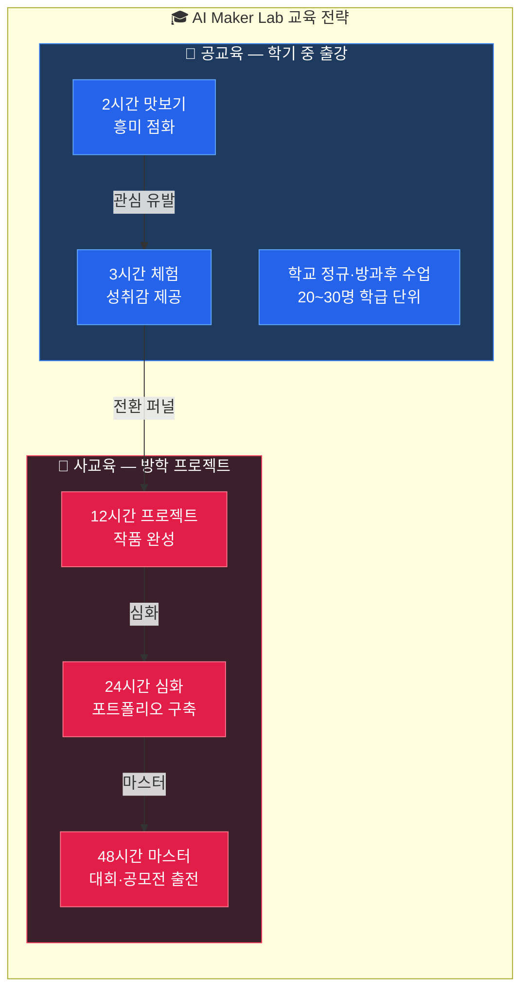

### 1.2 핵심 차별점

| 구분 | 공교육 출강 | 사교육 프로젝트 |
|------|-----------|---------------|
| **목적** | 흥미 유발 · AI 첫 경험 | 실력 향상 · 작품 완성 |
| **시수** | 2시간 / 3시간 | 12시간 / 24시간 / 48시간 |
| **인원** | 20~30명 (학급 단위) | 4~12명 (소규모 밀착) |
| **장소** | 학교 컴퓨터실 · 강당 | AI Maker Lab 교실 |
| **시기** | 학기 중 (3~6월, 9~11월) | 방학 (1~2월, 7~8월) |
| **결과물** | 간단한 체험 결과 | 완성된 프로젝트 · 포트폴리오 |
| **후속** | 사교육 전환 유도 | 정기반 · 대회 출전 |
| **교구** | 학교 PC + 웹 기반 | 전용 교구 (ESP32, 라즈베리파이 등) |
| **강사** | 1~2명 | 1~2명 (1:4~6 밀착) |
| **평가** | 참여도 · 흥미도 설문 | 프로젝트 완성도 · 발표 평가 |

---

## 2. 연간 운영 캘린더

### 2.1 월별 전략 로드맵

| 월 | 시장 | 핵심 활동 | 대상 프로그램 |
|----|------|----------|-------------|
| **1월** | 🎒 사교육 | 겨울 방학 프로젝트 캠프 | 블록코딩·아두이노·바이브 코딩 |
| **2월** | 🎒 사교육 | 겨울 방학 프로젝트 캠프 (연장) | 라즈베리파이·심화 제작 |
| **3월** | 🏫 공교육 | 1학기 출강 시작 · 학교 영업 | 블록코딩 AI (2h 맛보기) |
| **4월** | 🏫 공교육 | 학교 출강 수업 본격 운영 | 블록코딩·앱 인벤터 (2~3h) |
| **5월** | 🏫 공교육 | 학교 출강 + 여름 캠프 사전 모집 | 전 프로그램 체험 |
| **6월** | 🏫 공교육 | 1학기 마무리 + 여름 캠프 확정 | 체험→캠프 전환 |
| **7월** | 🎒 사교육 | 여름 방학 프로젝트 캠프 시작 | 블록코딩·아두이노·바이브 코딩 |
| **8월** | 🎒 사교육 | 여름 방학 프로젝트 캠프 (심화) | 라즈베리파이·앱 인벤터·심화 |
| **9월** | 🏫 공교육 | 2학기 출강 시작 | 블록코딩·앱 인벤터 (2~3h) |
| **10월** | 🏫 공교육 | 학교 출강 + 겨울 캠프 사전 모집 | 아두이노·바이브 코딩 체험 |
| **11월** | 🏫 공교육 | 2학기 마무리 + 겨울 캠프 확정 | 체험→캠프 전환 |
| **12월** | 🎒 사교육 | 겨울 방학 프로젝트 캠프 준비 | 교구 준비·커리큘럼 업데이트 |

### 2.2 연간 사이클 흐름도

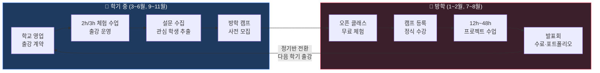

### 2.3 시즌별 매출 비중 목표

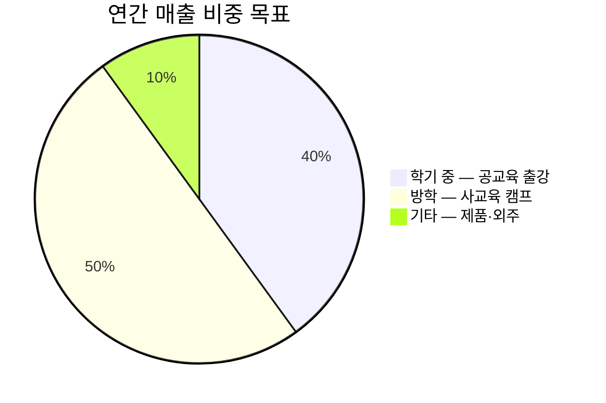

---

## 3. 시수별 교육 설계 원칙

### 시수별 교육 단계 구조도

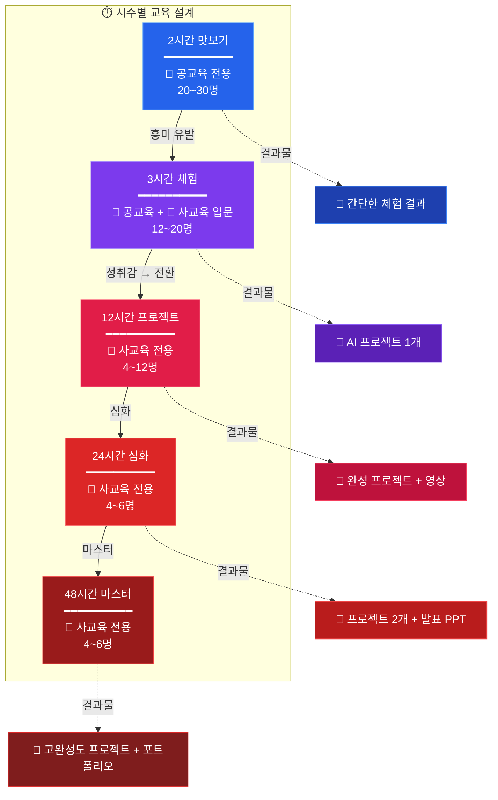

### 3.1 2시간 맛보기 (공교육 전용)

> **"와, AI가 이런 것도 하네!"** — 흥미 점화

| 항목 | 내용 |
|------|------|
| **목적** | AI 기술 첫 경험, 흥미 유발 |
| **구성** | 데모 시연(30분) → 따라하기 체험(60분) → 정리·공유(30분) |
| **장소** | 학교 컴퓨터실 (PC + 인터넷만 필요) |
| **인원** | 20~30명 (학급 단위) |
| **준비물** | 웹캠 내장 노트북 또는 PC, Chrome 브라우저 |
| **결과물** | 간단한 AI 모델 체험 결과 (스크린 캡처) |
| **후속** | 3시간 체험 또는 방학 캠프 안내 전단지 배포 |

#### 2시간 맛보기 수업 흐름도

#### 2시간 맛보기 시간 배분

| 시간 | 활동 | 세부 내용 |
|------|------|----------|
| 0:00~0:05 | 인사 · 동기부여 | AI 활용 사례 영상 (1분), 오늘 만들 것 미리보기 |
| 0:05~0:30 | 강사 데모 | 완성된 AI 게임 시연, "이걸 여러분이 직접 만듭니다" |
| 0:30~0:50 | 따라하기 ① | AI 모델 학습 (Teachable Machine / DWAI) |
| 0:50~1:00 | 쉬는 시간 | 자유 탐색 · 질문 시간 |
| 1:00~1:30 | 따라하기 ② | 게임/앱에 AI 모델 연결 · 테스트 |
| 1:30~1:50 | 작품 공유 | 친구들에게 시연 · 투표 |
| 1:50~2:00 | 마무리 | 성찰 한 줄, 방학 캠프 안내, 설문 |

### 3.2 3시간 체험 (공교육 + 사교육 입문)

> **"내가 직접 AI를 만들었다!"** — 성취감 제공

| 항목 | 내용 |
|------|------|
| **목적** | 하나의 완성된 프로젝트를 스스로 만들기 |
| **구성** | 제품 분석(30분) → 설계(30분) → 제작(90분) → 발표·성찰(30분) |
| **장소** | 학교 컴퓨터실 또는 AI Maker Lab |
| **인원** | 12~20명 |
| **준비물** | 웹캠 내장 노트북, 프로젝트별 교구 (마이크로비트 등) |
| **결과물** | 작동하는 AI 프로젝트 1개 |
| **후속** | 심화 수업 안내, 포트폴리오 기록용 사진 제공 |

#### 3시간 체험 역공학 4단계 흐름도

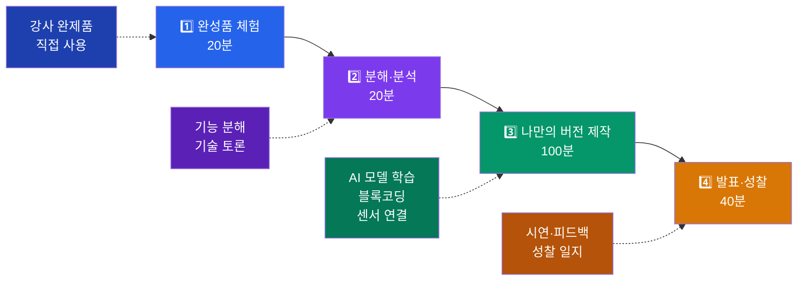

#### 3시간 체험 시간 배분 (역공학 방식)

| 시간 | 단계 | 활동 | 세부 내용 |
|------|------|------|----------|
| 0:00~0:10 | 역공학 | 완성품 체험 | 강사가 만든 완제품 직접 사용해보기 |
| 0:10~0:30 | 분석 | "어떻게 만들었을까?" | 기능 분해, 필요 기술 토론 |
| 0:30~0:50 | 기획 | 나만의 버전 설계 | 아이디어 스케치, 기능 정의 |
| 0:50~1:00 | 쉬는 시간 | — | — |
| 1:00~1:30 | 제작 ① | AI 모델 학습 | 데이터 수집 → 학습 → 테스트 |
| 1:30~2:00 | 제작 ② | 프로그래밍 | 블록코딩/앱 연결, 센서 연결 |
| 2:00~2:10 | 쉬는 시간 | — | — |
| 2:10~2:40 | 완성 | 테스트 · 디버깅 | 작품 완성, 오류 수정 |
| 2:40~2:55 | 발표 | 시연 · 피드백 | 3팀 발표, 동료 평가 |
| 2:55~3:00 | 성찰 | 배운 점 정리 | 성찰 일지, 다음 단계 안내 |

### 3.3 12시간+ 프로젝트 (사교육 전용)

> **"기획부터 완성까지, 나만의 포트폴리오"** — 심화 몰입

| 항목 | 내용 |
|------|------|
| **목적** | 실전 프로젝트 완성 · 포트폴리오 구축 |
| **구성** | 기획(2h) → 프로토타입(4h) → 개발(4h) → 테스트·발표(2h) |
| **장소** | AI Maker Lab 교실 |
| **인원** | 4~12명 (1:4~6 밀착 지도) |
| **준비물** | 전용 교구 세트 (프로그램별 상이) |
| **결과물** | 완성 프로젝트 + 발표 자료 + 포트폴리오 문서 |
| **후속** | 정기반 전환, 대회/공모전 출전 |

#### 12시간 프로젝트 3일 과정 흐름도

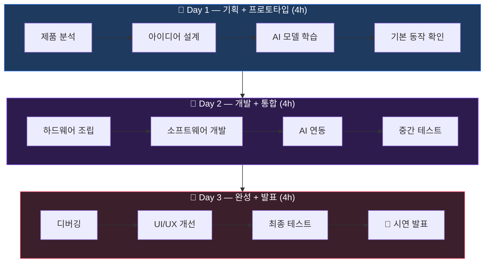

#### 12시간 프로젝트 일정 패턴 (3일 × 4시간)

| 일차 | 시간 | 단계 | 활동 |
|------|------|------|------|
| **Day 1** | 4시간 | 기획 + 프로토타입 | 제품 분석 → 아이디어 설계 → AI 모델 학습 → 기본 동작 확인 |
| **Day 2** | 4시간 | 개발 + 통합 | 하드웨어 조립 → 소프트웨어 개발 → AI 연동 → 중간 테스트 |
| **Day 3** | 4시간 | 완성 + 발표 | 디버깅 → UI/UX 개선 → 최종 테스트 → 발표 준비 → 시연 발표 |

#### 24시간 프로젝트 일정 패턴 (6일 × 4시간)

| 일차 | 시간 | 단계 | 활동 |
|------|------|------|------|
| **Day 1** | 4시간 | 탐구 | 실제 제품/서비스 분석, 기술 조사 |
| **Day 2** | 4시간 | 기획 | 프로젝트 기획서 작성, 기능 정의 |
| **Day 3** | 4시간 | 프로토타입 | AI 모델 학습, 기본 프로토타입 제작 |
| **Day 4** | 4시간 | 개발 ① | 핵심 기능 개발, 하드웨어 + 소프트웨어 통합 |
| **Day 5** | 4시간 | 개발 ② | 추가 기능 구현, 테스트 및 디버깅 |
| **Day 6** | 4시간 | 완성 | UI/UX 마무리, 발표 자료 제작, 최종 시연 |

#### 48시간 프로젝트 일정 패턴 (12일 × 4시간)

| 주차 | 시간 | 단계 | 활동 |
|------|------|------|------|
| **1주** (Day 1~3) | 12시간 | 탐구 + 기획 | 시장 조사, 벤치마킹, 기획서 작성, 기술 스택 결정 |
| **2주** (Day 4~6) | 12시간 | AI 모델 + 프로토타입 | 데이터 수집, AI 모델 학습/평가, MVP 제작 |
| **3주** (Day 7~9) | 12시간 | 핵심 개발 | 프론트엔드/백엔드 개발, 하드웨어 조립, 시스템 통합 |
| **4주** (Day 10~12) | 12시간 | 테스트 + 발표 | QA, 최적화, 포트폴리오 문서화, 최종 발표회 |

---

## 4. 공교육 전략 — 학기 중 출강

### 4.1 타겟 기관

| 기관 유형 | 대상 | 접근 방법 |
|----------|------|----------|
| **초등학교** | 4~6학년 | 방과후 수업, 창의적 체험활동, 자유학기 연계 |
| **중학교** | 1~3학년 | 자유학기제/자유학년제 수업, 진로 체험 |
| **고등학교** | 1~2학년 | 동아리 활동, 진로 탐색 수업, 정보 교과 연계 |
| **교육청/지자체** | 전 학년 | 창의융합교육, 디지털 리터러시 프로그램 |
| **도서관/문화센터** | 초~중등 | 특강, 방학 프로그램 |

### 4.2 공교육 출강 프로그램 라인업

#### A. 2시간 맛보기 프로그램 (4종)

| 코드 | 프로그램명 | 대상 | 핵심 체험 | 준비물 |
|------|-----------|------|----------|--------|
| PUB-2H-01 | **AI가 나를 알아본다!** | 초4~6 | Teachable Machine으로 얼굴/물체 인식 | PC + 웹캠 + Chrome |
| PUB-2H-02 | **AI 가위바위보 대결** | 초4~중1 | DWAI로 손 인식 게임 만들기 | PC + 웹캠 + Chrome |
| PUB-2H-03 | **나만의 AI 앱 만들기** | 중1~3 | 앱 인벤터로 간단한 앱 체험 | PC + Chrome + 안드로이드 폰(선택) |
| PUB-2H-04 | **AI로 웹사이트 만들기** | 중3~고2 | V0 + ChatGPT로 웹페이지 생성 체험 | PC + Chrome + ChatGPT 계정 |

#### B. 3시간 체험 프로그램 (6종)

| 코드 | 프로그램명 | 대상 | 프로젝트 | 준비물 |
|------|-----------|------|---------|--------|
| PUB-3H-01 | **블록코딩 AI: 마스크 인식 게임** | 초4~6 | DWAI + Teachable Machine | PC + 웹캠 |
| PUB-3H-02 | **블록코딩 AI: 가위바위보 게임** | 초4~6 | DWAI + 손 인식 AI | PC + 웹캠 |
| PUB-3H-03 | **블록코딩 AI: 물체 분류 게임** | 초5~중1 | DWAI + 물체 인식 AI | PC + 웹캠 |
| PUB-3H-04 | **블록코딩 AI + 마이크로비트** | 초5~중2 | AI 연동 LED/부저 제어 | PC + 웹캠 + 마이크로비트 |
| PUB-3H-05 | **앱 인벤터 AI 앱 만들기** | 중1~3 | 블록 코딩으로 안드로이드 앱 | PC + Chrome |
| PUB-3H-06 | **바이브 코딩: AI 동화책** | 중2~고1 | ChatGPT + DALL-E 동화책 제작 | PC + ChatGPT 계정 |

### 4.3 공교육 출강 운영 가이드

#### 사전 준비 체크리스트

- [ ] 학교 컴퓨터실 사전 답사 (PC 사양, 인터넷 속도, 웹캠 유무)
- [ ] 학교 방화벽 확인 (DWAI, Teachable Machine, ChatGPT 접속 가능 여부)
- [ ] 학생 수 확인 (2인 1팀 구성 가능 여부)
- [ ] 교사용 지도안 사전 전달
- [ ] 학생용 워크시트 인쇄 (또는 디지털 배포)
- [ ] 여분 교구 (마이크로비트 여분 2~3개, USB 케이블)
- [ ] 방학 캠프 안내 전단지 준비
- [ ] 설문지 준비 (수업 만족도 + 심화 수업 관심도)

#### 대규모 수업 운영 팁 (20~30명)

| 전략 | 내용 |
|------|------|
| **2인 1팀** | 모든 활동을 페어로 진행, 한 명이 조작·한 명이 기록 |
| **단계별 동기화** | 전체가 같은 단계에 있도록 타이머 활용 |
| **화면 공유** | 강사 화면을 빔프로젝터로 실시간 중계 |
| **도우미 학생** | 빨리 끝난 학생을 "미니 강사"로 활용 |
| **트러블슈팅 카드** | 자주 묻는 질문 FAQ 카드를 각 책상에 배치 |
| **갤러리 워크** | 마지막 15분, 돌아다니며 서로 작품 감상 |

---

## 5. 사교육 전략 — 방학 프로젝트

### 5.1 방학 캠프 운영 모델

#### A. 여름 방학 캠프 (7~8월)

| 기간 | 프로그램 | 대상 | 인원 | 시수 |
|------|---------|------|------|------|
| 7월 1주 | 블록코딩 AI 비전 입문 | 초4~6 | 8~12명 | 12시간 (3일×4h) |
| 7월 2주 | 아두이노 AI IoT | 중1~3 | 6~8명 | 12시간 (3일×4h) |
| 7월 3주 | 앱 인벤터 AI 앱 | 중1~3 | 6~8명 | 12시간 (3일×4h) |
| 7월 4주 | 바이브 AI 코딩 | 중2~고1 | 6~8명 | 12시간 (3일×4h) |
| 8월 1주 | 라즈베리파이 자율주행 | 중3~고2 | 4~6명 | 24시간 (6일×4h) |
| 8월 2~3주 | AI 심화 제작 프로젝트 | 고1~2 | 4~6명 | 48시간 (12일×4h) |
| 8월 4주 | 방학 프로젝트 발표회 | 전체 | 전원 | 3시간 |

#### B. 겨울 방학 캠프 (1~2월)

| 기간 | 프로그램 | 대상 | 인원 | 시수 |
|------|---------|------|------|------|
| 1월 1~2주 | 블록코딩 + 아두이노 통합 | 초5~중2 | 6~8명 | 24시간 (6일×4h) |
| 1월 3~4주 | 바이브 코딩 + 앱 인벤터 | 중2~고1 | 6~8명 | 24시간 (6일×4h) |
| 2월 1~3주 | 라즈베리파이 + 심화 제작 | 중3~고2 | 4~6명 | 48시간 (12일×4h) |
| 2월 4주 | 겨울 프로젝트 발표회 | 전체 | 전원 | 3시간 |

### 5.2 프로젝트 결과물 목표

| 시수 | 결과물 | 포트폴리오 포함 항목 |
|------|--------|-------------------|
| **12시간** | 작동하는 프로젝트 1개 | 프로젝트 기획서, 작동 영상, 성찰 일지 |
| **24시간** | 완성된 프로젝트 1개 + 발표 자료 | 기획서, 설계도, 소스코드, 시연 영상, 발표 PPT |
| **48시간** | 고완성도 프로젝트 + 포트폴리오 | 기획서, 기술 문서, 소스코드, 데모 영상, 보고서, 발표 PPT |

### 5.3 방학 캠프 하루 일과표 (4시간 수업 기준)

| 시간 | 활동 | 비고 |
|------|------|------|
| 09:00~09:10 | 출석 · 오늘 목표 설정 | 어제 복습, 오늘 할 일 공유 |
| 09:10~10:30 | 핵심 수업 ① | 새로운 개념 · 기술 학습 |
| 10:30~10:45 | 쉬는 시간 | 간식 |
| 10:45~12:00 | 핵심 수업 ② | 프로젝트 작업 · 실습 |
| 12:00~12:50 | 점심 시간 | — |
| 12:50~13:00 | 오늘 정리 · 내일 예고 | 성찰 한 줄 기록, 질문 |

---

## 6. 프로그램별 공교육·사교육 매핑

### 6개 프로그램 시수별 배치도

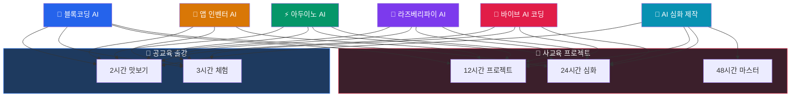

### 6.1 블록코딩 AI 비전 (DWAI)

| 구분 | 공교육 | 사교육 |
|------|--------|--------|
| **2시간 맛보기** | AI 얼굴/손 인식 체험 (DWAI 데모) | — |
| **3시간 체험** | 마스크 인식·가위바위보·물체분류 중 택1 | 입문 체험 |
| **12시간 프로젝트** | — | 초급~고급 프로젝트 1개 완성 |
| **24시간 심화** | — | 중급+고급 프로젝트 2개 + 마이크로비트 연동 |

**공교육 추천 모듈 (블록코딩)**
- 초급 A: 마스크 인식 게임 (초4~5)
- 초급 B: 가위바위보 게임 (초4~6) ⭐ 가장 인기
- 초급 C: 물체 분류 게임 (초5~6)

**사교육 추천 모듈 (블록코딩)**
- 중급 A~C: 마이크로비트 연동 프로젝트 (초5~중2)
- 고급 A~C: IoT 시스템 프로젝트 (중1~3)

### 6.2 아두이노 AI 코딩

| 구분 | 공교육 | 사교육 |
|------|--------|--------|
| **2시간 맛보기** | ESP32 LED 제어 데모 + 센서 체험 | — |
| **3시간 체험** | 스마트 홈 미니 프로젝트 | 입문 체험 |
| **12시간 프로젝트** | — | 5대 프로젝트 중 택1 |
| **24시간 심화** | — | 프로젝트 2개 연속 + AI 연동 |

**5대 프로젝트 (아두이노)**
1. 🏠 스마트 홈 — 온습도 모니터링 + LED/릴레이 자동 제어
2. 🚗 스마트 카 — 모터 제어 + 장애물 감지 + 라인트레이싱
3. 🚧 스마트 게이트 — 서보모터 + 거리 센서 + 앱 제어
4. 🤖 로봇 팔 — 서보모터 4축 + 앱 인벤터 조종기
5. 🌿 스마트 더스트 — 미세먼지 센서 + OLED + 알림

### 6.3 라즈베리파이 AI 코딩

| 구분 | 공교육 | 사교육 |
|------|--------|--------|
| **2시간 맛보기** | 라즈베리파이 소개 + Python 기초 체험 | — |
| **3시간 체험** | 스마트 팜 센서 데이터 읽기 | 입문 체험 |
| **12시간 프로젝트** | — | 스마트 팜 or 자율주행차 택1 |
| **24시간 심화** | — | 두 프로젝트 모두 + AI 모델 연동 |

**2대 프로젝트 (라즈베리파이)**
1. 🌱 스마트 팜 — 전북대 협력, 센서+카메라+자동 관수
2. 🚙 자율 주행차 — 가천대 협력, OpenCV+라인트레이싱+장애물 회피

### 6.4 앱 인벤터 AI 코딩

| 구분 | 공교육 | 사교육 |
|------|--------|--------|
| **2시간 맛보기** | 앱 인벤터 UI 만들기 체험 | — |
| **3시간 체험** | 간단한 퀴즈 앱 완성 | 입문 체험 |
| **12시간 프로젝트** | — | AI 비서 앱 or IoT 제어 앱 완성 |

**시수별 커리큘럼 (앱 인벤터)**
- 3시간 체험: 기본 UI + 버튼·텍스트 + 간단한 앱 1개
- 6시간 기본: 센서 활용 + AI 연계 + 앱 2개
- 12시간 심화: API 연동 + ESP32 통신 + 완성 앱 포트폴리오

### 6.5 바이브 AI 코딩

| 구분 | 공교육 | 사교육 |
|------|--------|--------|
| **2시간 맛보기** | ChatGPT로 동화 이야기 만들기 | — |
| **3시간 체험** | AI 동화책 완성 (ChatGPT + DALL-E) | 입문 체험 |
| **12시간 프로젝트** | — | 3대 프로젝트 중 택1 |
| **16시간 심화** | — | 프로젝트 + 2단계 자동화 (API 연동) |

**3대 프로젝트 (바이브 코딩)**
1. 📖 동화책 만들기 — ChatGPT 스토리 + DALL-E 삽화 + 웹 동화책
2. 🗣️ 화상 영어 학습 — ChatGPT API + 음성 인식 + 대화형 영어 학습
3. 🎮 감정 방탈출 게임 — 표정 인식 AI + 웹 게임 + 감정 분석

### 6.6 AI 심화 제작 코딩

| 구분 | 공교육 | 사교육 |
|------|--------|--------|
| **2시간 맛보기** | AI 서비스 데모 체험 (진로 탐색) | — |
| **3시간 체험** | — (난이도 높아 체험 부적합) | — |
| **12시간 프로젝트** | — | IoT 기초 or 바이브 코딩 서비스 |
| **24시간 심화** | — | IoT 중급 or 바이브 중급 |
| **48시간 마스터** | — | IoT 고급 풀 프로젝트 |

---

## 7. 공교육 상세 커리큘럼

### 7.1 [PUB-2H-01] AI가 나를 알아본다! (2시간)

| 항목 | 내용 |
|------|------|
| **대상** | 초등 4~6학년 |
| **목표** | AI 이미지 인식의 원리를 체험하고 나만의 AI 모델 만들기 |
| **도구** | Teachable Machine (Google) |
| **준비물** | PC + 웹캠 + Chrome 브라우저 |
| **인원** | 20~30명 (2인 1팀) |

| 시간 | 활동 | 세부 내용 |
|------|------|----------|
| 0:00~0:05 | 도입 | "AI는 어떻게 사람을 알아볼까?" 질문 던지기 |
| 0:05~0:15 | 데모 | 강사의 얼굴 인식 AI 시연 (이름표 띄우기) |
| 0:15~0:25 | 개념 | AI 학습 3단계 설명 (데이터 수집 → 학습 → 예측) |
| 0:25~0:50 | 실습 ① | Teachable Machine에서 "나" vs "친구" 인식 모델 만들기 |
| 0:50~1:00 | 쉬는 시간 | 자유 탐색 |
| 1:00~1:25 | 실습 ② | 물건 인식 모델로 확장 (연필 vs 지우개 vs 가위) |
| 1:25~1:45 | 공유 | 팀별로 만든 AI 모델 시연, "가장 정확한 AI" 투표 |
| 1:45~2:00 | 마무리 | AI가 잘 못하는 경우 토론, 성찰, 캠프 안내 |

### 7.2 [PUB-2H-02] AI 가위바위보 대결 (2시간)

| 항목 | 내용 |
|------|------|
| **대상** | 초등 4학년 ~ 중등 1학년 |
| **목표** | DWAI 플랫폼에서 손 인식 AI 게임 만들기 |
| **도구** | DWAI (DancingwithAI) |
| **준비물** | PC + 웹캠 + Chrome 브라우저 |

| 시간 | 활동 | 세부 내용 |
|------|------|----------|
| 0:00~0:05 | 도입 | AI와 가위바위보 대결 시연 (학생 vs AI) |
| 0:05~0:20 | 체험 | 완성된 가위바위보 게임 플레이 |
| 0:20~0:30 | 분석 | "AI가 어떻게 손 모양을 구분할까?" 토론 |
| 0:30~0:55 | 제작 ① | DWAI에서 가위·바위·보 데이터 촬영 (각 30장) |
| 0:55~1:05 | 쉬는 시간 | — |
| 1:05~1:30 | 제작 ② | AI 모델 학습 → 게임 블록 코딩 연결 |
| 1:30~1:50 | 대회 | 팀별 AI 가위바위보 대결 토너먼트 |
| 1:50~2:00 | 마무리 | 우승팀 시상, "AI를 더 똑똑하게 만들려면?" 토론 |

### 7.3 [PUB-2H-03] 나만의 AI 앱 만들기 (2시간)

| 항목 | 내용 |
|------|------|
| **대상** | 중등 1~3학년 |
| **목표** | 앱 인벤터로 간단한 안드로이드 앱 체험 |
| **도구** | MIT App Inventor 2 |
| **준비물** | PC + Chrome + Gmail 계정 |

| 시간 | 활동 | 세부 내용 |
|------|------|----------|
| 0:00~0:10 | 도입 | 학생들이 매일 쓰는 앱 이야기 → "직접 만들 수 있다!" |
| 0:10~0:25 | 데모 | 강사가 만든 퀴즈 앱 시연 |
| 0:25~0:55 | 제작 ① | 앱 인벤터 접속, 화면 디자인 (버튼, 텍스트, 이미지 배치) |
| 0:55~1:05 | 쉬는 시간 | — |
| 1:05~1:40 | 제작 ② | 블록 코딩으로 동작 연결 (버튼 → 소리, 화면 전환) |
| 1:40~1:55 | 공유 | QR코드로 친구 폰에 설치 시연 |
| 1:55~2:00 | 마무리 | 심화 앱 만들기 소개, 캠프 안내 |

### 7.4 [PUB-2H-04] AI로 웹사이트 만들기 (2시간)

| 항목 | 내용 |
|------|------|
| **대상** | 중등 3학년 ~ 고등 2학년 |
| **목표** | V0 + ChatGPT로 나만의 웹사이트 생성 체험 |
| **도구** | V0 (Vercel), ChatGPT |
| **준비물** | PC + Chrome + ChatGPT 계정 |

| 시간 | 활동 | 세부 내용 |
|------|------|----------|
| 0:00~0:10 | 도입 | "코딩 없이 웹사이트를 만들 수 있다?" 사례 소개 |
| 0:10~0:25 | 데모 | V0에 프롬프트 입력 → 웹사이트 즉시 생성 시연 |
| 0:25~0:55 | 체험 ① | 나만의 자기소개 웹페이지 생성 (프롬프트 작성법) |
| 0:55~1:05 | 쉬는 시간 | — |
| 1:05~1:35 | 체험 ② | 웹페이지 수정·커스터마이징 (색상, 레이아웃, 내용) |
| 1:35~1:55 | 공유 | 만든 웹사이트 URL 공유, 동료 투표 |
| 1:55~2:00 | 마무리 | 바이브 코딩 심화 과정 소개 |

### 7.5 [PUB-3H-01~06] 3시간 체험 공통 구조

모든 3시간 체험 프로그램은 **역공학 4단계**를 따릅니다:

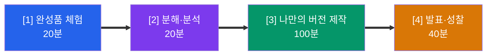

#### 3시간 프로그램별 프로젝트 결과물

| 코드 | 프로그램 | 완성 결과물 |
|------|---------|-----------|
| PUB-3H-01 | 마스크 인식 게임 | DWAI에서 마스크 착용 여부 판별하는 게임 |
| PUB-3H-02 | 가위바위보 게임 | DWAI에서 손 모양 인식 + 점수 시스템 |
| PUB-3H-03 | 물체 분류 게임 | Teachable Machine + 분류 퀴즈 게임 |
| PUB-3H-04 | AI + 마이크로비트 | AI 인식 결과에 따라 LED/부저 반응 |
| PUB-3H-05 | AI 앱 인벤터 | 음성 인식 또는 이미지 분류 앱 |
| PUB-3H-06 | AI 동화책 | ChatGPT 스토리 + DALL-E 삽화 웹 동화책 |

---

## 8. 사교육 상세 커리큘럼

### 8.1 [PRV-12H] 12시간 프로젝트 과정 (6종)

#### PRV-12H-BC: 블록코딩 AI 비전

| 일차 | 시간 | 주제 | 활동 |
|------|------|------|------|
| Day 1 | 4h | 역공학 + AI 모델 | 완성품 분석 → 아이디어 기획 → Teachable Machine 데이터 수집·학습 → 정확도 테스트 |
| Day 2 | 4h | 블록코딩 + 연동 | DWAI 블록코딩 → AI 모델 연결 → 게임 로직 구현 → 마이크로비트 연동(중급 이상) |
| Day 3 | 4h | 완성 + 발표 | UI 꾸미기 → 디버깅 → 최종 테스트 → 발표 준비 → 시연 발표 → 성찰 일지 |

**준비물**: PC+웹캠, Chrome, 마이크로비트 V2(중급), 브레드보드+센서(고급)

#### PRV-12H-AD: 아두이노 AI IoT

| 일차 | 시간 | 주제 | 활동 |
|------|------|------|------|
| Day 1 | 4h | ESP32 기초 + 회로 | ESP32 환경 설정 → LED/센서 기초 → 브레드보드 회로 구성 → 첫 IoT 동작 확인 |
| Day 2 | 4h | 프로젝트 개발 | 선택 프로젝트(5종) 핵심 기능 개발 → 센서 데이터 수집 → 앱 인벤터 연동 |
| Day 3 | 4h | AI 연동 + 완성 | ESP32-CAM 카메라 연결 → AI 모델 연동 → 최종 통합 테스트 → 발표 |

**준비물**: ESP32-CAM, 브레드보드, 점퍼선, 센서키트, USB 케이블, 개인 노트북

#### PRV-12H-RP: 라즈베리파이 AI

| 일차 | 시간 | 주제 | 활동 |
|------|------|------|------|
| Day 1 | 4h | 라즈베리파이 기초 | OS 설치 → Python 기초 → GPIO 핀 제어 → LED/센서 연결 |
| Day 2 | 4h | 프로젝트 핵심 개발 | 스마트 팜: 센서+카메라+자동관수 / 자율주행차: 모터+라인트레이싱 |
| Day 3 | 4h | AI 연동 + 발표 | OpenCV 카메라 → AI 모델 연동 → 자동화 구현 → 시연 발표 |

**준비물**: Raspberry Pi 4 (4GB+), SD 카드, 전원, 센서키트, 카메라 모듈

#### PRV-12H-AI: 앱 인벤터 AI 심화

| 일차 | 시간 | 주제 | 활동 |
|------|------|------|------|
| Day 1 | 4h | 앱 인벤터 기초 | UI 디자인 → 블록 코딩 기초 → 화면 전환 → 데이터 저장 |
| Day 2 | 4h | AI 기능 연동 | 음성 인식 → 이미지 분류 → API 호출 → 센서 활용 |
| Day 3 | 4h | 프로젝트 완성 | 기획한 앱 완성 → 실기기 테스트 → APK 빌드 → 발표 |

**준비물**: PC+Chrome, Gmail 계정, 안드로이드 폰/태블릿(선택)

#### PRV-12H-VC: 바이브 AI 코딩

| 일차 | 시간 | 주제 | 활동 |
|------|------|------|------|
| Day 1 | 4h | ChatGPT 활용 기초 | 프롬프트 엔지니어링 → 스토리/콘텐츠 생성 → DALL-E 이미지 생성 |
| Day 2 | 4h | 프로젝트 개발 | 동화책/영어학습/감정게임 택1 → 콘텐츠 제작 → 웹 구현 |
| Day 3 | 4h | 완성 + 공유 | 디자인 마무리 → 배포 → 사용자 테스트 → 발표 |

**준비물**: PC+Chrome, ChatGPT 계정(Plus 권장), 노션/구글 문서

#### PRV-12H-AC: AI 심화 제작 (IoT 트랙)

| 일차 | 시간 | 주제 | 활동 |
|------|------|------|------|
| Day 1 | 4h | 벤치마킹 + 기획 | 실제 IoT 제품 분석 → 프로젝트 기획서 작성 → 기술 스택 선정 |
| Day 2 | 4h | 프로토타입 개발 | 하드웨어 조립 → 센서 연동 → AI 모델 학습 → MVP 제작 |
| Day 3 | 4h | 통합 + 발표 | 시스템 통합 → 테스트 → 문서화 → 발표 |

**준비물**: ESP32/라즈베리파이, 센서키트, 개인 노트북, Python 환경

### 8.2 [PRV-24H] 24시간 심화 과정 (4종)

| 코드 | 프로그램 | 대상 | 내용 |
|------|---------|------|------|
| PRV-24H-BC | 블록코딩 통합 | 초5~중2 | 초급~고급 프로젝트 2~3개 연속 완성 + 마이크로비트 IoT 시스템 |
| PRV-24H-AD | 아두이노 심화 | 중1~고1 | 5대 프로젝트 중 2개 선택 + AI 카메라 연동 + 앱 인벤터 제어 |
| PRV-24H-RP | 라즈베리파이 심화 | 중3~고2 | 스마트 팜 + 자율주행차 두 프로젝트 모두 + AI 모델 커스텀 |
| PRV-24H-VC | 바이브 코딩 심화 | 중2~고2 | 3대 프로젝트 중 2개 + ChatGPT API 자동화 (2단계) |

### 8.3 [PRV-48H] 48시간 마스터 과정 (2종)

| 코드 | 프로그램 | 대상 | 내용 |
|------|---------|------|------|
| PRV-48H-IOT | IoT AI 마스터 | 고1~2 | 기획→설계→개발→테스트→발표 풀 사이클, 고완성도 IoT+AI 프로젝트 |
| PRV-48H-FULL | AI 융합 마스터 | 고1~2 | IoT 트랙 + 바이브 코딩 트랙 모두 경험, 2개 프로젝트 포트폴리오 |

---

## 9. 교구재 및 준비물 총정리

### 9.1 공교육 출강 교구재 (학교 인프라 활용)

| 구분 | 필수 | 강사 지참 | 학교 제공 |
|------|------|----------|----------|
| **2시간 맛보기** | PC + 웹캠 + Chrome + 인터넷 | 여분 웹캠 2~3개, 교재, 전단지 | 컴퓨터실, 빔프로젝터 |
| **3시간 체험 (SW)** | PC + 웹캠 + Chrome + 인터넷 | 교재, 워크시트, 전단지 | 컴퓨터실, 빔프로젝터 |
| **3시간 체험 (HW)** | PC + 웹캠 + Chrome + 인터넷 | 마이크로비트 세트 (팀당 1개), USB 케이블, 교재 | 컴퓨터실, 빔프로젝터 |

### 9.2 사교육 교구재 (AI Maker Lab 자체 보유)

| 프로그램 | 교구재 목록 | 1인당 수량 |
|---------|-----------|-----------|
| **블록코딩 AI** | 웹캠 노트북, 마이크로비트 V2, USB 케이블, 브레드보드, LED/부저/서보모터 | 1세트 (2인 공유 가능) |
| **아두이노 AI** | ESP32-CAM, 브레드보드, 점퍼선, 센서키트(온습도·거리·모터·LED), USB 케이블, 전원 | 1세트 (개인) |
| **라즈베리파이 AI** | Raspberry Pi 4 (4GB), SD 카드(32GB), 전원 어댑터, 카메라 모듈, 센서키트, 모터/차체(자율주행) | 1세트 (개인) |
| **앱 인벤터 AI** | 노트북/태블릿, 안드로이드 테스트 기기, USB 케이블 | 1세트 (개인) |
| **바이브 AI 코딩** | 노트북 (13인치+), ChatGPT Plus 계정(또는 API 키) | 1세트 (개인) |
| **AI 심화 제작** | 노트북 (8GB RAM+), ESP32/라즈베리파이(트랙별), 센서키트, 개발도구 | 1세트 (개인) |

### 9.3 소프트웨어/플랫폼 요구사항

| 플랫폼 | 용도 | 계정 필요 | 비용 |
|--------|------|----------|------|
| DWAI (DancingwithAI) | 블록코딩 AI 게임 제작 | 무료 | 무료 |
| Teachable Machine | AI 이미지 인식 모델 학습 | Google 계정 | 무료 |
| MakeCode / Python Editor | 마이크로비트 프로그래밍 | 불필요 | 무료 |
| MIT App Inventor 2 | 안드로이드 앱 제작 | Gmail 계정 | 무료 |
| Arduino IDE | ESP32 프로그래밍 | 불필요 | 무료 |
| Python + OpenCV | 컴퓨터 비전 · AI 연동 | 불필요 | 무료 |
| ChatGPT | AI 대화 · 콘텐츠 생성 | OpenAI 계정 | 무료/Plus |
| V0 (Vercel) | AI 웹사이트 생성 | 계정 필요 | 무료/유료 |
| Cursor | AI 코드 에디터 | 계정 필요 | 무료/유료 |
| VNC Viewer | 라즈베리파이 원격 접속 | 불필요 | 무료 |

---

## 10. 비용 구조 및 견적 가이드

### 10.1 공교육 출강 비용

| 프로그램 | 시수 | 강사비 (1회) | 교구비 (1인) | 교재비 (1인) | 비고 |
|---------|------|-------------|-------------|-------------|------|
| 2시간 맛보기 (SW) | 2h | 협의 | 0원 (학교 PC 사용) | 1,000원 | 워크시트 인쇄 |
| 2시간 맛보기 (HW) | 2h | 협의 | 0원 (강사 지참) | 1,000원 | 마이크로비트 대여 |
| 3시간 체험 (SW) | 3h | 협의 | 0원 | 2,000원 | — |
| 3시간 체험 (HW) | 3h | 협의 | 0원 (강사 지참) | 2,000원 | 마이크로비트 대여 |

### 10.2 사교육 프로젝트 수강료 (참고 범위)

| 과정 | 시수 | 수강료 범위 | 교구 포함 | 인원 |
|------|------|-----------|----------|------|
| 12시간 블록코딩 | 3일×4h | 협의 | 마이크로비트 대여 | 8~12명 |
| 12시간 아두이노 | 3일×4h | 협의 | ESP32 키트 대여 | 6~8명 |
| 12시간 라즈베리파이 | 3일×4h | 협의 | RPi 키트 대여 | 4~6명 |
| 24시간 심화 | 6일×4h | 협의 | 전용 교구 대여 | 4~6명 |
| 48시간 마스터 | 12일×4h | 협의 | 전용 교구 대여 | 4~6명 |

---

## 11. 학년별 추천 로드맵

### 11.1 초등학생 (4~6학년)

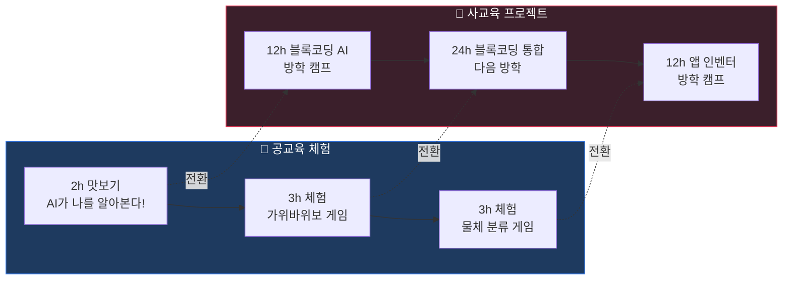

| 학년 | 공교육 추천 | 사교육 추천 |
|------|-----------|-----------|
| 초4 | PUB-2H-01 (AI 인식 맛보기) | PRV-12H-BC 초급 (마스크/가위바위보) |
| 초5 | PUB-3H-01~03 (블록코딩 체험) | PRV-12H-BC 중급 (마이크로비트 연동) |
| 초6 | PUB-3H-04 (AI+마이크로비트) | PRV-24H-BC (블록코딩 통합) |

### 11.2 중학생 (1~3학년)

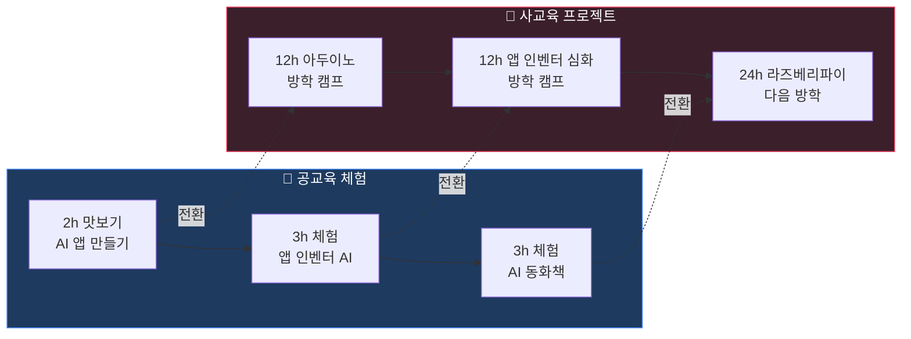

| 학년 | 공교육 추천 | 사교육 추천 |
|------|-----------|-----------|
| 중1 | PUB-3H-03~05 (물체분류/앱인벤터) | PRV-12H-AD (아두이노 IoT) |
| 중2 | PUB-3H-05~06 (앱인벤터/바이브) | PRV-12H-VC (바이브 코딩) |
| 중3 | PUB-2H-04 (AI 웹사이트) | PRV-24H-RP (라즈베리파이 심화) |

### 11.3 고등학생 (1~2학년)

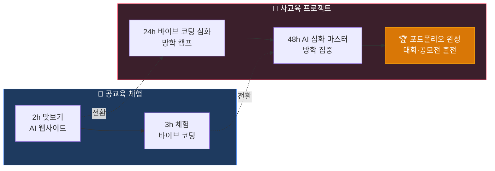

| 학년 | 공교육 추천 | 사교육 추천 |
|------|-----------|-----------|
| 고1 | PUB-2H-04 (AI 웹사이트 맛보기) | PRV-24H-VC (바이브 코딩 심화) |
| 고2 | — (자습/동아리) | PRV-48H (AI 융합 마스터) |

---

## 12. 공교육 → 사교육 전환 퍼널

### 12.1 전환 전략 단계

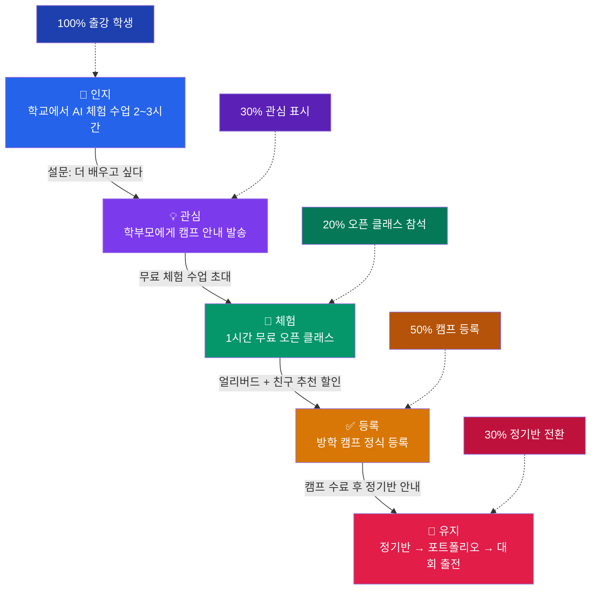

### 12.2 전환 촉진 도구

| 도구 | 용도 | 시점 |
|------|------|------|
| **설문지** | 심화 수업 관심도 조사, 학부모 연락처 수집 | 출강 수업 종료 시 |
| **전단지** | 방학 캠프 일정·프로그램 안내 | 출강 수업 종료 시 배포 |
| **체험 작품 사진** | 학생 작품 사진을 학부모에게 전송 | 출강 다음 날 |
| **오픈 클래스** | AI Maker Lab에서 1시간 무료 체험 | 시험 종료 후 주말 |
| **얼리버드 할인** | 조기 등록 인센티브 | 캠프 1개월 전 |
| **친구 추천** | 2인 이상 동시 등록 할인 | 상시 |
| **수료증** | 프로젝트 수료 인증서 (포트폴리오용) | 캠프 종료 시 |

### 12.3 전환율 목표

| 단계 | 목표 전환율 | 설명 |
|------|-----------|------|
| 출강 수업 → 관심 표시 | 30% | 설문 "더 배우고 싶다" 응답 |
| 관심 → 오픈 클래스 참석 | 20% | 무료 체험 수업 참석 |
| 오픈 클래스 → 캠프 등록 | 50% | 정식 수강 등록 |
| 캠프 수료 → 정기반 전환 | 30% | 지속 수강 |
| **전체 전환율** | **~3%** | 출강 30명 중 ~1명 |

---

## 13. 성과 지표 및 평가 기준

### 13.1 공교육 성과 지표

| 지표 | 측정 방법 | 목표 |
|------|----------|------|
| **수업 만족도** | 학생 설문 (5점 척도) | 4.0점 이상 |
| **AI 흥미도 변화** | 사전/사후 설문 비교 | +20% 이상 |
| **프로젝트 완성률** | 작동하는 결과물 제출 비율 | 90% 이상 |
| **심화 관심도** | "더 배우고 싶다" 응답 비율 | 30% 이상 |
| **재출강 요청** | 학교/기관 재요청 비율 | 50% 이상 |
| **학부모 연락처 수집** | 동의한 학부모 수 | 참가자의 20% |

### 13.2 사교육 성과 지표

| 지표 | 측정 방법 | 목표 |
|------|----------|------|
| **프로젝트 완성도** | 루브릭 평가 (기획·기술·창의·발표) | 평균 B+ 이상 |
| **포트폴리오 제출** | 완성된 포트폴리오 문서 수 | 100% |
| **수료율** | 전 과정 이수 비율 | 95% 이상 |
| **정기반 전환률** | 캠프 → 정기반 전환 비율 | 30% 이상 |
| **대회 출전** | 공모전/경진대회 참가 | 연 2회 이상 |
| **학부모 만족도** | 학부모 설문 (5점 척도) | 4.5점 이상 |
| **NPS (추천 점수)** | "주변에 추천하겠습니까?" | 70 이상 |

### 13.3 평가 흐름도

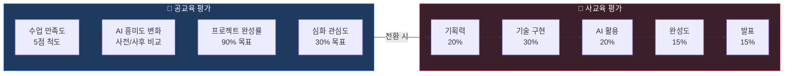

### 13.4 프로젝트 평가 루브릭 (12시간+ 과정)

| 평가 항목 | 비중 | A (탁월) | B (우수) | C (보통) |
|----------|------|---------|---------|---------|
| **기획력** | 20% | 독창적 아이디어 + 체계적 기획서 | 명확한 기획서 | 기본 기획 |
| **기술 구현** | 30% | 핵심+추가 기능 완성, 코드 품질 우수 | 핵심 기능 완성 | 기본 동작 구현 |
| **AI 활용** | 20% | AI 모델 커스텀 + 창의적 활용 | AI 기능 정상 동작 | 기본 AI 연동 |
| **완성도** | 15% | UI/UX 우수, 에러 없음 | 사용 가능 수준 | 일부 오류 존재 |
| **발표** | 15% | 명확한 시연 + 질의응답 | 시연 성공 | 기본 발표 |

---

## 📌 웹사이트 커리큘럼 링크

| 프로그램 | URL |
|---------|-----|
| 블록코딩 AI | https://aimakerlab.com/curriculum/block-coding |
| 아두이노 AI | https://aimakerlab.com/curriculum/arduino |
| 라즈베리파이 AI | https://aimakerlab.com/curriculum/raspberry-pi |
| 앱 인벤터 AI | https://aimakerlab.com/curriculum/app-inventor |
| 바이브 AI 코딩 | https://aimakerlab.com/curriculum/vive-coding |
| AI 심화 제작 | https://aimakerlab.com/curriculum/ai-coding |

---

*본 문서는 AI Maker Lab의 공교육·사교육 투트랙 전략을 정리한 운영 가이드입니다.*
*교육 프로그램 상세 내용은 [AI_MAKERLAB_교육_커리큘럼_종합.md](AI_MAKERLAB_교육_커리큘럼_종합.md)를 참고하세요.*
