# AI Maker Lab 교육 커리큘럼 종합 가이드

> **최종 업데이트**: 2026-08-05  
> **작성자**: AI Maker Lab 교육팀  
> **문서 버전**: 3.0

---

## 목차

1. [교육 철학 및 비전](#1-교육-철학-및-비전)
2. [전체 교육 체계 구조도](#2-전체-교육-체계-구조도)
3. [4단계 교육 과정 로드맵](#3-4단계-교육-과정-로드맵)
4. [1단계: 블록 코딩 (DWAI + Teachable Machine + MediaPipe)](#4-1단계-블록-코딩)
5. [2단계: ChatGPT 크리에이터](#5-2단계-chatgpt-크리에이터)
6. [3단계: 바이브 코딩 (Frontend + Backend)](#6-3단계-바이브-코딩)
7. [4단계: 피지컬 컴퓨팅 (ESP32 + 라즈베리파이)](#7-4단계-피지컬-컴퓨팅)
8. [출강 프로그램](#8-출강-프로그램)
9. [웹사이트 커리큘럼 (수강 과정)](#9-웹사이트-커리큘럼-수강-과정)
10. [학년별 역량 매트릭스](#10-학년별-역량-매트릭스)
11. [교육 방법론 (PRIMM + 역공부 + 메이커)](#11-교육-방법론)
12. [평가 시스템](#12-평가-시스템)
13. [교구 및 장비](#13-교구-및-장비)
14. [진로 연계](#14-진로-연계)
15. [교육 성과 및 실적](#15-교육-성과-및-실적)

---

## 1. 교육 철학 및 비전

### 1.1 핵심 교육 철학

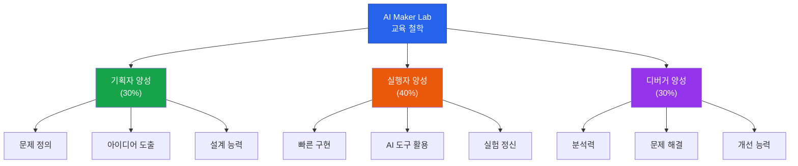

### 1.2 3대 역할 육성 체계

| 역할 | 핵심 역량 | 평가 기준 | 비중 |
|------|----------|----------|------|
| **기획자 (Planner)** | 문제 정의, 아이디어 도출, 설계 능력 | 기획서 완성도, 창의성 | 30% |
| **실행자 (Executor)** | 빠른 구현, AI 도구 활용, 실험 정신 | 프로토타입 완성, 속도 | 40% |
| **디버거 (Debugger)** | 분석력, 문제 해결, 개선 능력 | 오류 해결, 최적화 | 30% |

### 1.3 AI 도구 활용 전후 비교

| 측면 | AI 활용 전 | AI 활용 후 | 개선율 |
|------|-----------|-----------|--------|
| 프로토타입 제작 시간 | 4-6시간 | 1-2시간 | **70% 단축** |
| 코딩 오류 해결 시간 | 30-40분 | 5-10분 | **75% 단축** |
| 아이디어 -> 구현 | 80% 포기 | 90% 완성 | **17배 향상** |
| 학습 만족도 | 60% | 95% | **58% 향상** |

---

## 2. 전체 교육 체계 구조도

### 2.1 교육 과정 전체 구조

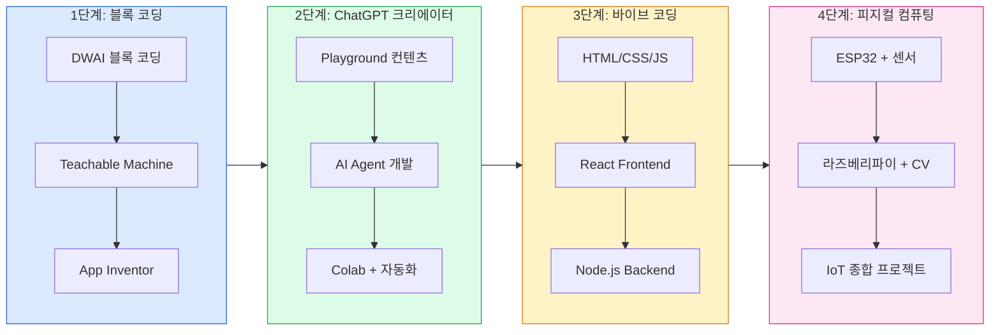

### 2.2 학년별 교육 과정 매핑

```mermaid
gantt
    title 학년별 교육 과정 로드맵
    dateFormat X
    axisFormat %s학년

    section 블록 코딩
    손 인식 기초           :active, a1, 4, 5
    손 제스처 고급          :a2, 5, 6
    표정 인식 게임          :a3, 6, 7
    얼굴 필터/인식          :a4, 7, 8
    사물 분류 게임          :a5, 8, 9
    실시간 물체 감지         :a6, 9, 10

    section ChatGPT
    Playground 컨텐츠       :b1, 7, 8
    AI Agent 개발           :b2, 8, 9
    바이브 + Colab          :b3, 9, 10
    고급 AI 프로젝트         :b4, 10, 12

    section 바이브 코딩
    HTML/CSS/JS 기초         :c1, 8, 9
    React + 배포             :c2, 9, 10
    Backend + API            :c3, 10, 11
    DB + 실전 프로젝트        :c4, 11, 12

    section 피지컬 컴퓨팅
    ESP32 프로토타입          :d1, 9, 10
    라즈베리파이 + CV         :d2, 10, 12
```

### 2.3 과정별 학년 적합도

| 과정 | 초4 | 초5 | 초6 | 중1 | 중2 | 중3 | 고1 | 고2 |
|------|:---:|:---:|:---:|:---:|:---:|:---:|:---:|:---:|
| **1단계: 블록 코딩** | ★★★ | ★★★ | ★★★ | ★★ | ★ | - | - | - |
| **2단계: ChatGPT** | - | - | - | ★★★ | ★★★★ | ★★★★★ | ★★★★ | ★★★★ |
| **3단계: 바이브 코딩** | - | - | - | - | ★★ | ★★★★ | ★★★★★ | ★★★★★ |
| **4단계: 피지컬 컴퓨팅** | - | - | - | - | - | ★★ | ★★★★ | ★★★★★ |

### 2.4 학년별 교육 시수 종합표

| 학년 | 주요 내용 | 블록 코딩 | ChatGPT | 바이브 코딩 | 피지컬 컴퓨팅 | 총 시수 |
|------|-----------|:---------:|:-------:|:-----------:|:------------:|:------:|
| **초등 4학년** | 블록 코딩 기초 (손 인식) | ★★★★★ | - | - | - | 12시간 |
| **초등 5학년** | 블록 코딩 중급 (손 제스처) | ★★★★★ | - | - | - | 12시간 |
| **초등 6학년** | 블록 코딩 심화 (표정 인식) | ★★★★★ | - | ★ (체험) | - | 16시간 |
| **중학 1학년** | ChatGPT + 피지컬 기초 | ★★ | ★★★★ | - | ★★★ | 20시간 |
| **중학 2학년** | AI Agent + 피지컬 중급 | ★ | ★★★★★ | ★★ | ★★★★ | 24시간 |
| **중학 3학년** | 바이브 + 피지컬 심화 | - | ★★★★★ | ★★★★ | ★★★★★ | 24시간 |
| **고등 1학년** | 고급 피지컬 + 프로젝트 | - | ★★★ | ★★★★★ | ★★★★★ | 28시간 |
| **고등 2학년** | 실전 프로젝트 | - | ★★ | ★★★★★ | ★★★★★ | 32시간 |

> **총 교육 시간**: 168시간 (초등 40시간 + 중등 68시간 + 고등 60시간)

---

## 3. 4단계 교육 과정 로드맵

### 3.1 단계별 진행 흐름

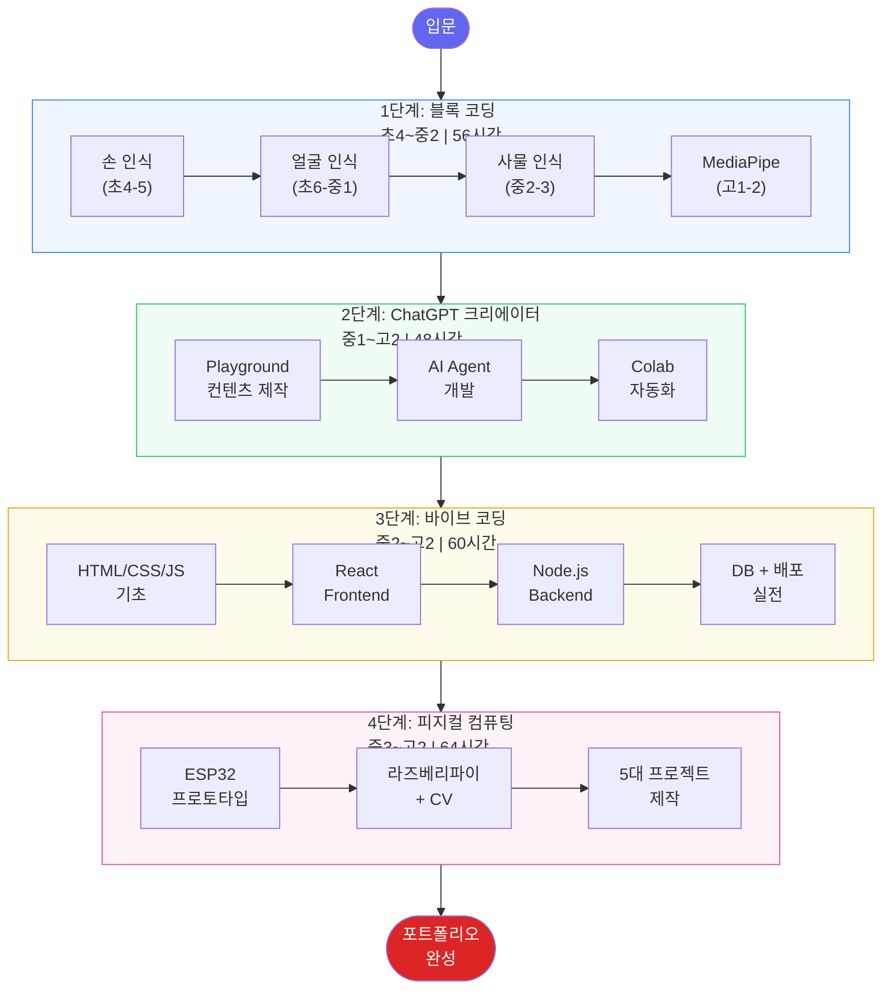

### 3.2 과정별 수강 정보 요약

| 과정 | 대상 학년 | 총 시수 | 수강료 | 핵심 기술 | 최종 결과물 |
|------|----------|:------:|:------:|----------|-----------|
| **1단계: 블록 코딩** | 초4 ~ 중2 | 56시간 | 60만원 | DWAI, Teachable Machine, MediaPipe | 컴퓨터 비전 게임 포트폴리오 |
| **2단계: ChatGPT** | 중1 ~ 고2 | 48시간 | 72만원 | ChatGPT Playground, API, Colab | AI 컨텐츠 + 자동화 시스템 |
| **3단계: 바이브 코딩** | 중2 ~ 고2 | 60시간 | 90만원 | HTML/CSS/JS, React, Node.js | 실제 배포된 웹 서비스 |
| **4단계: 피지컬 컴퓨팅** | 중3 ~ 고2 | 64시간 | 100만원 | ESP32, 라즈베리파이, OpenCV | IoT 제품 5종 포트폴리오 |

---

## 4. 1단계: 블록 코딩

### 4.1 과정 개요

- **대상**: 초등 4-6학년, 중등 1-3학년, 고등 1-2학년
- **총 시수**: 56시간
- **핵심**: 컴퓨터 비전 3단계 (손 인식 -> 얼굴 인식 -> 사물 인식)
- **도구**: DWAI, Teachable Machine, App Inventor, MediaPipe

### 4.2 컴퓨터 비전 3단계 학습 구조

```mermaid
flowchart LR
    subgraph STEP1["1단계: 손 인식<br/>(초4-5 | 16시간)"]
        direction TB
        H1["가위바위보 게임<br/>3시간"]
        H2["손 레이싱 게임<br/>2.5시간"]
        H3["손가락 카운팅<br/>2.5시간"]
        H4["손 피아노<br/>3시간"]
        H5["공중 그림 그리기<br/>2.5시간"]
        H6["손 싸움 게임<br/>2.5시간"]
    end

    subgraph STEP2["2단계: 얼굴 인식<br/>(초6-중1 | 16시간)"]
        direction TB
        F1["감정 연기자<br/>3시간"]
        F2["표정 캐릭터 조종<br/>2.5시간"]
        F3["표정 미러 게임<br/>2.5시간"]
        F4["AR 얼굴 필터<br/>3시간"]
        F5["얼굴 출입 시스템<br/>2.5시간"]
        F6["이모티콘 생성<br/>2.5시간"]
    end

    subgraph STEP3["3단계: 사물 인식<br/>(중2-3 | 16시간)"]
        direction TB
        O1["AI 마트 계산원<br/>3시간"]
        O2["분리수거 교육<br/>2.5시간"]
        O3["물체 도감 수집<br/>2.5시간"]
        O4["다중 물체 감지<br/>3시간"]
        O5["동작 인식 챌린지<br/>2.5시간"]
        O6["AI 보안 시스템<br/>2.5시간"]
    end

    STEP1 --> STEP2 --> STEP3

    style STEP1 fill:#dbeafe,stroke:#2563eb
    style STEP2 fill:#fef3c7,stroke:#d97706
    style STEP3 fill:#dcfce7,stroke:#16a34a
```

### 4.3 초등 4학년: 손 모양 게임 (8시간)

#### 학습 목표
- 손 모양을 AI가 인식하는 원리 이해
- Teachable Machine으로 손 데이터 학습
- 손 모양으로 조종하는 게임 2-3개 완성

#### 차시별 세부 계획

| 차시 | 프로젝트 | CV 핵심 | 학습 내용 | 시간 |
|:----:|---------|---------|----------|:----:|
| 1-3 | 가위바위보 마스터 | 손 모양 3가지 분류 | AI 학습(30분) + 게임 구현(1.5시간) + 테스트/개선(1시간) | 3시간 |
| 4-5 | 손 제어 레이싱 | 손 위치/방향 인식 | 자동차 조종 + 장애물 피하기 + 아이템 수집 | 2.5시간 |
| 6-8 | 손가락 카운팅 게임 | 손가락 개수 인식 | 숫자 맞추기 + 빠른 계산 게임 + 수학 학습 | 2.5시간 |

#### 프로젝트 1: 가위바위보 마스터 상세

| 단계 | 활동 | AI 활용 | 소요시간 |
|------|------|---------|---------|
| AI 학습 | Teachable Machine으로 주먹/손바닥/V자 학습 | 각 클래스 30초 다양한 각도 촬영 | 30분 |
| 게임 구현 | 카운트다운 + 실시간 인식 + 승부 판정 | 블록 코딩으로 게임 로직 구성 | 1.5시간 |
| 테스트/개선 | 인식 속도, 정확도(90%+) 확인 | 효과음, 애니메이션 추가 | 1시간 |

#### 게임 모드 구성

| 모드 | 설명 | 난이도 |
|------|------|:------:|
| 연습 모드 | 천천히 연습, 시간 제한 없음 | ★ |
| 대전 모드 | 10판 2선승제 | ★★ |
| 토너먼트 | 친구들과 경쟁 대전 | ★★★ |

### 4.4 초등 5학년: 손 제스처 고급 (8시간)

| 차시 | 프로젝트 | CV 핵심 | 주요 기능 | 시간 |
|:----:|---------|---------|----------|:----:|
| 1-3 | 손 피아노 | 손 위치별 인식 | 7개 영역 분할, 건반 연주, 따라치기 | 3시간 |
| 4-5 | 공중 그림 그리기 | 손 움직임 추적 | 검지 드로잉, 색상 선택, 저장/공유 | 2.5시간 |
| 6-8 | 손 싸움 게임 | 2개 손 동시 인식 | 멀티 플레이, 전략 게임 | 2.5시간 |

### 4.5 초등 6학년: 표정 인식 게임 (8시간)

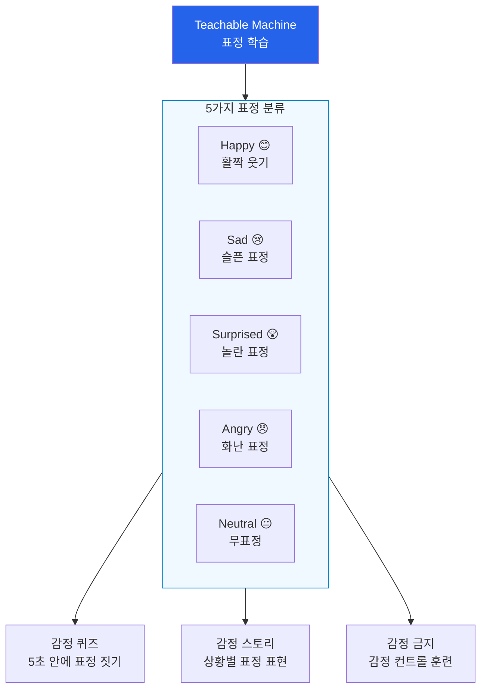

| 차시 | 프로젝트 | CV 핵심 | 주요 기능 | 시간 |
|:----:|---------|---------|----------|:----:|
| 1-3 | 감정 연기자 | 얼굴 표정 분류 | 감정 퀴즈 + 감정 스토리 + 감정 금지 모드 | 3시간 |
| 4-5 | 표정 캐릭터 조종 | 표정 -> 게임 제어 | 표정으로 점프/공격, 3레벨 구성 | 2.5시간 |
| 6-8 | 표정 미러 게임 | 표정 유사도 비교 | 친구와 표정 따라하기 대결 | 2.5시간 |

### 4.6 중등 1학년: 얼굴 필터 & 인식 (8시간)

| 차시 | 프로젝트 | CV 핵심 | 주요 기능 | 시간 |
|:----:|---------|---------|----------|:----:|
| 1-3 | AR 얼굴 필터 | 얼굴 랜드마크 감지 | 선글라스/고양이/왕관 필터, 각도 추적 | 3시간 |
| 4-5 | 얼굴 인식 출입 시스템 | 얼굴 비교/인증 | 등록(3장) + 실시간 비교 + 출입 기록 | 2.5시간 |
| 6-8 | 표정 이모티콘 생성 | 표정 -> 이모티콘 | 표정 캡처 -> 이모티콘 변환 -> 공유 | 2.5시간 |

### 4.7 중등 2학년: 물체 분류 게임 (8시간)

| 차시 | 프로젝트 | CV 핵심 | 학습 요소 | 시간 |
|:----:|---------|---------|----------|:----:|
| 1-3 | AI 마트 계산원 | 다중 물체 분류 | 물체 인식 + 가격 계산 + 등급 부여 (S/A/B/C) | 3시간 |
| 4-5 | 분리수거 교육 게임 | 물체 -> 카테고리 | 환경 교육 + 자동 분류 + 도전 모드 | 2.5시간 |
| 6-8 | 물체 도감 수집 | 물체 인식 + 데이터 | 포켓몬 도감 스타일, 40종 수집, 일일 도전 | 2.5시간 |

### 4.8 중등 3학년: 실시간 물체 감지 (8시간)

| 차시 | 프로젝트 | CV 핵심 | 학습 요소 | 시간 |
|:----:|---------|---------|----------|:----:|
| 1-3 | 실시간 다중 물체 감지 | 여러 물체 동시 인식 | 물체 찾기 게임 + 스피드 퀴즈 + 랭킹 | 3시간 |
| 4-5 | 동작 인식 챌린지 | 물체 움직임 감지 | 피하기 게임 + 리듬 게임 + 콤보 시스템 | 2.5시간 |
| 6-8 | AI 보안 시스템 | 이상 감지 시스템 | 영역 설정 + 침입 감지 + 알림 | 2.5시간 |

### 4.9 고급 과정: MediaPipe + Colab (고1-2학년, 24시간)

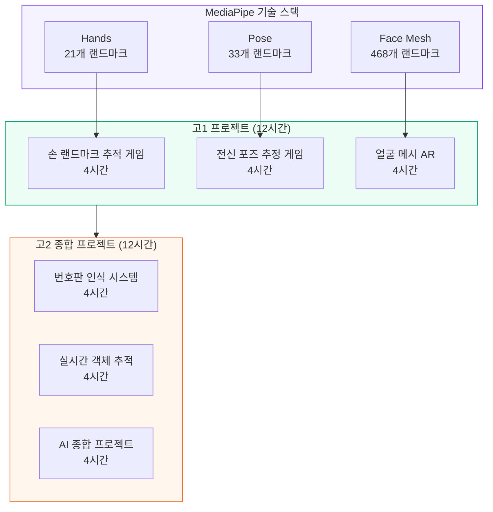

#### 고1: MediaPipe 기초 (12시간)

| 차시 | 프로젝트 | 기술 | 세부 내용 | 시간 |
|:----:|---------|------|----------|:----:|
| 1-4 | 손 랜드마크 추적 게임 | MediaPipe Hands | 손가락 피아노, 손가락 사격, 가상 조이스틱 | 4시간 |
| 5-8 | 전신 포즈 추정 게임 | MediaPipe Pose | 요가 자세 평가, 운동 카운터, 춤 평가 | 4시간 |
| 9-12 | 얼굴 메시 AR | MediaPipe Face Mesh | 고급 AR 필터, 뷰티 필터, 얼굴 변환 | 4시간 |

#### 고2: 종합 프로젝트 (12시간)

| 차시 | 프로젝트 | 기술 | 세부 내용 | 시간 |
|:----:|---------|------|----------|:----:|
| 1-4 | 번호판 인식 시스템 | OCR + 물체 감지 | 스마트 주차, 출입 관리, 자동 결제 | 4시간 |
| 5-8 | 실시간 객체 추적 | Object Tracking | 공 추적, 축구 분석, 동선 히트맵 | 4시간 |
| 9-12 | AI 종합 프로젝트 | 학생 자율 선택 | 무인 편의점/스마트홈/학습도우미/보안시스템 | 4시간 |

#### 종합 프로젝트 카테고리

| 카테고리 | 프로젝트 | 활용 기술 |
|---------|---------|----------|
| **생활 편의** | 무인 편의점 시스템 | 물체 인식 + 얼굴 인식 + 제스처 결제 |
| **생활 편의** | 스마트 홈 시스템 | 얼굴 인식 + 제스처 제어 + 포즈 모니터링 |
| **교육** | AI 학습 도우미 | 표정 분석(이해도) + 포즈(집중도) + 물체 인식 |
| **교육** | 예술 창작 도구 | 손 인식(그림) + 포즈(안무) + 물체(재료) |
| **안전** | 지능형 보안 시스템 | 얼굴(출입) + 포즈(이상행동) + 물체(위험물) |
| **안전** | 안전 모니터링 | 낙상 감지 + 위험 알림 + 긴급 호출 |

### 4.10 블록 코딩 학년별 도구

| 학년 | 플랫폼 | AI 도구 | 코딩 환경 | 비용 |
|------|--------|---------|----------|:----:|
| 초4-6 | DWAI | Teachable Machine | 브라우저 | 무료 |
| 중1-2 | App Inventor | Teachable Machine | 브라우저 | 무료 |
| 중3 | DWAI/Scratch | Teachable Machine | 브라우저 | 무료 |
| 고1-2 | Google Colab | MediaPipe | Python | 무료 |

---

## 5. 2단계: ChatGPT 크리에이터

### 5.1 과정 개요

- **대상**: 중등 1-3학년, 고등 1-2학년
- **총 시수**: 48시간 (중등 28시간 + 고등 20시간)
- **목표**: AI를 활용한 컨텐츠 제작 + 아이디어 실현 + 빠른 프로토타이핑

### 5.2 ChatGPT 교육 단계 구조

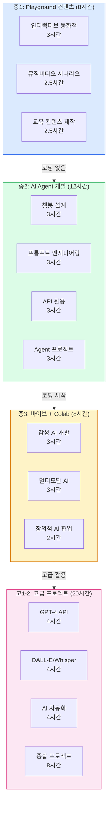

### 5.3 중1: ChatGPT Playground 컨텐츠 제작 (8시간)

> **핵심 원칙**: 코딩 없음! 순수 AI 컨텐츠 크리에이터

#### 컨텐츠 제작 프로세스

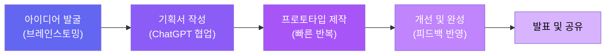

#### 프로젝트 상세

| 프로젝트 | 시간 | 결과물 | 핵심 학습 |
|---------|:----:|--------|----------|
| **인터랙티브 동화책** | 3시간 | 4-5장 분기 동화 + 3개 엔딩 + 삽화 프롬프트 5개 | 아이디어 발굴 -> 기획 -> 프로토타입 -> 개선 |
| **뮤직비디오 시나리오** | 2.5시간 | 시간별 시나리오 표 + 스토리보드 + 발표 자료 | 기획력, 시각적 표현, 구조적 사고 |
| **교육 컨텐츠** | 2.5시간 | 교육 영상 스크립트 + 퀴즈 + 학습 가이드 | 지식 정리, 전달력, 교육 설계 |

#### 프로젝트 1 상세 단계 (인터랙티브 동화책)

| 단계 | 활동 | ChatGPT 활용 | 학생 역할 | 시간 |
|------|------|-------------|----------|:----:|
| 1. 아이디어 발굴 | 주제 10가지 브레인스토밍 | 주제 제안 + 설정/선택포인트 설명 | 10개 중 1개 선택 | 30분 |
| 2. 기획서 작성 | 상세 기획서 생성 | 등장인물, 세계관, 분기 구조 생성 | 검토 + 수정 요청 + 아이디어 추가 | 40분 |
| 3. 프로토타입 제작 | 1-4장 작성 | 각 장 5-10분 만에 생성 | 복사 -> 확인 -> 수정 -> 반복 | 60분 |
| 4. 개선 및 완성 | 일관성 체크 + 삽화 프롬프트 | 캐릭터/복선 검토, DALL-E 프롬프트 | 친구 피드백 반영 + 최종 수정 | 50분 |

### 5.4 중2: AI Agent 개발 (12시간)

| 차시 | 주제 | 학습 내용 | 실습 프로젝트 | 시간 |
|:----:|------|----------|-------------|:----:|
| 1-3 | AI Agent 개념 | Agent란? 자율 행동, 의사 결정 | 간단한 챗봇 설계 | 3시간 |
| 4-6 | 프롬프트 고급 | Chain of Thought, Few-shot, 역할 부여 | 전문가 AI 만들기 | 3시간 |
| 7-9 | API 활용 | API 개념, ChatGPT API, 데이터 연동 | 날씨 알림 봇 | 3시간 |
| 10-12 | Agent 프로젝트 | 종합 설계 + 구현 | 나만의 AI Agent | 3시간 |

### 5.5 중3: 바이브 + Colab (8시간)

| 차시 | 주제 | 학습 내용 | 실습 프로젝트 | 시간 |
|:----:|------|----------|-------------|:----:|
| 1-3 | 감성 AI 개발 | 페르소나 설정, 톤앤매너 | 나만의 AI 친구 만들기 | 3시간 |
| 4-6 | 멀티모달 AI | 이미지 인식, 음성 인식, 통합 활용 | 시각+대화 AI | 3시간 |
| 7-8 | 창의적 AI 협업 | 스토리 생성, 아이디어 브레인스토밍 | AI 협업 창작 프로젝트 | 2시간 |

### 5.6 고등: 고급 AI 프로젝트 (20시간)

| 차시 | 주제 | 학습 내용 | 실습 프로젝트 | 시간 |
|:----:|------|----------|-------------|:----:|
| 1-4 | GPT-4 API 심화 | 고급 프롬프트, 함수 호출, 스트리밍 | 멀티모달 AI 앱 | 4시간 |
| 5-8 | DALL-E + Whisper | 이미지 생성, 음성 인식, 통합 | AI 크리에이터 도구 | 4시간 |
| 9-12 | AI 자동화 | 워크플로우, 데이터 분석, 보고서 | 자동화 시스템 구축 | 4시간 |
| 13-20 | 종합 프로젝트 | 기획 -> 설계 -> 구현 -> 배포 | 포트폴리오 프로젝트 | 8시간 |

---

## 6. 3단계: 바이브 코딩

### 6.1 과정 개요

- **대상**: 중등 2-3학년 (Frontend), 고등 1-2학년 (Backend)
- **총 시수**: 60시간 (Frontend 28시간 + Backend 32시간)
- **목표**: AI로 빠르게 만들고, 반복해서 개선하는 웹 개발자

### 6.2 바이브 코딩 학습 경로

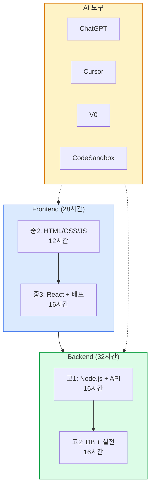

### 6.3 전통적 방식 vs 바이브 방식

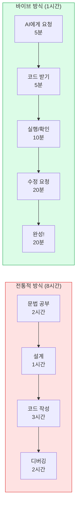

### 6.4 중2: HTML/CSS + JavaScript (12시간)

| 차시 | 주제 | AI 활용률 | 역공부 대상 | 결과물 | 시간 |
|:----:|------|:---------:|-----------|--------|:----:|
| 1-2 | HTML 기초 | 80% | 유명 사이트 분석 | 자기소개 페이지 | 4시간 |
| 3-4 | CSS 스타일링 | 90% | 인기 디자인 분석 | 포트폴리오 사이트 | 4시간 |
| 5-6 | JavaScript | 90% | 동적 사이트 분석 | 계산기 앱 | 4시간 |

#### 역공부 프로세스 (네이버 메인 페이지 예시)

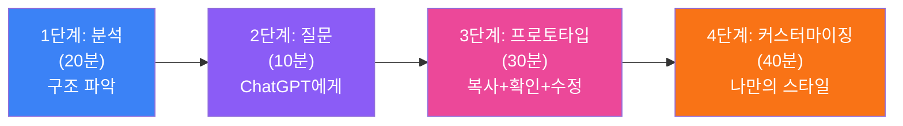

### 6.5 중3: React 기초 + 배포 (16시간)

| 차시 | 주제 | AI 활용률 | 프로젝트 | 시간 |
|:----:|------|:---------:|---------|:----:|
| 1-2 | React 기초 | 90% | Todo 앱 | 4시간 |
| 3-4 | 상태 관리 | 85% | 카운터 앱 | 4시간 |
| 5-6 | API 연동 | 80% | 날씨 앱 | 4시간 |
| 7-8 | 배포 | 95% | 포트폴리오 사이트 | 4시간 |

### 6.6 고1: Backend 기초 + API (16시간)

| 차시 | 주제 | AI 활용률 | 프로젝트 | 시간 |
|:----:|------|:---------:|---------|:----:|
| 1-2 | Node.js 기초 | 90% | 간단한 서버 | 4시간 |
| 3-4 | Express | 90% | REST API | 4시간 |
| 5-6 | 데이터베이스 | 85% | 게시판 API | 4시간 |
| 7-8 | 인증 | 80% | 로그인 시스템 | 4시간 |

### 6.7 고2: 데이터베이스 + 실전 프로젝트 (16시간)

| 차시 | 주제 | AI 활용률 | 프로젝트 | 시간 |
|:----:|------|:---------:|---------|:----:|
| 1-2 | MongoDB | 90% | 데이터 CRUD | 4시간 |
| 3-4 | 파일 업로드 | 85% | 이미지 게시판 | 4시간 |
| 5-8 | 종합 프로젝트 | 95% | 실전 웹앱 (스터디 모집 등) | 8시간 |

#### 실전 프로젝트 개발 프로세스

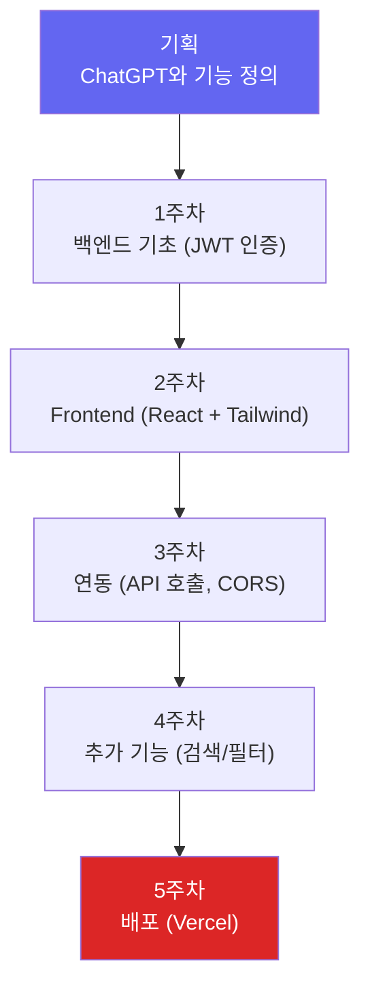

### 6.8 바이브 코딩 AI 활용 수준 평가

| 수준 | AI 활용 방식 | 이해도 | 점수 |
|------|-------------|--------|:----:|
| 초급 | 코드 복사만 | 이해 부족 | 60점 |
| 중급 | 코드 수정 가능 | 기본 이해 | 75점 |
| 고급 | AI와 협업 | 완전 이해 | 90점 |
| 전문가 | AI를 도구화 | 응용 가능 | 100점 |

### 6.9 바이브 코딩 필요 도구

| 학년 | Frontend | Backend | 배포 | 비용 |
|------|----------|---------|------|:----:|
| 중2-3 | CodeSandbox | - | Netlify | 무료 |
| 고1-2 | Vite + React | Node + Express | Vercel | 무료 |

---

## 7. 4단계: 피지컬 컴퓨팅

### 7.1 과정 개요

- **대상**: 중등 3학년, 고등 1-2학년
- **총 시수**: 64시간 (1단계 32시간 + 2단계 32시간)
- **목표**: 실전 IoT 제품 5종 제작

### 7.2 피지컬 컴퓨팅 2단계 학습 구조

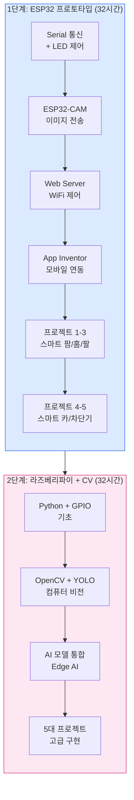

### 7.3 5대 핵심 프로젝트

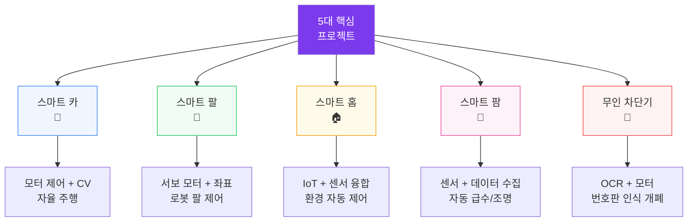

#### 프로젝트별 상세 정보

| 프로젝트 | 1단계 (ESP32) | 2단계 (라즈베리파이) | 주요 기술 | 난이도 |
|---------|:------------:|:------------------:|----------|:------:|
| **스마트 카** | 4시간 | 8시간 | 모터 제어, 컴퓨터 비전 | ★★★★ |
| **스마트 팔** | 4시간 | 6시간 | 서보 모터, 좌표 제어 | ★★★ |
| **스마트 홈** | 6시간 | 6시간 | IoT, 센서 융합 | ★★★★ |
| **스마트 팜** | 4시간 | 6시간 | 센서, 데이터 수집/분석 | ★★ |
| **무인 차단기** | 4시간 | 8시간 | OCR, 모터 제어 | ★★★★★ |

### 7.4 1단계: ESP32 프로토타입 개발 (32시간)

#### 핵심 기술 4가지

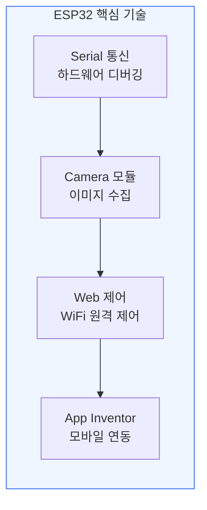

#### 차시별 세부 계획

| 차시 | 주제 | 핵심 기술 | 실습 | 시간 |
|:----:|------|----------|------|:----:|
| 1-2 | ESP32 기초 + Serial | Arduino IDE, Serial 통신 | LED 제어 + Serial 디버깅 | 4시간 |
| 3-4 | ESP32-CAM | Camera 모듈, 이미지 전송 | WiFi 스트리밍 감시 카메라 | 4시간 |
| 5-6 | Web Server | WiFi, HTTP 프로토콜 | 웹 제어 페이지 구축 | 6시간 |
| 7-8 | App Inventor | Bluetooth, WiFi 연동 | 모바일 제어 앱 개발 | 4시간 |
| 9-11 | 프로젝트 1-3 | 센서 + 액추에이터 | 스마트 팜/홈/팔 프로토타입 | 6시간 |
| 12-16 | 프로젝트 4-5 | 모터 + 카메라 + AI | 스마트 카/무인 차단기 | 8시간 |

### 7.5 2단계: 라즈베리파이 + 컴퓨터 비전 (32시간)

| 차시 | 주제 | 핵심 기술 | 실습 | 시간 |
|:----:|------|----------|------|:----:|
| 1-4 | 라즈베리파이 기초 | 리눅스, Python, GPIO | 웹 서버 구축 | 4시간 |
| 5-8 | 컴퓨터 비전 | OpenCV, YOLO | 객체 인식 시스템 | 4시간 |
| 9-12 | AI 모델 통합 | TensorFlow Lite, Edge AI | Edge AI 카메라 | 4시간 |
| 13-16 | 센서 네트워크 | MQTT, 다중 기기 통신 | IoT 센서 네트워크 | 4시간 |
| 17-32 | 5대 프로젝트 고급 구현 | 종합 기술 | 5종 IoT 제품 완성 | 16시간 |

### 7.6 피지컬 컴퓨팅 기술 스택

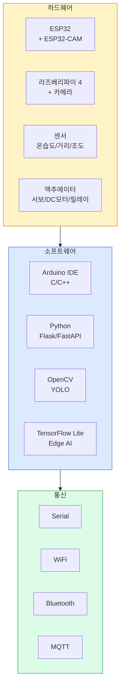

---

## 8. 출강 프로그램

### 8.1 출강 프로그램 개요

- **범위**: 전국 학교, 기관, 기업, 도서관, 복지관
- **주요 지역**: 서울, 경기 (전국 가능)
- **실적**: 2,959개 학교 | 23,761 교육 시수 | 33,667명 학생 | 32개 파트너 대학/기관

### 8.2 출강 과정 구성

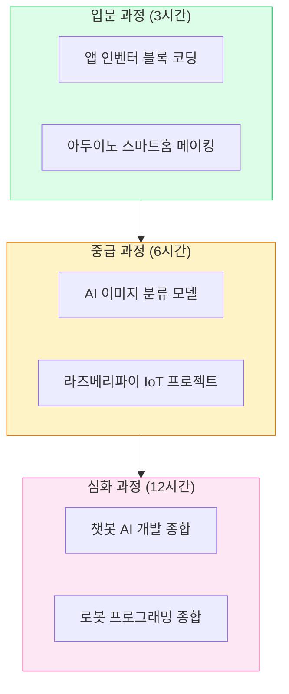

#### 출강 과정 상세

| 과정 | 시간 | 난이도 | 대상 | 주요 내용 |
|------|:----:|:------:|------|----------|
| 앱 인벤터 블록 코딩 | 3시간 | 입문 | 초등 3-6 | 블록 코딩으로 안드로이드 앱 제작 |
| 아두이노 스마트홈 메이킹 | 3시간 | 입문 | 초등 5 ~ 중등 | LED, 센서 활용 스마트홈 구현 |
| AI 이미지 분류 모델 | 6시간 | 중급 | 초등 6 ~ 중등 | Teachable Machine + 이미지 분류 |
| 라즈베리파이 IoT 프로젝트 | 6시간 | 중급 | 중등 ~ 고등 | 라즈베리파이 IoT 시스템 구축 |
| 챗봇 AI 개발 종합 | 12시간 | 심화 | 중등 ~ 고등 | ChatGPT API 활용 챗봇 개발 |
| 로봇 프로그래밍 종합 | 12시간 | 심화 | 중등 ~ 고등 | 로봇 제어 + 자율 주행 |

### 8.3 출강 비용 구조

| 항목 | 금액 | 비고 |
|------|:----:|------|
| 재료비 (키트) | 55,000원/세트 | 학생 4명당 1세트 |
| 강사비 | 50,000원/시간 | 1인 기준 |
| 최소 수업 시간 | 3시간 (2시간 가능) | - |
| 학생 수 | 10~30명 | 과정별 상이 |

#### 비용 계산 예시

| 구성 | 학생 수 | 시간 | 재료비 | 강사비 | **총 비용** |
|------|:------:|:----:|:------:|:------:|:----------:|
| 기본 | 12명 | 3시간 | 165,000원 | 150,000원 | **315,000원** |
| 중급 | 20명 | 6시간 | 275,000원 | 300,000원 | **575,000원** |
| 심화 | 16명 | 12시간 | 220,000원 | 600,000원 | **820,000원** |

---

## 9. 웹사이트 커리큘럼 (수강 과정)

### 9.1 웹사이트에서 제공하는 6대 커리큘럼

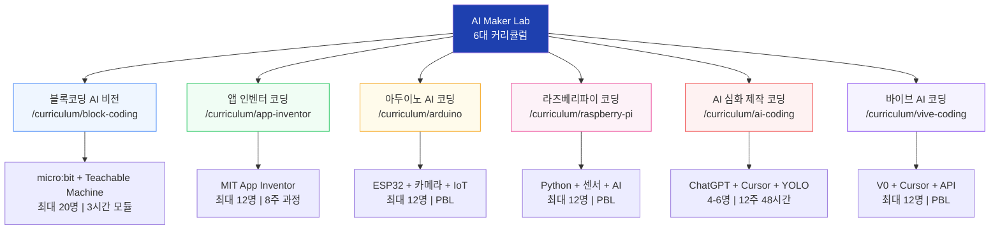

### 9.2 커리큘럼 비교표

| 항목 | 블록코딩 AI 비전 | 앱 인벤터 | 아두이노 AI | 라즈베리파이 | AI 심화 제작 | 바이브 AI |
|------|:--------------:|:--------:|:----------:|:----------:|:-----------:|:--------:|
| **대상** | 초~중 | 초3~고 | 초~고 | 중~고 | 중~고 | 중~고 |
| **정원** | 20명 | 12명 | 12명 | 12명 | 4-6명 | 12명 |
| **시간** | 3/6/9/12h | 3/6/12h | PBL | PBL | 48h (12주) | PBL |
| **방식** | 역공학+메이커 | 메이커 | 벤치마킹 | PBL | 프로젝트 | 메이커 |
| **핵심기술** | Teachable Machine, micro:bit | MIT App Inventor | ESP32, IoT | Python, 센서, AI | ChatGPT, YOLO | V0, Cursor |
| **팀 구성** | 2인 1팀 | 개인/팀 | 개인/팀 | 개인/팀 | 소그룹 | 개인/팀 |

### 9.3 블록코딩 AI 비전 상세

#### 레벨 구성

| 레벨 | 대상 | 내용 | 시간 |
|------|------|------|:----:|
| **입문** | 초등 | Teachable Machine + 블록 코딩 | 3시간 |
| **중급** | 초~중 | + micro:bit 연동 | 6시간 |
| **심화** | 중등 | + 다중 센서 + 고급 프로젝트 | 12시간 |

### 9.4 앱 인벤터 코딩 상세

#### 시수별 커리큘럼

| 시수 | 대상 | 레벨 | 내용 |
|:----:|------|------|------|
| 3시간 | 초3-6 | 체험 | 블록 코딩 기초 + 간단한 앱 1개 |
| 6시간 | 초5-중 | 기본 | AI 기능 포함 앱 2개 제작 |
| 12시간 | 중-고 | 심화 | 복합 기능 앱 포트폴리오 |

### 9.5 AI 심화 제작 코딩 상세 (12주 과정)

```mermaid
gantt
    title AI 심화 제작 코딩 12주 로드맵
    dateFormat X
    axisFormat %s주차

    section 기획
    문제 정의 + 아이디어         :a1, 1, 3

    section IoT 제작
    하드웨어 + 펌웨어 개발       :a2, 3, 6

    section AI 개발
    AI 모델 + 서비스 연동        :a3, 6, 9

    section 완성
    통합 + 포트폴리오 완성       :a4, 9, 13
```

| 주차 | 단계 | 주요 활동 | 도구 |
|:----:|------|----------|------|
| 1-2 | 기획 | 문제 정의, 아이디어 도출, 설계 | ChatGPT, 기획서 템플릿 |
| 3-4 | IoT 기초 | 하드웨어 구성, 센서 연결 | ESP32, Arduino IDE |
| 5-6 | IoT 심화 | 펌웨어 개발, 통신 구현 | ESP32-CAM, WiFi |
| 7-8 | AI 개발 | YOLO 모델 학습, 추론 구현 | Cursor, YOLO |
| 9-10 | 서비스 연동 | API 서버, 대시보드 구축 | ChatGPT, V0 |
| 11-12 | 포트폴리오 | 문서화, 발표 준비, 전시 | 포트폴리오 템플릿 |

### 9.6 바이브 AI 코딩 상세

#### 2단계 학습 과정

| 단계 | 내용 | 시간 | 핵심 활동 |
|:----:|------|:----:|----------|
| **1단계** | 문제 발견 + 수동 제작 | 3-6시간 | 실제 문제 탐색 -> 수작업 프로토타입 -> 개선점 발견 |
| **2단계** | Cursor + V0 자동화 | 16시간 | AI 도구로 자동화 구현 -> 테스트 -> 배포 |

#### 프로젝트 예시

| 프로젝트 | 1단계 (수동) | 2단계 (자동화) |
|---------|------------|--------------|
| AI 동화책 제작 | 손으로 스토리 구성 + 삽화 스케치 | Cursor + API로 자동 생성 시스템 |
| 영상 영어 과외 | 직접 자막 작성 + 해석 | AI 자동 자막/번역/퀴즈 생성 |
| 감정 게임 | 종이 기반 감정 카드 게임 | 카메라 + AI 감정 인식 게임 |

---

## 10. 학년별 역량 매트릭스

### 10.1 역량 발전 단계

```mermaid
flowchart LR
    subgraph E["초등 (기초)"]
        E1["블록 코딩 마스터"]
        E2["AI 체험/이해"]
        E3["간단한 게임 제작"]
    end

    subgraph M["중등 (응용)"]
        M1["ChatGPT 활용"]
        M2["웹 개발 기초"]
        M3["IoT 프로젝트"]
    end

    subgraph H["고등 (심화)"]
        H1["AI 모델 통합"]
        H2["풀스택 개발"]
        H3["포트폴리오 완성"]
    end

    E --> M --> H

    style E fill:#dbeafe,stroke:#2563eb
    style M fill:#fef3c7,stroke:#d97706
    style H fill:#fce7f3,stroke:#db2777
```

### 10.2 역량 매트릭스 종합

| 역량 | 초4 | 초5 | 초6 | 중1 | 중2 | 중3 | 고1 | 고2 |
|------|:---:|:---:|:---:|:---:|:---:|:---:|:---:|:---:|
| **블록 코딩** | ★★ | ★★★★ | ★★★★★ | ★★★ | ★★ | ★ | - | - |
| **ChatGPT 활용** | - | - | - | ★★★ | ★★★★ | ★★★★★ | ★★★★ | ★★★★ |
| **피지컬 컴퓨팅** | - | - | ★ | ★★★ | ★★★★ | ★★★★★ | ★★★★★ | ★★★★★ |
| **Python** | - | - | - | ★ | ★★ | ★★★ | ★★★★ | ★★★★★ |
| **AI/ML** | - | - | - | ★ | ★★ | ★★★ | ★★★★ | ★★★★★ |
| **웹 개발** | - | - | - | - | ★★ | ★★★★ | ★★★★★ | ★★★★★ |
| **프로젝트 관리** | ★ | ★★ | ★★★ | ★★★ | ★★★★ | ★★★★ | ★★★★★ | ★★★★★ |

### 10.3 단계별 성취 기준

| 단계 | 학년 | 핵심 목표 | 성취 기준 |
|------|------|-----------|----------|
| **입문** | 초4-5 | 블록 코딩 기초 마스터 | 간단한 게임을 혼자 만들 수 있음 |
| **기본** | 초6-중1 | 피지컬 컴퓨팅 이해 | 센서를 활용한 간단한 시스템 제작 |
| **중급** | 중2-중3 | ChatGPT + 하드웨어 통합 | AI를 활용한 IoT 프로젝트 완성 |
| **고급** | 고1 | 머신러닝 + 엣지 AI | 컴퓨터 비전을 활용한 시스템 |
| **심화** | 고2 | 포트폴리오 프로젝트 | 실생활 문제 해결 작품 전시 |

### 10.4 역량별 성취 기준 (학교급별)

| 역량 | 초등 | 중등 | 고등 |
|------|------|------|------|
| **기획** | 간단한 게임 기획 | 앱/웹 서비스 기획 | 실생활 문제 해결 기획 |
| **실행** | 블록으로 구현 | AI 도구로 빠른 개발 | 복합 시스템 구현 |
| **디버깅** | 오류 찾기 | AI 활용 디버깅 | 최적화 및 개선 |

---

## 11. 교육 방법론

### 11.1 3대 교육 방법론 체계

```mermaid
flowchart TD
    subgraph PRIMM["PRIMM 학습 방법론"]
        P1["1. Predict<br/>예측 (10분)"]
        P2["2. Run<br/>실행 (5분)"]
        P3["3. Investigate<br/>탐구 (15분)"]
        P4["4. Modify<br/>수정 (20분)"]
        P5["5. Make<br/>창작 (30분)"]
        P1 --> P2 --> P3 --> P4 --> P5
    end

    subgraph RE["역공부 (Reverse Engineering)"]
        R1["1. 완성작 체험"]
        R2["2. 구조 분석"]
        R3["3. 핵심 요소 추출"]
        R4["4. 재구현"]
        R1 --> R2 --> R3 --> R4
    end

    subgraph MAKER["메이커 교육"]
        M1["1. 아이디어"]
        M2["2. 프로토타입"]
        M3["3. 테스트"]
        M4["4. 개선"]
        M5["5. 공유"]
        M1 --> M2 --> M3 --> M4 --> M5
    end

    style PRIMM fill:#dbeafe,stroke:#2563eb
    style RE fill:#dcfce7,stroke:#16a34a
    style MAKER fill:#fef3c7,stroke:#d97706
```

### 11.2 PRIMM 5단계 상세

| 단계 | 학생 활동 | 교사 역할 | 도구 | 시간 |
|------|-----------|----------|------|:----:|
| **1. Predict** | 코드/결과 예측, 가설 수립 | 질문 제시, 사고 유도 | 워크시트 | 10분 |
| **2. Run** | 코드 실행, 결과 확인 | 관찰 독려 | 개발 도구 | 5분 |
| **3. Investigate** | 코드 분석, 작동 원리 탐구 | 힌트 제공, 토론 촉진 | 디버거, ChatGPT | 15분 |
| **4. Modify** | 코드 수정, 기능 변경 | 피드백 제공 | AI 도구 | 20분 |
| **5. Make** | 새로운 작품 창작 | 격려, 공유 촉진 | 전체 도구 | 30분 |

### 11.3 역공부 프로세스

```mermaid
flowchart LR
    A["완성작 체험<br/>🎮 작동해보기"] --> B["구조 분석<br/>🔍 어떻게 만들었을까?"]
    B --> C["핵심 추출<br/>💡 핵심 기술 파악"]
    C --> D["재구현<br/>🛠️ 내 방식으로 만들기"]

    style A fill:#3b82f6,color:#fff
    style B fill:#8b5cf6,color:#fff
    style C fill:#ec4899,color:#fff
    style D fill:#f97316,color:#fff
```

#### 과정별 역공부 적용 예시

| 과정 | 완성작 | 분석 포인트 | 재구현 목표 |
|------|--------|-----------|-----------|
| **블록 코딩** | 게임 프로젝트 | 로직 흐름, 변수 사용 | 유사한 게임 만들기 |
| **ChatGPT** | AI 챗봇 | 프롬프트 패턴 | 나만의 봇 만들기 |
| **바이브 코딩** | 웹 앱 (네이버, Trello) | UI/UX, API 구조 | 기능 추가한 앱 |
| **피지컬 컴퓨팅** | IoT 장치 | 센서-제어 연결 | 개선된 시스템 |

### 11.4 메이커 교육 사이클

| 과정 | 메이커 프로젝트 | 핵심 활동 사이클 |
|------|---------------|----------------|
| **블록 코딩** | 나만의 게임 | 아이디어 -> 프로토타입 -> 개선 |
| **ChatGPT** | AI 스토리 생성기 | 프롬프트 실험 -> 개선 -> 공유 |
| **바이브 코딩** | 웹 앱 제작 | 기획 -> 디자인 -> 구현 -> 배포 |
| **피지컬 컴퓨팅** | 스마트 장치 | 회로 설계 -> 제작 -> 테스트 -> 개선 |

### 11.5 AI 활용 빠른 프로토타이핑

| 단계 | 목표 | AI 활용 | 소요 비중 |
|------|------|---------|:---------:|
| 1. 최소 기능 프로토타입 | 핵심 기능 1개 구현 | ChatGPT 코드 생성 | 20% |
| 2. 기능 확장 | 필수 기능 추가 | AI 디버깅, 개선 | 30% |
| 3. UI/UX 개선 | 사용자 경험 향상 | AI 디자인 제안 | 20% |
| 4. 테스트/디버깅 | 안정성 확보 | AI 오류 분석 | 20% |
| 5. 문서화/발표 | 포트폴리오 완성 | AI 문서 작성 지원 | 10% |

### 11.6 수업 운영 모델 (2시간 기준)

| 시간 | 활동 | 내용 |
|------|------|------|
| 0-10분 | 도입 | 지난 시간 복습, 동기 유발 |
| 10-40분 | 개념 학습 | 새로운 개념 설명, 시연 |
| 40-90분 | 실습 | 프로젝트 제작, 문제 해결 |
| 90-110분 | 발표/공유 | 결과물 공유, 토론 |
| 110-120분 | 정리 | 요약, 과제 안내 |

### 11.7 교수학습 전략

| 단계 | 교사 역할 | 학생 활동 | 도구 |
|------|-----------|-----------|------|
| **도입** | 동기 유발, 문제 제시 | 흥미 표현, 질문 | 영상, 사례 |
| **탐구** | 가이드, 힌트 제공 | 자료 조사, 토론 | 인터넷, ChatGPT |
| **설계** | 피드백 제공 | 아이디어 스케치, 계획 | 종이, 디지털 도구 |
| **구현** | 기술 지원 | 코딩, 제작 | DWAI, 아두이노 등 |
| **테스트** | 관찰, 질문 | 디버깅, 개선 | 테스트 도구 |
| **발표** | 촉진자 | 발표, 시연 | PPT, 작품 |
| **평가** | 피드백, 격려 | 자기평가, 동료평가 | 루브릭 |

---

## 12. 평가 시스템

### 12.1 포트폴리오 기반 평가 체계

```mermaid
flowchart TD
    EVAL["평가 체계"] --> P["포트폴리오 평가<br/>(60%)"]
    EVAL --> PR["과정 평가<br/>(20%)"]
    EVAL --> AT["태도 평가<br/>(20%)"]

    P --> P1["기획서 완성도"]
    P --> P2["프로토타입 완성"]
    P --> P3["최종 결과물"]

    PR --> PR1["참여도"]
    PR --> PR2["성장도"]

    AT --> AT1["협업 능력"]
    AT --> AT2["발표 능력"]

    style EVAL fill:#1e40af,color:#fff
    style P fill:#dbeafe,stroke:#2563eb
    style PR fill:#dcfce7,stroke:#16a34a
    style AT fill:#fef3c7,stroke:#d97706
```

### 12.2 평가 루브릭

| 항목 | 우수 (5점) | 보통 (3점) | 미흡 (1점) |
|------|-----------|-----------|-----------|
| **기획** | 명확한 문제 정의, 창의적 해결책 | 일반적인 아이디어 | 모호한 기획 |
| **실행** | 완성도 높은 프로토타입 | 기본 기능 구현 | 미완성 |
| **디버깅** | 스스로 문제 해결, 개선 | 도움 받아 해결 | 해결 못함 |
| **AI 활용** | 효과적으로 활용, 최적화 | 기본적 활용 | 활용 부족 |
| **이해도** | 개념을 완벽히 이해하고 응용 | 개념을 이해함 | 개념 이해 부족 |
| **코딩 능력** | 독립적으로 구현 가능 | 도움을 받아 구현 | 구현 어려움 |
| **창의성** | 독창적인 아이디어 | 일반적인 수준 | 모방 수준 |
| **완성도** | 완벽하게 동작 | 대부분 동작 | 미완성 |
| **발표** | 명확하고 설득력 있음 | 무난하게 설명 | 설명 부족 |

### 12.3 AI 활용 수준별 평가 기준

| 수준 | 설명 | AI 활용 방식 | 비고 |
|------|------|-------------|------|
| **Level 1** | 복사 붙여넣기 | AI 코드를 그대로 사용 | 최소 기준 |
| **Level 2** | 수정 및 변형 | AI 코드를 이해하고 수정 | 기본 수준 |
| **Level 3** | 협업 개발 | AI와 대화하며 코드 발전 | 권장 수준 |
| **Level 4** | 도구화 | AI를 효율적으로 활용하여 독창적 결과물 | 우수 수준 |

### 12.4 학생 포트폴리오 예시

#### 초등 6학년

| 프로젝트 | 시기 | 기술 | 성과 |
|---------|------|------|------|
| AI 가위바위보 | 초4 | Teachable Machine + DWAI | 친구들 20명 플레이 |
| 손 피아노 | 초5 | 손 위치 인식 + 음향 | 학교 과학 대회 금상 |
| 표정 게임 | 초6 | 얼굴 표정 분류 | YouTube 조회수 1,000회 |

#### 중등 3학년

| 프로젝트 | 시기 | 기술 | 성과 |
|---------|------|------|------|
| AI 마트 계산원 | 중2 | 다중 물체 분류 | 지역 환경 축제 전시 |
| 분리수거 교육 게임 | 중2 | 물체 -> 카테고리 분류 | 초등학교 교육 자료 채택 |
| 실시간 물체 감지 | 중3 | YOLO + 실시간 처리 | 환경부 장관상 |

#### 고등 2학년

| 프로젝트 | 시기 | 기술 | 성과 |
|---------|------|------|------|
| 손 추적 시스템 | 고1 | MediaPipe Hands | 논문 발표 |
| 번호판 인식 시스템 | 고2 | OCR + 물체 감지 | 학교 주차장 실적용 |
| 스마트 주차 관리 | 고2 | 종합 시스템 | 특허 출원 + 대학 입시 포트폴리오 |

---

## 13. 교구 및 장비

### 13.1 학년별 필수 교구

| 학년 | 소프트웨어 | 하드웨어 | 기타 | 비용 (1인당) |
|------|-----------|---------|------|:----------:|
| **초4-6** | DWAI, Scratch | - | 노트북 | 무료 |
| **중1** | DWAI, ChatGPT, Arduino IDE | 아두이노 우노, LED, 센서 키트 | 브레드보드, 점퍼선 | 8만원 |
| **중2** | Python, Arduino IDE, ChatGPT API | 아두이노 메가, 모터, 블루투스 | 배터리, 케이스 | 12만원 |
| **중3** | Python, Arduino IDE, OpenCV | 아두이노 메가, LCD, WiFi, 카메라 | SD 카드, 센서 | 15만원 |
| **고1** | Python, TensorFlow, OpenCV, ROS | 라즈베리파이 4, 카메라, 센서 네트워크 | 전원, 케이스 | 20만원 |
| **고2** | Full Stack (Python, JS, DB) | 라즈베리파이, 아두이노, 로봇 키트 | 클라우드 계정 | 25만원 |

### 13.2 교육용 키트 상품

| 제품 | 카테고리 | 가격 (원) | 포함 내용 |
|------|---------|:---------:|----------|
| 블록코딩 음악교육 키트 | 블록 코딩 | 250,000 | micro:bit + 음향 센서 + 교재 |
| 스마트 팜 키트 (아두이노) | 아두이노 | 57,200 | ESP32 + 토양 센서 + 펌프 + 교재 |
| AI 자율주행 로봇카 키트 | AI 로봇 | 185,000 | ESP32-CAM + 모터 + 센서 + 교재 |
| 앱 인벤터 기본교육 키트 | 앱 인벤터 | 95,000 | 블루투스 모듈 + 센서 + 교재 |
| 라즈베리파이 IoT 프로젝트 키트 | 라즈베리파이 | 320,000 | RPi 4 + 카메라 + 센서 + 교재 |
| 엔트리 기본코딩 교육 키트 | 엔트리 | 45,000 | 교재 + 워크시트 |

### 13.3 학습 플랫폼

| 플랫폼 | 내용 | 대상 |
|--------|------|------|
| **DWAI (Dancing with AI)** | 블록 코딩 + AI 학습 | 초등 |
| **Teachable Machine** | 이미지/소리/포즈 AI 학습 | 전체 |
| **ChatGPT** | AI 대화 및 컨텐츠 생성 | 중등 이상 |
| **Google Colab** | Python + ML 실습 환경 | 고등 |
| **Arduino IDE** | 피지컬 컴퓨팅 개발 | 중등 이상 |
| **CodeSandbox** | 웹 개발 실습 | 중등 이상 |
| **Vercel/Netlify** | 웹 앱 배포 | 중등 이상 |
| **GitHub** | 코드 버전 관리 | 고등 |

---

## 14. 진로 연계

### 14.1 AI 관련 진로 경로

```mermaid
flowchart TD
    subgraph CAREER["진로 분야"]
        C1["AI/ML 엔지니어"]
        C2["데이터 과학자"]
        C3["IoT 개발자"]
        C4["로보틱스 엔지니어"]
        C5["웹/앱 개발자"]
        C6["게임 개발자"]
    end

    subgraph MAJOR["대학 전공"]
        M1["컴퓨터공학<br/>인공지능학"]
        M2["통계학<br/>데이터사이언스"]
        M3["전자공학<br/>임베디드시스템"]
        M4["기계공학<br/>메카트로닉스"]
        M5["소프트웨어공학"]
        M6["게임학"]
    end

    subgraph SKILL["필요 역량"]
        S1["Python, ML, 수학"]
        S2["Python, 통계, 분석"]
        S3["C/C++, 회로, 통신"]
        S4["제어, 센서, 기구"]
        S5["JS, React, Node.js"]
        S6["프로그래밍, 그래픽, AI"]
    end

    C1 --> M1 --> S1
    C2 --> M2 --> S2
    C3 --> M3 --> S3
    C4 --> M4 --> S4
    C5 --> M5 --> S5
    C6 --> M6 --> S6

    style CAREER fill:#dbeafe,stroke:#2563eb
    style MAJOR fill:#dcfce7,stroke:#16a34a
    style SKILL fill:#fef3c7,stroke:#d97706
```

### 14.2 과정-진로 연계 매핑

| 과정 | 연관 진로 | 필요 역량 | 추천 전공 |
|------|----------|----------|----------|
| **1단계: 블록 코딩** | 게임 개발, 미디어 아트 | 논리적 사고, 창의성 | 게임학, 미디어학 |
| **2단계: ChatGPT** | AI 엔지니어, 컨텐츠 크리에이터 | 프롬프트 설계, 자동화 | 인공지능학, 미디어학 |
| **3단계: 바이브 코딩** | 웹/앱 개발자, 스타트업 창업 | JS, React, API 설계 | 소프트웨어공학 |
| **4단계: 피지컬 컴퓨팅** | IoT 개발자, 로보틱스 엔지니어 | Python, 하드웨어, CV | 전자공학, 메카트로닉스 |

### 14.3 대학교 파트너십

| 대학교 | 연계 과정 | 협력 내용 |
|--------|----------|----------|
| 전북대학교 | 라즈베리파이 코딩 | 스마트팜, 자율주행 프로젝트 |
| 가천대학교 | 라즈베리파이 코딩 | IoT, AI 융합 프로젝트 |

---

## 15. 교육 성과 및 실적

### 15.1 교육 실적 현황

```mermaid
flowchart LR
    subgraph STATS["AI Maker Lab 교육 실적"]
        direction TB
        S1["2,959개<br/>학교"]
        S2["23,761<br/>교육 시수"]
        S3["33,667명<br/>학생"]
        S4["95,090개<br/>키트 판매"]
        S5["32개<br/>파트너 대학/기관"]
    end

    style STATS fill:#1e40af,color:#fff
```

| 지표 | 수치 | 비고 |
|------|:----:|------|
| 출강 학교 수 | 2,959개 | 전국 학교/기관 |
| 총 교육 시수 | 23,761시간 | 누적 |
| 총 교육 학생 수 | 33,667명 | 누적 |
| 교육 키트 판매 | 95,090개 | 누적 |
| 파트너 대학/기관 | 32개 | 대학, 연구기관 |

### 15.2 교육 효과 측정

| 측면 | AI 활용 전 | AI 활용 후 | 개선율 |
|------|-----------|-----------|:------:|
| 프로토타입 제작 시간 | 4-6시간 | 1-2시간 | **70% 단축** |
| 코딩 오류 해결 시간 | 30-40분 | 5-10분 | **75% 단축** |
| 아이디어 -> 구현율 | 20% | 90% | **4.5배 향상** |
| 학습 만족도 | 60% | 95% | **58% 향상** |

---

## 부록 A: 전체 커리큘럼 한 눈에 보기

```mermaid
flowchart TB
    subgraph OVERVIEW["AI Maker Lab 전체 교육 체계"]
        direction TB

        subgraph ROW1["초등 (40시간)"]
            direction LR
            E4["초4<br/>손 인식 게임<br/>8시간"]
            E5["초5<br/>손 제스처 고급<br/>8시간"]
            E6["초6<br/>표정 인식 게임<br/>8시간 + 피지컬 체험"]
        end

        subgraph ROW2["중등 (68시간)"]
            direction LR
            M1["중1<br/>얼굴 필터/인식 8h<br/>ChatGPT Playground 8h"]
            M2["중2<br/>물체 분류 8h<br/>AI Agent 12h<br/>HTML/CSS/JS 12h"]
            M3["중3<br/>실시간 감지 8h<br/>바이브+Colab 8h<br/>React 16h"]
        end

        subgraph ROW3["고등 (60시간)"]
            direction LR
            H1["고1<br/>MediaPipe 12h<br/>Backend 16h<br/>ESP32 프로토타입"]
            H2["고2<br/>종합 프로젝트 12h<br/>DB+실전 16h<br/>RPi+CV"]
        end

        ROW1 --> ROW2 --> ROW3
    end

    style OVERVIEW fill:#f8fafc,stroke:#475569
    style ROW1 fill:#dbeafe,stroke:#2563eb
    style ROW2 fill:#fef3c7,stroke:#d97706
    style ROW3 fill:#fce7f3,stroke:#db2777
```

---

## 부록 B: 용어 사전

| 용어 | 설명 |
|------|------|
| **DWAI** | Dancing With AI. 블록 코딩 기반 AI 교육 플랫폼 |
| **Teachable Machine** | Google의 웹 기반 AI 모델 학습 도구 |
| **MediaPipe** | Google의 실시간 컴퓨터 비전 프레임워크 |
| **PRIMM** | Predict-Run-Investigate-Modify-Make 학습 방법론 |
| **역공부** | 완성작을 먼저 체험한 후 구조를 분석하고 재구현하는 방법 |
| **바이브 코딩** | AI 도구와 협업하여 빠르게 코드를 작성하는 방식 |
| **ESP32** | WiFi/Bluetooth 내장 마이크로컨트롤러 |
| **ESP32-CAM** | ESP32에 카메라 모듈이 포함된 보드 |
| **PBL** | Project-Based Learning. 프로젝트 기반 학습 |
| **YOLO** | You Only Look Once. 실시간 객체 탐지 AI 모델 |
| **Edge AI** | 클라우드 없이 기기에서 직접 AI를 실행하는 기술 |
| **MQTT** | IoT에서 사용하는 경량 메시징 프로토콜 |
| **MVP** | Minimum Viable Product. 최소 기능 제품 |
| **OpenCV** | 오픈소스 컴퓨터 비전 라이브러리 |
| **TensorFlow Lite** | 모바일/임베디드용 경량 머신러닝 프레임워크 |
| **Cursor** | AI 기반 코드 에디터 |
| **V0** | Vercel의 AI UI 생성 도구 |

---

## 부록 C: 연간 교육 일정 (참고)

| 분기 | 기간 | 주요 활동 |
|------|------|----------|
| **1분기 (3-5월)** | 봄 학기 | 신규 과정 개설, 출강 시작, 기초 과정 집중 |
| **2분기 (6-8월)** | 여름 방학 | 집중 캠프, 심화 과정, 프로젝트 완성 |
| **3분기 (9-11월)** | 가을 학기 | 출강 집중, 대회 준비, 중급 과정 |
| **4분기 (12-2월)** | 겨울 방학 | 포트폴리오 정리, 발표회, 차기 과정 준비 |

---

## 부록 D: 문의 및 등록

### 과정별 수강 신청

| 과정 | 권장 학년 | 시수 | 수강료 |
|------|----------|:----:|:------:|
| 1단계: 블록 코딩 | 초4-중2 | 56시간 | 60만원 |
| 2단계: ChatGPT | 중1-고2 | 48시간 | 72만원 |
| 3단계: 바이브 코딩 | 중2-고2 | 60시간 | 90만원 |
| 4단계: 피지컬 컴퓨팅 | 중3-고2 | 64시간 | 100만원 |

### 연락처

| 채널 | 정보 |
|------|------|
| 홈페이지 | https://aimakerlab.com |
| 이메일 | edu@aimakerlab.com |
| 전화 | 02-1234-5678 |
| 카카오톡 | @aimakerlab |

---

---

## 부록 E: DWAI + Teachable Machine + micro:bit 통합 커리큘럼

### E.1 통합 커리큘럼 구조

```mermaid
flowchart TD
    subgraph INTEGRATED["DWAI + TM + micro:bit 통합"]
        direction TB

        subgraph LAYER1["소프트웨어 레이어"]
            SW1["DWAI 블록 코딩<br/>시각적 프로그래밍"]
            SW2["Teachable Machine<br/>AI 모델 학습"]
        end

        subgraph LAYER2["하드웨어 레이어"]
            HW1["micro:bit<br/>LED, 버튼, 센서"]
            HW2["확장 센서<br/>온도, 소리, 빛"]
        end

        subgraph LAYER3["통합 레이어"]
            INT1["AI 인식 + 물리적 반응"]
            INT2["실시간 센서 + AI 판단"]
        end

        LAYER1 --> LAYER3
        LAYER2 --> LAYER3
    end

    style INTEGRATED fill:#f8fafc,stroke:#475569
    style LAYER1 fill:#dbeafe,stroke:#2563eb
    style LAYER2 fill:#dcfce7,stroke:#16a34a
    style LAYER3 fill:#fef3c7,stroke:#d97706
```

### E.2 레벨별 통합 프로젝트

| 레벨 | 소프트웨어 | 하드웨어 | 프로젝트 예시 | 시간 |
|------|-----------|---------|-------------|:----:|
| **입문** | Teachable Machine + DWAI | - | AI 이미지 분류 게임 | 3시간 |
| **중급** | Teachable Machine + DWAI | micro:bit (기본) | AI 인식 -> LED 반응 시스템 | 6시간 |
| **심화** | Teachable Machine + DWAI | micro:bit + 확장 센서 | AI + 다중 센서 융합 프로젝트 | 12시간 |

### E.3 입문 레벨 상세 (3시간)

| 단계 | 활동 | 시간 | 핵심 학습 |
|------|------|:----:|----------|
| 1. AI 개념 이해 | AI란 무엇인가? 사례 체험 | 30분 | AI의 원리와 활용 이해 |
| 2. 데이터 수집 | Teachable Machine으로 이미지 촬영 | 30분 | 학습 데이터 구성 방법 |
| 3. 모델 학습 | AI 모델 학습 및 테스트 | 30분 | 분류 모델의 원리 |
| 4. 블록 코딩 연동 | DWAI에서 AI 모델 연동 | 40분 | 블록 코딩 + AI 통합 |
| 5. 게임 제작 | AI 인식 기반 게임 완성 | 40분 | 프로젝트 완성 경험 |
| 6. 발표 | 결과물 공유 및 피드백 | 10분 | 발표 능력 |

### E.4 중급 레벨 상세 (6시간)

| 차시 | 주제 | 소프트웨어 | 하드웨어 | 결과물 |
|:----:|------|-----------|---------|--------|
| 1차시 | AI 모델 학습 | Teachable Machine | - | 3가지 이상 분류 모델 |
| 2차시 | DWAI 블록 코딩 | DWAI | - | AI 인식 프로그램 |
| 3차시 | micro:bit 기초 | MakeCode | micro:bit | LED 패턴 + 버튼 제어 |
| 4차시 | 통합 연결 | DWAI + TM | micro:bit | AI -> 물리 반응 시스템 |
| 5차시 | 프로젝트 제작 | 전체 | 전체 | 통합 프로젝트 1개 |
| 6차시 | 발표 및 개선 | 전체 | 전체 | 완성 + 피드백 반영 |

### E.5 심화 레벨 상세 (12시간)

| 차시 | 주제 | 핵심 기술 | 프로젝트 | 시간 |
|:----:|------|----------|---------|:----:|
| 1-2 | 고급 AI 모델 | 다중 클래스 + 정확도 향상 | 10가지 물체 분류 모델 | 2시간 |
| 3-4 | 블록 코딩 심화 | 변수, 조건문, 반복문 | 복합 로직 게임 | 2시간 |
| 5-6 | 센서 융합 | 온도 + 소리 + 빛 센서 | 환경 모니터링 | 2시간 |
| 7-8 | AI + 센서 통합 | AI 판단 + 센서 데이터 | 스마트 환경 시스템 | 2시간 |
| 9-10 | 프로젝트 제작 | 전체 기술 통합 | 자율 프로젝트 | 2시간 |
| 11-12 | 발표 및 전시 | 문서화 + 발표 | 포트폴리오 | 2시간 |

---

## 부록 F: 로봇팔 + 컴퓨터 비전 융합 커리큘럼

### F.1 융합 커리큘럼 구조

```mermaid
flowchart LR
    subgraph INPUT["입력 시스템"]
        I1["카메라<br/>ESP32-CAM"]
        I2["센서<br/>거리/각도"]
    end

    subgraph AI["AI 처리"]
        A1["물체 인식<br/>YOLO/TM"]
        A2["좌표 계산<br/>픽셀 -> 실제"]
    end

    subgraph OUTPUT["출력 시스템"]
        O1["로봇팔<br/>서보 모터 x4"]
        O2["그리퍼<br/>집기/놓기"]
    end

    INPUT --> AI --> OUTPUT

    style INPUT fill:#dbeafe,stroke:#2563eb
    style AI fill:#fef3c7,stroke:#d97706
    style OUTPUT fill:#dcfce7,stroke:#16a34a
```

### F.2 로봇팔 프로젝트 단계

| 단계 | 주제 | 기술 스택 | 결과물 | 시간 |
|:----:|------|----------|--------|:----:|
| 1 | 로봇팔 조립 | 서보 모터, 3D 프린팅 | 4축 로봇팔 완성 | 4시간 |
| 2 | 기본 제어 | Arduino, 서보 라이브러리 | 좌표 기반 이동 | 4시간 |
| 3 | 카메라 연동 | ESP32-CAM, 영상 처리 | 실시간 영상 스트리밍 | 4시간 |
| 4 | AI 물체 인식 | Teachable Machine / YOLO | 물체 분류 + 좌표 추출 | 4시간 |
| 5 | 통합 시스템 | 전체 | AI 인식 -> 로봇팔 자동 집기 | 4시간 |
| 6 | 응용 프로젝트 | 전체 | 자동 분류 시스템 / 조립 로봇 | 4시간 |

### F.3 응용 프로젝트 아이디어

| 프로젝트 | 설명 | 난이도 | AI 활용 |
|---------|------|:------:|---------|
| 자동 분리수거 | 카메라로 쓰레기 분류 -> 로봇팔이 분류함에 투입 | ★★★ | 물체 분류 |
| 자동 조립 라인 | 부품 인식 -> 정해진 위치에 배치 | ★★★★ | 물체 인식 + 좌표 |
| 색상별 정렬 | 물체 색상 인식 -> 색상별 정렬 | ★★ | 색상 분류 |
| 음식 플레이팅 | 재료 인식 -> 접시 위 배치 | ★★★★★ | 물체 + 위치 |

---

## 부록 G: 6차시 프로그램 (기관 맞춤형)

### G.1 6차시 프로그램 개요

특정 기관(교육센터, 학교, 복지관)에 맞춤화된 6주(6차시) 프로그램입니다.

### G.2 초등 대상: AI 동화책 제작 역공학 (6차시)

```mermaid
flowchart LR
    W1["1차시<br/>AI 소개<br/>+ 동화 체험"] --> W2["2차시<br/>스토리<br/>브레인스토밍"]
    W2 --> W3["3차시<br/>AI 그림<br/>생성"]
    W3 --> W4["4차시<br/>동화책<br/>조립"]
    W4 --> W5["5차시<br/>인터랙티브<br/>요소 추가"]
    W5 --> W6["6차시<br/>발표<br/>+ 전시"]

    style W1 fill:#6366f1,color:#fff
    style W6 fill:#dc2626,color:#fff
```

| 차시 | 주제 | 학습 내용 | 결과물 |
|:----:|------|----------|--------|
| 1 | AI 소개 + 동화 체험 | AI란? 기존 동화 분석 | 동화 분석 보고서 |
| 2 | 스토리 브레인스토밍 | ChatGPT로 이야기 구성 | 스토리 기획서 |
| 3 | AI 이미지 생성 | DALL-E/Midjourney로 삽화 | 삽화 5장 |
| 4 | 동화책 조립 | 글 + 그림 편집 | 초안 완성 |
| 5 | 인터랙티브 요소 | 선택 분기점 + QR 코드 | 인터랙티브 동화 |
| 6 | 발표 + 전시 | 발표 준비 + 피드백 | 최종 동화책 |

### G.3 중등 대상: 앱 인벤터 + ESP32-CAM 역공학 (6차시)

| 차시 | 주제 | 기술 스택 | 결과물 |
|:----:|------|----------|--------|
| 1 | 앱 인벤터 기초 | MIT App Inventor | 기본 앱 1개 |
| 2 | ESP32-CAM 기초 | Arduino IDE, ESP32 | 카메라 스트리밍 |
| 3 | 앱-하드웨어 연동 | WiFi 통신 | 앱으로 카메라 제어 |
| 4 | AI 기능 추가 | Teachable Machine | 물체 인식 기능 |
| 5 | 프로젝트 제작 | 전체 기술 통합 | IoT 프로젝트 |
| 6 | 발표 + 평가 | 발표, 피드백 | 포트폴리오 |

### G.4 고등 대상: 대화형 스토리 Agent (6차시)

| 차시 | 주제 | 기술 스택 | 결과물 |
|:----:|------|----------|--------|
| 1 | AI Agent 개념 | ChatGPT, 프롬프트 설계 | Agent 설계서 |
| 2 | 프롬프트 엔지니어링 | System Prompt, Few-shot | 최적화된 프롬프트 |
| 3 | API 연동 | ChatGPT API, Python | 기본 챗봇 |
| 4 | 스토리 시스템 | 분기 로직, 상태 관리 | 대화형 스토리 엔진 |
| 5 | UI 개발 | HTML/CSS/JS 또는 React | 프론트엔드 완성 |
| 6 | 배포 + 발표 | Vercel/Netlify | 실제 서비스 배포 |

---

## 부록 H: 피지컬 컴퓨팅 5대 프로젝트 상세

### H.1 프로젝트 1: 스마트 카

```mermaid
flowchart TD
    subgraph SMARTCAR["스마트 카 시스템 구조"]
        direction TB

        subgraph SENSOR["센서"]
            S1["ESP32-CAM<br/>전방 카메라"]
            S2["초음파 센서<br/>거리 측정"]
            S3["라인 센서<br/>경로 추적"]
        end

        subgraph PROCESS["처리"]
            P1["ESP32<br/>모터 제어"]
            P2["라즈베리파이<br/>AI 처리"]
        end

        subgraph ACTUATOR["구동"]
            A1["DC 모터 x2<br/>주행"]
            A2["서보 모터<br/>조향"]
        end

        SENSOR --> PROCESS --> ACTUATOR
    end

    style SMARTCAR fill:#f8fafc,stroke:#475569
    style SENSOR fill:#dbeafe,stroke:#2563eb
    style PROCESS fill:#fef3c7,stroke:#d97706
    style ACTUATOR fill:#dcfce7,stroke:#16a34a
```

#### 스마트 카 개발 단계

| 단계 | 1단계 (ESP32) | 2단계 (라즈베리파이) |
|------|-------------|-------------------|
| **기본 주행** | 시리얼 명령으로 전후좌우 이동 | Python 스크립트 자동 제어 |
| **원격 제어** | 웹 서버로 WiFi 원격 조종 | 앱 인벤터 모바일 제어 |
| **센서 활용** | 초음파로 장애물 회피 | 라인 센서로 경로 추적 |
| **AI 통합** | 카메라 스트리밍 | OpenCV 차선 인식 + 자율 주행 |

### H.2 프로젝트 2: 스마트 팔

| 단계 | 내용 | 기술 |
|------|------|------|
| 조립 | 서보 모터 4개 조립, 관절 구성 | 기구 설계 |
| 기본 제어 | 각도 입력 -> 서보 이동 | PWM 제어 |
| 좌표 제어 | XYZ 좌표 -> 역기구학 변환 | 수학, 삼각함수 |
| 카메라 연동 | 물체 위치 인식 -> 자동 이동 | OpenCV + 좌표 변환 |
| 자동 집기 | 물체 인식 -> 접근 -> 그리퍼 작동 | AI + 제어 통합 |

### H.3 프로젝트 3: 스마트 홈

```mermaid
flowchart TD
    subgraph SMARTHOME["스마트 홈 시스템"]
        direction TB

        subgraph SENSORS["환경 센서"]
            SH1["온습도 센서<br/>DHT22"]
            SH2["조도 센서<br/>BH1750"]
            SH3["가스 센서<br/>MQ-2"]
            SH4["PIR 센서<br/>움직임 감지"]
        end

        subgraph CONTROL["제어 시스템"]
            CH1["에어컨<br/>릴레이 제어"]
            CH2["조명<br/>LED 디밍"]
            CH3["환풍기<br/>DC 팬"]
            CH4["알림<br/>부저 + 앱"]
        end

        subgraph DASHBOARD["대시보드"]
            DH1["웹 UI<br/>실시간 모니터링"]
            DH2["앱<br/>원격 제어"]
        end

        SENSORS --> CONTROL
        CONTROL --> DASHBOARD
    end

    style SMARTHOME fill:#f8fafc,stroke:#475569
    style SENSORS fill:#dbeafe,stroke:#2563eb
    style CONTROL fill:#fef3c7,stroke:#d97706
    style DASHBOARD fill:#dcfce7,stroke:#16a34a
```

### H.4 프로젝트 4: 스마트 팜

| 센서/액추에이터 | 기능 | 자동화 규칙 |
|---------------|------|-----------|
| 토양 습도 센서 | 수분량 측정 | 습도 < 30% -> 워터 펌프 ON |
| 온습도 센서 | 공기 온습도 | 온도 > 30도 -> 팬 ON |
| 조도 센서 | 빛의 양 측정 | 조도 < 500lux -> LED 조명 ON |
| 워터 펌프 | 자동 급수 | 센서 기반 자동 작동 |
| LED 조명 | 식물 성장등 | 일조량 부족 시 보충 |
| LCD 디스플레이 | 환경 정보 표시 | 실시간 센서값 표시 |

### H.5 프로젝트 5: 무인 차단기

```mermaid
flowchart LR
    CAM["카메라<br/>차량 촬영"] --> OCR["AI OCR<br/>번호판 인식"]
    OCR --> DB["DB 조회<br/>등록 차량 확인"]
    DB -->|"등록 차량"| OPEN["서보 모터<br/>차단기 개방"]
    DB -->|"미등록"| ALARM["알림<br/>경고 + 기록"]
    OPEN --> LOG["출입 기록<br/>시간 + 사진"]
    ALARM --> LOG

    style CAM fill:#3b82f6,color:#fff
    style OCR fill:#8b5cf6,color:#fff
    style DB fill:#6366f1,color:#fff
    style OPEN fill:#22c55e,color:#fff
    style ALARM fill:#ef4444,color:#fff
    style LOG fill:#f59e0b,color:#fff
```

| 단계 | 1단계 (ESP32) | 2단계 (라즈베리파이) |
|------|-------------|-------------------|
| 카메라 | ESP32-CAM 이미지 촬영 | Pi Camera 고해상도 촬영 |
| 번호판 인식 | 이미지 전송 -> 서버 OCR | 로컬 OCR (Tesseract) |
| 차단기 제어 | 서보 모터 90도 회전 | 서보 + 속도 제어 |
| 데이터 관리 | SD 카드 기록 | DB + 웹 대시보드 |
| 알림 | LED + 부저 | 앱 푸시 알림 |

---

## 부록 I: 주요 대회 연계 가이드

### I.1 AI 교육 관련 주요 대회

| 대회명 | 주관 | 대상 | 시기 | 연관 과정 |
|--------|------|------|------|----------|
| 전국 학생 SW/AI 경진대회 | 교육부 | 초~고 | 7-9월 | 전 과정 |
| 한국 코드페어 | 한국정보과학회 | 중~고 | 5-8월 | 바이브 코딩, ChatGPT |
| 로봇 올림피아드 | 한국로봇산업진흥원 | 초~고 | 4-10월 | 피지컬 컴퓨팅 |
| 앱 발명 대회 | MIT/Google | 전체 | 연중 | 앱 인벤터 |
| 메이커 페어 | 지역 메이커 스페이스 | 전체 | 5-11월 | 전 과정 |
| AI 해커톤 | 각 대학 | 고등 | 연중 | ChatGPT, 바이브 코딩 |

### I.2 대회 준비 전략

```mermaid
flowchart TD
    A["1. 대회 분석<br/>(2주 전)"] --> B["2. 주제 선정<br/>(1주)"]
    B --> C["3. 프로토타입<br/>(2주)"]
    C --> D["4. 테스트/개선<br/>(1주)"]
    D --> E["5. 문서화<br/>(1주)"]
    E --> F["6. 발표 연습<br/>(3일)"]
    F --> G["대회 참가!"]

    style A fill:#6366f1,color:#fff
    style G fill:#dc2626,color:#fff
```

| 준비 단계 | 활동 | AI 활용 | 소요 기간 |
|----------|------|---------|----------|
| 대회 분석 | 역대 수상작 분석, 심사 기준 파악 | ChatGPT로 수상작 패턴 분석 | 1-2주 |
| 주제 선정 | 사회 문제 탐색, 아이디어 발굴 | ChatGPT 브레인스토밍 | 1주 |
| 프로토타입 | MVP 개발, 핵심 기능 구현 | Cursor, V0로 빠른 개발 | 2주 |
| 테스트/개선 | 사용자 테스트, 버그 수정 | AI 디버깅 지원 | 1주 |
| 문서화 | 기획서, 발표 자료 작성 | ChatGPT 문서 작성 지원 | 1주 |
| 발표 연습 | 시연 연습, Q&A 준비 | ChatGPT 예상 질문 생성 | 3일 |

---

## 부록 J: 학부모/기관 안내

### J.1 왜 AI 교육이 필요한가?

| 시대 변화 | 필요 역량 | AI Maker Lab 교육 |
|----------|----------|------------------|
| AI가 단순 코딩을 대체 | 기획력 + 문제 정의 능력 | 기획자 양성 (30%) |
| 빠른 기술 변화 | 빠른 학습 + 적응력 | AI 도구 활용 실행자 (40%) |
| 복잡한 시스템 증가 | 분석력 + 디버깅 능력 | 디버거 양성 (30%) |

### J.2 교육 과정 선택 가이드

```mermaid
flowchart TD
    Q1{"학생 학년은?"}
    Q1 -->|"초등 3-6"| R1["블록코딩 AI 비전<br/>or 앱 인벤터"]
    Q1 -->|"중등"| Q2{"코딩 경험은?"}
    Q1 -->|"고등"| Q3{"관심 분야는?"}

    Q2 -->|"없음"| R2["ChatGPT 크리에이터<br/>(코딩 없이 시작)"]
    Q2 -->|"약간"| R3["바이브 코딩<br/>(AI로 빠른 웹 개발)"]
    Q2 -->|"있음"| R4["피지컬 컴퓨팅<br/>(하드웨어 + AI)"]

    Q3 -->|"SW/웹"| R5["바이브 코딩 + ChatGPT"]
    Q3 -->|"HW/IoT"| R6["피지컬 컴퓨팅"]
    Q3 -->|"AI/ML"| R7["AI 심화 제작 코딩"]

    style Q1 fill:#6366f1,color:#fff
    style Q2 fill:#8b5cf6,color:#fff
    style Q3 fill:#a855f7,color:#fff
```

### J.3 수강 후 기대 효과

| 학교급 | 수강 전 | 수강 후 | 기대 성과 |
|--------|--------|--------|----------|
| **초등** | AI에 대한 막연한 호기심 | AI 원리 이해, 간단한 게임 제작 | 논리적 사고력 향상, 과학 대회 참여 |
| **중등** | 코딩 기초 수준 | AI 도구 활용, 웹/앱 제작 가능 | 자기주도 학습 능력, 포트폴리오 구축 |
| **고등** | 기본 프로그래밍 가능 | 풀스택 + IoT + AI 종합 프로젝트 | 대입 포트폴리오, 특허/논문, 창업 |

### J.4 FAQ

| 질문 | 답변 |
|------|------|
| 코딩 경험이 없어도 되나요? | 1단계(블록 코딩), 2단계(ChatGPT)는 코딩 경험 없이 시작 가능합니다. |
| 노트북이 필요한가요? | 네, 개인 노트북(Windows/Mac)이 필요합니다. 태블릿은 일부 과정만 가능합니다. |
| 수업 후 교구 반납하나요? | 출강 수업은 반납, 정규 과정은 개인 소유입니다. |
| 과정 간 중복 수강 가능한가요? | 가능합니다. 각 과정은 독립적으로 운영되며, 복수 수강 시 할인이 적용됩니다. |
| 수료증이 발급되나요? | 정규 과정 이수 시 AI Maker Lab 수료증이 발급됩니다. |
| 대학 입시에 도움이 되나요? | 프로젝트 포트폴리오, 대회 수상 경력은 학생부 종합전형에 유리합니다. |

---

> **AI Maker Lab** - 기획자 + 실행자 + 디버거를 양성하는 AI 교육 전문 기관
