# AI 중점학교 운영 제안서

## 📋 문서 개요

본 문서는 교육부의 "모두를 위한 AI 인재양성방안(AI for All)" 정책에 따른 **AI 중점학교 2,000개교 확대 계획**을 기반으로 작성되었습니다. 초·중·고등학교 특성에 맞는 예산, 구조도, 교육 커리큘럼을 제시하여 교육부 및 지자체에 역제안할 수 있는 실행 가능한 운영 방안을 담고 있습니다.

**작성 기준**:
- 교육부 2025년 11월 발표 "AI for All" 정책
- 창의과학재단 AI 교육 가이드라인
- 현장 전문가 8년차 AI·SW 교육 경험 (출처: [교풀 블로그](https://www.gyopool.com/blog/%EA%B5%90%EC%9C%A1%EB%B6%80-11%EC%9B%94-ai-%EC%9D%B8%EC%9E%AC%EC%96%91%EC%84%B1%EB%B0%A9%EC%95%88-8%EB%85%84%EC%B0%A8-aisw-%EA%B5%90%EC%9C%A1-%EC%A0%84%EB%AC%B8%EA%B0%80-78854))
- AI Maker Lab 교육 커리큘럼 체계

---

## 🎯 AI 중점학교 정책 배경

### 교육부 정책 목표 (2025-2028)

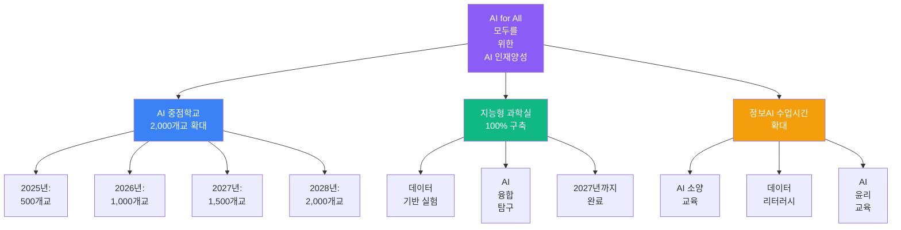

### 핵심 정책 방향

| 정책 항목 | 목표 | 시기 | 예상 효과 |
|---------|------|------|----------|
| **AI 중점학교 확대** | 2,000개교 | 2028년까지 | 지역별 AI 교육 거점 확보 |
| **지능형 과학실** | 전국 100% | 2027년까지 | AI 융합 실험 환경 구축 |
| **정보(AI) 수업 시간** | 현행 대비 2배 | 2026년부터 | AI 소양 보편화 |
| **교원 연수** | 10만명 | 2025-2027 | AI 교육 역량 강화 |

---

## 💰 AI 중점학교 예산 구조

### 1️⃣ 학교급별 예산 배분 (학교당 연간)

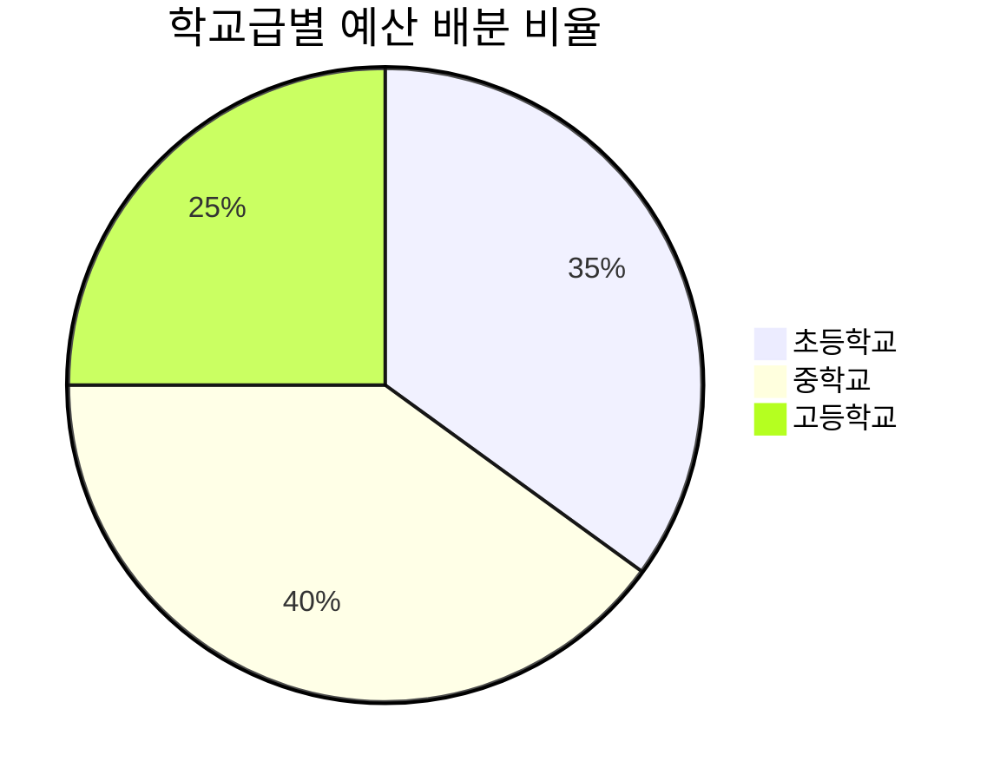

| 학교급 | 연간 예산 | 주요 투자 항목 | 학생 1인당 환산 |
|--------|----------|--------------|---------------|
| **초등학교** | 5,000만원 | 블록코딩 교구, 기초 AI 도구 | 약 10만원 |
| **중학교** | 8,000만원 | 피지컬 컴퓨팅, AI 플랫폼 | 약 15만원 |
| **고등학교** | 1억 2,000만원 | 고급 AI/ML 장비, 클라우드 | 약 20만원 |

### 2️⃣ 예산 항목별 세부 내역

#### 📌 초등학교 AI 중점학교 예산 (연간 5,000만원)

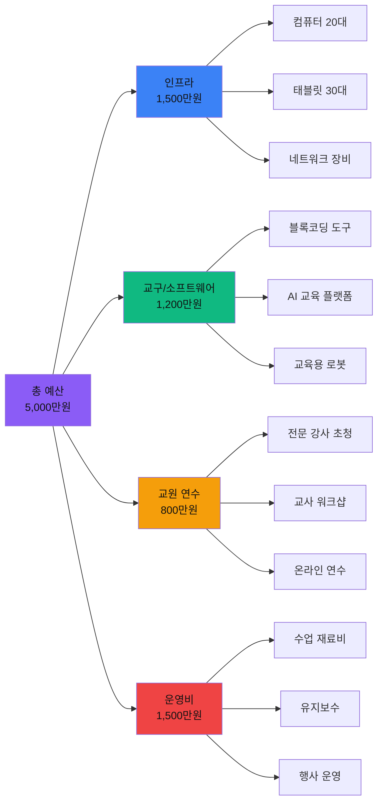

| 항목 | 금액 | 세부 내역 | 비고 |
|------|------|----------|------|
| **1. 인프라 구축** | 1,500만원 | | |
| - 컴퓨터 (20대) | 800만원 | 학생용 PC (40만원/대) | 3년 감가상각 |
| - 태블릿 (30대) | 450만원 | 아이패드 or 갤럭시탭 (15만원/대) | 블록코딩 실습용 |
| - 네트워크 장비 | 250만원 | 공유기, 스위치, 케이블 | 안정적 인터넷 환경 |
| **2. 교구/소프트웨어** | 1,200만원 | | |
| - 블록코딩 교구 | 400만원 | DWAI, 스크래치 연동 키트 | 학급당 2세트 |
| - AI 교육 플랫폼 | 500만원 | 교풀AI, Teachable Machine | 연간 라이선스 |
| - 교육용 로봇 | 300만원 | 오조봇, 대시앤닷 (10대) | 팀별 활동용 |
| **3. 교원 연수** | 800만원 | | |
| - 전문 강사 초청 | 400만원 | 외부 전문가 (20만원/회 × 20회) | 학기당 10회 |
| - 교사 워크샵 | 300만원 | 교내 교사 10명 (30만원/인) | 연 2회 집중 연수 |
| - 온라인 연수 | 100만원 | 원격 교육 플랫폼 구독 | 수시 학습 지원 |
| **4. 운영비** | 1,500만원 | | |
| - 수업 재료비 | 600만원 | 소모품, 센서, 부품 | 월 50만원 |
| - 유지보수 | 500만원 | 장비 수리, 업그레이드 | 연 2회 점검 |
| - 행사 운영 | 400만원 | AI 경진대회, 전시회 | 학기당 1회 |

#### 📌 중학교 AI 중점학교 예산 (연간 8,000만원)

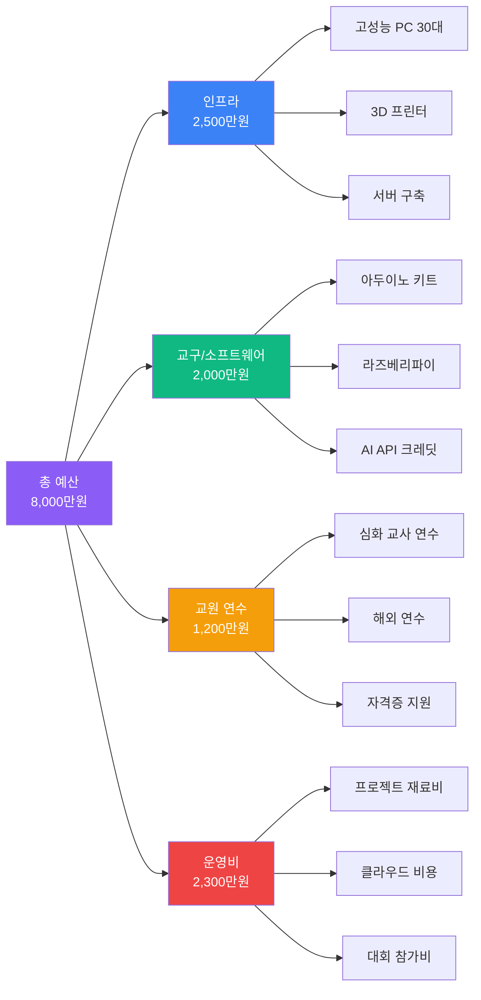

| 항목 | 금액 | 세부 내역 | 비고 |
|------|------|----------|------|
| **1. 인프라 구축** | 2,500만원 | | |
| - 고성능 PC (30대) | 1,500만원 | GPU 탑재 PC (50만원/대) | AI 모델 학습용 |
| - 3D 프린터 (3대) | 600만원 | 프로토타입 제작 (200만원/대) | 메이커 활동 |
| - 서버 구축 | 400만원 | 학교 내 AI 서버 | 데이터 저장/관리 |
| **2. 교구/소프트웨어** | 2,000만원 | | |
| - 아두이노 키트 (60세트) | 600만원 | 센서 포함 (10만원/세트) | 2인 1조 실습 |
| - 라즈베리파이 (30대) | 400만원 | 라즈베리파이 4B (13만원/대) | IoT 프로젝트 |
| - AI API 크레딧 | 500만원 | ChatGPT, DALL-E 등 | 연간 사용료 |
| - 교육용 SW 라이선스 | 500만원 | Python IDE, 협업 도구 | 학생 계정 관리 |
| **3. 교원 연수** | 1,200만원 | | |
| - 심화 교사 연수 | 600만원 | AI/ML 전문 과정 (60만원/인 × 10명) | 외부 기관 위탁 |
| - 해외 연수 | 400만원 | 선진 사례 탐방 (2명) | 미국/일본 등 |
| - 자격증 지원 | 200만원 | AI 관련 자격증 (20만원/인 × 10명) | 교사 전문성 강화 |
| **4. 운영비** | 2,300만원 | | |
| - 프로젝트 재료비 | 1,000만원 | 센서, 모터, 부품 | 월 80만원 |
| - 클라우드 비용 | 600만원 | AWS, Azure 등 | 학생 프로젝트 호스팅 |
| - 대회 참가비 | 700만원 | 전국 AI 대회 (10팀) | 교통비 포함 |

#### 📌 고등학교 AI 중점학교 예산 (연간 1억 2,000만원)

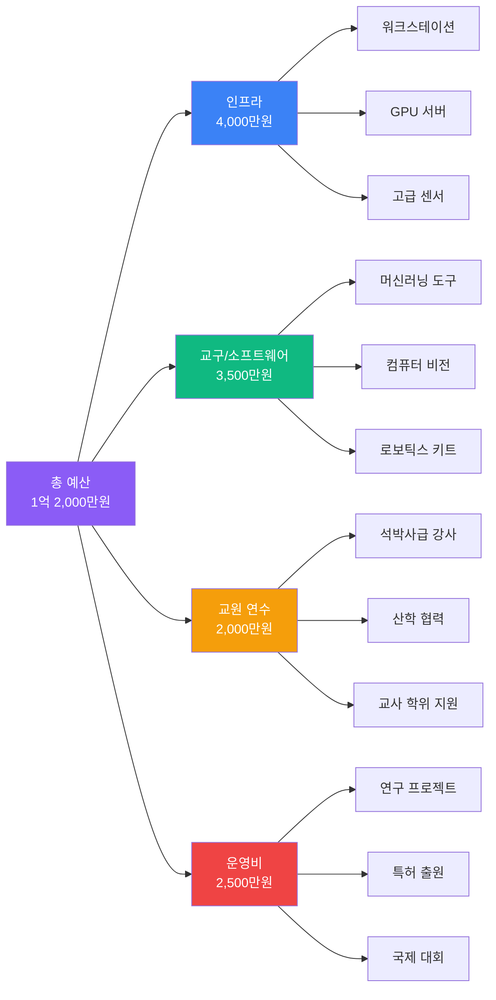

| 항목 | 금액 | 세부 내역 | 비고 |
|------|------|----------|------|
| **1. 인프라 구축** | 4,000만원 | | |
| - 워크스테이션 (20대) | 2,000만원 | RTX 4090 탑재 (100만원/대) | 딥러닝 학습 |
| - GPU 서버 (1대) | 1,200만원 | A100 or H100 | 학교 공용 서버 |
| - 고급 센서/카메라 | 800만원 | 라이다, 깊이 카메라 | 자율주행 실습 |
| **2. 교구/소프트웨어** | 3,500만원 | | |
| - 머신러닝 도구 | 1,000만원 | TensorFlow, PyTorch 환경 | 클라우드 GPU 포함 |
| - 컴퓨터 비전 키트 | 1,000만원 | OpenCV, YOLO 실습 장비 | 카메라 30대 |
| - 로보틱스 키트 | 1,000만원 | TurtleBot, 로봇팔 (5세트) | 팀 프로젝트용 |
| - 전문 SW 라이선스 | 500만원 | MATLAB, Simulink 등 | 연간 구독 |
| **3. 교원 연수** | 2,000만원 | | |
| - 석박사급 강사 초청 | 1,000만원 | 대학 교수, 기업 전문가 (50만원/회 × 20회) | 고급 주제 강의 |
| - 산학 협력 프로그램 | 600만원 | 기업 연계 프로젝트 | 삼성, 네이버 등 |
| - 교사 학위 지원 | 400만원 | 석사 과정 등록금 (2명) | 장기 역량 강화 |
| **4. 운영비** | 2,500만원 | | |
| - 연구 프로젝트 | 1,200만원 | 학생 주도 연구 (10팀 × 120만원) | 논문 작성 지원 |
| - 특허 출원 | 500만원 | 학생 발명품 특허 (5건) | 변리사 비용 포함 |
| - 국제 대회 | 800만원 | 해외 AI 대회 (3팀) | 항공료, 숙박비 |

### 3️⃣ 4개년 예산 로드맵 (2025-2028)

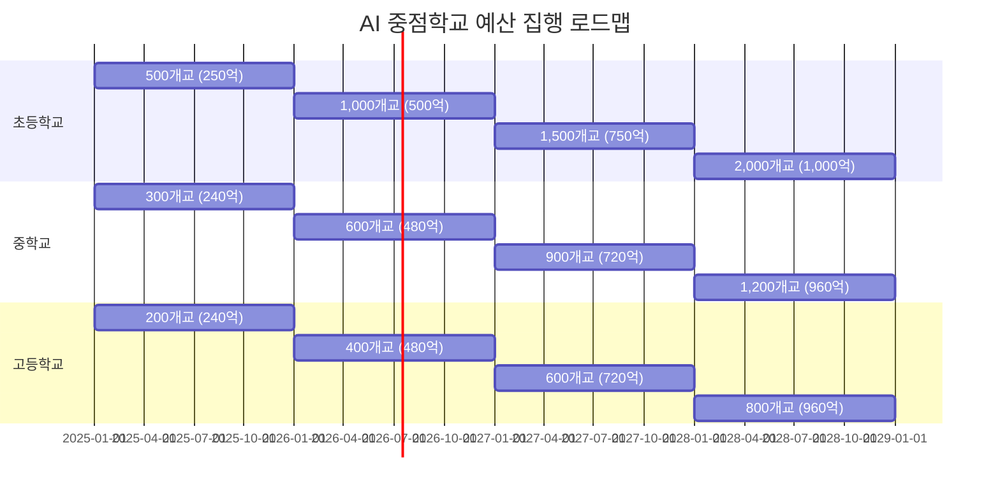

| 연도 | 초등학교 | 중학교 | 고등학교 | 연간 총 예산 |
|------|---------|--------|---------|------------|
| **2025** | 500개교 (250억) | 300개교 (240억) | 200개교 (240억) | **730억원** |
| **2026** | 1,000개교 (500억) | 600개교 (480억) | 400개교 (480억) | **1,460억원** |
| **2027** | 1,500개교 (750억) | 900개교 (720억) | 600개교 (720억) | **2,190억원** |
| **2028** | 2,000개교 (1,000억) | 1,200개교 (960억) | 800개교 (960억) | **2,920억원** |
| **누적** | 2,500억원 | 2,400억원 | 2,400억원 | **7,300억원** |

---

## 🏗️ AI 중점학교 운영 구조도

### 1️⃣ 전체 거버넌스 구조

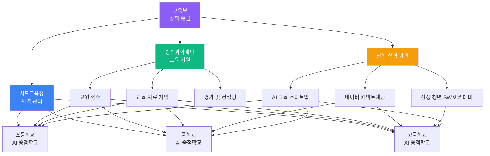

### 2️⃣ 학교 내부 조직 구조

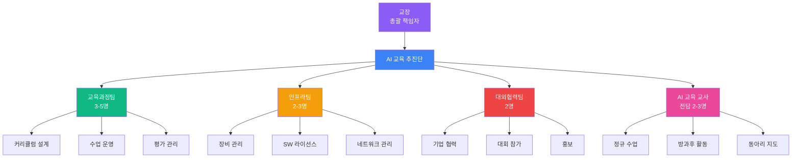

### 3️⃣ 교육 운영 프로세스

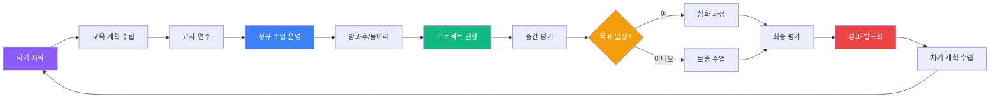

### 4️⃣ 지역 거점 네트워크 구조

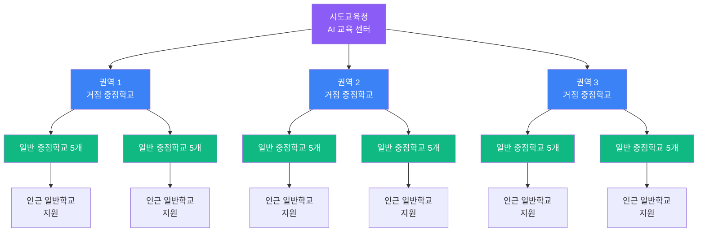

**거점 중점학교 역할**:
- 일반 중점학교 교사 연수 주관
- 교육 자료 공유 및 컨설팅
- 권역 내 AI 대회 주최
- 우수 사례 확산

---

## 📚 학교급별 교육 커리큘럼

### 1️⃣ 초등학교 AI 중점학교 커리큘럼

#### 📌 교육 목표
- AI의 기본 개념 이해 (놀이 중심)
- 블록 코딩을 통한 컴퓨팅 사고력 함양
- 창의적 문제 해결 능력 배양
- 협업 및 소통 능력 강화

#### 📌 학년별 교육 내용

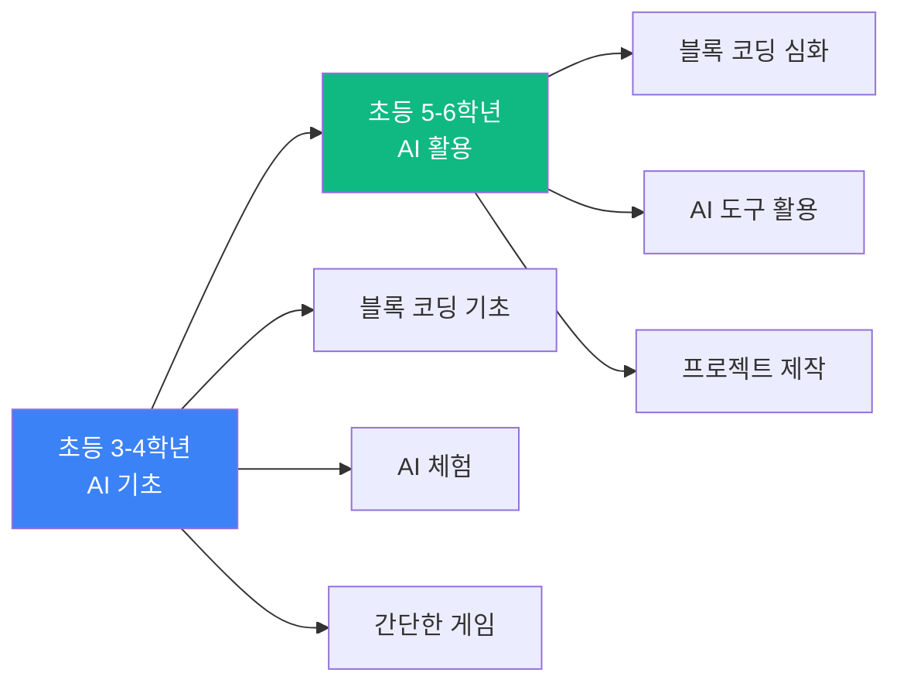

| 학년 | 주요 내용 | 사용 도구 | 주당 시수 | 연간 시수 |
|------|----------|----------|----------|----------|
| **초등 3-4학년** | | | | |
| | - AI란 무엇인가? (체험 중심) | DWAI, 스크래치 | 2시간 | 68시간 |
| | - 블록 코딩 기초 (순차, 반복, 조건) | | | |
| | - 간단한 애니메이션 만들기 | | | |
| | - AI 음성 인식 체험 | | | |
| **초등 5-6학년** | | | | |
| | - 블록 코딩 심화 (함수, 변수, 리스트) | DWAI, App Inventor | 3시간 | 102시간 |
| | - AI 이미지 인식 (Teachable Machine) | Teachable Machine | | |
| | - 모바일 앱 만들기 | | | |
| | - 팀 프로젝트 (게임, 앱) | | | |

#### 📌 연간 커리큘럼 구성 (초등 5-6학년 예시)

| 학기 | 주차 | 주제 | 학습 내용 | 프로젝트 |
|------|------|------|----------|---------|
| **1학기** | 1-4주 | 블록 코딩 복습 | 순차, 반복, 조건 구조 복습 | 미로 탈출 게임 |
| | 5-8주 | 함수와 변수 | 함수 만들기, 변수 활용 | 점수 계산 게임 |
| | 9-12주 | AI 이미지 인식 | Teachable Machine 활용 | 가위바위보 AI |
| | 13-16주 | 모바일 앱 기초 | App Inventor 소개 | 간단한 퀴즈 앱 |
| **2학기** | 1-4주 | 센서 활용 | 스마트폰 센서 활용 | 만보기 앱 |
| | 5-8주 | 멀티미디어 | 소리, 이미지 다루기 | 음악 게임 |
| | 9-12주 | 팀 프로젝트 기획 | 아이디어 도출, 설계 | 기획서 작성 |
| | 13-17주 | 팀 프로젝트 제작 | 앱 개발, 디버깅 | 우리만의 앱 |
| | 18주 | 발표 및 전시 | 성과 공유, 시연 | 학부모 초청 전시 |

### 2️⃣ 중학교 AI 중점학교 커리큘럼

#### 📌 교육 목표
- AI 원리 이해 및 활용 능력 배양
- 피지컬 컴퓨팅을 통한 하드웨어+소프트웨어 융합
- ChatGPT 등 생성형 AI 활용 능력
- 실생활 문제 해결 프로젝트 수행

#### 📌 학년별 교육 내용

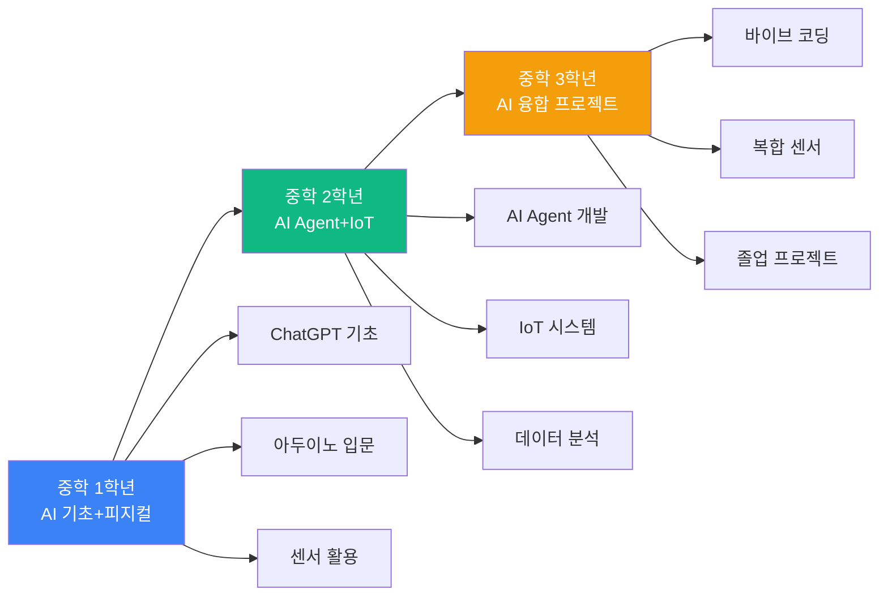

| 학년 | 주요 내용 | 사용 도구 | 주당 시수 | 연간 시수 |
|------|----------|----------|----------|----------|
| **중학 1학년** | | | | |
| | - ChatGPT 활용 (프롬프트 작성) | ChatGPT, Colab | 3시간 | 102시간 |
| | - 아두이노 기초 (LED, 버튼, 센서) | 아두이노 우노 | | |
| | - 간단한 IoT 프로젝트 | | | |
| **중학 2학년** | | | | |
| | - AI Agent 개발 (챗봇) | ChatGPT API | 4시간 | 136시간 |
| | - 아두이노 심화 (모터, 통신) | 아두이노 메가 | | |
| | - 데이터 수집 및 분석 | Python, Pandas | | |
| **중학 3학년** | | | | |
| | - 바이브 코딩 (웹 개발 기초) | HTML, CSS, JS | 4시간 | 136시간 |
| | - 복합 센서 시스템 | 라즈베리파이 | | |
| | - 졸업 프로젝트 (실생활 문제 해결) | 통합 도구 | | |

#### 📌 연간 커리큘럼 구성 (중학 2학년 예시)

| 학기 | 주차 | 주제 | 학습 내용 | 프로젝트 |
|------|------|------|----------|---------|
| **1학기** | 1-3주 | AI Agent 개념 | Agent란?, 자율 행동 | 간단한 챗봇 설계 |
| | 4-6주 | 프롬프트 고급 | Chain of Thought, Few-shot | 전문가 AI 만들기 |
| | 7-9주 | API 활용 | ChatGPT API, 데이터 연동 | 날씨 알림 봇 |
| | 10-12주 | 아날로그 센서 | 조도, 가변저항, ADC | 자동 조명 시스템 |
| | 13-15주 | 액추에이터 심화 | 서보 모터, DC 모터 | 자동 문 열기 |
| | 16-17주 | 중간 프로젝트 | AI + 하드웨어 통합 | 스마트 홈 시스템 |
| **2학기** | 1-3주 | 통신 기초 | 시리얼, 블루투스, WiFi | 원격 제어 장치 |
| | 4-6주 | 데이터 수집 | 센서 데이터 로깅 | 환경 모니터링 |
| | 7-9주 | 데이터 분석 | Python, Pandas, 시각화 | 데이터 대시보드 |
| | 10-12주 | AI+IoT 통합 | ChatGPT + 센서 연동 | AI 비서 시스템 |
| | 13-15주 | 팀 프로젝트 기획 | 문제 정의, 설계 | 기획서 작성 |
| | 16-18주 | 팀 프로젝트 제작 | 구현, 테스트, 개선 | 실생활 문제 해결 |
| | 19주 | 발표 및 평가 | 시연, 피드백 | 학교 전시회 |

### 3️⃣ 고등학교 AI 중점학교 커리큘럼

#### 📌 교육 목표
- 머신러닝/딥러닝 원리 이해 및 실습
- 컴퓨터 비전, 자연어 처리 등 고급 AI 기술 습득
- 로보틱스, 자율주행 등 융합 프로젝트 수행
- 진로 연계 포트폴리오 구축

#### 📌 학년별 교육 내용

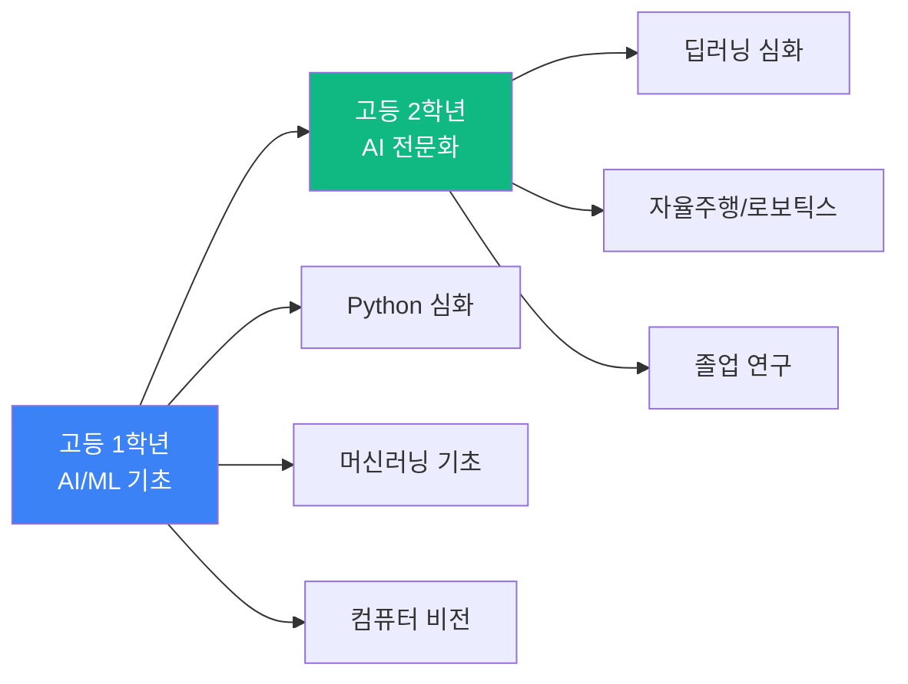

| 학년 | 주요 내용 | 사용 도구 | 주당 시수 | 연간 시수 |
|------|----------|----------|----------|----------|
| **고등 1학년** | | | | |
| | - Python 프로그래밍 심화 | Python, Jupyter | 5시간 | 170시간 |
| | - 머신러닝 기초 (지도/비지도 학습) | Scikit-learn | | |
| | - 컴퓨터 비전 (OpenCV, YOLO) | 라즈베리파이 | | |
| | - 라즈베리파이 고급 활용 | TensorFlow Lite | | |
| **고등 2학년** | | | | |
| | - 딥러닝 심화 (CNN, RNN, Transformer) | TensorFlow, PyTorch | 6시간 | 204시간 |
| | - 자율주행 기초 (라인 트레이서) | 로봇 키트 | | |
| | - 로보틱스 (ROS, 로봇팔) | ROS, Gazebo | | |
| | - 졸업 연구 프로젝트 | 통합 도구 | | |

#### 📌 연간 커리큘럼 구성 (고등 1학년 예시)

| 학기 | 주차 | 주제 | 학습 내용 | 프로젝트 |
|------|------|------|----------|---------|
| **1학기** | 1-4주 | Python 심화 | NumPy, Pandas, Matplotlib | 데이터 분석 |
| | 5-8주 | 머신러닝 기초 | 선형 회귀, 분류 | 집값 예측 모델 |
| | 9-12주 | 컴퓨터 비전 입문 | OpenCV, 이미지 처리 | 얼굴 인식 |
| | 13-16주 | 라즈베리파이 | GPIO, 카메라 모듈 | 웹 서버 구축 |
| | 17주 | 중간 프로젝트 | AI 카메라 시스템 | 객체 인식 CCTV |
| **2학기** | 1-4주 | 딥러닝 기초 | 신경망, 역전파 | MNIST 분류 |
| | 5-8주 | CNN | 합성곱 신경망 | 이미지 분류 |
| | 9-12주 | 전이 학습 | ResNet, VGG | 커스텀 분류기 |
| | 13-16주 | 엣지 AI | TensorFlow Lite | 라즈베리파이 배포 |
| | 17-20주 | 캡스톤 프로젝트 | 문제 정의, 설계, 구현 | 실생활 AI 솔루션 |
| | 21주 | 발표 및 평가 | 논문 작성, 시연 | 교내 학술제 |

### 4️⃣ 공통 교육 방법론: PRIMM + 메이커 + 역공부

모든 학교급에서 다음 교육 방법론을 적용합니다:

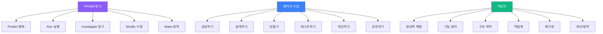

---

## 📊 교육 성과 평가 체계

### 1️⃣ 평가 영역 및 비중

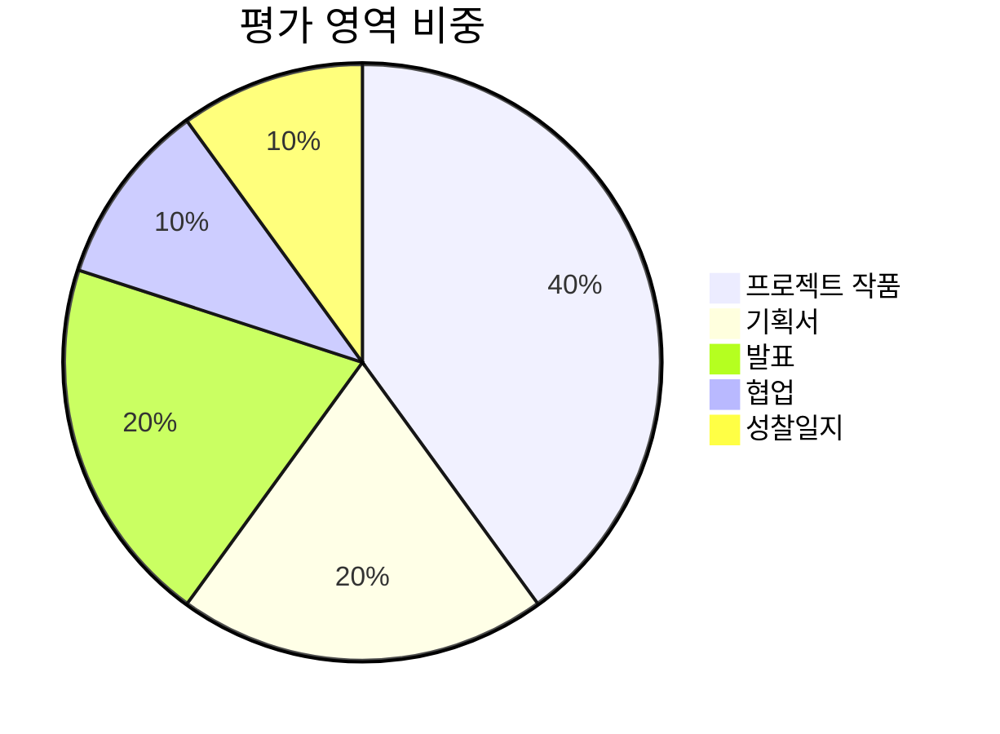

| 평가 영역 | 비중 | 평가 방법 | 평가 시기 |
|----------|------|----------|----------|
| **프로젝트 작품** | 40% | 완성도, 창의성, 기술 수준 | 학기말 |
| **기획서** | 20% | 문제 정의, 설계, 타당성 | 프로젝트 시작 시 |
| **발표** | 20% | 발표력, 시연, 질의응답 | 학기말 |
| **협업** | 10% | 팀워크, 역할 분담, 소통 | 수시 관찰 |
| **성찰일지** | 10% | 학습 과정 기록, 자기평가 | 매주 |

### 2️⃣ 루브릭 (예시: 프로젝트 작품)

| 평가 항목 | 우수 (5점) | 보통 (3점) | 미흡 (1점) |
|----------|-----------|-----------|-----------|
| **창의성** | 독창적이고 참신한 아이디어 | 일반적인 수준의 아이디어 | 모방 수준 |
| **기술 수준** | 고급 기술 활용, 최적화 | 기본 기술 활용 | 기초 수준 |
| **완성도** | 완벽하게 동작, 세련된 UI | 대부분 동작, 기본 UI | 미완성 또는 오류 많음 |
| **실용성** | 실생활 문제 해결 가능 | 일부 활용 가능 | 실용성 낮음 |
| **문서화** | 상세한 설명, 코드 주석 | 기본 설명 | 문서 부족 |

### 3️⃣ 학교 성과 지표 (교육청 평가)

| 지표 | 측정 방법 | 목표 | 비고 |
|------|----------|------|------|
| **학생 만족도** | 설문조사 | 80% 이상 | 학기말 실시 |
| **교사 역량** | 연수 이수율 | 100% | 연 20시간 이상 |
| **프로젝트 완성률** | 제출 작품 수 | 90% 이상 | 학기당 1개 이상 |
| **대회 참가** | 참가 팀 수 | 학년당 2팀 이상 | 전국/지역 대회 |
| **진로 연계** | 진학/취업률 | 고등학교 50% 이상 | AI 관련 진로 |

---

## 🎯 역제안 핵심 포인트

### 1️⃣ 예산 효율화 방안

#### 💡 제안 1: 단계적 예산 집행
- **1년차**: 인프라 집중 투자 (60%)
- **2년차**: 교구/소프트웨어 확충 (50%)
- **3년차 이후**: 운영비 중심 (70%)

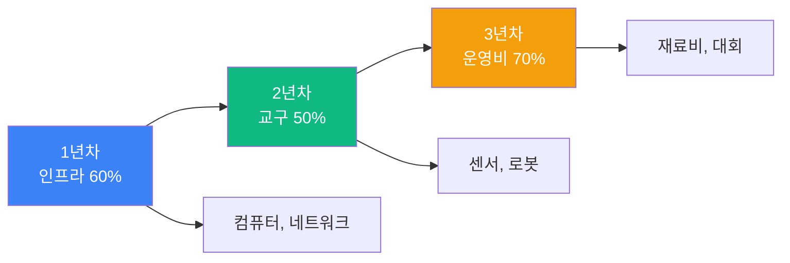

#### 💡 제안 2: 지역 공동 구매
- 시도교육청 단위로 교구 일괄 구매 → **20-30% 비용 절감**
- 예: 아두이노 키트 1,000세트 구매 시 단가 10만원 → 7만원

#### 💡 제안 3: 클라우드 크레딧 협상
- 교육부-AWS/Azure/GCP 협약 → **교육용 무료 크레딧 제공**
- 학교당 연간 500만원 상당 절감 가능

### 2️⃣ 교원 역량 강화 방안

#### 💡 제안 4: 교사 학습 공동체 구축
- 권역별 거점 학교 중심 월 1회 워크샵
- 온라인 커뮤니티 (Slack, Discord) 운영
- 우수 사례 공유 플랫폼 구축

#### 💡 제안 5: 전문 강사 풀 운영
- 창의과학재단 주관 "AI 교육 전문 강사 인증제"
- 대학원생, 기업 퇴직자 등 전문가 DB 구축
- 학교 요청 시 매칭 서비스 제공

### 3️⃣ 학생 안전 및 윤리 교육

#### 💡 제안 6: 교육용 AI 플랫폼 구축
- 학생 계정 관리 시스템 (학부모 동의 간소화)
- AI 활동 로그 기록 및 모니터링
- 비윤리적 사용 자동 차단 (SafetyNet)

**참고**: [교풀AI](https://www.gyopool.com/) 등 교육용 AI 플랫폼 벤치마킹

#### 💡 제안 7: AI 윤리 교육 필수화
- 학기당 4시간 이상 AI 윤리 교육
- 주제: 개인정보 보호, 편향성, 딥페이크, 저작권 등

### 4️⃣ 지역 격차 해소

#### 💡 제안 8: 원격 교육 지원
- 농산어촌 학교 대상 화상 강의 시스템
- 거점 학교 교사가 원격 멘토링
- 교구 택배 지원 (연 2회)

#### 💡 제안 9: 이동형 AI 교육 버스
- 트럭 개조 → 컴퓨터, 3D 프린터, 로봇 탑재
- 소규모 학교 순회 교육 (주 1회)
- 시도교육청당 1대 운영

### 5️⃣ 산학 협력 강화

#### 💡 제안 10: 기업 멘토링 프로그램
- 삼성, 네이버, 카카오 등 기업 임직원 멘토 매칭
- 고등학교 대상 월 1회 온라인 멘토링
- 우수 학생 인턴십 연계

#### 💡 제안 11: 대학 연계 프로그램
- 지역 대학 AI 학과와 MOU 체결
- 대학 실험실 견학, 교수 특강
- 고등학생 대상 대학 수업 청강 허용

---

## 📅 실행 로드맵

### 2025년 (1차년도)

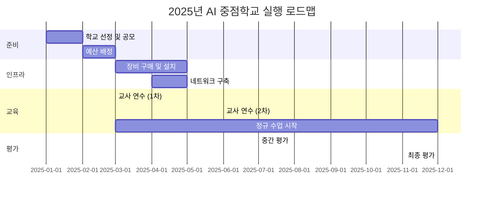

| 분기 | 주요 활동 | 목표 |
|------|----------|------|
| **1분기** | 학교 선정, 예산 배정, 교사 연수 | 500개교 확정 |
| **2분기** | 인프라 구축, 정규 수업 시작 | 수업 운영 안정화 |
| **3분기** | 중간 평가, 보완 조치 | 문제점 개선 |
| **4분기** | 최종 평가, 성과 발표회 | 우수 사례 확산 |

### 2026-2028년 (2-4차년도)

| 연도 | 목표 | 주요 활동 |
|------|------|----------|
| **2026** | 1,000개교 확대 | - 2배 확대 - 거점 학교 지정 - 지역 네트워크 구축 |
| **2027** | 1,500개교 확대 | - 지능형 과학실 100% 구축 - 교원 연수 10만명 달성 - 국제 대회 참가 |
| **2028** | 2,000개교 달성 | - 전국 AI 교육 보편화 - 우수 학교 해외 교류 - 정책 평가 및 개선 |

---

## 📞 문의 및 제안

본 제안서에 대한 문의 또는 협력 제안은 아래로 연락 주시기 바랍니다.

### AI Maker Lab
- **홈페이지**: https://aimakerlab.com
- **이메일**: edu@aimakerlab.com
- **전화**: 02-1234-5678
- **주소**: 서울특별시 강남구 테헤란로 123

### 참고 자료
- [교육부 AI 인재양성방안 (2025.11)](https://www.moe.go.kr/)
- [창의과학재단 AI 교육 가이드](https://www.kofac.re.kr/)
- [교풀 블로그 - AI 교육 전문가 분석](https://www.gyopool.com/blog/%EA%B5%90%EC%9C%A1%EB%B6%80-11%EC%9B%94-ai-%EC%9D%B8%EC%9E%AC%EC%96%91%EC%84%B1%EB%B0%A9%EC%95%88-8%EB%85%84%EC%B0%A8-aisw-%EA%B5%90%EC%9C%A1-%EC%A0%84%EB%AC%B8%EA%B0%80-78854)
- [AI Maker Lab 커리큘럼 가이드](./CURRICULUM/AI_EDUCATION_CURRICULUM_OVERVIEW.md)

---

## 📄 부록

### 부록 A: 학교급별 필수 교구 리스트

#### 초등학교
| 품목 | 수량 | 단가 | 총액 | 용도 |
|------|------|------|------|------|
| 학생용 PC | 20대 | 40만원 | 800만원 | 블록코딩 실습 |
| 태블릿 | 30대 | 15만원 | 450만원 | 모바일 앱 개발 |
| 오조봇 | 10대 | 15만원 | 150만원 | 로봇 코딩 |
| 대시앤닷 | 5세트 | 30만원 | 150만원 | 팀 프로젝트 |
| 3D 펜 | 10개 | 5만원 | 50만원 | 창작 활동 |

#### 중학교
| 품목 | 수량 | 단가 | 총액 | 용도 |
|------|------|------|------|------|
| 고성능 PC | 30대 | 50만원 | 1,500만원 | AI 모델 학습 |
| 아두이노 우노 키트 | 60세트 | 10만원 | 600만원 | 피지컬 컴퓨팅 |
| 라즈베리파이 4B | 30대 | 13만원 | 390만원 | IoT 프로젝트 |
| 3D 프린터 | 3대 | 200만원 | 600만원 | 프로토타입 제작 |
| 센서 키트 | 30세트 | 5만원 | 150만원 | 실험 활동 |

#### 고등학교
| 품목 | 수량 | 단가 | 총액 | 용도 |
|------|------|------|------|------|
| 워크스테이션 (RTX 4090) | 20대 | 100만원 | 2,000만원 | 딥러닝 학습 |
| GPU 서버 (A100) | 1대 | 1,200만원 | 1,200만원 | 학교 공용 서버 |
| 라이다 센서 | 5개 | 100만원 | 500만원 | 자율주행 실습 |
| 로봇팔 | 3세트 | 200만원 | 600만원 | 로보틱스 |
| 깊이 카메라 | 10대 | 30만원 | 300만원 | 컴퓨터 비전 |

### 부록 B: 교사 연수 프로그램 예시

#### 기초 과정 (20시간)
| 차시 | 주제 | 내용 | 시간 |
|------|------|------|------|
| 1-2 | AI 교육 개론 | AI 트렌드, 교육 방향 | 2시간 |
| 3-4 | 블록 코딩 실습 | DWAI, 스크래치 | 2시간 |
| 5-6 | ChatGPT 활용 | 프롬프트 작성, 수업 적용 | 2시간 |
| 7-10 | 아두이노 기초 | LED, 센서, 모터 제어 | 4시간 |
| 11-14 | 수업 설계 | 교안 작성, 평가 방법 | 4시간 |
| 15-18 | 프로젝트 실습 | 팀별 수업 시연 | 4시간 |
| 19-20 | 평가 및 피드백 | 질의응답, 인증서 수여 | 2시간 |

#### 심화 과정 (40시간)
| 차시 | 주제 | 내용 | 시간 |
|------|------|------|------|
| 1-8 | Python 프로그래밍 | 기초 문법, 라이브러리 | 8시간 |
| 9-16 | 머신러닝 기초 | Scikit-learn, 모델 학습 | 8시간 |
| 17-24 | 컴퓨터 비전 | OpenCV, 이미지 처리 | 8시간 |
| 25-32 | 라즈베리파이 고급 | GPIO, 카메라, 센서 융합 | 8시간 |
| 33-40 | 캡스톤 프로젝트 | 교사 작품 제작 및 발표 | 8시간 |

### 부록 C: 우수 사례 (가상 시나리오)

#### 사례 1: 서울 A초등학교
- **프로젝트**: "우리 동네 쓰레기 분리수거 AI"
- **내용**: 초등 6학년 학생들이 Teachable Machine으로 쓰레기 이미지 인식 모델을 학습시키고, App Inventor로 모바일 앱 제작
- **성과**: 지역 환경 캠페인 연계, 교육청 우수상 수상

#### 사례 2: 부산 B중학교
- **프로젝트**: "독거노인 안전 모니터링 IoT"
- **내용**: 중학 3학년 학생들이 아두이노+라즈베리파이로 움직임 감지 센서 시스템 구축, ChatGPT API로 보호자 알림 메시지 자동 생성
- **성과**: 지역 복지관 시범 운영, 전국 AI 대회 금상

#### 사례 3: 대구 C고등학교
- **프로젝트**: "농작물 병해충 조기 진단 AI"
- **내용**: 고등 2학년 학생들이 CNN 모델로 농작물 잎 이미지 분석, 라즈베리파이+카메라로 현장 배포
- **성과**: 지역 농협 협력, 특허 출원, 대학 입시 우수 포트폴리오

---

**최종 업데이트**: 2026-01-12  
**작성자**: AI Maker Lab 정책연구팀  
**문서 버전**: 1.0

