# 바이브 코딩 커리큘럼 (Frontend + Backend)

## 🎯 과정 개요

**대상**: 중등 2-3학년 (Frontend), 고등 1-2학년 (Backend)  
**총 시수**: 60시간 (Frontend 28시간 + Backend 32시간)  
**목표**: AI로 **빠르게 만들고, 반복해서 개선하는** 웹 개발자

### 교육 철학: 바이브 코딩이란?

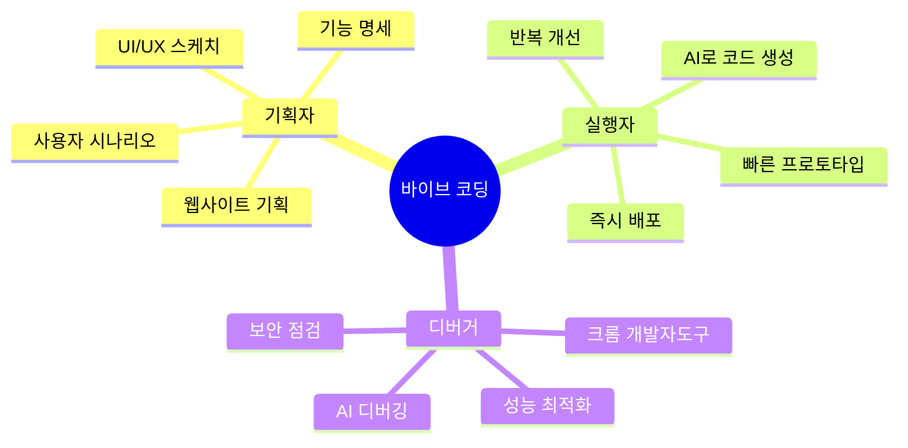

### 바이브 코딩 = 전통적 코딩 + AI

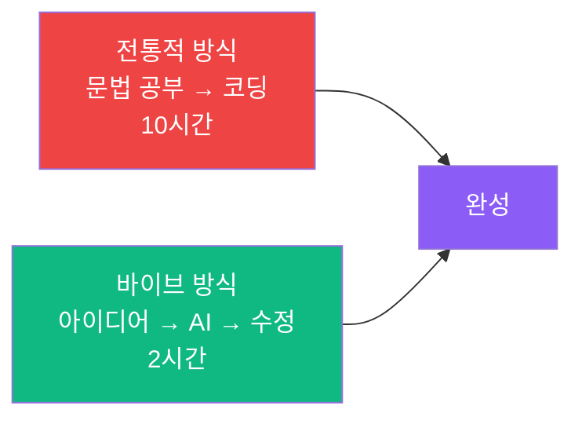

---

## 📚 전체 로드맵

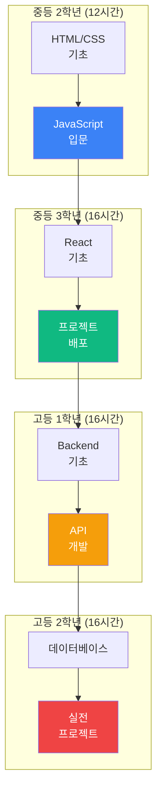

---

## 🎨 중등 2학년: HTML/CSS + JavaScript (12시간)

### PRIMM + 역공부 + AI 활용

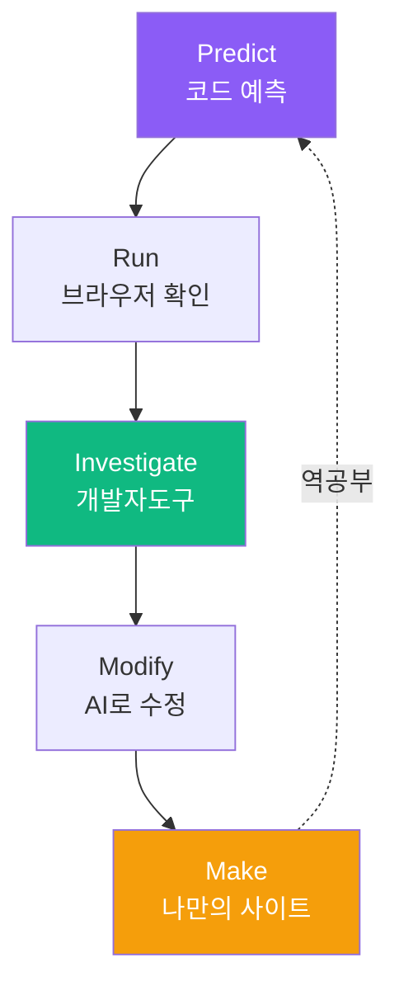

### 차시별 세부 계획

| 차시 | 주제 | AI 활용 | 역공부 대상 | 결과물 | 시간 |
|------|------|---------|-----------|--------|------|
| **1-2차시** | HTML 기초 | 구조 생성 80% | 유명 사이트 분석 | 자기소개 페이지 | 4시간 |
| **3-4차시** | CSS 스타일링 | 디자인 생성 90% | 인기 디자인 | 포트폴리오 사이트 | 4시간 |
| **5-6차시** | JavaScript | 인터랙션 90% | 동적 사이트 | 계산기 앱 | 4시간 |

### 역공부 예시: 네이버 메인 페이지

#### 1단계: 분석 (20분)
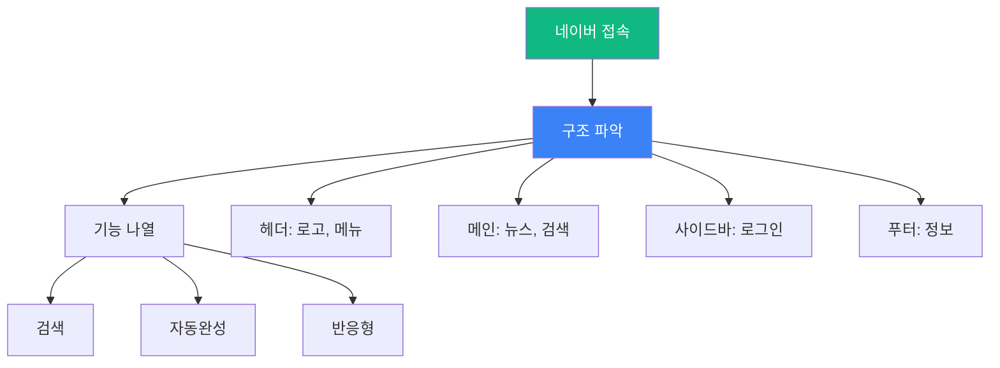

#### 2단계: ChatGPT에게 질문 (10분)
```
학생:
"네이버 같은 메인 페이지를 만들고 싶어.
필요한 HTML 구조를 알려줘"

ChatGPT:
"네이버 스타일의 페이지는 다음 구조가 필요합니다:

```html
<!DOCTYPE html>
<html>
<head>
    <title>내 포털</title>
    <style>
        /* CSS는 다음에 설명 */
    </style>
</head>
<body>
    <!-- 헤더 -->
    <header>
        <nav>
            <div class="logo">로고</div>
            <ul class="menu">
                <li>메일</li>
                <li>뉴스</li>
                <li>쇼핑</li>
            </ul>
        </nav>
    </header>
    
    <!-- 메인 -->
    <main>
        <div class="search-box">
            <input type="text" placeholder="검색어 입력">
            <button>검색</button>
        </div>
        <section class="news">
            <!-- 뉴스 영역 -->
        </section>
    </main>
    
    <!-- 푸터 -->
    <footer>
        <p>© 2025 My Portal</p>
    </footer>
</body>
</html>
```

각 태그 설명:
- `<header>`: 페이지 상단
- `<nav>`: 네비게이션 메뉴
..."
```

#### 3단계: 프로토타입 제작 (30분)
- ChatGPT 코드 복사
- 브라우저에서 확인
- AI에게 수정 요청
- 반복

#### 4단계: 나만의 스타일 (40분)
```
학생:
"이제 내 스타일로 바꾸고 싶어.
색상은 파란색 계열로, 폰트는 귀여운 느낌으로"

ChatGPT:
"좋아요! CSS를 이렇게 수정하세요:
..."
```

### AI 활용 개발 프로세스

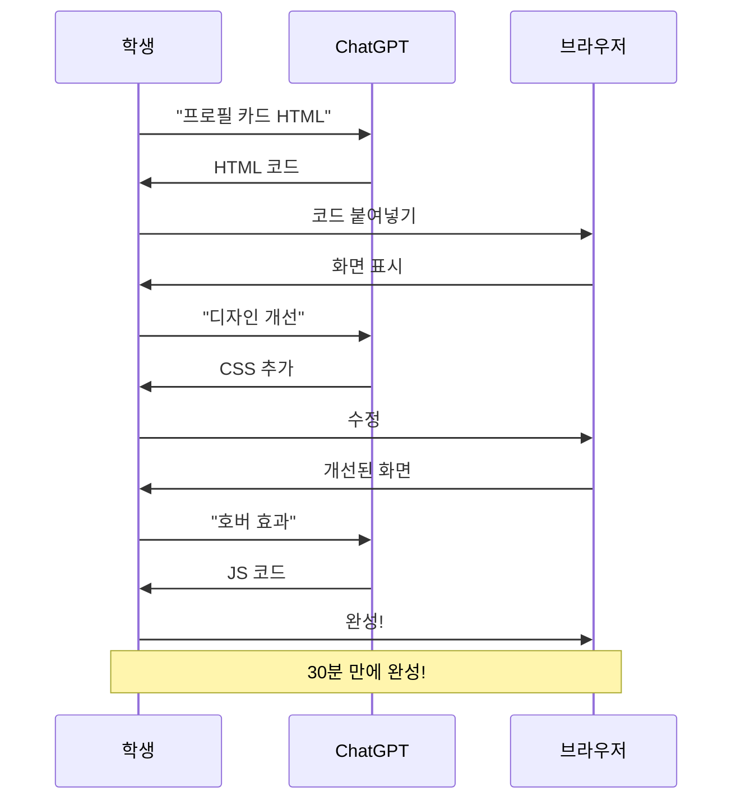

---

## ⚛️ 중등 3학년: React 기초 + 배포 (16시간)

### React를 왜 배우나?

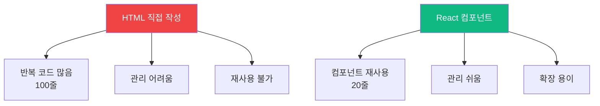

### 차시별 세부 계획

| 차시 | 주제 | AI 활용 비율 | 프로젝트 | 시간 |
|------|------|-------------|---------|------|
| **1-2차시** | React 기초 | 90% | Todo 앱 | 4시간 |
| **3-4차시** | 상태 관리 | 85% | 카운터 앱 | 4시간 |
| **5-6차시** | API 연동 | 80% | 날씨 앱 | 4시간 |
| **7-8차시** | 배포 | 95% | 포트폴리오 사이트 | 4시간 |

### 빠른 프로토타이핑: Todo 앱

#### 전통적 방식 (8시간)
1. React 문법 공부 (2시간)
2. 컴포넌트 설계 (1시간)
3. 코드 작성 (3시간)
4. 디버깅 (2시간)

#### 바이브 방식 (1시간)
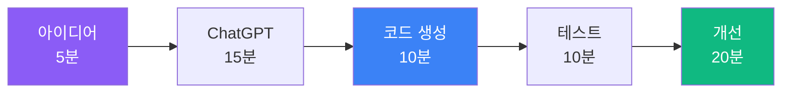

#### 실제 대화

```javascript
학생 → ChatGPT:
"React로 Todo 앱을 만들고 싶어.
초보자가 이해할 수 있게 간단한 버전으로 만들어줘"

ChatGPT:
"좋아요! 간단한 Todo 앱을 만들어드리겠습니다.

// App.js
import React, { useState } from 'react';

function App() {
  const [todos, setTodos] = useState([]);
  const [input, setInput] = useState('');

  const addTodo = () => {
    if (input.trim()) {
      setTodos([...todos, { text: input, id: Date.now() }]);
      setInput('');
    }
  };

  const deleteTodo = (id) => {
    setTodos(todos.filter(todo => todo.id !== id));
  };

  return (
    <div style={{ padding: '20px' }}>
      <h1>📝 Todo List</h1>
      
      <div>
        <input
          value={input}
          onChange={(e) => setInput(e.target.value)}
          placeholder="할 일 입력"
        />
        <button onClick={addTodo}>추가</button>
      </div>

      <ul>
        {todos.map(todo => (
          <li key={todo.id}>
            {todo.text}
            <button onClick={() => deleteTodo(todo.id)}>삭제</button>
          </li>
        ))}
      </ul>
    </div>
  );
}

export default App;

각 부분 설명:
- useState: 데이터 저장
- input: 입력값 추적
- todos: 할일 목록
- addTodo: 할일 추가 함수
- deleteTodo: 할일 삭제 함수
- map: 할일 목록 표시

실행 방법:
1. CodeSandbox.io 접속
2. React 템플릿 선택
3. 이 코드 붙여넣기
4. 즉시 확인!"
```

### 역공부: 인기 웹앱 분석

#### 대상: Trello (칸반 보드)

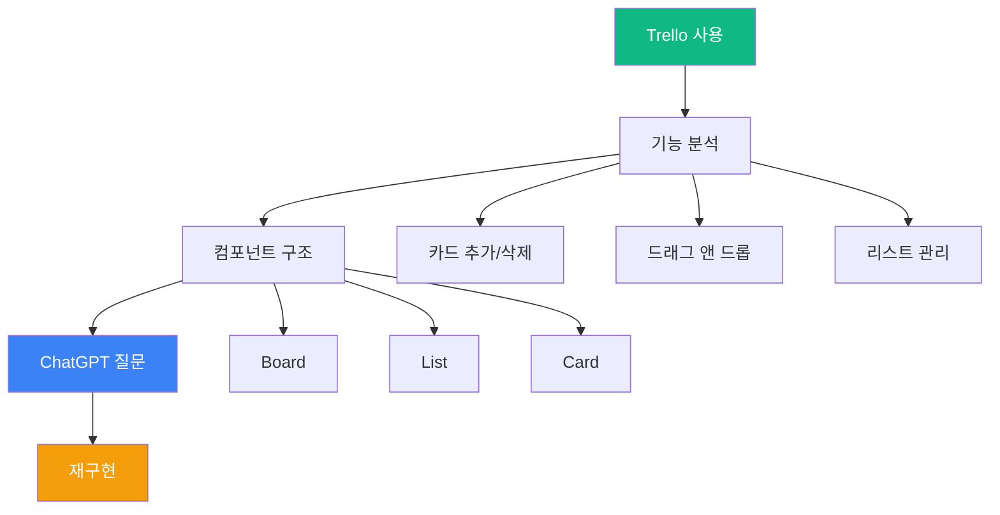

---

## 🔧 고등 1학년: Backend 기초 + API (16시간)

### Backend가 왜 필요할까?

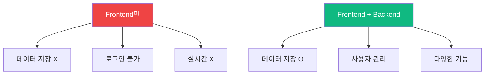

### 차시별 세부 계획

| 차시 | 주제 | AI 활용 | 프로젝트 | 시간 |
|------|------|---------|---------|------|
| **1-2차시** | Node.js 기초 | 90% | 간단한 서버 | 4시간 |
| **3-4차시** | Express | 90% | REST API | 4시간 |
| **5-6차시** | 데이터베이스 | 85% | 게시판 API | 4시간 |
| **7-8차시** | 인증 | 80% | 로그인 시스템 | 4시간 |

### AI로 API 빠르게 만들기

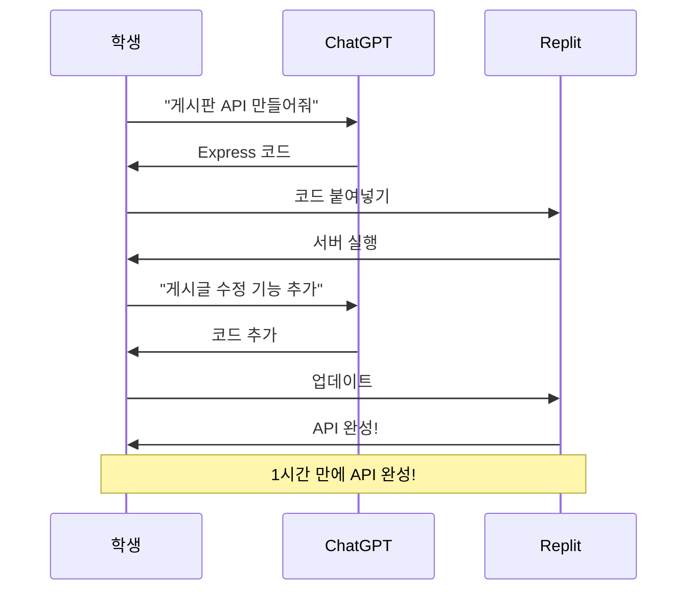

### 실제 예시: 게시판 API

```javascript
학생 → ChatGPT:
"Express로 간단한 게시판 API를 만들어줘.
기능:
1. 게시글 목록 조회 (GET /posts)
2. 게시글 작성 (POST /posts)
3. 게시글 수정 (PUT /posts/:id)
4. 게시글 삭제 (DELETE /posts/:id)

초보자도 이해할 수 있게 주석 많이 달아줘"

ChatGPT:
"네, 간단한 게시판 API를 만들어드리겠습니다.

// server.js
const express = require('express');
const app = express();

// JSON 파싱을 위한 미들웨어
app.use(express.json());

// 게시글 저장 (실제로는 데이터베이스 사용)
let posts = [
  { id: 1, title: '첫 글', content: '안녕하세요' }
];

// 1. 게시글 목록 조회
app.get('/posts', (req, res) => {
  // 모든 게시글 반환
  res.json(posts);
});

// 2. 게시글 작성
app.post('/posts', (req, res) => {
  const { title, content } = req.body;
  
  const newPost = {
    id: posts.length + 1,
    title,
    content
  };
  
  posts.push(newPost);
  res.json(newPost);
});

// 3. 게시글 수정
app.put('/posts/:id', (req, res) => {
  const id = parseInt(req.params.id);
  const { title, content } = req.body;
  
  const post = posts.find(p => p.id === id);
  if (!post) {
    return res.status(404).json({ error: '게시글 없음' });
  }
  
  post.title = title;
  post.content = content;
  res.json(post);
});

// 4. 게시글 삭제
app.delete('/posts/:id', (req, res) => {
  const id = parseInt(req.params.id);
  posts = posts.filter(p => p.id !== id);
  res.json({ message: '삭제 완료' });
});

// 서버 실행
app.listen(3000, () => {
  console.log('서버 실행: http://localhost:3000');
});

테스트 방법:
1. Postman 또는 Thunder Client 사용
2. GET http://localhost:3000/posts
3. POST http://localhost:3000/posts
   Body: { "title": "제목", "content": "내용" }
..."
```

---

## 💾 고등 2학년: 데이터베이스 + 실전 프로젝트 (16시간)

### 실전 프로젝트 아이디어

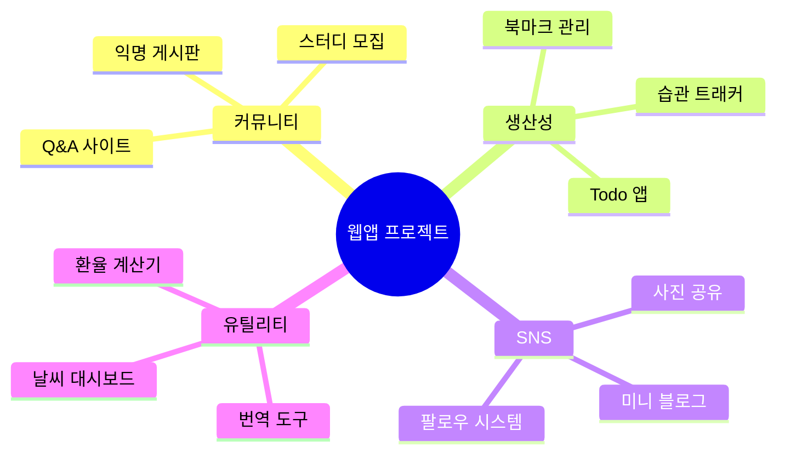

### 차시별 세부 계획

| 차시 | 주제 | AI 활용 | 프로젝트 | 시간 |
|------|------|---------|---------|------|
| **1-2차시** | MongoDB | 90% | 데이터 CRUD | 4시간 |
| **3-4차시** | 파일 업로드 | 85% | 이미지 게시판 | 4시간 |
| **5-8차시** | 종합 프로젝트 | 95% | 실전 웹앱 | 8시간 |

### 포트폴리오 프로젝트 프로세스

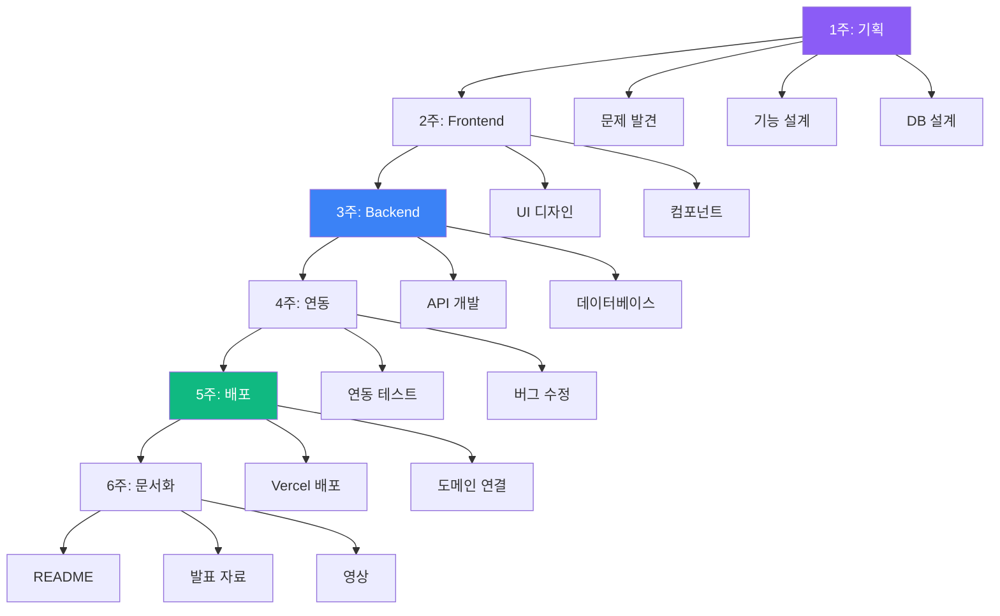

### 실전 예시: "스터디 모집 플랫폼"

#### 기획 (AI 활용)

```
학생 → ChatGPT:
"스터디 모집 웹사이트를 만들고 싶어.
어떤 기능이 필요할까?"

ChatGPT:
"좋은 프로젝트네요! 필수 기능을 정리해드리겠습니다:

MVP (최소 기능):
1. 회원가입/로그인
2. 스터디 등록
3. 스터디 목록 조회
4. 스터디 신청

추가 기능 (우선순위):
1. 검색/필터
2. 프로필
3. 댓글
4. 알림

데이터베이스 구조:
- Users (사용자)
  - id, email, password, name
- Studies (스터디)
  - id, title, description, creator_id, members[]
- Applications (신청)
  - id, study_id, user_id, status

개발 순서:
1주차: 회원가입/로그인
2주차: 스터디 CRUD
3주차: 신청 기능
4주차: 검색/필터
5주차: 배포"
```

#### 개발 (95% AI 활용)

**1주차: 백엔드 기초**
```javascript
학생 → ChatGPT:
"회원가입 API를 JWT 인증으로 만들어줘"

ChatGPT → 완전한 코드 제공
학생 → 복사 → 테스트 → 이해
```

**2주차: Frontend**
```javascript
학생 → ChatGPT:
"React로 스터디 목록 카드 컴포넌트 만들어줘"

ChatGPT → 컴포넌트 코드
학생 → 디자인 개선 요청
ChatGPT → Tailwind CSS 추가
```

**3주차: 연동**
```javascript
학생 → ChatGPT:
"Frontend에서 Backend API 호출하는 법"

ChatGPT → axios 사용법
학생 → 오류 발생
학생 → ChatGPT: "CORS 오류 해결"
ChatGPT → 해결 방법
```

---

## 📊 평가 시스템

### 프로젝트 기반 평가

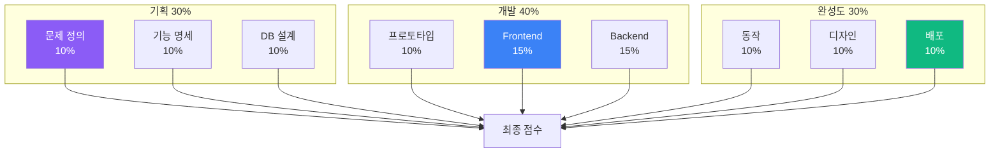

### AI 활용 수준 평가

| 수준 | AI 활용 | 이해도 | 점수 |
|------|---------|--------|------|
| **초급** | 코드 복사만 | 이해 부족 | 60점 |
| **중급** | 코드 수정 | 기본 이해 | 75점 |
| **고급** | AI와 협업 | 완전 이해 | 90점 |
| **전문가** | AI 도구화 | 응용 가능 | 100점 |

---

## 🛠️ 필요 도구

| 학년 | Frontend | Backend | 배포 | 비용 |
|------|----------|---------|------|------|
| **중2-3** | CodeSandbox | - | Netlify | 무료 |
| **고1-2** | Vite + React | Node + Express | Vercel | 무료 |

### 추천 AI 도구

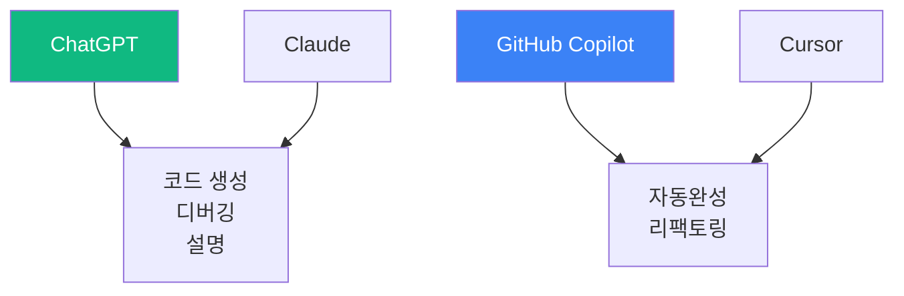

---

## 📚 학습 로드맵 요약

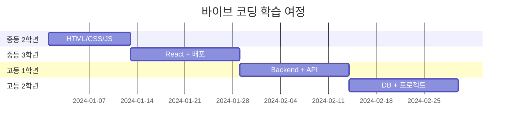

---

## 💡 성공 사례

### 학생 A: SNS 플랫폼 제작

**기간**: 6주  
**AI 활용**: 95%  
**결과**: 실제 서비스 배포, 사용자 50명

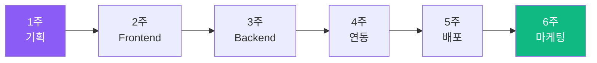

---

## 📞 문의

**홈페이지**: https://aimakerlab.com  
**이메일**: vibe@aimakerlab.com

---

**최종 업데이트**: 2025-12-29  
**작성자**: AI Maker Lab 바이브 코딩팀  
**문서 버전**: 1.0 (AI 협업 웹 개발)

