# AI 교육 커리큘럼 가이드

## 📚 개요

초등학교 4학년부터 고등학교 2학년까지의 **체계적인 AI 교육 로드맵**을 제시합니다.
- **블록 코딩(DWAI)**: 초등학생 중심
- **ChatGPT 활용**: 중학생부터 시작
- **피지컬 컴퓨팅**: 중·고등학생 중심

---

## 🎯 전체 교육 로드맵

### 단계별 교육 흐름

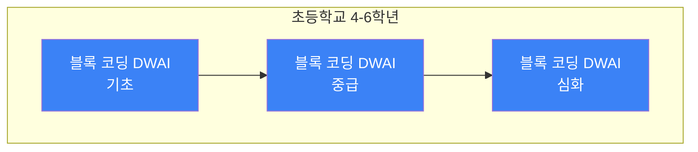

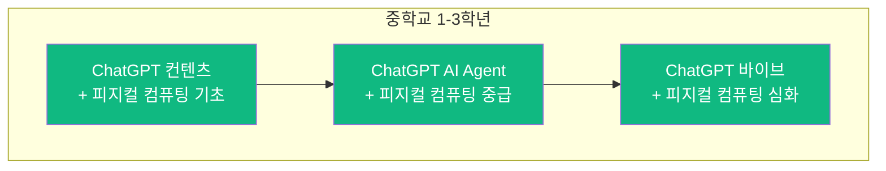
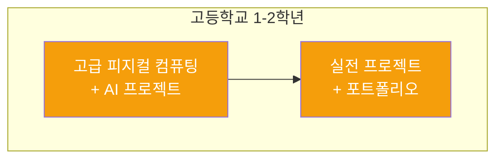

---

## 📊 학년별 교육 내용 종합표

| 학년 | 주요 내용 | 블록 코딩(DWAI) | ChatGPT | 피지컬 컴퓨팅 | 시수 |
|------|-----------|----------------|---------|--------------|------|
| **초등 4학년** | 블록 코딩 기초 | ⭐⭐⭐⭐⭐ | - | - | 12시간 |
| **초등 5학년** | 블록 코딩 중급 | ⭐⭐⭐⭐⭐ | - | - | 12시간 |
| **초등 6학년** | 블록 코딩 심화 | ⭐⭐⭐⭐⭐ | - | ⭐ (체험) | 16시간 |
| **중학 1학년** | ChatGPT + 피지컬 기초 | ⭐⭐ | ⭐⭐⭐⭐ | ⭐⭐⭐ | 20시간 |
| **중학 2학년** | AI Agent + 피지컬 중급 | ⭐ | ⭐⭐⭐⭐⭐ | ⭐⭐⭐⭐ | 24시간 |
| **중학 3학년** | 바이브 + 피지컬 심화 | - | ⭐⭐⭐⭐⭐ | ⭐⭐⭐⭐⭐ | 24시간 |
| **고등 1학년** | 고급 피지컬 + 프로젝트 | - | ⭐⭐⭐ | ⭐⭐⭐⭐⭐ | 28시간 |
| **고등 2학년** | 실전 프로젝트 | - | ⭐⭐ | ⭐⭐⭐⭐⭐ | 32시간 |

**총 교육 시간**: 168시간 (초등 40시간 + 중등 68시간 + 고등 60시간)

---

## 🎓 초등학교 4-6학년: 블록 코딩(DWAI) 중심

### 교육 목표

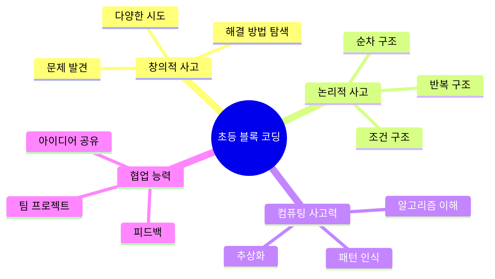

### 초등 4학년: 블록 코딩 기초

#### 교육 내용

| 차시 | 주제 | 학습 내용 | 실습 프로젝트 | 시간 |
|------|------|-----------|--------------|------|
| 1-2 | DWAI 소개 | - AI란 무엇인가?<br/>- 블록 코딩 기초<br/>- DWAI 플랫폼 사용법 | 간단한 애니메이션 만들기 | 2시간 |
| 3-4 | 순차 구조 | - 순차적 명령 실행<br/>- 캐릭터 움직이기<br/>- 좌표 개념 | 캐릭터 미로 탈출 | 2시간 |
| 5-6 | 반복 구조 | - 반복문 이해<br/>- 패턴 만들기<br/>- 효율적인 코딩 | 반복 패턴 애니메이션 | 2시간 |
| 7-8 | 조건 구조 | - 조건문 기초<br/>- 센서 값 활용<br/>- 의사 결정 | 간단한 게임 만들기 | 2시간 |
| 9-10 | 변수와 연산 | - 변수 개념<br/>- 점수 관리<br/>- 계산하기 | 점수 계산 게임 | 2시간 |
| 11-12 | 종합 프로젝트 | - 배운 내용 종합<br/>- 팀 프로젝트<br/>- 발표 | 나만의 게임 만들기 | 2시간 |

#### 학습 성과


### 초등 5학년: 블록 코딩 중급

#### 교육 내용

| 차시 | 주제 | 학습 내용 | 실습 프로젝트 | 시간 |
|------|------|-----------|--------------|------|
| 1-2 | 함수 개념 | - 함수란?<br/>- 함수 만들기<br/>- 재사용성 | 함수를 활용한 도형 그리기 | 2시간 |
| 3-4 | 이벤트 처리 | - 이벤트 개념<br/>- 키보드/마우스 입력<br/>- 인터랙션 | 키보드로 조종하는 게임 | 2시간 |
| 5-6 | 리스트 활용 | - 리스트 개념<br/>- 데이터 저장<br/>- 순회하기 | 퀴즈 게임 만들기 | 2시간 |
| 7-8 | AI 모델 체험 | - 이미지 인식<br/>- 음성 인식<br/>- 학습 데이터 | AI가 인식하는 그림 그리기 | 2시간 |
| 9-10 | 멀티미디어 | - 소리 다루기<br/>- 이미지 편집<br/>- 효과 적용 | 음악 게임 만들기 | 2시간 |
| 11-12 | 종합 프로젝트 | - 복합 기능 구현<br/>- 스토리텔링<br/>- 발표 | 스토리가 있는 게임 | 2시간 |

#### 학습 성과


### 초등 6학년: 블록 코딩 심화 + 피지컬 컴퓨팅 체험

#### 교육 내용

| 차시 | 주제 | 학습 내용 | 실습 프로젝트 | 시간 |
|------|------|-----------|--------------|------|
| 1-2 | 고급 알고리즘 | - 정렬 알고리즘<br/>- 검색 알고리즘<br/>- 최적화 | 숫자 정렬 게임 | 2시간 |
| 3-4 | 데이터 시각화 | - 차트 만들기<br/>- 그래프 표현<br/>- 분석 | 설문조사 결과 시각화 | 2시간 |
| 5-6 | 센서 기초 | - 센서란?<br/>- 온도/거리 센서<br/>- 데이터 읽기 | 센서로 환경 측정하기 | 2시간 |
| 7-8 | 액추에이터 기초 | - LED 제어<br/>- 모터 제어<br/>- 출력 장치 | LED 패턴 만들기 | 2시간 |
| 9-12 | 피지컬 체험 | - 아두이노 기초<br/>- 간단한 회로<br/>- 하드웨어+소프트웨어 | 신호등 시스템 만들기 | 4시간 |
| 13-16 | 졸업 프로젝트 | - 종합 프로젝트<br/>- 팀 협업<br/>- 발표 및 전시 | 우리만의 AI 작품 | 4시간 |

#### 학습 성과

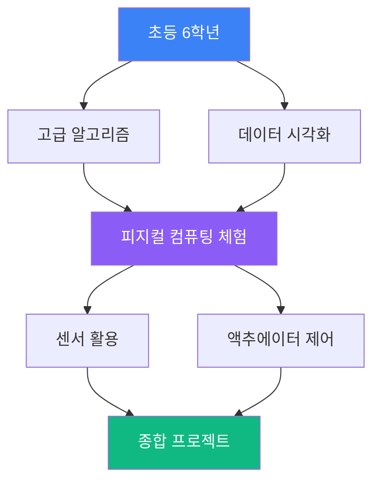

---

## 🎓 중학교 1-3학년: ChatGPT + 피지컬 컴퓨팅

### 교육 목표

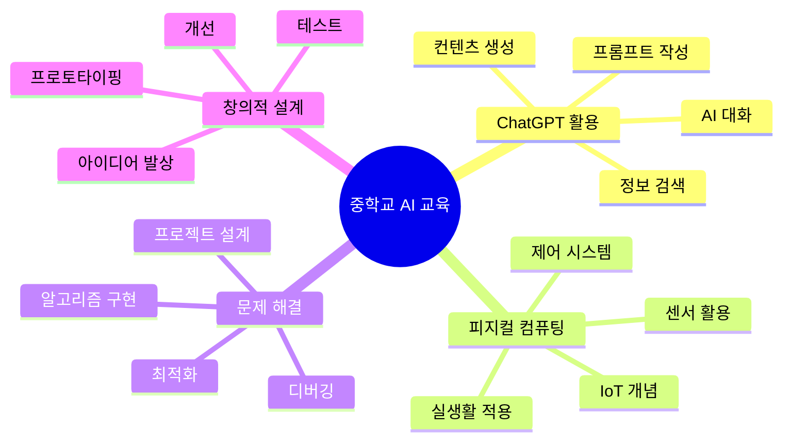

### 중학교 1학년: ChatGPT 컨텐츠 + 피지컬 컴퓨팅 기초

#### 교육 내용

| 차시 | 주제 | 학습 내용 | 실습 프로젝트 | 시간 |
|------|------|-----------|--------------|------|
| 1-3 | ChatGPT 소개 | - AI 언어 모델 이해<br/>- ChatGPT 기본 사용<br/>- 프롬프트 엔지니어링 기초 | 효과적인 질문 만들기 | 3시간 |
| 4-6 | 컨텐츠 생성 | - 글쓰기 보조<br/>- 번역 활용<br/>- 요약 기능 | ChatGPT로 스토리 만들기 | 3시간 |
| 7-9 | 학습 도우미 | - 개념 설명<br/>- 문제 풀이<br/>- 코드 설명 | 나만의 AI 튜터 활용법 | 3시간 |
| 10-12 | 아두이노 기초 | - 아두이노 구조<br/>- 디지털 입출력<br/>- 간단한 회로 | LED 제어하기 | 3시간 |
| 13-15 | 센서 활용 | - 버튼, 스위치<br/>- 온도 센서<br/>- 거리 센서 | 온도 모니터링 시스템 | 3시간 |
| 16-20 | 통합 프로젝트 | - ChatGPT로 기획<br/>- 아두이노 구현<br/>- 발표 | 스마트 알림 시스템 | 5시간 |

#### 기술 스택

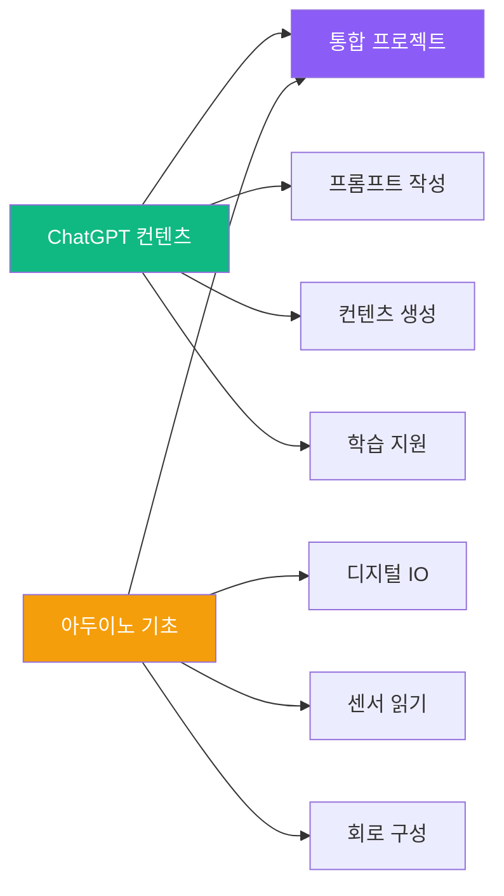

### 중학교 2학년: ChatGPT AI Agent + 피지컬 컴퓨팅 중급

#### 교육 내용

| 차시 | 주제 | 학습 내용 | 실습 프로젝트 | 시간 |
|------|------|-----------|--------------|------|
| 1-3 | AI Agent 개념 | - Agent란?<br/>- 자율 행동<br/>- 의사 결정 | 간단한 챗봇 설계 | 3시간 |
| 4-6 | 프롬프트 고급 | - Chain of Thought<br/>- Few-shot Learning<br/>- 역할 부여 | 전문가 AI 만들기 | 3시간 |
| 7-9 | API 활용 | - API 개념<br/>- ChatGPT API<br/>- 데이터 연동 | 날씨 알림 봇 | 3시간 |
| 10-12 | 아날로그 센서 | - 조도 센서<br/>- 가변저항<br/>- ADC 개념 | 자동 조명 시스템 | 3시간 |
| 13-15 | 액추에이터 심화 | - 서보 모터<br/>- DC 모터<br/>- 릴레이 | 자동 문 열기 시스템 | 3시간 |
| 16-18 | 통신 기초 | - 시리얼 통신<br/>- 블루투스<br/>- WiFi 모듈 | 원격 제어 장치 | 3시간 |
| 19-24 | AI+IoT 프로젝트 | - ChatGPT 연동<br/>- 센서 데이터 분석<br/>- 자동 제어 | 스마트 홈 시스템 | 6시간 |

#### 시스템 아키텍처

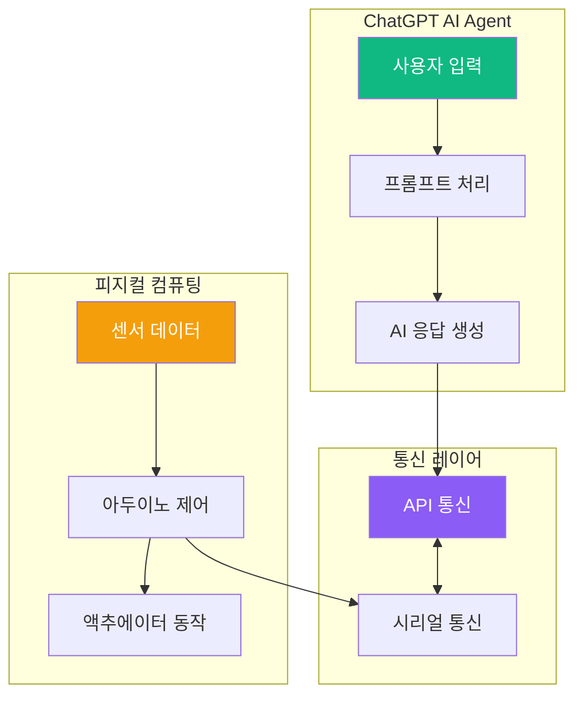

### 중학교 3학년: ChatGPT 바이브 + 피지컬 컴퓨팅 심화

#### 교육 내용

| 차시 | 주제 | 학습 내용 | 실습 프로젝트 | 시간 |
|------|------|-----------|--------------|------|
| 1-3 | 바이브 소개 | - 감성 AI<br/>- 페르소나 설정<br/>- 톤앤매너 | 나만의 AI 친구 만들기 | 3시간 |
| 4-6 | 멀티모달 AI | - 이미지 인식<br/>- 음성 인식<br/>- 통합 활용 | 시각+대화 AI | 3시간 |
| 7-9 | 창의적 AI | - 스토리 생성<br/>- 아이디어 브레인스토밍<br/>- 예술 활동 | AI 협업 창작 | 3시간 |
| 10-12 | 복합 센서 | - 다중 센서 통합<br/>- 센서 융합<br/>- 데이터 처리 | 환경 모니터링 시스템 | 3시간 |
| 13-15 | 디스플레이 활용 | - LCD/OLED<br/>- 정보 표시<br/>- UI 설계 | 정보 표시 장치 | 3시간 |
| 16-18 | 데이터 로깅 | - SD 카드<br/>- 클라우드 저장<br/>- 데이터 분석 | 환경 데이터 기록 시스템 | 3시간 |
| 19-24 | 졸업 프로젝트 | - AI+하드웨어 통합<br/>- 실생활 문제 해결<br/>- 포트폴리오 | 개인 AI 비서 시스템 | 6시간 |

#### 통합 시스템

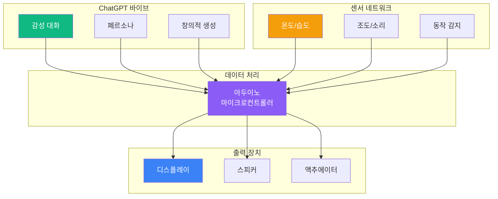

---

## 🎓 고등학교 1-2학년: 고급 피지컬 컴퓨팅 + AI 프로젝트

### 교육 목표

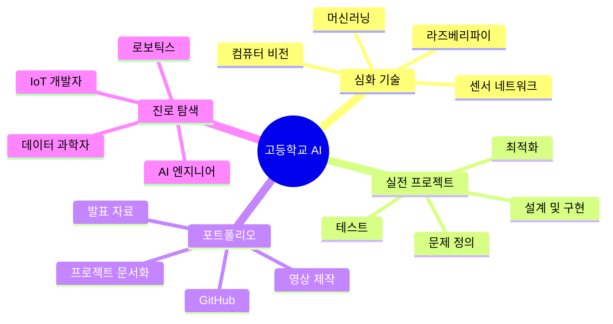

### 고등학교 1학년: 고급 피지컬 컴퓨팅 + AI 프로젝트

#### 교육 내용

| 차시 | 주제 | 학습 내용 | 실습 프로젝트 | 시간 |
|------|------|-----------|--------------|------|
| 1-4 | 라즈베리파이 | - 리눅스 기초<br/>- Python 프로그래밍<br/>- GPIO 제어 | 웹 서버 구축 | 4시간 |
| 5-8 | 컴퓨터 비전 | - OpenCV 기초<br/>- 이미지 처리<br/>- 객체 인식 | 얼굴 인식 시스템 | 4시간 |
| 9-12 | 머신러닝 기초 | - 지도 학습<br/>- 모델 학습<br/>- 예측 | 간단한 분류 모델 | 4시간 |
| 13-16 | 센서 네트워크 | - 다중 기기 통신<br/>- MQTT 프로토콜<br/>- 데이터 수집 | IoT 센서 네트워크 | 4시간 |
| 17-20 | AI 모델 통합 | - TensorFlow Lite<br/>- Edge AI<br/>- 최적화 | 엣지 AI 카메라 | 4시간 |
| 21-28 | 캡스톤 프로젝트 | - 문제 정의<br/>- 시스템 설계<br/>- 구현 및 테스트<br/>- 발표 | 실생활 AI 솔루션 | 8시간 |

#### 기술 스택

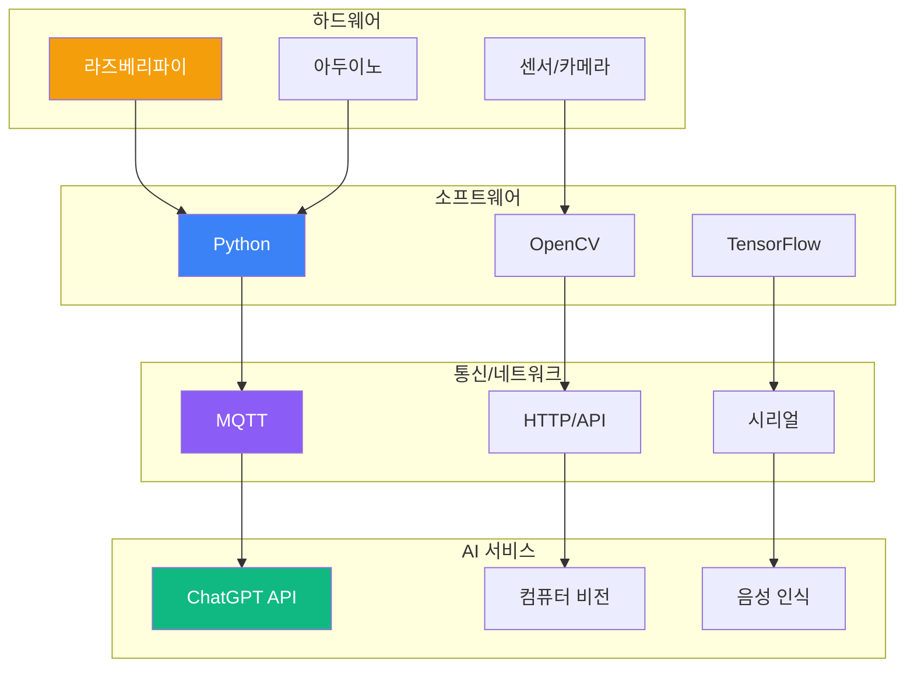

### 고등학교 2학년: 실전 프로젝트 + 포트폴리오

#### 교육 내용

| 차시 | 주제 | 학습 내용 | 실습 프로젝트 | 시간 |
|------|------|-----------|--------------|------|
| 1-4 | 프로젝트 설계 | - 아이디어 도출<br/>- 요구사항 분석<br/>- 시스템 설계 | 프로젝트 기획서 작성 | 4시간 |
| 5-8 | 고급 AI 활용 | - GPT-4 API<br/>- DALL-E<br/>- Whisper | 멀티모달 AI 앱 | 4시간 |
| 9-12 | 로보틱스 기초 | - 모터 제어<br/>- 센서 융합<br/>- 자율 주행 | 라인 트레이서 로봇 | 4시간 |
| 13-16 | 데이터 분석 | - 센서 데이터 분석<br/>- 시각화<br/>- 인사이트 도출 | 환경 데이터 대시보드 | 4시간 |
| 17-20 | 클라우드 연동 | - AWS/Azure<br/>- 데이터베이스<br/>- 웹 대시보드 | IoT 클라우드 플랫폼 | 4시간 |
| 21-32 | 졸업 프로젝트 | - 종합 시스템 구현<br/>- 테스트 및 디버깅<br/>- 문서화<br/>- 발표 및 전시 | 포트폴리오 프로젝트 | 12시간 |

#### 프로젝트 흐름


---

## 📈 학년별 역량 발전 단계

### 역량별 성장 곡선

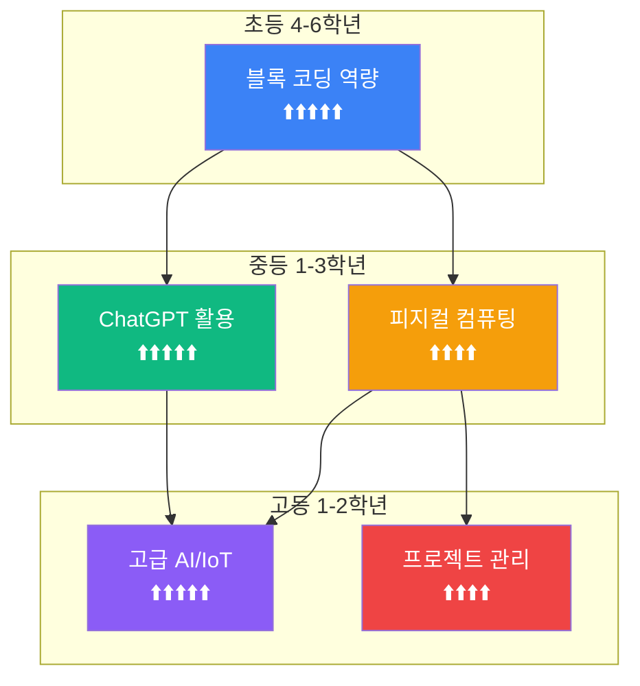

### 역량 매트릭스

| 역량 | 초4 | 초5 | 초6 | 중1 | 중2 | 중3 | 고1 | 고2 |
|------|-----|-----|-----|-----|-----|-----|-----|-----|
| **블록 코딩** | ⭐⭐ | ⭐⭐⭐⭐ | ⭐⭐⭐⭐⭐ | ⭐⭐⭐ | ⭐⭐ | ⭐ | - | - |
| **ChatGPT 활용** | - | - | - | ⭐⭐⭐ | ⭐⭐⭐⭐ | ⭐⭐⭐⭐⭐ | ⭐⭐⭐⭐ | ⭐⭐⭐⭐ |
| **피지컬 컴퓨팅** | - | - | ⭐ | ⭐⭐⭐ | ⭐⭐⭐⭐ | ⭐⭐⭐⭐⭐ | ⭐⭐⭐⭐⭐ | ⭐⭐⭐⭐⭐ |
| **Python** | - | - | - | ⭐ | ⭐⭐ | ⭐⭐⭐ | ⭐⭐⭐⭐ | ⭐⭐⭐⭐⭐ |
| **AI/ML** | - | - | - | ⭐ | ⭐⭐ | ⭐⭐⭐ | ⭐⭐⭐⭐ | ⭐⭐⭐⭐⭐ |
| **프로젝트 관리** | ⭐ | ⭐⭐ | ⭐⭐⭐ | ⭐⭐⭐ | ⭐⭐⭐⭐ | ⭐⭐⭐⭐ | ⭐⭐⭐⭐⭐ | ⭐⭐⭐⭐⭐ |

---

## 🎯 학습 목표 달성 지표

### 평가 기준

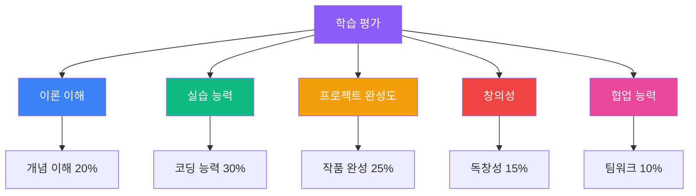

### 단계별 목표

| 단계 | 학년 | 핵심 목표 | 성취 기준 |
|------|------|-----------|----------|
| **입문** | 초4-5 | 블록 코딩 기초 마스터 | 간단한 게임을 혼자 만들 수 있음 |
| **기본** | 초6-중1 | 피지컬 컴퓨팅 이해 | 센서를 활용한 간단한 시스템 제작 |
| **중급** | 중2-중3 | ChatGPT + 하드웨어 통합 | AI를 활용한 IoT 프로젝트 완성 |
| **고급** | 고1 | 머신러닝 + 엣지 AI | 컴퓨터 비전을 활용한 시스템 |
| **심화** | 고2 | 포트폴리오 프로젝트 | 실생활 문제 해결 작품 전시 |

---

## 💡 교육 방법론

### 프로젝트 기반 학습(PBL)

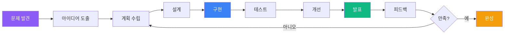

### 교수학습 전략

| 단계 | 교사 역할 | 학생 활동 | 도구 |
|------|-----------|-----------|------|
| **도입** | 동기 유발, 문제 제시 | 흥미 표현, 질문 | 영상, 사례 |
| **탐구** | 가이드, 힌트 제공 | 자료 조사, 토론 | 인터넷, ChatGPT |
| **설계** | 피드백 제공 | 아이디어 스케치, 계획 | 종이, 디지털 도구 |
| **구현** | 기술 지원 | 코딩, 제작 | DWAI, 아두이노 |
| **테스트** | 관찰, 질문 | 디버깅, 개선 | 테스트 도구 |
| **발표** | 촉진자 | 발표, 시연 | PPT, 작품 |
| **평가** | 피드백, 격려 | 자기평가, 동료평가 | 루브릭 |

---

## 🛠️ 필요 교구 및 장비

### 학년별 필수 교구

| 학년 | 소프트웨어 | 하드웨어 | 기타 |
|------|-----------|---------|------|
| **초4-6** | DWAI, Scratch | - | 노트북 |
| **중1** | DWAI, ChatGPT, Arduino IDE | 아두이노 우노, LED, 버튼, 센서 키트 | 브레드보드, 점퍼선 |
| **중2** | Python, Arduino IDE, ChatGPT API | 아두이노 메가, 모터, 서보, 블루투스 | 배터리, 케이스 |
| **중3** | Python, Arduino IDE, ChatGPT, OpenCV | 아두이노 메가, LCD, WiFi 모듈, 카메라 | SD 카드, 센서 |
| **고1** | Python, TensorFlow, OpenCV, ROS | 라즈베리파이 4, 카메라, 센서 네트워크 | 전원, 케이스 |
| **고2** | Full Stack (Python, JS, DB) | 라즈베리파이, 아두이노, 로봇 키트 | 클라우드 계정 |

### 교구 예산 (학생 1인당)

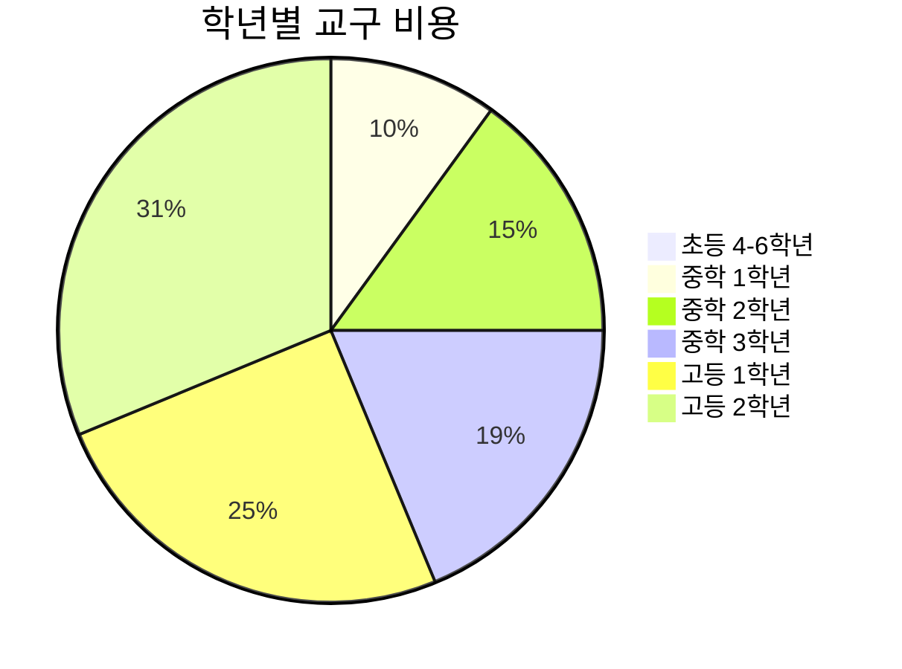

| 학년 | 예상 비용 | 주요 항목 |
|------|----------|----------|
| 초4-6 | 무료 | DWAI 온라인 플랫폼 |
| 중1 | 8만원 | 아두이노 우노 기본 키트 |
| 중2 | 12만원 | 아두이노 메가 + 추가 센서 |
| 중3 | 15만원 | WiFi 모듈, LCD, 카메라 모듈 |
| 고1 | 20만원 | 라즈베리파이 4 + 센서 |
| 고2 | 25만원 | 로봇 키트 + 추가 부품 |

---

## 📚 참고 자료 및 온라인 리소스

### 학습 플랫폼

| 플랫폼 | 내용 | 대상 | URL |
|--------|------|------|-----|
| **DWAI** | Dancing with AI 블록 코딩 | 초등 | https://dwai.ai |
| **ChatGPT** | AI 대화 및 컨텐츠 생성 | 중등 이상 | https://chat.openai.com |
| **Arduino** | 피지컬 컴퓨팅 IDE | 중등 이상 | https://www.arduino.cc |
| **TensorFlow** | 머신러닝 프레임워크 | 고등 | https://www.tensorflow.org |
| **GitHub** | 코드 버전 관리 | 고등 | https://github.com |

### 추천 교재

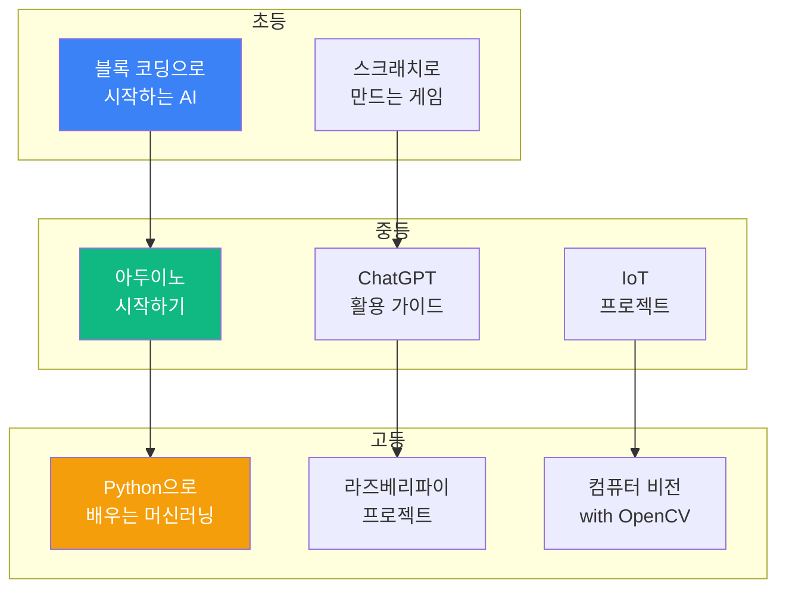

---

## 🎓 진로 연계

### AI 관련 진로 경로

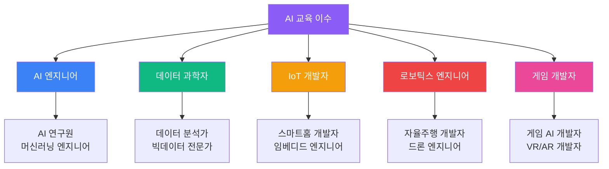

### 대학 전공 연계

| 진로 분야 | 추천 전공 | 필요 역량 |
|----------|----------|----------|
| **AI/ML** | 컴퓨터공학, 인공지능학 | Python, 머신러닝, 수학 |
| **데이터 과학** | 통계학, 데이터사이언스 | Python, 통계, 분석 |
| **IoT** | 전자공학, 임베디드시스템 | C/C++, 회로, 통신 |
| **로보틱스** | 기계공학, 메카트로닉스 | 제어, 센서, 기구 |
| **게임** | 게임학, 소프트웨어공학 | 프로그래밍, 그래픽, AI |

---

## 📝 교육 운영 가이드

### 수업 운영 모델

```mermaid
graph LR
    A[정규 과정<br/>주 1회 2시간] --> D[수료]
    B[방학 집중<br/>주 5일 3시간] --> D
    C[자유학기제<br/>주 2회 3시간] --> D
    
    D --> E[수료증 발급]
    D --> F[포트폴리오]
    
    style A fill:#3b82f6,color:#fff
    style B fill:#10b981,color:#fff
    style C fill:#f59e0b,color:#fff
    style E fill:#8b5cf6,color:#fff
```

### 수업 구성 (2시간 기준)

| 시간 | 활동 | 내용 |
|------|------|------|
| 0-10분 | 도입 | 지난 시간 복습, 동기 유발 |
| 10-40분 | 개념 학습 | 새로운 개념 설명, 시연 |
| 40-90분 | 실습 | 프로젝트 제작, 문제 해결 |
| 90-110분 | 발표/공유 | 결과물 공유, 토론 |
| 110-120분 | 정리 | 요약, 과제 안내 |

---

## 🎯 학습 성과 관리

### 포트폴리오 구성

```mermaid
graph TB
    A[학생 포트폴리오]
    
    A --> B[프로젝트 작품]
    A --> C[학습 일지]
    A --> D[인증서]
    A --> E[발표 자료]
    
    B --> B1[코드<br/>GitHub]
    B --> B2[영상<br/>YouTube]
    B --> B3[사진<br/>문서]
    
    C --> C1[주간 일지]
    C --> C2[회고록]
    
    D --> D1[수료증]
    D --> D2[자격증]
    
    E --> E1[PPT]
    E --> E2[시연 영상]
    
    style A fill:#8b5cf6,color:#fff
    style B fill:#3b82f6,color:#fff
    style C fill:#10b981,color:#fff
    style D fill:#f59e0b,color:#fff
    style E fill:#ef4444,color:#fff
```

### 평가 루브릭

| 평가 항목 | 우수 (5점) | 보통 (3점) | 미흡 (1점) |
|----------|-----------|-----------|-----------|
| **이해도** | 개념을 완벽히 이해하고 응용 | 개념을 이해함 | 개념 이해 부족 |
| **코딩 능력** | 독립적으로 구현 가능 | 도움을 받아 구현 | 구현 어려움 |
| **창의성** | 독창적인 아이디어 | 일반적인 수준 | 모방 수준 |
| **완성도** | 완벽하게 동작 | 대부분 동작 | 미완성 |
| **발표** | 명확하고 설득력 있음 | 무난하게 설명 | 설명 부족 |

---

## 📞 문의 및 등록

### 교육 신청 절차

```mermaid
graph LR
    A[홈페이지 방문] --> B[과정 선택]
    B --> C[온라인 신청]
    C --> D[상담 예약]
    D --> E[수강료 결제]
    E --> F[교육 시작]
    
    style A fill:#3b82f6,color:#fff
    style C fill:#10b981,color:#fff
    style F fill:#f59e0b,color:#fff
```

### 연락처

- **홈페이지**: https://aimakerlab.com
- **이메일**: edu@aimakerlab.com
- **전화**: 02-1234-5678
- **카카오톡**: @aimakerlab

---

**최종 업데이트**: 2025-12-29  
**작성자**: AI Maker Lab 교육팀  
**문서 버전**: 1.0


