# AI 교육 커리큘럼 통합 가이드

## 🎯 교육 철학

### 기획자 + 실행자 + 디버거 양성

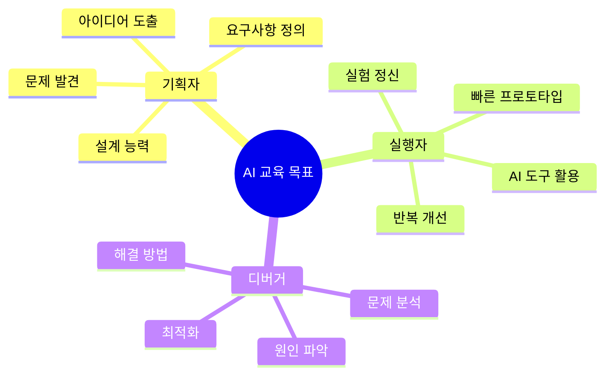

### 핵심 교육 방법론

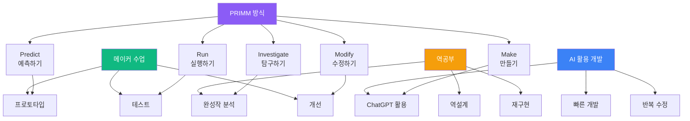

---

## 📚 4대 교육 과정 체계

### 전체 로드맵

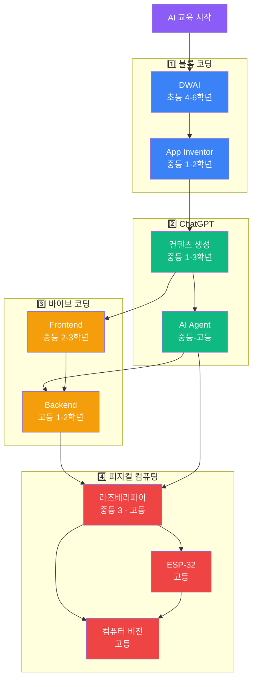

---

## 📊 과정별 학년 매핑

| 과정 | 초4 | 초5 | 초6 | 중1 | 중2 | 중3 | 고1 | 고2 |
|------|-----|-----|-----|-----|-----|-----|-----|-----|
| **블록 코딩** | ⭐⭐⭐ | ⭐⭐⭐ | ⭐⭐⭐ | ⭐⭐ | ⭐ | - | - | - |
| **ChatGPT** | - | - | - | ⭐⭐⭐ | ⭐⭐⭐⭐ | ⭐⭐⭐⭐⭐ | ⭐⭐⭐⭐ | ⭐⭐⭐⭐ |
| **바이브 코딩** | - | - | - | - | ⭐⭐ | ⭐⭐⭐⭐ | ⭐⭐⭐⭐⭐ | ⭐⭐⭐⭐⭐ |
| **피지컬 컴퓨팅** | - | - | - | - | - | ⭐⭐ | ⭐⭐⭐⭐ | ⭐⭐⭐⭐⭐ |

---

## 🎓 PRIMM 학습 방법론

### PRIMM 5단계

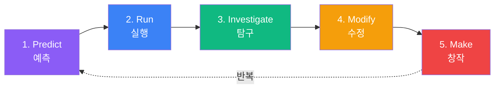

### 단계별 활동

| 단계 | 학생 활동 | 교사 역할 | 도구 | 시간 |
|------|-----------|----------|------|------|
| **1. Predict** | 코드/결과 예측, 가설 수립 | 질문 제시, 사고 유도 | 워크시트 | 10분 |
| **2. Run** | 코드 실행, 결과 확인 | 관찰 독려 | 개발 도구 | 5분 |
| **3. Investigate** | 코드 분석, 작동 원리 탐구 | 힌트 제공, 토론 촉진 | 디버거, ChatGPT | 15분 |
| **4. Modify** | 코드 수정, 기능 변경 | 피드백 제공 | AI 도구 | 20분 |
| **5. Make** | 새로운 작품 창작 | 격려, 공유 촉진 | 전체 도구 | 30분 |

---

## 🔄 역공부(Reverse Engineering) 프로세스

### 역공부 4단계

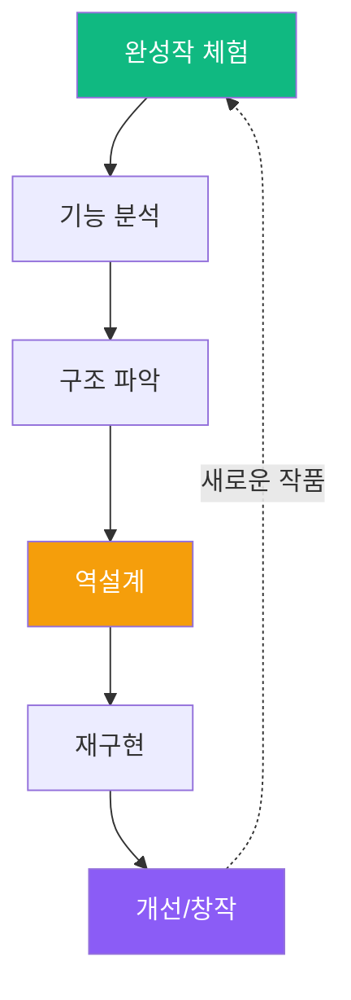

### 역공부 적용 예시

| 과정 | 완성작 | 분석 포인트 | 재구현 목표 |
|------|--------|------------|------------|
| **블록 코딩** | 게임 프로젝트 | 로직 흐름, 변수 사용 | 유사한 게임 만들기 |
| **ChatGPT** | AI 챗봇 | 프롬프트 패턴 | 나만의 봇 만들기 |
| **바이브** | 웹 앱 | UI/UX, API 구조 | 기능 추가한 앱 |
| **피지컬** | IoT 장치 | 센서-제어 연결 | 개선된 시스템 |

---

## 🛠️ AI 활용 빠른 프로토타이핑

### 개발 프로세스

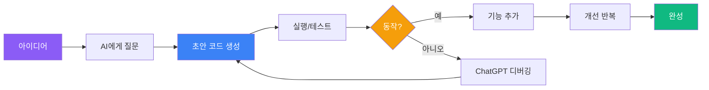

### 프로토타입 → 완성 전략

| 단계 | 목표 | AI 활용 | 소요 시간 |
|------|------|---------|----------|
| **1. 최소 기능 프로토타입** | 핵심 기능 1개 | ChatGPT 코드 생성 | 20% |
| **2. 기능 확장** | 필수 기능 추가 | AI 디버깅, 개선 | 30% |
| **3. UI/UX 개선** | 사용자 경험 향상 | AI 디자인 제안 | 20% |
| **4. 테스트/디버깅** | 안정성 확보 | AI 오류 분석 | 20% |
| **5. 문서화/발표** | 포트폴리오 | AI 문서 작성 지원 | 10% |

---

## 🎨 메이커 수업 방식

### 메이커 사이클

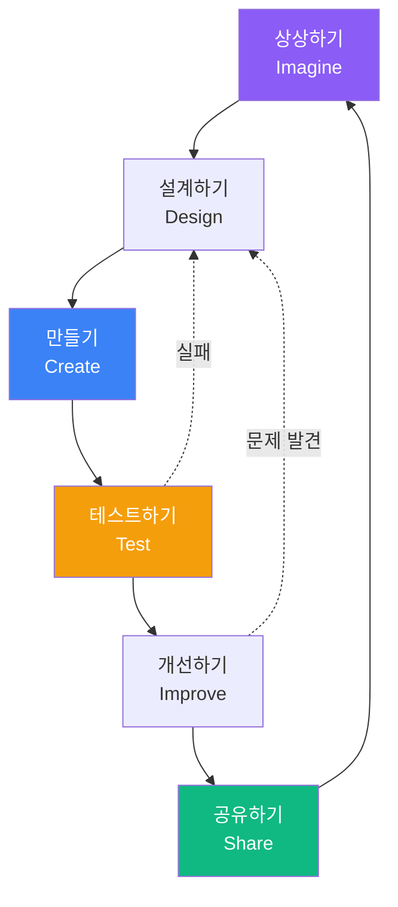

### 메이커 활동 예시

| 과정 | 메이커 프로젝트 | 핵심 활동 |
|------|---------------|----------|
| **블록 코딩** | 나만의 게임 | 아이디어 → 프로토타입 → 개선 |
| **ChatGPT** | AI 스토리 생성기 | 프롬프트 실험 → 개선 → 공유 |
| **바이브** | 웹 앱 제작 | 기획 → 디자인 → 구현 → 배포 |
| **피지컬** | 스마트 장치 | 회로 설계 → 제작 → 테스트 → 개선 |

---

## 👥 3대 역할 육성

### 기획자 + 실행자 + 디버거

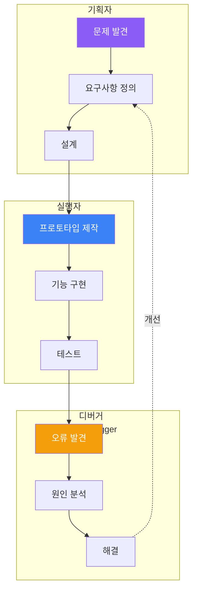

### 역할별 역량

| 역할 | 핵심 역량 | 평가 기준 | 비중 |
|------|----------|----------|------|
| **기획자** | 문제 정의, 아이디어 도출, 설계 능력 | 기획서 완성도, 창의성 | 30% |
| **실행자** | 빠른 구현, AI 도구 활용, 실험 정신 | 프로토타입 완성, 속도 | 40% |
| **디버거** | 분석력, 문제 해결, 개선 능력 | 오류 해결, 최적화 | 30% |

---

## 📚 과정별 상세 문서

### 1️⃣ 블록 코딩 (DWAI + App Inventor)

**대상**: 초등 4-6학년, 중등 1-2학년  
**문서**: [BLOCK_CODING_CURRICULUM.md](./BLOCK_CODING_CURRICULUM.md)

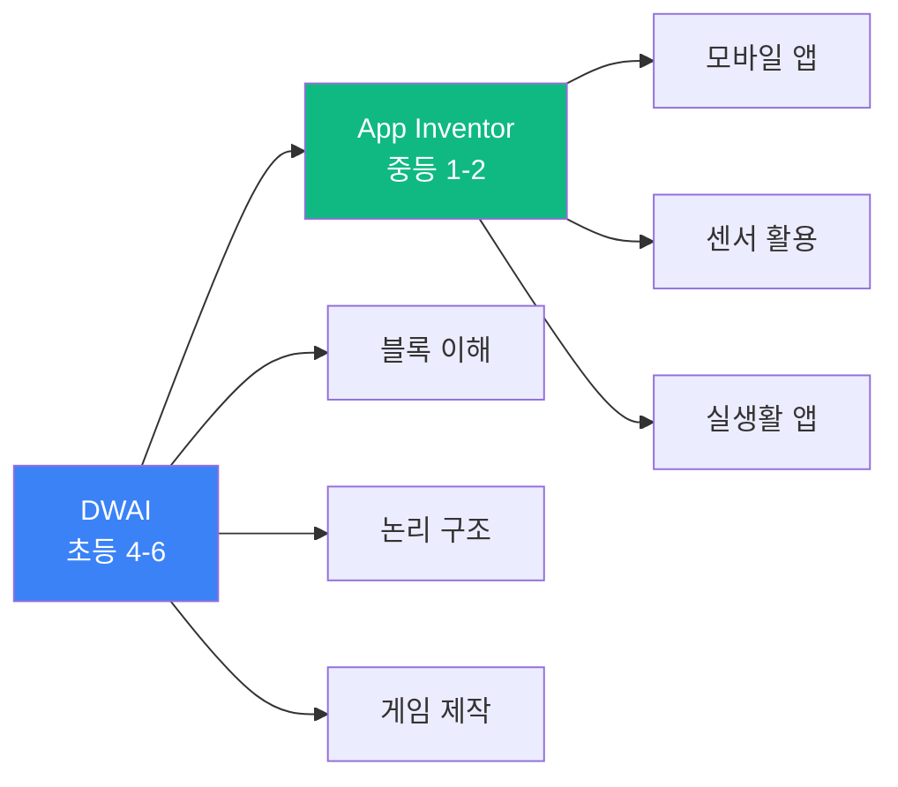

**핵심 내용**:
- PRIMM 방식으로 블록 코딩 학습
- 역공부: 완성된 게임 분석 → 재구현
- 메이커: 나만의 게임/앱 제작

---

### 2️⃣ ChatGPT (컨텐츠 + AI Agent + Colab)

**대상**: 중등 1-3학년, 고등 1-2학년  
**문서**: [CHATGPT_CURRICULUM.md](./CHATGPT_CURRICULUM.md)

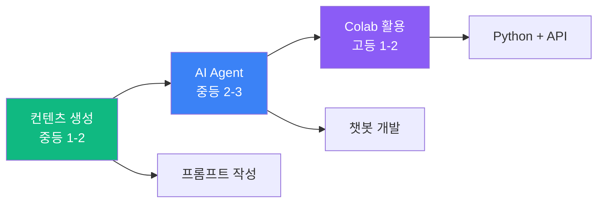

**핵심 내용**:
- AI를 활용한 빠른 개발
- 프롬프트 엔지니어링 실습
- 역공부: 유명 챗봇 분석 → 재구현

---

### 3️⃣ 바이브 코딩 (Frontend + Backend)

**대상**: 중등 2-3학년, 고등 1-2학년  
**문서**: [VIBE_CODING_CURRICULUM.md](./VIBE_CODING_CURRICULUM.md)

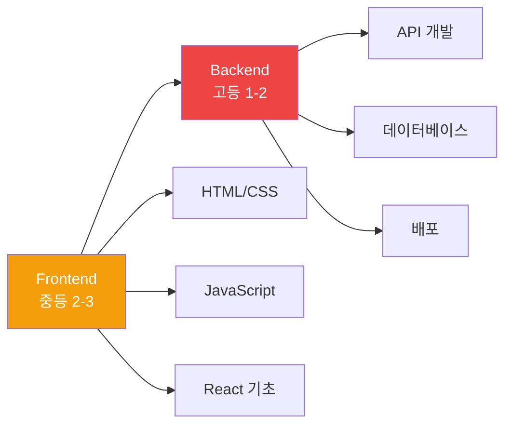

**핵심 내용**:
- AI로 웹 앱 빠르게 프로토타이핑
- 역공부: 인기 웹사이트 분석
- 메이커: 실제 서비스 배포

---

### 4️⃣ 피지컬 컴퓨팅 (라즈베리파이 + ESP-32 + 카메라)

**대상**: 중등 3학년, 고등 1-2학년  
**문서**: [PHYSICAL_COMPUTING_CURRICULUM.md](./PHYSICAL_COMPUTING_CURRICULUM.md)

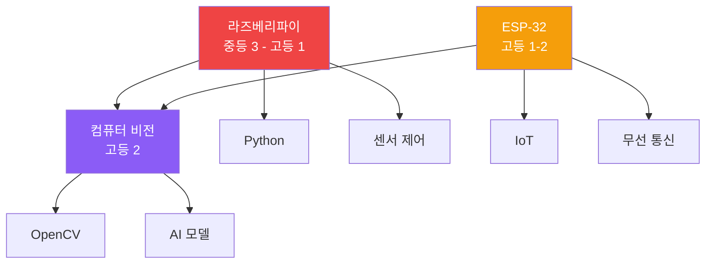

**핵심 내용**:
- 하드웨어 + 소프트웨어 통합
- AI 컴퓨터 비전 활용
- 역공부: 스마트 기기 분석

---

## 🎯 교육 목표 및 성과

### 최종 목표

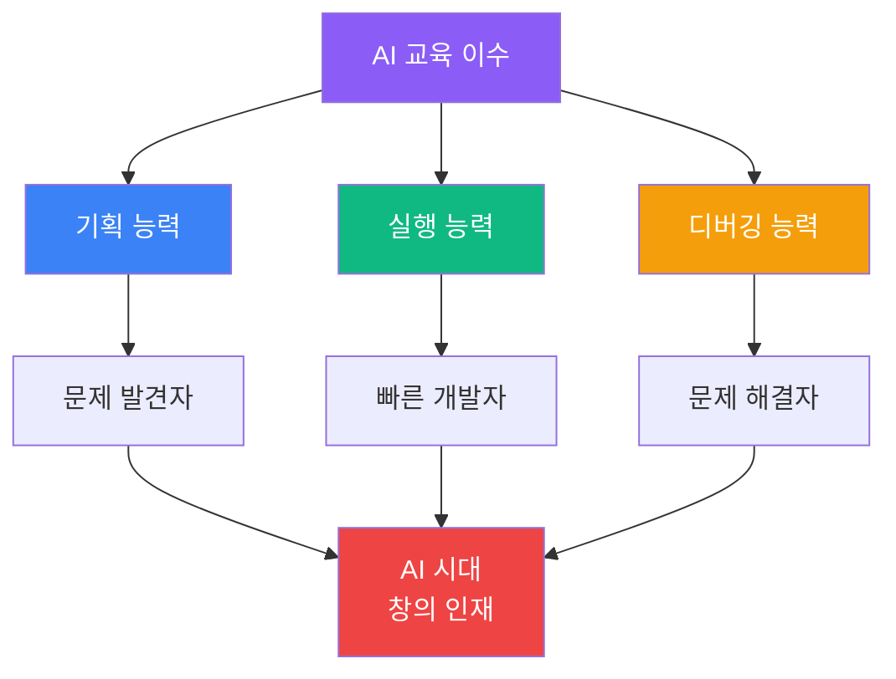

### 역량별 성취 기준

| 역량 | 초등 | 중등 | 고등 |
|------|------|------|------|
| **기획** | 간단한 게임 기획 | 앱/웹 서비스 기획 | 실생활 문제 해결 기획 |
| **실행** | 블록으로 구현 | AI 도구로 빠른 개발 | 복합 시스템 구현 |
| **디버깅** | 오류 찾기 | AI 활용 디버깅 | 최적화 및 개선 |

---

## 📊 평가 시스템

### 포트폴리오 기반 평가

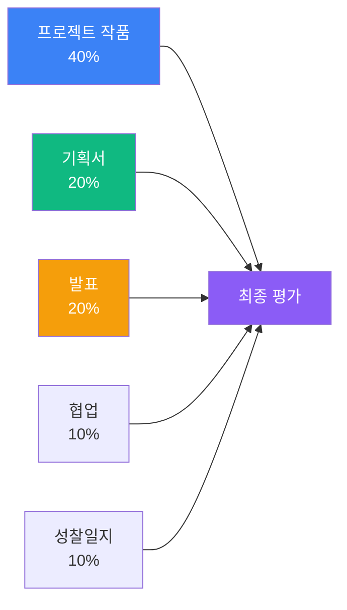

### 평가 루브릭

| 항목 | 우수 (5점) | 보통 (3점) | 미흡 (1점) |
|------|-----------|-----------|-----------|
| **기획** | 명확한 문제 정의, 창의적 해결책 | 일반적인 아이디어 | 모호한 기획 |
| **실행** | 완성도 높은 프로토타입 | 기본 기능 구현 | 미완성 |
| **디버깅** | 스스로 문제 해결, 개선 | 도움 받아 해결 | 해결 못함 |
| **AI 활용** | 효과적으로 활용, 최적화 | 기본적 활용 | 활용 부족 |

---

## 🚀 교육 효과

### AI 도구 활용 전후 비교

| 측면 | AI 활용 전 | AI 활용 후 | 개선율 |
|------|-----------|-----------|--------|
| **프로토타입 제작 시간** | 4-6시간 | 1-2시간 | **70% 단축** |
| **코딩 오류 해결 시간** | 30-40분 | 5-10분 | **75% 단축** |
| **아이디어 → 구현** | 80% 포기 | 90% 완성 | **17배 향상** |
| **학습 만족도** | 60% | 95% | **58% 향상** |

### 학생 성장 곡선

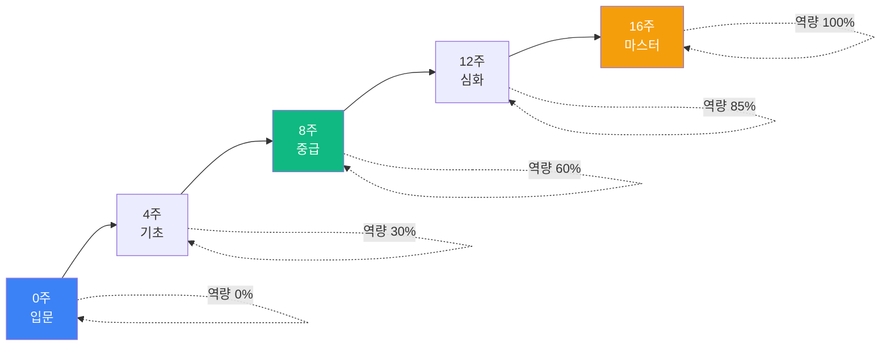

---

## 📞 문의 및 등록

### 과정별 수강 신청

| 과정 | 권장 학년 | 시수 | 수강료 |
|------|----------|------|--------|
| **블록 코딩** | 초4-중2 | 40시간 | 60만원 |
| **ChatGPT** | 중1-고2 | 48시간 | 72만원 |
| **바이브 코딩** | 중2-고2 | 60시간 | 90만원 |
| **피지컬 컴퓨팅** | 중3-고2 | 56시간 | 100만원 |

### 연락처

- **홈페이지**: https://aimakerlab.com
- **이메일**: edu@aimakerlab.com
- **전화**: 02-1234-5678
- **카카오톡**: @aimakerlab

---

**최종 업데이트**: 2025-12-29  
**작성자**: AI Maker Lab 교육팀  
**문서 버전**: 2.0 (PRIMM + 메이커 + 역공부 방식)

