# AI 융합 기술 체계도 - 피지컬 AI 시대의 휴머노이드 로봇

> **CES 2026 피지컬 AI 트렌드를 반영한 하드웨어 × 소프트웨어 융합 교육 가이드**  
> **목표**: 피지컬 AI 시대의 휴머노이드 로봇 개발을 통한 AI 융합 기술 이해

## 🚀 CES 2026: 피지컬 AI 시대의 시작

### 피지컬 AI란 무엇인가?

**피지컬 AI (Physical AI)**는 CES 2026의 핵심 주제로, **AI 소프트웨어가 물리적 신체(로봇, 자율주행차, 드론 등)를 통해 현실 세계에서 자율적으로 행동하는 시대**를 의미합니다.

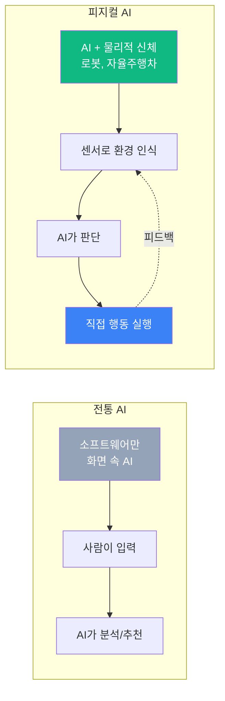

### CES 2026 주요 발표

| 기업 | 제품/기술 | 피지컬 AI 적용 |
|------|---------|--------------|
| **현대자동차** | DAL-e 서비스 로봇 | 멀티모달 AI로 자연어 이해 + 자율 이동 |
| **NVIDIA** | Project GR00T | Sim-to-Real 학습으로 휴머노이드 제어 |
| **Tesla** | Optimus Gen 3 | End-to-End 학습으로 공장 작업 자동화 |
| **LG전자** | 스마트홈 AI 로봇 | Vision AI + 음성인식 융합 |
| **Boston Dynamics** | Atlas AI 업그레이드 | 강화학습 기반 동적 환경 대응 |

### 휴머노이드가 피지컬 AI의 중심인 이유

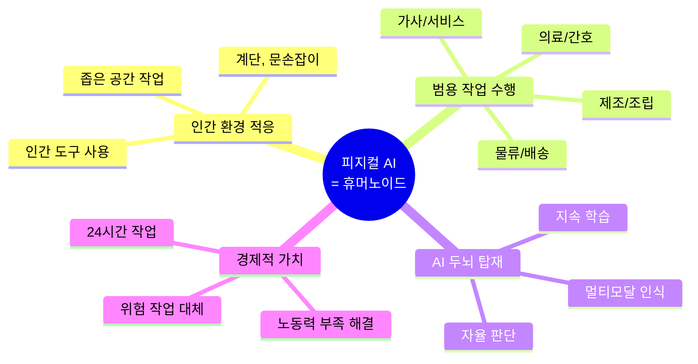

**핵심 인사이트**:
- 우리가 사는 세상은 **인간을 위해 설계**되었습니다.
- 따라서 **인간 형태의 로봇(휴머노이드)**이 가장 효율적으로 작업할 수 있습니다.
- 피지컬 AI 시대에서 휴머노이드는 **범용 AI 에이전트의 물리적 구현체**입니다.

---

## 📚 목차

0. [CES 2026: 피지컬 AI 시대의 시작](#-ces-2026-피지컬-ai-시대의-시작)
1. [기술 분류 체계](#1-기술-분류-체계)
2. [핵심 용어 정리](#2-핵심-용어-정리)
3. [융합 기술 구조도](#3-융합-기술-구조도)
4. [휴머노이드 개발 파이프라인](#4-휴머노이드-개발-파이프라인)
5. [기술 간 연계도](#5-기술-간-연계도)
6. [학습 로드맵](#6-학습-로드맵)

---

## 1. 기술 분류 체계

### 1.1 전체 기술 맵

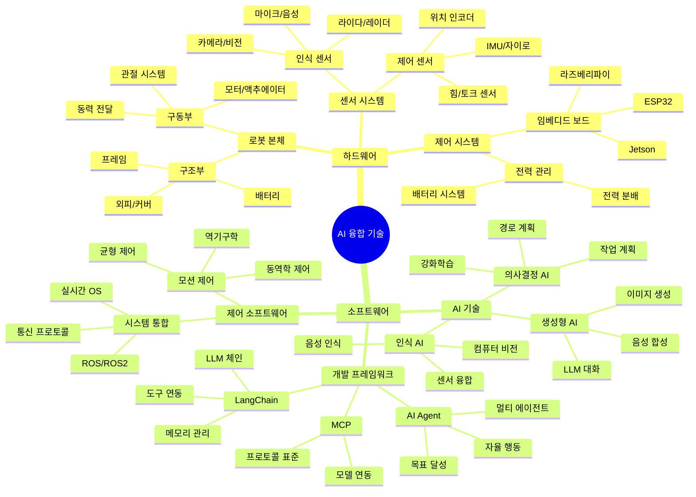

---

### 1.2 하드웨어 계층 구조

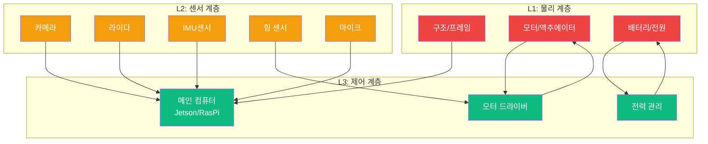

**하드웨어 구성 요소**

| 계층 | 구성 요소 | 역할 | 교육 적용 |
|------|----------|------|----------|
| **L1: 물리** | 프레임, 관절, 모터, 배터리 | 로봇의 물리적 구조 | 3D 프린팅, 조립 실습 |
| **L2: 센서** | 카메라, 라이다, IMU, 힘센서 | 환경 인식 및 피드백 | 센서 데이터 수집 실습 |
| **L3: 제어** | 컴퓨터, 모터 드라이버, 전원 | 실시간 제어 및 연산 | 임베디드 프로그래밍 |

---

### 1.3 소프트웨어 계층 구조

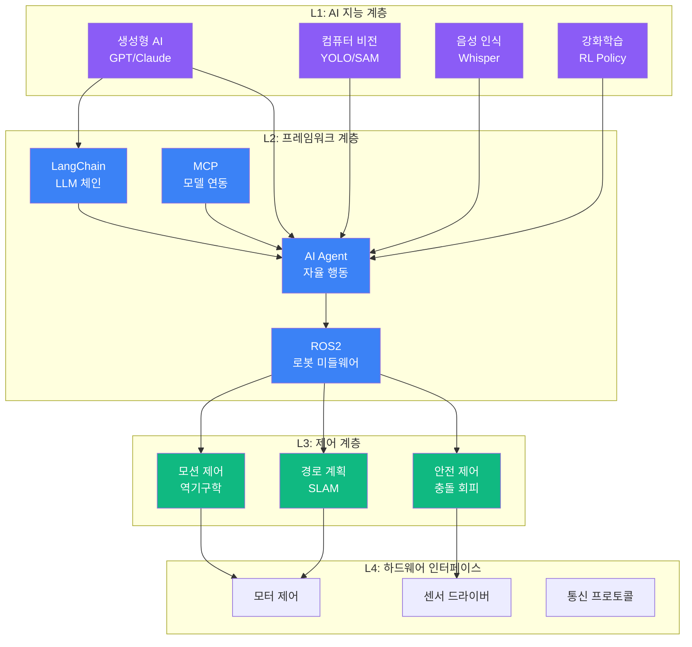

**소프트웨어 구성 요소**

| 계층 | 구성 요소 | 역할 | 교육 적용 |
|------|----------|------|----------|
| **L1: AI 지능** | LLM, Vision, Speech, RL | 인간 수준 인지 및 판단 | ChatGPT, Colab 실습 |
| **L2: 프레임워크** | LangChain, Agent, MCP, ROS | AI와 로봇 시스템 통합 | Agent 개발, ROS 기초 |
| **L3: 제어** | 모션, 경로, 안전 제어 | 실시간 로봇 제어 | 역기구학, SLAM 실습 |
| **L4: 인터페이스** | 드라이버, 통신 | 하드웨어 직접 제어 | Python 센서/모터 제어 |

---

## 2. 핵심 용어 정리

### 2.1 AI 기술 용어

#### 🤖 **생성형 AI (Generative AI)**

**정의**: 학습한 패턴을 바탕으로 새로운 콘텐츠(텍스트, 이미지, 음성)를 생성하는 AI

**대표 기술**:
- **LLM (Large Language Model)**: GPT-4, Claude 등 대규모 언어 모델
- **이미지 생성**: DALL-E, Stable Diffusion, Midjourney
- **음성 생성**: TTS (Text-to-Speech), 음성 복제

**휴머노이드 적용**:
- 자연스러운 대화 (음성 인터페이스)
- 상황에 맞는 응답 생성
- 작업 지시 이해 및 실행

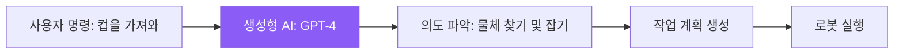

**교육 포인트**:
- ChatGPT로 대화형 인터페이스 실습
- Prompt Engineering (명령어 최적화)
- 열린 사고: 다양한 질문 방식 실험

---

#### 🧠 **AGI (Artificial General Intelligence)**

**정의**: 인간처럼 다양한 작업을 범용적으로 수행할 수 있는 일반 인공지능

**현재 단계**:
- **ANI (Narrow AI)**: 특정 작업만 수행 (현재 대부분의 AI)
- **AGI**: 범용 지능 (아직 미달성, 연구 중)
- **ASI (Super Intelligence)**: 인간을 초월하는 지능 (이론적 단계)

**휴머노이드와의 관계**:
- 궁극적 목표: 인간처럼 모든 작업 수행 가능한 로봇
- 현재는 특정 작업 조합으로 AGI에 근접
- 멀티모달 AI (시각 + 언어 + 제어) 융합이 핵심

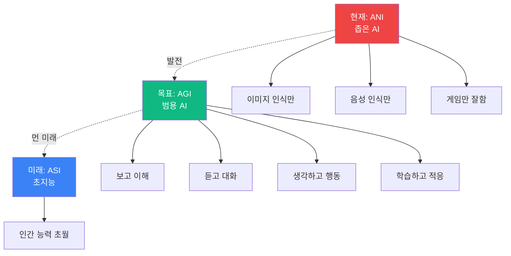

**교육 포인트**:
- AI의 한계와 가능성 이해
- 다양한 기능을 조합하는 시스템 설계 사고
- 멀티모달 AI 실습 (카메라 + 음성 + 제어)

---

#### 🎯 **AI Agent (AI 에이전트)**

**정의**: 목표를 받으면 스스로 계획하고 도구를 사용하여 자율적으로 작업을 완수하는 AI 시스템

**핵심 구성**:
1. **Perception** (인식): 환경 관찰
2. **Planning** (계획): 작업 단계 수립
3. **Action** (행동): 도구/API 실행
4. **Memory** (기억): 과거 경험 저장
5. **Learning** (학습): 결과 기반 개선

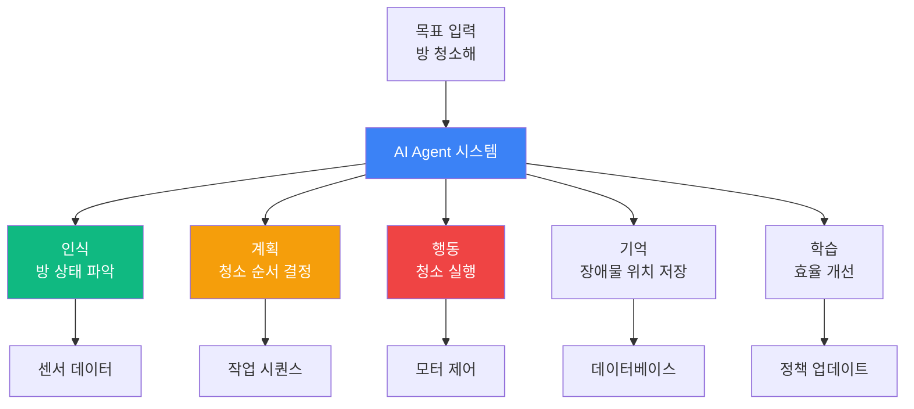

**휴머노이드 적용**:
- 복잡한 작업을 단계별로 분해
- 예: "커피 만들기" → [컵 찾기] → [원두 넣기] → [물 넣기] → [버튼 누르기]
- 실패 시 재시도 또는 대안 실행

**교육 포인트**:
- AutoGPT, LangChain Agent 실습
- 간단한 목표 → 복잡한 목표로 단계적 학습
- 실패 케이스 분석 및 개선

---

#### 🔗 **LangChain (랭체인)**

**정의**: LLM(대규모 언어 모델)을 실제 애플리케이션에 연결하는 개발 프레임워크

**핵심 기능**:
1. **Chains** (체인): 여러 단계의 LLM 호출 연결
2. **Agents** (에이전트): 도구를 선택하고 사용하는 자율 시스템
3. **Memory** (메모리): 대화 기록 저장 및 관리
4. **Tools** (도구): 외부 API, 데이터베이스 연동

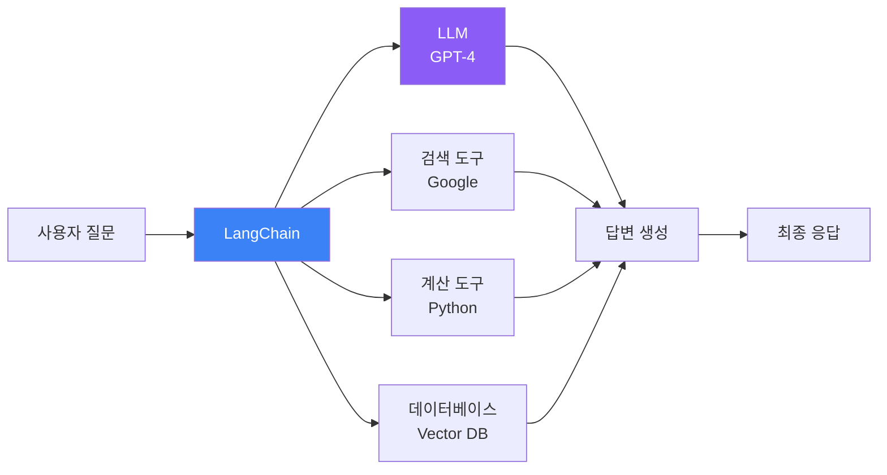

**휴머노이드 적용**:
- 음성 명령 → 로봇 제어 API 연결
- 과거 작업 기록을 메모리로 저장
- 복잡한 명령을 단계별로 분해 실행

**예시 코드 개념**:
```python
# LangChain을 사용한 휴머노이드 명령 처리
from langchain import Agent, Tool

# 도구 정의
tools = [
    Tool("카메라", "물체를 인식합니다"),
    Tool("모터제어", "로봇 팔을 움직입니다"),
    Tool("음성합성", "응답을 음성으로 출력합니다")
]

# 에이전트 생성
agent = Agent(tools=tools, llm="gpt-4")

# 명령 실행
agent.run("책상 위의 컵을 가져와")
# 1. 카메라로 컵 위치 파악
# 2. 모터제어로 팔 이동
# 3. 음성합성으로 "컵을 가져왔습니다" 출력
```

**교육 포인트**:
- Python + LangChain 기초 실습
- 간단한 챗봇에서 시작
- 로봇 제어 API 연동 실습

---

#### 🌐 **MCP (Model Context Protocol)**

**정의**: AI 모델과 외부 시스템(데이터, 도구, 서비스)을 표준화된 방식으로 연결하는 프로토콜

**목적**:
- AI 모델이 다양한 데이터 소스에 접근
- 도구(API, 함수)를 일관된 방식으로 사용
- 확장 가능한 AI 시스템 구축

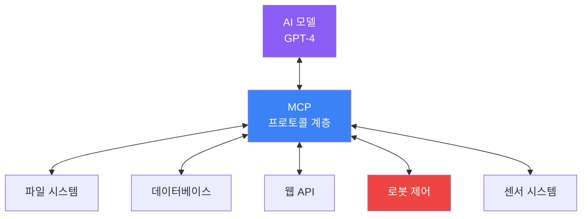

**휴머노이드 적용**:
- LLM이 로봇의 센서 데이터에 직접 접근
- 표준 인터페이스로 다양한 하드웨어 통합
- 모델 교체 시에도 동일한 프로토콜 사용

**교육 포인트**:
- API 개념 이해 (RESTful, gRPC)
- 표준 프로토콜의 중요성
- 실습: 센서 데이터를 AI 모델에 전달

---

#### 💬 **Prompt Engineering (프롬프트 엔지니어링)**

**정의**: AI 모델에게 원하는 결과를 얻기 위해 최적의 명령어(프롬프트)를 설계하는 기술

**핵심 원칙**:
1. **명확성**: 구체적이고 명확한 지시
2. **맥락 제공**: 배경 정보 포함
3. **예시 제공**: Few-shot Learning
4. **역할 부여**: "너는 전문가야"
5. **단계별 사고**: Chain-of-Thought

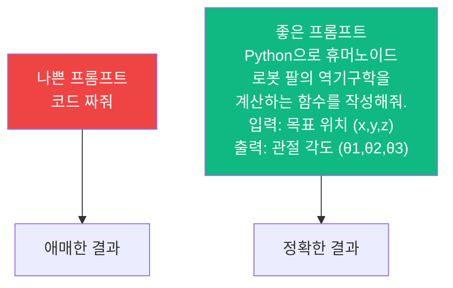

**휴머노이드 적용 예시**:

| 작업 | 나쁜 프롬프트 | 좋은 프롬프트 |
|------|-------------|-------------|
| 물체 잡기 | "물건 잡아" | "앞쪽 30cm에 있는 빨간색 컵을 집게로 잡고, 힘 센서로 5N 이하로 유지하며 들어올려" |
| 경로 계획 | "거기로 가" | "현재 위치 (0,0)에서 목표 (5,3)까지 장애물 [2,1], [3,2]를 피하며 최단 경로로 이동" |
| 대화 응답 | "답해" | "사용자가 '배고파'라고 하면, 현재 시간과 최근 식사 기록을 고려하여 적절한 음식을 추천해" |

**교육 포인트**:
- 열린 사고: 다양한 질문 방식 실험
- 실패 사례 분석 → 개선
- 실습: ChatGPT로 프롬프트 최적화

---

### 2.2 로봇 기술 용어

#### 🦾 **로봇 (Robot)**

**정의**: 센서로 환경을 인식하고, 프로그램에 따라 자율적으로 작업을 수행하는 기계 시스템

**분류**:
1. **산업 로봇**: 용접, 조립, 도장 (고정형 로봇 암)
2. **서비스 로봇**: 청소, 배송, 안내 (이동형)
3. **휴머노이드**: 인간 형태, 범용 작업

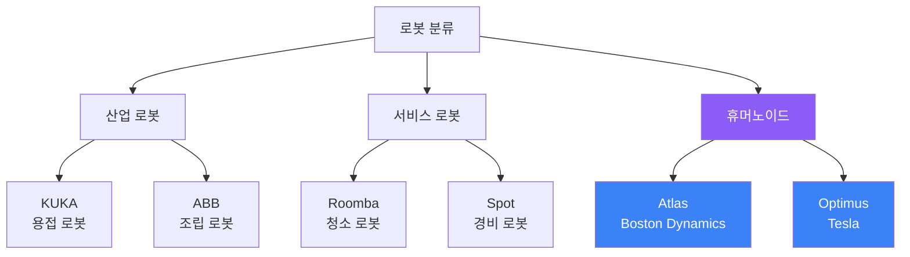

**교육 포인트**:
- 로봇의 역사와 발전 과정
- 각 분야별 로봇의 특징
- 실습: 간단한 로봇 팔 조립 및 제어

---

#### 🚶 **휴머노이드 로봇 (Humanoid Robot)**

**정의**: 인간의 신체 구조(머리, 몸통, 팔, 다리)를 모방한 로봇으로, 인간 환경에서 범용 작업 수행을 목표로 함

**핵심 특징**:
- **이족 보행**: 두 다리로 걷기 (균형 제어 필요)
- **양손 작업**: 인간 도구 사용 가능
- **다관절**: 40~60개의 자유도 (DOF)
- **멀티모달 센서**: 카메라, 마이크, 촉각, IMU

**주요 기술 과제**:

| 분야 | 과제 | 해결 방법 |
|------|------|----------|
| **하드웨어** | 균형 유지 | IMU 센서 + 실시간 제어 |
| **하드웨어** | 관절 제어 | 고성능 모터 + 역기구학 |
| **소프트웨어** | 물체 인식 | 컴퓨터 비전 (YOLO, SAM) |
| **소프트웨어** | 작업 계획 | AI Agent + 강화학습 |
| **융합** | 실시간 통합 | ROS2 + MCP |

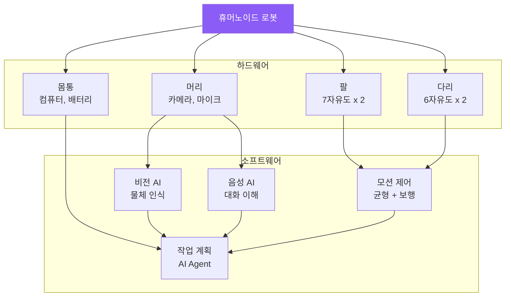

**대표 휴머노이드**:
1. **Atlas (Boston Dynamics)**: 가장 앞선 운동 능력 (파쿠르, 백플립)
2. **Optimus (Tesla)**: 대량 생산 목표, AI 자동 학습
3. **Figure 01 (Figure AI)**: 상업적 응용 (창고, 공장)

**교육 포인트**:
- 휴머노이드의 구조 이해
- 균형 제어의 중요성 (IMU 센서 실습)
- 역기구학 기초 (Python 계산)

---

### 2.3 융합이 중요한 이유

#### 🔄 **융합 = 하드웨어 × 소프트웨어**

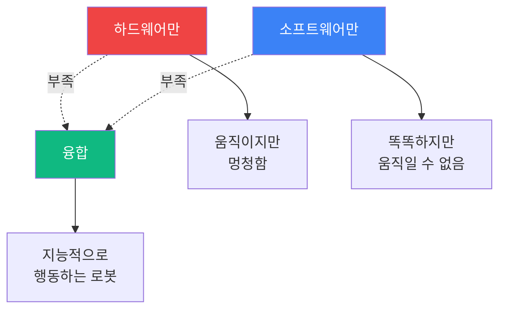

**왜 융합이 필수인가?**

| 측면 | 하드웨어만 | 소프트웨어만 | 융합 |
|------|----------|-------------|------|
| **인식** | ❌ 센서는 있지만 해석 불가 | ❌ 데이터 없음 | ✅ 센서 + AI 비전 |
| **판단** | ❌ 프로그램된 것만 실행 | ✅ LLM이 판단 | ✅ AI + 제어 |
| **행동** | ✅ 모터는 작동 | ❌ 시뮬레이션만 | ✅ 실제 실행 |
| **학습** | ❌ 고정된 동작 | ❌ 가상만 | ✅ 실제 경험 학습 |

**실제 사례**:

1. **Tesla Optimus 개발 과정**
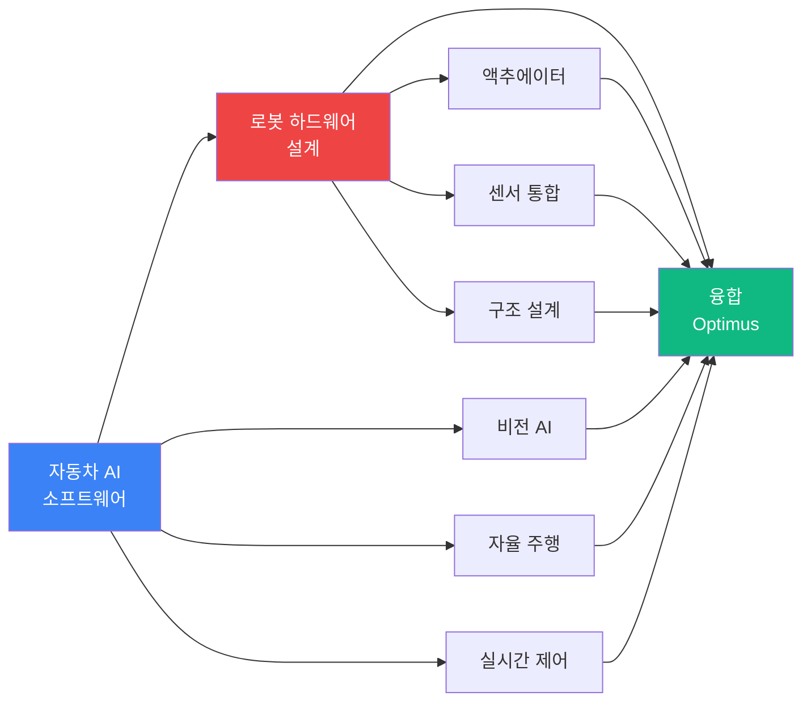

2. **Boston Dynamics의 진화**
   - 초기: 뛰어난 하드웨어 + 수동 프로그래밍
   - 현재: AI 학습 + 자율 작업 수행

**교육 포인트**:
- 하드웨어와 소프트웨어를 분리하여 이해한 후
- 통합 프로젝트로 융합 경험
- 예: 라즈베리파이 + 카메라 + ChatGPT API

---

## 3. 융합 기술 구조도

### 3.1 휴머노이드 시스템 전체 아키텍처

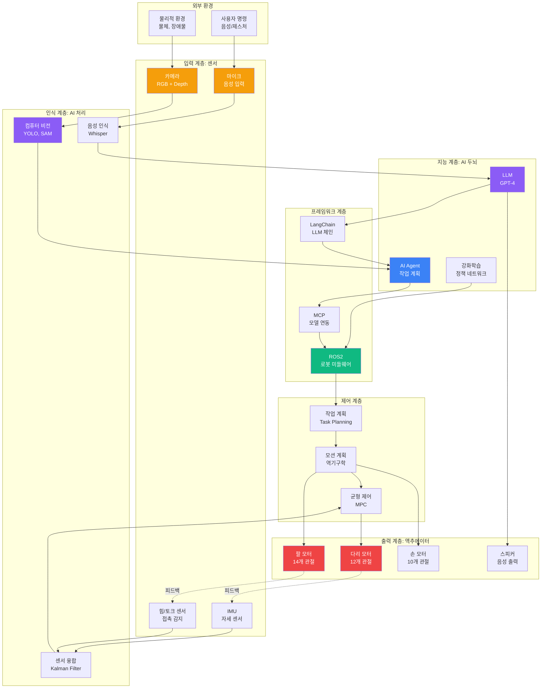

**각 계층의 역할**

| 계층 | 주요 기술 | 입력 | 출력 | 교육 초점 |
|------|----------|------|------|----------|
| **센서** | 카메라, 마이크, IMU | 물리적 신호 | 디지털 데이터 | 센서 데이터 수집 |
| **인식** | 컴퓨터 비전, 음성 인식 | Raw 데이터 | 의미 있는 정보 | AI 모델 활용 |
| **지능** | LLM, Agent, RL | 정보 | 판단/계획 | AI Agent 개발 |
| **프레임워크** | LangChain, MCP, ROS | AI 명령 | 실행 가능 명령 | 시스템 통합 |
| **제어** | 역기구학, MPC | 목표 | 관절 각도/속도 | 수학적 제어 |
| **액추에이터** | 모터, 스피커 | 제어 신호 | 물리적 동작 | 하드웨어 제어 |

---

### 3.2 데이터 흐름도

**예시: "책상 위의 컵을 가져와" 명령 실행**

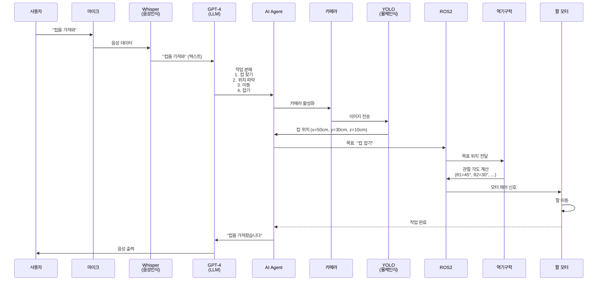

**단계별 기술 매핑**

| 단계 | 하드웨어 | 소프트웨어 | 융합 포인트 |
|------|----------|-----------|-----------|
| 1. 음성 입력 | 마이크 | Whisper API | 음성 → 텍스트 변환 |
| 2. 의미 이해 | - | GPT-4 | 자연어 → 작업 계획 |
| 3. 물체 인식 | 카메라 | YOLO | 이미지 → 위치 좌표 |
| 4. 작업 계획 | - | AI Agent + LangChain | 단계별 작업 분해 |
| 5. 경로 계획 | - | ROS2 + 역기구학 | 좌표 → 관절 각도 |
| 6. 동작 실행 | 팔 모터 | 모터 드라이버 | 전기 신호 → 물리적 동작 |
| 7. 피드백 | 힘 센서 | 센서 융합 | 잡기 성공 여부 확인 |

---

## 4. 휴머노이드 개발 파이프라인

### 4.1 전체 개발 순서도

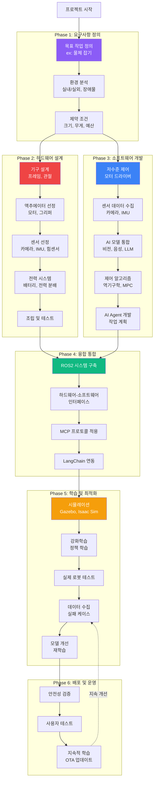

---

### 4.2 각 Phase별 상세 설명

#### **Phase 1: 요구사항 정의** (1-2주)

**목표**: 휴머노이드가 해결할 문제를 명확히 정의

**활동**:
1. **작업 분석**
   - 어떤 작업을 수행할 것인가? (예: 물류 창고 작업, 가정 서비스)
   - 필요한 능력: 보행, 물체 조작, 대화 등

2. **환경 분석**
   - 실내/실외
   - 평지/계단/장애물
   - 조명 조건, 소음 수준

3. **제약 조건**
   - 예산: $10K? $100K?
   - 크기: 인간 크기? 소형?
   - 배터리 시간: 1시간? 8시간?

**교육 적용**:
- 학생들이 해결하고 싶은 문제 발표
- 간단한 작업부터 시작 (예: "블록 쌓기")

---

#### **Phase 2: 하드웨어 설계** (4-8주)

**목표**: 물리적 로봇 구조 설계 및 제작

**2.1 기구 설계**
- **CAD 설계**: Fusion 360, SolidWorks
- **자유도(DOF) 결정**: 팔 7DOF x 2, 다리 6DOF x 2
- **재료 선택**: 알루미늄, 카본, 3D 프린팅

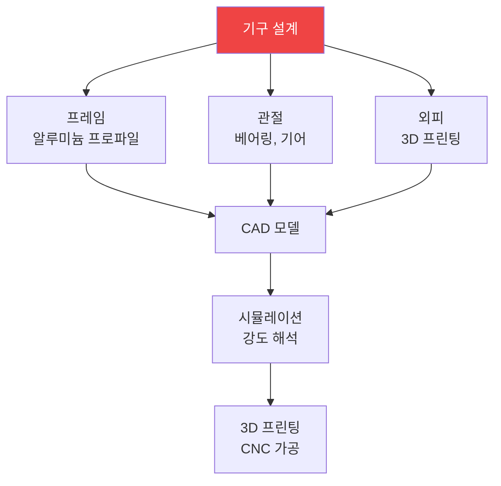

**2.2 액추에이터 선정**

| 부위 | 모터 종류 | 토크 | 개수 |
|------|----------|------|------|
| 어깨 | BLDC 모터 | 10 Nm | 6 (3 x 2) |
| 팔꿈치 | BLDC 모터 | 5 Nm | 2 |
| 손목 | 서보 모터 | 1 Nm | 6 (3 x 2) |
| 손 | 서보 모터 | 0.5 Nm | 10 (5 x 2) |
| 엉덩이 | BLDC 모터 | 20 Nm | 6 (3 x 2) |
| 무릎 | BLDC 모터 | 15 Nm | 2 |
| 발목 | BLDC 모터 | 10 Nm | 4 (2 x 2) |

**2.3 센서 선정**

| 센서 | 용도 | 모델 예시 |
|------|------|----------|
| RGB-D 카메라 | 물체 인식, 깊이 측정 | Intel RealSense D435 |
| 라이다 | 장애물 감지 | RPLidar A1 |
| IMU | 자세 측정 | MPU-6050, BNO055 |
| 힘/토크 센서 | 접촉 감지 | ATI Mini40 |
| 마이크 어레이 | 음성 입력 | ReSpeaker Mic Array |

**2.4 조립 및 테스트**
- 기계적 조립
- 배선 및 전력 연결
- 기본 동작 테스트 (관절별 가동 범위)

**교육 적용**:
- 간단한 로봇 팔 키트 조립 (OpenManipulator)
- 3D 프린팅으로 간단한 부품 제작
- 서보 모터 제어 실습

---

#### **Phase 3: 소프트웨어 개발** (6-12주)

**목표**: AI 및 제어 소프트웨어 구현

**3.1 저수준 제어**
```python
# 모터 제어 예시 (라즈베리파이 + 서보)
import RPi.GPIO as GPIO
import time

# GPIO 초기화
GPIO.setmode(GPIO.BCM)
servo_pin = 18
GPIO.setup(servo_pin, GPIO.OUT)

# PWM 설정 (50Hz)
pwm = GPIO.PWM(servo_pin, 50)
pwm.start(0)

def set_angle(angle):
    """각도를 0-180도로 설정"""
    duty = 2 + (angle / 18)
    pwm.ChangeDutyCycle(duty)
    time.sleep(0.3)
    pwm.ChangeDutyCycle(0)

# 90도로 이동
set_angle(90)
```

**3.2 센서 데이터 수집**
```python
# 카메라 데이터 수집 (OpenCV)
import cv2

cap = cv2.VideoCapture(0)

while True:
    ret, frame = cap.read()
    if ret:
        cv2.imshow('Camera', frame)
        # AI 모델에 전달
        # ...
    
    if cv2.waitKey(1) & 0xFF == ord('q'):
        break

cap.release()
```

**3.3 AI 모델 통합**
```python
# YOLO 물체 인식
from ultralytics import YOLO

model = YOLO('yolov8n.pt')
results = model(frame)

for r in results:
    boxes = r.boxes
    for box in boxes:
        cls = int(box.cls[0])
        if model.names[cls] == 'cup':  # 컵 감지
            x, y, w, h = box.xywh[0]
            print(f"컵 위치: ({x}, {y})")
```

**3.4 제어 알고리즘 - 역기구학**
```python
# 간단한 2자유도 역기구학 예시
import numpy as np

def inverse_kinematics_2dof(x, y, l1, l2):
    """
    2자유도 로봇 팔의 역기구학
    x, y: 목표 위치
    l1, l2: 링크 길이
    반환: (theta1, theta2) 관절 각도
    """
    # 거리 계산
    r = np.sqrt(x**2 + y**2)
    
    # 코사인 법칙
    cos_theta2 = (r**2 - l1**2 - l2**2) / (2 * l1 * l2)
    theta2 = np.arccos(cos_theta2)
    
    # theta1 계산
    alpha = np.arctan2(y, x)
    beta = np.arctan2(l2 * np.sin(theta2), l1 + l2 * np.cos(theta2))
    theta1 = alpha - beta
    
    return np.degrees(theta1), np.degrees(theta2)

# 사용 예시
x, y = 0.5, 0.3  # 목표 위치 (미터)
l1, l2 = 0.3, 0.25  # 링크 길이
theta1, theta2 = inverse_kinematics_2dof(x, y, l1, l2)
print(f"관절 각도: θ1={theta1:.1f}°, θ2={theta2:.1f}°")
```

**3.5 AI Agent 개발**
```python
# LangChain Agent 예시
from langchain import Agent, Tool
from langchain.llms import OpenAI

# 도구 정의
def detect_object(object_name):
    """카메라로 물체 감지"""
    # YOLO 실행
    return {"x": 50, "y": 30, "z": 10}

def move_arm(x, y, z):
    """로봇 팔 이동"""
    # 역기구학 + 모터 제어
    return "이동 완료"

tools = [
    Tool("물체감지", detect_object, "물체의 위치를 찾습니다"),
    Tool("팔이동", move_arm, "로봇 팔을 이동합니다")
]

# Agent 생성
llm = OpenAI(model="gpt-4")
agent = Agent(llm=llm, tools=tools)

# 명령 실행
result = agent.run("책상 위의 컵을 잡아")
```

**교육 적용**:
- Python 기초 + 센서 제어
- OpenCV로 이미지 처리 실습
- ChatGPT API로 간단한 Agent 만들기

---

#### **Phase 4: 융합 통합** (4-6주)

**목표**: 하드웨어와 소프트웨어를 ROS2로 통합

**4.1 ROS2 시스템 구축**

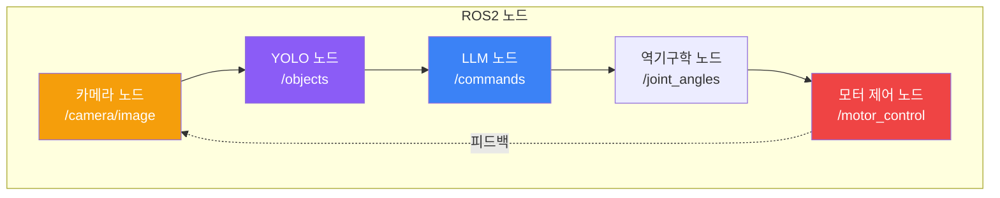

**ROS2 노드 예시**
```python
# camera_node.py
import rclpy
from rclpy.node import Node
from sensor_msgs.msg import Image
import cv2

class CameraNode(Node):
    def __init__(self):
        super().__init__('camera_node')
        self.publisher = self.create_publisher(Image, '/camera/image', 10)
        self.timer = self.create_timer(0.1, self.publish_frame)
        self.cap = cv2.VideoCapture(0)
    
    def publish_frame(self):
        ret, frame = self.cap.read()
        if ret:
            # OpenCV -> ROS2 메시지 변환
            msg = Image()
            # ... 변환 코드 ...
            self.publisher.publish(msg)

def main():
    rclpy.init()
    node = CameraNode()
    rclpy.spin(node)
```

**4.2 MCP 프로토콜 적용**
- AI 모델과 로봇 시스템 간 표준 인터페이스
- RESTful API 또는 gRPC 사용

**4.3 LangChain 연동**
- LLM이 ROS2 토픽에 직접 접근
- 센서 데이터를 LLM의 컨텍스트로 제공

**교육 적용**:
- ROS2 기초 튜토리얼 (turtlesim)
- 간단한 Publisher-Subscriber 실습
- API 개념 학습 (RESTful)

---

#### **Phase 5: 학습 및 최적화** (8-16주)

**목표**: 강화학습으로 로봇 성능 향상

**5.1 시뮬레이션**

```mermaid
graph LR
    A[실제 로봇<br/>개발] --> B[CAD 모델<br/>추출]
    B --> C[시뮬레이터<br/>Gazebo/Isaac Sim]
    C --> D[강화학습<br/>학습]
    D --> E[정책<br/>Policy]
    E --> F[실제 로봇<br/>배포]
    
    F -.데이터 수집.-> C
    
    style A fill:#ef4444,color:#fff
    style C fill:#3b82f6,color:#fff
    style E fill:#10b981,color:#fff
```

**5.2 강화학습**

```python
# 간단한 강화학습 예시 (개념)
import gym
import numpy as np

# 환경 정의 (로봇 팔 제어)
env = gym.make('RobotArm-v0')

# 정책 네트워크 (간소화)
def policy(state):
    """상태를 받아 행동 선택"""
    # 신경망으로 관절 각도 출력
    return action

# 학습 루프
for episode in range(1000):
    state = env.reset()
    total_reward = 0
    
    for step in range(100):
        action = policy(state)
        next_state, reward, done, info = env.step(action)
        
        # 정책 업데이트
        # ...
        
        total_reward += reward
        state = next_state
        
        if done:
            break
    
    print(f"Episode {episode}: Reward = {total_reward}")
```

**5.3 실제 로봇 테스트**
- 시뮬레이션에서 학습한 정책을 실제 로봇에 적용
- Sim-to-Real 갭 해결 (도메인 랜덤화)

**5.4 데이터 수집**
- 실패 케이스 기록
- 텔레오퍼레이션으로 시연 데이터 수집

**5.5 모델 개선**
- 수집한 데이터로 재학습
- Imitation Learning (모방 학습)

**교육 적용**:
- Gazebo로 간단한 로봇 시뮬레이션
- 강화학습 개념 학습 (Q-Learning)
- 간단한 게임 환경에서 RL 실습

---

#### **Phase 6: 배포 및 운영** (지속적)

**목표**: 안전하고 지속적으로 개선되는 시스템

**6.1 안전성 검증**
- 비상 정지 기능
- 충돌 감지 및 회피
- 힘 제한 (사람과 접촉 시)

**6.2 사용자 테스트**
- 베타 테스터 모집
- 피드백 수집

**6.3 지속적 학습**
- OTA (Over-The-Air) 업데이트
- 클라우드에서 데이터 수집 및 재학습
- 새로운 작업 추가

```mermaid
graph LR
    A[로봇 A<br/>작업 수행] --> B[클라우드<br/>데이터 저장]
    C[로봇 B] --> B
    D[로봇 C] --> B
    
    B --> E[재학습<br/>모델 개선]
    E --> F[OTA 업데이트]
    
    F --> A
    F --> C
    F --> D
    
    style B fill:#3b82f6,color:#fff
    style E fill:#10b981,color:#fff
```

**교육 적용**:
- 안전 설계의 중요성 강조
- A/B 테스트 개념
- 지속적 개선 마인드셋

---

## 5. 기술 간 연계도

### 5.1 기술 의존성 그래프

```mermaid
graph TB
    subgraph "Foundation: 기초 기술"
        F1[Python 프로그래밍]
        F2[수학: 선형대수, 미적분]
        F3[전자공학 기초]
    end
    
    subgraph "Hardware: 하드웨어"
        H1[센서 시스템]
        H2[모터 제어]
        H3[임베디드 시스템<br/>RasPi, Jetson]
    end
    
    subgraph "AI: 인공지능"
        A1[컴퓨터 비전<br/>OpenCV, YOLO]
        A2[자연어 처리<br/>GPT, Whisper]
        A3[강화학습<br/>RL]
    end
    
    subgraph "Framework: 프레임워크"
        FR1[LangChain]
        FR2[ROS2]
        FR3[MCP]
    end
    
    subgraph "Integration: 통합"
        I1[AI Agent]
        I2[시스템 통합]
    end
    
    subgraph "Application: 응용"
        AP1[휴머노이드 로봇]
    end
    
    F1 --> H3
    F1 --> A1
    F1 --> A2
    F2 --> A3
    F3 --> H2
    
    H1 --> A1
    H2 --> FR2
    H3 --> FR2
    
    A1 --> I1
    A2 --> FR1
    A3 --> I1
    
    FR1 --> I1
    FR2 --> I2
    FR3 --> I2
    
    I1 --> AP1
    I2 --> AP1
    
    style F1 fill:#8b5cf6,color:#fff
    style A2 fill:#3b82f6,color:#fff
    style I1 fill:#10b981,color:#fff
    style AP1 fill:#ef4444,color:#fff
```

**의존성 설명**

| 상위 기술 | 하위 기술 (필요한 선행 지식) | 이유 |
|----------|---------------------------|------|
| **AI Agent** | LangChain, 컴퓨터 비전, 강화학습 | 자율 행동을 위해 인식, 계획, 학습 필요 |
| **LangChain** | GPT API, Python | LLM을 코드로 제어하려면 프로그래밍 필요 |
| **컴퓨터 비전** | 카메라 센서, Python | 이미지 데이터를 처리하려면 센서와 코드 필요 |
| **ROS2** | 임베디드 시스템, 모터 제어 | 하드웨어를 제어하는 미들웨어 |
| **휴머노이드** | 위 모든 기술 | 최종 통합 시스템 |

---

### 5.2 융합 연계 맵

**왜 각 기술이 서로 연결되어야 하는가?**

```mermaid
mindmap
  root((휴머노이드<br/>로봇))
    보기
      카메라
        물체 인식
          YOLO
        깊이 측정
          RealSense
      라이다
        장애물 감지
    듣기
      마이크
        음성 인식
          Whisper
        명령 이해
          GPT-4
    생각하기
      AI Agent
        작업 계획
          LangChain
        의사결정
          강화학습
    움직이기
      모터
        관절 제어
          역기구학
        균형 유지
          MPC
      ROS2
        실시간 제어
    통합
      MCP
        모든 시스템 연결
```

**구체적 연계 예시**

1. **보기 → 생각하기 → 움직이기**
```mermaid
graph LR
    A[카메라로 컵 인식] --> B[YOLO로 위치 파악<br/>x=50, y=30, z=10]
    B --> C["GPT-4가 명령 해석<br/>컵을 잡아"]
    C --> D[AI Agent가 계획<br/>1.이동 2.잡기]
    D --> E[역기구학으로<br/>관절 각도 계산]
    E --> F[ROS2가 모터 제어]
    
    style A fill:#f59e0b,color:#fff
    style B fill:#8b5cf6,color:#fff
    style C fill:#3b82f6,color:#fff
    style F fill:#ef4444,color:#fff
```

2. **듣기 → 생각하기 → 보기 → 움직이기**
```mermaid
graph LR
    A[마이크로 음성 입력] --> B["Whisper로 텍스트 변환<br/>빨간 공 찾아"]
    B --> C[GPT-4가 이해<br/>색상=빨강, 물체=공]
    C --> D[카메라 활성화]
    D --> E[YOLO로 빨간 공 검색]
    E --> F[발견 시 AI Agent가<br/>이동 계획]
    F --> G[ROS2로 걷기 실행]
    
    style A fill:#f59e0b,color:#fff
    style C fill:#3b82f6,color:#fff
    style E fill:#8b5cf6,color:#fff
    style G fill:#ef4444,color:#fff
```

---

### 5.3 기술 레벨별 학습 경로

```mermaid
graph TB
    subgraph "Level 1: 입문 (1-3개월)"
        L1_1[Python 기초]
        L1_2[ChatGPT 활용]
        L1_3[라즈베리파이<br/>LED, 버튼]
    end
    
    subgraph "Level 2: 초급 (3-6개월)"
        L2_1[OpenCV<br/>이미지 처리]
        L2_2[서보 모터 제어]
        L2_3[간단한 로봇 팔<br/>2-3 자유도]
    end
    
    subgraph "Level 3: 중급 (6-12개월)"
        L3_1[YOLO 물체 인식]
        L3_2[역기구학]
        L3_3[ROS2 기초]
        L3_4[LangChain Agent]
    end
    
    subgraph "Level 4: 고급 (12-24개월)"
        L4_1[강화학습]
        L4_2[시뮬레이션<br/>Gazebo]
        L4_3[멀티모달 통합]
        L4_4[MPC 제어]
    end
    
    subgraph "Level 5: 전문가 (24+개월)"
        L5_1[전체 시스템 통합]
        L5_2[휴머노이드 개발]
        L5_3[실제 배포]
    end
    
    L1_1 --> L2_1
    L1_2 --> L3_4
    L1_3 --> L2_2
    
    L2_1 --> L3_1
    L2_2 --> L3_2
    L2_3 --> L3_2
    
    L3_1 --> L4_3
    L3_2 --> L4_4
    L3_3 --> L4_2
    L3_4 --> L4_3
    
    L4_1 --> L5_1
    L4_2 --> L5_1
    L4_3 --> L5_1
    L4_4 --> L5_1
    
    L5_1 --> L5_2
    L5_2 --> L5_3
    
    style L1_2 fill:#8b5cf6,color:#fff
    style L3_1 fill:#8b5cf6,color:#fff
    style L3_4 fill:#3b82f6,color:#fff
    style L5_2 fill:#ef4444,color:#fff
```

**레벨별 학습 내용**

| 레벨 | 하드웨어 | 소프트웨어 | 융합 프로젝트 |
|------|----------|-----------|-------------|
| **L1: 입문** | LED, 버튼, 센서 | Python, ChatGPT | LED를 ChatGPT로 제어 |
| **L2: 초급** | 서보, DC 모터 | OpenCV 기초 | 카메라로 물체 추적 로봇 |
| **L3: 중급** | 로봇 팔, IMU | YOLO, ROS2, LangChain | 음성으로 제어하는 로봇 팔 |
| **L4: 고급** | 이족 로봇, 복잡 센서 | 강화학습, 시뮬레이션 | 자율 보행 로봇 |
| **L5: 전문가** | 풀스택 휴머노이드 | 전체 AI 스택 | 범용 휴머노이드 |

---

## 6. 학습 로드맵

### 6.1 교육 과정 로드맵

```mermaid
gantt
    title AI 융합 교육 로드맵 (24개월)
    dateFormat YYYY-MM
    axisFormat %m월
    
    section 1단계 기초
    라즈베리파이/센서          :a1, 2026-01, 3M
    Python/ChatGPT            :a2, 2026-01, 3M
    스마트 조명 프로젝트        :milestone, m1, after a2, 0d
    
    section 2단계 초급
    서보 모터/카메라           :b1, 2026-04, 3M
    OpenCV/제어               :b2, 2026-04, 3M
    물체 추적 로봇             :milestone, m2, after b2, 0d
    
    section 3단계 중급
    로봇 팔/센서              :c1, 2026-07, 6M
    YOLO/ROS2/LangChain       :c2, 2026-07, 6M
    AI 제어 로봇 팔            :milestone, m3, after c2, 0d
    
    section 4단계 고급
    이족 로봇 프레임           :d1, 2027-01, 6M
    강화학습/시뮬레이션         :d2, 2027-01, 6M
    자율 보행 로봇             :milestone, m4, after d2, 0d
    
    section 5단계 전문가
    휴머노이드 통합            :e1, 2027-07, 6M
    멀티모달 AI/MCP           :e2, 2027-07, 6M
    범용 휴머노이드            :milestone, m5, after e2, 0d
```

---

### 6.2 단계별 학습 계획

#### **Phase 1: 기초 (1-3개월)**

**하드웨어**
- 라즈베리파이 4 설정
- GPIO 제어 (LED, 버튼, 부저)
- 센서 연결 (초음파, 온도, 조도)

**소프트웨어**
- Python 기초 문법
- ChatGPT API 사용
- 간단한 음성 인식 (Google STT)

**융합 프로젝트: 스마트 조명 시스템**
```python
# ChatGPT로 조명 제어
import openai
import RPi.GPIO as GPIO

LED_PIN = 18
GPIO.setmode(GPIO.BCM)
GPIO.setup(LED_PIN, GPIO.OUT)

def control_led(command):
    """ChatGPT가 명령을 해석하여 LED 제어"""
    response = openai.ChatCompletion.create(
        model="gpt-4",
        messages=[
            {"role": "system", "content": "너는 LED 제어 시스템이야. '켜' 또는 '꺼' 중 하나만 답해."},
            {"role": "user", "content": command}
        ]
    )
    
    action = response.choices[0].message.content
    
    if "켜" in action:
        GPIO.output(LED_PIN, GPIO.HIGH)
        return "LED를 켰습니다"
    elif "꺼" in action:
        GPIO.output(LED_PIN, GPIO.LOW)
        return "LED를 껐습니다"

# 사용
print(control_led("방이 어두워"))  # GPT가 "켜"로 해석 → LED ON
```

**학습 목표**:
- 하드웨어와 소프트웨어의 연결 이해
- AI를 실제 제어에 활용하는 감각

---

#### **Phase 2: 초급 (4-6개월)**

**하드웨어**
- 서보 모터 제어
- DC 모터 + 모터 드라이버
- USB 카메라 연결

**소프트웨어**
- OpenCV로 이미지 캡처
- 색상/모양 인식
- PID 제어 기초

**융합 프로젝트: 물체 추적 로봇**
```python
# 빨간 공을 추적하는 카메라 시스템
import cv2
import numpy as np
import RPi.GPIO as GPIO

# 서보 핀 설정
pan_servo = 18
tilt_servo = 23

# 카메라 중심
center_x, center_y = 320, 240

# 간단한 P 제어
Kp = 0.1

cap = cv2.VideoCapture(0)

while True:
    ret, frame = cap.read()
    
    # 빨간색 감지
    hsv = cv2.cvtColor(frame, cv2.COLOR_BGR2HSV)
    lower_red = np.array([0, 100, 100])
    upper_red = np.array([10, 255, 255])
    mask = cv2.inRange(hsv, lower_red, upper_red)
    
    # 중심 찾기
    M = cv2.moments(mask)
    if M["m00"] > 0:
        cx = int(M["m10"] / M["m00"])
        cy = int(M["m01"] / M["m00"])
        
        # 오차 계산
        error_x = cx - center_x
        error_y = cy - center_y
        
        # 서보 제어 (간소화)
        pan_angle = Kp * error_x
        tilt_angle = Kp * error_y
        
        # set_servo_angle(pan_servo, pan_angle)
        # set_servo_angle(tilt_servo, tilt_angle)
        
        print(f"추적 중: ({cx}, {cy}), 오차: ({error_x}, {error_y})")
    
    if cv2.waitKey(1) & 0xFF == ord('q'):
        break
```

**학습 목표**:
- 컴퓨터 비전 기초
- 피드백 제어 개념
- 실시간 처리

---

#### **Phase 3: 중급 (7-12개월)**

**하드웨어**
- 로봇 팔 조립 (4-6 DOF)
- RGB-D 카메라 (Intel RealSense)
- 힘 센서

**소프트웨어**
- YOLO로 다양한 물체 인식
- 역기구학 계산
- ROS2 Publisher/Subscriber
- LangChain으로 AI Agent 구축

**융합 프로젝트: AI 제어 로봇 팔**

```python
# LangChain Agent로 로봇 팔 제어
from langchain import Agent, Tool
from langchain.llms import OpenAI
import rospy
from std_msgs.msg import Float64MultiArray

class RobotArmController:
    def __init__(self):
        rospy.init_node('robot_arm_agent')
        self.pub = rospy.Publisher('/joint_angles', Float64MultiArray, queue_size=10)
    
    def detect_object(self, object_name):
        """YOLO로 물체 감지"""
        # ... YOLO 실행 ...
        return {"object": object_name, "position": [0.3, 0.2, 0.1]}
    
    def move_to(self, x, y, z):
        """역기구학으로 이동"""
        # ... 역기구학 계산 ...
        angles = inverse_kinematics(x, y, z)
        
        # ROS2로 전송
        msg = Float64MultiArray()
        msg.data = angles
        self.pub.publish(msg)
        
        return f"이동 완료: ({x}, {y}, {z})"
    
    def create_agent(self):
        tools = [
            Tool("물체감지", self.detect_object, "물체의 위치를 찾습니다"),
            Tool("이동", self.move_to, "로봇 팔을 이동합니다")
        ]
        
        llm = OpenAI(model="gpt-4")
        agent = Agent(llm=llm, tools=tools)
        
        return agent

# 사용
controller = RobotArmController()
agent = controller.create_agent()

result = agent.run("파란색 블록을 찾아서 들어올려")
```

**학습 목표**:
- 복잡한 시스템 통합
- AI와 로봇의 융합
- 자율적 작업 수행

---

#### **Phase 4: 고급 (13-18개월)**

**하드웨어**
- 이족 로봇 프레임
- IMU + 힘 센서 통합
- 고토크 모터

**소프트웨어**
- Gazebo 시뮬레이션
- 강화학습 (PPO, SAC)
- MPC (Model Predictive Control)

**융합 프로젝트: 자율 보행 로봇**

```python
# 강화학습으로 보행 학습
import gym
from stable_baselines3 import PPO

# 환경 (Gazebo 연동)
env = gym.make('BipedWalking-v0')

# 정책 학습
model = PPO("MlpPolicy", env, verbose=1)
model.learn(total_timesteps=1000000)

# 저장
model.save("biped_walking")

# 실제 로봇에 배포
model = PPO.load("biped_walking")
obs = env.reset()
for _ in range(1000):
    action, _states = model.predict(obs)
    obs, reward, done, info = env.step(action)
    if done:
        obs = env.reset()
```

**학습 목표**:
- 복잡한 동적 제어
- 시뮬레이션 → 실제 전이
- 강화학습 실전 적용

---

#### **Phase 5: 전문가 (19-24개월)**

**하드웨어**
- 풀스택 휴머노이드 통합
- 40+ DOF
- 배터리 시스템, 열 관리

**소프트웨어**
- 멀티모달 AI (비전 + 언어 + 제어)
- MCP로 전체 시스템 통합
- 지속적 학습 파이프라인

**융합 프로젝트: 범용 휴머노이드**
- 음성 명령으로 복잡한 작업 수행
- 예: "주방에 가서 물 한 잔 가져와"
  1. 음성 인식 (Whisper)
  2. 명령 이해 (GPT-4)
  3. 작업 분해 (AI Agent)
  4. 보행 (강화학습)
  5. 물체 인식 (YOLO)
  6. 조작 (역기구학 + MPC)

**학습 목표**:
- 모든 기술의 종합
- 실제 배포 가능한 시스템
- 지속적 개선 능력

---

### 6.3 교육 체계 요약

```mermaid
graph TB
    A[AI 융합 교육]
    
    A --> B1[하드웨어 트랙]
    A --> B2[소프트웨어 트랙]
    A --> B3[융합 트랙]
    
    B1 --> C1[센서 → 모터 → 로봇]
    B2 --> C2[Python → AI → Agent]
    B3 --> C3[단계별 통합 프로젝트]
    
    C1 --> D[휴머노이드 개발]
    C2 --> D
    C3 --> D
    
    D --> E1[기획자: 문제 정의]
    D --> E2[실행자: 빠른 구현]
    D --> E3[디버거: 문제 해결]
    
    style A fill:#8b5cf6,color:#fff
    style B1 fill:#ef4444,color:#fff
    style B2 fill:#3b82f6,color:#fff
    style B3 fill:#10b981,color:#fff
    style D fill:#f59e0b,color:#fff
```

---

## 7. 결론

### 7.1 왜 융합이 필수인가?

| 측면 | 설명 |
|------|------|
| **현실 세계는 융합적** | 인간은 보고(센서), 생각하고(AI), 행동(모터)을 동시에 함 |
| **AGI로 가는 길** | 멀티모달 통합이 범용 지능의 핵심 |
| **실용적 가치** | 하나만 잘해서는 실제 문제 해결 불가 |
| **미래 경쟁력** | 융합 인재가 AI 시대의 핵심 |

---

### 7.2 휴머노이드가 왜 중요한가?

```mermaid
graph TB
    A[휴머노이드 로봇]
    
    A --> B1[인간 환경에 최적화]
    A --> B2[범용 작업 수행]
    A --> B3[AGI의 물리적 형태]
    
    B1 --> C1[계단, 문손잡이,<br/>인간 도구 사용]
    B2 --> C2[제조, 물류, 가사,<br/>의료 등 모든 분야]
    B3 --> C3[지능 + 신체<br/>= 완전한 AI]
    
    C1 --> D[인간을 대체하는<br/>범용 노동력]
    C2 --> D
    C3 --> D
    
    style A fill:#8b5cf6,color:#fff
    style D fill:#ef4444,color:#fff
```

**휴머노이드가 최종 목표인 이유**:
1. **인간 환경**: 우리 세상은 인간을 위해 설계됨
2. **범용성**: 하나의 로봇으로 모든 작업
3. **경제적 가치**: 노동력 부족 해결
4. **기술 집약**: 모든 첨단 기술의 총합

---

### 7.3 학습 포인트 요약

**학생들에게 전달할 핵심 메시지**:

1. **융합 사고**
   - 하드웨어와 소프트웨어는 따로가 아니다
   - 문제를 여러 각도에서 바라보기

2. **AI 도구 활용**
   - ChatGPT, LangChain 등으로 빠르게 프로토타입
   - 실패를 두려워하지 말고 반복 실험

3. **실전 경험**
   - 이론보다 직접 만들어보기
   - 작은 프로젝트부터 단계적 성장

4. **지속 학습**
   - AI 기술은 빠르게 발전
   - 평생 학습 마인드셋

5. **열린 사고 (Prompt)**
   - 다양한 방식으로 질문하기
   - AI에게 효과적으로 의도 전달

---

### 7.4 다음 단계

이 문서를 기반으로:
1. **수업 계획서 작성**: 주차별 세부 내용
2. **실습 키트 준비**: 하드웨어 구매 리스트
3. **코드 저장소**: GitHub에 예제 코드
4. **평가 기준**: 프로젝트 루브릭

---

## 8. 실전 융합 분야별 응용

> **로봇이 필수적인 산업 분야별 구조도, 동작 단계, 발전 로드맵, 문제점 및 해결책**

### 8.1 제조/물류 분야

#### 8.1.1 시스템 구조도

```mermaid
graph TB
    subgraph "물류 센터 시스템"
        A[주문 시스템<br/>WMS]
        
        subgraph "인식 계층"
            B1[천장 카메라<br/>위치 추적]
            B2[바코드/QR<br/>스캐너]
            B3[무게 센서]
        end
        
        subgraph "AI 두뇌"
            C1[재고 관리 AI<br/>수요 예측]
            C2[경로 최적화<br/>AI Planner]
            C3[작업 할당<br/>Multi-Agent]
        end
        
        subgraph "로봇 시스템"
            D1[AMR<br/>자율 이동 로봇]
            D2[피킹 로봇<br/>물체 잡기]
            D3[분류 로봇<br/>소팅]
        end
        
        subgraph "작업 영역"
            E1[입고 영역]
            E2[보관 영역<br/>랙/선반]
            E3[피킹 스테이션]
            E4[출고 영역]
        end
    end
    
    A --> C1
    B1 --> C2
    B2 --> C1
    B3 --> C1
    
    C1 --> C3
    C2 --> C3
    
    C3 --> D1
    C3 --> D2
    C3 --> D3
    
    D1 --> E1
    D1 --> E2
    D2 --> E3
    D3 --> E4
    
    style A fill:#8b5cf6,color:#fff
    style C2 fill:#3b82f6,color:#fff
    style D1 fill:#ef4444,color:#fff
    style D2 fill:#ef4444,color:#fff
```

#### 8.1.2 동작 단계도: 피킹 작업

```mermaid
sequenceDiagram
    participant O as 주문시스템
    participant P as AI Planner
    participant A as AMR 로봇
    participant R as 피킹 로봇
    participant V as 비전 AI
    participant S as 센서
    
    O->>P: 주문 접수 (상품 A, B, C)
    P->>P: 최적 경로 계산
    P->>A: 이동 명령 (랙 #23)
    
    A->>A: 자율 주행
    A->>S: 장애물 감지
    S-->>A: 경로 수정
    
    A->>R: 목표 도착 알림
    R->>V: 상품 위치 확인
    V-->>R: 좌표 (x, y, z)
    
    R->>R: 역기구학 계산
    R->>R: 팔 이동 → 잡기
    R->>S: 힘 센서 피드백
    
    alt 잡기 성공
        R->>A: 상품 적재
        A->>P: 다음 목표 요청
    else 잡기 실패
        R->>V: 재인식 요청
        V-->>R: 새 좌표
        R->>R: 재시도
    end
    
    A->>A: 출고 영역 이동
    A->>O: 작업 완료 보고
```

#### 8.1.3 발전 단계 로드맵

```mermaid
graph LR
    subgraph "물류 로봇 발전 단계"
        direction TB
        
        subgraph G1["1세대 (2020-2023)"]
            A1[AGV<br/>가이드 라인 주행]
            A2[단순 반복 피킹]
            A3[사람이 주요 작업]
        end
        
        subgraph G2["2세대 (2024-2026)"]
            B1[AMR<br/>자율 이동]
            B2[AI 경로 최적화]
            B3[협동 로봇 Cobot]
        end
        
        subgraph G3["3세대 (2027-2029)"]
            C1[휴머노이드 피킹]
            C2[멀티모달 인식]
            C3[자율 의사결정]
        end
        
        subgraph G4["4세대 (2030+)"]
            D1[완전 자율 물류]
            D2[무인 풀필먼트]
            D3[자가 학습 시스템]
        end
    end
    
    G1 --> G2 --> G3 --> G4
    
    style G1 fill:#ef4444,color:#fff
    style G2 fill:#f59e0b,color:#fff
    style G3 fill:#3b82f6,color:#fff
    style G4 fill:#10b981,color:#fff
```

#### 8.1.4 현재 문제점 및 해결책

| 문제점 | 현재 상황 | 해결책 | 예상 해결 시기 |
|--------|----------|--------|---------------|
| **다양한 물체 파지** | 표준화된 상자만 처리 가능 | AI 그리퍼 + 촉각 센서 | 2026-2027 |
| **유연한 경로 계획** | 정적 환경에서만 효율적 | 실시간 SLAM + RL | 2025-2026 |
| **사람과 협업** | 안전 울타리 필요 | 힘 제어 + 충돌 감지 | 2025 (부분 해결) |
| **비용** | 로봇 1대 = 5년 인건비 | 대량 생산, 모듈화 | 2027-2028 |
| **Sim-to-Real 갭** | 시뮬레이션 학습 → 실제 적용 어려움 | 도메인 랜덤화, 디지털 트윈 | 2026-2027 |

```mermaid
graph LR
    subgraph "현재 문제"
        P1[다양한 물체<br/>파지 실패]
        P2[동적 환경<br/>대응 부족]
        P3[높은 초기 비용]
    end
    
    subgraph "해결 기술"
        S1[AI 그리퍼<br/>촉각 학습]
        S2[실시간 RL<br/>적응 제어]
        S3[모듈화<br/>대량 생산]
    end
    
    subgraph "해결 시기"
        T1[2026-2027]
        T2[2025-2026]
        T3[2027-2028]
    end
    
    P1 --> S1 --> T1
    P2 --> S2 --> T2
    P3 --> S3 --> T3
    
    style P1 fill:#ef4444,color:#fff
    style P2 fill:#ef4444,color:#fff
    style S1 fill:#3b82f6,color:#fff
    style T1 fill:#10b981,color:#fff
```

---

### 8.2 의료/헬스케어 분야

#### 8.2.1 시스템 구조도

```mermaid
graph TB
    subgraph "수술 로봇 시스템"
        A[외과 의사<br/>마스터 콘솔]
        
        subgraph "감지 시스템"
            B1[3D 내시경<br/>스테레오 비전]
            B2[초음파<br/>이미징]
            B3[힘/촉각<br/>센서]
            B4[생체 신호<br/>모니터링]
        end
        
        subgraph "AI 보조 시스템"
            C1[수술 부위<br/>자동 인식]
            C2[최적 경로<br/>제안]
            C3[떨림 보정<br/>필터]
            C4[위험 경고<br/>시스템]
        end
        
        subgraph "로봇 암"
            D1[메인 암<br/>절개/봉합]
            D2[보조 암<br/>조직 견인]
            D3[카메라 암<br/>시야 확보]
        end
        
        E[환자]
    end
    
    A --> C3
    
    B1 --> C1
    B2 --> C1
    B3 --> C2
    B4 --> C4
    
    C1 --> C2
    C2 --> C4
    C3 --> D1
    C3 --> D2
    C4 --> A
    
    D1 --> E
    D2 --> E
    D3 --> B1
    
    style A fill:#8b5cf6,color:#fff
    style C1 fill:#3b82f6,color:#fff
    style D1 fill:#ef4444,color:#fff
```

#### 8.2.2 동작 단계도: AI 보조 수술

```mermaid
sequenceDiagram
    participant D as 의사
    participant C as 마스터 콘솔
    participant AI as AI 보조
    participant R as 로봇 암
    participant S as 센서
    participant P as 환자
    
    D->>C: 수술 시작
    C->>AI: 환자 데이터 로드
    AI->>AI: 수술 계획 생성
    AI-->>D: 최적 절개 경로 제안
    
    D->>C: 절개 시작 명령
    C->>AI: 동작 의도 분석
    AI->>AI: 떨림 필터링
    AI->>R: 보정된 명령 전달
    
    R->>P: 절개 수행
    S->>AI: 조직 강도 피드백
    
    alt 위험 감지
        AI->>C: ⚠️ 혈관 접근 경고
        C-->>D: 시각/청각 알림
        D->>C: 경로 수정
    end
    
    loop 수술 진행
        D->>C: 조작
        AI->>R: 스케일링 + 필터링
        R->>P: 정밀 동작
        S-->>AI: 실시간 피드백
    end
    
    R->>P: 봉합 완료
    AI->>D: 수술 리포트 생성
```

#### 8.2.3 발전 단계 로드맵

```mermaid
graph LR
    subgraph "의료 로봇 발전 단계"
        direction TB
        
        subgraph M1["1세대 (2000-2020)"]
            A1[다빈치 시스템]
            A2[원격 조작<br/>마스터-슬레이브]
            A3[의사가 100% 제어]
        end
        
        subgraph M2["2세대 (2021-2025)"]
            B1[AI 보조 수술]
            B2[위험 부위 경고]
            B3[의사가 80% 제어]
        end
        
        subgraph M3["3세대 (2026-2030)"]
            C1[부분 자율 수술]
            C2[간단한 봉합 자동화]
            C3[AI가 30% 자율]
        end
        
        subgraph M4["4세대 (2031+)"]
            D1[자율 수술 시스템]
            D2[복잡한 수술 자동화]
            D3[원격 수술 보편화]
        end
    end
    
    M1 --> M2 --> M3 --> M4
    
    style M1 fill:#ef4444,color:#fff
    style M2 fill:#f59e0b,color:#fff
    style M3 fill:#3b82f6,color:#fff
    style M4 fill:#10b981,color:#fff
```

#### 8.2.4 현재 문제점 및 해결책

| 문제점 | 현재 상황 | 해결책 | 예상 해결 시기 |
|--------|----------|--------|---------------|
| **촉각 피드백 부재** | 의사가 조직 강도 느끼지 못함 | 햅틱 피드백 + AI 예측 | 2026-2027 |
| **실시간 의사결정** | 응급 상황 대처 느림 | Edge AI + 5G | 2025-2026 |
| **높은 비용** | 다빈치: $200만+ | 국산화, 경쟁 제품 | 2026-2028 |
| **법적 책임** | AI 판단 오류 시 책임 불명확 | 규제 프레임워크 정비 | 2027-2030 |
| **학습 데이터** | 수술 영상 데이터 부족/프라이버시 | 연합학습, 합성 데이터 | 2025-2026 |

---

### 8.3 농업/식품 분야

#### 8.3.1 시스템 구조도

```mermaid
graph TB
    subgraph "스마트 농장 시스템"
        A[농장 관리<br/>플랫폼]
        
        subgraph "환경 센서"
            B1[드론<br/>항공 촬영]
            B2[토양 센서<br/>수분/영양]
            B3[기상 센서<br/>온도/습도]
            B4[CCTV<br/>병해충 감시]
        end
        
        subgraph "AI 분석"
            C1[작물 상태<br/>분석]
            C2[수확 시기<br/>예측]
            C3[병해충<br/>조기 감지]
            C4[작업 스케줄<br/>최적화]
        end
        
        subgraph "작업 로봇"
            D1[파종 로봇]
            D2[제초 로봇]
            D3[수확 로봇]
            D4[방제 로봇]
        end
        
        E[농작물]
    end
    
    B1 --> C1
    B2 --> C1
    B3 --> C2
    B4 --> C3
    
    C1 --> C4
    C2 --> C4
    C3 --> C4
    
    A --> C4
    
    C4 --> D1
    C4 --> D2
    C4 --> D3
    C4 --> D4
    
    D1 --> E
    D2 --> E
    D3 --> E
    D4 --> E
    
    style A fill:#8b5cf6,color:#fff
    style C1 fill:#3b82f6,color:#fff
    style D3 fill:#ef4444,color:#fff
```

#### 8.3.2 동작 단계도: 자동 수확

```mermaid
sequenceDiagram
    participant M as 관리 플랫폼
    participant D as 드론
    participant AI as 수확 AI
    participant R as 수확 로봇
    participant V as 비전 시스템
    participant G as 그리퍼
    
    M->>D: 농장 스캔 명령
    D->>D: 항공 촬영 실행
    D->>AI: 이미지 전송
    
    AI->>AI: 작물 성숙도 분석
    AI->>AI: 수확 가능 영역 마킹
    AI-->>M: 수확 맵 생성
    
    M->>R: 수확 명령 + 경로
    R->>R: 자율 주행 → 목표 이동
    
    loop 수확 작업
        R->>V: 개별 작물 인식
        V->>AI: 성숙도 확인
        
        alt 수확 적합
            AI-->>R: 수확 진행
            R->>G: 그리퍼 위치 계산
            G->>G: 부드럽게 파지
            G->>R: 수확 바구니에 적재
        else 미성숙
            AI-->>R: 스킵
            R->>R: 다음 작물로 이동
        end
    end
    
    R->>M: 수확량 보고
    M->>M: 출하 계획 수립
```

#### 8.3.3 현재 문제점 및 해결책

| 문제점 | 현재 상황 | 해결책 | 예상 해결 시기 |
|--------|----------|--------|---------------|
| **섬세한 파지** | 과일/채소 손상 | 소프트 그리퍼 + 힘 제어 | 2025-2026 |
| **다양한 작물 대응** | 특정 작물만 자동화 | 멀티모달 AI + 모듈 교체 | 2027-2028 |
| **불균일한 환경** | 실외 변수 (날씨, 지형) | 강건한 이동 + 날씨 적응 | 2026-2027 |
| **높은 초기 투자** | 소규모 농가 도입 어려움 | RaaS (로봇 서비스) 모델 | 2025-2026 |
| **배터리 한계** | 작업 시간 제한 | 태양광 충전, 스왑 방식 | 2026 |

---

### 8.4 건설 분야

#### 8.4.1 시스템 구조도

```mermaid
graph TB
    subgraph "스마트 건설 현장"
        A[BIM<br/>건축정보모델]
        
        subgraph "측량/모니터링"
            B1[드론<br/>현장 스캔]
            B2[3D 스캐너<br/>진척 확인]
            B3[IoT 센서<br/>안전 모니터]
        end
        
        subgraph "AI 관리 시스템"
            C1[공정 관리<br/>AI]
            C2[안전 감시<br/>AI]
            C3[품질 검수<br/>AI]
            C4[자재 관리<br/>AI]
        end
        
        subgraph "건설 로봇"
            D1[3D 프린팅<br/>로봇]
            D2[벽돌 쌓기<br/>로봇]
            D3[철근 배근<br/>로봇]
            D4[외장 도장<br/>로봇]
            D5[자재 운반<br/>로봇]
        end
        
        E[건물 구조물]
    end
    
    A --> C1
    B1 --> C1
    B2 --> C3
    B3 --> C2
    
    C1 --> D1
    C1 --> D2
    C1 --> D3
    C1 --> D4
    C4 --> D5
    
    D1 --> E
    D2 --> E
    D3 --> E
    D4 --> E
    D5 --> D1
    
    style A fill:#8b5cf6,color:#fff
    style C1 fill:#3b82f6,color:#fff
    style D1 fill:#ef4444,color:#fff
```

#### 8.4.2 동작 단계도: 3D 프린팅 건축

```mermaid
sequenceDiagram
    participant B as BIM 시스템
    participant AI as 공정 AI
    participant P as 3D 프린터
    participant S as 센서
    participant Q as 품질 AI
    participant M as 자재 로봇
    
    B->>AI: 설계 데이터 전송
    AI->>AI: 프린팅 경로 생성
    AI->>AI: 자재량 계산
    
    AI->>M: 자재 요청 (콘크리트)
    M->>P: 자재 공급
    
    AI->>P: 프린팅 시작 명령
    
    loop 층별 프린팅
        P->>P: 노즐 이동 → 압출
        S->>AI: 온도/습도 피드백
        
        alt 환경 변화
            AI->>P: 압출 속도 조정
        end
        
        P->>S: 층 완료
        S->>Q: 스캔 데이터
        Q->>Q: 치수 검증
        
        alt 오차 발생
            Q-->>AI: 보정 필요
            AI->>P: 다음 층에서 보정
        end
    end
    
    P->>B: 구조물 완료
    Q->>B: 품질 리포트
```

#### 8.4.3 현재 문제점 및 해결책

| 문제점 | 현재 상황 | 해결책 | 예상 해결 시기 |
|--------|----------|--------|---------------|
| **비정형 환경** | 현장마다 다른 조건 | 적응형 AI + 현장 학습 | 2027-2028 |
| **정밀도 한계** | mm 단위 오차 | 실시간 보정 + 비전 피드백 | 2026 |
| **자재 호환성** | 특수 자재 필요 | 범용 자재 연구 | 2027-2028 |
| **규제/인증** | 건축법 적용 불명확 | 시범 사업 + 기준 수립 | 2026-2028 |
| **숙련공 저항** | 일자리 우려 | 협업 모델, 재교육 | 지속 과제 |

---

### 8.5 서비스/요식업 분야

#### 8.5.1 시스템 구조도

```mermaid
graph TB
    subgraph "무인 레스토랑 시스템"
        A[주문 시스템<br/>키오스크/앱]
        
        subgraph "주방 시스템"
            B1[재료 보관<br/>냉장고]
            B2[조리 기구<br/>레인지/오븐]
            B3[식기 보관]
        end
        
        subgraph "AI 관리"
            C1[주문 분석<br/>우선순위]
            C2[레시피 관리<br/>AI]
            C3[재고 관리<br/>AI]
            C4[위생 관리<br/>AI]
        end
        
        subgraph "로봇 시스템"
            D1[조리 로봇<br/>듀얼 암]
            D2[서빙 로봇<br/>AMR]
            D3[설거지 로봇]
            D4[청소 로봇]
        end
        
        E[고객 테이블]
    end
    
    A --> C1
    B1 --> C3
    
    C1 --> C2
    C2 --> D1
    C3 --> B1
    C4 --> D3
    C4 --> D4
    
    D1 --> D2
    D2 --> E
    E --> D3
    
    style A fill:#8b5cf6,color:#fff
    style C2 fill:#3b82f6,color:#fff
    style D1 fill:#ef4444,color:#fff
```

#### 8.5.2 동작 단계도: 자동 조리 서빙

```mermaid
sequenceDiagram
    participant C as 고객
    participant O as 주문 시스템
    participant AI as 조리 AI
    participant R as 조리 로봇
    participant S as 서빙 로봇
    participant I as 재고 AI
    
    C->>O: 메뉴 주문 (파스타)
    O->>AI: 주문 전달
    AI->>AI: 레시피 로드
    AI->>I: 재료 확인
    
    alt 재료 충분
        I-->>AI: 재료 위치 제공
        AI->>R: 조리 시작 명령
        
        R->>R: 1. 냄비 준비
        R->>R: 2. 물 끓이기
        R->>R: 3. 면 투입
        
        loop 조리 모니터링
            R->>AI: 온도/시간 피드백
            AI-->>R: 타이밍 지시
        end
        
        R->>R: 4. 소스 추가
        R->>R: 5. 플레이팅
        
        R->>S: 음식 완성 알림
        S->>S: 음식 수령
        S->>S: 테이블 #5로 이동
        S->>C: 음식 서빙
        
    else 재료 부족
        I-->>O: 재료 소진 알림
        O-->>C: 대체 메뉴 제안
    end
    
    C->>O: 결제 완료
```

#### 8.5.3 현재 문제점 및 해결책

| 문제점 | 현재 상황 | 해결책 | 예상 해결 시기 |
|--------|----------|--------|---------------|
| **조리 다양성** | 정해진 메뉴만 가능 | 멀티태스킹 암 + 레시피 DB | 2026-2027 |
| **맛 일관성** | 센서 기반 품질 한계 | AI 비전 + 경험 학습 | 2027-2028 |
| **식재료 핸들링** | 부드러운 재료 손상 | 소프트 그리퍼 | 2025-2026 |
| **위생 인증** | 규제 기준 부재 | 정부 가이드라인 수립 | 2026 |
| **고객 경험** | 인간 서비스 부재 | 대화형 AI + 감성 설계 | 지속 개선 |

---

### 8.6 국방/위험작업 분야

#### 8.6.1 시스템 구조도

```mermaid
graph TB
    subgraph "위험 작업 로봇 시스템"
        A[지휘 통제<br/>센터]
        
        subgraph "원격 감지"
            B1[드론<br/>정찰]
            B2[센서 네트워크<br/>방사능/화학]
            B3[위성<br/>광역 감시]
        end
        
        subgraph "AI 분석"
            C1[위험 평가<br/>AI]
            C2[경로 계획<br/>AI]
            C3[작업 계획<br/>AI]
            C4[안전 모니터<br/>AI]
        end
        
        subgraph "작업 로봇"
            D1[폭발물 처리<br/>EOD 로봇]
            D2[소방 로봇<br/>화재 진압]
            D3[구조 로봇<br/>인명 탐색]
            D4[방사능 구역<br/>작업 로봇]
        end
        
        E[위험 현장]
    end
    
    B1 --> C1
    B2 --> C1
    B3 --> C2
    
    A --> C3
    C1 --> C3
    C2 --> C3
    C3 --> C4
    
    C4 --> D1
    C4 --> D2
    C4 --> D3
    C4 --> D4
    
    D1 --> E
    D2 --> E
    D3 --> E
    D4 --> E
    
    style A fill:#8b5cf6,color:#fff
    style C1 fill:#ef4444,color:#fff
    style D1 fill:#ef4444,color:#fff
```

#### 8.6.2 동작 단계도: 폭발물 처리

```mermaid
sequenceDiagram
    participant H as 지휘 본부
    participant D as 정찰 드론
    participant AI as 위험 분석 AI
    participant R as EOD 로봇
    participant O as 조작자
    participant S as 센서
    
    H->>D: 현장 정찰 명령
    D->>D: 자율 비행 → 현장 스캔
    D->>AI: 영상/센서 데이터
    
    AI->>AI: 폭발물 유형 분석
    AI->>AI: 위험 반경 계산
    AI-->>H: 상황 보고서
    
    H->>O: 작전 승인
    O->>R: 접근 명령
    
    R->>R: 현장 이동 (자율)
    R->>S: 근접 스캔
    S->>AI: 상세 분석
    
    AI->>AI: 최적 해체 방법 결정
    AI-->>O: 해체 순서 제안
    
    alt 원격 해체
        O->>R: 해체 명령
        R->>R: 정밀 조작 수행
        S-->>AI: 실시간 모니터링
    else 통제 폭파
        O->>R: 폭파 장치 설치
        R->>R: 안전 거리 후퇴
        O->>R: 폭파 실행
    end
    
    R->>H: 처리 완료 보고
    D->>H: 현장 안전 확인
```

#### 8.6.3 현재 문제점 및 해결책

| 문제점 | 현재 상황 | 해결책 | 예상 해결 시기 |
|--------|----------|--------|---------------|
| **통신 두절** | 지하/차폐 환경 취약 | 메시 네트워크 + 자율 행동 | 2025-2026 |
| **전원 한계** | 장시간 작업 불가 | 고효율 배터리 + 무선 충전 | 2027 |
| **정밀 조작** | 복잡한 해체 작업 어려움 | 햅틱 피드백 + AI 보조 | 2026-2027 |
| **돌발 상황 대응** | 사전 정의된 시나리오만 | 온디바이스 AI + RL | 2027-2028 |
| **극한 환경** | 고온/저온/방사능 | 내환경성 소재 개발 | 2026-2028 |

---

### 8.7 분야별 종합 비교

```mermaid
graph TB
    subgraph "로봇 필수 분야 성숙도 비교"
        A[제조/물류<br/>⭐⭐⭐⭐]
        B[의료<br/>⭐⭐⭐⭐]
        C[농업<br/>⭐⭐⭐]
        D[건설<br/>⭐⭐]
        E[서비스<br/>⭐⭐⭐]
        F[국방/위험<br/>⭐⭐⭐⭐]
    end
    
    A --> A1[상용화 진행 중<br/>2025 확대]
    B --> B1[고가 시스템 보급<br/>2027 보편화]
    C --> C1[시범 사업 단계<br/>2027 본격화]
    D --> D1[R&D 단계<br/>2028 시범 적용]
    E --> E1[파일럿 운영<br/>2026 확산]
    F --> F1[군/관 도입 중<br/>지속 확대]
    
    style A fill:#10b981,color:#fff
    style B fill:#10b981,color:#fff
    style F fill:#10b981,color:#fff
```

**분야별 핵심 기술 요구사항**

| 분야 | 핵심 기술 | 난이도 | 시장 규모 (2030) |
|------|----------|--------|-----------------|
| **제조/물류** | AMR, 피킹, 경로 최적화 | ⭐⭐⭐ | $50B+ |
| **의료** | 정밀 제어, 햅틱, AI 보조 | ⭐⭐⭐⭐⭐ | $15B+ |
| **농업** | 비전, 소프트 그리퍼, 내환경 | ⭐⭐⭐⭐ | $20B+ |
| **건설** | 대형 구조, 정밀 시공 | ⭐⭐⭐⭐ | $10B+ |
| **서비스** | 멀티태스킹, 대화, 위생 | ⭐⭐⭐ | $30B+ |
| **국방/위험** | 자율성, 내구성, 통신 | ⭐⭐⭐⭐⭐ | 비공개 |

---

## 9. 알고리즘 중심 교육 커리큘럼

> **소스 코드 없이 알고리즘과 순서도로 학습하는 AI 융합 교육**
> **목표**: 개발자가 아닌 기획자/실행자 관점에서 시스템 이해

### 9.1 교육 철학

```mermaid
graph TB
    A[기획자 <br> 실행자 양성]
    
    A --> B1[What<br/>무엇을 <br>만들까]
    A --> B2[Why<br/>왜 <br>필요한가]
    A --> B3[How<br/>어떻게 <br>작동하는가]
    
    B1 --> C1[문제 <br>정의<br/>요구사항 <br>분석]
    B2 --> C2[가치 <br>판단<br/>ROI <br>분석]
    B3 --> C3[시스템 <br>이해<br/>알고리즘 <br>흐름]
    
    C1 --> D[프로젝트<br/>기획서 <br>작성]
    C2 --> D
    C3 --> D
    
    D --> E[전문 <br>개발자에게<br/>명확한 <br>요구사항 <br>전달]

    style A fill:#8b5cf6,color:#fff
    style D fill:#10b981,color:#fff
```

**소스 코드를 가르치지 않는 이유**:
1. 기술은 빠르게 변함 → 원리 이해가 중요
2. 기획자/실행자에게 구현 세부사항은 불필요
3. 개발자와 소통할 수 있는 수준의 이해가 목표
4. 전문 개발은 이후 개인별 심화 과정으로

---

### 9.2 Stage 1: AI 기초 이해 (1-2개월)

#### 9.2.1 AI의 동작 원리

```mermaid
flowchart LR
    subgraph "AI = 패턴 인식 <br> 예측"
        A[입력 데이터] --> B[패턴 학습<br/>학습 알고리즘]
        B --> C[모델<br/>학습된 패턴]
        C --> D[새로운 <br>입력]
        D --> E[예측/판단]
    end
    
    subgraph "예시: 이미지 인식"
        F[고양이 <br>사진 <br>1000장] --> G[특징 추출<br/>귀 모양, 눈, 수염]
        G --> H[고양이 <br>패턴 <br>저장]
        H --> I[새 <br>사진 <br>입력]
        I --> J{고양이?}
        J -->|Yes| K[고양이입니다]
        J -->|No| L[고양이 <br>아닙니다]
    end
    
    style B fill:#3b82f6,color:#fff
    style C fill:#10b981,color:#fff
```

#### 9.2.2 생성형 AI 동작 순서도

```mermaid
flowchart TB
    A[사용자 질문<br/>프롬프트]
    
    A --> B[토큰화<br/>단어 → 숫자]
    B --> C[문맥 이해<br/>Attention 메커니즘]
    C --> D[다음 단어 예측<br/>확률 계산]
    
    D --> E{문장 완료?}
    E -->|No| F[단어 추가]
    F --> D
    E -->|Yes| G[응답 출력]
    
    subgraph "핵심 개념"
        H[Transformer 구조]
        I[대규모 텍스트 학습]
        J[확률 기반 생성]
    end
    
    style A fill:#8b5cf6,color:#fff
    style G fill:#10b981,color:#fff
```

#### 9.2.3 AI 활용 단계

```mermaid
flowchart LR
    A[1단계<br/>단순 사용]
    B[2단계<br/>프롬프트 최적화]
    C[3단계<br/>도구 연결]
    D[4단계<br/>자율 Agent]
    
    A --> B --> C --> D
    
    A1[ChatGPT 대화] --> A
    B1[명확한 지시<br/>예시 제공] --> B
    C1[API 연동<br/>데이터베이스] --> C
    D1[목표 부여<br/>자율 실행] --> D
    
    style A fill:#ef4444,color:#fff
    style D fill:#10b981,color:#fff
```

---

### 9.3 Stage 2: 센서와 인식 (2-3개월)

#### 9.3.1 센서 데이터 흐름

```mermaid
flowchart TB
    subgraph "물리 세계"
        A1[빛]
        A2[소리]
        A3[온도]
        A4[거리]
        A5[힘/압력]
    end
    
    subgraph "센서 변환"
        B1[카메라<br/>빛 → 이미지]
        B2[마이크<br/>소리 → 파형]
        B3[온도계<br/>열 → 숫자]
        B4[초음파<br/>반사 → 거리]
        B5[힘센서<br/>압력 → 전압]
    end
    
    subgraph "디지털 데이터"
        C1[픽셀 배열]
        C2[오디오 샘플]
        C3[온도 값]
        C4[거리 값]
        C5[힘 값]
    end
    
    A1 --> B1 --> C1
    A2 --> B2 --> C2
    A3 --> B3 --> C3
    A4 --> B4 --> C4
    A5 --> B5 --> C5
    
    C1 --> D[AI 처리<br/>분석 및 판단]
    C2 --> D
    C3 --> D
    C4 --> D
    C5 --> D
    
    style D fill:#3b82f6,color:#fff
```

#### 9.3.2 컴퓨터 비전 처리 단계

```mermaid
flowchart TB
    A[카메라 이미지 입력]
    
    A --> B[전처리<br/>노이즈 제거, 크기 조정]
    B --> C[특징 추출<br/>엣지, 색상, 형태]
    
    C --> D{인식 목적}
    
    D -->|물체 감지| E1[YOLO 알고리즘<br/>바운딩 박스]
    D -->|영역 분할| E2[SAM 알고리즘<br/>픽셀 단위 마스크]
    D -->|자세 추정| E3[Pose 알고리즘<br/>관절 좌표]
    
    E1 --> F[물체 이름 + 위치]
    E2 --> F[영역 경계]
    E3 --> F[관절 각도]
    
    F --> G[후속 처리<br/>제어 명령 생성]
    
    style A fill:#f59e0b,color:#fff
    style G fill:#10b981,color:#fff
```

#### 9.3.3 센서 융합 개념

```mermaid
flowchart TB
    subgraph "단일 센서의 한계"
        A1[카메라만<br/>어두우면 안 보임]
        A2[라이다만<br/>색상 구분 불가]
        A3[초음파만<br/>정밀도 낮음]
    end
    
    B[센서 융합<br/>Sensor Fusion]
    
    A1 --> B
    A2 --> B
    A3 --> B
    
    B --> C[각 센서의<br/>장점만 결합]
    
    C --> D1[카메라: 색상, 질감]
    C --> D2[라이다: 정확한 거리]
    C --> D3[초음파: 투명체 감지]
    
    D1 --> E[통합된<br/>환경 인식]
    D2 --> E
    D3 --> E
    
    style B fill:#3b82f6,color:#fff
    style E fill:#10b981,color:#fff
```

---

### 9.4 Stage 3: 로봇 제어 원리 (3-4개월)

#### 9.4.1 역기구학 개념도

```mermaid
flowchart TB
    subgraph "순기구학 (Forward)"
        A1[관절 각도 입력<br/>θ1, θ2, θ3]
        A1 --> A2[수학적 계산]
        A2 --> A3[끝점 위치 출력<br/>x, y, z]
    end
    
    subgraph "역기구학 (Inverse)"
        B1[목표 위치 입력<br/>x, y, z]
        B1 --> B2[역계산<br/>여러 해 가능]
        B2 --> B3[관절 각도 출력<br/>θ1, θ2, θ3]
    end
    
    C[로봇 팔 제어에서<br/>역기구학이 필수]
    
    A3 -.알고 있음.-> C
    B3 -->|제어 명령| C
    
    style B2 fill:#ef4444,color:#fff
    style C fill:#10b981,color:#fff
```

#### 9.4.2 피드백 제어 순서도

```mermaid
flowchart TB
    A[목표 설정<br/>예: 90도 회전]
    
    A --> B[오차 계산<br/>목표 - 현재]
    B --> C{오차 크기?}
    
    C -->|큼| D[빠른 제어<br/>강한 힘]
    C -->|중간| E[보통 제어]
    C -->|작음| F[미세 제어<br/>약한 힘]
    
    D --> G[모터 구동]
    E --> G
    F --> G
    
    G --> H[센서 측정<br/>현재 위치]
    H --> I{목표 도달?}
    
    I -->|No| B
    I -->|Yes| J[완료]
    
    subgraph "PID 제어"
        K[P: 비례<br/>오차에 비례]
        L[I: 적분<br/>누적 오차]
        M[D: 미분<br/>변화 속도]
    end
    
    style A fill:#8b5cf6,color:#fff
    style J fill:#10b981,color:#fff
```

#### 9.4.3 보행 균형 알고리즘

```mermaid
flowchart TB
    A[보행 시작]
    
    A --> B[IMU 센서<br/>자세 측정]
    B --> C{균형 상태?}
    
    C -->|기울어짐| D[무게 중심<br/>계산]
    D --> E[보정 동작<br/>결정]
    E --> F[관절 각도<br/>조정]
    F --> G[모터 실행]
    G --> B
    
    C -->|안정| H[다음 발<br/>움직임]
    H --> I[착지 예측<br/>위치 계산]
    I --> J[다리 이동<br/>궤적 생성]
    J --> K[착지]
    K --> B
    
    subgraph "핵심 개념"
        L[ZMP: 압력 중심점<br/>지지 다각형 내 유지]
        M[MPC: 예측 제어<br/>미래 상태 고려]
    end
    
    style A fill:#8b5cf6,color:#fff
    style L fill:#ef4444,color:#fff
```

---

### 9.5 Stage 4: AI Agent 설계 (4-5개월)

#### 9.5.1 AI Agent 아키텍처

```mermaid
flowchart TB
    A[목표 입력<br/>커피 가져와]
    
    A --> B[LLM: 이해<br/>의도 파악]
    B --> C[계획 수립<br/>작업 분해]
    
    C --> D1[Sub-task 1<br/>컵 찾기]
    C --> D2[Sub-task 2<br/>커피머신 위치]
    C --> D3[Sub-task 3<br/>커피 만들기]
    C --> D4[Sub-task 4<br/>가져오기]
    
    D1 --> E[도구 선택<br/>카메라 + 비전]
    D2 --> E
    D3 --> E
    D4 --> E
    
    E --> F[실행]
    F --> G{성공?}
    
    G -->|Yes| H[다음 작업]
    G -->|No| I[재계획<br/>대안 탐색]
    I --> C
    
    H --> J{모든 작업<br/>완료?}
    J -->|No| D1
    J -->|Yes| K[목표 달성]
    
    style A fill:#8b5cf6,color:#fff
    style K fill:#10b981,color:#fff
```

#### 9.5.2 도구(Tool) 연동 개념

```mermaid
flowchart TB
    A[AI Agent<br/>LLM 기반]
    
    A --> B{어떤 작업?}
    
    B -->|물체 인식| C1[도구: 카메라<br/>YOLO API 호출]
    B -->|정보 검색| C2[도구: 검색엔진<br/>Google API]
    B -->|계산| C3[도구: 계산기<br/>Python 함수]
    B -->|로봇 제어| C4[도구: ROS<br/>제어 명령]
    B -->|데이터 저장| C5[도구: DB<br/>데이터베이스]
    
    C1 --> D[결과 반환]
    C2 --> D
    C3 --> D
    C4 --> D
    C5 --> D
    
    D --> E[LLM이 결과 해석<br/>다음 행동 결정]
    E --> A
    
    style A fill:#3b82f6,color:#fff
    style E fill:#10b981,color:#fff
```

#### 9.5.3 메모리와 학습 구조

```mermaid
flowchart TB
    subgraph "단기 기억"
        A1[대화 기록<br/>현재 세션]
        A2[작업 상태<br/>진행 중인 것]
    end
    
    subgraph "장기 기억"
        B1[Vector DB<br/>경험 저장]
        B2[사용자 선호도]
        B3[성공/실패 기록]
    end
    
    C[새로운 작업]
    
    C --> D[관련 기억 검색]
    D --> B1
    B1 --> E[유사 경험 불러오기]
    E --> F[참고하여 실행]
    
    F --> G[결과]
    G --> H{학습 필요?}
    
    H -->|Yes| I[경험 저장]
    I --> B1
    I --> B3
    
    H -->|No| J[완료]
    
    style C fill:#8b5cf6,color:#fff
    style B1 fill:#f59e0b,color:#fff
```

---

### 9.6 Stage 5: 시스템 통합 (5-6개월)

#### 9.6.1 전체 시스템 동작 흐름

```mermaid
flowchart TB
    subgraph "사용자 인터페이스"
        A1[음성 명령] --> A2[텍스트 변환]
        A3[터치/제스처] --> A4[의도 해석]
    end
    
    subgraph "AI 두뇌"
        B1[명령 이해<br/>LLM]
        B2[작업 계획<br/>Agent]
        B3[도구 선택]
    end
    
    subgraph "인식 시스템"
        C1[비전 처리<br/>물체/사람 인식]
        C2[환경 매핑<br/>SLAM]
        C3[센서 융합]
    end
    
    subgraph "제어 시스템"
        D1[경로 계획<br/>Navigation]
        D2[동작 계획<br/>Motion Planning]
        D3[실시간 제어<br/>PID/MPC]
    end
    
    subgraph "하드웨어"
        E1[이동<br/>바퀴/다리]
        E2[조작<br/>팔/손]
        E3[출력<br/>스피커/화면]
    end
    
    A2 --> B1
    A4 --> B1
    B1 --> B2
    B2 --> B3
    
    B3 --> C1
    B3 --> C2
    
    C1 --> D2
    C2 --> D1
    C3 --> D3
    
    D1 --> E1
    D2 --> E2
    D3 --> E1
    D3 --> E2
    
    B1 --> E3
    
    style B2 fill:#3b82f6,color:#fff
    style E2 fill:#ef4444,color:#fff
```

#### 9.6.2 에러 처리 및 복구 순서도

```mermaid
flowchart TB
    A[작업 실행 중]
    
    A --> B{오류 발생?}
    
    B -->|No| C[정상 진행]
    C --> A
    
    B -->|Yes| D[오류 유형 분석]
    
    D --> E1{센서 오류?}
    D --> E2{모터 오류?}
    D --> E3{AI 오류?}
    D --> E4{통신 오류?}
    
    E1 -->|Yes| F1[대체 센서 사용<br/>또는 재시도]
    E2 -->|Yes| F2[안전 정지<br/>상태 점검]
    E3 -->|Yes| F3[재계획<br/>다른 방법 시도]
    E4 -->|Yes| F4[재연결<br/>오프라인 모드]
    
    F1 --> G{복구 성공?}
    F2 --> G
    F3 --> G
    F4 --> G
    
    G -->|Yes| A
    G -->|No| H[사람에게<br/>도움 요청]
    H --> I[상태 보고<br/>및 대기]
    
    style B fill:#f59e0b,color:#fff
    style H fill:#ef4444,color:#fff
```

---

### 9.7 프로젝트 기반 학습 로드맵

```mermaid
flowchart TB
    subgraph "Project 1: 스마트 홈 도우미"
        P1A[음성 인식] --> P1B[명령 해석]
        P1B --> P1C[가전 제어]
        P1C --> P1D[결과 피드백]
    end
    
    subgraph "Project 2: 물체 분류 시스템"
        P2A[카메라 입력] --> P2B[AI 인식]
        P2B --> P2C[분류 결정]
        P2C --> P2D[컨베이어 제어]
    end
    
    subgraph "Project 3: 자율 이동 로봇"
        P3A[환경 인식] --> P3B[경로 계획]
        P3B --> P3C[장애물 회피]
        P3C --> P3D[목표 도달]
    end
    
    subgraph "Project 4: AI 로봇 팔"
        P4A[물체 감지] --> P4B[위치 계산]
        P4B --> P4C[역기구학]
        P4C --> P4D[파지 + 이동]
    end
    
    subgraph "Final: 통합 서비스 로봇"
        P5A[음성 명령] --> P5B[AI Agent 계획]
        P5B --> P5C[자율 이동]
        P5C --> P5D[물체 조작]
        P5D --> P5E[피드백]
    end
    
    P1D --> P2A
    P2D --> P3A
    P3D --> P4A
    P4D --> P5A
    
    style P5E fill:#10b981,color:#fff
```

---

## 10. 기획자+실행자 관점의 수업 설계

> **이 과정이 필요한 이유**: 개발자만 로봇 시대에 참여하는 것이 아닙니다.  
> 의학, 농업, 건설, 서비스 등 **각 분야의 전문가**가 휴머노이드와의 연계를 이해하면  
> **더 구체적이고 실용적인 아이디어**를 제공할 수 있습니다.

### 10.0 왜 이 교육이 필요한가? - 미래 역할의 변화

#### 🔮 **미래: 로봇이 대부분의 일을 수행하는 시대**

```mermaid
graph TB
    subgraph "현재"
        A1[사람이 직접 작업]
        A2[기계는 보조 역할]
    end
    
    subgraph "가까운 미래 (2030~)"
        B1[로봇이 실행]
        B2[사람은 지시/감독]
    end
    
    subgraph "더 먼 미래 (2040~)"
        C1[로봇이 대부분 수행]
        C2[사람은 아이디어 제공<br/>+ 학습 데이터 생성]
    end
    
    A1 --> B1
    A2 --> B2
    B1 --> C1
    B2 --> C2
    
    style A1 fill:#ef4444,color:#fff
    style B2 fill:#f59e0b,color:#fff
    style C2 fill:#10b981,color:#fff
```

#### 🎯 **우리가 집중해야 할 역할**

```mermaid
graph LR
    subgraph "로봇이 잘하는 것"
        R1[반복 작업]
        R2[위험한 작업]
        R3[정밀한 작업]
        R4[24시간 작업]
    end
    
    subgraph "사람이 해야 하는 것"
        H1[문제 발견<br/>기계의 사각지대]
        H2[아이디어 제공<br/>창의적 해결책]
        H3[학습 데이터 생성<br/>경험과 노하우 전달]
        H4[품질 검증<br/>결과 확인]
    end
    
    R1 -.로봇에게.-> H1
    H1 --> H2 --> H3 --> H4
    
    style H1 fill:#8b5cf6,color:#fff
    style H2 fill:#3b82f6,color:#fff
    style H3 fill:#10b981,color:#fff
```

**핵심 메시지**:
| 역할 | 설명 | 예시 |
|------|------|------|
| **문제 발견** | 기계가 놓치는 사각지대 파악 | "이 상황에서 로봇이 실수하더라" |
| **아이디어 제공** | 해결책을 열린 사고로 질문 | "이렇게 하면 어떨까?" |
| **학습 데이터 생성** | 전문 지식을 데이터로 변환 | "이 경우엔 이렇게 해야 해" |
| **기획** | 구체적인 요구사항 문서화 | "이 기능이 필요하고, 이렇게 동작해야 해" |

---

#### 🧑‍⚕️ **각 분야 전문가 + AI 융합 = 최강의 조합**

```mermaid
graph TB
    subgraph "분야별 전문가"
        E1[의사/간호사<br/>환자 케어 노하우]
        E2[농부/농학자<br/>작물 재배 경험]
        E3[요리사<br/>조리 노하우]
        E4[건설 기술자<br/>현장 경험]
        E5[물류 관리자<br/>창고 운영 노하우]
    end
    
    F[AI 융합 교육<br/>개발 프로세스 이해]
    
    E1 --> F
    E2 --> F
    E3 --> F
    E4 --> F
    E5 --> F
    
    F --> G1[의료 로봇<br/>구체적 기획]
    F --> G2[농업 로봇<br/>실용적 아이디어]
    F --> G3[조리 로봇<br/>현실적 요구사항]
    F --> G4[건설 로봇<br/>안전 고려 설계]
    F --> G5[물류 로봇<br/>효율 최적화]
    
    style F fill:#8b5cf6,color:#fff
    style G1 fill:#10b981,color:#fff
    style G2 fill:#10b981,color:#fff
    style G3 fill:#10b981,color:#fff
    style G4 fill:#10b981,color:#fff
    style G5 fill:#10b981,color:#fff
```

**왜 전문가가 필요한가?**

| 상황 | 개발자만 | 전문가 + 개발자 |
|------|---------|----------------|
| 수술 로봇 설계 | 기술적으로 가능한 것 구현 | 실제 수술 상황에서 필요한 것 구현 |
| 농업 로봇 설계 | 일반적인 수확 로직 | 작물별, 계절별, 상황별 노하우 반영 |
| 조리 로봇 설계 | 레시피대로 조리 | 맛의 미세 조정, 플레이팅 노하우 |

---

#### ✅ **어렵지 않습니다! - 개발 프로세스만 이해하면 됩니다**

```mermaid
graph LR
    subgraph "개발자가 할 일"
        D1[코드 작성]
        D2[알고리즘 구현]
        D3[시스템 구축]
        D4[버그 수정]
    end
    
    subgraph "기획자가 할 일 ✅ 어렵지 않음"
        P1[문제 정의<br/>무엇이 문제인가?]
        P2[요구사항 작성<br/>무엇이 필요한가?]
        P3[동작 흐름 설명<br/>어떻게 동작해야 하나?]
        P4[결과 검증<br/>원하는 대로 되었나?]
    end
    
    P1 --> D1
    P2 --> D2
    P3 --> D3
    P4 -.피드백.-> D4
    
    style P1 fill:#10b981,color:#fff
    style P2 fill:#10b981,color:#fff
    style P3 fill:#10b981,color:#fff
    style P4 fill:#10b981,color:#fff
    style D1 fill:#3b82f6,color:#fff
```

**핵심 강조점**:

> 💡 **"코드를 몰라도 됩니다. 개발 프로세스만 이해하면 구체적인 기획서를 작성할 수 있습니다."**

| 필요한 것 | 필요 없는 것 |
|----------|-------------|
| ✅ 문제를 명확히 설명하는 능력 | ❌ 프로그래밍 언어 |
| ✅ 원하는 동작을 순서대로 정리하는 능력 | ❌ 알고리즘 구현 |
| ✅ 개발자와 소통하는 능력 | ❌ 수학 공식 |
| ✅ 열린 사고로 질문하는 능력 | ❌ 복잡한 기술 지식 |

---

#### 🎓 **이 교육의 목표**

```mermaid
graph TB
    A[이 교육 수료]
    
    A --> B1[개발 프로세스 이해<br/>어떻게 만들어지는지 앎]
    A --> B2[시스템 동작 이해<br/>어떻게 동작하는지 앎]
    A --> B3[소통 능력 확보<br/>개발자에게 전달 가능]
    
    B1 --> C[구체적인<br/>기획서 작성 가능]
    B2 --> C
    B3 --> C
    
    C --> D1[전문 분야에서<br/>AI/로봇 활용 아이디어]
    C --> D2[학습 데이터<br/>생성 참여]
    C --> D3[개발팀과<br/>협업 가능]
    
    style A fill:#8b5cf6,color:#fff
    style C fill:#10b981,color:#fff
```

---

### 10.1 수업 철학: 기획자-실행자 양성

```mermaid
mindmap
    root((기획자+실행자<br/>양성 목표))
        전문 분야 지식
            의료/헬스케어
            농업/식품
            제조/물류
            서비스/요식업
        AI 융합 이해
            개발 프로세스
            시스템 동작 원리
            입력-처리-출력
        핵심 역량
            문제 발견 능력
            아이디어 제안
            요구사항 작성
            소통 능력
        결과물
            기획서 작성
            학습 데이터 정의
            프로토타입 검증
```

**기획자의 확장된 정의**:
- ❌ 단순히 제품을 만드는 사람이 아님
- ✅ 각 분야(의학, 농업, 서비스 등)의 **전문 지식**을 바탕으로
- ✅ 휴머노이드/AI와 **연계되는 부분을 이해**하여
- ✅ **구체적인 아이디어**와 **요구사항**을 제공하는 사람

---

### 10.2 수업에서 강조해야 할 핵심 포인트

#### 10.2.1 🎯 **Why Before How (왜 먼저, 어떻게는 나중에)**

```mermaid
flowchart LR
    subgraph "기존 방식 ❌"
        A1[이 기술이 있어요]
        A1 --> A2[이렇게 구현해요]
        A2 --> A3[이렇게 사용해요]
    end
    
    subgraph "우리의 방식 ✅"
        B1[이런 문제가 있어요]
        B1 --> B2[왜 해결해야 할까요?]
        B2 --> B3[어떤 기술이 도움이 될까요?]
        B3 --> B4[대략 이렇게 동작해요]
    end
    
    style A1 fill:#ef4444,color:#fff
    style B1 fill:#10b981,color:#fff
```

**수업 강조점**:
- 기술 소개 전에 반드시 **실제 문제 상황** 제시
- "이 기술이 없다면?" 가상 시나리오로 필요성 체감
- 학생들이 **문제를 먼저 정의**하도록 유도

---

#### 10.2.2 🎯 **블랙박스 사고 (입력-처리-출력)**

```mermaid
flowchart LR
    A[입력<br/>무엇을 넣나?]
    B[처리<br/>블랙박스<br/>어떤 마법?]
    C[출력<br/>무엇을 얻나?]
    
    A --> B --> C
    
    D[상세 구현은<br/>전문가에게]
    
    B -.-> D
    
    style B fill:#3b82f6,color:#fff
    style D fill:#f59e0b,color:#fff
```

**수업 강조점**:
- 모든 시스템을 **입력 → 처리 → 출력**으로 단순화
- 내부 구현은 "그런 알고리즘이 있다" 수준으로
- **무엇을 넣고, 무엇을 얻는지**에 집중

예시:
| 시스템 | 입력 | 블랙박스 | 출력 |
|--------|------|---------|------|
| YOLO | 이미지 | 물체 인식 AI | 물체 이름 + 위치 |
| ChatGPT | 텍스트 질문 | 언어 모델 | 텍스트 답변 |
| 역기구학 | 목표 좌표 | 수학 계산 | 관절 각도 |

---

#### 10.2.3 🎯 **시각화 우선 (Visualization First)**

```mermaid
flowchart TB
    A[복잡한 개념]
    
    A --> B1[텍스트 설명<br/>❌ 어려움]
    A --> B2[순서도/다이어그램<br/>✅ 직관적]
    A --> B3[실물 시연<br/>✅ 체험]
    
    B2 --> C[이해]
    B3 --> C
    
    style B1 fill:#ef4444,color:#fff
    style B2 fill:#10b981,color:#fff
    style B3 fill:#10b981,color:#fff
```

**수업 강조점**:
- 모든 개념을 **Mermaid/플로우차트**로 시각화
- 복잡한 수식 대신 **그림으로 원리** 설명
- 가능하면 **실제 동작 시연** 또는 시뮬레이션

---

#### 10.2.4 🎯 **비유와 유추 (Analogy)**

**복잡한 개념 → 일상의 비유**

| 기술 개념 | 일상 비유 |
|----------|----------|
| 신경망 | 뇌의 뉴런 연결, 반복 학습 |
| 역기구학 | 팔을 뻗어 물건 잡기 (무의식적 계산) |
| AI Agent | 똑똑한 비서가 일을 대신 처리 |
| SLAM | 눈 감고 방 안 돌아다니며 지도 그리기 |
| 센서 융합 | 눈(시각) + 귀(청각) + 손(촉각) 종합 판단 |
| ROS | 로봇의 운영체제 (스마트폰 안드로이드 같은 것) |

**수업 강조점**:
- 기술 용어 도입 시 반드시 **비유** 먼저
- 학생들이 **자신만의 비유**를 만들도록 유도
- 비유의 한계도 함께 설명 (완벽하지 않음)

---

#### 10.2.5 🎯 **실패 사례 학습 (Failure Analysis)**

```mermaid
flowchart TB
    A[성공 사례만 보여주기<br/>❌]
    B[실패 사례 분석<br/>✅]
    
    B --> C1[왜 실패했나?]
    B --> C2[무엇이 부족했나?]
    B --> C3[어떻게 개선했나?]
    
    C1 --> D[더 깊은 이해]
    C2 --> D
    C3 --> D
    
    D --> E[실제 문제에서<br/>같은 실수 방지]
    
    style A fill:#ef4444,color:#fff
    style E fill:#10b981,color:#fff
```

**수업 강조점**:
- 로봇 넘어지는 영상, AI 오인식 사례 등 공유
- "왜 이런 일이 발생했을까?" 토론
- 현실적인 기대치 형성 (AI/로봇은 완벽하지 않음)

---

#### 10.2.6 🎯 **질문 중심 학습 (Question-Based)**

```mermaid
flowchart TB
    A[강사가 답을 알려줌<br/>❌ 수동적]
    B[학생이 질문으로 탐구<br/>✅ 능동적]
    
    B --> C1[이건 어떻게 동작할까?]
    B --> C2[왜 이 방법을 선택했을까?]
    B --> C3[다른 방법은 없을까?]
    
    C1 --> D[탐구]
    C2 --> D
    C3 --> D
    
    D --> E[발표 및 토론]
    E --> F[강사가 보완 설명]
    
    style A fill:#ef4444,color:#fff
    style D fill:#3b82f6,color:#fff
```

**수업 강조점**:
- 매 주제마다 **핵심 질문 3개** 먼저 제시
- 학생들이 **가설을 세우고 검증**하는 형태
- 정답보다 **사고 과정**을 평가

---

### 10.3 수업 진행 프레임워크

```mermaid
flowchart TB
    subgraph "1. 도입 (10분)"
        A1[실제 문제/영상 제시]
        A2[왜 이게 중요한가?]
        A3[오늘의 핵심 질문 3개]
    end
    
    subgraph "2. 개념 설명 (20분)"
        B1[비유로 시작]
        B2[순서도로 흐름 설명]
        B3[입력-처리-출력 정리]
    end
    
    subgraph "3. 체험/시연 (15분)"
        C1[실제 동작 시연<br/>또는 시뮬레이션]
        C2[학생 참여 실험]
    end
    
    subgraph "4. 토론 (10분)"
        D1[핵심 질문 토론]
        D2[다른 방법 탐색]
        D3[실패 사례 분석]
    end
    
    subgraph "5. 정리 (5분)"
        E1[오늘 배운 것 요약]
        E2[기획 관점에서 정리]
        E3[다음 시간 예고]
    end
    
    A1 --> A2 --> A3
    A3 --> B1 --> B2 --> B3
    B3 --> C1 --> C2
    C2 --> D1 --> D2 --> D3
    D3 --> E1 --> E2 --> E3
    
    style A1 fill:#8b5cf6,color:#fff
    style C1 fill:#10b981,color:#fff
    style D1 fill:#f59e0b,color:#fff
```

---

### 10.4 평가 기준: 기획자 관점

```mermaid
flowchart TB
    A[평가 기준]
    
    A --> B1[문제 정의 능력<br/>30%]
    A --> B2[시스템 이해도<br/>25%]
    A --> B3[기획서 작성<br/>25%]
    A --> B4[발표/소통<br/>20%]
    
    B1 --> C1[문제의 본질 파악<br/>해결 가치 설명]
    B2 --> C2[시스템 흐름도 작성<br/>기술 연계 설명]
    B3 --> C3[요구사항 명세<br/>실현 가능성 판단]
    B4 --> C4[기술자에게 설명<br/>비기술자에게 설명]
    
    style B1 fill:#ef4444,color:#fff
    style B3 fill:#3b82f6,color:#fff
```

**평가 항목 상세**:

| 항목 | 우수 | 보통 | 미흡 |
|------|------|------|------|
| **문제 정의** | 문제의 원인과 영향을 정확히 파악 | 문제는 인식하나 분석이 부족 | 문제를 표면적으로만 이해 |
| **시스템 이해** | 입력-처리-출력 흐름을 명확히 설명 | 대략적인 흐름 이해 | 개별 기술만 이해, 연결 부족 |
| **기획서** | 실현 가능하고 구체적인 계획 | 아이디어는 있으나 구체성 부족 | 비현실적이거나 모호 |
| **소통** | 기술자/비기술자 모두에게 명확히 전달 | 한쪽에게만 효과적 | 전달력 부족 |

---

### 10.5 학생 결과물 예시

#### 기획서 템플릿

```mermaid
flowchart TB
    subgraph "1. 문제 정의"
        A1[어떤 문제인가?]
        A2[누가 겪는 문제인가?]
        A3[왜 해결해야 하는가?]
    end
    
    subgraph "2. 해결 방안"
        B1[어떤 기술을 사용할까?]
        B2[시스템 구성도]
        B3[동작 순서도]
    end
    
    subgraph "3. 구현 계획"
        C1[필요한 하드웨어]
        C2[필요한 소프트웨어]
        C3[개발 일정]
    end
    
    subgraph "4. 기대 효과"
        D1[정량적 효과<br/>시간, 비용]
        D2[정성적 효과<br/>편의, 안전]
    end
    
    subgraph "5. 한계 및 개선점"
        E1[현재 기술의 한계]
        E2[향후 개선 방향]
    end
    
    style A1 fill:#ef4444,color:#fff
    style B2 fill:#3b82f6,color:#fff
    style D1 fill:#10b981,color:#fff
```

---

### 10.6 개발 프로세스 이해

```mermaid
flowchart TB
    subgraph "기획자의 역할"
        A1[문제 발견] --> A2[요구사항 정의]
        A2 --> A3[기획서 작성]
        A3 --> A4[개발팀 전달]
    end
    
    subgraph "개발팀의 역할"
        B1[기술 검토] --> B2[설계]
        B2 --> B3[구현]
        B3 --> B4[테스트]
    end
    
    subgraph "실행자의 역할"
        C1[테스트 참여] --> C2[피드백 제공]
        C2 --> C3[사용자 교육]
        C3 --> C4[운영 지원]
    end
    
    A4 --> B1
    B4 --> C1
    C2 --> B2
    
    style A1 fill:#8b5cf6,color:#fff
    style A3 fill:#8b5cf6,color:#fff
    style C2 fill:#10b981,color:#fff
```

**기획자+실행자가 알아야 할 것**:
1. **기술의 가능성과 한계** (무엇이 되고 안 되는지)
2. **개발 일정 추정** (이 정도면 얼마나 걸리는지)
3. **테스트 방법** (어떻게 검증하는지)
4. **피드백 전달** (어떻게 수정 요청하는지)

---

### 10.7 수업 후 진로 방향

```mermaid
flowchart TB
    A[AI 융합 교육 수료]
    
    A --> B1[기획 방향]
    A --> B2[실행 방향]
    A --> B3[개발 심화]
    
    B1 --> C1[PM/PO<br/>프로덕트 매니저]
    B1 --> C2[UX 기획자]
    B1 --> C3[사업 기획자]
    
    B2 --> D1[QA 엔지니어<br/>테스트]
    B2 --> D2[기술 영업]
    B2 --> D3[운영 관리자]
    
    B3 --> E1[AI 개발자]
    B3 --> E2[로봇 엔지니어]
    B3 --> E3[임베디드 개발자]
    
    style A fill:#8b5cf6,color:#fff
    style B1 fill:#3b82f6,color:#fff
    style B2 fill:#10b981,color:#fff
    style B3 fill:#f59e0b,color:#fff
```

**진로별 추가 학습 가이드**:

| 진로 | 추가 학습 | 기간 |
|------|----------|------|
| **PM/PO** | 애자일, 제품 관리, 데이터 분석 | 3-6개월 |
| **UX 기획** | 사용자 연구, 프로토타이핑, UI 디자인 | 6-12개월 |
| **QA** | 테스트 방법론, 자동화 도구 | 3-6개월 |
| **AI 개발** | Python 심화, 딥러닝, 프레임워크 | 12-24개월 |
| **로봇 엔지니어** | ROS2, 제어이론, 기구학 | 12-24개월 |

---

**문서 정보**
- **작성일**: 2026-01-11 (CES 2026 피지컬 AI 트렌드 반영)
- **버전**: 3.0 (피지컬 AI 시대 통합판)
- **대상**: AI 융합 교육 강사 및 학생, 피지컬 AI 분야 입문자
- **목적**: 피지컬 AI 시대의 휴머노이드 로봇 개발을 통한 AI 융합 기술 교육
- **변경 이력**: 
  - v1.0: 초기 버전
  - v2.0: 실전 융합 분야별 응용, 알고리즘 중심 커리큘럼, 기획자+실행자 관점 수업 설계 추가
  - v3.0: CES 2026 피지컬 AI 트렌드 반영, 휴머노이드가 피지컬 AI 중심인 이유 추가

**주요 업데이트 (v3.0)**:
- CES 2026 주요 발표 사례 추가 (현대, NVIDIA, Tesla, LG, Boston Dynamics)
- 피지컬 AI 개념 정의 및 전통 AI와의 비교
- 휴머노이드가 피지컬 AI의 중심인 이유 체계화
- 범용 AI 에이전트의 물리적 구현체로서의 휴머노이드 포지셔닝

---

## 부록: 추천 리소스

### 학습 자료
- **온라인 강의**: Coursera Robotics, Udacity Self-Driving Car
- **서적**: "Robotics: Modelling, Planning and Control", "Hands-On Machine Learning"
- **커뮤니티**: ROS Discourse, Hugging Face Forums

### 하드웨어 키트
- **입문**: Raspberry Pi Starter Kit
- **초급**: Arduino Robot Car
- **중급**: OpenManipulator-X (로봇 팔)
- **고급**: TurtleBot3 (ROS2 로봇)

### 소프트웨어 도구
- **시뮬레이션**: Gazebo, NVIDIA Isaac Sim
- **AI**: OpenAI API, Hugging Face
- **제어**: ROS2, MoveIt
- **비전**: OpenCV, Ultralytics YOLO

---

사용자의 의도를 반영하여 문서를 수정하겠습니다. 먼저 해당 섹션을 확인하겠습니다.

[2 tools called]

이제 섹션 10에 사용자의 요구사항을 반영하여 수정하겠습니다. 먼저 섹션 10 시작 부분을 수정합니다.

[1 tool called]

문서가 성공적으로 수정되었습니다. 추가된 내용을 요약해 드립니다:

## ✅ 추가된 내용

### 10.0 왜 이 교육이 필요한가? (새 섹션)

**1. 미래 역할의 변화**
- 현재 → 가까운 미래(2030~) → 더 먼 미래(2040~) 로드맵
- 로봇이 대부분의 일을 수행하는 시대에 사람의 역할 정의

**2. 우리가 집중해야 할 역할**
| 역할 | 설명 |
|------|------|
| **문제 발견** | 기계가 놓치는 사각지대 파악 |
| **아이디어 제공** | 열린 사고로 해결책 질문 |
| **학습 데이터 생성** | 전문 지식을 데이터로 변환 |
| **기획** | 구체적인 요구사항 문서화 |

**3. 각 분야 전문가 + AI 융합 = 최강의 조합**
- 의사, 농부, 요리사, 건설 기술자, 물류 관리자 등
- 각 분야의 **현장 노하우**가 로봇 기획에 필수적임 강조

**4. 어렵지 않습니다! - 개발 프로세스만 이해하면 됩니다**

> 💡 **"코드를 몰라도 됩니다. 개발 프로세스만 이해하면 구체적인 기획서를 작성할 수 있습니다."**

| 필요한 것 | 필요 없는 것 |
|----------|-------------|
| ✅ 문제를 명확히 설명하는 능력 | ❌ 프로그래밍 언어 |
| ✅ 원하는 동작을 순서대로 정리하는 능력 | ❌ 알고리즘 구현 |
| ✅ 개발자와 소통하는 능력 | ❌ 수학 공식 |
| ✅ 열린 사고로 질문하는 능력 | ❌ 복잡한 기술 지식 |

### 10.1 수업 철학 (수정)

**기획자의 확장된 정의**:
- ❌ 단순히 제품을 만드는 사람이 아님
- ✅ 각 분야(의학, 농업, 서비스 등)의 **전문 지식**을 바탕으로
- ✅ 휴머노이드/AI와 **연계되는 부분을 이해**하여
- ✅ **구체적인 아이디어**와 **요구사항**을 제공하는 사람

이 문서가 AI 융합 교육의 나침반이 되기를 바랍니다! 🚀

