# AI 융합 기술 체계도 - 휴머노이드 로봇 중심

> **하드웨어 × 소프트웨어 융합 교육 가이드**  
> **목표**: 휴머노이드 로봇 개발을 통한 AI 융합 기술 이해

---

## 📚 목차

1. [기술 분류 체계](#1-기술-분류-체계)
2. [핵심 용어 정리](#2-핵심-용어-정리)
3. [융합 기술 구조도](#3-융합-기술-구조도)
4. [휴머노이드 개발 파이프라인](#4-휴머노이드-개발-파이프라인)
5. [기술 간 연계도](#5-기술-간-연계도)
6. [학습 로드맵](#6-학습-로드맵)

---

## 1. 기술 분류 체계

### 1.1 전체 기술 맵

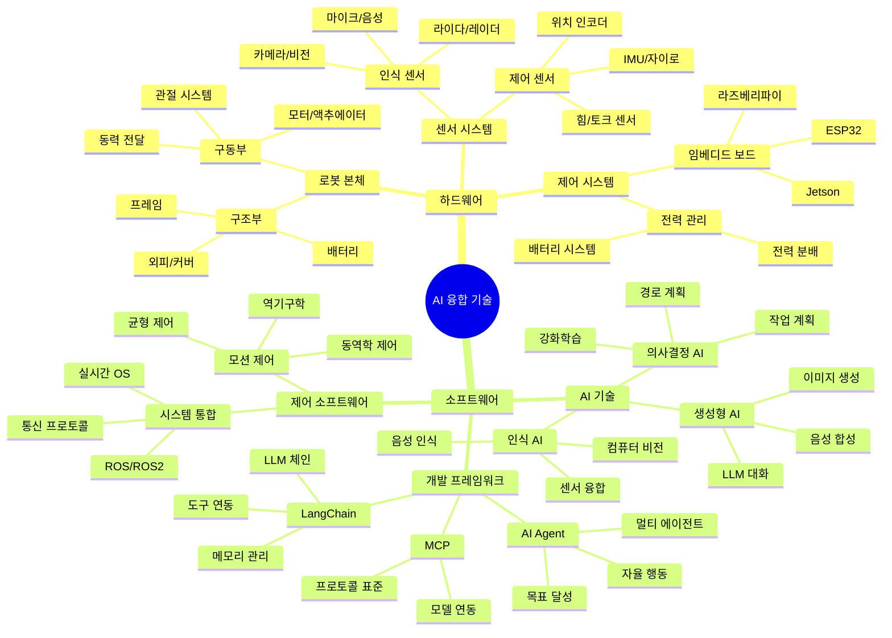

---

### 1.2 하드웨어 계층 구조

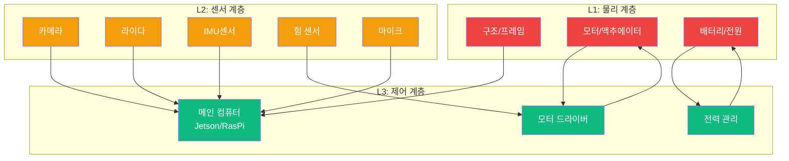

**하드웨어 구성 요소**

| 계층 | 구성 요소 | 역할 | 교육 적용 |
|------|----------|------|----------|
| **L1: 물리** | 프레임, 관절, 모터, 배터리 | 로봇의 물리적 구조 | 3D 프린팅, 조립 실습 |
| **L2: 센서** | 카메라, 라이다, IMU, 힘센서 | 환경 인식 및 피드백 | 센서 데이터 수집 실습 |
| **L3: 제어** | 컴퓨터, 모터 드라이버, 전원 | 실시간 제어 및 연산 | 임베디드 프로그래밍 |

---

### 1.3 소프트웨어 계층 구조

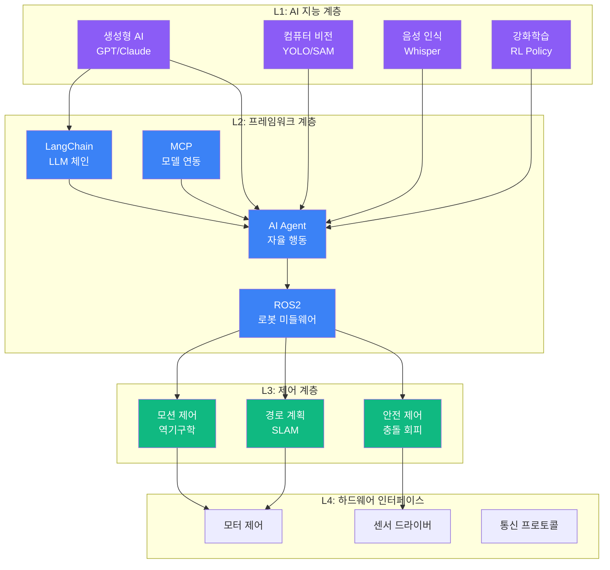

**소프트웨어 구성 요소**

| 계층 | 구성 요소 | 역할 | 교육 적용 |
|------|----------|------|----------|
| **L1: AI 지능** | LLM, Vision, Speech, RL | 인간 수준 인지 및 판단 | ChatGPT, Colab 실습 |
| **L2: 프레임워크** | LangChain, Agent, MCP, ROS | AI와 로봇 시스템 통합 | Agent 개발, ROS 기초 |
| **L3: 제어** | 모션, 경로, 안전 제어 | 실시간 로봇 제어 | 역기구학, SLAM 실습 |
| **L4: 인터페이스** | 드라이버, 통신 | 하드웨어 직접 제어 | Python 센서/모터 제어 |

---

## 2. 핵심 용어 정리

### 2.1 AI 기술 용어

#### 🤖 **생성형 AI (Generative AI)**

**정의**: 학습한 패턴을 바탕으로 새로운 콘텐츠(텍스트, 이미지, 음성)를 생성하는 AI

**대표 기술**:
- **LLM (Large Language Model)**: GPT-4, Claude 등 대규모 언어 모델
- **이미지 생성**: DALL-E, Stable Diffusion, Midjourney
- **음성 생성**: TTS (Text-to-Speech), 음성 복제

**휴머노이드 적용**:
- 자연스러운 대화 (음성 인터페이스)
- 상황에 맞는 응답 생성
- 작업 지시 이해 및 실행

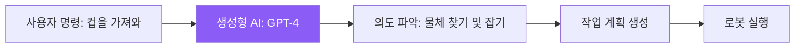

**교육 포인트**:
- ChatGPT로 대화형 인터페이스 실습
- Prompt Engineering (명령어 최적화)
- 열린 사고: 다양한 질문 방식 실험

---

#### 🧠 **AGI (Artificial General Intelligence)**

**정의**: 인간처럼 다양한 작업을 범용적으로 수행할 수 있는 일반 인공지능

**현재 단계**:
- **ANI (Narrow AI)**: 특정 작업만 수행 (현재 대부분의 AI)
- **AGI**: 범용 지능 (아직 미달성, 연구 중)
- **ASI (Super Intelligence)**: 인간을 초월하는 지능 (이론적 단계)

**휴머노이드와의 관계**:
- 궁극적 목표: 인간처럼 모든 작업 수행 가능한 로봇
- 현재는 특정 작업 조합으로 AGI에 근접
- 멀티모달 AI (시각 + 언어 + 제어) 융합이 핵심

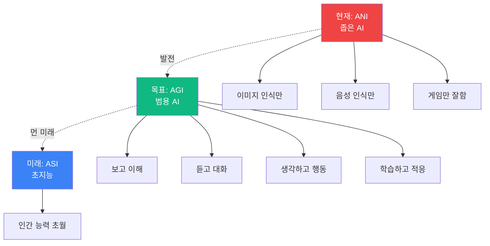

**교육 포인트**:
- AI의 한계와 가능성 이해
- 다양한 기능을 조합하는 시스템 설계 사고
- 멀티모달 AI 실습 (카메라 + 음성 + 제어)

---

#### 🎯 **AI Agent (AI 에이전트)**

**정의**: 목표를 받으면 스스로 계획하고 도구를 사용하여 자율적으로 작업을 완수하는 AI 시스템

**핵심 구성**:
1. **Perception** (인식): 환경 관찰
2. **Planning** (계획): 작업 단계 수립
3. **Action** (행동): 도구/API 실행
4. **Memory** (기억): 과거 경험 저장
5. **Learning** (학습): 결과 기반 개선

```mermaid
graph TB
    A[목표 입력<br/>"방 청소해"]
    
    B[AI Agent 시스템]
    
    B --> C1[인식<br/>방 상태 파악]
    B --> C2[계획<br/>청소 순서 결정]
    B --> C3[행동<br/>청소 실행]
    B --> C4[기억<br/>장애물 위치 저장]
    B --> C5[학습<br/>효율 개선]
    
    C1 --> D[센서 데이터]
    C2 --> E[작업 시퀀스]
    C3 --> F[모터 제어]
    C4 --> G[데이터베이스]
    C5 --> H[정책 업데이트]
    
    A --> B
    
    style B fill:#3b82f6,color:#fff
    style C1 fill:#10b981,color:#fff
    style C2 fill:#f59e0b,color:#fff
    style C3 fill:#ef4444,color:#fff
```

**휴머노이드 적용**:
- 복잡한 작업을 단계별로 분해
- 예: "커피 만들기" → [컵 찾기] → [원두 넣기] → [물 넣기] → [버튼 누르기]
- 실패 시 재시도 또는 대안 실행

**교육 포인트**:
- AutoGPT, LangChain Agent 실습
- 간단한 목표 → 복잡한 목표로 단계적 학습
- 실패 케이스 분석 및 개선

---

#### 🔗 **LangChain (랭체인)**

**정의**: LLM(대규모 언어 모델)을 실제 애플리케이션에 연결하는 개발 프레임워크

**핵심 기능**:
1. **Chains** (체인): 여러 단계의 LLM 호출 연결
2. **Agents** (에이전트): 도구를 선택하고 사용하는 자율 시스템
3. **Memory** (메모리): 대화 기록 저장 및 관리
4. **Tools** (도구): 외부 API, 데이터베이스 연동

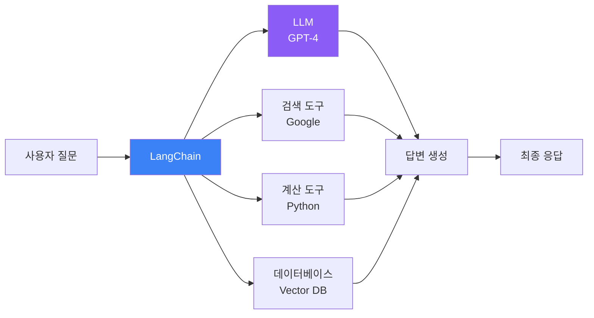

**휴머노이드 적용**:
- 음성 명령 → 로봇 제어 API 연결
- 과거 작업 기록을 메모리로 저장
- 복잡한 명령을 단계별로 분해 실행

**예시 코드 개념**:
```python
# LangChain을 사용한 휴머노이드 명령 처리
from langchain import Agent, Tool

# 도구 정의
tools = [
    Tool("카메라", "물체를 인식합니다"),
    Tool("모터제어", "로봇 팔을 움직입니다"),
    Tool("음성합성", "응답을 음성으로 출력합니다")
]

# 에이전트 생성
agent = Agent(tools=tools, llm="gpt-4")

# 명령 실행
agent.run("책상 위의 컵을 가져와")
# 1. 카메라로 컵 위치 파악
# 2. 모터제어로 팔 이동
# 3. 음성합성으로 "컵을 가져왔습니다" 출력
```

**교육 포인트**:
- Python + LangChain 기초 실습
- 간단한 챗봇에서 시작
- 로봇 제어 API 연동 실습

---

#### 🌐 **MCP (Model Context Protocol)**

**정의**: AI 모델과 외부 시스템(데이터, 도구, 서비스)을 표준화된 방식으로 연결하는 프로토콜

**목적**:
- AI 모델이 다양한 데이터 소스에 접근
- 도구(API, 함수)를 일관된 방식으로 사용
- 확장 가능한 AI 시스템 구축

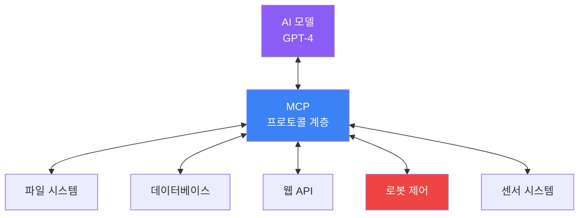

**휴머노이드 적용**:
- LLM이 로봇의 센서 데이터에 직접 접근
- 표준 인터페이스로 다양한 하드웨어 통합
- 모델 교체 시에도 동일한 프로토콜 사용

**교육 포인트**:
- API 개념 이해 (RESTful, gRPC)
- 표준 프로토콜의 중요성
- 실습: 센서 데이터를 AI 모델에 전달

---

#### 💬 **Prompt Engineering (프롬프트 엔지니어링)**

**정의**: AI 모델에게 원하는 결과를 얻기 위해 최적의 명령어(프롬프트)를 설계하는 기술

**핵심 원칙**:
1. **명확성**: 구체적이고 명확한 지시
2. **맥락 제공**: 배경 정보 포함
3. **예시 제공**: Few-shot Learning
4. **역할 부여**: "너는 전문가야"
5. **단계별 사고**: Chain-of-Thought

```mermaid
graph TB
    A[나쁜 프롬프트<br/>"코드 짜줘"]
    B[좋은 프롬프트<br/>"Python으로 휴머노이드<br/>로봇 팔의 역기구학을<br/>계산하는 함수를 작성해줘.<br/>입력: 목표 위치 (x,y,z)<br/>출력: 관절 각도 (θ1,θ2,θ3)"]
    
    C1[애매한 결과]
    C2[정확한 결과]
    
    A --> C1
    B --> C2
    
    style A fill:#ef4444,color:#fff
    style B fill:#10b981,color:#fff
```

**휴머노이드 적용 예시**:

| 작업 | 나쁜 프롬프트 | 좋은 프롬프트 |
|------|-------------|-------------|
| 물체 잡기 | "물건 잡아" | "앞쪽 30cm에 있는 빨간색 컵을 집게로 잡고, 힘 센서로 5N 이하로 유지하며 들어올려" |
| 경로 계획 | "거기로 가" | "현재 위치 (0,0)에서 목표 (5,3)까지 장애물 [2,1], [3,2]를 피하며 최단 경로로 이동" |
| 대화 응답 | "답해" | "사용자가 '배고파'라고 하면, 현재 시간과 최근 식사 기록을 고려하여 적절한 음식을 추천해" |

**교육 포인트**:
- 열린 사고: 다양한 질문 방식 실험
- 실패 사례 분석 → 개선
- 실습: ChatGPT로 프롬프트 최적화

---

### 2.2 로봇 기술 용어

#### 🦾 **로봇 (Robot)**

**정의**: 센서로 환경을 인식하고, 프로그램에 따라 자율적으로 작업을 수행하는 기계 시스템

**분류**:
1. **산업 로봇**: 용접, 조립, 도장 (고정형 로봇 암)
2. **서비스 로봇**: 청소, 배송, 안내 (이동형)
3. **휴머노이드**: 인간 형태, 범용 작업

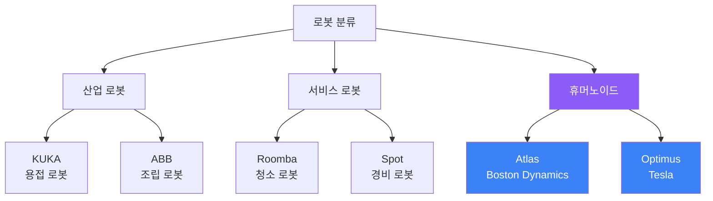

**교육 포인트**:
- 로봇의 역사와 발전 과정
- 각 분야별 로봇의 특징
- 실습: 간단한 로봇 팔 조립 및 제어

---

#### 🚶 **휴머노이드 로봇 (Humanoid Robot)**

**정의**: 인간의 신체 구조(머리, 몸통, 팔, 다리)를 모방한 로봇으로, 인간 환경에서 범용 작업 수행을 목표로 함

**핵심 특징**:
- **이족 보행**: 두 다리로 걷기 (균형 제어 필요)
- **양손 작업**: 인간 도구 사용 가능
- **다관절**: 40~60개의 자유도 (DOF)
- **멀티모달 센서**: 카메라, 마이크, 촉각, IMU

**주요 기술 과제**:

| 분야 | 과제 | 해결 방법 |
|------|------|----------|
| **하드웨어** | 균형 유지 | IMU 센서 + 실시간 제어 |
| **하드웨어** | 관절 제어 | 고성능 모터 + 역기구학 |
| **소프트웨어** | 물체 인식 | 컴퓨터 비전 (YOLO, SAM) |
| **소프트웨어** | 작업 계획 | AI Agent + 강화학습 |
| **융합** | 실시간 통합 | ROS2 + MCP |

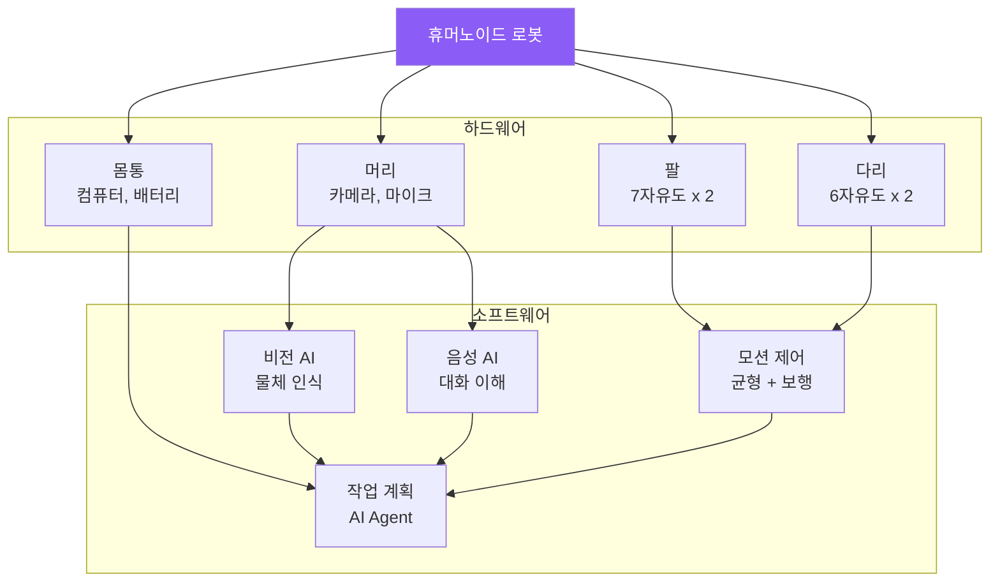

**대표 휴머노이드**:
1. **Atlas (Boston Dynamics)**: 가장 앞선 운동 능력 (파쿠르, 백플립)
2. **Optimus (Tesla)**: 대량 생산 목표, AI 자동 학습
3. **Figure 01 (Figure AI)**: 상업적 응용 (창고, 공장)

**교육 포인트**:
- 휴머노이드의 구조 이해
- 균형 제어의 중요성 (IMU 센서 실습)
- 역기구학 기초 (Python 계산)

---

### 2.3 융합이 중요한 이유

#### 🔄 **융합 = 하드웨어 × 소프트웨어**

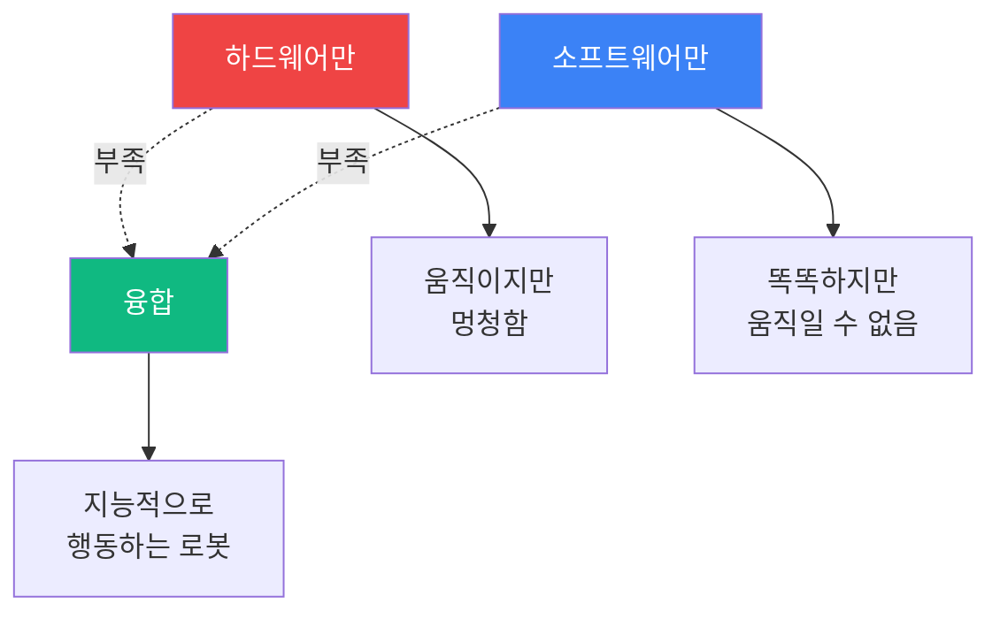

**왜 융합이 필수인가?**

| 측면 | 하드웨어만 | 소프트웨어만 | 융합 |
|------|----------|-------------|------|
| **인식** | ❌ 센서는 있지만 해석 불가 | ❌ 데이터 없음 | ✅ 센서 + AI 비전 |
| **판단** | ❌ 프로그램된 것만 실행 | ✅ LLM이 판단 | ✅ AI + 제어 |
| **행동** | ✅ 모터는 작동 | ❌ 시뮬레이션만 | ✅ 실제 실행 |
| **학습** | ❌ 고정된 동작 | ❌ 가상만 | ✅ 실제 경험 학습 |

**실제 사례**:

1. **Tesla Optimus 개발 과정**
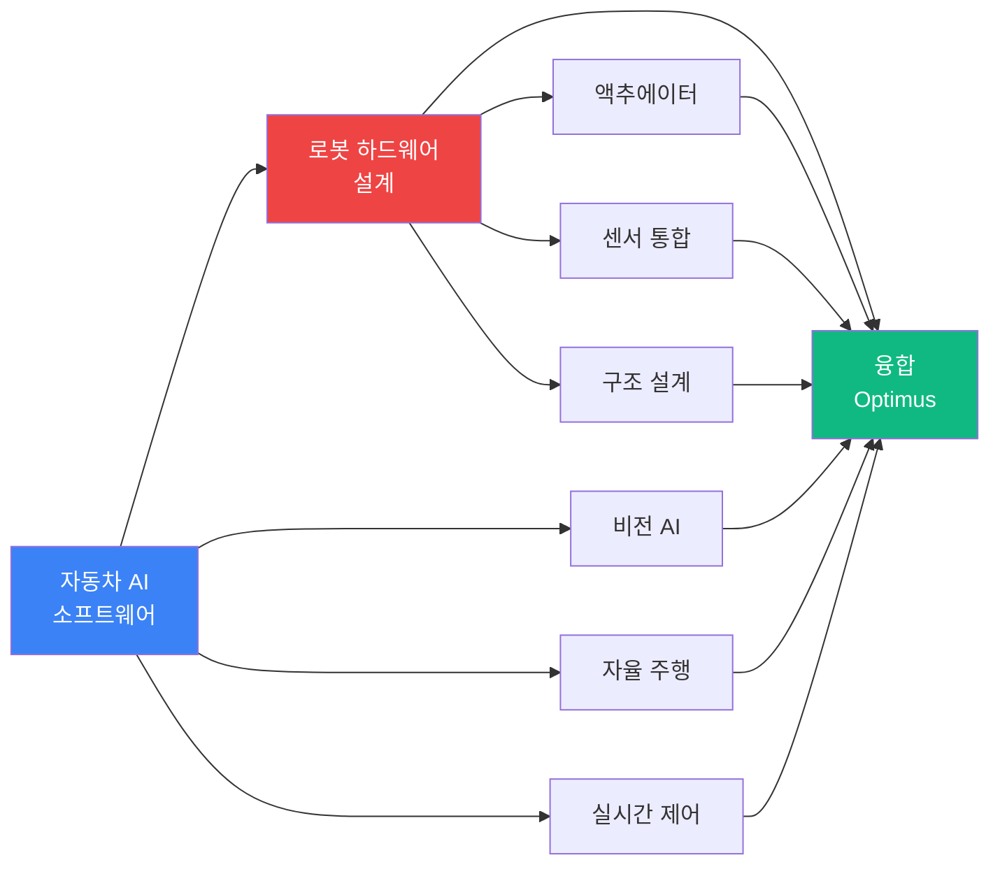

2. **Boston Dynamics의 진화**
   - 초기: 뛰어난 하드웨어 + 수동 프로그래밍
   - 현재: AI 학습 + 자율 작업 수행

**교육 포인트**:
- 하드웨어와 소프트웨어를 분리하여 이해한 후
- 통합 프로젝트로 융합 경험
- 예: 라즈베리파이 + 카메라 + ChatGPT API

---

## 3. 융합 기술 구조도

### 3.1 휴머노이드 시스템 전체 아키텍처

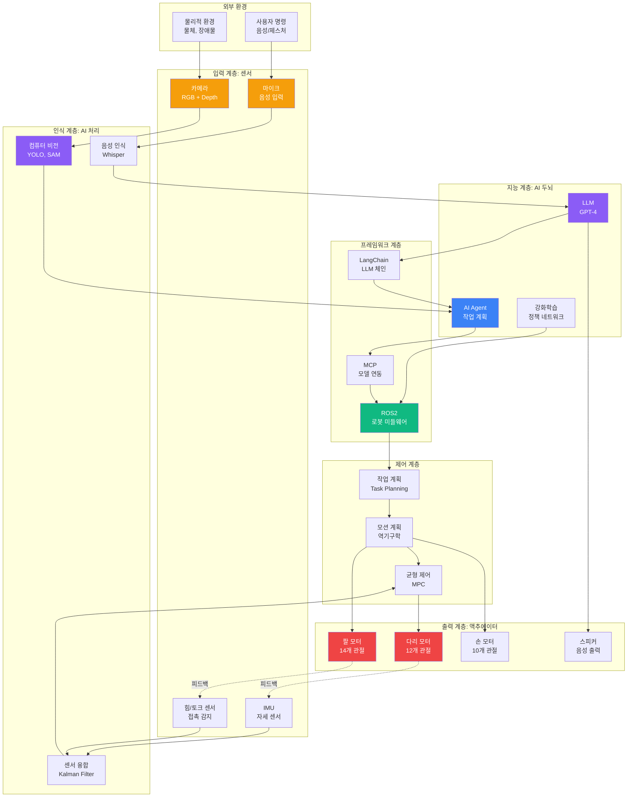

**각 계층의 역할**

| 계층 | 주요 기술 | 입력 | 출력 | 교육 초점 |
|------|----------|------|------|----------|
| **센서** | 카메라, 마이크, IMU | 물리적 신호 | 디지털 데이터 | 센서 데이터 수집 |
| **인식** | 컴퓨터 비전, 음성 인식 | Raw 데이터 | 의미 있는 정보 | AI 모델 활용 |
| **지능** | LLM, Agent, RL | 정보 | 판단/계획 | AI Agent 개발 |
| **프레임워크** | LangChain, MCP, ROS | AI 명령 | 실행 가능 명령 | 시스템 통합 |
| **제어** | 역기구학, MPC | 목표 | 관절 각도/속도 | 수학적 제어 |
| **액추에이터** | 모터, 스피커 | 제어 신호 | 물리적 동작 | 하드웨어 제어 |

---

### 3.2 데이터 흐름도

**예시: "책상 위의 컵을 가져와" 명령 실행**

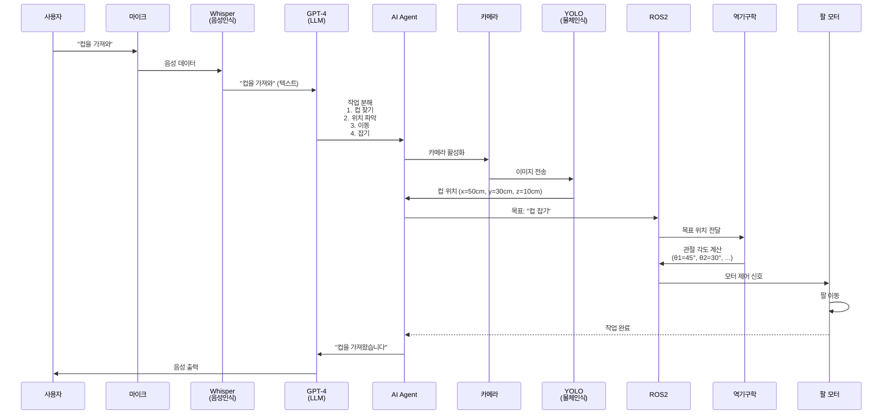

**단계별 기술 매핑**

| 단계 | 하드웨어 | 소프트웨어 | 융합 포인트 |
|------|----------|-----------|-----------|
| 1. 음성 입력 | 마이크 | Whisper API | 음성 → 텍스트 변환 |
| 2. 의미 이해 | - | GPT-4 | 자연어 → 작업 계획 |
| 3. 물체 인식 | 카메라 | YOLO | 이미지 → 위치 좌표 |
| 4. 작업 계획 | - | AI Agent + LangChain | 단계별 작업 분해 |
| 5. 경로 계획 | - | ROS2 + 역기구학 | 좌표 → 관절 각도 |
| 6. 동작 실행 | 팔 모터 | 모터 드라이버 | 전기 신호 → 물리적 동작 |
| 7. 피드백 | 힘 센서 | 센서 융합 | 잡기 성공 여부 확인 |

---

## 4. 휴머노이드 개발 파이프라인

### 4.1 전체 개발 순서도

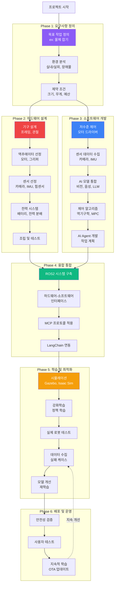

---

### 4.2 각 Phase별 상세 설명

#### **Phase 1: 요구사항 정의** (1-2주)

**목표**: 휴머노이드가 해결할 문제를 명확히 정의

**활동**:
1. **작업 분석**
   - 어떤 작업을 수행할 것인가? (예: 물류 창고 작업, 가정 서비스)
   - 필요한 능력: 보행, 물체 조작, 대화 등

2. **환경 분석**
   - 실내/실외
   - 평지/계단/장애물
   - 조명 조건, 소음 수준

3. **제약 조건**
   - 예산: $10K? $100K?
   - 크기: 인간 크기? 소형?
   - 배터리 시간: 1시간? 8시간?

**교육 적용**:
- 학생들이 해결하고 싶은 문제 발표
- 간단한 작업부터 시작 (예: "블록 쌓기")

---

#### **Phase 2: 하드웨어 설계** (4-8주)

**목표**: 물리적 로봇 구조 설계 및 제작

**2.1 기구 설계**
- **CAD 설계**: Fusion 360, SolidWorks
- **자유도(DOF) 결정**: 팔 7DOF x 2, 다리 6DOF x 2
- **재료 선택**: 알루미늄, 카본, 3D 프린팅

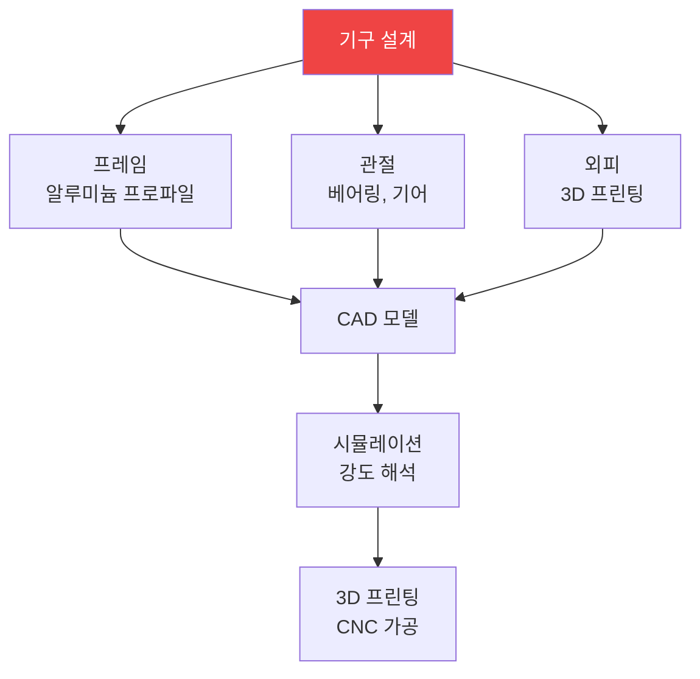

**2.2 액추에이터 선정**

| 부위 | 모터 종류 | 토크 | 개수 |
|------|----------|------|------|
| 어깨 | BLDC 모터 | 10 Nm | 6 (3 x 2) |
| 팔꿈치 | BLDC 모터 | 5 Nm | 2 |
| 손목 | 서보 모터 | 1 Nm | 6 (3 x 2) |
| 손 | 서보 모터 | 0.5 Nm | 10 (5 x 2) |
| 엉덩이 | BLDC 모터 | 20 Nm | 6 (3 x 2) |
| 무릎 | BLDC 모터 | 15 Nm | 2 |
| 발목 | BLDC 모터 | 10 Nm | 4 (2 x 2) |

**2.3 센서 선정**

| 센서 | 용도 | 모델 예시 |
|------|------|----------|
| RGB-D 카메라 | 물체 인식, 깊이 측정 | Intel RealSense D435 |
| 라이다 | 장애물 감지 | RPLidar A1 |
| IMU | 자세 측정 | MPU-6050, BNO055 |
| 힘/토크 센서 | 접촉 감지 | ATI Mini40 |
| 마이크 어레이 | 음성 입력 | ReSpeaker Mic Array |

**2.4 조립 및 테스트**
- 기계적 조립
- 배선 및 전력 연결
- 기본 동작 테스트 (관절별 가동 범위)

**교육 적용**:
- 간단한 로봇 팔 키트 조립 (OpenManipulator)
- 3D 프린팅으로 간단한 부품 제작
- 서보 모터 제어 실습

---

#### **Phase 3: 소프트웨어 개발** (6-12주)

**목표**: AI 및 제어 소프트웨어 구현

**3.1 저수준 제어**
```python
# 모터 제어 예시 (라즈베리파이 + 서보)
import RPi.GPIO as GPIO
import time

# GPIO 초기화
GPIO.setmode(GPIO.BCM)
servo_pin = 18
GPIO.setup(servo_pin, GPIO.OUT)

# PWM 설정 (50Hz)
pwm = GPIO.PWM(servo_pin, 50)
pwm.start(0)

def set_angle(angle):
    """각도를 0-180도로 설정"""
    duty = 2 + (angle / 18)
    pwm.ChangeDutyCycle(duty)
    time.sleep(0.3)
    pwm.ChangeDutyCycle(0)

# 90도로 이동
set_angle(90)
```

**3.2 센서 데이터 수집**
```python
# 카메라 데이터 수집 (OpenCV)
import cv2

cap = cv2.VideoCapture(0)

while True:
    ret, frame = cap.read()
    if ret:
        cv2.imshow('Camera', frame)
        # AI 모델에 전달
        # ...
    
    if cv2.waitKey(1) & 0xFF == ord('q'):
        break

cap.release()
```

**3.3 AI 모델 통합**
```python
# YOLO 물체 인식
from ultralytics import YOLO

model = YOLO('yolov8n.pt')
results = model(frame)

for r in results:
    boxes = r.boxes
    for box in boxes:
        cls = int(box.cls[0])
        if model.names[cls] == 'cup':  # 컵 감지
            x, y, w, h = box.xywh[0]
            print(f"컵 위치: ({x}, {y})")
```

**3.4 제어 알고리즘 - 역기구학**
```python
# 간단한 2자유도 역기구학 예시
import numpy as np

def inverse_kinematics_2dof(x, y, l1, l2):
    """
    2자유도 로봇 팔의 역기구학
    x, y: 목표 위치
    l1, l2: 링크 길이
    반환: (theta1, theta2) 관절 각도
    """
    # 거리 계산
    r = np.sqrt(x**2 + y**2)
    
    # 코사인 법칙
    cos_theta2 = (r**2 - l1**2 - l2**2) / (2 * l1 * l2)
    theta2 = np.arccos(cos_theta2)
    
    # theta1 계산
    alpha = np.arctan2(y, x)
    beta = np.arctan2(l2 * np.sin(theta2), l1 + l2 * np.cos(theta2))
    theta1 = alpha - beta
    
    return np.degrees(theta1), np.degrees(theta2)

# 사용 예시
x, y = 0.5, 0.3  # 목표 위치 (미터)
l1, l2 = 0.3, 0.25  # 링크 길이
theta1, theta2 = inverse_kinematics_2dof(x, y, l1, l2)
print(f"관절 각도: θ1={theta1:.1f}°, θ2={theta2:.1f}°")
```

**3.5 AI Agent 개발**
```python
# LangChain Agent 예시
from langchain import Agent, Tool
from langchain.llms import OpenAI

# 도구 정의
def detect_object(object_name):
    """카메라로 물체 감지"""
    # YOLO 실행
    return {"x": 50, "y": 30, "z": 10}

def move_arm(x, y, z):
    """로봇 팔 이동"""
    # 역기구학 + 모터 제어
    return "이동 완료"

tools = [
    Tool("물체감지", detect_object, "물체의 위치를 찾습니다"),
    Tool("팔이동", move_arm, "로봇 팔을 이동합니다")
]

# Agent 생성
llm = OpenAI(model="gpt-4")
agent = Agent(llm=llm, tools=tools)

# 명령 실행
result = agent.run("책상 위의 컵을 잡아")
```

**교육 적용**:
- Python 기초 + 센서 제어
- OpenCV로 이미지 처리 실습
- ChatGPT API로 간단한 Agent 만들기

---

#### **Phase 4: 융합 통합** (4-6주)

**목표**: 하드웨어와 소프트웨어를 ROS2로 통합

**4.1 ROS2 시스템 구축**

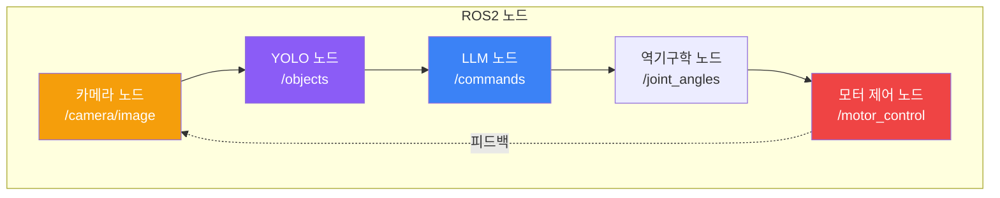

**ROS2 노드 예시**
```python
# camera_node.py
import rclpy
from rclpy.node import Node
from sensor_msgs.msg import Image
import cv2

class CameraNode(Node):
    def __init__(self):
        super().__init__('camera_node')
        self.publisher = self.create_publisher(Image, '/camera/image', 10)
        self.timer = self.create_timer(0.1, self.publish_frame)
        self.cap = cv2.VideoCapture(0)
    
    def publish_frame(self):
        ret, frame = self.cap.read()
        if ret:
            # OpenCV -> ROS2 메시지 변환
            msg = Image()
            # ... 변환 코드 ...
            self.publisher.publish(msg)

def main():
    rclpy.init()
    node = CameraNode()
    rclpy.spin(node)
```

**4.2 MCP 프로토콜 적용**
- AI 모델과 로봇 시스템 간 표준 인터페이스
- RESTful API 또는 gRPC 사용

**4.3 LangChain 연동**
- LLM이 ROS2 토픽에 직접 접근
- 센서 데이터를 LLM의 컨텍스트로 제공

**교육 적용**:
- ROS2 기초 튜토리얼 (turtlesim)
- 간단한 Publisher-Subscriber 실습
- API 개념 학습 (RESTful)

---

#### **Phase 5: 학습 및 최적화** (8-16주)

**목표**: 강화학습으로 로봇 성능 향상

**5.1 시뮬레이션**

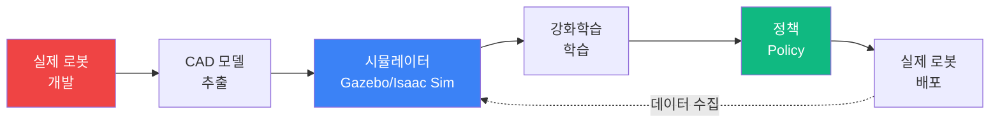

**5.2 강화학습**

```python
# 간단한 강화학습 예시 (개념)
import gym
import numpy as np

# 환경 정의 (로봇 팔 제어)
env = gym.make('RobotArm-v0')

# 정책 네트워크 (간소화)
def policy(state):
    """상태를 받아 행동 선택"""
    # 신경망으로 관절 각도 출력
    return action

# 학습 루프
for episode in range(1000):
    state = env.reset()
    total_reward = 0
    
    for step in range(100):
        action = policy(state)
        next_state, reward, done, info = env.step(action)
        
        # 정책 업데이트
        # ...
        
        total_reward += reward
        state = next_state
        
        if done:
            break
    
    print(f"Episode {episode}: Reward = {total_reward}")
```

**5.3 실제 로봇 테스트**
- 시뮬레이션에서 학습한 정책을 실제 로봇에 적용
- Sim-to-Real 갭 해결 (도메인 랜덤화)

**5.4 데이터 수집**
- 실패 케이스 기록
- 텔레오퍼레이션으로 시연 데이터 수집

**5.5 모델 개선**
- 수집한 데이터로 재학습
- Imitation Learning (모방 학습)

**교육 적용**:
- Gazebo로 간단한 로봇 시뮬레이션
- 강화학습 개념 학습 (Q-Learning)
- 간단한 게임 환경에서 RL 실습

---

#### **Phase 6: 배포 및 운영** (지속적)

**목표**: 안전하고 지속적으로 개선되는 시스템

**6.1 안전성 검증**
- 비상 정지 기능
- 충돌 감지 및 회피
- 힘 제한 (사람과 접촉 시)

**6.2 사용자 테스트**
- 베타 테스터 모집
- 피드백 수집

**6.3 지속적 학습**
- OTA (Over-The-Air) 업데이트
- 클라우드에서 데이터 수집 및 재학습
- 새로운 작업 추가

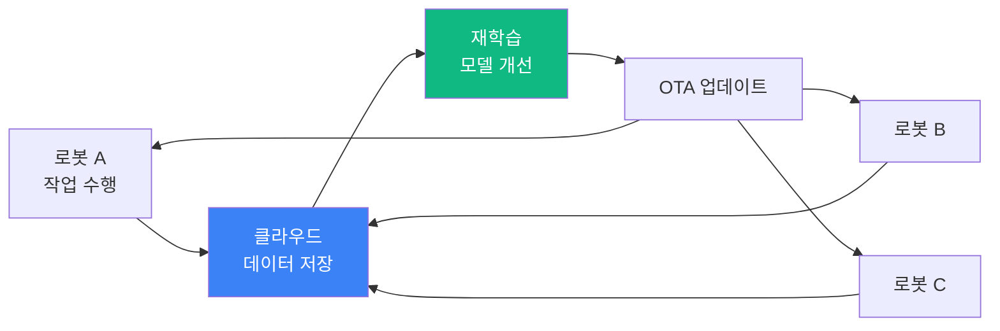

**교육 적용**:
- 안전 설계의 중요성 강조
- A/B 테스트 개념
- 지속적 개선 마인드셋

---

## 5. 기술 간 연계도

### 5.1 기술 의존성 그래프

```mermaid
graph TB
    subgraph "Foundation: 기초 기술"
        F1[Python 프로그래밍]
        F2[수학: 선형대수, 미적분]
        F3[전자공학 기초]
    end
    
    subgraph "Hardware: 하드웨어"
        H1[센서 시스템]
        H2[모터 제어]
        H3[임베디드 시스템<br/>RasPi, Jetson]
    end
    
    subgraph "AI: 인공지능"
        A1[컴퓨터 비전<br/>OpenCV, YOLO]
        A2[자연어 처리<br/>GPT, Whisper]
        A3[강화학습<br/>RL]
    end
    
    subgraph "Framework: 프레임워크"
        FR1[LangChain]
        FR2[ROS2]
        FR3[MCP]
    end
    
    subgraph "Integration: 통합"
        I1[AI Agent]
        I2[시스템 통합]
    end
    
    subgraph "Application: 응용"
        AP1[휴머노이드 로봇]
    end
    
    F1 --> H3
    F1 --> A1
    F1 --> A2
    F2 --> A3
    F3 --> H2
    
    H1 --> A1
    H2 --> FR2
    H3 --> FR2
    
    A1 --> I1
    A2 --> FR1
    A3 --> I1
    
    FR1 --> I1
    FR2 --> I2
    FR3 --> I2
    
    I1 --> AP1
    I2 --> AP1
    
    style F1 fill:#8b5cf6,color:#fff
    style A2 fill:#3b82f6,color:#fff
    style I1 fill:#10b981,color:#fff
    style AP1 fill:#ef4444,color:#fff
```

**의존성 설명**

| 상위 기술 | 하위 기술 (필요한 선행 지식) | 이유 |
|----------|---------------------------|------|
| **AI Agent** | LangChain, 컴퓨터 비전, 강화학습 | 자율 행동을 위해 인식, 계획, 학습 필요 |
| **LangChain** | GPT API, Python | LLM을 코드로 제어하려면 프로그래밍 필요 |
| **컴퓨터 비전** | 카메라 센서, Python | 이미지 데이터를 처리하려면 센서와 코드 필요 |
| **ROS2** | 임베디드 시스템, 모터 제어 | 하드웨어를 제어하는 미들웨어 |
| **휴머노이드** | 위 모든 기술 | 최종 통합 시스템 |

---

### 5.2 융합 연계 맵

**왜 각 기술이 서로 연결되어야 하는가?**

```mermaid
mindmap
  root((휴머노이드<br/>로봇))
    보기
      카메라
        물체 인식
          YOLO
        깊이 측정
          RealSense
      라이다
        장애물 감지
    듣기
      마이크
        음성 인식
          Whisper
        명령 이해
          GPT-4
    생각하기
      AI Agent
        작업 계획
          LangChain
        의사결정
          강화학습
    움직이기
      모터
        관절 제어
          역기구학
        균형 유지
          MPC
      ROS2
        실시간 제어
    통합
      MCP
        모든 시스템 연결
```

**구체적 연계 예시**

1. **보기 → 생각하기 → 움직이기**
```mermaid
graph LR
    A[카메라로 컵 인식] --> B[YOLO로 위치 파악<br/>x=50, y=30, z=10]
    B --> C[GPT-4가 명령 해석<br/>"컵을 잡아"]
    C --> D[AI Agent가 계획<br/>1.이동 2.잡기]
    D --> E[역기구학으로<br/>관절 각도 계산]
    E --> F[ROS2가 모터 제어]
    
    style A fill:#f59e0b,color:#fff
    style B fill:#8b5cf6,color:#fff
    style C fill:#3b82f6,color:#fff
    style F fill:#ef4444,color:#fff
```

2. **듣기 → 생각하기 → 보기 → 움직이기**
```mermaid
graph LR
    A[마이크로 음성 입력] --> B[Whisper로 텍스트 변환<br/>"빨간 공 찾아"]
    B --> C[GPT-4가 이해<br/>색상=빨강, 물체=공]
    C --> D[카메라 활성화]
    D --> E[YOLO로 빨간 공 검색]
    E --> F[발견 시 AI Agent가<br/>이동 계획]
    F --> G[ROS2로 걷기 실행]
    
    style A fill:#f59e0b,color:#fff
    style C fill:#3b82f6,color:#fff
    style E fill:#8b5cf6,color:#fff
    style G fill:#ef4444,color:#fff
```

---

### 5.3 기술 레벨별 학습 경로

```mermaid
graph TB
    subgraph "Level 1: 입문 (1-3개월)"
        L1_1[Python 기초]
        L1_2[ChatGPT 활용]
        L1_3[라즈베리파이<br/>LED, 버튼]
    end
    
    subgraph "Level 2: 초급 (3-6개월)"
        L2_1[OpenCV<br/>이미지 처리]
        L2_2[서보 모터 제어]
        L2_3[간단한 로봇 팔<br/>2-3 자유도]
    end
    
    subgraph "Level 3: 중급 (6-12개월)"
        L3_1[YOLO 물체 인식]
        L3_2[역기구학]
        L3_3[ROS2 기초]
        L3_4[LangChain Agent]
    end
    
    subgraph "Level 4: 고급 (12-24개월)"
        L4_1[강화학습]
        L4_2[시뮬레이션<br/>Gazebo]
        L4_3[멀티모달 통합]
        L4_4[MPC 제어]
    end
    
    subgraph "Level 5: 전문가 (24+개월)"
        L5_1[전체 시스템 통합]
        L5_2[휴머노이드 개발]
        L5_3[실제 배포]
    end
    
    L1_1 --> L2_1
    L1_2 --> L3_4
    L1_3 --> L2_2
    
    L2_1 --> L3_1
    L2_2 --> L3_2
    L2_3 --> L3_2
    
    L3_1 --> L4_3
    L3_2 --> L4_4
    L3_3 --> L4_2
    L3_4 --> L4_3
    
    L4_1 --> L5_1
    L4_2 --> L5_1
    L4_3 --> L5_1
    L4_4 --> L5_1
    
    L5_1 --> L5_2
    L5_2 --> L5_3
    
    style L1_2 fill:#8b5cf6,color:#fff
    style L3_1 fill:#8b5cf6,color:#fff
    style L3_4 fill:#3b82f6,color:#fff
    style L5_2 fill:#ef4444,color:#fff
```

**레벨별 학습 내용**

| 레벨 | 하드웨어 | 소프트웨어 | 융합 프로젝트 |
|------|----------|-----------|-------------|
| **L1: 입문** | LED, 버튼, 센서 | Python, ChatGPT | LED를 ChatGPT로 제어 |
| **L2: 초급** | 서보, DC 모터 | OpenCV 기초 | 카메라로 물체 추적 로봇 |
| **L3: 중급** | 로봇 팔, IMU | YOLO, ROS2, LangChain | 음성으로 제어하는 로봇 팔 |
| **L4: 고급** | 이족 로봇, 복잡 센서 | 강화학습, 시뮬레이션 | 자율 보행 로봇 |
| **L5: 전문가** | 풀스택 휴머노이드 | 전체 AI 스택 | 범용 휴머노이드 |

---

## 6. 학습 로드맵

### 6.1 교육 과정 로드맵

```mermaid
timeline
    title AI 융합 교육 로드맵 (24개월)
    
    section 1-3개월: 기초
        하드웨어: 라즈베리파이, 센서
        소프트웨어: Python, ChatGPT
        프로젝트: 스마트 조명 시스템
    
    section 4-6개월: 초급
        하드웨어: 서보 모터, 카메라
        소프트웨어: OpenCV, 간단한 제어
        프로젝트: 물체 추적 로봇
    
    section 7-12개월: 중급
        하드웨어: 로봇 팔, 여러 센서
        소프트웨어: YOLO, ROS2, LangChain
        프로젝트: AI 제어 로봇 팔
    
    section 13-18개월: 고급
        하드웨어: 이족 로봇 프레임
        소프트웨어: 강화학습, 시뮬레이션
        프로젝트: 자율 보행 로봇
    
    section 19-24개월: 전문가
        하드웨어: 휴머노이드 통합
        소프트웨어: 멀티모달 AI, MCP
        프로젝트: 범용 휴머노이드
```

---

### 6.2 단계별 학습 계획

#### **Phase 1: 기초 (1-3개월)**

**하드웨어**
- 라즈베리파이 4 설정
- GPIO 제어 (LED, 버튼, 부저)
- 센서 연결 (초음파, 온도, 조도)

**소프트웨어**
- Python 기초 문법
- ChatGPT API 사용
- 간단한 음성 인식 (Google STT)

**융합 프로젝트: 스마트 조명 시스템**
```python
# ChatGPT로 조명 제어
import openai
import RPi.GPIO as GPIO

LED_PIN = 18
GPIO.setmode(GPIO.BCM)
GPIO.setup(LED_PIN, GPIO.OUT)

def control_led(command):
    """ChatGPT가 명령을 해석하여 LED 제어"""
    response = openai.ChatCompletion.create(
        model="gpt-4",
        messages=[
            {"role": "system", "content": "너는 LED 제어 시스템이야. '켜' 또는 '꺼' 중 하나만 답해."},
            {"role": "user", "content": command}
        ]
    )
    
    action = response.choices[0].message.content
    
    if "켜" in action:
        GPIO.output(LED_PIN, GPIO.HIGH)
        return "LED를 켰습니다"
    elif "꺼" in action:
        GPIO.output(LED_PIN, GPIO.LOW)
        return "LED를 껐습니다"

# 사용
print(control_led("방이 어두워"))  # GPT가 "켜"로 해석 → LED ON
```

**학습 목표**:
- 하드웨어와 소프트웨어의 연결 이해
- AI를 실제 제어에 활용하는 감각

---

#### **Phase 2: 초급 (4-6개월)**

**하드웨어**
- 서보 모터 제어
- DC 모터 + 모터 드라이버
- USB 카메라 연결

**소프트웨어**
- OpenCV로 이미지 캡처
- 색상/모양 인식
- PID 제어 기초

**융합 프로젝트: 물체 추적 로봇**
```python
# 빨간 공을 추적하는 카메라 시스템
import cv2
import numpy as np
import RPi.GPIO as GPIO

# 서보 핀 설정
pan_servo = 18
tilt_servo = 23

# 카메라 중심
center_x, center_y = 320, 240

# 간단한 P 제어
Kp = 0.1

cap = cv2.VideoCapture(0)

while True:
    ret, frame = cap.read()
    
    # 빨간색 감지
    hsv = cv2.cvtColor(frame, cv2.COLOR_BGR2HSV)
    lower_red = np.array([0, 100, 100])
    upper_red = np.array([10, 255, 255])
    mask = cv2.inRange(hsv, lower_red, upper_red)
    
    # 중심 찾기
    M = cv2.moments(mask)
    if M["m00"] > 0:
        cx = int(M["m10"] / M["m00"])
        cy = int(M["m01"] / M["m00"])
        
        # 오차 계산
        error_x = cx - center_x
        error_y = cy - center_y
        
        # 서보 제어 (간소화)
        pan_angle = Kp * error_x
        tilt_angle = Kp * error_y
        
        # set_servo_angle(pan_servo, pan_angle)
        # set_servo_angle(tilt_servo, tilt_angle)
        
        print(f"추적 중: ({cx}, {cy}), 오차: ({error_x}, {error_y})")
    
    if cv2.waitKey(1) & 0xFF == ord('q'):
        break
```

**학습 목표**:
- 컴퓨터 비전 기초
- 피드백 제어 개념
- 실시간 처리

---

#### **Phase 3: 중급 (7-12개월)**

**하드웨어**
- 로봇 팔 조립 (4-6 DOF)
- RGB-D 카메라 (Intel RealSense)
- 힘 센서

**소프트웨어**
- YOLO로 다양한 물체 인식
- 역기구학 계산
- ROS2 Publisher/Subscriber
- LangChain으로 AI Agent 구축

**융합 프로젝트: AI 제어 로봇 팔**

```python
# LangChain Agent로 로봇 팔 제어
from langchain import Agent, Tool
from langchain.llms import OpenAI
import rospy
from std_msgs.msg import Float64MultiArray

class RobotArmController:
    def __init__(self):
        rospy.init_node('robot_arm_agent')
        self.pub = rospy.Publisher('/joint_angles', Float64MultiArray, queue_size=10)
    
    def detect_object(self, object_name):
        """YOLO로 물체 감지"""
        # ... YOLO 실행 ...
        return {"object": object_name, "position": [0.3, 0.2, 0.1]}
    
    def move_to(self, x, y, z):
        """역기구학으로 이동"""
        # ... 역기구학 계산 ...
        angles = inverse_kinematics(x, y, z)
        
        # ROS2로 전송
        msg = Float64MultiArray()
        msg.data = angles
        self.pub.publish(msg)
        
        return f"이동 완료: ({x}, {y}, {z})"
    
    def create_agent(self):
        tools = [
            Tool("물체감지", self.detect_object, "물체의 위치를 찾습니다"),
            Tool("이동", self.move_to, "로봇 팔을 이동합니다")
        ]
        
        llm = OpenAI(model="gpt-4")
        agent = Agent(llm=llm, tools=tools)
        
        return agent

# 사용
controller = RobotArmController()
agent = controller.create_agent()

result = agent.run("파란색 블록을 찾아서 들어올려")
```

**학습 목표**:
- 복잡한 시스템 통합
- AI와 로봇의 융합
- 자율적 작업 수행

---

#### **Phase 4: 고급 (13-18개월)**

**하드웨어**
- 이족 로봇 프레임
- IMU + 힘 센서 통합
- 고토크 모터

**소프트웨어**
- Gazebo 시뮬레이션
- 강화학습 (PPO, SAC)
- MPC (Model Predictive Control)

**융합 프로젝트: 자율 보행 로봇**

```python
# 강화학습으로 보행 학습
import gym
from stable_baselines3 import PPO

# 환경 (Gazebo 연동)
env = gym.make('BipedWalking-v0')

# 정책 학습
model = PPO("MlpPolicy", env, verbose=1)
model.learn(total_timesteps=1000000)

# 저장
model.save("biped_walking")

# 실제 로봇에 배포
model = PPO.load("biped_walking")
obs = env.reset()
for _ in range(1000):
    action, _states = model.predict(obs)
    obs, reward, done, info = env.step(action)
    if done:
        obs = env.reset()
```

**학습 목표**:
- 복잡한 동적 제어
- 시뮬레이션 → 실제 전이
- 강화학습 실전 적용

---

#### **Phase 5: 전문가 (19-24개월)**

**하드웨어**
- 풀스택 휴머노이드 통합
- 40+ DOF
- 배터리 시스템, 열 관리

**소프트웨어**
- 멀티모달 AI (비전 + 언어 + 제어)
- MCP로 전체 시스템 통합
- 지속적 학습 파이프라인

**융합 프로젝트: 범용 휴머노이드**
- 음성 명령으로 복잡한 작업 수행
- 예: "주방에 가서 물 한 잔 가져와"
  1. 음성 인식 (Whisper)
  2. 명령 이해 (GPT-4)
  3. 작업 분해 (AI Agent)
  4. 보행 (강화학습)
  5. 물체 인식 (YOLO)
  6. 조작 (역기구학 + MPC)

**학습 목표**:
- 모든 기술의 종합
- 실제 배포 가능한 시스템
- 지속적 개선 능력

---

### 6.3 교육 체계 요약

```mermaid
graph TB
    A[AI 융합 교육]
    
    A --> B1[하드웨어 트랙]
    A --> B2[소프트웨어 트랙]
    A --> B3[융합 트랙]
    
    B1 --> C1[센서 → 모터 → 로봇]
    B2 --> C2[Python → AI → Agent]
    B3 --> C3[단계별 통합 프로젝트]
    
    C1 --> D[휴머노이드 개발]
    C2 --> D
    C3 --> D
    
    D --> E1[기획자: 문제 정의]
    D --> E2[실행자: 빠른 구현]
    D --> E3[디버거: 문제 해결]
    
    style A fill:#8b5cf6,color:#fff
    style B1 fill:#ef4444,color:#fff
    style B2 fill:#3b82f6,color:#fff
    style B3 fill:#10b981,color:#fff
    style D fill:#f59e0b,color:#fff
```

---

## 7. 결론

### 7.1 왜 융합이 필수인가?

| 측면 | 설명 |
|------|------|
| **현실 세계는 융합적** | 인간은 보고(센서), 생각하고(AI), 행동(모터)을 동시에 함 |
| **AGI로 가는 길** | 멀티모달 통합이 범용 지능의 핵심 |
| **실용적 가치** | 하나만 잘해서는 실제 문제 해결 불가 |
| **미래 경쟁력** | 융합 인재가 AI 시대의 핵심 |

---

### 7.2 휴머노이드가 왜 중요한가?

```mermaid
graph TB
    A[휴머노이드 로봇]
    
    A --> B1[인간 환경에 최적화]
    A --> B2[범용 작업 수행]
    A --> B3[AGI의 물리적 형태]
    
    B1 --> C1[계단, 문손잡이,<br/>인간 도구 사용]
    B2 --> C2[제조, 물류, 가사,<br/>의료 등 모든 분야]
    B3 --> C3[지능 + 신체<br/>= 완전한 AI]
    
    C1 --> D[인간을 대체하는<br/>범용 노동력]
    C2 --> D
    C3 --> D
    
    style A fill:#8b5cf6,color:#fff
    style D fill:#ef4444,color:#fff
```

**휴머노이드가 최종 목표인 이유**:
1. **인간 환경**: 우리 세상은 인간을 위해 설계됨
2. **범용성**: 하나의 로봇으로 모든 작업
3. **경제적 가치**: 노동력 부족 해결
4. **기술 집약**: 모든 첨단 기술의 총합

---

### 7.3 학습 포인트 요약

**학생들에게 전달할 핵심 메시지**:

1. **융합 사고**
   - 하드웨어와 소프트웨어는 따로가 아니다
   - 문제를 여러 각도에서 바라보기

2. **AI 도구 활용**
   - ChatGPT, LangChain 등으로 빠르게 프로토타입
   - 실패를 두려워하지 말고 반복 실험

3. **실전 경험**
   - 이론보다 직접 만들어보기
   - 작은 프로젝트부터 단계적 성장

4. **지속 학습**
   - AI 기술은 빠르게 발전
   - 평생 학습 마인드셋

5. **열린 사고 (Prompt)**
   - 다양한 방식으로 질문하기
   - AI에게 효과적으로 의도 전달

---

### 7.4 다음 단계

이 문서를 기반으로:
1. **수업 계획서 작성**: 주차별 세부 내용
2. **실습 키트 준비**: 하드웨어 구매 리스트
3. **코드 저장소**: GitHub에 예제 코드
4. **평가 기준**: 프로젝트 루브릭

---

**문서 정보**
- **작성일**: 2026-01-06
- **버전**: 1.0
- **대상**: AI 융합 교육 강사 및 학생
- **목적**: 휴머노이드 로봇 개발을 통한 AI 융합 기술 교육

---

## 부록: 추천 리소스

### 학습 자료
- **온라인 강의**: Coursera Robotics, Udacity Self-Driving Car
- **서적**: "Robotics: Modelling, Planning and Control", "Hands-On Machine Learning"
- **커뮤니티**: ROS Discourse, Hugging Face Forums

### 하드웨어 키트
- **입문**: Raspberry Pi Starter Kit
- **초급**: Arduino Robot Car
- **중급**: OpenManipulator-X (로봇 팔)
- **고급**: TurtleBot3 (ROS2 로봇)

### 소프트웨어 도구
- **시뮬레이션**: Gazebo, NVIDIA Isaac Sim
- **AI**: OpenAI API, Hugging Face
- **제어**: ROS2, MoveIt
- **비전**: OpenCV, Ultralytics YOLO

---

이 문서가 AI 융합 교육의 나침반이 되기를 바랍니다! 🚀

