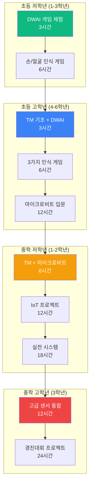

# DWAI + Teachable Machine + 마이크로비트 통합 커리큘럼

## 🎯 커리큘럼 개요

**교육 목표**: DWAI와 Teachable Machine으로 AI를 학습하고, 마이크로비트로 실제 하드웨어와 연결하여 완성도 높은 프로젝트 제작

**사용 도구**:
- **DWAI (Dancing with AI)**: 블록 코딩 기반 AI 게임 플랫폼
- **Teachable Machine (TM)**: 구글의 이미지/포즈/소리 학습 도구
- **마이크로비트 V2**: 교육용 마이크로컨트롤러

**3단계 학습법**:
1. **벤치마킹**: 실제 산업 사례 분석 → 왜 필요한가?
2. **AI 모델 제작**: Teachable Machine으로 학습
3. **게임/프로젝트 구현**: DWAI + 마이크로비트 연동

---

## 📊 학년별 커리큘럼 구조



---

## 🟢 초등 저학년 (1-3학년): DWAI 게임 체험

**학습 목표**: 마우스, 웹캠, 손/얼굴로 게임을 조작하며 AI 체험  
**특징**: Teachable Machine, 마이크로비트 사용 없음 (순수 DWAI 내장 기능만)

---

### 📌 과정 1: 손으로 게임하기 (3시간)

**대상**: 초등 1-3학년  
**준비물**: 웹캠 내장 노트북  
**난이도**: ⭐ (입문)

#### 🎮 프로젝트: 손으로 풍선 터트리기

**게임 방식**: 손을 움직여 화면의 풍선을 터트리는 게임

**수업 구성**:

| 시간 | 내용 | 활동 | 학습 요소 |
|------|------|------|----------|
| 00:00-00:20 | AI가 뭘까? | 완성된 게임 체험 | 흥미 유발 |
| 00:20-01:00 | 손 추적 이해 | 손 위치 확인하기 | Hand Tracking |
| 01:00-02:00 | 게임 만들기 | 블록 코딩으로 제작 | 좌표, 충돌 감지 |
| 02:00-02:30 | 꾸미기 | 색깔, 소리 추가 | 창의성 |
| 02:30-03:00 | 발표 | 친구들과 게임하기 | 협력 |

**DWAI 블록 구조**:
```
1. [Hand Tracking] 손 X, Y 좌표 가져오기
2. [Sprite] 풍선 랜덤 생성
3. [충돌 감지] 손 위치와 풍선 비교
4. [점수] 터트릴 때마다 +1
5. [효과음] 터지는 소리
```

**학습 효과**:
- ✅ 웹캠으로 손을 인식한다는 개념 이해
- ✅ 좌표 (X, Y) 개념 체험
- ✅ 간단한 블록 코딩 경험

---

### 📌 과정 2: 얼굴/손 게임 모음 (6시간)

**대상**: 초등 2-3학년  
**준비물**: 웹캠 내장 노트북  
**난이도**: ⭐⭐ (기초)

#### 🎮 3가지 프로젝트

**1교시 (2시간): 얼굴로 미로 탈출**
- 얼굴을 움직여 캐릭터 조종
- 미로를 통과하여 출구 도달
- Face Tracking (얼굴 X, Y 좌표)

**2교시 (2시간): 손가락 피아노**
- 손가락 위치로 음계 연주
- 간단한 동요 따라 치기
- Hand Tracking (손 X 좌표 → 도레미파솔라시도)

**3교시 (2시간): 얼굴 필터 놀이**
- 얼굴에 안경, 수염, 모자 씌우기
- AR 필터 체험
- Face Tracking (얼굴 위치 + 회전)

**학습 효과**:
- ✅ 얼굴 인식 vs 손 인식 차이 이해
- ✅ 실시간 위치 추적 경험
- ✅ 창의적 게임 아이디어 발상

---

## 🔵 초등 고학년 (4-6학년): TM + DWAI + 마이크로비트 입문

**학습 목표**: AI 모델을 직접 학습시키고, 마이크로비트와 연동  
**특징**: Teachable Machine 도입, 마이크로비트 기초 학습

---

### 📌 과정 1: TM 기초 - 가위바위보 AI (3시간)

**대상**: 초등 4-6학년  
**준비물**: 웹캠 노트북  
**난이도**: ⭐⭐ (기초)

#### 🎮 프로젝트: AI와 가위바위보 대결

**3단계 학습법 적용**:

**1단계: 벤치마킹 (15분)**
- 실생활 손 인식 사례 (VR 컨트롤러, 게임)
- 왜 손 인식이 필요한가?

**2단계: AI 모델 제작 (40분)**
| 클래스 | 내용 | 촬영 시간 |
|--------|------|----------|
| 클래스 1 | ✊ 바위 | 30초 |
| 클래스 2 | ✋ 보 | 30초 |
| 클래스 3 | ✌️ 가위 | 30초 |

**3단계: 게임 구현 (2시간)**
```
DWAI 블록:
1. [TM 연동] 모델 불러오기
2. [AI 분류] 손 모양 인식
3. [컴퓨터] 랜덤 선택
4. [승부 판정] 규칙 적용
5. [점수] 10판 2선승
```

**학습 효과**:
- ✅ Teachable Machine 사용법
- ✅ AI 모델 학습 원리 이해
- ✅ 데이터 수집의 중요성

---

### 📌 과정 2: 얼굴+손+사물 3종 인식 (6시간)

**대상**: 초등 5-6학년  
**준비물**: 웹캠 노트북  
**난이도**: ⭐⭐⭐ (중급)

#### 🎮 3가지 TM 프로젝트

**1교시 (2시간): 마스크 착용 인식기 (Facing)**
- **벤치마킹**: 코로나 방역, 공항 출입국
- **TM 학습**: 마스크 착용 / 없음 / 코 노출 (3클래스)
- **게임**: 정상 착용 판정 게임

**2교시 (2시간): 과일 자르기 (Handing)**
- **벤치마킹**: VR 게임, Fruit Ninja
- **DWAI**: Hand Tracking 내장 기능 (TM 없이)
- **게임**: 손으로 과일 슬라이스

**3교시 (2시간): 쓰레기 분류 (Object)**
- **벤치마킹**: 스마트 쓰레기통, 재활용 센터
- **TM 학습**: 플라스틱 / 종이 / 일반 / 음식물 (4클래스)
- **게임**: 올바른 분류함에 넣기

**핵심 차이점**:
| 기술 | TM 사용 | 좌표 추적 | 용도 |
|------|---------|----------|------|
| Facing (얼굴) | ⭕ | DWAI 내장 | 마스크 분류 |
| Handing (손) | ❌ | DWAI 내장 | 좌표 제어 |
| Object (사물) | ⭕ | ❌ | 물체 분류 |

**학습 효과**:
- ✅ TM 분류 vs DWAI 추적 차이 이해
- ✅ 3가지 컴퓨터 비전 기술 체험
- ✅ 실생활 문제 해결 경험

---

### 📌 과정 3: 마이크로비트 입문 (12시간)

**대상**: 초등 5-6학년 (코딩 경험자)  
**준비물**: 웹캠 노트북 + 마이크로비트 V2 키트  
**난이도**: ⭐⭐⭐⭐ (중상급)

#### 🎮 6개 프로젝트 (각 2시간)

**DAY 1: TM + 마이크로비트 연동 (4시간)**

**1차시: 손 제스처 신호등**
- **벤치마킹**: 실제 교통 신호 시스템
- **TM 모델**: 손바닥(빨강) / V자(노랑) / 엄지(초록)
- **마이크로비트**: LED 신호등 제어
```python
# 마이크로비트 코드 (영문 코드 사용)
from microbit import *
import radio

radio.on()

SIGNAL_RED = "R"    # 빨간불
SIGNAL_YELLOW = "Y" # 노란불
SIGNAL_GREEN = "G"  # 초록불

while True:
    signal = radio.receive()  # DWAI에서 수신 (영문)
    
    if signal == SIGNAL_RED:
        pin0.write_digital(1)  # 빨강 LED ON
        pin1.write_digital(0)
        pin2.write_digital(0)
    elif signal == SIGNAL_YELLOW:
        pin0.write_digital(0)
        pin1.write_digital(1)  # 노랑 LED ON
        pin2.write_digital(0)
    elif signal == SIGNAL_GREEN:
        pin0.write_digital(0)
        pin1.write_digital(0)
        pin2.write_digital(1)  # 초록 LED ON
    
    sleep(100)
```

**2차시: 표정으로 LED 색상 변경**
- **TM 모델**: 행복(빨강) / 슬픔(파랑) / 화남(노랑) / 무표정(끄기)
- **마이크로비트**: RGB LED 제어
```python
# 마이크로비트 코드 (감정 코드 - 숫자)
from microbit import *
import radio
import neopixel

radio.on()
np = neopixel.NeoPixel(pin0, 8)

EMOTION_HAPPY = 1  # 행복
EMOTION_SAD = 2    # 슬픔
EMOTION_ANGRY = 3  # 화남

while True:
    message = radio.receive()  # 숫자 코드 수신
    if message:
        emotion = int(message)
        
        if emotion == EMOTION_HAPPY:
            for i in range(8):
                np[i] = (255, 0, 0)  # 빨강
        elif emotion == EMOTION_SAD:
            for i in range(8):
                np[i] = (0, 0, 255)  # 파랑
        elif emotion == EMOTION_ANGRY:
            for i in range(8):
                np[i] = (255, 255, 0)  # 노랑
        np.show()
    
    sleep(100)
```

**DAY 2: 센서 활용 프로젝트 (4시간)**

**3차시: 마스크 감지 경보 시스템**
- **TM 모델**: 마스크 착용 / 없음 / 잘못 착용
- **마이크로비트**: 부저 + LED 경고
```python
# 마이크로비트 경고 시스템 (영문 코드)
from microbit import *
import radio
import music

radio.on()

STATUS_OK = "OK"    # 정상 착용
STATUS_NO = "NO"    # 마스크 없음
STATUS_WRONG = "WR" # 잘못된 착용

while True:
    status = radio.receive()  # 영문 코드 수신
    
    if status == STATUS_OK:
        pin1.write_digital(1)  # 초록 LED
        pin2.write_digital(0)
        display.show(Image.HAPPY)
    elif status == STATUS_NO or status == STATUS_WRONG:
        pin1.write_digital(0)
        pin2.write_digital(1)  # 빨강 LED
        display.show(Image.SAD)
        
        # 경고음 3회
        for i in range(3):
            pin0.write_digital(1)  # 부저 ON
            sleep(200)
            pin0.write_digital(0)
            sleep(200)
    
    sleep(100)
```

**4차시: 손 제스처 키오스크**
- **TM 모델**: 위(검지) / 아래 / 선택(엄지) / 취소(손바닥)
- **마이크로비트**: 주문 접수 시스템

**DAY 3: 통합 프로젝트 (4시간)**

**5차시: 분리수거 자동 분류기**
- **TM 모델**: 플라스틱 / 종이 / 일반 / 음식물
- **마이크로비트**: 서보모터 분류함 제어
```python
# 마이크로비트 서보모터 제어 (영문 코드)
from microbit import *
import radio

radio.on()

TYPE_PLASTIC = "PL"  # 플라스틱
TYPE_PAPER = "PA"    # 종이
TYPE_GENERAL = "GE"  # 일반
TYPE_FOOD = "FO"     # 음식물

SERVO_PLASTIC = pin0
SERVO_PAPER = pin1
SERVO_GENERAL = pin2
SERVO_FOOD = pin8

def open_bin(bin_code):
    """해당 분류함 뚜껑 열기"""
    if bin_code == TYPE_PLASTIC:
        SERVO_PLASTIC.write_analog(512)  # 90도
        display.show(Image.ARROW_N)
    elif bin_code == TYPE_PAPER:
        SERVO_PAPER.write_analog(512)
        display.show(Image.ARROW_E)
    elif bin_code == TYPE_GENERAL:
        SERVO_GENERAL.write_analog(512)
        display.show(Image.ARROW_S)
    elif bin_code == TYPE_FOOD:
        SERVO_FOOD.write_analog(512)
        display.show(Image.ARROW_W)
    
    sleep(2000)  # 2초 대기
    
    # 모든 뚜껑 닫기
    SERVO_PLASTIC.write_analog(0)
    SERVO_PAPER.write_analog(0)
    SERVO_GENERAL.write_analog(0)
    SERVO_FOOD.write_analog(0)

while True:
    waste_code = radio.receive()  # 영문 코드 수신
    if waste_code:
        open_bin(waste_code)
        music.play(music.POWER_UP)
    sleep(100)
```

**6차시: 종합 발표 및 포트폴리오**
- 6개 프로젝트 시연
- 제작 과정 발표
- 개선점 토론

**학습 효과**:
- ✅ AI와 하드웨어 연동 경험
- ✅ 마이크로비트 기본 코딩
- ✅ 실전 IoT 프로젝트 완성

---

## 🟡 중학 저학년 (1-2학년): TM + 마이크로비트 실전

**학습 목표**: 복합 센서를 활용한 실전 IoT 프로젝트  
**특징**: 다중 센서 통합, 실생활 문제 해결

---

### 📌 과정 1: IoT 기초 프로젝트 (6시간)

**대상**: 중학 1-2학년  
**준비물**: 웹캠 노트북 + 마이크로비트 + 센서 키트  
**난이도**: ⭐⭐⭐⭐ (고급)

#### 🎮 3개 프로젝트 (각 2시간)

**1차시: 출입 관리 시스템**
- **벤치마킹**: 공항 자동 출입국, 아파트 출입문
- **TM 모델**: 등록자 3명 + 미등록자
- **마이크로비트**: 서보모터(문) + LED + 부저
```python
# 마이크로비트 출입 관리 (영문 코드)
from microbit import *
import radio

radio.on()

CMD_ALLOW = "ALLOW"  # 출입 허가
CMD_DENY = "DENY"    # 출입 거부

SERVO_DOOR = pin0
GREEN_LED = pin1
RED_LED = pin2
BUZZER = pin8

def open_door(user_id):
    """출입 허가"""
    GREEN_LED.write_digital(1)
    display.scroll(user_id)
    SERVO_DOOR.write_analog(512)  # 문 열기
    sleep(3000)
    SERVO_DOOR.write_analog(0)    # 문 닫기
    GREEN_LED.write_digital(0)

def deny_access():
    """출입 거부"""
    RED_LED.write_digital(1)
    display.show(Image.NO)
    for i in range(3):
        BUZZER.write_digital(1)
        sleep(200)
        BUZZER.write_digital(0)
        sleep(200)
    RED_LED.write_digital(0)

while True:
    message = radio.receive()  # "ALLOW:1" 또는 "DENY" 수신
    
    if message:
        if message.startswith(CMD_ALLOW):
            user_id = message.split(":")[1]
            open_door(user_id)
        elif message == CMD_DENY:
            deny_access()
    
    sleep(100)
```

**2차시: 스마트 팜 물 주기**
- **TM 모델**: 건강한 식물 / 물 부족 / 병든 식물 / 햇빛 부족
- **마이크로비트**: 토양센서 + 물펌프 + LED 조명
```python
# 마이크로비트 스마트 팜 (영문 코드)
from microbit import *
import radio

radio.on()

SOIL_SENSOR = pin0
PUMP = pin1
LED_LIGHT = pin2

STATUS_HEALTHY = "OK"  # 건강함
STATUS_DRY = "DRY"     # 물 부족
STATUS_DARK = "DARK"   # 햇빛 부족

def read_soil():
    """토양 습도 읽기"""
    return SOIL_SENSOR.read_analog()

def water_plant(duration):
    """물 주기"""
    display.show(Image.UMBRELLA)
    PUMP.write_digital(1)
    sleep(duration * 1000)
    PUMP.write_digital(0)
    display.show(Image.HAPPY)

while True:
    # 센서 값 DWAI에 전송
    soil = read_soil()
    radio.send("S:" + str(soil))
    
    # DWAI AI 결과 수신 (영문)
    ai_result = radio.receive()
    
    if ai_result == STATUS_DRY:
        water_plant(3)  # 3초 급수
        LED_LIGHT.write_digital(0)
    elif ai_result == STATUS_DARK:
        LED_LIGHT.write_digital(1)  # 조명 ON
    elif ai_result == STATUS_HEALTHY:
        LED_LIGHT.write_digital(0)
        display.show(Image.HEART)
    
    sleep(5000)
```

**3차시: 손 제스처 로봇 팔**
- **TM 모델**: 위/아래/좌/우/잡기/놓기 (6클래스)
- **마이크로비트**: 3개 서보모터 (베이스, 팔, 그리퍼)

**학습 효과**:
- ✅ 센서 데이터 읽기 및 활용
- ✅ AI + 센서 융합 시스템
- ✅ 실생활 문제 해결 경험

---

### 📌 과정 2: 실전 IoT 시스템 (12시간)

**대상**: 중학 1-2학년 (심화)  
**준비물**: 웹캠 노트북 + 마이크로비트 + 고급 센서 키트  
**난이도**: ⭐⭐⭐⭐⭐ (최고급)

#### 🎮 4개 대형 프로젝트 (각 3시간)

**1-2차시: 무인 편의점 계산대 (6시간)**
- **벤치마킹**: Amazon Go, 국내 무인 편의점
- **TM 모델**: 초콜릿 / 음료 / 빵 / 과자 / 우유 (5클래스)
- **마이크로비트**: 가격 계산 + 영수증 출력 + 결제 시스템
```python
# 마이크로비트 결제 시스템 (영문 코드)
from microbit import *
import radio

radio.on()

cart = []
total_price = 0

# 상품 코드 및 가격
ITEM_CHOCO = "CH"   # 초콜릿
ITEM_DRINK = "DR"   # 음료
ITEM_BREAD = "BR"   # 빵
ITEM_SNACK = "SN"   # 과자
ITEM_MILK = "MI"    # 우유

PRICES = {
    ITEM_CHOCO: 1500,
    ITEM_DRINK: 1200,
    ITEM_BREAD: 2000,
    ITEM_SNACK: 1000,
    ITEM_MILK: 2500
}

CMD_PAY = "PAY"      # 결제
CMD_CANCEL = "CAN"   # 취소

def add_to_cart(item_code):
    """장바구니 추가"""
    global total_price
    if item_code in PRICES:
        cart.append(item_code)
        total_price += PRICES[item_code]
        display.scroll(str(len(cart)))

def process_payment():
    """결제 처리"""
    display.scroll(str(total_price))
    music.play(music.POWER_UP)
    
    # 영수증 출력
    uart.write("===== RECEIPT =====\n")
    for item in cart:
        uart.write(item + ": " + str(PRICES[item]) + "\n")
    uart.write("TOTAL: " + str(total_price) + "\n")
    uart.write("===================\n")
    
    cart.clear()
    total_price = 0
    display.show(Image.HAPPY)

while True:
    message = radio.receive()  # 영문 코드 수신
    
    if message:
        if message in PRICES:
            add_to_cart(message)
        elif message == CMD_PAY:
            process_payment()
        elif message == CMD_CANCEL:
            cart.clear()
            total_price = 0
            display.show(Image.SAD)
    
    sleep(100)
```

**3-4차시: 스마트 홈 통합 제어 (6시간)**
- **TM 모델**: 사람 있음 / 없음 / 잠자는 중 / 공부 중
- **마이크로비트**: 조명 + 에어컨 + 커튼 + 온도센서 + 조도센서
```python
# 마이크로비트 스마트 홈 허브 (영문 코드)
from microbit import *
import radio

radio.on()

LIGHT_RELAY = pin0   # 조명
AC_RELAY = pin1      # 에어컨
CURTAIN_SERVO = pin2 # 커튼
TEMP_SENSOR = pin3
LIGHT_SENSOR = pin4

SITUATION_PRESENT = "PR"   # 사람 있음
SITUATION_ABSENT = "AB"    # 사람 없음
SITUATION_SLEEPING = "SL"  # 잠자는 중
SITUATION_STUDYING = "ST"  # 공부 중

light_on = False
ac_on = False
curtain_open = True

def control_light(state):
    """조명 제어"""
    global light_on
    light_on = state
    LIGHT_RELAY.write_digital(1 if state else 0)

def control_ac(state):
    """에어컨 제어"""
    global ac_on
    ac_on = state
    AC_RELAY.write_digital(1 if state else 0)

def control_curtain(state):
    """커튼 제어"""
    global curtain_open
    curtain_open = state
    angle = 90 if state else 0
    CURTAIN_SERVO.write_analog(int(angle / 180 * 1024))

def auto_control(situation):
    """상황별 자동 제어"""
    temp = temperature()
    light_level = LIGHT_SENSOR.read_analog()
    
    if situation == SITUATION_PRESENT:
        # 사람 있음
        if light_level < 300:
            control_light(True)
        if temp > 28:
            control_ac(True)
        control_curtain(True)
        display.show(Image.HAPPY)
        
    elif situation == SITUATION_ABSENT:
        # 절전 모드
        control_light(False)
        control_ac(False)
        display.show(Image.ASLEEP)
        
    elif situation == SITUATION_SLEEPING:
        # 잠자는 중
        control_light(False)
        control_curtain(False)
        display.show(Image.ASLEEP)
        
    elif situation == SITUATION_STUDYING:
        # 공부 중
        control_light(True)
        if temp > 24:
            control_ac(True)
        display.show(Image.HEART)

while True:
    situation = radio.receive()  # 영문 코드 수신
    if situation:
        auto_control(situation)
    
    # 센서 데이터 전송
    data = "T:" + str(temperature()) + ",L:" + str(LIGHT_SENSOR.read_analog())
    radio.send(data)
    
    sleep(1000)
```

**학습 효과**:
- ✅ 복합 센서 시스템 구축
- ✅ 다중 액추에이터 제어
- ✅ 상업용 시스템 설계 경험

---

### 📌 과정 3: 경진대회 준비 프로젝트 (18시간)

**대상**: 중학 1-2학년 (경진대회 준비반)  
**난이도**: ⭐⭐⭐⭐⭐ (최고급)

#### 🏆 3개 경진대회급 프로젝트 (각 6시간)

**프로젝트 1: AI 교통 신호 시스템 (6시간)**
- 교통량에 따라 신호 시간 자동 조절
- 4방향 신호등 + 차량 카운팅
- 보행자 우선 신호

**프로젝트 2: AI 보안 감시 시스템 (6시간)**
- 침입자 자동 감지 및 경보
- 행동 패턴 분석
- 자동 문 잠금

**프로젝트 3: 스마트 팜 종합 시스템 (6시간)**
- 온습도 + 토양 + 조도 센서 통합
- 자동 급수 + 조명 + 환기
- 생장 데이터 로깅

---

## 🔴 중학 고학년 (3학년): 고급 시스템 통합

**학습 목표**: 경진대회 수준의 완성도 높은 프로젝트  
**특징**: 클라우드 연동, 빅데이터, AI 최적화

---

### 📌 과정 1: 고급 센서 통합 (12시간)

**대상**: 중학 3학년  
**난이도**: ⭐⭐⭐⭐⭐ (전문가)

#### 🎮 2개 대형 프로젝트 (각 6시간)

**프로젝트 1: AI 자세 교정 시스템**
- **TM 모델**: 바른 자세 / 거북목 / 구부정 / 기울임
- **마이크로비트**: 진동 알림 + 자세 통계
- **추가**: 스트레칭 알림, 주간 리포트

**프로젝트 2: 실시간 교통 모니터링**
- **TM 모델**: 승용차 / 버스 / 트럭 / 오토바이 / 보행자
- **마이크로비트**: 차량 카운트 + 혼잡도 계산
- **추가**: 클라우드 데이터 전송, 실시간 대시보드

---

### 📌 과정 2: 경진대회 프로젝트 (24시간)

**대상**: 중학 3학년 (경진대회 본선반)  
**난이도**: ⭐⭐⭐⭐⭐ (마스터)

#### 🏆 최종 프로젝트: 스마트 시티 통합 시스템

**목표**: 모든 기술을 통합한 미니 스마트 시티

**시스템 구성**:
1. **교통 시스템**: AI 신호등 + 차량 카운트
2. **보안 시스템**: 얼굴 인식 출입
3. **환경 시스템**: 쓰레기 자동 분류
4. **농업 시스템**: 스마트 팜

**마이크로비트 코드 (중앙 제어)**:
```python
# 마이크로비트 스마트 시티 중앙 제어 (영문 코드)
from microbit import *
import radio

radio.on()

# 시스템 코드
SYS_TRAFFIC = "TR"    # 교통
SYS_SECURITY = "SE"   # 보안
SYS_ENVIRON = "EN"    # 환경
SYS_FARM = "FA"       # 농업

# 상태 코드
STATUS_OK = "OK"      # 정상
STATUS_WARN = "WR"    # 경고
STATUS_DANGER = "DN"  # 위험

city_status = {
    SYS_TRAFFIC: STATUS_OK,
    SYS_SECURITY: STATUS_OK,
    SYS_ENVIRON: STATUS_OK,
    SYS_FARM: STATUS_OK
}

def update_system(system_code, status_code):
    """시스템 상태 업데이트"""
    city_status[system_code] = status_code
    
    if status_code == STATUS_WARN:
        display.show(Image.SURPRISED)
        music.play(music.JUMP_DOWN)
    elif status_code == STATUS_DANGER:
        display.show(Image.SKULL)
        music.play(music.WAWAWAWAA)

def send_city_report():
    """도시 상태 리포트"""
    report_parts = []
    for sys, status in city_status.items():
        report_parts.append(sys + ":" + status)
    report = ",".join(report_parts)
    radio.send("REPORT:" + report)
    uart.write(report + "\n")

while True:
    message = radio.receive()  # "TR:OK" 형식 수신
    
    if message:
        parts = message.split(":")
        if len(parts) == 2:
            sys = parts[0]
            status = parts[1]
            if sys in city_status:
                update_system(sys, status)
    
    # 10분마다 리포트
    if running_time() % 600000 == 0:
        send_city_report()
    
    # 버튼으로 상태 확인
    if button_a.was_pressed():
        for sys, status in city_status.items():
            display.scroll(sys + ":" + status)
    
    sleep(100)
```

**학습 효과**:
- ✅ 시스템 통합 능력
- ✅ 프로젝트 관리
- ✅ 경진대회 수준 작품 완성

---

## 📊 학년별 추천 로드맵 요약

| 학년 | 추천 과정 | 시간 | TM | 마이크로비트 | 난이도 |
|------|----------|------|-----|------------|--------|
| **초1-3** | DWAI 게임 체험 | 3-6시간 | ❌ | ❌ | ⭐ |
| **초4-6** | TM 기초 | 3시간 | ⭕ | ❌ | ⭐⭐ |
| **초4-6** | 3가지 인식 | 6시간 | ⭕ | ❌ | ⭐⭐⭐ |
| **초5-6** | 마이크로비트 입문 | 12시간 | ⭕ | ⭕ | ⭐⭐⭐⭐ |
| **중1-2** | IoT 기초 | 6시간 | ⭕ | ⭕ | ⭐⭐⭐⭐ |
| **중1-2** | 실전 IoT | 12시간 | ⭕ | ⭕ | ⭐⭐⭐⭐⭐ |
| **중1-2** | 경진대회 준비 | 18시간 | ⭕ | ⭕ | ⭐⭐⭐⭐⭐ |
| **중3** | 고급 시스템 | 12시간 | ⭕ | ⭕ | ⭐⭐⭐⭐⭐ |
| **중3** | 경진대회 본선 | 24시간 | ⭕ | ⭕ | ⭐⭐⭐⭐⭐ |

---

## 💻 필요 준비물

### 기본 (전체 공통)
- ✅ 웹캠 내장 노트북
- ✅ 안정적인 인터넷 (WiFi)
- ✅ Chrome 브라우저

### 마이크로비트 과정 (초5 이상)
- ✅ 마이크로비트 V2 보드
- ✅ USB 케이블
- ✅ 건전지 팩 (선택)

### 센서 키트 (중학생 이상)
- ✅ LED (빨강, 노랑, 초록)
- ✅ 서보모터 (SG90)
- ✅ 부저
- ✅ 토양 습도 센서
- ✅ 조도 센서
- ✅ RGB LED (네오픽셀)
- ✅ 릴레이 모듈

---

## 🎓 교육 효과

### 학년별 학습 성과

**초등 저학년 (1-3학년)**
- ✅ AI가 무엇인지 체험
- ✅ 웹캠으로 게임 조작
- ✅ 좌표 개념 이해

**초등 고학년 (4-6학년)**
- ✅ AI 모델 직접 학습
- ✅ TM 분류 원리 이해
- ✅ 마이크로비트 기초

**중학 저학년 (1-2학년)**
- ✅ AI + 하드웨어 연동
- ✅ IoT 시스템 구축
- ✅ 실생활 문제 해결

**중학 고학년 (3학년)**
- ✅ 고급 시스템 통합
- ✅ 경진대회 수준 작품
- ✅ 포트폴리오 완성

---

## 🔗 관련 링크

- **DWAI**: https://dancingwithai.media.mit.edu/
- **Teachable Machine**: https://teachablemachine.withgoogle.com/
- **마이크로비트**: https://microbit.org/
- **MakeCode**: https://makecode.microbit.org/

---

## 📝 문서 정보

**최종 업데이트**: 2026-02-02  
**버전**: 1.0  
**작성자**: AI Maker Lab 교육팀

**주요 특징**:
- ✅ 학년별 맞춤 커리큘럼 (초1~중3)
- ✅ DWAI + TM + 마이크로비트 통합
- ✅ 3단계 학습법 적용
- ✅ 실생활 문제 해결 프로젝트
- ✅ 경진대회 준비 과정 포함
- ✅ 영문 코드 시스템 (간결하고 명확한 통신)

**영문 코드 시스템 설명**:
모든 마이크로비트 코드는 **2-3자 영문 코드**를 사용합니다:
- 신호등: R(빨강), Y(노랑), G(초록)
- 감정: 숫자 코드 (1=행복, 2=슬픔, 3=화남)
- 상태: OK(정상), WR(경고), DN(위험)
- 명령: ALLOW(허가), DENY(거부), PAY(결제)
- 물품: CH(초콜릿), DR(음료), BR(빵), SN(과자), MI(우유)
- 쓰레기: PL(플라스틱), PA(종이), GE(일반), FO(음식물)

이 시스템의 장점:
- 📡 무선 통신 시 데이터 양 최소화
- 🔤 한글 인코딩 문제 없음
- ⚡ 빠른 처리 속도
- 🎯 명확한 코드 구분
