# 라즈베리파이 커리큘럼 — 자율주행차 & AI 감시카메라 (3시간 → 6시간 → 12시간)

> **출처 페이지**: https://aimakerlab.com/curriculum/raspberry-pi
> **문서 성격**: 단계도 · 수업 커리큘럼 중심 설계서 (강사 운영용)
> **설계 축**: 라즈베리파이(엣지) + **서버/앱(확인 창구)** — 모든 활동을 스마트폰에서 즉시 검증
> **작성 기준일**: 2026-10-05

---

## 0. 문서 사용법

이 문서는 **시간(3h / 6h / 12h)** 과 **트랙(무엇을 만들까)** 두 축으로 구성됩니다.
강사는 아래 2가지만 결정하면 전체 커리큘럼이 확정됩니다.

| 결정 1. 시간 | 결정 2. 트랙 | 확정 과정 | 완성 산출물 | 문서 위치 |
|---|---|---|---|---|
| 3시간 | A (자율주행차) | **A-3** | 스마트폰 원격조종 + 자동 정지 로봇카 | [Part 1](#part-1-3시간-과정-입문) |
| 3시간 | B (감시카메라) | **B-3** | 실시간 스트리밍 CCTV 웹앱 | [Part 1](#part-1-3시간-과정-입문) |
| 6시간 | A (자율주행차) | **A-6** | 차선 추종 주행 + 텔레메트리 대시보드 | [Part 2](#part-2-6시간-과정-기본) |
| 6시간 | B (감시카메라) | **B-6** | 움직임 감지 + 자동 녹화 + 푸시 알림 | [Part 2](#part-2-6시간-과정-기본) |
| 12시간 | A (자율주행차) | **A-12** | YOLO 객체 인식 자율주행 + 관제 대시보드 | [Part 3](#part-3-12시간-과정-심화) |
| 12시간 | B (감시카메라) | **B-12** | 다중 카메라 AI 관제 시스템 (이벤트 DB + 앱) | [Part 3](#part-3-12시간-과정-심화) |
| 12시간 | C (통합) | **C-12** | **AI 순찰 로봇** = 자율주행 + 감시 통합 | [Part 3](#part-3-12시간-과정-심화) |

> **A·B 트랙은 1차시(개발환경 + 서버 띄우기)를 100% 공유합니다.**
> 같은 교실에서 A팀·B팀을 섞어 운영할 수 있고, 12시간 과정에서 두 팀을 합쳐 C-12로 수렴시킬 수 있습니다.

### 0-1. 읽는 순서 (강사)


---

## 1. 전체 구조 — 단계도

### 1-1. 시간별 누적 단계도

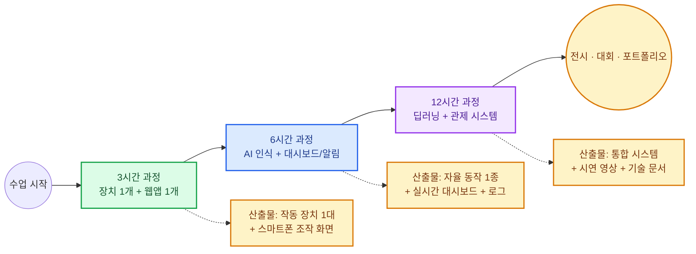

### 1-2. 트랙 분기 단계도

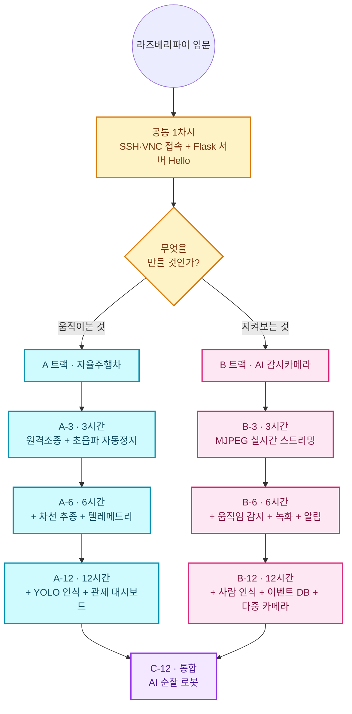

### 1-3. 트랙 비교표

| 비교 항목 | A 트랙 (자율주행차) | B 트랙 (AI 감시카메라) |
|---|---|---|
| 핵심 질문 | "AI가 **판단해서 움직이게** 하려면?" | "AI가 **알아보고 알려주게** 하려면?" |
| 필수 교구 | Pi + 로봇카 섀시 + 모터드라이버 + 카메라 | Pi + 카메라 (+ 거치대) |
| 1인당(2인 1팀) 교구 단가 | 약 18~28만원 | 약 12~18만원 |
| 추천 대상 | 초6~고3, 하드웨어 선호 | 초5~고3, 소프트웨어·AI 선호 |
| 실패 리스크 | 중~높음 (배선·전원·바닥 조건) | 낮음 (카메라 1개, 배선 최소) |
| 교실 공간 | 주행 트랙 2×3m 필요 | 책상 위로 충분 |
| 즉시 확인 방법 | 스마트폰 조종 화면 + 차가 실제로 움직임 | 스마트폰 영상 + 알림 수신 |
| 3시간 완성률 | 75~85% (사전 조립 시 95%) | 95% 이상 |
| 소음·안전 | 모터 소음, 충돌 주의 | 거의 없음 (개인정보 교육 필수) |
| 대회 연계 | 자율주행 경진대회, 메이커 대회 | AI 아이디어·사회문제 해결 대회 |
| 확장 방향 | ROS2, 라이다, 라인트레이서 고도화 | 엣지 AI, 다중 카메라 관제, 클라우드 |

### 1-4. 트랙 선택 순서도

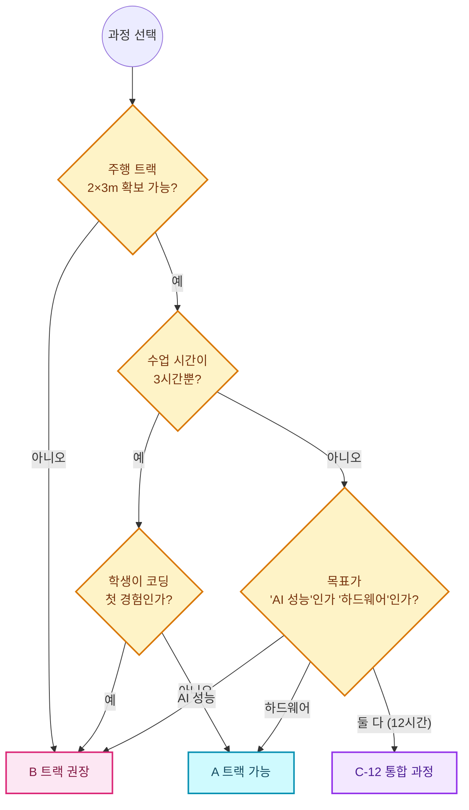

---

## 2. 왜 "라즈베리파이 + 앱/서버"인가

### 2-1. 실시간 검증 루프 — 이 커리큘럼의 심장

마이크로비트·아두이노 수업의 가장 큰 한계는 **"내가 만든 게 지금 잘 되고 있는지"를 눈으로만 추측**한다는 점입니다.
라즈베리파이는 **자기 자신이 서버**가 될 수 있으므로, 학생이 코드를 고친 뒤 **스마트폰을 새로고침하는 것만으로 결과를 즉시 확인**할 수 있습니다.

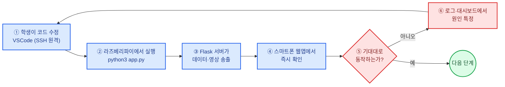

> **이 루프 1회전이 90초 이내**가 되도록 환경을 세팅하는 것이 강사의 1차시 목표입니다.
> 90초를 넘기면(재부팅·재업로드·재컴파일) 학생의 집중력이 끊기고 완성률이 급락합니다.

### 2-2. 교구 플랫폼 비교표

| 항목 | 마이크로비트 | 아두이노 / ESP32 | **라즈베리파이 (본 과정)** |
|---|---|---|---|
| 실행 환경 | 전용 런타임 | 베어메탈 / RTOS | **Linux (Raspberry Pi OS)** |
| 코드 반영 방식 | 다운로드 → 복사 | 컴파일 → 업로드 (10~40초) | **파일 저장 → 바로 실행 (즉시)** |
| 카메라·영상 | ❌ | ESP32-CAM 제한적 | ⭕ 고해상도 + OpenCV |
| 딥러닝 모델 | ❌ | 초소형 TinyML만 | ⭕ **YOLO·TFLite 로컬 실행** |
| 자체 웹서버 | ❌ | 가능하나 매우 제한적 | ⭕ **Flask/FastAPI 완전 지원** |
| DB 저장 | ❌ | SD 카드 텍스트 | ⭕ **SQLite + 파일 시스템** |
| 스마트폰 연동 | 블루투스 앱 | 간이 웹페이지 | ⭕ **반응형 웹앱 · 푸시 알림** |
| 실시간 확인성 | 장치 LED만 | 시리얼 모니터 | ⭕ **영상 + 그래프 + 로그 동시** |
| 학습 전이 | 블록 코딩 | 임베디드 C | **실무 Python·Linux·네트워크** |
| 적합 학년 | 초3~중1 | 중1~고2 | **초6~고3** |

### 2-3. "즉시 확인 가능" 설계 3원칙

| 원칙 | 내용 | 수업 적용 규칙 |
|---|---|---|
| **① 화면 우선 (Screen First)** | 센서를 붙이기 전에 **화면에 숫자를 띄우는 것**부터 한다 | 1차시에 Flask `/api/hello`를 먼저 완성 |
| **② 모든 차시 = 1개 확인 지점** | 각 차시는 스마트폰에서 확인 가능한 산출물로 끝난다 | "오늘 폰에서 뭐가 보이나?"를 칠판에 적고 시작 |
| **③ 실패도 화면에 (Visible Failure)** | 에러·오탐·끊김을 로그/대시보드로 **보이게** 만든다 | `/api/logs` 엔드포인트를 2차시부터 필수 포함 |

### 2-4. 차시별 "확인 지점" 표 — 학생이 폰에서 보는 것

| 과정 | 차시 | 폰에서 확인하는 것 | 확인 방법 |
|---|---|---|---|
| A-3 | 1 | `{"ok":true}` JSON | 브라우저로 `http://<IP>:5000/api/hello` |
| A-3 | 2~3 | 조종 버튼 → 바퀴 회전, 거리 숫자 변화 | 조종 웹앱 화면 |
| A-6 | 3 | 차선 검출 영상 + 조향각 그래프 | `/stream.mjpg` + 대시보드 |
| A-6 | 4 | PID 슬라이더 조정 → 주행 즉시 변화 | 대시보드 슬라이더 |
| A-12 | 5~6 | 인식 박스 + 이벤트 타임라인 | 관제 대시보드 |
| B-3 | 2~3 | 실시간 영상 + 스냅샷 저장 | `/stream.mjpg`, 갤러리 |
| B-6 | 3~4 | 움직임 감지 알림 수신 + 녹화 목록 | 메신저 푸시 + 이벤트 목록 |
| B-12 | 5~6 | 사람/구역 침입 통계 차트 | 관제 대시보드 |
| C-12 | 6 | 순찰 중 로봇이 보낸 알림 + 수동 전환 | 통합 앱 |

---

## 3. 시스템 아키텍처

### 3-1. 공통 3계층 구조도

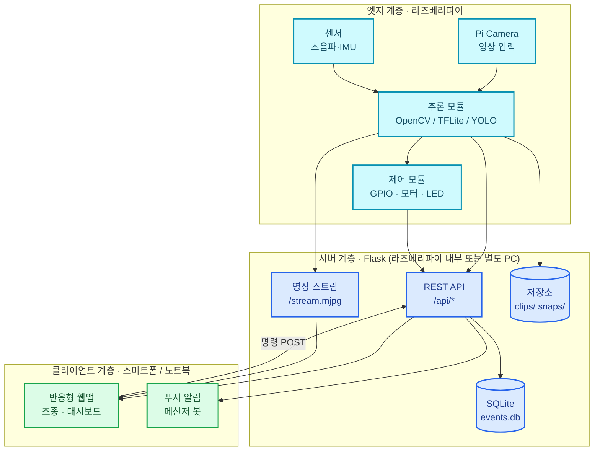

### 3-2. 구성 요소 역할표

| 계층 | 구성 요소 | 역할 | 도입 차시 |
|---|---|---|---|
| 엣지 | Raspberry Pi 4/5 | Linux 실행, 모든 추론·제어 수행 | 1차시 |
| 엣지 | Pi Camera Module 3 | 영상 획득 (`picamera2`) | A-6 / B-3 |
| 엣지 | HC-SR04 초음파 | 전방 거리 측정 (자동 정지) | A-3 |
| 엣지 | L298N 모터 드라이버 | DC 모터 방향·속도(PWM) 제어 | A-3 |
| 서버 | Flask | REST API + MJPEG 스트리밍 | 1차시 |
| 서버 | SQLite | 이벤트·로그 영구 저장 | B-6 / A-12 |
| 클라이언트 | 모바일 웹앱 | 조종·모니터링·설정 | 1차시부터 |
| 클라이언트 | 메신저 봇 | 이벤트 푸시 알림 | B-6 |

### 3-3. 공통 API 규약표 (전 과정 표준)

> **이 표를 1차시에 학생에게 배포**하면, 이후 모든 차시가 "표를 채워 가는 작업"이 됩니다.

| 메서드 | 엔드포인트 | 요청 본문 | 응답 | 사용 과정 |
|---|---|---|---|---|
| GET | `/api/hello` | - | `{"ok":true,"host":"pi-01"}` | 전 과정 1차시 |
| GET | `/api/telemetry` | - | `{"ts":1,"dist_cm":42.5,"speed":60,"angle":-7,"mode":"AUTO"}` | A-3~A-12 |
| POST | `/api/drive` | `{"cmd":"forward","speed":60}` | `{"ok":true,"applied":"forward"}` | A-3~ |
| POST | `/api/mode` | `{"mode":"MANUAL"}` | `{"ok":true,"mode":"MANUAL"}` | A-6~ |
| POST | `/api/pid` | `{"kp":0.6,"ki":0.0,"kd":0.2}` | `{"ok":true}` | A-6~ |
| GET | `/stream.mjpg` | - | `multipart/x-mixed-replace` 영상 | B-3~ |
| GET | `/snapshot.jpg` | - | JPEG 1장 | B-3~ |
| POST | `/api/events` | `{"type":"motion","score":0.82,"clip":"c12.mp4"}` | `{"ok":true,"id":17}` | B-6~ |
| GET | `/api/events?limit=20` | - | `[{"id":17,"type":"motion",...}]` | B-6~ |
| GET | `/api/stats?range=today` | - | `{"motion":12,"person":4}` | B-12 |
| GET | `/api/logs?tail=50` | - | `["[12:03] start",...]` | 2차시~ |

### 3-4. 상태 코드 · 모드 규약표

| 구분 | 값 | 의미 | 표시 색 (대시보드) |
|---|---|---|---|
| mode | `MANUAL` | 사람이 폰으로 조종 | 파랑 |
| mode | `AUTO` | 자율 주행/감시 중 | 초록 |
| mode | `STOP` | 안전 정지 (장애물·수동) | 빨강 |
| event.type | `motion` | 움직임 감지 | 노랑 |
| event.type | `person` | 사람 인식 | 주황 |
| event.type | `intrusion` | 지정 구역 침입 | 빨강 |
| event.type | `obstacle` | 전방 장애물 | 빨강 |
| event.type | `lane_lost` | 차선 유실 | 회색 |

### 3-5. 네트워크 모드 비교표

| 모드 | 구성 | 장점 | 단점 | 추천 상황 |
|---|---|---|---|---|
| **① 교실 공유 Wi-Fi** | Pi·폰이 같은 AP | 세팅 쉬움 | 학교망은 기기 간 통신 차단(AP isolation) 가능 | 사전 테스트 완료된 교실 |
| **② 강사 휴대용 공유기** | 전용 라우터 1대 | 가장 안정적, IP 고정 | 장비 1개 추가 운반 | **출장 수업 1순위 권장** |
| **③ Pi 핫스팟(AP 모드)** | Pi가 직접 Wi-Fi 송출 | 외부망 불필요 | 팀 수만큼 SSID 증가, 인터넷 동시 사용 불가 | 네트워크 완전 차단 환경 |
| **④ 유선 + USB 테더링** | 랜선/USB 직결 | 지연 최소 | 폰 연결 번거로움 | 시연·촬영용 |
| **⑤ 외부 접속(터널링)** | Tailscale 등 VPN | 집에서도 접속 | 계정·정책 확인 필요 | 12시간 과정 심화 |

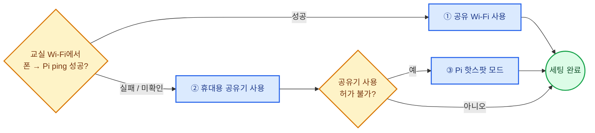

> **강사 필수 사전 작업**: 수업 전날 교실에서 `ping <Pi IP>` 1회 확인. 이 1분이 수업 30분을 살립니다.

---

## 4. 공통 수업 설계 원리

### 4-1. 5단계 수업 흐름 (3시간 1모듈 기준)

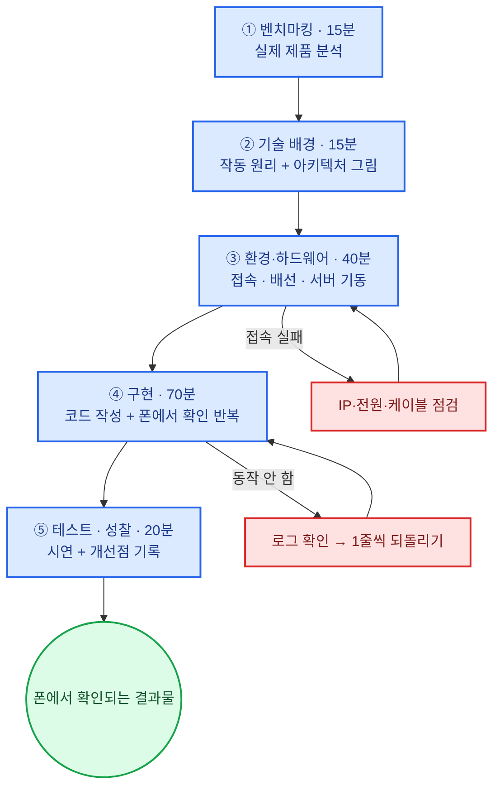

### 4-2. 5단계 시간 배분표

| 단계 | 명칭 | 시간 | 학생 활동 | 강사 역할 | 산출물 |
|---|---|---|---|---|---|
| ① | 벤치마킹 | 15분 | 테슬라·누비랩·CCTV 사례 영상 → 기능 분해 | 질문 던지기 | 기능 목록 3개 |
| ② | 기술 배경 | 15분 | 3계층 구조 그림 직접 그리기 | 미니 강의 | 아키텍처 스케치 |
| ③ | 환경·하드웨어 | 40분 | SSH 접속, 배선, `python3 app.py` | 순회 + IP 안내 | `/api/hello` 성공 |
| ④ | 구현 | 70분 | 코드 작성 → 폰 확인 → 수정 (90초 루프) | 막힌 팀 1:1 | 작동 기능 1~2개 |
| ⑤ | 테스트·성찰 | 20분 | 팀 간 상호 시연 + 디버깅 일지 | 진행·피드백 | 체크리스트 + 발표 |

> **시간이 부족할 때 줄이는 순서**: ① → ⑤ → ② (④는 절대 줄이지 않는다)

### 4-3. 역할 로테이션 (2인 1팀 / 3인 1팀)

| 시간대 | 2인 1팀 | 3인 1팀 | 교체 시점 |
|---|---|---|---|
| 0:00–1:00 | 1번 **파일럿**(터미널 조작) / 2번 기록·배선 | 파일럿 / 하드웨어 / 기록 | 1시간 |
| 1:00–2:00 | 역할 교체 (2번 파일럿) | 시계 방향 1칸 이동 | 1시간 |
| 2:00–3:00 | 1번 디버거 / 2번 **발표·촬영** | 디버거 / 발표 / 촬영 | - |

| 역할 | 책임 | 금지 사항 |
|---|---|---|
| 파일럿 | 키보드 조작, 명령어 입력 | 혼자 다 하기 금지 |
| 하드웨어 | 배선, 전원, 카메라 각도 | 전원 켠 상태로 배선 변경 금지 |
| 기록 | 디버깅 일지, API 표 채우기 | 구경만 하기 금지 |
| 발표·촬영 | 시연 영상 30초 촬영 | 타인 얼굴 무단 촬영 금지 |

### 4-4. 역량 레벨 단계도

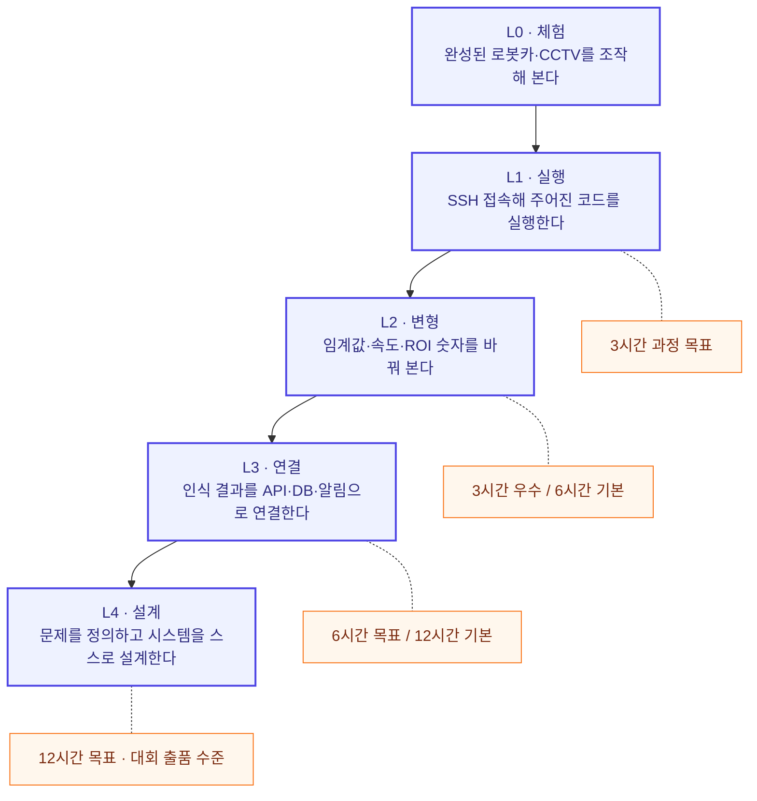

| 레벨 | 판정 기준 (관찰 가능 행동) | 해당 과정 |
|---|---|---|
| L0 | 남이 만든 결과물을 조작하고 설명한다 | 체험 부스 |
| L1 | 터미널에서 스스로 실행하고 IP로 접속한다 | A-3 / B-3 |
| L2 | 상수를 바꿔 동작 변화를 예측·검증한다 | A-3 우수 / A-6 |
| L3 | 새 엔드포인트를 추가하고 DB·알림까지 연결한다 | A-6 / B-6 |
| L4 | 요구사항을 직접 정의해 시스템을 설계·문서화한다 | A-12 / B-12 / C-12 |

---

## 5. 개발환경 구축 (전 과정 공통 · 30~40분)

### 5-1. 세팅 순서도

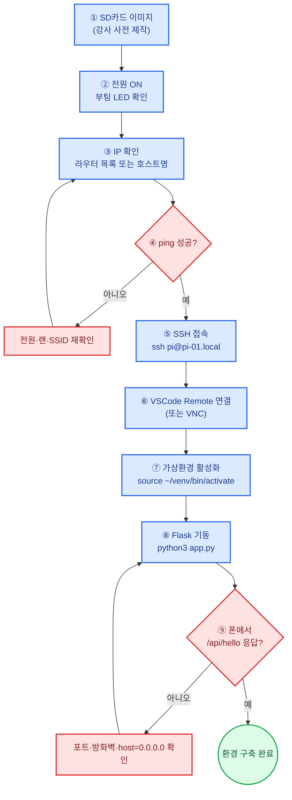

### 5-2. 강사 사전 준비 체크리스트 (수업 **전날** 완료)

| # | 항목 | 확인 방법 | 소요 |
|---|---|---|---|
| 1 | Raspberry Pi OS (64-bit, Bookworm 이상) 이미지 제작 | Raspberry Pi Imager에서 SSH·Wi-Fi·호스트명 사전 설정 | 15분/장 |
| 2 | 호스트명 규칙 부여 | `pi-01` ~ `pi-10` (팀 번호와 일치) | 5분 |
| 3 | 가상환경 + 패키지 선설치 | `python3 -m venv --system-site-packages ~/venv` | 20분/장 |
| 4 | 카메라 동작 확인 | `rpicam-hello --timeout 2000` | 1분/장 |
| 5 | 예제 코드 배치 | `~/project/` 에 `app.py`, `static/`, `templates/` | 5분 |
| 6 | 교실 네트워크에서 폰 → Pi 접속 테스트 | 폰 브라우저로 `http://pi-01.local:5000/api/hello` | 10분 |
| 7 | 배터리·보조배터리 완충 | 모터 전원 + Pi 전원 분리 확인 | 전날 밤 |
| 8 | 예비 SD카드 2장, 예비 Pi 1대 | 라벨 부착 | - |

> **SD카드 복제 팁**: 1장을 완성한 뒤 `dd` 또는 Imager의 백업 기능으로 이미지화 → 나머지는 복제로 5분/장.

### 5-3. Linux 명령어 치트시트 (학생 배포용)

| 분류 | 명령어 | 설명 | 사용 시점 |
|---|---|---|---|
| 접속 | `ssh pi@pi-01.local` | 원격 접속 | 매 차시 시작 |
| 이동 | `cd ~/project` | 작업 폴더 이동 | 매 차시 |
| 목록 | `ls -l` | 파일 목록·권한 확인 | 수시 |
| 보기 | `cat app.py` / `nano app.py` | 내용 보기 / 간단 편집 | 수시 |
| 환경 | `source ~/venv/bin/activate` | 가상환경 활성화 | 실행 전 **필수** |
| 설치 | `pip install flask opencv-python` | 패키지 설치 | 1차시 |
| 실행 | `python3 app.py` | 서버 실행 | 매번 |
| 중지 | `Ctrl + C` | 실행 중지 | 매번 |
| 포트 | `sudo lsof -i :5000` | 포트 점유 프로세스 확인 | "Address in use" 에러 시 |
| IP | `hostname -I` | 내 IP 확인 | 폰 접속 전 |
| 카메라 | `rpicam-hello -t 2000` | 카메라 미리보기 | 카메라 차시 |
| 온도 | `vcgencmd measure_temp` | CPU 온도 (YOLO 차시) | 12시간 과정 |
| 종료 | `sudo shutdown -h now` | 안전 종료 | 수업 종료 시 **필수** |

> **수업 종료 규칙**: 전원 코드를 뽑기 전 반드시 `sudo shutdown -h now`.
> SD카드 손상 1위 원인은 강제 전원 차단입니다.

### 5-4. 패키지 구성표

| 패키지 | 용도 | 설치 | 도입 과정 |
|---|---|---|---|
| `flask` | 웹 서버 · API | pip | 전 과정 |
| `gpiozero` + `lgpio` | GPIO 제어 (Pi 5 호환) | pip / 기본 포함 | A 트랙 |
| `picamera2` | 카메라 제어 (OS 기본 포함) | apt (기본) | A-6, B-3~ |
| `opencv-python` | 영상 처리 | pip | A-6, B-3~ |
| `numpy` | 배열 연산 | pip (opencv 의존) | A-6~ |
| `requests` | 알림 전송 · 서버 간 통신 | pip | B-6~ |
| `ultralytics` 또는 `tflite-runtime` | 객체 인식 | pip | A-12, B-12 |

> **Bookworm 주의**: 시스템 Python에 바로 `pip install` 하면 `externally-managed-environment` 오류가 납니다.
> 반드시 `python3 -m venv --system-site-packages ~/venv` 로 만든 가상환경을 사용하세요.
> (`--system-site-packages` 를 붙여야 가상환경에서도 `picamera2` 를 쓸 수 있습니다.)

---

# Part 1. 3시간 과정 (입문)

## 1-A. A-3 · 자율주행차 3시간 — "스마트폰 원격조종 + 자동 정지"

### 개요

| 항목 | 내용 |
|---|---|
| 과정명 | AI 로봇카 1일 완성 — 폰으로 조종하고, 스스로 멈춘다 |
| 대상 | 초6~고3 (2인 1팀) |
| 선행 지식 | 없음 (Python 변수·조건문 설명 포함) |
| 사용 기술 | Linux 접속, Flask, gpiozero(PWM), HC-SR04 |
| 완성 산출물 | 폰 조종 웹앱 + 전방 20cm 자동 정지 로봇카 |
| 확인 지점 | 폰 버튼 → 바퀴 회전 / 손을 대면 즉시 정지 + 화면 빨강 |
| 핵심 개념 | "센서 → 판단 → 제어" 루프, 안전 정지(Fail-safe) |
| 완성률 목표 | 사전 조립 상태 제공 시 95% |

### 커리큘럼 타임테이블

| 시간 | 단계 | 활동 | 폰에서 확인되는 것 |
|---|---|---|---|
| 0:00–0:15 | ① 벤치마킹 | 자율주행 레벨 0~5 영상, 자동 긴급제동(AEB) 사례 | - |
| 0:15–0:30 | ② 기술 배경 | 3계층 구조 그리기 + 초음파 원리(소리 왕복 시간) | - |
| 0:30–0:50 | ③ 접속·기동 | SSH 접속 → venv → `python3 app.py` | `/api/hello` → `{"ok":true}` |
| 0:50–1:10 | ③ 배선 | 모터 드라이버 + 초음파 배선 점검 (전원 OFF 상태) | - |
| 1:10–1:40 | ④ 구현 1 | 모터 4방향 제어 + 조종 웹앱 연결 | 조종 버튼 → 바퀴 회전 |
| 1:40–2:00 | ④ 구현 2 | 거리 측정값 1초마다 화면 표시 | 거리 숫자 실시간 변화 |
| 2:00–2:25 | ④ 구현 3 | 자동 정지 로직 + 모드 표시(초록/빨강) | 손 대면 STOP 표시 |
| 2:25–2:40 | ④ 변형 | 임계값·속도 상수 조정 실험 | 정지 거리 변화 |
| 2:40–3:00 | ⑤ 테스트 | 장애물 코스 통과 시합 + 디버깅 일지 | 시연 영상 30초 |

### 시스템 구성도

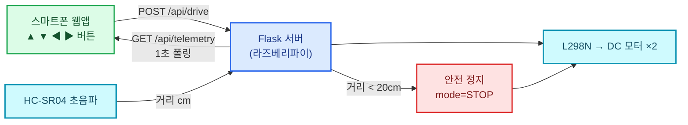

### 배선표 (A 트랙 공통)

| 부품 | 부품 핀 | 라즈베리파이 핀 (BCM) | 비고 |
|---|---|---|---|
| L298N | IN1 | GPIO 17 | 왼쪽 모터 방향 A |
| L298N | IN2 | GPIO 27 | 왼쪽 모터 방향 B |
| L298N | IN3 | GPIO 22 | 오른쪽 모터 방향 A |
| L298N | IN4 | GPIO 23 | 오른쪽 모터 방향 B |
| L298N | ENA | GPIO 12 | 왼쪽 속도 (하드웨어 PWM) |
| L298N | ENB | GPIO 13 | 오른쪽 속도 (하드웨어 PWM) |
| L298N | 12V / GND | **모터 배터리 (+) / 공통 GND** | Pi 5V에 연결 금지 |
| HC-SR04 | VCC | 5V (Pin 2) | - |
| HC-SR04 | TRIG | GPIO 5 | - |
| HC-SR04 | ECHO | GPIO 6 | **전압 분배 저항 1kΩ+2kΩ 필수** |
| HC-SR04 | GND | GND | - |
| 상태 LED | + | GPIO 26 | 330Ω 직렬 |
| 부저 | + | GPIO 16 | 선택 |

> ⚠️ **전원 3원칙**
> ① 모터 전원과 Pi 전원은 **분리** (모터 역기전력으로 Pi 재부팅 발생)
> ② GND는 반드시 **공통 연결**
> ③ ECHO(5V)는 전압 분배 없이 GPIO(3.3V)에 직결 금지

### 수업 순서도

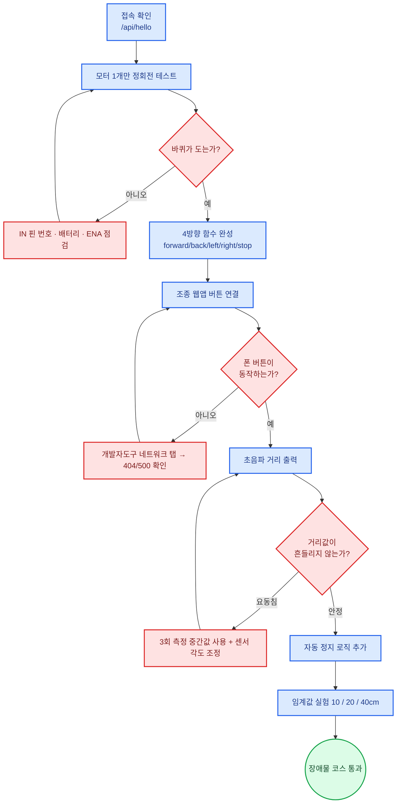

### 핵심 코드 (A-3 · 발췌)

```python
# A-3: 원격조종 + 자동정지  ~/project/app.py
from flask import Flask, jsonify, request, render_template
from gpiozero import Motor, PWMOutputDevice, DistanceSensor
import threading, time

app = Flask(__name__)

left  = Motor(forward=17, backward=27)
right = Motor(forward=22, backward=23)
en_l  = PWMOutputDevice(12)
en_r  = PWMOutputDevice(13)
sonic = DistanceSensor(echo=6, trigger=5, max_distance=2.0)

state = {"mode": "MANUAL", "speed": 60, "dist_cm": 999.0, "cmd": "stop"}
STOP_CM = 20          # ← 학생이 바꿔 보는 상수 ①
SPEED   = 60          # ← 학생이 바꿔 보는 상수 ②

def apply(cmd, speed):
    p = speed / 100.0
    en_l.value = en_r.value = p
    if   cmd == "forward": left.forward();  right.forward()
    elif cmd == "back":    left.backward(); right.backward()
    elif cmd == "left":    left.backward(); right.forward()
    elif cmd == "right":   left.forward();  right.backward()
    else:                  left.stop();     right.stop()

def safety_loop():                      # 센서 → 판단 → 제어
    while True:
        d = sonic.distance * 100
        state["dist_cm"] = round(d, 1)
        if d < STOP_CM and state["cmd"] == "forward":
            state["mode"] = "STOP"
            state["cmd"]  = "stop"
            apply("stop", 0)
        elif state["mode"] == "STOP" and d >= STOP_CM:
            state["mode"] = "MANUAL"
        time.sleep(0.1)

@app.get("/api/hello")
def hello(): return jsonify(ok=True, host="pi-01")

@app.get("/api/telemetry")
def telemetry(): return jsonify(ts=time.time(), **state)

@app.post("/api/drive")
def drive():
    cmd = request.json.get("cmd", "stop")
    if state["mode"] == "STOP" and cmd == "forward":
        return jsonify(ok=False, reason="obstacle"), 409   # 보이는 실패
    state["cmd"] = cmd
    apply(cmd, state["speed"])
    return jsonify(ok=True, applied=cmd)

@app.get("/")
def ui(): return render_template("drive.html")

threading.Thread(target=safety_loop, daemon=True).start()
app.run(host="0.0.0.0", port=5000)      # host 0.0.0.0 필수
```

> **교육 포인트**: `safety_loop()` 는 **사람 명령보다 센서가 우선**하는 구조입니다.
> "자율주행차는 운전자 명령을 거부할 수 있어야 하는가?"를 10분 토론 주제로 활용하세요.

### 학생 실험표 (A-3 ④단계 변형 활동)

| 실험 | 바꾸는 값 | 예상 | 실제 결과 | 결론 |
|---|---|---|---|---|
| 1 | `STOP_CM` 20 → 10 | 더 늦게 멈춤 | | |
| 2 | `STOP_CM` 20 → 40 | 더 빨리 멈춤 | | |
| 3 | `SPEED` 60 → 100 | 정지 거리 부족 | | |
| 4 | `time.sleep(0.1)` → `0.5` | 반응 느려짐 | | |
| 5 | 검은 천 / 유리병 감지 | 초음파는 재질 무관 | | |

### 평가 루브릭 (A-3 · 100점)

| 영역 | 배점 | 상 (만점) | 중 (70%) | 하 (40%) |
|---|---|---|---|---|
| 환경 구축 | 20 | 스스로 접속·실행·IP 확인 | 1회 도움 | 전적 도움 |
| 하드웨어 | 20 | 배선 완성 + 전원 규칙 설명 | 완성, 설명 부족 | 미완성 |
| 원격 조종 | 25 | 4방향 + 속도 제어 동작 | 전/후진만 | 1방향 |
| 자동 정지 | 25 | 안정 동작 + 임계값 실험 기록 | 동작하나 오작동 있음 | 미구현 |
| 설명·협업 | 10 | 루프 구조 설명 + 역할 교대 | 일부 | 관찰만 |

---

## 1-B. B-3 · AI 감시카메라 3시간 — "실시간 스트리밍 CCTV 웹앱"

### 개요

| 항목 | 내용 |
|---|---|
| 과정명 | 내 손으로 만드는 CCTV — 폰으로 보는 실시간 감시 카메라 |
| 대상 | 초5~고3 (2인 1팀) |
| 선행 지식 | 없음 |
| 사용 기술 | Linux 접속, Flask, picamera2, MJPEG 스트리밍 |
| 완성 산출물 | 스마트폰 실시간 영상 + 스냅샷 저장 + 야간 LED |
| 확인 지점 | 폰 브라우저에 **지금 교실 영상**이 나온다 |
| 핵심 개념 | 스트리밍 원리, 해상도-프레임률 트레이드오프, 개인정보 |
| 완성률 목표 | 95% 이상 (배선 최소) |

### 커리큘럼 타임테이블

| 시간 | 단계 | 활동 | 폰에서 확인되는 것 |
|---|---|---|---|
| 0:00–0:15 | ① 벤치마킹 | 가정용 홈캠·학교 CCTV·AI 관제 사례 | - |
| 0:15–0:25 | ② 기술 배경 | 영상 = 사진의 연속, MJPEG 원리 | - |
| 0:25–0:40 | ②+ **개인정보 교육** | 초상권·촬영 동의·저장 기간 (필수) | 촬영 동의서 작성 |
| 0:40–1:00 | ③ 접속·기동 | SSH → venv → `rpicam-hello` 확인 | `/api/hello` |
| 1:00–1:35 | ④ 구현 1 | MJPEG 스트리밍 서버 작성 | **실시간 영상 송출** |
| 1:35–1:55 | ④ 구현 2 | 스냅샷 버튼 + 저장 목록 | 캡처 사진 갤러리 |
| 1:55–2:20 | ④ 구현 3 | 해상도·FPS 실험 + 타임스탬프 오버레이 | 영상에 시간 표시 |
| 2:20–2:40 | ④ 변형 | 흑백/반전/밝기 필터, LED 야간 조명 | 필터 적용 영상 |
| 2:40–3:00 | ⑤ 테스트 | 팀 간 상호 접속 시연 + 성찰 | 다른 팀 카메라 접속 |

### 시스템 구성도

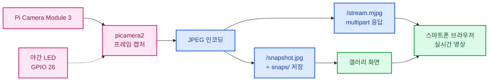

### 배선표 (B 트랙 최소 구성)

| 부품 | 연결 | 비고 |
|---|---|---|
| Pi Camera Module 3 | CSI 커넥터 (리본 케이블) | **Pi 5는 22핀 소형 케이블** 필요 |
| 상태/야간 LED | GPIO 26 + 330Ω → GND | 선택 |
| 부저 | GPIO 16 | 선택 (B-6에서 사용) |
| 카메라 거치대 | 책상 클램프 | 각도 고정이 화질보다 중요 |

### 수업 순서도

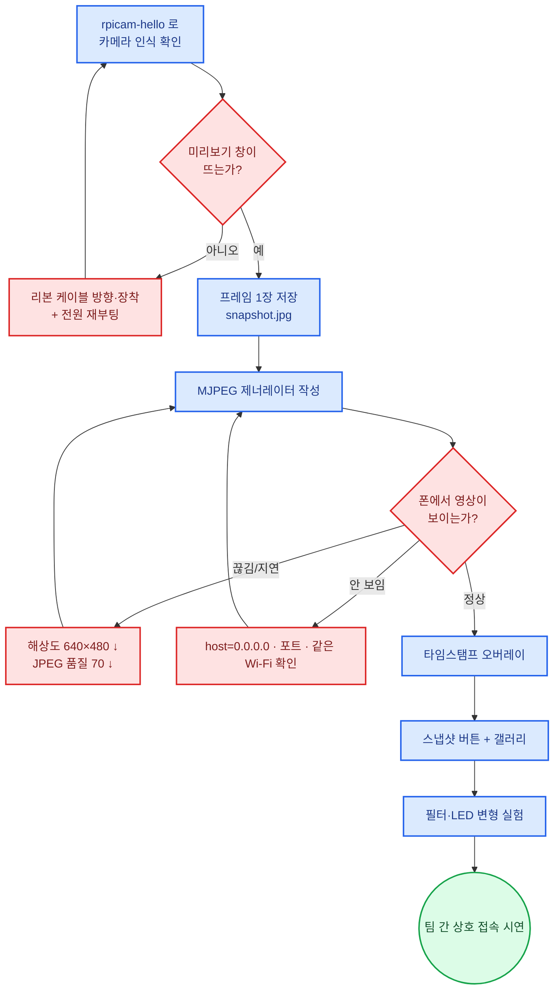

### 핵심 코드 (B-3 · 발췌)

```python
# B-3: 실시간 스트리밍 CCTV  ~/project/app.py
from flask import Flask, Response, jsonify, render_template
from picamera2 import Picamera2
from datetime import datetime
import cv2, os, time

app = Flask(__name__)
os.makedirs("snaps", exist_ok=True)

WIDTH, HEIGHT, QUALITY = 640, 480, 70     # ← 학생이 바꿔 보는 상수
cam = Picamera2()
cam.configure(cam.create_video_configuration(
    main={"size": (WIDTH, HEIGHT), "format": "RGB888"}))
cam.start()
time.sleep(1)

def read_frame():
    frame = cam.capture_array()
    stamp = datetime.now().strftime("%Y-%m-%d %H:%M:%S")
    cv2.putText(frame, stamp, (10, HEIGHT - 12),
                cv2.FONT_HERSHEY_SIMPLEX, 0.6, (0, 255, 0), 2)
    return frame

def mjpeg():
    while True:
        ok, buf = cv2.imencode(".jpg", read_frame(),
                               [cv2.IMWRITE_JPEG_QUALITY, QUALITY])
        if ok:
            yield (b"--f\r\nContent-Type: image/jpeg\r\n\r\n"
                   + buf.tobytes() + b"\r\n")
        time.sleep(0.03)                   # 약 30 FPS 상한

@app.get("/stream.mjpg")
def stream():
    return Response(mjpeg(),
        mimetype="multipart/x-mixed-replace; boundary=f")

@app.get("/snapshot.jpg")
def snapshot():
    name = datetime.now().strftime("snaps/%H%M%S.jpg")
    cv2.imwrite(name, read_frame())
    return jsonify(ok=True, file=name)

@app.get("/api/hello")
def hello(): return jsonify(ok=True, host="pi-01")

@app.get("/")
def ui(): return render_template("cctv.html")

app.run(host="0.0.0.0", port=5000, threaded=True)
```

### 해상도·품질 실험표 (B-3 ④단계 필수 활동)

| 해상도 | JPEG 품질 | 체감 FPS | 지연 | 화질 | 결론 |
|---|---|---|---|---|---|
| 320×240 | 50 | | | | |
| 640×480 | 70 | | | | ← 기본값 |
| 1280×720 | 80 | | | | |
| 1920×1080 | 90 | | | | |

> **도출할 결론**: "해상도를 2배 올리면 데이터는 4배 → 네트워크가 먼저 한계에 도달한다."
> 감시 카메라 설계는 **화질과 실시간성의 트레이드오프**라는 것을 숫자로 체득합니다.

### 평가 루브릭 (B-3 · 100점)

| 영역 | 배점 | 상 (만점) | 중 (70%) | 하 (40%) |
|---|---|---|---|---|
| 환경 구축 | 20 | 접속·카메라 확인 자력 수행 | 1회 도움 | 전적 도움 |
| 스트리밍 | 30 | 폰에서 끊김 없이 송출 | 지연 있음 | 정지 화면만 |
| 스냅샷·갤러리 | 20 | 저장 + 목록 표시 | 저장만 | 미구현 |
| 실험·분석 | 20 | 실험표 완성 + 트레이드오프 설명 | 표만 작성 | 미작성 |
| 개인정보 이해 | 10 | 촬영 범위·동의·보관 규칙 설명 | 일부 | 미이해 |

---

## 1-C. 3시간 과정 선택 가이드

| 상황 | 추천 | 이유 |
|---|---|---|
| 1회성 체험·학교 축제 부스 | **B-3** | 완성률 높고 관객 반응 즉시 |
| 과학실·넓은 교실 확보 | **A-3** | 주행 시연의 몰입도가 압도적 |
| 학생 20명 이상 대규모 | **B-3** | 교구 단가·배선 리스크 낮음 |
| 코딩 경험 있는 중·고생 | A-3 또는 B-3 | 어느 쪽도 가능, 흥미 기준 선택 |
| 6시간 이상 연계 예정 | 둘 다 가능 | 1차시 공통이므로 전환 자유 |
| 보호자 공개 수업 | **A-3** | 움직이는 결과물의 전달력 |

### 3시간 과정 공통 완료 기준

| # | 기준 | 확인 방법 |
|---|---|---|
| 1 | 스스로 SSH 접속 후 서버 실행 | 강사 앞에서 재현 |
| 2 | 폰에서 자기 팀 장치에 접속 | 화면 캡처 제출 |
| 3 | 상수 1개 이상 변경 실험 기록 | 실험표 제출 |
| 4 | 안전 종료 명령 수행 | `sudo shutdown -h now` |
| 5 | 30초 시연 영상 촬영 | 팀별 제출 |

---

# Part 2. 6시간 과정 (기본)

## 2-0. 6시간 구성 원리

6시간은 **3시간(장치 + 웹앱) + 3시간(AI 인식 + 데이터)** 구조입니다.
3시간 과정이 "내가 조작한다"였다면, 6시간은 **"장치가 스스로 판단하고, 그 판단 근거를 화면에서 본다"** 로 넘어갑니다.

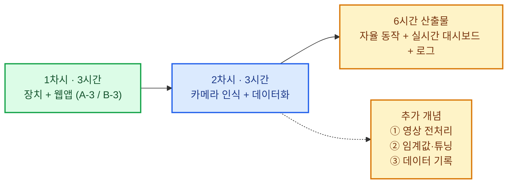

| 구분 | 3시간 과정 | 6시간 과정 추가분 |
|---|---|---|
| 판단 주체 | 사람 (폰 버튼) | **장치 (영상 인식 결과)** |
| 데이터 | 순간 값 | **시간에 따른 기록 (로그·그래프)** |
| 조정 방식 | 코드 수정 → 재실행 | **폰에서 실시간 파라미터 조정** |
| 실패 처리 | 그냥 멈춤 | **원인 기록 + 복구 동작** |
| 산출물 | 작동 장치 | 작동 장치 + **대시보드/알림** |

### 6시간 과정 공통 추가 요소표

| 요소 | 설명 | A-6 적용 | B-6 적용 |
|---|---|---|---|
| 영상 전처리 | 그레이스케일·블러·이진화 | 차선 추출 | 움직임 차분 |
| 관심 영역(ROI) | 처리 영역 제한 → 속도·정확도 ↑ | 화면 하단 40% | 감시 구역 지정 |
| 임계값 튜닝 | 슬라이더로 실시간 조정 | PID 계수 | 감지 민감도 |
| 데이터 기록 | 시간별 값 저장 | 조향각 그래프 | 이벤트 목록 |
| 외부 알림 | 사람에게 전달 | 장애물 경고 | **메신저 푸시** |

---

## 2-A. A-6 · 자율주행차 6시간 — "차선 추종 + 텔레메트리 대시보드"

### 구성

| 차시 | 시간 | 주제 | 완성 기능 | 폰 확인 지점 |
|---|---|---|---|---|
| 1차시 | 3시간 | A-3 전체 | 원격조종 + 자동정지 | 조종 화면 |
| 2차시 | 3시간 | 카메라 차선 인식 + PID | 트랙 자율 주행 | 차선 영상 + 조향각 그래프 + PID 슬라이더 |

### 2차시 상세 타임테이블 (A-6)

| 시간 | 활동 | 내용 | 폰 확인 지점 |
|---|---|---|---|
| 0:00–0:15 | 벤치마킹 | 차선유지보조(LKA) 영상 분석 | - |
| 0:15–0:30 | 기술 배경 | 그레이스케일 → 이진화 → 무게중심 | - |
| 0:30–0:55 | 영상 파이프라인 | 전처리 단계별 화면 4분할 출력 | **4분할 디버그 영상** |
| 0:55–1:20 | 차선 중심 계산 | ROI 하단 밴드의 무게중심 x좌표 | 중심선 오버레이 |
| 1:20–1:50 | 오차 → 조향 | `error = center_x - width/2` | 조향각 숫자 변화 |
| 1:50–2:20 | PID 적용 | Kp만 → Kp+Kd → 주행 테스트 | **슬라이더로 실시간 튜닝** |
| 2:20–2:40 | 예외 처리 | 차선 유실 시 감속·정지 + 로그 | `lane_lost` 이벤트 표시 |
| 2:40–3:00 | 랩타임 대회 | 팀별 1랩 기록 + 성찰 | 랩타임 기록표 |

### 영상 처리 파이프라인 단계도

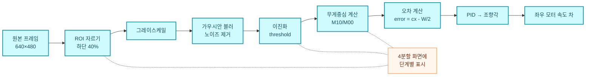

> **디버그 영상 4분할이 이 차시의 핵심 교구입니다.**
> 학생은 "왜 안 가는지"를 묻는 대신 **어느 단계에서 깨졌는지 화면으로 특정**합니다.

### 제어 로직 순서도

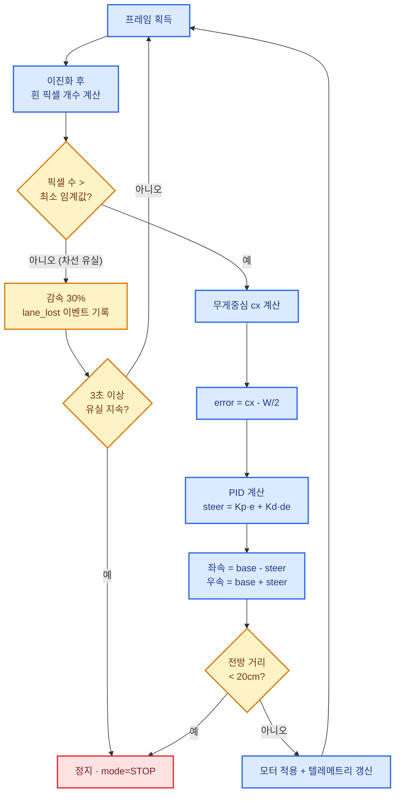

### 핵심 코드 (A-6 · 발췌)

```python
# A-6: 차선 추종 + 텔레메트리  (app.py 중 추가분)
import numpy as np, cv2, time

gain  = {"kp": 0.45, "ki": 0.0, "kd": 0.18}   # 폰 슬라이더로 변경
BASE  = 55                                     # 기본 전진 속도(%)
TH    = 90                                     # 이진화 임계값
MIN_PX = 1500                                  # 차선 최소 픽셀 수
prev_err, lost_since = 0.0, None

def lane_step(frame):
    global prev_err, lost_since
    h, w = frame.shape[:2]
    roi  = frame[int(h * 0.6):, :]                  # ① ROI 하단 40%
    gray = cv2.cvtColor(roi, cv2.COLOR_BGR2GRAY)    # ②
    blur = cv2.GaussianBlur(gray, (5, 5), 0)        # ③
    _, bw = cv2.threshold(blur, TH, 255, cv2.THRESH_BINARY)  # ④

    if cv2.countNonZero(bw) < MIN_PX:               # 차선 유실
        lost_since = lost_since or time.time()
        log_event("lane_lost", 0.0)
        return None if time.time() - lost_since > 3 else 0.0
    lost_since = None

    M  = cv2.moments(bw)                            # ⑤ 무게중심
    cx = M["m10"] / M["m00"]
    err = (cx - w / 2) / (w / 2)                    # ⑥ -1.0 ~ +1.0
    steer = gain["kp"] * err + gain["kd"] * (err - prev_err)   # ⑦ PID
    prev_err = err
    state["angle"] = round(steer * 100, 1)
    return steer

def drive_auto(steer):
    if steer is None:                               # 3초 유실 → 정지
        apply("stop", 0); state["mode"] = "STOP"; return
    en_l.value = max(0, min(1, (BASE - steer * 40) / 100))
    en_r.value = max(0, min(1, (BASE + steer * 40) / 100))
    left.forward(); right.forward()

@app.post("/api/pid")                               # 폰 슬라이더 → 즉시 반영
def set_pid():
    gain.update({k: float(v) for k, v in request.json.items()})
    return jsonify(ok=True, **gain)
```

### PID 튜닝 실습표 (학생 작성)

| 시도 | Kp | Kd | 주행 관찰 | 판정 |
|---|---|---|---|---|
| 1 | 0.1 | 0 | 반응이 느려 차선 이탈 | 부족 |
| 2 | 0.45 | 0 | 좌우로 출렁임(진동) | 과도 |
| 3 | 0.45 | 0.18 | 출렁임 감소, 안정 | **양호** |
| 4 | 0.8 | 0.18 | 급격한 진동 | 과도 |
| 5 | 자유 | 자유 | | |

| 증상 | 원인 | 조치 |
|---|---|---|
| 차선을 늦게 따라감 | Kp 부족 | Kp 10%씩 증가 |
| 좌우로 심하게 흔들림 | Kp 과다 | Kp 감소 + Kd 증가 |
| 코너에서 이탈 | 속도 과다 | `BASE` 감소 |
| 조명 변하면 실패 | 고정 임계값 한계 | 적응형 이진화(`adaptiveThreshold`) |
| 반응 지연 1초 이상 | 해상도 과다 | 320×240으로 축소 |

### 텔레메트리 대시보드 구성표

| 영역 | 표시 내용 | 갱신 주기 | 데이터 출처 |
|---|---|---|---|
| 상단 | 모드 배지 (MANUAL/AUTO/STOP) | 0.5초 | `/api/telemetry` |
| 좌측 | 차선 검출 영상 (4분할 디버그) | 실시간 | `/stream.mjpg` |
| 우측 상 | 조향각 실시간 그래프 | 0.5초 | `/api/telemetry` |
| 우측 중 | 전방 거리 숫자 + 막대 | 0.5초 | `/api/telemetry` |
| 우측 하 | PID 슬라이더 3개 | 조작 시 | `POST /api/pid` |
| 하단 | 최근 이벤트 로그 10줄 | 2초 | `/api/logs` |

### 평가 루브릭 (A-6 · 100점)

| 영역 | 배점 | 기준 |
|---|---|---|
| 1차시 기능 유지 | 15 | 원격조종 + 자동정지 정상 |
| 영상 파이프라인 | 20 | 4단계 전처리 설명 + 디버그 화면 구현 |
| 차선 추종 주행 | 25 | 직선 3m + 완만한 커브 1개 통과 |
| PID 튜닝 기록 | 20 | 실습표 5행 + 원인·조치 서술 |
| 대시보드 | 15 | 그래프 + 슬라이더 작동 |
| 예외 처리 | 5 | 차선 유실 시 정지·기록 |

---

## 2-B. B-6 · AI 감시카메라 6시간 — "움직임 감지 + 자동 녹화 + 푸시 알림"

### 구성

| 차시 | 시간 | 주제 | 완성 기능 | 폰 확인 지점 |
|---|---|---|---|---|
| 1차시 | 3시간 | B-3 전체 | 실시간 스트리밍 + 스냅샷 | 영상 화면 |
| 2차시 | 3시간 | 움직임 감지 + 이벤트 | 감지→녹화→알림 | **메신저 푸시 + 이벤트 목록** |

### 2차시 상세 타임테이블 (B-6)

| 시간 | 활동 | 내용 | 폰 확인 지점 |
|---|---|---|---|
| 0:00–0:15 | 벤치마킹 | 홈캠 "움직임 감지 알림" 기능 분해 | - |
| 0:15–0:30 | 기술 배경 | 프레임 차분(absdiff) 원리 | - |
| 0:30–1:00 | 움직임 감지 | 차분 → 이진화 → 변화 픽셀 비율 | **감지 시 화면 테두리 빨강** |
| 1:00–1:25 | 오탐 억제 | 최소 면적 + 연속 N프레임 + 쿨다운 | 오탐 횟수 감소 확인 |
| 1:25–1:50 | 이벤트 기록 | SQLite 저장 + 썸네일 + 목록 API | **이벤트 목록 화면** |
| 1:50–2:15 | 자동 녹화 | 감지 전 2초 ~ 후 5초 클립 저장 | 클립 재생 |
| 2:15–2:40 | 푸시 알림 | 메신저 봇으로 사진 + 시각 전송 | **폰 알림 수신** |
| 2:40–3:00 | 실전 테스트 | 복도·사물함 앞 설치 테스트 + 성찰 | 실제 이벤트 수집 |

### 감지 → 알림 파이프라인 구조도

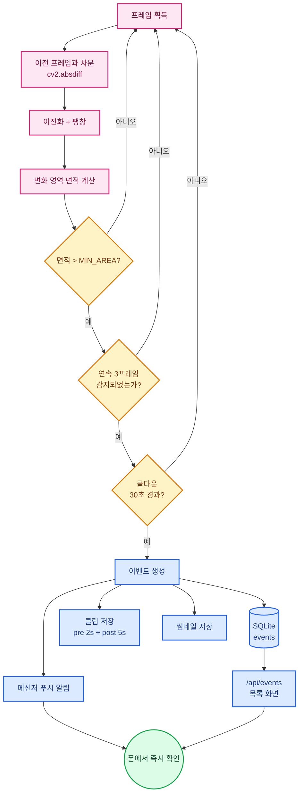

### 오탐(False Alarm) 억제 설계표 — 이 차시의 핵심 학습

| 오탐 원인 | 관찰 현상 | 억제 기법 | 코드 상수 |
|---|---|---|---|
| 조명 변화·형광등 깜빡임 | 화면 전체가 변화로 잡힘 | 블러 + 면적 하한 | `MIN_AREA = 1200` |
| 센서 노이즈 | 1프레임만 튐 | 연속 N프레임 조건 | `CONSEC = 3` |
| 커튼·화분 흔들림 | 같은 위치 반복 감지 | 감지 구역(ROI) 제한 | `ROI = (x,y,w,h)` |
| 한 사람이 계속 머무름 | 알림 폭주 | 쿨다운 | `COOLDOWN = 30초` |
| 카메라 자동 노출 | 밝기 급변 | 차분 정규화 / 고정 노출 | `AeEnable=False` |

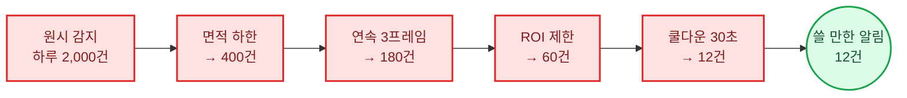

> **교육 포인트**: "AI가 많이 찾는 것"이 아니라 **"쓸 만한 것만 찾는 것"** 이 좋은 시스템입니다.
> 정밀도(Precision)·재현율(Recall) 개념을 숫자 없이 체감하게 하는 최적의 활동입니다.

### 핵심 코드 (B-6 · 발췌)

```python
# B-6: 움직임 감지 + 이벤트 + 알림  (app.py 중 추가분)
import sqlite3, requests, cv2, time
from datetime import datetime

MIN_AREA, CONSEC, COOLDOWN = 1200, 3, 30     # ← 학생 조정 상수 3개
db = sqlite3.connect("events.db", check_same_thread=False)
db.execute("""CREATE TABLE IF NOT EXISTS events(
    id INTEGER PRIMARY KEY AUTOINCREMENT,
    ts TEXT, type TEXT, score REAL, thumb TEXT, clip TEXT)""")

prev_gray, hit, last_alarm = None, 0, 0

def detect_motion(frame):
    global prev_gray, hit, last_alarm
    gray = cv2.GaussianBlur(cv2.cvtColor(frame, cv2.COLOR_BGR2GRAY), (21, 21), 0)
    if prev_gray is None:
        prev_gray = gray; return False, 0
    diff = cv2.absdiff(prev_gray, gray)
    prev_gray = gray
    _, bw = cv2.threshold(diff, 25, 255, cv2.THRESH_BINARY)
    bw = cv2.dilate(bw, None, iterations=2)
    area = max([cv2.contourArea(c) for c in
                cv2.findContours(bw, cv2.RETR_EXTERNAL,
                                 cv2.CHAIN_APPROX_SIMPLE)[0]] or [0])

    hit = hit + 1 if area > MIN_AREA else 0          # 연속 프레임 조건
    if hit >= CONSEC and time.time() - last_alarm > COOLDOWN:
        last_alarm = time.time(); hit = 0
        return True, area
    return False, area

def log_event(etype, score, frame=None):
    ts = datetime.now().strftime("%Y-%m-%d %H:%M:%S")
    thumb = ""
    if frame is not None:
        thumb = datetime.now().strftime("snaps/ev_%H%M%S.jpg")
        cv2.imwrite(thumb, frame)
    cur = db.execute("INSERT INTO events(ts,type,score,thumb,clip)"
                     " VALUES(?,?,?,?,?)", (ts, etype, score, thumb, ""))
    db.commit()
    notify(etype, ts, thumb)
    return cur.lastrowid

def notify(etype, ts, thumb):                        # 메신저 푸시
    try:
        requests.post(BOT_URL, files={"photo": open(thumb, "rb")},
                      data={"chat_id": CHAT_ID,
                            "caption": f"[{etype}] {ts}"}, timeout=5)
    except Exception as e:
        print("알림 실패:", e)                        # 보이는 실패

@app.get("/api/events")
def events():
    rows = db.execute("SELECT id,ts,type,score,thumb FROM events"
                      " ORDER BY id DESC LIMIT ?",
                      (request.args.get("limit", 20),)).fetchall()
    return jsonify([dict(zip(["id","ts","type","score","thumb"], r))
                    for r in rows])
```

> **푸시 알림 준비**: 메신저 봇 토큰·채팅 ID는 **강사가 수업용 계정으로 사전 발급**하고,
> `~/project/.env` 에 보관해 학생 코드에 직접 노출하지 않습니다(토큰 관리 교육 겸).

### 이벤트 데이터 스키마표

| 컬럼 | 타입 | 설명 | 예시 |
|---|---|---|---|
| `id` | INTEGER | 자동 증가 ID | 17 |
| `ts` | TEXT | 발생 시각 | `2026-10-05 14:03:11` |
| `type` | TEXT | 이벤트 종류 | `motion` / `person` / `intrusion` |
| `score` | REAL | 변화 면적 또는 신뢰도 | 2480.0 / 0.87 |
| `thumb` | TEXT | 썸네일 경로 | `snaps/ev_140311.jpg` |
| `clip` | TEXT | 클립 경로 | `clips/ev_140311.mp4` |

### 실전 테스트 기록표 (B-6 ⑤단계)

| 설치 위치 | 20분간 감지 | 실제 사람 | 오탐 | 미탐 | 개선 조치 |
|---|---|---|---|---|---|
| 교실 출입문 | | | | | |
| 복도 사물함 | | | | | |
| 창가(햇빛) | | | | | |

### 평가 루브릭 (B-6 · 100점)

| 영역 | 배점 | 기준 |
|---|---|---|
| 1차시 기능 유지 | 10 | 스트리밍 + 스냅샷 정상 |
| 움직임 감지 | 25 | 차분 원리 설명 + 동작 |
| 오탐 억제 | 25 | 3가지 이상 기법 적용 + 전후 비교 기록 |
| 이벤트 저장·목록 | 20 | DB 저장 + 목록 화면 + 썸네일 |
| 푸시 알림 | 15 | 폰 알림 수신 성공 |
| 윤리 의식 | 5 | 설치 위치 선정 사유 설명 |

---

## 2-C. 6시간 과정 완료 기준표

| # | A-6 기준 | B-6 기준 |
|---|---|---|
| 1 | 직선 3m 자율 주행 성공 | 20분 테스트에서 오탐 3건 이하 |
| 2 | PID 실습표 5행 이상 기록 | 억제 기법 3종 적용 기록 |
| 3 | 조향각 그래프 실시간 표시 | 이벤트 목록 + 썸네일 표시 |
| 4 | 차선 유실 예외 동작 | 쿨다운 동작 확인 |
| 5 | 1분 시연 영상 | 1분 시연 영상 + 알림 화면 캡처 |

---
