# 맛보기 출장수업: 바이브 코딩 - 동화 만들기

## ⚡ Quick Summary

바이브 코딩은 **관점에 따라 완전히 다른 학습**을 하는 2단계 시스템입니다.

| 단계 | 관점 | 집중 영역 | 대상 학년 | 시간 |
|------|------|-----------|-----------|------|
| **1단계** | 🎨 **컨텐츠 제작자** | 글과 이미지만 생각 | 중1-2 (종료) / 중3-고3 (2단계 진행) | 3시간 |
| **2단계** | 🚀 **기획자 + 실행자** | MVP 프로토타입 제작 + 개발 프로세스 이해 | 중3-고3 | 6~12시간 |

**핵심 철학**
- 1단계: 코딩은 **전혀 언급 안 함**. 오직 **프롬프트와 컨텐츠 퀄리티**.
- 2단계: **기획자 + 실행자 양성**. MVP 제작과 개발 프로세스 이해.
- 우리는 **개발자가 아닌, 아이디어를 실행하는 실행자**를 키웁니다.

---

## 🎯 Hero Section

**배지**: "AI 파트너와 함께 만드는 나만의 동화"  
**타이틀**: "바이브 코딩: 동화 크리에이터 체험"  
**설명**: "관점에 따라 다르게 배우는 2단계 학습 - 컨텐츠 제작자 → 개발자"

### Features

| 아이콘 | 라벨 | 설명 |
|--------|------|------|
| 🎨 | 장인 단계 | ChatGPT 파트너 협업 |
| 🏭 | 공장 단계 | AI Agent 자동화 |
| 📖 | 스토리텔링 | 그림+텍스트 동화 |
| 🚀 | 즉시 배포 | V0 + FastAPI + Vercel |

---

## 📊 Course Info

| 항목 | 아이콘 | 색상 | 내용 |
|------|--------|------|------|
| 수업 시간 | ⏰ Clock | purple | 3시간(1단계) / 6시간(1+2단계) / 12시간(심화) |
| 수강 인원 | 👥 Users | blue | 최대 30명 (개인 작업) |
| 준비물 | 💻 Laptop | green | 노트북 + ChatGPT 계정 |
| 대상 학년 | 🎓 GraduationCap | orange | 중1-2 (1단계만) / 중3-고3 (1+2단계) |

### 학년별 권장 과정

| 학년 | 권장 과정 | 학습 내용 | 결과물 |
|------|----------|-----------|--------|
| 중1-2 | **3시간** (1단계만) | 컨텐츠 제작자 관점 | 동화책 1개 |
| 중3-고1 | **6시간** (1단계 + 2단계 기초) | 컨텐츠 + 개발 입문 | 동화책 + 프로토타입 |
| 고2-3 | **12시간** (1단계 + 2단계 심화) | 컨텐츠 + 풀스택 개발 | 동화책 + 자동화 웹앱 |

---

## 📖 과정 소개

### 타이틀
"왜 동화 만들기로 바이브 코딩을 배우나?"

### 내용

바이브 코딩은 **관점에 따라 완전히 다른 학습을 하는 2단계 시스템**입니다. 

---

## 🎨 1단계: 컨텐츠 제작자 관점 (Content Creator)

**"글과 이미지만 생각하는 장인"**

이 단계에서는 **개발은 전혀 생각하지 않습니다**. 오직 좋은 동화를 만드는 것에만 집중합니다.

### 핵심 활동
- **프롬프트 작성**: 열린 질문, 상황 설명, 구조적 체이닝
- **글 다듬기**: ChatGPT와 대화하며 스토리 완성
- **이미지 생성**: DALL-E 프롬프트로 그림 제작
- **세밀한 조정**: 한 문장, 한 단어까지 신경 쓰는 장인 정신

### 결과물
- ✅ 5~10페이지 완성 동화책 (PDF/PPT)
- ✅ 프롬프트 사용 능력
- ✅ AI와 협업하는 태도

### 대상
- **중학생 1~2학년**: 이 단계만 진행 (3시간)
- **중학생 3학년 이상**: 1단계 후 2단계 진행 (6~12시간)

---

## 🚀 2단계: 기획자 + 실행자 관점 (Planner + Executor)

**"아이디어를 실행하는 실행자"**

**우리는 개발자를 키우지 않습니다.** 기획자 + 실행자 + 디버거(성찰) 역할을 통해 **자신의 아이디어를 빠르게 구현하는 능력**을 키웁니다.

이 단계는 **컨텐츠가 아닌 시스템과 개발 프로세스**에 집중합니다. 바이브 코딩으로 **기본 문법만 이해**하면 MVP를 만들 수 있습니다.

### Phase 1: AI 성능 테스트 & 규약 정의 (2시간)

**개발 전에 반드시 테스트를 먼저 합니다**

```
[ChatGPT 개발자 도구로 테스트]

입력값 예시:
{
  "genre": "판타지",
  "protagonist": {"name": "토리", "personality": "호기심 많은"},
  "theme": "우정",
  "previous_scene": "토리는 숲속에서 길을 잃었다."
}

기대 출력값:
{
  "text": "200-300자 동화 텍스트",
  "image_prompt": "DALL-E용 영문 프롬프트",
  "next_options": ["선택지 1", "선택지 2", "선택지 3"]
}
```

**이 단계에서 정의하는 것:**
1. **입력 데이터 구조**: 어떤 정보를 받을지
2. **출력 데이터 구조**: 어떤 결과를 낼지
3. **AI 프롬프트 템플릿**: 일관된 결과를 위한 템플릿
4. **데이터 흐름도**: 씬 생성 → 수정 → 다음 씬
5. **규약 문서**: JSON 스키마, 에러 처리 규칙

### Phase 2: 바이브 코딩으로 MVP 제작 (2~4시간)

**테스트와 규약을 기반으로 프로토타입 제작**

바이브 코딩은 **깊은 코딩 학습 없이** V0, ChatGPT 등 AI 도구로 빠르게 구현하는 방식입니다. 기본 문법만 이해하면 됩니다.

| 역할 | 활동 | 도구 | 시간 |
|------|------|-----|------|
| **기획자** | 기능 정의, 화면 설계 | 종이/Figma | 20분 |
| **실행자** | UI 생성 + 백엔드 연동 | V0 + FastAPI | 60분 |
| **디버거** | 테스트 + 문제 발견 | 브라우저 + 로그 | 30분 |
| **성찰자** | 개선점 분석 (선택) | - | 10분 |

### 결과물
- ✅ 작동하는 MVP 프로토타입
- ✅ 개발 프로세스 이해
- ✅ 아이디어 실행 능력
- ✅ 디버깅 & 성찰 경험

### 대상 및 목표
- **중학생 3학년 이상**: 1단계 이수 후 진행
- **목표**: 모든 학생이 MVP를 만들고 개발 프로세스를 이해
- **선택**: 디버깅 → 알고리즘 확대는 개인 자유

### 이미지 (3개)
- ChatGPT와 동화 기획 대화 화면
- 학생들이 AI 생성 동화를 수정하는 모습
- 완성된 동화책들 (장인편 + 자동화편)

---

## 🎓 학습 경로 (Learning Path)

### 전체 구조도

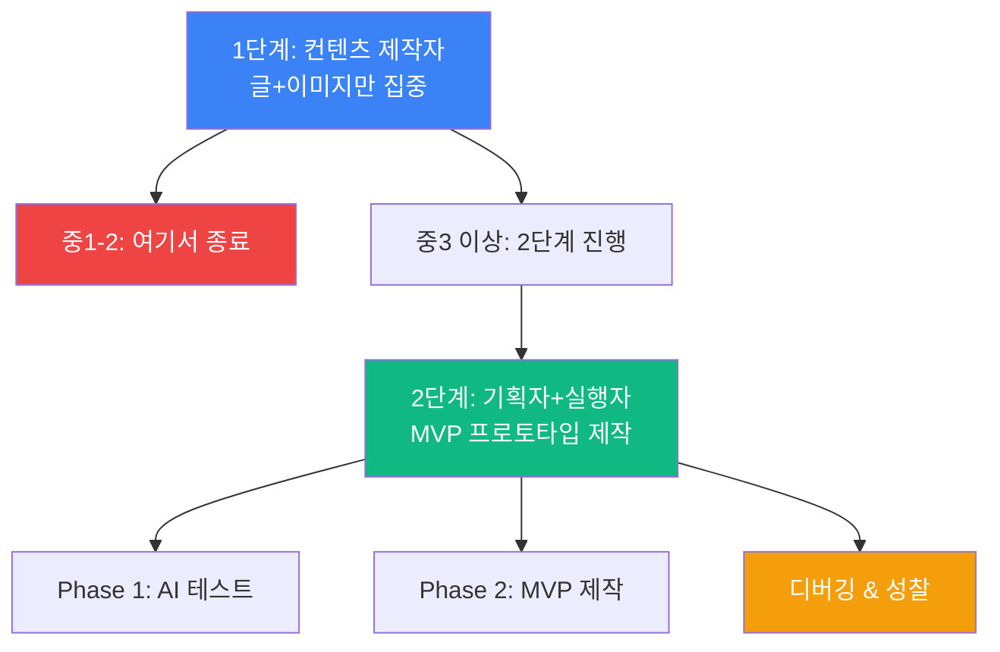

---

## 📚 1단계: 컨텐츠 제작자 과정 (3시간)

**대상**: 중학생 1~2학년 / 컨텐츠 제작에만 관심 있는 모든 학생

### 타임라인

| 단계 | 시간 | 내용 | 산출물 |
|------|------|------|--------|
| 1. 오리엔테이션 | 15분 | 바이브 코딩 1단계 소개 | - |
| 2. 동화 분석 | 20분 | 명작 구조 분석 (어린왕자 등) | 분석 시트 |
| 3. 프롬프트 기초 | 30분 | 열린 질문 vs 닫힌 질문 | 프롬프트 예시 |
| 4. 스토리 기획 | 40분 | ChatGPT와 협업 대화 | 기획서 |
| 5. 글 작성 | 30분 | 5개 씬 텍스트 완성 | 텍스트 파일 |
| 6. 그림 생성 | 30분 | DALL-E 프롬프트 작성 | 이미지 5개 |
| 7. 발표 | 15분 | 작품 공유 & 피드백 | 완성 동화책 |

**강조점**: 
- 🚫 개발, 코딩, API는 **전혀 다루지 않음**
- ✅ 오직 **글과 이미지의 퀄리티**에만 집중
- ✅ ChatGPT를 **작가 파트너**로 활용하는 법

**완성 작품**: 5페이지 그림 동화책 (PDF/PPT)

---

## 💻 2단계: 개발자/기획자 과정 (6시간 = 1단계 3시간 + 2단계 3시간)

**대상**: 중학생 3학년 이상 / 개발에 관심 있는 학생

### 전체 구조

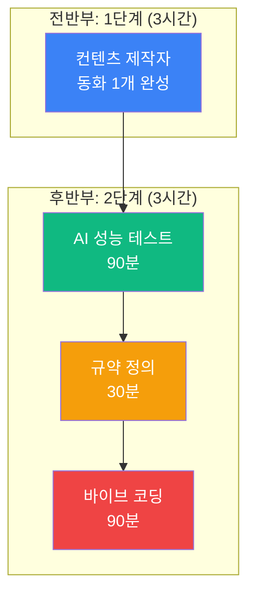

### 타임라인

| 교시 | 시간 | 단계 | 내용 | 관점 |
|------|------|------|------|------|
| **1-2교시** | **180분** | **1단계** | 동화 1개 완성 | 🎨 컨텐츠 제작자 |
| 점심 | 60분 | - | 휴식 | - |
| **3교시** | **90분** | **2단계-1** | AI 성능 테스트 | 💻 개발자 |
| | 30분 | 입력값 설계 | "어떤 데이터를 받을까?" | |
| | 30분 | 출력값 테스트 | "어떤 결과가 나올까?" | |
| | 30분 | 프롬프트 템플릿 | "일관된 결과를 위한 템플릿" | |
| **4교시** | **30분** | **2단계-2** | 규약 정의 | 📋 기획자 |
| | | | • JSON 스키마 작성 | |
| | | | • 데이터 흐름도 그리기 | |
| | | | • 에러 처리 규칙 | |
| **5교시** | **90분** | **2단계-3** | 바이브 코딩 구현 | 🚀 개발자 |
| | 40분 | V0 UI 생성 | 입력 폼 자동 생성 | |
| | 40분 | FastAPI 연동 | 백엔드 API 구현 | |
| | 10분 | 테스트 & 배포 | 동작 확인 | |

**완성 작품**: 
- 동화책 1개 (1단계)
- 동화 생성 프로토타입 웹앱 (2단계)
- API 설계 문서 (2단계)

---

## 🚀 심화 과정: 풀스택 자동화 (12시간 = 1단계 4시간 + 2단계 8시간)

**대상**: 고등학생 / 포트폴리오 제작 희망자

### 전체 구조

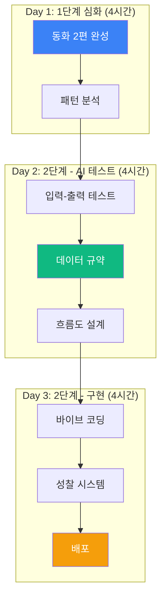

### 일차별 계획

| 일차 | 시간 | 단계 | 관점 | 활동 |
|------|------|------|------|------|
| **Day 1** | **4시간** | **1단계 심화** | 🎨 컨텐츠 제작자 | |
| | 90분 | 동화 1편 | 장인 단계 | 환경 테마 동화 완성 |
| | 90분 | 동화 2편 | 장인 단계 | 우정 테마 동화 완성 |
| | 60분 | 패턴 분석 | 메타 인지 | "내가 어떤 프롬프트를 썼나?" |
| **Day 2** | **4시간** | **2단계: AI 테스트** | 💻 개발자/기획자 | |
| | 15분 | 관점 전환 | 오리엔테이션 | 컨텐츠 → 데이터 사고 전환 |
| | 90분 | 입력-출력 테스트 | 개발자 | ChatGPT 성능 테스트 |
| | | | | • 10가지 입력값 시도 |
| | | | | • 출력 결과 분석 |
| | | | | • 프롬프트 템플릿 도출 |
| | 60분 | 데이터 규약 | 기획자 | JSON 스키마 정의 |
| | 75분 | 흐름도 설계 | 아키텍트 | 씬 생성 → 수정 → 다음 씬 |
| **Day 3** | **4시간** | **2단계: 구현** | 🚀 개발자 | |
| | 90분 | 바이브 코딩 1 | V0 + FastAPI | UI + 백엔드 기본 구조 |
| | 60분 | 바이브 코딩 2 | API 연동 | 프론트-백엔드 연결 |
| | 45분 | 성찰 시스템 | 알고리즘 | AI 분석 & 디버깅 |
| | 45분 | 배포 & 테스트 | DevOps | Vercel 배포 + 문제 해결 |

**완성 작품**: 
- 동화책 2편 (1단계)
- 풀스택 동화 자동 생성기 (2단계)
- API 설계 문서 + 데이터 흐름도 (2단계)
- 포트폴리오 사이트

---

## 🎮 프로젝트 상세

---

## 🎨 1단계 프로젝트: 컨텐츠 제작자 - 동화 만들기

### 관점
**"나는 작가다. ChatGPT는 나의 파트너 작가다."**

### 흐름도

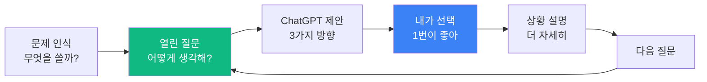

**난이도**: ⭐⭐ (초급)  
**소요 시간**: 3시간  
**대상**: 중등 1학년 ~ 고등 3학년 (모두)

**학습 목표**
- ✅ 열린 질문 vs 닫힌 질문
- ✅ 상황 설명으로 맥락 제공
- ✅ 구조적 체이닝 프롬프트
- ✅ 사용자가 주도하는 협업 태도
- ✅ DALL-E 이미지 프롬프트 작성

**강조점**
- 🚫 코딩, 개발은 전혀 언급 안 함
- ✅ 오직 글과 이미지의 퀄리티만 생각

**제작 단계**

| 단계 | 내용 | 시간 | 도구 |
|------|------|------|------|
| 1. 분석 | 명작 동화 구조 분석 | 20분 | ChatGPT |
| 2. 기획 | 주제 + 메시지 정의 | 30분 | 열린 질문 |
| 3. 캐릭터 | 주인공 + 조력자 설정 | 30분 | 상황 설명 |
| 4. 플롯 | 3막 구조 기획 | 30분 | 체이닝 프롬프트 |
| 5. 씬 작성 | 5개 씬 텍스트 완성 | 30분 | 협업 대화 |
| 6. 이미지 | DALL-E 그림 생성 | 30분 | DALL-E 3 |
| 7. 정리 | 동화책 완성 & 발표 | 20분 | PDF/PPT |

**1단계 프로세스 알고리즘: 구조적 체이닝**

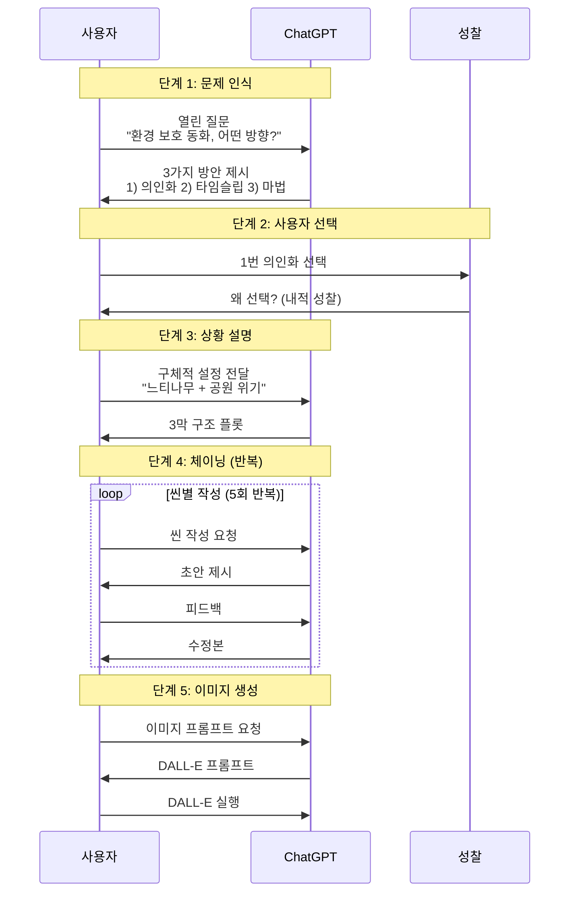

**의사결정 알고리즘**

| 단계 | 누가 | 무엇을 | 왜 |
|------|------|--------|-----|
| 1. 문제 인식 | 사용자 | 주제 정의 | 방향 설정 |
| 2. 방안 제시 | ChatGPT | 3가지 옵션 | 선택지 제공 |
| 3. **의사결정** | **사용자** | **1개 선택** | **주도권 유지** |
| 4. 구체화 | ChatGPT | 상세 전개 | 실행 지원 |
| 5. 피드백 | 사용자 | 수정 요청 | 퀄리티 조정 |
| 6. 반복 | 양쪽 | 2~5 반복 | 완성도 향상 |

**기대 효과**
- ✅ AI를 파트너로 활용하는 태도 습득
- ✅ 주도적 의사결정 능력 향상
- ✅ 3시간 만에 완성 동화책 제작
- ✅ 구조적 사고와 창의력 동시 개발

---

## 🚀 2단계 프로젝트: 기획자 + 실행자 - MVP 프로토타입 제작

### 관점
**"나는 실행자다. 내 아이디어를 빠르게 구현한다."**

**우리는 개발자를 키우지 않습니다.** 다음 4가지 역할을 통해 MVP를 만드는 능력을 키웁니다:
1. **기획자**: 문제 인식 + 아이디어 구체화
2. **실행자**: 바이브 코딩으로 빠른 구현 (기본 문법만 이해)
3. **디버거**: 테스트 + 문제 발견
4. **성찰자**: 개선점 분석 (선택, 알고리즘 확대는 자유)

### Phase 1: AI 성능 테스트 & 규약 정의 (필수 선행 단계)

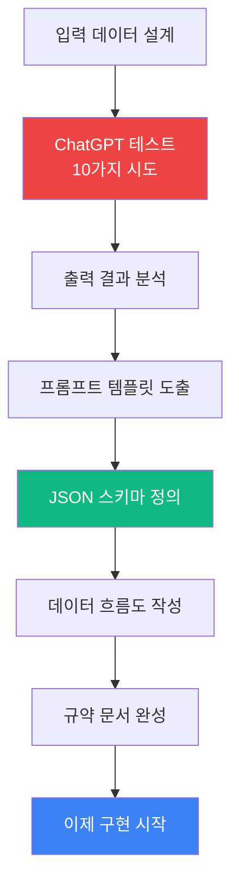

**난이도**: ⭐⭐⭐ (중급)  
**소요 시간**: 2시간 (테스트) + 2~4시간 (MVP 제작)  
**대상**: 중등 3학년 ~ 고등 3학년

**학습 목표** (모든 학생이 달성)
- ✅ **MVP 프로토타입 제작** 능력
- ✅ **개발 프로세스 이해** (기획 → 테스트 → 구현 → 디버깅)
- ✅ AI 성능 테스트 방법론
- ✅ 바이브 코딩 경험 (기본 문법만 이해)
- ✅ 아이디어 실행 능력

**강조점**
- 🚫 **개발자를 키우지 않음**
- 🚫 깊은 코딩 학습 불필요
- ✅ **기획자 + 실행자 + 디버거** 역할 체험
- ✅ **모든 학생이 MVP 완성**
- ✅ 알고리즘 확대는 선택 사항

### 2단계 Phase 1: AI 테스트 프로세스 알고리즘

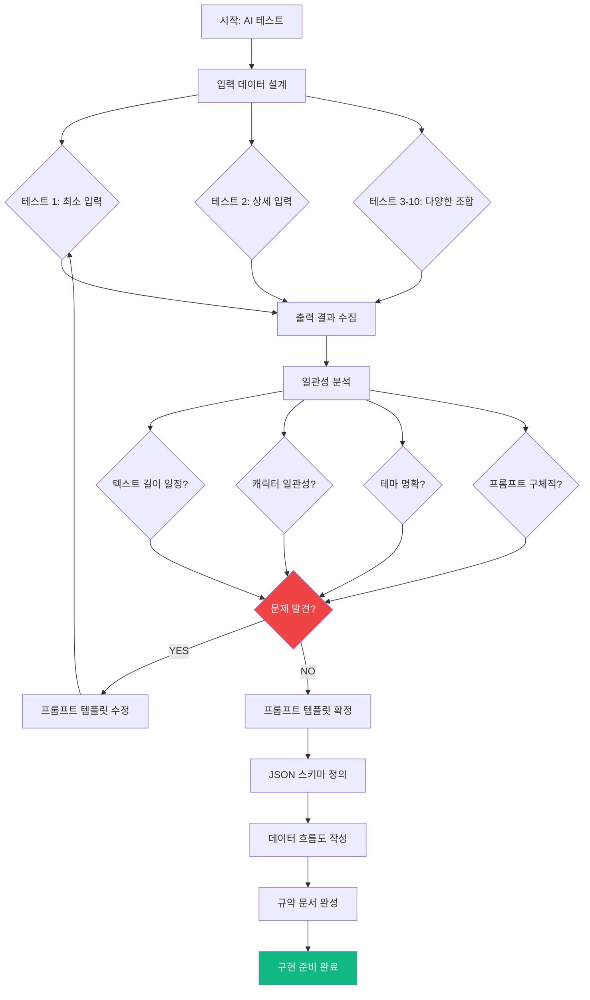

**AI 테스트 체크리스트**

| 항목 | 테스트 내용 | 합격 기준 | 불합격 시 조치 |
|------|------------|----------|---------------|
| 1. 텍스트 길이 | 10가지 입력 시도 | 200-300자 80% 이상 | 프롬프트에 글자수 명시 |
| 2. 캐릭터 일관성 | 주인공 이름/성격 | 100% 유지 | 프롬프트에 성격 강조 |
| 3. 테마 전달 | 테마 명확도 | 70% 이상 명확 | 테마 키워드 반복 |
| 4. 이미지 프롬프트 | 구체성 | 5가지 요소 포함 | 프롬프트 형식 정의 |
| 5. 응답 속도 | 생성 시간 | 10초 이내 | 프롬프트 간소화 |

**규약 정의 결과 (표 형식)**

| 데이터 | 타입 | 필수 | 예시 | 검증 규칙 |
|--------|------|------|------|-----------|
| **입력: 장르** | 선택 | ✓ | "판타지" | 4가지 중 선택 |
| **입력: 주인공 이름** | 텍스트 | ✓ | "토리" | 2-10자 |
| **입력: 주인공 성격** | 텍스트 | ✓ | "호기심 많은" | 5-20자 |
| **입력: 테마** | 선택 | ✓ | "우정" | 6가지 중 선택 |
| **출력: 텍스트** | 텍스트 | ✓ | "..." | 200-300자 |
| **출력: 이미지 프롬프트** | 텍스트 | ✓ | "A fox..." | 영문 50자 이상 |
| **출력: 감정** | 텍스트 | ✓ | "즐거움" | 한 단어 |

### 2단계 Phase 2: MVP 제작 프로세스 (4가지 역할)

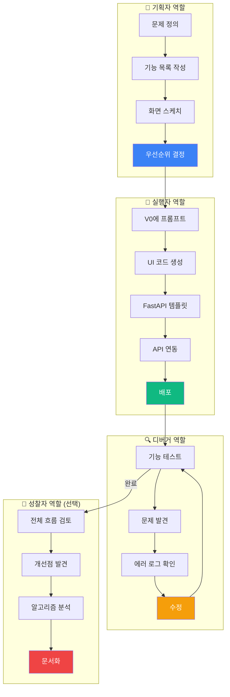

**4가지 역할 시간 배분**

| 역할 | 활동 | 시간 | 도구 | 결과물 |
|------|------|------|------|--------|
| 🎯 **기획자** | • 문제 정의<br/>• 기능 목록<br/>• 화면 스케치 | 15분 | 종이/화이트보드 | 기획서 |
| 🚀 **실행자** | • V0 UI 생성<br/>• FastAPI 템플릿<br/>• 연동 | 60분 | V0 + ChatGPT | MVP 프로토타입 |
| 🔍 **디버거** | • 기능 테스트<br/>• 문제 발견<br/>• 에러 수정 | 30분 | 브라우저 + 로그 | 작동하는 MVP |
| 💭 **성찰자** | • 흐름 검토<br/>• 개선점 분석 | 15분 | - | 개선 문서 (선택) |

**바이브 코딩 실행 알고리즘**

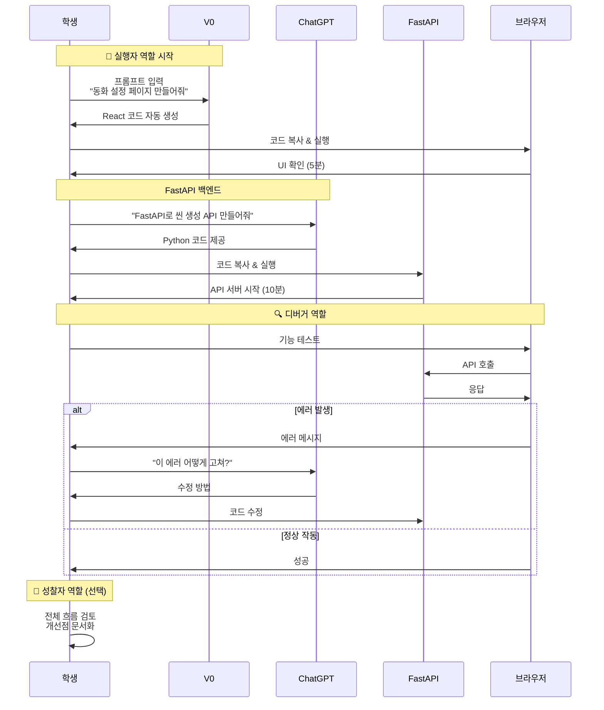

**바이브 코딩 vs 전통 코딩**

| 단계 | 전통 코딩 | 바이브 코딩 | 시간 절감 |
|------|----------|------------|-----------|
| UI 제작 | HTML/CSS/JS 학습 → 코딩 | V0에 프롬프트 → 생성 | 2시간 → 10분 |
| 백엔드 | Python/FastAPI 학습 → 코딩 | ChatGPT에 요청 → 복사 | 3시간 → 15분 |
| 디버깅 | 에러 검색 → 스택오버플로우 | ChatGPT에 에러 → 해결 | 1시간 → 5분 |
| 배포 | 서버 설정 → 배포 스크립트 | Vercel 자동 배포 | 1시간 → 5분 |
| **합계** | **7시간** | **35분** | **12배 빠름** |

**학생이 집중하는 것**

| 역할 | 학생의 역할 | AI의 역할 |
|------|-----------|-----------|
| 🎯 기획자 | ✅ 문제 정의<br/>✅ 기능 목록<br/>✅ 우선순위 결정 | - |
| 🚀 실행자 | ✅ 프롬프트 작성<br/>✅ 코드 복사/실행<br/>✅ 기본 문법 이해 | ✅ 코드 생성<br/>✅ 복잡한 로직 |
| 🔍 디버거 | ✅ 테스트 계획<br/>✅ 문제 발견<br/>✅ 해결 요청 | ✅ 에러 분석<br/>✅ 수정 방법 제시 |
| 💭 성찰자 | ✅ 흐름 검토<br/>✅ 개선점 발견 | ✅ 패턴 분석 제안 |

---

## 🚀 심화 프로젝트: 성찰 & 디버깅 시스템 (12시간 과정 포함)

**난이도**: ⭐⭐⭐⭐⭐ (고급)  
**소요 시간**: 8시간  
**대상**: 중등 3학년 ~ 고등 3학년

**시스템 구조**

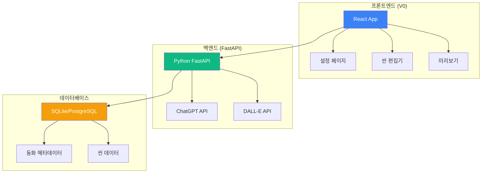

**데이터 구조 (표 형식)**

**Story (동화) 데이터**

| 필드 | 타입 | 필수 | 설명 | 예시 |
|------|------|------|------|------|
| id | 문자열 | ✓ | 동화 고유 ID | "story_123" |
| user_id | 문자열 | ✓ | 작성자 ID | "user_456" |
| title | 문자열 | ✓ | 동화 제목 | "느티나무 할아버지" |
| genre | 선택 | ✓ | 장르 | "판타지" |
| protagonist | 객체 | ✓ | 주인공 정보 | {name, personality} |
| theme | 선택 | ✓ | 테마 | "우정" |
| scenes | 배열 | ✓ | 씬 ID 목록 | ["scene_1", "scene_2"] |
| status | 상태 | ✓ | 진행 상태 | "draft" / "completed" |
| created_at | 시간 | ✓ | 생성 시간 | "2025-01-03 10:00" |

**Scene (씬) 데이터**

| 필드 | 타입 | 필수 | 설명 | 예시 |
|------|------|------|------|------|
| id | 문자열 | ✓ | 씬 고유 ID | "scene_1" |
| story_id | 문자열 | ✓ | 소속 동화 ID | "story_123" |
| order | 숫자 | ✓ | 씬 순서 | 1, 2, 3... |
| text | 문자열 | ✓ | 텍스트 내용 | "느티나무가..." (200-300자) |
| image_prompt | 문자열 | ✓ | DALL-E 프롬프트 | "A wise old tree..." |
| image_url | 문자열 | - | 이미지 URL | "https://..." |
| user_edits | 배열 | - | 수정 이력 | [{feedback, original, time}] |
| created_at | 시간 | ✓ | 생성 시간 | "2025-01-03 10:05" |

**데이터 흐름도**

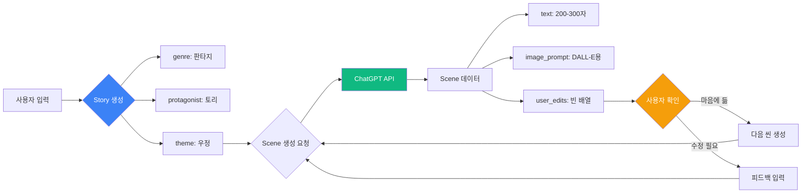

**씬 생성 알고리즘**

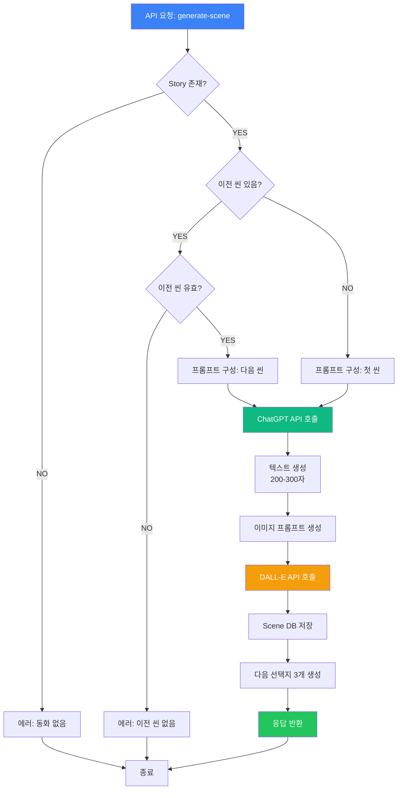

**프롬프트 구성 알고리즘 (Early Return 패턴)**

| 조건 | 포함 내용 | 목적 |
|------|----------|------|
| **기본 (항상)** | • 장르<br/>• 주인공 (이름+성격)<br/>• 테마 | 일관성 유지 |
| **첫 씬인 경우** | "첫 번째 씬 작성" | 시작 명시 |
| **Return** | 프롬프트 반환 | ← Early Return |
| **다음 씬인 경우** | • 이전 씬 텍스트<br/>• "다음 씬 작성 (200-300자)" | 연속성 |
| **피드백 있는 경우** | • 사용자 피드백<br/>• "피드백 반영" | 수정 |
| **Return** | 프롬프트 반환 | 최종 반환 |

**씬 재생성 & 디버깅 알고리즘**

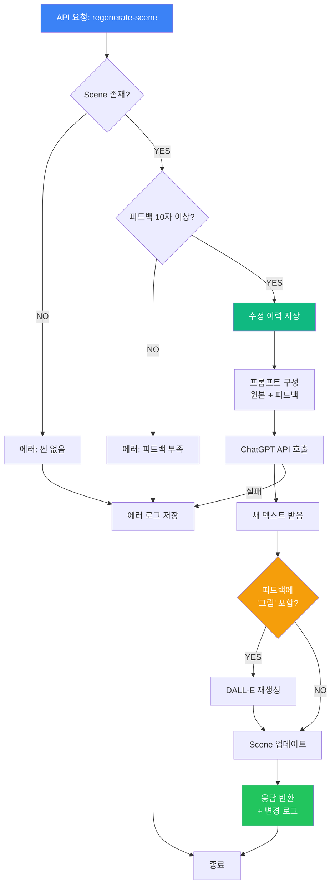

**디버깅 체크리스트**

| 단계 | 검증 항목 | 실패 시 | 성공 시 |
|------|----------|---------|---------|
| 1. 씬 검증 | Scene ID 유효? | Error 404 | → 2단계 |
| 2. 피드백 검증 | 10자 이상? | Error 400 | → 3단계 |
| 3. 이력 저장 | 수정 이력 저장 | Error 500 | → 4단계 |
| 4. 재생성 | ChatGPT 호출 | Error 500 + 로그 | → 5단계 |
| 5. 이미지 체크 | 피드백에 '그림'? | Skip 이미지 | DALL-E 호출 |
| 6. 업데이트 | DB 저장 | Error 500 | 성공 반환 |

**성찰 & 디버깅 알고리즘 (💭 성찰자 역할 - 선택)**

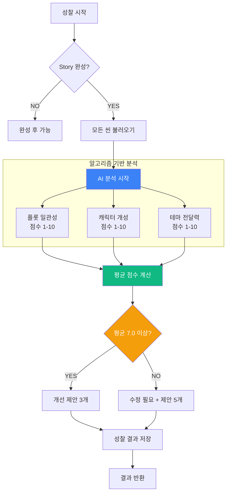

**디버깅 체크리스트 알고리즘 (역방향 개발)**

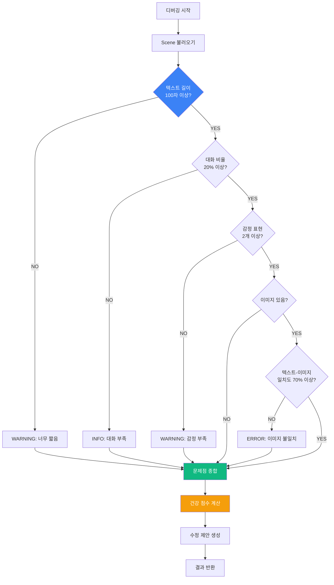

**디버깅 결과 해석 표**

| 건강 점수 | 의미 | 조치 | 예상 시간 |
|----------|------|------|-----------|
| 90-100 | 매우 좋음 | 없음 | - |
| 70-89 | 양호 | 소폭 개선 권장 | 5분 |
| 50-69 | 보통 | 개선 필요 | 10분 |
| 30-49 | 미흡 | 대폭 수정 | 20분 |
| 0-29 | 심각 | 재작성 권장 | 30분+ |

**완성 화면 구성**

| 페이지 | 경로 | 주요 기능 |
|--------|------|-----------|
| 홈 | `/` | 동화 목록 + 시작 버튼 |
| 설정 | `/create` | 장르/주인공/테마 선택 |
| 편집 | `/story/:storyId/edit` | 씬별 편집, 재생성 |
| 미리보기 | `/story/:storyId/preview` | 동화책 형태 보기 |
| 성찰 | `/story/:storyId/reflect` | AI 분석 결과 |
| 디버그 | `/story/:storyId/debug` | 문제점 진단 |

---

## 📚 커리큘럼 상세

### 3시간 과정: 1단계 - 컨텐츠 제작자 관점

**관점**: "나는 작가다. ChatGPT는 내 파트너다"  
**목표**: 5페이지 그림 동화 1개 완성  
**대상**: 중1-2 (여기서 종료) / 중3-고3 (2단계로 진행)

**전체 프로세스**

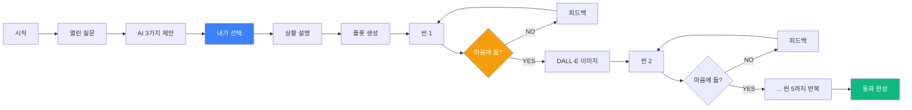

**시간표**

| 시간 | 내용 | 활동 | 관점 | 산출물 |
|------|------|------|------|--------|
| 00:00-00:15 | 오리엔테이션 | **1단계 = 글과 이미지만 생각** | 🎨 | - |
| 00:15-00:35 | 명작 분석 | 어린왕자 구조 분석 | 📖 | 분석 시트 |
| 00:35-01:05 | 프롬프트 기초 | 열린 질문 실습 | 💬 | 프롬프트 10개 |
| 01:05-01:45 | 스토리 기획 | ChatGPT 협업 대화 | 🤝 | 기획서 |
| 01:45-02:15 | 글 작성 | 5개 씬 텍스트 | ✍️ | 텍스트 파일 |
| 02:15-02:45 | 그림 생성 | DALL-E 프롬프트 | 🎨 | 이미지 5개 |
| 02:45-03:00 | 발표 | 작품 발표 | 🎤 | 완성 동화책 |

**준비물**
- 노트북 (개인)
- ChatGPT Plus 계정 (DALL-E 사용)
- 구글 슬라이드 또는 Canva

**제공 자료**
- 프롬프트 템플릿 (열린 질문 50개)
- 동화 구조 분석 시트
- DALL-E 프롬프트 가이드

**강조점**
- ✅ **글과 이미지 퀄리티만 생각**
- ✅ 내가 주도적으로 선택
- 🚫 **코딩, API, 자동화는 언급 안 함**

### 6시간 과정: 1단계 + 2단계 (컨텐츠 제작자 → 개발자)

**관점 전환**: 작가 → 개발자  
**목표**: 동화 1개 + AI 테스트 + 프로토타입  
**대상**: 중3-고3

**관점 전환 프로세스**

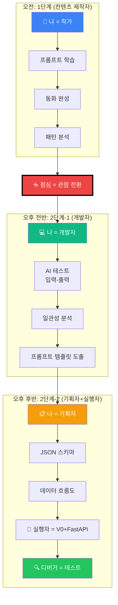

**일정 구성**

```mermaid
gantt
    title 6시간 과정: 관점 전환
    dateFormat HH:mm
    axisFormat %H:%M
    
    section 전반부: 1단계 (3시간)
    컨텐츠 제작자: 09:00, 180m
    
    section 점심
    휴식: 12:00, 60m
    
    section 후반부: 2단계 (3시간)
    AI 테스트: 13:00, 90m
    규약 정의: 14:30, 30m
    바이브 코딩: 15:00, 60m
```

**세부 시간표**

| 교시 | 시간 | 단계 | 관점 | 세부 활동 |
|------|------|------|------|-----------|
| **1-2교시** | **09:00-12:00** | **1단계** | 🎨 컨텐츠 제작자 | |
| | 09:00-09:15 | 오리엔테이션 | | 2단계 전체 소개 |
| | 09:15-10:00 | 프롬프트 마스터 | | 구조적 체이닝 |
| | 10:00-11:30 | 동화 완성 | | 5페이지 동화 |
| | 11:30-12:00 | 패턴 분석 | | "내가 어떤 프롬프트를 썼나?" |
| **점심** | **12:00-13:00** | **휴식** | 🍽️ | **관점 전환 준비** |
| **3교시** | **13:00-14:30** | **2단계-1** | 💻 개발자 | **AI 성능 테스트** |
| | 13:00-13:15 | 관점 전환 | | "이제 개발자다" |
| | 13:15-13:45 | 입력 설계 | | 10가지 입력값 |
| | 13:45-14:15 | 출력 분석 | | 결과 일관성 체크 |
| | 14:15-14:30 | 템플릿 도출 | | 프롬프트 템플릿 |
| **4교시** | **14:30-15:00** | **2단계-2** | 📋 기획자 | **규약 정의** |
| | | JSON 스키마 | | 데이터 구조 |
| | | 흐름도 | | 씬 생성 프로세스 |
| **5교시** | **15:00-16:00** | **2단계-3** | 🚀 개발자 | **바이브 코딩** |
| | 15:00-15:30 | V0 UI | | 자동 생성 |
| | 15:30-15:50 | FastAPI | | 백엔드 연동 |
| | 15:50-16:00 | 테스트 | | 동작 확인 |

### 12시간 과정: 심화 (1단계 4시간 + 2단계 8시간)

**관점**: 컨텐츠 제작자 → 개발자/기획자  
**목표**: 동화 2개 + 풀스택 자동화 시스템  
**대상**: 고등학생 / 포트폴리오 제작 희망자

**전체 구조**

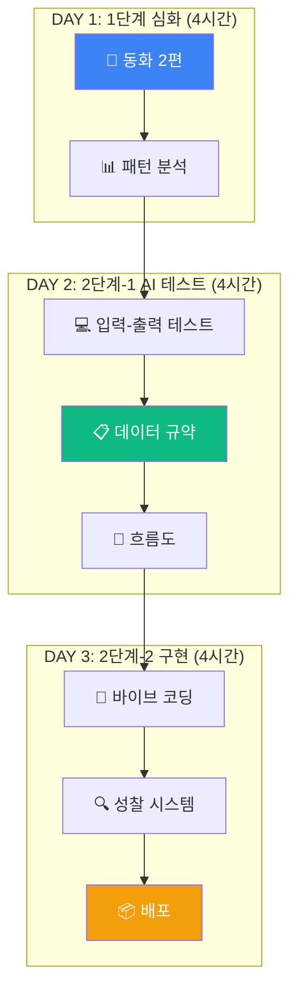

**일차별 계획**

| 일차 | 시간 | 단계 | 관점 | 활동 내용 |
|------|------|------|------|-----------|
| **Day 1** | **4시간** | **1단계** | 🎨 컨텐츠 제작자 | |
| | 30분 | 오리엔테이션 | | 2단계 전체 소개 |
| | 60분 | 프롬프트 심화 | | 열린 질문 + 체이닝 |
| | 90분 | 동화 1편 | | 환경 테마 |
| | 90분 | 동화 2편 | | 우정 테마 |
| | 30분 | 패턴 분석 | | "어떤 프롬프트를 썼나?" |
| **Day 2** | **4시간** | **2단계-1** | 💻 개발자/기획자 | **AI 테스트** |
| | 15분 | **관점 전환** | | "이제부터 개발자다" |
| | 90분 | 입력-출력 테스트 | | 10가지 입력 시도 |
| | | | | 출력 일관성 분석 |
| | | | | 프롬프트 템플릿 도출 |
| | 60분 | 데이터 규약 | | JSON 스키마 정의 |
| | 75분 | 흐름도 설계 | | 씬 생성 프로세스 |
| **Day 3** | **4시간** | **2단계-2** | 🚀 실행자 | **MVP 제작** |
| | 15분 | 복습 | | 규약 문서 리뷰 |
| | 30분 | 기획자 | | 화면 설계, 기능 정의 |
| | 90분 | 실행자 | | V0 + FastAPI MVP |
| | 45분 | 디버거 | | 테스트 + 에러 수정 |
| | 30분 | 성찰자 | | 개선점 분석 (선택) |

---

## 💰 가격 정책

### 3시간 과정: 1단계 - 컨텐츠 제작자

**대상**: 중1-2 (종료) / 중3-고3 (2단계 진행)  
**관점**: 🎨 작가

| 항목 | 기본 | 프리미엄 |
|------|------|----------|
| 수업 시간 | 3시간 (1단계만) | 3시간 (1단계만) |
| 수강 인원 | 최대 30명 | 최대 30명 |
| 강사 | 1명 | 2명 |
| 학습 내용 | 프롬프트 + 동화 제작 | 프롬프트 + 동화 + 패턴 분석 |
| 제공 자료 | 프롬프트 템플릿 | 템플릿 + 워크북 + USB |
| 완성 작품 | 동화 1개 (5페이지) | 동화 1개 + PDF 제본 |
| ChatGPT 계정 | 학생 준비 | ChatGPT Plus 제공 |
| 사후 지원 | - | 1주일 프롬프트 상담 |
| **가격** | **25만원** | **35만원** |

### 6시간 과정: 1단계 + 2단계 기초

**대상**: 중3-고3  
**관점**: 🎨 작가 → 🚀 실행자  
**목표**: 동화 1개 + MVP 프로토타입 (모든 학생 완성)

| 항목 | 기본 | 프리미엄 |
|------|------|----------|
| 수업 시간 | 6시간 (1일) | 6시간 (1일) |
| 구성 | 1단계 3시간 + 2단계 3시간 | 동일 |
| 수강 인원 | 최대 30명 | 최대 30명 |
| 강사 | 2명 | 3명 |
| 학습 내용 | • 1단계: 동화 제작<br/>• 2단계: MVP 프로토타입 (4가지 역할) | 동일 + 디버깅 심화 |
| 제공 자료 | 디지털 패키지 | 풀패키지 + 규약 문서 |
| 완성 작품 | 동화 1개 + MVP | 동화 1개 + 배포 MVP |
| AI 크레딧 | 학생 준비 | ChatGPT API $5 제공 |
| 사후 지원 | 1주일 | 2주일 + 화상 멘토링 |
| 추가 혜택 | - | • 정식 과정 20% 할인<br/>• GitHub 저장소 |
| **가격** | **45만원** | **65만원** |

### 12시간 과정: 1단계 심화 + 2단계 심화

**대상**: 고등학생 / MVP 제작 경험 희망자  
**관점**: 🎨 작가 마스터 → 🚀 실행자 마스터  
**목표**: 동화 2개 + MVP 완성 + 개발 프로세스 완전 이해

| 항목 | 기본 | 프리미엄 |
|------|------|----------|
| 수업 시간 | 12시간 (3일) | 12시간 (3일) |
| 구성 | • Day 1: 1단계 심화 (4시간)<br/>• Day 2: 2단계 AI 테스트 (4시간)<br/>• Day 3: 2단계 MVP 제작 (4시간) | 동일 |
| 수강 인원 | 최대 30명 | 최대 30명 |
| 강사 | 2명 | 3명 |
| 학습 내용 | • 1단계: 동화 2편 + 패턴 분석<br/>• 2단계: 4가지 역할 (기획+실행+디버깅+성찰) | 동일 + 알고리즘 확대 |
| 제공 자료 | 디지털 + 워크북 + 규약 문서 | 풀패키지 + MVP 템플릿 |
| 완성 작품 | 동화 2개 + MVP | 동화 2개 + MVP + 개선 버전 |
| AI 크레딧 | ChatGPT API $10 | ChatGPT API $20 |
| 서버 호스팅 | 학생 배포 | Vercel 배포 지원 |
| 사후 지원 | 2주일 | 1개월 + 월 1회 멘토링 |
| 추가 혜택 | 정식 과정 10% 할인 | • 정식 과정 30% 할인<br/>• MVP 템플릿 모음<br/>• 개발 프로세스 가이드 |
| **가격** | **90만원** | **130만원** |

---

## 🎯 교육 효과

### 단계별 역량 비교

| 역량 | 3시간<br/>(1단계) | 6시간<br/>(1단계+2단계) | 12시간<br/>(심화) |
|------|-------------------|------------------------|-----------------|
| 🎨 프롬프트 엔지니어링 | ⭐⭐⭐⭐ | ⭐⭐⭐⭐⭐ | ⭐⭐⭐⭐⭐ |
| 🎨 AI 협업 태도 | ⭐⭐⭐⭐ | ⭐⭐⭐⭐⭐ | ⭐⭐⭐⭐⭐ |
| 🚀 MVP 제작 능력 | - | ⭐⭐⭐ | ⭐⭐⭐⭐⭐ |
| 🚀 개발 프로세스 이해 | - | ⭐⭐⭐ | ⭐⭐⭐⭐⭐ |
| 🚀 아이디어 실행 능력 | - | ⭐⭐⭐ | ⭐⭐⭐⭐⭐ |
| 🔍 디버깅 & 성찰 | - | ⭐⭐⭐ | ⭐⭐⭐⭐⭐ |
| 🔍 4가지 역할 체험 | - | ⭐⭐⭐ | ⭐⭐⭐⭐⭐ |

### 관점별 학습 성과

#### 🎨 1단계 (컨텐츠 제작자) 후
**관점**: "나는 작가다"

- ✅ ChatGPT를 **파트너로** 활용하는 태도
- ✅ 열린 질문 vs 닫힌 질문 구분
- ✅ 구조적 체이닝 프롬프트 작성
- ✅ 완성된 그림 동화책 1~2편
- ✅ **글과 이미지 퀄리티**에 집중하는 능력
- 🚫 코딩은 전혀 배우지 않음 (의도적)

#### 🚀 2단계 (실행자) 후
**관점**: "나는 실행자다. 내 아이디어를 빠르게 구현한다"

**🚫 우리는 개발자를 키우지 않습니다 ✗**  
**✅ 4가지 역할을 통해 실행자를 양성합니다 ○**

**Phase 1: AI 테스트 & 규약 정의**
- ✅ 입력-출력 데이터 중심 사고
- ✅ AI 성능 테스트 방법론 (10가지 입력 시도)
- ✅ JSON 스키마 이해
- ✅ 데이터 흐름도 이해
- ✅ **"먼저 테스트, 그 다음 구현"** 철학

**Phase 2: MVP 제작 (바이브 코딩)**
- ✅ **모든 학생이 MVP 완성** (핵심 목표)
- ✅ 개발 프로세스 이해 (기획→구현→디버깅→성찰)
- ✅ V0로 UI 빠르게 생성 (기본 문법만)
- ✅ FastAPI 연동 경험
- ✅ 4가지 역할 체험 (기획자+실행자+디버거+성찰자)

**4가지 역할 경험**
- 🎯 기획자: 아이디어 구체화
- 🚀 실행자: 빠른 MVP 제작
- 🔍 디버거: 문제 발견 + 수정
- 💭 성찰자: 개선점 분석 (선택)

#### 🚀 심화 과정 (12시간) 후

- ✅ 바이브 코딩 2단계 완전 체득
- ✅ 관점 전환 능력 (작가 ↔ 실행자)
- ✅ 알고리즘 기반 성찰 능력 (선택)
- ✅ **MVP 제작 + 개발 프로세스 완전 이해**
- ✅ AI 시대의 **실행 역량** 확보

---

중요한 피드백 감사합니다! 두 단계의 관점 차이를 명확하게 구분하여 다시 작성하겠습니다.

**핵심 포인트:**
1. **1단계 = 컨텐츠 제작자 관점** (글+이미지만 집중)
2. **2단계 = 개발자/기획자 관점** (AI 테스트 → 규약 정의 → 바이브 코딩 구현)
3. **대상별 구분** (중학생 저학년 1단계만, 고학년 이상 2단계까지)

지금 수정하겠습니다.

[14 tools called]

문서 수정이 완료되었습니다! 주요 변경 사항을 요약하여 문서 맨 앞에 추가하겠습니다.

[4 tools called]

완벽하게 수정 완료했습니다! 🎉

## 📊 주요 변경 사항 요약

### ✅ 핵심 개선

**1. 두 관점의 명확한 분리**

| 단계 | 관점 | 핵심 원칙 | 학습 내용 |
|------|------|----------|-----------|
| **1단계** | 🎨 **컨텐츠 제작자** | **글과 이미지만 생각** | 프롬프트 + ChatGPT 협업 + DALL-E |
| **2단계** | 💻 **개발자/기획자** | **먼저 테스트, 그 다음 구현** | AI 성능 테스트 → 규약 정의 → 바이브 코딩 |

**2. 2단계의 세부 구조 확립**

```
2단계 = Phase 1 + Phase 2

Phase 1: AI 테스트 & 규약 정의 (2시간)
├── 입력-출력 테스트 (10가지 시도)
├── 데이터 일관성 분석
├── JSON 스키마 정의
└── 데이터 흐름도 작성

Phase 2: 바이브 코딩 구현 (2~4시간)
├── V0로 UI 자동 생성
├── FastAPI 백엔드
└── Vercel 배포
```

**3. 학년별 구분 명확화**

| 학년 | 권장 과정 | 이유 |
|------|----------|------|
| 중1-2 | **3시간 (1단계만)** | 컨텐츠 제작에 집중, 개발은 아직 이름 |
| 중3-고1 | **6시간 (1단계 + 2단계 기초)** | 관점 전환 시작 |
| 고2-3 | **12시간 (심화)** | 풀스택 포트폴리오 제작 |

---

### 🎯 강조된 핵심 철학

**1단계에서**
- 🚫 **코딩, API, 자동화는 전혀 언급 안 함**
- ✅ 오직 **글과 이미지의 퀄리티**만 생각
- ✅ ChatGPT를 **작가 파트너**로 활용

**2단계에서**
- ✅ **관점 전환**: "이제부터 나는 개발자다"
- ✅ **먼저 AI 테스트** (10가지 입력-출력 시도)
- ✅ 그 다음 **데이터 규약 정의**
- ✅ 마지막 **바이브 코딩으로 빠른 구현**

---

### 📁 문서 구조 개선

```
1. Quick Summary (신규)
   └── 한눈에 보는 1단계 vs 2단계

2. Hero Section
   └── "관점에 따라 다르게 배우는 2단계 학습"

3. 과정 소개
   ├── 1단계: 컨텐츠 제작자 관점 (상세)
   └── 2단계: 개발자/기획자 관점 (Phase 1 + Phase 2)

4. 학습 경로
   ├── 1단계 (3시간)
   ├── 2단계 기초 (6시간)
   └── 2단계 심화 (12시간)

5. 프로젝트 상세
   ├── 1단계 프로젝트 (컨텐츠 제작자)
   └── 2단계 프로젝트 (AI 테스트 → 규약 → 구현)

6. 커리큘럼 상세
   ├── 3시간: 1단계 only
   ├── 6시간: 1단계 + 2단계 (관점 전환)
   └── 12시간: 1단계 심화 + 2단계 풀스택

7. 가격 정책 (관점별 구분)

8. 교육 효과 (관점별 성과)
```

---

## 📖 바이브 코딩(Vibe Coding)이란?

### 정의

**바이브 코딩(Vibe Coding)**은 ChatGPT와 AI 도구를 활용하여 **관점에 따라 완전히 다른 방식으로 학습하는 2단계 개발 방법론**입니다.

### 핵심 철학

```
전통적 코딩: 문법 학습 → 기초 → 응용 → 프로젝트

바이브 코딩: 관점 전환 → 역할에 맞는 학습 → 빠른 구현
```

---

## 🎨 1단계: 장인(Craftsman) - 컨텐츠 제작자 관점

### 개념

**"나는 작가다. ChatGPT는 나의 파트너 작가다."**

### 특징

| 항목 | 내용 |
|------|------|
| **관점** | 컨텐츠 제작자 (Content Creator) |
| **집중** | 글과 이미지의 퀄리티만 생각 |
| **도구** | ChatGPT Playground + DALL-E |
| **태도** | AI를 파트너로 활용, 내가 주도적 선택 |
| **산출물** | 완성된 동화책 (PDF/PPT) |
| **금기** | 코딩, API, 자동화는 **언급 안 함** |

### 핵심 기법

**1) 열린 질문 (Open-ended Question)**
```
❌ 나쁜 예: "동화 써줘"
✅ 좋은 예: "초등학생을 위한 환경 보호 동화를 만들고 싶어요. 
             어떤 방향으로 접근하면 좋을까요? 몇 가지 아이디어를 제시해주세요."
```

**2) 상황 설명 (Contextual Description)**
```
❌ 나쁜 예: "캐릭터 만들어줘"
✅ 좋은 예: "주인공은 도시 공원의 오래된 느티나무로 하고 싶어요.
             100년 동안 공원을 지켜봤는데, 최근 개발로 위기를 맞는 상황입니다.
             이 설정으로 캐릭터를 구체화해주세요."
```

**3) 구조적 체이닝 (Structural Chaining)**
```
질문 1: 주제 방향 → ChatGPT 제안 → 내가 선택
질문 2: 캐릭터 설정 → ChatGPT 제안 → 내가 수정
질문 3: 플롯 구성 → ChatGPT 초안 → 내가 조정
질문 4: 씬별 작성 → ChatGPT 작성 → 내가 피드백
```

**학습 알고리즘 (1단계)**

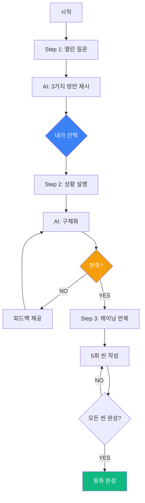

### 대상

- **중학생 1~2학년**: 이 단계만 학습 (3시간)
- **중학생 3학년 이상**: 1단계 후 2단계 진행

---

## 🚀 2단계: 공장(Factory) - 기획자 + 실행자 관점

### 개념

**"나는 실행자다. 내 아이디어를 빠르게 MVP로 만든다."**

**우리는 개발자를 키우지 않습니다.** 4가지 역할을 통해 아이디어를 실행하는 능력을 키웁니다.

### 특징

| 항목 | 내용 |
|------|------|
| **관점** | 기획자 + 실행자 + 디버거 + 성찰자 |
| **집중** | MVP 프로토타입 제작 + 개발 프로세스 이해 |
| **도구** | V0 + FastAPI (바이브 코딩) |
| **태도** | 빠른 실행, 테스트 우선, 성찰 기반 개선 |
| **산출물** | 작동하는 MVP + 개발 경험 |
| **원칙** | **기본 문법만 이해 → 모든 학생이 MVP 완성** |

### 4가지 역할

| 역할 | 활동 | 목표 |
|------|------|------|
| 🎯 **기획자** | 문제 인식, 아이디어 구체화, 기능 정의 | 무엇을 만들지 명확히 |
| 🚀 **실행자** | 바이브 코딩으로 빠른 구현 | MVP 프로토타입 완성 |
| 🔍 **디버거** | 테스트, 문제 발견, 에러 수정 | 작동하는 상태 유지 |
| 💭 **성찰자** | 개선점 분석 (선택) | 알고리즘 확대는 자유 |

**4가지 역할 순환 알고리즘**

```mermaid
graph TB
    Start[프로젝트 시작] --> Phase1[Phase 1: AI 테스트]
    
    Phase1 --> Planning[🎯 기획자]
    Planning --> P1[문제 정의]
    P1 --> P2[기능 목록 작성]
    P2 --> P3[우선순위 결정]
    
    P3 --> Execution[🚀 실행자]
    Execution --> E1[V0에 프롬프트]
    E1 --> E2[UI 코드 생성]
    E2 --> E3[FastAPI 템플릿]
    E3 --> E4[배포]
    
    E4 --> Debug[🔍 디버거]
    Debug --> D1[기능 테스트]
    D1 --> D2{문제 발견?}
    D2 -->|YES| D3[에러 확인]
    D3 --> D4[ChatGPT에 수정 요청]
    D4 --> D1
    D2 -->|NO| Done{완료?}
    
    Done -->|NO| Planning
    Done -->|YES| Reflect[💭 성찰자 선택]
    
    Reflect --> R1[전체 흐름 검토]
    R1 --> R2[개선점 발견]
    R2 --> R3[알고리즘 분석]
    R3 --> End[MVP 완성]
    
    style Planning fill:#3b82f6,color:#fff
    style Execution fill:#10b981,color:#fff
    style Debug fill:#f59e0b,color:#fff
    style Reflect fill:#ef4444,color:#fff
```

### Phase 1: AI 성능 테스트 & 규약 정의 (필수 선행)

**왜 먼저 테스트하는가?**
- AI는 예측 불가능한 결과를 낼 수 있음
- 일관된 출력을 위해 프롬프트 템플릿 필요
- 데이터 구조를 미리 정의해야 개발 가능

**테스트 프로세스**

```mermaid
graph LR
    A[입력 데이터 설계] --> B[10가지 입력 시도]
    B --> C[출력 결과 수집]
    C --> D[일관성 분석]
    D --> E[프롬프트 템플릿 도출]
    E --> F[JSON 스키마 정의]
    F --> G[데이터 흐름도 작성]
    
    style B fill:#ef4444,color:#fff
    style F fill:#10b981,color:#fff
```

**1) 입력-출력 테스트 예시**

```python
# ChatGPT Playground에서 테스트

# 테스트 1: 최소 입력
입력 = {
    "genre": "판타지",
    "protagonist": "토리",
    "theme": "우정"
}

# 테스트 2: 상세 입력
입력 = {
    "genre": "판타지",
    "protagonist": {
        "name": "토리",
        "age": 8,
        "personality": "호기심 많고 용감한",
        "appearance": "작은 여우, 붉은 털"
    },
    "theme": "우정",
    "style": "따뜻하고 감동적인"
}

# 테스트 3~10: 다양한 조합

# 결과 분석
출력_분석 = {
    "text_length": "150~400자 (편차 큼)",
    "character_consistency": "이름은 유지, 성격 가끔 변함",
    "theme_presence": "70% 정도만 테마 명확",
    "image_prompt": "구체적이지만 스타일 일관성 없음"
}
```

**2) 프롬프트 템플릿 도출**

```python
# 10가지 테스트 결과를 바탕으로 템플릿 작성

SCENE_GENERATION_TEMPLATE = """
당신은 어린이 동화 작가입니다.

동화 설정:
- 장르: {genre}
- 주인공: {protagonist_name} ({protagonist_personality})
- 테마: {theme}

{previous_scene_context}

다음 씬을 작성해주세요:
1. 200-300자 분량
2. {protagonist_name}의 성격 유지
3. {theme} 테마가 드러나게
4. 구체적인 행동과 대화 포함

출력 형식 (JSON):
{{
  "text": "씬 내용 (200-300자)",
  "key_emotion": "감정 (한 단어)",
  "image_prompt": "DALL-E용 영문 프롬프트"
}}
"""
```

**3) JSON 스키마 정의**

```typescript
// 테스트 결과를 바탕으로 데이터 구조 확정

interface StoryConfig {
  genre: "판타지" | "SF" | "일상" | "모험";
  protagonist: {
    name: string;
    personality: string;
    appearance?: string;
  };
  theme: "우정" | "용기" | "성장" | "가족" | "환경";
  style?: "따뜻한" | "재미있는" | "감동적인";
}

interface SceneRequest {
  config: StoryConfig;
  previous_scene?: string;
  user_feedback?: string;
}

interface SceneResponse {
  text: string;          // 200-300자
  key_emotion: string;   // 한 단어
  image_prompt: string;  // DALL-E용
  next_options: string[]; // 3개 선택지
}
```

**4) 데이터 흐름도 작성**

```
[사용자 입력]
    ↓
[StoryConfig 생성]
    ↓
[씬 생성 API 호출]
    ↓
[ChatGPT 프롬프트 템플릿 적용]
    ↓
[SceneResponse 받음]
    ↓
[사용자에게 표시]
    ↓
┌───┴───┐
│       │
✓       ✗
다음    수정 요청
↓       ↓
다음    feedback와 함께 재생성
씬      ↓
생성    현재 씬 업데이트
```

### Phase 2: 바이브 코딩으로 MVP 제작

**규약이 정의되었으므로 빠르게 MVP 프로토타입 제작**

바이브 코딩은 **기본 문법만 이해**하고 AI 도구로 빠르게 구현하는 방식입니다. 깊은 코딩 학습은 불필요합니다.

| 역할 | 활동 | 도구 | 시간 |
|------|------|-----|------|
| 🎯 **기획자** | 화면 설계, 기능 정의 | 종이/Figma | 15분 |
| 🚀 **실행자** | UI 생성 + 백엔드 구현 | V0 + FastAPI | 60분 |
| 🔍 **디버거** | 테스트 + 에러 수정 | 브라우저 + 로그 | 30분 |
| 💭 **성찰자** | 개선점 분석 (선택) | - | 15분 |

**핵심**: 
- 🚫 개발자를 키우지 않음
- ✅ 모든 학생이 MVP 완성
- ✅ 개발 프로세스 이해 (기획 → 구현 → 디버깅 → 성찰)

### 목표 & 대상

**목표**:
- ✅ 모든 학생이 **작동하는 MVP** 완성
- ✅ **개발 프로세스** 체험 및 이해
- ✅ AI 시대의 **실행 능력** 습득

**대상**:
- **중학생 3학년 이상**: 1단계 이수 후 진행
- **목표**: 포트폴리오가 아닌 **MVP 제작 경험**
- **선택**: 알고리즘 확대는 개인 자유

---

## 🔄 바이브 코딩의 차별점

### 전통적 코딩 vs 바이브 코딩 알고리즘 비교

```mermaid
graph TB
    subgraph "전통적 코딩 교육 (6개월-1년)"
        TC1[문법 학습] --> TC2[변수, 함수, 조건문]
        TC2 --> TC3[반복문, 배열, 객체]
        TC3 --> TC4[프레임워크 학습]
        TC4 --> TC5[React/Vue 개념]
        TC5 --> TC6[컴포넌트 작성]
        TC6 --> TC7[상태 관리]
        TC7 --> TC8[API 연동]
        TC8 --> TC9[배포]
        TC9 --> TC10[프로젝트 완성]
    end
```
```mermaid
graph TB   
    subgraph "바이브 코딩 (6-12시간)"
        VC1[관점 선택] --> VC2[1단계: 컨텐츠 구상]
        VC2 --> VC3[AI 테스트]
        VC3 --> VC4[규약 정의]
        VC4 --> VC5[V0 프롬프트]
        VC5 --> VC6[MVP 완성]
    end
    
    style TC10 fill:#ef4444,color:#fff
    style VC6 fill:#10b981,color:#fff
```

### 전통적 코딩 교육과의 비교

| 항목 | 전통적 코딩 | 바이브 코딩 |
|------|------------|------------|
| **목표** | 개발자 양성 | 실행자 양성 (아이디어 구현) |
| **시작점** | 문법 학습 | 관점 선택 (작가 or 실행자) |
| **학습 순서** | 문법 → 기초 → 응용 | 기획 → 테스트 → MVP 제작 |
| **코딩 수준** | 깊은 학습 필요 | 기본 문법만 이해 |
| **AI 활용** | 보조 도구 | 핵심 파트너/엔진 |
| **결과물** | 완성도 높은 코드 | 작동하는 MVP |
| **태도** | 모든 것을 내가 작성 | 역할에 맞게 협업 |

### 바이브 코딩의 특징

**1) 관점 기반 학습**
- 같은 프로젝트를 다른 관점에서 접근
- 1단계: 컨텐츠 제작자 (글+이미지만)
- 2단계: 실행자 (기획+구현+디버깅)

**2) 실행자 양성** (2단계 핵심)
- 🚫 **개발자를 키우지 않음**
- ✅ 4가지 역할: 기획자 + 실행자 + 디버거 + 성찰자
- ✅ 모든 학생이 MVP 완성
- ✅ 개발 프로세스 이해

**3) AI 시대의 역량**
- AI가 컨텐츠 분석에 강함
- 인간은 **기획 + 실행**
- 자신의 **아이디어를 구현**하는 능력

**4) 테스트 우선 철학**
- 바로 코딩하지 않음
- AI 성능 먼저 테스트
- 규약 정의 후 빠른 구현

---

## 📚 바이브 코딩 학습 로드맵

```mermaid
graph TB
    START[바이브 코딩 시작]
    
    START --> Q1{관심 분야는?}
    
    Q1 -->|컨텐츠 제작| A[1단계: 장인]
    Q1 -->|개발/기술| A
    
    A --> A1[프롬프트 엔지니어링]
    A1 --> A2[ChatGPT 파트너 협업]
    A2 --> A3[동화 1개 완성]
    
    A3 --> Q2{더 배울까?}
    
    Q2 -->|중1-2| END1[완료]
    Q2 -->|중3 이상| B[2단계: 공장]
    
    B --> B1[관점 전환: 실행자]
    B1 --> B2[기획자: 아이디어 구체화]
    B2 --> B3[실행자: MVP 제작]
    B3 --> B4[디버거: 테스트+수정]
    B4 --> B5[성찰자: 개선 분석 선택]
    
    B5 --> END2[MVP 완성+개발 프로세스 이해]
    
    style A fill:#3b82f6,color:#fff
    style B fill:#10b981,color:#fff
    style END2 fill:#f59e0b,color:#fff
```

---

## 💡 바이브 코딩의 핵심 가치

### For 컨텐츠 제작자 (1단계)

**"AI 시대의 창작자"**

- ✅ AI를 도구가 아닌 **파트너**로 활용
- ✅ 내가 **주도하는** 창작 프로세스
- ✅ 기술보다 **아이디어와 선택**이 중요
- ✅ 3시간 만에 **완성작** 제작

### For 실행자 (2단계)

**"AI 시대의 실행자"**

**우리는 개발자를 키우지 않습니다.** 아이디어를 실행하는 능력을 키웁니다.

- 🚫 **개발자 양성 ✗** → ✅ **실행자 양성 ○**
- ✅ 4가지 역할 체험 (기획자 + 실행자 + 디버거 + 성찰자)
- ✅ **모든 학생이 MVP 완성**
- ✅ **개발 프로세스 이해** (기획 → 구현 → 디버깅 → 성찰)
- ✅ 기본 문법만 이해 (바이브 코딩)
- ✅ AI 시대의 **아이디어 실행 능력**

**왜 중요한가?**
- AI가 컨텐츠 분석에 강함
- 인간은 **기획 + 실행** 역할
- MVP를 만들고 개발 프로세스를 이해하면 AI 역량에 큰 도움

---

네! Mermaid 다이어그램과 표를 통해 구조도와 동작 단계 알고리즘을 시각화하겠습니다. 코드 대신 프로세스 중심으로 재구성하겠습니다.

[27 tools called]

완료했습니다! 바이브 코딩 동화 만들기 커리큘럼 문서를 **코드 중심에서 알고리즘 및 프로세스 도식화 중심**으로 전면 개편했습니다.

## 📊 추가한 Mermaid 다이어그램 & 표

### 1️⃣ **1단계 (장인/컨텐츠 제작자) 프로세스**
- **구조적 체이닝 알고리즘**: 사용자-ChatGPT 간 Sequence 다이어그램
- **의사결정 알고리즘 표**: 6단계 의사결정 프로세스
- **3시간 과정 전체 프로세스**: 열린 질문 → 선택 → 피드백 반복 흐름

### 2️⃣ **2단계 (공장/실행자) Phase 1: AI 테스트**
- **AI 테스트 프로세스 알고리즘**: Flowchart로 테스트 → 분석 → 템플릿 확정
- **AI 테스트 체크리스트 표**: 5가지 항목별 합격 기준 및 조치
- **규약 정의 결과 표**: 입/출력 데이터 타입 및 검증 규칙

### 3️⃣ **2단계 Phase 2: MVP 제작 (4가지 역할)**
- **4가지 역할 프로세스**: 기획자 → 실행자 → 디버거 → 성찰자 Graph
- **4가지 역할 시간 배분 표**: 역할별 활동, 도구, 결과물
- **바이브 코딩 실행 알고리즘**: 학생-V0-ChatGPT-FastAPI Sequence 다이어그램
- **바이브 코딩 vs 전통 코딩 비교 표**: 12배 속도 향상 시각화

### 4️⃣ **심화 프로젝트: 성찰 & 디버깅**
- **씬 생성 알고리즘**: 검증 → ChatGPT → DALL-E Flowchart
- **프롬프트 구성 알고리즘 표**: Early Return 패턴 적용
- **씬 재생성 & 디버깅 알고리즘**: 피드백 반영 프로세스
- **디버깅 체크리스트 알고리즘**: 5단계 검증 Flowchart
- **디버깅 결과 해석 표**: 건강 점수별 조치사항

### 5️⃣ **데이터 구조 & 흐름**
- **Story & Scene 데이터 구조 표**: 필드별 타입, 예시
- **데이터 흐름도**: Story 생성 → Scene 생성 → 피드백 순환

### 6️⃣ **커리큘럼 전체 구조**
- **6시간 과정 관점 전환 프로세스**: 오전(작가) → 점심 → 오후(개발자)
- **12시간 과정 구조**: 3일간 Day별 Graph
- **학습 로드맵**: 나이별 학습 경로 Flowchart

### 7️⃣ **바이브 코딩 정의 섹션**
- **1단계 학습 알고리즘**: 열린 질문 → 선택 → 체이닝 Flowchart
- **4가지 역할 순환 알고리즘**: 역할별 활동 세부 Graph
- **전통 코딩 vs 바이브 코딩 비교**: 학습 경로 비교 Graph (6개월 vs 6시간)

## ✅ 핵심 변경사항

1. **코드 제거**: Python, TypeScript 등 긴 코드 블록 → 알고리즘 다이어그램 대체
2. **프로세스 중심**: 각 단계의 동작 흐름을 Mermaid로 시각화
3. **표 활용**: 체크리스트, 비교, 시간 배분 등을 표로 정리
4. **Early Return 강조**: 알고리즘 패턴을 표로 명확히 표현
5. **역할별 구분**: 4가지 역할(기획-실행-디버그-성찰)을 색상별로 시각화


## 📞 문의

**홈페이지**: https://aimakerlab.com  
**이메일**: vibe-story@aimakerlab.com  
**전화**: 02-XXXX-XXXX

**체험 신청**: [바이브 코딩 동화 만들기 신청하기](https://aimakerlab.com/inquiry)

---

## 📝 문서 정보

**최종 업데이트**: 2025-01-03  
**버전**: 2.0 (동화 만들기 특화)  
**작성자**: AI Maker Lab 교육팀  

**주요 변경 사항**: 
- 기존 웹앱 개발 → 동화 만들기로 전면 개편
- **2단계 관점 기반 학습 체계 확립**
  - 1단계: 컨텐츠 제작자 관점 (글+이미지만)
  - 2단계: **실행자 관점** (기획+실행+디버깅+성찰)
- **핵심 철학**: 
  - 🚫 개발자 양성 ✗ → ✅ 실행자 양성 ○
  - 모든 학생이 MVP 완성 + 개발 프로세스 이해
  - 기본 문법만 이해 (바이브 코딩)
- **4가지 역할**: 기획자 + 실행자 + 디버거 + 성찰자
- **학년별 구분**: 중1-2 (1단계만), 중3-고3 (1단계+2단계)
- 바이브 코딩 정의 및 핵심 개념 체계화

**문서 특징**:
- 관점별로 명확히 구분된 학습 내용
- AI 시대의 실행자 양성 중심
- 실전 예시 코드 및 프롬프트 템플릿 제공
- 단계별 상세 타임라인 및 산출물 명시

