# 맛보기 출장수업: 블록 코딩 AI 비전

## 🎯 Hero Section

**배지**: "손쉽게 시작하는 AI 컴퓨터 비전"  
**타이틀**: "블록 코딩 AI 비전 체험"  
**설명**: "DancingwithAI와 Teachable Machine으로 얼굴/손/사물 인식 게임을 만들어보세요"

### Features

| 아이콘 | 라벨 | 설명 |
|--------|------|------|
| 🎮 | 게임 제작 | 얼굴/손/사물 인식 게임 |
| 🤖 | AI 학습 | Teachable Machine + DWAI |
| 🚀 | 즉시 실행 | 벤치마킹부터 실전까지 |
| 🎨 | 창의성 | 현실 문제 해결 프로젝트 |

---

## 📊 Course Info

| 항목 | 아이콘 | 색상 | 내용 |
|------|--------|------|------|
| 수업 시간 | ⏰ Clock | purple | 3시간 / 6시간 / 12시간 선택 |
| 수강 대상 | 👥 Users | blue | 초등 4~6학년, 중학 1~2학년 |
| 수강 인원 | 👥 Users | blue | 최대 20명 (2인 1팀 가능) |
| 준비물 | 💻 Laptop | green | 웹캠 있는 노트북 (학교 제공) |
| 수업 방식 | 🎯 Target | orange | 3단계 학습법 (벤치마킹→AI학습→게임구현) |
| 교육 목표 | 💡 Lightbulb | red | 개발의 필요성을 체감하는 실전형 교육 |

---

## 📖 과정 소개

### 타이틀
"왜 블록 코딩 AI 비전인가?"

### 내용

블록 코딩 AI 비전 과정은 **"왜 이런 기술이 필요한가?"**를 먼저 이해하고, **현실 세계의 문제를 AI로 해결**하는 경험을 제공하는 실전형 AI 입문 과정입니다.

단순히 도구를 배우는 것이 아니라, **실제 산업 현장의 문제를 발견하고 해결하는 전체 과정**을 체험합니다.

코로나 시대 마스크 인식, 분리수거 자동화, 무인 편의점, 게임 인터랙션 등 **실생활 속 컴퓨터 비전 기술**의 작동 원리를 이해하고 직접 만들어봅니다.

**초등 고학년부터 중학생까지** 수준에 맞는 프로젝트를 제공하며, 벤치마킹부터 구현까지 **개발의 전체 흐름**을 경험합니다.

### 이미지 (3개)
- 실제 산업 AI 비전 사례 (얼굴인식, 자동분류 등)
- 학생들이 마스크 인식/과일 자르기 게임하는 모습
- Teachable Machine + DWAI 연동 화면

---

## 🎓 학습 방법론: 3단계 학습법

### 모든 프로젝트의 기본 구조

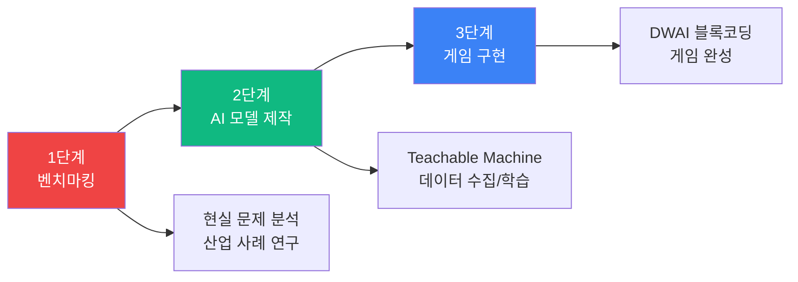

#### 1단계: 벤치마킹 (15-30분)
- **목표**: 배우는 이유와 현실 적용 사례 이해
- **활동**: 
  - 관련 산업 분야 선도 기업/기술 분석
  - 해결하려는 문제 정의
  - 우리가 만들 프로젝트의 가치 토론
- **예시**: 
  - 얼굴 인식 → Apple Face ID, 공항 자동출입국
  - 손 인식 → 닌텐도 스위치, VR 컨트롤러
  - 사물 인식 → 무인 편의점, 자동 분류 시스템

#### 2단계: AI 모델 제작 (30-60분)
- **목표**: Teachable Machine으로 AI 학습시키기
- **활동**:
  - 데이터 수집 (웹캠으로 이미지/동영상 촬영)
  - 클래스별 데이터 학습 (각 30-60초)
  - 모델 테스트 및 개선
  - 모델 내보내기 (업로드 링크 생성)
- **중요**: TM은 **분류(Classification)만 가능**, 위치 추적(Tracking) 불가

#### 3단계: 게임 구현 (60-90분)
- **목표**: DWAI에서 블록 코딩으로 게임 완성
- **활동**:
  - TM 모델 DWAI에 연동
  - 게임 로직 블록 코딩
  - 점수, 효과음, UI 추가
  - 테스트 및 디버깅
- **특징**: DWAI 내장 기능(얼굴/손 Tracking)과 TM 분류 모델 구분 사용

### 전체 학습 경로

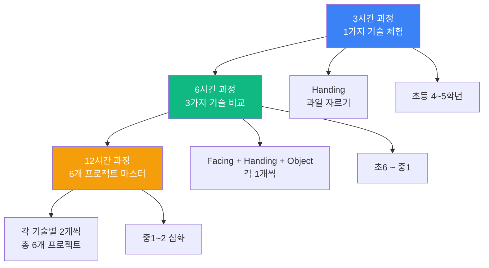

### 3시간 과정: 손 인식 게임 (Handing)

| 단계 | 시간 | 내용 | 3단계 학습법 |
|------|------|------|-------------|
| 1. 벤치마킹 | 15분 | VR 컨트롤러, 닌텐도 스위치 사례 분석 | 1단계 🎯 |
| 2. 체험 | 10분 | 완성된 과일 자르기 게임 플레이 | - |
| 3. AI 모델 제작 | 40분 | DWAI 내장 손 Tracking 이해 및 활용 | 2단계 ⭐⭐ |
| 4. 게임 구현 | 80분 | 블록 코딩으로 과일 자르기 게임 제작 | 3단계 ⭐⭐⭐ |
| 5. 개선 | 30분 | 점수, 효과음, 난이도 추가 | 3단계 ⭐⭐ |
| 6. 발표 | 25분 | 작품 시연 & 피드백 | 🎉 |

**완성 작품**: 과일 자르기 게임 (DWAI 내장 손 Tracking 활용)
**핵심 기술**: Hand Tracking (좌표값 실시간 추적 가능)

### 6시간 과정: 얼굴+손+사물 3종 체험

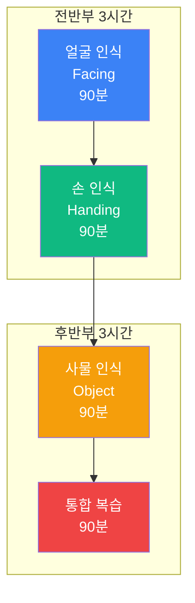

| 세션 | 시간 | 프로젝트 | 기술 구분 | 핵심 도구 |
|------|------|----------|-----------|-----------|
| 1교시 | 90분 | 마스크 착용 인식기 | Facing (TM 분류) | Teachable Machine |
| 2교시 | 90분 | 과일 자르기 게임 | Handing (좌표 추적) | DWAI 내장 Tracking |
| 3교시 | 90분 | 분리수거 게임 | Object (TM 분류) | Teachable Machine |
| 4교시 | 90분 | 종합 복습 및 발전 | 3가지 기술 비교 | - |

**완성 작품**: 얼굴/손/사물 3가지 인식 게임 각 1개씩
**핵심 학습**: TM 분류 vs DWAI Tracking 차이 이해

### 12시간 과정: 컴퓨터 비전 6개 프로젝트 완전 마스터

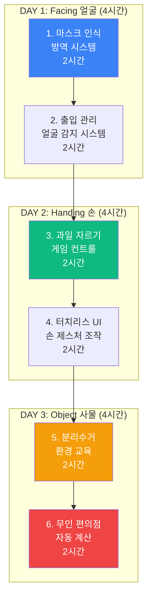

**일정표 (실생활 문제 해결 중심)**

| 차시 | 시간 | 분류 | 프로젝트 | 산업 벤치마킹 | 기술 |
|------|------|------|----------|--------------|------|
| 1차시 | 2시간 | Facing | 마스크 착용 인식기 | 코로나 방역 시스템 | TM 분류 |
| 2차시 | 2시간 | Facing | 출입 관리 시스템 | 공항 자동 출입국 | DWAI + TM |
| 3차시 | 2시간 | Handing | 과일 자르기 게임 | VR/게임 컨트롤러 | DWAI Tracking |
| 4차시 | 2시간 | Handing | 터치리스 UI 조작 | 비접촉 키오스크 | DWAI Tracking |
| 5차시 | 2시간 | Object | 쓰레기 분리수거 | 스마트 쓰레기통 | TM 분류 |
| 6차시 | 2시간 | Object | 무인 편의점 계산 | Amazon Go | TM 분류 |

**완성 작품**: 
- 컴퓨터 비전 프로젝트 6개 (각 기술별 2개씩)
- 포트폴리오 웹사이트
- 프로젝트 발표 자료

---

## 🎮 프로젝트 상세

### 기술 분류 이해

| 기술 | 영문 | 핵심 기능 | 사용 도구 | 추적 가능 | 주요 용도 |
|------|------|-----------|-----------|-----------|-----------|
| 얼굴 인식 | Facing | 얼굴 분류 / 좌표 추적 | TM + DWAI | ⭕ (DWAI만) | 마스크 감지, AR 필터 |
| 손 인식 | Handing | 손 좌표 추적 | DWAI 내장 | ⭕ | 게임 컨트롤, 제스처 |
| 사물 인식 | Object | 물체 분류 | TM | ❌ | 분류, 검색, 계산 |

**중요 구분점**:
- **Teachable Machine (TM)**: 이미지 **분류(Classification)**만 가능, 위치 추적 불가
- **DWAI Tracking**: **좌표값(x, y) 실시간 추적** 가능, 분류는 제한적
- **최적 조합**: TM으로 분류 + DWAI로 추적

---

### 🔵 프로젝트 1: 마스크 착용 인식기 (Facing - TM 분류)

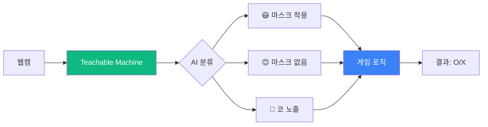

**난이도**: ⭐⭐ (초급)  
**소요 시간**: 2시간  
**대상**: 초등 4학년 ~ 중학 2학년

**1단계: 벤치마킹 (15분)**
- 코로나 시대 마스크 감지 기술 사례
- 공항, 병원, 학교 자동 체크 시스템
- 왜 필요한가? 토론

**2단계: AI 모델 제작 (40분)**
| 클래스 | 촬영 내용 | 시간 |
|--------|-----------|------|
| Class 1 | 마스크 정상 착용 | 30초 |
| Class 2 | 마스크 없음 | 30초 |
| Class 3 | 코 노출 (잘못된 착용) | 30초 |

**3단계: 게임 구현 (60분)**
- TM 모델 DWAI에 연동
- 3가지 상태별 메시지 표시
- 정상 착용 시 점수 +1
- 효과음 및 이미지 추가

**완성 작품**: 마스크 착용 체크 게임
**기대 효과**: TM 분류 원리 이해, 사회 문제 해결 경험

### 🔵 프로젝트 2: 출입 관리 시스템 (Facing - DWAI + TM)

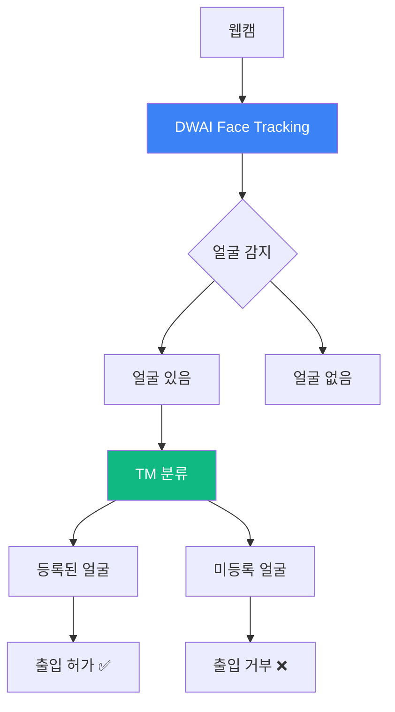

**난이도**: ⭐⭐⭐ (중급)  
**소요 시간**: 2시간  
**대상**: 초등 5학년 ~ 중학 2학년

**1단계: 벤치마킹 (20분)**
- 공항 자동 출입국 시스템
- 아파트 얼굴 인식 출입문
- 회사 출근 기록 시스템
- **핵심 질문**: 왜 카드 대신 얼굴 인식을 사용할까?

**2단계: AI 모델 제작 (45분)**
| 클래스 | 내용 | 촬영 시간 | 각도 |
|--------|------|----------|------|
| Person 1 | 등록자 1 (본인) | 45초 | 정면/좌우 |
| Person 2 | 등록자 2 (친구) | 45초 | 정면/좌우 |
| Person 3 | 등록자 3 (팀원) | 45초 | 정면/좌우 |
| Unknown | 미등록자 | 45초 | 다양한 사람 |

**3단계: 시스템 구현 (50분)**
- DWAI Face Tracking으로 얼굴 감지
- TM 모델로 사람 분류
- 등록자 → 초록 화면 + "출입 허가"
- 미등록자 → 빨강 화면 + "출입 거부"
- 출입 기록 로그 표시

**완성 작품**: 얼굴 인식 출입 관리 시스템
**핵심 기술**: DWAI 감지 + TM 분류 조합
**기대 효과**: 
- 실제 보안 시스템 작동 원리 이해
- 2가지 기술 조합의 필요성 체감

### 🟢 프로젝트 3: 과일 자르기 게임 (Handing - DWAI Tracking)

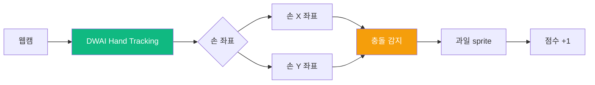

**난이도**: ⭐⭐ (초중급)  
**소요 시간**: 2시간  
**대상**: 초등 4학년 ~ 중학 2학년

**1단계: 벤치마킹 (15분)**
- 닌텐도 스위치 Just Dance
- VR 게임 컨트롤러
- Fruit Ninja 게임 원리

**2단계: Hand Tracking 이해 (30분)**
| 데이터 | 타입 | 활용 |
|--------|------|------|
| 손 X 좌표 | 0~480 | 좌우 움직임 |
| 손 Y 좌표 | 0~360 | 상하 움직임 |
| 손 감지 여부 | true/false | 게임 시작/중지 |

**3단계: 게임 구현 (70분)**
- DWAI Hand Tracking 블록 사용
- 과일 sprite 랜덤 생성
- 손 좌표와 과일 충돌 감지
- 점수 시스템 및 타이머 추가
- 효과음 및 파티클 효과

**완성 작품**: 손으로 조종하는 과일 자르기 게임
**핵심 차이점**: TM 분류 ❌, DWAI 좌표 추적 ⭕
**기대 효과**: 
- 실시간 좌표 기반 게임 로직 이해
- 충돌 감지 알고리즘 체험

---

### 🟢 프로젝트 4: 터치리스 UI 조작 시스템 (Handing - DWAI Tracking)

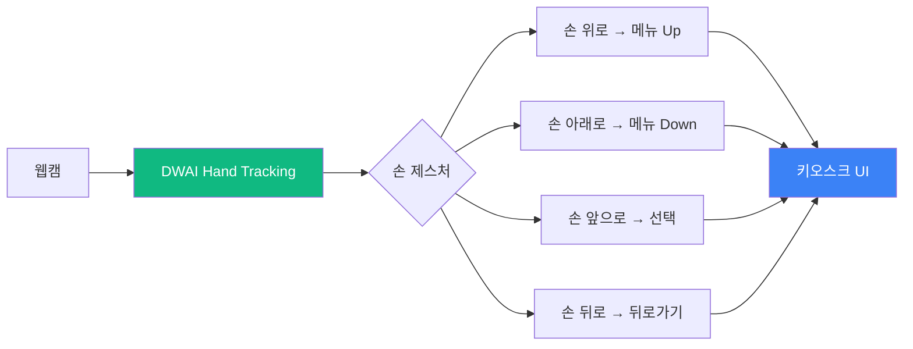

**난이도**: ⭐⭐⭐ (중급)  
**소요 시간**: 2시간  
**대상**: 초등 6학년 ~ 중학 2학년

**1단계: 벤치마킹 (20분)**
- 코로나 이후 비접촉 키오스크
- 병원 대기실 터치리스 시스템
- 엘리베이터 손 제스처 인식
- **핵심 질문**: 왜 터치 대신 손 제스처를 사용할까?

**2단계: 제스처 정의 (40분)**
| 제스처 | 감지 방법 | 기능 | 응용 |
|--------|----------|------|------|
| 위로 쓸기 | 손 Y 좌표 증가 | 위로 스크롤 | 메뉴 이동 |
| 아래로 쓸기 | 손 Y 좌표 감소 | 아래로 스크롤 | 메뉴 이동 |
| 앞으로 밀기 | 손 깊이 값 감지 | 선택 | 클릭 |
| 뒤로 당기기 | 손 깊이 값 증가 | 취소 | 뒤로가기 |

**3단계: 시스템 구현 (55분)**
- DWAI Hand Tracking으로 손 위치 추적
- 제스처별 조건문 작성
- 간단한 메뉴 UI 제작 (음식 주문 등)
- 선택 피드백 (효과음, 애니메이션)
- 실제 키오스크처럼 주문 프로세스 구현

**완성 작품**: 손 제스처로 조작하는 키오스크 시스템
**핵심 기술**: 손 좌표 변화 감지 + 조건문
**기대 효과**: 
- 비접촉 기술의 필요성 이해
- 실제 산업 문제 해결 경험

---

### 🟠 프로젝트 5: 쓰레기 분리수거 게임 (Object - TM 분류)

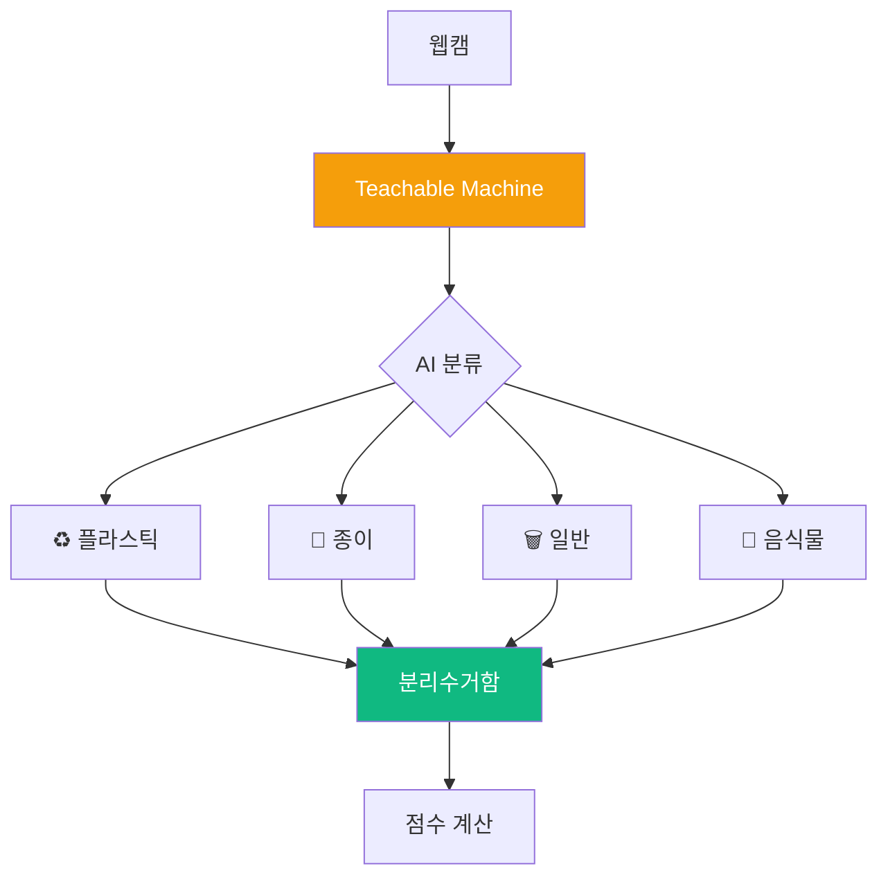

**난이도**: ⭐⭐⭐ (중급)  
**소요 시간**: 2시간  
**대상**: 초등 5학년 ~ 중학 2학년

**1단계: 벤치마킹 (15분)**
- 스마트 쓰레기통 (AI 자동 분류)
- 재활용 센터 자동화 시스템
- 환경 문제 해결 필요성

**2단계: AI 모델 제작 (50분)**
| 클래스 | 예시 물건 | 촬영 시간 | 각도 |
|--------|-----------|----------|------|
| 플라스틱 | 페트병, 컵 | 60초 | 6가지 |
| 종이 | 박스, 신문 | 60초 | 6가지 |
| 일반쓰레기 | 비닐, 스티로폼 | 60초 | 6가지 |
| 음식물 | 과일껍질, 채소 | 60초 | 6가지 |

**3단계: 게임 구현 (50분)**
- TM 모델 DWAI에 연동
- 4가지 분리수거함 UI 제작
- 올바른 분류 시 점수 +10
- 잘못된 분류 시 점수 -5
- 레벨별 시간 제한

**완성 작품**: 쓰레기 분리수거 교육 게임
**핵심 차이점**: TM 분류 ⭕, 위치 추적 ❌
**기대 효과**: 
- 환경 교육 + AI 기술 융합
- 다중 클래스 분류 이해

---

### 🟠 프로젝트 6: 무인 편의점 자동 계산 시스템 (Object - TM 분류)

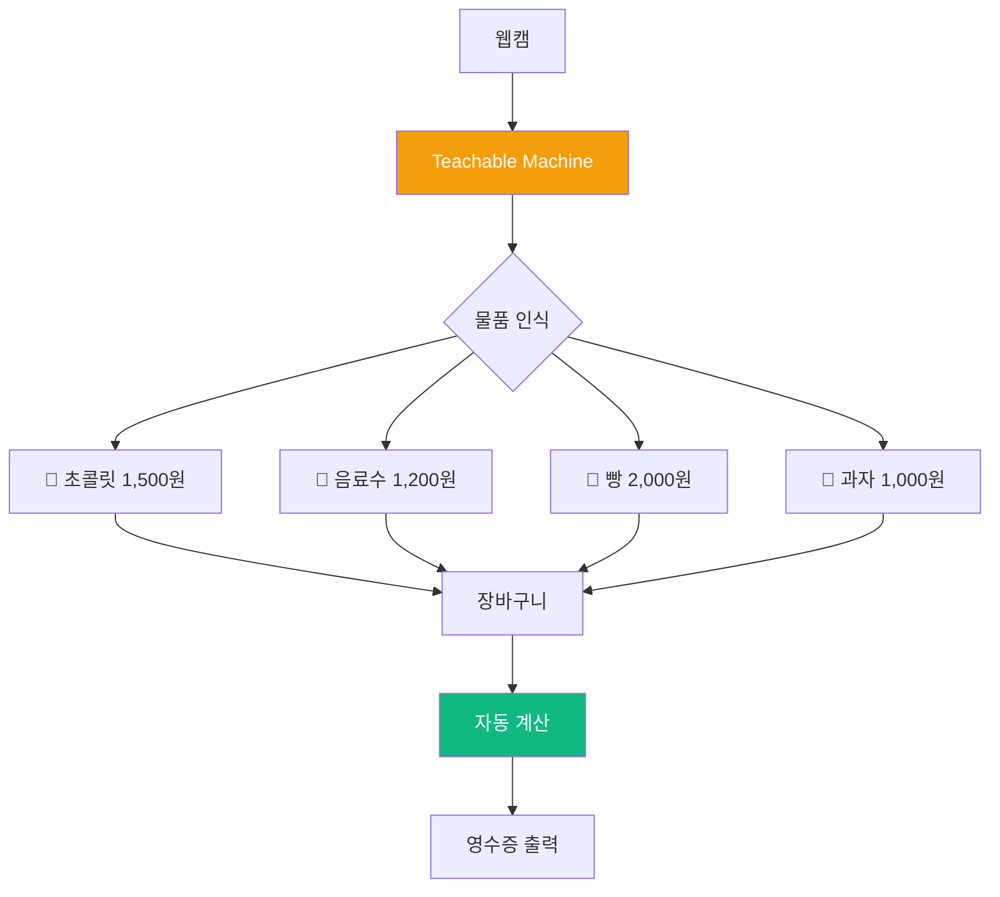

**난이도**: ⭐⭐⭐⭐ (중상급)  
**소요 시간**: 2시간  
**대상**: 초등 6학년 ~ 중학 2학년

**1단계: 벤치마킹 (20분)**
- Amazon Go (무인 편의점)
- 국내 무인 편의점 사례
- 자동 계산대 작동 원리
- **핵심 질문**: 어떻게 물건을 인식하고 계산할까?

**2단계: AI 모델 제작 (50분)**
| 클래스 | 물품 | 가격 | 촬영 시간 | 각도 |
|--------|------|------|----------|------|
| Item 1 | 초콜릿 | 1,500원 | 60초 | 6가지 |
| Item 2 | 음료수 | 1,200원 | 60초 | 6가지 |
| Item 3 | 빵 | 2,000원 | 60초 | 6가지 |
| Item 4 | 과자 | 1,000원 | 60초 | 6가지 |
| Item 5 | 우유 | 2,500원 | 60초 | 6가지 |

**3단계: 시스템 구현 (45분)**
- TM 모델 DWAI에 연동
- 물품 인식 → 장바구니에 추가
- 가격 데이터베이스 (Dictionary) 구현
- 총 금액 자동 계산
- 영수증 UI 표시
- 결제 완료 버튼

**완성 작품**: 무인 편의점 자동 계산 시스템
**핵심 기술**: TM 분류 + 데이터 저장/계산
**기대 효과**: 
- 무인 시스템 작동 원리 완전 이해
- AI + 실제 비즈니스 로직 결합
- 데이터 관리 및 계산 로직 학습

---

## 📚 커리큘럼 상세

### 3시간 과정: Handing 과일 자르기 (빠른 체험)

**목표**: 손 인식 게임 1개 완성 (DWAI Hand Tracking 활용)

**시간표 (3단계 학습법 적용)**

| 시간 | 단계 | 내용 | 활동 | 산출물 |
|------|------|------|------|--------|
| 00:00-00:15 | 1단계 | 벤치마킹 | 닌텐도/VR 게임 사례 분석 | - |
| 00:15-00:30 | - | 체험 | 완성된 과일 자르기 게임 플레이 | - |
| 00:30-01:00 | 2단계 | Hand Tracking 이해 | DWAI 손 좌표 추적 실습 | 이해도 체크 |
| 01:00-02:00 | 3단계 | 게임 구현 | 블록 코딩으로 게임 제작 | 기본 게임 |
| 02:00-02:30 | 3단계 | 개선 | 점수/효과음/난이도 추가 | 완성 작품 |
| 02:30-03:00 | - | 발표 | 작품 시연 & 피드백 | 공유 링크 |

**핵심 학습**:
- ✅ DWAI Hand Tracking (좌표 추적)
- ✅ 충돌 감지 알고리즘
- ✅ 실시간 인터랙션 게임 로직

**준비물**
- 웹캠 있는 노트북 (학생당 1대 또는 2인 1대)
- 인터넷 연결 (안정적인 WiFi 필수)
- 크롬 브라우저 (최신 버전)

**제공 자료**
- DWAI Hand Tracking 튜토리얼
- 과일 자르기 기본 템플릿
- 예시 프로젝트 3종 (초급/중급/고급)

### 6시간 과정: Facing + Handing + Object (3종 체험)

**목표**: 얼굴/손/사물 인식 게임 각 1개씩 완성 + 기술 차이 이해

**일정 구성**

```mermaid
gantt
    title 6시간 과정 일정
    dateFormat HH:mm
    axisFormat %H:%M
    
    section 1부 (3시간)
    오리엔테이션: 09:00, 15m
    Facing 마스크 인식: 09:15, 75m
    Handing 과일 자르기: 10:30, 90m
    
    section 점심 (1시간)
    휴식: 12:00, 60m
    
    section 2부 (3시간)
    Object 분리수거: 13:00, 90m
    기술 비교 정리: 14:30, 60m
    발표: 15:30, 30m
```

**세부 시간표 (3단계 학습법 적용)**

| 교시 | 시간 | 프로젝트 | 1단계 | 2단계 | 3단계 |
|------|------|----------|-------|-------|-------|
| **1교시** | **09:00-10:30** | **Facing 마스크** | | | |
| | 09:00-09:15 | 벤치마킹 | 코로나/공항 사례 | - | - |
| | 09:15-09:45 | AI 학습 | - | TM 3클래스 학습 | - |
| | 09:45-10:30 | 게임 구현 | - | - | DWAI 연동/완성 |
| **2교시** | **10:30-12:00** | **Handing 과일** | | | |
| | 10:30-10:45 | 벤치마킹 | 게임 컨트롤러 사례 | - | - |
| | 10:45-11:15 | Tracking 이해 | - | Hand 좌표 실습 | - |
| | 11:15-12:00 | 게임 구현 | - | - | 충돌 감지 게임 |
| **점심** | **12:00-13:00** | 휴식 | - | - | - |
| **3교시** | **13:00-14:30** | **Object 분리수거** | | | |
| | 13:00-13:15 | 벤치마킹 | 스마트 쓰레기통 | - | - |
| | 13:15-14:00 | AI 학습 | - | TM 4클래스 학습 | - |
| | 14:00-14:30 | 게임 구현 | - | - | 분류 게임 완성 |
| **4교시** | **14:30-16:00** | **종합 정리** | | | |
| | 14:30-15:00 | 기술 비교 | TM vs DWAI Tracking | - | - |
| | 15:00-15:30 | 실생활 활용 | 각 기술의 산업 적용 사례 | - | - |
| | 15:30-16:00 | 발표 | 3개 작품 시연 | - | - |

**핵심 학습 포인트**:
- ✅ **Facing**: TM 분류 (마스크 O/X)
- ✅ **Handing**: DWAI 좌표 추적 (손 x, y)
- ✅ **Object**: TM 분류 (쓰레기 4종)
- ✅ **차이 이해**: 분류 vs 추적

### 12시간 과정: 컴퓨터 비전 6개 프로젝트 완전 마스터

**목표**: 
- Facing 2개 + Handing 2개 + Object 2개
- 총 6개 실생활 문제 해결 프로젝트 완성 + 포트폴리오

**전체 구조 (실생활 문제 중심)**

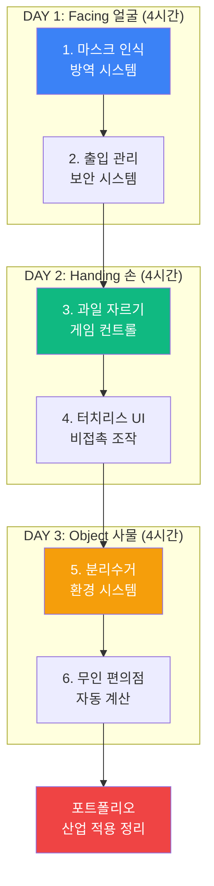

**일차별 계획 (3단계 학습법 + 실생활 문제 해결)**

| 일차 | 주제 | 프로젝트 | 산업 문제 | 1단계 | 2단계 | 3단계 | 시간 |
|------|------|----------|----------|-------|-------|-------|------|
| **1일차** | **Facing** | | | | | | **4시간** |
| | 오리엔테이션 | AI 비전 + 3단계 학습법 | 개발의 필요성 | ✓ | - | - | 30분 |
| | 프로젝트 1 | 마스크 인식기 | 코로나 방역 | 벤치마킹 | TM 학습 | 시스템 구현 | 90분 |
| | 프로젝트 2 | 출입 관리 | 공항/보안 | 벤치마킹 | TM+Track | 시스템 구현 | 90분 |
| | 복습 | 기술 차이 정리 | - | - | - | - | 30분 |
| **2일차** | **Handing** | | | | | | **4시간** |
| | 1일차 리뷰 | Facing 복습 | - | - | - | - | 15분 |
| | 프로젝트 3 | 과일 자르기 | VR/게임 | 벤치마킹 | Hand Track | 게임 구현 | 100분 |
| | 프로젝트 4 | 터치리스 UI | 비접촉 조작 | 벤치마킹 | 제스처 감지 | 키오스크 구현 | 105분 |
| **3일차** | **Object** | | | | | | **4시간** |
| | 2일차 리뷰 | Handing 복습 | - | - | - | - | 15분 |
| | 프로젝트 5 | 분리수거 | 환경 교육 | 벤치마킹 | TM 학습 | 게임 구현 | 90분 |
| | 프로젝트 6 | 무인 편의점 | Amazon Go | 벤치마킹 | TM 학습 | 계산 시스템 | 90분 |
| | 포트폴리오 | 6개 작품 정리 & 발표 | 산업 적용 | - | - | - | 25분 |

**세부 일정 (예시: 1일차 - Facing 얼굴 인식)**

| 시간 | 활동 | 1단계 벤치마킹 | 2단계 AI 학습 | 3단계 구현 | 산출물 |
|------|------|--------------|-------------|-----------|--------|
| 09:00-09:30 | 오리엔테이션 | • 개발이 왜 필요한가? • 3단계 학습법 소개 • 3일 로드맵 | - | - | - |
| 09:30-11:00 | 마스크 인식 | • 공항/병원 방역 시스템 • 왜 필요한가? 토론 | • TM 3클래스 학습 • 모델 테스트 개선 | • DWAI 연동 • 방역 시스템 완성 | 프로젝트 1 |
| 11:00-12:30 | 출입 관리 | • 자동 출입국 시스템 • 보안의 중요성 | • 얼굴 등록 학습 • Tracking + 분류 조합 | • 출입 관리 시스템 • 기록 로그 | 프로젝트 2 |
| 12:30-13:30 | 점심 | - | - | - | - |
| 13:30-14:00 | 복습 | • 실제 산업 적용 사례 정리 | • TM 분류 원리 • DWAI Tracking 원리 • 차이점 명확화 | - | 학습 정리 |

**교육 핵심**:
- ✅ 기술보다 **문제 해결**에 집중
- ✅ **왜 이 기술이 필요한가?** 먼저 이해
- ✅ 실제 산업 사례 벤치마킹
- ✅ 6개의 완성된 실생활 프로젝트

---

## 💰 가격 정책

### 3시간 과정 (Handing 과일 자르기)

| 항목 | 기본 | 프리미엄 |
|------|------|----------|
| 수업 시간 | 3시간 | 3시간 |
| 수강 인원 | 최대 20명 | 최대 20명 |
| 강사 | 1명 | 2명 (메인+보조) |
| 제공 자료 | 디지털 자료 | 디지털 + 워크북 |
| 완성 작품 | 1개 (Hand Tracking 게임) | 1개 + 개인 맞춤 |
| 학습 내용 | 3단계 학습법 체험 | 3단계 학습법 + 심화 |
| 사후 지원 | - | 1주일 온라인 질문 |
| **가격** | **30만원** | **40만원** |

### 6시간 과정 (Facing + Handing + Object)

| 항목 | 기본 | 프리미엄 |
|------|------|----------|
| 수업 시간 | 6시간 (1일) | 6시간 (1일) |
| 수강 인원 | 최대 20명 | 최대 20명 |
| 강사 | 2명 | 2명 + 보조 1명 |
| 제공 자료 | 디지털 자료 | 풀패키지 + USB |
| 완성 작품 | 3개 (Facing/Handing/Object 각 1개) | 3개 + 개인 맞춤 |
| 핵심 학습 | • TM 분류 원리 • DWAI Tracking • 기술 차이 이해 | 기본 + 심화 응용 |
| 사후 지원 | 1주일 | 2주일 + 화상 피드백 |
| 추가 혜택 | - | • 정식 과정 20% 할인 • 포트폴리오 제작 지원 |
| **가격** | **50만원** | **70만원** |

### 12시간 과정 (컴퓨터 비전 완전 마스터)

| 항목 | 기본 | 프리미엄 |
|------|------|----------|
| 수업 시간 | 12시간 (3일, 각 4시간) | 12시간 (3일, 각 4시간) |
| 수강 인원 | 최대 20명 | 최대 20명 |
| 강사 | 2명 | 3명 (메인 2 + 보조 1) |
| 제공 자료 | 디지털 + 워크북 | 풀패키지 + 개인 USB |
| 완성 작품 | • Facing 2개 (방역/보안) • Handing 2개 (게임/UI) • Object 2개 (환경/무인) | 기본 6개 + 추가 창작 3개 |
| 핵심 역량 | • TM vs DWAI 완전 이해 • 3단계 학습법 마스터 • 실생활 문제 해결 능력 | 기본 + 경진대회 수준 |
| 사후 지원 | 2주일 | 1개월 + 월 1회 화상 |
| 추가 혜택 | 정식 과정 10% 할인 | • 정식 과정 30% 할인 • 포트폴리오 웹사이트 • 대회 참가 지원 • 심화 과정 연계 |
| **가격** | **90만원** | **130만원** |

### 단체 할인

| 인원 | 할인율 | 조건 |
|------|--------|------|
| 30명 이상 | 10% | 학교/학원 단체 |
| 50명 이상 | 15% | 2개 반 이상 |
| 100명 이상 | 20% | 학년 전체 등 |

---

## 🎯 교육 효과

### 학습 성과 (개발의 필요성 이해 중심)

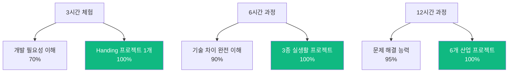

### 역량 성장 비교

| 역량 | 3시간 | 6시간 | 12시간 |
|------|-------|-------|--------|
| **개발 필요성 이해** | ⭐⭐⭐ | ⭐⭐⭐⭐ | ⭐⭐⭐⭐⭐ |
| **벤치마킹 능력** | ⭐⭐ | ⭐⭐⭐⭐ | ⭐⭐⭐⭐⭐ |
| **TM AI 분류** | ❌ | ⭐⭐⭐ | ⭐⭐⭐⭐⭐ |
| **DWAI Tracking** | ⭐⭐⭐ | ⭐⭐⭐⭐ | ⭐⭐⭐⭐⭐ |
| **기술 차이 이해** | ⭐ | ⭐⭐⭐⭐ | ⭐⭐⭐⭐⭐ |
| **실생활 문제 해결** | ⭐⭐ | ⭐⭐⭐ | ⭐⭐⭐⭐⭐ |
| **완성도** | ⭐⭐⭐ | ⭐⭐⭐⭐ | ⭐⭐⭐⭐⭐ |

### 핵심 학습 포인트 (문제 해결 중심)

| 과정 | 벤치마킹 사례 | AI 모델 제작 | 실생활 프로젝트 | 이해 목표 |
|------|--------------|-------------|----------------|-----------|
| **3시간** | VR/게임 컨트롤러 | DWAI Tracking | 과일 자르기 게임 | 좌표 기반 제어 |
| **6시간** | 방역/게임/환경 3가지 | TM 분류 2회 | 마스크/게임/분리수거 | TM vs DWAI 차이 |
| **12시간** | 6가지 산업 시스템 | TM 분류 4회 | 방역/보안/게임/UI/환경/무인 | 각 기술의 적용 분야 |

### 학생 반응 (실제 후기)

**3시간 과정 후:**
> "손으로 과일을 자르는 게 진짜 게임 같아요! 닌텐도보다 재밌어요" - 초등 5학년

> "벤치마킹부터 시작해서 왜 이걸 배우는지 이해가 됐어요" - 초등 6학년

**6시간 과정 후:**
> "TM으로 분류만 하고, DWAI로 좌표 추적하는 차이를 알았어요!" - 중학 1학년

> "마스크 인식, 과일 자르기, 분리수거 게임까지 3개를 하루 만에 만들다니..." - 초등 6학년

> "처음에 벤치마킹으로 실제 회사들을 보니까 배울 이유가 명확했어요" - 중학 1학년

**12시간 과정 후:**
> "6개 프로젝트를 다 만들었어요! 각각 실제로 어디에 쓰이는지 알게 됐어요" - 중학 2학년

> "무인 편의점, 출입 관리 시스템... 이런 게 다 AI로 작동하는 거였구나!" - 중학 1학년

> "3단계 학습법(벤치마킹→AI학습→구현)을 다른 공부에도 쓰고 싶어요" - 중학 2학년

> "TM은 분류만, DWAI는 추적도 된다는 게 신기해요. 각각 언제 쓰는지 알게 됐어요" - 중학 1학년

> "코로나 때 왜 마스크 인식 시스템을 만들었는지 이제 이해가 돼요" - 초등 6학년

---

## 📋 신청 안내

### 신청 절차

1. **상담 신청** (홈페이지 또는 전화)
   - 학생 연령/수준 확인
   - 과정 추천 (3시간/6시간/12시간)
2. **과정 선택** 
   - 3시간: Handing 체험 (초등 4~5학년 추천)
   - 6시간: 3종 기술 체험 (초등 6학년 ~ 중학 1학년 추천)
   - 12시간: 6개 프로젝트 마스터 (중학 1~2학년 추천)
3. **일정 협의** (학교/학원 일정 조율)
4. **계약** (출장 수업 계약서)
5. **수업 진행** (3단계 학습법 적용)
6. **만족도 조사** (사후 피드백)

### 준비사항

**학교/학원에서 준비:**
- 강의실 (20명 수용 가능)
- 프로젝터 또는 대형 TV (벤치마킹 자료 시청용)
- **안정적인 인터넷 연결** (WiFi 필수 - TM/DWAI 사용)
- 책상/의자
- 웹캠 있는 노트북 (학생당 1대 또는 2인 1대)

**AI Maker Lab에서 준비:**
- 전문 강사 (1-3명)
- 3단계 학습법 워크북
- 벤치마킹 사례 자료 (PPT)
- TM / DWAI 튜토리얼
- 백업 노트북 (필요시)
- 교구 (추가 웹캠 등)

### 환불 정책

| 취소 시점 | 환불율 |
|-----------|--------|
| 7일 전 | 100% |
| 3일 전 | 50% |
| 1일 전 | 30% |
| 당일 | 불가 |

---

## 🔬 기술 상세 비교 (FAQ)

### Q1. Teachable Machine(TM)과 DWAI Tracking의 차이는?

| 구분 | Teachable Machine (TM) | DWAI Tracking |
|------|------------------------|---------------|
| **기능** | 이미지 분류 (Classification) | 좌표 추적 (Tracking) |
| **출력** | 클래스 이름 + 확률 (예: "마스크 착용 95%") | X, Y 좌표값 (예: 손 x=245, y=180) |
| **학습** | 필요 (30-60초 촬영) | 불필요 (내장 알고리즘) |
| **위치 추적** | ❌ 불가능 | ⭕ 가능 |
| **다중 클래스** | ⭕ 무제한 가능 | ❌ 제한적 |
| **실시간 속도** | 중간 (모델 크기 영향) | 빠름 |
| **활용 예시** | 마스크 감지, 쓰레기 분류 | 과일 자르기, AR 필터 |

### Q2. 어떤 프로젝트에 어떤 기술을 쓰나요?

| 프로젝트 타입 | 추천 기술 | 이유 |
|--------------|----------|------|
| **분류/판정** (O/X 판단) | TM | "마스크 착용", "플라스틱" 등 클래스 구분 |
| **좌표 제어** (움직임 추적) | DWAI Tracking | 손/얼굴 위치로 게임 오브젝트 조종 |
| **AR 효과** (이미지 따라가기) | DWAI Tracking | 얼굴 위치에 따라 안경/수염 배치 |
| **복합** (분류+추적) | TM + DWAI 조합 | 예: 마스크 분류(TM) + 얼굴 위치(DWAI) |

### Q3. 3단계 학습법을 왜 사용하나요?

**기존 방식의 문제점:**
- 도구만 배우고 "왜 배우는지" 모름
- 실제 활용 사례를 모름
- 단순 따라하기로 끝남

**3단계 학습법의 장점:**

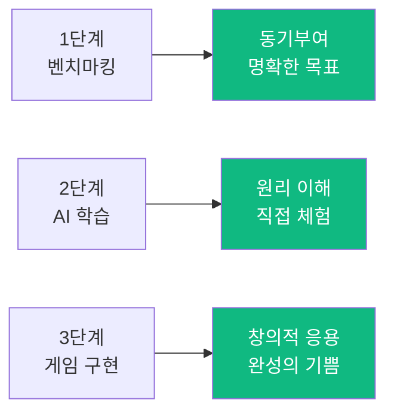

| 단계 | 학습 효과 | 실제 예시 |
|------|----------|-----------|
| 1단계 벤치마킹 | • 배우는 이유 명확화 • 현실 문제 인식 • 산업 트렌드 이해 | Apple Face ID, 무인 편의점 등 실제 사례 분석 |
| 2단계 AI 학습 | • AI 원리 직접 체험 • 데이터의 중요성 • 모델 성능 개선 | TM으로 직접 데이터 수집/학습 |
| 3단계 게임 구현 | • 창의적 문제 해결 • 완성의 성취감 • 포트폴리오 | 나만의 게임 제작 및 발표 |

### Q4. 이 과정은 개발자 교육인가요?

**아니요, "개발의 필요성"을 이해하는 교육입니다.**

| 구분 | 개발자 교육 | 본 과정 (블록 코딩 AI 비전) |
|------|------------|---------------------------|
| 목표 | 코딩 능력 향상 | **개발이 왜 필요한지** 이해 |
| 방식 | 문법/알고리즘 중심 | 실생활 문제 해결 중심 |
| 시작점 | 도구 설명부터 | **벤치마킹**부터 (왜 필요한가?) |
| 결과물 | 연습용 프로그램 | 실제 산업 문제 해결 프로젝트 |
| 학습자 | 개발자 지망생 | 초중고 모든 학생 |

**교육 철학**:
1. **1단계 벤치마킹**: "무인 편의점은 어떻게 작동할까?" → 개발의 필요성 인식
2. **2단계 AI 학습**: "내가 직접 AI를 학습시켜보자" → 기술의 작동 원리 이해
3. **3단계 구현**: "실제로 만들어보자" → 문제 해결 경험

**차별점**:
- ❌ 문법 외우기
- ❌ 단순 따라하기
- ✅ 실제 산업 사례 분석
- ✅ 문제 발견과 해결
- ✅ **다양한 UI와 개발 단계의 작동 원리 이해**

---

## 📞 문의

**홈페이지**: https://aimakerlab.com  
**이메일**: trial@aimakerlab.com  
**전화**: 02-XXXX-XXXX  
**카카오톡**: @aimakerlab

**추천 과정:**
- 초등 4~5학년 → 3시간 과정 (Handing 체험)
- 초등 6학년 ~ 중학 1학년 → 6시간 과정 (3종 기술 체험)
- 중학 1~2학년 → 12시간 과정 (6개 프로젝트 완성)

---

## 📝 문서 정보

**최종 업데이트**: 2025-01-03  
**버전**: 3.1 (초등 4~6학년, 중등 1~2학년 대상)  
**작성자**: AI Maker Lab 교육팀  

**주요 변경사항 (v3.1)**:
- ✅ **대상 연령 명확화**: 초등 4~6학년 + 중학 1~2학년으로 한정
- ✅ **과정별 추천 학년**:
  - 3시간 과정: 초등 4~5학년
  - 6시간 과정: 초등 6학년 ~ 중학 1학년
  - 12시간 과정: 중학 1~2학년
- ✅ 고등학생 대상 제외 (블록 코딩 특성상)

**주요 변경사항 (v3.0)**:
- ✅ 교육 목표 재정립: 개발자 양성 ❌ → **개발의 필요성 이해** ⭕
- ✅ 3단계 학습법 도입 (벤치마킹 → AI 모델 제작 → 실생활 구현)
- ✅ 기술 명확화 (Facing/Handing/Object 구분)
- ✅ TM vs DWAI 차이점 명시 (분류 vs 추적)
- ✅ 앱인벤터 제거 → 컴퓨터 비전 집중
- ✅ 프로젝트 재구성 (실생활 문제 해결 중심):
  - Facing: 마스크 인식(방역), 출입 관리(보안)
  - Handing: 과일 자르기(게임), 터치리스 UI(비접촉)
  - Object: 분리수거(환경), 무인 편의점(자동화)

**교육 철학**:
- 단순 도구 사용법 ❌
- 실제 산업 문제 발견 → 기술 이해 → 해결 경험 ⭕

**다음 단계**: 
1. JSON 변환 (프로젝트별 상세 데이터)
2. 웹사이트 적용
3. 예시 프로젝트 영상 제작
4. 벤치마킹 자료 PPT 제작 (산업 사례 중심)

