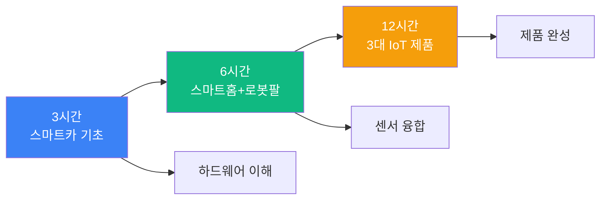
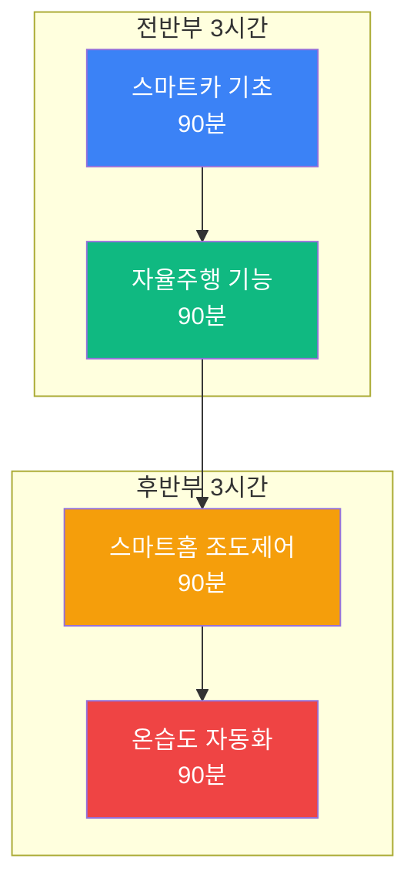
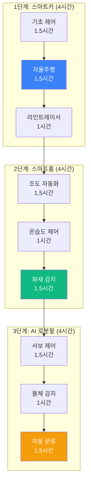
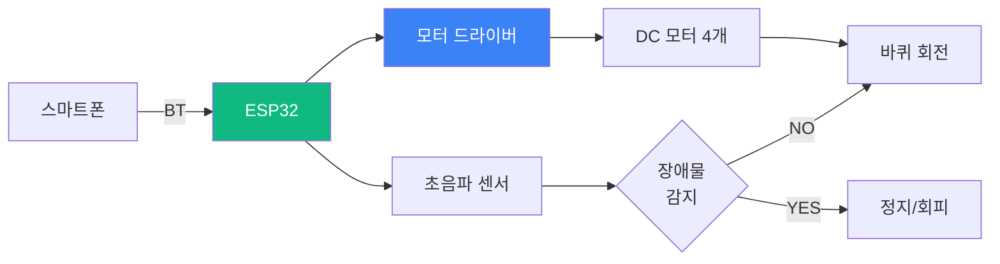
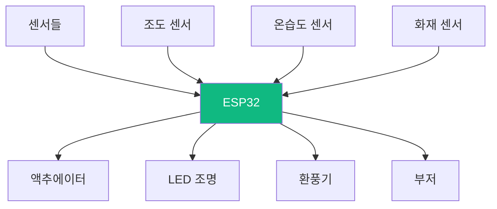
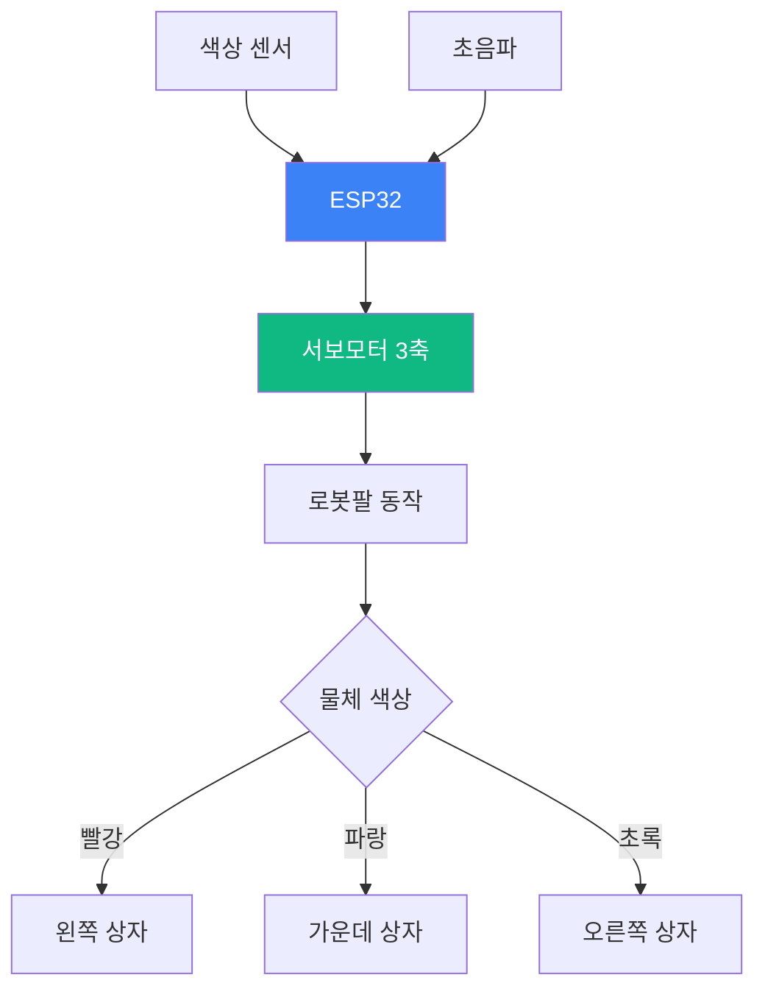
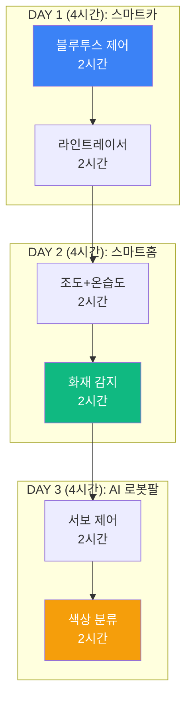
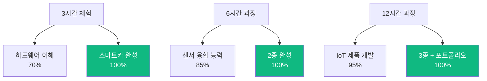

# 맛보기 출장수업: 아두이노 AI (ESP32)

## 🎯 Hero Section

**배지**: "손쉽게 만드는 스마트 IoT 제품"  
**타이틀**: "아두이노 AI 스마트 메이커"  
**설명**: "ESP32로 스마트카, 스마트홈, AI 팔 로봇을 3시간 만에 만들어보세요"

### Features

| 아이콘 | 라벨 | 설명 |
|--------|------|------|
| 🚗 | 스마트카 | 블루투스 제어 자율주행 |
| 🏠 | 스마트홈 | 조도/온습도 자동 제어 |
| 🤖 | AI 로봇 | 서보모터 제어 로봇팔 |
| ⚡ | ESP32 | WiFi+BT 마이크로컨트롤러 |

---

## 📊 Course Info

| 항목 | 아이콘 | 색상 | 내용 |
|------|--------|------|------|
| 수업 시간 | ⏰ Clock | purple | 3시간 / 6시간 / 12시간 선택 |
| 수강 인원 | 👥 Users | blue | 최대 20명 (2인 1팀 권장) |
| 준비물 | 🔧 Wrench | green | ESP32 키트 (제공) |
| 수업 방식 | 🎯 Target | orange | PRIMM 방식 (체험→탐구→수정→창작) |

---

## 📖 과정 소개

### 타이틀
"왜 아두이노 ESP32인가?"

### 내용

아두이노 ESP32는 **WiFi와 블루투스가 내장**된 차세대 마이크로컨트롤러로, 스마트홈부터 자율주행 자동차까지 만들 수 있는 IoT 개발의 핵심 도구입니다.

테슬라의 자율주행, 스마트홈 자동화처럼 우리 생활 속 IoT 기술을 직접 체험하고, 센서와 액추에이터를 연결하여 나만의 스마트 제품을 만듭니다.

**코딩 문법보다는 하드웨어 제어 원리와 센서 데이터 처리 알고리즘**에 집중하며, 이미 작성된 코드를 수정하고 개선하는 메이커 방식으로 진행합니다.

중학생부터 고등학생까지 모두 참여 가능하며, 3시간 만에 작동하는 스마트 제품을 완성하여 집에 가져갈 수 있습니다.

### 이미지 (3개)
- ESP32 보드와 센서 모듈들
- 학생들이 스마트카 조립하는 모습
- 완성된 스마트홈 시스템

---

## 🎓 학습 경로 (Learning Path)

### 전체 구조도



### 3시간 과정: 블루투스 스마트카

| 단계 | 시간 | 내용 | 강조 |
|------|------|------|------|
| 1. 벤치마킹 | 15분 | 자율주행차 사례 & 토론 | 🚗 |
| 2. Predict | 10분 | 완성된 스마트카 체험 | 🎮 |
| 3. Run | 30분 | 하드웨어 조립 & 코드 업로드 | ⭐ |
| 4. Investigate | 20분 | PWM 모터 제어 알고리즘 | 🔍 |
| 5. Modify | 40분 | 속도, 방향, 장애물 회피 | ⭐⭐ |
| 6. Make | 50분 | 나만의 기능 추가 | ⭐⭐⭐ |
| 7. 경주 | 15분 | 스마트카 레이싱 대회 | 🏁 |

**완성 작품**: 블루투스 제어 스마트카 (장애물 회피 기능)

### 6시간 과정: 스마트카 + 스마트홈



| 세션 | 시간 | 프로젝트 | 핵심 기술 |
|------|------|----------|-----------|
| 1교시 | 90분 | 블루투스 스마트카 | PWM 모터 제어 |
| 2교시 | 90분 | 초음파 장애물 회피 | 센서 데이터 처리 |
| 3교시 | 90분 | 조도 센서 자동 조명 | ADC 변환, 릴레이 |
| 4교시 | 90분 | 온습도 자동 환풍기 | DHT22, 조건 제어 |

**완성 작품**: 스마트카 1대 + 스마트홈 시스템 1세트

### 12시간 과정: IoT 제품 3종 완성



**일정표**

| 차시 | 시간 | 단계 | 프로젝트 | 완성도 |
|------|------|------|----------|--------|
| 1차시 | 2시간 | 스마트카 1 | 블루투스 제어 + 장애물 회피 | ⭐⭐⭐ |
| 2차시 | 2시간 | 스마트카 2 | 라인트레이서 + 주차 시스템 | ⭐⭐⭐ |
| 3차시 | 2시간 | 스마트홈 1 | 조도 + 온습도 자동화 | ⭐⭐⭐ |
| 4차시 | 2시간 | 스마트홈 2 | 화재/가스 감지 경보 | ⭐⭐⭐ |
| 5차시 | 2시간 | AI 로봇팔 1 | 3축 서보 제어 + 물체 감지 | ⭐⭐⭐ |
| 6차시 | 2시간 | AI 로봇팔 2 | 색상 인식 자동 분류 | ⭐⭐⭐ |

**완성 작품**: 3대 IoT 제품 + 개인 포트폴리오

---

## 🎮 프로젝트 상세

### 프로젝트 1: 블루투스 스마트카 (3시간 과정 메인)



**난이도**: ⭐⭐ (초급)  
**소요 시간**: 3시간  
**대상**: 중등 1학년 ~ 고등 2학년

**학습 목표**
- ESP32 기본 구조 이해
- PWM 신호로 모터 속도 제어
- 블루투스 시리얼 통신
- 초음파 센서 거리 측정 알고리즘

**제작 단계**

| 단계 | 내용 | 시간 | 도구 |
|------|------|------|------|
| 1. 조립 | 섀시, 모터, 바퀴 조립 | 30분 | 드라이버 |
| 2. 배선 | ESP32 ↔ 모터 드라이버 ↔ 모터 | 20분 | 점퍼선 |
| 3. 코드 업로드 | Arduino IDE로 펌웨어 설치 | 10분 | USB 케이블 |
| 4. 테스트 | 앱으로 전후좌우 제어 | 20분 | 스마트폰 |
| 5. 센서 추가 | 초음파 센서 장착 & 코드 수정 | 30분 | - |
| 6. 개선 | 속도 조절, LED 효과 추가 | 40분 | - |
| 7. 경주 | 장애물 코스 주행 | 10분 | - |

**핵심 알고리즘: PWM 모터 제어**

```cpp
// PWM으로 모터 속도 제어 (0-255)
void moveForward(int speed) {
  analogWrite(MOTOR_LEFT, speed);   // 왼쪽 모터
  analogWrite(MOTOR_RIGHT, speed);  // 오른쪽 모터
}

// 초음파 센서 거리 측정
int getDistance() {
  digitalWrite(TRIG, HIGH);
  delayMicroseconds(10);
  digitalWrite(TRIG, LOW);
  
  long duration = pulseIn(ECHO, HIGH);
  int distance = duration * 0.034 / 2;  // cm로 변환
  return distance;
}

// 장애물 회피 로직
if (getDistance() < 20) {  // 20cm 이내
  stop();
  turnRight();
  delay(500);
}
```

**기대 효과**
- ✅ 하드웨어와 소프트웨어 통합 이해
- ✅ 센서 데이터 기반 의사결정 알고리즘
- ✅ 3시간 만에 집에 가져갈 수 있는 작품

### 프로젝트 2: 스마트홈 자동화 (6시간 과정 포함)



**난이도**: ⭐⭐⭐ (중급)  
**소요 시간**: 90-180분  
**대상**: 중등 2학년 ~ 고등 3학년

**시스템 구성**

| 센서 | 용도 | 임계값 | 액추에이터 |
|------|------|--------|-----------|
| 조도 센서 | 밝기 측정 | < 300 lux | LED ON |
| DHT22 | 온습도 | > 28°C 또는 > 70% | 환풍기 ON |
| MQ-2 | 가스/연기 | > 400 ppm | 부저 + LED |
| PIR | 동작 감지 | HIGH | 조명 ON (30초) |

**제어 로직**

```cpp
void autoControl() {
  // 1. 조도 센서
  int light = analogRead(LIGHT_SENSOR);
  if (light < 300) {
    digitalWrite(LED, HIGH);  // 어두우면 조명 ON
  } else {
    digitalWrite(LED, LOW);
  }
  
  // 2. 온습도 센서
  float temp = dht.readTemperature();
  float humidity = dht.readHumidity();
  if (temp > 28 || humidity > 70) {
    digitalWrite(FAN, HIGH);  // 더우면 환풍기 ON
  } else {
    digitalWrite(FAN, LOW);
  }
  
  // 3. 화재 감지
  int gas = analogRead(GAS_SENSOR);
  if (gas > 400) {
    tone(BUZZER, 1000);  // 경보음
    digitalWrite(RED_LED, HIGH);
  }
}
```

**학습 모드**

| 모드 | 설명 | 시간 |
|------|------|------|
| 체험 | 완성된 스마트홈 시연 | 10분 |
| 조립 | 센서 4종 연결 | 30분 |
| 코딩 | 임계값 수정 | 30분 |
| 확장 | WiFi 웹 서버 추가 | 20분 |

### 프로젝트 3: AI 로봇팔 (12시간 과정 포함)

**난이도**: ⭐⭐⭐⭐ (중상급)  
**소요 시간**: 4시간  
**대상**: 중등 3학년 ~ 고등 3학년

**시스템 구조**



**제어 알고리즘**

```cpp
// 서보 3축 제어 (베이스, 어깨, 팔꿈치)
void moveToPosition(int base, int shoulder, int elbow) {
  servoBase.write(base);
  servoShoulder.write(shoulder);
  servoElbow.write(elbow);
  delay(500);  // 동작 대기
}

// 색상 인식 → 분류
void sortByColor() {
  // 1. 물체 감지 (초음파)
  if (getDistance() < 10) {
    // 2. 색상 인식
    int color = getColor();  // TCS3200 센서
    
    // 3. 위치 이동
    if (color == RED) {
      moveToPosition(30, 45, 90);  // 왼쪽
    } else if (color == BLUE) {
      moveToPosition(90, 45, 90);  // 가운데
    } else if (color == GREEN) {
      moveToPosition(150, 45, 90); // 오른쪽
    }
    
    // 4. 그리퍼 동작
    gripperOpen();
    delay(500);
    gripperClose();
    
    // 5. 원위치
    moveToPosition(90, 90, 90);
  }
}
```

**제작 단계**

| 차시 | 내용 | 산출물 |
|------|------|--------|
| 1차시 (2시간) | 로봇팔 조립 + 수동 제어 | 3축 서보 제어 |
| 2차시 (2시간) | 센서 통합 + 자동 분류 | 색상 인식 분류기 |

---

## 📚 커리큘럼 상세

### 3시간 과정: 빠른 체험

**목표**: 블루투스 스마트카 1대 완성

**시간표**

| 시간 | 내용 | 활동 | 산출물 |
|------|------|------|--------|
| 00:00-00:15 | 오리엔테이션 | 자율주행 사례 & IoT 개요 | - |
| 00:15-00:25 | 체험 (Predict) | 완성 스마트카 조종 | - |
| 00:25-00:55 | 조립 (Run) | 하드웨어 조립 & 배선 | 스마트카 섀시 |
| 00:55-01:05 | 업로드 | 코드 업로드 & 테스트 | 동작 확인 |
| 01:05-01:25 | 이해 (Investigate) | PWM 알고리즘 설명 | 이해도 체크 |
| 01:25-02:05 | 수정 (Modify) | 속도/센서 코드 수정 | 개선된 스마트카 |
| 02:05-02:45 | 창작 (Make) | LED/부저 추가 | 완성 작품 |
| 02:45-03:00 | 경주 | 장애물 코스 레이싱 | 대회 시연 |

**준비물**
- ESP32 스마트카 키트 (학생당 1세트 또는 2인 1세트)
- 노트북 (Arduino IDE 설치)
- USB 케이블
- 배터리

**제공 자료**
- Arduino IDE 설치 가이드
- 예제 코드 (GitHub)
- 회로도 PDF

### 6시간 과정: 2종 제품 완성

**목표**: 스마트카 + 스마트홈 시스템

**일정 구성**

```mermaid
gantt
    title 6시간 과정 일정
    dateFormat HH:mm
    axisFormat %H:%M
    
    section 1부 (3시간)
    오리엔테이션: 09:00, 15m
    스마트카 기초: 09:15, 75m
    자율주행 기능: 10:30, 90m
    
    section 점심 (1시간)
    휴식: 12:00, 60m
    
    section 2부 (3시간)
    스마트홈 조도: 13:00, 90m
    온습도 자동화: 14:30, 90m
```



**세부 시간표**

| 교시 | 시간 | 프로젝트 | 세부 활동 |
|------|------|----------|-----------|
| **1교시** | **09:00-10:30** | **스마트카 기초** | |
| | 09:00-09:15 | 오리엔테이션 | IoT 사례, 목표 설정 |
| | 09:15-09:45 | 조립 | 섀시, 모터, 배선 |
| | 09:45-10:00 | Predict + Run | 체험 + 코드 업로드 |
| | 10:00-10:30 | Modify | 속도, 방향 조절 |
| **2교시** | **10:30-12:00** | **자율주행** | |
| | 10:30-11:00 | Run | 초음파 센서 추가 |
| | 11:00-11:30 | Modify | 장애물 회피 로직 |
| | 11:30-12:00 | Make | LED, 부저 효과 |
| **점심** | **12:00-13:00** | 휴식 | - |
| **3교시** | **13:00-14:30** | **스마트홈 조도** | |
| | 13:00-13:30 | Run | 조도+릴레이 배선 |
| | 13:30-14:00 | Modify | 임계값 조정 |
| | 14:00-14:30 | Make | 타이머 기능 추가 |
| **4교시** | **14:30-16:00** | **온습도 자동화** | |
| | 14:30-15:00 | Run | DHT22 센서 |
| | 15:00-15:30 | Modify | 환풍기 제어 |
| | 15:30-16:00 | 통합 & 발표 | 2종 시연 |

### 12시간 과정: IoT 제품 3종 마스터

**목표**: 스마트카 + 스마트홈 + AI 로봇팔

**전체 구조**



**일차별 계획**

| 일차 | 주제 | 프로젝트 | 시간 배분 |
|------|------|----------|-----------|
| **1일차** | **스마트카** | | **4시간** |
| | 오리엔테이션 | IoT/ESP32 개요 | 30분 |
| | 블루투스 제어 | 기초 주행 | 90분 |
| | 장애물 회피 | 초음파 센서 | 60분 |
| | 라인트레이서 | IR 센서 배열 | 60분 |
| **2일차** | **스마트홈** | | **4시간** |
| | 복습 | 1일차 리뷰 | 15분 |
| | 조도 자동화 | 릴레이 제어 | 60분 |
| | 온습도 제어 | DHT22 + 환풍기 | 60분 |
| | 화재 감지 | MQ-2 + 경보 | 90분 |
| | WiFi 연동 | 웹 서버 | 15분 |
| **3일차** | **AI 로봇팔** | | **4시간** |
| | 복습 | 2일차 리뷰 | 15분 |
| | 로봇팔 조립 | 서보 3축 | 60분 |
| | 수동 제어 | 조이스틱/앱 | 45분 |
| | 색상 인식 | TCS3200 센서 | 45분 |
| | 자동 분류 | 통합 시스템 | 60분 |
| | 포트폴리오 | 3종 정리 & 발표 | 15분 |

**세부 일정 (예시: 1일차)**

| 시간 | 활동 | 내용 | 산출물 |
|------|------|------|--------|
| 09:00-09:30 | 오리엔테이션 | • ESP32 vs Arduino<br/>• IoT 사례<br/>• 3일 로드맵 | - |
| 09:30-11:00 | 블루투스 스마트카 | • 조립 40분<br/>• 코드 업로드 20분<br/>• 제어 테스트 30분 | 스마트카 |
| 11:00-12:00 | 장애물 회피 | • 초음파 센서 추가<br/>• 로직 수정 | 자율 주행 |
| 12:00-13:00 | 점심 | - | - |
| 13:00-14:00 | 라인트레이서 | • IR 센서 배열<br/>• PID 제어 | 라인 추종 |
| 14:00-15:00 | 1일차 마무리 | • 경주 대회<br/>• 피드백 | 시연 영상 |

---

## 💰 가격 정책

### 3시간 과정

| 항목 | 기본 | 프리미엄 |
|------|------|----------|
| 수업 시간 | 3시간 | 3시간 |
| 수강 인원 | 최대 20명 (2인 1팀) | 최대 20명 (1인 1팀) |
| 강사 | 1명 | 2명 (메인+보조) |
| 키트 | 스마트카 (공용 10세트) | 스마트카 (개인 소유) |
| 제공 자료 | 디지털 | 디지털 + 인쇄물 |
| 완성 작품 | 체험 (반납) | 개인 소유 |
| 사후 지원 | - | 1주일 온라인 질문 |
| **가격** | **40만원** | **60만원 + 키트비** |

※ 키트비: 스마트카 1세트 3만원

### 6시간 과정

| 항목 | 기본 | 프리미엄 |
|------|------|----------|
| 수업 시간 | 6시간 (1일) | 6시간 (1일) |
| 수강 인원 | 최대 20명 (2인 1팀) | 최대 20명 (1인 1팀) |
| 강사 | 2명 | 2명 + 보조 1명 |
| 키트 | 스마트카+스마트홈 (공용) | 2종 (개인 소유) |
| 제공 자료 | 디지털 | 풀패키지 + USB |
| 완성 작품 | 2종 (반납) | 2종 (개인 소유) |
| 사후 지원 | 1주일 | 2주일 + 화상 피드백 |
| 추가 혜택 | - | • 정식 과정 20% 할인<br/>• 추가 센서 3종 |
| **가격** | **70만원** | **100만원 + 키트비** |

※ 키트비: 2종 세트 5만원

### 12시간 과정

| 항목 | 기본 | 프리미엄 |
|------|------|----------|
| 수업 시간 | 12시간 (3일, 각 4시간) | 12시간 (3일, 각 4시간) |
| 수강 인원 | 최대 20명 (2인 1팀) | 최대 20명 (1인 1팀) |
| 강사 | 2명 | 3명 (메인 2 + 보조 1) |
| 키트 | 3종 (공용) | 3종 (개인 소유) |
| 제공 자료 | 디지털 + 워크북 | 풀패키지 + 개인 USB |
| 완성 작품 | 3종 (반납) | 3종 + 추가 센서 |
| 사후 지원 | 2주일 | 1개월 + 월 1회 화상 |
| 추가 혜택 | 정식 과정 10% 할인 | • 정식 과정 30% 할인<br/>• 포트폴리오 웹사이트<br/>• 대회 참가 지원 |
| **가격** | **130만원** | **180만원 + 키트비** |

※ 키트비: 3종 세트 10만원

### 단체 할인

| 인원 | 할인율 | 조건 |
|------|--------|------|
| 30명 이상 | 10% | 학교/학원 단체 |
| 50명 이상 | 15% | 2개 반 이상 |
| 100명 이상 | 20% | 학년 전체 등 |

---

## 🎯 교육 효과

### 학습 성과



### 역량 성장 비교

| 역량 | 3시간 | 6시간 | 12시간 |
|------|-------|-------|--------|
| 하드웨어 이해 | ⭐⭐⭐ | ⭐⭐⭐⭐ | ⭐⭐⭐⭐⭐ |
| 센서 활용 | ⭐⭐ | ⭐⭐⭐⭐ | ⭐⭐⭐⭐⭐ |
| 알고리즘 | ⭐⭐ | ⭐⭐⭐ | ⭐⭐⭐⭐⭐ |
| 완성도 | ⭐⭐⭐ | ⭐⭐⭐⭐ | ⭐⭐⭐⭐⭐ |
| 실전 활용 | ⭐⭐ | ⭐⭐⭐ | ⭐⭐⭐⭐⭐ |

### 학생 반응

**3시간 과정 후:**
> "3시간 만에 스마트카를 만들 줄은 몰랐어요!" - 중등 1학년

> "블루투스로 조종하니까 진짜 자율주행차 같아요" - 중등 2학년

**6시간 과정 후:**
> "스마트카도 만들고 스마트홈도 만들었어요. 우리 집에 설치하고 싶어요" - 중등 3학년

> "센서가 이렇게 많은지 몰랐어요. 다 활용해보고 싶어요" - 고등 1학년

**12시간 과정 후:**
> "3일 동안 3개나 만들었어요. 과학 대회에 출전하고 싶어요" - 고등 2학년

> "ESP32가 이렇게 강력한지 몰랐어요. 정식 과정 꼭 듣고 싶어요" - 고등 3학년

---

## 📋 신청 안내

### 신청 절차

1. **상담 신청** (홈페이지 또는 전화)
2. **과정 선택** (3시간/6시간/12시간)
3. **일정 협의** (학교/학원 일정 조율)
4. **계약** (출장 수업 계약서)
5. **키트 발송** (사전 배송 또는 당일 지참)
6. **수업 진행**
7. **만족도 조사** (사후 피드백)

### 준비사항

**학교/학원에서 준비:**
- 강의실 (20명 수용 가능, 전원 콘센트 충분)
- 프로젝터 또는 대형 TV
- 인터넷 연결 (WiFi)
- 테이블 (조립 공간)

**AI Maker Lab에서 준비:**
- 전문 강사 (1-3명)
- ESP32 키트 (10-20세트)
- 노트북 (학생 수 부족 시 백업)
- 모든 수업 자료

### 환불 정책

| 취소 시점 | 환불율 |
|-----------|--------|
| 7일 전 | 100% |
| 3일 전 | 50% |
| 1일 전 | 30% |
| 당일 | 불가 |

---

## 📞 문의

**홈페이지**: https://aimakerlab.com  
**이메일**: trial-arduino@aimakerlab.com  
**전화**: 02-XXXX-XXXX  
**카카오톡**: @aimakerlab

---

## 📝 문서 정보

**최종 업데이트**: 2025-12-30  
**버전**: 1.0  
**작성자**: AI Maker Lab 교육팀  
**다음 단계**: JSON 변환 → 웹사이트 적용

