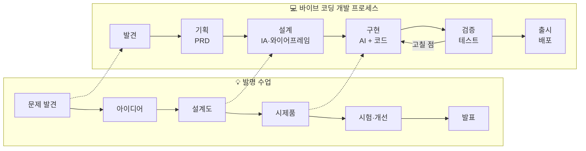
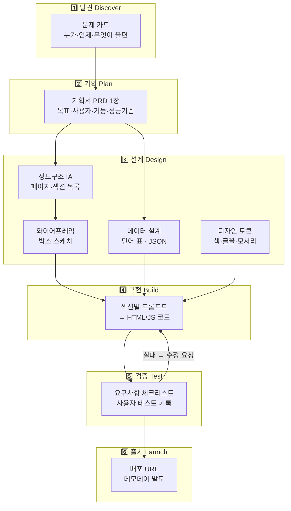
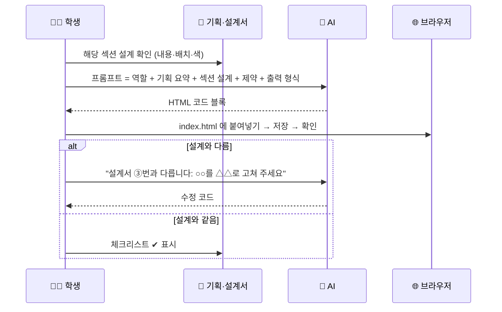
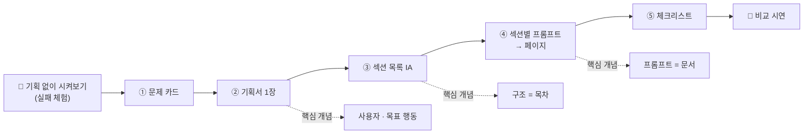
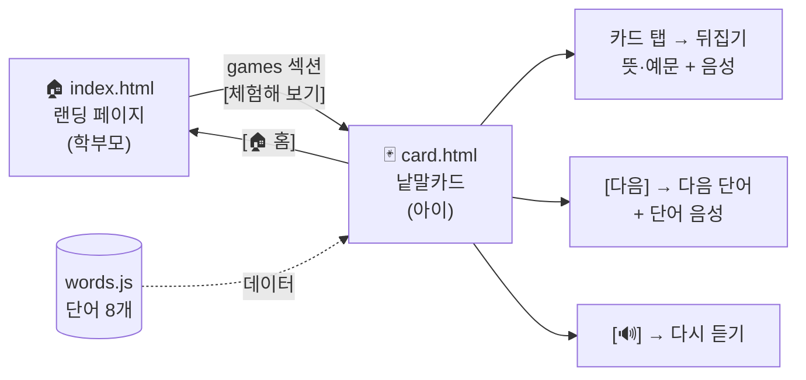
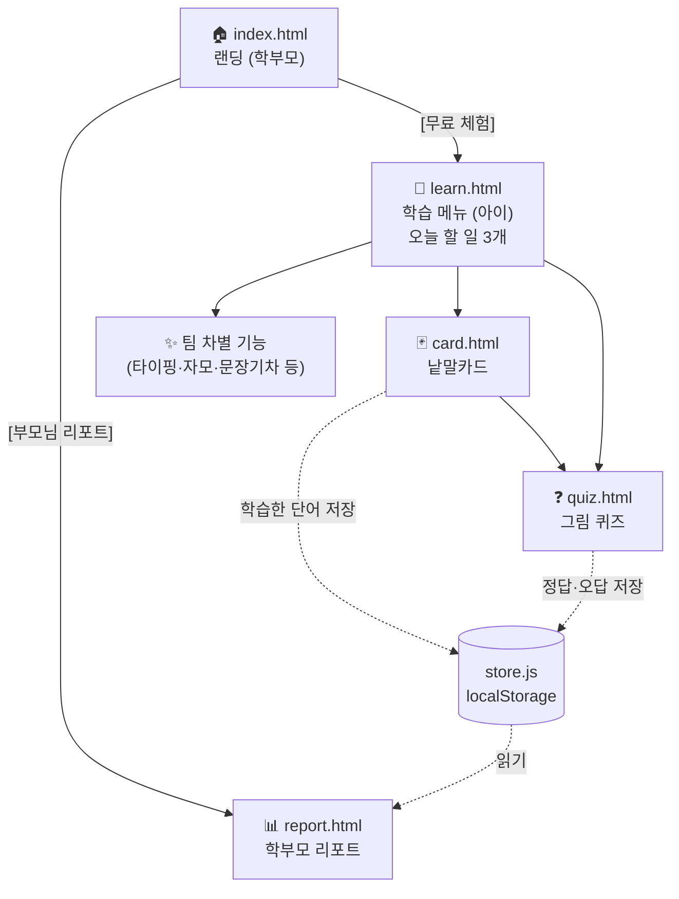
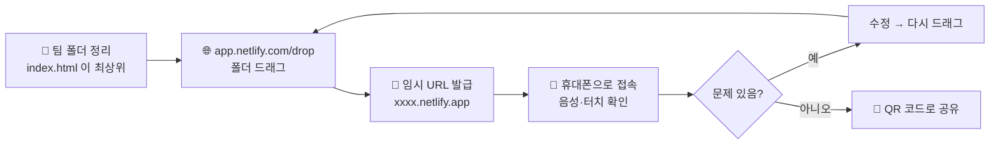
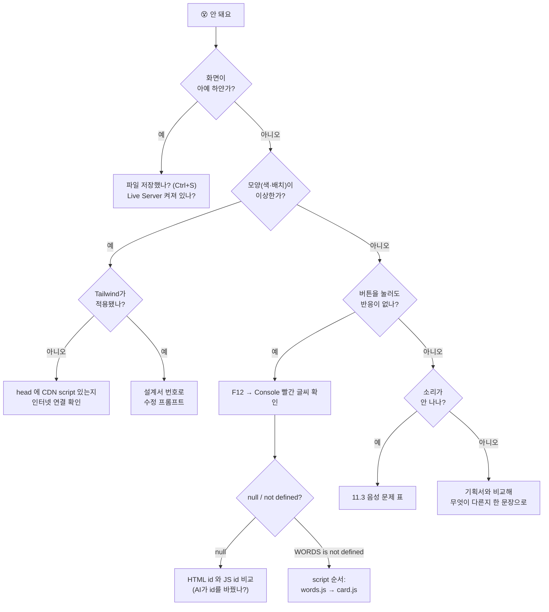

# 바이브 코딩 × 링고팡: 기획·설계부터 프론트 페이지까지, 서비스 개발 프로세스 커리큘럼

> **한 줄 요약**
> 기존 [바이브 코딩](https://aimakerlab.com/curriculum/vive-coding) 과정을 **발명 수업처럼 "문제 발견 → 아이디어 → 설계도 → 시제품 → 시험·개선 → 발표"** 흐름으로 다시 짠 수업이다.
> 실제로 운영 중인 유아·초등 어휘 학습 앱 **링고팡(LingoPang)** 을 주제로 삼아, 학생이 **기획자 → 설계자 → 개발자** 역할을 차례로 맡는다.
> 결과물은 **링고팡 소개 프론트 페이지(랜딩 페이지)** 와 **미니 학습 게임**이며, 3시간 → 6시간 → 12시간 누적형으로 운영한다.
> 핵심은 "AI에게 코드를 시키는 법"이 아니라 **"AI가 정확히 만들 수 있도록 기획서·설계도를 먼저 쓰는 법"** 이다.

| 항목 | 내용 |
|------|------|
| 과정명 | 바이브 코딩 서비스 개발: 링고팡을 내 손으로 기획하고 만들기 |
| 선수 과정 | 없음 (3시간). 6·12시간은 3시간 과정 또는 HTML 기초 경험 권장 |
| 주제 서비스 | 링고팡 (4~9세 어휘력·독서 역량 학습 앱, 5일 학습 사이클 · 20종 학습 게임) |
| 개발 도구 | AI 채팅(Claude / ChatGPT) · VS Code + Live Server · (12h) Cursor 또는 Claude Code |
| 기술 스택 | HTML + Tailwind CSS(CDN) + JavaScript · Web Speech API(TTS) · (12h 선택) Next.js |
| 배포 | (12h) Netlify Drop 드래그 배포 또는 Vercel |
| 수업 구조 | 3시간(기획 + 프론트 페이지) → 6시간(설계 + 첫 게임) → 12시간(팀 서비스 개발 + 배포) |
| 대상 | 3시간: 초5~중2 / 6시간: 초6~중3 / 12시간: 중1~고2 |
| 인원 | 최대 20명 (3시간은 1인 1작품, 6·12시간은 2~3인 1팀) |
| 문서 버전 | v1.0 (2026-10-05) |

---

## 📑 목차

| # | 섹션 | 내용 |
|---|------|------|
| 1 | [기존 과정과의 관계](#1-기존-과정과의-관계) | 무엇이 바뀌는가 |
| 2 | [설계 원칙](#2-설계-원칙) | 발명 수업처럼 가르치는 이유 |
| 3 | [왜 링고팡인가](#3-왜-링고팡인가) | 주제 서비스 소개와 수업용 범위 |
| 4 | [개발 프로세스 전체 구조](#4-개발-프로세스-전체-구조) | 6단계 프로세스·산출물 체인 |
| 5 | [준비물 & 사전 점검](#5-준비물--사전-점검) | 장비·소프트웨어·체크리스트 |
| 6 | [공통 레퍼런스](#6-공통-레퍼런스) | 기획서·설계서 양식·프롬프트·스타터 코드 |
| 7 | [3시간 과정 — 기획하고 페이지 만들기](#7-3시간-과정--기획하고-페이지-만들기) | 기획서 1장 → 랜딩 페이지 |
| 8 | [6시간 과정 — 설계하고 게임 붙이기](#8-6시간-과정--설계하고-게임-붙이기) | 와이어프레임·데이터 설계 → 낱말카드 게임 |
| 9 | [12시간 과정 — 팀 서비스 개발](#9-12시간-과정--팀-서비스-개발) | 역할 분담·스프린트·배포·발표 |
| 10 | [평가 루브릭](#10-평가-루브릭) | 과정별 평가표 |
| 11 | [트러블슈팅](#11-트러블슈팅) | AI 결과물 문제 진단 |
| 12 | [강사 운영 가이드](#12-강사-운영-가이드) | 역할·플랜 B·타임키핑 |
| 13 | [FAQ](#13-faq) | 자주 묻는 질문 |

---

## 1. 기존 과정과의 관계

### 1.1 바뀌는 점

| 구분 | 기존 바이브 코딩 과정 | 본 과정 (링고팡 개발 프로세스) |
|------|---------------------|------------------------------|
| 출발점 | "이런 페이지 만들어줘" 프롬프트 | **"누구의 어떤 문제를 푸는가"** 기획서 |
| 주제 | 자기소개·포트폴리오·동화 등 자유 주제 | **실제 서비스 링고팡** (사용자·기능·데이터가 실존) |
| AI 활용 | 코드 생성 위주 | 기획 검토 → 설계 정리 → 코드 생성 → 리뷰까지 **전 단계** |
| 결과물 | 단일 웹페이지 | **랜딩 페이지 + 학습 게임 + 기획서·설계서 묶음** |
| 평가 기준 | 화면이 나왔는가 | **기획서대로 만들어졌는가 (요구사항 충족률)** |
| 핵심 개념 | HTML·CSS·JS 구조 | + 사용자 페르소나, 요구사항, 정보구조(IA), 와이어프레임, 컴포넌트, 데이터 모델, 테스트 |

### 1.2 발명 수업과 개발 프로세스의 대응

이 과정은 학생이 익숙한 **발명 교육의 사고 흐름** 을 그대로 소프트웨어 개발에 옮겨 놓았다.

| 발명 수업 단계 | 발명 수업에서 하는 일 | 소프트웨어 개발 단계 | 링고팡 수업에서 하는 일 | 산출물 |
|--------------|-------------------|-------------------|---------------------|--------|
| ① 문제 발견 | 생활 속 불편 찾기 | **발견 (Discover)** | 4~9세 아이·학부모의 불편 찾기 | 문제 카드 |
| ② 아이디어 발상 | 더하기·빼기·바꾸기 기법 | **기획 (Plan)** | 해결 기능 고르기, 우선순위 정하기 | 기획서(PRD) 1장 |
| ③ 설계도 | 발명품 스케치·부품표 | **설계 (Design)** | 화면 구조·와이어프레임·데이터 표 | 설계서 |
| ④ 시제품 제작 | 재료로 만들어 보기 | **구현 (Build)** | AI와 함께 HTML·JS 작성 | 동작하는 페이지 |
| ⑤ 시험·개선 | 작동 시험, 고치기 | **검증 (Test)** | 요구사항 체크리스트, 사용자 테스트 | 테스트 기록표 |
| ⑥ 발표·출원 | 발명 발표회, 특허 출원서 | **출시 (Launch)** | 배포 URL 공유, 데모데이 | 배포 링크·발표 |



> 💡 **수업 메시지**: "발명품을 설계도 없이 만들면 부품이 안 맞는다. 프로그램을 기획서 없이 AI에게 시키면 AI가 엉뚱한 걸 만든다."

### 1.3 과정별 결과물 요약

| 과정 | 시간 | 최종 결과물 | 학생이 말할 수 있게 되는 문장 |
|------|------|------------|---------------------------|
| 기획하고 페이지 만들기 | 3h | 링고팡 기획서 1장 + 링고팡 소개 랜딩 페이지 | "제가 쓴 기획서대로 AI가 만들게 했어요" |
| 설계하고 게임 붙이기 | 6h | + 와이어프레임·데이터 설계서 + 음성 낱말카드 게임 | "설계도에 적은 데이터로 게임이 돌아가요" |
| 팀 서비스 개발 | 12h | 팀별 링고팡 미니 서비스 (랜딩 + 게임 2종 + 학습 기록) + 배포 URL + 데모데이 발표 | "우리는 기획·설계·개발·테스트를 나눠서 서비스를 출시했어요" |

---

## 2. 설계 원칙

### 2.1 다섯 가지 원칙

| # | 원칙 | 구체적 내용 |
|---|------|------------|
| 1 | **문서가 먼저, 코드는 나중** | 기획서·설계서 없이 AI에게 코드를 요청하지 않는다. 프롬프트는 문서를 "붙여넣는" 것에서 시작한다 |
| 2 | **실제 서비스를 주제로** | 가상의 앱이 아니라 사용자·기능·데이터가 존재하는 링고팡을 다뤄서 "진짜 기획"을 경험한다 |
| 3 | **작게 만들고 자주 확인** | 한 번에 전체 페이지를 시키지 않고 **섹션 단위** 로 요청 → 브라우저 확인 → 다음 섹션 |
| 4 | **누적형 산출물** | 3h 기획서·페이지 위에 6h는 설계서·게임을, 12h는 팀 기능·배포를 얹는다. 버리는 산출물이 없다 |
| 5 | **AI는 팀원, 판단은 사람** | AI가 만든 결과는 반드시 체크리스트로 검수한다. "AI가 그랬어요"는 답이 아니다 |

### 2.2 왜 프론트 페이지(랜딩 페이지)부터 시작하는가

| 비교 항목 | 랜딩 페이지부터 | 앱 기능(게임)부터 |
|-----------|---------------|-----------------|
| 기획과의 연결 | 기획서 내용(문제·사용자·기능)이 **그대로 페이지 섹션** 이 된다 | 기획 전체보다 기능 하나에 집중하게 됨 |
| 완성 경험 | 3시간 안에 "보여줄 수 있는 결과" 확보 | 로직 오류로 미완성 위험 |
| 학습 개념 | 레이아웃·컴포넌트·반응형 | 상태·이벤트·데이터 |
| 실무 연결 | 실제 스타트업도 **랜딩 페이지로 수요를 먼저 검증** 한다 | — |
| 결론 | **3h 주력** | **6h부터 추가** |

### 2.3 AI 도구를 단계별로 다르게 쓰는 이유

| 개발 단계 | AI 역할 | 학생 역할 | 금지 사항 |
|-----------|--------|----------|----------|
| 발견 | 인터뷰 질문 아이디어 제공 | 실제 문제 고르기 | AI 답을 그대로 문제로 채택 |
| 기획 | 기획서 빈칸 지적, 반대 의견 | 우선순위 결정 | 기능 20개 나열 |
| 설계 | 와이어프레임을 텍스트로 정리, 데이터 표 검토 | 화면 순서·데이터 항목 결정 | 설계 없이 바로 코드 |
| 구현 | 섹션별 코드 작성 | 붙여넣기·실행·수정 요청 | 전체 페이지 한 번에 요청 |
| 검증 | 코드 리뷰, 버그 원인 추측 | 체크리스트로 직접 확인 | "잘 되죠?"로 끝내기 |

---

## 3. 왜 링고팡인가

### 3.1 링고팡 서비스 개요

| 항목 | 내용 |
|------|------|
| 한 줄 소개 | 누리과정·초등과정을 잇는 **4~9세 어휘력·독서 역량 통합 학습 앱** |
| 핵심 방향 | 📚 주제별 학습 · 🗣️ 토론·말하기 중심 · 🤝 학부모 동행 |
| 학습 사이클 | **5일 반복**: 1~3일 새 단어 연습 → 4일 복습 → 5일 응용 |
| 하루 흐름 | 단어 수 선택 → 낱말카드(음성) → 타이핑 → 자모 게임 → 퀴즈·퍼즐 |
| 게임 | 낱말카드·타이핑·자모·쓰기·탭·퀴즈·퍼즐·문장 기차 등 **20종 이상** |
| 콘텐츠 규모 | 한국어 7단계 + 영어 6단계, 약 3만 단어 |
| 특징 | **"멈춤의 미학"** — 영상 대신 그림+음성, 아이가 정한 속도로 학습 |
| 실제 기술 스택 | Next.js + React + Tailwind CSS (수업에서는 HTML+Tailwind CDN으로 단순화) |

### 3.2 수업용으로 좋은 이유

| 이유 | 설명 |
|------|------|
| 사용자가 둘이다 | **아이(학습자)** 와 **학부모(구매·관리자)** — 페르소나 개념을 자연스럽게 배움 |
| 기능이 단계별로 쪼개진다 | 낱말카드 → 퀴즈 → 학습 기록 순서로 난이도를 올릴 수 있음 |
| 데이터가 단순하다 | 단어·이모지·뜻·예문 4~5개 항목이면 게임이 동작 |
| 브라우저 기능만으로 충분 | 음성은 Web Speech API, 저장은 localStorage → 서버 불필요 |
| 학생 자신의 경험과 연결 | 누구나 어릴 때 낱말카드·받아쓰기를 해 봤다 → 공감·아이디어가 쉽게 나옴 |
| 진짜 회사의 기획 문서가 있다 | 강사가 실제 기획 의도·게임 정리 문서를 "정답 비교용"으로 보여줄 수 있음 |

### 3.3 두 명의 사용자 (페르소나)

| 항목 | 👧 아이 페르소나 | 👩 학부모 페르소나 |
|------|---------------|-----------------|
| 이름(예시) | 하윤 (6세, 유치원 7세반) | 하윤 엄마 (38세, 맞벌이) |
| 목표 | 재미있게 놀고 싶다 | 초등 입학 전 어휘·한글 기초를 잡아주고 싶다 |
| 불편 | 글자가 많으면 지루하다, 영상은 금방 질린다 | 앱이 너무 많아 무엇을 골라야 할지 모르겠다, 아이 혼자 두기 불안하다 |
| 환경 | 태블릿, 손가락 터치, 글을 잘 못 읽음 | 퇴근 후 15분, 스마트폰으로 진도 확인 |
| 링고팡에 원하는 것 | 큰 그림·소리·칭찬 | 학습 근거, 하루 15분, 진도 확인 |
| 페이지에서 볼 것 | (랜딩 페이지 대상 아님) → **게임 화면 대상** | **랜딩 페이지 대상** |

> 💡 **수업 포인트**: "랜딩 페이지는 누구를 설득하는 페이지일까?" → 정답은 **학부모**. 게임 화면은 **아이**. 같은 서비스라도 화면마다 사용자가 다르다.

### 3.4 수업에서 다루는 범위

| 링고팡 실제 기능 | 3h | 6h | 12h | 비고 |
|----------------|----|----|-----|------|
| 서비스 소개 랜딩 페이지 | ✅ | ✅ | ✅ | 전 과정 공통 산출물 |
| 낱말카드 (그림+음성) | — | ✅ | ✅ | Web Speech API |
| 단어 퀴즈 (객관식) | — | ⭐ 확장 | ✅ | |
| 타이핑 / 자모 게임 | — | — | 선택 | 팀별 선택 기능 |
| 학습 기록 (오늘 학습한 단어 수) | — | — | ✅ | localStorage |
| 학부모 리포트 화면 | — | — | 선택 | |
| 회원가입·결제·서버 | ❌ | ❌ | ❌ | 범위 밖 (설명만) |

---

## 4. 개발 프로세스 전체 구조

### 4.1 6단계 프로세스와 산출물 체인



| 단계 | 핵심 질문 | 산출물 | 다음 단계에서 쓰이는 곳 |
|------|----------|--------|---------------------|
| 발견 | 누가, 어떤 상황에서, 무엇이 불편한가? | 문제 카드 | 기획서의 "문제" 칸 |
| 기획 | 무엇을 만들고, 무엇을 **안** 만들 것인가? | 기획서(PRD) | IA·데이터 설계의 근거, 프롬프트 첫 문단 |
| 설계 | 어떤 순서로 보이고, 어떤 데이터가 필요한가? | IA·와이어프레임·데이터 표·토큰 | 섹션별 프롬프트의 본문 |
| 구현 | 설계를 AI에게 어떻게 정확히 전달할까? | 코드 파일 | 테스트 대상 |
| 검증 | 기획서에 적은 대로 되는가? | 체크리스트·테스트 기록 | 수정 프롬프트, 발표 근거 |
| 출시 | 누구에게 어떻게 보여줄까? | URL·발표 자료 | 포트폴리오 |

### 4.2 3·6·12시간 프로세스 진화

| 단계 | 3시간 | 6시간 | 12시간 |
|------|-------|-------|--------|
| 발견 | 강사 제공 문제 카드 3장 중 선택 | 짝 인터뷰로 문제 카드 작성 | 팀별 사용자 인터뷰(가족·동생) + 경쟁 앱 비교 |
| 기획 | 기획서 1장 (빈칸 채우기) | 기획서 + 기능 우선순위 (MoSCoW) | 기획서 + 사용자 스토리 + 성공 지표 |
| 설계 | 섹션 목록(IA)만 | + 와이어프레임 + 데이터 표 | + 화면 흐름도 + 컴포넌트 목록 + 디자인 토큰 |
| 구현 | 랜딩 페이지 (섹션 5개) | + 낱말카드 게임 | + 퀴즈 + 학습 기록 + 팀 선택 기능 |
| 검증 | 요구사항 체크 5문항 | + 짝 교차 테스트 | + 사용자 테스트 + 버그 기록 + 접근성 점검 |
| 출시 | 화면 공유 시연 | 팀 시연 | **실제 URL 배포** + 데모데이 |

### 4.3 한 섹션이 만들어지는 과정 (시퀀스)



---

## 5. 준비물 & 사전 점검

### 5.1 학생별 / 팀별 준비물

| 품목 | 수량 | 3h | 6h | 12h | 비고 |
|------|------|----|----|-----|------|
| 노트북 (Windows/Mac, 크롬 브라우저) | 1인 1대 | ✅ | ✅ | ✅ | 크롬 권장 (음성 기능 호환성) |
| 이어폰 | 1인 1개 | — | ✅ | ✅ | 낱말카드 음성 확인, 20명 동시 소리 방지 |
| A4 활동지 (기획서·와이어프레임 양식) | 1인 1세트 | ✅ | ✅ | ✅ | 손으로 먼저 그리고 나서 AI에게 |
| 포스트잇 (3색) | 팀별 1묶음 | ✅ | ✅ | ✅ | 문제 카드·기능 카드·버그 카드 |
| 사인펜 | 1인 1개 | ✅ | ✅ | ✅ | 와이어프레임 박스 그리기 |
| 태블릿 (선택) | 팀별 1대 | — | 선택 | ✅ | 아이 사용자 관점 터치 테스트 |

### 5.2 공용 장비

| 품목 | 수량 | 용도 |
|------|------|------|
| 강사 노트북 + 프로젝터 | 1 | 라이브 시연, 학생 화면 공유 |
| 교실 WiFi (인터넷) | — | AI 채팅, Tailwind CDN 필수 |
| 모바일 핫스팟 (예비) | 1 | 학교 WiFi가 AI 사이트를 차단할 때 |
| USB 메모리 | 2 | 스타터 파일 오프라인 배포 |
| 스피커 | 1 | 데모데이 음성 시연 |

### 5.3 소프트웨어 & 계정

| 소프트웨어 | 설치 위치 | 설정 | 사전 준비 주체 |
|-----------|----------|------|--------------|
| Chrome 브라우저 | 학생 PC | 최신 버전 | 학교/강사 |
| VS Code | 학생 PC | 한국어 팩, **Live Server** 확장 | 강사 (수업 전 설치) |
| AI 채팅 | 브라우저 | Claude 또는 ChatGPT. **만 14세 미만은 강사 계정 + 공용 화면** 으로 운영 | 강사 |
| Cursor 또는 Claude Code | 학생 PC (12h) | 팀 대표 1대에만 설치해도 충분 | 강사 |
| Netlify 계정 | 강사 (12h) | Netlify Drop은 로그인 없이도 임시 배포 가능 | 강사 |
| Node.js 20+ | 강사 PC (12h 선택) | Next.js 트랙 시연용 | 강사 |

> ⚠️ **연령·약관 주의**: AI 서비스 대부분은 이용 연령 제한(예: 만 13세 또는 만 18세 이상, 보호자 동의)이 있다. 초등·중학생 수업은 **강사 계정으로 AI를 대신 실행하거나, 학교가 승인한 교육용 계정** 을 사용한다. 학생 개인정보(이름·학교)를 프롬프트에 넣지 않도록 지도한다.

### 5.4 수업 자료 패키지 (USB 배포 폴더)

```text
AIMAKER_LINGOPANG/
├── 00_guide/
│   ├── 링고팡_서비스_소개.pdf           # 3장 요약본 (강사 배포용)
│   └── 문제카드_샘플.pdf               # 3h 용 문제 카드 3장
├── 01_worksheets/
│   ├── 01_문제카드.pdf
│   ├── 02_기획서_PRD_1장.pdf
│   ├── 03_IA_섹션목록.pdf
│   ├── 04_와이어프레임_격자.pdf
│   ├── 05_데이터설계표.pdf
│   ├── 06_요구사항_체크리스트.pdf
│   └── 07_테스트_기록표.pdf
├── 02_starter/
│   ├── 3h_landing/index.html          # 빈 섹션 주석만 있는 스타터
│   ├── 6h_game/ (index.html, card.html, words.js, card.js)
│   └── 12h_service/ (index.html, card.html, quiz.html, words.js, store.js, style.css)
├── 03_prompts/
│   └── 프롬프트_카드.pdf               # 6.4 프롬프트 패턴 인쇄본
├── 04_assets/
│   ├── 링고팡_로고_색상가이드.png       # 브랜드 색·로고 (수업용 허락 범위 내)
│   └── tailwind-lite.css              # 인터넷 불가 시 CDN 대체용 (플랜 B)
└── 05_answer/
    └── 강사용_완성본/                   # 3h·6h·12h 완성 예시 (막혔을 때 비교용)
```

### 5.5 수업 전날 체크리스트

| # | 점검 항목 | 확인 방법 | ✔ |
|---|----------|----------|---|
| 1 | 모든 PC에 VS Code + Live Server 설치 | `Go Live` 버튼 클릭 → 브라우저 열림 | ☐ |
| 2 | Tailwind CDN 접속 | 스타터 `index.html` 열어 파란 버튼 스타일 적용 확인 | ☐ |
| 3 | AI 채팅 접속 (학교망) | 강사 계정 로그인, 학교 방화벽 차단 여부 | ☐ |
| 4 | 크롬 한국어 음성 | 스타터 `card.html`에서 🔊 클릭 → "사과" 들림 | ☐ |
| 5 | 스타터 폴더 바탕화면 복사 | `AIMAKER_LINGOPANG` 폴더 존재 | ☐ |
| 6 | 활동지 인쇄 | 1인 1세트 + 여분 5세트 | ☐ |
| 7 | (12h) Netlify Drop 테스트 배포 | 완성본 폴더 드래그 → URL 접속 | ☐ |
| 8 | 강사 완성본 시연 리허설 | 랜딩 → 낱말카드 → 퀴즈 순서로 3분 시연 | ☐ |

---

## 6. 공통 레퍼런스

### 6.1 문제 카드 양식 (발견)

| 칸 | 작성 내용 | 예시 |
|----|----------|------|
| 누가 | 구체적인 사람 한 명 | 7살 동생을 둔 맞벌이 엄마 |
| 언제·어디서 | 상황 | 퇴근 후 저녁 8시, 거실 |
| 무엇이 불편 | 행동·감정 | 아이가 한글 공부를 싫어하고, 영상 앱은 30분씩 보게 된다 |
| 지금은 어떻게 해결? | 현재 대안 | 학습지(밀림), 유튜브(통제 어려움) |
| 해결되면 어떤 모습? | 이상적 장면 | 아이가 15분 스스로 하고, 엄마는 "오늘 몇 개 배웠는지"만 확인 |

**3시간 과정용 샘플 문제 카드 (강사 제공)**

| # | 문제 카드 | 연결되는 링고팡 기능 |
|---|----------|------------------|
| A | "아이가 영상 앱만 보고, 글자는 안 본다" | 그림+음성 낱말카드, 멈춤의 미학 |
| B | "학습 앱을 시켜도 뭘 배웠는지 모르겠다" | 학습 기록, 학부모 리포트 |
| C | "단어는 아는데 문장으로 말을 못 한다" | 문장 기차·말하기 활동, 5일차 응용 |

### 6.2 기획서(PRD) 1장 양식

| 항목 | 작성 가이드 | 링고팡 랜딩 페이지 예시 |
|------|-----------|---------------------|
| 프로젝트 이름 | 무엇을 만드는가 | 링고팡 소개 페이지 |
| 해결할 문제 | 문제 카드 한 줄 요약 | 학부모가 어떤 어휘 앱을 골라야 할지 모른다 |
| 대상 사용자 | 페르소나 | 4~9세 자녀를 둔 학부모 |
| 목표 (페이지를 보고 난 뒤 사용자가 할 행동) | 동사 하나 | "무료 체험 시작" 버튼 클릭 |
| 핵심 메시지 | 한 문장 | 하루 15분, 그림과 소리로 말하는 아이로 |
| 꼭 있어야 할 것 (Must) | 3~5개 | 헤드라인+버튼, 특징 3개, 5일 학습 사이클, 게임 소개, 문의/푸터 |
| 있으면 좋은 것 (Should) | 1~3개 | 연령별 단계 표, FAQ |
| 이번엔 안 만드는 것 (Won't) | **반드시 1개 이상** | 로그인, 결제, 실제 앱 다운로드 |
| 분위기 | 형용사 3개 | 밝은, 따뜻한, 믿음직한 |
| 성공 기준 | 측정 가능하게 | 처음 보는 친구가 10초 안에 "무슨 앱인지" 말할 수 있다 |

### 6.3 설계서 양식

#### (1) 정보 구조(IA) — 섹션 목록

| 순서 | 섹션 ID | 섹션 이름 | 들어갈 내용 | 사용자 질문에 답함 |
|------|--------|----------|-----------|----------------|
| 1 | `nav` | 상단 메뉴 | 로고, 메뉴 3개, 체험 버튼 | "여기가 어디지?" |
| 2 | `hero` | 첫 화면 | 헤드라인, 서브카피, CTA 버튼, 대표 이미지(이모지) | "무슨 앱이야?" |
| 3 | `problem` | 공감 | 부모 고민 3가지 | "내 얘기인가?" |
| 4 | `features` | 핵심 특징 | 주제별 학습 · 말하기 중심 · 학부모 동행 | "뭐가 다른데?" |
| 5 | `cycle` | 5일 학습 사이클 | 1~3일 연습 → 4일 복습 → 5일 응용 | "어떻게 배우는데?" |
| 6 | `games` | 게임 소개 | 낱말카드·타이핑·자모·퀴즈 카드 4장 | "아이가 재밌어할까?" |
| 7 | `faq` | 자주 묻는 질문 | 3~5개 | "걱정되는 점은?" |
| 8 | `cta` / `footer` | 마무리 | 체험 버튼 다시, 연락처 | "그럼 시작해 볼까?" |

#### (2) 와이어프레임 표기법 (손그림 → 텍스트)

```text
┌──────────────────────────────────────────────┐
│ [로고 링고팡]        학습법  게임  FAQ  [체험] │  ← nav
├──────────────────────────────────────────────┤
│                                              │
│  하루 15분, 그림과 소리로        ┌────────┐   │
│  "말하는 아이"로                │  🐣📚  │   │  ← hero (좌: 글 / 우: 그림)
│  4~9세 어휘력 학습 앱            └────────┘   │
│  [무료로 시작하기]  [학습법 보기]              │
├──────────────────────────────────────────────┤
│  ┌──────┐   ┌──────┐   ┌──────┐               │
│  │ 📚   │   │ 🗣️   │   │ 🤝   │               │  ← features (카드 3열, 모바일 1열)
│  │주제별│   │말하기│   │부모  │               │
│  └──────┘   └──────┘   └──────┘               │
└──────────────────────────────────────────────┘
```

| 표기 | 의미 |
|------|------|
| `[텍스트]` | 버튼 |
| `┌──┐` 박스 | 카드·이미지 영역 |
| `← 이름` | 섹션 ID |
| `(3열, 모바일 1열)` | 반응형 규칙 |

#### (3) 데이터 설계표 (6h~)

| 필드 | 뜻 | 자료형 | 예시 | 필수 | 어디에 쓰이나 |
|------|----|-------|------|------|-------------|
| `id` | 고유 번호 | 숫자 | 1 | ✅ | 학습 기록 저장 |
| `word` | 단어 | 문자 | 사과 | ✅ | 카드 앞면, 음성 |
| `emoji` | 그림 대신 이모지 | 문자 | 🍎 | ✅ | 카드 앞면 |
| `meaning` | 쉬운 뜻 | 문자 | 빨갛고 동그란 과일 | ✅ | 카드 뒷면, 퀴즈 |
| `sentence` | 예문 | 문자 | 나는 사과를 먹어요. | ✅ | 뒷면 음성 |
| `topic` | 주제 | 문자 | 과일 | ✅ | 주제별 필터 |
| `level` | 단계 | 숫자 | 0 | 선택 | 연령별 필터 (12h) |

#### (4) 디자인 토큰 (링고팡 수업용)

| 토큰 | 값 | Tailwind 클래스 | 용도 |
|------|----|----------------|------|
| 메인 색 | 주황 `#F97316` | `bg-orange-500` | CTA 버튼, 강조 |
| 보조 색 | 하늘 `#0EA5E9` | `bg-sky-500` | 링크, 진행 표시 |
| 배경 | 크림 `#FFF7ED` | `bg-orange-50` | 섹션 배경 |
| 글자 | 진회색 `#1F2937` | `text-gray-800` | 본문 |
| 모서리 | 큰 둥근 모서리 | `rounded-2xl` / `rounded-3xl` | 카드·버튼 (아이 친화) |
| 글꼴 | Pretendard 또는 시스템 기본 | `font-sans` | 전체 |
| 최소 터치 크기 | 48px | `min-h-12` | 아이용 게임 버튼 |

> 💡 토큰을 먼저 정해두면 섹션마다 AI가 다른 색을 쓰는 문제가 사라진다. **모든 프롬프트 끝에 토큰 표를 붙인다.**

### 6.4 프롬프트 패턴: R-C-S-C-O

| 글자 | 의미 | 내용 | 예시 |
|------|------|------|------|
| **R** | Role (역할) | AI에게 맡길 역할 | 너는 유아 교육 서비스 웹 퍼블리셔야 |
| **C** | Context (맥락) | 기획서 요약 | 링고팡은 4~9세 어휘 앱이고, 이 페이지는 학부모를 설득한다 |
| **S** | Spec (설계) | 해당 섹션 설계 | IA 4번 features: 카드 3개, 아이콘·제목·설명 2줄 |
| **C** | Constraint (제약) | 기술·디자인 규칙 | HTML + Tailwind CDN만, 디자인 토큰 준수, 모바일 1열 |
| **O** | Output (출력) | 받고 싶은 형태 | `<section id="features">` 하나만 코드 블록으로 |

**섹션 생성 프롬프트 예시 (features)**

```text
[역할] 너는 유아 교육 서비스의 웹 퍼블리셔야.

[맥락] '링고팡'은 4~9세 어휘력·독서 역량 학습 앱이다.
이 페이지의 사용자는 학부모이고, 목표는 '무료로 시작하기' 클릭이다.
핵심 메시지: "하루 15분, 그림과 소리로 말하는 아이로"

[설계] IA 4번 features 섹션
- 제목: "링고팡이 다른 이유"
- 카드 3개 (아이콘 이모지 / 제목 / 설명 2줄)
  1) 📚 주제별 학습 — 가족·계절·학교처럼 아이 일상 주제로 단어를 익혀요
  2) 🗣️ 말하기 중심 — 외우기를 넘어 말하고 표현하는 힘을 길러요
  3) 🤝 학부모 동행 — 처음 2주는 함께, 이후엔 옆에서 응원해요

[제약]
- HTML + Tailwind CSS(CDN 이미 연결됨)만 사용, JavaScript 없음
- 색: 메인 orange-500, 배경 orange-50, 글자 gray-800, 모서리 rounded-3xl
- PC 3열, 모바일 1열 (grid md:grid-cols-3)

[출력] <section id="features"> ... </section> 하나만 코드 블록으로 줘. 설명은 3줄 이내.
```

**수정 요청 프롬프트 패턴**

| 나쁜 수정 요청 | 좋은 수정 요청 |
|--------------|--------------|
| "이상해요 고쳐줘" | "설계서 IA 4번과 다릅니다. 카드가 4개인데 3개여야 합니다. 마지막 카드를 지워 주세요" |
| "더 예쁘게" | "카드 모서리를 rounded-3xl로, 카드 사이 간격을 gap-8로 바꿔 주세요" |
| "모바일 망가짐" | "화면 폭 375px에서 카드가 가로로 넘칩니다. 모바일에서 1열이 되도록 grid 클래스를 고쳐 주세요" |

### 6.5 3h 스타터: 랜딩 페이지 뼈대

```html
<!doctype html>
<html lang="ko">
<head>
  <meta charset="utf-8" />
  <meta name="viewport" content="width=device-width, initial-scale=1" />
  <title>링고팡 | 하루 15분, 말하는 아이로</title>
  <script src="https://cdn.tailwindcss.com"></script>
</head>
<body class="bg-white text-gray-800 font-sans">

  <!-- ① nav : 로고 + 메뉴 + 체험 버튼 -->
  <nav class="sticky top-0 bg-white/90 backdrop-blur border-b">
    <div class="max-w-5xl mx-auto px-4 h-16 flex items-center justify-between">
      <a href="#" class="text-2xl font-extrabold text-orange-500">링고팡</a>
      <div class="hidden md:flex gap-6 text-sm">
        <a href="#cycle">학습법</a><a href="#games">게임</a><a href="#faq">FAQ</a>
      </div>
      <a href="#cta" class="px-4 py-2 rounded-full bg-orange-500 text-white text-sm font-bold">무료 체험</a>
    </div>
  </nav>

  <!-- ② hero : 여기에 AI가 만든 섹션을 붙여넣기 -->

  <!-- ③ problem -->

  <!-- ④ features -->

  <!-- ⑤ cycle -->

  <!-- ⑥ games -->

  <!-- ⑦ faq -->

  <!-- ⑧ cta + footer -->
  <footer class="py-10 text-center text-sm text-gray-500">
    © 2026 LingoPang 수업용 페이지 · AI메이커랩 바이브 코딩
  </footer>
</body>
</html>
```

| 포인트 | 설명 |
|--------|------|
| 주석 = IA | 스타터의 주석 순서가 곧 설계서 IA 순서 → "설계가 코드의 목차" 체험 |
| nav는 미리 제공 | 첫 성공 경험 + 디자인 토큰 예시 역할 |
| `id` 앵커 | 메뉴 클릭 시 해당 섹션으로 이동 → 섹션 ID를 설계서와 일치시켜야 동작 |

### 6.6 6h 스타터: 단어 데이터 (`words.js`)

```javascript
// words.js — 데이터 설계표(6.3-3)를 그대로 코드로 옮긴 것
const WORDS = [
  { id: 1, word: "사과",   emoji: "🍎", meaning: "빨갛고 동그란 과일",        sentence: "나는 사과를 먹어요.",       topic: "과일", level: 0 },
  { id: 2, word: "바나나", emoji: "🍌", meaning: "길고 노란 과일",            sentence: "원숭이가 바나나를 좋아해요.", topic: "과일", level: 0 },
  { id: 3, word: "포도",   emoji: "🍇", meaning: "작은 알이 송이로 달린 과일",  sentence: "포도는 보라색이에요.",       topic: "과일", level: 0 },
  { id: 4, word: "강아지", emoji: "🐶", meaning: "개의 새끼",                sentence: "강아지가 꼬리를 흔들어요.",  topic: "동물", level: 0 },
  { id: 5, word: "고양이", emoji: "🐱", meaning: "야옹 하고 우는 동물",        sentence: "고양이가 낮잠을 자요.",      topic: "동물", level: 0 },
  { id: 6, word: "토끼",   emoji: "🐰", meaning: "귀가 길고 깡충 뛰는 동물",    sentence: "토끼가 당근을 먹어요.",      topic: "동물", level: 0 },
  { id: 7, word: "기쁘다", emoji: "😊", meaning: "마음이 즐겁고 좋다",         sentence: "선물을 받아서 기뻐요.",      topic: "감정", level: 1 },
  { id: 8, word: "슬프다", emoji: "😢", meaning: "마음이 아프고 눈물이 나려 하다", sentence: "친구가 이사 가서 슬퍼요.",  topic: "감정", level: 1 },
];
```

> 💡 `fetch("words.json")` 대신 `words.js` 로 시작하는 이유: 파일을 더블클릭해서 열어도(`file://`) 동작한다. 12h에서 JSON + 서버 개념으로 넘어간다.

### 6.7 6h 스타터: 낱말카드 게임 (`card.js`)

```javascript
// card.js — card.html 에서 <script src="words.js"></script> 다음에 불러온다
let index = 0;
let flipped = false;

const $emoji    = document.getElementById("emoji");
const $word     = document.getElementById("word");
const $back     = document.getElementById("back");
const $progress = document.getElementById("progress");

// 🔊 브라우저 내장 음성 (Web Speech API)
function speak(text) {
  if (!("speechSynthesis" in window)) return alert("이 브라우저는 음성을 지원하지 않아요");
  speechSynthesis.cancel();
  const u = new SpeechSynthesisUtterance(text);
  u.lang = "ko-KR";
  u.rate = 0.85;           // 아이용으로 조금 느리게
  speechSynthesis.speak(u);
}

function render() {
  const w = WORDS[index];
  $emoji.textContent = w.emoji;
  $word.textContent = w.word;
  $back.textContent = flipped ? `${w.meaning} — "${w.sentence}"` : "카드를 눌러 뜻을 보세요";
  $progress.textContent = `${index + 1} / ${WORDS.length}`;
}

document.getElementById("card").addEventListener("click", () => {
  flipped = !flipped;
  render();
  speak(flipped ? WORDS[index].sentence : WORDS[index].word);
});

document.getElementById("next").addEventListener("click", () => {
  index = (index + 1) % WORDS.length;
  flipped = false;
  render();
  speak(WORDS[index].word);
});

document.getElementById("prev").addEventListener("click", () => {
  index = (index - 1 + WORDS.length) % WORDS.length;
  flipped = false;
  render();
});

document.getElementById("listen").addEventListener("click", () => speak(WORDS[index].word));

render();
```

```html
<!-- card.html 핵심 부분 -->
<main class="min-h-screen bg-orange-50 flex flex-col items-center justify-center gap-6 p-4">
  <p id="progress" class="text-sm text-gray-500"></p>
  <button id="card" class="w-72 h-80 bg-white rounded-3xl shadow-lg flex flex-col items-center justify-center gap-4">
    <span id="emoji" class="text-8xl"></span>
    <span id="word" class="text-4xl font-extrabold"></span>
    <span id="back" class="px-6 text-center text-gray-600"></span>
  </button>
  <div class="flex gap-3">
    <button id="prev"   class="min-h-12 px-5 rounded-full bg-white shadow">◀ 이전</button>
    <button id="listen" class="min-h-12 px-5 rounded-full bg-sky-500 text-white">🔊 듣기</button>
    <button id="next"   class="min-h-12 px-5 rounded-full bg-orange-500 text-white">다음 ▶</button>
  </div>
</main>
<script src="words.js"></script>
<script src="card.js"></script>
```

| 포인트 | 설명 |
|--------|------|
| 카드 전체가 `<button>` | 아이는 작은 버튼을 못 누른다 → 터치 영역 = 카드 전체 |
| `speechSynthesis.cancel()` | 연속 클릭 시 음성이 쌓이지 않도록 |
| `rate = 0.85` | 링고팡의 "멈춤의 미학" — 아이 속도에 맞춤 |
| 데이터와 화면 분리 | `words.js` 만 바꾸면 주제를 바꿀 수 있음 → **데이터 설계의 힘** |

### 6.8 12h 스타터: 퀴즈 + 학습 기록 (`quiz.js`, `store.js`)

```javascript
// store.js — 학습 기록 (localStorage)
const STORE_KEY = "lingopang-progress";

function loadProgress() {
  try {
    return JSON.parse(localStorage.getItem(STORE_KEY)) ?? { learned: [], correct: 0, wrong: 0 };
  } catch {
    return { learned: [], correct: 0, wrong: 0 };
  }
}

function saveProgress(p) {
  try { localStorage.setItem(STORE_KEY, JSON.stringify(p)); } catch { /* 저장 불가 환경 무시 */ }
}

function markLearned(id) {
  const p = loadProgress();
  if (!p.learned.includes(id)) p.learned.push(id);
  saveProgress(p);
}
```

```javascript
// quiz.js — 그림(이모지)을 보고 맞는 단어 고르기 (3지선다)
let current = null;

function shuffle(arr) {
  return [...arr].sort(() => Math.random() - 0.5);
}

function newQuestion() {
  current = WORDS[Math.floor(Math.random() * WORDS.length)];
  const wrongs = shuffle(WORDS.filter(w => w.id !== current.id)).slice(0, 2);
  const choices = shuffle([current, ...wrongs]);

  document.getElementById("q-emoji").textContent = current.emoji;
  document.getElementById("result").textContent = "";
  const box = document.getElementById("choices");
  box.innerHTML = "";
  choices.forEach(c => {
    const b = document.createElement("button");
    b.className = "min-h-12 px-6 py-3 rounded-2xl bg-white shadow text-2xl font-bold";
    b.textContent = c.word;
    b.onclick = () => check(c);
    box.appendChild(b);
  });
  speak("이건 뭘까요?");
}

function check(choice) {
  const p = loadProgress();
  if (choice.id === current.id) {
    p.correct++;
    document.getElementById("result").textContent = "🎉 정답!";
    speak(`정답! ${current.word}`);
    saveProgress(p);
    markLearned(current.id);
    setTimeout(newQuestion, 1500);
  } else {
    p.wrong++;
    saveProgress(p);
    document.getElementById("result").textContent = "다시 생각해 볼까요? 🤔";
  }
}

newQuestion();
```

| 포인트 | 설명 |
|--------|------|
| 틀려도 다음 문제로 넘어가지 않음 | 링고팡 원칙 "왜 틀렸어?"보다 "다시 해보자!" |
| `speak` 재사용 | `card.js` 의 함수를 `common.js` 로 분리하는 **리팩터링 미션** 으로 활용 |
| `localStorage` try/catch | 시크릿 창 등 저장 불가 환경에서도 게임은 동작 |
| `sort(() => Math.random() - 0.5)` | 수업용 간단 섞기. 12h 심화에서 "왜 완벽히 공평하지 않은가?" 토론 → Fisher-Yates로 교체 미션 |

### 6.9 요구사항 체크리스트 양식 (검증)

| # | 요구사항 (기획서에서 복사) | 확인 방법 | 결과 | 안 되면 원인 |
|---|-------------------------|----------|------|------------|
| 1 | 첫 화면에 "무슨 앱인지" 한 문장이 보인다 | 처음 보는 친구에게 10초 보여주기 | ☐ | |
| 2 | 체험 버튼이 2곳 이상 있다 | 눈으로 확인 | ☐ | |
| 3 | 메뉴를 누르면 해당 섹션으로 이동한다 | 메뉴 3개 모두 클릭 | ☐ | |
| 4 | 휴대폰 화면(375px)에서 가로 스크롤이 없다 | 크롬 개발자도구 → 기기 모드 | ☐ | |
| 5 | 색이 디자인 토큰과 같다 | 버튼·배경 색 비교 | ☐ | |
| 6 | (6h) 카드를 누르면 뜻이 보이고 소리가 난다 | 8장 모두 | ☐ | |
| 7 | (12h) 퀴즈 정답 수가 새로고침 후에도 남아 있다 | 정답 → 새로고침 → 기록 확인 | ☐ | |

---

## 7. 3시간 과정 — 기획하고 페이지 만들기

### 7.1 개요

| 항목 | 내용 |
|------|------|
| 목표 | 링고팡 **기획서 1장** 을 쓰고, 그 기획서를 근거로 AI와 함께 **링고팡 소개 랜딩 페이지** 를 완성한다 |
| 핵심 개념 | 사용자(페르소나), 목표 행동(CTA), 기획서, 섹션 구조(IA), 프롬프트 = 문서 붙여넣기 |
| 프로세스 범위 | 발견(간단) → **기획** → 설계(IA만) → **구현** → 검증(체크 5문항) |
| 도구 | AI 채팅 + VS Code(Live Server) + 스타터 `3h_landing/index.html` |
| 결과물 | 기획서 1장 + 섹션 5개 이상 랜딩 페이지 |

### 7.2 시간표

| 시간 | 차시 | 활동 | 산출물 | 강사 포인트 |
|------|------|------|--------|------------|
| 0:00–0:15 | 도입 | 실험: 강사가 AI에게 "링고팡 홈페이지 만들어줘"만 입력 → 결과 보여주기 → "이게 우리가 원한 페이지일까?" | — | 엉뚱한 색·없는 기능·영어 문구 등을 함께 찾는다 → **기획이 필요한 이유** |
| 0:15–0:35 | ① 발견 | 링고팡 서비스 소개(3분) → 페르소나 2명 비교 → 샘플 문제 카드 A/B/C 중 하나 선택 | 문제 카드 | "이 페이지는 누구를 설득할까?" |
| 0:35–1:05 | ② 기획 | 기획서 1장 작성 (6.2 양식). **Won't 칸 필수** | 기획서 | 기능을 많이 쓰는 학생에게 "3개만 남기면?" |
| 1:05–1:15 | ③ 설계 | 스타터 주석을 보며 IA 섹션 순서 확정, 섹션별 한 줄 내용 메모 | IA 표 | 섹션 ID 바꾸지 않기 |
| 1:15–1:25 | 휴식 | | | Live Server 동작 점검 |
| 1:25–2:30 | ④ 구현 | R-C-S-C-O 프롬프트로 **섹션 하나씩** 생성 → 붙여넣기 → 저장 → 확인 (hero → problem → features → cycle → cta) | 랜딩 페이지 | 한 번에 전체 요청 금지. 섹션 하나 끝나면 손 들기 |
| 2:30–2:45 | ⑤ 검증 | 짝과 페이지 바꿔 보기 → 체크리스트 1~5번 | 체크리스트 | "AI가 기획서에 없는 걸 넣었나?" 찾기 |
| 2:45–3:00 | 공유·정리 | 3명 시연 · "기획서 없이" vs "기획서로" 결과 비교 · 회고 | 활동지 | 도입의 엉뚱한 페이지를 다시 띄워 비교 |

### 7.3 3시간 차시 흐름도



### 7.4 섹션별 구현 순서와 프롬프트 요지

| 순서 | 섹션 | 설계 메모 (학생이 기획서에서 가져올 것) | 프롬프트 "설계" 칸 요지 | 확인 포인트 |
|------|------|-----------------------------------|---------------------|-----------|
| 1 | hero | 핵심 메시지, 목표 행동 | 좌: 헤드라인·서브카피·버튼 2개 / 우: 큰 이모지 그림 | 10초 안에 무슨 앱인지 보이나 |
| 2 | problem | 문제 카드 | 부모 고민 3개 말풍선 | 내 문제 카드 내용이 들어갔나 |
| 3 | features | Must 기능 | 카드 3개 (6.4 예시) | PC 3열 / 모바일 1열 |
| 4 | cycle | 링고팡 5일 사이클 | 1~3일 → 4일 → 5일 가로 흐름, 화살표 | 숫자·단계 이름 정확한가 |
| 5 | cta | 목표 행동 반복 | 큰 배경 + 버튼 1개 | 버튼 문구가 hero와 같은가 |
| + | games / faq | Should 기능 | 빨리 끝난 학생만 | — |

### 7.5 학생 활동지 (3h)

| # | 질문 | 학생 답 예시 |
|---|------|------------|
| 1 | 이 랜딩 페이지의 사용자는 누구인가요? | 4~9세 아이를 둔 부모님 |
| 2 | 사용자가 페이지를 보고 해야 할 행동은? | "무료로 시작하기" 버튼 누르기 |
| 3 | 이번에 **만들지 않기로** 한 것은? 왜? | 로그인 — 3시간 안에 못 만들고 페이지 목적과 관계없음 |
| 4 | 기획서 없이 시킨 결과와 무엇이 달랐나요? | 기획서 없이 시키면 영어 문구와 내가 원하지 않은 가격표가 나왔다 |
| 5 | AI에게 수정 요청을 할 때 가장 효과가 있던 말은? | "설계서 3번과 다릅니다, 카드를 3개로" 처럼 번호와 숫자로 말하기 |

### 7.6 3시간 확장 미션 (빨리 끝난 학생)

| 난이도 | 미션 |
|--------|------|
| ⭐ | games 섹션 추가: 낱말카드·타이핑·자모·퀴즈 카드 4장 |
| ⭐⭐ | faq 섹션을 `<details>` 태그로 접고 펴기 |
| ⭐⭐⭐ | 크롬 개발자도구 기기 모드(375px)에서 깨진 곳을 찾아 수정 프롬프트로 고치기 |

---

## 8. 6시간 과정 — 설계하고 게임 붙이기

### 8.1 개요

| 항목 | 내용 |
|------|------|
| 목표 | 3h 랜딩 페이지에 **와이어프레임·데이터 설계** 를 더하고, 설계서를 근거로 **음성 낱말카드 게임** 을 만들어 랜딩 페이지와 연결한다 |
| 핵심 개념 | 와이어프레임, 화면 흐름, 데이터와 화면 분리, 이벤트, 상태(지금 몇 번째 카드?), 아이 사용자 관점 |
| 프로세스 범위 | 발견(인터뷰) → 기획(우선순위) → **설계(와이어프레임·데이터·토큰)** → 구현 → **검증(교차 테스트)** |
| 팀 구성 | 2인 1팀 — 기획·설계 담당 / 구현 담당 (중간에 교대) |
| 구성 | 1–3교시: 3h 과정 압축(2h) / 4–6교시: 설계 + 게임(4h) |
| 결과물 | 랜딩 페이지 + `card.html` 낱말카드 게임 + 설계서(와이어프레임·데이터 표) |

### 8.2 시간표

| 시간 | 차시 | 활동 | 산출물 | 강사 포인트 |
|------|------|------|--------|------------|
| 0:00–0:15 | 도입 | 링고팡 실제 앱 화면 시연(낱말카드 → 퀴즈) · "이 화면은 누가 쓸까?" | — | 랜딩=학부모, 게임=아이 |
| 0:15–0:40 | ① 발견·기획 | 짝 인터뷰 ("어릴 때 낱말 공부 어땠어?") → 문제 카드 → 기획서 1장 | 기획서 | 3h 양식 그대로, 시간 단축 |
| 0:40–1:00 | ② MoSCoW 우선순위 | 기능 카드 10장(강사 제공)을 Must/Should/Could/Won't 로 분류 | 우선순위 보드 | 8.4 참고 |
| 1:00–1:50 | ③ 랜딩 구현 | 3h ③④ 압축: 섹션 4개 (hero·features·cycle·cta) | 랜딩 페이지 | 프롬프트 카드 활용으로 속도 ↑ |
| 1:50–2:00 | 휴식 | | | |
| 2:00–2:40 | ④ 와이어프레임 | 낱말카드 화면을 **손으로** 3안 스케치 → 하나 선택 → 텍스트 와이어프레임으로 옮기기 | 와이어프레임 | 아이 손가락 크기(48px) 고려 |
| 2:40–3:10 | ⑤ 데이터 설계 | 데이터 설계표 작성 → 팀 주제 단어 8개 선정 (동물·과일·감정·학교 등) → `words.js` 작성 (AI로 변환) | `words.js` | **표 → 코드** 변환을 AI에게 맡기는 경험 |
| 3:10–3:20 | 휴식 | | | |
| 3:20–4:20 | ⑥ 게임 구현 | 스타터 `card.js` 이해 → 와이어프레임대로 `card.html` 화면을 AI와 수정 → 음성 확인 | 낱말카드 게임 | 8.5 프롬프트 사용 |
| 4:20–4:50 | ⑦ 연결 | 랜딩 페이지 games 섹션 "체험해 보기" 버튼 → `card.html` 링크 · 게임 화면에 "홈으로" 버튼 | 2페이지 서비스 | 화면 흐름도(8.3) 확인 |
| 4:50–5:00 | 휴식 | | | |
| 5:00–5:35 | ⑧ 교차 테스트 | 다른 팀 게임을 **6살 아이처럼** 사용해 보기 → 테스트 기록 → 수정 1회 | 테스트 기록표 | "글을 못 읽는다면?" 관점 |
| 5:35–6:00 | 발표·정리 | 팀별 1분 시연 + "설계서에서 바뀐 점" 발표 | 활동지 | 루브릭 자기평가 |

### 8.3 6시간 화면 흐름도



### 8.4 MoSCoW 우선순위 활동

| 기능 카드 (강사 제공 10장) | 학생 분류 예시 | 이유 (학생 작성) |
|------------------------|-------------|---------------|
| 카드 앞면: 그림 + 단어 | **Must** | 이것 없으면 낱말카드가 아님 |
| 카드 누르면 뜻 보기 | **Must** | 학습 핵심 |
| 단어 소리 듣기 | **Must** | 글 못 읽는 6살도 쓸 수 있어야 함 |
| 다음/이전 버튼 | **Must** | |
| 진행 표시 (3/8) | Should | 끝이 보여야 아이가 버팀 |
| 예문 소리 듣기 | Should | 말하기 중심 방향 |
| 주제 고르기 (동물/과일) | Could | 시간 남으면 |
| 별 스티커 보상 | Could | |
| 부모님 알림 | Won't | 서버 필요 |
| 회원가입 | Won't | 범위 밖 |

> 💡 **수업 포인트**: Must가 6개를 넘으면 시간 안에 못 만든다. "Must는 이것만 있어도 쓸 수 있는 최소한" — 이것이 **MVP(최소 기능 제품)**.

### 8.5 게임 화면 수정 프롬프트 예시

```text
[역할] 너는 4~9세 아이용 학습 게임을 만드는 프론트엔드 개발자야.

[맥락] 링고팡 낱말카드 화면이다. 사용자는 글을 잘 못 읽는 6살 아이다.
card.js 와 words.js 는 이미 있고 바꾸지 않는다.
card.js 는 id가 card, emoji, word, back, progress, prev, next, listen 인 요소를 사용한다.

[설계] 와이어프레임
- 맨 위: 왼쪽 [🏠 홈] 버튼(index.html 링크), 가운데 진행 표시(progress)
- 가운데: 큰 카드 (이모지 아주 크게, 단어, 뒷면 설명)
- 아래: [◀ 이전] [🔊 듣기] [다음 ▶] 버튼 3개, 가로 정렬

[제약]
- HTML + Tailwind CDN, 위 id 들은 반드시 그대로 유지
- 모든 버튼 최소 높이 48px(min-h-12), 글자 크기 text-xl 이상
- 색: 배경 orange-50, 다음 버튼 orange-500, 듣기 버튼 sky-500, 카드 rounded-3xl

[출력] card.html 전체 코드 하나. 스크립트는 words.js → card.js 순서로 body 끝에.
```

| 프롬프트 포인트 | 왜 필요한가 |
|---------------|-----------|
| "id 들은 반드시 유지" | AI가 id를 바꾸면 `card.js` 가 요소를 못 찾아 아무 반응이 없다 → **설계서 = 약속** |
| "바꾸지 않는다" 명시 | AI가 잘 동작하는 JS까지 새로 쓰는 것을 방지 |
| 사용자 설명 포함 | 버튼 크기·글자 크기를 AI가 스스로 키운다 |

### 8.6 6시간 활동지 핵심 질문

| # | 질문 | 기대 답변 |
|---|------|----------|
| 1 | 랜딩 페이지와 게임 화면의 사용자는 각각 누구인가? | 랜딩=학부모, 게임=아이 |
| 2 | `words.js` 만 바꾸면 무엇이 달라지나? | 화면 코드는 그대로인데 주제(단어)가 바뀐다 → 데이터와 화면 분리 |
| 3 | AI가 `id` 를 바꿔 버리면 어떤 일이? | 버튼을 눌러도 반응이 없다. 설계서의 이름이 코드의 약속이다 |
| 4 | 교차 테스트에서 발견한 문제와 원인은? | 버튼이 작아 잘못 눌림 → 설계 문제(터치 크기) |
| 5 | 와이어프레임을 먼저 그려서 좋았던 점은? | AI에게 "어디에 무엇을" 정확히 말할 수 있었다 |

### 8.7 6시간 확장 미션

| 난이도 | 미션 |
|--------|------|
| ⭐ | 마지막 카드에서 "다 했어요! 🎉" 축하 화면 보이기 |
| ⭐⭐ | 주제 버튼(동물/과일/감정)으로 해당 `topic` 단어만 보기 — 데이터 설계표의 `topic` 이 왜 필요했는지 체험 |
| ⭐⭐⭐ | 카드 뒤집기 애니메이션 (CSS `transform: rotateY`) — 아이 관점에서 꼭 필요한지 토론 후 결정 |

---

## 9. 12시간 과정 — 팀 서비스 개발

### 9.1 개요

| 항목 | 내용 |
|------|------|
| 목표 | 팀이 **링고팡의 새 버전(미니 서비스)** 을 기획·설계·개발·테스트하고 **실제 URL로 배포** 해 데모데이에서 발표한다 |
| 핵심 개념 | 사용자 스토리, 화면 흐름, 컴포넌트 재사용, 상태 저장(localStorage), 스프린트, 버그 관리, 배포, (선택) Next.js 구조 |
| 팀 구성 | 3인 1팀 — **PM(기획)** · **디자이너(설계)** · **개발자(구현)**, 일차마다 역할 교대 |
| 운영 | 4일 × 3시간 또는 2일 × 6시간 |
| 결과물 | 랜딩 페이지 + 게임 2종(낱말카드 + 퀴즈 or 팀 선택) + 학습 기록 + 배포 URL + 기획·설계 문서 묶음 + 발표 |

### 9.2 팀 역할 (스타트업 역할 체험)

| 역할 | 책임 | 주요 산출물 | AI 활용 방법 |
|------|------|-----------|------------|
| 🧭 PM (기획자) | 문제·사용자·우선순위, 일정 관리, 발표 | 기획서, 사용자 스토리, 스프린트 보드 | "이 기획서에서 빠진 점 3가지 지적해줘" |
| 🎨 디자이너 (설계자) | IA·와이어프레임·디자인 토큰·데이터 표 | 설계서, 컴포넌트 목록 | "이 와이어프레임을 텍스트 표로 정리해줘" |
| 🛠️ 개발자 | 프롬프트 작성·코드 통합·배포 | 코드, 배포 URL | 섹션별 R-C-S-C-O 프롬프트, 코드 리뷰 요청 |
| 🧪 모두 (테스터) | 다른 팀 서비스 테스트 | 테스트 기록표 | "이 버그의 원인 후보 3가지" |

> 💡 일차마다 역할을 바꿔 **모든 학생이 기획·설계·개발을 한 번씩** 경험한다. 단, 3일차(제작)는 가장 잘 맞는 역할로 고정 가능.

### 9.3 4일 구성 (1일 3시간)

| 일차 | 주제 | 프로세스 단계 | 주요 활동 | 일차 산출물 |
|------|------|-------------|----------|------------|
| 1일 | 발견 & 기획 | 발견 → 기획 | 3h 과정 압축(랜딩 페이지) + 사용자 인터뷰 + 경쟁 앱 비교 + 팀 기획서 | 팀 기획서 + 랜딩 v1 |
| 2일 | 설계 | 설계 | 사용자 스토리 → 화면 흐름도 → 와이어프레임 → 데이터 표 → 디자인 토큰 → 컴포넌트 목록 | 설계서 묶음 |
| 3일 | 구현 스프린트 | 구현 → 검증 | 스프린트 1(낱말카드) → 데모 → 스프린트 2(퀴즈+기록) → 데모 | 작동하는 서비스 v1 |
| 4일 | 검증 & 출시 | 검증 → 출시 | 사용자 테스트 → 버그 수정 → 배포 → 데모데이 | 배포 URL + 발표 |

### 9.4 12시간 상세 시간표

| 일차 | 시간 | 활동 | 비고 |
|------|------|------|------|
| 1일 | 0:00–0:20 | 도입: "기획 없이 시키기" 실패 체험 + 링고팡 소개 | 3h 도입 |
| | 0:20–0:50 | 사용자 인터뷰 (가족·동생에게 할 질문 5개 작성 → 짝 역할극) | 9.5 |
| | 0:50–1:20 | 경쟁 앱 비교표 (어휘 앱 2~3개 화면 캡처 비교) | 9.6 |
| | 1:30–2:00 | 팀 기획서 + 팀 차별 기능 1개 결정 | PM 주도 |
| | 2:00–2:50 | 랜딩 페이지 v1 (섹션 4개) | 3h 구현 압축 |
| | 2:50–3:00 | 회고: 잘된 것 / 아쉬운 것 / 내일 할 것 | |
| 2일 | 0:00–0:30 | 사용자 스토리 작성 (9.7) | |
| | 0:30–1:00 | 화면 흐름도 (9.8) + 컴포넌트 목록 | 디자이너 주도 |
| | 1:00–1:40 | 와이어프레임 (화면 3~4개) 손그림 → 텍스트 | |
| | 1:50–2:20 | 데이터 표 + `words.js` (단어 12개) + 디자인 토큰 확정 | |
| | 2:20–2:50 | **설계 리뷰**: 다른 팀이 우리 설계서만 보고 "무엇을 만들지" 설명 → 설명이 다르면 설계서 수정 | 설계서 품질 검증 |
| | 2:50–3:00 | 스프린트 보드 작성 (할 일 카드) | 9.9 |
| 3일 | 0:00–0:10 | 스프린트 1 계획 | |
| | 0:10–1:20 | **스프린트 1**: 낱말카드 + 랜딩 연결 | 6h 게임 확장 |
| | 1:20–1:30 | 스프린트 1 데모 (팀 내 2분) | |
| | 1:40–2:40 | **스프린트 2**: 퀴즈 + `store.js` 학습 기록 + 팀 차별 기능 | 6.8 스타터 |
| | 2:40–3:00 | 스프린트 2 데모 + 남은 버그 카드 정리 | |
| 4일 | 0:00–0:40 | 사용자 테스트 (다른 팀 2명 + 가능하면 실제 동생 영상 리뷰) | 9.10 |
| | 0:40–1:20 | 버그 수정 (우선순위 높은 것부터 3개) | |
| | 1:30–1:50 | 배포 (Netlify Drop) + 휴대폰으로 URL 접속 확인 | 9.12 |
| | 1:50–2:10 | 발표 자료 준비 | 9.14 |
| | 2:10–2:50 | 데모데이 (팀당 5분) | |
| | 2:50–3:00 | 상호 평가·수료 | |

### 9.5 사용자 인터뷰 가이드

| # | 질문 (학부모용) | 질문 (아이용, 쉬운 말) | 알고 싶은 것 |
|---|---------------|---------------------|------------|
| 1 | 아이 한글·어휘 공부를 어떻게 하고 계세요? | 글자 공부 어떻게 해? | 현재 대안 |
| 2 | 그 방법에서 가장 힘든 점은? | 뭐가 제일 싫어? | 불편(문제) |
| 3 | 학습 앱을 써 본 적이 있다면, 그만둔 이유는? | 핸드폰으로 공부해 봤어? 재밌었어? | 이탈 원인 |
| 4 | 하루에 몇 분 정도 쓸 수 있나요? | — | 사용 시간 → 기능 범위 |
| 5 | 앱에서 꼭 확인하고 싶은 정보는? | 칭찬 받으면 뭐가 좋아? | 리포트·보상 기능 근거 |

> ⚠️ 인터뷰 대상의 실명·학교 등 개인정보는 기록하지 않는다. "7세 동생", "40대 학부모" 처럼만 적는다.

### 9.6 경쟁 앱 비교표

| 비교 항목 | 링고팡 | 경쟁 앱 A (영상형) | 경쟁 앱 B (학습지형) | 우리 팀 기회 |
|----------|-------|-----------------|------------------|-----------|
| 학습 방식 | 그림+음성, 아이 속도 | 영상 시청 | 문제 풀이 | |
| 대상 연령 | 4~9세 연속 | 유아 | 초등 | |
| 부모 참여 | 처음 2주 동행 설계 | 거의 없음 | 채점 | |
| 말하기 활동 | 있음 | 따라 부르기 | 없음 | |
| 학습 기록 | 있음 | 시청 시간 | 점수 | |

> 💡 실제 경쟁 앱 이름 대신 "영상형 / 학습지형" 처럼 유형으로 비교해도 충분하다. 핵심은 **"우리만 할 수 있는 것"** 한 줄을 뽑는 것.

### 9.7 사용자 스토리 작성

형식: **"나는 [사용자]로서, [목적]을 위해, [기능]을 원한다."**

| # | 사용자 스토리 | 우선순위 | 완료 조건 (테스트 가능하게) | 담당 화면 |
|---|-------------|---------|------------------------|---------|
| 1 | 나는 **학부모**로서, 앱이 믿을 만한지 알기 위해, 학습 방법 설명을 보고 싶다 | Must | 랜딩 cycle 섹션에 5일 사이클 3단계가 보인다 | index |
| 2 | 나는 **6살 아이**로서, 글을 몰라도 배우기 위해, 단어를 소리로 듣고 싶다 | Must | 카드를 누르면 1초 안에 음성이 나온다 | card |
| 3 | 나는 **아이**로서, 배운 걸 확인하기 위해, 그림 보고 단어 맞히기를 하고 싶다 | Must | 3지선다, 정답 시 칭찬 음성 | quiz |
| 4 | 나는 **학부모**로서, 아이 진도를 알기 위해, 오늘 배운 단어 수를 보고 싶다 | Should | 새로고침 후에도 숫자 유지 | report |
| 5 | 나는 **아이**로서, 끝까지 하고 싶도록, 별 스티커를 받고 싶다 | Could | 퀴즈 5개 정답마다 ⭐ 1개 | quiz |

### 9.8 화면 흐름도 (12h 기본형)



**컴포넌트 목록 (재사용 단위)**

| 컴포넌트 | 쓰이는 화면 | 구현 방법 (HTML 트랙) | 구현 방법 (Next.js 트랙) |
|---------|-----------|------------------|----------------------|
| 상단 바 (홈·진행 표시) | card, quiz, 팀 기능 | 같은 HTML 조각 복사 + `common.js` | `<TopBar progress={...} />` |
| 큰 버튼 | 모든 아이 화면 | 공통 Tailwind 클래스 문자열 | `<BigButton>` |
| 단어 카드 | card, quiz | `card.js` 렌더 함수 | `<WordCard word={...} />` |
| 칭찬 메시지 | quiz, 팀 기능 | `cheer()` 함수 (음성+텍스트) | `useCheer()` 훅 |
| 음성 | 모든 아이 화면 | `speak()` → `common.js` 로 분리 | `lib/speak.ts` |

### 9.9 스프린트 보드

| 할 일 (To Do) | 하는 중 (Doing) | 확인 대기 (Review) | 완료 (Done) |
|--------------|---------------|-----------------|-----------|
| quiz 정답 음성 | card 진행 표시 | 랜딩 games 섹션 링크 | 랜딩 hero |
| report 화면 | | | words.js 12개 |
| 별 스티커 | | | |

| 규칙 | 설명 |
|------|------|
| 카드 1장 = 사용자 스토리 1개 또는 버그 1개 | 너무 크면 쪼갠다 ("퀴즈 만들기" → "3지선다 화면", "정답 판정", "정답 음성") |
| Doing 칸에는 1인 1장만 | 동시에 여러 개 하면 아무것도 안 끝난다 |
| Review → Done 은 **다른 사람이** 옮긴다 | 만든 사람이 아닌 팀원이 체크리스트로 확인 |
| 포스트잇 색 | 노랑 = 기능, 분홍 = 버그, 파랑 = 디자인 수정 |

### 9.10 사용자 테스트 & 버그 기록표

| 회차 | 테스터 | 과제 (말로 지시) | 기대 행동 | 실제 행동 | 성공 | 원인 분류 | 개선 조치 |
|------|-------|---------------|----------|----------|------|----------|----------|
| 1 | 다른 팀 A | "사과 카드의 뜻을 들어보세요" | 카드 탭 | 🔊 버튼만 누름 → 단어만 들림 | ❌ | 설계 | 카드에 "눌러 보세요 👆" 안내 추가 |
| 2 | 다른 팀 B | "퀴즈를 3개 풀어보세요" | 메뉴 → 퀴즈 | 랜딩에서 퀴즈 입구를 못 찾음 | ❌ | 기획(흐름) | 학습 메뉴에 큰 퀴즈 버튼 |
| 3 | 7세 동생(영상) | "고양이 찾아봐" | 정답 선택 | 성공, 정답 음성에 웃음 | ✅ | — | — |
| 4 | 다른 팀 C | "부모님 리포트 보기" | 숫자 확인 | 시크릿 창에서 0으로 보임 | ❌ | 구현(저장) | 저장 불가 안내 문구 |
| … | | | | | | 기획 / 설계 / 구현 / 데이터 | |

> 💡 **원인 분류가 핵심**: 버그가 "코드 문제"만은 아니다. **기획(흐름이 이상)·설계(버튼 위치)·데이터(뜻 오타)** 로 나누면 누가 고칠지가 정해진다.

### 9.11 코드 리뷰를 AI에게 맡기는 법

```text
[역할] 너는 초보 개발자의 코드를 친절하게 리뷰하는 선배 개발자야.

[맥락] 링고팡 그림 퀴즈(quiz.js)다. 사용자는 6살 아이이고,
틀려도 다음 문제로 넘어가지 않고 다시 고르게 하는 것이 기획 의도다.

[요청] 아래 코드에서
1) 기획 의도와 다르게 동작할 수 있는 부분
2) 아이가 빠르게 여러 번 누를 때 생길 수 있는 문제
3) 같은 기능을 더 짧게 쓸 수 있는 부분
을 각각 최대 2개씩, 고친 코드와 함께 알려줘.

[코드]
(quiz.js 붙여넣기)
```

| 리뷰에서 자주 나오는 지적 (강사 참고) | 수업에서 다루는 방법 |
|---------------------------------|------------------|
| 정답 후 1.5초 동안 다른 보기를 또 누르면 점수가 두 번 오를 수 있다 | `answered` 플래그 추가 미션 |
| `sort(() => Math.random() - 0.5)` 는 공평하지 않다 | Fisher-Yates 섞기로 교체 |
| `speak` 함수가 두 파일에 중복 | `common.js` 로 분리 (컴포넌트 재사용 개념) |

> ⚠️ AI 리뷰 결과도 **그대로 적용하지 않는다**. 팀이 "기획 의도에 맞는가?"를 판단한 뒤 반영한다.

### 9.12 배포 (Netlify Drop)



| 단계 | 확인 사항 | 자주 하는 실수 |
|------|----------|-------------|
| 폴더 정리 | `index.html` 이 폴더 **바로 안** 에 있어야 함 | 폴더 안에 폴더 → 404 |
| 파일 이름 | 영문 소문자, 띄어쓰기 없음 (`card.html`) | `낱말 카드.html` → 링크 깨짐 |
| 링크 경로 | `href="card.html"` 상대 경로 | `C:\Users\...` 절대 경로 |
| 휴대폰 확인 | iOS 사파리는 음성이 **첫 터치 후** 재생 | 페이지 열자마자 자동 음성 → 무음 |
| 계정 | 강사 계정으로 사이트 소유, 수업 후 정리 | 학생 개인 계정 생성 금지(연령) |

### 9.13 (선택) Next.js 트랙 — 실제 링고팡 구조 맛보기

고등학생 또는 HTML 트랙을 3일차까지 끝낸 팀을 위한 심화 트랙. **강사 PC에서 함께 보는 시연형** 을 기본으로 한다.

```text
lingopang-mini/
├── app/
│   ├── page.tsx            # 랜딩 (index.html 의 섹션들 → 컴포넌트)
│   ├── learn/page.tsx      # 학습 메뉴
│   ├── card/page.tsx       # 낱말카드
│   └── quiz/page.tsx       # 퀴즈
├── components/
│   ├── WordCard.tsx
│   ├── BigButton.tsx
│   └── TopBar.tsx
├── data/words.json         # words.js 의 데이터 그대로
└── lib/
    ├── speak.ts
    └── store.ts
```

| HTML 트랙에서 배운 것 | Next.js 트랙에서 바뀌는 이름 | 같은 개념 |
|-------------------|------------------------|---------|
| 섹션 주석 (`<!-- features -->`) | `<Features />` 컴포넌트 | 설계서 IA = 코드 구조 |
| `card.html` 파일 | `app/card/page.tsx` 경로 | 화면 흐름도 = 폴더 구조 |
| `words.js` 의 `WORDS` | `data/words.json` + `import` | 데이터 설계 |
| `let index = 0` | `useState(0)` | 상태 |
| `addEventListener("click")` | `onClick={...}` | 이벤트 |
| Netlify Drop | Vercel + GitHub 연결 | 배포 |

> 💡 **수업 메시지**: 도구는 바뀌어도 **기획서 → 설계서 → 컴포넌트 → 데이터 → 상태** 라는 생각의 순서는 그대로다. 실제 링고팡도 이 순서로 만들어졌다.

### 9.14 팀 차별 기능 추천 목록 (링고팡 실제 게임 기반)

| 기능 | 링고팡 원형 게임 | 핵심 구현 | 학습 개념 | 난이도 |
|------|---------------|----------|----------|--------|
| 소리 듣고 고르기 | 탭 (Tap) | 음성만 재생 → 이모지 4개 중 선택 | 듣기 평가 | ⭐ |
| 단어 받아쓰기 | 타이핑 (Typing) | `<input>` 입력 → 정답 비교, 3단계 힌트(첫 글자 → 글자 수 → 정답) | 문자열 비교 | ⭐⭐ |
| 문장 기차 | 문장 기차 (Train) | 예문을 띄어쓰기로 자른 단어 버튼 → 순서대로 누르기 | 배열·순서 | ⭐⭐ |
| 주제 고르기 | 주제별 학습 | `topic` 으로 `filter` | 데이터 필터 | ⭐ |
| 5일 사이클 달력 | 5일 학습 사이클 | 1~5일 칸 + 오늘 완료 도장, localStorage | 날짜·상태 | ⭐⭐⭐ |
| 자모 조립 | 자모 (Jamo) | 초성·중성 버튼 → 글자 조합 (`String.fromCharCode` 한글 조합 공식) | 유니코드 | ⭐⭐⭐ |
| 헷갈려요 버튼 | 퀴즈 (헷갈려요) | 헷갈린 단어만 모아 다시 풀기 | 복습 큐 | ⭐⭐ |

**한글 조합 공식 (자모 조립 팀용)**

```javascript
// 초성 19개, 중성 21개, 종성 28개(없음 포함)
const CHO  = "ㄱㄲㄴㄷㄸㄹㅁㅂㅃㅅㅆㅇㅈㅉㅊㅋㅌㅍㅎ";
const JUNG = "ㅏㅐㅑㅒㅓㅔㅕㅖㅗㅘㅙㅚㅛㅜㅝㅞㅟㅠㅡㅢㅣ";

function combine(cho, jung, jongIndex = 0) {
  const c = CHO.indexOf(cho), j = JUNG.indexOf(jung);
  if (c < 0 || j < 0) return "";
  return String.fromCharCode(0xAC00 + (c * 21 + j) * 28 + jongIndex);
}
// combine("ㅅ", "ㅏ") → "사"
```

### 9.15 데모데이 발표 구성 (5분)

| 순서 | 시간 | 내용 | 담당 |
|------|------|------|------|
| 1 | 0:40 | 문제: 인터뷰에서 들은 한 문장 + 페르소나 | PM |
| 2 | 0:40 | 기획: Must 기능과 **만들지 않은 것** + 이유 | PM |
| 3 | 0:50 | 설계: 화면 흐름도·와이어프레임 → 실제 화면 비교 | 디자이너 |
| 4 | 1:30 | 라이브 데모 (휴대폰 + 프로젝터, QR 코드로 관객 참여) | 개발자 |
| 5 | 0:50 | 테스트: 가장 기억에 남는 버그와 원인 분류, 고친 방법 | 전원 |
| 6 | 0:30 | 다음 버전에서 하고 싶은 것 + 질의응답 | 전원 |

---

## 10. 평가 루브릭

### 10.1 3시간 과정

| 평가 항목 | 상 (3) | 중 (2) | 하 (1) |
|----------|--------|--------|--------|
| 기획서 | 사용자·목표 행동·Won't가 구체적이고 서로 연결됨 | 칸은 채웠으나 일부 막연함 | 빈칸이 많음 |
| 기획 ↔ 결과 일치 | 기획서 Must가 모두 페이지에 있음 | 1~2개 누락 | 기획서와 무관한 페이지 |
| 프롬프트 | R-C-S-C-O 구조로 섹션 단위 요청, 번호·숫자로 수정 요청 | 구조 일부 사용 | "만들어줘" 위주 |
| 완성도 | 섹션 5개 이상, 모바일에서도 깨지지 않음 | 섹션 3~4개 | 섹션 2개 이하 |
| 성찰 | "기획서 유무" 차이를 근거와 함께 설명 | 차이를 말함 | 설명 못 함 |

### 10.2 6시간 과정

| 평가 항목 | 상 (3) | 중 (2) | 하 (1) |
|----------|--------|--------|--------|
| 우선순위 | Must를 MVP 기준으로 6개 이하로 정하고 이유를 설명 | 분류는 했으나 이유가 약함 | 전부 Must |
| 와이어프레임 | 아이 사용자(터치 크기·글 없이 이해)를 반영 | 배치만 그림 | 생략 |
| 데이터 설계 | 표 ↔ `words.js` 가 일치, 필드 용도 설명 가능 | 일부 불일치 | 표 없이 코드만 |
| 게임 동작 | 뒤집기·음성·이동·홈 연결 모두 동작 | 1개 기능 미동작 | 동작 안 함 |
| 교차 테스트 | 문제를 발견하고 원인 분류 후 1회 이상 수정 | 문제만 기록 | 미실시 |
| 협업 | 역할 교대가 자연스럽고 서로 설명 가능 | 한 명이 주도 | 한 명만 참여 |

### 10.3 12시간 과정

| 평가 항목 | 비중 | 상 | 중 | 하 |
|----------|------|----|----|----|
| 문제 정의·사용자 이해 | 15% | 인터뷰 근거로 문제·페르소나 도출 | 인터뷰 없이 추측 | 문제 불명확 |
| 기획 (스토리·우선순위) | 15% | 사용자 스토리에 완료 조건까지, Won't 명확 | 스토리만 | 기능 나열 |
| 설계 (흐름·와이어·데이터·토큰) | 20% | 다른 팀이 설계서만 보고 같은 화면을 상상 | 일부 누락 | 설계 없이 구현 |
| 구현 (동작·품질) | 20% | 모든 Must 동작, 공통 코드 분리 | Must 일부 미동작 | 핵심 기능 미동작 |
| 검증 (테스트·버그 관리) | 15% | 원인 분류된 테스트 기록 5건 이상, 3건 수정 | 기록만 | 미실시 |
| 출시·발표 | 15% | 배포 URL 동작, 5분 구성 준수, 질문에 근거로 답변 | 배포 또는 발표 일부 미흡 | 미배포 |

### 10.4 프로세스 성장 자기평가 (전 과정 공통)

| 질문 | 수업 전 (1~5) | 수업 후 (1~5) |
|------|-------------|-------------|
| 나는 무엇을 만들지 문서로 정리할 수 있다 | | |
| 나는 화면을 그림(와이어프레임)으로 먼저 설계할 수 있다 | | |
| 나는 AI에게 원하는 결과를 정확히 요청할 수 있다 | | |
| 나는 AI가 만든 결과가 맞는지 스스로 확인할 수 있다 | | |
| 나는 문제가 생겼을 때 원인을 나눠서 생각할 수 있다 | | |

---

## 11. 트러블슈팅

### 11.1 "안 돼요" 진단 흐름



### 11.2 증상별 해결표

| 증상 | 원인 | 해결 |
|------|------|------|
| 붙여넣었는데 페이지가 두 개로 겹쳐 보임 | AI가 `<html>` 전체를 다시 줘서 그 안에 통째로 붙임 | 프롬프트 출력 칸에 "`<section>` 하나만" 명시. 이미 붙였다면 `<html>`·`<head>`·`<body>` 중복 삭제 |
| 섹션마다 색·글꼴이 다름 | 프롬프트마다 토큰을 안 줌 | 모든 프롬프트 끝에 디자인 토큰 표 붙이기 |
| 메뉴 눌러도 이동 안 함 | `href="#cycle"` 과 `<section id="...">` 불일치 | 설계서 섹션 ID 기준으로 통일 |
| 모바일에서 가로 스크롤 생김 | 고정 폭(`w-[800px]`) 또는 `grid-cols-3` 단독 사용 | `grid-cols-1 md:grid-cols-3`, `max-w-*` 사용 |
| AI가 영어 문구로 채움 | 언어 미지정 | 맥락 칸에 "모든 문구는 한국어, 학부모 대상 존댓말" |
| AI가 기획에 없는 가격표·후기를 넣음 | 일반적인 랜딩 패턴을 따름 | Won't 항목을 프롬프트에 넣기: "가격·후기·로그인 넣지 마" |
| AI가 실제 회사·인물 이름의 가짜 후기를 만듦 | 그럴듯한 예시 생성 | **가짜 후기는 사용 금지** 지도. "예시 문구"라고 표시하거나 삭제 |
| `fetch('words.json')` 실패 (CORS) | `file://` 로 열어서 | Live Server로 열기 또는 `words.js` 방식 사용 |
| 수정 요청할수록 코드가 망가짐 | 대화가 길어져 AI가 이전 상태를 혼동 | **현재 파일 전체를 다시 붙여넣고** 수정 요청, 또는 새 대화 시작 |
| AI 답변이 너무 김 | 출력 형식 미지정 | "코드 블록 하나 + 설명 3줄 이내" |

### 11.3 음성(Web Speech API) 문제

| 증상 | 원인 | 해결 |
|------|------|------|
| 소리가 전혀 안 남 | 노트북 음소거 / 이어폰 연결 | 시스템 볼륨 확인 |
| 영어 발음으로 읽음 | `u.lang = "ko-KR"` 누락 | lang 설정 확인 |
| 페이지 열 때 자동 재생이 안 됨 | 브라우저 자동 재생 정책 (사용자 동작 전 재생 차단) | **첫 음성은 버튼 클릭 후** 재생하도록 설계 |
| 연속 클릭 시 음성이 줄줄이 밀림 | 대기열 누적 | `speechSynthesis.cancel()` 먼저 호출 |
| 아이폰에서만 안 됨 | iOS 무음 모드 / 첫 터치 정책 | 무음 스위치 해제, 버튼 터치로 시작 |
| 교실 PC에 한국어 음성이 없음 | OS 음성 팩 미설치 | 크롬 사용(온라인 음성 제공), 또는 강사 PC로 시연 |

### 11.4 AI 사용 문제

| 상황 | 대응 |
|------|------|
| 학교 방화벽이 AI 사이트 차단 | 사전 화이트리스트 요청 / 핫스팟 / 강사 PC에서 대리 실행 후 코드를 공유 폴더로 배포 |
| 이용 제한(요청 횟수 초과) | 팀당 1계정 순번제, 강사 계정 예비, 프롬프트를 미리 문서로 다듬은 뒤 한 번에 요청 |
| 학생이 AI 답을 이해 못 하고 붙여넣기만 함 | "이 코드에서 버튼 색을 정하는 줄을 찾아보세요" 같은 **찾기 퀴즈** 를 섹션마다 1개 |
| AI가 틀린 정보를 사실처럼 씀 (예: 잘못된 학습 이론) | 랜딩 문구는 **링고팡 서비스 소개 자료(강사 배포)** 의 사실만 사용하도록 지도 |

---

## 12. 강사 운영 가이드

### 12.1 역할 분담 (강사 1 + 보조 1 기준)

| 시점 | 주강사 | 보조강사 |
|------|-------|---------|
| 도입 | "기획 없이 시키기" 라이브 시연 | 스타터 파일·Live Server 점검 순회 |
| 기획·설계 | 양식 설명, 좋은 예·나쁜 예 비교 | 활동지 순회 피드백 (Won't 칸 확인) |
| 구현 | 공통 막힘 포인트 화면 공유로 해결 | 개별 오류 (F12 콘솔) 지원 |
| 검증 | 테스트 진행 시간 관리 | 테스트 기록표 원인 분류 도움 |
| 발표 | 진행·질문 | 촬영·배포 URL QR 생성 |

### 12.2 플랜 B

| 상황 | 플랜 B |
|------|-------|
| AI 접속 불가 (전체) | `03_prompts` 의 프롬프트별 **미리 생성해 둔 응답 코드** 를 배포 → 학생은 "프롬프트를 읽고 결과를 예측 → 실제 응답과 비교 → 수정 요청 문장 작성" 활동으로 전환 |
| 인터넷 전체 불가 | Tailwind CDN 대신 `04_assets/tailwind-lite.css`(수업에 쓰는 클래스만 미리 빌드한 파일) 연결, AI 없이 스타터 + 강사 완성본 비교 학습 |
| 시간 부족 (3h) | games·faq 생략, hero·features·cycle·cta 4개 섹션으로 완성 처리 |
| 시간 부족 (6h) | 와이어프레임을 강사 제공 1안으로 고정, 데이터 설계는 `words.js` 수정만 |
| 시간 부족 (12h) | 팀 차별 기능 생략, 배포는 강사가 일괄 진행 |
| 진도 빠른 학생 | 각 장 확장 미션 → 다른 학생 도우미 (설명하면서 배우기) |
| 진도 느린 학생 | 강사 완성본에서 섹션 하나를 가져와 **"이 섹션의 프롬프트를 거꾸로 써 보기"** (역설계) |

### 12.3 안전·윤리 수칙

| 수칙 | 내용 |
|------|------|
| 개인정보 | 프롬프트·인터뷰 기록에 실명·학교·연락처 금지 |
| 연령 정책 | AI 서비스 이용 연령을 지키고, 미달 연령은 강사 계정·공용 화면으로 운영 |
| 가짜 정보 | AI가 만든 가짜 후기·가짜 수상 내역·가짜 통계는 페이지에 쓰지 않는다 |
| 저작권 | 이미지는 이모지·직접 그린 그림·라이선스 확인된 무료 이미지만 사용 |
| 브랜드 | 링고팡 이름·로고는 **수업용 결과물에만** 사용, 배포 페이지 하단에 "수업 실습용 페이지" 표기 |
| 배포 정리 | 12h 배포 사이트는 수업 종료 후 일정 기간 뒤 강사가 삭제 (학생·학부모에게 사전 안내) |
| 화면 시간 | 50분마다 휴식, 휴식 시간에는 화면 끄기 |

### 12.4 타임키핑 팁

| 팁 | 이유 |
|----|------|
| 기획서 작성에 **타이머를 화면에 띄운다** | 기획 단계가 늘어지면 구현 시간이 사라진다 |
| 구현은 "섹션 하나 끝나면 손 들기" | 강사가 진도를 한눈에 파악, 막힌 학생 조기 발견 |
| 첫 섹션(hero)은 **전원 같은 프롬프트** 로 함께 | 첫 성공을 동시에 경험 → 이후 개별 진행 |
| 구현 시간 끝 10분 전 "지금 되는 것까지 저장" 공지 | 검증·발표 시간 확보 |
| 발표는 학생이 아니라 **기획서 → 화면** 순서로 보여주기 | 결과보다 과정을 평가한다는 메시지 |

### 12.5 강사용 핵심 질문 모음 (발문)

| 단계 | 질문 |
|------|------|
| 발견 | "이 문제를 가진 사람을 한 명만 떠올린다면 누구야?" |
| 기획 | "이 기능이 없으면 서비스를 못 쓰니? 그럼 Must가 아니야" / "이번엔 뭘 안 만들 거야?" |
| 설계 | "이 버튼을 6살이 누를 수 있을까?" / "이 데이터는 어느 화면에서 쓰여?" |
| 구현 | "AI가 준 코드 중에 네 설계서 몇 번이 어디 있어?" |
| 검증 | "이건 코드 문제야, 설계 문제야, 기획 문제야?" |
| 출시 | "처음 보는 사람이 10초 안에 이해할까?" |

---

## 13. FAQ

| 질문 | 답변 |
|------|------|
| 코딩을 전혀 몰라도 되나요? | 3시간 과정은 가능합니다. 코드를 직접 쓰기보다 **기획서와 설계서를 쓰고, AI 결과를 확인·수정 요청** 하는 데 집중합니다. |
| 왜 링고팡이라는 특정 앱을 주제로 하나요? | 실제 사용자·기능·데이터가 있는 서비스여야 "진짜 기획"을 연습할 수 있기 때문입니다. 링고팡은 아이와 학부모라는 두 사용자, 단계별로 쪼갤 수 있는 게임 기능, 단순한 단어 데이터를 갖고 있어 수업에 적합합니다. |
| 다른 주제로 바꿀 수 있나요? | 가능합니다. 문서 구조(문제 카드 → 기획서 → IA → 와이어프레임 → 데이터 → 구현 → 테스트)는 그대로 두고 주제 서비스만 교체하면 됩니다. |
| AI가 다 만들어 주면 학생은 무엇을 배우나요? | **무엇을 만들지 결정하고, 정확히 전달하고, 맞게 만들어졌는지 검증하는 능력** 을 배웁니다. AI 시대에 개발자·기획자에게 가장 중요한 역량입니다. |
| 발명 수업과 무엇이 같은가요? | 문제 발견 → 아이디어 → 설계도 → 시제품 → 시험·개선 → 발표라는 사고 흐름이 같습니다(1.2 참고). 재료가 부품 대신 코드이고, 조수로 AI가 함께할 뿐입니다. |
| 어떤 AI를 써야 하나요? | Claude·ChatGPT 등 코드 블록을 출력하는 AI 채팅이면 됩니다. 12시간 과정에서는 파일을 직접 다루는 Cursor·Claude Code를 팀 대표 PC에서 시연합니다. |
| 학생 개인 AI 계정이 필요한가요? | 아닙니다. AI 서비스 이용 연령 정책 때문에 초·중학생 수업은 강사 계정이나 학교 승인 계정으로 운영하는 것을 권장합니다. |
| 6·12시간 과정만 단독으로 들을 수 있나요? | 가능합니다. 6시간 과정은 앞 2시간에, 12시간 과정은 1일차에 3시간 과정을 압축해 포함합니다. |
| 결과물을 집에서 계속 만들 수 있나요? | HTML 파일이라 USB나 메일로 가져가 어느 PC에서든 열 수 있습니다. 12시간 과정은 배포 URL로 가족에게 보여줄 수 있습니다. |
| Next.js 트랙은 꼭 해야 하나요? | 선택입니다. HTML 트랙만으로도 전체 개발 프로세스를 경험할 수 있으며, Next.js 트랙은 "실제 서비스는 어떻게 생겼나"를 보여주는 심화 시연입니다. |

---

### 관련 문서

| 문서 | 위치 | 관계 |
|------|------|------|
| 바이브 코딩 커리큘럼 페이지 | [aimakerlab.com/curriculum/vive-coding](https://aimakerlab.com/curriculum/vive-coding) | 본 과정이 확장하는 기존 과정 |
| 3단계 바이브 코딩 커리큘럼 | [3단계-VIBE_CODING_CURRICULUM.md](3단계-VIBE_CODING_CURRICULUM.md) | 장기 과정 (Frontend + Backend) |
| 맛보기 바이브 코딩 웹개발 | [맛보기_바이브코딩_웹개발.md](맛보기_바이브코딩_웹개발.md) | 출장 체험 수업 버전 |
| 바이브 코딩 실전 워크플로우 | [바이브_코딩_실전_워크플로우.md](바이브_코딩_실전_워크플로우.md) | 도구·워크플로우 상세 |
| 앱인벤터 3-6-12시간 커리큘럼 | [앱인벤터_TM_ESP32CAM_아두이노_WiFi_IoT_3-6-12시간_커리큘럼.md](앱인벤터_TM_ESP32CAM_아두이노_WiFi_IoT_3-6-12시간_커리큘럼.md) | 같은 3·6·12 누적형 문서 구조 |
| 링고팡 기획 의도 Q&A | `lingoPang-frontend/docs/main/lingoPang_기획의도_QnA.md` | 서비스 방향성·5일 사이클 원문 |
| 링고팡 단계별 게임 종합정리 | `lingoPang-frontend/docs/main/LingoPang_단계별_게임_종합정리.md` | 20종 게임 상세 (9.14 차별 기능 근거) |
