# 블록 코딩 커리큘럼 — DWAI + 마이크로비트 (3시간 → 6시간 → 12시간)

> **출처 페이지**: https://aimakerlab.com/curriculum/block-coding
> **문서 성격**: 단계도 · 수업 커리큘럼 중심 설계서 (강사 운영용)
> **작성 기준일**: 2026-10-05

---

## 0. 문서 사용법

이 문서는 **시간(3h / 6h / 12h)** 과 **트랙(하드웨어 유무)** 두 축으로 구성됩니다.
강사는 아래 2단계만 결정하면 전체 커리큘럼이 확정됩니다.

| 결정 1. 시간 | 결정 2. 트랙 | 확정 과정 | 문서 위치 |
|---|---|---|---|
| 3시간 | A (DWAI 단독) | **A-3** 손 추적 게임 1개 완성 | [Part 1](#part-1-3시간-과정-입문) |
| 3시간 | B (DWAI + 마이크로비트) | **B-3** AI 신호등 1개 완성 | [Part 1](#part-1-3시간-과정-입문) |
| 6시간 | A (DWAI 단독) | **A-6** TM 분류 + 게임 2개 | [Part 2](#part-2-6시간-과정-기본) |
| 6시간 | B (DWAI + 마이크로비트) | **B-6** AI → 하드웨어 제어 2종 | [Part 2](#part-2-6시간-과정-기본) |
| 12시간 | A (DWAI 단독) | **A-12** 4프로젝트 + 자유 창작 | [Part 3](#part-3-12시간-과정-심화) |
| 12시간 | B (DWAI + 마이크로비트) | **B-12** 스마트시티 통합 시스템 | [Part 3](#part-3-12시간-과정-심화) |

> **A 트랙은 B 트랙의 부분집합이 아니라 "같은 1~2차시를 공유하는 분기"입니다.**
> A 트랙으로 3시간을 먼저 운영한 반이 그대로 B 트랙 6시간/12시간으로 넘어갈 수 있습니다.

---

## 1. 전체 구조 — 단계도

### 1-1. 시간별 누적 단계도

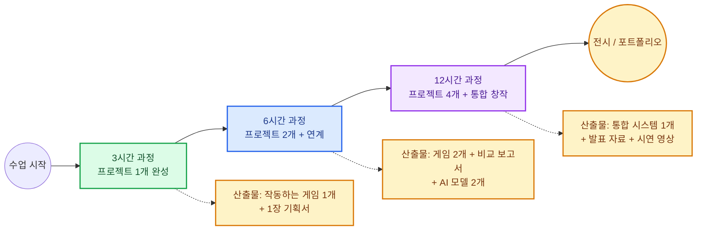

### 1-2. 트랙 분기 단계도

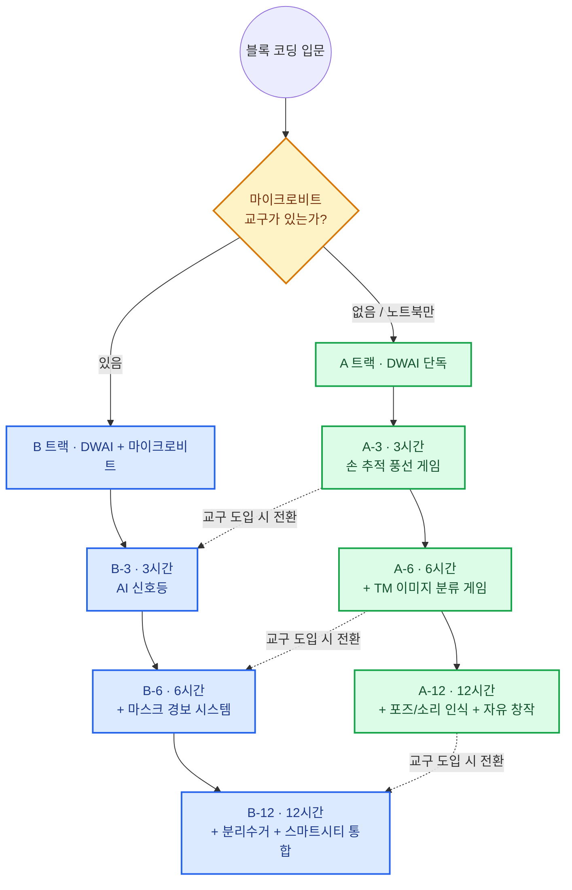

### 1-3. 트랙 비교표

| 비교 항목 | A 트랙 (DWAI 단독) | B 트랙 (DWAI + 마이크로비트) |
|---|---|---|
| 필수 장비 | 웹캠 내장 노트북만 | 노트북 + 마이크로비트 V2 키트 |
| 1인당 교구 단가 | 0원 (노트북 공유) | 약 4~7만원 (키트 기준) |
| 추천 대상 | 초1~초6, 코딩 첫 경험 | 초5~중3, 블록 코딩 1회 이상 경험 |
| 핵심 학습 | AI 인식 → 화면 반응 | AI 인식 → **물리 세계 반응** |
| 디버깅 난이도 | 소프트웨어만 | 소프트웨어 + 배선/통신 |
| 수업 실패 리스크 | 낮음 (조명 문제만) | 중간 (배선·페어링·전원) |
| 3시간 완성률 | 95% 이상 | 80~85% (사전 세팅 시 95%) |
| 출장 수업 적합성 | 매우 높음 | 키트 운반 필요 |
| 확장 방향 | 웹/앱, 바이브 코딩 | 피지컬 컴퓨팅, 아두이노/ESP32 |

---

## 2. 도구 구성

### 2-1. 도구별 역할

| 도구 | 역할 | 사용 시점 | 설치 |
|---|---|---|---|
| **DWAI** (Dancing with AI) | 블록 코딩 + AI 인식 실행 환경 | 전 과정 | 브라우저 접속 (설치 없음) |
| **Teachable Machine** | 이미지/포즈/소리 **분류 모델 학습** | 6시간 이상 / B 트랙 전체 | 브라우저 + Google 계정 |
| **마이크로비트 V2** | AI 판단 결과를 LED·부저·서보로 출력 | B 트랙 | MakeCode 또는 Python 에디터 |
| **마이크로비트 2대** | 무선(radio) 송·수신 분리 구조 | B-12 심화 | - |

### 2-2. DWAI 내장 AI 기능과 TM 모델의 차이

| 구분 | DWAI 내장 추적 | Teachable Machine 분류 |
|---|---|---|
| 기능 | Hand / Face / Pose 좌표 실시간 추적 | 이미지·포즈·소리를 **클래스로 분류** |
| 얻는 값 | X, Y 좌표 · 각도 | 클래스 이름 + 신뢰도(%) |
| 학습 필요 | ❌ 없음 (바로 사용) | ⭕ 필요 (데이터 촬영 → 학습) |
| 대표 활동 | 손으로 조종, 얼굴로 이동 | 가위바위보, 마스크, 분리수거 |
| 첫 수업 적합성 | ⭐⭐⭐ 최적 | ⭐⭐ 2차시부터 |

### 2-3. 기술 도입 순서도

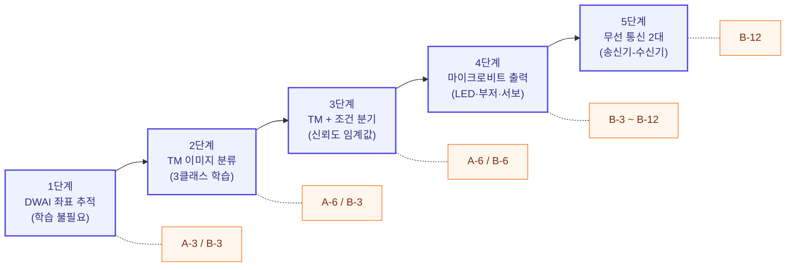

---

## 3. 공통 수업 설계 원리

### 3-1. 5단계 벤치마킹 수업 흐름 (3시간 1모듈 기준)

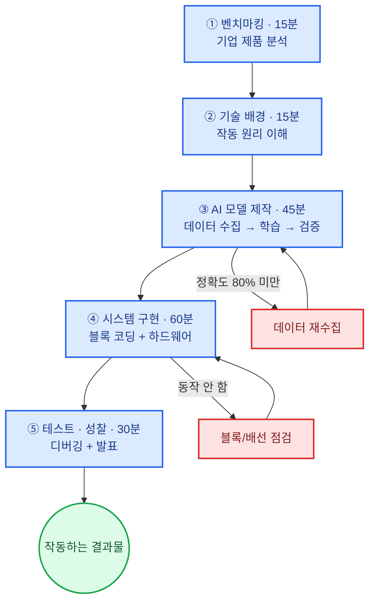

### 3-2. 5단계 시간 배분표

| 단계 | 명칭 | 시간 | 학생 활동 | 강사 역할 | 산출물 |
|---|---|---|---|---|---|
| ① | 벤치마킹 | 15분 | 실제 제품 영상 보고 기능 분해 | 질문 던지기 | 기능 목록 3개 |
| ② | 기술 배경 | 15분 | 원리 설명 듣고 그림으로 정리 | 미니 강의 | 원리 스케치 |
| ③ | AI 모델 제작 | 45분 | 데이터 촬영 → 학습 → 정확도 확인 | 순회 코칭 | 모델 1개 (80%+) |
| ④ | 시스템 구현 | 60분 | 블록 조립 + (B트랙) 배선 | 막힌 팀 1:1 | 작동 프로그램 |
| ⑤ | 테스트·성찰 | 30분 | 상호 시연 + 개선점 기록 | 진행·피드백 | 체크리스트 + 발표 |

> **A 트랙 3시간(입문)은 ③을 "DWAI 내장 추적 탐색 30분"으로 대체하고, ④에 15분을 더합니다.**

### 3-3. 역할 로테이션 (2인 1팀)

| 시간대 | 1번 학생 | 2번 학생 | 교체 시점 |
|---|---|---|---|
| 0:00–1:00 | **기획자** (무엇을 만들까) | 기록자 | 1시간 |
| 1:00–2:00 | **실행자** (블록 조립) | 데이터 촬영 담당 | 1시간 |
| 2:00–3:00 | 디버거 | **발표자** | - |

---

## 4. 역량 레벨 단계도

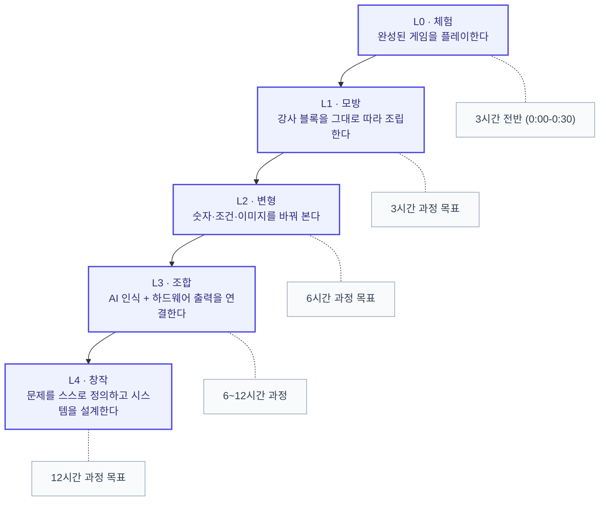

| 레벨 | 확인 질문 | 통과 기준 |
|---|---|---|
| L0 | 이 게임은 무엇을 인식하고 있니? | 입력(웹캠)과 출력(화면)을 말로 구분 |
| L1 | 블록을 순서대로 놓을 수 있니? | 강사 예시와 동일 동작 재현 |
| L2 | 점수를 2배로 바꿀 수 있니? | 파라미터 수정 후 의도대로 작동 |
| L3 | AI가 "가위"라고 하면 LED는 어떻게 되니? | 조건 분기 + 출력 연결 설명 |
| L4 | 네가 풀고 싶은 문제는 무엇이니? | 기획서 작성 → 프로토타입 완성 |

---

# Part 1. 3시간 과정 (입문)

## 1-A. A-3 · DWAI 단독 3시간 — "손으로 하는 AI 게임"

### 개요

| 항목 | 내용 |
|---|---|
| 과정 코드 | **A-3** |
| 대상 | 초등 1~6학년 (코딩 첫 경험 가능) |
| 인원 | 최대 20명 (2인 1팀, 노트북 10대) |
| 준비물 | 웹캠 내장 노트북, Chrome 브라우저 |
| 사용 기술 | DWAI Hand Tracking (내장) |
| 마이크로비트 | ❌ 사용하지 않음 |
| Teachable Machine | ❌ 사용하지 않음 |
| 목표 레벨 | L0 → **L1~L2** |
| 최종 산출물 | 손으로 조작하는 풍선 터트리기 게임 1개 |

### 커리큘럼 타임테이블

| 시각 | 단계 | 내용 | 활동 형태 | 체크포인트 |
|---|---|---|---|---|
| 00:00–00:15 | 도입 | 완성 게임 시연 + 체험 | 전체 | 전원 1회 플레이 |
| 00:15–00:30 | 벤치마킹 | 닌텐도 Switch·VR 손 인식 사례 | 영상 + 토의 | "손 인식 쓰는 제품" 3개 말하기 |
| 00:30–00:50 | 기술 이해 | 웹캠 → 손 좌표(X, Y) 원리 | 실습 | 손을 움직여 좌표 숫자 변화 확인 |
| 00:50–01:00 | 쉬는 시간 | - | - | - |
| 01:00–01:30 | 구현 1 | 배경 + 풍선 스프라이트 배치 | 개별 | 풍선이 화면에 보인다 |
| 01:30–02:00 | 구현 2 | 손 좌표를 커서에 연결 | 개별 | 손 움직임 = 커서 이동 |
| 02:00–02:20 | 구현 3 | 충돌 감지 + 점수 블록 | 개별 | 터지면 +1점 |
| 02:20–02:40 | 변형 | 색·소리·속도 바꾸기 (L2) | 개별 | 1개 이상 변형 성공 |
| 02:40–03:00 | 발표·성찰 | 짝 게임 대결 + 소감 | 전체 | 체크리스트 작성 |

### 수업 순서도

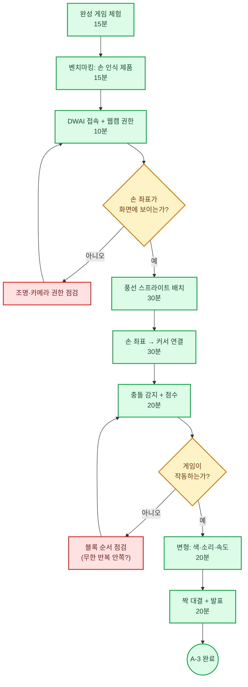

### 블록 구조 (DWAI)

| 순서 | 블록 유형 | 설정 | 학습 개념 |
|---|---|---|---|
| 1 | 시작 (깃발 클릭) | - | 이벤트 |
| 2 | 손 추적 켜기 | Hand Tracking ON | 입력 장치 |
| 3 | 무한 반복 | - | 반복문 |
| 4 | 커서 위치 = 손 X, 손 Y | 좌표 대입 | 변수·좌표 |
| 5 | 만약 ~ 풍선에 닿았다면 | 거리 < 30 | 조건문 |
| 6 | 점수 +1 / 소리 재생 | - | 변수 증감 |
| 7 | 풍선 랜덤 위치로 이동 | X: -200~200 | 난수 |

### 평가 루브릭 (A-3)

| 평가 항목 | 상 (3점) | 중 (2점) | 하 (1점) |
|---|---|---|---|
| 손 추적 이해 | 좌표 개념을 설명함 | 손으로 조작 가능 | 체험만 함 |
| 블록 조립 | 스스로 완성 | 도움받아 완성 | 미완성 |
| 변형 시도 | 2개 이상 변형 | 1개 변형 | 변형 없음 |
| 협업·발표 | 설명이 명확 | 참여함 | 소극적 |

---

## 1-B. B-3 · DWAI + 마이크로비트 3시간 — "AI 손 제스처 신호등"

### 개요

| 항목 | 내용 |
|---|---|
| 과정 코드 | **B-3** |
| 대상 | 초등 5학년 ~ 중등 3학년 |
| 인원 | 최대 20명 (2인 1팀, 키트 10세트) |
| 준비물 | 노트북 + 마이크로비트 V2 + LED 3개(적·황·녹) + 악어클립 |
| 사용 기술 | Teachable Machine (3클래스) + DWAI + 마이크로비트 |
| 목표 레벨 | L1 → **L3** |
| 최종 산출물 | 손 제스처로 제어되는 LED 신호등 |

### 커리큘럼 타임테이블

| 시각 | 단계 | 내용 | 산출물 / 체크포인트 |
|---|---|---|---|
| 00:00–00:15 | 벤치마킹 | 실제 교통관제 시스템, 스마트 횡단보도 | 기능 분해 3개 |
| 00:15–00:30 | 기술 배경 | TM 이미지 분류 원리 + 마이크로비트 역할 | 입력→판단→출력 그림 |
| 00:30–01:10 | AI 모델 제작 | 3클래스 촬영 → 학습 → 정확도 확인 | 정확도 85% 이상 |
| 01:10–01:20 | 쉬는 시간 | - | - |
| 01:20–01:50 | 하드웨어 | LED 3개 배선 + 점등 테스트 | LED 3개 개별 점등 |
| 01:50–02:30 | 시스템 구현 | DWAI ↔ 마이크로비트 연동 + 조건 분기 | 제스처 → LED 전환 |
| 02:30–02:50 | 디버깅 | 오인식 보정, 신뢰도 임계값 조정 | 10회 중 8회 성공 |
| 02:50–03:00 | 발표 | 시연 + 개선 아이디어 | 발표 1분 |

### AI 모델 설계표

| 클래스 | 제스처 | 신호 | 촬영 매수 | 촬영 조건 |
|---|---|---|---|---|
| 1 | ✋ 손바닥 | 🔴 빨간불 (정지) | 50장 이상 | 좌·우손, 거리 변화 |
| 2 | ✌️ V자 | 🟡 노란불 (주의) | 50장 이상 | 각도 3종 이상 |
| 3 | 👍 엄지 | 🟢 초록불 (진행) | 50장 이상 | 밝음/어두움 |
| (권장) 4 | 배경만 | ⚫ 소등 | 50장 이상 | 손 없는 상태 |

> **4번째 "배경" 클래스를 반드시 추가하세요.** 손이 없을 때도 억지로 3개 중 하나로 분류되는 오작동을 막습니다.

### 시스템 구성도

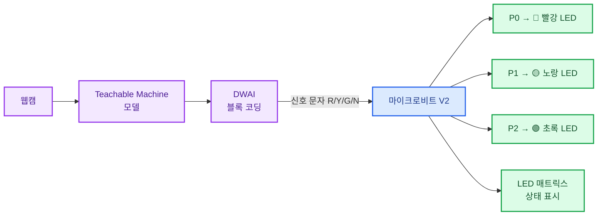

### 수업 순서도

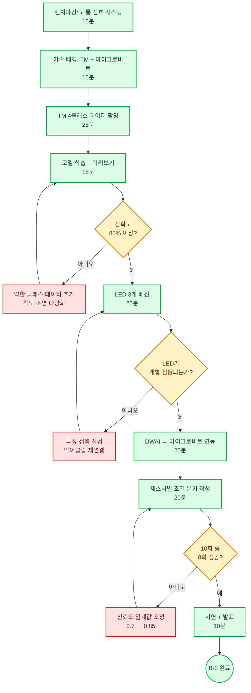

### 배선표

| 마이크로비트 핀 | 연결 부품 | 비고 |
|---|---|---|
| P0 | 빨강 LED (+) | 220Ω 저항 권장 |
| P1 | 노랑 LED (+) | 220Ω 저항 권장 |
| P2 | 초록 LED (+) | 220Ω 저항 권장 |
| GND | LED 3개 (−) 공통 | 브레드보드 사용 시 공통 레일 |

### 마이크로비트 코드 (수신기)

```python
# B-3: AI 신호등 수신기 — MicroPython
from microbit import *
import radio

radio.config(group=1)
radio.on()

RED, YELLOW, GREEN = pin0, pin1, pin2

def all_off():
    RED.write_digital(0)
    YELLOW.write_digital(0)
    GREEN.write_digital(0)

all_off()
display.show(Image.HAPPY)

while True:
    msg = radio.receive()
    if msg:
        all_off()
        if msg == "R":
            RED.write_digital(1)
            display.show("R")
        elif msg == "Y":
            YELLOW.write_digital(1)
            display.show("Y")
        elif msg == "G":
            GREEN.write_digital(1)
            display.show("G")
        else:
            display.clear()
    sleep(100)
```

> **MakeCode 블록으로 진행할 경우**: `무선 그룹 설정 1` → `무선 데이터 수신 시` → `만약 receivedString = "R" 이면` → `디지털 P0에 1 출력` 구조로 동일하게 작성합니다.

### 평가 루브릭 (B-3)

| 평가 항목 | 상 (3점) | 중 (2점) | 하 (1점) |
|---|---|---|---|
| AI 모델 품질 | 정확도 90%+, 배경 클래스 포함 | 85%+ | 85% 미만 |
| 배선 | 스스로 완성, 정리됨 | 도움받아 완성 | 미완성 |
| 조건 분기 | 임계값까지 조정 | 3분기 작동 | 1~2분기만 |
| 설명력 | 입력→판단→출력 전 과정 설명 | 일부 설명 | 설명 못 함 |

---

## 1-C. 3시간 과정 선택 가이드

| 상황 | 권장 과정 | 이유 |
|---|---|---|
| 첫 코딩 수업, 초1~초4 | **A-3** | 하드웨어 변수 제거, 성공 경험 우선 |
| 노트북만 있는 출장 수업 | **A-3** | 교구 운반 불필요 |
| 초5~중3, 코딩 경험 있음 | **B-3** | 피지컬 출력의 성취감이 큼 |
| 학부모 공개 수업 / 시연 | **B-3** | LED 작동이 시각적으로 강력 |
| 1회성 체험 부스 (90분) | **A-3 압축** | 변형·발표 단계 생략 |

---

# Part 2. 6시간 과정 (기본)

## 2-0. 6시간 구성 원리

6시간 = **3시간 × 2차시**이며, 1차시는 Part 1의 과정을 그대로 사용합니다.
2차시는 "같은 기술 + 새로운 문제" 구조로, **기술 전이(transfer)** 를 목표로 합니다.

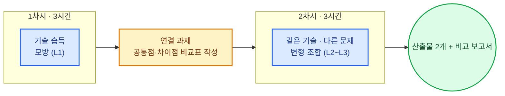

---

## 2-A. A-6 · DWAI 단독 6시간

### 구성

| 차시 | 과정명 | 사용 기술 | 완성물 | 목표 레벨 |
|---|---|---|---|---|
| 1차시 (3h) | 손 추적 풍선 게임 | DWAI Hand Tracking | 게임 1 | L1~L2 |
| 2차시 (3h) | **TM 가위바위보 대결** | TM 3클래스 + DWAI | 게임 2 | L2~L3 |

### 2차시 상세 타임테이블 (A-6 · 가위바위보)

| 시각 | 단계 | 내용 | 체크포인트 |
|---|---|---|---|
| 00:00–00:15 | 복습·연결 | 1차시 게임 재실행 + "추적 vs 분류" 차이 설명 | 비교표 1행 작성 |
| 00:15–00:30 | 벤치마킹 | VR 컨트롤러, 수어 번역 AI | 기능 분해 3개 |
| 00:30–01:15 | AI 모델 제작 | 바위·보·가위 + 배경 (4클래스) | 정확도 85%+ |
| 01:15–01:25 | 쉬는 시간 | - | - |
| 01:25–02:10 | 게임 구현 | 카운트다운 → 인식 → 승패 판정 → 점수 | 1판 정상 작동 |
| 02:10–02:35 | 변형·확장 | 3판 2선승, 연승 보너스, 효과음 | 1개 이상 확장 |
| 02:35–03:00 | 토너먼트·성찰 | 반 대회 + 비교 보고서 마무리 | 보고서 제출 |

### "추적 vs 분류" 비교 과제 (학생 작성표)

| 비교 항목 | 1차시: 손 추적 | 2차시: 손 모양 분류 |
|---|---|---|
| AI가 알려주는 값 | | |
| 학습이 필요했나? | | |
| 조명에 민감했나? | | |
| 어떤 게임에 알맞은가? | | |

### 승패 판정 순서도

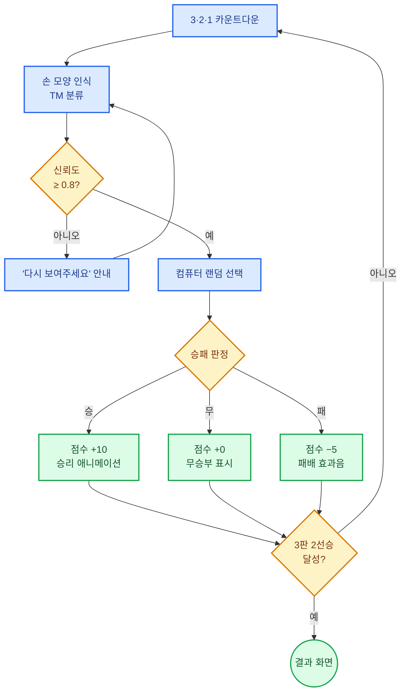

---

## 2-B. B-6 · DWAI + 마이크로비트 6시간

### 구성

| 차시 | 과정명 | 추가 하드웨어 | 완성물 | 목표 레벨 |
|---|---|---|---|---|
| 1차시 (3h) | AI 손 제스처 신호등 | LED 3개 | 출력 제어 | L2~L3 |
| 2차시 (3h) | **마스크 감지 경보 시스템** | 부저 + LED + (선택) 서보 | 판단 + 경보 | L3 |

### 2차시 상세 타임테이블 (B-6 · 마스크 경보)

| 시각 | 단계 | 내용 | 체크포인트 |
|---|---|---|---|
| 00:00–00:15 | 복습·연결 | 1차시 신호등 재현 + 구조 복습 | 신호 규약 설명 |
| 00:15–00:30 | 벤치마킹 | 공항·병원 출입 방역 시스템 | 기능 분해 3개 |
| 00:30–01:10 | AI 모델 제작 | 정상 착용 / 미착용 / 코 노출 / 배경 (4클래스) | 정확도 85%+ |
| 01:10–01:20 | 쉬는 시간 | - | - |
| 01:20–01:45 | 하드웨어 | 부저 + LED 2색 배선 | 부저 소리 확인 |
| 01:45–02:30 | 시스템 구현 | 3상태 분기 → 경보 패턴 차별화 | 상태별 반응 구분 |
| 02:30–02:50 | 디버깅 | 오경보 줄이기 (연속 3프레임 규칙) | 오경보 20% 이하 |
| 02:50–03:00 | 발표 | 실사용 시나리오 발표 | 1분 발표 |

### 상태별 출력 설계표

| AI 판정 | LED | 부저 | 매트릭스 | (선택) 서보 |
|---|---|---|---|---|
| 정상 착용 | 🟢 초록 ON | 짧은 1회 "삑" | ✓ 표시 | 문 열림 (90°) |
| 코 노출 | 🟡 노랑 점멸 | 느린 2회 | ! 표시 | 유지 (0°) |
| 미착용 | 🔴 빨강 ON | 빠른 연속 경보 | ✗ 표시 | 문 닫힘 (0°) |
| 배경 (사람 없음) | 소등 | 무음 | 빈 화면 | 유지 |

### 오경보 억제 로직 순서도

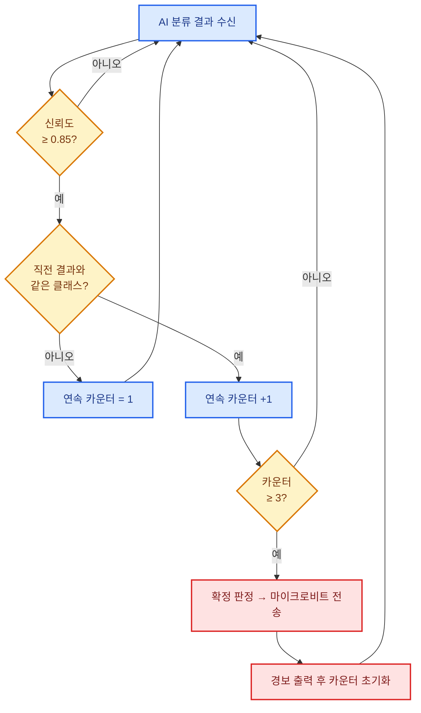

> 이 "연속 3프레임 규칙"이 6시간 과정의 **핵심 학습 포인트**입니다. AI가 틀릴 수 있다는 사실을 코드로 보완하는 경험입니다.

### 마이크로비트 코드 (경보 수신기)

```python
# B-6: 마스크 경보 수신기 — MicroPython
from microbit import *
import radio
import music

radio.config(group=2)
radio.on()

GREEN, RED, YELLOW = pin0, pin1, pin2

def leds(g, r, y):
    GREEN.write_digital(g)
    RED.write_digital(r)
    YELLOW.write_digital(y)

leds(0, 0, 0)

while True:
    msg = radio.receive()
    if msg == "OK":            # 정상 착용
        leds(1, 0, 0)
        display.show(Image.YES)
        music.pitch(880, 150)
    elif msg == "NOSE":        # 코 노출
        leds(0, 0, 1)
        display.show("!")
        music.pitch(660, 300)
        sleep(200)
        music.pitch(660, 300)
    elif msg == "NONE":        # 미착용
        leds(0, 1, 0)
        display.show(Image.NO)
        for _ in range(4):
            music.pitch(1200, 120)
            sleep(80)
    elif msg == "IDLE":
        leds(0, 0, 0)
        display.clear()
    sleep(100)
```

### 6시간 과정 완료 기준표

| 항목 | A-6 | B-6 |
|---|---|---|
| 완성 프로젝트 | 2개 (추적형 1 + 분류형 1) | 2개 (출력 제어 + 경보 판단) |
| 학습한 AI 모델 | 1개 (TM 4클래스) | 2개 (TM 4클래스 × 2) |
| 핵심 개념 | 추적 vs 분류 차이 | 신뢰도 임계값 · 오경보 억제 |
| 제출물 | 비교 보고서 1장 | 시스템 구성도 + 신호 규약표 |

---

# Part 3. 12시간 과정 (심화)

## 3-0. 12시간 구성 원리

12시간 = **6시간(기본) + 6시간(심화·통합)** 입니다.
후반 6시간의 목적은 새 기술 추가가 아니라, **학생이 스스로 문제를 정의하고 시스템을 설계(L4)** 하는 것입니다.

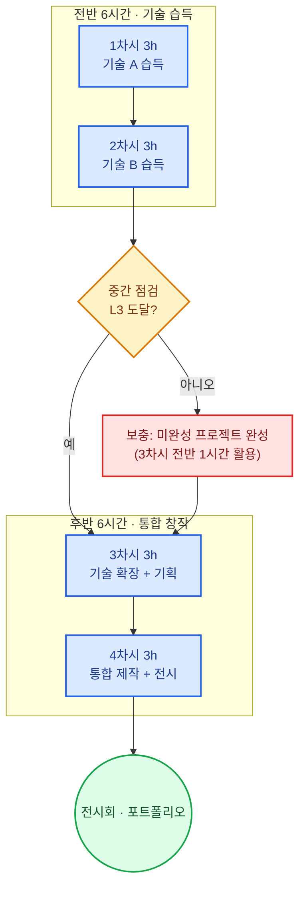

---

## 3-A. A-12 · DWAI 단독 12시간

### 전체 구성

| 차시 | 주제 | 사용 기술 | 완성물 | 레벨 |
|---|---|---|---|---|
| 1차시 (3h) | 손 추적 풍선 게임 | DWAI Hand | 게임 1 | L1~L2 |
| 2차시 (3h) | TM 가위바위보 | TM 이미지 분류 | 게임 2 | L2~L3 |
| 3차시 (3h) | **포즈 인식 운동 코치** | TM Pose + DWAI | 게임 3 | L3 |
| 4차시 (3h) | **자유 창작 + 전시** | 선택 기술 조합 | 창작물 1 | L4 |

### 3차시 상세 (A-12 · 포즈 인식 운동 코치)

| 시각 | 단계 | 내용 | 체크포인트 |
|---|---|---|---|
| 00:00–00:20 | 벤치마킹 | 애플 피트니스+, 홈트 AI 앱 | 기능 분해 3개 |
| 00:20–00:40 | 기술 배경 | 이미지 분류 vs **포즈 분류** 차이 | 관절점(landmark) 이해 |
| 00:40–01:25 | 모델 제작 | 스쿼트 상·하 / 팔벌려뛰기 / 휴식 (4클래스) | 정확도 85%+ |
| 01:25–01:35 | 쉬는 시간 | - | - |
| 01:35–02:20 | 구현 | 자동 카운트 + 자세 피드백 메시지 | 10회 카운트 정확 |
| 02:20–02:45 | 확장 | 목표 횟수, 타이머, 랭킹 | 1개 이상 확장 |
| 02:45–03:00 | 성찰 | 3가지 AI 기술 비교 정리 | 비교표 완성 |

### 3가지 AI 기술 비교표 (3차시 산출물)

| 기술 | 입력 | 출력 | 학습 필요 | 적합한 문제 |
|---|---|---|---|---|
| Hand Tracking | 웹캠 영상 | 손 X, Y 좌표 | ❌ | 조종·그리기 |
| Image Classification | 웹캠 정지 이미지 | 클래스 + 신뢰도 | ⭕ | 판별·분류 |
| Pose Classification | 웹캠 + 관절점 | 자세 클래스 | ⭕ | 운동·동작 교정 |

### 4차시 상세 (A-12 · 자유 창작)

| 시각 | 단계 | 내용 | 산출물 |
|---|---|---|---|
| 00:00–00:30 | 문제 정의 | "내 주변 불편함" 브레인스토밍 → 1개 선정 | 문제 정의서 |
| 00:30–00:50 | 기획 | 기술 선택 + 화면 스케치 + 기능 3개 | 1장 기획서 |
| 00:50–01:50 | 제작 1 | AI 모델 제작 + 핵심 기능 | 모델 + 기본 동작 |
| 01:50–02:00 | 쉬는 시간 | - | - |
| 02:00–02:30 | 제작 2 | 완성도 높이기 + 테스트 | 작동 프로토타입 |
| 02:30–03:00 | 전시·발표 | 부스 운영 (서로 체험) + 상호 평가 | 시연 + 평가표 |

### 자유 창작 기획 템플릿

| 항목 | 작성 내용 |
|---|---|
| 문제 (누가 왜 불편한가) | |
| 벤치마킹한 제품 | |
| 사용할 AI 기술 | Hand / Image / Pose 중 선택 |
| 클래스 설계 (분류 사용 시) | |
| 핵심 기능 3개 | 1. / 2. / 3. |
| 성공 기준 | 10회 중 ○회 정상 작동 |

---

## 3-B. B-12 · DWAI + 마이크로비트 12시간 — "AI 스마트시티"

### 전체 구성

| 차시 | 주제 | 추가 하드웨어 | 완성물 | 레벨 |
|---|---|---|---|---|
| 1차시 (3h) | AI 신호등 | LED 3개 | 교통 모듈 | L2~L3 |
| 2차시 (3h) | 마스크 경보 시스템 | 부저 + LED | 방역 모듈 | L3 |
| 3차시 (3h) | **분리수거 자동 분류기** | 서보모터 2~4개 | 환경 모듈 | L3 |
| 4차시 (3h) | **스마트시티 통합 + 전시** | 2대 무선 통신 | 통합 시스템 | L4 |

### 12시간 통합 로드맵

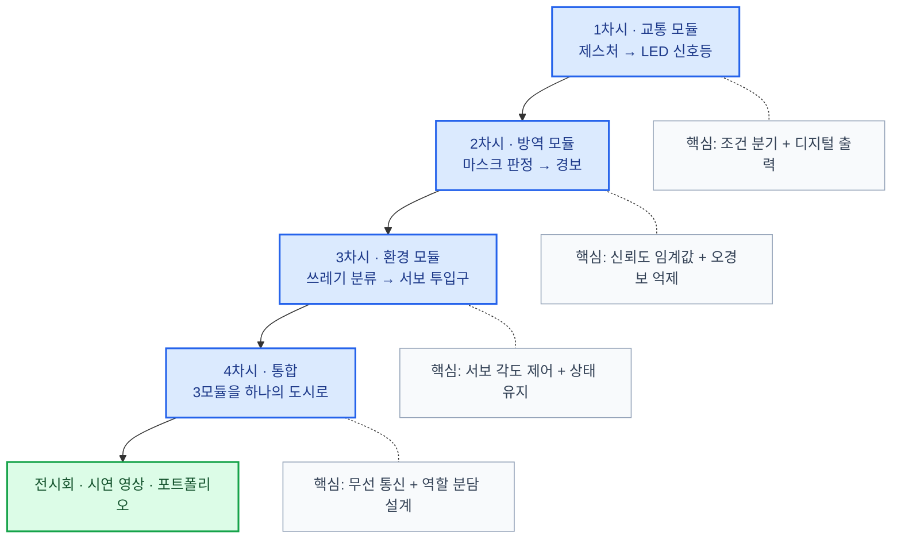

### 3차시 상세 (B-12 · 분리수거 자동 분류기)

| 시각 | 단계 | 내용 | 체크포인트 |
|---|---|---|---|
| 00:00–00:20 | 벤치마킹 | 재활용 선별장 AI 로봇, 스마트 쓰레기통 | 기능 분해 3개 |
| 00:20–00:35 | 기술 배경 | 서보모터 각도 제어 원리 | 0°/90°/180° 이해 |
| 00:35–01:15 | AI 모델 제작 | 플라스틱 / 종이 / 캔 / 일반 (4클래스) | 정확도 85%+ |
| 01:15–01:25 | 쉬는 시간 | - | - |
| 01:25–01:55 | 하드웨어 | 서보 2개 배선 + 각도 테스트 | 각도 3단계 동작 |
| 01:55–02:35 | 시스템 구현 | 분류 결과 → 투입구 방향 전환 | 4종 각각 투입 성공 |
| 02:35–02:50 | 디버깅 | 서보 떨림, 전원 부족 대응 | 연속 10회 안정 |
| 02:50–03:00 | 발표 | 실제 쓰레기로 시연 | 시연 성공 |

### 서보 각도 매핑표

| 분류 결과 | 서보 1 (좌우) | 서보 2 (투입문) | 매트릭스 |
|---|---|---|---|
| 플라스틱 | 0° | 90° (열림) | P |
| 종이 | 60° | 90° (열림) | 책 아이콘 |
| 캔 | 120° | 90° (열림) | C |
| 일반 | 180° | 90° (열림) | X |
| 대기 | 유지 | 0° (닫힘) | 빈 화면 |

> **전원 주의**: 서보 2개 이상은 USB 전원만으로 부족할 수 있습니다. 외부 배터리 팩(AA 3구) 또는 확장 보드를 함께 준비하세요.

### 4차시 상세 (B-12 · 스마트시티 통합 + 전시)

| 시각 | 단계 | 내용 | 산출물 |
|---|---|---|---|
| 00:00–00:25 | 도시 설계 | 모듈 배치 + 팀별 역할 분담 | 도시 지도 1장 |
| 00:25–00:45 | 통신 규약 정하기 | 무선 그룹·신호 문자 표준화 | 신호 규약표 |
| 00:45–01:45 | 통합 제작 1 | 송신기 1대 + 수신기 N대 연결 | 모듈 2개 연동 |
| 01:45–01:55 | 쉬는 시간 | - | - |
| 01:55–02:25 | 통합 제작 2 | 전체 시나리오 리허설 | 3모듈 연속 시연 |
| 02:25–02:45 | 전시 준비 | 부스 설명판 + 시연 영상 촬영 | 설명판 + 영상 |
| 02:45–03:00 | 전시회 | 상호 체험 + 심사 | 평가표 |

### 통합 시스템 구성도

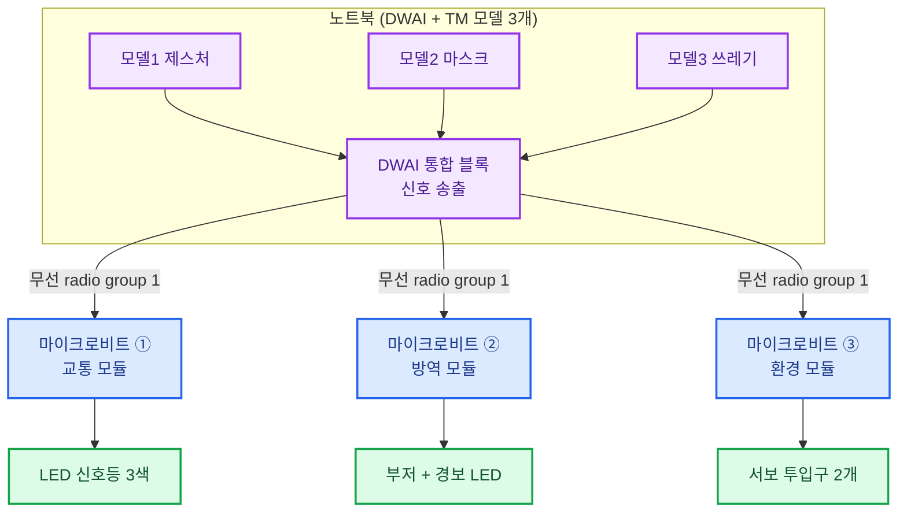

### 통합 신호 규약표 (4차시 필수 산출물)

| 모듈 | 신호 문자 | 의미 | 수신 동작 |
|---|---|---|---|
| 교통 | `T:R` / `T:Y` / `T:G` | 적/황/녹 | LED 전환 |
| 방역 | `M:OK` / `M:NG` | 통과/차단 | 부저 + LED |
| 환경 | `W:P` / `W:A` / `W:C` / `W:E` | 플라스틱/종이/캔/일반 | 서보 각도 |
| 공통 | `IDLE` | 대기 | 전체 소등 |

> **접두어(`T:` `M:` `W:`) 규약**을 학생들이 직접 정하게 하세요. 같은 무선 그룹에서 모듈이 서로 섞이는 문제를 스스로 해결하는 과정이 4차시의 핵심 학습입니다.

### 마이크로비트 코드 (통합 수신기 공통 틀)

```python
# B-12: 스마트시티 통합 수신기 — 모듈별 접두어 필터링
from microbit import *
import radio

radio.config(group=1)
radio.on()

MY_PREFIX = "T"   # 교통=T, 방역=M, 환경=W 로 각 보드마다 바꿔 업로드

def handle(cmd):
    if MY_PREFIX == "T":
        if cmd == "R":
            pin0.write_digital(1); pin1.write_digital(0); pin2.write_digital(0)
        elif cmd == "Y":
            pin0.write_digital(0); pin1.write_digital(1); pin2.write_digital(0)
        elif cmd == "G":
            pin0.write_digital(0); pin1.write_digital(0); pin2.write_digital(1)
        display.show(cmd)

while True:
    msg = radio.receive()
    if msg:
        if msg == "IDLE":
            pin0.write_digital(0); pin1.write_digital(0); pin2.write_digital(0)
            display.clear()
        elif ":" in msg:
            prefix, cmd = msg.split(":", 1)
            if prefix == MY_PREFIX:
                handle(cmd)
    sleep(80)
```

---

## 3-C. 12시간 과정 평가 체계

### 종합 루브릭 (100점)

| 영역 | 배점 | 상 | 중 | 하 |
|---|---|---|---|---|
| AI 모델 품질 | 20 | 정확도 90%+, 배경 클래스 포함, 데이터 다양 | 85%+ | 85% 미만 |
| 시스템 구현 | 25 | 전 기능 안정 작동 | 핵심 기능 작동 | 부분 작동 |
| 문제 정의 (4차시) | 20 | 실제 문제 + 근거 명확 | 문제 설정됨 | 모방 수준 |
| 디버깅 기록 | 15 | 문제·원인·해결 3개 이상 기록 | 1~2개 기록 | 기록 없음 |
| 협업·발표 | 20 | 역할 분담 + 설명 명확 | 참여함 | 소극적 |

### 산출물 체크리스트

| # | 산출물 | A-12 | B-12 | 제출 시점 |
|---|---|---|---|---|
| 1 | TM 모델 공유 링크 | 3개 | 3개 | 각 차시 종료 |
| 2 | DWAI 프로젝트 파일 | 4개 | 4개 | 각 차시 종료 |
| 3 | 기술 비교표 | ⭕ | ⭕ | 3차시 |
| 4 | 시스템 구성도 | 선택 | **필수** | 3~4차시 |
| 5 | 신호 규약표 | - | **필수** | 4차시 |
| 6 | 1장 기획서 | **필수** | **필수** | 4차시 |
| 7 | 디버깅 일지 | ⭕ | ⭕ | 매 차시 |
| 8 | 시연 영상 (1분) | ⭕ | ⭕ | 4차시 |

---

# Part 4. 운영 가이드

## 4-1. 교구재 소요표

### A 트랙 (마이크로비트 없음)

| 품목 | 3시간 | 6시간 | 12시간 | 비고 |
|---|---|---|---|---|
| 웹캠 내장 노트북 | 10대 | 10대 | 10대 | 2인 1팀 |
| Chrome 최신 버전 | 필수 | 필수 | 필수 | 사전 업데이트 |
| Google 계정 | - | 팀당 1개 | 팀당 1개 | TM 모델 저장 |
| 조명(링라이트) | 선택 | 권장 | 권장 | 인식률 향상 |
| 분류용 소품 | - | - | 팀당 1세트 | 4차시 창작용 |
| 워크시트 | 1종 | 2종 | 4종 | 인쇄물 |

### B 트랙 (마이크로비트 포함)

| 품목 | 3시간 | 6시간 | 12시간 | 비고 |
|---|---|---|---|---|
| 웹캠 내장 노트북 | 10대 | 10대 | 10대 | 2인 1팀 |
| 마이크로비트 V2 | 10대 | 10대 | **20~30대** | 12시간은 모듈별 분리 |
| USB 케이블 | 10 | 10 | 20~30 | 마이크로 USB |
| 배터리 팩 (AA 2구) | 10 | 10 | 20~30 | 무선 운용 시 필수 |
| LED (적·황·녹) | 30개 | 50개 | 80개 | 여유분 포함 |
| 220Ω 저항 | 30개 | 50개 | 80개 | - |
| 악어클립 케이블 | 10세트 | 10세트 | 15세트 | 5색 이상 |
| 부저 (패시브) | - | 10개 | 10개 | 2차시부터 |
| 서보모터 SG90 | - | 선택 | **20~40개** | 3차시 필수 |
| 확장 보드 / 외부 전원 | - | 선택 | 권장 | 서보 다수 구동 |
| 브레드보드 | 선택 | 권장 | 권장 | 배선 안정화 |
| 폼보드·우드락 | - | - | 팀당 1장 | 도시 모형 제작 |

## 4-2. 사전 세팅 체크리스트 (강사용)

| 시점 | 항목 | 확인 |
|---|---|---|
| D-3 | 노트북 Chrome 버전 업데이트 | ☐ |
| D-3 | DWAI 접속 테스트 (교실 네트워크) | ☐ |
| D-3 | 방화벽·웹캠 권한 정책 확인 | ☐ |
| D-2 | TM 샘플 모델 1개 미리 제작 (시연용) | ☐ |
| D-2 | (B) 마이크로비트 펌웨어 최신화 | ☐ |
| D-2 | (B) 키트별 LED·부저 사전 동작 테스트 | ☐ |
| D-1 | 완성 예시 프로젝트 2개 준비 (좋은 예/나쁜 예) | ☐ |
| D-1 | 워크시트 인쇄 (팀 수 + 2) | ☐ |
| D-0 | 교실 조명 확인 (역광 창가 자리 회피) | ☐ |
| D-0 | 책상 배치 (웹캠 뒤 배경 단순화) | ☐ |

## 4-3. 트러블슈팅 표

| 증상 | 원인 | 즉시 조치 | 예방 |
|---|---|---|---|
| 웹캠이 안 켜짐 | 브라우저 권한 거부 | 주소창 자물쇠 → 카메라 허용 → 새로고침 | 수업 전 권한 허용 |
| 손 인식이 끊김 | 역광 / 어두움 | 자리 이동, 링라이트 켜기 | 창가 등지지 않게 배치 |
| TM 정확도 낮음 | 데이터 단조로움 | 각도·거리·조명 바꿔 재촬영 | 클래스당 50장 이상 |
| 손 없는데 분류됨 | 배경 클래스 없음 | 4번째 "배경" 클래스 추가 학습 | 설계 단계에서 포함 |
| 판정이 깜빡거림 | 프레임마다 재판정 | 연속 3프레임 규칙 적용 | 6시간 과정 공통 적용 |
| 마이크로비트 반응 없음 | 무선 그룹 불일치 | 송·수신 group 번호 동일하게 | 그룹 번호 칠판 고정 |
| LED 안 켜짐 | 극성 반대 / 접촉 불량 | 다리 길이(긴 쪽=+) 확인, 클립 재연결 | 사전 점등 테스트 |
| 서보 떨림·멈춤 | 전원 부족 | 외부 배터리/확장 보드 사용 | 서보 2개 이상 시 필수 |
| TM 모델 로드 실패 | 링크 오류 / 네트워크 | 모델 재공유, 링크 복사 재확인 | 모델 링크 팀 시트에 기록 |
| 프로젝트 저장 안 됨 | 로그인 미완료 | Google 로그인 후 저장 | 수업 시작 시 로그인 |

## 4-4. 시간 압축·확장 운영표

| 실제 확보 시간 | 운영 방법 | 생략 항목 |
|---|---|---|
| 90분 (체험 부스) | A-3 핵심만 | 벤치마킹 축소, 변형·발표 생략 |
| 120분 | A-3 / B-3 축약 | TM 데이터 사전 제작 제공 |
| **180분 (표준)** | A-3 / B-3 정규 | - |
| 240분 | 3시간 + 심화 1시간 | 2차시 전반부 선행 |
| **360분 (표준)** | A-6 / B-6 정규 | - |
| 540분 (9시간) | 6시간 + 3차시 | 4차시 전시 생략 |
| **720분 (표준)** | A-12 / B-12 정규 | - |

## 4-5. 학년별 권장 과정표

| 과정 | 초1–3 | 초4–6 | 중1–2 | 중3 | 고1–2 |
|---|---|---|---|---|---|
| A-3 | ✅ 권장 | ✅ 권장 | ○ 선택 | - | - |
| B-3 | - | △ 도전 | ✅ 권장 | ○ 선택 | ○ 선택 |
| A-6 | ○ 선택 | ✅ 권장 | ✅ 권장 | ○ 선택 | - |
| B-6 | - | △ 도전 | ✅ 권장 | ✅ 권장 | ○ 선택 |
| A-12 | - | ✅ 권장 | ✅ 권장 | ○ 선택 | ○ 선택 |
| B-12 | - | △ 도전 | ✅ 권장 | ✅ 권장 | ✅ 권장 |

> ✅ 권장 = 해당 학년에 가장 적합 / ○ 선택 = 관심 있으면 가능 / △ 도전 = 코딩 경험자만

---

# 부록

## 부록 A. DWAI 블록 치트시트

| 범주 | 블록 | 용도 | 등장 과정 |
|---|---|---|---|
| 입력 | 손 추적 켜기 | Hand Tracking 시작 | A-3 전체 |
| 입력 | 손 X / 손 Y | 좌표 값 가져오기 | A-3, A-12 |
| 입력 | 얼굴 X / 얼굴 Y | 얼굴 좌표 | A-6 확장 |
| 입력 | TM 모델 불러오기 | 모델 링크 연결 | A-6 이상, B 전체 |
| 입력 | 인식 결과 / 신뢰도 | 클래스명·확률 | A-6 이상, B 전체 |
| 제어 | 무한 반복 | 실시간 루프 | 전 과정 |
| 제어 | 만약 ~ 라면 | 조건 분기 | 전 과정 |
| 제어 | ~초 기다리기 | 타이밍 제어 | B-3 이상 |
| 연산 | 난수 (최소~최대) | 랜덤 위치·선택 | A-3, A-6 |
| 연산 | 비교 (> < =) | 임계값 판정 | A-6 이상 |
| 변수 | 변수 만들기 / 바꾸기 | 점수·카운터 | 전 과정 |
| 통신 | 마이크로비트 연결 | 보드 페어링 | B 전체 |
| 통신 | 문자 보내기 | 신호 송출 | B 전체 |
| 출력 | 스프라이트 이동·표시 | 화면 출력 | A 전체 |
| 출력 | 소리 재생 | 효과음 | 전 과정 |

## 부록 B. Teachable Machine 데이터 수집 가이드

| 원칙 | 구체적 실행 | 이유 |
|---|---|---|
| 충분한 양 | 클래스당 **50장 이상** (가능하면 100장) | 과적합 방지 |
| 각도 다양화 | 정면·좌 30°·우 30° 각각 촬영 | 실사용 각도 대응 |
| 거리 다양화 | 가까이·보통·멀리 3단계 | 거리 변화 강건성 |
| 조명 다양화 | 밝을 때·어두울 때 | 교실 조명 변화 대응 |
| 좌우 모두 | 왼손·오른손 둘 다 | 좌우 편향 제거 |
| 배경 클래스 | "아무것도 없음" 클래스 필수 | 강제 오분류 방지 |
| 사람 다양화 | 팀원 2명 모두 촬영 | 특정인 과적합 방지 |
| 검증 | 촬영에 참여하지 않은 친구로 테스트 | 실제 성능 확인 |

### 데이터 품질 점검 순서도

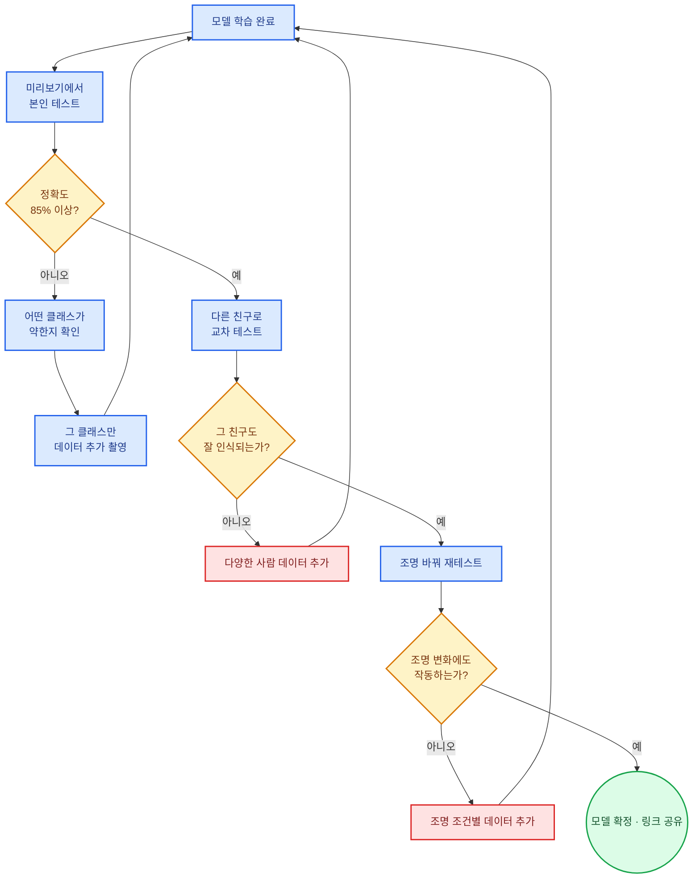

## 부록 C. 마이크로비트 신호 규약 표준 (B 트랙 공통)

| 과정 | 무선 그룹 | 신호 문자 | 수신 동작 |
|---|---|---|---|
| B-3 | 1 | `R` `Y` `G` `N` | LED 3색 전환 / 소등 |
| B-6 | 2 | `OK` `NOSE` `NONE` `IDLE` | 부저 패턴 + LED |
| B-12 교통 | 1 | `T:R` `T:Y` `T:G` | LED 3색 |
| B-12 방역 | 1 | `M:OK` `M:NG` | 부저 + LED |
| B-12 환경 | 1 | `W:P` `W:A` `W:C` `W:E` | 서보 각도 |
| 공통 | - | `IDLE` | 전체 소등 |

> 반이 여러 개일 때는 **반별로 무선 그룹을 다르게** 지정하세요 (1반=11, 2반=12 …). 같은 교실에서 신호가 섞이는 사고를 막습니다.

## 부록 D. 학생 워크시트 양식

### D-1. 벤치마킹 시트 (매 차시 앞 15분)

| 항목 | 작성 |
|---|---|
| 본 제품/서비스 이름 | |
| 어떤 문제를 해결하나? | |
| 사용된 AI 기술 추측 | |
| 내가 따라 만들 수 있는 기능 1 | |
| 내가 따라 만들 수 있는 기능 2 | |
| 내가 못 만들 것 같은 기능 | |

### D-2. 디버깅 일지 (매 차시 종료 전)

| # | 생긴 문제 | 원인이라고 생각한 것 | 실제 해결 방법 | 다음에 쓸 교훈 |
|---|---|---|---|---|
| 1 | | | | |
| 2 | | | | |
| 3 | | | | |

### D-3. 자기 평가표 (과정 종료)

| 질문 | 😀 잘함 | 🙂 보통 | 😐 어려움 |
|---|---|---|---|
| AI가 무엇을 보고 판단하는지 설명할 수 있다 | ☐ | ☐ | ☐ |
| 데이터가 왜 다양해야 하는지 설명할 수 있다 | ☐ | ☐ | ☐ |
| 블록을 스스로 조립할 수 있다 | ☐ | ☐ | ☐ |
| (B) AI 결과를 하드웨어로 연결할 수 있다 | ☐ | ☐ | ☐ |
| 문제가 생겼을 때 원인을 찾아볼 수 있다 | ☐ | ☐ | ☐ |
| 다음에 만들어 보고 싶은 것이 있다 | ☐ | ☐ | ☐ |

## 부록 E. 다음 단계 연계

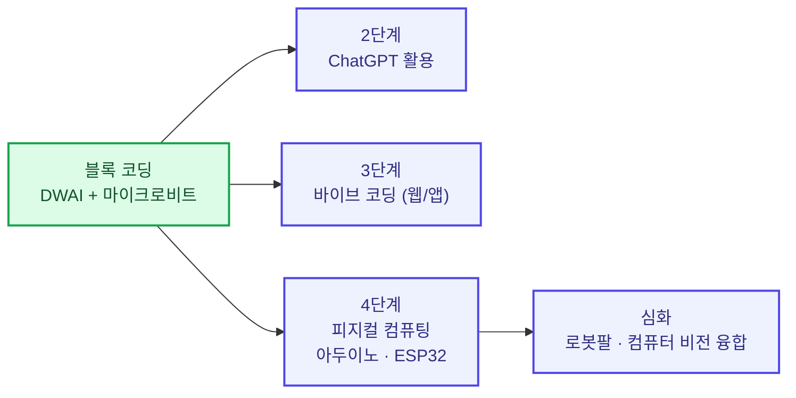

| 현재 수료 과정 | 추천 다음 과정 | 이유 |
|---|---|---|
| A-3 / A-6 | A-12 또는 2단계 ChatGPT | AI 활용 폭 확장 |
| A-12 | 3단계 바이브 코딩 | 창작 경험 → 실제 웹/앱 제작 |
| B-6 | B-12 | 서보·무선 통신으로 시스템화 |
| B-12 | 4단계 피지컬 컴퓨팅 (아두이노/ESP32) | 텍스트 코딩 + 센서 확장 |

---

## 문서 요약표

| 과정 | 시간 | 마이크로비트 | 프로젝트 수 | TM 모델 수 | 목표 레벨 | 대표 산출물 |
|---|---|---|---|---|---|---|
| A-3 | 3h | ❌ | 1 | 0 | L1~L2 | 손 추적 게임 |
| B-3 | 3h | ⭕ | 1 | 1 | L3 | AI 신호등 |
| A-6 | 6h | ❌ | 2 | 1 | L2~L3 | 게임 2종 + 비교 보고서 |
| B-6 | 6h | ⭕ | 2 | 2 | L3 | 경보 시스템 |
| A-12 | 12h | ❌ | 4 | 3 | L4 | 자유 창작 + 전시 |
| B-12 | 12h | ⭕ | 4 | 3 | L4 | 스마트시티 통합 시스템 |
