# 아두이노 CC × ESP32-CAM × Flask 컴퓨터비전 프로젝트 커리큘럼

> **한 줄 요약**
> 아두이노 CC(Arduino IDE)로 ESP32-CAM 펌웨어를 올리고, 교실 공유기를 통해 **선생님 PC의 Flask 서버**로 사진을 보내고, 서버가 **컴퓨터비전(OpenCV/AI)** 으로 분석한 결과를 **스마트폰 앱으로 확인**하는 3시간 → 6시간 → 12시간 연속 프로젝트 수업.

| 항목 | 내용 |
|------|------|
| 과정명 | AI 아두이노: ESP32-CAM 비전 서버 프로젝트 |
| 개발 도구 | 아두이노 CC(Arduino IDE 2.x) + Python Flask + OpenCV |
| 하드웨어 | ESP32-CAM(AI Thinker) 1종 — **3/6/12시간 전 과정 동일 교구** |
| 네트워크 | 교실 공유기(2.4GHz) 1대 — 인터넷 없어도 수업 가능 |
| 앱 | **앱 제작은 하지 않음.** 내부 배포 뷰어/모바일 브라우저로 **테스트만** 진행 |
| 수업 구조 | 3시간(연결) → 6시간(비전) → 12시간(AI 프로젝트) 누적형 |
| 대상 | 초6 ~ 고3 (3시간: 초6~중2 / 6시간: 중1~고1 / 12시간: 중2~고3) |
| 인원 | 최대 20명 (2인 1팀, 팀당 ESP32-CAM 1대) |
| 문서 버전 | v1.0 (2026-10-05) |

---

## 📑 목차

| # | 섹션 | 내용 |
|---|------|------|
| 1 | [설계 원칙](#1-설계-원칙) | 왜 이 구조인가 |
| 2 | [전체 시스템 구조](#2-전체-시스템-구조) | 아키텍처·네트워크·데이터 흐름 도식 |
| 3 | [준비물 & 사전 점검](#3-준비물--사전-점검) | 장비표·설치표·체크리스트 |
| 4 | [수업 자료 다운로드 패키지](#4-수업-자료-다운로드-패키지) | 내부 배포 폴더 구조 |
| 5 | [아두이노 CC 설정](#5-아두이노-cc-설정) | 보드매니저·업로드 설정 |
| 6 | [3시간 과정 — 연결](#6-3시간-과정--연결하기) | ESP32-CAM → Flask → 앱 |
| 7 | [6시간 과정 — 비전](#7-6시간-과정--보게-하기) | OpenCV 분석 + 2분할 대시보드 |
| 8 | [12시간 과정 — AI 프로젝트](#8-12시간-과정--스스로-판단하게-하기) | AI 인식 + 자동 제어 + 발표 |
| 9 | [평가 루브릭](#9-평가-루브릭) | 과정별 평가표 |
| 10 | [트러블슈팅](#10-트러블슈팅) | 증상별 해결 결정트리 |
| 11 | [강사 운영 가이드](#11-강사-운영-가이드) | 타임키핑·플랜B·안전 |
| 12 | [FAQ](#12-faq) | 자주 묻는 질문 |
| 13 | [부록 — 빠른 참조](#13-부록--빠른-참조-카드) | API 요약·한 장 요약 |

---

## 1. 설계 원칙

### 1.1 다섯 가지 원칙

| # | 원칙 | 구체적 내용 |
|---|------|------------|
| 1 | **교구 1종** | ESP32-CAM 1대로 3·6·12시간 전부 진행. 추가 구매 없음 |
| 2 | **서버는 선생님 PC** | 클라우드·결제·회원가입 없음. 노트북 1대가 서버 |
| 3 | **앱은 만들지 않고 쓴다** | 앱 개발 시간(2~3시간)을 비전·서버 학습에 투자 |
| 4 | **전부 내부 다운로드** | 코드·펌웨어·앱·파이썬 패키지까지 USB/내부망으로 배포 → 인터넷 장애에도 수업 진행 |
| 5 | **보이는 결과 우선** | 화면 왼쪽엔 서버가 돌아가는 모습, 오른쪽엔 비전 결과. 두 개를 **동시에** 본다 |

### 1.2 "서버 + 컴퓨터비전"을 한 화면에 보여주는 이유

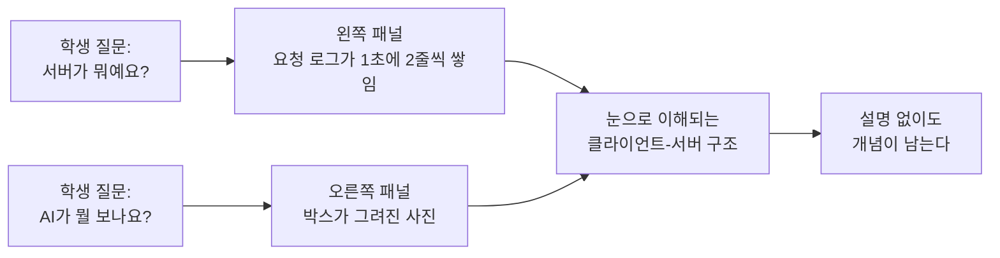

| 보여주는 것 | 학생이 얻는 개념 |
|-------------|-----------------|
| 왼쪽: 요청 로그 / 초당 프레임 / 접속 기기 목록 | 요청-응답, IP·포트, 서버 부하 |
| 오른쪽: 원본 → 처리 → 판단 결과 | 전처리, 임계값, 인식/오인식 |
| 아래: 이벤트 기록 표 | 데이터 로깅, 규칙 기반 자동화 |

### 1.3 3단계 누적 구조

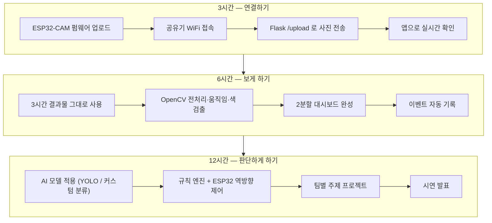

| 과정 | 핵심 질문 | 완성물 | 아두이노 CC 역할 | Flask 역할 |
|------|----------|--------|-----------------|-----------|
| 3시간 | "어떻게 사진이 서버로 가지?" | 실시간 카메라 뷰어 | 캡처 + 전송 펌웨어 | 수신 + 스트리밍 |
| 6시간 | "컴퓨터는 어떻게 보지?" | 비전 모니터링 시스템 | 전송 간격·해상도·플래시 제어 | 수신 + OpenCV 분석 + 대시보드 |
| 12시간 | "스스로 판단하면?" | AI 자동 감지·대응 시스템 | 서버 명령 수신 → LED/부저 동작 | AI 추론 + 규칙 엔진 + 명령 발행 |

---

## 2. 전체 시스템 구조

### 2.1 아키텍처 (전체)

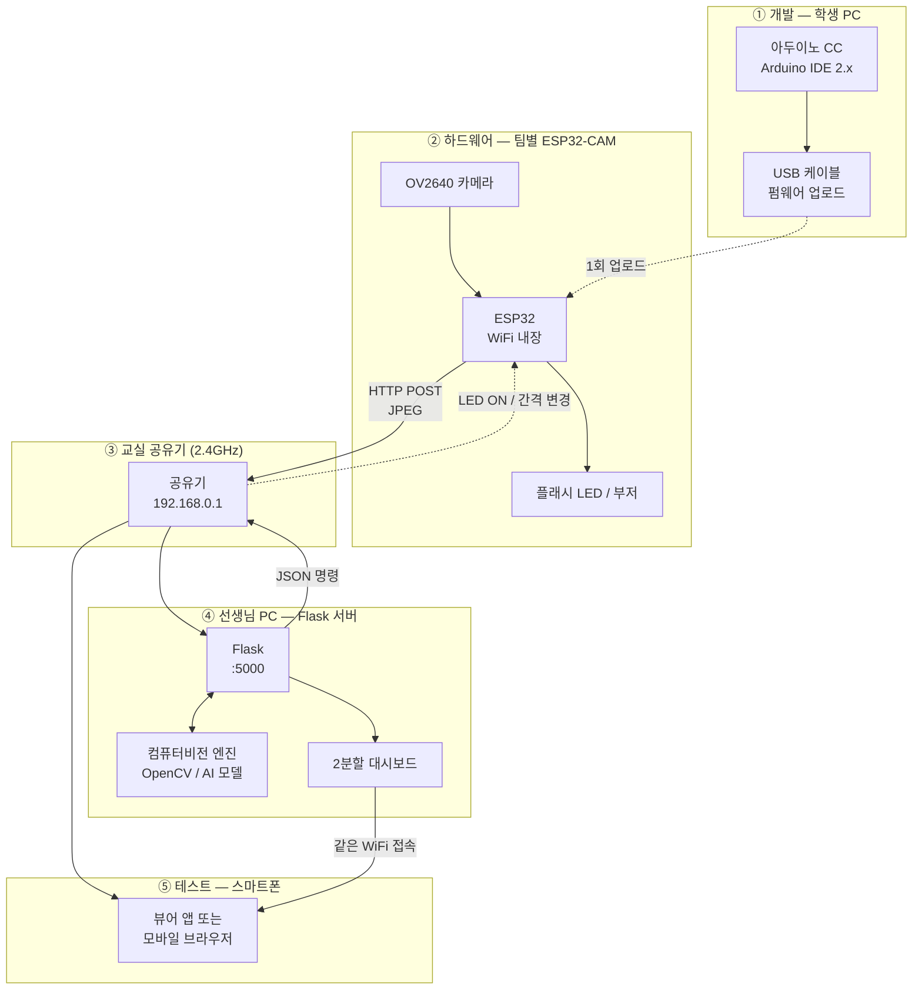

### 2.2 네트워크 구성 (공유기 1대 전제)

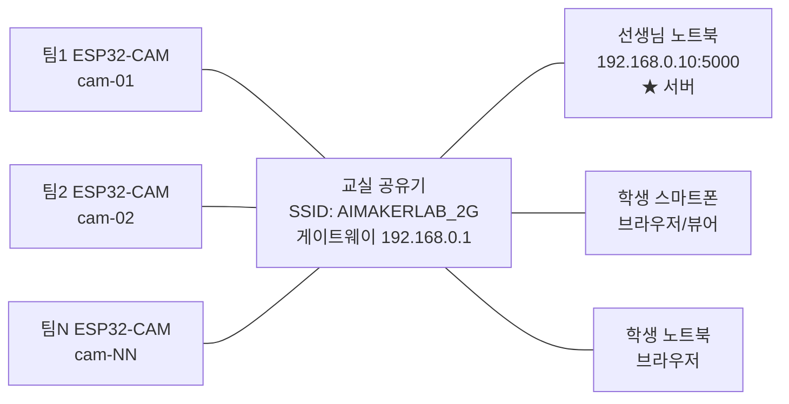

| 설정 항목 | 값 / 주의사항 | 왜 중요한가 |
|----------|--------------|------------|
| 주파수 | **반드시 2.4GHz SSID** | ESP32는 5GHz를 지원하지 않음 (가장 흔한 실패 원인) |
| SSID/비밀번호 | 영문+숫자, 공백·한글 없음 | 펌웨어 문자열 오류 방지 |
| AP 격리(Isolation) | **반드시 OFF** | ON이면 기기끼리 통신 불가 |
| 서버 IP | 고정 권장 (192.168.0.10) | 매 수업 IP가 바뀌면 전원 재업로드 필요 |
| 포트 | Windows 5000 / **macOS 5001** | macOS는 5000을 AirPlay가 점유 |
| 방화벽 | Python 인바운드 허용(사설망) | 차단되면 ESP32 전송 실패 |
| 인터넷 | **불필요** | 공유기 내부망만으로 전 과정 동작 |

### 2.3 데이터 흐름 (한 프레임의 여행)

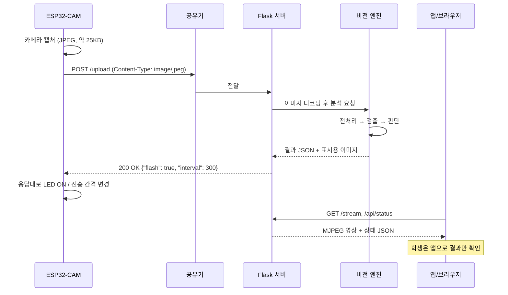

| 단계 | 소요시간(대략) | 학생이 확인하는 지점 |
|------|--------------|-------------------|
| 캡처 | 50~80ms | 시리얼 모니터 `captured 25312 bytes` |
| 전송 | 80~200ms | 서버 로그에 한 줄 추가 |
| 분석 | 10~60ms (OpenCV) / 80~300ms (AI) | 대시보드 FPS 숫자 |
| 응답 | 10ms | ESP32 LED가 켜짐 |
| 앱 표시 | 즉시 | 스마트폰 화면 갱신 |

---

## 3. 준비물 & 사전 점검

### 3.1 하드웨어

| 구분 | 품목 | 수량(20명 기준) | 비고 |
|------|------|----------------|------|
| 필수 | ESP32-CAM (AI Thinker, OV2640) | 10 | 2인 1팀 |
| 필수 | **ESP32-CAM-MB 확장보드** | 10 | USB 직결 → 점퍼선 배선 불필요 ★강력권장 |
| 대안 | USB-TTL(CP2102/FTDI) + 점퍼선 | 10세트 | MB보드 없을 때. IO0-GND 수동 연결 필요 |
| 필수 | Micro USB(데이터 지원) 케이블 | 10 | 충전전용 케이블 불가 |
| 필수 | 교실 공유기 (2.4GHz) | 1 | 인터넷 연결 불필요 |
| 필수 | 선생님 노트북 (서버) | 1 | RAM 8GB 이상, 12시간 과정은 16GB 권장 |
| 필수 | 학생 노트북/PC | 10 | 아두이노 CC 설치본 |
| 권장 | USB 허브(전원 공급형) | 3 | 노트북 USB 포트 부족 대비 |
| 권장 | 보조배터리 + USB 케이블 | 10 | 무선 설치 테스트용 |
| 권장 | 삼각대/스마트폰 거치대 | 10 | 카메라 고정 → 영상 흔들림 방지 |
| 권장 | 인쇄 표지판·색상 카드 세트 | 10 | 6·12시간 검출 대상 |
| 예비 | ESP32-CAM 여분 | 2 | 불량률 대비 (약 5%) |

> **ESP32-CAM-MB 확장보드를 반드시 권장하는 이유**
> MB보드가 없으면 업로드마다 `IO0 ↔ GND` 점퍼선을 꽂고 → 리셋 → 업로드 → 점퍼 제거를 반복해야 합니다. 20명 수업에서 이 과정만으로 40분 이상 소모되고 실패율이 높습니다. MB보드는 USB를 꽂으면 바로 업로드됩니다.

### 3.2 소프트웨어 (사전 설치 필수)

| 설치 위치 | 소프트웨어 | 버전 | 설치 시간 | 확인 방법 |
|----------|-----------|------|----------|----------|
| 학생 PC | 아두이노 CC (Arduino IDE) | 2.3.x 이상 | 5분 | 실행 후 버전 표시 |
| 학생 PC | ESP32 보드 패키지 | 3.x | 10~15분 | 보드 목록에 `AI Thinker ESP32-CAM` |
| 학생 PC | USB 드라이버(CH340 또는 CP210x) | 최신 | 3분 | 장치관리자에 COM 포트 표시 |
| 선생님 PC | Python | 3.10 ~ 3.12 | 5분 | `python --version` |
| 선생님 PC | Flask, OpenCV, NumPy | requirements.txt | 5분 | `python install_check.py` |
| 선생님 PC | (12시간) Ultralytics YOLO | 8.x | 10분 + 모델 다운로드 | `yolo version` |
| 스마트폰 | 뷰어 앱(내부 배포) 또는 기본 브라우저 | - | 2분 | 대시보드 접속 |

> ⚠️ **ESP32 보드 패키지와 YOLO 설치는 수업 중에 하지 마세요.** 20대가 동시에 수백 MB를 내려받으면 교실 네트워크가 마비됩니다. 반드시 **사전 설치** 또는 **오프라인 패키지(4장)** 로 배포합니다.

### 3.3 수업 전날 체크리스트 (강사용)

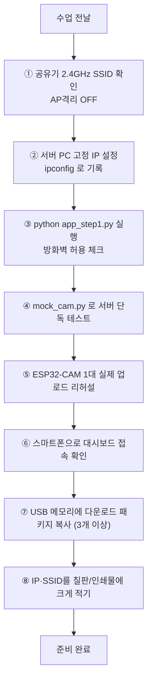

| # | 항목 | 통과 기준 | 실패 시 |
|---|------|----------|--------|
| 1 | 공유기 2.4GHz | 스마트폰에서 2G SSID 보임 | 공유기 설정에서 밴드 분리 |
| 2 | 서버 IP 고정 | 재부팅 후 IP 동일 | 공유기 DHCP 예약 설정 |
| 3 | 서버 실행 | `http://127.0.0.1:5000` 열림 | 포트 변경(5001) |
| 4 | 모의 전송 | 대시보드에 웹캠 영상 표시 | OpenCV 재설치 |
| 5 | 실기 업로드 | `Hard resetting via RTS pin` 출력 | 드라이버/케이블 교체 |
| 6 | 폰 접속 | `http://192.168.0.10:5000` 열림 | 방화벽 인바운드 허용 |
| 7 | USB 배포본 | 3개 이상 복제 | - |
| 8 | 정보 게시 | SSID·PW·서버IP 판서 | - |

---

## 4. 수업 자료 다운로드 패키지

### 4.1 배포 방식

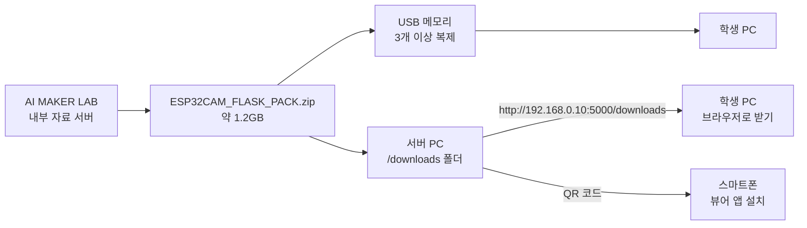

> 수업 중 배포는 **①USB → ②서버 내부 다운로드 페이지 → ③QR코드** 3중 경로를 준비합니다. 외부 인터넷은 보조 수단으로만 씁니다.

### 4.2 패키지 폴더 구조

| 경로 | 파일 | 용도 | 사용 과정 |
|------|------|------|----------|
| `01_arduino/` | `cam_01_test.ino` | 카메라 단독 동작 확인 | 3h |
| | `cam_02_wifi.ino` | 공유기 접속 확인 | 3h |
| | `cam_03_upload.ino` | 서버로 JPEG 전송(핵심) | 3h · 6h |
| | `cam_04_control.ino` | 서버 명령 수신 + LED/부저 | 12h |
| | `config_sample.h` | SSID·서버IP 설정 템플릿 | 전 과정 |
| `02_server/` | `app_step1.py` | 수신 + 스트리밍 | 3h |
| | `app_step2.py` | + OpenCV 분석 + 대시보드 | 6h |
| | `app_step3.py` | + AI 추론 + 규칙 엔진 | 12h |
| | `cv_engine.py` | 비전 파이프라인 모듈 | 6h · 12h |
| | `detector.py` | AI 모델 래퍼 | 12h |
| | `requirements.txt` | 패키지 목록 | 전 과정 |
| | `templates/dashboard.html` | 2분할 대시보드 | 6h · 12h |
| `03_app/` | `AIMakerLab_Viewer.apk` | 안드로이드 뷰어(내부 배포) | 전 과정 |
| | `viewer_qr.png` | 접속 QR 코드 | 전 과정 |
| | `ios_안내.pdf` | iOS는 Safari 사용 안내 | 전 과정 |
| `04_tools/` | `mock_cam.py` | PC 웹캠을 ESP32처럼 전송(플랜B) | 전 과정 |
| | `install_check.py` | 설치 상태 자동 점검 | 전 과정 |
| | `find_ip.bat` / `find_ip.command` | 서버 IP 즉시 확인 | 전 과정 |
| `05_offline/` | `wheels/` | pip 오프라인 설치 파일 | 전 과정 |
| | `esp32_board_3.x/` | 보드 패키지 오프라인 설치본 | 전 과정 |
| | `yolov8n.pt` | AI 모델 가중치(6MB) | 12h |
| | `haarcascade_*.xml` | 얼굴/눈 검출기 | 6h |
| `06_worksheet/` | `워크시트_3h.pdf` | 빈칸 채우기 + 관찰 기록 | 3h |
| | `워크시트_6h.pdf` | 임계값 실험 기록표 | 6h |
| | `기획서_12h.pdf` | 팀 프로젝트 기획 양식 | 12h |
| | `평가표.xlsx` | 루브릭 채점표 | 전 과정 |

### 4.3 오프라인 설치 명령

```bash
# 선생님 PC — 인터넷 없이 파이썬 패키지 설치
cd 02_server
python -m venv venv
venv\Scripts\activate          # macOS/Linux: source venv/bin/activate
pip install --no-index --find-links=../05_offline/wheels -r requirements.txt
python ../04_tools/install_check.py
```

```text
requirements.txt
----------------
flask==3.0.3
opencv-python==4.10.0.84
numpy==1.26.4
# 12시간 과정 추가
ultralytics==8.3.0
```

---

## 5. 아두이노 CC 설정

### 5.1 Arduino IDE vs Web Editor

| 구분 | Arduino IDE 2.x (**권장**) | 아두이노 CC 웹 에디터 |
|------|---------------------------|---------------------|
| 설치 | 프로그램 설치 필요 | 브라우저 + Create Agent 설치 |
| 인터넷 | 불필요(설치 후) | **필수** |
| 보드 패키지 | 오프라인 설치 가능 | 자동 제공 |
| 학교 환경 | 적합 (망 제한에도 동작) | 네트워크 정책에 막히는 경우 많음 |
| 결론 | **수업 기본값** | 개인 복습·가정 학습용으로 안내 |

> 교실에서는 IDE 2.x로 진행하고, "집에서도 이어서 하고 싶다"는 학생에게 웹 에디터를 안내하는 구성이 가장 안전합니다.

### 5.2 보드 패키지 등록

| 단계 | 메뉴 | 입력 값 |
|------|------|--------|
| 1 | 파일 → 환경설정 → 추가 보드 관리자 URL | `https://espressif.github.io/arduino-esp32/package_esp32_index.json` |
| 2 | 보드 관리자 검색 | `esp32` → **esp32 by Espressif Systems** 설치 |
| 3 | 보드 선택 | 도구 → 보드 → esp32 → **AI Thinker ESP32-CAM** |
| 4 | 포트 선택 | 도구 → 포트 → `COM5`(Win) / `/dev/cu.usbserial-xxxx`(Mac) |

### 5.3 업로드 설정 (이 표를 그대로 따라하면 성공)

| 설정 항목 | 값 | 이유 |
|----------|-----|------|
| Board | AI Thinker ESP32-CAM | 핀맵 자동 적용 |
| **Partition Scheme** | **Huge APP (3MB No OTA/1MB SPIFFS)** | 기본값이면 용량 초과 오류 |
| PSRAM | Enabled | 고해상도 캡처 필수 |
| CPU Frequency | 240MHz | - |
| Flash Frequency | 80MHz | - |
| Upload Speed | 921600 (실패 시 **115200**) | 안정성 |
| Core Debug Level | None (문제 시 Info) | 시리얼 로그 조절 |

### 5.4 업로드 절차

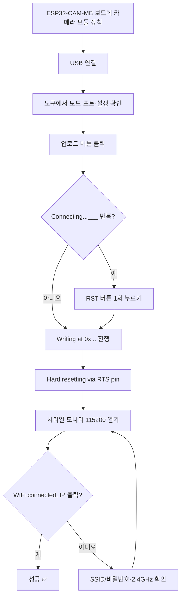

> **MB보드 없이 USB-TTL로 하는 경우**: 업로드 전 `IO0 ↔ GND` 연결 → RST 1회 → 업로드 → 완료 후 점퍼 제거 → RST. 이 순서를 칠판에 그려두세요.

---

## 6. 3시간 과정 — 연결하기

### 6.1 목표와 완성물

| 항목 | 내용 |
|------|------|
| 한 줄 목표 | "내 카메라가 찍은 사진이 선생님 컴퓨터에 1초에 3장씩 도착한다" |
| 완성물 | 공유기를 통해 Flask 서버로 영상을 보내는 **실시간 카메라 뷰어** |
| 학생이 작성하는 코드 | 아두이노 스케치 설정부(SSID/IP) + 전송 간격 |
| 학생이 실행하는 코드 | Flask 서버(`app_step1.py`) — 코드는 읽고 실행, 수정은 2줄 |
| 핵심 개념 | 클라이언트 / 서버 / IP / 포트 / HTTP POST |
| 앱 활동 | 앱으로 **테스트만** (제작 없음) |

### 6.2 타임테이블 (180분)

| 시간 | 분 | 활동 | 형태 | 산출물 |
|------|----|------|------|--------|
| 00:00 | 15 | 오프닝: 완성작 시연 + "CCTV는 어떻게 작동하나?" | 시연·토론 | - |
| 00:15 | 15 | 시스템 도식 그리기 (2.1 그림을 학생이 손으로) | 워크시트 | 구조도 |
| 00:30 | 20 | 아두이노 CC 설정 + `cam_01_test.ino` 업로드 | 실습 | 카메라 동작 확인 |
| 00:50 | 10 | 휴식 | - | - |
| 01:00 | 25 | `cam_02_wifi.ino` — 공유기 접속, IP 확인 | 실습 | 시리얼에 IP 출력 |
| 01:25 | 15 | 서버 개념 설명 + Flask 서버 실행 관찰 | 강의·시연 | - |
| 01:40 | 10 | 휴식 | - | - |
| 01:50 | 35 | `cam_03_upload.ino` — 서버로 전송 성공 | 실습 | 대시보드에 내 팀 영상 |
| 02:25 | 20 | 앱/브라우저 테스트 — 폰으로 확인, 각도·밝기 실험 | 실습 | 테스트 체크표 |
| 02:45 | 10 | 전송 간격·해상도 바꿔보기 (성능 실험) | 실습 | 실험 기록 |
| 02:55 | 5 | 정리: "다음 시간엔 컴퓨터가 이걸 '본다'" | 마무리 | - |

```mermaid
gantt
    title 3시간 과정 흐름
    dateFormat HH:mm
    axisFormat %H:%M
    section 이해
    오프닝 시연        :a1, 00:00, 15m
    시스템 도식 그리기  :a2, after a1, 15m
    section 하드웨어
    IDE 설정·카메라 테스트 :b1, after a2, 20m
    휴식1             :br1, after b1, 10m
    WiFi 접속          :b2, after br1, 25m
    section 서버
    Flask 개념·실행     :c1, after b2, 15m
    휴식2             :br2, after c1, 10m
    서버 전송 성공      :c2, after br2, 35m
    section 테스트
    앱 테스트          :d1, after c2, 20m
    성능 실험          :d2, after d1, 10m
    정리              :d3, after d2, 5m
```

### 6.3 실습 1 — `config_sample.h` (학생이 채우는 유일한 설정)

```cpp
// ===== config.h : 이 3줄만 우리 교실 값으로 바꾸세요 =====
#define WIFI_SSID   "AIMAKERLAB_2G"          // ① 공유기 이름 (2.4GHz!)
#define WIFI_PASS   "makerlab1234"           // ② 공유기 비밀번호
#define SERVER_IP   "192.168.0.10"           // ③ 선생님 PC IP (칠판 확인)

#define SERVER_PORT 5000                     // macOS 서버면 5001
#define DEVICE_ID   "cam-01"                 // 우리 팀 번호로 변경
#define SEND_INTERVAL_MS 300                 // 전송 간격(ms)
```

| 바꿀 값 | 어디서 확인 | 자주 하는 실수 |
|---------|-----------|--------------|
| WIFI_SSID | 칠판 / 공유기 라벨 | 5GHz SSID 입력 → 영원히 접속 안 됨 |
| WIFI_PASS | 칠판 | 대소문자 오타 |
| SERVER_IP | `find_ip.bat` 실행 결과 | 127.0.0.1 입력(❌ 자기 자신) |
| DEVICE_ID | 팀 번호 | 전 팀이 cam-01 → 화면에서 구분 불가 |

### 6.4 실습 2 — `cam_03_upload.ino` (핵심 펌웨어)

```cpp
/*
 * AI MAKER LAB — ESP32-CAM → Flask 서버 전송
 * 보드: AI Thinker ESP32-CAM / Partition: Huge APP / PSRAM: Enabled
 */
#include "esp_camera.h"
#include <WiFi.h>
#include <HTTPClient.h>
#include "config.h"

// --- AI Thinker ESP32-CAM 핀맵 (수정 금지) ---
#define PWDN_GPIO_NUM     32
#define RESET_GPIO_NUM    -1
#define XCLK_GPIO_NUM      0
#define SIOD_GPIO_NUM     26
#define SIOC_GPIO_NUM     27
#define Y9_GPIO_NUM       35
#define Y8_GPIO_NUM       34
#define Y7_GPIO_NUM       39
#define Y6_GPIO_NUM       36
#define Y5_GPIO_NUM       21
#define Y4_GPIO_NUM       19
#define Y3_GPIO_NUM       18
#define Y2_GPIO_NUM        5
#define VSYNC_GPIO_NUM    25
#define HREF_GPIO_NUM     23
#define PCLK_GPIO_NUM     22
#define FLASH_LED_PIN      4   // 보드 내장 플래시 LED

String uploadUrl;
uint32_t sendInterval = SEND_INTERVAL_MS;
void applyCommand(const String& json);   // 아래에서 정의

// ※ 아래 pin_sccb_* 는 ESP32 코어 3.x 기준입니다.
//    코어 2.x를 쓰면 pin_sscb_sda / pin_sscb_scl 로 바꿔야 합니다.

// ---------- 1) 카메라 초기화 ----------
bool initCamera() {
  camera_config_t c;
  c.ledc_channel = LEDC_CHANNEL_0;
  c.ledc_timer   = LEDC_TIMER_0;
  c.pin_d0 = Y2_GPIO_NUM;  c.pin_d1 = Y3_GPIO_NUM;
  c.pin_d2 = Y4_GPIO_NUM;  c.pin_d3 = Y5_GPIO_NUM;
  c.pin_d4 = Y6_GPIO_NUM;  c.pin_d5 = Y7_GPIO_NUM;
  c.pin_d6 = Y8_GPIO_NUM;  c.pin_d7 = Y9_GPIO_NUM;
  c.pin_xclk = XCLK_GPIO_NUM;   c.pin_pclk  = PCLK_GPIO_NUM;
  c.pin_vsync = VSYNC_GPIO_NUM; c.pin_href  = HREF_GPIO_NUM;
  c.pin_sccb_sda = SIOD_GPIO_NUM; c.pin_sccb_scl = SIOC_GPIO_NUM;
  c.pin_pwdn = PWDN_GPIO_NUM;   c.pin_reset = RESET_GPIO_NUM;
  c.xclk_freq_hz = 20000000;
  c.pixel_format = PIXFORMAT_JPEG;

  if (psramFound()) {                 // PSRAM 있으면 화질 ↑
    c.frame_size   = FRAMESIZE_VGA;   // 640x480
    c.jpeg_quality = 12;              // 숫자 작을수록 고화질
    c.fb_count     = 2;
  } else {
    c.frame_size   = FRAMESIZE_QVGA;  // 320x240
    c.jpeg_quality = 15;
    c.fb_count     = 1;
  }
  return esp_camera_init(&c) == ESP_OK;
}

// ---------- 2) WiFi 접속 ----------
void connectWiFi() {
  WiFi.mode(WIFI_STA);
  WiFi.begin(WIFI_SSID, WIFI_PASS);
  Serial.print("[WiFi] 연결 중");
  while (WiFi.status() != WL_CONNECTED) { delay(500); Serial.print("."); }
  Serial.printf("\n[WiFi] 연결 성공! 내 IP = %s\n", WiFi.localIP().toString().c_str());
}

void setup() {
  Serial.begin(115200);
  pinMode(FLASH_LED_PIN, OUTPUT);
  digitalWrite(FLASH_LED_PIN, LOW);

  if (!initCamera()) { Serial.println("[CAM] 초기화 실패! 카메라 커넥터 확인"); while (true) delay(1000); }
  Serial.println("[CAM] 초기화 성공");

  connectWiFi();
  uploadUrl = String("http://") + SERVER_IP + ":" + SERVER_PORT + "/upload";
  Serial.printf("[NET] 서버 주소 = %s\n", uploadUrl.c_str());
}

// ---------- 3) 한 장 캡처해서 서버로 전송 ----------
void sendFrame() {
  camera_fb_t* fb = esp_camera_fb_get();
  if (!fb) { Serial.println("[CAM] 캡처 실패"); return; }

  HTTPClient http;
  http.begin(uploadUrl);
  http.addHeader("Content-Type", "image/jpeg");
  http.addHeader("X-Device-Id", DEVICE_ID);   // 어느 팀 카메라인지 표시
  http.setTimeout(4000);

  int code = http.POST(fb->buf, fb->len);
  if (code == 200) {
    String body = http.getString();
    Serial.printf("[SEND] %u bytes OK → 서버응답: %s\n", fb->len, body.c_str());
    applyCommand(body);                        // 서버 명령 반영
  } else {
    Serial.printf("[SEND] 실패 code=%d (서버IP/방화벽 확인)\n", code);
  }
  http.end();
  esp_camera_fb_return(fb);                    // ★ 반드시 반환 (안 하면 멈춤)
}

// ---------- 4) 서버 응답 해석 (문자열 찾기 수준) ----------
void applyCommand(const String& json) {
  if (json.indexOf("\"flash\":true") >= 0)       digitalWrite(FLASH_LED_PIN, HIGH);
  else if (json.indexOf("\"flash\":false") >= 0) digitalWrite(FLASH_LED_PIN, LOW);

  int i = json.indexOf("\"interval\":");
  if (i >= 0) {
    uint32_t v = json.substring(i + 11).toInt();
    if (v >= 100 && v <= 5000) sendInterval = v;
  }
}

void loop() {
  if (WiFi.status() != WL_CONNECTED) { connectWiFi(); return; }
  sendFrame();
  delay(sendInterval);
}
```

#### 코드 읽기 포인트 (학생 질문 유도)

| 줄/함수 | 질문 | 기대 답변 |
|---------|------|----------|
| `FRAMESIZE_VGA` | 숫자를 키우면? | 화질↑ 용량↑ 속도↓ |
| `jpeg_quality 12` | 20으로 바꾸면? | 흐릿하지만 전송이 빨라짐 |
| `esp_camera_fb_return` | 지우면? | 메모리 부족으로 몇 초 후 멈춤 |
| `http.POST` | 이게 무슨 뜻? | 서버에 "이 데이터 받아줘"라고 보내는 것 |
| `delay(sendInterval)` | 0으로 하면? | 네트워크 포화, 다른 팀 화면 느려짐 |

### 6.5 실습 3 — `app_step1.py` (최소 Flask 서버)

```python
"""
AI MAKER LAB — Step 1 : 받고 보여주기만 하는 서버
실행:  python app_step1.py      접속: http://<서버IP>:5000
"""
from flask import Flask, request, Response, jsonify, render_template_string
import threading, time

app = Flask(__name__)
lock = threading.Lock()

# 기기별 최신 상태 저장소 (메모리)
cams = {}          # {"cam-01": {"jpeg": b"...", "ts": 1738..., "count": 12, "fps": 3.1}}
commands = {"flash": False, "interval": 300}   # 모든 기기에 공통 전달

# ---------- 1) ESP32-CAM 이 사진을 보내는 곳 ----------
@app.post("/upload")
def upload():
    dev = request.headers.get("X-Device-Id", "unknown")
    data = request.get_data()                  # JPEG 바이트 그대로
    now = time.time()
    with lock:
        c = cams.setdefault(dev, {"count": 0, "ts": now, "fps": 0.0})
        dt = now - c["ts"]
        c["jpeg"] = data
        c["count"] += 1
        c["fps"] = round(1 / dt, 1) if dt > 0 else 0.0
        c["ts"] = now
        c["size"] = len(data)
    print(f"[{time.strftime('%H:%M:%S')}] {dev} ← {len(data):,} bytes  ({c['fps']} fps)")
    return jsonify(commands)                   # 응답으로 명령을 되돌려 줌

# ---------- 2) 브라우저·앱이 영상을 보는 곳 (MJPEG) ----------
def mjpeg(dev):
    while True:
        with lock:
            frame = cams.get(dev, {}).get("jpeg")
        if frame:
            yield (b"--f\r\nContent-Type: image/jpeg\r\n"
                   b"Content-Length: " + str(len(frame)).encode() + b"\r\n\r\n"
                   + frame + b"\r\n")
        time.sleep(0.05)

@app.get("/stream/<dev>")
def stream(dev):
    return Response(mjpeg(dev), mimetype="multipart/x-mixed-replace; boundary=f")

# ---------- 3) 앱이 상태를 묻는 곳 ----------
@app.get("/api/status")
def status():
    with lock:
        return jsonify({
            "server_time": time.strftime("%H:%M:%S"),
            "devices": [
                {"id": k, "fps": v.get("fps", 0), "frames": v.get("count", 0),
                 "size": v.get("size", 0), "online": time.time() - v["ts"] < 3}
                for k, v in cams.items()
            ],
            "commands": commands,
        })

# ---------- 4) 명령 바꾸기 (대시보드 버튼 / 앱에서 호출) ----------
@app.post("/api/command")
def command():
    body = request.get_json(force=True, silent=True) or {}
    if "flash" in body:    commands["flash"] = bool(body["flash"])
    if "interval" in body: commands["interval"] = max(100, min(5000, int(body["interval"])))
    return jsonify(commands)

# ---------- 5) 아주 단순한 확인용 페이지 ----------
PAGE = """
<!doctype html><meta name="viewport" content="width=device-width,initial-scale=1">
<title>CAM 뷰어</title>
<style>body{font-family:sans-serif;background:#111;color:#eee;text-align:center}
img{width:94%;max-width:640px;border:3px solid #4ade80;border-radius:8px}
button{padding:10px 18px;margin:6px;font-size:16px}</style>
<h2>📷 실시간 뷰어</h2>
<p>{{d}}</p>
<p><button onclick="cmd(true)">플래시 ON</button>
   <button onclick="cmd(false)">플래시 OFF</button></p>
<script>function cmd(v){fetch('/api/command',{method:'POST',
 headers:{'Content-Type':'application/json'},body:JSON.stringify({flash:v})})}</script>
"""

@app.get("/")
def index():
    return render_template_string(PAGE, devs=list(cams.keys()) or ["cam-01"])

if __name__ == "__main__":
    # 0.0.0.0 → 같은 공유기의 모든 기기에서 접속 가능
    app.run(host="0.0.0.0", port=5000, threaded=True)
```

#### 학생이 수정하는 부분은 단 2곳

| 수정 위치 | 과제 | 확인 방법 |
|----------|------|----------|
| `port=5000` | macOS면 5001로 | 브라우저 주소창 |
| `time.sleep(0.05)` | 0.2로 바꾸면? | 영상이 뚝뚝 끊김 → 스트리밍 원리 체감 |

### 6.6 앱으로 테스트하기 (제작 ❌ / 테스트 ✅)

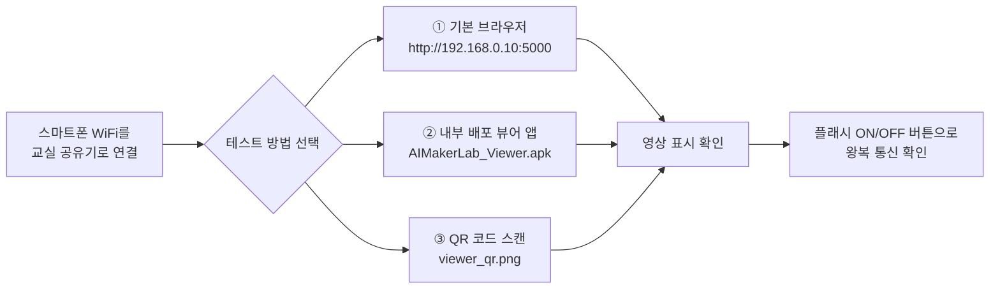

| 방법 | 대상 | 장점 | 준비물 |
|------|------|------|--------|
| 모바일 브라우저 | 안드로이드·iOS 공통 | 설치 0분, 가장 안전 | 서버 IP만 |
| 내부 배포 뷰어 앱(APK) | 안드로이드 | 전체화면·여러 팀 동시 보기 | USB/QR로 APK 전달, "알 수 없는 출처" 허용 |
| QR 코드 | 전체 | 주소 오타 없음 | 인쇄물 |

> iOS는 내부 배포 APK를 설치할 수 없으므로 **Safari 브라우저**로 테스트합니다. 수업 설계상 앱은 "결과를 확인하는 창"일 뿐이므로 기능 차이는 없습니다.

#### 앱 테스트 체크표 (학생 워크시트)

| # | 테스트 | 기대 결과 | 통과 |
|---|--------|----------|------|
| 1 | 폰 WiFi가 교실 공유기인가 | SSID 일치 | ☐ |
| 2 | 서버 주소 접속 | 페이지 열림 | ☐ |
| 3 | 우리 팀 영상 표시 | 카메라 흔들면 화면도 흔들림 | ☐ |
| 4 | 손으로 렌즈 가리기 | 화면 어두워짐 | ☐ |
| 5 | 플래시 ON 버튼 | 보드 LED 점등 | ☐ |
| 6 | 전송 간격 1000ms | 화면 갱신이 느려짐 | ☐ |
| 7 | ESP32 전원 뽑기 | 상태가 offline 으로 바뀜 | ☐ |

### 6.7 3시간 과정 성능 실험 (워크시트 기록)

| 해상도 | JPEG 품질 | 파일 크기 | 측정 FPS | 체감 |
|--------|----------|----------|----------|------|
| QVGA 320×240 | 15 | 약 8KB | | |
| VGA 640×480 | 12 | 약 25KB | | |
| SVGA 800×600 | 12 | 약 40KB | | |
| VGA 640×480 | 20 | 약 12KB | | |

> 결론으로 유도할 문장: **"화질 ↔ 속도는 맞바꾸는 관계이고, 네트워크를 함께 쓰면 모두가 느려진다."**

### 6.8 3시간 과정 완료 기준

| 레벨 | 기준 |
|------|------|
| 🥉 기본 | 카메라 초기화 성공 + WiFi 접속 성공(시리얼에 IP 출력) |
| 🥈 완성 | 서버 대시보드에 우리 팀 영상이 표시됨 |
| 🥇 심화 | 폰에서 플래시 제어 성공 + 해상도 실험 기록 완료 |

---

## 7. 6시간 과정 — 보게 하기

> 3시간 과정(전송)을 **그대로 재사용**하고, 서버 쪽에 컴퓨터비전을 붙입니다. 아두이노 코드는 거의 건드리지 않습니다.

### 7.1 목표와 완성물

| 항목 | 내용 |
|------|------|
| 한 줄 목표 | "서버가 사진을 '분석'해서 움직임·색·얼굴을 찾아낸다" |
| 완성물 | **2분할 모니터링 대시보드** (왼쪽 서버 상태 / 오른쪽 비전 결과) + 이벤트 자동 기록 |
| 새 개념 | 그레이스케일, 블러, 차영상, HSV 색공간, 임계값, 윤곽선, 캐스케이드 검출 |
| 학생 작업 | `cv_engine.py`의 파이프라인 함수 수정 + 임계값 튜닝 + 대시보드 확인 |
| 앱 활동 | 이벤트 알림 확인, 민감도 조절 버튼 테스트 |

### 7.2 타임테이블 (360분 = 3시간 × 2교시)

#### 1교시 (0~180분) — 3시간 과정 전체를 복습·완성

| 시간 | 분 | 활동 |
|------|----|------|
| 00:00 | 20 | 복습 + 지난 결과물 재가동 (기존 수강생은 10분) |
| 00:20 | 40 | ESP32-CAM 업로드 & 서버 전송 성공 (6장 내용) |
| 01:00 | 10 | 휴식 |
| 01:10 | 35 | "컴퓨터는 사진을 어떻게 보는가" — 픽셀·행렬 체험 |
| 01:45 | 10 | 휴식 |
| 01:55 | 45 | OpenCV 기초 3종: 흑백 / 블러 / 임계값 직접 적용 |
| 02:40 | 20 | 1교시 정리 + 결과 비교 |

#### 2교시 (180~360분) — 비전 시스템 구축

| 시간 | 분 | 활동 | 산출물 |
|------|----|------|--------|
| 03:00 | 30 | 움직임 감지(차영상) 구현 + 임계값 실험 | 움직임 반응 화면 |
| 03:30 | 30 | 색 검출(HSV) — 우리 팀 색을 추적 | 색 추적 박스 |
| 04:00 | 10 | 휴식 | - |
| 04:10 | 35 | 얼굴 검출(Haar Cascade) 적용 | 얼굴 박스 |
| 04:45 | 30 | 2분할 대시보드 완성 + 이벤트 로그 확인 | 대시보드 |
| 05:15 | 25 | 앱 테스트 — 민감도 조절, 이벤트 확인 | 테스트표 |
| 05:40 | 20 | 미니 미션 발표 ("우리 팀 감지기") | 시연 |

### 7.3 비전 파이프라인 도식

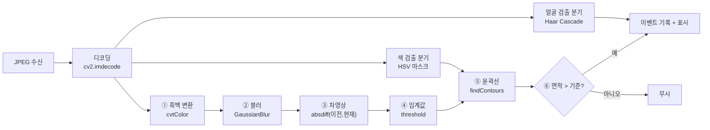

| 단계 | 함수 | 학생에게 설명하는 말 |
|------|------|-------------------|
| ① 흑백 | `cvtColor` | "색을 버리면 계산이 3배 빨라져" |
| ② 블러 | `GaussianBlur` | "잔 노이즈를 뭉개서 헛감지를 줄여" |
| ③ 차영상 | `absdiff` | "방금 사진과 지금 사진의 **다른 부분**만 남겨" |
| ④ 임계값 | `threshold` | "조금 다른 건 버리고, 많이 다른 건 흰색으로" |
| ⑤ 윤곽선 | `findContours` | "흰 덩어리의 테두리를 찾아서 세어" |
| ⑥ 판단 | 면적 비교 | "먼지는 작고, 사람은 커" |

### 7.4 `cv_engine.py` — 비전 엔진 모듈

```python
"""
AI MAKER LAB — 컴퓨터비전 엔진 (6시간 과정)
학생이 바꾸는 값은 CONFIG 딕셔너리뿐입니다.
"""
import cv2, numpy as np, time

CONFIG = {
    "mode": "motion",        # motion | color | face | none
    "motion_threshold": 25,  # 픽셀 차이 민감도 (작을수록 예민)
    "min_area": 1500,        # 이보다 작은 덩어리는 무시
    "blur": 21,              # 홀수만! (3,5,...,31)
    "color_low":  [35, 80, 80],    # HSV 하한 (기본: 초록)
    "color_high": [85, 255, 255],  # HSV 상한
    "draw_debug": True,      # 처리 과정 화면을 함께 만들까?
}

_prev_gray = None            # 이전 프레임(차영상용)
_cascade = cv2.CascadeClassifier(
    cv2.data.haarcascades + "haarcascade_frontalface_default.xml")


def _to_gray_blur(bgr):
    gray = cv2.cvtColor(bgr, cv2.COLOR_BGR2GRAY)
    k = CONFIG["blur"] | 1                     # 반드시 홀수로 보정
    return cv2.GaussianBlur(gray, (k, k), 0)


def detect_motion(bgr):
    """차영상으로 움직임 찾기 → (박스목록, 디버그영상)"""
    global _prev_gray
    gray = _to_gray_blur(bgr)
    if _prev_gray is None:
        _prev_gray = gray
        return [], gray
    diff = cv2.absdiff(_prev_gray, gray)
    _, mask = cv2.threshold(diff, CONFIG["motion_threshold"], 255, cv2.THRESH_BINARY)
    mask = cv2.dilate(mask, None, iterations=2)
    _prev_gray = gray

    boxes = []
    cnts, _ = cv2.findContours(mask, cv2.RETR_EXTERNAL, cv2.CHAIN_APPROX_SIMPLE)
    for c in cnts:
        if cv2.contourArea(c) < CONFIG["min_area"]:
            continue
        x, y, w, h = cv2.boundingRect(c)
        boxes.append({"label": "MOVE", "box": [x, y, w, h],
                      "area": int(cv2.contourArea(c))})
    return boxes, mask


def detect_color(bgr):
    """지정한 색만 남겨서 위치 찾기"""
    hsv = cv2.cvtColor(bgr, cv2.COLOR_BGR2HSV)
    mask = cv2.inRange(hsv, np.array(CONFIG["color_low"]),
                            np.array(CONFIG["color_high"]))
    mask = cv2.morphologyEx(mask, cv2.MORPH_OPEN, np.ones((5, 5), np.uint8))
    boxes = []
    cnts, _ = cv2.findContours(mask, cv2.RETR_EXTERNAL, cv2.CHAIN_APPROX_SIMPLE)
    for c in cnts:
        if cv2.contourArea(c) < CONFIG["min_area"]:
            continue
        x, y, w, h = cv2.boundingRect(c)
        boxes.append({"label": "COLOR", "box": [x, y, w, h],
                      "area": int(cv2.contourArea(c))})
    return boxes, mask


def detect_face(bgr):
    gray = cv2.cvtColor(bgr, cv2.COLOR_BGR2GRAY)
    faces = _cascade.detectMultiScale(gray, scaleFactor=1.2, minNeighbors=5,
                                      minSize=(40, 40))
    boxes = [{"label": "FACE", "box": [int(x), int(y), int(w), int(h)],
              "area": int(w * h)} for (x, y, w, h) in faces]
    return boxes, gray


def draw(bgr, boxes, fps=0.0, dev=""):
    """결과를 사람이 보도록 그려 주기"""
    out = bgr.copy()
    color = {"MOVE": (0, 255, 255), "COLOR": (0, 255, 0), "FACE": (255, 120, 0)}
    for b in boxes:
        x, y, w, h = b["box"]
        c = color.get(b["label"], (0, 0, 255))
        cv2.rectangle(out, (x, y), (x + w, y + h), c, 2)
        cv2.putText(out, f"{b['label']} {b['area']}", (x, max(14, y - 6)),
                    cv2.FONT_HERSHEY_SIMPLEX, 0.5, c, 1)
    cv2.putText(out, f"{dev}  {fps:.1f} fps  mode={CONFIG['mode']}  n={len(boxes)}",
                (8, 20), cv2.FONT_HERSHEY_SIMPLEX, 0.55, (255, 255, 255), 2)
    return out


def analyze(bgr, fps=0.0, dev=""):
    """서버가 호출하는 단일 입구"""
    t0 = time.time()
    mode = CONFIG["mode"]
    if   mode == "motion": boxes, dbg = detect_motion(bgr)
    elif mode == "color":  boxes, dbg = detect_color(bgr)
    elif mode == "face":   boxes, dbg = detect_face(bgr)
    else:                  boxes, dbg = [], None

    result_img = draw(bgr, boxes, fps, dev)
    debug_img = None
    if CONFIG["draw_debug"] and dbg is not None:
        debug_img = cv2.cvtColor(dbg, cv2.COLOR_GRAY2BGR)
    return {
        "mode": mode,
        "boxes": boxes,
        "count": len(boxes),
        "ms": round((time.time() - t0) * 1000, 1),
    }, result_img, debug_img
```

### 7.5 `app_step2.py` 추가분 — 서버에 비전 붙이기

```python
# app_step1.py 에서 달라지는 핵심 부분만 발췌
import cv2, numpy as np, collections
import cv_engine

events = collections.deque(maxlen=200)   # 최근 이벤트 200개

@app.post("/upload")
def upload():
    dev  = request.headers.get("X-Device-Id", "unknown")
    data = request.get_data()
    now  = time.time()

    # ① JPEG → 넘파이 이미지
    img = cv2.imdecode(np.frombuffer(data, np.uint8), cv2.IMREAD_COLOR)
    if img is None:
        return jsonify({"error": "decode fail"}), 400

    with lock:
        c  = cams.setdefault(dev, {"count": 0, "ts": now, "fps": 0.0})
        dt = now - c["ts"]
        fps = round(1 / dt, 1) if dt > 0 else 0.0

        # ② 컴퓨터비전 분석
        result, shown, debug = cv_engine.analyze(img, fps, dev)

        # ③ 결과를 다시 JPEG로 (브라우저 전송용)
        c["jpeg"]  = data
        c["shown"] = cv2.imencode(".jpg", shown)[1].tobytes()
        c["debug"] = cv2.imencode(".jpg", debug)[1].tobytes() if debug is not None else None
        c.update({"count": c["count"] + 1, "ts": now, "fps": fps,
                  "size": len(data), "result": result})

        # ④ 이벤트 기록 (감지되었을 때만)
        if result["count"] > 0:
            events.appendleft({"time": time.strftime("%H:%M:%S"), "dev": dev,
                               "mode": result["mode"], "n": result["count"],
                               "area": max(b["area"] for b in result["boxes"])})
    return jsonify(commands)


@app.get("/stream/<kind>/<dev>")           # kind: raw | shown | debug
def stream2(kind, dev):
    key = {"raw": "jpeg", "shown": "shown", "debug": "debug"}[kind]
    def gen():
        while True:
            with lock:
                f = cams.get(dev, {}).get(key)
            if f:
                yield (b"--f\r\nContent-Type: image/jpeg\r\n\r\n" + f + b"\r\n")
            time.sleep(0.05)
    return Response(gen(), mimetype="multipart/x-mixed-replace; boundary=f")


@app.get("/api/events")
def api_events():
    return jsonify(list(events)[:30])


@app.post("/api/config")                   # 대시보드 슬라이더가 호출
def api_config():
    body = request.get_json(force=True, silent=True) or {}
    for k in ("mode", "motion_threshold", "min_area", "blur", "draw_debug"):
        if k in body:
            cv_engine.CONFIG[k] = body[k]
    return jsonify(cv_engine.CONFIG)


@app.get("/dashboard")
def dashboard():
    return render_template("dashboard.html")
```

### 7.6 2분할 대시보드 — "서버"와 "비전"을 동시에

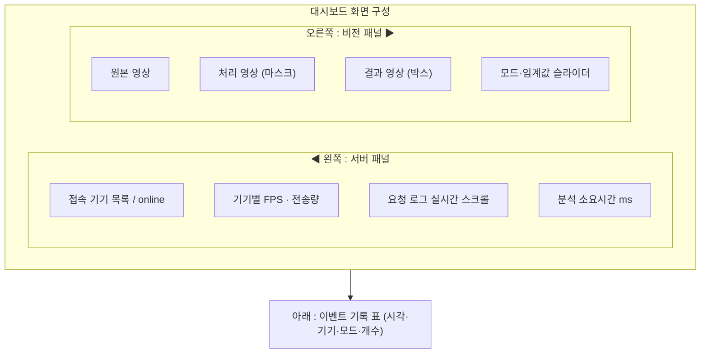

```html
<!-- templates/dashboard.html (핵심 골격) -->
<!doctype html>
<html lang="ko"><head><meta charset="utf-8">
<meta name="viewport" content="width=device-width,initial-scale=1">
<title>AI MAKER LAB — 비전 서버 대시보드</title>
<style>
 body{margin:0;font-family:system-ui,sans-serif;background:#0f172a;color:#e2e8f0}
 header{padding:12px 16px;background:#1e293b;font-weight:700}
 .wrap{display:grid;grid-template-columns:320px 1fr;gap:12px;padding:12px}
 @media(max-width:860px){.wrap{grid-template-columns:1fr}}   /* 폰에서 세로 배치 */
 .card{background:#1e293b;border-radius:10px;padding:12px}
 .logs{height:180px;overflow:auto;font:12px/1.5 monospace;background:#0b1220;padding:8px;border-radius:6px}
 .views{display:grid;grid-template-columns:repeat(3,1fr);gap:8px}
 @media(max-width:860px){.views{grid-template-columns:1fr}}
 img{width:100%;border-radius:6px;background:#000}
 table{width:100%;border-collapse:collapse;font-size:13px}
 th,td{border-bottom:1px solid #334155;padding:5px;text-align:center}
 .on{color:#4ade80}.off{color:#f87171}
</style></head><body>
<header>🧠 비전 서버 대시보드 — 왼쪽은 <b>서버</b>, 오른쪽은 <b>컴퓨터비전</b></header>

<div class="wrap">
  <!-- ◀ 서버 패널 -->
  <div class="card">
    <h3>📡 서버 상태</h3>
    <div>시간: <b id="t">-</b></div>
    <table id="devs"><tr><th>기기</th><th>FPS</th><th>프레임</th><th>상태</th></tr></table>
    <h4>요청 로그</h4><div class="logs" id="log"></div>
  </div>

  <!-- 비전 패널 ▶ -->
  <div class="card">
    <h3>👁 비전 결과</h3>
    <div>
      모드:
      <select id="mode" onchange="setCfg()">
        <option value="motion">움직임</option><option value="color">색</option>
        <option value="face">얼굴</option><option value="none">끄기</option>
      </select>
      민감도 <input type="range" id="th" min="5" max="80" value="25" onchange="setCfg()">
      최소면적 <input type="range" id="area" min="200" max="8000" step="100" value="1500" onchange="setCfg()">
    </div>
    <div class="views">
      <div>원본</div>
      <div>처리</div>
      <div>결과</div>
    </div>
  </div>
</div>

<div class="card" style="margin:12px">
  <h3>📋 이벤트 기록</h3>
  <table id="ev"><tr><th>시각</th><th>기기</th><th>모드</th><th>개수</th><th>최대면적</th></tr></table>
</div>

<script>
let cur = null;
function setCfg(){
  fetch('/api/config',{method:'POST',headers:{'Content-Type':'application/json'},
    body:JSON.stringify({mode:mode.value,
      motion_threshold:+th.value, min_area:+area.value})});
}
async function tick(){
  const s = await (await fetch('/api/status')).json();
  t.textContent = s.server_time;
  devs.innerHTML = '<tr><th>기기</th><th>FPS</th><th>프레임</th><th>상태</th></tr>' +
    s.devices.map(d=>`<tr><td>${d.id}</td><td>${d.fps}</td><td>${d.frames}</td>
      <td class="${d.online?'on':'off'}">${d.online?'online':'offline'}</td></tr>`).join('');
  if(!cur && s.devices.length){                 // 첫 기기를 자동 선택
    cur = s.devices[0].id;
    v1.src=`/stream/raw/${cur}`; v2.src=`/stream/debug/${cur}`; v3.src=`/stream/shown/${cur}`;
  }
  s.devices.forEach(d=>{
    log.insertAdjacentHTML('afterbegin',
      `[${s.server_time}] ${d.id} ${d.size}B ${d.fps}fps<br>`);
  });
  if(log.childNodes.length>200) log.innerHTML = log.innerHTML.slice(0,8000);

  const e = await (await fetch('/api/events')).json();
  ev.innerHTML = '<tr><th>시각</th><th>기기</th><th>모드</th><th>개수</th><th>최대면적</th></tr>' +
    e.map(x=>`<tr><td>${x.time}</td><td>${x.dev}</td><td>${x.mode}</td>
      <td>${x.n}</td><td>${x.area}</td></tr>`).join('');
}
setInterval(tick, 1000); tick();
</script>
</body></html>
```

### 7.7 임계값 실험 워크시트 (6시간 과정의 핵심 활동)

| 실험 | 바꾼 값 | 관찰: 헛감지 | 관찰: 놓침 | 적정값 판단 |
|------|---------|------------|-----------|-----------|
| 민감도 10 | motion_threshold=10 | | | |
| 민감도 25 | 기본값 | | | |
| 민감도 60 | | | | |
| 최소면적 300 | min_area=300 | | | |
| 최소면적 5000 | | | | |
| 블러 3 | blur=3 | | | |
| 블러 31 | | | | |
| 조명 끄기 | 환경 변화 | | | |

> 마무리 토론 질문: **"놓치지 않는 것"과 "헛감지 안 하는 것" 중 CCTV는 무엇을 더 중요하게 해야 할까?** (→ 정밀도/재현율 개념의 씨앗)

### 7.8 색 검출 HSV 값 표 (바로 쓰는 치트시트)

| 찾는 색 | color_low | color_high |
|---------|-----------|------------|
| 빨강(하단) | `[0, 120, 80]` | `[8, 255, 255]` |
| 빨강(상단) | `[170, 120, 80]` | `[180, 255, 255]` |
| 주황 | `[9, 120, 100]` | `[22, 255, 255]` |
| 노랑 | `[23, 100, 100]` | `[34, 255, 255]` |
| 초록 | `[35, 80, 80]` | `[85, 255, 255]` |
| 파랑 | `[95, 100, 60]` | `[130, 255, 255]` |
| 보라 | `[131, 80, 60]` | `[160, 255, 255]` |

> 빨강은 HSV 원형 양 끝에 걸쳐 있어 마스크 2장을 합쳐야 합니다 — "각도로 색을 표현하기 때문"이라는 좋은 설명 기회입니다.

### 7.9 미니 미션 (2교시 마지막, 팀별 선택)

| 미션 | 설정 | 성공 판정 |
|------|------|----------|
| 도둑 감지기 | motion + min_area 크게 | 사람이 지나갈 때만 이벤트 |
| 주차 감지기 | color(파랑 카드) | 카드 놓으면 이벤트, 치우면 해제 |
| 출석 체크기 | face | 얼굴 1개 이상 시 기록 |
| 공 추적기 | color(주황) + 박스 중심 좌표 표시 | 공을 따라 박스 이동 |

### 7.10 6시간 과정 완료 기준

| 레벨 | 기준 |
|------|------|
| 🥉 기본 | 3시간 내용 재현 + 흑백/블러/임계값 결과를 눈으로 확인 |
| 🥈 완성 | 움직임 또는 색 검출이 동작하고 대시보드에 박스가 그려짐 |
| 🥇 심화 | 임계값 실험 기록 완성 + 미니 미션 1개 시연 성공 |

---

## 8. 12시간 과정 — 스스로 판단하게 하기

> 6시간 과정 결과물에 **AI 모델**과 **규칙 엔진**, 그리고 **서버 → ESP32 역방향 제어**를 추가하여 팀별 프로젝트로 완성합니다.

### 8.1 목표와 완성물

| 항목 | 내용 |
|------|------|
| 한 줄 목표 | "AI가 무엇인지 알아보고, 서버가 스스로 장치에 명령을 내린다" |
| 완성물 | 팀별 **AI 자동 감지·대응 시스템** + 발표 자료 + 기록 데이터(CSV) |
| 새 개념 | 사전학습 모델, 클래스/신뢰도, 규칙 엔진, 쿨다운, 양방향 제어, 데이터 로깅 |
| 학생 작업 | 모델 선택 → 규칙 설계 → 임계값 튜닝 → 제어 연결 → 시연 |
| 앱 활동 | 원격 모니터링, 이벤트 확인, 수동/자동 모드 전환 테스트 |

### 8.2 전체 구성 (12시간 완성 시스템)

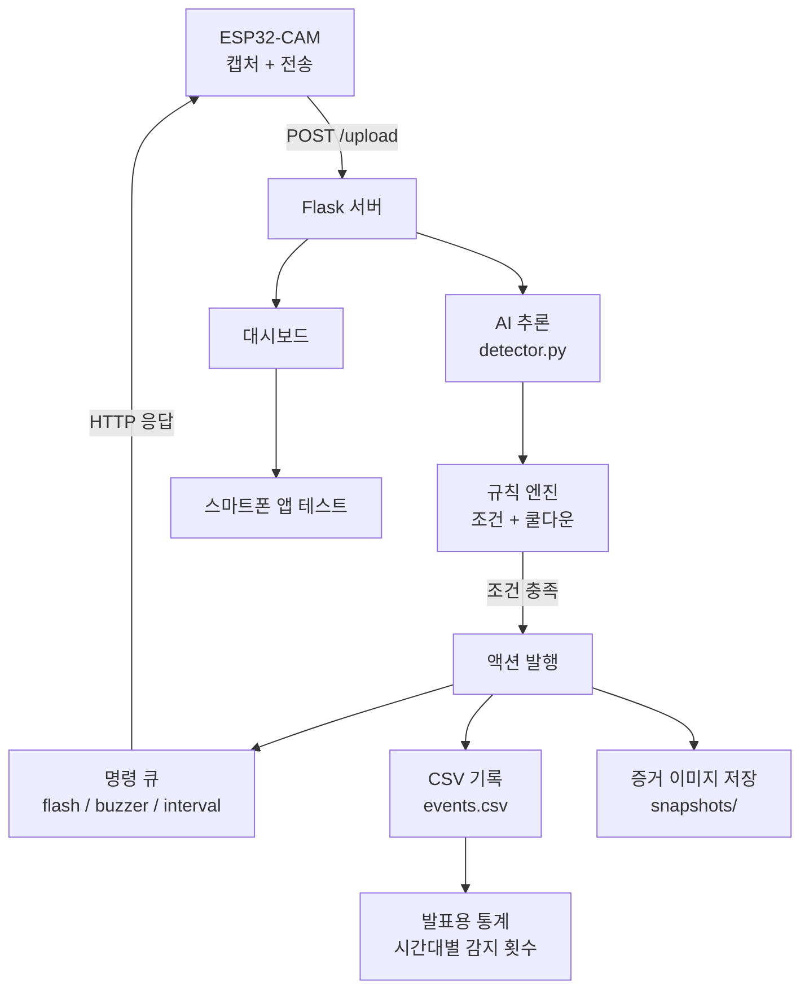

### 8.3 커리큘럼 구성 (360분 + 360분 = 720분 / 4회차 권장)

| 회차 | 시간 | 주제 | 주요 활동 | 산출물 |
|------|------|------|----------|--------|
| 1 | 0~180분 | 연결 | 3시간 과정 전체 (6장) | 전송 성공 |
| 2 | 180~360분 | 비전 | 6시간 과정 2교시 (7장) | 대시보드 |
| 3 | 360~540분 | AI | 모델 적용 + 규칙 엔진 + 역방향 제어 | AI 감지 동작 |
| 4 | 540~720분 | 프로젝트 | 팀 기획 → 제작 → 테스트 → 발표 | 완성 시스템·발표 |

#### 3회차 상세 (360~540분)

| 시간 | 분 | 활동 | 형태 |
|------|----|------|------|
| 06:00 | 25 | "AI 인식은 무엇이 다른가" — 규칙 vs 학습 비교 시연 | 강의·시연 |
| 06:25 | 35 | `detector.py` 연결, YOLO로 사람·물건 인식 확인 | 실습 |
| 07:00 | 10 | 휴식 | - |
| 07:10 | 35 | 신뢰도(confidence) 실험 — 0.25 / 0.5 / 0.8 비교 | 실습 |
| 07:45 | 30 | 규칙 엔진 작성: "무엇이 몇 초 이상 보이면 무엇을 한다" | 실습 |
| 08:15 | 10 | 휴식 | - |
| 08:25 | 35 | ESP32 역방향 제어(`cam_04_control.ino`) — LED·부저 | 실습 |
| 09:00 | 0 | 3회차 종료 | - |

#### 4회차 상세 (540~720분)

| 시간 | 분 | 활동 | 형태 |
|------|----|------|------|
| 09:00 | 30 | 팀 기획: 문제 정의 → 감지 대상 → 대응 동작 (기획서 작성) | 팀활동 |
| 09:30 | 50 | 제작 1: 모델 적용 + 규칙 구현 | 실습 |
| 10:20 | 15 | 휴식 | - |
| 10:35 | 40 | 제작 2: 설치 위치·조명 조정, 오탐 줄이기 | 실습 |
| 11:15 | 20 | 테스트: 앱으로 원격 확인, CSV 데이터 확보 | 실습 |
| 11:35 | 25 | 발표 + 상호 평가 + 마무리 | 발표 |
| **합계** | **180** | 09:00 ~ 12:00 (12시간 과정 종료) | - |

### 8.4 AI 모델 선택 — 두 트랙

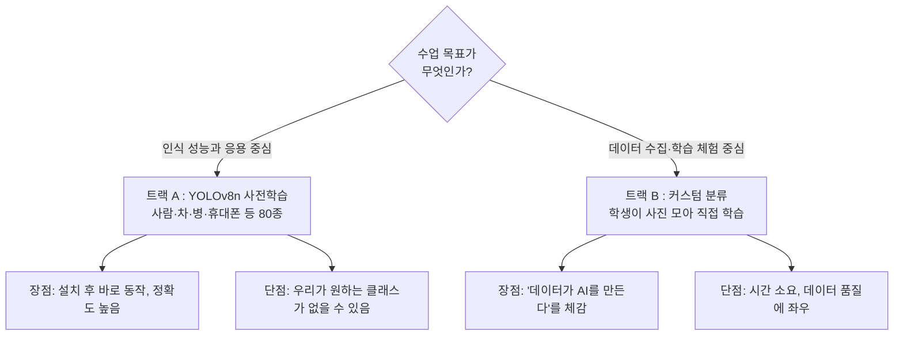

| 비교 | 트랙 A (YOLOv8n) | 트랙 B (커스텀 분류) |
|------|------------------|---------------------|
| 설치 | `pip install ultralytics` + `yolov8n.pt`(6MB) | Teachable Machine 등으로 내보낸 모델 |
| 추론 속도(CPU) | 80~250ms / 프레임 | 10~40ms / 프레임 |
| 수업 소요 | 35분 | 70분 (데이터 수집 포함) |
| 결과물 | 박스 + 클래스명 + 신뢰도 | 클래스명 + 확률 |
| 권장 학년 | 중1~고3 | 초6~중3 |
| 권장 상황 | 12시간 기본 | 데이터 교육 비중을 높일 때 |

> **12시간 표준 진행은 트랙 A**로 하고, 남는 시간이나 심화반에서 트랙 B를 추가하는 구성을 권장합니다. 두 트랙 모두 `detector.py` 하나만 교체하면 되도록 설계했습니다.

### 8.5 `detector.py` — AI 모델 래퍼

```python
"""
AI MAKER LAB — AI 추론 래퍼 (12시간 과정)
모델 파일: 05_offline/yolov8n.pt  (사전 배포)
"""
import time
from ultralytics import YOLO

MODEL_PATH = "../05_offline/yolov8n.pt"

SETTINGS = {
    "conf": 0.45,                       # 신뢰도 하한
    "targets": ["person", "cell phone", "bottle", "cup", "book"],  # 관심 클래스
    "imgsz": 320,                       # 작게 하면 빠름 (320/416/640)
}

_model = YOLO(MODEL_PATH)
CLASS_NAMES = _model.names


def infer(bgr):
    """BGR 이미지 → 검출 목록"""
    t0 = time.time()
    res = _model.predict(bgr, conf=SETTINGS["conf"], imgsz=SETTINGS["imgsz"],
                         verbose=False)[0]
    out = []
    for b in res.boxes:
        name = CLASS_NAMES[int(b.cls)]
        if SETTINGS["targets"] and name not in SETTINGS["targets"]:
            continue
        x1, y1, x2, y2 = map(int, b.xyxy[0])
        out.append({
            "label": name,
            "conf": round(float(b.conf), 2),
            "box": [x1, y1, x2 - x1, y2 - y1],
            "area": (x2 - x1) * (y2 - y1),
        })
    return out, round((time.time() - t0) * 1000, 1)
```

| 설정 | 값을 올리면 | 값을 내리면 |
|------|-----------|-----------|
| `conf` | 확실한 것만 감지(놓침↑) | 많이 감지(헛감지↑) |
| `imgsz` | 작은 물체도 인식, 느려짐 | 빨라지지만 작은 물체 놓침 |
| `targets` | 비우면 80종 전부 | 좁히면 화면이 깔끔 |

### 8.6 규칙 엔진 — "보면 어떻게 할까"를 코드로

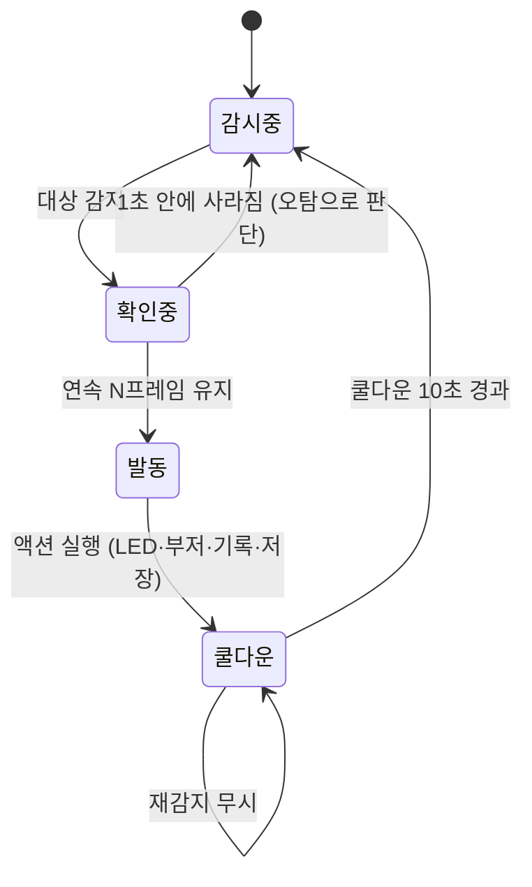

```python
"""rules.py — 규칙 엔진 (학생이 RULES 리스트를 설계합니다)"""
import time, csv, os, cv2

RULES = [
    # 이름,       감지 라벨,     최소개수, 연속프레임, 쿨다운(초), 액션
    {"name": "사람감지경보", "label": "person",     "min_n": 1, "hold": 3, "cooldown": 10,
     "actions": {"flash": True, "buzzer": True, "snapshot": True}},
    {"name": "휴대폰발견",   "label": "cell phone", "min_n": 1, "hold": 2, "cooldown": 15,
     "actions": {"flash": True, "buzzer": False, "snapshot": True}},
]

_state = {}                                     # 규칙별 진행 상황
LOG_PATH = "events.csv"
SNAP_DIR = "snapshots"
os.makedirs(SNAP_DIR, exist_ok=True)


def _log(row):
    new = not os.path.exists(LOG_PATH)
    with open(LOG_PATH, "a", newline="", encoding="utf-8-sig") as f:
        w = csv.writer(f)
        if new:
            w.writerow(["time", "device", "rule", "label", "count", "conf"])
        w.writerow(row)


def evaluate(dev, detections, image, commands):
    """감지 결과 → 규칙 판단 → 명령/기록. 발동된 규칙 이름 목록을 돌려줌"""
    fired, now = [], time.time()
    for r in RULES:
        key = (dev, r["name"])
        st = _state.setdefault(key, {"streak": 0, "last": 0})
        hits = [d for d in detections if d["label"] == r["label"]]

        if len(hits) >= r["min_n"]:
            st["streak"] += 1
        else:
            st["streak"] = 0
            continue

        if st["streak"] < r["hold"]:              # 아직 확인 단계
            continue
        if now - st["last"] < r["cooldown"]:      # 쿨다운 중이면 무시
            continue

        st["last"], st["streak"] = now, 0
        a = r["actions"]
        commands["flash"]  = bool(a.get("flash"))
        commands["buzzer"] = bool(a.get("buzzer"))
        if a.get("snapshot"):
            fn = f"{SNAP_DIR}/{dev}_{time.strftime('%H%M%S')}_{r['name']}.jpg"
            cv2.imwrite(fn, image)
        _log([time.strftime("%Y-%m-%d %H:%M:%S"), dev, r["name"], r["label"],
              len(hits), max(h["conf"] for h in hits)])
        fired.append(r["name"])
    return fired
```

| 파라미터 | 역할 | 교육 포인트 |
|---------|------|-----------|
| `hold`(연속 프레임) | 한 프레임 오탐을 걸러냄 | "한 번 본 걸로 경보를 울리면 안 되는 이유" |
| `cooldown` | 같은 사건 중복 경보 방지 | "알림 폭탄 방지 = 사용자 경험" |
| `min_n` | 몇 명/몇 개 이상일 때 | 조건 설계 능력 |
| `snapshot` | 증거 이미지 저장 | 데이터 수집·기록 윤리 |

### 8.7 `app_step3.py` 연결부

```python
# 6시간 서버에 AI와 규칙만 얹습니다
import detector, rules

@app.post("/upload")
def upload():
    dev  = request.headers.get("X-Device-Id", "unknown")
    img  = cv2.imdecode(np.frombuffer(request.get_data(), np.uint8), cv2.IMREAD_COLOR)
    if img is None:
        return jsonify({"error": "decode fail"}), 400

    if commands.get("ai_on", True):
        dets, ms = detector.infer(img)                 # ① AI 추론
    else:
        dets, ms = cv_engine.detect_motion(img)[0], 0  # 가벼운 대체 모드

    fired = rules.evaluate(dev, dets, img, commands)   # ② 규칙 판단 → 명령 갱신
    shown = cv_engine.draw(img, dets, dev=dev)         # ③ 결과 그리기

    with lock:
        c = cams.setdefault(dev, {"count": 0, "ts": time.time()})
        c["shown"]  = cv2.imencode(".jpg", shown)[1].tobytes()
        c["jpeg"]   = request.get_data()
        c["result"] = {"boxes": dets, "count": len(dets), "ms": ms, "fired": fired}
        c["ts"], c["count"] = time.time(), c["count"] + 1
        if fired:
            events.appendleft({"time": time.strftime("%H:%M:%S"), "dev": dev,
                               "mode": "ai", "n": len(dets), "rule": ", ".join(fired)})
    return jsonify(commands)                           # ④ ESP32에 명령 전달


@app.get("/api/report")                                # 발표용 통계
def report():
    import collections
    cnt = collections.Counter(e.get("rule", "-") for e in events)
    return jsonify({"total": len(events), "by_rule": cnt.most_common()})
```

### 8.8 `cam_04_control.ino` — 서버 명령으로 동작하는 ESP32

```cpp
/* 3시간 펌웨어에 추가되는 부분만 발췌 */
#define BUZZER_PIN 13          // 부저 (GPIO 12/13/15 중 사용)

uint32_t flashOffAt = 0, buzzOffAt = 0;

void applyCommand(const String& json) {
  // ① 플래시: 명령이 오면 1.5초만 켠다 (자동 소등)
  if (json.indexOf("\"flash\":true") >= 0) {
    digitalWrite(FLASH_LED_PIN, HIGH);
    flashOffAt = millis() + 1500;
  }
  // ② 부저: 0.4초 경보음
  if (json.indexOf("\"buzzer\":true") >= 0) {
    tone(BUZZER_PIN, 2000);
    buzzOffAt = millis() + 400;
  }
  // ③ 전송 간격 변경
  int i = json.indexOf("\"interval\":");
  if (i >= 0) {
    uint32_t v = json.substring(i + 11).toInt();
    if (v >= 100 && v <= 5000) sendInterval = v;
  }
}

void serviceOutputs() {        // loop() 안에서 매번 호출
  if (flashOffAt && millis() > flashOffAt) { digitalWrite(FLASH_LED_PIN, LOW); flashOffAt = 0; }
  if (buzzOffAt  && millis() > buzzOffAt)  { noTone(BUZZER_PIN); buzzOffAt = 0; }
}

void loop() {
  if (WiFi.status() != WL_CONNECTED) { connectWiFi(); return; }
  sendFrame();
  serviceOutputs();
  delay(sendInterval);
}
```

> ⚠️ ESP32-CAM은 사용 가능한 GPIO가 적습니다. **GPIO 12 / 13 / 15 / 14 / 2** 만 여유가 있고, **GPIO 0은 업로드 모드와 충돌**하므로 절대 사용하지 않습니다. 부저는 GPIO 13을 기본으로 안내하세요.

| 사용 가능 핀 | 용도 예시 | 주의 |
|------------|----------|------|
| GPIO 13 | 부저 | 권장 기본값 |
| GPIO 12 | LED / 릴레이 | 부팅 시 HIGH면 문제 가능 |
| GPIO 15 | 서보 신호 | SD카드 사용 시 충돌 |
| GPIO 2, 14 | 예비 | SD카드 사용 시 충돌 |
| GPIO 4 | 내장 플래시 LED | 이미 연결됨 |
| GPIO 0 | **사용 금지** | 업로드 모드 핀 |

### 8.9 팀 프로젝트 주제 (4회차)

| # | 주제 | 감지 대상 | 대응 동작 | 난이도 |
|---|------|----------|----------|--------|
| 1 | 무인 매장 도난 감시 | person + 쿨다운 | 플래시 + 스냅샷 + 기록 | ★★ |
| 2 | 교실 집중 알림 | cell phone | 부저 + 기록 | ★★ |
| 3 | 분리배출 도우미 | bottle / cup | 색 LED 신호 + 카운트 | ★★★ |
| 4 | 반려동물 급식 확인 | bowl + 움직임 | 사진 기록 + 시간 통계 | ★★★ |
| 5 | 안전구역 침입 감지 | person + 영역(ROI) 조건 | 경보 + CSV | ★★★★ |
| 6 | 출입 인원 카운터 | person 수 변화 | 누적 통계 대시보드 | ★★★★ |

#### 기획서 양식 (`기획서_12h.pdf`)

| 항목 | 작성 내용 |
|------|----------|
| 문제 정의 | 누가, 어떤 상황에서 불편한가 |
| 감지 대상 | 어떤 라벨/색/움직임을 볼 것인가 |
| 판단 규칙 | 무엇이 몇 개, 몇 프레임 이상이면 |
| 대응 동작 | LED / 부저 / 기록 / 스냅샷 중 선택 |
| 설치 위치 | 카메라 높이·각도·조명 |
| 테스트 계획 | 성공 3회 / 실패 사례 2개 기록 |
| 한계와 개선 | 오탐 원인과 다음 개선안 |

### 8.10 발표 구성 (팀당 5분)

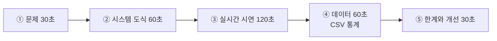

| 발표 요소 | 평가 기준 |
|----------|----------|
| 시스템 도식 | 카메라·공유기·서버·앱의 역할을 본인 말로 설명 |
| 실시간 시연 | 감지 성공 1회 + 오탐 상황 설명 |
| 데이터 | 감지 횟수, 시간대 분포, 오탐률 |
| 한계 | "조명이 어두우면 놓친다" 같은 구체적 관찰 |

### 8.11 12시간 과정 완료 기준

| 레벨 | 기준 |
|------|------|
| 🥉 기본 | AI 모델이 동작하고 화면에 라벨·신뢰도가 표시됨 |
| 🥈 완성 | 규칙 1개가 발동하여 ESP32의 LED/부저가 동작하고 CSV가 기록됨 |
| 🥇 심화 | 팀 주제 시스템 완성 + 오탐 개선 과정을 데이터로 설명 + 발표 |

---

## 9. 평가 루브릭

### 9.1 공통 루브릭 (4단계)

| 영역 | 4점 (우수) | 3점 (양호) | 2점 (보통) | 1점 (지원 필요) |
|------|-----------|-----------|-----------|----------------|
| 하드웨어 | 혼자 업로드·배선·문제해결 | 혼자 업로드 가능 | 안내로 완료 | 교사 개입 필요 |
| 네트워크 이해 | IP·포트·서버 관계를 설명 | 설정값의 의미를 안다 | 따라 입력 | 개념 미형성 |
| 코드 이해 | 값을 바꾸고 결과를 예측 | 바꾼 결과를 설명 | 지시대로 수정 | 수정 어려움 |
| 비전 이해 | 임계값 트레이드오프 설명 | 전처리 단계 설명 | 결과만 확인 | - |
| 문제 해결 | 원인 가설 → 검증 | 체크리스트 활용 | 질문으로 해결 | 포기 |
| 협업·발표 | 역할 분담 + 명확한 시연 | 맡은 역할 수행 | 참여 | 소극적 |

### 9.2 과정별 적용 영역

| 영역 | 3시간 | 6시간 | 12시간 |
|------|-------|-------|--------|
| 하드웨어 | ✅ | ✅ | ✅ |
| 네트워크 이해 | ✅ | ✅ | ✅ |
| 코드 이해 | ✅ | ✅ | ✅ |
| 비전 이해 | - | ✅ | ✅ |
| 문제 해결 | - | ✅ | ✅ |
| 협업·발표 | - | - | ✅ |
| **만점** | **12점** | **20점** | **24점** |

### 9.3 산출물 체크리스트

| 과정 | 제출물 |
|------|--------|
| 3시간 | 워크시트(시스템 도식 + 앱 테스트표 + 해상도 실험표), 동작 사진 |
| 6시간 | 위 + 임계값 실험표, 미니 미션 시연 영상 30초 |
| 12시간 | 위 + 기획서, `events.csv`, 스냅샷 3장, 발표 슬라이드 5장 |

---

## 10. 트러블슈팅

### 10.1 증상별 결정트리

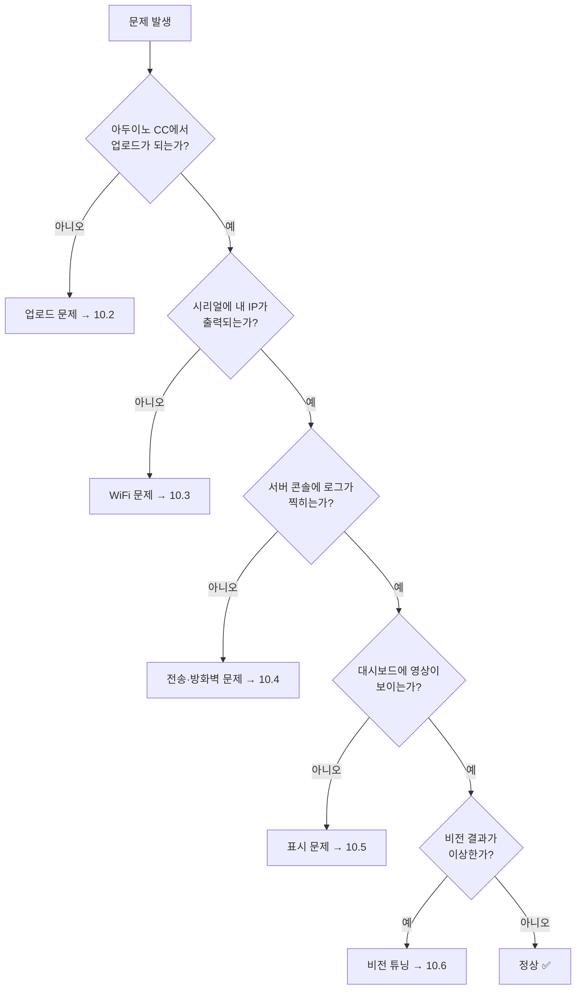

### 10.2 업로드 문제

| 증상 | 원인 | 해결 |
|------|------|------|
| 포트가 안 보임 | USB 드라이버 없음 / 충전전용 케이블 | CH340·CP210x 설치, 케이블 교체 |
| `Failed to connect to ESP32` | 부트 모드 진입 실패 | 업로드 시작 직후 RST 1회 누르기 / IO0-GND 확인 |
| `Sketch too big` | 파티션 설정 기본값 | Partition Scheme → **Huge APP** |
| `Camera probe failed (0x105)` | 카메라 리본 접촉 불량 | 커넥터 걸쇠 재장착, 먼지 제거 |
| `Brownout detector was triggered` | 전원 부족 | 전원공급 USB 허브, 다른 포트, 케이블 교체 |
| 업로드 후 계속 재부팅 | PSRAM 설정 / 전원 | PSRAM Enabled 확인 + 전원 보강 |
| `A fatal error occurred: ... Timed out` | 업로드 속도 과다 | Upload Speed를 115200으로 낮춤 |

### 10.3 WiFi 접속 문제

| 증상 | 원인 | 해결 |
|------|------|------|
| 점(`....`)만 계속 출력 | **5GHz SSID 입력** | 2.4GHz SSID로 변경 (1순위 점검) |
| 접속 후 끊김 반복 | 전파 약함 / 동시 접속 과다 | 공유기 근처로 이동, 전송 간격 500ms로 |
| 비밀번호 맞는데 실패 | SSID에 공백·한글·특수문자 | SSID를 영문+숫자로 변경 |
| 일부 팀만 실패 | DHCP 주소 고갈 | 공유기 DHCP 범위 확장 |

### 10.4 전송 문제 (서버 로그에 아무것도 없음)

| 증상 | 원인 | 해결 |
|------|------|------|
| `code=-1` | 서버 IP 오류 / 서버 미실행 | `find_ip.bat`로 IP 재확인, 서버 실행 확인 |
| `code=-1` (IP 정상) | **Windows 방화벽 차단** | 방화벽에서 Python 인바운드 허용(사설망) |
| `code=404` | 경로 오타 | `/upload` 철자 확인 |
| `code=500` | 서버 예외 | 서버 콘솔의 빨간 메시지 확인 |
| 한 팀만 실패 | AP 격리 ON | 공유기 설정에서 격리 OFF |
| macOS에서 전부 실패 | 5000 포트를 AirPlay가 점유 | 포트 5001로 변경(서버·펌웨어 모두) |

### 10.5 화면 표시 문제

| 증상 | 원인 | 해결 |
|------|------|------|
| 회색 화면만 | 아직 프레임 미수신 | ESP32 전원·로그 확인 |
| 영상이 매우 느림 | 여러 팀이 동시에 고화질 전송 | VGA + 품질 15 + 간격 400ms로 통일 |
| 영상이 깨짐 | JPEG 전송 중 끊김 | 전송 간격 늘리기, 공유기 근처로 |
| 폰에서만 안 보임 | 폰이 다른 WiFi(LTE) 사용 | 교실 공유기로 연결, 데이터 OFF |
| 화면이 뒤집힘 | 카메라 장착 방향 | `s->set_vflip(s, 1)` 추가 |

### 10.6 비전 결과 튜닝

| 증상 | 조정 |
|------|------|
| 아무것도 감지 안 됨 | `motion_threshold` 낮추기, `min_area` 낮추기, 조명 밝게 |
| 가만히 있어도 계속 감지 | `motion_threshold` 올리기, `blur` 올리기, 형광등 깜빡임·창문 햇빛 차단 |
| 색 검출이 엉뚱함 | HSV 표 재확인, 조명 변화 최소화, `min_area` 상향 |
| 얼굴 검출 실패 | 정면·밝은 조명 필요, 거리 1m 내, `minSize` 축소 |
| AI가 느림 | `imgsz` 320으로, `targets` 축소, 전송 간격 500ms |
| AI 오탐 많음 | `conf` 0.5~0.6, `hold` 3~5프레임 |

### 10.7 서버 단독 점검 도구 — `mock_cam.py`

```python
"""PC 웹캠을 ESP32-CAM처럼 서버에 전송 — 하드웨어 문제와 서버 문제를 분리"""
import cv2, requests, time, sys

URL = sys.argv[1] if len(sys.argv) > 1 else "http://127.0.0.1:5000/upload"
DEV = sys.argv[2] if len(sys.argv) > 2 else "mock-01"

cap = cv2.VideoCapture(0)
print(f"→ {URL} 로 전송 시작 (q 로 종료)")
while True:
    ok, frame = cap.read()
    if not ok:
        print("웹캠을 열 수 없습니다"); break
    jpg = cv2.imencode(".jpg", frame, [cv2.IMWRITE_JPEG_QUALITY, 70])[1].tobytes()
    try:
        r = requests.post(URL, data=jpg, timeout=3,
                          headers={"Content-Type": "image/jpeg", "X-Device-Id": DEV})
        print(f"{len(jpg):,}B → {r.status_code} {r.text[:60]}")
    except Exception as e:
        print("전송 실패:", e)
    time.sleep(0.3)
```

```bash
# 사용 예 (서버 PC에서)
python 04_tools/mock_cam.py http://192.168.0.10:5000/upload mock-01
```

| 결과 | 진단 |
|------|------|
| mock은 되고 ESP32는 안 됨 | **하드웨어·WiFi 문제** (10.2 / 10.3) |
| mock도 안 됨 | **서버·방화벽 문제** (10.4) |

---

## 11. 강사 운영 가이드

### 11.1 수업 운영 원칙

| 원칙 | 실천 방법 |
|------|----------|
| 15분 안에 첫 성공 | 첫 활동은 "카메라 LED 깜빡임" 같은 즉시 확인 가능한 것으로 |
| 칠판 3정보 상주 | SSID / 비밀번호 / 서버 IP:PORT 를 크게 적어두기 |
| 팀 번호 = 기기 ID | `cam-01`~`cam-10` 스티커를 보드에 부착 |
| 전송 설정 통일 | VGA / 품질 15 / 간격 400ms — 네트워크 포화 방지 |
| 먼저 끝난 팀은 조교 | "도움 준 팀" 가점 운영 |
| 실패를 수업 소재로 | 오탐·끊김을 그대로 보여주고 원인 토론 |

### 11.2 플랜 B (상황별 대체 진행)

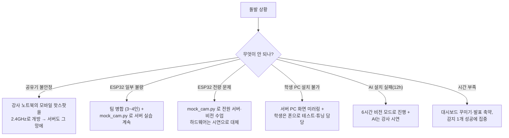

### 11.3 20명 교실 네트워크 권장 설정

| 항목 | 권장값 | 이유 |
|------|--------|------|
| 해상도 | VGA 640×480 | 비전 처리에 충분 |
| JPEG 품질 | 15 | 용량 약 15KB |
| 전송 간격 | 400ms (팀당 2.5fps) | 10팀 × 15KB × 2.5 ≈ 375KB/s → 여유 |
| 서버 스레드 | `threaded=True` | 동시 수신 |
| 대시보드 동시 접속 | 5대 이하 권장 | MJPEG는 접속마다 대역폭 소모 |
| AI 추론 | 12시간 과정은 2~3팀씩 교대 | CPU 추론 부하 분산 |

### 11.4 안전 수칙

| 항목 | 지도 내용 |
|------|----------|
| 전원 | USB 5V만 사용. 리튬 배터리 직결 금지 |
| 발열 | ESP32-CAM은 동작 중 따뜻해짐(정상). 60℃ 이상 뜨거우면 즉시 분리 |
| 카메라 리본 | 전원 켠 상태에서 탈착 금지 |
| 렌즈 | 손으로 만지지 않기, 초점 링은 교사 지도 하에 |
| 정전기 | 보드는 가장자리를 잡기 |
| 부저 | 2000Hz 연속음은 귀에 가까이 두지 않기 |

### 11.5 촬영·개인정보 수칙 (얼굴 인식 수업 필수)

| 원칙 | 실천 |
|------|------|
| 사전 동의 | 얼굴 검출 실습 전 "서로 찍히는 것"에 대한 동의 확인 |
| 대체 수단 | 동의하지 않는 학생은 인형·사진·색 카드로 실습 |
| 저장 최소화 | 스냅샷은 수업용 폴더에만, **수업 종료 후 전원 앞에서 삭제** |
| 외부 전송 금지 | 모든 데이터는 교실 내부망에만 존재 (클라우드 업로드 없음) |
| 공유 금지 | 촬영물 SNS 업로드 금지 명시 |
| 교육 연결 | "CCTV·AI 감시의 편익과 사생활"을 12시간 과정 토론 주제로 |

### 11.6 수업 종료 정리 절차

| # | 작업 |
|---|------|
| 1 | ESP32 전원 분리, 카메라 모듈 그대로 보관(탈착 반복 금지) |
| 2 | 서버 종료(Ctrl+C), `snapshots/` 폴더 학생 확인 후 삭제 |
| 3 | `events.csv`만 보존(개인 식별 정보 없음) → 다음 차시 분석 자료 |
| 4 | 기기 번호 스티커 유지, 불량품 별도 보관 |
| 5 | 다음 차시 안내: 3시간 → 6시간 → 12시간 연결 지점 설명 |

---

## 12. FAQ

| # | 질문 | 답변 |
|---|------|------|
| 1 | 인터넷이 없어도 수업이 되나요? | 됩니다. 공유기만 있으면 내부망으로 전 과정 동작합니다. 단 설치 파일은 사전 배포(USB)가 필요합니다. |
| 2 | 왜 앱을 직접 만들지 않나요? | 앱 제작에 2~3시간이 소모되어 서버·비전 학습 시간이 사라집니다. 이 과정의 목표는 "서버와 컴퓨터비전"이며, 앱은 결과를 확인하는 창 역할만 합니다. |
| 3 | 아이폰으로도 테스트되나요? | Safari 브라우저로 동일하게 가능합니다. 내부 배포 APK는 안드로이드 전용입니다. |
| 4 | 왜 5GHz WiFi가 안 되나요? | ESP32 칩이 2.4GHz만 지원합니다. 공유기에서 2.4GHz SSID를 분리 노출해야 합니다. |
| 5 | 서버를 클라우드에 올리면 안 되나요? | 교육 목적상 "내 컴퓨터가 서버"임을 체감하는 것이 핵심이고, 개인정보·비용·네트워크 정책 문제도 피할 수 있습니다. |
| 6 | 라즈베리파이로 대체할 수 있나요? | 가능합니다. Flask·OpenCV 코드가 동일하게 동작하며, 서버 PC 대신 라즈베리파이 4/5(4GB 이상)를 쓰면 됩니다. YOLO는 속도가 낮아집니다. |
| 7 | 12시간에 AI 모델을 직접 학습시키나요? | 표준 과정은 사전학습 모델(트랙 A)입니다. 데이터 수집·학습 체험을 원하면 트랙 B를 선택합니다(8.4 참조). |
| 8 | 20대가 동시에 돌아가면 느려지지 않나요? | 11.3 권장 설정(VGA/품질15/400ms)이면 여유가 있습니다. AI 추론은 팀을 교대로 운영합니다. |
| 9 | 아두이노 CC 웹 에디터로 해도 되나요? | 가능하지만 인터넷과 Create Agent 설치가 필요합니다. 학교 네트워크 정책상 IDE 2.x를 기본으로 권장합니다. |
| 10 | 3시간만 듣고 끝낼 수 있나요? | 네. 3시간만으로도 "실시간 카메라 뷰어"라는 완성물이 남습니다. 6·12시간은 같은 교구를 그대로 확장합니다. |
| 11 | 초등학생도 가능한가요? | 3시간 과정은 초6부터 가능합니다. 설정값 입력과 앱 테스트 중심으로 운영하고, 코드 독해는 생략합니다. |
| 12 | 기존 ESP32 스마트카 커리큘럼과 어떻게 다르나요? | 스마트카는 '제어·주행'이 중심이고, 본 과정은 '서버·컴퓨터비전'이 중심입니다. 같은 ESP32-CAM 교구를 공유하므로 병행·연계 운영이 가능합니다. |
| 13 | 학생 노트북이 부족하면? | 2인 1팀에서 1대만 사용하면 됩니다. 한 명이 아두이노, 한 명이 폰으로 테스트하는 역할 분담이 오히려 효과적입니다. |
| 14 | 결과물을 집에서도 돌려볼 수 있나요? | 집 공유기 SSID와 가정 PC IP로 설정값 3줄만 바꾸면 동작합니다. 패키지에 가정용 설치 안내를 포함합니다. |

---

## 13. 부록 — 빠른 참조 카드

### 13.1 API 요약

| 메서드 | 경로 | 호출 주체 | 설명 |
|--------|------|----------|------|
| POST | `/upload` | ESP32-CAM | JPEG 수신, 응답으로 명령 전달 |
| GET | `/stream/<dev>` | 브라우저·앱 | MJPEG 스트리밍 (3시간) |
| GET | `/stream/<kind>/<dev>` | 브라우저·앱 | raw / debug / shown 선택 (6·12시간) |
| GET | `/api/status` | 앱·대시보드 | 서버 시간, 기기 목록, FPS |
| GET | `/api/events` | 대시보드 | 최근 이벤트 30건 |
| GET | `/api/report` | 대시보드 | 규칙별 발동 통계 (12시간) |
| POST | `/api/command` | 앱·대시보드 | 플래시·부저·전송 간격 변경 |
| POST | `/api/config` | 대시보드 | 비전 모드·임계값 변경 |
| GET | `/dashboard` | 브라우저 | 2분할 대시보드 |

### 13.2 명령 JSON 형식

```json
{ "flash": true, "buzzer": false, "interval": 400, "ai_on": true }
```

### 13.3 한 장 요약

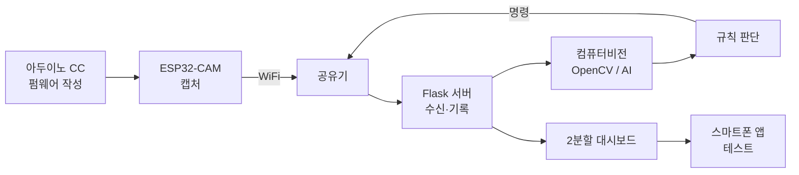

| 과정 | 시간 | 완성물 | 핵심 기술 |
|------|------|--------|----------|
| 1단계 | 3시간 | 실시간 카메라 뷰어 | 아두이노 CC, WiFi, HTTP POST, Flask |
| 2단계 | 6시간 | 비전 모니터링 시스템 | OpenCV 전처리·차영상·HSV·Cascade, 대시보드 |
| 3단계 | 12시간 | AI 자동 감지·대응 시스템 | YOLO 추론, 규칙 엔진, 양방향 제어, 데이터 기록 |

---

## 📝 문서 정보

| 항목 | 내용 |
|------|------|
| 문서명 | 아두이노 CC × ESP32-CAM × Flask 컴퓨터비전 프로젝트 커리큘럼 |
| 버전 | v1.0 |
| 작성일 | 2026-10-05 |
| 작성 | AI MAKER LAB |
| 관련 문서 | `맛보기_아두이노_ESP32.md`(스마트카 트랙), `로봇팔_컴퓨터비전_융합_커리큘럼.md`, `4단계-PHYSICAL_COMPUTING_CURRICULUM.md` |
| 연계 페이지 | `/curriculum/arduino` |
| 배포 패키지 | `ESP32CAM_FLASK_PACK.zip` (내부 다운로드 전용) |

### 개정 이력

| 버전 | 날짜 | 내용 |
|------|------|------|
| v1.0 | 2026-10-05 | 최초 작성 — 3/6/12시간 구조, Flask 서버 + 컴퓨터비전 2분할 구성, 앱 테스트 전용 설계, 내부 다운로드 패키지 정의 |
