# 앱 인벤터 × Teachable Machine × ESP32-CAM/아두이노 WiFi IoT 커리큘럼

> **한 줄 요약**
> 기존 [AI 앱 인벤터 코딩](https://aimakerlab.com/curriculum/app-inventor) 과정(앱 인벤터 + Teachable Machine)을 한 단계 확장하여, **스마트폰 앱이 AI로 판단한 결과를 WiFi로 ESP32(아두이노 IDE) 보드에 보내 실제 기계를 움직이고**, **ESP32-CAM의 눈으로 본 장면을 AI가 판단하는** 3시간 → 6시간 → 12시간 누적형 프로젝트 수업.
> 부록으로 **마이크로비트 ↔ 앱 인벤터 블루투스(BLE) 연결 가능 여부를 검증**하고 수업 적용 방법을 정리한다.

| 항목 | 내용 |
|------|------|
| 과정명 | AI 앱 인벤터 IoT: 내 앱으로 움직이는 AI 기계 |
| 선수 과정 | AI 앱 인벤터 코딩 (3시간 체험 이상) 또는 동등 경험 |
| 개발 도구 | MIT App Inventor 2 + Teachable Machine + Arduino IDE 2.x |
| 하드웨어 | ESP32 DevKit V1(아두이노 IDE 사용) · ESP32-CAM(AI Thinker) · 서보/LED/부저 · (선택) 마이크로비트 V2 |
| 통신 | **WiFi(HTTP)** 주력 + **Bluetooth LE** 비교·확장(마이크로비트) |
| 네트워크 | 교실 전용 공유기 2.4GHz 1대 (인터넷 연결 권장) |
| 수업 구조 | 3시간(연결) → 6시간(AI 눈 달기) → 12시간(AI IoT 프로젝트) |
| 대상 | 3시간: 초5~중1 / 6시간: 초6~중2 / 12시간: 중1~고2 |
| 인원 | 최대 20명 (2인 1팀, 10팀) |
| 문서 버전 | v1.0 (2026-10-05) |

---

## 📑 목차

| # | 섹션 | 내용 |
|---|------|------|
| 1 | [기존 과정과의 관계](#1-기존-과정과의-관계) | 무엇이 확장되는가 |
| 2 | [설계 원칙](#2-설계-원칙) | 왜 이 구조인가 |
| 3 | [전체 시스템 구조](#3-전체-시스템-구조) | 아키텍처·네트워크·데이터 흐름 |
| 4 | [마이크로비트 ↔ 앱 인벤터 블루투스 검증](#4-마이크로비트--앱-인벤터-블루투스-연결-검증) | 가능 여부·조건·제약 |
| 5 | [준비물 & 사전 점검](#5-준비물--사전-점검) | 장비·소프트웨어·체크리스트 |
| 6 | [공통 기술 레퍼런스](#6-공통-기술-레퍼런스) | 앱 인벤터 블록·아두이노 코드·TM 페이지 |
| 7 | [3시간 과정 — 연결하기](#7-3시간-과정--연결하기) | 폰 AI → WiFi → ESP32 |
| 8 | [6시간 과정 — AI 눈 달기](#8-6시간-과정--ai-눈-달기) | ESP32-CAM + TM 판단 |
| 9 | [12시간 과정 — AI IoT 프로젝트](#9-12시간-과정--ai-iot-프로젝트) | 팀 프로젝트·BLE 하이브리드 |
| 10 | [평가 루브릭](#10-평가-루브릭) | 과정별 평가표 |
| 11 | [트러블슈팅](#11-트러블슈팅) | 증상별 해결 |
| 12 | [강사 운영 가이드](#12-강사-운영-가이드) | 타임키핑·플랜B·안전 |
| 13 | [FAQ](#13-faq) | 자주 묻는 질문 |

---

## 1. 기존 과정과의 관계

### 1.1 확장 포인트

| 구분 | 기존 AI 앱 인벤터 과정 | 본 확장 과정 |
|------|----------------------|-------------|
| AI | Teachable Machine 모델을 앱에서 실행 | 동일 + **AI 결과를 기계 동작으로 연결** |
| 입력 | 스마트폰 카메라 | 스마트폰 카메라 **+ ESP32-CAM(원격 카메라)** |
| 출력 | 앱 화면(텍스트/소리) | 앱 화면 **+ 서보·LED·부저·모터(실물)** |
| 통신 | 없음(앱 내부) | **WiFi HTTP** (+ 선택: 마이크로비트 BLE) |
| 결과물 | AI 인식 앱 | **AI가 판단하고 움직이는 IoT 시스템** |
| 핵심 개념 | 이벤트·조건문·분류 | + 클라이언트/서버, IP 주소, URL 명령, 센서-판단-행동 루프 |

### 1.2 학습 흐름 한눈에 보기

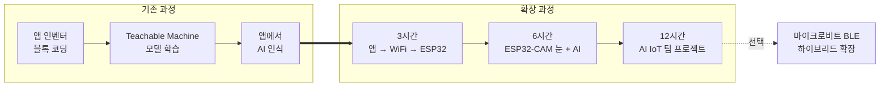

### 1.3 과정별 결과물 요약

| 과정 | 시간 | 최종 결과물 | 학생이 말할 수 있게 되는 문장 |
|------|------|------------|---------------------------|
| 연결하기 | 3h | 손동작 AI로 LED·서보를 켜는 리모컨 앱 | "내 앱이 IP 주소로 보드에 명령을 보내요" |
| AI 눈 달기 | 6h | ESP32-CAM 영상을 AI가 판단해 서보가 반응하는 시스템 | "카메라가 보고, AI가 판단하고, 기계가 움직여요" |
| AI IoT 프로젝트 | 12h | 팀별 문제 해결형 AI IoT 장치 + 발표 | "우리 장치는 ○○ 문제를 AI와 IoT로 해결해요" |

---

## 2. 설계 원칙

### 2.1 다섯 가지 원칙

| # | 원칙 | 구체적 내용 |
|---|------|------------|
| 1 | **앱이 허브(Hub)** | 모든 판단과 명령은 학생이 만든 앱 인벤터 앱이 중심. 보드는 "명령을 받는 손발" |
| 2 | **통신은 URL 한 줄** | `http://192.168.0.101/cmd?c=LEFT` 처럼 브라우저에서도 테스트 가능한 형식만 사용 |
| 3 | **누적형 교구** | 3h 교구(ESP32 DevKit) 위에 6h에서 ESP32-CAM만 추가. 12h는 같은 교구 + 팀별 액추에이터 |
| 4 | **펌웨어는 미리, 수정은 조금** | 아두이노 코드는 강사가 템플릿 업로드. 학생은 WiFi 이름·명령어·동작만 수정 |
| 5 | **눈으로 보이는 통신** | 앱에 "보낸 명령 / 받은 응답" 로그 레이블을 반드시 둔다 → 통신 실패를 학생이 스스로 발견 |

### 2.2 왜 WiFi가 주력이고 블루투스는 확장인가

| 비교 항목 | WiFi (HTTP) | Bluetooth LE |
|-----------|-------------|--------------|
| ESP32-CAM 영상 전송 | ✅ 가능 (MJPEG 스트림) | ❌ 대역폭 부족 |
| 앱 인벤터 구현 난이도 | 쉬움 (`Web` 컴포넌트 기본 내장) | 보통 (BLE 확장 설치 필요) |
| 테스트 방법 | PC 브라우저에서 URL 입력만으로 검증 | 전용 앱(nRF Connect 등) 필요 |
| 20명 동시 수업 | 공유기 1대로 IP 구분 | 기기 이름 혼선·페어링 이슈 잦음 |
| 거리 | 공유기 범위 내 교실 전체 | 약 5~10m |
| 마이크로비트 지원 | ❌ (V1/V2 모두 WiFi 없음) | ✅ BLE 지원 (4장 참고) |
| 결론 | **ESP32·ESP32-CAM 주력 통신** | **마이크로비트 연결 및 비교 학습용** |

---

## 3. 전체 시스템 구조

### 3.1 전체 아키텍처

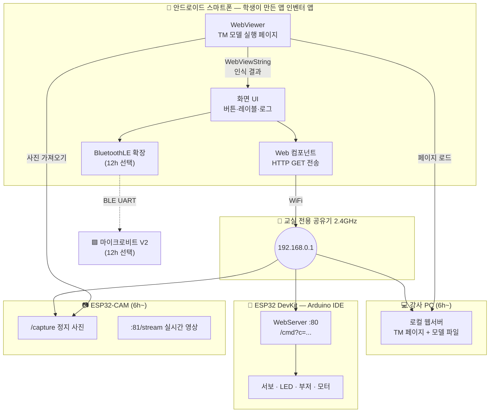

### 3.2 IP 주소 배정표 (공유기 DHCP 고정 할당 권장)

| 장치 | 팀 n번 IP 규칙 | 예시 (3팀) | 비고 |
|------|---------------|-----------|------|
| 공유기 | 192.168.0.1 | 192.168.0.1 | SSID: `AIMAKER_LAB` |
| 강사 PC | 192.168.0.10 | 192.168.0.10 | TM 페이지·모델 호스팅 |
| ESP32 DevKit | 192.168.0.**100+n** | 192.168.0.103 | 액추에이터 보드 |
| ESP32-CAM | 192.168.0.**150+n** | 192.168.0.153 | 카메라 |
| 학생 폰 | DHCP 자동 | 192.168.0.2xx | 고정 불필요 |

> 💡 공유기 고정 할당이 어렵다면 아두이노 코드에서 `WiFi.config()`로 고정 IP를 지정한다 (6.2 참고).

### 3.3 3·6·12시간 시스템 진화

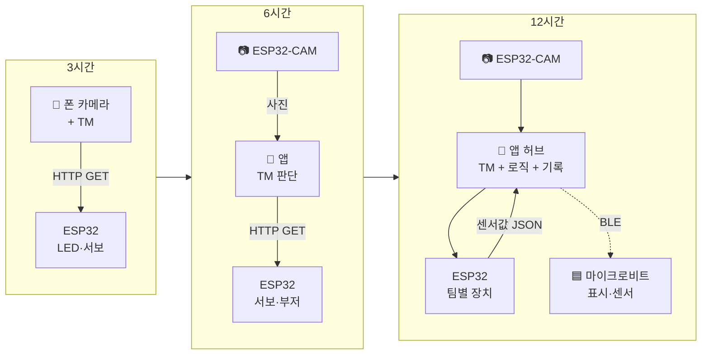

### 3.4 한 번의 명령이 오가는 과정 (시퀀스)

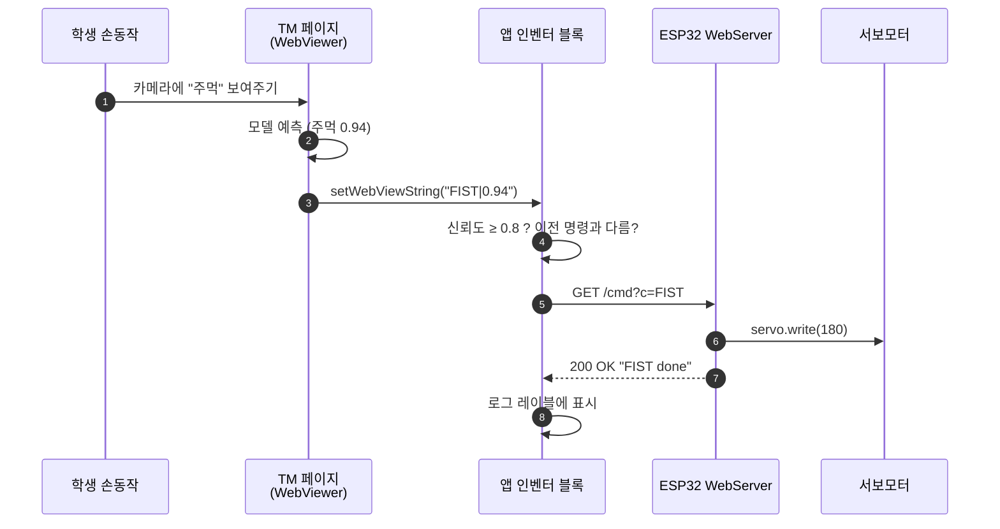

---

## 4. 마이크로비트 ↔ 앱 인벤터 블루투스 연결 검증

### 4.1 결론 요약

| 질문 | 답 | 근거 / 조건 |
|------|-----|------------|
| 마이크로비트와 앱 인벤터는 블루투스로 연결 가능한가? | ✅ **가능** | 마이크로비트는 **Bluetooth Low Energy(BLE)** 를 지원하고, 앱 인벤터는 MIT 공식 **BluetoothLE 확장 + micro:bit 확장**으로 BLE 통신을 지원 |
| 앱 인벤터 기본 `BluetoothClient`로 되는가? | ❌ **불가** | `BluetoothClient`는 **클래식 블루투스(SPP)** 전용. 마이크로비트는 클래식 SPP를 지원하지 않음 → HC-05/06 방식 예제는 쓸 수 없음 |
| 어떤 확장을 써야 하나? | `edu.mit.appinventor.ble` (BluetoothLE) + `com.bbc.microbit.profile` (micro:bit 서비스) | MIT App Inventor IoT 사이트(iot.appinventor.mit.edu)에서 `.aix` 배포. **강사가 사전 다운로드 후 USB 배포** |
| 마이크로비트 V1 / V2 모두 되는가? | ✅ 둘 다 가능, **V2 권장** | V1은 RAM이 작아 BLE + 다른 확장 동시 사용 시 컴파일/실행 실패 사례 많음 |
| 스마트폰 조건은? | **안드로이드 권장** | Android 12 이상은 "근처 기기(Nearby devices)" 권한, 그 이하는 위치 권한·위치 ON 필요. iOS 컴패니언은 확장 지원이 제한적이므로 수업 전 반드시 실기 테스트 |
| 블루투스와 무선(radio) 블록 동시 사용? | ❌ **불가** | MakeCode에서 Bluetooth 확장을 추가하면 `radio` 확장이 제거됨 (같은 무선 칩 사용) |
| 마이크로비트로 WiFi 직접 연결? | ❌ 불가 | 마이크로비트에는 WiFi가 없음. 필요 시 ESP 계열 보드와 시리얼로 연결해야 하며 본 과정 범위 밖 |

### 4.2 블루투스 방식 판별 흐름

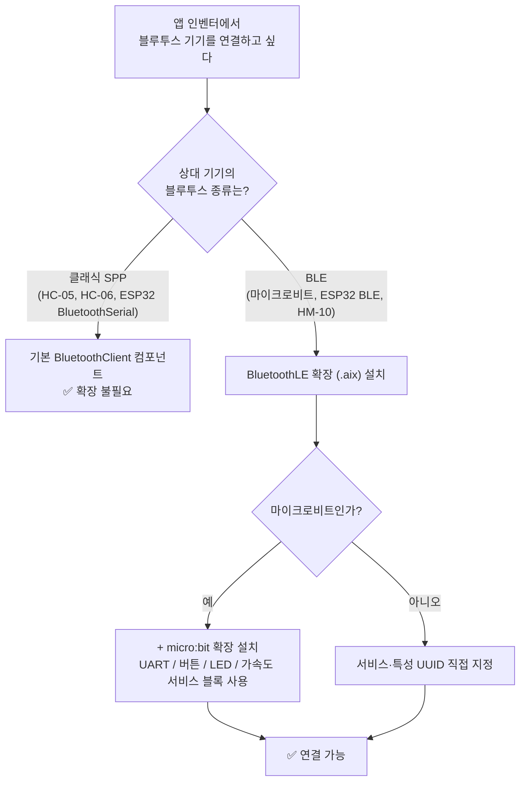

### 4.3 마이크로비트가 제공하는 BLE 서비스 (MakeCode `bluetooth` 확장)

| MakeCode 블록 | 앱 인벤터 micro:bit 확장 컴포넌트 | 수업 활용 |
|---------------|--------------------------------|----------|
| `bluetooth uart service` | `Microbit_Uart` | **가장 범용**. 문자열 주고받기 (`FIST`, `TEMP:24`) |
| `bluetooth button service` | `Microbit_Button` | A/B 버튼을 앱 리모컨 입력으로 |
| `bluetooth led service` | `Microbit_Led` | 앱에서 5×5 LED에 글자·그림 표시 |
| `bluetooth accelerometer service` | `Microbit_Accelerometer` | 기울기로 앱 조작 (게임 컨트롤러) |
| `bluetooth temperature service` | `Microbit_Temperature` | 온도 실시간 모니터 |
| `bluetooth magnetometer service` | `Microbit_Magnetometer` | 나침반 앱 |
| `bluetooth io pin service` | `Microbit_Io_Pin` | 핀 입출력 원격 제어 |

### 4.4 UART 서비스 UUID (직접 지정이 필요할 때)

| 항목 | UUID | 방향 (마이크로비트 기준) |
|------|------|----------------------|
| UART Service | `6E400001-B5A3-F393-E0A9-E50E24DCCA9E` | — |
| TX Characteristic | `6E400002-B5A3-F393-E0A9-E50E24DCCA9E` | 마이크로비트 → 폰 (Indicate) |
| RX Characteristic | `6E400003-B5A3-F393-E0A9-E50E24DCCA9E` | 폰 → 마이크로비트 (Write) |

> ⚠️ 마이크로비트의 TX/RX 방향은 일반적인 Nordic UART 예제와 **반대로 동작**한다. 일반 BLE 확장으로 직접 구현할 때 데이터가 안 오면 가장 먼저 이 부분을 바꿔본다. micro:bit 전용 확장을 쓰면 신경 쓸 필요 없음.

### 4.5 연결 절차 (교실 표준)

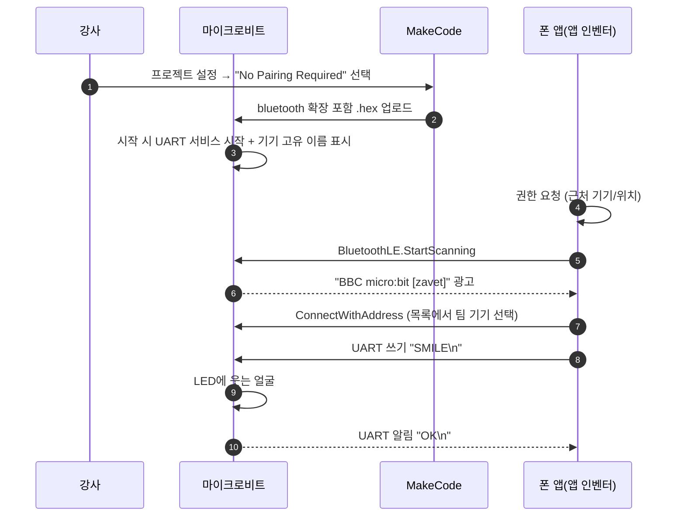

### 4.6 MakeCode 쪽 기본 코드 (JavaScript 표현)

```javascript
// 마이크로비트 V2 — MakeCode, 확장: bluetooth
// 프로젝트 설정: "No Pairing Required: Anyone can connect via Bluetooth"
bluetooth.startUartService()
basic.showIcon(IconNames.Square)

bluetooth.onBluetoothConnected(function () {
    basic.showIcon(IconNames.Yes)
})
bluetooth.onBluetoothDisconnected(function () {
    basic.showIcon(IconNames.No)
})

// 폰 → 마이크로비트: 줄바꿈(\n)으로 끝나는 문자열 수신
bluetooth.onUartDataReceived(serial.delimiters(Delimiters.NewLine), function () {
    let msg = bluetooth.uartReadUntil(serial.delimiters(Delimiters.NewLine))
    if (msg == "SMILE") {
        basic.showIcon(IconNames.Happy)
    } else if (msg == "WARN") {
        music.play(music.tonePlayable(880, music.beat(BeatFraction.Half)), music.PlaybackMode.UntilDone)
        basic.showIcon(IconNames.Skull)
    } else {
        basic.showString(msg)
    }
    bluetooth.uartWriteLine("OK")
})

// 마이크로비트 → 폰: 버튼으로 이벤트 전송
input.onButtonPressed(Button.A, function () {
    bluetooth.uartWriteLine("BTN_A")
})
```

### 4.7 앱 인벤터 쪽 블록 구성 (텍스트 표현)

| 이벤트 / 호출 | 블록 내용 | 비고 |
|--------------|----------|------|
| `Screen1.Initialize` | `AskForPermission(BLUETOOTH_SCAN)`, `AskForPermission(BLUETOOTH_CONNECT)`, `AskForPermission(ACCESS_FINE_LOCATION)` | Android 버전별로 필요한 권한이 다름 |
| `btnScan.Click` | `BluetoothLE1.StartScanning` | 3~5초 후 `StopScanning` |
| `BluetoothLE1.DeviceFound` | `ListView1.Elements ← BluetoothLE1.DeviceList` | "BBC micro:bit [....]" 만 필터 권장 |
| `ListView1.AfterPicking` | `BluetoothLE1.ConnectWithAddress(주소)` | 목록 문자열에서 MAC 주소 부분 추출 |
| `BluetoothLE1.Connected` | `Microbit_Uart1.RequestTXCharacteristic` | 마이크로비트 → 폰 수신 등록 |
| `btnSmile.Click` | `Microbit_Uart1.WriteRXCharacteristic("SMILE\n")` | 끝에 `\n` 필수 |
| `Microbit_Uart1.TXCharacteristicReceived` | `lblLog.Text ← 받은 값` | `BTN_A`, `OK` 등 |

### 4.8 교실 운영 시 BLE 주의사항

| 문제 | 원인 | 대응 |
|------|------|------|
| 스캔 목록에 마이크로비트 20개가 뜸 | 모든 기기 이름이 `BBC micro:bit [xxxxx]` | 시작 시 MakeCode에서 `control.deviceName()`을 LED에 표시 → 팀별 이름표에 기록 |
| 다른 팀 폰이 우리 마이크로비트에 연결 | No Pairing 모드는 누구나 접속 가능 | 이름표 확인 습관화, 연결 시 LED ✔ 표시로 즉시 확인 |
| 연결 직후 끊김 | V1 메모리 부족 / 저전력 USB 전원 | V2 사용, 배터리팩 대신 USB 전원 |
| 데이터 일부 누락 | BLE 패킷 20바이트 한계 | 메시지를 짧은 코드로 (`L`, `R`, `S`) |
| `radio` 블록이 사라짐 | Bluetooth 확장과 충돌 | 한 프로젝트에서 둘 중 하나만 사용 |
| 컴패니언에서 확장 블록 오류 | 오래된 AI2 Companion | Companion 최신 버전으로 사전 업데이트 |

### 4.9 마이크로비트 BLE를 본 과정에 넣는 방법

| 과정 | 적용 여부 | 방식 |
|------|----------|------|
| 3시간 | ❌ 미적용 | WiFi 개념 집중. 마이크로비트는 시간 부족 |
| 6시간 | 🔸 시연만 | 강사가 "같은 앱이 BLE로도 명령을 보낼 수 있다"를 5분 시연 → WiFi와 비교표 작성 |
| 12시간 | ✅ 선택 모듈 | **하이브리드 허브**: 폰이 WiFi로 ESP32, BLE로 마이크로비트를 동시에 제어 (9.4 참고) |

---

## 5. 준비물 & 사전 점검

### 5.1 팀별 교구 (2인 1팀 기준)

| 품목 | 수량 | 3h | 6h | 12h | 대략 단가 | 비고 |
|------|------|----|----|-----|----------|------|
| ESP32 DevKit V1 (CH340/CP2102) | 1 | ✅ | ✅ | ✅ | 8,000원 | 아두이노 IDE로 프로그래밍 |
| ESP32-CAM (AI Thinker) + MB 업로드 보드 | 1 | — | ✅ | ✅ | 12,000원 | OV2640, PSRAM 포함 모델 |
| SG90 서보모터 | 2 | ✅ | ✅ | ✅ | 2,000원 | 12h는 팀별 추가 가능 |
| LED(빨/노/초) + 220Ω 저항 | 각 1 | ✅ | ✅ | ✅ | 500원 | |
| 액티브 부저 | 1 | — | ✅ | ✅ | 500원 | |
| 브레드보드 + 점퍼선 | 1세트 | ✅ | ✅ | ✅ | 3,000원 | |
| USB 케이블 (데이터 지원) | 2 | ✅ | ✅ | ✅ | 2,000원 | **충전 전용 케이블 금지** |
| 5V 2A 어댑터 | 1 | — | ✅ | ✅ | 4,000원 | ESP32-CAM 전원 안정용 |
| 안드로이드 스마트폰/태블릿 | 1 | ✅ | ✅ | ✅ | 학생 지참 | Android 8 이상, AI2 Companion 설치 |
| 마이크로비트 V2 | 1 | — | — | 선택 | 25,000원 | 12h BLE 모듈용 |
| 확장 부품 (DC모터+L9110S, 초음파 HC-SR04 등) | 팀별 | — | — | ✅ | 5,000원 | 프로젝트 주제별 |

### 5.2 공용 장비

| 품목 | 수량 | 용도 |
|------|------|------|
| 교실 전용 공유기 (2.4GHz, DHCP 고정 할당 지원) | 1 | 학교 WiFi는 **기기 간 통신 차단(AP 격리)** 이 흔해 사용 불가한 경우가 많음 |
| 강사 노트북 | 1 | 로컬 웹서버, 펌웨어 업로드, 미러링 |
| USB 메모리 | 2 | 오프라인 자료 배포 |
| 멀티탭 | 3 | ESP32-CAM 어댑터 전원 |
| 예비 ESP32 / ESP32-CAM | 각 2 | 불량 교체 |

### 5.3 소프트웨어 설치표

| 소프트웨어 | 설치 위치 | 버전/설정 | 사전 설치 주체 |
|-----------|----------|----------|--------------|
| MIT AI2 Companion | 학생 폰 | 최신 버전 | 학생(사전 안내) |
| MIT App Inventor (웹) | 학생 PC 브라우저 | ai2.appinventor.mit.edu, 구글 계정 | 학생 |
| Arduino IDE 2.x | 강사 PC (12h는 학생 PC) | ESP32 보드 매니저 `esp32 by Espressif` 설치 | 강사 |
| ESP32Servo 라이브러리 | Arduino IDE | 라이브러리 매니저 | 강사 |
| Python 3 | 강사 PC | `python -m http.server` 용 | 강사 |
| Teachable Machine | 브라우저 | teachablemachine.withgoogle.com | — |
| BluetoothLE / micro:bit `.aix` | USB 배포 | 12h BLE 모듈용 | 강사 |
| MakeCode | 브라우저 | makecode.microbit.org | — |

### 5.4 수업 자료 패키지 (USB 배포 폴더)

```text
AIMAKER_AI_IOT/
├── 01_arduino/
│   ├── esp32_cmd_server/esp32_cmd_server.ino      # 3h~ 액추에이터 서버
│   ├── esp32_cmd_server_sensor/...ino              # 12h 센서값 응답 버전
│   └── esp32cam_webserver/                         # CameraWebServer 수정본
├── 02_appinventor/
│   ├── 3h_TM_Remote_template.aia
│   ├── 6h_CAM_AI_template.aia
│   ├── 12h_Hub_template.aia
│   └── extensions/ (BluetoothLE.aix, microbit.aix)
├── 03_tm_web/
│   ├── phone_cam.html        # 3h: 폰 카메라 + TM (https 호스팅용)
│   ├── esp32cam_tm.html      # 6h: ESP32-CAM 사진 + TM (강사 PC 호스팅)
│   ├── lib/ (tf.min.js, teachablemachine-image.min.js)
│   └── models/team01 ~ team10/ (model.json, metadata.json, weights.bin)
├── 04_makecode/microbit_ble_uart.hex
└── 05_worksheets/ (활동지, 루브릭, IP 이름표)
```

### 5.5 수업 전날 체크리스트

| # | 점검 항목 | 확인 방법 | ✔ |
|---|----------|----------|---|
| 1 | 공유기 SSID/비밀번호 설정, 2.4GHz 활성 | 폰으로 접속 | ☐ |
| 2 | 모든 ESP32에 팀 번호별 펌웨어 업로드 | 시리얼 모니터에 IP 출력 확인 | ☐ |
| 3 | PC 브라우저에서 `http://192.168.0.10n/cmd?c=ON` | LED 점등 | ☐ |
| 4 | ESP32-CAM `http://192.168.0.15n/capture` | 사진 표시 | ☐ |
| 5 | 강사 PC 로컬 서버에서 `esp32cam_tm.html` 열기 | 예측 결과 표시 | ☐ |
| 6 | 템플릿 `.aia` 를 AI2에 불러와 Companion 연결 | 폰에서 화면 표시 | ☐ |
| 7 | (12h) 마이크로비트 BLE 연결 | 앱에서 SMILE 전송 → LED | ☐ |
| 8 | 팀 이름표에 IP·마이크로비트 이름 기재 | 출력물 | ☐ |

---

## 6. 공통 기술 레퍼런스

### 6.1 명령 프로토콜 (전 과정 공통)

| 요청 URL | 의미 | ESP32 동작 | 응답 |
|---------|------|-----------|------|
| `/cmd?c=ON` | 켜기 | 초록 LED ON | `ON done` |
| `/cmd?c=OFF` | 끄기 | 모든 LED OFF, 서보 90° | `OFF done` |
| `/cmd?c=LEFT` | 왼쪽 | 서보 0° | `LEFT done` |
| `/cmd?c=RIGHT` | 오른쪽 | 서보 180° | `RIGHT done` |
| `/cmd?c=ALARM` | 경고 | 빨강 LED + 부저 1초 | `ALARM done` |
| `/status` | 상태 조회 (12h) | 센서값 읽기 | `{"dist":23,"servo":90}` |
| 그 외 | 알 수 없음 | 동작 없음 | `400 unknown` |

> 💡 **TM 클래스 이름 = 명령어**로 맞추면 앱 블록이 단순해진다. 예: TM 클래스를 `LEFT`, `RIGHT`, `OFF`로 학습.

### 6.2 ESP32 DevKit 액추에이터 서버 (Arduino IDE)

```cpp
// esp32_cmd_server.ino — 보드: "ESP32 Dev Module"
#include <WiFi.h>
#include <WebServer.h>
#include <ESP32Servo.h>

// ===== 학생 수정 영역 =====
const char* SSID = "AIMAKER_LAB";
const char* PASS = "12345678";
const int   TEAM = 3;                 // 팀 번호 → IP 192.168.0.103
// =========================

const int PIN_SERVO = 13, PIN_LED_G = 25, PIN_LED_R = 26, PIN_BUZZ = 27;

WebServer server(80);
Servo servo;

void addCors() {
  server.sendHeader("Access-Control-Allow-Origin", "*");
}

void handleCmd() {
  addCors();
  String c = server.arg("c");
  c.toUpperCase();
  Serial.println("CMD: " + c);

  if (c == "ON")         { digitalWrite(PIN_LED_G, HIGH); }
  else if (c == "OFF")   { digitalWrite(PIN_LED_G, LOW); digitalWrite(PIN_LED_R, LOW); servo.write(90); }
  else if (c == "LEFT")  { servo.write(0); }
  else if (c == "RIGHT") { servo.write(180); }
  else if (c == "ALARM") {
    digitalWrite(PIN_LED_R, HIGH); digitalWrite(PIN_BUZZ, HIGH);
    delay(1000);
    digitalWrite(PIN_LED_R, LOW);  digitalWrite(PIN_BUZZ, LOW);
  }
  else { server.send(400, "text/plain", "unknown"); return; }

  server.send(200, "text/plain", c + " done");
}

void setup() {
  Serial.begin(115200);
  pinMode(PIN_LED_G, OUTPUT); pinMode(PIN_LED_R, OUTPUT); pinMode(PIN_BUZZ, OUTPUT);
  servo.attach(PIN_SERVO);
  servo.write(90);

  IPAddress ip(192, 168, 0, 100 + TEAM), gw(192, 168, 0, 1), mask(255, 255, 255, 0);
  WiFi.config(ip, gw, mask);
  WiFi.begin(SSID, PASS);
  while (WiFi.status() != WL_CONNECTED) { delay(300); Serial.print("."); }
  Serial.println("\nIP: " + WiFi.localIP().toString());

  server.on("/cmd", handleCmd);
  server.on("/", [] { addCors(); server.send(200, "text/plain", "TEAM " + String(TEAM) + " ready"); });
  server.begin();
}

void loop() {
  server.handleClient();
}
```

### 6.3 ESP32 핀 배선표

| 부품 | 부품 핀 | ESP32 핀 | 비고 |
|------|--------|---------|------|
| 서보 SG90 | 신호(주황) | GPIO 13 | |
| 서보 SG90 | VCC(빨강) | VIN(5V) | 서보 2개 이상이면 외부 5V 권장 |
| 서보 SG90 | GND(갈색) | GND | |
| 초록 LED | + (긴 다리) | GPIO 25 → 220Ω | |
| 빨강 LED | + (긴 다리) | GPIO 26 → 220Ω | |
| 액티브 부저 | + | GPIO 27 | |
| 초음파 HC-SR04 (12h) | TRIG / ECHO | GPIO 5 / GPIO 18 | ECHO는 분압저항(5V→3.3V) 권장 |
| 모든 GND | — | GND | **공통 접지 필수** |

> 대안 보드: **Arduino UNO R4 WiFi**도 `WiFiS3` 라이브러리로 같은 구조의 서버를 만들 수 있다. 단, 서보·IP 설정 코드가 일부 다르므로 한 반에서는 한 종류로 통일한다.

### 6.4 ESP32-CAM 설정 (CameraWebServer 기반)

| 항목 | 설정값 |
|------|-------|
| 예제 | 파일 → 예제 → ESP32 → Camera → `CameraWebServer` |
| 보드 | `AI Thinker ESP32-CAM` |
| 카메라 모델 | `#define CAMERA_MODEL_AI_THINKER` 만 주석 해제 |
| PSRAM | Enabled |
| 고정 IP | `WiFi.config(IPAddress(192,168,0,150+TEAM), ...)` 를 `WiFi.begin` 앞에 추가 |
| 사진 URL | `http://192.168.0.15n/capture` (포트 80) |
| 영상 URL | `http://192.168.0.15n:81/stream` (포트 81, MJPEG) |
| CORS | `app_httpd.cpp`의 `capture_handler`에 `Access-Control-Allow-Origin: *` 헤더가 있는지 확인, 없으면 `httpd_resp_set_hdr(req, "Access-Control-Allow-Origin", "*");` 추가 |
| 해상도 | AI 판단용은 `QVGA(320×240)` 권장 — 빠르고 TM 입력(224×224)에 충분 |


### 6.5 Teachable Machine 연결 방식 비교

| 방식 | 입력 카메라 | 사용 과정 | 장점 | 주의 |
|------|-----------|----------|------|------|
| **A. TM 공유 링크 + 폰 카메라 페이지** | 폰 카메라 | 3h | 학생이 학습→업로드→링크만 붙이면 끝 | 카메라 사용은 **https 페이지에서만** 가능 → 인터넷 필요 |
| **B. 강사 PC 로컬 페이지 + ESP32-CAM 사진** | ESP32-CAM | 6h, 12h | 인터넷 없이 동작, 원격 카메라 | 모델 파일을 강사 PC에 저장(TM "모델 다운로드") |
| C. MIT Personal Image Classifier 확장 | 폰 카메라 | 플랜 B | 앱 안에서 오프라인 실행 | TM이 아닌 MIT 전용 학습 도구 사용 |

### 6.6 방식 B — ESP32-CAM 사진을 TM으로 판단하는 페이지

```html
<!-- 03_tm_web/esp32cam_tm.html — 강사 PC에서 python -m http.server 8000 으로 제공 -->
<!-- 접속 예: http://192.168.0.10:8000/esp32cam_tm.html?team=03&cam=192.168.0.153 -->
<!doctype html>
<html><head><meta charset="utf-8">
<meta name="viewport" content="width=device-width,initial-scale=1">
<script src="lib/tf.min.js"></script>
<script src="lib/teachablemachine-image.min.js"></script>
<style>body{margin:0;font-family:sans-serif;text-align:center}img{width:100%}#r{font-size:22px}</style>
</head><body>

<div id="r">모델 불러오는 중…</div>
<script>
const q = new URLSearchParams(location.search);
const MODEL = `models/team${q.get("team")}/`;
const CAM = `http://${q.get("cam")}/capture`;
let model;

function sendToApp(text) {
  if (window.AppInventor) window.AppInventor.setWebViewString(text);
}

async function loop() {
  const img = document.getElementById("cam");
  img.src = CAM + "?t=" + Date.now();          // 캐시 방지
  await img.decode().catch(() => null);
  if (img.naturalWidth > 0) {
    const preds = await model.predict(img);
    const best = preds.reduce((a, b) => (a.probability > b.probability ? a : b));
    document.getElementById("r").textContent =
      `${best.className} ${(best.probability * 100).toFixed(0)}%`;
    sendToApp(`${best.className}|${best.probability.toFixed(2)}`);
  }
  setTimeout(loop, 700);                         // 약 1.4장/초
}

(async () => {
  model = await tmImage.load(MODEL + "model.json", MODEL + "metadata.json");
  loop();
})();
</script></body></html>
```

| 코드 포인트 | 설명 |
|------------|------|
| `crossorigin="anonymous"` + ESP32-CAM CORS 헤더 | 둘 다 있어야 TM이 다른 기기의 사진 픽셀을 읽을 수 있음 |
| `?t=Date.now()` | 같은 사진이 캐시되는 것 방지 |
| `window.AppInventor.setWebViewString()` | 웹페이지 → 앱 인벤터로 값 전달하는 공식 통로 |
| `setTimeout(loop, 700)` | 너무 빠르면 ESP32-CAM이 멈춤. 500~1000ms 권장 |
| 강사 PC http 제공 | 페이지·ESP32-CAM 모두 http → 혼합 콘텐츠 차단 없음 |

### 6.7 방식 A — 폰 카메라 TM 페이지 (3h)

| 단계 | 내용 |
|------|------|
| 1 | TM에서 이미지 프로젝트 학습 → **모델 내보내기 → 업로드** → 공유 링크 복사 |
| 2 | `phone_cam.html` (TM 공식 "Javascript" 예제 코드 기반)에 `URL` 변수만 학생 링크로 교체 |
| 3 | 강사가 https 호스팅(예: 수업용 GitHub Pages)에 팀별 페이지 배포, 또는 `?model=` 파라미터로 1개 페이지 공유 |
| 4 | 예측 결과를 `window.AppInventor.setWebViewString(className + "|" + probability)` 로 전달 |
| 5 | 앱 인벤터 `WebViewer.HomeUrl` 에 해당 https 주소 입력, 카메라 권한 허용 |

> ⚠️ 브라우저 정책상 `getUserMedia`(카메라)는 **https 또는 localhost** 에서만 동작한다. 그래서 3h는 https 페이지, 6h 이후는 카메라 권한이 필요 없는 ESP32-CAM 사진 방식으로 설계했다.

### 6.8 앱 인벤터 공통 화면 구성

| 컴포넌트 | 이름 | 주요 속성 | 역할 |
|---------|------|----------|------|
| TextBox | `txtIP` | Hint: `192.168.0.103` | ESP32 IP 입력 |
| WebViewer | `wvAI` | Height 300px, HomeUrl: TM 페이지 | AI 판단 |
| Label | `lblAI` | FontSize 20 | 현재 인식 결과 |
| Label | `lblLog` | 여러 줄 | 통신 로그 |
| Button × 4 | `btnLeft`, `btnRight`, `btnOn`, `btnOff` | — | 수동 리모컨 (AI 없이 테스트) |
| Switch | `swAuto` | On: 자동 | AI 자동 제어 ON/OFF |
| Web | `Web1` | — | HTTP 요청 (비가시) |
| Clock | `clkCool` | TimerInterval 1500 | 연속 명령 방지 쿨다운 (비가시) |
| TinyDB | `db` | — | IP 저장 (12h) |

### 6.9 앱 인벤터 핵심 블록 (텍스트 표현)

```text
전역 변수 lastCmd ← ""
전역 변수 ready   ← true

프로시저 sendCmd(cmd):
    Web1.Url ← 합치기("http://", txtIP.Text, "/cmd?c=", cmd)
    Web1.Get
    lblLog.Text ← 합치기("→ 보냄: ", cmd, "\n", lblLog.Text)

언제 wvAI.WebViewStringChange(value):
    parts ← 텍스트 나누기(value, "|")          // ["LEFT", "0.93"]
    label ← parts 의 1번째
    prob  ← parts 의 2번째
    lblAI.Text ← 합치기(label, " (", prob × 100, "%)")
    만약 swAuto.On 그리고 prob ≥ 0.8 그리고 label ≠ lastCmd 그리고 ready 이면:
        호출 sendCmd(label)
        lastCmd ← label
        ready ← false
        clkCool.TimerEnabled ← true

언제 clkCool.Timer:
    ready ← true
    clkCool.TimerEnabled ← false

언제 Web1.GotText(url, responseCode, responseType, responseContent):
    lblLog.Text ← 합치기("← 응답 ", responseCode, ": ", responseContent, "\n", lblLog.Text)

언제 Web1.TimedOut(url):
    lblLog.Text ← 합치기("⚠ 응답 없음: IP·WiFi 확인\n", lblLog.Text)

언제 btnLeft.Click:  호출 sendCmd("LEFT")
```

| 블록 설계 포인트 | 이유 |
|----------------|------|
| 신뢰도 0.8 이상만 전송 | 애매한 인식으로 서보가 떨리는 현상 방지 |
| `label ≠ lastCmd` | 같은 명령 반복 전송 방지 (ESP32 과부하 방지) |
| 1.5초 쿨다운 | 서보가 움직일 시간 확보 |
| `Web1.Timeout` = 3000ms 설정 | 응답 없을 때 앱이 멈춘 것처럼 보이지 않게 |
| 수동 버튼 유지 | AI 문제인지 통신 문제인지 분리 진단 |

### 6.10 자동 제어 판단 흐름

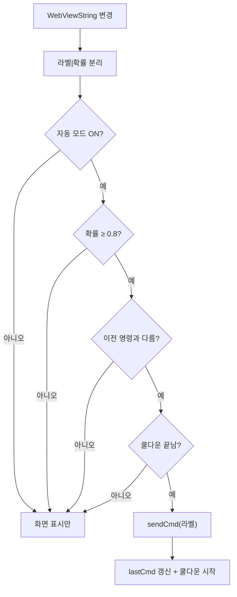

---

## 7. 3시간 과정 — 연결하기

### 7.1 개요

| 항목 | 내용 |
|------|------|
| 목표 | 손동작 AI 앱으로 WiFi를 통해 ESP32의 LED·서보를 움직인다 |
| 핵심 개념 | IP 주소, URL 명령, 클라이언트-서버, 신뢰도 |
| 교구 | ESP32 DevKit + 서보 1 + LED 2 (펌웨어 사전 업로드) |
| 사전 조건 | 학생 폰에 AI2 Companion, 구글 계정 |
| 결과물 | "AI 손동작 리모컨" 앱 |

### 7.2 시간표

| 시간 | 차시 | 활동 | 산출물 | 강사 포인트 |
|------|------|------|--------|------------|
| 0:00–0:15 | 도입 | 시연: 손바닥 보이면 서보가 돌아가는 영상/실물 · "어떻게 전달될까?" 질문 | 예상 그림 | 폰·공유기·보드를 손으로 가리키며 경로 그리기 |
| 0:15–0:40 | ① 주소로 명령하기 | PC/폰 브라우저에 `http://192.168.0.10n/cmd?c=ON` 직접 입력 | LED 켜기 성공 | **앱 없이도 명령이 간다**는 걸 먼저 체험 |
| 0:40–1:20 | ② 리모컨 앱 | 템플릿 `.aia` 불러오기 → 버튼 4개 + `sendCmd` 프로시저 완성 | 수동 리모컨 앱 | `Web.GotText` 로그로 응답 확인 |
| 1:20–1:30 | 휴식 | | | 서보 각도 확인 |
| 1:30–2:05 | ③ TM 학습 | 클래스 `LEFT`/`RIGHT`/`OFF` 손동작 학습 → 업로드 → 링크 | TM 모델 링크 | 클래스당 100장 이상, 배경 다양하게 |
| 2:05–2:40 | ④ AI 연결 | `WebViewer`에 TM 페이지 → `WebViewStringChange` 블록 → 자동 전송 | AI 리모컨 완성 | 신뢰도 기준 0.8 실험 |
| 2:40–3:00 | 공유·정리 | 팀별 시연, "보낸 명령/응답" 로그 설명 | 활동지 | 3가지 개념 퀴즈 |

### 7.3 3시간 차시 흐름도

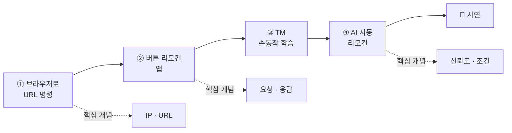

### 7.4 학생 활동지 (3h)

| # | 질문 | 학생 답 예시 |
|---|------|------------|
| 1 | 우리 팀 ESP32의 IP 주소는? | 192.168.0.103 |
| 2 | 서보를 왼쪽으로 돌리는 URL은? | http://192.168.0.103/cmd?c=LEFT |
| 3 | 앱이 "보낸 것"과 "받은 것"은 각각 무엇? | 보냄: LEFT / 받음: 200 LEFT done |
| 4 | 신뢰도를 0.5로 낮추면 어떤 일이? | 엉뚱한 손동작에도 서보가 움직인다 |
| 5 | 이 기술을 어디에 쓸 수 있을까? | 손이 불편한 사람의 조명 스위치 |

### 7.5 3시간 확장 미션 (빨리 끝난 팀)

| 난이도 | 미션 |
|--------|------|
| ⭐ | 클래스 `ON` 추가 → 초록 LED 켜기 |
| ⭐⭐ | 앱에 `TextToSpeech` 추가: 명령 보낼 때 "왼쪽!" 말하기 |
| ⭐⭐⭐ | 같은 손동작이 3번 연속 인식될 때만 전송 (오작동 줄이기) |

---

## 8. 6시간 과정 — AI 눈 달기

### 8.1 개요

| 항목 | 내용 |
|------|------|
| 목표 | ESP32-CAM이 본 장면을 TM이 판단하고, 앱이 ESP32에 명령을 보내는 **센서 → 판단 → 행동** 시스템 완성 |
| 핵심 개념 | 원격 카메라, 스트림 vs 사진, 데이터셋 품질, 자동 제어 루프 |
| 교구 | 3h 교구 + ESP32-CAM + 부저 |
| 결과물 | "AI 감시 카메라 앱" (예: 사람/빈자리 판단 → 경고, 물건 종류 판단 → 서보 분류) |
| 구성 | 1–3교시: 3시간 과정 압축(2h) / 4–6교시: ESP32-CAM + AI (4h) |

### 8.2 시간표

| 시간 | 차시 | 활동 | 산출물 | 강사 포인트 |
|------|------|------|--------|------------|
| 0:00–0:20 | 도입 | "폰 대신 기계가 눈을 가진다면?" 시연 | — | 완성 시스템 미리보기 |
| 0:20–1:00 | ① URL 명령 + 리모컨 앱 | 3h ①② 압축 | 수동 리모컨 | 템플릿으로 시간 단축 |
| 1:00–1:50 | ② 폰 카메라 AI 리모컨 | 3h ③④ 압축 | AI 리모컨 | 2클래스만 학습 |
| 1:50–2:00 | 휴식 | | | ESP32-CAM 전원 연결 |
| 2:00–2:30 | ③ ESP32-CAM 보기 | 브라우저로 `/capture`, `:81/stream` 비교 · 앱 `WebViewer`에 스트림 표시 | 카메라 화면 앱 | 스트림=동영상, 캡처=사진 한 장 |
| 2:30–3:20 | ④ CAM으로 데이터 수집 | ESP32-CAM 사진을 TM에 **파일 업로드** 방식으로 학습 (아래 8.4) | TM 모델 파일 | **학습 카메라 = 실전 카메라** 원칙 |
| 3:20–3:30 | 휴식 | | | 강사: 팀 모델을 `models/teamNN/` 에 복사 |
| 3:30–4:20 | ⑤ AI 판단 연결 | `WebViewer.HomeUrl` ← 강사 PC 페이지 주소 · 판단 결과로 서보/부저 제어 | AI 눈 시스템 | 로그로 지연시간 관찰 |
| 4:20–5:10 | ⑥ 미니 프로젝트 | 팀별 시나리오 선택(8.5) 후 클래스 재설계·재학습 | 팀 시나리오 완성 | 실패 사례를 데이터로 해결 |
| 5:10–5:20 | 휴식 | | | |
| 5:20–5:45 | ⑦ BLE 비교 시연 | 강사: 같은 앱으로 마이크로비트에 BLE 명령 → WiFi와 비교표 작성 | 비교표 | 4.2 흐름도 활용 |
| 5:45–6:00 | 발표·정리 | 팀별 1분 시연 | 활동지 | 루브릭 자기평가 |

### 8.3 6시간 시스템 데이터 흐름

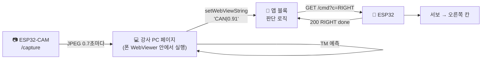

### 8.4 ESP32-CAM 사진으로 TM 학습하기

| 단계 | 방법 | 팁 |
|------|------|-----|
| 1 | 앱에 `btnShot` 추가 → `Web2.Url ← http://CAM/capture`, `Web2.Get` 대신 **PC 브라우저에서 `/capture` 새로고침 + 저장** | 가장 쉬운 방법: PC 브라우저에서 반복 저장 |
| 2 | 클래스별 폴더에 30~60장 저장 | 위치·각도·조명을 조금씩 바꿔가며 |
| 3 | TM 이미지 프로젝트 → 각 클래스 **"업로드"** 로 폴더 사진 추가 | 웹캠 대신 파일 업로드 |
| 4 | **배경(아무것도 없음) 클래스 필수** | 없으면 빈 화면에서도 아무 클래스나 선택됨 |
| 5 | 학습 → 모델 내보내기 → **다운로드** (Tensorflow.js) | zip 파일을 강사에게 전달 |
| 6 | 강사가 `models/teamNN/` 에 압축 해제 | `model.json`, `metadata.json`, `weights.bin` |

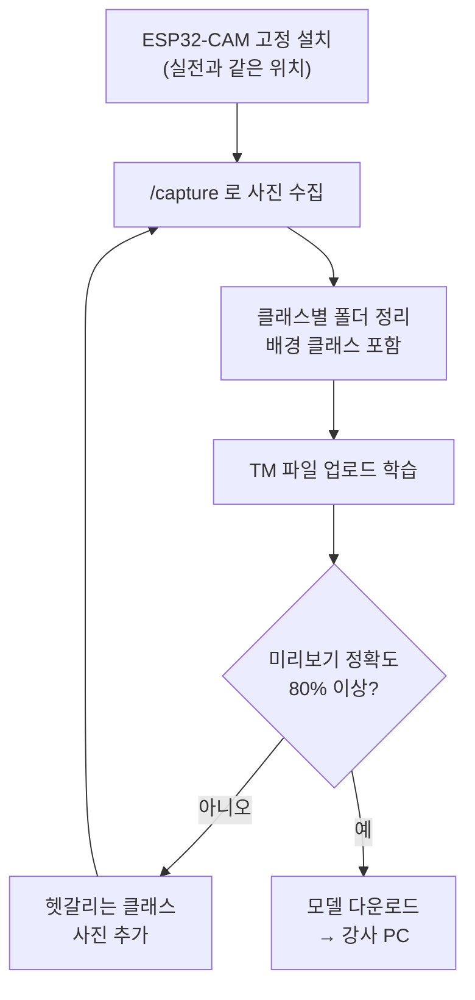

### 8.5 6시간 미니 프로젝트 시나리오

| 시나리오 | TM 클래스 | 앱 판단 | ESP32 동작 |
|---------|----------|--------|-----------|
| 분리수거 분류기 | `CAN`, `PLASTIC`, `EMPTY` | CAN→LEFT, PLASTIC→RIGHT | 서보로 칸 막이 회전 |
| 자리 지킴이 | `PERSON`, `EMPTY` | EMPTY 10초 지속 → ALARM | 부저 + 빨강 LED |
| 마스크 체크 게이트 | `MASK`, `NOMASK`, `EMPTY` | MASK→ON(문 열림), NOMASK→ALARM | 서보 게이트 + 부저 |
| 과일 신선도 선별 | `FRESH`, `BAD`, `EMPTY` | BAD→RIGHT(불량 칸) | 서보 |

### 8.6 6시간 활동지 핵심 질문

| # | 질문 | 기대 답변 |
|---|------|----------|
| 1 | 스트림(`:81/stream`)과 캡처(`/capture`)의 차이는? | 연속 영상 vs 한 장 사진. AI 판단은 사진 한 장씩 |
| 2 | 폰 카메라로 학습한 모델을 ESP32-CAM에 쓰면? | 화질·색감이 달라 정확도가 떨어진다 |
| 3 | 배경 클래스가 필요한 이유는? | AI는 항상 '가장 비슷한 것'을 고르기 때문 |
| 4 | WiFi와 블루투스, 우리 시스템엔 무엇이 맞나? | 영상이 필요하므로 WiFi |

---

## 9. 12시간 과정 — AI IoT 프로젝트

### 9.1 개요

| 항목 | 내용 |
|------|------|
| 목표 | 팀이 정한 실생활 문제를 **AI 판단 + WiFi IoT (+ BLE)** 로 해결하는 장치를 기획·제작·발표 |
| 핵심 개념 | 양방향 통신(센서값 수신), 상태 기반 로직, 데이터 기록, 사용자 중심 설계 |
| 교구 | 6h 교구 + 팀별 확장 부품 + (선택) 마이크로비트 V2 |
| 운영 | 4일 × 3시간 또는 2일 × 6시간 |
| 결과물 | 작동하는 AI IoT 장치 + 앱 + 발표 자료 + 시연 영상 |

### 9.2 4일 구성 (1일 3시간)

| 일차 | 주제 | 주요 활동 | 일차 산출물 |
|------|------|----------|------------|
| 1일 | 연결 마스터 | 3시간 과정 전체 (URL 명령 → 리모컨 앱 → 폰 카메라 TM) | AI 손동작 리모컨 |
| 2일 | AI 눈 + 양방향 | ESP32-CAM + TM 판단 / `/status` 로 센서값 받아 앱에 표시 | AI 눈 시스템 + 센서 대시보드 |
| 3일 | 팀 프로젝트 제작 | 문제 정의 → 설계 → 데이터 수집·학습 → 하드웨어 조립 → (선택) BLE 모듈 | 1차 작동 시제품 |
| 4일 | 완성·발표 | 테스트·개선 → 발표 자료 → 시연 → 상호 평가 | 최종 발표 |

### 9.3 12시간 상세 시간표

| 일차 | 시간 | 활동 | 비고 |
|------|------|------|------|
| 1일 | 0:00–0:40 | 브라우저 URL 명령, IP 개념 | 3h ① |
| | 0:40–1:30 | 리모컨 앱 + 응답 로그 | 3h ② |
| | 1:40–2:50 | TM 손동작 학습 + AI 자동 제어 | 3h ③④ |
| | 2:50–3:00 | 회고 | |
| 2일 | 0:00–0:40 | **학생이 직접** Arduino IDE로 ESP32 코드 수정·업로드 (명령 1개 추가) | 펌웨어 기초 |
| | 0:40–1:40 | ESP32-CAM 사진 수집 → TM 학습 → AI 판단 연결 | 6h ③~⑤ |
| | 1:50–2:40 | 초음파 센서 + `/status` JSON → 앱 `JsonTextDecode` 로 표시 | 양방향 통신 |
| | 2:40–3:00 | 프로젝트 주제 브레인스토밍 | 9.6 기획서 |
| 3일 | 0:00–0:40 | 기획서 확정 (문제·사용자·입력·판단·출력) | 강사 승인 |
| | 0:40–1:40 | 데이터 수집·학습 / 하드웨어 조립 (역할 분담) | |
| | 1:50–2:40 | 앱 로직 통합 | |
| | 2:40–3:00 | (선택) 마이크로비트 BLE 연결 | 9.4 |
| 4일 | 0:00–1:20 | 테스트 → 실패 기록 → 개선 (최소 2회 반복) | 테스트 기록표 |
| | 1:30–2:10 | 발표 자료·시연 영상 | |
| | 2:10–2:50 | 팀 발표 (팀당 4분) | |
| | 2:50–3:00 | 상호 평가·수료 | |

### 9.4 하이브리드 허브 (WiFi + BLE 동시 사용)

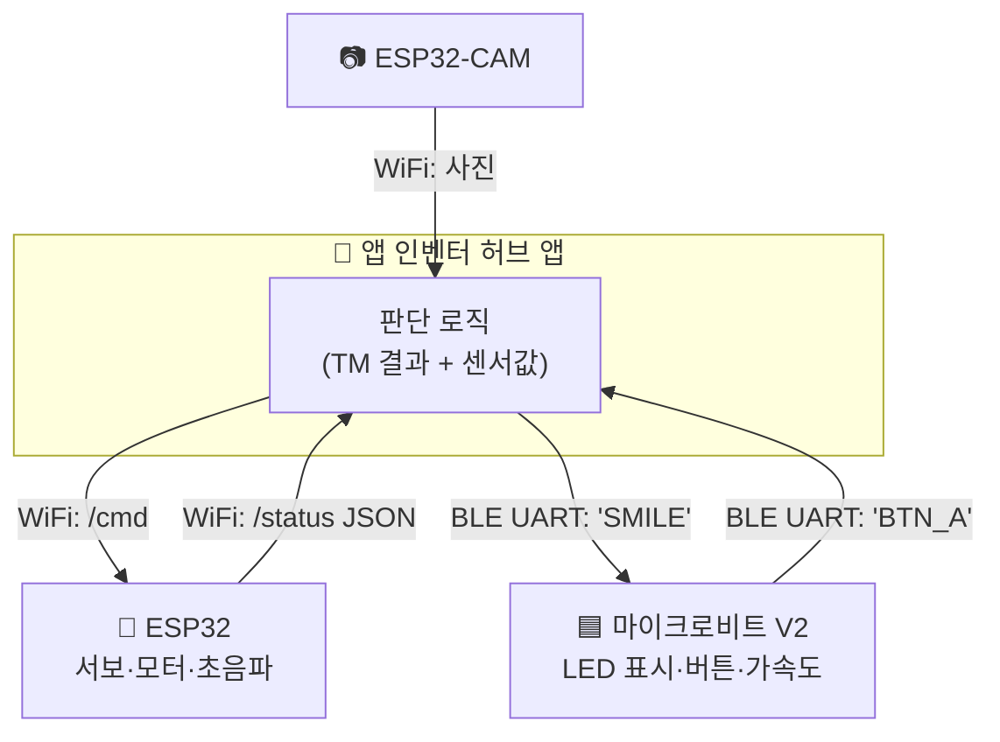

| 역할 | 장치 | 통신 | 예시 |
|------|------|------|------|
| 눈 | ESP32-CAM | WiFi | 물체·사람 인식 |
| 손발 | ESP32 | WiFi | 서보·모터·부저 |
| 감각 | ESP32 + 초음파/조도 | WiFi | 거리·밝기 |
| 몸에 붙는 표시기 | 마이크로비트 | **BLE** | 사용자 손목/책상 위에서 결과 표시, 버튼으로 확인 응답 |
| 두뇌 | 앱 인벤터 앱 | — | 모든 판단·기록 |

> 💡 폰은 WiFi와 BLE를 **동시에** 사용할 수 있으므로, 앱 하나가 두 종류의 기기를 함께 제어하는 구조를 자연스럽게 경험할 수 있다.

### 9.5 양방향 통신: 센서값 받기

```cpp
// esp32_cmd_server_sensor.ino 에 추가되는 부분
const int PIN_TRIG = 5, PIN_ECHO = 18;
int servoAngle = 90;   // servo.write() 할 때마다 함께 갱신

long readDistanceCm() {
  digitalWrite(PIN_TRIG, LOW);  delayMicroseconds(2);
  digitalWrite(PIN_TRIG, HIGH); delayMicroseconds(10);
  digitalWrite(PIN_TRIG, LOW);
  long us = pulseIn(PIN_ECHO, HIGH, 30000);
  return us == 0 ? -1 : us / 58;
}

void handleStatus() {
  addCors();
  String json = "{\"dist\":" + String(readDistanceCm()) +
                ",\"servo\":" + String(servoAngle) + "}";
  server.send(200, "application/json", json);
}
// setup(): pinMode(PIN_TRIG, OUTPUT); pinMode(PIN_ECHO, INPUT);
//          server.on("/status", handleStatus);
```

```text
[앱 인벤터]
언제 clkPoll.Timer (1000ms):
    Web2.Url ← 합치기("http://", txtIP.Text, "/status")
    Web2.Get

언제 Web2.GotText(..., responseContent):
    d ← Web2.JsonTextDecodeWithDictionaries(responseContent)
    dist ← 딕셔너리 d 에서 "dist" 값 가져오기
    lblDist.Text ← 합치기("거리: ", dist, " cm")
    만약 dist > 0 그리고 dist < 15 이면:
        호출 sendCmd("ALARM")
```

| 포인트 | 설명 |
|--------|------|
| 명령용 `Web1`, 조회용 `Web2` 분리 | 응답이 섞이지 않도록 |
| 폴링 주기 1초 | 더 빠르면 ESP32 응답 지연 증가 |
| 센서 + AI 조건 결합 | "사람이 보이고(AI) **그리고** 15cm 이내(센서)" 같은 복합 판단 |

### 9.6 프로젝트 기획서 양식

| 항목 | 작성 내용 | 예시 (AI 스마트 분리수거함) |
|------|----------|-------------------------|
| 해결할 문제 | 누가, 어떤 불편? | 급식실에서 캔·페트병이 섞여 버려짐 |
| 사용자 | | 초등학생 |
| 입력 (눈·감각) | 카메라 / 센서 | ESP32-CAM, 초음파(물건 투입 감지) |
| AI 판단 | TM 클래스 | `CAN`, `PET`, `PAPER`, `EMPTY` |
| 출력 (손발) | 액추에이터 | 서보 2개 (분류판), 부저 |
| 표시 | 앱 / 마이크로비트 | 앱: 누적 개수 / 마이크로비트: 맞으면 ☺ |
| 통신 | WiFi / BLE | 둘 다 |
| 성공 기준 | 측정 가능하게 | 20회 투입 중 16회 이상 정확 분류 |
| 역할 분담 | | A: 데이터·AI / B: 하드웨어·앱 |

### 9.7 추천 프로젝트 주제

| 주제 | AI 판단 | 센서 | 출력 | BLE 활용 | 난이도 |
|------|--------|------|------|---------|--------|
| AI 스마트 분리수거함 | 쓰레기 종류 | 초음파 | 서보 분류판 | 정답 표시 | ⭐⭐ |
| 반려식물 지킴이 | 잎 상태(건강/시듦) | 토양수분 | 미니펌프 릴레이 | 상태 아이콘 | ⭐⭐⭐ |
| 교실 출입 안내 로봇 | 사람/빈 곳 | 초음파 | 서보 팔 인사 + 부저 | 방문자 카운트 | ⭐⭐ |
| 자동 먹이 주는 장치 | 반려동물 장난감 인형 감지 | — | 서보 급식구 | 급식 알림 | ⭐⭐ |
| AI 주차 안내 | 빈자리/차 있음 (장난감 차) | 초음파 | LED 신호등 | 운전자 손목 알림 | ⭐⭐⭐ |
| 손동작 로봇팔 | 손동작(폰 카메라) | — | 서보 2~3축 | 기울기 보조 조종 | ⭐⭐⭐ |

### 9.8 프로젝트 진행 흐름

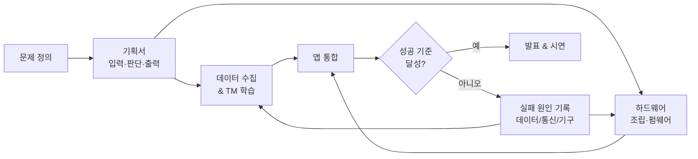

### 9.9 테스트 기록표 (4일차)

| 회차 | 입력 상황 | 기대 결과 | 실제 결과 | 성공 | 원인 분류 | 개선 조치 |
|------|----------|----------|----------|------|----------|----------|
| 1 | 캔 투입 | 왼쪽 분류 | 왼쪽 | ✅ | — | — |
| 2 | 구겨진 페트병 | 오른쪽 | 반응 없음 | ❌ | 데이터 | 구겨진 페트병 사진 20장 추가 |
| 3 | 연속 2개 투입 | 각각 분류 | 두 번째 무시 | ❌ | 로직 | 쿨다운 1.5→0.8초 |
| … | | | | | 데이터 / 통신 / 기구 / 로직 | |

### 9.10 발표 구성 (4분)

| 순서 | 시간 | 내용 |
|------|------|------|
| 1 | 30초 | 문제와 사용자 |
| 2 | 60초 | 시스템 구조도 (입력 → AI → 통신 → 출력) |
| 3 | 90초 | 실물 시연 |
| 4 | 40초 | 실패와 개선 (테스트 기록표에서 1가지) |
| 5 | 20초 | 다음에 추가하고 싶은 기능 |

---

## 10. 평가 루브릭

### 10.1 3시간 과정

| 평가 요소 | 우수 (3) | 보통 (2) | 노력 (1) |
|----------|---------|---------|---------|
| 통신 이해 | IP·URL·응답을 자기 말로 설명 | 용어는 알지만 설명이 부분적 | 설명 어려움 |
| 앱 제작 | 수동+AI 자동 모두 작동, 로그 표시 | 한 가지만 작동 | 템플릿 일부 수정 |
| AI 학습 | 클래스별 정확도 80% 이상, 신뢰도 조건 적용 | 인식되나 오작동 잦음 | 학습만 완료 |
| 태도 | 팀원과 역할 교대, 질문 적극 | 참여 | 소극적 |

### 10.2 6시간 과정

| 평가 요소 | 우수 (3) | 보통 (2) | 노력 (1) |
|----------|---------|---------|---------|
| 시스템 통합 | CAM → AI → 앱 → ESP32 전 구간 자동 작동 | 일부 구간 수동 | 구간별로만 작동 |
| 데이터 설계 | 배경 클래스·실전 카메라 학습 원칙 적용 | 한 가지만 적용 | 미적용 |
| 문제 해결 | 로그를 보고 원인 구간을 스스로 찾음 | 도움 받아 해결 | 해결 못함 |
| 비교 이해 | WiFi/BLE 차이를 근거와 함께 설명 | 차이 일부 설명 | 설명 어려움 |

### 10.3 12시간 과정

| 평가 요소 | 비중 | 우수 기준 |
|----------|------|----------|
| 문제 정의·기획 | 15% | 사용자·성공 기준이 구체적이고 측정 가능 |
| AI 모델 품질 | 20% | 성공 기준 달성, 실패 사례를 데이터로 개선한 기록 |
| IoT 통합 | 25% | 양방향 통신(센서값 수신) 또는 BLE 하이브리드 구현 |
| 테스트·개선 | 15% | 테스트 기록 5회 이상, 원인 분류·조치 명확 |
| 발표·시연 | 15% | 시간 준수, 구조도로 설명, 실물 시연 성공 |
| 협업 | 10% | 역할 분담표와 실제 기여 일치 |

---

## 11. 트러블슈팅

### 11.1 통신 문제 진단 흐름

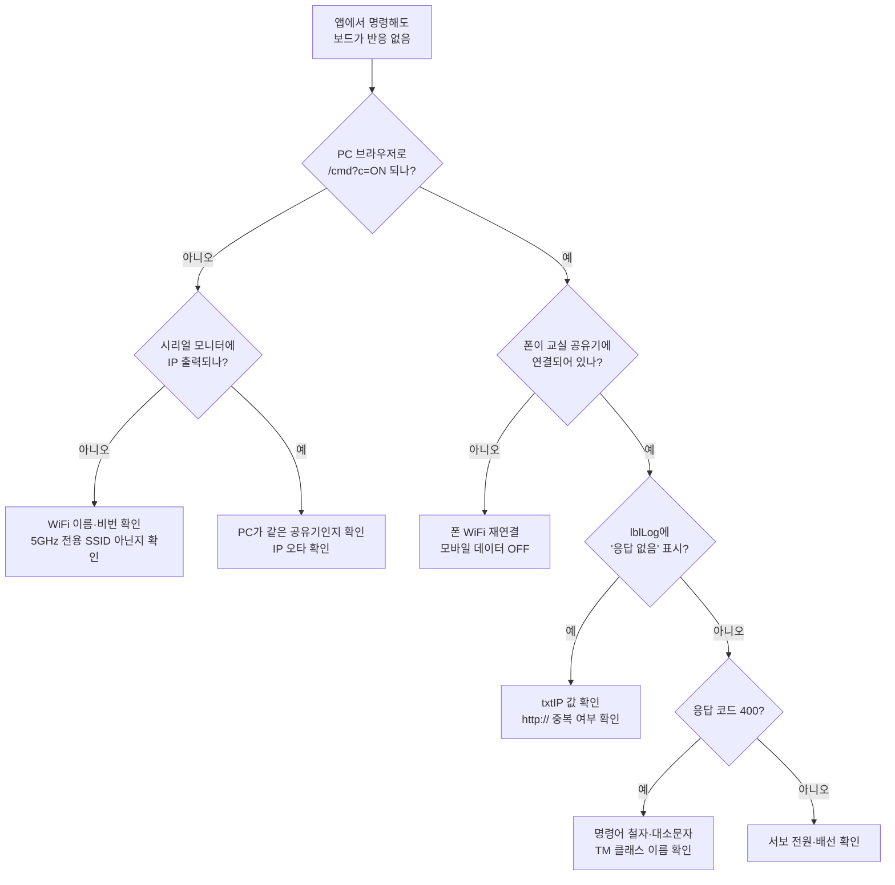

### 11.2 증상별 해결표

| 증상 | 원인 | 해결 |
|------|------|------|
| ESP32가 WiFi에 안 붙음 | 5GHz 전용 SSID / 비번 오타 | 2.4GHz SSID 분리, 시리얼 모니터 확인 |
| 폰에서 ESP32 접속 불가, PC는 됨 | 폰이 모바일 데이터로 우회 / 다른 SSID | 폰 WiFi "인터넷 없음" 경고 무시하고 유지, 데이터 OFF |
| 학교 WiFi에서 아무도 접속 안 됨 | AP 격리(클라이언트 간 통신 차단) | 교실 전용 공유기 사용 |
| ESP32-CAM 재부팅 반복 (`Brownout detector`) | 전원 부족 | 5V 2A 어댑터, 짧은 USB 케이블 |
| ESP32-CAM `Camera init failed` | 카메라 리본 케이블 / 모델 설정 | 커넥터 재장착, `CAMERA_MODEL_AI_THINKER` 확인 |
| TM 페이지에 사진은 보이는데 예측 안 됨 | CORS 헤더 없음 → 캔버스 오염 | `/capture` CORS 헤더 추가, `crossorigin="anonymous"` |
| 3h TM 페이지 카메라 검은 화면 | http 페이지 / 권한 거부 | https 주소 사용, 앱 권한에서 카메라 허용 |
| `WebViewStringChange` 가 안 불림 | 페이지에서 `window.AppInventor` 미호출 | 페이지 콘솔 확인, 같은 값 반복 시 이벤트 미발생 → 확률 포함해 값 변화 유도 |
| 서보가 떨림 | 같은 명령 반복 / 전원 부족 | `lastCmd`·쿨다운 적용, 서보 외부 전원 |
| 인식이 느림 (2초 이상) | 고해상도 / 짧은 폴링 | QVGA, 폴링 700ms 이상 |
| 스트림 보면서 캡처하면 멈춤 | ESP32-CAM 동시 처리 한계 | AI 판단 중에는 스트림 화면 끄기 |
| 업로드 실패 (`Failed to connect`) | 부트 모드 미진입 | ESP32: BOOT 버튼 누른 채 업로드 / CAM: MB 보드 IO0 확인 |

### 11.3 마이크로비트 BLE 문제

| 증상 | 해결 |
|------|------|
| 스캔에 안 나타남 | MakeCode에 `bluetooth.startUartService()` 있는지, 폰 블루투스·위치 ON, 권한 허용 |
| 연결은 되는데 데이터 안 옴 | `RequestTXCharacteristic` 호출 여부, 보내는 문자열 끝 `\n` |
| 컴파일 오류 (V1) | 불필요한 확장 제거, V2 사용 |
| 페어링 요구 팝업 | 프로젝트 설정을 "No Pairing Required" 로 변경 후 재업로드 |
| 다른 폰에 연결된 상태 | 마이크로비트 리셋 → 다시 스캔 |

---

## 12. 강사 운영 가이드

### 12.1 역할 분담 (강사 1 + 보조 1 기준)

| 시점 | 주강사 | 보조강사 |
|------|--------|---------|
| 수업 전 | 펌웨어 업로드, 공유기, 로컬 서버 | 교구 세팅, 이름표 부착 |
| 개념 설명 | 화면 미러링 시연 | 폰 Companion 연결 지원 |
| 실습 | 막힌 팀 진단 (11.1 흐름도) | 하드웨어 배선·전원 |
| 모델 전달 (6h~) | 팀 모델 → `models/teamNN/` 배치 | zip 수거 |
| 마무리 | 발표 진행 | 교구 회수·전원 차단 |

### 12.2 플랜 B

| 상황 | 대응 |
|------|------|
| 인터넷 끊김 (3h) | 방식 C(PIC 확장) 또는 6h 방식 B로 전환 — 강사 PC에 미리 만든 손동작 모델 사용 |
| 공유기 고장 | 강사 노트북 모바일 핫스팟 (동일 SSID·비번으로 사전 설정) |
| 학생 폰 부족 | 강사 태블릿 2대 순환 / 팀당 1대로 축소 |
| ESP32-CAM 불량 다수 | 6h 후반을 폰 카메라 버전으로 진행, 강사 CAM 1대로 시연 |
| 구글 계정 로그인 불가 | AI2 체험 서버(code.appinventor.mit.edu) 사용, `.aia` 내보내기로 저장 |
| 마이크로비트 BLE 실패 | 12h BLE 모듈을 생략하고 앱 화면 표시로 대체 (평가 감점 없음) |

### 12.3 안전 수칙

| 항목 | 수칙 |
|------|------|
| 전원 | 배선 변경은 반드시 USB 분리 후 |
| ESP32-CAM | 동작 중 발열 — 금속면 직접 접촉 금지 |
| 서보·모터 | 손가락 끼임 주의, 고정 후 테스트 |
| 개인정보 | 사람 얼굴 데이터는 수업 후 삭제, 외부 업로드 금지 (TM 업로드 링크는 3h 손동작 한정) |
| 네트워크 | 교실 공유기는 수업 종료 후 전원 차단 |

### 12.4 타임키핑 팁

| 지점 | 흔히 지연되는 이유 | 단축 방법 |
|------|------------------|----------|
| Companion 연결 | QR 인식·WiFi 불일치 | 수업 전 학생 폰 사전 점검 |
| TM 학습 | 사진 과다 촬영 | 클래스당 100장 상한 |
| 펌웨어 업로드 (12h) | 드라이버 미설치 | 강사 PC로 업로드, 학생은 코드 수정만 |
| 모델 배치 (6h) | zip 수거·해제 | 공유 폴더 + 팀 번호 파일명 규칙 |

---

## 13. FAQ

| 질문 | 답변 |
|------|------|
| 아이폰으로도 되나요? | 앱 인벤터 iOS Companion은 일부 컴포넌트·확장 지원이 제한적이다. WiFi(`Web`, `WebViewer`) 부분은 동작 가능성이 높지만 BLE 확장은 사전 실기 테스트가 필요하므로 **안드로이드 기기 준비를 기본**으로 한다. |
| 아두이노 우노로는 안 되나요? | 기본 우노에는 WiFi가 없다. **UNO R4 WiFi**는 가능하며, 기존 우노는 ESP 모듈과 시리얼 연결이 필요해 수업 시간 대비 난도가 높다. 본 과정은 아두이노 IDE로 프로그래밍하는 ESP32를 표준으로 한다. |
| 마이크로비트를 WiFi로 연결할 수 있나요? | 마이크로비트에는 WiFi가 없다. 앱 인벤터와는 **BLE**로 연결하며(4장), WiFi 장치와 함께 쓰려면 폰 앱이 중간 허브 역할을 한다(9.4). |
| 앱 인벤터 기본 블루투스 컴포넌트로 마이크로비트 연결이 안 돼요. | 기본 `BluetoothClient`는 클래식 블루투스 전용이다. 마이크로비트는 BLE이므로 **BluetoothLE 확장 + micro:bit 확장**을 사용해야 한다. |
| 인터넷이 없는 교실에서도 되나요? | 6h·12h의 ESP32-CAM 방식(강사 PC 로컬 페이지 + 로컬 tfjs 라이브러리)은 인터넷 없이 동작한다. 3h 폰 카메라 방식은 https 페이지가 필요해 인터넷이 있어야 하며, 없으면 PIC 확장으로 대체한다. |
| 앱을 설치 파일(APK)로 만들 수 있나요? | 가능하다. 빌드 → Android App(.apk). 단 수업 중에는 Companion으로 실시간 테스트하는 것이 빠르다. |
| 기존 앱 인벤터 과정을 듣지 않았어도 되나요? | 3시간 과정은 템플릿으로 시작하므로 가능하다. 6·12시간 과정은 앱 인벤터 기초(이벤트·변수·조건문) 경험을 권장한다. |
| ESP32-CAM에서 직접 AI를 돌리면 안 되나요? | 가능은 하지만(Edge Impulse 등) 모델 변환·메모리 최적화가 필요해 본 과정 대상에 비해 어렵다. 본 과정은 "폰이 두뇌, 보드가 눈·손발" 구조로 개념을 명확히 한다. 심화는 [아두이노 CC × ESP32-CAM × Flask 컴퓨터비전 커리큘럼](./아두이노CC_ESP32CAM_Flask_컴퓨터비전_커리큘럼.md)으로 연계. |

---

### 관련 문서

| 문서 | 연계 내용 |
|------|----------|
| [블록코딩 DWAI 마이크로비트 3-6-12시간 커리큘럼](./블록코딩_DWAI_마이크로비트_3-6-12시간_단계별_커리큘럼.md) | 마이크로비트 기초·radio 통신 |
| [DWAI + TM + 마이크로비트 통합 커리큘럼](./DWAI_TM_마이크로비트_통합_커리큘럼.md) | Teachable Machine 학습 기초 |
| [아두이노 CC × ESP32-CAM × Flask 컴퓨터비전 커리큘럼](./아두이노CC_ESP32CAM_Flask_컴퓨터비전_커리큘럼.md) | ESP32-CAM 서버·OpenCV 심화 |
| [4단계 피지컬 컴퓨팅 커리큘럼](./4단계-PHYSICAL_COMPUTING_CURRICULUM.md) | 센서·액추에이터 심화 |
