# 피지컬 컴퓨팅 교육 가이드

## 📚 목차
1. [피지컬 컴퓨팅이란?](#피지컬-컴퓨팅이란)
2. [교육적 가치](#교육적-가치)
3. [학습 준비](#학습-준비)
4. [교육 과정 설계](#교육-과정-설계)
5. [단계별 학습 가이드](#단계별-학습-가이드)
6. [프로젝트 기반 학습](#프로젝트-기반-학습)
7. [평가 및 피드백](#평가-및-피드백)
8. [문제 해결 가이드](#문제-해결-가이드)
9. [진로 연계](#진로-연계)
10. [참고 자료](#참고-자료)

---

## 📖 피지컬 컴퓨팅이란?

### 정의

**피지컬 컴퓨팅(Physical Computing)**은 디지털 세계와 물리적 세계를 연결하여, 센서로 외부 환경을 감지하고 액추에이터로 물리적 반응을 만들어내는 인터랙티브 시스템을 설계하고 구현하는 분야입니다.


### 핵심 구성 요소

#### 1. 센서 (Sensor)
물리적 세계의 정보를 전기 신호로 변환하는 장치

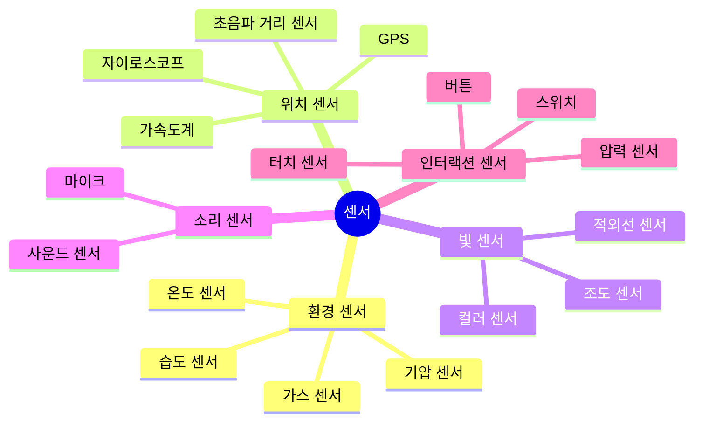

#### 2. 마이크로컨트롤러 (Microcontroller)
센서 데이터를 받아 처리하고 액추에이터를 제어하는 두뇌

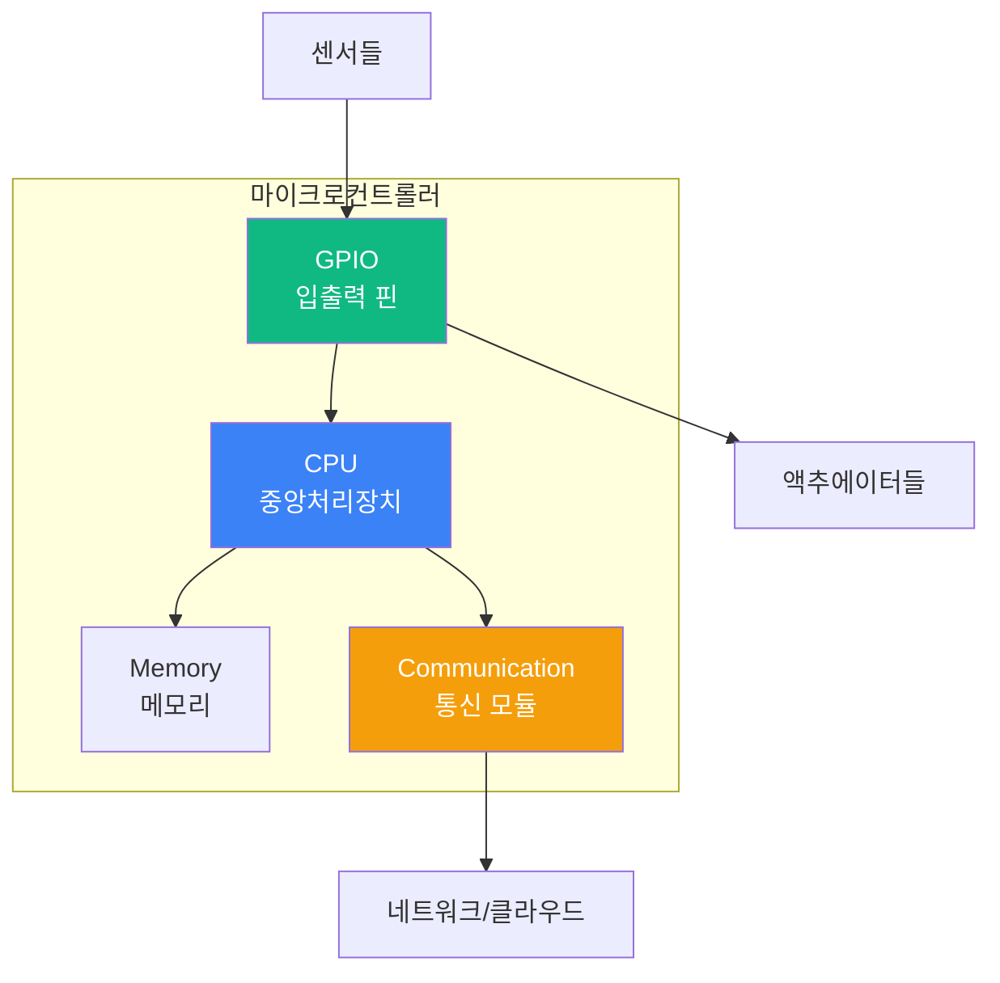

**주요 플랫폼:**
- **Arduino (아두이노)**: 초보자 친화적, 풍부한 라이브러리
- **ESP32**: WiFi/Bluetooth 내장, 저전력, 저가
- **Raspberry Pi (라즈베리파이)**: Linux 기반, 고성능, AI 통합 가능
- **Micro:bit**: 교육용, 블록 코딩 지원

#### 3. 액추에이터 (Actuator)
전기 신호를 물리적 동작으로 변환하는 장치

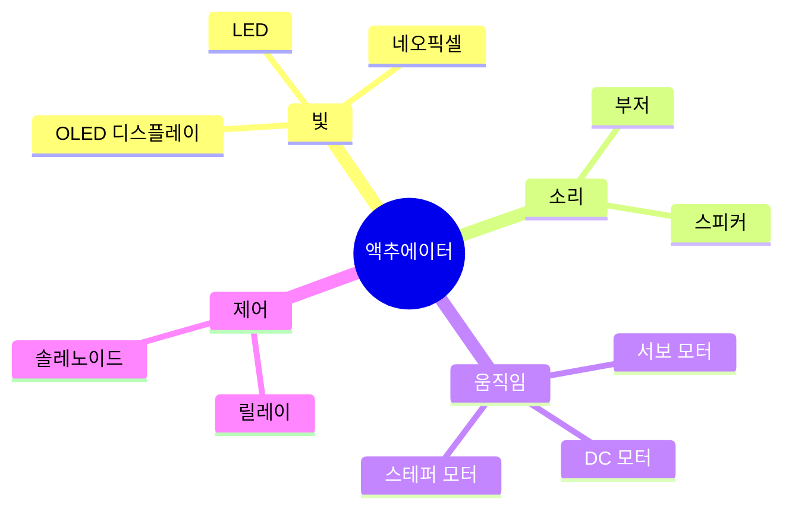

### 피지컬 컴퓨팅의 역사

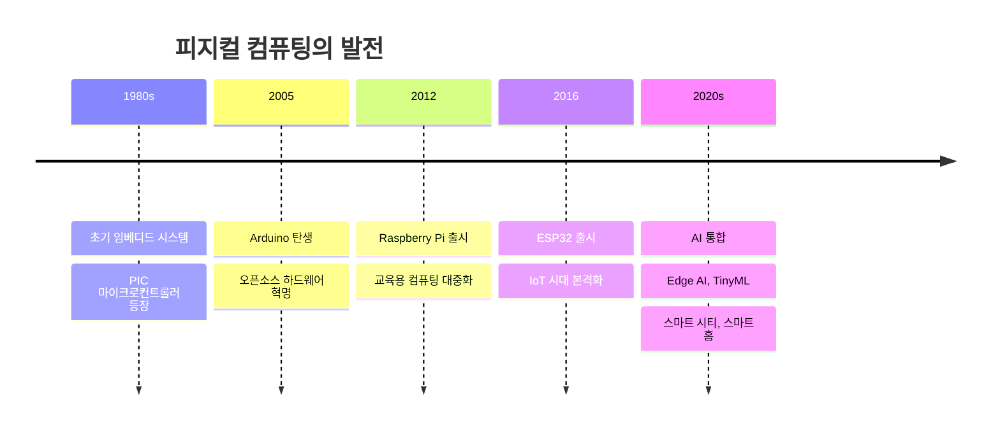

---

## 🎯 교육적 가치

### 왜 피지컬 컴퓨팅을 가르쳐야 하는가?

#### 1. 추상적 개념의 구체화


**예시:**
- **일반 프로그래밍**: `print("Hello")` → 화면에 텍스트
- **피지컬 컴퓨팅**: `digitalWrite(LED, HIGH)` → LED가 실제로 켜짐 💡

학생들은 코드가 물리적 세계에 직접 영향을 미치는 것을 보며 프로그래밍의 힘을 체감합니다.

#### 2. 융합적 사고력 개발

피지컬 컴퓨팅은 여러 학문을 자연스럽게 융합합니다.

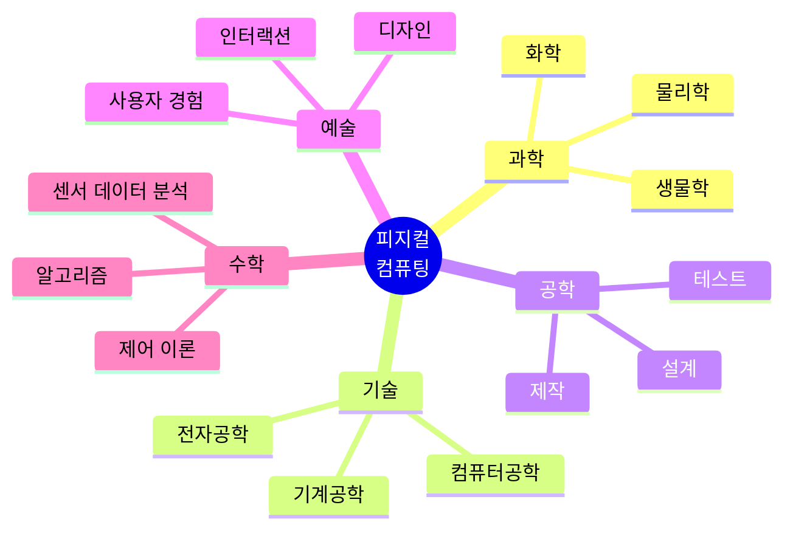

**STEAM 교육의 완벽한 예:**
- **Science (과학)**: 센서 원리, 전기 회로
- **Technology (기술)**: 마이크로컨트롤러, 프로그래밍
- **Engineering (공학)**: 시스템 설계, 문제 해결
- **Arts (예술)**: 프로젝트 디자인, 사용자 경험
- **Math (수학)**: 데이터 분석, 알고리즘

#### 3. 문제 해결 능력 향상

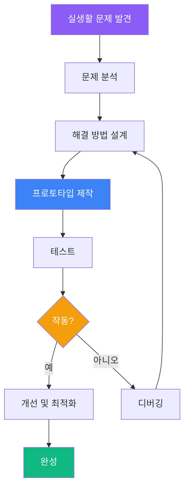

**학습 과정:**
1. **문제 정의**: "우리 집 화분이 자주 말라 죽어요"
2. **해결책 구상**: "자동으로 물을 주는 시스템을 만들자"
3. **설계**: 토양 습도 센서 + 물펌프 + 아두이노
4. **구현**: 코드 작성, 회로 연결
5. **테스트**: 실제 화분에 적용
6. **개선**: 습도 임계값 조정, 알림 기능 추가

#### 4. 창의력과 상상력 자극

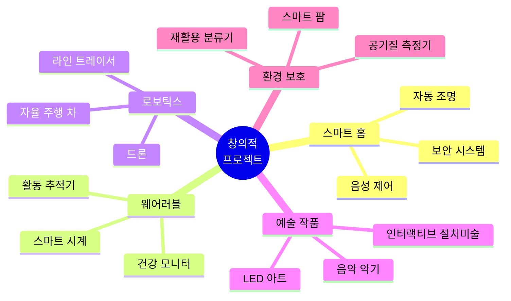

#### 5. 4차 산업혁명 시대 핵심 역량

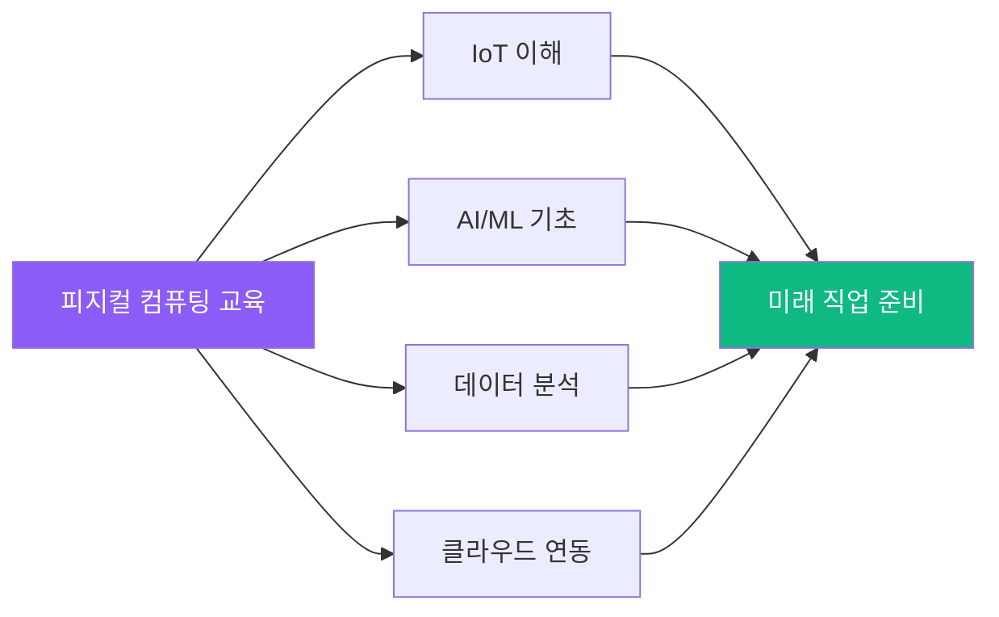

**미래 직업 연계:**
- IoT 개발자
- 임베디드 시스템 엔지니어
- 로보틱스 엔지니어
- 스마트 시티 설계자
- 메이커

---

## 🎒 학습 준비

### 학생 사전 지식 체크리스트

#### 초급 (초등 고학년 ~ 중등 1학년)
- [ ] 블록 코딩 경험 (Scratch, Entry 등)
- [ ] 기본적인 컴퓨터 사용 능력
- [ ] 간단한 수학 연산 (사칙연산)
- [ ] 호기심과 실험 정신

#### 중급 (중등 2-3학년)
- [ ] 텍스트 기반 프로그래밍 기초 (Python 또는 C/C++)
- [ ] 변수, 조건문, 반복문 이해
- [ ] 함수 개념
- [ ] 간단한 전기 회로 이해

#### 고급 (고등학생)
- [ ] Python/C++ 숙련도
- [ ] 알고리즘과 자료구조 기초
- [ ] 객체지향 프로그래밍 개념
- [ ] Linux 기본 명령어 (라즈베리파이 사용 시)

### 필수 교구 리스트

#### 1단계: Arduino 기초 (예산: 약 8만원)

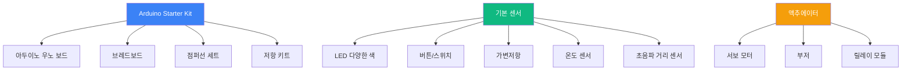

**상세 목록:**

| 항목 | 수량 | 용도 | 예상 가격 |
|------|------|------|----------|
| Arduino Uno R3 | 1개 | 메인 보드 | 25,000원 |
| 브레드보드 (830홀) | 1개 | 회로 구성 | 3,000원 |
| 점퍼선 세트 (M-M, M-F, F-F) | 각 40개 | 연결 | 5,000원 |
| LED (빨강, 녹색, 파랑, 노랑) | 각 10개 | 출력 표시 | 2,000원 |
| 저항 키트 (220Ω, 1kΩ, 10kΩ) | 각 10개 | 전류 제한 | 3,000원 |
| 택트 스위치 | 5개 | 입력 | 1,000원 |
| 가변저항 (10kΩ) | 2개 | 아날로그 입력 | 2,000원 |
| DHT11 온습도 센서 | 1개 | 환경 측정 | 3,000원 |
| HC-SR04 초음파 센서 | 1개 | 거리 측정 | 3,000원 |
| SG90 서보 모터 | 2개 | 각도 제어 | 6,000원 |
| 부저 | 1개 | 소리 출력 | 1,000원 |
| 포토레지스터 (CdS) | 2개 | 빛 감지 | 1,000원 |
| PIR 모션 센서 | 1개 | 동작 감지 | 3,000원 |
| USB 케이블 (A-B) | 1개 | 프로그래밍 | 3,000원 |
| 9V 배터리 + 커넥터 | 1세트 | 전원 | 5,000원 |
| **합계** | | | **약 66,000원** |

#### 2단계: ESP32 + IoT (예산: 약 12만원)

| 항목 | 수량 | 용도 | 예상 가격 |
|------|------|------|----------|
| ESP32 DevKit | 1개 | WiFi/Bluetooth | 8,000원 |
| ESP32-CAM | 1개 | 카메라 모듈 | 7,000원 |
| FTDI USB-TTL 변환기 | 1개 | ESP32-CAM 프로그래밍 | 5,000원 |
| OLED 디스플레이 (0.96") | 1개 | 정보 표시 | 5,000원 |
| DHT22 온습도 센서 | 1개 | 정밀 환경 측정 | 5,000원 |
| MQ-2 가스 센서 | 1개 | 가스 감지 | 3,000원 |
| Relay 모듈 (2채널) | 1개 | 고전력 제어 | 5,000원 |
| L298N 모터 드라이버 | 1개 | DC 모터 제어 | 7,000원 |
| DC 기어 모터 (2개) | 1세트 | 구동 | 10,000원 |
| 18650 리튬 배터리 + 홀더 | 2개 | 전원 | 15,000원 |
| 점퍼선, 저항 등 소모품 | - | 추가 부품 | 10,000원 |
| **합계** | | | **약 80,000원** |

#### 3단계: Raspberry Pi + AI (예산: 약 20만원)

| 항목 | 수량 | 용도 | 예상 가격 |
|------|------|------|----------|
| Raspberry Pi 4 (4GB) | 1개 | 메인 컴퓨터 | 70,000원 |
| Raspberry Pi Camera V2 | 1개 | 컴퓨터 비전 | 30,000원 |
| microSD 카드 (64GB) | 1개 | 저장소 | 15,000원 |
| 공식 전원 어댑터 (5V 3A) | 1개 | 전원 | 12,000원 |
| 케이스 + 방열판 | 1세트 | 보호 | 10,000원 |
| GPIO 확장 보드 | 1개 | 센서 연결 | 8,000원 |
| 센서 키트 (37종) | 1세트 | 다양한 실습 | 25,000원 |
| HDMI 케이블 | 1개 | 모니터 연결 | 5,000원 |
| 키보드 + 마우스 | 1세트 | 입력 | 15,000원 |
| **합계** | | | **약 190,000원** |

### 소프트웨어 준비

#### Arduino 개발 환경


**설치 단계:**

1. **Arduino IDE 다운로드**
   - 공식 사이트: https://www.arduino.cc/en/software
   - Windows, macOS, Linux 버전 제공

2. **드라이버 설치**
   - Windows: CH340 드라이버 설치 필요 (클론 보드의 경우)
   - macOS/Linux: 대부분 자동 인식

3. **보드 설정**
   ```
   도구 → 보드 → Arduino Uno
   도구 → 포트 → COM3 (Windows) 또는 /dev/ttyUSB0 (Linux)
   ```

4. **필수 라이브러리**
   ```
   스케치 → 라이브러리 포함하기 → 라이브러리 관리
   ```
   
   설치할 라이브러리:
   - `Servo` (서보 모터 제어)
   - `DHT sensor library` (온습도 센서)
   - `Adafruit Unified Sensor` (센서 통합)
   - `NewPing` (초음파 센서)

5. **첫 코드 실행**
   ```cpp
   // Blink 예제 (LED 깜빡이기)
   void setup() {
     pinMode(13, OUTPUT);  // 내장 LED 핀
   }
   
   void loop() {
     digitalWrite(13, HIGH);  // LED 켜기
     delay(1000);             // 1초 대기
     digitalWrite(13, LOW);   // LED 끄기
     delay(1000);             // 1초 대기
   }
   ```

#### Raspberry Pi 개발 환경

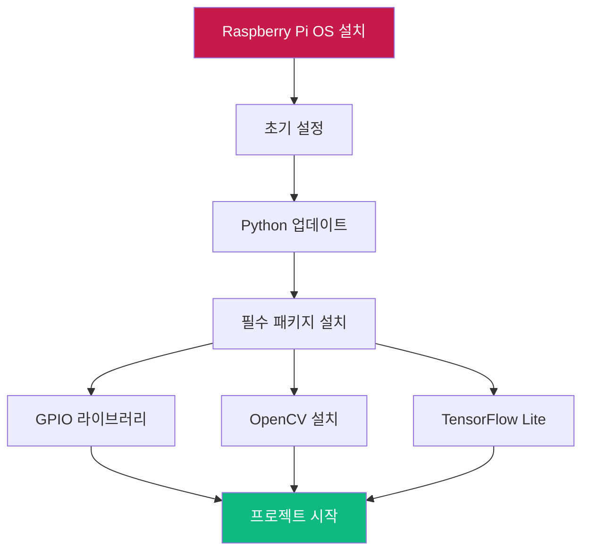

**설치 가이드:**

1. **OS 설치**
   ```bash
   # Raspberry Pi Imager 사용 (권장)
   # https://www.raspberrypi.com/software/
   
   # 또는 수동 설치
   # 1. Raspberry Pi OS Lite/Desktop 이미지 다운로드
   # 2. Balena Etcher로 microSD에 플래시
   # 3. boot 파일에 ssh, wpa_supplicant.conf 설정
   ```

2. **초기 설정**
   ```bash
   # SSH 접속 후
   sudo raspi-config
   
   # 설정 항목:
   # - 비밀번호 변경
   # - 지역/시간대 설정
   # - 인터페이스 → Camera, I2C, SPI 활성화
   # - 메모리 분할 (GPU 128MB)
   ```

3. **Python 환경 설정**
   ```bash
   # 시스템 업데이트
   sudo apt update
   sudo apt upgrade -y
   
   # Python 3.9+ 확인
   python3 --version
   
   # pip 업그레이드
   sudo pip3 install --upgrade pip
   ```

4. **필수 라이브러리 설치**
   ```bash
   # GPIO 제어
   sudo pip3 install RPi.GPIO gpiozero
   
   # 센서 라이브러리
   sudo pip3 install Adafruit-DHT
   sudo pip3 install adafruit-circuitpython-bme280
   
   # OpenCV (컴퓨터 비전)
   sudo apt install python3-opencv
   # 또는 pip로 설치 (시간 오래 걸림)
   sudo pip3 install opencv-python opencv-contrib-python
   
   # TensorFlow Lite (AI 추론)
   pip3 install tflite-runtime
   
   # 기타 유용한 라이브러리
   sudo pip3 install numpy pandas matplotlib
   ```

5. **GPIO 테스트**
   ```python
   # test_gpio.py
   import RPi.GPIO as GPIO
   import time
   
   LED_PIN = 17
   
   GPIO.setmode(GPIO.BCM)
   GPIO.setup(LED_PIN, GPIO.OUT)
   
   try:
       while True:
           GPIO.output(LED_PIN, GPIO.HIGH)
           print("LED ON")
           time.sleep(1)
           GPIO.output(LED_PIN, GPIO.LOW)
           print("LED OFF")
           time.sleep(1)
   except KeyboardInterrupt:
       GPIO.cleanup()
   ```

### 안전 교육

피지컬 컴퓨팅 수업에서는 안전이 최우선입니다.

#### 전기 안전 수칙

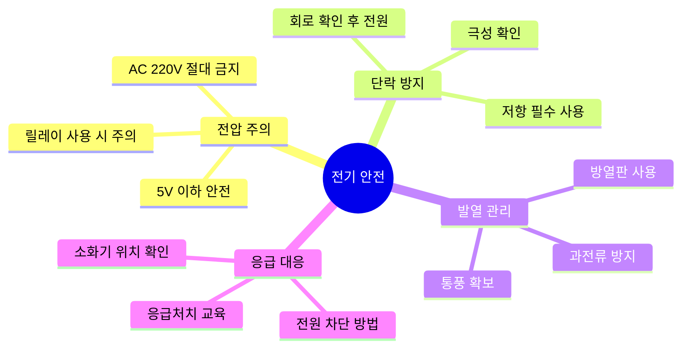

**필수 안전 규칙:**

1. **전원을 끄고 회로 연결**: 전원이 켜진 상태에서 회로 변경 금지
2. **극성 확인**: LED, 센서, 배터리의 (+/-) 반드시 확인
3. **저항 사용**: LED 연결 시 항상 저항 (220Ω) 직렬 연결
4. **전압 확인**: Arduino는 5V, ESP32는 3.3V (혼동 주의)
5. **배터리 관리**: 리튬 배터리 과충전/과방전 방지
6. **AC 전원 금지**: 학생 실습에서 220V 직접 다루기 금지 (릴레이 사용)

#### 실습실 안전 점검 리스트

```markdown
수업 시작 전:
- [ ] 소화기 위치 확인
- [ ] 환기 상태 양호
- [ ] 전원 콘센트 정상 작동
- [ ] 납땜 인두 안전 거치대 준비 (납땜 수업 시)
- [ ] 구급함 비치 확인

수업 중:
- [ ] 학생당 작업 공간 충분
- [ ] 전선이 정리되어 있음
- [ ] 학생들이 안전 수칙 숙지
- [ ] 교사가 전체 상황 모니터링

수업 후:
- [ ] 모든 전원 차단
- [ ] 부품 정리 및 개수 확인
- [ ] 리튬 배터리 충전 상태 확인
- [ ] 실습실 청소 및 정리
```

---

## 🏗️ 교육 과정 설계

### 교육 철학: 메이커 교육 (Maker Education)

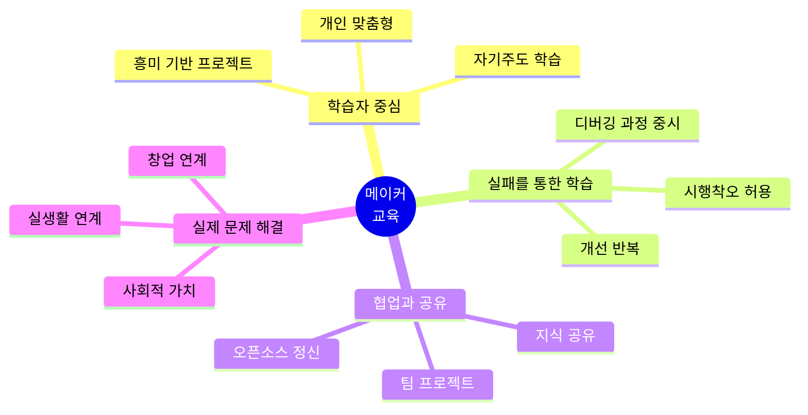

### 교수-학습 모델: 5E 모델

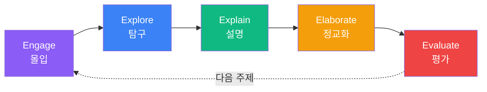

#### 1. Engage (몰입) - 동기 유발

**목표**: 학생들의 호기심과 관심을 유발

**활동 예시:**
- **시연**: 완성된 프로젝트 시연 (예: 자율 주행 자동차)
- **질문**: "집에서 불편한 점이 있나요? 기술로 해결할 수 있을까요?"
- **영상**: 실제 IoT 기기, 로봇 관련 영상 시청
- **토론**: "미래에는 어떤 스마트 기기가 필요할까요?"

**교사 역할:**
- 흥미로운 자료 준비
- 개방형 질문으로 사고 자극
- 학생들의 아이디어 경청

#### 2. Explore (탐구) - 탐색 활동

**목표**: 직접 만지고 실험하며 개념 발견

**활동 예시:**
- **센서 체험**: 다양한 센서를 만져보고 작동 원리 추측
- **회로 구성**: 브레드보드에 LED, 버튼 연결 실습
- **코드 수정**: 예제 코드를 수정하며 결과 관찰
- **문제 발견**: "왜 LED가 안 켜질까?" 직접 원인 탐구

**교사 역할:**
- 충분한 탐색 시간 제공
- 힌트 제공 (직접 답 주지 않기)
- 안전 사항 지도

#### 3. Explain (설명) - 개념 정리

**목표**: 탐구한 내용을 체계적으로 정리

**활동 예시:**
- **원리 설명**: 전기 회로, 프로그래밍 개념 설명
- **용어 정리**: GPIO, PWM, 센서, 액추에이터 등
- **발표**: 학생들이 발견한 내용 공유
- **다이어그램**: 시스템 구조도 그리기

**교사 역할:**
- 명확한 개념 설명
- 학생들의 발견과 연결
- 시각 자료 활용 (다이어그램, 영상)

#### 4. Elaborate (정교화) - 심화 학습

**목표**: 배운 내용을 새로운 상황에 적용

**활동 예시:**
- **프로젝트 설계**: 배운 내용으로 자신만의 프로젝트 구상
- **기능 추가**: 기본 예제에 센서/액추에이터 추가
- **문제 해결**: 복잡한 프로젝트 도전
- **최적화**: 코드 개선, 회로 간소화

**교사 역할:**
- 도전적 과제 제시
- 개별 피드백 제공
- 자원 연결 (추가 센서, 참고 자료)

#### 5. Evaluate (평가) - 평가 및 성찰

**목표**: 학습 성과 확인 및 성찰

**활동 예시:**
- **프로젝트 발표**: 작품 시연 및 설명
- **동료 평가**: 서로의 작품에 피드백
- **자기 평가**: 학습 일지 작성
- **개선 계획**: 다음에 더 잘하고 싶은 점

**교사 역할:**
- 다양한 평가 방법 활용
- 과정 중심 평가
- 긍정적 피드백 제공

### 수업 구성 (2시간 기준)

```mermaid
gantt
    title 피지컬 컴퓨팅 수업 구성 (120분)
    dateFormat HH:mm
    axisFormat %H:%M
    
    section 도입
    출석 및 복습         :a1, 00:00, 10m
    동기 유발 (Engage)  :a2, 00:10, 10m
    
    section 전개
    개념 설명 (Explain) :b1, 00:20, 20m
    탐구 활동 (Explore) :b2, 00:40, 30m
    실습 (Elaborate)    :b3, 01:10, 35m
    
    section 정리
    발표 및 공유        :c1, 01:45, 20m
    평가 및 정리 (Evaluate) :c2, 02:05, 10m
    과제 안내           :c3, 02:15, 5m
```

**시간별 활동 상세:**

| 시간 | 단계 | 활동 | 교사 | 학생 |
|------|------|------|------|------|
| 0-10분 | 도입 | - 출석 체크<br/>- 지난 시간 복습<br/>- 오늘의 학습 목표 제시 | 학습 목표 설명 | 복습 참여 |
| 10-20분 | Engage | - 동기 유발 영상/시연<br/>- 실생활 문제 제시<br/>- 질문 및 토론 | 질문 유도 | 의견 발표 |
| 20-40분 | Explain | - 핵심 개념 설명<br/>- 시범 실습<br/>- 안전 수칙 강조 | 시연 및 설명 | 관찰 및 질문 |
| 40-70분 | Explore | - 센서/회로 체험<br/>- 예제 코드 실행<br/>- 코드 수정 실험 | 순회 지도 | 탐구 활동 |
| 70-105분 | Elaborate | - 프로젝트 제작<br/>- 디버깅<br/>- 기능 개선 | 개별 지도 | 제작 및 문제 해결 |
| 105-125분 | 발표 | - 작품 시연<br/>- 동료 피드백<br/>- 질의응답 | 촉진자 | 발표 및 피드백 |
| 125-135분 | Evaluate | - 오늘의 배운 점 정리<br/>- 자기 평가<br/>- 개선 사항 토론 | 정리 및 피드백 | 성찰 |
| 135-140분 | 과제 | - 다음 주 과제 안내<br/>- 준비물 확인 | 과제 설명 | 질문 |

### 학습 난이도 설계

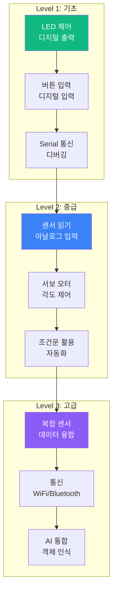

---

## 📘 단계별 학습 가이드

### Level 1: Arduino 기초 (8-12시간)

#### 차시 1-2: 디지털 출력 - LED 제어 (2시간)

**학습 목표:**
- 디지털 출력(HIGH/LOW) 개념 이해
- `pinMode()`, `digitalWrite()` 함수 사용
- 간단한 회로 구성 능력

**준비물:**
- Arduino Uno
- LED (빨강, 녹색 각 1개)
- 저항 220Ω (2개)
- 브레드보드, 점퍼선

**회로 구성:**

```
Arduino          LED
  GND ----[저항 220Ω]---- LED(-) 
  Pin 13 ---------------- LED(+)
```

**예제 코드: Blink (깜빡이기)**

```cpp
/*
 * LED 깜빡이기 - 가장 기본적인 Arduino 프로그램
 * 내장 LED(Pin 13)를 1초 간격으로 깜빡입니다
 */

// 전역 변수 정의
const int LED_PIN = 13;  // LED가 연결된 핀 번호

// 초기 설정 (1회만 실행)
void setup() {
  pinMode(LED_PIN, OUTPUT);  // LED 핀을 출력 모드로 설정
  
  Serial.begin(9600);        // Serial 통신 시작 (디버깅용)
  Serial.println("LED 깜빡이기 프로그램 시작!");
}

// 반복 실행
void loop() {
  digitalWrite(LED_PIN, HIGH);   // LED 켜기 (5V 출력)
  Serial.println("💡 LED ON");
  delay(1000);                   // 1초 대기 (1000밀리초)
  
  digitalWrite(LED_PIN, LOW);    // LED 끄기 (0V 출력)
  Serial.println("🌙 LED OFF");
  delay(1000);                   // 1초 대기
}
```

**활동 1: 깜빡임 속도 변경**
```cpp
// 도전 과제: delay 값을 바꿔서 다양한 속도로 깜빡이게 만들어보세요
// 예: 빠른 깜빡임 (200ms), 느린 깜빡임 (2000ms)
```

**활동 2: 교통 신호등 만들기**

```cpp
/*
 * 교통 신호등 시뮬레이션
 * 빨강(5초) → 노랑(2초) → 초록(5초) 반복
 */

const int RED_LED = 10;
const int YELLOW_LED = 9;
const int GREEN_LED = 8;

void setup() {
  pinMode(RED_LED, OUTPUT);
  pinMode(YELLOW_LED, OUTPUT);
  pinMode(GREEN_LED, OUTPUT);
  
  Serial.begin(9600);
  Serial.println("🚦 교통 신호등 시작");
}

void loop() {
  // 빨간불 (정지)
  digitalWrite(RED_LED, HIGH);
  digitalWrite(YELLOW_LED, LOW);
  digitalWrite(GREEN_LED, LOW);
  Serial.println("🔴 정지!");
  delay(5000);
  
  // 노란불 (대기)
  digitalWrite(RED_LED, LOW);
  digitalWrite(YELLOW_LED, HIGH);
  digitalWrite(GREEN_LED, LOW);
  Serial.println("🟡 대기...");
  delay(2000);
  
  // 초록불 (출발)
  digitalWrite(RED_LED, LOW);
  digitalWrite(YELLOW_LED, LOW);
  digitalWrite(GREEN_LED, HIGH);
  Serial.println("🟢 출발!");
  delay(5000);
}
```

**학습 점검:**
- [ ] LED가 켜지고 꺼지는 원리 이해
- [ ] `pinMode`, `digitalWrite` 함수 설명 가능
- [ ] 회로를 직접 구성할 수 있음
- [ ] 코드를 수정하여 다른 핀에 적용 가능

---

#### 차시 3-4: 디지털 입력 - 버튼 제어 (2시간)

**학습 목표:**
- 디지털 입력 개념 이해
- `digitalRead()` 함수 사용
- Pull-up/Pull-down 저항 이해
- 조건문 활용

**준비물:**
- Arduino Uno
- LED 1개, 저항 220Ω
- 택트 스위치 1개
- 저항 10kΩ (Pull-down용)

**회로 구성:**

```
Arduino                  버튼
  5V -----------+-------- 버튼 한쪽
                |
               [10kΩ]   (Pull-down 저항)
                |
  GND ----------+-------- 버튼 반대쪽
                |
  Pin 2 --------+        (입력)

  Pin 13 ---[220Ω]--- LED
```

**예제 코드: 버튼으로 LED 제어**

```cpp
/*
 * 버튼으로 LED 제어
 * 버튼을 누르면 LED가 켜지고, 떼면 꺼집니다
 */

const int BUTTON_PIN = 2;  // 버튼이 연결된 핀
const int LED_PIN = 13;    // LED가 연결된 핀

void setup() {
  pinMode(BUTTON_PIN, INPUT);  // 버튼 핀을 입력 모드로 설정
  pinMode(LED_PIN, OUTPUT);    // LED 핀을 출력 모드로 설정
  
  Serial.begin(9600);
  Serial.println("버튼으로 LED 제어 프로그램");
}

void loop() {
  // 버튼 상태 읽기 (HIGH: 눌림, LOW: 안 눌림)
  int buttonState = digitalRead(BUTTON_PIN);
  
  // Early return 패턴: 버튼이 안 눌렸으면 LED 끄기
  if (buttonState == LOW) {
    digitalWrite(LED_PIN, LOW);
    return;  // loop 함수 종료 (다음 반복으로)
  }
  
  // 버튼이 눌렸을 때
  digitalWrite(LED_PIN, HIGH);
  Serial.println("🔘 버튼 눌림 → 💡 LED ON");
}
```

**개선: 내장 Pull-up 저항 사용**

외부 저항 없이 Arduino 내장 Pull-up 저항을 사용할 수 있습니다.

```cpp
/*
 * 내장 Pull-up 저항 사용
 * 외부 10kΩ 저항 불필요
 */

const int BUTTON_PIN = 2;
const int LED_PIN = 13;

void setup() {
  pinMode(BUTTON_PIN, INPUT_PULLUP);  // 내장 Pull-up 저항 활성화
  pinMode(LED_PIN, OUTPUT);
  
  Serial.begin(9600);
}

void loop() {
  // Pull-up 사용 시 로직 반전 (눌림: LOW, 안 눌림: HIGH)
  int buttonState = digitalRead(BUTTON_PIN);
  
  if (buttonState == LOW) {  // 버튼 눌렸을 때
    digitalWrite(LED_PIN, HIGH);
    Serial.println("💡 LED ON");
  } else {
    digitalWrite(LED_PIN, LOW);
  }
}
```

**활동: 토글 스위치 만들기**

버튼을 누를 때마다 LED 상태가 반전되도록 (ON ↔ OFF)

```cpp
/*
 * 토글 스위치
 * 버튼을 누를 때마다 LED 상태 반전
 */

const int BUTTON_PIN = 2;
const int LED_PIN = 13;

bool ledState = false;          // LED 현재 상태
bool lastButtonState = HIGH;    // 이전 버튼 상태
unsigned long lastDebounceTime = 0;  // 마지막 디바운스 시간
const unsigned long debounceDelay = 50;  // 디바운스 딜레이 (50ms)

void setup() {
  pinMode(BUTTON_PIN, INPUT_PULLUP);
  pinMode(LED_PIN, OUTPUT);
  
  Serial.begin(9600);
  Serial.println("토글 스위치 프로그램");
}

void loop() {
  // 현재 버튼 상태 읽기
  bool currentButtonState = digitalRead(BUTTON_PIN);
  
  // 버튼 상태가 변했는지 확인
  if (currentButtonState != lastButtonState) {
    lastDebounceTime = millis();  // 디바운스 타이머 리셋
  }
  
  // 디바운스 딜레이 경과 후
  if ((millis() - lastDebounceTime) > debounceDelay) {
    // 버튼이 눌렸을 때 (HIGH → LOW)
    if (currentButtonState == LOW && lastButtonState == HIGH) {
      ledState = !ledState;  // 상태 반전
      digitalWrite(LED_PIN, ledState);
      
      Serial.print("🔘 버튼 눌림 → LED: ");
      Serial.println(ledState ? "ON" : "OFF");
    }
  }
  
  lastButtonState = currentButtonState;
}
```

**학습 개념: 디바운스(Debounce)**

버튼을 누를 때 기계적 접점이 튕기면서 짧은 시간 동안 ON/OFF가 여러 번 발생합니다. 이를 방지하기 위해 일정 시간(50ms) 동안 상태 변화를 무시합니다.


---

#### 차시 5-6: Serial 통신과 디버깅 (2시간)

**학습 목표:**
- Serial 통신 개념 이해
- 센서 값을 Serial Monitor로 확인
- 디버깅 기술 습득
- 간단한 명령어 시스템 구현

**예제 1: Serial Monitor 기초**

```cpp
/*
 * Serial 통신 기초
 * 다양한 데이터 타입 출력 연습
 */

void setup() {
  Serial.begin(9600);  // 통신 속도 설정 (baud rate)
  
  // 프로그램 시작 메시지
  Serial.println("=============================");
  Serial.println("    Serial 통신 실습");
  Serial.println("=============================");
  Serial.println();
  
  // 다양한 출력 방법
  Serial.print("정수: ");
  Serial.println(42);
  
  Serial.print("실수: ");
  Serial.println(3.14159, 2);  // 소수점 2자리
  
  Serial.print("문자열: ");
  Serial.println("Hello, Arduino!");
  
  Serial.print("16진수: 0x");
  Serial.println(255, HEX);
  
  Serial.print("2진수: 0b");
  Serial.println(15, BIN);
}

void loop() {
  // 1초마다 시간 출력
  Serial.print("⏱️ 경과 시간: ");
  Serial.print(millis() / 1000);
  Serial.println("초");
  
  delay(1000);
}
```

**예제 2: Serial 입력 받기**

```cpp
/*
 * Serial 입력으로 LED 제어
 * '1' 입력 → LED ON
 * '0' 입력 → LED OFF
 */

const int LED_PIN = 13;

void setup() {
  pinMode(LED_PIN, OUTPUT);
  
  Serial.begin(9600);
  Serial.println("=============================");
  Serial.println("  Serial LED 제어");
  Serial.println("=============================");
  Serial.println("'1': LED ON");
  Serial.println("'0': LED OFF");
  Serial.println("=============================");
}

void loop() {
  // Serial 데이터가 들어왔는지 확인
  if (Serial.available() > 0) {
    char command = Serial.read();  // 1바이트 읽기
    
    // Early return: 유효하지 않은 입력
    if (command != '0' && command != '1') {
      Serial.println("⚠️ 오류: 0 또는 1만 입력하세요");
      return;
    }
    
    // 명령어 처리
    if (command == '1') {
      digitalWrite(LED_PIN, HIGH);
      Serial.println("💡 LED ON");
    } else if (command == '0') {
      digitalWrite(LED_PIN, LOW);
      Serial.println("🌙 LED OFF");
    }
  }
}
```

**활동: RGB LED 제어 시스템**

Serial로 색상 명령을 입력받아 RGB LED 색 변경

```cpp
/*
 * RGB LED Serial 제어
 * 명령어: R(빨강), G(초록), B(파랑), W(흰색), X(끄기)
 */

const int RED_PIN = 9;
const int GREEN_PIN = 10;
const int BLUE_PIN = 11;

void setup() {
  pinMode(RED_PIN, OUTPUT);
  pinMode(GREEN_PIN, OUTPUT);
  pinMode(BLUE_PIN, OUTPUT);
  
  Serial.begin(9600);
  Serial.println("🎨 RGB LED 제어 시스템");
  Serial.println("명령어:");
  Serial.println("  R - 빨강");
  Serial.println("  G - 초록");
  Serial.println("  B - 파랑");
  Serial.println("  W - 흰색");
  Serial.println("  X - 끄기");
}

void loop() {
  if (Serial.available() > 0) {
    char command = Serial.read();
    
    // 소문자를 대문자로 변환
    command = toupper(command);
    
    // 명령어 처리 (클린 코드 패턴)
    switch (command) {
      case 'R':
        setColor(255, 0, 0);
        Serial.println("🔴 빨강");
        break;
        
      case 'G':
        setColor(0, 255, 0);
        Serial.println("🟢 초록");
        break;
        
      case 'B':
        setColor(0, 0, 255);
        Serial.println("🔵 파랑");
        break;
        
      case 'W':
        setColor(255, 255, 255);
        Serial.println("⚪ 흰색");
        break;
        
      case 'X':
        setColor(0, 0, 0);
        Serial.println("⚫ 끄기");
        break;
        
      default:
        Serial.println("⚠️ 알 수 없는 명령어");
        break;
    }
  }
}

// RGB 색상 설정 함수 (모듈화)
void setColor(int red, int green, int blue) {
  analogWrite(RED_PIN, red);
  analogWrite(GREEN_PIN, green);
  analogWrite(BLUE_PIN, blue);
}
```

**디버깅 팁:**

```cpp
// 1. 변수 값 확인
int sensorValue = analogRead(A0);
Serial.print("센서 값: ");
Serial.println(sensorValue);

// 2. 조건문 실행 확인
if (temperature > 30) {
  Serial.println("🔥 고온 경고!");
  // ...
}

// 3. 함수 호출 추적
void myFunction() {
  Serial.println("→ myFunction() 호출됨");
  // ...
}

// 4. 시간 측정
unsigned long startTime = millis();
// ... 코드 실행 ...
unsigned long elapsedTime = millis() - startTime;
Serial.print("실행 시간: ");
Serial.print(elapsedTime);
Serial.println("ms");
```

---

#### 차시 7-8: 아날로그 입력 - 센서 읽기 (2시간)

**학습 목표:**
- 아날로그와 디지털의 차이 이해
- `analogRead()` 함수 사용
- ADC (Analog-to-Digital Converter) 개념
- 센서 값의 범위 변환 (`map` 함수)

**이론: 아날로그 vs 디지털**

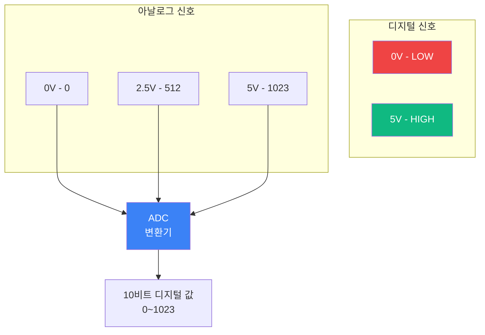

**Arduino ADC 특성:**
- **해상도**: 10비트 (0 ~ 1023)
- **전압 범위**: 0V ~ 5V
- **아날로그 핀**: A0 ~ A5 (Uno 기준)

**예제 1: 가변저항 (Potentiometer) 읽기**

```cpp
/*
 * 가변저항으로 LED 밝기 조절
 * analogRead() → analogWrite() (PWM)
 */

const int POT_PIN = A0;    // 가변저항 핀
const int LED_PIN = 9;     // PWM 핀

void setup() {
  pinMode(LED_PIN, OUTPUT);
  
  Serial.begin(9600);
  Serial.println("🎚️ 가변저항으로 LED 밝기 조절");
}

void loop() {
  // 가변저항 값 읽기 (0 ~ 1023)
  int potValue = analogRead(POT_PIN);
  
  // 0~1023을 0~255로 변환 (PWM 범위)
  int brightness = map(potValue, 0, 1023, 0, 255);
  
  // LED 밝기 설정
  analogWrite(LED_PIN, brightness);
  
  // Serial로 값 확인
  Serial.print("가변저항: ");
  Serial.print(potValue);
  Serial.print(" → 밝기: ");
  Serial.println(brightness);
  
  delay(100);  // 0.1초마다 업데이트
}
```

**예제 2: 조도 센서 (CdS)로 자동 조명**

```cpp
/*
 * 조도 센서로 자동 조명 제어
 * 어두우면 LED 자동으로 켜짐
 */

const int LIGHT_SENSOR_PIN = A0;
const int LED_PIN = 13;

const int THRESHOLD = 300;  // 임계값 (0~1023)

void setup() {
  pinMode(LED_PIN, OUTPUT);
  
  Serial.begin(9600);
  Serial.println("🌙 자동 조명 시스템");
  Serial.print("임계값: ");
  Serial.println(THRESHOLD);
}

void loop() {
  // 조도 센서 값 읽기
  int lightLevel = analogRead(LIGHT_SENSOR_PIN);
  
  // 상태 표시
  Serial.print("조도: ");
  Serial.print(lightLevel);
  Serial.print(" → ");
  
  // Early return 패턴: 밝을 때
  if (lightLevel > THRESHOLD) {
    digitalWrite(LED_PIN, LOW);
    Serial.println("🌞 밝음 - LED OFF");
    delay(500);
    return;
  }
  
  // 어두울 때
  digitalWrite(LED_PIN, HIGH);
  Serial.println("🌙 어두움 - LED ON");
  
  delay(500);
}
```

**활동: 온도 센서 (LM35)로 온도 모니터**

```cpp
/*
 * LM35 온도 센서
 * 출력: 10mV/°C (0°C = 0V, 100°C = 1V)
 */

const int TEMP_SENSOR_PIN = A0;

void setup() {
  Serial.begin(9600);
  Serial.println("🌡️ 온도 모니터");
}

void loop() {
  // 센서 값 읽기 (0 ~ 1023)
  int sensorValue = analogRead(TEMP_SENSOR_PIN);
  
  // 전압으로 변환 (0 ~ 5V)
  float voltage = sensorValue * (5.0 / 1023.0);
  
  // 온도로 변환 (10mV = 1°C)
  float temperatureC = voltage * 100.0;
  
  // 화씨 변환
  float temperatureF = (temperatureC * 9.0 / 5.0) + 32.0;
  
  // 출력
  Serial.print("🌡️ 온도: ");
  Serial.print(temperatureC, 1);  // 소수점 1자리
  Serial.print("°C (");
  Serial.print(temperatureF, 1);
  Serial.println("°F)");
  
  // 경고 메시지
  if (temperatureC > 30) {
    Serial.println("🔥 고온 경고!");
  } else if (temperatureC < 10) {
    Serial.println("❄️ 저온 경고!");
  }
  
  delay(1000);  // 1초마다 측정
}
```

---

#### 차시 9-10: 서보 모터 제어 (2시간)

**학습 목표:**
- 서보 모터 원리 이해
- `Servo` 라이브러리 사용
- 각도 제어 기술
- 센서 + 서보 통합

**이론: 서보 모터란?**

```mermaid
graph LR
    A[PWM 신호] --> B[서보 모터<br/>제어 회로]
    B --> C[DC 모터]
    B --> D[기어 박스]
    D --> E[출력축]
    E --> F[피드백<br/>가변저항]
    F --> B
    
    G[각도 지령] -.-> B
    
    style B fill:#3b82f6,color:#fff
    style F fill:#f59e0b,color:#fff
```

**서보 모터 특징:**
- **각도 범위**: 0° ~ 180° (일반적)
- **제어 방식**: PWM (Pulse Width Modulation)
- **전원**: 4.8V ~ 6V (별도 전원 권장)
- **용도**: 정확한 각도 제어 (로봇 팔, 카메라 거치대 등)

**예제 1: 서보 모터 기초**

```cpp
/*
 * 서보 모터 기본 제어
 * 0° → 90° → 180° 반복
 */

#include <Servo.h>

Servo myServo;  // 서보 객체 생성

const int SERVO_PIN = 9;

void setup() {
  myServo.attach(SERVO_PIN);  // 서보를 핀에 연결
  
  Serial.begin(9600);
  Serial.println("🤖 서보 모터 제어");
}

void loop() {
  // 0도로 회전
  myServo.write(0);
  Serial.println("각도: 0°");
  delay(1000);
  
  // 90도로 회전
  myServo.write(90);
  Serial.println("각도: 90°");
  delay(1000);
  
  // 180도로 회전
  myServo.write(180);
  Serial.println("각도: 180°");
  delay(1000);
}
```

**예제 2: 부드러운 회전**

```cpp
/*
 * 서보 모터 부드러운 회전
 * 0° → 180° 천천히 이동
 */

#include <Servo.h>

Servo myServo;

const int SERVO_PIN = 9;

void setup() {
  myServo.attach(SERVO_PIN);
  Serial.begin(9600);
}

void loop() {
  // 0도에서 180도까지 천천히
  for (int angle = 0; angle <= 180; angle++) {
    myServo.write(angle);
    Serial.print("각도: ");
    Serial.print(angle);
    Serial.println("°");
    delay(15);  // 속도 조절
  }
  
  delay(500);
  
  // 180도에서 0도까지 천천히
  for (int angle = 180; angle >= 0; angle--) {
    myServo.write(angle);
    Serial.print("각도: ");
    Serial.print(angle);
    Serial.println("°");
    delay(15);
  }
  
  delay(500);
}
```

**활동: 가변저항으로 서보 제어**

```cpp
/*
 * 가변저항으로 서보 모터 제어
 * 가변저항 각도 → 서보 각도 실시간 매핑
 */

#include <Servo.h>

Servo myServo;

const int POT_PIN = A0;
const int SERVO_PIN = 9;

void setup() {
  myServo.attach(SERVO_PIN);
  
  Serial.begin(9600);
  Serial.println("🎚️ 가변저항으로 서보 제어");
}

void loop() {
  // 가변저항 값 읽기 (0 ~ 1023)
  int potValue = analogRead(POT_PIN);
  
  // 0~1023을 0~180으로 변환
  int angle = map(potValue, 0, 1023, 0, 180);
  
  // 서보 각도 설정
  myServo.write(angle);
  
  // Serial 출력
  Serial.print("가변저항: ");
  Serial.print(potValue);
  Serial.print(" → 각도: ");
  Serial.print(angle);
  Serial.println("°");
  
  delay(15);
}
```

**프로젝트: 초음파 센서 + 서보 레이더**

```cpp
/*
 * 초음파 레이더 시스템
 * 서보가 좌우로 움직이며 거리 측정
 */

#include <Servo.h>

Servo myServo;

const int SERVO_PIN = 9;
const int TRIG_PIN = 10;
const int ECHO_PIN = 11;

void setup() {
  myServo.attach(SERVO_PIN);
  
  pinMode(TRIG_PIN, OUTPUT);
  pinMode(ECHO_PIN, INPUT);
  
  Serial.begin(9600);
  Serial.println("📡 초음파 레이더");
}

void loop() {
  // 0도에서 180도까지 스캔
  for (int angle = 0; angle <= 180; angle += 10) {
    myServo.write(angle);
    delay(100);  // 서보 안정화
    
    int distance = getDistance();
    
    Serial.print(angle);
    Serial.print("°, ");
    Serial.print(distance);
    Serial.println("cm");
  }
  
  // 180도에서 0도까지 스캔
  for (int angle = 180; angle >= 0; angle -= 10) {
    myServo.write(angle);
    delay(100);
    
    int distance = getDistance();
    
    Serial.print(angle);
    Serial.print("°, ");
    Serial.print(distance);
    Serial.println("cm");
  }
}

// 초음파 센서로 거리 측정
int getDistance() {
  // 트리거 신호 발생
  digitalWrite(TRIG_PIN, LOW);
  delayMicroseconds(2);
  digitalWrite(TRIG_PIN, HIGH);
  delayMicroseconds(10);
  digitalWrite(TRIG_PIN, LOW);
  
  // 에코 신호 측정
  long duration = pulseIn(ECHO_PIN, HIGH, 30000);
  
  // Early return: 타임아웃
  if (duration == 0) {
    return 0;
  }
  
  // 거리 계산 (cm)
  int distance = duration * 0.034 / 2;
  
  return distance;
}
```

---

#### 차시 11-12: 종합 프로젝트 - 스마트 팜 기초 (2시간)

**프로젝트 목표:**
- 지금까지 배운 내용 종합 적용
- 실생활 문제 해결
- 시스템 설계 능력 향상

**시스템 구성:**

```mermaid
graph TB
    subgraph "센서"
        S1[토양 습도 센서]
        S2[조도 센서]
    end
    
    subgraph "Arduino"
        A[Arduino Uno]
    end
    
    subgraph "액추에이터"
        L[LED 조명]
        P[물펌프 (릴레이)]
    end
    
    S1 --> A
    S2 --> A
    A --> L
    A --> P
    
    style A fill:#3b82f6,color:#fff
    style S1 fill:#10b981,color:#fff
    style L fill:#f59e0b,color:#fff
```

**회로 구성:**

```
Arduino          센서/액추에이터
  A0 ----------- 토양 습도 센서 (아날로그)
  A1 ----------- 조도 센서 (아날로그)
  Pin 8 -------- LED (PWM)
  Pin 9 -------- 릴레이 (물펌프)
  GND ---------- 공통 GND
  5V ----------- 공통 VCC
```

**완성 코드:**

```cpp
/*
 * 스마트 팜 시스템
 * - 토양이 건조하면 자동 급수
 * - 어두우면 LED 조명 자동 켜기
 */

// 핀 정의
const int SOIL_SENSOR_PIN = A0;
const int LIGHT_SENSOR_PIN = A1;
const int LED_PIN = 8;
const int PUMP_PIN = 9;

// 임계값 설정
const int SOIL_DRY_THRESHOLD = 300;   // 토양 건조 기준
const int LIGHT_DARK_THRESHOLD = 400; // 어두움 기준

// 상태 변수
bool pumpOn = false;
bool lightOn = false;

void setup() {
  // 핀 모드 설정
  pinMode(LED_PIN, OUTPUT);
  pinMode(PUMP_PIN, OUTPUT);
  
  // 초기 상태: 모두 끄기
  digitalWrite(LED_PIN, LOW);
  digitalWrite(PUMP_PIN, LOW);
  
  Serial.begin(9600);
  Serial.println("=============================");
  Serial.println("    🌱 스마트 팜 시스템");
  Serial.println("=============================");
  Serial.println();
}

void loop() {
  // 센서 값 읽기
  int soilMoisture = analogRead(SOIL_SENSOR_PIN);
  int lightLevel = analogRead(LIGHT_SENSOR_PIN);
  
  // 상태 출력
  printStatus(soilMoisture, lightLevel);
  
  // 토양 습도 제어
  controlWaterPump(soilMoisture);
  
  // 조명 제어
  controlLight(lightLevel);
  
  delay(2000);  // 2초마다 체크
}

// 물펌프 자동 제어
void controlWaterPump(int soilMoisture) {
  // Early return: 토양이 충분히 습함
  if (soilMoisture > SOIL_DRY_THRESHOLD) {
    if (pumpOn) {  // 펌프가 켜져 있었으면
      digitalWrite(PUMP_PIN, LOW);
      pumpOn = false;
      Serial.println("💧 물펌프 OFF - 토양 습함");
    }
    return;
  }
  
  // 토양이 건조함 → 물펌프 켜기
  if (!pumpOn) {  // 펌프가 꺼져 있었으면
    digitalWrite(PUMP_PIN, HIGH);
    pumpOn = true;
    Serial.println("💦 물펌프 ON - 토양 건조!");
  }
}

// 조명 자동 제어
void controlLight(int lightLevel) {
  // Early return: 충분히 밝음
  if (lightLevel > LIGHT_DARK_THRESHOLD) {
    if (lightOn) {  // 조명이 켜져 있었으면
      digitalWrite(LED_PIN, LOW);
      lightOn = false;
      Serial.println("💡 조명 OFF - 밝음");
    }
    return;
  }
  
  // 어두움 → 조명 켜기
  if (!lightOn) {  // 조명이 꺼져 있었으면
    digitalWrite(LED_PIN, HIGH);
    lightOn = true;
    Serial.println("🌙 조명 ON - 어두움!");
  }
}

// 상태 출력
void printStatus(int soil, int light) {
  Serial.println("------ 상태 체크 ------");
  
  Serial.print("토양 습도: ");
  Serial.print(soil);
  Serial.print(soil < SOIL_DRY_THRESHOLD ? " (건조)" : " (습함)");
  Serial.println();
  
  Serial.print("조도: ");
  Serial.print(light);
  Serial.print(light < LIGHT_DARK_THRESHOLD ? " (어두움)" : " (밝음)");
  Serial.println();
  
  Serial.print("물펌프: ");
  Serial.println(pumpOn ? "ON 💦" : "OFF");
  
  Serial.print("조명: ");
  Serial.println(lightOn ? "ON 💡" : "OFF");
  
  Serial.println();
}
```

**학습 점검 및 개선:**

1. **센서 캘리브레이션**
   - 실제 토양에 센서를 넣어 건조/습함 상태의 값 확인
   - 임계값을 실험을 통해 최적화

2. **기능 추가 아이디어**
   - 온도 센서 추가 → 고온 시 팬 가동
   - LCD 디스플레이 추가 → 실시간 값 표시
   - SD 카드 모듈 → 데이터 로깅
   - 시간 기반 제어 (RTC 모듈) → 특정 시간에만 물 주기

3. **에너지 절약**
   - 센서를 2초가 아닌 10분마다 체크
   - Sleep 모드 활용하여 전력 소비 최소화

**발표 가이드:**

학생들이 프로젝트를 발표할 때 다음 항목을 포함하도록 지도:
- **문제 정의**: 왜 이 프로젝트를 만들었나요?
- **설계 과정**: 어떤 센서와 액추에이터를 선택했나요?
- **어려웠던 점**: 어떤 문제가 있었고, 어떻게 해결했나요?
- **시연**: 실제로 작동하는 모습 보여주기
- **개선 방향**: 앞으로 추가하고 싶은 기능

---

### Level 2: ESP32 + IoT (12-16시간)

Level 2에서는 WiFi/Bluetooth가 내장된 ESP32를 활용하여 IoT (사물인터넷) 기초를 배웁니다.

#### 차시 1-2: ESP32 기초 + WiFi 연결 (2시간)

**학습 목표:**
- ESP32 개발 환경 설정
- WiFi 연결 및 IP 주소 확인
- Web Server 기초

**ESP32 특징:**

```mermaid
mindmap
  root((ESP32))
    성능
      듀얼 코어 CPU
      240MHz
      520KB RAM
    통신
      WiFi 802.11 b/g/n
      Bluetooth 4.2 + BLE
      이더넷 지원
    저전력
      Deep Sleep 모드
      배터리 구동 가능
    가격
      5-10달러
      Arduino보다 저렴
```

**Arduino IDE 설정:**

1. **보드 매니저 URL 추가**
   ```
   파일 → 환경설정 → 추가적인 보드 매니저 URLs
   
   https://raw.githubusercontent.com/espressif/arduino-esp32/gh-pages/package_esp32_index.json
   ```

2. **ESP32 보드 설치**
   ```
   도구 → 보드 → 보드 매니저 → "ESP32" 검색 → 설치
   ```

3. **보드 선택**
   ```
   도구 → 보드 → ESP32 Arduino → ESP32 Dev Module
   ```

**예제 1: WiFi 연결**

```cpp
/*
 * ESP32 WiFi 연결 테스트
 * 가정의 WiFi에 연결하여 IP 주소 받기
 */

#include <WiFi.h>

// WiFi 정보 입력
const char* ssid = "WiFi_이름";
const char* password = "비밀번호";

void setup() {
  Serial.begin(115200);
  delay(1000);
  
  Serial.println();
  Serial.println("=============================");
  Serial.println("  ESP32 WiFi 연결");
  Serial.println("=============================");
  
  // WiFi 연결 시작
  Serial.print("연결 중: ");
  Serial.println(ssid);
  
  WiFi.begin(ssid, password);
  
  // 연결 대기 (최대 20초)
  int attempts = 0;
  while (WiFi.status() != WL_CONNECTED && attempts < 40) {
    delay(500);
    Serial.print(".");
    attempts++;
  }
  
  // Early return: 연결 실패
  if (WiFi.status() != WL_CONNECTED) {
    Serial.println();
    Serial.println("❌ WiFi 연결 실패!");
    Serial.println("SSID와 비밀번호를 확인하세요.");
    return;
  }
  
  // 연결 성공
  Serial.println();
  Serial.println("✅ WiFi 연결 성공!");
  Serial.print("IP 주소: ");
  Serial.println(WiFi.localIP());
  Serial.print("신호 강도 (RSSI): ");
  Serial.print(WiFi.RSSI());
  Serial.println(" dBm");
}

void loop() {
  // WiFi 연결 상태 모니터링
  if (WiFi.status() != WL_CONNECTED) {
    Serial.println("⚠️ WiFi 연결 끊김!");
    delay(5000);
  }
  
  delay(10000);  // 10초마다 체크
}
```

**예제 2: Web Server 기초**

```cpp
/*
 * ESP32 간단한 웹 서버
 * 브라우저에서 접속하면 "Hello, ESP32!" 출력
 */

#include <WiFi.h>
#include <WebServer.h>

const char* ssid = "WiFi_이름";
const char* password = "비밀번호";

WebServer server(80);  // 포트 80 (HTTP)

void setup() {
  Serial.begin(115200);
  
  // WiFi 연결
  WiFi.begin(ssid, password);
  Serial.print("WiFi 연결 중");
  
  while (WiFi.status() != WL_CONNECTED) {
    delay(500);
    Serial.print(".");
  }
  
  Serial.println();
  Serial.println("✅ WiFi 연결 성공!");
  Serial.print("웹 주소: http://");
  Serial.println(WiFi.localIP());
  
  // 웹 서버 라우팅 설정
  server.on("/", handleRoot);  // 메인 페이지
  server.on("/led/on", handleLEDOn);  // LED ON
  server.on("/led/off", handleLEDOff);  // LED OFF
  
  // 서버 시작
  server.begin();
  Serial.println("🌐 웹 서버 시작!");
  
  // 내장 LED 설정
  pinMode(2, OUTPUT);
}

void loop() {
  server.handleClient();  // 클라이언트 요청 처리
}

// 메인 페이지 HTML
void handleRoot() {
  String html = R"(
<!DOCTYPE html>
<html lang='ko'>
<head>
  <meta charset='UTF-8'>
  <meta name='viewport' content='width=device-width, initial-scale=1.0'>
  <title>ESP32 웹 서버</title>
  <style>
    body {
      font-family: Arial, sans-serif;
      text-align: center;
      padding: 50px;
      background: linear-gradient(135deg, #667eea 0%, #764ba2 100%);
      color: white;
    }
    h1 { font-size: 3em; margin-bottom: 30px; }
    button {
      font-size: 1.5em;
      padding: 20px 40px;
      margin: 10px;
      border: none;
      border-radius: 10px;
      cursor: pointer;
      transition: 0.3s;
    }
    .on { background: #4CAF50; color: white; }
    .off { background: #f44336; color: white; }
    button:hover { transform: scale(1.1); }
  </style>
</head>
<body>
  <h1>🚀 ESP32 웹 서버</h1>
  <p>LED 제어하기</p>
  
  <button class='on' onclick="location.href='/led/on'">💡 켜기</button>
  <button class='off' onclick="location.href='/led/off'">🌙 끄기</button>
</body>
</html>
  )";
  
  server.send(200, "text/html", html);
  Serial.println("📄 메인 페이지 접속");
}

// LED 켜기
void handleLEDOn() {
  digitalWrite(2, HIGH);
  server.send(200, "text/plain", "LED ON");
  Serial.println("💡 LED ON");
}

// LED 끄기
void handleLEDOff() {
  digitalWrite(2, LOW);
  server.send(200, "text/plain", "LED OFF");
  Serial.println("🌙 LED OFF");
}
```

**활동: 스마트폰으로 LED 제어**

1. ESP32를 USB 전원에 연결
2. Serial Monitor에서 IP 주소 확인 (예: `192.168.0.100`)
3. 스마트폰을 동일한 WiFi에 연결
4. 브라우저에서 `http://192.168.0.100` 접속
5. 버튼 클릭하여 LED 제어

**학습 점검:**
- [ ] ESP32가 WiFi에 연결됨
- [ ] IP 주소 확인 가능
- [ ] 웹 브라우저에서 접속 성공
- [ ] LED가 웹으로 제어됨

---

**(계속 작성 중... 문서가 너무 길어 여기서 일단 저장합니다)**

---

## 📝 문서 정보

**작성자**: AI Maker Lab 교육팀  
**최종 업데이트**: 2025-01-05  
**문서 버전**: 1.0  
**대상**: 교사, 학부모, 학생

---

**다음 섹션 미리보기:**
- Level 3: Raspberry Pi + AI 비전
- 프로젝트 기반 학습 (5대 핵심 프로젝트 상세 가이드)
- 평가 및 피드백 시스템
- 문제 해결 가이드 (트러블슈팅)
- 진로 연계 및 참고 자료

*이 문서는 계속 업데이트됩니다.*

