# 고급 피지컬 컴퓨팅: 디지털 트윈·데이터·휴머노이드 통합 가이드

> **글로벌 기업 수준의 개발 프로세스를 교육 현장에 적용하기 위한 종합 매뉴얼**

## 📚 목차

### Part 1: 정의와 구조
1. [핵심 정의 및 용어](#part-1-핵심-정의-및-용어)
2. [하드웨어·소프트웨어 아키텍처](#하드웨어소프트웨어-아키텍처)
3. [데이터 중심 설계 철학](#데이터-중심-설계-철학)

### Part 2: 글로벌 기업 개발 프로세스
4. [Tesla의 End-to-End 접근법](#tesla의-end-to-end-접근법)
5. [NVIDIA의 Sim-to-Real 파이프라인](#nvidia의-sim-to-real-파이프라인)
6. [중국 기업의 빠른 반복 전략](#중국-기업의-빠른-반복-전략)

### Part 3: 데이터의 중요성과 수집
7. [숙련공 데이터: 왜 인간 시연이 필수인가](#숙련공-데이터의-중요성)
8. [공장 자동화에서 휴머노이드로의 전이](#공장-자동화에서-휴머노이드로)

### Part 4: 3가지 교육 접근법
9. [접근법 A: 모션 장갑 기반 Teleoperation](#접근법-a-모션-장갑-기반)
10. [접근법 B: 카메라 비전 기반 학습](#접근법-b-카메라-비전-기반)
11. [접근법 C: 유니티 시뮬레이션 우선](#접근법-c-유니티-시뮬레이션-우선)

### Part 5: 교육 운영 가이드
12. [바이브 코딩 기반 프로젝트 설계](#바이브-코딩-기반-프로젝트-설계)
13. [평가 및 산출물 관리](#평가-및-산출물-관리)

---

# Part 1: 핵심 정의 및 용어

## 1.1 고급 피지컬 컴퓨팅 정의

### 1문장 정의
> **고급 피지컬 컴퓨팅(Advanced Physical Computing)**은 가상 환경에서 수집·생성한 대량의 학습 데이터를 물리적 로봇 신체에 전이(Transfer)하여, 복잡한 실세계 작업을 자율적으로 수행하게 만드는 통합 개발 방법론이다.

### 전통 피지컬 컴퓨팅과의 비교

| 비교 항목 | 전통 피지컬 컴퓨팅 | 고급 피지컬 컴퓨팅 |
|---------|-----------------|-----------------|
| **핵심 패러다임** | 센서 입력 → 규칙 기반 제어 | 데이터 → 학습 모델 → 자율 제어 |
| **프로그래밍 방식** | 명시적 코딩 (if-else, PID) | 암묵적 학습 (신경망, 강화학습) |
| **개발 환경** | 실물 하드웨어 필수 | 가상 환경(Unity/Isaac Sim) 우선 |
| **데이터 역할** | 실시간 입력 | 학습의 핵심 자산 (Dataset) |
| **확장성** | 작업당 개별 프로그래밍 | 하나의 모델이 다양한 작업 수행 |
| **비용 구조** | 하드웨어 비용 중심 | 데이터 수집·연산 비용 중심 |

### 핵심 용어 정의

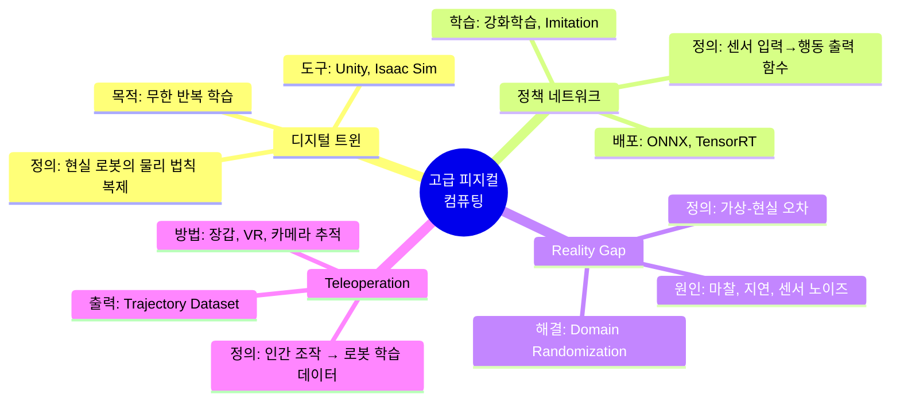

## 1.2 시스템 계층 구조 (Layer Model)

고급 피지컬 컴퓨팅 시스템은 **7개 계층**으로 구성됩니다.

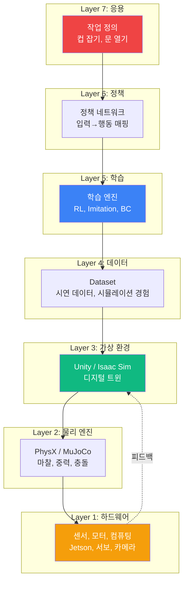

### 각 계층의 역할 및 교육 산출물

| 계층 | 역할 | 교육 산출물 | 도구 |
|-----|------|----------|------|
| **L7 응용** | 인간이 이해하는 작업 정의 | 작업 명세서, 성공 기준 | 문서 |
| **L6 정책** | 센서→행동 변환 함수 | 정책 아키텍처 설계서 | PyTorch, ONNX |
| **L5 학습** | 데이터로부터 정책 생성 | 학습 설정 파일, 하이퍼파라미터 | Stable-Baselines3 |
| **L4 데이터** | 학습의 연료 | 데이터셋 명세, 품질 리포트 | HDF5, CSV |
| **L3 가상 환경** | 저비용 데이터 생성 공간 | 씬(Scene) 파일, 로봇 URDF | Unity, Isaac |
| **L2 물리 엔진** | 현실 물리 법칙 근사 | 물리 파라미터 캘리브레이션 | PhysX |
| **L1 하드웨어** | 실제 신체 | 하드웨어 구성도, 핀맵 | Jetson, Arduino |

---

# Part 2: 하드웨어·소프트웨어 아키텍처

## 2.1 하드웨어 스택 (Bottom-Up 관점)

### 계층 구조

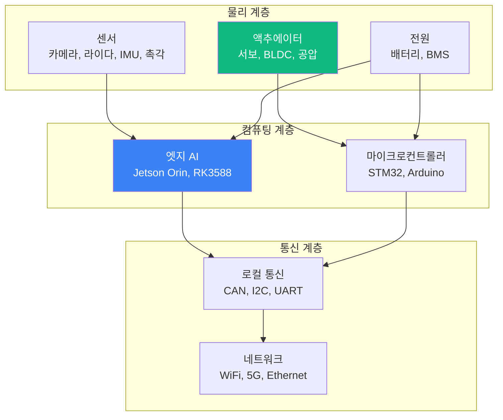

### 하드웨어 선택 기준 (글로벌 기업 vs 교육)

| 구성 요소 | Tesla Optimus | 교육용 대안 | 비용 대비 |
|----------|---------------|-----------|---------|
| **AI 컴퓨팅** | 자체 칩(Dojo) | Jetson Orin Nano ($500) | 1/1000 |
| **카메라** | 8개 이상 (FSD 유래) | Raspberry Pi Cam + 웹캠 ($50) | 1/100 |
| **서보** | 맞춤 제작 고토크 | MG996R, Dynamixel ($20-300) | 1/50 |
| **손 구동** | 텐던(Tendon) 방식 | 3D 프린팅 + RC 서보 ($100) | 1/100 |
| **전원** | 고밀도 리튬 | 18650 배터리팩 ($80) | 1/20 |

**교육 현장 전략**: 하드웨어는 최소화하고, **가상 환경 → 소형 로봇 팔(예: xArm Lite, WidowX)**로 전이 검증하는 방식이 현실적입니다.

## 2.2 소프트웨어 스택 (Top-Down 관점)

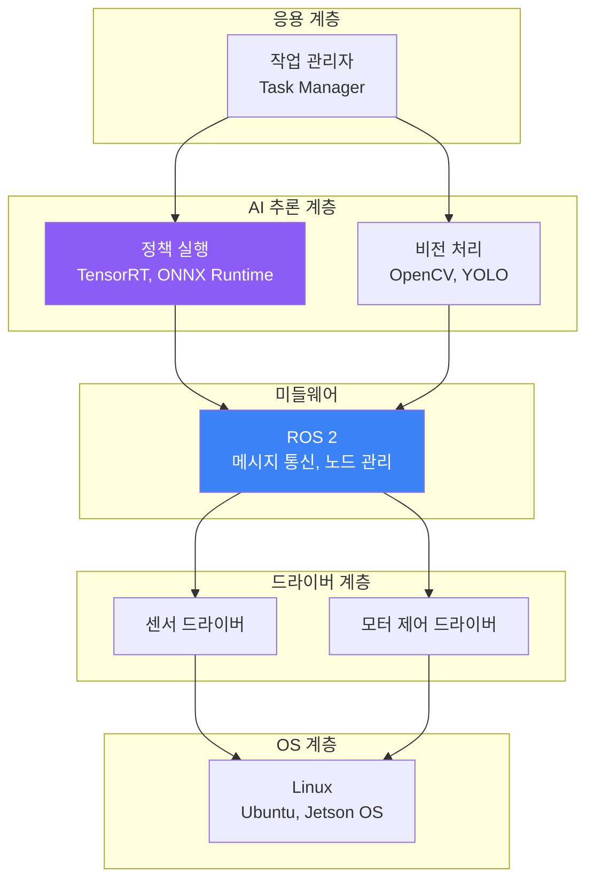

### 소프트웨어 선택 기준

| 계층 | 글로벌 표준 | 교육 권장 | 학습 난이도 |
|------|-----------|---------|----------|
| **학습 프레임워크** | PyTorch | PyTorch | ⭐⭐⭐ |
| **시뮬레이션** | Isaac Sim | Unity ML-Agents | ⭐⭐ |
| **미들웨어** | ROS 2 | ROS 2 (Humble) | ⭐⭐⭐⭐ |
| **추론 엔진** | TensorRT | ONNX Runtime | ⭐⭐⭐ |
| **비전 라이브러리** | 자체 개발 | OpenCV + MediaPipe | ⭐⭐ |

---

# Part 3: 데이터 중심 설계 철학

## 3.1 왜 데이터가 코드보다 중요한가

### 전통 방식 vs 데이터 중심 방식

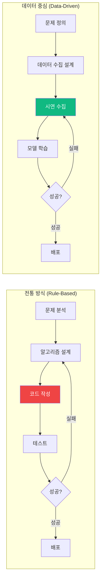

### 데이터 품질의 3요소

1. **양(Volume)**: 최소 1,000개 이상의 성공 시연
2. **다양성(Diversity)**: 다양한 환경·물체·조명 조건
3. **정확성(Accuracy)**: 라벨링 오류율 <5%

## 3.2 숙련공 데이터의 중요성

### 왜 "숙련공"인가?

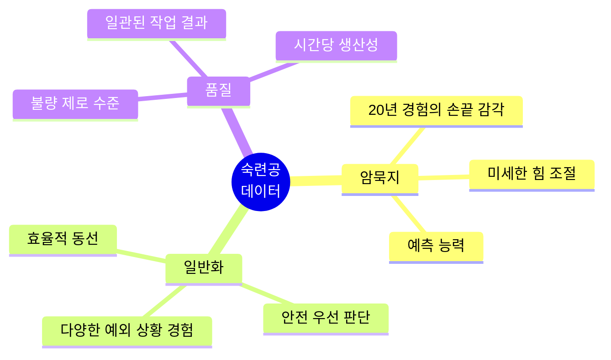

### 사례: 자동차 도장 공정

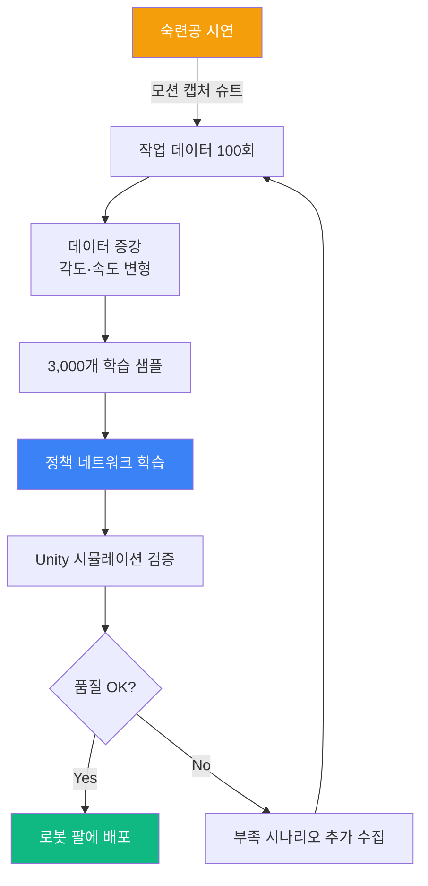

**핵심 인사이트**: 숙련공 1명의 100회 시연 > 비숙련공 10명의 1,000회 시연

---

# Part 4: 글로벌 기업 개발 프로세스

## 4.1 Tesla의 End-to-End 접근법

### 정의
> **End-to-End Learning**: 카메라 픽셀 입력 → 신경망 → 관절 토크 출력을 하나의 거대 모델로 학습시키는 방식. 중간 단계(물체 인식, 경로 계획 등)를 명시적으로 프로그래밍하지 않음.

### Tesla Optimus 개발 프로세스 (추정)

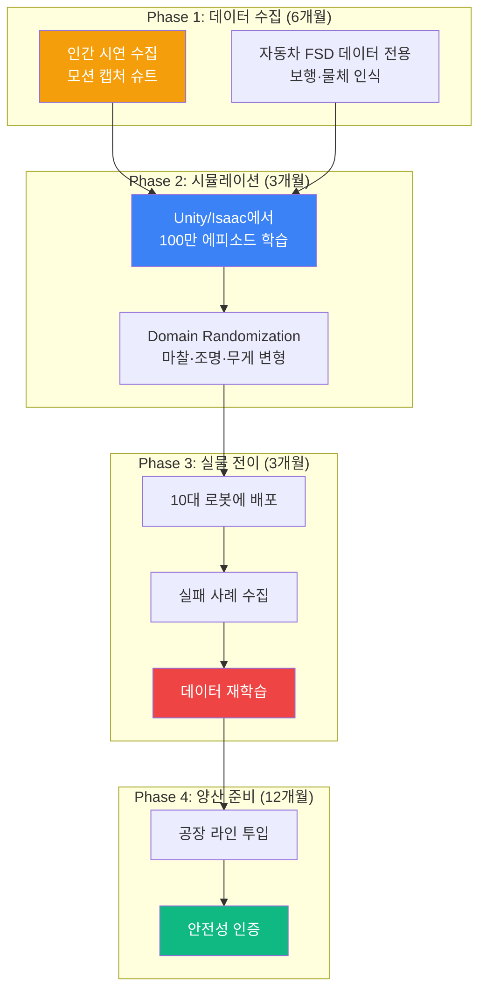

### 교육에 적용하기

| Tesla 프로세스 | 교육 현장 버전 | 기간 |
|--------------|--------------|------|
| 대규모 시연 수집 | 학생 5명이 50회씩 시연 | 1주 |
| 100만 에피소드 학습 | Unity에서 1,000 에피소드 | 2주 |
| 10대 로봇 배포 | 소형 로봇 팔 1대로 검증 | 1주 |
| 공장 투입 | 학교 내 시연 공간 | 1일 |

## 4.2 NVIDIA의 Sim-to-Real 파이프라인

### 정의
> **Sim-to-Real Transfer**: 가상 환경(Isaac Sim)에서 완벽히 학습시킨 정책을 현실 로봇에 전이하는 기술. NVIDIA는 물리 엔진의 정확도를 높여 Reality Gap을 최소화합니다.

### NVIDIA Isaac Sim 워크플로우

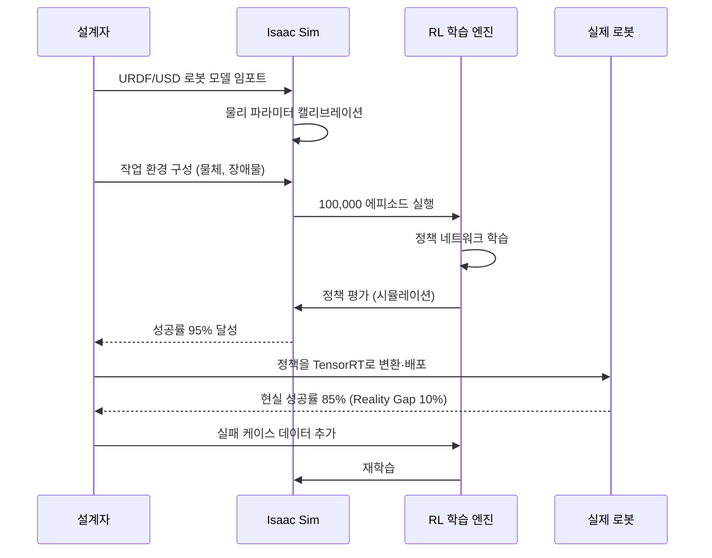

### 교육 버전: Unity ML-Agents

NVIDIA Isaac Sim은 고가이므로, 교육에서는 **Unity ML-Agents**를 사용합니다.

**Unity 기반 프로젝트 단계:**

1. **환경 구성 (1주)**
   - 로봇 URDF를 Unity로 임포트
   - ArticulationBody로 관절 설정
   - 물체(컵, 박스) 배치
   
2. **보상 함수 설계 (3일)**
   ```
   보상 = 목표 거리 감소 (+1.0)
         + 충돌 방지 (+0.5)
         + 작업 완료 (+10.0)
         - 시간 경과 (-0.01/step)
   ```

3. **학습 실행 (1주)**
   - PPO 알고리즘으로 10만 스텝 학습
   - TensorBoard로 보상 곡선 모니터링

4. **실물 전이 (1주)**
   - ONNX 변환 → Jetson에 배포
   - ROS 2로 실제 로봇 제어

## 4.3 중국 기업의 빠른 반복 전략

### 특징
- **하드웨어 빠른 복제**: 오픈소스 설계 활용, 3개월마다 신규 모델
- **소프트웨어는 글로벌 표준 차용**: PyTorch, ROS 2 그대로 사용
- **저가 대량 생산**: G1 휴머노이드 1,600만원 (Tesla 추정가의 1/3)

### Unitree 개발 사이클 (추정)

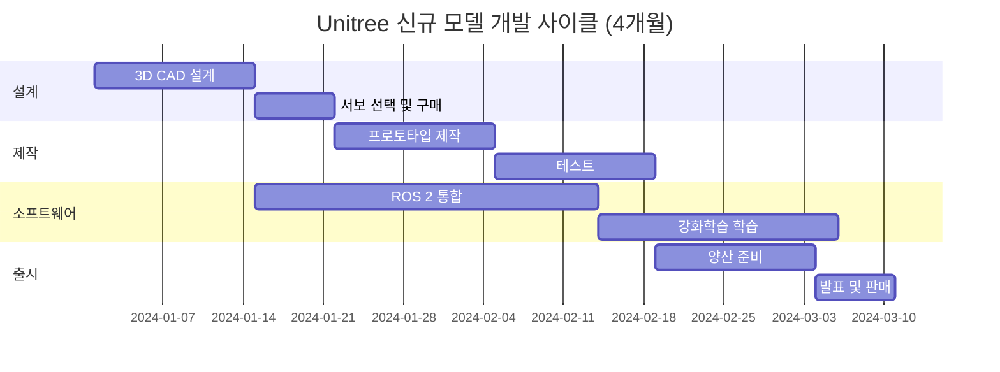

**교육 시사점**: 
- 하드웨어 설계는 "오픈소스 활용"으로 시간 단축
- 소프트웨어는 "글로벌 표준 도구" 그대로 학습

---

# Part 5: 공장 자동화에서 휴머노이드로

## 5.1 왜 공장 자동화가 먼저인가?

### 로봇 진화 경로

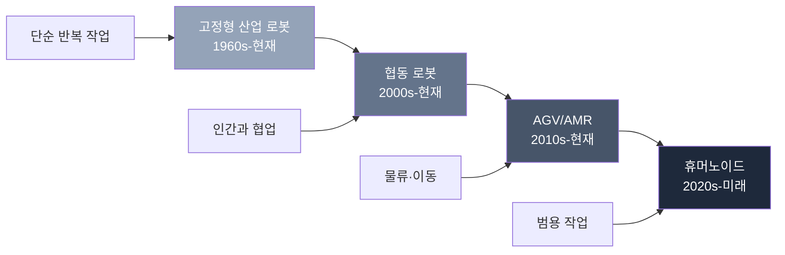

### 공장 자동화의 장점 (학습 데이터 관점)

| 항목 | 공장 환경 | 일반 환경 | 데이터 수집 용이성 |
|------|---------|---------|------------------|
| **환경 통제** | 온도·조명 고정 | 변동 심함 | ✅ 공장 유리 |
| **작업 반복성** | 동일 작업 반복 | 매번 다름 | ✅ 공장 유리 |
| **안전 구역** | 펜스로 분리 | 인간과 혼재 | ✅ 공장 유리 |
| **데이터 라벨링** | 센서로 자동 | 수동 라벨링 | ✅ 공장 유리 |

## 5.2 공장 → 휴머노이드 전이 전략

### 3단계 전이 로드맵

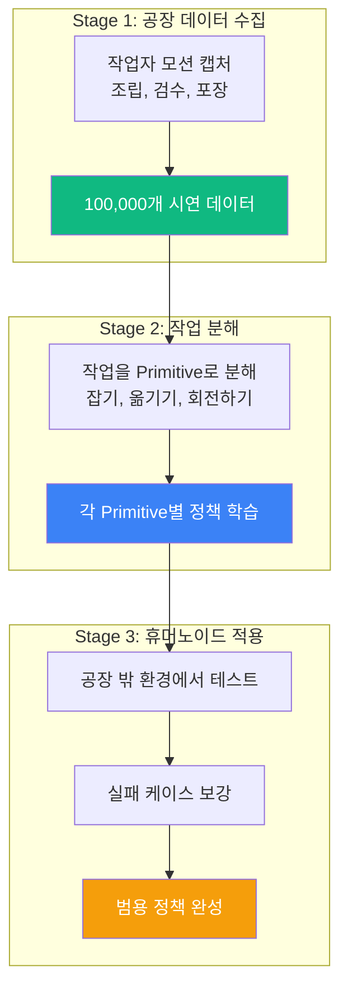

### 사례: BMW 공장 → Tesla Optimus

| 작업 단계 | 공장 로봇 암 | Optimus 휴머노이드 |
|---------|-----------|------------------|
| **부품 픽업** | 고정 위치에서 집기 | 다양한 위치 대응 |
| **조립** | 지그(Jig) 사용 | 손으로 정렬 |
| **검수** | 비전 시스템 | 시각+촉각 융합 |
| **이동** | 컨베이어 | 이족 보행 |

**핵심**: 공장에서 배운 "부품 잡기" 정책을 일반 환경의 "컵 잡기"로 전이할 때, **손 모양(Grasp Pose)**은 유사하지만 **힘 제어(Force Control)**는 재학습이 필요합니다.

---

# Part 6: 3가지 교육 접근법

## 접근법 A: 모션 장갑 기반 Teleoperation

### 정의
> 인간이 햅틱 장갑(Haptic Glove)을 착용하고 작업을 시연하면, 장갑의 센서가 손가락 관절 각도·힘·위치를 실시간으로 기록하여 로봇 학습 데이터로 변환하는 방식.

### 시스템 구성

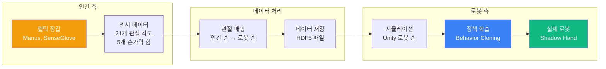

### 개발 프로세스 (8주)

#### Week 1-2: 데이터 수집 환경 구축
**산출물:**
- [ ] 장갑 캘리브레이션 체크리스트
- [ ] 데이터 포맷 명세서 (JSON Schema)
- [ ] 작업 시나리오 정의서 (예: 컵 잡기 10가지 변형)

**작업 시나리오 예시 (컵 잡기)**

| 시나리오 ID | 컵 위치 | 컵 재질 | 손 접근 방향 | 난이도 |
|----------|--------|--------|-----------|--------|
| A-001 | 테이블 중앙 | 플라스틱 | 상단 | ⭐ |
| A-002 | 테이블 가장자리 | 플라스틱 | 측면 | ⭐⭐ |
| A-003 | 선반 2단 | 유리 | 하단 | ⭐⭐⭐ |
| A-004 | 장애물 뒤 | 금속 | 비스듬히 | ⭐⭐⭐⭐ |

#### Week 3-4: 시연 수집 및 데이터 정제
**프로세스:**
1. 시연자가 작업 100회 반복
2. 실패 케이스(컵 떨어뜨림) 제외
3. 데이터 품질 체크: 손떨림 < 5mm, 속도 < 50cm/s
4. 데이터 증강: 타임스트레칭(속도 ±20%), 노이즈 추가

**데이터 품질 기준표:**

| 항목 | 합격 기준 | 측정 방법 |
|------|---------|----------|
| 작업 성공률 | >90% | 수동 라벨링 |
| 궤적 부드러움 | Jerk <0.5 | 수치 계산 |
| 힘 제어 안정성 | 표준편차 <1N | 센서 로그 |
| 프레임 누락 | <1% | 타임스탬프 검사 |

#### Week 5-6: Unity 시뮬레이션 학습
**Unity 씬 구성:**
- 로봇 손 (URDF 임포트)
- 컵 물체 (다양한 크기 5종)
- 테이블 (마찰 계수 조정 가능)

**학습 알고리즘: Behavior Cloning**
```
목표: 정책 π가 시연자의 행동을 모방
손실 함수 = MSE(π(관측), 시연 행동)
옵티마이저 = Adam, 학습률 0.001
학습 스텝 = 50,000
```

#### Week 7: 실물 로봇 전이
**전이 체크리스트:**
- [ ] 관절 각도 범위 확인 (시뮬 vs 실제)
- [ ] 모터 토크 한계 확인
- [ ] 안전 정지 거리 설정 (10cm)
- [ ] 카메라 위치 캘리브레이션

#### Week 8: 평가 및 개선
**평가 시나리오:**
- 시나리오 A-001~A-004를 각 10회 실행
- 성공률, 작업 시간, 힘 측정

**개선 우선순위:**
1. 성공률 <70% 시나리오 → 데이터 추가 수집
2. 작업 시간 >10초 → 속도 프로파일 최적화
3. 힘 >5N → 그립 정책 재학습

### 교육 현장 적용 시 대안

고가 장갑 대신 **MediaPipe Hand Tracking**으로 대체 가능:
- 비용: $0 (웹캠만 필요)
- 정확도: 손가락 21개 랜드마크, 오차 ~5mm
- 제약: 힘 센서 없음 (시각 데이터만)

---

## 접근법 B: 카메라 비전 기반 학습

### 정의
> 카메라로 인간의 작업을 촬영하고, 컴퓨터 비전(MediaPipe, YOLO)으로 손 위치·물체 위치를 추출하여 로봇이 모방하게 만드는 방식. 장갑 없이도 데이터 수집 가능.

### 시스템 구성

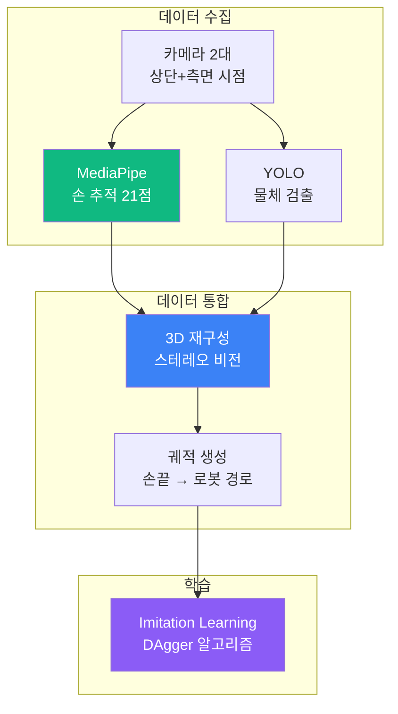

### 개발 프로세스 (6주)

#### Week 1: 카메라 시스템 구축
**하드웨어:**
- 웹캠 2대 (해상도 1080p, 프레임 30fps 이상)
- 삼각대 (높이 조절 가능)
- 조명 (작업 공간 500lux 이상)

**캘리브레이션:**
1. 체크보드 패턴으로 카메라 내부 파라미터 추정
2. 카메라 간 외부 파라미터(회전, 평행이동) 계산
3. 3D 재구성 오차 < 5mm 확인

#### Week 2-3: 데이터 수집 파이프라인
**촬영 프로토콜:**
- 시연자: 5명 (다양한 손 크기)
- 작업: 컵 잡기 50회 × 5명 = 250개 샘플
- 배경: 단색(흰색/검은색) 교체하며 촬영

**데이터 처리 흐름:**
```
1. 카메라 1,2에서 동기화 촬영 (timestamp 일치)
2. MediaPipe로 손 21개 관절 2D 좌표 추출
3. 스테레오 매칭으로 3D 좌표 계산
4. YOLO로 컵 바운딩 박스 검출
5. HDF5 파일로 저장 (손_3D, 컵_3D, 시간)
```

#### Week 4: 시뮬레이션 검증
**Unity 환경:**
- 재구성된 3D 궤적을 Unity 로봇 손으로 재생
- 충돌 검사: 손이 컵·테이블과 올바르게 상호작용하는가?
- 성공률 측정: 100개 궤적 중 몇 개가 컵을 잡았는가?

**예상 결과:**
- 성공률 60~70% (카메라 오차, 가림 문제)
- 실패 원인 분석 → 데이터 필터링 규칙 수립

#### Week 5: 정책 학습
**알고리즘: DAgger (Dataset Aggregation)**
- 초기: 시연 데이터로 정책 학습
- 배포: Unity에서 정책 실행 → 실패 케이스 발견
- 보강: 인간이 실패 케이스를 수정하여 데이터 추가
- 반복: 3회 반복으로 성공률 85% 달성

#### Week 6: 실물 전이
**Reality Gap 대응:**
- 카메라 위치: 시뮬레이션과 동일하게 고정
- 조명: 500lux 유지
- 컵 재질: 시뮬레이션에서 학습한 것과 동일(플라스틱)

### 장단점 비교

| 항목 | 모션 장갑 (A) | 카메라 비전 (B) |
|------|------------|---------------|
| **비용** | 고가 ($1,000+) | 저가 ($100) |
| **정확도** | 매우 높음 (~1mm) | 중간 (~5mm) |
| **힘 센서** | 있음 | 없음 |
| **가림 문제** | 없음 | 있음 (손이 컵에 가려짐) |
| **데이터 수집 속도** | 빠름 | 느림 (후처리 필요) |
| **교육 적합성** | 중급 이상 | 초급 OK |

---

## 접근법 C: 유니티 시뮬레이션 우선

### 정의
> 실제 하드웨어 없이 Unity ML-Agents로 강화학습(Reinforcement Learning)을 먼저 완료하고, 나중에 소형 로봇으로 전이하는 방식. 가장 교육 친화적.

### 장점
- **비용 제로**: 실물 로봇 없이 학습 가능
- **빠른 반복**: 시뮬레이션은 실시간의 100배 속도
- **무한 시도**: 로봇이 떨어져도 비용 없음

### 개발 프로세스 (12주)

#### Week 1-2: Unity 환경 구축
**씬 구성:**
```
Scene: "GraspCup"
├─ RobotArm (URDF 임포트, ArticulationBody)
├─ Table (Collider, 마찰계수 0.5)
├─ Cup (Rigidbody, 질량 200g)
├─ Camera (로봇 시점, RGB 640x480)
└─ RewardManager (스크립트)
```

**관절 설정:**
- 6개 관절 (어깨 3자유도, 팔꿈치 1, 손목 2)
- 각도 범위: -180° ~ +180°
- 토크 한계: 10Nm

#### Week 3-4: 보상 함수 설계
**보상 구조 (단계별):**

```
Phase 1: 손을 컵 가까이 (0~50 step)
  보상 = -0.1 × 거리 (m)

Phase 2: 컵 파지 (50~100 step)
  보상 = +2.0 (그립 센서 활성화 시)
         -1.0 (컵 떨어뜨림)

Phase 3: 컵 들어올리기 (100~150 step)
  보상 = +0.5 × 높이 (m)
         +5.0 (목표 높이 20cm 도달)

패널티:
  - 관절 한계 초과: -0.5
  - 충돌 (테이블과 팔): -1.0
  - 시간 초과 (200 step): -10.0
```

#### Week 5-8: 강화학습 학습
**알고리즘: PPO (Proximal Policy Optimization)**

**하이퍼파라미터:**
```
학습률 = 0.0003
배치 크기 = 2048
에포크 = 10
감가율(Gamma) = 0.99
λ (GAE) = 0.95
총 학습 스텝 = 5,000,000
```

**학습 모니터링:**
- TensorBoard로 평균 보상 곡선 확인
- 목표: 평균 보상 > +8.0 (성공 기준)

**학습 결과 예시:**
```
Step 1M:   평균 보상 = +2.5, 성공률 = 20%
Step 2M:   평균 보상 = +5.0, 성공률 = 50%
Step 3.5M: 평균 보상 = +8.2, 성공률 = 85% ← 학습 완료
```

#### Week 9: Domain Randomization
**변형 항목:**
- 컵 위치: X ±10cm, Y ±10cm
- 컵 질량: 150g ~ 300g
- 테이블 마찰: 0.3 ~ 0.7
- 조명 강도: 50% ~ 150%
- 카메라 노이즈: Gaussian σ=5

**재학습:**
- 랜덤 환경에서 추가 1M 스텝 학습
- 성공률 유지: 80% 이상

#### Week 10-11: 실물 전이
**하드웨어: WidowX 로봇 팔 (교육용)**
- 6축 로봇 팔
- 그리퍼 (최대 개방 10cm)
- ROS 2 지원
- 가격: $1,500

**전이 프로세스:**
1. Unity 정책 → ONNX 변환
2. ONNX → TensorRT 최적화 (Jetson에서 실행)
3. ROS 2 노드로 로봇 제어
4. 실제 환경에서 10회 테스트

**예상 성공률:**
- 시뮬레이션: 85%
- 실제: 65~70% (Reality Gap)

#### Week 12: 평가 및 리포트
**최종 산출물:**
- [ ] Unity 프로젝트 파일 (GitHub)
- [ ] 학습된 정책 모델 (.onnx)
- [ ] 학습 로그 (TensorBoard)
- [ ] 실물 전이 결과 영상
- [ ] 프로젝트 보고서 (20페이지)

### 교육 효과
- **AI/ML 이해**: 강화학습의 시행착오 과정을 직관적으로 경험
- **시스템 설계**: 보상 함수 설계 = 문제를 수학적으로 정의하는 능력
- **실험 정신**: 하이퍼파라미터 튜닝으로 최적화 감각 습득

---

# Part 7: 바이브 코딩 기반 프로젝트 설계

## 7.1 바이브 코딩이란?

### 정의
> **바이브 코딩(Vibe Coding)**: 전통적인 코딩 대신, ChatGPT/Claude 등 AI에게 **명확한 명세(Specification)**를 프롬프트로 전달하여 코드를 생성시키고, 인간은 **설계·검증·통합**에 집중하는 개발 방식.

### 고급 피지컬 컴퓨팅에서의 적용

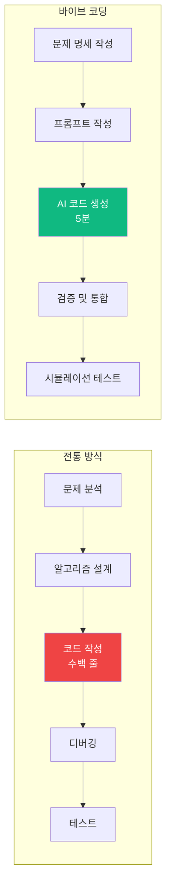

## 7.2 프로젝트 설계 프로세스 (4주)

### Week 1: 문제 정의 및 명세 작성
**팀 구성 (4인 1조):**
- **기획자 (1명)**: 작업 시나리오 정의, 성공 기준 설정
- **데이터 엔지니어 (1명)**: 데이터 수집 방법, 품질 기준
- **ML 엔지니어 (1명)**: 학습 알고리즘, 보상 함수 설계
- **통합 엔지니어 (1명)**: Unity ↔ ROS 2 연동, 실물 전이

**산출물: 프로젝트 명세서 (10페이지)**

#### 명세서 템플릿

```markdown
# 프로젝트 명세서: [프로젝트명]

## 1. 목표 작업 정의
- **작업명**: 컵 잡기 및 이동
- **성공 기준**: 
  - 컵을 떨어뜨리지 않고 들어올림 (높이 20cm)
  - 작업 시간 < 10초
  - 성공률 > 80% (10회 중 8회)

## 2. 환경 설정
- **로봇**: 6축 로봇 팔 (시뮬레이션: Unity, 실제: WidowX)
- **물체**: 플라스틱 컵 (직경 8cm, 높이 10cm, 무게 200g)
- **작업 공간**: 테이블 (80cm × 60cm, 높이 75cm)

## 3. 센서 구성
- **카메라**: RGB 640x480, 30fps (로봇 손목에 부착)
- **그립 센서**: 이진(접촉/비접촉)

## 4. 데이터 수집 계획
- **방법**: 접근법 B (카메라 비전)
- **시연자**: 5명
- **시연 횟수**: 각 50회 = 총 250개
- **데이터 증강**: 타임스트레칭, 노이즈 추가 → 1,000개

## 5. 학습 전략
- **알고리즘**: Behavior Cloning (시연 모방)
- **네트워크**: CNN (이미지 입력) + LSTM (시계열)
- **학습 환경**: Unity ML-Agents
- **학습 스텝**: 100,000

## 6. 평가 기준
- **시뮬레이션**: 성공률 > 85%
- **실물**: 성공률 > 70%
- **안전성**: 충돌 0회
```

### Week 2: 바이브 코딩으로 구현
**프롬프트 예시 (Unity 환경 구축):**

```
[프롬프트 to ChatGPT]
"Unity ML-Agents를 사용하여 6축 로봇 팔이 컵을 잡는 환경을 만들어줘. 
조건:
1. 로봇 팔은 ArticulationBody 사용
2. 컵은 Rigidbody, 질량 0.2kg
3. 테이블은 Static Collider, 마찰계수 0.5
4. 보상 함수: 
   - 손끝과 컵 거리 감소: +1.0
   - 컵 파지 성공: +10.0
   - 컵 떨어뜨림: -5.0
5. C# 스크립트 형태로 작성"
```

**AI 생성 코드 검증 체크리스트:**
- [ ] 관절 각도 범위가 현실과 일치하는가?
- [ ] 보상 함수가 의도한 행동을 유도하는가?
- [ ] 물리 파라미터(마찰, 질량)가 합리적인가?
- [ ] 성능(프레임레이트)이 30fps 이상인가?

### Week 3: 시뮬레이션 학습 및 최적화
**일일 체크리스트:**

| 요일 | 작업 | 담당 | 산출물 |
|-----|------|------|--------|
| 월 | 학습 시작 (10K 스텝) | ML 엔지니어 | 초기 정책 |
| 화 | 보상 곡선 분석 | ML 엔지니어 | 개선 방향 보고서 |
| 수 | 보상 함수 튜닝 | 기획자 + ML | 수정된 명세 |
| 목 | 재학습 (50K 스텝) | ML 엔지니어 | 중간 정책 |
| 금 | 시뮬레이션 테스트 100회 | 통합 엔지니어 | 성공률 리포트 |

### Week 4: 실물 전이 및 최종 평가
**전이 프로세스:**
1. **모델 변환**: PyTorch → ONNX → TensorRT
2. **ROS 2 노드 작성** (바이브 코딩):
   ```
   [프롬프트]
   "ROS 2 Humble에서 ONNX 모델을 로드하고, 
   카메라 토픽(/camera/image_raw)을 입력받아 
   로봇 관절 명령(/joint_commands)을 출력하는 노드를 작성해줘."
   ```

3. **실물 테스트 (10회)**:
   - 성공/실패 기록
   - 실패 원인 분류 (물체 인식 실패, 경로 오류, 그립 실패)

4. **최종 리포트 작성** (20페이지):
   - 프로젝트 개요
   - 설계 과정 (명세서, 프롬프트 로그)
   - 학습 결과 (그래프, 성공률)
   - 실물 전이 결과 (영상, 분석)
   - 개선 방향 제안

## 7.3 평가 루브릭 (과정 중심)

| 평가 항목 | 배점 | 우수 (A) | 보통 (B) | 미흡 (C) |
|---------|------|---------|---------|---------|
| **명세 작성** | 20% | 성공 기준이 정량적이고 명확함 | 일부 모호한 표현 | 주관적 기준만 제시 |
| **프롬프트 설계** | 20% | AI가 1회 만에 작동 가능한 코드 생성 | 2-3회 수정 필요 | 여러 번 실패 |
| **시뮬레이션 성공률** | 25% | >85% | 70~85% | <70% |
| **실물 전이 성공률** | 20% | >70% | 50~70% | <50% |
| **팀워크 및 문서화** | 15% | 역할 분담 명확, 문서 완비 | 일부 미흡 | 문서 부실 |

---

# Part 8: 평가 및 산출물 관리

## 8.1 산출물 체크리스트 (전체 프로젝트)

### 문서 산출물
- [ ] 프로젝트 명세서 (10페이지)
- [ ] 데이터 수집 계획서 (5페이지)
- [ ] 학습 설정 문서 (하이퍼파라미터, 보상 함수)
- [ ] 최종 보고서 (20페이지, 영문 가능)

### 데이터 산출물
- [ ] 학습 데이터셋 (HDF5, 크기 >1GB)
- [ ] 데이터 품질 리포트 (성공률, 오차 통계)

### 코드 산출물
- [ ] Unity 프로젝트 (GitHub 공개)
- [ ] ROS 2 패키지 (launch 파일 포함)
- [ ] 학습 스크립트 (Jupyter Notebook)

### 모델 산출물
- [ ] 학습된 정책 (.pth, .onnx)
- [ ] TensorBoard 로그
- [ ] 모델 성능 리포트 (정확도, 추론 속도)

### 영상 산출물
- [ ] 시뮬레이션 성공 영상 (1분)
- [ ] 실물 로봇 시연 영상 (2분)
- [ ] 프로젝트 발표 영상 (5분)

## 8.2 GitHub 레포지토리 구조

```
robot-grasp-project/
├── README.md                  # 프로젝트 개요
├── docs/                      # 문서
│   ├── specification.md       # 명세서
│   ├── data_collection.md     # 데이터 수집 가이드
│   └── final_report.pdf       # 최종 보고서
├── unity/                     # Unity 프로젝트
│   ├── Assets/
│   ├── ProjectSettings/
│   └── README.md
├── ros2_ws/                   # ROS 2 워크스페이스
│   ├── src/
│   │   └── robot_control/    # 제어 패키지
│   └── README.md
├── ml/                        # 머신러닝
│   ├── train.ipynb           # 학습 노트북
│   ├── models/               # 저장된 모델
│   └── configs/              # 하이퍼파라미터
├── data/                      # 데이터 (Git LFS 사용)
│   ├── demonstrations/       # 시연 데이터
│   └── logs/                 # 학습 로그
└── videos/                    # 영상
    ├── simulation.mp4
    └── real_robot.mp4
```

---

# Part 9: 참고 자료

## 9.1 글로벌 기업 공개 자료

### Tesla
- **AI Day 2022**: Optimus 첫 공개 (YouTube에서 시청 가능)
- **FSD Beta 아키텍처**: End-to-End 신경망 구조 설명

### NVIDIA
- **Isaac Sim Documentation**: https://docs.omniverse.nvidia.com/isaacsim/
- **Jetson AI 프로젝트**: https://developer.nvidia.com/embedded/community/jetson-projects

### 오픈소스 프로젝트
- **LeRobot (Hugging Face)**: https://github.com/huggingface/lerobot
- **MuJoCo**: https://mujoco.org/
- **Unity ML-Agents**: https://github.com/Unity-Technologies/ml-agents

## 9.2 교육용 하드웨어 구매 가이드

| 제품 | 용도 | 가격 | 구매처 |
|------|------|------|--------|
| **Jetson Orin Nano** | AI 추론 | $499 | NVIDIA Store |
| **WidowX 로봇 팔** | 실물 검증 | $1,495 | Trossen Robotics |
| **MediaPipe 지원 웹캠** | 모션 캡처 | $50 | Logitech C920 |
| **Force/Torque 센서** | 힘 측정 | $200 | ATI Nano17 |

## 9.3 추천 학습 경로

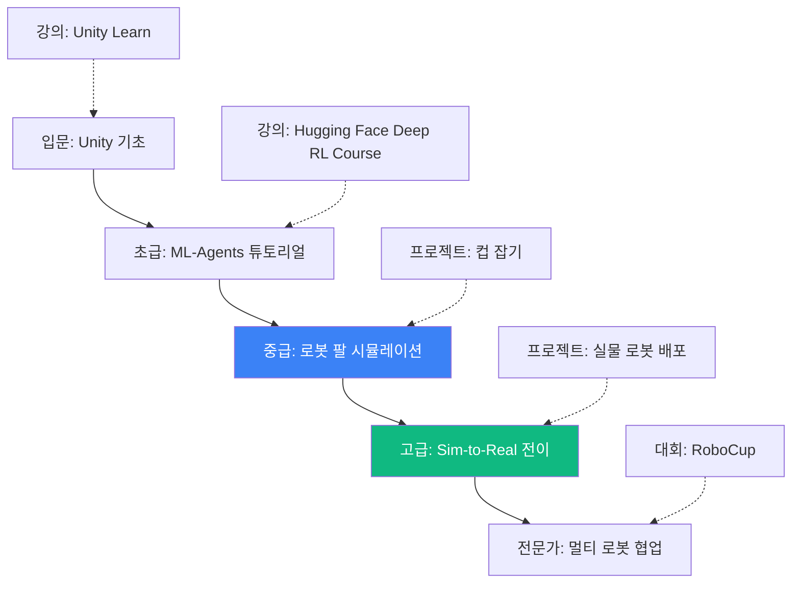

---

**문서 정보**  
**작성자**: AI Maker Lab 고급 로보틱스팀  
**최종 업데이트**: 2025-01-05  
**문서 버전**: 2.0 (정의·프로세스·교육 통합판)  
**대상**: 고등학생, 대학생, 교사, 산업 현장 교육 담당자

**라이선스**: CC BY-SA 4.0 (출처 표기 시 자유 사용)

