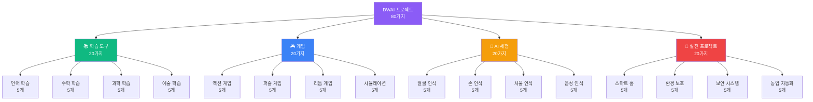
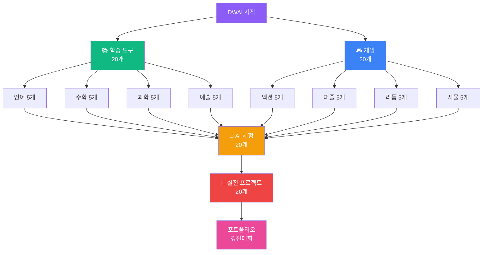
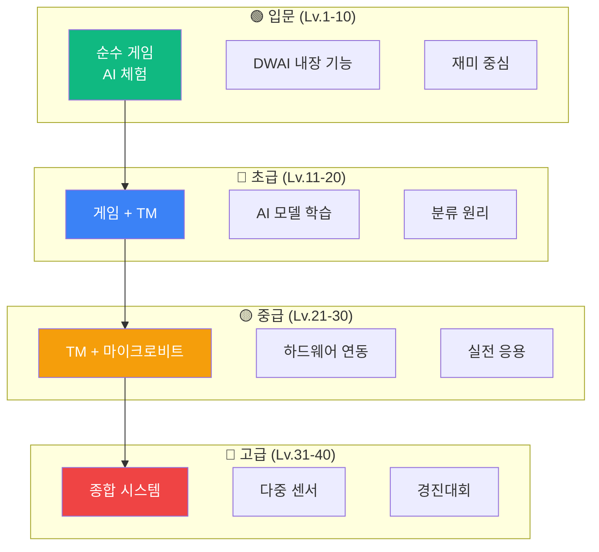

# DWAI 키트 교육 커리큘럼 가이드

## 🎯 DWAI 키트 개요

**DWAI**는 "**Dancing with AI**"의 약자로, 초등학생부터 중학생까지를 위한 **게임형 AI 교육 플랫폼**입니다.

### 📋 기본 정보

| 항목 | 내용 |
|------|------|
| **제품명** | DWAI (Dancing with AI) 키트 |
| **가격** | 약 20만원 |
| **대상 학년** | 초등 1학년 ~ 중학 3학년 |
| **플랫폼** | 웹 브라우저 기반 (https://dancingwithai.media.mit.edu/) |
| **비용** | 무료 사용 가능 |
| **사용 방식** | 게임형 블록 코딩 |

---

## 🎮 프로젝트 카테고리

### 전체 구조



---

## 📚 학습 도구 (20가지)

**교육 목표**: 재미있는 AI 게임으로 학습 효과 극대화  
**대상**: 초등 1학년 ~ 중학 3학년  
**특징**: 놀이와 학습의 완벽한 결합

---

### 📖 언어 학습 (5가지)

#### 🎮 L1: 손으로 영어 단어 맞추기

**학습 컨셉**: 손가락 개수로 알파벳 철자 맞추기

**체험 (10분)**
- 완성된 영어 단어 게임 플레이
- "CAT" 단어를 손가락으로 표현

**제작 (50분)**
```
DWAI 블록:
1. [Hand Tracking] 손가락 개수 감지 (1-5)
2. [단어 DB] 초등 영어 단어 100개
3. [문제 출제] 단어 표시 + 음성
4. [철자 입력] 손가락으로 알파벳 순서
5. [정답 판정] 맞으면 다음 단어
```

**게임 방식**
```
예시: "CAT" 단어 맞추기
1. 화면에 고양이 그림 + "CAT" 음성
2. C = 3번째 알파벳 → 손가락 3개
3. A = 1번째 알파벳 → 손가락 1개
4. T = 20번째 알파벳 → 손가락 5개 4번
5. 정답! +10점, 다음 단어
```

**개선 (30분)**
- 난이도 (3글자 → 5글자 → 7글자)
- 힌트 시스템 (그림, 뜻)
- 타이머 챌린지
- 친구와 대결

**학습 효과**: 영어 단어 암기, 알파벳 순서, 집중력

---

#### 🎮 L2: 표정으로 감정 영어 배우기

**학습 컨셉**: 표정을 지으면 영어 감정 단어 학습

**TM 모델 제작 (30분)**
```
Teachable Machine:
- 클래스 1: 😊 Happy
- 클래스 2: 😢 Sad
- 클래스 3: 😠 Angry
- 클래스 4: 😮 Surprised
- 클래스 5: 😨 Scared
```

**게임 제작 (50분)**
```
DWAI 블록:
1. [TM 연동] 표정 분류
2. [영어 단어] 감정 표현 표시
3. [발음] 음성 재생 "Happy!"
4. [예문] "I am happy today"
5. [점수] 5개 모두 표현 시 완성
```

**게임 방식**
```
미션: 5가지 감정 모두 표현하기
1. 화면: "Show me HAPPY!"
2. 학생: 😊 웃는 표정
3. AI 인식 → "Happy! I am happy!"
4. 다음 감정으로 이동
5. 모두 완성 → 감정 스토리 만들기
```

**개선 (30분)**
- 감정 스토리 만들기
- 감정 노래 (Happy Song)
- 감정 일기 쓰기

**학습 효과**: 감정 영어 표현, 발음 연습, 감정 표현력

---

#### 🎮 L3: 손 제스처로 한글 자음 모음

**학습 컨셉**: 손 모양으로 한글 자음 모음 만들기

**TM 모델 제작 (40분)**
```
Teachable Machine:
- 클래스 1: ㄱ (손가락 ㄱ자)
- 클래스 2: ㄴ (손가락 ㄴ자)
- 클래스 3: ㄷ (손가락 ㄷ자)
- 클래스 4: ㅏ (손가락 ㅏ자)
- 클래스 5: ㅓ (손가락 ㅓ자)
... (14개 자음 모음)
```

**게임 제작 (60분)**
```
DWAI 블록:
1. [TM 연동] 손 모양 분류
2. [자음 모음] 조합 시스템
3. [단어 만들기] "가", "나", "다"
4. [발음] 음성 재생
5. [받아쓰기] 단어 맞추기
```

**게임 방식**
```
레벨 1: 자음 모음 배우기
- ㄱ, ㄴ, ㄷ... 손 모양 연습

레벨 2: 글자 만들기
- ㄱ + ㅏ = 가
- 손 모양 2번으로 글자 완성

레벨 3: 단어 만들기
- "가방" = ㄱ+ㅏ+ㅂ+ㅏ+ㅇ
- 5번 손 모양으로 단어 완성

레벨 4: 받아쓰기
- 음성: "가방"
- 학생: 손 모양으로 철자
```

**개선 (30분)**
- 한글 동화 만들기
- 친구 이름 쓰기
- 한글날 퀴즈

**학습 효과**: 한글 구조 이해, 자음 모음 조합, 창의적 표현

---

#### 🎮 L4: 얼굴로 동물 영어 단어

**학습 컨셉**: 얼굴 표정으로 동물 흉내 + 영어 학습

**TM 모델 제작 (40분)**
```
Teachable Machine:
- 클래스 1: 🐶 Dog (혀 내밀기)
- 클래스 2: 🐱 Cat (수염 그리기)
- 클래스 3: 🐵 Monkey (찡그리기)
- 클래스 4: 🐰 Rabbit (앞니 보이기)
- 클래스 5: 🦁 Lion (입 크게 벌리기)
```

**게임 제작 (60분)**
```
DWAI 블록:
1. [TM 연동] 표정 분류
2. [동물 영어] 단어 + 발음
3. [동물 소리] 울음소리 재생
4. [퀴즈] "What animal is this?"
5. [스토리] 동물 농장 만들기
```

**게임 방식**
```
스테이지 1: 동물 배우기
- Dog 표정 → "Dog! Woof woof!"
- 5가지 동물 모두 연습

스테이지 2: 동물 퀴즈
- 소리: "Meow~"
- 학생: 🐱 고양이 표정
- 정답: "Cat!"

스테이지 3: 동물 농장
- 5가지 동물 모두 모으기
- 나만의 동물 농장 완성
- 동물 이름 영어로 말하기
```

**개선 (30분)**
- 동물 10종 추가 (곤충, 새, 물고기)
- 동물 스토리 만들기
- 동물 노래 (Old MacDonald)

**학습 효과**: 동물 영어 단어, 발음, 창의적 표현

---

#### 🎮 L5: 손으로 영어 문장 만들기

**학습 컨셉**: 손 제스처로 단어 선택하여 문장 조립

**TM 모델 제작 (40분)**
```
Teachable Machine:
- 클래스 1: 👆 주어 선택 (I, You, He, She)
- 클래스 2: ✌️ 동사 선택 (am, is, like, eat)
- 클래스 3: 👌 목적어 선택 (apple, cat, book)
- 클래스 4: ✋ 문장 완성
- 클래스 5: ✊ 다시 하기
```

**게임 제작 (60분)**
```
DWAI 블록:
1. [TM 연동] 손 제스처 분류
2. [단어 카드] 화면에 단어 표시
3. [문장 조립] 선택한 단어 나열
4. [문법 체크] 올바른 문장인지 판정
5. [발음] 완성된 문장 읽기
```

**게임 방식**
```
레벨 1: 간단한 문장 (3단어)
- I + am + happy
- 손 제스처 3번으로 문장 완성

레벨 2: 긴 문장 (5단어)
- I + like + to + eat + apples
- 손 제스처 5번

레벨 3: 자유 작문
- 20개 단어 중 선택
- 나만의 문장 만들기
- AI가 문법 체크

레벨 4: 스토리 만들기
- 5개 문장 연결
- 짧은 영어 스토리 완성
```

**개선 (30분)**
- 단어 100개 확장
- 문법 설명 추가
- 친구와 문장 교환

**학습 효과**: 영어 문장 구조, 문법, 작문 능력

---

### 🔢 수학 학습 (5가지)

#### 🎮 M1: 손가락 덧셈 뺄셈

**학습 컨셉**: 손가락 개수로 덧셈 뺄셈 연산

**체험 (10분)**
- 손가락으로 숫자 표현
- 간단한 덧셈 문제 풀기

**제작 (50분)**
```
DWAI 블록:
1. [Hand Tracking] 손가락 개수 감지
2. [문제 출제] "3 + 2 = ?"
3. [답 입력] 손가락 5개
4. [정답 판정] 맞으면 +10점
5. [난이도] 10 이내 → 20 이내 → 100 이내
```

**게임 방식**
```
레벨 1: 5 이내 덧셈
- 2 + 3 = ? → 손가락 5개

레벨 2: 10 이내 덧셈
- 7 + 3 = ? → 손가락 10개 (양손)

레벨 3: 뺄셈
- 8 - 3 = ? → 손가락 5개

레벨 4: 혼합 문제
- 덧셈, 뺄셈 랜덤
- 시간 제한 30초
```

**개선 (30분)**
- 곱셈, 나눗셈 추가
- 속도 챌린지
- 구구단 게임

**학습 효과**: 기초 연산, 암산 능력, 수 감각

---

#### 🎮 M2: 표정으로 크기 비교

**학습 컨셉**: 표정으로 수의 크기 비교

**TM 모델 제작 (30분)**
```
Teachable Machine:
- 클래스 1: 😊 크다 (>)
- 클래스 2: 😢 작다 (<)
- 클래스 3: 😐 같다 (=)
```

**게임 제작 (50분)**
```
DWAI 블록:
1. [TM 연동] 표정 분류
2. [문제 출제] "5 ○ 3"
3. [답 입력] 😊 크다 표정
4. [정답] "5 > 3" 표시
5. [점수] 연속 정답 콤보
```

**게임 방식**
```
레벨 1: 한 자리 수
- 5 ○ 3 → 😊 (크다)
- 2 ○ 7 → 😢 (작다)

레벨 2: 두 자리 수
- 15 ○ 23 → 😢 (작다)

레벨 3: 분수 비교
- 1/2 ○ 1/3 → 😊 (크다)

레벨 4: 속도 게임
- 10초 안에 10문제
```

**개선 (30분)**
- 소수 비교
- 음수 비교
- 부등식 만들기

**학습 효과**: 수 비교, 부등호, 논리적 사고

---

#### 🎮 M3: 손으로 도형 그리기

**학습 컨셉**: 손가락으로 공중에 도형 그리기

**체험 (10분)**
- 손가락으로 삼각형, 사각형 그리기
- AI가 도형 인식

**제작 (60분)**
```
DWAI 블록:
1. [Hand Tracking] 손가락 위치 추적
2. [선 그리기] 궤적 표시
3. [도형 인식] AI가 도형 판별
4. [정답 판정] 올바른 도형인가?
5. [점수] 정확도 평가
```

**게임 방식**
```
레벨 1: 기본 도형
- 삼각형, 사각형, 원 그리기
- AI가 인식 → "Triangle!"

레벨 2: 복잡한 도형
- 오각형, 육각형, 별
- 정확도 90% 이상

레벨 3: 도형 조합
- 집 그리기 (삼각형 + 사각형)
- 로봇 그리기 (여러 도형 조합)

레벨 4: 도형 퀴즈
- "Draw a shape with 5 sides"
- 오각형 그리기
```

**개선 (30분)**
- 3D 도형 (정육면체 전개도)
- 대칭 도형 그리기
- 도형 넓이 계산

**학습 효과**: 기하학, 공간 감각, 손 협응력

---

#### 🎮 M4: 얼굴로 수직선 점프

**학습 컨셉**: 얼굴 위치로 수직선 위 숫자 찾기

**체험 (10분)**
- 얼굴을 위아래로 움직여 숫자 찾기
- 수직선 개념 이해

**제작 (50분)**
```
DWAI 블록:
1. [Face Tracking] 얼굴 Y 좌표
2. [수직선] 화면에 -10 ~ +10 표시
3. [문제] "Find number 5"
4. [판정] 얼굴 위치가 5에 있는가?
5. [점수] 정확도 + 속도
```

**게임 방식**
```
레벨 1: 양수 (0~10)
- "Find 7" → 얼굴을 7 위치로

레벨 2: 음수 (-10~10)
- "Find -3" → 얼굴을 -3 위치로

레벨 3: 덧셈 뺄셈
- "Start at 3, add 4" → 7로 이동
- "Start at 5, subtract 8" → -3으로 이동

레벨 4: 수직선 점프 게임
- 장애물 피하며 숫자 찾기
- 시간 제한 챌린지
```

**개선 (30분)**
- 분수 수직선
- 소수 수직선
- 2D 좌표평면 (X, Y)

**학습 효과**: 수직선 개념, 양수 음수, 좌표 이해

---

#### 🎮 M5: 손 제스처로 시계 읽기

**학습 컨셉**: 손으로 시계 바늘 만들기

**TM 모델 제작 (40분)**
```
Teachable Machine:
- 클래스 1-12: 손 각도로 시간 표현
- 예: 3시 = 손을 오른쪽으로
- 예: 6시 = 손을 아래로
- 예: 9시 = 손을 왼쪽으로
```

**게임 제작 (60분)**
```
DWAI 블록:
1. [TM 연동] 손 각도 분류
2. [시계 UI] 아날로그 시계 표시
3. [문제] "Show me 3 o'clock"
4. [판정] 손 각도가 3시인가?
5. [점수] 정확도 평가
```

**게임 방식**
```
레벨 1: 정각 (1시, 2시, 3시...)
- "Show me 3 o'clock"
- 손을 오른쪽으로 (90도)

레벨 2: 30분 (1시 30분, 2시 30분...)
- 양손 사용 (시침, 분침)

레벨 3: 시간 계산
- "3시에서 2시간 후는?"
- 손으로 5시 표현

레벨 4: 디지털 → 아날로그
- 화면: "15:30"
- 손으로 3시 30분 표현
```

**개선 (30분)**
- 초침 추가 (3개 손가락)
- 시간 스토리 (하루 일과)
- 세계 시간대

**학습 효과**: 시계 읽기, 시간 개념, 각도 이해

---

### 🔬 과학 학습 (5가지)

#### 🎮 S1: 손으로 태양계 만들기

**학습 컨셉**: 손 위치로 행성 배치하기

**체험 (10분)**
- 손으로 행성 위치 조정
- 태양계 구조 이해

**제작 (60분)**
```
DWAI 블록:
1. [Hand Tracking] 손 위치 추적
2. [행성 UI] 8개 행성 표시
3. [배치] 손으로 행성 드래그
4. [정답] 올바른 순서인가?
5. [애니메이션] 행성 공전 시뮬레이션
```

**게임 방식**
```
레벨 1: 행성 순서
- 수성, 금성, 지구... 순서대로 배치
- 태양으로부터 거리 순

레벨 2: 행성 크기
- 목성이 가장 크다
- 수성이 가장 작다

레벨 3: 공전 속도
- 수성이 가장 빠르다
- 해왕성이 가장 느리다

레벨 4: 태양계 퀴즈
- "Which planet is red?" → 화성
- 손으로 화성 선택
```

**개선 (30분)**
- 위성 추가 (달, 타이탄...)
- 소행성대
- 우주 탐사 스토리

**학습 효과**: 태양계 구조, 행성 특징, 우주 과학

---

#### 🎮 S2: 표정으로 동물 분류

**학습 컨셉**: 표정으로 동물 서식지 분류

**TM 모델 제작 (40분)**
```
Teachable Machine:
- 클래스 1: 😊 육지 동물
- 클래스 2: 😮 바다 동물
- 클래스 3: 😲 하늘 동물
- 클래스 4: 😐 양서류
```

**게임 제작 (60분)**
```
DWAI 블록:
1. [TM 연동] 표정 분류
2. [동물 카드] 랜덤 동물 표시
3. [서식지 판정] 올바른 표정인가?
4. [생태계] 동물 서식지 완성
5. [점수] 정확도 평가
```

**게임 방식**
```
레벨 1: 기본 분류
- 호랑이 → 😊 육지
- 고래 → 😮 바다
- 독수리 → 😲 하늘

레벨 2: 서식지 특징
- 사막 동물 (낙타, 전갈)
- 극지방 동물 (펭귄, 북극곰)
- 정글 동물 (원숭이, 앵무새)

레벨 3: 먹이 사슬
- 육식 동물, 초식 동물
- 먹이 사슬 만들기

레벨 4: 멸종 위기
- 멸종 위기 동물 찾기
- 보호 방법 학습
```

**개선 (30분)**
- 동물 50종 추가
- 동물 소리 퀴즈
- 동물 다큐멘터리

**학습 효과**: 생물 분류, 생태계, 환경 보호

---

#### 🎮 S3: 손으로 화학 실험

**학습 컨셉**: 손 제스처로 시약 혼합하기

**TM 모델 제작 (40분)**
```
Teachable Machine:
- 클래스 1: 👆 시약 A 선택
- 클래스 2: ✌️ 시약 B 선택
- 클래스 3: 👌 혼합하기
- 클래스 4: ✋ 관찰하기
- 클래스 5: ✊ 다시 하기
```

**게임 제작 (60분)**
```
DWAI 블록:
1. [TM 연동] 손 제스처 분류
2. [시약 선택] 화면에 시약 표시
3. [혼합 반응] 화학 반응 애니메이션
4. [결과] 색 변화, 거품 발생 등
5. [점수] 올바른 실험인가?
```

**게임 방식**
```
레벨 1: 색 혼합
- 빨강 + 파랑 = 보라
- 노랑 + 파랑 = 초록

레벨 2: 산과 염기
- 산 + 염기 = 중화 반응
- 리트머스 시험지 색 변화

레벨 3: 상태 변화
- 얼음 → 물 → 수증기
- 온도에 따른 변화

레벨 4: 화학식
- H2 + O → H2O
- 화학식으로 반응 표현
```

**개선 (30분)**
- 안전 교육 추가
- 실제 실험 영상
- 화학 원소 주기율표

**학습 효과**: 화학 반응, 실험 방법, 과학적 사고

---

#### 🎮 S4: 얼굴로 날씨 배우기

**학습 컨셉**: 표정으로 날씨 표현하기

**TM 모델 제작 (40분)**
```
Teachable Machine:
- 클래스 1: ☀️ 맑음 (밝게 웃기)
- 클래스 2: ☁️ 흐림 (무표정)
- 클래스 3: 🌧️ 비 (슬픈 표정)
- 클래스 4: ⛈️ 천둥 (놀란 표정)
- 클래스 5: ❄️ 눈 (신난 표정)
```

**게임 제작 (60분)**
```
DWAI 블록:
1. [TM 연동] 표정 분류
2. [날씨 변화] 배경 애니메이션
3. [온도] 날씨별 온도 표시
4. [옷차림] 적절한 옷 선택
5. [점수] 날씨 이해도 평가
```

**게임 방식**
```
레벨 1: 날씨 배우기
- 맑음 표정 → 해 뜨는 애니메이션
- 비 표정 → 빗방울 떨어지기

레벨 2: 날씨 예보
- "내일은 비가 올 거예요"
- 🌧️ 슬픈 표정으로 표현

레벨 3: 계절 날씨
- 봄: 따뜻함, 꽃
- 여름: 더움, 태양
- 가을: 선선함, 낙엽
- 겨울: 추움, 눈

레벨 4: 날씨와 옷
- 비 오는 날 → 우산, 우비
- 눈 오는 날 → 두꺼운 옷
```

**개선 (30분)**
- 실제 날씨 API 연동
- 지역별 날씨 비교
- 기후 변화 학습

**학습 효과**: 날씨 개념, 계절 변화, 과학적 관찰

---

#### 🎮 S5: 손으로 자석 실험

**학습 컨셉**: 손 위치로 자석의 인력과 척력 체험

**체험 (10분)**
- 손을 가까이하면 자석이 끌어당김
- 손을 멀리하면 자석이 밀어냄

**제작 (60분)**
```
DWAI 블록:
1. [Hand Tracking] 손 위치 추적
2. [자석 UI] N극, S극 표시
3. [인력/척력] 손 거리에 따라 힘 계산
4. [물체 이동] 자석에 끌리는 물체
5. [점수] 목표 지점에 물체 이동
```

**게임 방식**
```
레벨 1: 자석 기본
- N극과 S극은 끌어당긴다
- N극과 N극은 밀어낸다

레벨 2: 자석 미로
- 손으로 자석 조종
- 철 구슬을 목표 지점으로

레벨 3: 자석 분류
- 자석에 붙는 물체 (철, 니켈)
- 자석에 안 붙는 물체 (나무, 플라스틱)

레벨 4: 전자석
- 전류를 흘리면 자석이 된다
- 전자석 ON/OFF 제어
```

**개선 (30분)**
- 나침반 만들기
- 자기장 시각화
- 전동기 원리

**학습 효과**: 자석 원리, 자기장, 물리 법칙

---

### 🎨 예술 학습 (5가지)

#### 🎮 A1: 손으로 그림 그리기 + AI 평가

**학습 컨셉**: 공중에 그림 그리면 AI가 평가

**체험 (10분)**
- 손가락으로 공중에 그림 그리기
- AI가 무엇을 그렸는지 맞추기

**제작 (60분)**
```
DWAI 블록:
1. [Hand Tracking] 손가락 위치 추적
2. [선 그리기] 궤적 표시
3. [AI 인식] 그림 분류 (TM)
4. [평가] "This is a cat!"
5. [점수] 정확도 + 창의성
```

**게임 방식**
```
레벨 1: 간단한 그림
- 동그라미, 세모, 네모
- AI가 인식 → "Circle!"

레벨 2: 동물 그리기
- 고양이, 강아지, 물고기
- AI가 맞추기

레벨 3: 그림 퀴즈
- "Draw a house"
- 집 그리기 → AI 평가

레벨 4: 스토리 그림
- 3장의 그림으로 이야기 만들기
- AI가 스토리 이해
```

**TM 모델 제작 (40분)**
```
Teachable Machine:
- 클래스 1-20: 다양한 그림 (동물, 사물, 도형)
- 학생들이 그린 그림으로 학습
```

**개선 (30분)**
- 색칠하기 기능
- 친구와 그림 교환
- 그림 전시회

**학습 효과**: 그림 그리기, 창의성, AI 이해

---

#### 🎮 A2: 표정으로 음악 연주

**학습 컨셉**: 표정으로 악기 선택, 손으로 음계 연주

**TM 모델 제작 (40분)**
```
Teachable Machine:
- 클래스 1: 😊 피아노
- 클래스 2: 😢 바이올린
- 클래스 3: 😠 드럼
- 클래스 4: 😮 트럼펫
```

**게임 제작 (60분)**
```
DWAI 블록:
1. [TM 연동] 표정으로 악기 선택
2. [Hand Tracking] 손 위치로 음계
3. [소리 재생] 악기별 소리
4. [녹음] 연주 저장
5. [점수] 리듬, 정확도 평가
```

**게임 방식**
```
레벨 1: 악기 배우기
- 😊 피아노 표정 → 피아노 소리
- 손 위치로 도레미파솔라시도

레벨 2: 곡 연주
- "학교종이 땡땡땡" 악보 표시
- 따라 연주하기

레벨 3: 자유 연주
- 표정으로 악기 바꾸기
- 손으로 멜로디 만들기

레벨 4: 밴드 합주
- 친구들과 각자 악기 연주
- 합주 완성
```

**개선 (30분)**
- 악기 10종 추가
- 리듬 게임 모드
- 작곡 기능

**학습 효과**: 음악 이론, 리듬감, 협동 능력

---

#### 🎮 A3: 손 제스처로 춤 배우기

**학습 컨셉**: 손 제스처로 춤 동작 따라 하기

**TM 모델 제작 (40분)**
```
Teachable Machine:
- 클래스 1-10: 다양한 춤 동작
- 예: 손 흔들기, 박수, 점프, 회전 등
```

**게임 제작 (60분)**
```
DWAI 블록:
1. [TM 연동] 손 동작 분류
2. [춤 안무] 화면에 동작 표시
3. [리듬] 음악에 맞춰 동작
4. [평가] 정확도, 타이밍
5. [점수] 콤보 시스템
```

**게임 방식**
```
레벨 1: 기본 동작
- 손 흔들기, 박수, 점프
- 천천히 따라 하기

레벨 2: 안무 배우기
- 4가지 동작 조합
- 음악에 맞춰 연습

레벨 3: 속도 증가
- 빠른 템포 음악
- 정확하게 따라 하기

레벨 4: 자유 안무
- 나만의 춤 만들기
- AI가 동작 인식
```

**개선 (30분)**
- 전신 동작 (Pose Estimation)
- K-POP 댄스 챌린지
- 친구와 댄스 배틀

**학습 효과**: 리듬감, 신체 조율, 표현력

---

#### 🎮 A4: 얼굴로 색깔 배우기

**학습 컨셉**: 표정으로 색깔 표현하기

**TM 모델 제작 (40분)**
```
Teachable Machine:
- 클래스 1: 😊 빨강 (열정)
- 클래스 2: 😢 파랑 (슬픔)
- 클래스 3: 😠 검정 (화남)
- 클래스 4: 😲 노랑 (놀람)
- 클래스 5: 😐 회색 (무표정)
```

**게임 제작 (60분)**
```
DWAI 블록:
1. [TM 연동] 표정 분류
2. [색깔 변화] 배경 색 변경
3. [색 혼합] 2가지 표정 조합
4. [그림 색칠] 표정으로 색 선택
5. [점수] 색 이해도 평가
```

**게임 방식**
```
레벨 1: 기본 색
- 😊 빨강 표정 → 화면이 빨강
- 5가지 기본 색 배우기

레벨 2: 색 혼합
- 빨강 + 파랑 = 보라
- 2가지 표정 연속으로

레벨 3: 색칠하기
- 그림 표시 (꽃, 나무, 집)
- 표정으로 색 선택하여 칠하기

레벨 4: 색 감정
- 빨강 = 열정, 사랑
- 파랑 = 평화, 슬픔
- 색과 감정 연결
```

**개선 (30분)**
- 색 이론 (보색, 유사색)
- 명화 색칠하기
- 나만의 팔레트

**학습 효과**: 색 이론, 감정 표현, 미술 감각

---

#### 🎮 A5: 손으로 조각 만들기

**학습 컨셉**: 손 위치로 3D 조각 만들기

**체험 (10분)**
- 손으로 공중에 3D 형태 만들기
- 다양한 각도에서 관찰

**제작 (60분)**
```
DWAI 블록:
1. [Hand Tracking] 손 위치 3D 추적
2. [3D 모델링] 점, 선, 면 생성
3. [회전] 손 제스처로 회전
4. [색칠] 표면에 색 입히기
5. [저장] 3D 모델 저장
```

**게임 방식**
```
레벨 1: 기본 도형
- 정육면체, 구, 원기둥
- 손으로 크기 조절

레벨 2: 조합 도형
- 눈사람 (구 3개)
- 로봇 (정육면체 조합)

레벨 3: 자유 조각
- 나만의 조각 작품
- 다양한 각도 관찰

레벨 4: 가상 전시회
- 작품 전시
- 친구들 작품 감상
```

**개선 (30분)**
- 3D 프린팅 연동
- VR로 작품 감상
- 유명 조각 따라 만들기

**학습 효과**: 3D 공간 감각, 조형 능력, 창의성

---

## 🎮 게임 (20가지)

**게임 목표**: 재미있는 AI 게임으로 흥미 유발  
**대상**: 초등 1학년 ~ 중학 3학년  
**특징**: 순수 게임 재미 + AI 기술 체험

---

### ⚡ 액션 게임 (5가지)

#### 🎮 G1: 손으로 과일 자르기 (Fruit Ninja)

**게임 컨셉**: 손으로 날아오는 과일 자르기

**체험 (10분)**
- 완성된 과일 자르기 게임 플레이
- 손 움직임으로 과일 슬라이스

**제작 (50분)**
```
DWAI 블록:
1. [Hand Tracking] 손 위치 추적
2. [과일 생성] 랜덤 위치에서 발사
3. [충돌 감지] 손과 과일 충돌
4. [슬라이스 효과] 과일 반으로 쪼개짐
5. [점수] 자른 과일 수
```

**게임 방식**
```
모드 1: 클래식
- 과일만 자르기
- 폭탄 피하기 (자르면 게임 오버)
- 3번 놓치면 게임 오버

모드 2: 타임 어택
- 60초 안에 최대한 많이
- 황금 과일 (3배 점수)

모드 3: 콤보 챌린지
- 연속으로 자르면 콤보
- 콤보 10 이상 = 슬로우 모션

모드 4: 2인 대전
- 화면 분할
- 누가 더 많이 자르나
```

**개선 (30분)**
- 과일 20종 추가
- 특수 효과 (얼음, 불)
- 랭킹 시스템

**학습 효과**: 반응 속도, 손눈 협응, 집중력

---

#### 🎮 G2: 얼굴로 장애물 피하기 (Flappy Bird)

**게임 컨셉**: 얼굴 위치로 캐릭터 조종하여 장애물 피하기

**체험 (10분)**
- 얼굴을 위아래로 움직여 게임 플레이
- 장애물 사이로 통과

**제작 (50분)**
```
DWAI 블록:
1. [Face Tracking] 얼굴 Y 좌표
2. [캐릭터] 얼굴 위치에 따라 이동
3. [장애물] 위아래에서 생성
4. [충돌 감지] 장애물과 부딪히면 게임 오버
5. [점수] 통과한 장애물 수
```

**게임 방식**
```
레벨 1: 느린 속도
- 장애물 간격 넓음
- 천천히 연습

레벨 2: 보통 속도
- 장애물 간격 좁아짐
- 정확한 조종 필요

레벨 3: 빠른 속도
- 장애물 빠르게 이동
- 고난이도 챌린지

레벨 4: 무한 모드
- 속도 점점 증가
- 최고 기록 도전
```

**개선 (30분)**
- 캐릭터 10종 (새, 비행기, 로켓)
- 파워업 아이템
- 친구와 기록 경쟁

**학습 효과**: 타이밍, 집중력, 인내심

---

#### 🎮 G3: 손 제스처로 좀비 슈팅

**게임 컨셉**: 손 모양으로 총 쏘기

**TM 모델 제작 (40분)**
```
Teachable Machine:
- 클래스 1: 🔫 총 (검지+엄지)
- 클래스 2: 💣 수류탄 (주먹)
- 클래스 3: 🛡️ 방어 (손바닥)
- 클래스 4: 💊 회복 (OK 사인)
```

**게임 제작 (60분)**
```
DWAI 블록:
1. [TM 연동] 손 모양 분류
2. [Hand Tracking] 조준 위치
3. [좀비 생성] 랜덤 위치에서 등장
4. [공격] 손 모양에 따라 공격
5. [HP] 체력 시스템
```

**게임 방식**
```
웨이브 1: 느린 좀비
- 🔫 총으로 헤드샷
- 10마리 처치

웨이브 2: 빠른 좀비
- 🔫 총 + 💣 수류탄 조합
- 20마리 처치

웨이브 3: 보스 좀비
- 체력 많음
- 🛡️ 방어 필요
- 💊 회복 아이템 사용

웨이브 4: 무한 생존
- 끝없이 등장
- 최대 생존 시간
```

**개선 (30분)**
- 무기 업그레이드
- 다양한 좀비 (10종)
- 협동 모드 (2인)

**학습 효과**: 빠른 판단, 전략, 협동

---

#### 🎮 G4: 표정으로 점프 게임 (Super Mario)

**게임 컨셉**: 표정으로 캐릭터 행동 제어

**TM 모델 제작 (40분)**
```
Teachable Machine:
- 클래스 1: 😊 점프
- 클래스 2: 😮 높이 점프
- 클래스 3: 😠 공격
- 클래스 4: 😐 걷기
```

**게임 제작 (60분)**
```
DWAI 블록:
1. [TM 연동] 표정 분류
2. [캐릭터] 표정에 따라 행동
3. [스테이지] 플랫폼, 장애물
4. [적] 몬스터 등장
5. [아이템] 코인, 파워업
```

**게임 방식**
```
스테이지 1-1: 기본 점프
- 😊 점프로 장애물 넘기
- 코인 수집

스테이지 1-2: 높은 점프
- 😮 높이 점프 필요
- 높은 플랫폼 도달

스테이지 1-3: 적 처치
- 😠 공격으로 몬스터 처치
- 보스 등장

스테이지 1-4: 종합
- 모든 표정 사용
- 최종 보스전
```

**개선 (30분)**
- 스테이지 10개 추가
- 캐릭터 커스터마이징
- 레벨 에디터

**학습 효과**: 표정 제어, 타이밍, 전략

---

#### 🎮 G5: 손으로 뱀 게임 (Snake)

**게임 컨셉**: 손 위치로 뱀 조종하여 먹이 먹기

**체험 (10분)**
- 손으로 뱀 방향 조종
- 먹이 먹으면 뱀 길어짐

**제작 (50분)**
```
DWAI 블록:
1. [Hand Tracking] 손 위치 추적
2. [뱀 이동] 손 방향으로 이동
3. [먹이 생성] 랜덤 위치에 햄버거
4. [충돌 감지] 먹이 먹기, 벽 부딪히기
5. [점수] 먹은 먹이 수
```

**게임 방식**
```
레벨 1: 작은 맵
- 느린 속도
- 벽 없음

레벨 2: 중간 맵
- 보통 속도
- 벽 추가

레벨 3: 큰 맵
- 빠른 속도
- 장애물 많음

레벨 4: 무한 모드
- 속도 점점 증가
- 최장 길이 도전
```

**개선 (30분)**
- 다양한 먹이 (과일, 피자, 도넛)
- 특수 먹이 (속도 증가, 감소)
- 2인 대전 (뱀 2마리)

**학습 효과**: 공간 감각, 전략, 집중력

---

### 🧩 퍼즐 게임 (5가지)

#### 🎮 P1: 손으로 퍼즐 맞추기

**게임 컨셉**: 손으로 퍼즐 조각 드래그하여 맞추기

**체험 (10분)**
- 손으로 퍼즐 조각 이동
- 올바른 위치에 배치

**제작 (50분)**
```
DWAI 블록:
1. [Hand Tracking] 손 위치 추적
2. [퍼즐 조각] 9조각으로 분할
3. [드래그] 손으로 조각 이동
4. [맞추기] 올바른 위치 판정
5. [완성] 모든 조각 맞추면 성공
```

**게임 방식**
```
레벨 1: 4조각 (2x2)
- 쉬운 그림 (동물, 과일)
- 천천히 맞추기

레벨 2: 9조각 (3x3)
- 중간 난이도
- 시간 제한 3분

레벨 3: 16조각 (4x4)
- 어려운 그림
- 시간 제한 5분

레벨 4: 25조각 (5x5)
- 고난이도
- 최고 기록 도전
```

**개선 (30분)**
- 그림 100종 추가
- 회전 기능
- 힌트 시스템

**학습 효과**: 공간 지각, 인내심, 문제 해결

---

#### 🎮 P2: 표정으로 색깔 맞추기 (Color Match)

**게임 컨셉**: 표정으로 색깔 선택하여 같은 색 연결

**TM 모델 제작 (40분)**
```
Teachable Machine:
- 클래스 1: 😊 빨강
- 클래스 2: 😢 파랑
- 클래스 3: 😠 노랑
- 클래스 4: 😮 초록
- 클래스 5: 😐 보라
```

**게임 제작 (60분)**
```
DWAI 블록:
1. [TM 연동] 표정으로 색 선택
2. [그리드] 5x5 색깔 블록
3. [연결] 같은 색 3개 이상 연결
4. [제거] 연결된 블록 제거
5. [점수] 제거한 블록 수
```

**게임 방식**
```
모드 1: 클래식
- 같은 색 3개 이상 연결
- 30초 안에 최대한 많이

모드 2: 타임 어택
- 60초 제한
- 콤보 시스템

모드 3: 무한 모드
- 끝없이 계속
- 최고 점수 도전

모드 4: 퍼즐 모드
- 정해진 횟수 안에 목표 달성
- 50레벨
```

**개선 (30분)**
- 특수 블록 (폭탄, 레인보우)
- 파워업 아이템
- 친구와 대결

**학습 효과**: 색 인식, 전략, 빠른 판단

---

#### 🎮 P3: 손으로 미로 탈출

**게임 컨셉**: 손 위치로 공 굴려서 미로 탈출

**체험 (10분)**
- 손을 기울여 공 굴리기
- 미로 통과하여 출구 도달

**제작 (50분)**
```
DWAI 블록:
1. [Hand Tracking] 손 기울기 감지
2. [공 물리] 중력, 마찰력
3. [미로] 벽, 함정, 출구
4. [충돌] 벽에 부딪히면 속도 감소
5. [시간] 빠르게 탈출할수록 높은 점수
```

**게임 방식**
```
레벨 1: 간단한 미로
- 직선 경로
- 함정 없음

레벨 2: 복잡한 미로
- 여러 갈래길
- 막다른 길

레벨 3: 함정 미로
- 구멍 (빠지면 처음부터)
- 가시 (속도 감소)

레벨 4: 3D 미로
- 위아래 층 이동
- 최고난이도
```

**개선 (30분)**
- 미로 50개 추가
- 아이템 (속도 증가, 무적)
- 미로 에디터

**학습 효과**: 공간 감각, 문제 해결, 인내심

---

#### 🎮 P4: 얼굴로 숫자 퍼즐 (2048)

**게임 컨셉**: 얼굴 방향으로 숫자 블록 이동

**체험 (10분)**
- 얼굴을 상하좌우로 움직여 블록 이동
- 같은 숫자 합치기

**제작 (50분)**
```
DWAI 블록:
1. [Face Tracking] 얼굴 방향 감지
2. [그리드] 4x4 숫자 블록
3. [이동] 얼굴 방향으로 블록 이동
4. [합치기] 같은 숫자 2배로
5. [목표] 2048 만들기
```

**게임 방식**
```
레벨 1: 512 목표
- 쉬운 난이도
- 연습 모드

레벨 2: 1024 목표
- 중간 난이도
- 전략 필요

레벨 3: 2048 목표
- 기본 목표
- 계획적 이동

레벨 4: 4096 목표
- 고난이도
- 최고 기록 도전
```

**개선 (30분)**
- 3x3, 5x5 그리드
- 언두 기능
- 최고 점수 저장

**학습 효과**: 논리적 사고, 전략, 수학

---

#### 🎮 P5: 손 제스처로 테트리스

**게임 컨셉**: 손 제스처로 블록 회전 및 이동

**TM 모델 제작 (40분)**
```
Teachable Machine:
- 클래스 1: 👈 왼쪽 이동
- 클래스 2: 👉 오른쪽 이동
- 클래스 3: 👆 회전
- 클래스 4: 👇 빠르게 내리기
```

**게임 제작 (60분)**
```
DWAI 블록:
1. [TM 연동] 손 제스처 분류
2. [블록 생성] 7종 테트리스 블록
3. [이동/회전] 제스처로 제어
4. [줄 제거] 가득 차면 제거
5. [점수] 제거한 줄 수
```

**게임 방식**
```
레벨 1: 느린 속도
- 블록 천천히 떨어짐
- 연습 모드

레벨 2: 보통 속도
- 중간 속도
- 전략 필요

레벨 3: 빠른 속도
- 빠른 판단 필요
- 고난이도

레벨 4: 무한 모드
- 속도 점점 증가
- 최고 점수 도전
```

**개선 (30분)**
- 특수 블록 (폭탄, 레인보우)
- 홀드 기능
- 2인 대전

**학습 효과**: 공간 지각, 빠른 판단, 전략

---

### 🎵 리듬 게임 (5가지)

#### 🎮 R1: 손으로 드럼 치기

**게임 컨셉**: 손 위치로 드럼 연주

**체험 (10분)**
- 손을 드럼 위치로 움직여 소리 내기
- 리듬에 맞춰 연주

**제작 (50분)**
```
DWAI 블록:
1. [Hand Tracking] 손 위치 추적
2. [드럼 패드] 4개 영역 (킥, 스네어, 하이햇, 심벌)
3. [소리 재생] 손이 패드에 닿으면 소리
4. [리듬 게임] 화면에 노트 표시
5. [점수] 정확도 + 타이밍
```

**게임 방식**
```
모드 1: 자유 연주
- 드럼 패드 자유롭게 치기
- 녹음 기능

모드 2: 따라 치기
- 화면에 노트 표시
- 정확하게 따라 치기

모드 3: 리듬 게임
- 음악에 맞춰 드럼 연주
- Perfect, Good, Miss 판정

모드 4: 밴드 모드
- 친구들과 합주
- 드럼, 기타, 베이스
```

**개선 (30분)**
- 곡 20개 추가
- 난이도 조절
- 녹음 공유

**학습 효과**: 리듬감, 손눈 협응, 음악 감각

---

#### 🎮 R2: 표정으로 노래 부르기

**게임 컨셉**: 표정으로 음계 선택하여 노래 부르기

**TM 모델 제작 (40분)**
```
Teachable Machine:
- 클래스 1: 😊 도
- 클래스 2: 😢 레
- 클래스 3: 😮 미
- 클래스 4: 😠 파
- 클래스 5: 😲 솔
- 클래스 6: 😐 라
- 클래스 7: 😴 시
```

**게임 제작 (60분)**
```
DWAI 블록:
1. [TM 연동] 표정으로 음계 선택
2. [소리 재생] 음계 소리
3. [악보] 화면에 노트 표시
4. [판정] 올바른 음계인가?
5. [점수] 정확도 평가
```

**게임 방식**
```
레벨 1: 간단한 동요
- "학교종이 땡땡땡"
- 천천히 따라 부르기

레벨 2: 동요 10곡
- 다양한 동요 선택
- 정확도 평가

레벨 3: 팝송
- 간단한 팝송 멜로디
- 영어 가사 표시

레벨 4: 자유 작곡
- 나만의 멜로디 만들기
- 녹음 및 공유
```

**개선 (30분)**
- 곡 50개 추가
- 화음 기능
- 듀엣 모드

**학습 효과**: 음감, 표정 제어, 음악 이론

---

#### 🎮 R3: 손 제스처로 댄스 게임

**게임 컨셉**: 손 제스처로 춤 동작 따라 하기

**TM 모델 제작 (40분)**
```
Teachable Machine:
- 클래스 1-10: 다양한 댄스 동작
- 예: 손 흔들기, 박수, 하트, 브이 등
```

**게임 제작 (60분)**
```
DWAI 블록:
1. [TM 연동] 손 동작 분류
2. [음악 재생] K-POP 등
3. [노트] 화면에 동작 표시
4. [판정] Perfect, Good, Miss
5. [콤보] 연속 성공 시 보너스
```

**게임 방식**
```
레벨 1: 느린 곡
- 4가지 동작만
- 천천히 연습

레벨 2: 보통 곡
- 7가지 동작
- 중간 속도

레벨 3: 빠른 곡
- 10가지 동작
- 빠른 템포

레벨 4: 챌린지
- K-POP 댄스
- 전신 동작 (Pose)
```

**개선 (30분)**
- 곡 30개 추가
- 안무 영상 제공
- 친구와 댄스 배틀

**학습 효과**: 리듬감, 신체 조율, 표현력

---

#### 🎮 R4: 얼굴로 피아노 연주

**게임 컨셉**: 얼굴 위치로 피아노 건반 연주

**체험 (10분)**
- 얼굴을 좌우로 움직여 음계 연주
- 간단한 곡 연주

**제작 (50분)**
```
DWAI 블록:
1. [Face Tracking] 얼굴 X 좌표
2. [건반 UI] 화면을 7개 영역으로 분할
3. [소리 재생] 각 영역별 음계
4. [악보] 화면에 노트 표시
5. [점수] 정확도 + 타이밍
```

**게임 방식**
```
레벨 1: 한 옥타브
- 도레미파솔라시도
- 천천히 연습

레벨 2: 간단한 곡
- "작은 별"
- 악보 따라 연주

레벨 3: 복잡한 곡
- 클래식 명곡
- 빠른 템포

레벨 4: 자유 연주
- 즉흥 연주
- 녹음 기능
```

**개선 (30분)**
- 2옥타브 확장
- 화음 기능
- 다양한 악기 소리

**학습 효과**: 음감, 얼굴 제어, 음악 이론

---

#### 🎮 R5: 손으로 DJ 플레이

**게임 컨셉**: 손 제스처로 DJ 믹싱

**TM 모델 제작 (40분)**
```
Teachable Machine:
- 클래스 1: 👆 스크래치
- 클래스 2: 👈👉 크로스페이더
- 클래스 3: 👆👇 볼륨 조절
- 클래스 4: 👌 이펙트
```

**게임 제작 (60분)**
```
DWAI 블록:
1. [TM 연동] 손 제스처 분류
2. [DJ 데크] 2개 턴테이블
3. [믹싱] 제스처로 조작
4. [이펙트] 에코, 리버브 등
5. [점수] 리듬 정확도
```

**게임 방식**
```
레벨 1: 기본 믹싱
- 2개 곡 믹싱
- 천천히 연습

레벨 2: 스크래치
- 스크래치 기술
- 리듬에 맞춰

레벨 3: 이펙트
- 다양한 이펙트 사용
- 창의적 믹싱

레벨 4: DJ 배틀
- 친구와 대결
- 심사위원 평가
```

**개선 (30분)**
- 곡 100개 추가
- 녹음 및 공유
- DJ 대회 모드

**학습 효과**: 리듬감, 창의성, 음악 제작

---

### 🏙️ 시뮬레이션 게임 (5가지)

#### 🎮 S1: 손으로 도시 건설 (SimCity)

**게임 컨셉**: 손 제스처로 건물 배치하여 도시 만들기

**TM 모델 제작 (40분)**
```
Teachable Machine:
- 클래스 1: 🏠 주택
- 클래스 2: 🏢 상업
- 클래스 3: 🏭 공업
- 클래스 4: 🌳 공원
- 클래스 5: 🚗 도로
```

**게임 제작 (60분)**
```
DWAI 블록:
1. [TM 연동] 손 제스처로 건물 선택
2. [Hand Tracking] 손 위치로 배치
3. [자원 관리] 돈, 전기, 물
4. [시민 만족도] 행복도 관리
5. [점수] 인구, 경제 발전
```

**게임 방식**
```
레벨 1: 작은 마을
- 주택 10채
- 기본 시설

레벨 2: 중간 도시
- 상업, 공업 추가
- 도로 계획

레벨 3: 대도시
- 복잡한 인프라
- 환경 문제 해결

레벨 4: 메가시티
- 100만 인구 목표
- 최적화 도전
```

**개선 (30분)**
- 재난 모드 (지진, 화재)
- 특수 건물 (랜드마크)
- 친구 도시 방문

**학습 효과**: 도시 계획, 자원 관리, 전략

---

#### 🎮 S2: 표정으로 농장 경영 (Farm Ville)

**게임 컨셉**: 표정으로 농작물 심고 수확하기

**TM 모델 제작 (40분)**
```
Teachable Machine:
- 클래스 1: 😊 씨앗 심기
- 클래스 2: 💧 물 주기
- 클래스 3: 😮 수확하기
- 클래스 4: 😢 판매하기
```

**게임 제작 (60분)**
```
DWAI 블록:
1. [TM 연동] 표정으로 행동 선택
2. [농장 UI] 밭, 창고, 상점
3. [작물 성장] 시간에 따라 성장
4. [동물 키우기] 소, 닭, 돼지
5. [점수] 돈, 레벨
```

**게임 방식**
```
레벨 1: 작은 농장
- 밭 4개
- 작물 3종

레벨 2: 중간 농장
- 밭 9개
- 작물 10종
- 동물 추가

레벨 3: 대농장
- 밭 16개
- 작물 20종
- 가공 공장

레벨 4: 농업 제국
- 여러 농장 관리
- 수출 무역
```

**개선 (30분)**
- 계절 시스템
- 날씨 영향
- 친구와 교환

**학습 효과**: 농업 이해, 경영, 인내심

---

#### 🎮 S3: 손으로 레스토랑 운영

**게임 컨셉**: 손 제스처로 요리하고 서빙하기

**TM 모델 제작 (40분)**
```
Teachable Machine:
- 클래스 1: 👆 주문 받기
- 클래스 2: 👌 요리하기
- 클래스 3: ✋ 서빙하기
- 클래스 4: 💰 계산하기
```

**게임 제작 (60분)**
```
DWAI 블록:
1. [TM 연동] 손 제스처 분류
2. [손님 생성] 랜덤 주문
3. [요리] 제스처 순서대로
4. [서빙] 시간 내에 제공
5. [점수] 만족도, 팁
```

**게임 방식**
```
레벨 1: 작은 카페
- 커피, 케이크만
- 손님 5명

레벨 2: 레스토랑
- 메뉴 10종
- 손님 10명
- 시간 제한

레벨 3: 고급 레스토랑
- 복잡한 요리
- 까다로운 손님
- 빠른 서비스

레벨 4: 체인점
- 여러 매장 관리
- 직원 고용
```

**개선 (30분)**
- 메뉴 50종 추가
- 인테리어 꾸미기
- 친구와 협동

**학습 효과**: 시간 관리, 멀티태스킹, 서비스

---

#### 🎮 S4: 얼굴로 동물원 관리

**게임 컨셉**: 표정으로 동물 돌보기

**TM 모델 제작 (40분)**
```
Teachable Machine:
- 클래스 1: 😊 먹이 주기
- 클래스 2: 😢 치료하기
- 클래스 3: 😮 놀아주기
- 클래스 4: 😴 재우기
```

**게임 제작 (60분)**
```
DWAI 블록:
1. [TM 연동] 표정으로 행동
2. [동물 UI] 다양한 동물
3. [상태 관리] 배고픔, 건강, 행복
4. [방문객] 입장료 수입
5. [점수] 동물 수, 만족도
```

**게임 방식**
```
레벨 1: 작은 동물원
- 동물 5종
- 기본 관리

레벨 2: 중간 동물원
- 동물 15종
- 서식지 꾸미기

레벨 3: 대형 동물원
- 동물 30종
- 특별 전시

레벨 4: 사파리 파크
- 넓은 서식지
- 자연 생태계
```

**개선 (30분)**
- 동물 50종 추가
- 번식 시스템
- 친구 동물원 방문

**학습 효과**: 동물 생태, 책임감, 경영

---

#### 🎮 S5: 손으로 우주 탐사

**게임 컨셉**: 손 제스처로 우주선 조종하여 행성 탐사

**TM 모델 제작 (40분)**
```
Teachable Machine:
- 클래스 1: 🚀 발사
- 클래스 2: 👈👉 방향 전환
- 클래스 3: 👆 가속
- 클래스 4: 👇 감속
- 클래스 5: 🛸 착륙
```

**게임 제작 (60분)**
```
DWAI 블록:
1. [TM 연동] 손 제스처 분류
2. [우주선 물리] 중력, 관성
3. [행성 탐사] 8개 행성
4. [자원 수집] 광물, 에너지
5. [점수] 탐사 완료도
```

**게임 방식**
```
미션 1: 달 착륙
- 기본 조종 연습
- 안전 착륙

미션 2: 화성 탐사
- 자원 수집
- 기지 건설

미션 3: 목성 탐험
- 위성 탐사
- 중력 활용

미션 4: 태양계 일주
- 모든 행성 방문
- 완전 탐사
```

**개선 (30분)**
- 외계 생명체 발견
- 우주 정거장 건설
- 멀티플레이 탐사

**학습 효과**: 우주 과학, 물리 법칙, 탐험 정신

---

## 📊 프로젝트 통계 및 추천

### 카테고리별 프로젝트 수

| 카테고리 | 프로젝트 수 | 대상 학년 | 평균 시간 |
|---------|-----------|----------|----------|
| 📚 **학습 도구** | 20개 | 초등 1~중등 3 | 2-3시간 |
| - 언어 학습 | 5개 | 초등 1~6 | 2시간 |
| - 수학 학습 | 5개 | 초등 1~6 | 2시간 |
| - 과학 학습 | 5개 | 초등 3~중등 2 | 3시간 |
| - 예술 학습 | 5개 | 초등 1~중등 3 | 2-3시간 |
| 🎮 **게임** | 20개 | 초등 1~중등 3 | 2-3시간 |
| - 액션 게임 | 5개 | 초등 1~중등 3 | 2시간 |
| - 퍼즐 게임 | 5개 | 초등 2~중등 3 | 2-3시간 |
| - 리듬 게임 | 5개 | 초등 1~중등 3 | 2-3시간 |
| - 시뮬레이션 | 5개 | 초등 3~중등 3 | 3-4시간 |
| 🤖 **AI 체험** | 20개 | 초등 1~중등 3 | 2-4시간 |
| 🔧 **실전 프로젝트** | 20개 | 초등 5~중등 3 | 4-8시간 |
| **총계** | **80개** | 전 학년 | **평균 3시간** |

### 학년별 추천 프로젝트

#### 초등 1~2학년 (입문)
```
추천 프로젝트 (10개):
📚 학습: L1 영어 단어, M1 손가락 덧셈, S4 날씨 배우기
🎮 게임: G1 과일 자르기, G2 장애물 피하기, P1 퍼즐
🎵 리듬: R1 드럼, R4 피아노
🏙️ 시뮬: S2 농장, S4 동물원
```

#### 초등 3~4학년 (초급)
```
추천 프로젝트 (15개):
📚 학습: L2 감정 영어, L4 동물 영어, M2 크기 비교, M3 도형
🎮 게임: G3 좀비 슈팅, G4 점프 게임, G5 뱀 게임
🧩 퍼즐: P2 색깔 맞추기, P3 미로
🎵 리듬: R2 노래, R3 댄스
🏙️ 시뮬: S1 도시, S3 레스토랑, S5 우주
```

#### 초등 5~6학년 (중급)
```
추천 프로젝트 (20개):
📚 학습: L3 한글, L5 문장, M4 수직선, M5 시계
🔬 과학: S1 태양계, S2 동물 분류, S3 화학, S5 자석
🎨 예술: A1 그림, A2 음악, A3 춤, A4 색깔, A5 조각
🎮 게임: 전체 20개 중 선택
```

#### 중학 1~3학년 (고급)
```
추천 프로젝트 (30개):
📚 학습: 전체 20개
🎮 게임: 전체 20개
🤖 AI 체험: 20개 (별도 문서)
🔧 실전: 20개 (별도 문서)
```

---

## 🎯 학습 로드맵



---

## 🔗 관련 링크

- **DWAI**: https://dancingwithai.media.mit.edu/
- **Teachable Machine**: https://teachablemachine.withgoogle.com/
- **마이크로비트**: https://microbit.org/

---

## 📝 문서 정보

**최종 업데이트**: 2026-02-01  
**버전**: 4.0 (학습 도구 + 게임 40개 추가)  
**작성자**: AI Maker Lab 교육팀

**주요 특징**:
- ✅ 총 80개 프로젝트 (학습 20 + 게임 20 + AI 20 + 실전 20)
- ✅ 학습과 게임의 완벽한 결합
- ✅ 언어, 수학, 과학, 예술 학습 도구
- ✅ 액션, 퍼즐, 리듬, 시뮬레이션 게임
- ✅ 학년별 맞춤 추천
- ✅ 재미있는 AI 교육


## 🟢 입문 단계 (Lv.1-10): 순수 게임 + AI 체험

**학습 목표**: AI가 무엇인지 체험하고, 게임으로 재미있게 배우기  
**대상**: 초등 1~3학년  
**특징**: Teachable Machine 없이 DWAI 내장 기능만 사용

---

### 🎮 Lv.1: 손으로 풍선 터트리기

**게임 컨셉**: 손을 움직여 화면의 풍선을 터트리는 게임

**체험 (15분)**
- 완성된 게임 플레이
- "손이 어떻게 화면을 조작할까?"

**제작 (45분)**
```
DWAI 블록:
1. [Hand Tracking] 손 X, Y 좌표 가져오기
2. [Sprite] 풍선 랜덤 생성
3. [충돌 감지] 손 위치와 풍선 위치 비교
4. [점수] 터트릴 때마다 +1
5. [효과음] 터지는 소리
```

**개선 (30분)**
- 풍선 색깔 다양화
- 폭탄 추가 (터트리면 -5점)
- 시간 제한 모드

**학습 효과**: 좌표 개념, 충돌 감지 이해

---

### 🎮 Lv.2: 얼굴로 미로 탈출

**게임 컨셉**: 얼굴을 움직여 캐릭터를 조종하고 미로를 탈출

**체험 (15분)**
- 얼굴 움직임으로 캐릭터 제어 체험
- "얼굴이 어디에 있는지 AI가 어떻게 알까?"

**제작 (45분)**
```
DWAI 블록:
1. [Face Tracking] 얼굴 X, Y 좌표
2. [캐릭터] 얼굴 위치에 따라 이동
3. [미로] 벽 충돌 감지
4. [목표] 출구 도착 시 성공
5. [타이머] 시간 기록
```

**개선 (30분)**
- 미로 난이도 3단계
- 아이템 수집 (열쇠, 코인)
- 최고 기록 저장

**학습 효과**: 얼굴 추적, 게임 로직

---

### 🎮 Lv.3: 손가락 피아노

**게임 컨셉**: 손가락 위치로 피아노 건반 연주

**체험 (15분)**
- 손가락으로 음악 연주 체험
- 간단한 동요 따라 치기

**제작 (45분)**
```
DWAI 블록:
1. [Hand Tracking] 손 위치 감지
2. [화면 분할] 7개 영역 (도레미파솔라시)
3. [소리 재생] 각 영역별 음계
4. [시각 효과] 눌린 건반 하이라이트
```

**개선 (30분)**
- 악보 표시 (따라 치기 모드)
- 녹음 및 재생 기능
- 리듬 게임 모드

**학습 효과**: 위치 기반 제어, 음악과 코딩 융합

---

### 🎮 Lv.4: 얼굴 필터 놀이

**게임 컨셉**: 얼굴에 재미있는 필터 (안경, 수염, 모자) 씌우기

**체험 (15분)**
- 다양한 AR 필터 체험
- 사진 찍기 및 저장

**제작 (45분)**
```
DWAI 블록:
1. [Face Tracking] 얼굴 위치 추적
2. [Sprite] 안경 이미지를 얼굴 위에 배치
3. [회전] 얼굴 각도에 따라 필터 회전
4. [크기 조절] 얼굴 크기에 맞춤
5. [스크린샷] 사진 저장
```

**개선 (30분)**
- 필터 10종 추가 (고양이, 토끼, 왕관 등)
- 필터 조합 (안경+수염+모자)
- 스티커 추가 기능

**학습 효과**: AR 기술 이해, 좌표 변환

---

### 🎮 Lv.5: 손으로 그림 그리기

**게임 컨셉**: 공중에서 손가락으로 그림 그리기

**체험 (15분)**
- 손가락으로 그림 그리기 체험
- 그림 퀴즈 게임

**제작 (45분)**
```
DWAI 블록:
1. [Hand Tracking] 검지 손가락 위치
2. [선 그리기] 이전 위치와 현재 위치 연결
3. [색상 선택] 손 모양으로 색상 변경
4. [지우기] 주먹 쥐면 전체 지우기
5. [저장] 그림 저장
```

**개선 (30분)**
- 붓 굵기 조절
- 그림 퀴즈 모드 (제시된 그림 따라 그리기)
- 친구와 릴레이 그림

**학습 효과**: 좌표 추적, 드로잉 알고리즘

---

### 🎮 Lv.6: 얼굴 숨바꼭질

**게임 컨셉**: 얼굴을 숨기면 캐릭터도 숨고, 나타나면 발견되는 게임

**체험 (15분)**
- 얼굴 감지 여부로 게임 진행
- 숨었다 나타나기 반복

**제작 (45분)**
```
DWAI 블록:
1. [Face Tracking] 얼굴 감지 여부
2. [캐릭터] 얼굴 있으면 보임, 없으면 숨김
3. [적 캐릭터] 랜덤 이동
4. [게임 로직] 숨으면 안전, 나타나면 점수
5. [타이머] 제한 시간
```

**개선 (30분)**
- 난이도 증가 (적 속도 빨라짐)
- 아이템 (투명 망토, 시간 정지)
- 2인 대전 모드

**학습 효과**: 조건문, 게임 밸런스

---

### 🎮 Lv.7: 손 싸움 게임

**게임 컨셉**: 두 명이 손으로 서로 공격하고 방어하는 게임

**체험 (15분)**
- 2인 대전 게임 플레이
- 손 위치로 공격/방어

**제작 (45분)**
```
DWAI 블록:
1. [Hand Tracking] 2개 손 동시 감지
2. [충돌 감지] 손끼리 부딪힘
3. [HP 시스템] 체력 바
4. [공격/방어] 손 모양으로 구분
5. [승패 판정]
```

**개선 (30분)**
- 필살기 (3연속 공격 시)
- 아이템 (회복, 방패)
- 토너먼트 모드

**학습 효과**: 다중 객체 추적, 대전 게임 로직

---

### 🎮 Lv.8: 얼굴 표정 따라하기

**게임 컨셉**: 화면에 나오는 표정을 빠르게 따라 하는 게임

**체험 (15분)**
- 표정 따라 하기 체험
- 속도 및 정확도 평가

**제작 (45분)**
```
DWAI 블록:
1. [Face Tracking] 얼굴 감지
2. [랜덤 표정] 웃음/슬픔/놀람 표시
3. [TM 없이] 얼굴 움직임으로 간단 판정
4. [타이머] 5초 안에 따라 하기
5. [점수] 성공 시 +10
```

**개선 (30분)**
- 표정 10종 추가
- 콤보 시스템
- 친구와 대결

**학습 효과**: 실시간 반응, 타이밍 게임

---

### 🎮 Lv.9: 손으로 공 받기

**게임 컨셉**: 위에서 떨어지는 공을 손으로 받는 게임

**체험 (15분)**
- 손 위치로 바구니 조작
- 공 받기 게임

**제작 (45분)**
```
DWAI 블록:
1. [Hand Tracking] 손 X 좌표
2. [바구니] 손 위치에 따라 이동
3. [공] 위에서 랜덤 낙하
4. [충돌 감지] 바구니와 공
5. [점수] 받을 때마다 +1
```

**개선 (30분)**
- 폭탄 추가 (받으면 -5점)
- 속도 증가 (시간이 지날수록)
- 황금 공 (10점)

**학습 효과**: 물리 법칙, 난이도 조절

---

### 🎮 Lv.10: 얼굴로 미사일 피하기

**게임 컨셉**: 얼굴을 움직여 날아오는 미사일 피하기

**체험 (15분)**
- 얼굴 움직임으로 비행기 조종
- 미사일 회피 게임

**제작 (45분)**
```
DWAI 블록:
1. [Face Tracking] 얼굴 X, Y 좌표
2. [비행기] 얼굴 위치에 배치
3. [미사일] 랜덤 방향에서 발사
4. [충돌 감지] 맞으면 게임 오버
5. [생존 시간] 최고 기록
```

**개선 (30분)**
- 아이템 (방어막, 슬로우)
- 보스 미사일 (크고 느림)
- 무한 모드

**학습 효과**: 회피 게임, 난이도 곡선

---

## 🔵 초급 단계 (Lv.11-20): 게임 + Teachable Machine

**학습 목표**: AI 모델을 직접 학습시키고 게임에 적용  
**대상**: 초등 3~5학년  
**특징**: Teachable Machine으로 분류 모델 제작 + DWAI 게임

---

### 🎮 Lv.11: 가위바위보 AI 대결

**게임 컨셉**: AI와 가위바위보 대결

**TM 모델 제작 (30분)**
```
Teachable Machine:
- 클래스 1: ✊ 바위 (30초 촬영)
- 클래스 2: ✋ 보 (30초 촬영)
- 클래스 3: ✌️ 가위 (30초 촬영)

💡 팁: 왼손/오른손, 다양한 각도
```

**게임 제작 (60분)**
```
DWAI 블록:
1. [TM 연동] 모델 불러오기
2. [AI 분류] 손 모양 인식
3. [컴퓨터] 랜덤 선택
4. [승부 판정] 가위바위보 규칙
5. [점수] 10판 2선승
```

**개선 (30분)**
- 필살기 (3연승 시 2배 점수)
- AI 난이도 (쉬움/보통/어려움)
- 토너먼트 모드

**학습 효과**: TM 분류 원리, 게임 규칙 구현

---

### 🎮 Lv.12: 표정으로 캐릭터 조종

**게임 컨셉**: 표정으로 캐릭터 행동 제어

**TM 모델 제작 (40분)**
```
Teachable Machine:
- 클래스 1: 😊 웃음 = 점프
- 클래스 2: 😮 놀람 = 공격
- 클래스 3: 😠 화남 = 방어
- 클래스 4: 😐 무표정 = 정지
```

**게임 제작 (60분)**
```
DWAI 블록:
1. [TM 연동] 표정 분류
2. [캐릭터] 표정에 따라 행동
3. [장애물] 자동 생성
4. [적] 랜덤 공격
5. [스테이지] 3단계
```

**개선 (30분)**
- 표정 조합 (웃으면서 놀람 = 슈퍼 점프)
- 보스전
- 스토리 모드

**학습 효과**: 다중 클래스 분류, 복잡한 게임 로직

---

### 🎮 Lv.13: 마스크 착용 체크 게임

**게임 컨셉**: 마스크 착용 여부를 빠르게 판정하는 게임

**TM 모델 제작 (40분)**
```
Teachable Machine:
- 클래스 1: 😷 마스크 정상 착용
- 클래스 2: 😊 마스크 없음
- 클래스 3: 👃 코 노출 (잘못된 착용)

💡 다양한 마스크 색상, 조명
```

**게임 제작 (60분)**
```
DWAI 블록:
1. [TM 연동] 마스크 분류
2. [NPC] 랜덤으로 사람 등장
3. [판정] 정상 착용 → +10점
4. [판정] 잘못 착용 → -5점
5. [제한 시간] 60초
```

**개선 (30분)**
- 난이도 (사람 등장 속도 증가)
- 콤보 시스템 (연속 정답 시 보너스)
- 실제 공항/병원 배경

**학습 효과**: 실생활 AI 응용, 사회 문제 해결

---

### 🎮 Lv.14: 색깔 분류 게임

**게임 컨셉**: 물체 색깔을 빠르게 분류하는 게임

**TM 모델 제작 (40분)**
```
Teachable Machine:
- 클래스 1: 🔴 빨강 물체
- 클래스 2: 🔵 파랑 물체
- 클래스 3: 🟡 노랑 물체
- 클래스 4: 🟢 초록 물체

💡 다양한 물체 (펜, 공, 종이 등)
```

**게임 제작 (60분)**
```
DWAI 블록:
1. [TM 연동] 색깔 분류
2. [화면] 4개 분류함 표시
3. [물체] 랜덤 색깔 제시
4. [판정] 올바른 분류함에 넣기
5. [점수] 정답 +5, 오답 -3
```

**개선 (30분)**
- 시간 제한 모드
- 색깔 조합 (빨강+파랑 = 보라)
- 레벨업 (5종, 10종 색깔)

**학습 효과**: 색상 인식, 분류 알고리즘

---

### 🎮 Lv.15: 동물 소리 맞추기

**게임 컨셉**: 동물 인형을 보여주면 해당 소리 재생

**TM 모델 제작 (40분)**
```
Teachable Machine:
- 클래스 1: 🐶 강아지
- 클래스 2: 🐱 고양이
- 클래스 3: 🐮 소
- 클래스 4: 🐷 돼지
- 클래스 5: 🐔 닭

💡 인형, 그림, 사진 모두 촬영
```

**게임 제작 (60분)**
```
DWAI 블록:
1. [TM 연동] 동물 분류
2. [소리 재생] 각 동물 울음소리
3. [퀴즈 모드] "무슨 동물일까요?"
4. [점수] 정답 맞추기
5. [애니메이션] 동물 움직임
```

**개선 (30분)**
- 동물 10종 추가
- 속도 퀴즈 (빠르게 맞추기)
- 동물 농장 스토리

**학습 효과**: 객체 인식, 멀티미디어 활용

---

### 🎮 Lv.16: 과일 자르기 게임 (TM 버전)

**게임 컨셉**: 손 모양으로 과일 종류 구분하여 자르기

**TM 모델 제작 (40분)**
```
Teachable Machine:
- 클래스 1: 👆 검지 = 사과 자르기
- 클래스 2: ✌️ V자 = 바나나 자르기
- 클래스 3: 🤟 세 손가락 = 수박 자르기
- 클래스 4: ✋ 손바닥 = 폭탄 피하기
```

**게임 제작 (60분)**
```
DWAI 블록:
1. [TM 연동] 손 모양 분류
2. [Hand Tracking] 손 위치 추적
3. [과일] 랜덤 생성 및 낙하
4. [판정] 올바른 손 모양으로 자르기
5. [점수] 정확도 + 속도
```

**개선 (30분)**
- 콤보 시스템 (연속 자르기)
- 황금 과일 (3배 점수)
- 무한 모드

**학습 효과**: TM 분류 + 좌표 추적 조합

---

### 🎮 Lv.17: 표정 미러 게임

**게임 컨셉**: 화면의 표정을 정확하게 따라 하기

**TM 모델 제작 (50분)**
```
Teachable Machine:
- 클래스 1: 😊 행복 (활짝 웃기)
- 클래스 2: 😢 슬픔 (입 꾹, 눈썹 내리기)
- 클래스 3: 😮 놀람 (입 벌리기, 눈 크게)
- 클래스 4: 😠 화남 (눈썹 찌푸리기)
- 클래스 5: 😐 무표정

💡 과장된 표정으로 촬영
```

**게임 제작 (60분)**
```
DWAI 블록:
1. [TM 연동] 표정 분류
2. [예시 표정] 화면에 표시
3. [유사도 판정] AI 신뢰도 %
4. [점수] 90% 이상 = 10점
5. [시간 제한] 5초
```

**개선 (30분)**
- 표정 10종 추가
- 연기력 평가 (감정 스토리)
- 2인 대결 모드

**학습 효과**: 신뢰도 개념, 정확도 평가

---

### 🎮 Lv.18: 손가락 카운팅 게임

**게임 컨셉**: 손가락 개수를 빠르게 맞추는 게임

**TM 모델 제작 (50분)**
```
Teachable Machine:
- 클래스 1: 0개 (주먹)
- 클래스 2: 1개 (검지)
- 클래스 3: 2개 (V)
- 클래스 4: 3개 (OK)
- 클래스 5: 4개
- 클래스 6: 5개 (손바닥)
```

**게임 제작 (60분)**
```
DWAI 블록:
1. [TM 연동] 손가락 개수 분류
2. [문제 출제] "3개 보여주세요"
3. [판정] 정답 확인
4. [점수] 빠르게 맞출수록 높은 점수
5. [난이도] 속도 증가
```

**개선 (30분)**
- 수학 문제 (3+2 = ?)
- 양손 조합 (왼손 2개 + 오른손 3개)
- 타이밍 게임

**학습 효과**: 다중 클래스 분류, 수학 학습

---

### 🎮 Lv.19: 물체 찾기 게임

**게임 컨셉**: 특정 물체를 빠르게 찾아서 보여주기

**TM 모델 제작 (50분)**
```
Teachable Machine:
- 클래스 1: 📱 핸드폰
- 클래스 2: ✏️ 연필
- 클래스 3: 📚 책
- 클래스 4: 🎒 가방
- 클래스 5: 💧 물병

💡 다양한 각도, 배경
```

**게임 제작 (60분)**
```
DWAI 블록:
1. [TM 연동] 물체 분류
2. [미션] "연필을 찾아주세요!"
3. [제한 시간] 10초
4. [점수] 빠르게 찾을수록 높은 점수
5. [레벨] 5개 → 10개 → 15개
```

**개선 (30분)**
- 숨은 그림 찾기 (배경 속 물체)
- 2개 동시 찾기
- 릴레이 모드

**학습 효과**: 객체 인식, 빠른 판단력

---

### 🎮 Lv.20: 표정 금지 게임

**게임 컨셉**: 특정 표정을 하면 안 되는 게임

**TM 모델 제작 (40분)**
```
Teachable Machine:
- 클래스 1: 😊 웃음 (금지!)
- 클래스 2: 😐 무표정 (안전)
- 클래스 3: 😮 놀람 (금지!)

💡 표정 컨트롤 훈련
```

**게임 제작 (60분)**
```
DWAI 블록:
1. [TM 연동] 표정 분류
2. [금지 표정] 랜덤 지정
3. [판정] 금지 표정 3초 이상 → 실패
4. [점수] 버틴 시간
5. [난이도] 금지 표정 증가
```

**개선 (30분)**
- 웃기는 영상 보여주기 (참기 어렵게)
- 친구와 대결 (서로 웃기기)
- 챌린지 모드

**학습 효과**: 감정 컨트롤, 역발상 게임

---

## 🟡 중급 단계 (Lv.21-30): TM + 마이크로비트 연계

**학습 목표**: AI와 하드웨어를 결합한 실전 프로젝트  
**대상**: 초등 5~6학년, 중학 1학년  
**특징**: Teachable Machine + DWAI + 마이크로비트 통합

---

### 🎮 Lv.21: 손 제스처 신호등

**게임 컨셉**: 손 모양으로 신호등 제어

**TM 모델 제작 (30분)**
```
Teachable Machine:
- 클래스 1: ✋ 손바닥 = 빨간불 (정지)
- 클래스 2: ✌️ V자 = 노란불 (대기)
- 클래스 3: 👍 엄지 = 초록불 (출발)
```

**게임 제작 (40분)**
```
DWAI 블록:
1. [TM 연동] 손 모양 분류
2. [신호등 UI] 화면에 표시
3. [자동차] 신호에 따라 이동
4. [점수] 정확한 신호 제어
```

**마이크로비트 연동 (50분)**
```python
# 마이크로비트: LED 신호등
from microbit import *
import radio

radio.on()

while True:
    # DWAI에서 AI 결과 수신
    signal = radio.receive()
    
    if signal == "빨강":
        pin0.write_digital(1)  # 빨간 LED
        pin1.write_digital(0)
        pin2.write_digital(0)
    elif signal == "노랑":
        pin0.write_digital(0)
        pin1.write_digital(1)  # 노란 LED
        pin2.write_digital(0)
    elif signal == "초록":
        pin0.write_digital(0)
        pin1.write_digital(0)
        pin2.write_digital(1)  # 초록 LED
    
    sleep(100)
```

**개선 (30분)**
- 교통 시뮬레이션 (차량 흐름)
- 보행자 신호 추가
- 긴급 차량 우선 신호

**학습 효과**: AI + 하드웨어 연동, 교통 시스템 이해

---

### 🎮 Lv.22: 표정으로 LED 제어

**게임 컨셉**: 표정에 따라 LED 색상 변경

**TM 모델 제작 (40분)**
```
Teachable Machine:
- 클래스 1: 😊 행복 = 빨강 LED
- 클래스 2: 😢 슬픔 = 파랑 LED
- 클래스 3: 😠 화남 = 노랑 LED
- 클래스 4: 😐 무표정 = LED 끄기
```

**게임 제작 (40분)**
```
DWAI 블록:
1. [TM 연동] 표정 분류
2. [화면 색상] 표정에 따라 변경
3. [감정 기록] 시간별 감정 로그
4. [그래프] 감정 변화 시각화
```

**마이크로비트 연동 (50분)**
```python
# 마이크로비트: RGB LED 제어
from microbit import *
import radio
import neopixel

radio.on()
np = neopixel.NeoPixel(pin0, 8)  # 8개 LED

def set_color(emotion):
    """표정에 따라 LED 색상 변경"""
    if emotion == "행복":
        for i in range(8):
            np[i] = (255, 0, 0)  # 빨강
    elif emotion == "슬픔":
        for i in range(8):
            np[i] = (0, 0, 255)  # 파랑
    elif emotion == "화남":
        for i in range(8):
            np[i] = (255, 255, 0)  # 노랑
    else:
        for i in range(8):
            np[i] = (0, 0, 0)  # 끄기
    np.show()

while True:
    emotion = radio.receive()
    if emotion:
        set_color(emotion)
        display.show(Image.HEART)
    sleep(100)
```

**개선 (30분)**
- 감정 일기 (하루 감정 기록)
- 감정 분석 리포트
- 친구와 감정 공유

**학습 효과**: 감정 인식, RGB LED 제어

---

### 🎮 Lv.23: 마스크 감지 경보 시스템

**게임 컨셉**: 마스크 미착용 시 부저 경고

**TM 모델 제작 (40분)**
```
Teachable Machine:
- 클래스 1: 😷 마스크 정상 착용
- 클래스 2: 😊 마스크 없음
- 클래스 3: 👃 코 노출
```

**게임 제작 (40분)**
```
DWAI 블록:
1. [TM 연동] 마스크 분류
2. [출입 시스템] 입구 시뮬레이션
3. [통과/거부] 판정
4. [기록] 출입 로그
```

**마이크로비트 연동 (50분)**
```python
# 마이크로비트: 경고 시스템
from microbit import *
import radio
import music

radio.on()

BUZZER_PIN = pin0
GREEN_LED = pin1
RED_LED = pin2

while True:
    status = radio.receive()
    
    if status == "정상착용":
        GREEN_LED.write_digital(1)
        RED_LED.write_digital(0)
        display.show(Image.HAPPY)
        music.play(music.POWER_UP)
    elif status == "마스크없음" or status == "코노출":
        GREEN_LED.write_digital(0)
        RED_LED.write_digital(1)
        display.show(Image.SAD)
        # 경고음 3회
        for i in range(3):
            BUZZER_PIN.write_digital(1)
            sleep(200)
            BUZZER_PIN.write_digital(0)
            sleep(200)
    
    sleep(100)
```

**개선 (30분)**
- 출입 통계 (착용률 계산)
- 자동 문 개폐 (서보모터)
- 음성 안내 추가

**학습 효과**: 실생활 AI 응용, 보안 시스템

---

### 🎮 Lv.24: 손 제스처 키오스크

**게임 컨셉**: 손 제스처로 메뉴 선택 및 주문

**TM 모델 제작 (40분)**
```
Teachable Machine:
- 클래스 1: 👆 검지 = 메뉴 위로
- 클래스 2: 👇 검지 아래 = 메뉴 아래로
- 클래스 3: 👍 엄지 = 선택
- 클래스 4: ✋ 손바닥 = 취소
```

**게임 제작 (50분)**
```
DWAI 블록:
1. [TM 연동] 손 제스처 분류
2. [메뉴 UI] 음식 메뉴 표시
3. [선택] 제스처로 조작
4. [주문] 장바구니 추가
5. [결제] 총액 계산
```

**마이크로비트 연동 (50분)**
```python
# 마이크로비트: 주문 확인 시스템
from microbit import *
import radio

radio.on()

order_count = 0

while True:
    order = radio.receive()
    
    if order == "주문완료":
        order_count += 1
        display.scroll(str(order_count))
        # 주문 접수 소리
        music.play(music.POWER_UP)
        
        # 진동 알림 (옵션)
        pin0.write_digital(1)
        sleep(500)
        pin0.write_digital(0)
    
    sleep(100)
```

**개선 (30분)**
- 음식 사진 추가
- 결제 시스템 (카드/현금)
- 영수증 출력

**학습 효과**: 비접촉 UI, 상업 시스템

---

### 🎮 Lv.25: 분리수거 자동 분류기

**게임 컨셉**: AI로 쓰레기 종류 판별 후 자동 분류

**TM 모델 제작 (50분)**
```
Teachable Machine:
- 클래스 1: ♻️ 플라스틱 (페트병, 컵)
- 클래스 2: 📄 종이 (박스, 신문)
- 클래스 3: 🗑️ 일반쓰레기 (비닐)
- 클래스 4: 🍃 음식물 (과일껍질)

💡 다양한 쓰레기 60초씩 촬영
```

**게임 제작 (50분)**
```
DWAI 블록:
1. [TM 연동] 쓰레기 분류
2. [분류함 UI] 4개 통 표시
3. [판정] 올바른 분류 +10점
4. [통계] 분류 정확도
5. [환경 점수] 지구 지키기
```

**마이크로비트 연동 (60분)**
```python
# 마이크로비트: 서보모터 분류 시스템
from microbit import *
import radio

radio.on()

# 서보모터 4개 (각 분류함)
SERVO_PLASTIC = pin0
SERVO_PAPER = pin1
SERVO_GENERAL = pin2
SERVO_FOOD = pin8

def open_bin(bin_type):
    """해당 분류함 뚜껑 열기"""
    if bin_type == "플라스틱":
        SERVO_PLASTIC.write_analog(512)  # 90도
        display.show(Image.ARROW_N)
    elif bin_type == "종이":
        SERVO_PAPER.write_analog(512)
        display.show(Image.ARROW_E)
    elif bin_type == "일반":
        SERVO_GENERAL.write_analog(512)
        display.show(Image.ARROW_S)
    elif bin_type == "음식물":
        SERVO_FOOD.write_analog(512)
        display.show(Image.ARROW_W)
    
    sleep(2000)  # 2초 대기
    
    # 뚜껑 닫기
    SERVO_PLASTIC.write_analog(0)
    SERVO_PAPER.write_analog(0)
    SERVO_GENERAL.write_analog(0)
    SERVO_FOOD.write_analog(0)

while True:
    waste_type = radio.receive()
    if waste_type:
        open_bin(waste_type)
        music.play(music.POWER_UP)
    sleep(100)
```

**개선 (30분)**
- 분류 통계 (일일/주간/월간)
- 환경 보호 점수 (CO2 절감량)
- 게임화 (레벨업, 배지)

**학습 효과**: 환경 교육, 자동화 시스템

---

### 🎮 Lv.26: 출입 관리 시스템

**게임 컨셉**: 얼굴 인식으로 출입 허가/거부

**TM 모델 제작 (50분)**
```
Teachable Machine:
- 클래스 1: 등록자 1 (본인)
- 클래스 2: 등록자 2 (친구)
- 클래스 3: 등록자 3 (가족)
- 클래스 4: 미등록자 (다른 사람들)

💡 다양한 각도, 조명에서 촬영
```

**게임 제작 (50분)**
```
DWAI 블록:
1. [Face Tracking] 얼굴 감지
2. [TM 연동] 사람 분류
3. [출입 판정] 등록자 → 허가
4. [기록] 출입 로그 (시간, 이름)
5. [알림] 미등록자 경고
```

**마이크로비트 연동 (60분)**
```python
# 마이크로비트: 자동 문 개폐 시스템
from microbit import *
import radio

radio.on()

SERVO_DOOR = pin0  # 서보모터 (문)
GREEN_LED = pin1
RED_LED = pin2
BUZZER = pin8

def open_door(name):
    """출입 허가 - 문 열기"""
    GREEN_LED.write_digital(1)
    RED_LED.write_digital(0)
    display.scroll(name)
    
    # 문 열기 (90도)
    SERVO_DOOR.write_analog(512)
    music.play(music.POWER_UP)
    
    sleep(3000)  # 3초 대기
    
    # 문 닫기 (0도)
    SERVO_DOOR.write_analog(0)
    GREEN_LED.write_digital(0)

def deny_access():
    """출입 거부 - 경고"""
    RED_LED.write_digital(1)
    display.show(Image.NO)
    
    # 경고음
    for i in range(3):
        BUZZER.write_digital(1)
        sleep(200)
        BUZZER.write_digital(0)
        sleep(200)
    
    RED_LED.write_digital(0)

while True:
    message = radio.receive()
    
    if message:
        if message.startswith("허가:"):
            name = message.split(":")[1]
            open_door(name)
        elif message == "거부":
            deny_access()
    
    sleep(100)
```

**개선 (30분)**
- 출입 통계 (시간대별 분석)
- 방문자 알림 (모바일 연동)
- 비밀번호 추가 인증

**학습 효과**: 보안 시스템, 복합 인증

---

### 🎮 Lv.27: 스마트 팜 물 주기 시스템

**게임 컨셉**: 식물 상태를 AI로 판단하여 자동 급수

**TM 모델 제작 (50분)**
```
Teachable Machine:
- 클래스 1: 🌱 건강한 식물
- 클래스 2: 💧 물 부족 (잎 처짐)
- 클래스 3: 🦠 병든 식물
- 클래스 4: ☀️ 햇빛 부족

💡 다양한 식물 상태 촬영
```

**게임 제작 (50분)**
```
DWAI 블록:
1. [TM 연동] 식물 상태 분류
2. [대시보드] 건강 상태 표시
3. [자동 판단] 물 필요 여부
4. [기록] 급수 로그
5. [알림] 병해충 감지
```

**마이크로비트 연동 (60분)**
```python
# 마이크로비트: 자동 급수 시스템
from microbit import *
import radio

radio.on()

SOIL_SENSOR = pin0  # 토양 습도 센서
PUMP_PIN = pin1     # 물펌프 릴레이
LED_PIN = pin2      # 상태 LED

def read_soil_moisture():
    """토양 습도 읽기"""
    return SOIL_SENSOR.read_analog()

def water_plant(duration):
    """물 주기"""
    display.show(Image.UMBRELLA)
    PUMP_PIN.write_digital(1)  # 펌프 ON
    sleep(duration * 1000)     # duration초 동안
    PUMP_PIN.write_digital(0)  # 펌프 OFF
    display.show(Image.HAPPY)

while True:
    # 센서 값 읽기
    soil = read_soil_moisture()
    
    # DWAI에 센서 데이터 전송
    radio.send(f"soil:{soil}")
    
    # DWAI에서 AI 판단 수신
    ai_result = radio.receive()
    
    if ai_result == "물부족":
        water_plant(3)  # 3초 급수
        LED_PIN.write_digital(1)
        music.play(music.POWER_UP)
    elif ai_result == "병해충":
        display.show(Image.SKULL)
        # 알림 전송 (추가 구현)
    elif ai_result == "건강함":
        display.show(Image.HEART)
        LED_PIN.write_digital(0)
    
    sleep(5000)  # 5초마다 체크
```

**개선 (30분)**
- 온도/습도 센서 추가
- 자동 LED 조명 (조도 센서)
- 생장 데이터 그래프

**학습 효과**: IoT 농업, 센서 융합

---

### 🎮 Lv.28: 손 제스처 로봇 팔

**게임 컨셉**: 손 제스처로 로봇 팔 제어

**TM 모델 제작 (40분)**
```
Teachable Machine:
- 클래스 1: 👆 검지 = 위로
- 클래스 2: 👇 검지 아래 = 아래로
- 클래스 3: 👈 왼쪽 = 왼쪽 회전
- 클래스 4: 👉 오른쪽 = 오른쪽 회전
- 클래스 5: ✊ 주먹 = 잡기
- 클래스 6: ✋ 손바닥 = 놓기
```

**게임 제작 (50분)**
```
DWAI 블록:
1. [TM 연동] 손 제스처 분류
2. [로봇 팔 UI] 화면에 시뮬레이션
3. [제어] 제스처에 따라 움직임
4. [미션] 물체 집어서 옮기기
5. [점수] 정확도 + 속도
```

**마이크로비트 연동 (60분)**
```python
# 마이크로비트: 서보모터 로봇 팔
from microbit import *
import radio

radio.on()

SERVO_BASE = pin0    # 베이스 회전
SERVO_ARM = pin1     # 팔 상하
SERVO_GRIPPER = pin2 # 그리퍼 개폐

# 현재 각도
base_angle = 90
arm_angle = 90
gripper_open = True

def set_servo(pin, angle):
    """서보모터 각도 설정"""
    pulse = int((angle / 180) * 1024)
    pin.write_analog(pulse)

def move_base(direction):
    """베이스 회전"""
    global base_angle
    if direction == "왼쪽":
        base_angle = max(0, base_angle - 10)
    elif direction == "오른쪽":
        base_angle = min(180, base_angle + 10)
    set_servo(SERVO_BASE, base_angle)

def move_arm(direction):
    """팔 상하 이동"""
    global arm_angle
    if direction == "위로":
        arm_angle = max(0, arm_angle - 10)
    elif direction == "아래로":
        arm_angle = min(180, arm_angle + 10)
    set_servo(SERVO_ARM, arm_angle)

def control_gripper(action):
    """그리퍼 개폐"""
    global gripper_open
    if action == "잡기":
        set_servo(SERVO_GRIPPER, 45)  # 닫기
        gripper_open = False
        display.show(Image.SQUARE_SMALL)
    elif action == "놓기":
        set_servo(SERVO_GRIPPER, 90)  # 열기
        gripper_open = True
        display.show(Image.SQUARE)

while True:
    gesture = radio.receive()
    
    if gesture == "왼쪽" or gesture == "오른쪽":
        move_base(gesture)
    elif gesture == "위로" or gesture == "아래로":
        move_arm(gesture)
    elif gesture == "잡기" or gesture == "놓기":
        control_gripper(gesture)
    
    sleep(100)
```

**개선 (30분)**
- 정밀 제어 (각도 미세 조정)
- 패턴 저장 (동작 녹화/재생)
- 장애물 회피 (초음파 센서)

**학습 효과**: 로봇 공학, 다축 제어

---

### 🎮 Lv.29: 표정으로 음악 연주

**게임 컨셉**: 표정에 따라 다른 악기 소리 재생

**TM 모델 제작 (50분)**
```
Teachable Machine:
- 클래스 1: 😊 행복 = 피아노
- 클래스 2: 😢 슬픔 = 바이올린
- 클래스 3: 😠 화남 = 드럼
- 클래스 4: 😮 놀람 = 트럼펫
- 클래스 5: 😐 무표정 = 정지
```

**게임 제작 (50분)**
```
DWAI 블록:
1. [TM 연동] 표정 분류
2. [악기 선택] 표정에 따라 악기 변경
3. [Hand Tracking] 손 위치로 음계 제어
4. [녹음] 연주 저장
5. [재생] 작곡한 음악 듣기
```

**마이크로비트 연동 (60분)**
```python
# 마이크로비트: 음악 연주 시스템
from microbit import *
import radio
import music

radio.on()

# 음계 정의
NOTES = [
    music.PITCH_C4, music.PITCH_D4, music.PITCH_E4,
    music.PITCH_F4, music.PITCH_G4, music.PITCH_A4,
    music.PITCH_B4, music.PITCH_C5
]

current_instrument = "피아노"

def play_note(instrument, note_index):
    """악기별 음 재생"""
    if instrument == "피아노":
        music.pitch(NOTES[note_index], 200)
    elif instrument == "바이올린":
        music.pitch(NOTES[note_index], 500)  # 긴 음
    elif instrument == "드럼":
        music.play(music.BADDY)  # 타악기 효과
    elif instrument == "트럼펫":
        music.pitch(NOTES[note_index], 300)

while True:
    # DWAI에서 표정 + 손 위치 수신
    message = radio.receive()
    
    if message:
        parts = message.split(":")
        if parts[0] == "악기":
            current_instrument = parts[1]
            display.scroll(current_instrument[0])
        elif parts[0] == "음":
            note_index = int(parts[1])
            play_note(current_instrument, note_index)
            display.show(Image.MUSIC_QUAVER)
    
    sleep(100)
```

**개선 (30분)**
- 화음 연주 (여러 음 동시)
- 리듬 게임 모드
- 작곡 공유 (친구들과)

**학습 효과**: 음악과 AI 융합, 창의적 표현

---

### 🎮 Lv.30: 손 제스처 드론 조종

**게임 컨셉**: 손 제스처로 드론 시뮬레이션 조종

**TM 모델 제작 (50분)**
```
Teachable Machine:
- 클래스 1: 👆 검지 위 = 상승
- 클래스 2: 👇 검지 아래 = 하강
- 클래스 3: 👈 왼쪽 = 좌회전
- 클래스 4: 👉 오른쪽 = 우회전
- 클래스 5: ✋ 손바닥 = 전진
- 클래스 6: ✊ 주먹 = 정지
```

**게임 제작 (50분)**
```
DWAI 블록:
1. [TM 연동] 손 제스처 분류
2. [드론 UI] 3D 시뮬레이션
3. [제어] 제스처로 비행
4. [미션] 링 통과하기
5. [점수] 정확도 + 시간
```

**마이크로비트 연동 (60분)**
```python
# 마이크로비트: 드론 제어 신호
from microbit import *
import radio

radio.on()

# 드론 상태
altitude = 0  # 고도
direction = 0  # 방향 (0-360도)

def send_drone_command(command):
    """드론에 명령 전송"""
    radio.send(command)
    display.show(Image.ARROW_N)

while True:
    gesture = radio.receive()
    
    if gesture == "상승":
        altitude = min(100, altitude + 10)
        send_drone_command("UP")
        display.scroll("^")
    elif gesture == "하강":
        altitude = max(0, altitude - 10)
        send_drone_command("DOWN")
        display.scroll("v")
    elif gesture == "좌회전":
        direction = (direction - 30) % 360
        send_drone_command("LEFT")
        display.show(Image.ARROW_W)
    elif gesture == "우회전":
        direction = (direction + 30) % 360
        send_drone_command("RIGHT")
        display.show(Image.ARROW_E)
    elif gesture == "전진":
        send_drone_command("FORWARD")
        display.show(Image.ARROW_N)
    elif gesture == "정지":
        send_drone_command("STOP")
        display.show(Image.SQUARE)
    
    # 현재 상태 표시
    if button_a.was_pressed():
        display.scroll(str(altitude))
    if button_b.was_pressed():
        display.scroll(str(direction))
    
    sleep(100)
```

**개선 (30분)**
- 장애물 회피 (초음파 센서)
- 자동 비행 모드 (패턴 저장)
- FPV 카메라 (1인칭 시점)

**학습 효과**: 드론 제어, 3D 공간 이해

---

## 🔴 고급 단계 (Lv.31-40): 종합 시스템 프로젝트

**학습 목표**: 복잡한 AI 시스템 구축, 실전 문제 해결  
**대상**: 중학 1~3학년  
**특징**: 다중 센서 융합, 클라우드 연동, 경진대회 수준

---

### 🎮 Lv.31: 무인 편의점 계산대

**게임 컨셉**: 물체 인식으로 자동 계산

**TM 모델 제작 (60분)**
```
Teachable Machine:
- 클래스 1: 🍫 초콜릿 (1,500원)
- 클래스 2: 🥤 음료수 (1,200원)
- 클래스 3: 🍞 빵 (2,000원)
- 클래스 4: 🍪 과자 (1,000원)
- 클래스 5: 🥛 우유 (2,500원)

💡 다양한 각도, 배경에서 촬영
```

**게임 제작 (90분)**
```
DWAI 블록:
1. [TM 연동] 물품 인식
2. [장바구니] 인식된 물품 추가
3. [가격 계산] 총액 자동 계산
4. [영수증] UI 표시
5. [결제] 완료 처리
```

**마이크로비트 연동 (90분)**
```python
# 마이크로비트: 결제 시스템
from microbit import *
import radio

radio.on()

cart = []  # 장바구니
total_price = 0

# 가격 데이터베이스
PRICES = {
    "초콜릿": 1500,
    "음료수": 1200,
    "빵": 2000,
    "과자": 1000,
    "우유": 2500
}

def add_to_cart(item):
    """장바구니에 추가"""
    global total_price
    cart.append(item)
    total_price += PRICES[item]
    display.scroll(str(len(cart)))

def process_payment():
    """결제 처리"""
    display.scroll(str(total_price))
    music.play(music.POWER_UP)
    
    # 영수증 출력 (시리얼)
    uart.write("===== 영수증 =====\n")
    for item in cart:
        uart.write(f"{item}: {PRICES[item]}원\n")
    uart.write(f"총액: {total_price}원\n")
    uart.write("==================\n")
    
    # 초기화
    cart.clear()
    total_price = 0
    display.show(Image.HAPPY)

while True:
    message = radio.receive()
    
    if message:
        if message in PRICES:
            add_to_cart(message)
        elif message == "결제":
            process_payment()
        elif message == "취소":
            cart.clear()
            total_price = 0
            display.show(Image.SAD)
    
    sleep(100)
```

**개선 (60분)**
- RFID 카드 결제
- 재고 관리 시스템
- 매출 통계 분석

**학습 효과**: 상업 시스템, 데이터 관리

---

### 🎮 Lv.32: 스마트 홈 통합 제어

**게임 컨셉**: AI + 센서로 집안 자동 제어

**TM 모델 제작 (60분)**
```
Teachable Machine:
- 클래스 1: 👤 사람 있음
- 클래스 2: 🚫 사람 없음
- 클래스 3: 😴 잠자는 중
- 클래스 4: 📚 공부 중
```

**게임 제작 (90분)**
```
DWAI 블록:
1. [TM 연동] 상황 인식
2. [자동 제어] 조명, 에어컨, 커튼
3. [대시보드] 실시간 상태 표시
4. [에너지] 전력 사용량 계산
5. [시나리오] 자동화 규칙
```

**마이크로비트 연동 (120분)**
```python
# 마이크로비트: 스마트 홈 허브
from microbit import *
import radio

radio.on()

# 핀 설정
LIGHT_RELAY = pin0  # 조명
AC_RELAY = pin1     # 에어컨
CURTAIN_SERVO = pin2  # 커튼
TEMP_SENSOR = pin3  # 온도 센서
LIGHT_SENSOR = pin4  # 조도 센서

# 상태 변수
light_on = False
ac_on = False
curtain_open = True

def control_light(state):
    """조명 제어"""
    global light_on
    light_on = state
    LIGHT_RELAY.write_digital(1 if state else 0)

def control_ac(state):
    """에어컨 제어"""
    global ac_on
    ac_on = state
    AC_RELAY.write_digital(1 if state else 0)

def control_curtain(state):
    """커튼 제어"""
    global curtain_open
    curtain_open = state
    angle = 90 if state else 0
    CURTAIN_SERVO.write_analog(int(angle / 180 * 1024))

def auto_control(situation):
    """상황별 자동 제어"""
    temp = temperature()
    light_level = LIGHT_SENSOR.read_analog()
    
    if situation == "사람있음":
        # 어두우면 조명 켜기
        if light_level < 300:
            control_light(True)
        # 더우면 에어컨 켜기
        if temp > 28:
            control_ac(True)
        control_curtain(True)
        display.show(Image.HAPPY)
        
    elif situation == "사람없음":
        # 모두 끄기 (절전)
        control_light(False)
        control_ac(False)
        display.show(Image.ASLEEP)
        
    elif situation == "잠자는중":
        # 조명 끄기, 커튼 닫기
        control_light(False)
        control_curtain(False)
        display.show(Image.ASLEEP)
        
    elif situation == "공부중":
        # 조명 켜기, 에어컨 적정 온도
        control_light(True)
        if temp > 24:
            control_ac(True)
        display.show(Image.HEART)

while True:
    # DWAI에서 상황 수신
    situation = radio.receive()
    if situation:
        auto_control(situation)
    
    # 센서 데이터 DWAI에 전송
    data = f"temp:{temperature()},light:{LIGHT_SENSOR.read_analog()}"
    radio.send(data)
    
    sleep(1000)
```

**개선 (60분)**
- 음성 제어 (추가 AI)
- 외출 모드 (보안 강화)
- 에너지 절약 리포트

**학습 효과**: IoT 통합, 자동화 시스템

---

### 🎮 Lv.33: AI 교통 신호 시스템

**게임 컨셉**: 차량 수를 AI로 감지하여 신호 최적화

**TM 모델 제작 (60분)**
```
Teachable Machine:
- 클래스 1: 🚗 차량 많음 (5대 이상)
- 클래스 2: 🚗 차량 보통 (2-4대)
- 클래스 3: 🚗 차량 적음 (0-1대)
- 클래스 4: 🚶 보행자 대기 중
```

**게임 제작 (90분)**
```
DWAI 블록:
1. [TM 연동] 교통 상황 분석
2. [신호 최적화] 차량 수에 따라 시간 조절
3. [시뮬레이션] 교차로 시각화
4. [통계] 평균 대기 시간
5. [효율성] 점수 계산
```

**마이크로비트 연동 (120분)**
```python
# 마이크로비트: 스마트 신호등
from microbit import *
import radio

radio.on()

# 신호등 LED (동서남북 4방향)
SIGNAL_NORTH = [pin0, pin1, pin2]  # 빨강, 노랑, 초록
SIGNAL_SOUTH = [pin3, pin4, pin5]
SIGNAL_EAST = [pin8, pin9, pin10]
SIGNAL_WEST = [pin13, pin14, pin15]

def set_signal(direction, color):
    """신호등 색상 설정"""
    signals = {
        "북": SIGNAL_NORTH,
        "남": SIGNAL_SOUTH,
        "동": SIGNAL_EAST,
        "서": SIGNAL_WEST
    }
    
    pins = signals[direction]
    if color == "빨강":
        pins[0].write_digital(1)
        pins[1].write_digital(0)
        pins[2].write_digital(0)
    elif color == "노랑":
        pins[0].write_digital(0)
        pins[1].write_digital(1)
        pins[2].write_digital(0)
    elif color == "초록":
        pins[0].write_digital(0)
        pins[1].write_digital(0)
        pins[2].write_digital(1)

def adaptive_signal(traffic_data):
    """교통량에 따른 적응형 신호"""
    # traffic_data = {"북": "많음", "남": "적음", "동": "보통", "서": "적음"}
    
    # 차량 많은 방향 우선
    if traffic_data["북"] == "많음":
        set_signal("북", "초록")
        set_signal("남", "초록")
        set_signal("동", "빨강")
        set_signal("서", "빨강")
        sleep(60000)  # 60초
    elif traffic_data["동"] == "많음":
        set_signal("북", "빨강")
        set_signal("남", "빨강")
        set_signal("동", "초록")
        set_signal("서", "초록")
        sleep(60000)
    else:
        # 기본 신호 (30초씩)
        set_signal("북", "초록")
        set_signal("남", "초록")
        sleep(30000)
        set_signal("북", "빨강")
        set_signal("남", "빨강")
        set_signal("동", "초록")
        set_signal("서", "초록")
        sleep(30000)

while True:
    # DWAI에서 교통 데이터 수신
    message = radio.receive()
    if message:
        # 파싱: "북:많음,남:적음,동:보통,서:적음"
        traffic_data = {}
        for part in message.split(","):
            direction, level = part.split(":")
            traffic_data[direction] = level
        
        adaptive_signal(traffic_data)
    
    sleep(100)
```

**개선 (60분)**
- 긴급 차량 우선 신호
- 보행자 신호 연동
- 교통 흐름 시뮬레이션

**학습 효과**: 최적화 알고리즘, 도시 시스템

---

### 🎮 Lv.34: AI 보안 감시 시스템

**게임 컨셉**: 침입자 감지 및 자동 대응

**TM 모델 제작 (60분)**
```
Teachable Machine:
- 클래스 1: 👤 등록된 사람
- 클래스 2: 🚶 미등록 사람
- 클래스 3: 🏃 빠르게 움직임 (수상함)
- 클래스 4: 🚫 사람 없음
```

**게임 제작 (90분)**
```
DWAI 블록:
1. [TM 연동] 사람 분류
2. [행동 분석] 움직임 패턴
3. [위협 판단] 수상한 행동 감지
4. [알림] 실시간 경고
5. [녹화] 영상 저장
```

**마이크로비트 연동 (120분)**
```python
# 마이크로비트: 보안 시스템
from microbit import *
import radio

radio.on()

BUZZER = pin0
SIREN = pin1
CAMERA_TRIGGER = pin2
DOOR_LOCK = pin8

# 보안 레벨
security_level = "정상"

def trigger_alarm(level):
    """경보 발동"""
    global security_level
    security_level = level
    
    if level == "경고":
        display.show(Image.SURPRISED)
        # 경고음 1회
        BUZZER.write_digital(1)
        sleep(500)
        BUZZER.write_digital(0)
        
    elif level == "위험":
        display.show(Image.SKULL)
        # 사이렌 작동
        for i in range(10):
            SIREN.write_digital(1)
            sleep(200)
            SIREN.write_digital(0)
            sleep(200)
        
        # 문 자동 잠금
        DOOR_LOCK.write_digital(1)
        
        # 카메라 녹화 시작
        CAMERA_TRIGGER.write_digital(1)
        
        # 알림 전송 (시리얼/무선)
        uart.write("!!! 침입자 감지 !!!\n")
        radio.send("ALERT:침입자")

def reset_security():
    """보안 해제"""
    global security_level
    security_level = "정상"
    SIREN.write_digital(0)
    DOOR_LOCK.write_digital(0)
    CAMERA_TRIGGER.write_digital(0)
    display.show(Image.HAPPY)

while True:
    # DWAI에서 AI 분석 결과 수신
    message = radio.receive()
    
    if message == "등록된사람":
        reset_security()
    elif message == "미등록사람":
        trigger_alarm("경고")
    elif message == "수상한행동":
        trigger_alarm("위험")
    elif message == "사람없음":
        # 정상 모니터링
        display.show(Image.ASLEEP)
    
    # 버튼으로 수동 제어
    if button_a.was_pressed():
        reset_security()  # 보안 해제
    if button_b.was_pressed():
        trigger_alarm("위험")  # 수동 경보
    
    sleep(100)
```

**개선 (60분)**
- 얼굴 인식 정확도 향상
- 모바일 알림 (푸시)
- 클라우드 영상 저장

**학습 효과**: 보안 시스템, 위협 분석

---

### 🎮 Lv.35: 스마트 팜 종합 시스템

**게임 컨셉**: AI + 다중 센서로 완전 자동 농장

**TM 모델 제작 (60분)**
```
Teachable Machine:
- 클래스 1: 🌱 건강한 식물
- 클래스 2: 💧 물 부족
- 클래스 3: 🦠 병해충
- 클래스 4: ☀️ 햇빛 부족
- 클래스 5: 🌡️ 온도 이상
```

**게임 제작 (90분)**
```
DWAI 블록:
1. [TM 연동] 식물 상태 분석
2. [센서 통합] 온습도, 토양, 조도
3. [자동 제어] 급수, 조명, 환기
4. [데이터 로깅] 생장 기록
5. [예측] 수확 시기 예측
```

**마이크로비트 연동 (150분)**
```python
# 마이크로비트: 스마트 팜 컨트롤러
from microbit import *
import radio

radio.on()

# 센서 핀
SOIL_SENSOR = pin0
TEMP_SENSOR = pin1
LIGHT_SENSOR = pin2

# 제어 핀
PUMP = pin8
LED_LIGHT = pin9
FAN = pin10
HEATER = pin13

# 임계값
SOIL_DRY = 300
TEMP_LOW = 18
TEMP_HIGH = 30
LIGHT_LOW = 200

def read_sensors():
    """모든 센서 값 읽기"""
    return {
        'soil': SOIL_SENSOR.read_analog(),
        'temp': temperature(),
        'light': LIGHT_SENSOR.read_analog()
    }

def auto_control(sensors, ai_status):
    """자동 제어 로직"""
    
    # 1. 급수 제어
    if sensors['soil'] < SOIL_DRY or ai_status == "물부족":
        PUMP.write_digital(1)
        display.show(Image.UMBRELLA)
        sleep(3000)
        PUMP.write_digital(0)
    
    # 2. 조명 제어
    if sensors['light'] < LIGHT_LOW or ai_status == "햇빛부족":
        LED_LIGHT.write_digital(1)
        display.show(Image.DIAMOND)
    else:
        LED_LIGHT.write_digital(0)
    
    # 3. 온도 제어
    if sensors['temp'] < TEMP_LOW:
        HEATER.write_digital(1)
        FAN.write_digital(0)
        display.show(Image.HEART)
    elif sensors['temp'] > TEMP_HIGH:
        HEATER.write_digital(0)
        FAN.write_digital(1)
        display.show(Image.GHOST)
    else:
        HEATER.write_digital(0)
        FAN.write_digital(0)
    
    # 4. 병해충 감지
    if ai_status == "병해충":
        display.show(Image.SKULL)
        # 알림 전송
        uart.write("경고: 병해충 감지!\n")
        radio.send("ALERT:병해충")

# 데이터 로깅
log_count = 0

while True:
    # 센서 값 읽기
    sensors = read_sensors()
    
    # DWAI에 센서 데이터 전송
    data = f"soil:{sensors['soil']},temp:{sensors['temp']},light:{sensors['light']}"
    radio.send(data)
    
    # DWAI에서 AI 분석 결과 수신
    ai_status = radio.receive()
    
    if ai_status:
        auto_control(sensors, ai_status)
    
    # 데이터 로깅 (10분마다)
    log_count += 1
    if log_count >= 600:  # 10분 = 600초
        uart.write(f"LOG:{data},status:{ai_status}\n")
        log_count = 0
    
    sleep(1000)  # 1초마다 체크
```

**개선 (60분)**
- 생장 데이터 그래프
- 수확량 예측 AI
- 원격 모니터링 앱

**학습 효과**: 복합 시스템, 농업 자동화

---

### 🎮 Lv.36: AI 자세 교정 시스템

**게임 컨셉**: 앉은 자세를 AI로 분석하여 교정

**TM 모델 제작 (60분)**
```
Teachable Machine:
- 클래스 1: ✅ 바른 자세
- 클래스 2: ❌ 거북목
- 클래스 3: ❌ 구부정한 자세
- 클래스 4: ❌ 한쪽으로 기울임
```

**게임 제작 (90분)**
```
DWAI 블록:
1. [TM 연동] 자세 분류
2. [실시간 피드백] 잘못된 자세 경고
3. [시간 기록] 바른 자세 유지 시간
4. [통계] 일일/주간 자세 분석
5. [게임화] 바른 자세 점수
```

**마이크로비트 연동 (120분)**
```python
# 마이크로비트: 자세 교정 알림
from microbit import *
import radio

radio.on()

VIBRATION = pin0  # 진동 모터
BUZZER = pin1

good_posture_time = 0
bad_posture_time = 0
alert_count = 0

def posture_alert(posture_type):
    """잘못된 자세 알림"""
    global alert_count
    
    if posture_type == "거북목":
        display.scroll("NECK")
        alert_count += 1
    elif posture_type == "구부정":
        display.scroll("BACK")
        alert_count += 1
    elif posture_type == "기울임":
        display.scroll("TILT")
        alert_count += 1
    
    # 진동 알림
    VIBRATION.write_digital(1)
    sleep(500)
    VIBRATION.write_digital(0)
    
    # 경고음 (3회 이상 시)
    if alert_count >= 3:
        for i in range(3):
            BUZZER.write_digital(1)
            sleep(200)
            BUZZER.write_digital(0)
            sleep(200)
        alert_count = 0

def good_posture_reward():
    """바른 자세 보상"""
    display.show(Image.HAPPY)
    music.play(music.POWER_UP)

while True:
    # DWAI에서 자세 분석 결과 수신
    posture = radio.receive()
    
    if posture == "바른자세":
        good_posture_time += 1
        display.show(Image.HEART)
        
        # 10분마다 보상
        if good_posture_time % 600 == 0:
            good_posture_reward()
    else:
        bad_posture_time += 1
        posture_alert(posture)
    
    # 통계 보기 (버튼 A)
    if button_a.was_pressed():
        display.scroll(f"G:{good_posture_time//60}m")
    
    # 통계 보기 (버튼 B)
    if button_b.was_pressed():
        display.scroll(f"B:{bad_posture_time//60}m")
    
    sleep(1000)  # 1초마다 체크
```

**개선 (60분)**
- 스트레칭 알림 (30분마다)
- 자세 개선 운동 추천
- 주간 리포트

**학습 효과**: 건강 관리, 실시간 피드백

---

### 🎮 Lv.37: 손 제스처 게임 컨트롤러

**게임 컨셉**: 손 제스처로 다양한 게임 조종

**TM 모델 제작 (60분)**
```
Teachable Machine:
- 클래스 1: 👆 위 = 점프
- 클래스 2: 👇 아래 = 슬라이딩
- 클래스 3: 👈 왼쪽 = 좌이동
- 클래스 4: 👉 오른쪽 = 우이동
- 클래스 5: ✊ 주먹 = 공격
- 클래스 6: ✋ 손바닥 = 방어
- 클래스 7: 👍 엄지 = 아이템 사용
```

**게임 제작 (90분)**
```
DWAI 블록:
1. [TM 연동] 손 제스처 분류
2. [게임 1] 러닝 게임
3. [게임 2] 슈팅 게임
4. [게임 3] 격투 게임
5. [점수] 통합 랭킹
```

**마이크로비트 연동 (120분)**
```python
# 마이크로비트: 게임 컨트롤러
from microbit import *
import radio

radio.on()

# 버튼 상태 (게임 패드 시뮬레이션)
button_states = {
    'up': False,
    'down': False,
    'left': False,
    'right': False,
    'attack': False,
    'defend': False,
    'item': False
}

def send_button_press(button):
    """버튼 입력 전송"""
    radio.send(f"BTN:{button}")
    
    # 진동 피드백
    pin0.write_digital(1)
    sleep(50)
    pin0.write_digital(0)

def update_display(gesture):
    """제스처 표시"""
    if gesture == "위":
        display.show(Image.ARROW_N)
    elif gesture == "아래":
        display.show(Image.ARROW_S)
    elif gesture == "왼쪽":
        display.show(Image.ARROW_W)
    elif gesture == "오른쪽":
        display.show(Image.ARROW_E)
    elif gesture == "공격":
        display.show(Image.SWORD)
    elif gesture == "방어":
        display.show(Image.SHIELD)
    elif gesture == "아이템":
        display.show(Image.DIAMOND)

while True:
    # DWAI에서 제스처 수신
    gesture = radio.receive()
    
    if gesture:
        send_button_press(gesture)
        update_display(gesture)
        music.play(music.JUMP_UP)
    
    # 물리 버튼으로도 제어 가능
    if button_a.was_pressed():
        send_button_press("공격")
    if button_b.was_pressed():
        send_button_press("방어")
    
    sleep(100)
```

**개선 (60분)**
- 콤보 시스템 (연속 제스처)
- 커스텀 제스처 등록
- 2인 대전 모드

**학습 효과**: 게임 개발, 입력 시스템

---

### 🎮 Lv.38: AI 쓰레기 분류 로봇

**게임 컨셉**: 쓰레기를 AI로 인식하여 자동 분류

**TM 모델 제작 (60분)**
```
Teachable Machine:
- 클래스 1: ♻️ 플라스틱
- 클래스 2: 📄 종이
- 클래스 3: 🥫 캔
- 클래스 4: 🗑️ 일반쓰레기
- 클래스 5: 🍃 음식물
- 클래스 6: 🔋 전지
```

**게임 제작 (90분)**
```
DWAI 블록:
1. [TM 연동] 쓰레기 분류
2. [컨베이어 벨트] 자동 이동
3. [로봇 팔] 분류함으로 이동
4. [통계] 분류 정확도
5. [환경 점수] CO2 절감량
```

**마이크로비트 연동 (150분)**
```python
# 마이크로비트: 로봇 분류 시스템
from microbit import *
import radio

radio.on()

# 서보모터 (로봇 팔)
SERVO_BASE = pin0
SERVO_ARM = pin1
SERVO_GRIPPER = pin2

# 컨베이어 벨트
CONVEYOR = pin8

# 분류함 위치 (각도)
BIN_POSITIONS = {
    "플라스틱": 0,
    "종이": 45,
    "캔": 90,
    "일반": 135,
    "음식물": 180,
    "전지": 225
}

def move_conveyor():
    """컨베이어 벨트 작동"""
    CONVEYOR.write_digital(1)
    sleep(2000)  # 2초 이동
    CONVEYOR.write_digital(0)

def pick_waste():
    """쓰레기 집기"""
    # 그리퍼 열기
    SERVO_GRIPPER.write_analog(0)
    sleep(500)
    
    # 팔 내리기
    SERVO_ARM.write_analog(512)
    sleep(1000)
    
    # 그리퍼 닫기
    SERVO_GRIPPER.write_analog(1024)
    sleep(500)
    
    # 팔 올리기
    SERVO_ARM.write_analog(0)
    sleep(1000)

def place_waste(waste_type):
    """쓰레기 분류함에 배치"""
    angle = BIN_POSITIONS[waste_type]
    pulse = int(angle / 270 * 1024)
    
    # 베이스 회전
    SERVO_BASE.write_analog(pulse)
    sleep(1000)
    
    # 팔 내리기
    SERVO_ARM.write_analog(512)
    sleep(1000)
    
    # 그리퍼 열기
    SERVO_GRIPPER.write_analog(0)
    sleep(500)
    
    # 팔 올리기
    SERVO_ARM.write_analog(0)
    sleep(1000)
    
    # 베이스 원위치
    SERVO_BASE.write_analog(0)
    sleep(1000)

# 통계
classification_count = {
    "플라스틱": 0,
    "종이": 0,
    "캔": 0,
    "일반": 0,
    "음식물": 0,
    "전지": 0
}

while True:
    # 컨베이어 벨트 작동
    move_conveyor()
    
    # DWAI에서 AI 분류 결과 수신
    waste_type = radio.receive()
    
    if waste_type and waste_type in BIN_POSITIONS:
        display.scroll(waste_type[0])
        
        # 로봇 팔 작동
        pick_waste()
        place_waste(waste_type)
        
        # 통계 업데이트
        classification_count[waste_type] += 1
        
        # 성공 소리
        music.play(music.POWER_UP)
    
    # 통계 보기 (버튼 A)
    if button_a.was_pressed():
        for waste, count in classification_count.items():
            display.scroll(f"{waste[0]}:{count}")
    
    sleep(100)
```

**개선 (60분)**
- 무게 센서 (분류함 용량)
- 재활용 가치 계산
- 월간 환경 리포트

**학습 효과**: 로봇 공학, 환경 보호

---

### 🎮 Lv.39: 실시간 교통 모니터링

**게임 컨셉**: AI로 차량 수 카운트 및 교통 분석

**TM 모델 제작 (60분)**
```
Teachable Machine:
- 클래스 1: 🚗 승용차
- 클래스 2: 🚌 버스
- 클래스 3: 🚚 트럭
- 클래스 4: 🏍️ 오토바이
- 클래스 5: 🚶 보행자
```

**게임 제작 (90분)**
```
DWAI 블록:
1. [TM 연동] 차량 종류 분류
2. [카운팅] 실시간 차량 수
3. [속도 추정] 이동 거리 계산
4. [혼잡도] 교통 상황 분석
5. [예측] 다음 시간 교통량
```

**마이크로비트 연동 (150분)**
```python
# 마이크로비트: 교통 데이터 수집
from microbit import *
import radio

radio.on()

# 차량 카운트
vehicle_count = {
    "승용차": 0,
    "버스": 0,
    "트럭": 0,
    "오토바이": 0,
    "보행자": 0
}

# 시간대별 데이터
hourly_data = []

def count_vehicle(vehicle_type):
    """차량 카운트"""
    vehicle_count[vehicle_type] += 1
    display.scroll(str(sum(vehicle_count.values())))

def calculate_congestion():
    """혼잡도 계산"""
    total = sum(vehicle_count.values())
    
    if total < 10:
        return "원활"
    elif total < 30:
        return "보통"
    elif total < 50:
        return "혼잡"
    else:
        return "정체"

def send_traffic_data():
    """교통 데이터 전송"""
    congestion = calculate_congestion()
    data = f"total:{sum(vehicle_count.values())},status:{congestion}"
    radio.send(data)
    uart.write(data + "\n")

# 데이터 로깅
log_interval = 0

while True:
    # DWAI에서 차량 종류 수신
    vehicle = radio.receive()
    
    if vehicle and vehicle in vehicle_count:
        count_vehicle(vehicle)
        music.play(music.JUMP_UP)
    
    # 1분마다 데이터 전송
    log_interval += 1
    if log_interval >= 60:
        send_traffic_data()
        log_interval = 0
    
    # 혼잡도 표시 (버튼 A)
    if button_a.was_pressed():
        congestion = calculate_congestion()
        display.scroll(congestion)
    
    # 통계 초기화 (버튼 B)
    if button_b.was_pressed():
        for key in vehicle_count:
            vehicle_count[key] = 0
        display.show(Image.HAPPY)
    
    sleep(1000)
```

**개선 (60분)**
- 클라우드 데이터베이스
- 실시간 대시보드
- 교통 예측 AI

**학습 효과**: 빅데이터, 도시 계획

---

### 🎮 Lv.40: 종합 프로젝트 - 스마트 시티

**게임 컨셉**: 모든 기술을 통합한 미니 스마트 시티

**TM 모델 제작 (90분)**
```
Teachable Machine:
- 교통: 차량 5종
- 보안: 사람 인식
- 환경: 쓰레기 분류
- 농업: 식물 상태
```

**게임 제작 (120분)**
```
DWAI 블록:
1. [교통 시스템] 신호등 + 차량 카운트
2. [보안 시스템] 얼굴 인식 출입
3. [환경 시스템] 쓰레기 분류
4. [농업 시스템] 스마트 팜
5. [통합 대시보드] 실시간 모니터링
```

**마이크로비트 연동 (180분)**
```python
# 마이크로비트: 스마트 시티 중앙 제어
from microbit import *
import radio

radio.on()

# 시스템 상태
city_status = {
    "교통": "정상",
    "보안": "정상",
    "환경": "정상",
    "농업": "정상"
}

def update_system(system, status):
    """시스템 상태 업데이트"""
    city_status[system] = status
    
    # 경고 표시
    if status == "경고":
        display.show(Image.SURPRISED)
        music.play(music.JUMP_DOWN)
    elif status == "위험":
        display.show(Image.SKULL)
        music.play(music.WAWAWAWAA)

def send_city_report():
    """도시 상태 리포트"""
    report = ",".join([f"{k}:{v}" for k, v in city_status.items()])
    radio.send(f"REPORT:{report}")
    uart.write(report + "\n")

while True:
    # DWAI에서 각 시스템 데이터 수신
    message = radio.receive()
    
    if message:
        parts = message.split(":")
        system = parts[0]
        status = parts[1]
        
        update_system(system, status)
    
    # 10분마다 리포트
    if running_time() % 600000 == 0:
        send_city_report()
    
    # 시스템 상태 보기
    if button_a.was_pressed():
        for system, status in city_status.items():
            display.scroll(f"{system[0]}:{status[0]}")
    
    sleep(100)
```

**개선 (무한)**
- 더 많은 시스템 추가
- AI 최적화 알고리즘
- 실제 도시 데이터 연동
- 경진대회 참가

**학습 효과**: 시스템 통합, 프로젝트 관리, 실전 문제 해결

---

## 📊 학습 로드맵 요약



---

## 🎯 학년별 추천 프로젝트

### 초등 1~3학년 (입문)
- Lv.1-10 중 5개 선택
- 순수 게임 중심
- 재미와 흥미 유발

### 초등 4~6학년 (초급-중급)
- Lv.11-20: TM 학습
- Lv.21-25: 마이크로비트 입문
- 총 10개 프로젝트

### 중학 1~2학년 (중급-고급)
- Lv.21-30: 하드웨어 연동
- Lv.31-35: 복합 시스템
- 총 15개 프로젝트

### 중학 3학년 (고급)
- Lv.31-40: 전체 도전
- 경진대회 준비
- 포트폴리오 제작

---

## 💻 필요 준비물

### 기본 (전체)
- 웹캠 내장 노트북
- 안정적인 인터넷
- Chrome 브라우저

### 중급 이상 (Lv.21+)
- 마이크로비트 V2
- 센서 키트
- 서보모터, LED 등

---

## 🔗 관련 링크

- **DWAI**: https://dancingwithai.media.mit.edu/
- **Teachable Machine**: https://teachablemachine.withgoogle.com/
- **마이크로비트**: https://microbit.org/

---

## 📝 문서 정보

**최종 업데이트**: 2026-02-01  
**버전**: 3.0 (40개 프로젝트 라이브러리)  
**작성자**: AI Maker Lab 교육팀

**주요 특징**:
- ✅ 40가지 프로젝트 (난이도별 10개씩)
- ✅ 게임 중심 재미 요소
- ✅ 역공부 방식 (체험→제작→개선)
- ✅ 단계별 학습 (게임→AI→TM→마이크로비트)
- ✅ 실전 프로젝트 (경진대회 수준)
