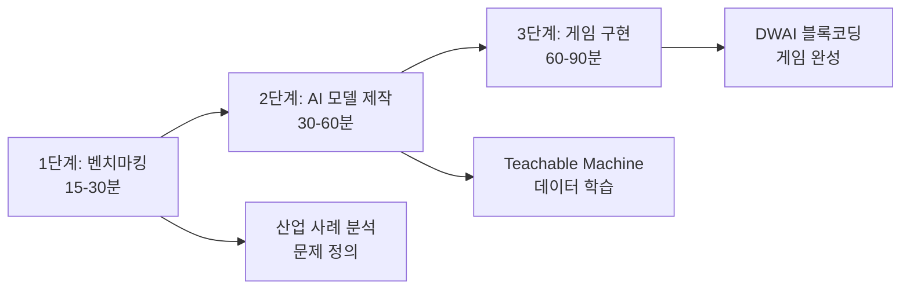

DWAI 키트에 대해 검색하여 자세한 정보를 찾아드리겠습니다.

[6 tools called]

좋은 정보를 찾았습니다! 문서 내에서 **DWAI 키트**에 대한 정보를 발견했습니다. DWAI는 "**Dancing with AI**"의 약자로, 초등학생을 위한 블록 코딩 AI 교육 플랫폼입니다. 자세한 내용을 정리해드리겠습니다.

[4 tools called]

프로젝트 문서에서 **DWAI 키트**에 대한 상세한 정보를 찾았습니다! 자세히 설명해드리겠습니다.

## 🎯 DWAI 키트 개요

**DWAI**는 "**Dancing with AI**"의 약자로, 초등학생을 위한 **블록 코딩 기반 AI 교육 플랫폼**입니다.

### 📋 기본 정보

| 항목 | 내용 |
|------|------|
| **제품명** | DWAI (Dancing with AI) 키트 |
| **가격** | 약 20만원 |
| **대상 학년** | 초등 5~6학년 (중학교 1학년까지 확장 가능) |
| **플랫폼** | 웹 브라우저 기반 (https://dwai.ai) |
| **비용** | 무료 사용 가능 |
| **사용 방식** | 온라인 블록 코딩 |

---

## 🎨 주요 기능

### 1. **AI 비전 기능**
- ✅ **얼굴 인식 (Face Tracking)**: 얼굴 위치 좌표 실시간 추적
- ✅ **손 인식 (Hand Tracking)**: 손 위치 좌표 실시간 추적
- ✅ **이미지 분류**: Teachable Machine 연동
- ✅ **실시간 카메라 입력**: 웹캠을 통한 실시간 인식

### 2. **블록 코딩 인터페이스**
- 스크래치 스타일의 드래그 앤 드롭 블록
- 순차, 반복, 조건문 등 기본 프로그래밍 개념
- AI 전용 블록 제공

### 3. **Teachable Machine 연동**
- TM으로 학습한 AI 모델을 DWAI에 바로 연동
- 분류 모델과 좌표 추적 모델을 조합하여 사용 가능

---

## 🎮 활용 프로젝트 예시

문서에서 소개된 DWAI 활용 프로젝트들:

### **초급 프로젝트 (3~6시간)**

1. **가위바위보 AI 게임**
   - Teachable Machine으로 가위/바위/보 학습
   - DWAI에서 게임 로직 구현
   - 실시간 승부 판정

2. **마스크 인식 시스템**
   - 착용/미착용/잘못 착용 3가지 분류
   - 방역 시스템 시뮬레이션
   - 공항/병원 적용 사례 학습

3. **과일 자르기 게임**
   - DWAI Hand Tracking 기능 사용
   - 손 좌표로 오브젝트 제어
   - 게임 점수 시스템 구현

### **중급 프로젝트 (6~12시간)**

4. **출입 관리 시스템**
   - 얼굴 인식 + 분류 조합
   - 등록된 얼굴 자동 감지
   - Face ID 기술 체험

5. **터치리스 UI 조작**
   - 비접촉 키오스크 시뮬레이션
   - 손 제스처로 버튼 클릭
   - 코로나 시대 대응 기술

6. **분리수거 자동화 시스템**
   - 쓰레기 종류 분류 (플라스틱/종이/캔)
   - 실시간 분류 및 통계
   - 환경 문제 해결

---

## 🎓 교육 방법론: 3단계 학습법

DWAI를 활용한 교육은 다음 3단계로 진행됩니다:

### **1단계: 벤치마킹**
- 실제 산업에서 사용되는 AI 비전 기술 사례 학습
- 예: Apple Face ID, 무인 편의점, VR 컨트롤러

### **2단계: AI 모델 제작**
- Teachable Machine에서 웹캠으로 데이터 수집
- 클래스별 학습 (각 30~60초)
- 모델 테스트 및 개선

### **3단계: DWAI 게임 구현**
- TM 모델을 DWAI에 연동
- 블록 코딩으로 게임 로직 구현
- 점수, 효과음, UI 추가

---

## 📊 Teachable Machine vs DWAI Tracking 차이점

| 구분 | Teachable Machine (TM) | DWAI Tracking |
|------|------------------------|---------------|
| **기능** | 이미지 분류 (Classification) | 좌표 추적 (Tracking) |
| **출력** | 클래스 이름 + 확률 | X, Y 좌표값 |
| **예시** | 마스크 착용 여부 판단 | 얼굴/손 위치 실시간 추적 |
| **학습** | 필요 (사용자가 데이터 학습) | 불필요 (내장 모델) |
| **활용** | 분류, 판별 | 움직임 제어, 좌표 기반 게임 |

### **조합 사용 예시**
- TM으로 "마스크 착용 여부" 분류 + DWAI로 "얼굴 위치" 추적
- TM으로 "가위/바위/보" 판단 + DWAI로 "손 위치" 추적

---

## 🏫 교육 과정 활용 사례

### **초등학교 5학년 연간 커리큘럼**
- **6월**: AI 이미지 인식 (DWAI + Teachable Machine)
  - 가위바위보 AI 게임 제작
  - 8시간 수업
  - 프로젝트 기반 학습

### **초등 4~6학년 AI 교육 과정**
- 블록 코딩 기초 및 심화
- DWAI 플랫폼 사용법
- Teachable Machine 연동
- 총 34시간 (연간)

### **중학교 1학년 과정**
- DWAI, ChatGPT, Arduino 통합
- 피지컬 컴퓨팅과 융합
- 실생활 문제 해결 프로젝트

---

## 💻 필요 준비물

| 항목 | 사양 |
|------|------|
| **노트북** | 웹캠 내장 필수 |
| **인터넷** | 안정적인 WiFi 연결 |
| **브라우저** | Chrome 권장 |
| **추가 장비** | 없음 (웹 기반) |

---

## 🎯 교육 효과

### **학습 목표**
- ✅ AI 컴퓨터 비전의 원리 이해
- ✅ 블록 코딩을 통한 프로그래밍 사고력
- ✅ 실생활 문제를 AI로 해결하는 경험
- ✅ 데이터 수집, 학습, 테스트의 전체 과정 체험

### **역량 발달**
- **창의적 문제 해결**: 실제 산업 사례에서 문제 발견
- **컴퓨팅 사고력**: 순차, 반복, 조건 구조 이해
- **AI 리터러시**: AI의 작동 원리와 한계 이해
- **협업 능력**: 2인 1팀 프로젝트

---

## 🔗 관련 링크

- **DWAI 공식 사이트**: https://dancingwithai.media.mit.edu/
- **Teachable Machine**: https://teachablemachine.withgoogle.com/

---

## 📝 추가 정보

DWAI는 한국 AI 교육 현장에서 **초등학생 대상 블록 코딩 AI 입문용**으로 많이 활용되고 있으며, **무료로 사용 가능**한 점이 큰 장점입니다. Teachable Machine과의 연동을 통해 학생들이 직접 AI 모델을 학습시키고 게임을 만드는 전 과정을 경험할 수 있습니다.

DWAI 키트에 대해 더 궁금하신 점이 있으시면 말씀해주세요! 😊