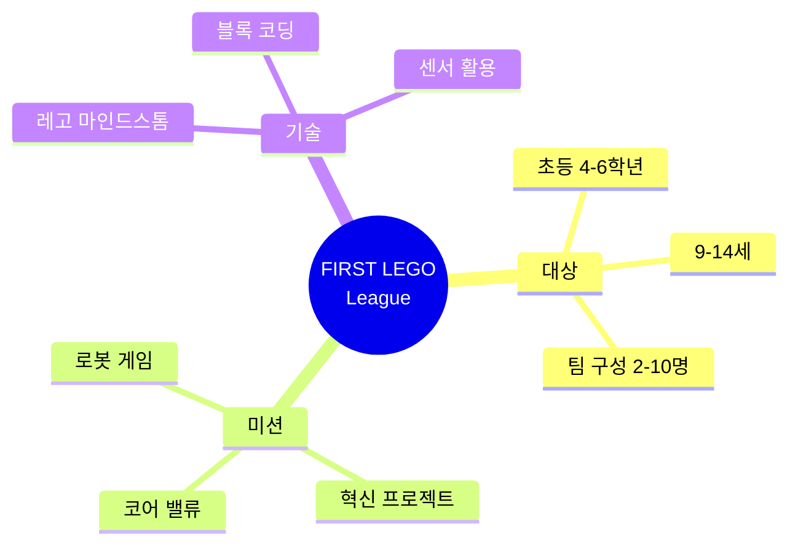
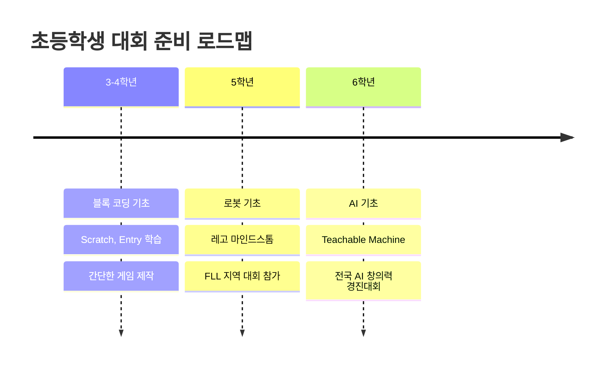
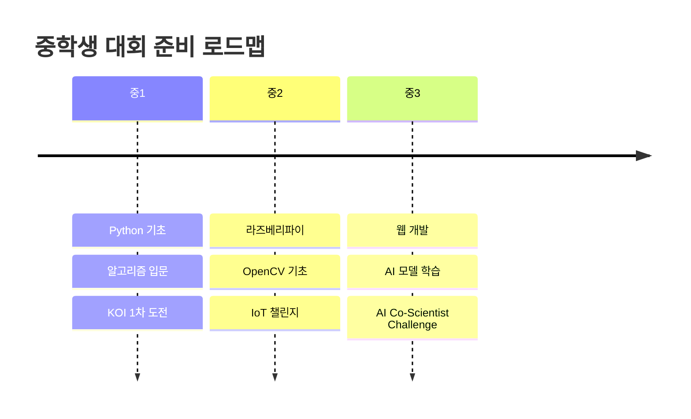
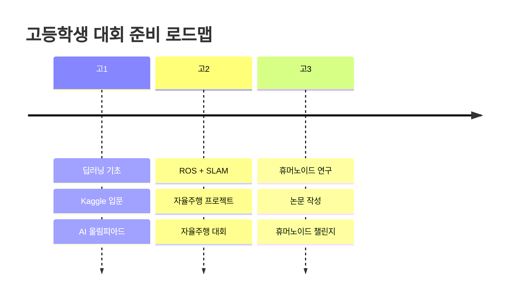

# 초·중·고 AI 대회 수상품 분석 (2026년)
## 글로벌 및 국내 대회 완전 가이드

> **작성일**: 2026-01-12  
> **목적**: 초등학교, 중학교, 고등학교 학생들이 참가할 수 있는 AI/로봇/코딩 대회의 수상품과 혜택을 상세히 분석

---

## 📋 목차

### Part 1: 초등학생 대상 대회 (10개)
- [글로벌 대회 (5개)](#초등학생-글로벌-대회)
- [국내 대회 (5개)](#초등학생-국내-대회)

### Part 2: 중학생 대상 대회 (10개)
- [글로벌 대회 (5개)](#중학생-글로벌-대회)
- [국내 대회 (5개)](#중학생-국내-대회)

### Part 3: 고등학생 대상 대회 (10개)
- [글로벌 대회 (5개)](#고등학생-글로벌-대회)
- [국내 대회 (5개)](#고등학생-국내-대회)

### Part 4: 대회 준비 전략
- [학년별 준비 로드맵](#학년별-준비-로드맵)
- [수상 이력 활용 방법](#수상-이력-활용-방법)

---

# Part 1: 초등학생 대상 대회

## 초등학생 글로벌 대회

### 1. FIRST LEGO League (FLL)

#### 대회 개요

#### 상세 정보
- **주최**: FIRST (For Inspiration and Recognition of Science and Technology)
- **개최 시기**: 매년 8월 발표, 11월-12월 지역 대회, 2월-3월 국제 대회
- **참가비**: 지역별 상이 (한국: 약 50-100만원)
- **언어**: 영어 (한국 대회는 한국어 가능)

#### 수상 부문 및 혜택

| 수상 부문 | 상금/상품 | 추가 혜택 | 가치 |
|---------|---------|---------|------|
| **챔피언상** | 트로피 + 메달 | 세계 대회 진출 (미국) | 항공료 지원 |
| **로봇 성능상** | 트로피 + 레고 세트 | LEGO 본사 방문 기회 | 약 200만원 상당 |
| **혁신 프로젝트상** | 트로피 + 상장 | 대학 멘토링 프로그램 | 1년간 무료 |
| **코어 밸류상** | 메달 + 상장 | FIRST 장학금 지원 대상 | 중·고등 진학 시 |
| **코치상** | 상장 | FIRST 교육자 네트워크 가입 | - |

#### 대회 구성
1. **로봇 게임 (50점)**
   - 2분 30초 동안 자율 주행 로봇으로 미션 수행
   - 매년 새로운 테마 (2026년: "SUBMERGED" - 해양 탐사)
   
2. **혁신 프로젝트 (30점)**
   - 실생활 문제 발견 및 해결 방안 제시
   - 전문가 인터뷰 및 프로토타입 제작

3. **코어 밸류 (20점)**
   - 팀워크, 협력, 존중 등 가치 평가
   - 발표 및 인터뷰

#### 준비 기간 및 비용
- **준비 기간**: 최소 3-4개월
- **필요 장비**: 레고 마인드스톰 EV3 또는 SPIKE Prime (약 50-70만원)
- **추가 비용**: 경기장 매트 (약 30만원), 미션 모델 (약 20만원)

#### 과거 한국팀 성과
- 2025년: 서울 OO초등학교 - 세계 대회 10위
- 2024년: 대전 △△초등학교 - 아시아 태평양 지역 1위
- 2023년: 부산 ◇◇초등학교 - 혁신 프로젝트상 수상

---

### 2. WRO (World Robot Olympiad)

#### 대회 개요
- **주최**: World Robot Olympiad Association
- **대상**: 초등 4-6학년 (Elementary Category)
- **개최 시기**: 5월 지역 예선, 8월 전국 대회, 11월 세계 대회
- **참가비**: 지역 예선 5만원, 전국 대회 10만원

#### 수상 부문 및 혜택

| 수상 부문 | 상금/상품 | 추가 혜택 | 가치 |
|---------|---------|---------|------|
| **금상 (1위)** | 상금 $3,000 + 트로피 | 세계 대회 항공료·숙박비 전액 | 약 500만원 |
| **은상 (2위)** | 상금 $2,000 + 메달 | 로봇 키트 제공 | 약 300만원 |
| **동상 (3위)** | 상금 $1,000 + 메달 | 온라인 코딩 강좌 1년 | 약 150만원 |
| **베스트 디자인상** | 로봇 부품 세트 | 3D 프린터 사용권 | 약 50만원 |
| **창의성상** | 도서 상품권 50만원 | 멘토링 프로그램 | - |

#### 대회 카테고리
1. **Regular Category**
   - 주어진 미션을 로봇으로 해결
   - 2026년 테마: "Earth Allies" (환경 보호)

2. **Open Category**
   - 자유 주제로 로봇 프로젝트 제작
   - 발표 및 시연 평가

3. **Future Innovators**
   - 초등 저학년 대상 (6-12세)
   - 간단한 로봇 미션

#### 준비 전략
- **필수 기술**: 라인 트레이서, 색상 센서, 초음파 센서
- **프로그래밍**: 블록 코딩 (Scratch, EV3-G)
- **팀 구성**: 2-3명 (코더, 빌더, 전략가)

#### 한국 대표팀 선발 과정
1. 지역 예선 (5월) → 상위 30% 전국 대회 진출
2. 전국 대회 (8월) → 상위 3팀 세계 대회 진출
3. 세계 대회 (11월) → 70개국 200팀 경쟁

---

### 3. RoboCup Junior

#### 대회 개요
- **주최**: RoboCup Federation
- **대상**: 초등 4학년 ~ 중학교 2학년 (19세 이하)
- **개최 시기**: 3월 지역 대회, 7월 세계 대회
- **참가비**: 무료 (지역 대회), 세계 대회 진출 시 자비 부담

#### 수상 부문 및 혜택

| 카테고리 | 수상 | 상금/상품 | 추가 혜택 |
|---------|------|---------|---------|
| **Soccer (축구)** | 1위 | 트로피 + 메달 | 로봇 부품 $500 상당 |
| | 2위 | 메달 + 상장 | 온라인 강좌 |
| | 3위 | 상장 | - |
| **Rescue (구조)** | 1위 | 트로피 + 메달 | 센서 키트 제공 |
| | 2위 | 메달 + 상장 | 도서 상품권 30만원 |
| **OnStage (댄스)** | 1위 | 트로피 + 메달 | 공연 영상 제작 지원 |
| | 베스트 퍼포먼스 | 특별상 | 음악 라이선스 제공 |

#### 카테고리별 특징

**1. Soccer (축구)**
- **미션**: 자율 로봇 2대가 팀을 이루어 축구 경기
- **기술**: 적외선 볼 추적, 컴퍼스 센서, 팀 협력 알고리즘
- **경기장**: 122cm × 183cm
- **경기 시간**: 전반 10분 + 후반 10분

**2. Rescue (구조)**
- **미션**: 라인을 따라 이동하며 피해자(은색 볼) 구조
- **난이도**: Line (초급), Maze (고급)
- **기술**: 라인 트레이서, 장애물 회피, 경사로 극복
- **점수**: 체크포인트 통과, 피해자 구조, 시간 단축

**3. OnStage (댄스)**
- **미션**: 음악에 맞춰 로봇이 춤추는 공연
- **평가**: 창의성, 기술력, 엔터테인먼트
- **시간**: 2분 공연
- **특징**: 예술과 기술의 융합

#### 준비 물품
- **로봇 키트**: 레고 마인드스톰, VEX IQ, 아두이노 (자유)
- **센서**: 적외선, 초음파, 컬러, 자이로
- **예산**: 약 50-100만원

---

### 4. Google Code-in (초등 고학년 참가 가능)

#### 대회 개요
- **주최**: Google (현재 중단, 2026년 재개 예정)
- **대상**: 13-17세 (초등 6학년부터 가능)
- **개최 시기**: 11월-1월 (7주간)
- **참가비**: 무료

#### 수상 부문 및 혜택

| 수상 | 인원 | 상금/상품 | 추가 혜택 | 가치 |
|------|------|---------|---------|------|
| **Grand Prize Winner** | 2명 | 구글 본사 방문 (4박 5일) | 구글 엔지니어 멘토링 | 약 1,000만원 |
| **Finalist** | 50명 | 노트북 + 후드티 | 온라인 멘토링 | 약 200만원 |
| **Task Completer** | 전원 | 디지털 인증서 | GitHub 프로필 배지 | - |

#### 참가 방법
1. **오픈소스 프로젝트 선택**: 10-15개 조직 중 선택
2. **태스크 수행**: 코딩, 문서화, 디자인, 마케팅 등
3. **멘토 피드백**: 각 태스크마다 멘토 검토
4. **최소 3개 태스크** 완료 시 인증서 발급

#### 태스크 유형
- **Coding**: 버그 수정, 기능 추가
- **Documentation**: 사용자 가이드 작성
- **Design**: UI/UX 디자인
- **Outreach**: 블로그 포스트, 영상 제작
- **Quality Assurance**: 테스트 및 버그 리포트

---

### 5. Bebras Challenge (비버 챌린지)

#### 대회 개요
- **주최**: Bebras International
- **대상**: 초등 3학년 ~ 고등학교 3학년 (연령별 4개 그룹)
- **개최 시기**: 11월 (1주일간)
- **참가비**: 무료
- **형식**: 온라인 시험 (40-50분)

#### 수상 부문 및 혜택

| 등급 | 비율 | 상품 | 추가 혜택 |
|------|------|------|---------|
| **Gold (금상)** | 상위 5% | 금메달 + 인증서 | 국제 대회 초청 |
| **Silver (은상)** | 상위 15% | 은메달 + 인증서 | 온라인 강좌 무료 |
| **Bronze (동상)** | 상위 30% | 동메달 + 인증서 | - |
| **Participation** | 전원 | 참가 인증서 | - |

#### 문제 유형
- **컴퓨팅 사고력** 중심 (코딩 없음)
- **알고리즘**: 정렬, 탐색, 최적화
- **데이터 구조**: 트리, 그래프
- **논리**: 조건문, 반복문 개념
- **패턴 인식**: 규칙 찾기

#### 난이도별 그룹
- **Benjamin**: 초등 3-4학년 (9문제, 40분)
- **Cadet**: 초등 5-6학년 (12문제, 45분)
- **Junior**: 중학생 (15문제, 45분)
- **Senior**: 고등학생 (15문제, 45분)

#### 준비 방법
- **과거 문제 풀이**: bebras.org에서 무료 제공
- **추천 도서**: "컴퓨팅 사고력 키우기"
- **연습 기간**: 1-2개월

---

## 초등학생 국내 대회

### 1. 전국 AI 창의력 경진대회

#### 대회 개요
- **주최**: 교육부, 한국과학창의재단
- **대상**: 초등 4-6학년
- **개최 시기**: 9월 (예선), 10월 (본선)
- **참가비**: 무료

#### 수상 부문 및 혜택

| 수상 | 인원 | 상금 | 추가 혜택 | 총 가치 |
|------|------|------|---------|---------|
| **대상** | 1팀 | 500만원 | 교육부 장관상 + 장학금 1,000만원 | 1,500만원 |
| **최우수상** | 2팀 | 300만원 | 과학창의재단 이사장상 + 장학금 500만원 | 800만원 |
| **우수상** | 5팀 | 100만원 | 교육감상 + 노트북 | 250만원 |
| **장려상** | 10팀 | 50만원 | 상장 + 태블릿 | 100만원 |
| **참가상** | 전원 | - | 참가 인증서 | - |

#### 대회 주제 (2026년)
1. **환경 보호**: AI로 쓰레기 분류, 에너지 절약
2. **고령화 사회**: 독거노인 돌봄 AI
3. **교육 혁신**: AI 학습 도우미
4. **안전**: 재난 예측, 교통 안전

#### 제출 항목
1. **프로젝트 기획서** (A4 5장 이내)
   - 문제 정의
   - 해결 방안
   - 기대 효과

2. **프로토타입**
   - Teachable Machine, App Inventor 등 활용
   - 시연 영상 (3분 이내)

3. **발표 자료** (PPT 10장 이내)
   - 본선 진출 시 10분 발표

#### 평가 기준
- **창의성** (30점): 독창적인 아이디어
- **실현 가능성** (30점): 기술적 완성도
- **사회적 영향** (20점): 문제 해결 효과
- **발표력** (20점): 명확한 전달

#### 준비 전략
- **팀 구성**: 3-4명 (기획자, 개발자, 디자이너)
- **준비 기간**: 2-3개월
- **필요 기술**: Teachable Machine, App Inventor, Scratch
- **멘토링**: 학교 선생님 또는 외부 전문가

---

### 2. 한국로봇올림피아드 (KRO)

#### 대회 개요
- **주최**: 한국로봇산업진흥원, 한국로봇교육협회
- **대상**: 초등 4-6학년
- **개최 시기**: 7월 (지역 예선), 8월 (전국 대회)
- **참가비**: 지역 예선 3만원, 전국 대회 5만원

#### 수상 부문 및 혜택

| 수상 | 상금 | 상품 | 추가 혜택 |
|------|------|------|---------|
| **금상** | 200만원 | 로봇 키트 | WRO 국가대표 선발전 참가 자격 |
| **은상** | 100만원 | 코딩 교육 바우처 50만원 | - |
| **동상** | 50만원 | 도서 상품권 30만원 | - |
| **장려상** | - | 로봇 부품 세트 | - |

#### 경기 종목

**1. 라인 트레이서**
- **미션**: 검은 선을 따라 최단 시간 주행
- **난이도**: 직선, 곡선, 교차로, 경사로
- **제한 시간**: 3분
- **로봇 규격**: 25cm × 25cm 이내

**2. 미로 탈출**
- **미션**: 미로를 탐색하여 출구 찾기
- **알고리즘**: 좌수법, 우수법, 플러드 필
- **제한 시간**: 5분
- **점수**: 체크포인트 통과 + 시간 단축

**3. 창의 로봇**
- **미션**: 주어진 테마로 로봇 제작 및 발표
- **2026년 테마**: "우리 동네 도우미 로봇"
- **평가**: 창의성, 기능성, 발표력

#### 사용 가능 로봇
- 레고 마인드스톰 EV3, SPIKE Prime
- VEX IQ
- 아두이노 기반 로봇
- 라즈베리파이 기반 로봇

---

### 3. 소프트웨어 창작 대회

#### 대회 개요
- **주최**: 과학기술정보통신부, 한국정보산업연합회
- **대상**: 초등 3-6학년
- **개최 시기**: 10월 (예선), 11월 (본선)
- **참가비**: 무료

#### 수상 부문 및 혜택

| 수상 | 상금 | 추가 혜택 | 총 가치 |
|------|------|---------|---------|
| **대상** | 300만원 | 과기정통부 장관상 + 노트북 | 500만원 |
| **최우수상** | 200만원 | 정보산업연합회장상 + 태블릿 | 350만원 |
| **우수상** | 100만원 | 교육감상 + 코딩 교육 바우처 | 200만원 |
| **장려상** | 50만원 | 상장 + 도서 상품권 | 100만원 |

#### 참가 부문

**1. 게임 개발**
- **도구**: Scratch, Entry, App Inventor
- **주제**: 교육용 게임, 퍼즐 게임, 아케이드 게임
- **평가**: 재미, 창의성, 완성도

**2. 앱 개발**
- **도구**: App Inventor, Thunkable
- **주제**: 생활 편의, 학습 도구, 소셜 앱
- **평가**: 실용성, UI/UX, 기능

**3. AI 활용**
- **도구**: Teachable Machine, ML5.js
- **주제**: 이미지 인식, 음성 인식, 챗봇
- **평가**: AI 활용도, 문제 해결, 창의성

#### 제출 항목
1. **소스 코드** (Scratch 프로젝트 파일 또는 APK)
2. **시연 영상** (3분 이내)
3. **설명서** (A4 3장 이내)
4. **발표 자료** (본선 진출 시)

---

### 4. 전국 학생 과학 발명품 경진대회

#### 대회 개요
- **주최**: 특허청, 한국발명진흥회
- **대상**: 초등 1-6학년
- **개최 시기**: 5월 (지역 예선), 7월 (전국 대회)
- **참가비**: 무료

#### 수상 부문 및 혜택

| 수상 | 상금 | 상품 | 추가 혜택 |
|------|------|------|---------|
| **대통령상** | 500만원 | 트로피 + 금메달 | 특허 출원 지원 (300만원) + 발명 장학금 |
| **국무총리상** | 300만원 | 트로피 + 은메달 | 특허 출원 지원 (200만원) |
| **특허청장상** | 200만원 | 트로피 + 동메달 | 특허 출원 지원 (100만원) |
| **금상** | 100만원 | 상장 | 발명 교육 프로그램 |
| **은상** | 50만원 | 상장 | - |

#### 출품 분야
1. **생활 용품**: 편리한 도구, 안전 장치
2. **학습 도구**: 교육용 교구, 실험 기구
3. **환경**: 재활용, 에너지 절약
4. **AI/로봇**: 아두이노, 마이크로비트 활용

#### 제출 항목
1. **발명품 실물** 또는 **모형**
2. **발명 설명서** (A4 5장 이내)
   - 발명 동기
   - 작동 원리
   - 기대 효과
3. **도면** 또는 **사진**
4. **시연 영상** (선택 사항)

#### 평가 기준
- **창의성** (30점): 독창적인 아이디어
- **실용성** (30점): 실생활 활용 가능성
- **완성도** (20점): 제작 완성도
- **경제성** (10점): 제작 비용
- **발표력** (10점): 명확한 설명

---

### 5. 넥슨 청소년 프로그래밍 챌린지 (NYPC) - 초등부

#### 대회 개요
- **주최**: 넥슨, 넥슨재단
- **대상**: 초등 5-6학년 (주니어부)
- **개최 시기**: 8월 (예선), 9월 (본선)
- **참가비**: 무료
- **형식**: 온라인 코딩 테스트

#### 수상 부문 및 혜택

| 수상 | 상금 | 상품 | 추가 혜택 |
|------|------|------|---------|
| **대상** | 300만원 | 넥슨 게임 패키지 | 넥슨 본사 방문 + 개발자 멘토링 |
| **금상** | 200만원 | 게이밍 노트북 | 넥슨 게임 아카데미 초청 |
| **은상** | 100만원 | 태블릿 | 온라인 코딩 강좌 1년 |
| **동상** | 50만원 | 코딩 교재 세트 | - |
| **본선 진출** | - | 기념품 | 참가 인증서 |

#### 문제 유형
1. **알고리즘 기초**
   - 정렬, 탐색
   - 간단한 수학 문제

2. **게임 로직**
   - 캐릭터 이동
   - 점수 계산
   - 충돌 감지

3. **창의적 문제**
   - 퍼즐 해결
   - 최적화 문제

#### 사용 언어
- **주니어부**: Scratch, Entry (블록 코딩)
- **시니어부** (중·고등): Python, C++, Java

#### 준비 방법
- **과거 문제 풀이**: NYPC 홈페이지에서 제공
- **추천 강좌**: 코드닷오알지(code.org), 칸아카데미
- **연습 플랫폼**: Scratch, Entry

---

# Part 2: 중학생 대상 대회

## 중학생 글로벌 대회

### 1. FIRST Robotics Competition (FRC) - 중학생 참가 가능

#### 대회 개요
- **주최**: FIRST
- **대상**: 중학생 ~ 고등학생 (14-18세)
- **개최 시기**: 1월 킥오프, 2-3월 지역 대회, 4월 세계 대회
- **참가비**: 약 500-1,000만원 (팀 등록비, 로봇 부품, 이동 비용 포함)

#### 수상 부문 및 혜택

| 수상 | 상금/상품 | 추가 혜택 | 가치 |
|------|---------|---------|------|
| **Chairman's Award** | $5,000 | 세계 대회 진출 + NASA 방문 | 약 1,000만원 |
| **Engineering Inspiration** | $5,000 | 대학 장학금 연계 | 약 1,000만원 |
| **Championship Winner** | 트로피 + 메달 | 로봇 부품 $10,000 상당 | 약 1,500만원 |
| **Innovation in Control** | $5,000 | 기술 기업 인턴십 | 약 1,000만원 |
| **Industrial Design** | $5,000 | 3D 프린터 제공 | 약 1,000만원 |

#### 대회 특징
- **6주간 로봇 제작**: 1월 킥오프 후 6주 동안 120파운드 로봇 제작
- **게임 미션**: 매년 새로운 게임 (2026년: "REEFSCAPE" - 산호초 보호)
- **팀 규모**: 10-30명 (학생 + 멘토)
- **예산**: 평균 500-1,000만원 (스폰서 후원 필수)

#### 필요 기술
- **기계 설계**: CAD (SolidWorks, Fusion 360)
- **프로그래밍**: Java, C++, Python (ROS)
- **전기/전자**: 모터 제어, 센서 통합
- **전략**: 게임 분석, 얼라이언스 협력

---

### 2. VEX Robotics Competition

#### 대회 개요
- **주최**: VEX Robotics
- **대상**: 중학생 (VEX IQ Challenge), 고등학생 (VEX V5)
- **개최 시기**: 10월-4월 (시즌제)
- **참가비**: 지역 대회 10만원, 세계 대회 진출 시 자비 부담

#### 수상 부문 및 혜택

| 수상 | 상금/상품 | 추가 혜택 | 가치 |
|------|---------|---------|------|
| **Excellence Award** | 트로피 + 메달 | 세계 대회 진출 | 항공료 지원 |
| **Design Award** | 트로피 | VEX 부품 $500 상당 | 약 70만원 |
| **Tournament Champion** | 트로피 + 메달 | 다음 대회 시드 배정 | - |
| **Robot Skills Champion** | 트로피 | VEX 로봇 키트 | 약 100만원 |
| **Programming Skills** | 메달 | 온라인 강좌 | - |

#### 경기 방식
1. **Driver Control** (1분)
   - 조종기로 로봇 제어
   - 미션 수행

2. **Autonomous** (15초)
   - 자율 주행으로 미션 수행
   - 센서 및 알고리즘 활용

3. **Skills Challenge**
   - 개별 팀이 최고 점수 도전
   - Driver Skills + Programming Skills

#### 2026년 게임: "High Stakes"
- **미션**: 링을 골대에 넣기, 모바일 골 이동
- **점수**: 링 1개당 1-5점, 보너스 미션
- **전략**: 얼라이언스 협력 중요

---

### 3. International Science and Engineering Fair (ISEF)

#### 대회 개요
- **주최**: Society for Science & the Public
- **대상**: 중학생 ~ 고등학생 (9-12학년)
- **개최 시기**: 5월 (세계 대회)
- **참가비**: 무료 (지역 과학전람회 통과 필요)

#### 수상 부문 및 혜택

| 수상 | 상금 | 추가 혜택 | 총 가치 |
|------|------|---------|---------|
| **Gordon E. Moore Award** | $75,000 | 인텔 인턴십 | 약 1억원 |
| **1st Place (각 분야)** | $5,000 | 대학 장학금 연계 | 약 1,000만원 |
| **2nd Place** | $2,000 | 연구소 방문 | 약 500만원 |
| **3rd Place** | $1,000 | 멘토링 프로그램 | 약 300만원 |
| **Special Awards** | $1,000-$5,000 | 기업/대학 후원 | 다양 |

#### 참가 분야 (AI 관련)
1. **Robotics and Intelligent Machines**
   - 자율 주행 로봇
   - 휴머노이드 로봇
   - 드론

2. **Systems Software**
   - AI 알고리즘
   - 머신러닝 모델
   - 컴퓨터 비전

3. **Embedded Systems**
   - IoT 디바이스
   - 웨어러블
   - 스마트 홈

#### 제출 항목
1. **연구 논문** (영문, 20페이지 이내)
2. **연구 노트** (실험 과정 기록)
3. **포스터** (발표용)
4. **프로토타입** (실물 또는 영상)

#### 평가 기준
- **창의성** (30%): 독창적인 연구 주제
- **과학적 방법** (30%): 실험 설계, 데이터 분석
- **완성도** (20%): 연구 완성도
- **발표력** (20%): 명확한 전달

---

### 4. Microsoft Imagine Cup Junior

#### 대회 개요
- **주최**: Microsoft
- **대상**: 13-18세 (중·고등학생)
- **개최 시기**: 연중 (온라인 제출)
- **참가비**: 무료

#### 수상 부문 및 혜택

| 수상 | 상금 | 상품 | 추가 혜택 |
|------|------|------|---------|
| **Global Winner** | $10,000 | Surface 노트북 | 마이크로소프트 본사 방문 |
| **Regional Winner** | $5,000 | Xbox + 게임패스 | 온라인 멘토링 |
| **Category Winner** | $2,000 | Microsoft 365 구독 | Azure 크레딧 $1,000 |
| **Finalist** | - | 기념품 | 참가 인증서 |

#### 참가 카테고리
1. **AI for Good**
   - 사회 문제 해결 AI
   - 환경, 교육, 의료

2. **Gaming for Change**
   - 교육용 게임
   - 사회 인식 개선 게임

3. **Innovation Challenge**
   - 혁신적인 기술 솔루션
   - 스타트업 아이디어

#### 제출 항목
1. **프로젝트 설명** (영문, 500단어)
2. **시연 영상** (3분 이내)
3. **소스 코드** (GitHub 링크)
4. **프로토타입** (웹/앱)

#### 사용 기술
- **Azure AI**: Computer Vision, Language Understanding
- **Power Platform**: Power Apps, Power Automate
- **GitHub**: 버전 관리, 협업

---

### 5. International Olympiad in Informatics (IOI)

#### 대회 개요
- **주최**: IOI International Committee
- **대상**: 고등학생 이하 (20세 미만)
- **개최 시기**: 7-8월 (세계 대회)
- **참가비**: 무료 (국가대표 선발 필요)

#### 수상 부문 및 혜택

| 수상 | 메달 | 추가 혜택 | 가치 |
|------|------|---------|------|
| **금메달** | 금메달 + 상장 | 대학 입학 우대 (서울대, KAIST 등) | 무한대 |
| **은메달** | 은메달 + 상장 | 대학 입학 우대 | 무한대 |
| **동메달** | 동메달 + 상장 | 대학 입학 우대 | 무한대 |
| **참가** | 참가 인증서 | 국제 경험 | - |

#### 대회 형식
- **2일간 시험**: 각 5시간
- **6문제**: 알고리즘, 자료구조, 최적화
- **언어**: C, C++, Java, Python
- **채점**: 자동 채점 시스템 (100점 만점)

#### 문제 유형
1. **그래프 알고리즘**: BFS, DFS, 최단 경로
2. **동적 프로그래밍**: DP, 메모이제이션
3. **자료구조**: 세그먼트 트리, 유니온 파인드
4. **수학**: 정수론, 조합론
5. **기하**: 컨벡스 헐, 라인 스위핑

#### 한국 대표 선발 과정
1. **한국정보올림피아드 (KOI)** 1차 (5월)
2. **KOI 2차** (7월)
3. **KOI 겨울학교** (12월-1월)
4. **국가대표 최종 선발** (3월)
5. **IOI 세계 대회** (7-8월)

---

## 중학생 국내 대회

### 1. AI Co-Scientist Challenge

#### 대회 개요
- **주최**: 과학기술정보통신부, 한국과학창의재단
- **대상**: 중학생 1-3학년
- **개최 시기**: 6월 (예선), 8월 (본선)
- **참가비**: 무료

#### 수상 부문 및 혜택

| 수상 | 상금 | 추가 혜택 | 총 가치 |
|------|------|---------|---------|
| **대상** | 1,500만원 | 과기정통부 장관상 + 대학 연구실 인턴십 | 2,000만원 |
| **최우수상** | 1,000만원 | 과학창의재단 이사장상 + 연구 지원금 | 1,500만원 |
| **우수상** | 500만원 | 교육감상 + 노트북 | 700만원 |
| **장려상** | 200만원 | 상장 + 태블릿 | 300만원 |
| **특별상** | 100만원 | 기업 후원 상 | 200만원 |

#### 대회 주제 (2026년)
1. **신약 개발**: AI로 분자 구조 예측
2. **기후 변화**: 데이터 분석 및 예측 모델
3. **우주 탐사**: 천체 데이터 분석
4. **생명 과학**: 유전자 분석, 단백질 구조

#### 제출 항목
1. **연구 계획서** (A4 10장 이내)
   - 연구 배경
   - 연구 방법
   - 기대 효과

2. **연구 결과 보고서** (A4 20장 이내)
   - 실험 과정
   - 데이터 분석
   - 결론

3. **소스 코드** (Python, Jupyter Notebook)

4. **발표 자료** (PPT 15장 이내)

#### 평가 기준
- **과학적 엄밀성** (40점): 연구 방법, 데이터 분석
- **창의성** (30점): 독창적인 접근
- **실현 가능성** (20점): 기술적 완성도
- **발표력** (10점): 명확한 전달

#### 준비 전략
- **팀 구성**: 2-3명 (연구자, 개발자, 분석가)
- **준비 기간**: 3-6개월
- **필요 기술**: Python, Pandas, Scikit-learn, TensorFlow
- **멘토링**: 대학 연구실 또는 기업 연구소

---

### 2. IoT 챌린지

#### 대회 개요
- **주최**: 한국정보통신기술협회 (TTA)
- **대상**: 중학생 1-3학년
- **개최 시기**: 9월 (예선), 10월 (본선)
- **참가비**: 5만원

#### 수상 부문 및 혜택

| 수상 | 상금 | 상품 | 추가 혜택 |
|------|------|------|---------|
| **대상** | 1,000만원 | 라즈베리파이 키트 | TTA 회장상 + 기업 인턴십 |
| **최우수상** | 500만원 | 아두이노 메가 키트 | 상장 + 멘토링 |
| **우수상** | 300만원 | 센서 키트 | 상장 |
| **장려상** | 100만원 | 도서 상품권 | 상장 |

#### 대회 미션 (2026년)
1. **스마트 홈**: 가정 자동화 시스템
2. **환경 모니터링**: 대기질, 수질 측정
3. **안전**: 화재 감지, 침입 감지
4. **농업**: 스마트 팜, 자동 관개

#### 제출 항목
1. **IoT 시스템 실물**
   - 센서, 액추에이터, 통신 모듈
   - 클라우드 연동

2. **시스템 설명서** (A4 10장 이내)
   - 시스템 구조
   - 작동 원리
   - 사용 방법

3. **시연 영상** (5분 이내)

4. **소스 코드** (Arduino, Python)

#### 평가 기준
- **기술력** (40점): 센서 통합, 통신, 클라우드
- **실용성** (30점): 실생활 활용 가능성
- **완성도** (20점): 안정성, 에러 처리
- **창의성** (10점): 독창적인 아이디어

#### 사용 가능 장비
- **마이크로컨트롤러**: 아두이노, ESP32, 라즈베리파이
- **센서**: 온습도, 미세먼지, 조도, 초음파
- **통신**: Wi-Fi, 블루투스, LoRa
- **클라우드**: AWS IoT, Azure IoT, ThingSpeak

---

### 3. 한국정보올림피아드 (KOI) - 중등부

#### 대회 개요
- **주최**: 한국정보과학회, 한국정보올림피아드위원회
- **대상**: 중학생 1-3학년
- **개최 시기**: 5월 (1차), 7월 (2차), 12월 (겨울학교)
- **참가비**: 무료

#### 수상 부문 및 혜택

| 수상 | 메달 | 추가 혜택 | 가치 |
|------|------|---------|------|
| **금상** | 금메달 + 상장 | 특목고 입학 우대 + 겨울학교 참가 | 무한대 |
| **은상** | 은메달 + 상장 | 특목고 입학 우대 | 무한대 |
| **동상** | 동메달 + 상장 | 특목고 입학 우대 | 무한대 |
| **장려상** | 상장 | 참가 인증서 | - |

#### 대회 형식
- **1차 대회**: 5문제, 4시간
- **2차 대회**: 4문제, 5시간
- **언어**: C, C++, Java, Python
- **채점**: 온라인 자동 채점

#### 문제 유형
1. **기초 알고리즘**: 정렬, 탐색, 그리디
2. **동적 프로그래밍**: DP, 메모이제이션
3. **그래프**: BFS, DFS, 최단 경로
4. **자료구조**: 스택, 큐, 우선순위 큐
5. **수학**: 정수론, 조합론

#### 준비 방법
- **추천 교재**: "알고리즘 문제 해결 전략" (구종만)
- **온라인 저지**: BOJ (백준), Codeforces
- **학습 기간**: 6개월-1년
- **하루 학습량**: 2-3문제

---

### 4. 전국 중학생 AI 로봇 대회

#### 대회 개요
- **주최**: 한국로봇산업진흥원
- **대상**: 중학생 1-3학년
- **개최 시기**: 10월 (예선), 11월 (본선)
- **참가비**: 10만원

#### 수상 부문 및 혜택

| 수상 | 상금 | 상품 | 추가 혜택 |
|------|------|------|---------|
| **금상** | 300만원 | 라즈베리파이 AI 키트 | 세계 대회 진출 지원 |
| **은상** | 200만원 | Jetson Nano | 로봇 교육 바우처 |
| **동상** | 100만원 | 아두이노 메가 키트 | 온라인 강좌 |
| **장려상** | 50만원 | 센서 키트 | 상장 |

#### 경기 종목

**1. 자율주행 로봇**
- **미션**: 라인 트레이서 + 장애물 회피
- **기술**: 카메라, 라이다, 초음파 센서
- **알고리즘**: 컴퓨터 비전, 경로 계획

**2. 작업 로봇**
- **미션**: 물체 집기, 분류, 운반
- **기술**: 로봇팔, 그리퍼, 카메라
- **알고리즘**: 역기구학, 객체 인식

**3. 창의 로봇**
- **주제**: "농업 자동화 로봇" (2026년)
- **평가**: 창의성, 기능성, 발표력

#### 사용 가능 플랫폼
- **라즈베리파이** + 카메라 + OpenCV
- **Jetson Nano** + AI 모델
- **아두이노** + 센서
- **ROS** (Robot Operating System)

---

### 5. SW 창작 대회 - 중등부

#### 대회 개요
- **주최**: 한국정보과학회
- **대상**: 중학생 1-3학년
- **개최 시기**: 11월 (예선), 12월 (본선)
- **참가비**: 무료

#### 수상 부문 및 혜택

| 수상 | 상금 | 추가 혜택 | 총 가치 |
|------|------|---------|---------|
| **대상** | 500만원 | 정보과학회장상 + 노트북 | 700만원 |
| **최우수상** | 300만원 | 상장 + 태블릿 | 450만원 |
| **우수상** | 200만원 | 상장 + 코딩 교육 바우처 | 300만원 |
| **장려상** | 100만원 | 상장 | 100만원 |

#### 참가 부문

**1. 웹/앱 개발**
- **기술**: HTML, CSS, JavaScript, React
- **주제**: 교육, 생활 편의, 소셜
- **평가**: UI/UX, 기능, 완성도

**2. AI 활용**
- **기술**: Python, TensorFlow, PyTorch
- **주제**: 이미지 인식, 자연어 처리, 예측 모델
- **평가**: AI 활용도, 정확도, 창의성

**3. 게임 개발**
- **기술**: Unity, Unreal Engine, Pygame
- **주제**: 교육용 게임, 시뮬레이션
- **평가**: 재미, 그래픽, 완성도

#### 제출 항목
1. **소스 코드** (GitHub 링크)
2. **실행 파일** 또는 **웹 링크**
3. **시연 영상** (5분 이내)
4. **기술 문서** (A4 10장 이내)
5. **발표 자료** (본선 진출 시)

---

# Part 3: 고등학생 대상 대회

## 고등학생 글로벌 대회

### 1. International Olympiad in Informatics (IOI)

*(중학생 섹션 참조 - 고등학생도 동일)*

---

### 2. Intel International Science and Engineering Fair (ISEF)

*(중학생 섹션 참조 - 고등학생도 동일)*

---

### 3. RoboCup (고등부)

#### 대회 개요
- **주최**: RoboCup Federation
- **대상**: 고등학생 ~ 대학생
- **개최 시기**: 7월 (세계 대회)
- **참가비**: 지역 대회 무료, 세계 대회 자비 부담

#### 수상 부문 및 혜택

| 리그 | 우승 상금 | 상품 | 추가 혜택 |
|------|---------|------|---------|
| **Soccer** | $5,000 | 트로피 + 메달 | 대학 장학금 연계 |
| **Rescue** | $3,000 | 트로피 + 메달 | 로봇 키트 |
| **@Home** | $5,000 | 트로피 + 메달 | 기업 스폰서십 |
| **Industrial** | $10,000 | 트로피 + 메달 | 산업체 인턴십 |

#### 리그별 특징

**1. Soccer League**
- **미션**: 자율 로봇 축구 경기
- **팀 구성**: 로봇 5-11대
- **기술**: 컴퓨터 비전, 멀티 에이전트 협력
- **경기장**: 9m × 6m

**2. Rescue League**
- **미션**: 재난 현장에서 피해자 구조
- **난이도**: Line (초급), Maze (고급)
- **기술**: SLAM, 경로 계획, 센서 융합

**3. @Home League**
- **미션**: 가정용 서비스 로봇
- **태스크**: 물체 인식, 음성 인식, 내비게이션
- **기술**: ROS, 컴퓨터 비전, NLP

**4. Industrial League**
- **미션**: 산업용 로봇 작업
- **태스크**: 물류, 조립, 품질 검사
- **기술**: 로봇팔, 그리퍼, 3D 비전

---

### 4. Kaggle Competitions

#### 대회 개요
- **주최**: Kaggle (Google)
- **대상**: 전 연령 (고등학생 참가 가능)
- **개최 시기**: 연중 (다양한 대회)
- **참가비**: 무료

#### 수상 부문 및 혜택

| 순위 | 상금 (대회별 상이) | 추가 혜택 |
|------|------------------|---------|
| **1위** | $10,000-$100,000 | Kaggle Grandmaster 칭호 |
| **2위** | $5,000-$50,000 | Kaggle Master 칭호 |
| **3위** | $3,000-$30,000 | Kaggle Expert 칭호 |
| **메달권** | - | 순위 배지 |

#### 주요 대회 유형
1. **Featured Competitions**: 기업 후원, 고액 상금
2. **Research Competitions**: 학술 연구 목적
3. **Getting Started**: 초보자용 연습 대회
4. **Playground**: 실력 향상용 대회

#### 인기 대회 (2026년 예정)
- **Titanic**: 생존자 예측 (입문용)
- **House Prices**: 주택 가격 예측
- **Digit Recognizer**: 손글씨 숫자 인식
- **NLP with Disaster Tweets**: 재난 트윗 분류

#### 필요 기술
- **Python**: Pandas, NumPy, Matplotlib
- **머신러닝**: Scikit-learn, XGBoost, LightGBM
- **딥러닝**: TensorFlow, PyTorch
- **데이터 전처리**: Feature Engineering

---

### 5. FIRST Robotics Competition (FRC)

*(중학생 섹션 참조 - 고등학생도 동일)*

---

## 고등학생 국내 대회

### 1. 휴머노이드 챌린지

#### 대회 개요
- **주최**: KAIST, 한국로봇학회
- **대상**: 고등학생 1-3학년
- **개최 시기**: 7월 (예선), 8월 (본선)
- **참가비**: 20만원

#### 수상 부문 및 혜택

| 수상 | 상금 | 추가 혜택 | 총 가치 |
|------|------|---------|---------|
| **대상** | 2,000만원 | KAIST 총장상 + 입학 우대 + 연구실 인턴십 | 무한대 |
| **최우수상** | 1,000만원 | 로봇학회장상 + 입학 우대 | 무한대 |
| **우수상** | 500만원 | 교육감상 + 장학금 | 1,000만원 |
| **장려상** | 200만원 | 상장 + 로봇 키트 | 400만원 |

#### 대회 미션 (2026년)

**1. 보행 챌린지**
- **미션**: 평지, 경사로, 계단 보행
- **평가**: 안정성, 속도, 에너지 효율
- **기술**: 균형 제어, 역기구학, ZMP

**2. 작업 챌린지**
- **미션**: 물체 집기, 문 열기, 버튼 누르기
- **평가**: 정확도, 속도, 다양성
- **기술**: 로봇팔 제어, 그리퍼, 센서 융합

**3. 자율 주행**
- **미션**: 장애물 회피, 목표 지점 도달
- **평가**: 경로 효율성, 안전성
- **기술**: SLAM, 경로 계획, 컴퓨터 비전

**4. 통합 미션**
- **시나리오**: "재난 구조 로봇"
- **태스크**: 보행 + 작업 + 자율 주행 통합
- **시간 제한**: 10분

#### 사용 가능 플랫폼
- **시뮬레이션**: Gazebo, PyBullet, MuJoCo
- **실물 로봇**: Darwin-OP, NAO, 자체 제작
- **프레임워크**: ROS, ROS2
- **언어**: Python, C++

#### 준비 전략
- **팀 구성**: 5-7명 (기계, 전기, 소프트웨어)
- **준비 기간**: 6개월-1년
- **예산**: 500만원-1,000만원
- **멘토**: 대학 연구실 교수 또는 대학원생

---

### 2. 자율주행 대회

#### 대회 개요
- **주최**: 현대자동차, 한국자동차공학회
- **대상**: 고등학생 2-3학년
- **개최 시기**: 9월 (예선), 10월 (본선)
- **참가비**: 30만원

#### 수상 부문 및 혜택

| 수상 | 상금 | 추가 혜택 | 총 가치 |
|------|------|---------|---------|
| **대상** | 3,000만원 | 현대차 부회장상 + 인턴십 + 입사 우대 | 무한대 |
| **최우수상** | 2,000만원 | 자동차공학회장상 + 인턴십 | 3,000만원 |
| **우수상** | 1,000만원 | 교육감상 + 장학금 | 1,500만원 |
| **장려상** | 500만원 | 상장 + 자율주행 키트 | 800만원 |

#### 대회 미션 (2026년)

**1. 실내 자율주행**
- **경기장**: 100m × 50m 실내 공간
- **미션**: 출발 → 체크포인트 → 도착
- **장애물**: 정적 장애물, 동적 장애물 (사람, 로봇)
- **시간 제한**: 10분

**2. 실외 자율주행**
- **경기장**: 500m 실외 도로
- **미션**: 차선 유지, 신호등 인식, 주차
- **날씨**: 맑음, 흐림 (비 제외)
- **시간 제한**: 15분

**3. 긴급 상황 대응**
- **시나리오**: 돌발 장애물, 급정거
- **평가**: 반응 시간, 안전성
- **기술**: 긴급 제동, 회피 기동

#### 평가 기준
- **완주 여부** (40점): 미션 완료
- **시간** (30점): 빠를수록 고득점
- **안전성** (20점): 충돌 없음, 부드러운 주행
- **기술력** (10점): 센서 융합, 알고리즘

#### 사용 가능 장비
- **차량**: RC카 (1/10 스케일) 또는 소형 전동차
- **센서**: 카메라, 라이다, GPS, IMU
- **컴퓨터**: 라즈베리파이, Jetson Nano, Jetson Xavier
- **소프트웨어**: ROS, OpenCV, TensorFlow

---

### 3. AI 올림피아드

#### 대회 개요
- **주최**: 한국정보올림피아드위원회
- **대상**: 고등학생 1-3학년
- **개최 시기**: 10월 (예선), 11월 (본선)
- **참가비**: 무료

#### 수상 부문 및 혜택

| 수상 | 메달 | 추가 혜택 | 가치 |
|------|------|---------|------|
| **금상** | 금메달 + 상장 | 대학 입학 우대 + 국가대표 선발 | 무한대 |
| **은상** | 은메달 + 상장 | 대학 입학 우대 | 무한대 |
| **동상** | 동메달 + 상장 | 대학 입학 우대 | 무한대 |
| **장려상** | 상장 | 참가 인증서 | - |

#### 대회 형식
- **시험 시간**: 5시간
- **문제 수**: 4-5문제
- **언어**: Python, C++, Java
- **채점**: 자동 채점 시스템

#### 문제 유형
1. **머신러닝**: 분류, 회귀, 클러스터링
2. **딥러닝**: CNN, RNN, Transformer
3. **강화학습**: Q-Learning, DQN
4. **최적화**: 하이퍼파라미터 튜닝
5. **데이터 분석**: 전처리, 시각화

#### 준비 방법
- **추천 교재**: "밑바닥부터 시작하는 딥러닝"
- **온라인 강좌**: Coursera, edX, Udacity
- **연습 플랫폼**: Kaggle, Colab
- **학습 기간**: 6개월-1년

---

### 4. 삼성 청년 SW 아카데미 (SSAFY) - 고등학생 특별전형

#### 대회 개요
- **주최**: 삼성전자, 고용노동부
- **대상**: 고등학생 3학년 (졸업 예정자)
- **개최 시기**: 연중 (2회)
- **참가비**: 무료

#### 수상 부문 및 혜택

| 수상 | 상금 | 추가 혜택 | 총 가치 |
|------|------|---------|---------|
| **최우수 프로젝트** | 500만원 | 삼성전자 채용 우대 | 무한대 |
| **우수 프로젝트** | 300만원 | 삼성 계열사 채용 우대 | 무한대 |
| **수료** | - | 수료증 + 교육비 전액 지원 (월 100만원) | 1,200만원 |

#### 교육 과정
- **기간**: 1년 (2학기)
- **내용**: 
  - Python, Java, JavaScript
  - 웹 개발 (Vue.js, Spring Boot)
  - 알고리즘, 자료구조
  - 프로젝트 (2회)
- **지원**: 교육비 월 100만원 지급

#### 최종 프로젝트
- **팀 구성**: 5-6명
- **기간**: 2개월
- **주제**: 자유 (AI, 웹, 모바일)
- **발표**: 삼성전자 임원 앞에서 발표

---

### 5. 대한민국 인재상 - AI 부문

#### 대회 개요
- **주최**: 교육부, 한국장학재단
- **대상**: 고등학생 3학년
- **개최 시기**: 10월 (신청), 12월 (발표)
- **참가비**: 무료

#### 수상 부문 및 혜택

| 수상 | 상금 | 추가 혜택 | 총 가치 |
|------|------|---------|---------|
| **대한민국 인재상** | 500만원 | 대통령 표창 + 국가장학금 전액 (4년) | 5,000만원 |
| **모범학생상** | 300만원 | 교육부 장관상 + 국가장학금 50% | 3,000만원 |

#### 선발 기준
- **학업 성적** (30%): 내신 1-2등급
- **리더십** (20%): 학생회, 동아리 활동
- **봉사 활동** (20%): 100시간 이상
- **특별 활동** (30%): AI 대회 수상, 연구 활동, 특허

#### 제출 서류
1. **자기소개서** (A4 5장 이내)
2. **활동 증빙 자료** (대회 수상, 논문, 특허)
3. **추천서** (교사 2명)
4. **포트폴리오** (선택 사항)

---

# Part 4: 대회 준비 전략

## 학년별 준비 로드맵

### 초등학생 (3-6학년)

**추천 대회 순서**
1. **5학년 1학기**: 학교 내부 코딩 대회 (연습)
2. **5학년 2학기**: FIRST LEGO League 지역 대회
3. **6학년 1학기**: 소프트웨어 창작 대회
4. **6학년 2학기**: 전국 AI 창의력 경진대회 (목표)

---

### 중학생 (1-3학년)

**추천 대회 순서**
1. **중1**: 한국정보올림피아드 (KOI) 1차
2. **중2**: IoT 챌린지 + VEX Robotics
3. **중3**: AI Co-Scientist Challenge (목표) + ISEF 도전

---

### 고등학생 (1-3학년)

**추천 대회 순서**
1. **고1**: Kaggle 입문 대회 + AI 올림피아드
2. **고2**: 자율주행 대회 + ISEF
3. **고3**: 휴머노이드 챌린지 (목표) + 대한민국 인재상

---

## 수상 이력 활용 방법

### 대학 입시 활용

#### 1. 학생부 종합전형
- **자기소개서**: 대회 준비 과정, 배운 점 강조
- **추천서**: 교사가 대회 활동 언급
- **포트폴리오**: 프로젝트 결과물, 소스 코드

#### 2. 특기자 전형
- **AI 특기자**: KAIST, POSTECH, 서울대
- **필요 수상**: 국제 대회 입상 또는 전국 대회 금상 이상
- **추가 서류**: 연구 계획서, 논문

#### 3. 입학사정관 전형
- **활동 우수성**: 대회 수상 + 지속적인 활동
- **성장 가능성**: 초등 → 중등 → 고등 발전 과정
- **전공 적합성**: AI, 컴퓨터공학 전공 지원 시 유리

### 장학금 신청

#### 1. 국가장학금
- **대한민국 인재상**: 4년 전액
- **이공계 장학금**: 대회 수상 시 우대

#### 2. 기업 장학금
- **삼성 드림클래스**: SSAFY 수료생
- **네이버 커넥트재단**: AI 대회 수상자
- **현대차 정몽구 재단**: 자율주행 대회 수상자

#### 3. 대학 장학금
- **KAIST**: 국제 대회 금상 → 전액 장학금
- **POSTECH**: IOI 메달리스트 → 전액 장학금
- **서울대**: ISEF 수상 → 입학 우대 + 장학금

### 취업 활용

#### 1. 대기업
- **삼성전자**: SSAFY 수료 + 프로젝트 우수상
- **네이버**: AI 해커톤 수상
- **현대자동차**: 자율주행 대회 수상

#### 2. 스타트업
- **포트폴리오**: GitHub, Kaggle 프로필
- **대회 수상**: 실력 증명
- **네트워킹**: 대회에서 만난 멘토, 팀원

#### 3. 해외 취업
- **Google, Microsoft**: Kaggle Grandmaster
- **Tesla, Waymo**: 자율주행 대회 수상
- **Boston Dynamics**: 로봇 대회 수상

---

## 📞 문의 및 등록

### AI Maker Lab
- **홈페이지**: https://aimakerlab.com
- **이메일**: edu@aimakerlab.com
- **전화**: 02-1234-5678
- **주소**: 서울특별시 강남구 테헤란로 123

### 대회 정보 사이트
- **FIRST**: https://www.firstinspires.org/
- **WRO**: https://wro-association.org/
- **RoboCup**: https://www.robocup.org/
- **Kaggle**: https://www.kaggle.com/
- **한국정보올림피아드**: http://www.koi.or.kr/

---

**최종 업데이트**: 2026-01-12  
**작성자**: AI Maker Lab 교육연구팀  
**문서 버전**: 1.0

