# 초·중·고 AI 대회 수상품 분석 (2026년)
## 글로벌 및 국내 대회 완전 가이드

> **작성일**: 2026-01-12  
> **목적**: 초등학교, 중학교, 고등학교 학생들이 참가할 수 있는 AI/로봇/코딩 대회의 수상품과 혜택을 상세히 분석

---

## 📊 전체 대회 한눈에 보기

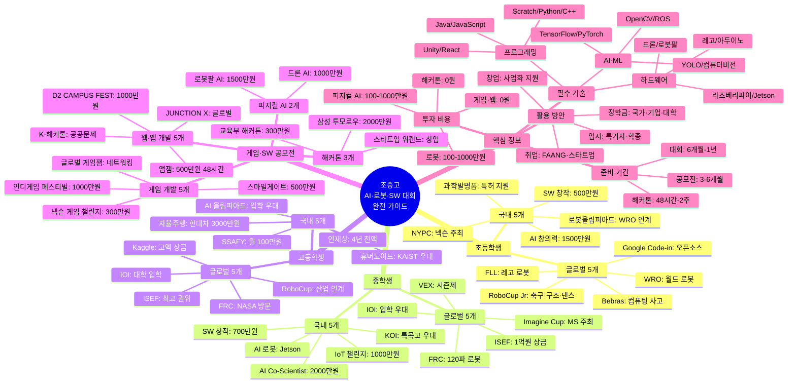
```mermaid
mindmap
  root((초중고<br/>AI·로봇·SW 대회<br/>완전 가이드))
    초등학생
      글로벌 5개
        FLL: 레고 로봇
        WRO: 월드 로봇
        RoboCup Jr: 축구·구조·댄스
        Google Code-in: 오픈소스
        Bebras: 컴퓨팅 사고
      국내 5개
        AI 창의력: 1500만원
        로봇올림피아드: WRO 연계
        SW 창작: 500만원
        과학발명품: 특허 지원
        NYPC: 넥슨 주최
    중학생
      글로벌 5개
        FRC: 120파 로봇
        VEX: 시즌제
        ISEF: 1억원 상금
        Imagine Cup: MS 주최
        IOI: 입학 우대
      국내 5개
        AI Co-Scientist: 2000만원
        IoT 챌린지: 1000만원
        KOI: 특목고 우대
        AI 로봇: Jetson
        SW 창작: 700만원
    고등학생
      글로벌 5개
        IOI: 대학 입학
        ISEF: 최고 권위
        RoboCup: 산업 연계
        Kaggle: 고액 상금
        FRC: NASA 방문
      국내 5개
        휴머노이드: KAIST 우대
        자율주행: 현대차 3000만원
        AI 올림피아드: 입학 우대
        SSAFY: 월 100만원
        인재상: 4년 전액
    게임·SW 공모전
      게임 개발 5개
        인디게임 페스티벌: 1000만원
        넥슨 게임 챌린지: 300만원
        글로벌 게임잼: 네트워킹
        스마일게이트: 500만원
      웹·앱 개발 5개
        D2 CAMPUS FEST: 1000만원
        앱잼: 500만원 48시간
        JUNCTION X: 글로벌
        K-해커톤: 공공문제
      해커톤 3개
        교육부 해커톤: 300만원
        스타트업 위켄드: 창업
        삼성 투모로우: 2000만원
      피지컬 AI 2개
        로봇팔 AI: 1500만원
        드론 AI: 1000만원
    핵심 정보
      필수 기술
        프로그래밍
          Scratch/Python/C++
          Java/JavaScript
          Unity/React
        AI·ML
          TensorFlow/PyTorch
          OpenCV/ROS
          YOLO/컴퓨터비전
        하드웨어
          레고/아두이노
          라즈베리파이/Jetson
          드론/로봇팔
      투자 비용
        게임·웹: 0원
        로봇: 100-1000만원
        해커톤: 0원
        피지컬 AI: 100-1000만원
      준비 기간
        해커톤: 48시간-2주
        공모전: 3-6개월
        대회: 6개월-1년
      활용 방안
        입시: 특기자·학종
        장학금: 국가·기업·대학
        취업: FAANG·스타트업
        창업: 사업화 지원
```

## 📋 목차

### Part 1: 초등학생 대상 대회 (10개)
- [글로벌 대회 (5개)](#초등학생-글로벌-대회)
  - FLL, WRO, RoboCup Junior, Google Code-in, Bebras
- [국내 대회 (5개)](#초등학생-국내-대회)
  - AI 창의력, 로봇올림피아드, SW 창작, 과학발명품, NYPC

### Part 2: 중학생 대상 대회 (10개)
- [글로벌 대회 (5개)](#중학생-글로벌-대회)
  - FRC, VEX, ISEF, Imagine Cup, IOI
- [국내 대회 (5개)](#중학생-국내-대회)
  - AI Co-Scientist, IoT 챌린지, KOI, AI 로봇, SW 창작

### Part 3: 고등학생 대상 대회 (10개)
- [글로벌 대회 (5개)](#고등학생-글로벌-대회)
  - IOI, ISEF, RoboCup, Kaggle, FRC
- [국내 대회 (5개)](#고등학생-국내-대회)
  - 휴머노이드, 자율주행, AI 올림피아드, SSAFY, 대한민국 인재상

### Part 4: 대회 준비 전략
- [학년별 준비 로드맵](#학년별-준비-로드맵)
- [수상 이력 활용 방법](#수상-이력-활용-방법)
- [대회별 필수 기술](#대회별-필수-기술-매트릭스)
- [학습 리소스](#학습-리소스-총정리)

### Part 5: 게임·소프트웨어·해커톤 공모전 (15개) 🆕
- [게임 개발 공모전 (5개)](#게임-개발-공모전)
  - 인디게임 페스티벌, 넥슨 게임 챌린지, 글로벌 게임잼
- [웹·앱 개발 공모전 (5개)](#웹앱-개발-공모전)
  - D2 CAMPUS FEST, 앱잼, JUNCTION X, K-해커톤
- [해커톤 (3개)](#해커톤)
  - 교육부 해커톤, 삼성 투모로우 솔루션, 스타트업 위켄드
- [피지컬 AI 공모전 (2개)](#피지컬-ai-공모전)
  - 로봇팔 AI 챌린지, 드론 AI 경진대회

### 빠른 참조 가이드
- [공식 사이트 총정리](#공식-사이트-총정리)
- [교구재 구매처](#교구재-구매처-총정리)
- [심사 평가 기준 비교](#심사-평가-기준-빠른-비교)
- [예산별 추천 대회](#예산별-추천-대회)
- [최종 체크리스트](#마지막-체크리스트)

---

## 📅 2026년 대회 일정 총정리 (월별 캘린더)

### 연간 대회 스케줄 개요

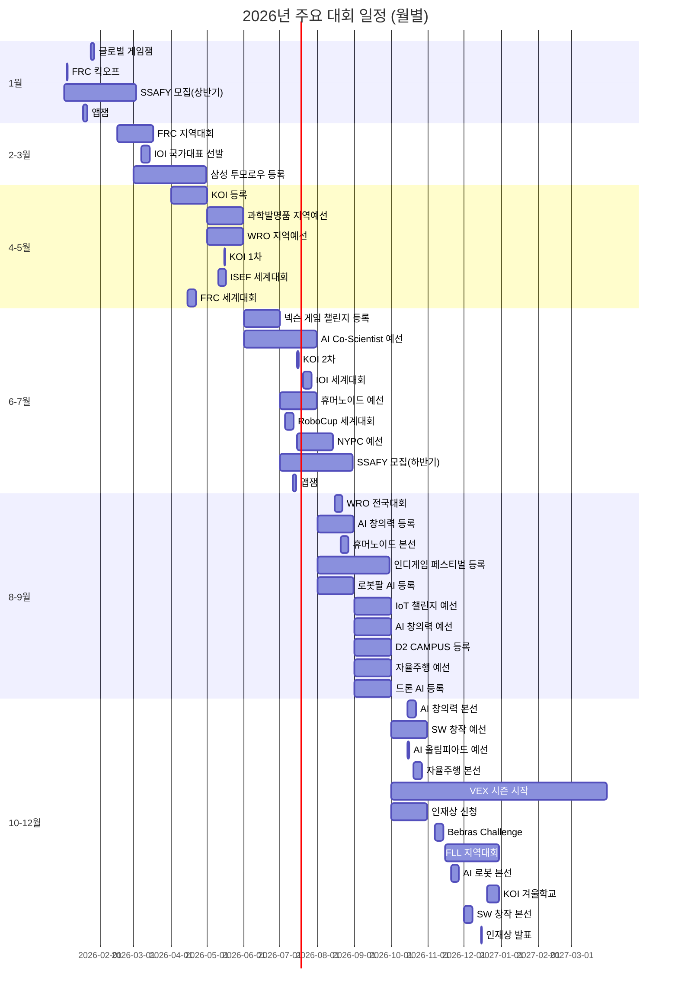
```mermaid
gantt
    title 2026년 주요 대회 일정 (월별)
    dateFormat  YYYY-MM-DD
    section 1월
    글로벌 게임잼           :2026-01-24, 3d
    FRC 킥오프             :2026-01-04, 1d
    SSAFY 모집(상반기)      :2026-01-02, 60d
    앱잼                   :2026-01-18, 3d
    
    section 2-3월
    FRC 지역대회           :2026-02-15, 30d
    IOI 국가대표 선발       :2026-03-07, 7d
    삼성 투모로우 등록      :2026-03-01, 60d
    
    section 4-5월
    KOI 등록               :2026-04-01, 30d
    과학발명품 지역예선     :2026-05-01, 30d
    WRO 지역예선           :2026-05-01, 30d
    KOI 1차               :2026-05-15, 1d
    ISEF 세계대회          :2026-05-10, 7d
    FRC 세계대회           :2026-04-15, 7d
    
    section 6-7월
    넥슨 게임 챌린지 등록   :2026-06-01, 30d
    AI Co-Scientist 예선   :2026-06-01, 60d
    KOI 2차               :2026-07-15, 1d
    IOI 세계대회           :2026-07-20, 7d
    휴머노이드 예선         :2026-07-01, 30d
    RoboCup 세계대회       :2026-07-05, 7d
    NYPC 예선             :2026-07-15, 30d
    SSAFY 모집(하반기)      :2026-07-01, 60d
    앱잼                   :2026-07-11, 3d
    
    section 8-9월
    WRO 전국대회           :2026-08-15, 7d
    AI 창의력 등록         :2026-08-01, 30d
    휴머노이드 본선         :2026-08-20, 7d
    인디게임 페스티벌 등록  :2026-08-01, 60d
    로봇팔 AI 등록         :2026-08-01, 30d
    IoT 챌린지 예선        :2026-09-01, 30d
    AI 창의력 예선         :2026-09-01, 30d
    D2 CAMPUS 등록        :2026-09-01, 30d
    자율주행 예선          :2026-09-01, 30d
    드론 AI 등록           :2026-09-01, 30d
    
    section 10-12월
    AI 창의력 본선         :2026-10-15, 7d
    SW 창작 예선          :2026-10-01, 30d
    AI 올림피아드 예선     :2026-10-15, 1d
    자율주행 본선          :2026-10-20, 7d
    VEX 시즌 시작         :2026-10-01, 180d
    인재상 신청            :2026-10-01, 30d
    Bebras Challenge     :2026-11-07, 7d
    FLL 지역대회          :2026-11-15, 45d
    AI 로봇 본선          :2026-11-20, 7d
    KOI 겨울학교          :2026-12-20, 10d
    SW 창작 본선          :2026-12-01, 7d
    인재상 발표            :2026-12-15, 1d
```

### 월별 대회 상세 일정표

#### 📌 1월 - 신년 킥오프

| 대회명 | 일정 | 카테고리 | 학년 | 참가비 | 특징 |
|--------|------|----------|------|--------|------|
| **글로벌 게임잼** | 1/24-26 (48h) | 게임 개발 | 전체 | 무료 | 전 세계 동시, 순수 경험 |
| **SSAFY 모집** | 1월-2월 | 웹/취업 | 고3 | 무료 | 월 100만원 지원 |
| **FRC 킥오프** | 1월 첫 주 | 로봇 | 중고등 | 1000만원 | 6주 제작 시작 |
| **앱잼** | 1/18-20 (48h) | 모바일 앱 | 대학+고등 | 무료 | 상금 500만원 |
| **스타트업 위켄드** | 월 1회 | 창업 | 고등+ | 5만원 | 3일 창업 체험 |

**💡 1월 전략**
- 게임잼으로 빠른 경험 쌓기
- FRC 참가팀은 6주간 집중 개발 시작
- 새해 목표 대회 선정 및 등록 준비

---

#### 📌 2월 - 본격 준비 시작

| 대회명 | 일정 | 카테고리 | 학년 | 참가비 | 특징 |
|--------|------|----------|------|--------|------|
| **FRC 지역대회** | 2월-3월 | 로봇 | 중고등 | 포함 | 6주 제작 완료 후 경기 |
| **FLL 전국대회** | 2월 | 로봇 | 초등 | 포함 | 지역대회 통과팀 |

**💡 2월 전략**
- 봄 학기 대회 준비 본격화
- 알고리즘 대회(KOI) 기초 학습 시작

---

#### 📌 3월 - 대표 선발 및 등록

| 대회명 | 일정 | 카테고리 | 학년 | 참가비 | 특징 |
|--------|------|----------|------|--------|------|
| **IOI 국가대표 선발** | 3월 초 | 알고리즘 | 중고등 | 무료 | 겨울학교 수료생만 |
| **RoboCup 지역** | 3월 | 로봇 | 초중 | 무료 | 세계대회 진출전 |
| **삼성 투모로우 솔루션** | 3월 등록 | 해커톤/사회공헌 | 만15-29세 | 무료 | 6개월 멘토링, 2000만원 |

**💡 3월 전략**
- 상반기 대회 마지막 등록 기회
- IOI 목표면 이 시점까지 최상위권 필수

---

#### 📌 4월 - 주요 대회 등록 집중

| 대회명 | 일정 | 카테고리 | 학년 | 참가비 | 특징 |
|--------|------|----------|------|--------|------|
| **KOI 등록** | 4월 | 알고리즘 | 중고등 | 무료 | 5월 1차 대비 |
| **과학발명품 지역예선** | 4-5월 | 발명/연구 | 초중고 | 무료 | 7월 전국대회 |
| **FRC 세계대회** | 4월 중순 | 로봇 | 중고등 | 포함 | 미국 개최 |

**💡 4월 전략**
- KOI 등록 필수 (마감 놓치지 말기!)
- 발명품 대회 아이디어 구체화

---

#### 📌 5월 - 대회 시즌 본격 시작

| 대회명 | 일정 | 카테고리 | 학년 | 참가비 | 특징 |
|--------|------|----------|------|--------|------|
| **KOI 1차** | 5월 중순 | 알고리즘 | 중고등 | 무료 | 온라인, 4시간 |
| **WRO 지역예선** | 5월 | 로봇 | 초중고 | 5만원 | 8월 전국대회 진출전 |
| **ISEF 세계대회** | 5월 중순 | 연구/과학 | 중고등 | 300만원 | 최고 권위 과학전람회 |

**💡 5월 전략**
- KOI 1차 집중 (중고등 알고리즘의 시작)
- 여름 방학 대회 준비 착수

---

#### 📌 6월 - 여름 대회 준비

| 대회명 | 일정 | 카테고리 | 학년 | 참가비 | 특징 |
|--------|------|----------|------|--------|------|
| **넥슨 게임 챌린지** | 6월 등록 | 게임 개발 | 초5-고3 | 무료 | 교육용 게임, 300만원 |
| **AI Co-Scientist 예선** | 6월-8월 | AI 연구 | 중등 | 무료 | 상금 2000만원 |

**💡 6월 전략**
- 중간고사 후 여름방학 대비
- 게임/AI 프로젝트 기획 착수

---

#### 📌 7월 - 대회 피크 시즌 🔥

| 대회명 | 일정 | 카테고리 | 학년 | 참가비 | 특징 |
|--------|------|----------|------|--------|------|
| **KOI 2차** | 7월 중순 | 알고리즘 | 중고등 | 무료 | 오프라인, 5시간 |
| **IOI 세계대회** | 7월 하순 | 알고리즘 | 중고등 | 무료 | 국가대표만 참가 |
| **휴머노이드 예선** | 7월 | 로봇 고급 | 고등 | 20만원 | KAIST 주최, 영상 심사 |
| **RoboCup 세계대회** | 7월 초 | 로봇 | 초중고 | 자비 | 지역대회 통과팀 |
| **KRO (한국로봇올림피아드)** | 7월 | 로봇 | 초등 | 5만원 | WRO 연계 |
| **NYPC 예선** | 7월-8월 | 알고리즘 | 초5-고3 | 무료 | 넥슨 주최 |
| **SSAFY 모집** | 7월-8월 | 웹/취업 | 고3 | 무료 | 하반기 모집 |
| **앱잼** | 7월 중순 (48h) | 모바일 앱 | 대학+고등 | 무료 | 여름 시즌 |

**💡 7월 전략**
- **가장 바쁜 달!** 우선순위 명확히
- KOI 2차가 최우선 (특목고/대학 입학)
- 방학 시작, 집중 개발 기간

---

#### 📌 8월 - 여름방학 총력전

| 대회명 | 일정 | 카테고리 | 학년 | 참가비 | 특징 |
|--------|------|----------|------|--------|------|
| **WRO 전국대회** | 8월 중순 | 로봇 | 초중고 | 10만원 | 세계대회 진출 결정 |
| **AI 창의력 등록** | 8월 | AI 프로젝트 | 초4-6 | 무료 | 9월 예선 대비 |
| **휴머노이드 본선** | 8월 하순 | 로봇 고급 | 고등 | 50만원 | 상금 2000만원, KAIST |
| **AI Co-Scientist 본선** | 8월 | AI 연구 | 중등 | 무료 | 발표 및 시연 |
| **인디게임 페스티벌 등록** | 8월-9월 | 게임 개발 | 전체 | 무료 | 청소년부 1000만원 |
| **로봇팔 AI 등록** | 8월 | 피지컬 AI | 고등+ | 30만원 | 상금 1500만원 |
| **NYPC 본선** | 8월 말 | 알고리즘 | 초5-고3 | 무료 | 온라인 |

**💡 8월 전략**
- 방학 황금기, 프로젝트 완성 집중
- 가을 대회 준비 시작

---

#### 📌 9월 - 2학기 대회 시작

| 대회명 | 일정 | 카테고리 | 학년 | 참가비 | 특징 |
|--------|------|----------|------|--------|------|
| **IoT 챌린지 예선** | 9월 | IoT/하드웨어 | 중등 | 5만원 | 상금 1000만원 |
| **AI 창의력 예선** | 9월 | AI 프로젝트 | 초4-6 | 무료 | 영상 제출 |
| **D2 CAMPUS 등록** | 9월 | 웹/앱 개발 | 고등+대학 | 무료 | 네이버, 상금 1000만원 |
| **자율주행 예선** | 9월 | 자율주행 | 고등 | 30만원 | 현대차, 상금 3000만원 |
| **드론 AI 등록** | 9월 | 드론/피지컬 | 만18+ | 20만원 | 상금 1000만원 |

**💡 9월 전략**
- 여름방학 성과물로 대회 참가
- 수시 입시 준비와 병행

---

#### 📌 10월 - 가을 대회 본선 집중

| 대회명 | 일정 | 카테고리 | 학년 | 참가비 | 특징 |
|--------|------|----------|------|--------|------|
| **AI 창의력 본선** | 10월 중순 | AI 프로젝트 | 초4-6 | 무료 | 현장 발표, 상금 1500만원 |
| **SW 창작 예선** | 10월 | 소프트웨어 | 초중고 | 무료 | 앱/게임/AI |
| **AI 올림피아드 예선** | 10월 중순 | AI/ML | 고등 | 무료 | 5시간, 딥러닝 문제 |
| **자율주행 본선** | 10월 하순 | 자율주행 | 고등 | 포함 | 현장 주행 테스트 |
| **IoT 챌린지 본선** | 10월 | IoT/하드웨어 | 중등 | 포함 | 시연 |
| **VEX 시즌 시작** | 10월-4월 | 로봇 | 중고등 | 10만원 | 시즌제 운영 |
| **인재상 신청** | 10월 | 종합 | 고3 | 무료 | 4년 전액 장학금 |

**💡 10월 전략**
- 본선 발표 연습 집중
- 2학기 최대 대회 시즌

---

#### 📌 11월 - 겨울 대회 시작

| 대회명 | 일정 | 카테고리 | 학년 | 참가비 | 특징 |
|--------|------|----------|------|--------|------|
| **Bebras Challenge** | 11월 첫째 주 | 컴퓨팅 사고 | 초중고 | 무료 | 온라인 40분 |
| **FLL 지역대회** | 11월-12월 | 로봇 | 초등 | 50-100만원 | 2월 전국대회 진출전 |
| **WRO 세계대회** | 11월 | 로봇 | 초중고 | 자비 | 8월 전국 통과팀 |
| **AI 로봇 예선** | 11월 | 로봇+AI | 중등 | 10만원 | Jetson 활용 |
| **SW 창작 본선** | 11월 | 소프트웨어 | 중고등 | 무료 | 현장 발표 |
| **D2 CAMPUS 본선** | 11월 | 웹/앱 개발 | 고등+대학 | 무료 | 네이버 본사 |

**💡 11월 전략**
- 입시 마무리 + 대회 병행
- 겨울방학 대비 계획

---

#### 📌 12월 - 시상 및 내년 준비

| 대회명 | 일정 | 카테고리 | 학년 | 참가비 | 특징 |
|--------|------|----------|------|--------|------|
| **KOI 겨울학교** | 12월 하순 | 알고리즘 | 중고등 | 무료 | 금은동상 수상자만, 1주일 |
| **FLL 전국대회** | 12월 | 로봇 | 초등 | 포함 | 세계대회 진출 결정 |
| **AI 로봇 본선** | 12월 초 | 로봇+AI | 중등 | 포함 | 시연 및 발표 |
| **인재상 발표** | 12월 중순 | 종합 | 고3 | - | 대통령 표창 |

**💡 12월 전략**
- 수상 및 시상식 참석
- 내년도 목표 대회 선정 및 기초 학습

---

### 🎯 연중 상시 진행 대회

| 대회명 | 기간 | 카테고리 | 특징 |
|--------|------|----------|------|
| **Kaggle Competitions** | 연중 | AI/데이터 | 다양한 대회 상시, 상금 차등 |
| **Codeforces Rounds** | 주 2-3회 | 알고리즘 | 온라인 대회, 레이팅 |
| **JUNCTION X** | 연중 수시 | 해커톤 | 글로벌 36시간 |
| **교육부 해커톤** | 연 2-3회 | AI/SW | 학기 중 개최 |
| **Google Code-in** | 11월-1월 | 오픈소스 | 7주간 태스크 |

---

### 📊 월별 대회 집중도 차트

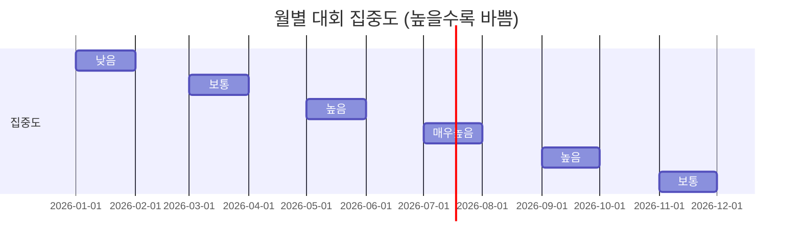
```mermaid
gantt
    title 월별 대회 집중도 (높을수록 바쁨)
    dateFormat  YYYY-MM
    
    section 집중도
    낮음   :2026-01, 2026-02
    보통   :2026-03, 2026-04
    높음   :2026-05, 2026-06
    매우높음 :2026-07, 2026-08
    높음   :2026-09, 2026-10
    보통   :2026-11, 2026-12
```

**대회가 집중된 시기**
- 🔥 **7-8월**: 방학 + KOI 2차 + IOI + 휴머노이드 + WRO 등 (가장 바쁨!)
- 🔥 **10월**: 가을 본선 집중 (AI 창의력, 자율주행, SW 창작 등)
- 📅 **5월**: KOI 1차 + ISEF
- 📅 **11월**: 겨울 대회 시작 (Bebras, FLL)

**상대적으로 여유로운 시기**
- ✅ **1-2월**: 신학기 준비, 기초 학습
- ✅ **3-4월**: 등록 집중, 본격 준비
- ✅ **12월**: 마무리 및 차년도 계획

---

### 💡 월별 준비 전략 요약

| 시기 | 초등학생 | 중학생 | 고등학생 |
|------|----------|--------|----------|
| **1-2월** | 기초 학습 | 알고리즘 기초 | Kaggle 입문 |
| **3-4월** | 대회 선택 | KOI 등록 | IOI 준비 (선발자) |
| **5-6월** | 프로젝트 시작 | KOI 1차 | ISEF 참가 (선발자) |
| **7-8월** | 집중 개발 | KOI 2차 + AI | 휴머노이드/자율주행 |
| **9-10월** | 본선 준비 | 본선 발표 | 입시 + 대회 병행 |
| **11-12월** | 겨울 대회 | KOI 겨울학교 | 마무리 및 정리 |

---

## 🎯 빠른 대회 선택 가이드

### 목표별 추천 대회

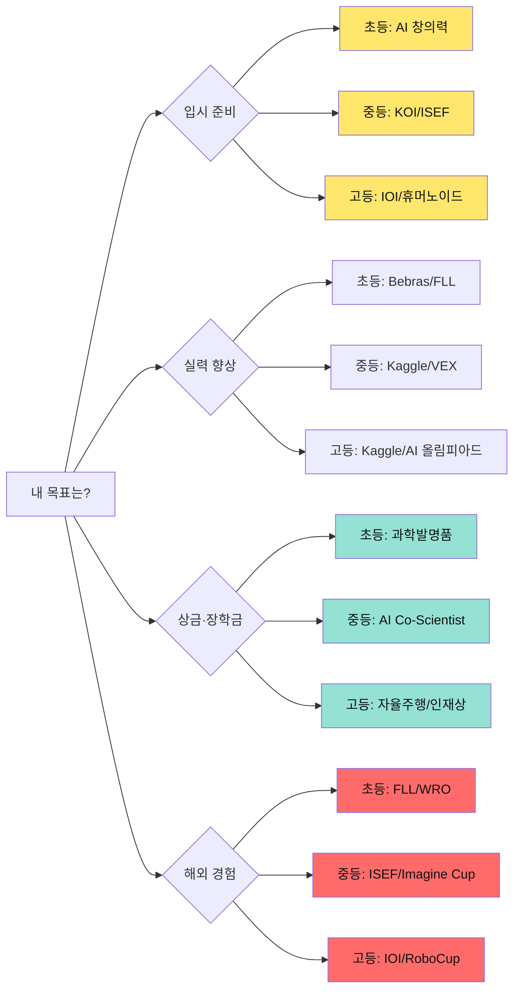
```mermaid
flowchart LR
    A[내 목표는?] --> B{입시 준비}
    A --> C{실력 향상}
    A --> D{상금·장학금}
    A --> E{해외 경험}
    
    B --> B1[초등: AI 창의력]
    B --> B2[중등: KOI/ISEF]
    B --> B3[고등: IOI/휴머노이드]
    
    C --> C1[초등: Bebras/FLL]
    C --> C2[중등: Kaggle/VEX]
    C --> C3[고등: Kaggle/AI 올림피아드]
    
    D --> D1[초등: 과학발명품]
    D --> D2[중등: AI Co-Scientist]
    D --> D3[고등: 자율주행/인재상]
    
    E --> E1[초등: FLL/WRO]
    E --> E2[중등: ISEF/Imagine Cup]
    E --> E3[고등: IOI/RoboCup]
    
    style B1 fill:#ffe66d,color:#111
    style B2 fill:#ffe66d,color:#111
    style B3 fill:#ffe66d,color:#111
    style D1 fill:#95e1d3,color:#111
    style D2 fill:#95e1d3,color:#111
    style D3 fill:#95e1d3,color:#111
    style E1 fill:#ff6b6b,color:#111
    style E2 fill:#ff6b6b,color:#111
    style E3 fill:#ff6b6b,color:#111
```

### 관심 분야별 추천 대회

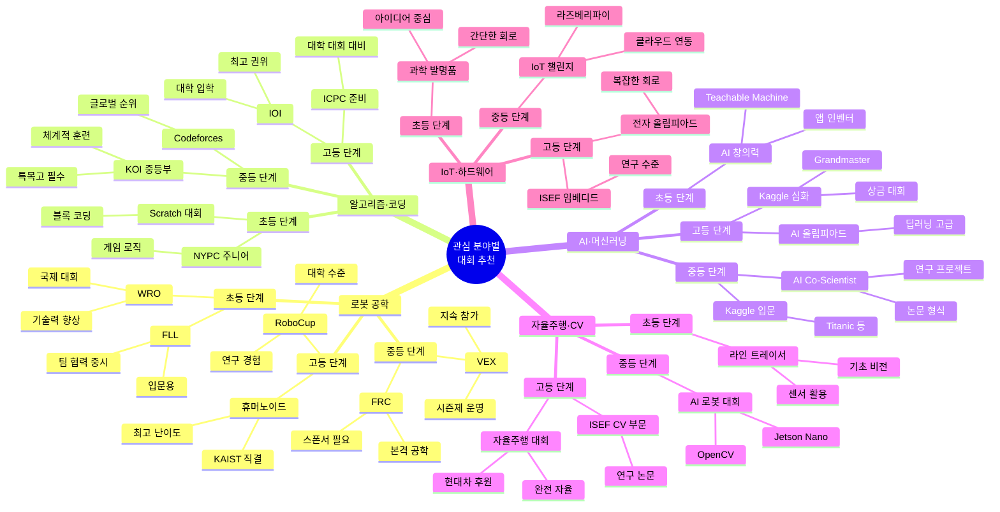
```mermaid
mindmap
  root((관심 분야별<br/>대회 추천))
    로봇 공학
      초등 단계
        FLL
          입문용
          팀 협력 중시
        WRO
          국제 대회
          기술력 향상
      중등 단계
        VEX
          시즌제 운영
          지속 참가
        FRC
          본격 공학
          스폰서 필요
      고등 단계
        휴머노이드
          최고 난이도
          KAIST 직결
        RoboCup
          대학 수준
          연구 경험
    알고리즘·코딩
      초등 단계
        Scratch 대회
          블록 코딩
        NYPC 주니어
          게임 로직
      중등 단계
        KOI 중등부
          특목고 필수
          체계적 훈련
        Codeforces
          글로벌 순위
      고등 단계
        IOI
          최고 권위
          대학 입학
        ICPC 준비
          대학 대회 대비
    AI·머신러닝
      초등 단계
        AI 창의력
          Teachable Machine
          앱 인벤터
      중등 단계
        AI Co-Scientist
          연구 프로젝트
          논문 형식
        Kaggle 입문
          Titanic 등
      고등 단계
        Kaggle 심화
          상금 대회
          Grandmaster
        AI 올림피아드
          딥러닝 고급
    자율주행·CV
      초등 단계
        라인 트레이서
          기초 비전
          센서 활용
      중등 단계
        AI 로봇 대회
          OpenCV
          Jetson Nano
      고등 단계
        자율주행 대회
          완전 자율
          현대차 후원
        ISEF CV 부문
          연구 논문
    IoT·하드웨어
      초등 단계
        과학 발명품
          아이디어 중심
          간단한 회로
      중등 단계
        IoT 챌린지
          라즈베리파이
          클라우드 연동
      고등 단계
        전자 올림피아드
          복잡한 회로
        ISEF 임베디드
          연구 수준
```

---

# Part 1: 초등학생 대상 대회

## 초등학생 대회 전체 개요

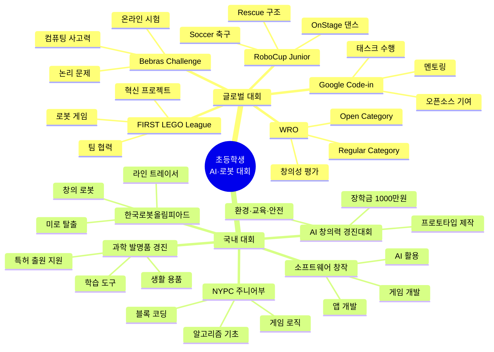
```mermaid
mindmap
  root((초등학생<br/>AI·로봇 대회))
    글로벌 대회
      FIRST LEGO League
        로봇 게임
        혁신 프로젝트
        팀 협력
      WRO
        Regular Category
        Open Category
        창의성 평가
      RoboCup Junior
        Soccer 축구
        Rescue 구조
        OnStage 댄스
      Google Code-in
        오픈소스 기여
        태스크 수행
        멘토링
      Bebras Challenge
        컴퓨팅 사고력
        온라인 시험
        논리 문제
    국내 대회
      AI 창의력 경진대회
        환경·교육·안전
        프로토타입 제작
        장학금 1000만원
      한국로봇올림피아드
        라인 트레이서
        미로 탈출
        창의 로봇
      소프트웨어 창작
        게임 개발
        앱 개발
        AI 활용
      과학 발명품 경진
        생활 용품
        학습 도구
        특허 출원 지원
      NYPC 주니어부
        알고리즘 기초
        게임 로직
        블록 코딩
```

## 초등학생 필수 기술 스택

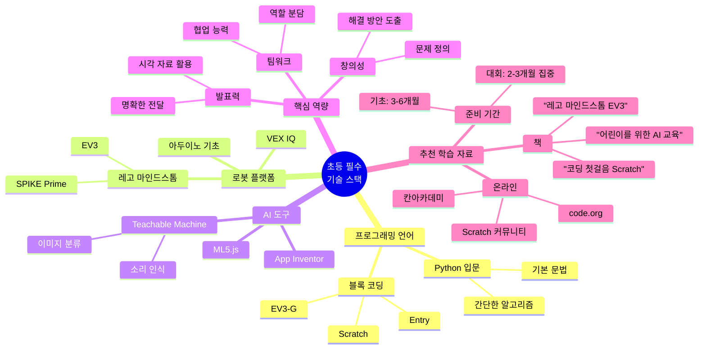
```mermaid
mindmap
  root((초등 필수<br/>기술 스택))
    프로그래밍 언어
      블록 코딩
        Scratch
        Entry
        EV3-G
      Python 입문
        기본 문법
        간단한 알고리즘
    로봇 플랫폼
      레고 마인드스톰
        EV3
        SPIKE Prime
      VEX IQ
      아두이노 기초
    AI 도구
      Teachable Machine
        이미지 분류
        소리 인식
      ML5.js
      App Inventor
    핵심 역량
      창의성
        문제 정의
        해결 방안 도출
      팀워크
        역할 분담
        협업 능력
      발표력
        명확한 전달
        시각 자료 활용
    추천 학습 자료
      책
        "코딩 첫걸음 Scratch"
        "레고 마인드스톰 EV3"
        "어린이를 위한 AI 교육"
      온라인
        code.org
        칸아카데미
        Scratch 커뮤니티
      준비 기간
        기초: 3-6개월
        대회: 2-3개월 집중
```

## 초등학생 글로벌 대회

### 1. FIRST LEGO League (FLL)

#### 대회 개요
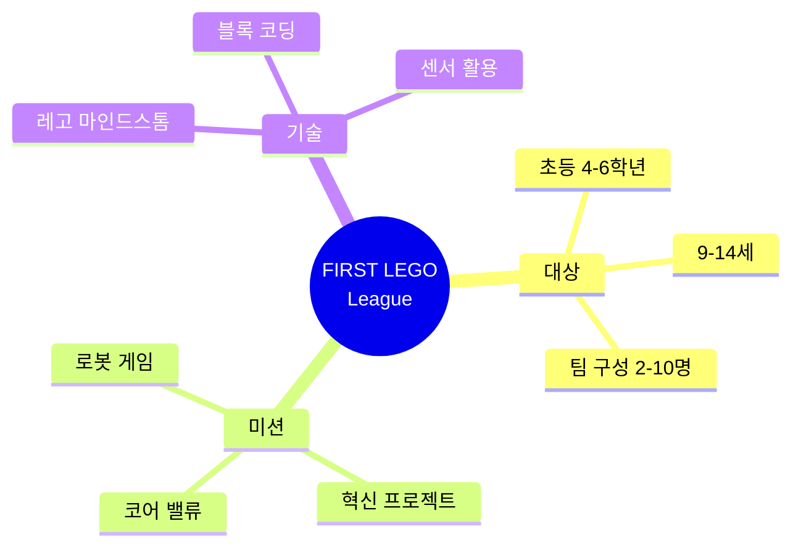
```mermaid
mindmap
  root((FIRST LEGO<br/>League))
    대상
      초등 4-6학년
      9-14세
      팀 구성 2-10명
    미션
      로봇 게임
      혁신 프로젝트
      코어 밸류
    기술
      레고 마인드스톰
      블록 코딩
      센서 활용
```

#### 🌐 공식 정보 및 등록

**공식 사이트**
- 글로벌: [https://www.firstinspires.org/robotics/fll](https://www.firstinspires.org/robotics/fll)
- 한국: [http://www.fll-korea.org/](http://www.fll-korea.org/)
- 등록 기간: 매년 7-9월
- 팀 등록비: 약 80만원 (지역별 상이)

**참가 자격 조건**
- 연령: 9-14세 (초등 4학년 ~ 중등 2학년)
- 팀 구성: 최소 2명, 최대 10명, 권장 4-6명
- 코치: 성인 코치 1명 이상 필수 (만 18세 이상)
- 팀명: 고유한 팀명 필요
- 제한 사항: 한 학생은 하나의 팀에만 참가 가능

**등록 절차**
1. FIRST 홈페이지에서 팀 등록 (7-8월)
2. 등록비 결제
3. 챌린지 킷 수령 (8월 말)
4. 지역 대회 신청 (9-10월)
5. 대회 참가 (11-12월)

#### 📦 필수 교구재 및 구매 가이드

**1. 로봇 키트 (필수)**

| 제품명 | 가격 | 구매처 | 설명 |
|--------|------|--------|------|
| **LEGO Education SPIKE Prime** | 약 45만원 | 레고 에듀케이션 공식 대리점 | 2026년 권장 키트 |
| **LEGO Mindstorms EV3** | 약 50만원 | 단종 예정, 중고 시장 | 기존 사용 가능 |
| **추가 센서 팩** | 약 15만원 | 레고 스토어 | 컬러센서, 초음파센서 추가 |

**2. 경기장 세트 (필수)**
- **Challenge Set**: 약 30만원
  - 경기장 매트 (2.4m × 1.2m)
  - 미션 모델 (레고 브릭 포함)
  - 설명서
  - 구매처: FIRST 공식 파트너 또는 FLL 한국 본부

**3. 소프트웨어 (무료)**
- **SPIKE App**: iOS, Android, Windows, Mac 지원
- **EV3 Programming**: 블록 코딩 환경
- **Python (고급)**: SPIKE Prime의 Python 모드

**4. 추가 권장 품목**
- 백업 배터리: 2-3개 (각 7만원)
- 정리함/공구함: 2만원
- 예비 부품: 10만원
- 프로젝트 발표 자료 제작: 프린터, 포스터 보드

**총 예상 비용**: **90-120만원**

#### 📊 심사 평가 기준 (상세 배점)

**1. 로봇 게임 (Robot Game) - 총 400점**

| 평가 요소 | 배점 | 세부 내용 |
|----------|------|----------|
| **미션 완수** | 300점 | 14-16개 미션, 각 10-30점 |
| **정확성** | 50점 | 로봇이 정확한 위치에서 작동 |
| **안정성** | 30점 | 반복 실행 시 일관성 |
| **시간 내 완료** | 20점 | 2분 30초 내 최대한 많은 미션 |

**미션 예시 (2026 SUBMERGED 테마)**
- 해양 생물 구조: 30점
- 쓰레기 수거: 25점
- 산호초 복원: 20점
- 연구 장비 배치: 15점
- (총 14-16개 미션)

**2. 혁신 프로젝트 (Innovation Project) - 200점**

| 평가 항목 | 배점 | 평가 내용 |
|----------|------|----------|
| **문제 정의** | 50점 | 명확하고 구체적인 문제 발견 |
| **해결 방안** | 50점 | 창의적이고 실현 가능한 솔루션 |
| **리서치** | 40점 | 전문가 인터뷰, 자료 조사 |
| **프로토타입** | 30점 | 실제 작동 가능한 모델 |
| **발표력** | 30점 | 명확하고 설득력 있는 발표 |

**발표 형식**
- 시간: 5분 발표 + 5분 질의응답
- 준비물: 포스터, 프로토타입, 발표 자료
- 평가단: 3-5명의 심사위원

**3. 로봇 디자인 (Robot Design) - 100점**

| 평가 항목 | 배점 | 평가 내용 |
|----------|------|----------|
| **기계 설계** | 30점 | 견고하고 효율적인 구조 |
| **프로그래밍** | 30점 | 모듈화, 주석, 센서 활용 |
| **전략** | 20점 | 미션 수행 순서, 시간 배분 |
| **반복 개선** | 20점 | 테스트 및 개선 과정 기록 |

**인터뷰 내용**
- 로봇 설계 이유 설명
- 프로그래밍 전략
- 문제 해결 과정
- 팀원 역할 분담

**4. 코어 밸류 (Core Values) - 100점**

| 평가 항목 | 배점 | 평가 내용 |
|----------|------|----------|
| **팀워크** | 30점 | 모든 팀원의 역할과 기여 |
| **협력** | 25점 | 다른 팀과의 협력 사례 |
| **존중** | 20점 | 서로 존중하는 태도 |
| **즐거움** | 15점 | 과정을 즐기는 모습 |
| **성장** | 10점 | 실수를 통한 학습 |

**평가 방법**
- 경기장에서의 행동 관찰
- 팀 인터뷰
- 다른 팀과의 상호작용

**총점 계산**
- 로봇 게임: 400점
- 혁신 프로젝트: 200점
- 로봇 디자인: 100점
- 코어 밸류: 100점
- **총 800점**

**수상 결정**
- 챔피언상: 4개 부문 종합 평가 (가장 균형 잡힌 팀)
- 부문별 1위: 각 부문 최고 점수 팀
- 코어 밸류상: 가장 모범적인 팀

#### 💪 필수 역량 체크리스트

**기술적 역량**

| 역량 | 난이도 | 학습 기간 | 필수도 |
|------|--------|----------|--------|
| ✅ 레고 조립 기초 | ⭐☆☆ | 1주 | 필수 |
| ✅ SPIKE/EV3 프로그래밍 | ⭐⭐☆ | 1개월 | 필수 |
| ✅ 센서 활용 (컬러, 초음파) | ⭐⭐☆ | 2주 | 필수 |
| ✅ 라인 트레이싱 | ⭐⭐☆ | 1개월 | 필수 |
| ✅ PID 제어 (권장) | ⭐⭐⭐ | 2개월 | 권장 |
| ✅ 기어비 계산 | ⭐⭐☆ | 1주 | 권장 |

**프로젝트 역량**
- ✅ 문제 발견 능력 (관찰력)
- ✅ 인터뷰 기술 (전문가 질문)
- ✅ 프레젠테이션 (PPT 제작)
- ✅ 프로토타입 제작
- ✅ 팀 협업 (역할 분담)

**소프트 스킬**
- ✅ 의사소통 능력
- ✅ 시간 관리
- ✅ 문제 해결 능력
- ✅ 끈기와 인내심
- ✅ 리더십 (선택)

#### 📅 준비 일정표 (3개월 기준)

**1개월차: 기초 다지기**
- Week 1: 팀 구성, 규칙 숙지
- Week 2: 로봇 조립 연습
- Week 3: 프로그래밍 기초
- Week 4: 첫 미션 도전

**2개월차: 본격 개발**
- Week 5-6: 로봇 게임 전략 수립
- Week 7-8: 혁신 프로젝트 주제 선정 및 리서치

**3개월차: 완성 및 연습**
- Week 9-10: 로봇 최적화
- Week 11: 발표 연습
- Week 12: 최종 점검 및 리허설

#### 🎯 합격 전략 및 팁

**로봇 게임 고득점 전략**
1. **간단한 미션부터**: 20점짜리 미션 5개 > 50점짜리 미션 1개
2. **신뢰성 우선**: 80% 성공률 미션 선택
3. **백업 전략**: 실패 시 다음 미션으로 즉시 전환
4. **시간 배분**: 2분 30초를 효율적으로 사용

**혁신 프로젝트 선정 팁**
- ❌ 너무 거창한 주제 (예: 기후 변화 해결)
- ✅ 구체적인 주제 (예: 우리 학교 급식실 쓰레기 줄이기)
- ✅ 실제 전문가 인터뷰 (최소 3명)
- ✅ 작동하는 프로토타입 필수

**코어 밸류 실천 방법**
- 다른 팀 도와주기 (부품 빌려주기)
- 실패해도 웃으며 다시 도전
- 모든 팀원이 발표 참여
- 경쟁자가 아닌 동료로 대하기

#### 🏆 한국 팀 수상 사례

**2025년 서울 OO초등학교**
- 수상: 세계 대회 10위
- 핵심 전략: 안정적인 5개 미션 완벽 수행
- 프로젝트: "독거노인 안전 IoT 시스템"
- 특징: 3개월 집중 준비, 매일 2시간 연습

**준비 물품 체크리스트**
- [ ] 로봇 키트
- [ ] 백업 배터리 2개
- [ ] 노트북/태블릿
- [ ] 경기장 매트 (연습용)
- [ ] 공구 (드라이버, 니퍼)
- [ ] 발표 자료 (USB 백업)
- [ ] 팀 유니폼
- [ ] 간식 및 물

#### 상세 정보
- **주최**: FIRST (For Inspiration and Recognition of Science and Technology)
- **개최 시기**: 매년 8월 발표, 11월-12월 지역 대회, 2월-3월 국제 대회
- **참가비**: 지역별 상이 (한국: 약 50-100만원)
- **언어**: 영어 (한국 대회는 한국어 가능)

#### 수상 부문 및 혜택

| 수상 부문 | 상금/상품 | 추가 혜택 | 가치 |
|---------|---------|---------|------|
| **챔피언상** | 트로피 + 메달 | 세계 대회 진출 (미국) | 항공료 지원 |
| **로봇 성능상** | 트로피 + 레고 세트 | LEGO 본사 방문 기회 | 약 200만원 상당 |
| **혁신 프로젝트상** | 트로피 + 상장 | 대학 멘토링 프로그램 | 1년간 무료 |
| **코어 밸류상** | 메달 + 상장 | FIRST 장학금 지원 대상 | 중·고등 진학 시 |
| **코치상** | 상장 | FIRST 교육자 네트워크 가입 | - |

#### 대회 구성
1. **로봇 게임 (50점)**
   - 2분 30초 동안 자율 주행 로봇으로 미션 수행
   - 매년 새로운 테마 (2026년: "SUBMERGED" - 해양 탐사)
   
2. **혁신 프로젝트 (30점)**
   - 실생활 문제 발견 및 해결 방안 제시
   - 전문가 인터뷰 및 프로토타입 제작

3. **코어 밸류 (20점)**
   - 팀워크, 협력, 존중 등 가치 평가
   - 발표 및 인터뷰

#### 준비 기간 및 비용
- **준비 기간**: 최소 3-4개월
- **필요 장비**: 레고 마인드스톰 EV3 또는 SPIKE Prime (약 50-70만원)
- **추가 비용**: 경기장 매트 (약 30만원), 미션 모델 (약 20만원)

#### 과거 한국팀 성과
- 2025년: 서울 OO초등학교 - 세계 대회 10위
- 2024년: 대전 △△초등학교 - 아시아 태평양 지역 1위
- 2023년: 부산 ◇◇초등학교 - 혁신 프로젝트상 수상

---

### 2. WRO (World Robot Olympiad)

#### 🌐 공식 정보 및 등록

**공식 사이트**
- 글로벌: [https://wro-association.org/](https://wro-association.org/)
- 한국: [http://www.wro-korea.org/](http://www.wro-korea.org/)
- 등록 기간: 매년 3-4월
- 참가비: 지역 예선 5만원, 전국 대회 10만원

**참가 자격 조건**
- **Elementary (초등부)**: 8-12세
- **Junior (중등부)**: 13-15세
- **Senior (고등부)**: 16-19세
- 팀 구성: **정확히 2-3명** (필수)
- 코치: 성인 코치 1명 필수
- 국적: 제한 없음 (지역 대회는 해당 지역 거주자)

**카테고리 선택**
1. **RoboMission**: 정해진 미션 수행 (초보자 추천)
2. **RoboSports**: 스포츠 경기 형태
3. **Future Innovators**: 자유 주제 프로젝트
4. **Future Engineers**: 자율주행 특화

#### 📦 필수 교구재 및 구매 가이드

**1. 로봇 키트 (선택 가능)**

| 제품명 | 가격 | 구매처 | 장단점 |
|--------|------|--------|--------|
| **LEGO Mindstorms EV3** | 50만원 | 레고 스토어 | 조립 쉬움, 프로그래밍 직관적 |
| **LEGO SPIKE Prime** | 45만원 | 레고 에듀케이션 | 최신 제품, Python 지원 |
| **VEX IQ** | 40만원 | 로보틱스코리아 | 내구성 좋음, 부품 다양 |
| **아두이노 기반 자작** | 20-30만원 | 디바이스마트 | 커스터마이징 자유, 난이도 높음 |
| **라즈베리파이 로봇** | 25만원 | 엘레파츠 | 카메라 사용 가능, 리눅스 필요 |

**2. 필수 센서 및 부품**

| 부품 | 가격 | 용도 | 구매처 |
|------|------|------|--------|
| **컬러 센서** | 3-5만원 | 라인 트레이싱, 색상 구분 | 레고/디바이스마트 |
| **초음파 센서** | 3-4만원 | 거리 측정, 장애물 회피 | 레고/디바이스마트 |
| **자이로 센서** | 4-5만원 | 방향 제어, 직진 보정 | 레고 스토어 |
| **터치 센서** | 2만원 | 충돌 감지 | 레고 스토어 |
| **카메라 모듈** | 5-8만원 | 객체 인식 (고급) | 라즈베리파이 공식 |

**3. 연습 세트**
- **연습 매트**: 10만원 (WRO 한국 본부)
- **미션 오브젝트**: 자체 제작 또는 3D 프린팅
- **예비 배터리**: 7만원 × 2개

**총 예상 비용**: **80-150만원** (키트 선택에 따라)

#### 📊 심사 평가 기준

**RoboMission 카테고리 (가장 인기)**

**Round 1: 일반 미션 (100점)**
| 미션 | 배점 | 설명 |
|------|------|------|
| 미션 1 | 20점 | 출발 → A 지점 이동 |
| 미션 2 | 25점 | 물체 집기 및 이동 |
| 미션 3 | 30점 | 색상 구분 및 분류 |
| 미션 4 | 25점 | 복귀 |

**Round 2: 서프라이즈 미션 (100점)**
- 대회 당일 2시간 전 공개
- 기존 로봇 수정 가능 (2시간 내)
- 창의적 해결 방법 평가

**평가 기준 (세부)**
1. **미션 완료도** (60%)
   - 완벽 수행: 100%
   - 부분 수행: 30-70%
   - 미수행: 0%

2. **시간 점수** (30%)
   - 제한 시간: 2분
   - 빠를수록 보너스 점수
   - 공식: (120초 - 실제 시간) × 0.5점

3. **테크니컬 점수** (10%)
   - 로봇 크기: 25cm × 25cm × 25cm 이내
   - 센서 활용: 다양한 센서 사용 시 가산점
   - 프로그래밍: 모듈화, 효율성

**Future Innovators (자유 프로젝트)**

| 평가 항목 | 배점 | 평가 내용 |
|----------|------|----------|
| **창의성** | 30점 | 독창적인 아이디어 |
| **기술력** | 25점 | 로봇 제작 완성도 |
| **프레젠테이션** | 20점 | 발표 및 시연 |
| **팀워크** | 15점 | 협업 과정 |
| **문서화** | 10점 | 엔지니어링 노트 |

#### 💪 필수 역량 체크리스트

**기술적 역량 (RoboMission 기준)**

| 역량 | 난이도 | 학습 기간 | 중요도 |
|------|--------|----------|--------|
| ✅ 라인 트레이싱 | ⭐⭐☆ | 2주 | 필수 |
| ✅ PID 제어 | ⭐⭐⭐ | 1개월 | 필수 |
| ✅ 색상 인식 | ⭐⭐☆ | 1주 | 필수 |
| ✅ 물체 집기 | ⭐⭐☆ | 2주 | 필수 |
| ✅ 자이로 센서 활용 | ⭐⭐⭐ | 2주 | 권장 |
| ✅ 모듈화 프로그래밍 | ⭐⭐☆ | 1개월 | 권장 |
| ✅ 디버깅 | ⭐⭐☆ | 지속 | 필수 |

**프로그래밍 기술**
- ✅ 블록 코딩 (Scratch, EV3-G)
- ✅ Python (고급, 라즈베리파이 사용 시)
- ✅ C/C++ (아두이노 사용 시)
- ✅ 센서 데이터 처리
- ✅ 조건문 및 반복문 활용

**전략적 역량**
- ✅ 시간 관리 (2분 내 최대 점수)
- ✅ 우선순위 설정 (쉬운 미션 먼저)
- ✅ 예외 처리 (실패 시 복구)
- ✅ 빠른 문제 해결 (서프라이즈 미션 대비)

#### 📅 준비 일정표 (4개월 기준)

**1개월차: 기초**
- Week 1-2: 로봇 조립 및 기본 이동
- Week 3: 센서 이해 및 활용
- Week 4: 라인 트레이싱 마스터

**2개월차: 심화**
- Week 5-6: PID 제어 구현
- Week 7: 물체 조작 연습
- Week 8: 과거 대회 문제 풀이

**3개월차: 실전 연습**
- Week 9-10: 모의 대회 (주 2회)
- Week 11: 서프라이즈 미션 대비 훈련
- Week 12: 속도 최적화

**4개월차: 최종 준비**
- Week 13-14: 지역 예선 참가
- Week 15-16: 전국 대회 대비

#### 🎯 합격 전략 및 팁

**고득점 전략**
1. **안정성 > 속도**: 80% 성공률 확보 후 속도 높이기
2. **서프라이즈 대비**: 범용 센서 코드 미리 작성
3. **백업 로봇**: 예비 로봇 1대 준비
4. **배터리 관리**: 대회 직전 새 배터리 교체

**지역 예선 통과 팁**
- 상위 30-40%가 전국 대회 진출
- 1라운드 70점 이상 목표
- 서프라이즈 미션 50점 이상

**전국 대회 세계 대회 진출**
- 상위 3-5팀 (카테고리별)
- 1라운드 90점, 서프라이즈 80점 목표

**서프라이즈 미션 대처법**
- 2시간 동안 침착하게 분석
- 기존 코드 재활용
- 간단한 해결책 우선
- 테스트 시간 확보 (최소 30분)

#### 🏆 한국 팀 수상 사례

**2025년 수상팀 분석**
- **금상팀**: 대전 △△초, 1라운드 95점, 서프라이즈 90점
- **핵심 전략**: PID 제어 완벽 구현, 3가지 백업 전략
- **준비 기간**: 5개월, 주 4회 연습

**실전 조언 (전 수상자 인터뷰)**
- "라인 트레이싱은 100% 성공할 때까지 연습"
- "서프라이즈는 간단한 솔루션이 답"
- "팀원 간 역할 명확히 (프로그래머, 빌더, 전략가)"

#### 대회 개요
- **주최**: World Robot Olympiad Association
- **대상**: 초등 4-6학년 (Elementary Category)
- **개최 시기**: 5월 지역 예선, 8월 전국 대회, 11월 세계 대회
- **참가비**: 지역 예선 5만원, 전국 대회 10만원

#### 수상 부문 및 혜택

| 수상 부문 | 상금/상품 | 추가 혜택 | 가치 |
|---------|---------|---------|------|
| **금상 (1위)** | 상금 $3,000 + 트로피 | 세계 대회 항공료·숙박비 전액 | 약 500만원 |
| **은상 (2위)** | 상금 $2,000 + 메달 | 로봇 키트 제공 | 약 300만원 |
| **동상 (3위)** | 상금 $1,000 + 메달 | 온라인 코딩 강좌 1년 | 약 150만원 |
| **베스트 디자인상** | 로봇 부품 세트 | 3D 프린터 사용권 | 약 50만원 |
| **창의성상** | 도서 상품권 50만원 | 멘토링 프로그램 | - |

#### 대회 카테고리
1. **Regular Category**
   - 주어진 미션을 로봇으로 해결
   - 2026년 테마: "Earth Allies" (환경 보호)

2. **Open Category**
   - 자유 주제로 로봇 프로젝트 제작
   - 발표 및 시연 평가

3. **Future Innovators**
   - 초등 저학년 대상 (6-12세)
   - 간단한 로봇 미션

#### 준비 전략
- **필수 기술**: 라인 트레이서, 색상 센서, 초음파 센서
- **프로그래밍**: 블록 코딩 (Scratch, EV3-G)
- **팀 구성**: 2-3명 (코더, 빌더, 전략가)

#### 한국 대표팀 선발 과정
1. 지역 예선 (5월) → 상위 30% 전국 대회 진출
2. 전국 대회 (8월) → 상위 3팀 세계 대회 진출
3. 세계 대회 (11월) → 70개국 200팀 경쟁

---

### 3. RoboCup Junior

#### 대회 개요
- **주최**: RoboCup Federation
- **대상**: 초등 4학년 ~ 중학교 2학년 (19세 이하)
- **개최 시기**: 3월 지역 대회, 7월 세계 대회
- **참가비**: 무료 (지역 대회), 세계 대회 진출 시 자비 부담

#### 수상 부문 및 혜택

| 카테고리 | 수상 | 상금/상품 | 추가 혜택 |
|---------|------|---------|---------|
| **Soccer (축구)** | 1위 | 트로피 + 메달 | 로봇 부품 $500 상당 |
| | 2위 | 메달 + 상장 | 온라인 강좌 |
| | 3위 | 상장 | - |
| **Rescue (구조)** | 1위 | 트로피 + 메달 | 센서 키트 제공 |
| | 2위 | 메달 + 상장 | 도서 상품권 30만원 |
| **OnStage (댄스)** | 1위 | 트로피 + 메달 | 공연 영상 제작 지원 |
| | 베스트 퍼포먼스 | 특별상 | 음악 라이선스 제공 |

#### 카테고리별 특징

**1. Soccer (축구)**
- **미션**: 자율 로봇 2대가 팀을 이루어 축구 경기
- **기술**: 적외선 볼 추적, 컴퍼스 센서, 팀 협력 알고리즘
- **경기장**: 122cm × 183cm
- **경기 시간**: 전반 10분 + 후반 10분

**2. Rescue (구조)**
- **미션**: 라인을 따라 이동하며 피해자(은색 볼) 구조
- **난이도**: Line (초급), Maze (고급)
- **기술**: 라인 트레이서, 장애물 회피, 경사로 극복
- **점수**: 체크포인트 통과, 피해자 구조, 시간 단축

**3. OnStage (댄스)**
- **미션**: 음악에 맞춰 로봇이 춤추는 공연
- **평가**: 창의성, 기술력, 엔터테인먼트
- **시간**: 2분 공연
- **특징**: 예술과 기술의 융합

#### 준비 물품
- **로봇 키트**: 레고 마인드스톰, VEX IQ, 아두이노 (자유)
- **센서**: 적외선, 초음파, 컬러, 자이로
- **예산**: 약 50-100만원

---

### 4. Google Code-in (초등 고학년 참가 가능)

#### 대회 개요
- **주최**: Google (현재 중단, 2026년 재개 예정)
- **대상**: 13-17세 (초등 6학년부터 가능)
- **개최 시기**: 11월-1월 (7주간)
- **참가비**: 무료

#### 수상 부문 및 혜택

| 수상 | 인원 | 상금/상품 | 추가 혜택 | 가치 |
|------|------|---------|---------|------|
| **Grand Prize Winner** | 2명 | 구글 본사 방문 (4박 5일) | 구글 엔지니어 멘토링 | 약 1,000만원 |
| **Finalist** | 50명 | 노트북 + 후드티 | 온라인 멘토링 | 약 200만원 |
| **Task Completer** | 전원 | 디지털 인증서 | GitHub 프로필 배지 | - |

#### 참가 방법
1. **오픈소스 프로젝트 선택**: 10-15개 조직 중 선택
2. **태스크 수행**: 코딩, 문서화, 디자인, 마케팅 등
3. **멘토 피드백**: 각 태스크마다 멘토 검토
4. **최소 3개 태스크** 완료 시 인증서 발급

#### 태스크 유형
- **Coding**: 버그 수정, 기능 추가
- **Documentation**: 사용자 가이드 작성
- **Design**: UI/UX 디자인
- **Outreach**: 블로그 포스트, 영상 제작
- **Quality Assurance**: 테스트 및 버그 리포트

---

### 5. Bebras Challenge (비버 챌린지)

#### 대회 개요
- **주최**: Bebras International
- **대상**: 초등 3학년 ~ 고등학교 3학년 (연령별 4개 그룹)
- **개최 시기**: 11월 (1주일간)
- **참가비**: 무료
- **형식**: 온라인 시험 (40-50분)

#### 수상 부문 및 혜택

| 등급 | 비율 | 상품 | 추가 혜택 |
|------|------|------|---------|
| **Gold (금상)** | 상위 5% | 금메달 + 인증서 | 국제 대회 초청 |
| **Silver (은상)** | 상위 15% | 은메달 + 인증서 | 온라인 강좌 무료 |
| **Bronze (동상)** | 상위 30% | 동메달 + 인증서 | - |
| **Participation** | 전원 | 참가 인증서 | - |

#### 문제 유형
- **컴퓨팅 사고력** 중심 (코딩 없음)
- **알고리즘**: 정렬, 탐색, 최적화
- **데이터 구조**: 트리, 그래프
- **논리**: 조건문, 반복문 개념
- **패턴 인식**: 규칙 찾기

#### 난이도별 그룹
- **Benjamin**: 초등 3-4학년 (9문제, 40분)
- **Cadet**: 초등 5-6학년 (12문제, 45분)
- **Junior**: 중학생 (15문제, 45분)
- **Senior**: 고등학생 (15문제, 45분)

#### 준비 방법
- **과거 문제 풀이**: bebras.org에서 무료 제공
- **추천 도서**: "컴퓨팅 사고력 키우기"
- **연습 기간**: 1-2개월

---

## 초등학생 국내 대회

### 1. 전국 AI 창의력 경진대회

#### 🌐 공식 정보 및 등록

**공식 사이트**
- 한국과학창의재단: [https://www.kofac.re.kr/](https://www.kofac.re.kr/)
- 대회 공고: 매년 7월 홈페이지 공지
- 등록 기간: 8월
- 참가비: **완전 무료** + 식비, 교통비 지원

**참가 자격**
- 대상: 초등학교 4-6학년 재학생
- 팀 구성: **3-4명** (같은 학교 학생 권장, 다른 학교도 가능)
- 지도교사: 1명 필수
- 제한: 과거 대상 수상자는 재참가 불가

**선발 과정**
1. **서류 접수** (8월): 프로젝트 계획서
2. **1차 심사** (9월): 서류 평가, 약 100팀 선발
3. **예선** (9월): 프로토타입 + 발표 영상 제출
4. **본선** (10월): 본선 진출 30팀, 현장 발표 및 시연
5. **시상식** (10월): 대상 1팀, 최우수 2팀, 우수 5팀

#### 📦 필수 교구재 및 구매 가이드

**1. AI 개발 도구 (무료)**

| 도구 | 용도 | 다운로드 | 난이도 |
|------|------|----------|--------|
| **Teachable Machine** | 이미지/소리 AI 학습 | [teachablemachine.withgoogle.com](https://teachablemachine.withgoogle.com/) | ⭐☆☆ |
| **ML5.js** | 웹 기반 AI | [ml5js.org](https://ml5js.org/) | ⭐⭐☆ |
| **Scratch** | 블록 코딩 | [scratch.mit.edu](https://scratch.mit.edu/) | ⭐☆☆ |
| **App Inventor** | 앱 제작 | [appinventor.mit.edu](https://appinventor.mit.edu/) | ⭐⭐☆ |
| **Python (선택)** | 고급 AI | [python.org](https://www.python.org/) | ⭐⭐⭐ |

**2. 하드웨어 (선택 사항)**

| 제품 | 가격 | 구매처 | 용도 |
|------|------|--------|------|
| **웹캠** | 2-5만원 | 쿠팡, 다나와 | 이미지 인식 |
| **마이크** | 1-3만원 | 컴퓨터 내장 사용 가능 | 음성 인식 |
| **라즈베리파이 4** (선택) | 7만원 | 엘레파츠 | IoT 프로젝트 |
| **아두이노** (선택) | 3만원 | 디바이스마트 | 센서 연동 |
| **마이크로비트** (선택) | 2만원 | 교육용 스토어 | 간단한 IoT |

**3. 프로토타입 제작**
- 포스터 보드: 1만원
- 인쇄비: 3만원
- 재료비 (상자, 테이프 등): 2만원

**총 예상 비용**: **0-15만원** (소프트웨어만 사용 시 0원 가능)

#### 📊 심사 평가 기준 (상세)

**1차 서류 심사 (100점)**

| 평가 항목 | 배점 | 평가 내용 |
|----------|------|----------|
| **문제 정의** | 30점 | 명확하고 구체적인 문제 발견 |
| **해결 방안** | 30점 | 창의적이고 실현 가능한 아이디어 |
| **AI 활용 계획** | 20점 | 적절한 AI 기술 선택 |
| **기대 효과** | 20점 | 실생활 적용 가능성 |

**제출 서류**
- **계획서**: A4 5장 이내
  - 문제 정의 (관찰 과정, 인터뷰 결과)
  - 해결 방안 (AI 활용 방법, 기술 설명)
  - 구현 계획 (일정, 역할 분담)
  - 기대 효과 (정량적 지표)

**예선 심사 (100점)**

| 평가 항목 | 배점 | 평가 내용 |
|----------|------|----------|
| **창의성** | 30점 | 독창적인 아이디어, 차별화 |
| **기술 완성도** | 30점 | 프로토타입 작동 여부 |
| **발표 영상** | 20점 | 명확한 설명, 시연 |
| **팀워크** | 20점 | 역할 분담, 협업 과정 |

**제출물**
- **프로토타입**: 작동 가능한 프로그램/앱/하드웨어
- **발표 영상**: 5분 이내 (시연 포함)
- **소스 코드**: GitHub 또는 압축 파일
- **사용 설명서**: A4 3장 이내

**본선 심사 (200점)**

| 평가 항목 | 배점 | 평가 내용 |
|----------|------|----------|
| **창의성** | 50점 | 독창적 아이디어, 기존 솔루션과 차별화 |
| **기술력** | 50점 | AI 정확도, 안정성, 사용성 |
| **사회적 가치** | 40점 | 실생활 문제 해결, 확장 가능성 |
| **발표력** | 40점 | 명확한 설명, 청중 소통, 질의응답 |
| **완성도** | 20점 | UI/UX, 에러 처리, 문서화 |

**본선 발표 (현장)**
- **발표 시간**: 10분 (시연 포함)
- **질의응답**: 5분
- **심사위원**: 5-7명 (교수, 교사, AI 전문가)

#### 💪 필수 역량 체크리스트

**기술적 역량 (난이도별)**

**기초 (참가 가능 수준)**
| 역량 | 난이도 | 학습 기간 | 필수도 |
|------|--------|----------|--------|
| ✅ 컴퓨터 기본 사용 | ⭐☆☆ | 1주 | 필수 |
| ✅ 인터넷 검색 | ⭐☆☆ | 3일 | 필수 |
| ✅ PPT 제작 | ⭐☆☆ | 1주 | 필수 |
| ✅ Teachable Machine 사용 | ⭐☆☆ | 1주 | 필수 |
| ✅ Scratch 기초 | ⭐⭐☆ | 2주 | 권장 |

**중급 (본선 진출 목표)**
| 역량 | 난이도 | 학습 기간 | 필수도 |
|------|--------|----------|--------|
| ✅ App Inventor | ⭐⭐☆ | 2주 | 권장 |
| ✅ 이미지 분류 AI 학습 | ⭐⭐☆ | 1주 | 필수 |
| ✅ 음성 인식 | ⭐⭐☆ | 1주 | 권장 |
| ✅ 데이터 수집 (100장 이상) | ⭐⭐☆ | 2주 | 필수 |
| ✅ 영상 편집 | ⭐⭐☆ | 1주 | 권장 |

**고급 (수상 목표)**
| 역량 | 난이도 | 학습 기간 | 필수도 |
|------|--------|----------|--------|
| ✅ ML5.js 활용 | ⭐⭐⭐ | 2주 | 선택 |
| ✅ Python 기초 | ⭐⭐⭐ | 1개월 | 선택 |
| ✅ 라즈베리파이 연동 | ⭐⭐⭐ | 2주 | 선택 |
| ✅ 웹 제작 (HTML/CSS) | ⭐⭐⭐ | 2주 | 선택 |

**프로젝트 역량**
- ✅ 문제 발견 능력 (관찰, 인터뷰)
- ✅ 아이디어 구체화
- ✅ 사용자 중심 설계 (UX)
- ✅ 프레젠테이션
- ✅ 팀 협업

**소프트 스킬**
- ✅ 의사소통 (팀원, 인터뷰 대상)
- ✅ 시간 관리 (2-3개월 프로젝트)
- ✅ 끈기 (AI 학습 실패 시 재도전)
- ✅ 공감 능력 (사용자 입장 이해)

#### 📅 준비 일정표 (3개월 기준)

**1개월차: 아이디어 & 기획**
- Week 1: 팀 구성, 브레인스토밍
- Week 2: 문제 발견 (관찰, 인터뷰 5명 이상)
- Week 3: 아이디어 구체화
- Week 4: 계획서 작성 및 제출

**2개월차: 개발 & 프로토타입**
- Week 5-6: AI 모델 학습 (데이터 수집 100장+)
- Week 7: 앱/프로그램 제작
- Week 8: 1차 프로토타입 완성

**3개월차: 완성 & 발표 준비**
- Week 9: 사용자 테스트 및 개선
- Week 10: 발표 자료 및 영상 제작
- Week 11: 리허설 (5회 이상)
- Week 12: 최종 점검 및 예선 제출

#### 🎯 합격 전략 및 팁

**주제 선정 전략**

**❌ 피해야 할 주제**
- 너무 거창함 (예: 기후 변화 해결)
- 너무 흔함 (예: 쓰레기 분류 - 단, 차별화되면 OK)
- 실현 불가능 (예: 암 진단 AI)

**✅ 좋은 주제**
- 우리 학교/동네 문제 (구체적)
- 특정 대상 (예: 할머니, 동생, 장애인)
- 실제 사용 가능한 솔루션
- 명확한 효과 측정 가능

**우수 주제 예시 (과거 수상작)**
1. "할머니를 위한 AI 약 복용 알리미"
   - 문제: 할머니가 약 먹는 시간 자주 잊어버림
   - 해결: 이미지 인식으로 약 종류 구분 + 알람

2. "학교 급식실 잔반 줄이기 AI"
   - 문제: 급식 잔반 많음
   - 해결: 학생 식판 촬영 → 잔반량 측정 → 데이터 시각화

3. "우리 동네 반려동물 찾기 AI"
   - 문제: 잃어버린 반려동물 찾기 어려움
   - 해결: 동물 얼굴 인식 + 지역 데이터베이스

**AI 활용 방법**
- **이미지 분류**: Teachable Machine (가장 쉬움)
- **음성 인식**: Teachable Machine (소리 인식)
- **포즈 인식**: ML5.js PoseNet
- **자연어**: 챗봇 (Dialogflow)

**데이터 수집 팁**
- 클래스당 최소 100장
- 다양한 각도, 조명
- 실제 환경에서 촬영
- 데이터 증강 (회전, 확대)

**발표 전략**
1. **스토리텔링**: "저희 할머니는..."으로 시작
2. **문제 공감**: 심사위원이 문제 이해하도록
3. **시연 필수**: 실제 작동 보여주기
4. **수치 제시**: "정확도 90%", "시간 30% 단축"
5. **향후 계획**: "이렇게 확장하겠습니다"

**흔한 실수**
❌ 발표 자료에 글자만 가득
❌ 시연이 실패함 (백업 영상 준비!)
❌ 팀원 중 1명만 발표
❌ 질문에 당황함

**성공 팁**
✅ 그림/동영상 많이 사용
✅ 시연 연습 10회 이상
✅ 모든 팀원이 발표 참여
✅ 예상 질문 10개 준비

#### 🏆 수상팀 사례 분석

**2025년 대상 수상팀 (서울 OO초)**
**프로젝트**: "시각장애인을 위한 AI 보행 도우미"

**문제 정의**
- 팀원 동생이 시각장애인
- 계단, 장애물 구분 어려움
- 기존 제품은 비쌈 (100만원 이상)

**해결 방안**
- 스마트폰 카메라 활용
- Teachable Machine으로 계단/장애물/평지 구분
- App Inventor로 앱 제작
- 음성으로 알려줌

**기술 구현**
- 데이터: 계단 200장, 장애물 150장, 평지 200장
- 정확도: 92%
- 반응 시간: 0.5초

**차별화**
- 비용: 0원 (스마트폰만 있으면 됨)
- 접근성: 누구나 다운로드 가능
- 실사용: 실제 동생이 3개월 사용

**발표 포인트**
- 동생 인터뷰 영상 (1분)
- 실제 사용 장면 시연
- 사용자 피드백 (동생, 복지관)
- 확장 계획 (전국 시각장애인에게 무료 배포)

**수상 이유 (심사평)**
- 명확한 문제 정의
- 실제 사용자 중심 설계
- 기술적 완성도 높음
- 사회적 가치 큼
- 발표가 감동적

**팀 구성**
- 리더 (기획, 발표): 6학년
- 개발자 (App Inventor): 6학년
- AI 담당 (데이터 수집, 학습): 5학년
- 디자이너 (UI, PPT): 5학년

**준비 기간**: 4개월
**주당 활동**: 주 2회, 각 2시간 (주말)

#### 💡 실전 조언 (전년도 참가자)

**본선 진출팀 조언**
- "문제는 가까운 곳에서 찾기"
- "AI 정확도보다 아이디어가 더 중요"
- "발표 연습이 핵심 - 최소 10번"
- "백업 영상 꼭 준비 (시연 실패 대비)"

**자주 묻는 질문**

**Q: 코딩을 못해도 참가 가능한가요?**
A: 네! Teachable Machine과 App Inventor는 블록 코딩으로 가능합니다.

**Q: 어떤 주제가 유리한가요?**
A: 실생활 문제 + 실제 사용자 있는 프로젝트

**Q: AI 정확도가 낮으면 어떡하나요?**
A: 80% 이상이면 충분. 아이디어와 발표가 더 중요합니다.

**Q: 팀원을 어떻게 구해야 하나요?**
A: 같은 반 친구들, 방과후 수업, 동아리

#### 필수 체크리스트 (제출 전)

**예선 제출**
- [ ] 프로토타입 작동 확인 (3회)
- [ ] 발표 영상 5분 이내
- [ ] 자막 추가 (필수는 아니지만 권장)
- [ ] 소스 코드 백업
- [ ] 사용 설명서 3장 이내

**본선 준비**
- [ ] 발표 연습 10회 이상
- [ ] 시연 백업 (영상 준비)
- [ ] 예상 질문 10개 답변 준비
- [ ] 포스터 인쇄 (A1 크기 권장)
- [ ] 노트북 충전 및 백업 배터리

#### 대회 개요
- **주최**: 교육부, 한국과학창의재단
- **대상**: 초등 4-6학년
- **개최 시기**: 9월 (예선), 10월 (본선)
- **참가비**: 무료

#### 수상 부문 및 혜택

| 수상 | 인원 | 상금 | 추가 혜택 | 총 가치 |
|------|------|------|---------|---------|
| **대상** | 1팀 | 500만원 | 교육부 장관상 + 장학금 1,000만원 | 1,500만원 |
| **최우수상** | 2팀 | 300만원 | 과학창의재단 이사장상 + 장학금 500만원 | 800만원 |
| **우수상** | 5팀 | 100만원 | 교육감상 + 노트북 | 250만원 |
| **장려상** | 10팀 | 50만원 | 상장 + 태블릿 | 100만원 |
| **참가상** | 전원 | - | 참가 인증서 | - |

#### 대회 주제 (2026년)
1. **환경 보호**: AI로 쓰레기 분류, 에너지 절약
2. **고령화 사회**: 독거노인 돌봄 AI
3. **교육 혁신**: AI 학습 도우미
4. **안전**: 재난 예측, 교통 안전

#### 제출 항목
1. **프로젝트 기획서** (A4 5장 이내)
   - 문제 정의
   - 해결 방안
   - 기대 효과

2. **프로토타입**
   - Teachable Machine, App Inventor 등 활용
   - 시연 영상 (3분 이내)

3. **발표 자료** (PPT 10장 이내)
   - 본선 진출 시 10분 발표

#### 평가 기준
- **창의성** (30점): 독창적인 아이디어
- **실현 가능성** (30점): 기술적 완성도
- **사회적 영향** (20점): 문제 해결 효과
- **발표력** (20점): 명확한 전달

#### 준비 전략
- **팀 구성**: 3-4명 (기획자, 개발자, 디자이너)
- **준비 기간**: 2-3개월
- **필요 기술**: Teachable Machine, App Inventor, Scratch
- **멘토링**: 학교 선생님 또는 외부 전문가

---

### 2. 한국로봇올림피아드 (KRO)

#### 대회 개요
- **주최**: 한국로봇산업진흥원, 한국로봇교육협회
- **대상**: 초등 4-6학년
- **개최 시기**: 7월 (지역 예선), 8월 (전국 대회)
- **참가비**: 지역 예선 3만원, 전국 대회 5만원

#### 수상 부문 및 혜택

| 수상 | 상금 | 상품 | 추가 혜택 |
|------|------|------|---------|
| **금상** | 200만원 | 로봇 키트 | WRO 국가대표 선발전 참가 자격 |
| **은상** | 100만원 | 코딩 교육 바우처 50만원 | - |
| **동상** | 50만원 | 도서 상품권 30만원 | - |
| **장려상** | - | 로봇 부품 세트 | - |

#### 경기 종목

**1. 라인 트레이서**
- **미션**: 검은 선을 따라 최단 시간 주행
- **난이도**: 직선, 곡선, 교차로, 경사로
- **제한 시간**: 3분
- **로봇 규격**: 25cm × 25cm 이내

**2. 미로 탈출**
- **미션**: 미로를 탐색하여 출구 찾기
- **알고리즘**: 좌수법, 우수법, 플러드 필
- **제한 시간**: 5분
- **점수**: 체크포인트 통과 + 시간 단축

**3. 창의 로봇**
- **미션**: 주어진 테마로 로봇 제작 및 발표
- **2026년 테마**: "우리 동네 도우미 로봇"
- **평가**: 창의성, 기능성, 발표력

#### 사용 가능 로봇
- 레고 마인드스톰 EV3, SPIKE Prime
- VEX IQ
- 아두이노 기반 로봇
- 라즈베리파이 기반 로봇

---

### 3. 소프트웨어 창작 대회

#### 대회 개요
- **주최**: 과학기술정보통신부, 한국정보산업연합회
- **대상**: 초등 3-6학년
- **개최 시기**: 10월 (예선), 11월 (본선)
- **참가비**: 무료

#### 수상 부문 및 혜택

| 수상 | 상금 | 추가 혜택 | 총 가치 |
|------|------|---------|---------|
| **대상** | 300만원 | 과기정통부 장관상 + 노트북 | 500만원 |
| **최우수상** | 200만원 | 정보산업연합회장상 + 태블릿 | 350만원 |
| **우수상** | 100만원 | 교육감상 + 코딩 교육 바우처 | 200만원 |
| **장려상** | 50만원 | 상장 + 도서 상품권 | 100만원 |

#### 참가 부문

**1. 게임 개발**
- **도구**: Scratch, Entry, App Inventor
- **주제**: 교육용 게임, 퍼즐 게임, 아케이드 게임
- **평가**: 재미, 창의성, 완성도

**2. 앱 개발**
- **도구**: App Inventor, Thunkable
- **주제**: 생활 편의, 학습 도구, 소셜 앱
- **평가**: 실용성, UI/UX, 기능

**3. AI 활용**
- **도구**: Teachable Machine, ML5.js
- **주제**: 이미지 인식, 음성 인식, 챗봇
- **평가**: AI 활용도, 문제 해결, 창의성

#### 제출 항목
1. **소스 코드** (Scratch 프로젝트 파일 또는 APK)
2. **시연 영상** (3분 이내)
3. **설명서** (A4 3장 이내)
4. **발표 자료** (본선 진출 시)

---

### 4. 전국 학생 과학 발명품 경진대회

#### 대회 개요
- **주최**: 특허청, 한국발명진흥회
- **대상**: 초등 1-6학년
- **개최 시기**: 5월 (지역 예선), 7월 (전국 대회)
- **참가비**: 무료

#### 수상 부문 및 혜택

| 수상 | 상금 | 상품 | 추가 혜택 |
|------|------|------|---------|
| **대통령상** | 500만원 | 트로피 + 금메달 | 특허 출원 지원 (300만원) + 발명 장학금 |
| **국무총리상** | 300만원 | 트로피 + 은메달 | 특허 출원 지원 (200만원) |
| **특허청장상** | 200만원 | 트로피 + 동메달 | 특허 출원 지원 (100만원) |
| **금상** | 100만원 | 상장 | 발명 교육 프로그램 |
| **은상** | 50만원 | 상장 | - |

#### 출품 분야
1. **생활 용품**: 편리한 도구, 안전 장치
2. **학습 도구**: 교육용 교구, 실험 기구
3. **환경**: 재활용, 에너지 절약
4. **AI/로봇**: 아두이노, 마이크로비트 활용

#### 제출 항목
1. **발명품 실물** 또는 **모형**
2. **발명 설명서** (A4 5장 이내)
   - 발명 동기
   - 작동 원리
   - 기대 효과
3. **도면** 또는 **사진**
4. **시연 영상** (선택 사항)

#### 평가 기준
- **창의성** (30점): 독창적인 아이디어
- **실용성** (30점): 실생활 활용 가능성
- **완성도** (20점): 제작 완성도
- **경제성** (10점): 제작 비용
- **발표력** (10점): 명확한 설명

---

### 5. 넥슨 청소년 프로그래밍 챌린지 (NYPC) - 초등부

#### 대회 개요
- **주최**: 넥슨, 넥슨재단
- **대상**: 초등 5-6학년 (주니어부)
- **개최 시기**: 8월 (예선), 9월 (본선)
- **참가비**: 무료
- **형식**: 온라인 코딩 테스트

#### 수상 부문 및 혜택

| 수상 | 상금 | 상품 | 추가 혜택 |
|------|------|------|---------|
| **대상** | 300만원 | 넥슨 게임 패키지 | 넥슨 본사 방문 + 개발자 멘토링 |
| **금상** | 200만원 | 게이밍 노트북 | 넥슨 게임 아카데미 초청 |
| **은상** | 100만원 | 태블릿 | 온라인 코딩 강좌 1년 |
| **동상** | 50만원 | 코딩 교재 세트 | - |
| **본선 진출** | - | 기념품 | 참가 인증서 |

#### 문제 유형
1. **알고리즘 기초**
   - 정렬, 탐색
   - 간단한 수학 문제

2. **게임 로직**
   - 캐릭터 이동
   - 점수 계산
   - 충돌 감지

3. **창의적 문제**
   - 퍼즐 해결
   - 최적화 문제

#### 사용 언어
- **주니어부**: Scratch, Entry (블록 코딩)
- **시니어부** (중·고등): Python, C++, Java

#### 준비 방법
- **과거 문제 풀이**: NYPC 홈페이지에서 제공
- **추천 강좌**: 코드닷오알지(code.org), 칸아카데미
- **연습 플랫폼**: Scratch, Entry

---

# Part 2: 중학생 대상 대회

## 중학생 대회 전체 개요

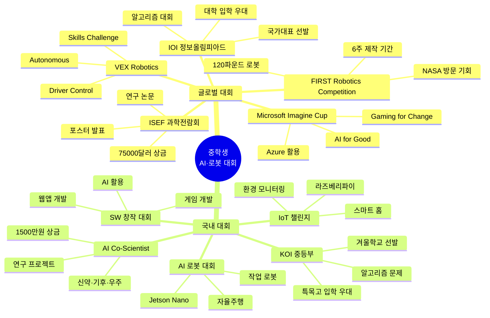
```mermaid
mindmap
  root((중학생<br/>AI·로봇 대회))
    글로벌 대회
      FIRST Robotics Competition
        120파운드 로봇
        6주 제작 기간
        NASA 방문 기회
      VEX Robotics
        Driver Control
        Autonomous
        Skills Challenge
      ISEF 과학전람회
        연구 논문
        포스터 발표
        75000달러 상금
      Microsoft Imagine Cup
        AI for Good
        Gaming for Change
        Azure 활용
      IOI 정보올림피아드
        알고리즘 대회
        대학 입학 우대
        국가대표 선발
    국내 대회
      AI Co-Scientist
        신약·기후·우주
        연구 프로젝트
        1500만원 상금
      IoT 챌린지
        스마트 홈
        환경 모니터링
        라즈베리파이
      KOI 중등부
        알고리즘 문제
        특목고 입학 우대
        겨울학교 선발
      AI 로봇 대회
        자율주행
        작업 로봇
        Jetson Nano
      SW 창작 대회
        웹앱 개발
        AI 활용
        게임 개발
```

## 중학생 필수 기술 스택

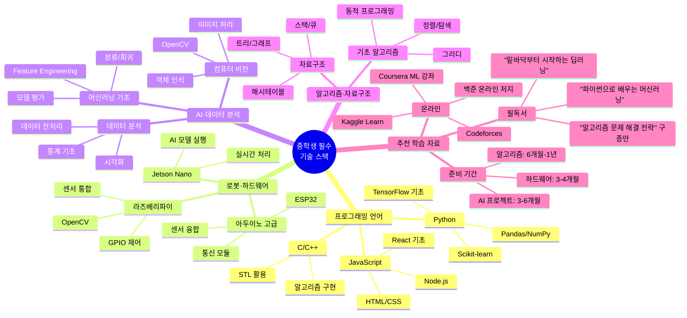
```mermaid
mindmap
  root((중학생 필수<br/>기술 스택))
    프로그래밍 언어
      Python
        Pandas/NumPy
        Scikit-learn
        TensorFlow 기초
      C/C++
        알고리즘 구현
        STL 활용
      JavaScript
        HTML/CSS
        React 기초
        Node.js
    로봇·하드웨어
      라즈베리파이
        GPIO 제어
        센서 통합
        OpenCV
      아두이노 고급
        ESP32
        센서 융합
        통신 모듈
      Jetson Nano
        AI 모델 실행
        실시간 처리
    AI·데이터 분석
      머신러닝 기초
        분류/회귀
        Feature Engineering
        모델 평가
      컴퓨터 비전
        OpenCV
        객체 인식
        이미지 처리
      데이터 분석
        데이터 전처리
        시각화
        통계 기초
    알고리즘·자료구조
      기초 알고리즘
        정렬/탐색
        그리디
        동적 프로그래밍
      자료구조
        스택/큐
        트리/그래프
        해시테이블
    추천 학습 자료
      필독서
        "알고리즘 문제 해결 전략" 구종만
        "밑바닥부터 시작하는 딥러닝"
        "파이썬으로 배우는 머신러닝"
      온라인
        백준 온라인 저지
        Codeforces
        Coursera ML 강좌
        Kaggle Learn
      준비 기간
        알고리즘: 6개월-1년
        AI 프로젝트: 3-6개월
        하드웨어: 3-4개월
```

## 중학생 글로벌 대회

### 1. FIRST Robotics Competition (FRC) - 중학생 참가 가능

#### 대회 개요
- **주최**: FIRST
- **대상**: 중학생 ~ 고등학생 (14-18세)
- **개최 시기**: 1월 킥오프, 2-3월 지역 대회, 4월 세계 대회
- **참가비**: 약 500-1,000만원 (팀 등록비, 로봇 부품, 이동 비용 포함)

#### 수상 부문 및 혜택

| 수상 | 상금/상품 | 추가 혜택 | 가치 |
|------|---------|---------|------|
| **Chairman's Award** | $5,000 | 세계 대회 진출 + NASA 방문 | 약 1,000만원 |
| **Engineering Inspiration** | $5,000 | 대학 장학금 연계 | 약 1,000만원 |
| **Championship Winner** | 트로피 + 메달 | 로봇 부품 $10,000 상당 | 약 1,500만원 |
| **Innovation in Control** | $5,000 | 기술 기업 인턴십 | 약 1,000만원 |
| **Industrial Design** | $5,000 | 3D 프린터 제공 | 약 1,000만원 |

#### 대회 특징
- **6주간 로봇 제작**: 1월 킥오프 후 6주 동안 120파운드 로봇 제작
- **게임 미션**: 매년 새로운 게임 (2026년: "REEFSCAPE" - 산호초 보호)
- **팀 규모**: 10-30명 (학생 + 멘토)
- **예산**: 평균 500-1,000만원 (스폰서 후원 필수)

#### 필요 기술
- **기계 설계**: CAD (SolidWorks, Fusion 360)
- **프로그래밍**: Java, C++, Python (ROS)
- **전기/전자**: 모터 제어, 센서 통합
- **전략**: 게임 분석, 얼라이언스 협력

---

### 2. VEX Robotics Competition

#### 대회 개요
- **주최**: VEX Robotics
- **대상**: 중학생 (VEX IQ Challenge), 고등학생 (VEX V5)
- **개최 시기**: 10월-4월 (시즌제)
- **참가비**: 지역 대회 10만원, 세계 대회 진출 시 자비 부담

#### 수상 부문 및 혜택

| 수상 | 상금/상품 | 추가 혜택 | 가치 |
|------|---------|---------|------|
| **Excellence Award** | 트로피 + 메달 | 세계 대회 진출 | 항공료 지원 |
| **Design Award** | 트로피 | VEX 부품 $500 상당 | 약 70만원 |
| **Tournament Champion** | 트로피 + 메달 | 다음 대회 시드 배정 | - |
| **Robot Skills Champion** | 트로피 | VEX 로봇 키트 | 약 100만원 |
| **Programming Skills** | 메달 | 온라인 강좌 | - |

#### 경기 방식
1. **Driver Control** (1분)
   - 조종기로 로봇 제어
   - 미션 수행

2. **Autonomous** (15초)
   - 자율 주행으로 미션 수행
   - 센서 및 알고리즘 활용

3. **Skills Challenge**
   - 개별 팀이 최고 점수 도전
   - Driver Skills + Programming Skills

#### 2026년 게임: "High Stakes"
- **미션**: 링을 골대에 넣기, 모바일 골 이동
- **점수**: 링 1개당 1-5점, 보너스 미션
- **전략**: 얼라이언스 협력 중요

---

### 3. International Science and Engineering Fair (ISEF)

#### 대회 개요
- **주최**: Society for Science & the Public
- **대상**: 중학생 ~ 고등학생 (9-12학년)
- **개최 시기**: 5월 (세계 대회)
- **참가비**: 무료 (지역 과학전람회 통과 필요)

#### 수상 부문 및 혜택

| 수상 | 상금 | 추가 혜택 | 총 가치 |
|------|------|---------|---------|
| **Gordon E. Moore Award** | $75,000 | 인텔 인턴십 | 약 1억원 |
| **1st Place (각 분야)** | $5,000 | 대학 장학금 연계 | 약 1,000만원 |
| **2nd Place** | $2,000 | 연구소 방문 | 약 500만원 |
| **3rd Place** | $1,000 | 멘토링 프로그램 | 약 300만원 |
| **Special Awards** | $1,000-$5,000 | 기업/대학 후원 | 다양 |

#### 참가 분야 (AI 관련)
1. **Robotics and Intelligent Machines**
   - 자율 주행 로봇
   - 휴머노이드 로봇
   - 드론

2. **Systems Software**
   - AI 알고리즘
   - 머신러닝 모델
   - 컴퓨터 비전

3. **Embedded Systems**
   - IoT 디바이스
   - 웨어러블
   - 스마트 홈

#### 제출 항목
1. **연구 논문** (영문, 20페이지 이내)
2. **연구 노트** (실험 과정 기록)
3. **포스터** (발표용)
4. **프로토타입** (실물 또는 영상)

#### 평가 기준
- **창의성** (30%): 독창적인 연구 주제
- **과학적 방법** (30%): 실험 설계, 데이터 분석
- **완성도** (20%): 연구 완성도
- **발표력** (20%): 명확한 전달

---

### 4. Microsoft Imagine Cup Junior

#### 대회 개요
- **주최**: Microsoft
- **대상**: 13-18세 (중·고등학생)
- **개최 시기**: 연중 (온라인 제출)
- **참가비**: 무료

#### 수상 부문 및 혜택

| 수상 | 상금 | 상품 | 추가 혜택 |
|------|------|------|---------|
| **Global Winner** | $10,000 | Surface 노트북 | 마이크로소프트 본사 방문 |
| **Regional Winner** | $5,000 | Xbox + 게임패스 | 온라인 멘토링 |
| **Category Winner** | $2,000 | Microsoft 365 구독 | Azure 크레딧 $1,000 |
| **Finalist** | - | 기념품 | 참가 인증서 |

#### 참가 카테고리
1. **AI for Good**
   - 사회 문제 해결 AI
   - 환경, 교육, 의료

2. **Gaming for Change**
   - 교육용 게임
   - 사회 인식 개선 게임

3. **Innovation Challenge**
   - 혁신적인 기술 솔루션
   - 스타트업 아이디어

#### 제출 항목
1. **프로젝트 설명** (영문, 500단어)
2. **시연 영상** (3분 이내)
3. **소스 코드** (GitHub 링크)
4. **프로토타입** (웹/앱)

#### 사용 기술
- **Azure AI**: Computer Vision, Language Understanding
- **Power Platform**: Power Apps, Power Automate
- **GitHub**: 버전 관리, 협업

---

### 5. International Olympiad in Informatics (IOI)

#### 대회 개요
- **주최**: IOI International Committee
- **대상**: 고등학생 이하 (20세 미만)
- **개최 시기**: 7-8월 (세계 대회)
- **참가비**: 무료 (국가대표 선발 필요)

#### 수상 부문 및 혜택

| 수상 | 메달 | 추가 혜택 | 가치 |
|------|------|---------|------|
| **금메달** | 금메달 + 상장 | 대학 입학 우대 (서울대, KAIST 등) | 무한대 |
| **은메달** | 은메달 + 상장 | 대학 입학 우대 | 무한대 |
| **동메달** | 동메달 + 상장 | 대학 입학 우대 | 무한대 |
| **참가** | 참가 인증서 | 국제 경험 | - |

#### 대회 형식
- **2일간 시험**: 각 5시간
- **6문제**: 알고리즘, 자료구조, 최적화
- **언어**: C, C++, Java, Python
- **채점**: 자동 채점 시스템 (100점 만점)

#### 문제 유형
1. **그래프 알고리즘**: BFS, DFS, 최단 경로
2. **동적 프로그래밍**: DP, 메모이제이션
3. **자료구조**: 세그먼트 트리, 유니온 파인드
4. **수학**: 정수론, 조합론
5. **기하**: 컨벡스 헐, 라인 스위핑

#### 한국 대표 선발 과정
1. **한국정보올림피아드 (KOI)** 1차 (5월)
2. **KOI 2차** (7월)
3. **KOI 겨울학교** (12월-1월)
4. **국가대표 최종 선발** (3월)
5. **IOI 세계 대회** (7-8월)

---

## 중학생 국내 대회

### 1. AI Co-Scientist Challenge

#### 대회 개요
- **주최**: 과학기술정보통신부, 한국과학창의재단
- **대상**: 중학생 1-3학년
- **개최 시기**: 6월 (예선), 8월 (본선)
- **참가비**: 무료

#### 수상 부문 및 혜택

| 수상 | 상금 | 추가 혜택 | 총 가치 |
|------|------|---------|---------|
| **대상** | 1,500만원 | 과기정통부 장관상 + 대학 연구실 인턴십 | 2,000만원 |
| **최우수상** | 1,000만원 | 과학창의재단 이사장상 + 연구 지원금 | 1,500만원 |
| **우수상** | 500만원 | 교육감상 + 노트북 | 700만원 |
| **장려상** | 200만원 | 상장 + 태블릿 | 300만원 |
| **특별상** | 100만원 | 기업 후원 상 | 200만원 |

#### 대회 주제 (2026년)
1. **신약 개발**: AI로 분자 구조 예측
2. **기후 변화**: 데이터 분석 및 예측 모델
3. **우주 탐사**: 천체 데이터 분석
4. **생명 과학**: 유전자 분석, 단백질 구조

#### 제출 항목
1. **연구 계획서** (A4 10장 이내)
   - 연구 배경
   - 연구 방법
   - 기대 효과

2. **연구 결과 보고서** (A4 20장 이내)
   - 실험 과정
   - 데이터 분석
   - 결론

3. **소스 코드** (Python, Jupyter Notebook)

4. **발표 자료** (PPT 15장 이내)

#### 평가 기준
- **과학적 엄밀성** (40점): 연구 방법, 데이터 분석
- **창의성** (30점): 독창적인 접근
- **실현 가능성** (20점): 기술적 완성도
- **발표력** (10점): 명확한 전달

#### 준비 전략
- **팀 구성**: 2-3명 (연구자, 개발자, 분석가)
- **준비 기간**: 3-6개월
- **필요 기술**: Python, Pandas, Scikit-learn, TensorFlow
- **멘토링**: 대학 연구실 또는 기업 연구소

---

### 2. IoT 챌린지

#### 대회 개요
- **주최**: 한국정보통신기술협회 (TTA)
- **대상**: 중학생 1-3학년
- **개최 시기**: 9월 (예선), 10월 (본선)
- **참가비**: 5만원

#### 수상 부문 및 혜택

| 수상 | 상금 | 상품 | 추가 혜택 |
|------|------|------|---------|
| **대상** | 1,000만원 | 라즈베리파이 키트 | TTA 회장상 + 기업 인턴십 |
| **최우수상** | 500만원 | 아두이노 메가 키트 | 상장 + 멘토링 |
| **우수상** | 300만원 | 센서 키트 | 상장 |
| **장려상** | 100만원 | 도서 상품권 | 상장 |

#### 대회 미션 (2026년)
1. **스마트 홈**: 가정 자동화 시스템
2. **환경 모니터링**: 대기질, 수질 측정
3. **안전**: 화재 감지, 침입 감지
4. **농업**: 스마트 팜, 자동 관개

#### 제출 항목
1. **IoT 시스템 실물**
   - 센서, 액추에이터, 통신 모듈
   - 클라우드 연동

2. **시스템 설명서** (A4 10장 이내)
   - 시스템 구조
   - 작동 원리
   - 사용 방법

3. **시연 영상** (5분 이내)

4. **소스 코드** (Arduino, Python)

#### 평가 기준
- **기술력** (40점): 센서 통합, 통신, 클라우드
- **실용성** (30점): 실생활 활용 가능성
- **완성도** (20점): 안정성, 에러 처리
- **창의성** (10점): 독창적인 아이디어

#### 사용 가능 장비
- **마이크로컨트롤러**: 아두이노, ESP32, 라즈베리파이
- **센서**: 온습도, 미세먼지, 조도, 초음파
- **통신**: Wi-Fi, 블루투스, LoRa
- **클라우드**: AWS IoT, Azure IoT, ThingSpeak

---

### 3. 한국정보올림피아드 (KOI) - 중등부

#### 🌐 공식 정보 및 등록

**공식 사이트**
- 공식: [http://www.koi.or.kr/](http://www.koi.or.kr/)
- 연습: [https://www.acmicpc.net/](https://www.acmicpc.net/) (백준 온라인 저지)
- 등록 기간: 매년 4월
- 참가비: **완전 무료**

**참가 자격**
- **중등부**: 중학교 재학생 (졸업생 불가)
- **고등부**: 고등학교 재학생
- 국적: 한국 국적 또는 한국 학교 재학생
- 제한: 고등부는 과거 IOI 참가 경력 없어야 함
- 개인전: 팀 구성 없음, 개인만 참가

**대회 단계**
1. **1차 대회** (5월, 온라인): 약 5,000명 참가
2. **2차 대회** (7월, 서울): 1차 통과자 약 300명
3. **겨울학교** (12월, 1주일): 2차 금·은·동상 수상자
4. **국가대표 선발전** (3월, 고등부만): 겨울학교 참가자 중 선발
5. **IOI 세계대회** (7월): 한국 대표 4명

#### 💻 필수 교구재 및 학습 자료

**1. 하드웨어 (최소 사양)**

| 항목 | 사양 | 가격 | 설명 |
|------|------|------|------|
| **컴퓨터** | CPU: i5 이상, RAM: 8GB 이상 | 기존 사용 | 노트북/데스크톱 모두 가능 |
| **인터넷** | 안정적인 연결 | - | 온라인 대회용 |

**2. 필수 소프트웨어 (무료)**

| 소프트웨어 | 용도 | 다운로드 |
|-----------|------|----------|
| **Visual Studio Code** | 코드 에디터 | [code.visualstudio.com](https://code.visualstudio.com/) |
| **C++ 컴파일러** (MinGW/GCC) | C++ 실행 | [mingw.org](https://www.mingw-w64.org/) |
| **Python** (선택) | Python 사용 시 | [python.org](https://www.python.org/) |
| **Git** (선택) | 버전 관리 | [git-scm.com](https://git-scm.com/) |

**3. 필수 교재**

| 교재명 | 저자 | 가격 | 구매처 | 난이도 |
|--------|------|------|--------|--------|
| **알고리즘 문제 해결 전략 (종만북)** | 구종만 | 45,000원 | 교보문고 | ⭐⭐⭐⭐⭐ |
| **이것이 코딩 테스트다** | 나동빈 | 34,000원 | 예스24 | ⭐⭐⭐ |
| **C++ 기초 플러스** | Stephen Prata | 40,000원 | 교보문고 | ⭐⭐ |

**4. 온라인 학습 자료 (무료)**

| 사이트 | 내용 | 추천 대상 |
|--------|------|----------|
| **백준 온라인 저지** (BOJ) | 문제 풀이 | 필수 |
| **Codeforces** | 글로벌 대회 | 고급 |
| **코드업** | 기초 문제 | 입문 |
| **알고리즘 문제 해결 전략 위키** | 종만북 해설 | 중급 |

**총 예상 비용**: **0-12만원** (교재 구매 시)

#### 📊 심사 평가 기준

**1차 대회 (온라인, 4시간)**

| 구성 | 내용 |
|------|------|
| **문제 수** | 5-6문제 |
| **시간** | 4시간 |
| **장소** | 자택 또는 학교 |
| **채점** | 자동 채점 시스템 |
| **언어** | C, C++, Java, Python |

**문제 난이도 분포**
- 1-2번: 브론즈~실버 (구현, 시뮬레이션) - 60-80% 정답률
- 3-4번: 골드 (DP, 그래프) - 30-50% 정답률
- 5-6번: 플래티넘 (고급 알고리즘) - 5-20% 정답률

**채점 방식**
- 각 문제 100점 만점
- 부분 점수: 일부 테스트 케이스만 통과 시
- 제출 횟수: 제한 없음 (단, 틀릴 때마다 패널티)
- 시간 패널티: 문제당 틀린 횟수 × 20분

**1차 통과 기준**
- **중등부**: 상위 30-40% (약 300명)
- **고등부**: 상위 15-20% (약 300명)
- 일반적으로 2-3문제 완전 해결 시 통과

**2차 대회 (오프라인, 5시간)**

| 구성 | 내용 |
|------|------|
| **문제 수** | 4문제 |
| **시간** | 5시간 |
| **장소** | 서울대학교 또는 연세대학교 |
| **채점** | 실시간 채점 (리더보드 공개) |

**문제 난이도**
- 1번: 골드 (DP, 그래프)
- 2번: 플래티넘 (세그먼트 트리, 네트워크 플로우)
- 3번: 플래티넘+ (고급 자료구조)
- 4번: 다이아몬드 (올림피아드 수준)

**수상 기준**
- **금상**: 상위 5% (약 15명)
- **은상**: 상위 15% (약 45명)
- **동상**: 상위 30% (약 90명)
- **장려상**: 상위 50%

**겨울학교 선발**
- 금·은·동상 수상자 전원 (약 150명)
- 1주일 집중 교육 (숙식 무료)
- IOI 국가대표 후보 선발

#### 💪 필수 역량 체크리스트

**알고리즘 역량 (난이도별)**

**입문 (1차 통과 목표)**
| 알고리즘 | 난이도 | 학습 기간 | BOJ 추천 문제 |
|----------|--------|----------|---------------|
| ✅ 기본 입출력 | ⭐☆☆ | 3일 | 2557, 1000 |
| ✅ 조건문/반복문 | ⭐☆☆ | 1주 | 2739, 10950 |
| ✅ 배열/문자열 | ⭐☆☆ | 1주 | 10818, 11654 |
| ✅ 정렬 | ⭐⭐☆ | 1주 | 2750, 10989 |
| ✅ 완전 탐색 | ⭐⭐☆ | 2주 | 2309, 1018 |
| ✅ 그리디 | ⭐⭐☆ | 2주 | 11047, 1931 |

**중급 (2차 준비)**
| 알고리즘 | 난이도 | 학습 기간 | BOJ 추천 문제 |
|----------|--------|----------|---------------|
| ✅ BFS/DFS | ⭐⭐⭐ | 3주 | 1260, 2178 |
| ✅ DP (기초) | ⭐⭐⭐ | 4주 | 1463, 9095 |
| ✅ 다익스트라 | ⭐⭐⭐ | 2주 | 1753 |
| ✅ 스택/큐 | ⭐⭐☆ | 1주 | 10828, 18258 |

**고급 (금상 목표)**
| 알고리즘 | 난이도 | 학습 기간 | BOJ 추천 문제 |
|----------|--------|----------|---------------|
| ✅ DP (고급) | ⭐⭐⭐⭐ | 2개월 | 2293, 11049 |
| ✅ 세그먼트 트리 | ⭐⭐⭐⭐ | 3주 | 2042 |
| ✅ 유니온 파인드 | ⭐⭐⭐ | 2주 | 1717 |
| ✅ 위상 정렬 | ⭐⭐⭐ | 1주 | 2252 |

**프로그래밍 기술**
- ✅ C++ STL 활용 (vector, map, set, priority_queue)
- ✅ 빠른 입출력 (cin.tie(0), ios::sync_with_stdio(0))
- ✅ 디버깅 기술
- ✅ 시간 복잡도 계산

**소프트 스킬**
- ✅ 집중력 (4-5시간 문제 풀이)
- ✅ 인내심 (어려운 문제 포기하지 않기)
- ✅ 시간 관리 (문제 선택 전략)
- ✅ 스트레스 관리

#### 📅 준비 일정표 (6개월 기준)

**1-2개월: 기초 다지기**
- C++ 문법 완벽 숙지
- BOJ 브론즈 50문제 풀이
- BOJ 실버 30문제 풀이

**3-4개월: 중급 알고리즘**
- DP 집중 학습 (30문제)
- 그래프 알고리즘 (20문제)
- BOJ 골드 20문제 풀이

**5개월: 1차 대비**
- 과거 1차 문제 풀이 (최근 5년)
- 모의고사 (주 2회)
- 약점 보완

**6개월: 2차 대비 (1차 통과 후)**
- 고급 알고리즘 학습
- 과거 2차 문제 풀이
- 실전 감각 유지

**일일 학습 권장량**
- 평일: 2-3시간, 2-3문제
- 주말: 4-6시간, 5-7문제
- 총: 주 20-30시간, 주 20-30문제

#### 🎯 합격 전략 및 팁

**1차 대회 전략**
1. **쉬운 문제부터**: 1, 2번 완벽 해결 (40분)
2. **3번 도전**: 1시간 투자
3. **4번 고민**: 가능하면 도전 (1시간)
4. **5, 6번**: 부분 점수라도 노리기

**시간 배분**
- 문제 읽기: 30분 (모든 문제 파악)
- 1-2번: 각 20분
- 3번: 60분
- 4번: 60분
- 5-6번: 나머지 시간
- 검토: 30분

**2차 대회 전략**
- 1번 완벽 해결 (1.5시간)
- 2번 도전 (2시간)
- 3번 부분 점수 (1시간)
- 4번 분석 (30분)

**디버깅 팁**
- 작은 테스트 케이스 직접 만들기
- 예외 상황 체크 (0, 음수, 최댓값)
- 코드 다시 읽기
- 논리 오류 vs 구현 오류 구분

**실전 조언**
- "1, 2번은 절대 틀리지 말기"
- "부분 점수도 점수다"
- "막히면 다음 문제로"
- "마지막 30분은 검토 시간"

#### 🏆 수상자 인터뷰

**2025년 금상 수상자 (중2)**
- 준비 기간: 1년
- 하루 평균: 3시간
- 총 문제 수: 500문제
- 핵심: "매일 꾸준히, 어려워도 포기 안 함"

**합격 후기**
- "처음엔 브론즈도 어려웠는데 6개월 후 골드 풀게 됨"
- "종만북은 3번 정독했어요"
- "1차 때 3문제 풀고 통과, 2차 때 1.5문제로 은상"

#### 대회 개요
- **주최**: 한국정보과학회, 한국정보올림피아드위원회
- **대상**: 중학생 1-3학년
- **개최 시기**: 5월 (1차), 7월 (2차), 12월 (겨울학교)
- **참가비**: 무료

#### 수상 부문 및 혜택

| 수상 | 메달 | 추가 혜택 | 가치 |
|------|------|---------|------|
| **금상** | 금메달 + 상장 | 특목고 입학 우대 + 겨울학교 참가 | 무한대 |
| **은상** | 은메달 + 상장 | 특목고 입학 우대 | 무한대 |
| **동상** | 동메달 + 상장 | 특목고 입학 우대 | 무한대 |
| **장려상** | 상장 | 참가 인증서 | - |

#### 대회 형식
- **1차 대회**: 5문제, 4시간
- **2차 대회**: 4문제, 5시간
- **언어**: C, C++, Java, Python
- **채점**: 온라인 자동 채점

#### 문제 유형
1. **기초 알고리즘**: 정렬, 탐색, 그리디
2. **동적 프로그래밍**: DP, 메모이제이션
3. **그래프**: BFS, DFS, 최단 경로
4. **자료구조**: 스택, 큐, 우선순위 큐
5. **수학**: 정수론, 조합론

#### 준비 방법
- **추천 교재**: "알고리즘 문제 해결 전략" (구종만)
- **온라인 저지**: BOJ (백준), Codeforces
- **학습 기간**: 6개월-1년
- **하루 학습량**: 2-3문제

---

### 4. 전국 중학생 AI 로봇 대회

#### 대회 개요
- **주최**: 한국로봇산업진흥원
- **대상**: 중학생 1-3학년
- **개최 시기**: 10월 (예선), 11월 (본선)
- **참가비**: 10만원

#### 수상 부문 및 혜택

| 수상 | 상금 | 상품 | 추가 혜택 |
|------|------|------|---------|
| **금상** | 300만원 | 라즈베리파이 AI 키트 | 세계 대회 진출 지원 |
| **은상** | 200만원 | Jetson Nano | 로봇 교육 바우처 |
| **동상** | 100만원 | 아두이노 메가 키트 | 온라인 강좌 |
| **장려상** | 50만원 | 센서 키트 | 상장 |

#### 경기 종목

**1. 자율주행 로봇**
- **미션**: 라인 트레이서 + 장애물 회피
- **기술**: 카메라, 라이다, 초음파 센서
- **알고리즘**: 컴퓨터 비전, 경로 계획

**2. 작업 로봇**
- **미션**: 물체 집기, 분류, 운반
- **기술**: 로봇팔, 그리퍼, 카메라
- **알고리즘**: 역기구학, 객체 인식

**3. 창의 로봇**
- **주제**: "농업 자동화 로봇" (2026년)
- **평가**: 창의성, 기능성, 발표력

#### 사용 가능 플랫폼
- **라즈베리파이** + 카메라 + OpenCV
- **Jetson Nano** + AI 모델
- **아두이노** + 센서
- **ROS** (Robot Operating System)

---

### 5. SW 창작 대회 - 중등부

#### 대회 개요
- **주최**: 한국정보과학회
- **대상**: 중학생 1-3학년
- **개최 시기**: 11월 (예선), 12월 (본선)
- **참가비**: 무료

#### 수상 부문 및 혜택

| 수상 | 상금 | 추가 혜택 | 총 가치 |
|------|------|---------|---------|
| **대상** | 500만원 | 정보과학회장상 + 노트북 | 700만원 |
| **최우수상** | 300만원 | 상장 + 태블릿 | 450만원 |
| **우수상** | 200만원 | 상장 + 코딩 교육 바우처 | 300만원 |
| **장려상** | 100만원 | 상장 | 100만원 |

#### 참가 부문

**1. 웹/앱 개발**
- **기술**: HTML, CSS, JavaScript, React
- **주제**: 교육, 생활 편의, 소셜
- **평가**: UI/UX, 기능, 완성도

**2. AI 활용**
- **기술**: Python, TensorFlow, PyTorch
- **주제**: 이미지 인식, 자연어 처리, 예측 모델
- **평가**: AI 활용도, 정확도, 창의성

**3. 게임 개발**
- **기술**: Unity, Unreal Engine, Pygame
- **주제**: 교육용 게임, 시뮬레이션
- **평가**: 재미, 그래픽, 완성도

#### 제출 항목
1. **소스 코드** (GitHub 링크)
2. **실행 파일** 또는 **웹 링크**
3. **시연 영상** (5분 이내)
4. **기술 문서** (A4 10장 이내)
5. **발표 자료** (본선 진출 시)

---

# Part 3: 고등학생 대상 대회

## 고등학생 대회 전체 개요

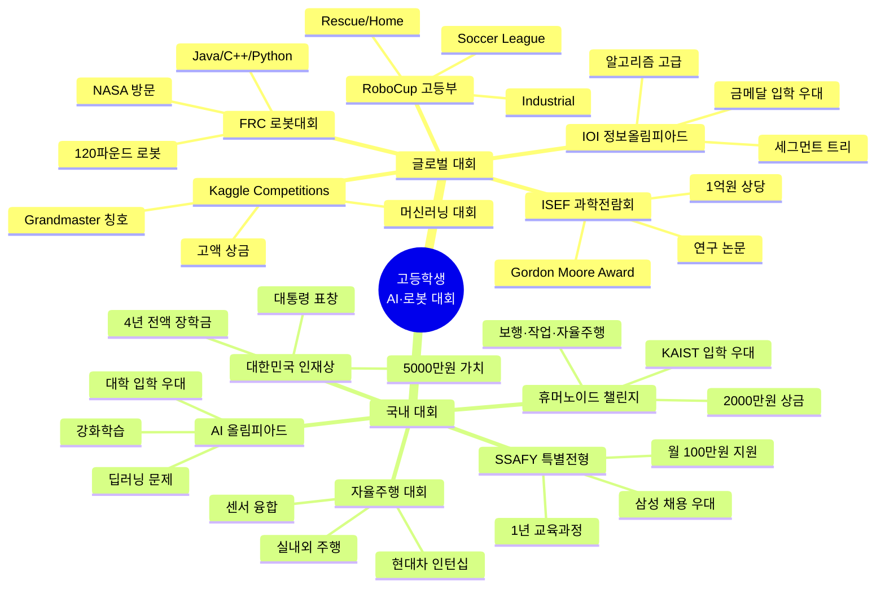
```mermaid
mindmap
  root((고등학생<br/>AI·로봇 대회))
    글로벌 대회
      IOI 정보올림피아드
        알고리즘 고급
        세그먼트 트리
        금메달 입학 우대
      ISEF 과학전람회
        연구 논문
        Gordon Moore Award
        1억원 상당
      RoboCup 고등부
        Soccer League
        Rescue/Home
        Industrial
      Kaggle Competitions
        머신러닝 대회
        고액 상금
        Grandmaster 칭호
      FRC 로봇대회
        120파운드 로봇
        Java/C++/Python
        NASA 방문
    국내 대회
      휴머노이드 챌린지
        보행·작업·자율주행
        KAIST 입학 우대
        2000만원 상금
      자율주행 대회
        실내외 주행
        센서 융합
        현대차 인턴십
      AI 올림피아드
        딥러닝 문제
        강화학습
        대학 입학 우대
      SSAFY 특별전형
        1년 교육과정
        월 100만원 지원
        삼성 채용 우대
      대한민국 인재상
        대통령 표창
        4년 전액 장학금
        5000만원 가치
```

## 고등학생 필수 기술 스택

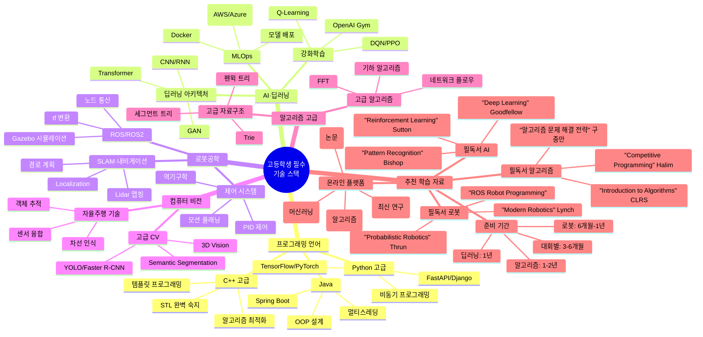
```mermaid
mindmap
  root((고등학생 필수<br/>기술 스택))
    프로그래밍 언어
      Python 고급
        TensorFlow/PyTorch
        FastAPI/Django
        비동기 프로그래밍
      C++ 고급
        알고리즘 최적화
        STL 완벽 숙지
        템플릿 프로그래밍
      Java
        Spring Boot
        OOP 설계
        멀티스레딩
    AI·딥러닝
      딥러닝 아키텍처
        CNN/RNN
        Transformer
        GAN
      강화학습
        Q-Learning
        DQN/PPO
        OpenAI Gym
      MLOps
        모델 배포
        Docker
        클라우드(AWS/Azure)
    로봇공학
      ROS/ROS2
        노드 통신
        tf 변환
        Gazebo 시뮬레이션
      SLAM·내비게이션
        Lidar 맵핑
        경로 계획
        Localization
      제어 시스템
        PID 제어
        역기구학
        모션 플래닝
    컴퓨터 비전
      고급 CV
        YOLO/Faster R-CNN
        Semantic Segmentation
        3D Vision
      자율주행 기술
        차선 인식
        객체 추적
        센서 융합
    알고리즘 고급
      고급 자료구조
        세그먼트 트리
        펜윅 트리
        Trie
      고급 알고리즘
        네트워크 플로우
        FFT
        기하 알고리즘
    추천 학습 자료
      필독서 알고리즘
        "Introduction to Algorithms" CLRS
        "Competitive Programming" Halim
        "알고리즘 문제 해결 전략" 구종만
      필독서 AI
        "Deep Learning" Goodfellow
        "Pattern Recognition" Bishop
        "Reinforcement Learning" Sutton
      필독서 로봇
        "Probabilistic Robotics" Thrun
        "Modern Robotics" Lynch
        "ROS Robot Programming"
      온라인 플랫폼
        Codeforces(알고리즘)
        Kaggle(머신러닝)
        Papers with Code(논문)
        arXiv(최신 연구)
      준비 기간
        알고리즘: 1-2년
        딥러닝: 1년
        로봇: 6개월-1년
        대회별: 3-6개월
```

## 고등학생 글로벌 대회

### 1. International Olympiad in Informatics (IOI)

*(중학생 섹션 참조 - 고등학생도 동일)*

---

### 2. Intel International Science and Engineering Fair (ISEF)

*(중학생 섹션 참조 - 고등학생도 동일)*

---

### 3. RoboCup (고등부)

#### 대회 개요
- **주최**: RoboCup Federation
- **대상**: 고등학생 ~ 대학생
- **개최 시기**: 7월 (세계 대회)
- **참가비**: 지역 대회 무료, 세계 대회 자비 부담

#### 수상 부문 및 혜택

| 리그 | 우승 상금 | 상품 | 추가 혜택 |
|------|---------|------|---------|
| **Soccer** | $5,000 | 트로피 + 메달 | 대학 장학금 연계 |
| **Rescue** | $3,000 | 트로피 + 메달 | 로봇 키트 |
| **@Home** | $5,000 | 트로피 + 메달 | 기업 스폰서십 |
| **Industrial** | $10,000 | 트로피 + 메달 | 산업체 인턴십 |

#### 리그별 특징

**1. Soccer League**
- **미션**: 자율 로봇 축구 경기
- **팀 구성**: 로봇 5-11대
- **기술**: 컴퓨터 비전, 멀티 에이전트 협력
- **경기장**: 9m × 6m

**2. Rescue League**
- **미션**: 재난 현장에서 피해자 구조
- **난이도**: Line (초급), Maze (고급)
- **기술**: SLAM, 경로 계획, 센서 융합

**3. @Home League**
- **미션**: 가정용 서비스 로봇
- **태스크**: 물체 인식, 음성 인식, 내비게이션
- **기술**: ROS, 컴퓨터 비전, NLP

**4. Industrial League**
- **미션**: 산업용 로봇 작업
- **태스크**: 물류, 조립, 품질 검사
- **기술**: 로봇팔, 그리퍼, 3D 비전

---

### 4. Kaggle Competitions

#### 🌐 공식 정보 및 등록

**공식 사이트**
- Kaggle: [https://www.kaggle.com/](https://www.kaggle.com/)
- 등록: 무료 계정 생성 (Gmail 연동)
- 참가비: **완전 무료**
- GPU: Kaggle Notebook에서 무료 제공 (주 30시간)

**참가 자격**
- 나이 제한: **만 13세 이상**
- 국적: 제한 없음 (전 세계 참가 가능)
- 팀: 개인 또는 팀 (대회별 상이, 보통 최대 5명)
- 상금: 미성년자는 보호자 동의 필요

**대회 유형**
1. **Featured Competitions**: 기업 후원, 고액 상금 ($10,000-$100,000)
2. **Research Competitions**: 학술 연구, 논문 발표 기회
3. **Getting Started**: 입문자용, 상금 없음
4. **Playground**: 연습용, 상금 없음
5. **Recruitment**: 채용 연계

**Kaggle 등급 시스템**
- **Novice**: 시작 단계
- **Contributor**: 첫 제출
- **Expert**: 메달 2개 (동×2, 은×1, 금×0.5)
- **Master**: 메달 5개
- **Grandmaster**: 금메달 5개 + 1등 1회

#### 💻 필수 교구재 및 학습 자료

**1. 하드웨어 (권장 사양)**

| 항목 | 최소 | 권장 | 설명 |
|------|------|------|------|
| **CPU** | i5 | i7 이상 | 데이터 전처리용 |
| **RAM** | 8GB | 16GB 이상 | 대용량 데이터셋 |
| **GPU** | 없음 | RTX 3060 이상 | Kaggle 무료 GPU로 대체 가능 |
| **저장공간** | 100GB | 500GB+ | 데이터셋 저장 |

💡 **Tip**: 로컬 GPU 없어도 Kaggle Notebook 무료 GPU로 충분!

**2. 필수 소프트웨어 (무료)**

| 소프트웨어 | 용도 | 다운로드 |
|-----------|------|----------|
| **Anaconda** | Python 패키지 관리 | [anaconda.com](https://www.anaconda.com/) |
| **Jupyter Notebook** | 코드 작성 | Anaconda에 포함 |
| **Visual Studio Code** | IDE | [code.visualstudio.com](https://code.visualstudio.com/) |
| **Git** | 버전 관리 | [git-scm.com](https://git-scm.com/) |

**3. 필수 Python 라이브러리**

```python
# 데이터 처리
pandas, numpy, scipy

# 시각화
matplotlib, seaborn, plotly

# 머신러닝
scikit-learn, xgboost, lightgbm, catboost

# 딥러닝
tensorflow, keras, pytorch

# 유틸리티
tqdm, joblib, pickle
```

**4. 필수 교재**

| 교재명 | 저자 | 가격 | 난이도 |
|--------|------|------|--------|
| **파이썬 머신러닝 완벽 가이드** | 권철민 | 36,000원 | ⭐⭐⭐ |
| **캐글 가이드** | 김태영 | 30,000원 | ⭐⭐⭐⭐ |
| **핸즈온 머신러닝** | 오렐리앙 제롱 | 55,000원 | ⭐⭐⭐⭐ |
| **밑바닥부터 시작하는 딥러닝** | 사이토 고키 | 20,000원 | ⭐⭐⭐ |

**5. 무료 온라인 강좌**

| 강좌 | 플랫폼 | 난이도 |
|------|--------|--------|
| **Machine Learning** (Andrew Ng) | [Coursera](https://www.coursera.org/) | ⭐⭐⭐ |
| **Kaggle Learn** | [Kaggle](https://www.kaggle.com/learn) | ⭐⭐☆ |
| **Fast.ai** | [fast.ai](https://www.fast.ai/) | ⭐⭐⭐ |
| **Deep Learning 특화 과정** | [Coursera](https://www.coursera.org/) | ⭐⭐⭐⭐ |

**총 예상 비용**: **0-14만원** (교재 선택 시)

#### 📊 심사 평가 기준

**평가 방식 (대회별 상이)**

**1. Classification (분류)**
- **평가 지표**: Accuracy, AUC, F1-Score, Log Loss
- **예시**: Titanic, Credit Card Fraud

**2. Regression (회귀)**
- **평가 지표**: RMSE, MAE, R²
- **예시**: House Prices

**3. Computer Vision**
- **평가 지표**: Mean IoU, Dice Coefficient
- **예시**: Image Segmentation, Object Detection

**4. NLP**
- **평가 지표**: BLEU, ROUGE, Perplexity
- **예시**: Text Classification, Translation

**5. Time Series**
- **평가 지표**: MAPE, SMAPE
- **예시**: Sales Forecasting

**제출 방식**
1. **Public Leaderboard**: 제출 시 즉시 점수 확인 (테스트 데이터 30%)
2. **Private Leaderboard**: 대회 종료 후 공개 (테스트 데이터 70%)
3. **최종 순위**: Private Leaderboard 기준

**수상 기준 (일반적)**
- **금메달**: 상위 0.2% (약 10-40위)
- **은메달**: 상위 2% (약 40-200위)
- **동메달**: 상위 10% (약 200-1000위)

**상금 분배 (예시: $100,000 대회)**
- 1위: $30,000
- 2위: $20,000
- 3위: $15,000
- 4-10위: $5,000씩

#### 💪 필수 역량 체크리스트

**기술 역량 (단계별)**

**입문 (Getting Started 완료 목표)**
| 역량 | 난이도 | 학습 기간 | 필수도 |
|------|--------|----------|--------|
| ✅ Python 기초 | ⭐⭐☆ | 1개월 | 필수 |
| ✅ Pandas 데이터 처리 | ⭐⭐☆ | 2주 | 필수 |
| ✅ Matplotlib 시각화 | ⭐⭐☆ | 1주 | 필수 |
| ✅ Scikit-learn 기초 | ⭐⭐⭐ | 1개월 | 필수 |
| ✅ Jupyter Notebook | ⭐☆☆ | 3일 | 필수 |

**중급 (메달 목표)**
| 역량 | 난이도 | 학습 기간 | 필수도 |
|------|--------|----------|--------|
| ✅ Feature Engineering | ⭐⭐⭐⭐ | 2개월 | 필수 |
| ✅ XGBoost/LightGBM | ⭐⭐⭐ | 1개월 | 필수 |
| ✅ Cross Validation | ⭐⭐⭐ | 2주 | 필수 |
| ✅ Hyperparameter Tuning | ⭐⭐⭐ | 1개월 | 필수 |
| ✅ Ensemble 기법 | ⭐⭐⭐⭐ | 1개월 | 필수 |

**고급 (상위 1% 목표)**
| 역량 | 난이도 | 학습 기간 | 필수도 |
|------|--------|----------|--------|
| ✅ Deep Learning (CNN/RNN) | ⭐⭐⭐⭐ | 3개월 | 권장 |
| ✅ Transfer Learning | ⭐⭐⭐⭐ | 1개월 | 권장 |
| ✅ Model Stacking | ⭐⭐⭐⭐⭐ | 2개월 | 고급 |
| ✅ GPU 최적화 | ⭐⭐⭐⭐ | 1개월 | 고급 |

**도메인 지식**
- ✅ 통계학 기초 (평균, 분산, 분포)
- ✅ 선형대수 (행렬, 벡터)
- ✅ 확률론 기초
- ✅ 최적화 이론

**소프트 스킬**
- ✅ 데이터 분석 사고력
- ✅ 인내심 (수백 번 실험)
- ✅ 논문 읽기 능력
- ✅ 커뮤니티 활동 (Discussion, Notebook 공유)

#### 📅 준비 일정표 (6개월 기준)

**1개월: Python & 기초**
- Week 1-2: Python 문법
- Week 3: Pandas, NumPy
- Week 4: Matplotlib, Seaborn

**2개월: 머신러닝 기초**
- Week 5-6: Scikit-learn (분류, 회귀)
- Week 7: Feature Engineering 입문
- Week 8: Kaggle Learn 수강

**3개월: 첫 대회**
- Week 9-12: Titanic, House Prices 완료
- 목표: Public Leaderboard 상위 30%

**4-5개월: 실전 대회**
- Featured Competition 참가
- Discussion 읽기
- Public Notebook 분석
- 목표: 동메달

**6개월: 심화**
- XGBoost, LightGBM 마스터
- Ensemble 기법 학습
- 목표: 은메달

#### 🎯 합격 전략 및 팁

**입문자 추천 대회 순서**
1. **Titanic**: 생존자 예측 (이진 분류)
2. **House Prices**: 주택 가격 예측 (회귀)
3. **Digit Recognizer**: MNIST 숫자 인식 (CNN)
4. **NLP with Disaster Tweets**: 재난 트윗 분류 (NLP)

**고득점 전략**
1. **EDA (탐색적 데이터 분석)**: 2-3일 투자
2. **Feature Engineering**: 전체 시간의 50%
3. **Model Selection**: XGBoost/LightGBM 조합
4. **Cross Validation**: 5-Fold 이상
5. **Ensemble**: 여러 모델 조합

**Public vs Private Overfitting 방지**
- Public Leaderboard에 집착하지 말기
- 안정적인 CV 점수 유지
- 최종 제출 2개 신중히 선택

**Discussion 활용법**
- 대회 시작하자마자 Discussion 읽기
- Winning Solution 분석 (대회 종료 후)
- 질문하기 (겸손하게)

**Notebook 공유**
- 자신의 EDA/접근법 공유 → Upvotes → 등급 상승
- 다른 사람 Notebook에서 배우기

**시간 관리**
- 평일: 1-2시간 (EDA, Feature Engineering)
- 주말: 4-6시간 (모델 학습, 튜닝)
- 대회 마감 1주 전: 집중 투입

#### 🏆 수상자 인터뷰

**Kaggle Master (고3, 금메달 5개)**
- 시작: 고1, Titanic부터
- 첫 메달: 6개월 후 동메달
- 하루 평균: 2시간
- 핵심: "꾸준함과 Discussion 읽기"

**성공 팁**
- "처음엔 상위 50%도 어려웠는데, 1년 후 상위 1%"
- "Feature Engineering이 70%, 모델은 30%"
- "다른 사람 코드 읽고 배우기"
- "포기하지 않기 - 100등 밖에서 시작해도 끝에는 메달권"

**추천 학습 경로**
1. Kaggle Learn Courses (무료, 2주)
2. Titanic + House Prices (1개월)
3. Featured Competition 참가 (3개월)
4. Ensemble 학습 (1개월)
5. 지속적인 대회 참가

#### 대회 개요
- **주최**: Kaggle (Google)
- **대상**: 전 연령 (고등학생 참가 가능)
- **개최 시기**: 연중 (다양한 대회)
- **참가비**: 무료

#### 수상 부문 및 혜택

| 순위 | 상금 (대회별 상이) | 추가 혜택 |
|------|------------------|---------|
| **1위** | $10,000-$100,000 | Kaggle Grandmaster 칭호 |
| **2위** | $5,000-$50,000 | Kaggle Master 칭호 |
| **3위** | $3,000-$30,000 | Kaggle Expert 칭호 |
| **메달권** | - | 순위 배지 |

#### 주요 대회 유형
1. **Featured Competitions**: 기업 후원, 고액 상금
2. **Research Competitions**: 학술 연구 목적
3. **Getting Started**: 초보자용 연습 대회
4. **Playground**: 실력 향상용 대회

#### 인기 대회 (2026년 예정)
- **Titanic**: 생존자 예측 (입문용)
- **House Prices**: 주택 가격 예측
- **Digit Recognizer**: 손글씨 숫자 인식
- **NLP with Disaster Tweets**: 재난 트윗 분류

#### 필요 기술
- **Python**: Pandas, NumPy, Matplotlib
- **머신러닝**: Scikit-learn, XGBoost, LightGBM
- **딥러닝**: TensorFlow, PyTorch
- **데이터 전처리**: Feature Engineering

---

### 5. FIRST Robotics Competition (FRC)

*(중학생 섹션 참조 - 고등학생도 동일)*

---

## 고등학생 국내 대회

### 1. 휴머노이드 챌린지

#### 🌐 공식 정보 및 등록

**공식 사이트**
- KAIST 로봇공학학제전공: [https://robot.kaist.ac.kr/](https://robot.kaist.ac.kr/)
- 한국로봇학회: [http://www.kros.org/](http://www.kros.org/)
- 등록 기간: 매년 5-6월
- 참가비: 20만원 (예선), 50만원 (본선 진출 시)

**참가 자격**
- 대상: **고등학생 1-3학년** (재학생만 가능)
- 팀 구성: **5-7명** (기계, 전기, 소프트웨어 분야 균형)
- 지도교사: 1명 필수
- 멘토: 대학 연구실 또는 기업 연구원 (선택, 강력 권장)
- 제한: 과거 대상 수상팀은 3년간 참가 불가

**대회 규정**
- 로봇 규격: 높이 40-60cm (휴머노이드 형태)
- 무게: 최대 5kg
- 자율/반자율: 미션별 상이
- 안전: 배터리, 구동부 안전 기준 충족 필수

**등록 절차**
1. 팀 구성 및 지도교사 섭외 (3-4월)
2. 프로젝트 계획서 제출 (5월)
3. 서류 심사 통과 (6월, 약 30팀 선발)
4. 예선 (7월, 15팀 선발)
5. 본선 (8월)

#### 📦 필수 교구재 및 구매 가이드

**1. 휴머노이드 플랫폼 (선택)**

| 제품명 | 가격 | 구매처 | 장단점 |
|--------|------|--------|--------|
| **Darwin-OP3** | 500만원 | ROBOTIS | ✅ 완제품, ROS 지원 ❌ 고가 |
| **Poppy Humanoid** | 300만원 | 3D 프린팅+부품 | ✅ 오픈소스 ❌ 조립 복잡 |
| **NAO** | 1,500만원 | SoftBank Robotics | ✅ 최고급 ❌ 초고가 |
| **자체 제작** | 200-400만원 | 부품별 구매 | ✅ 커스터마이징 ❌ 높은 난이도 |

💡 **추천**: 대부분 팀이 **자체 제작**을 선택 (창의성 평가 유리)

**2. 핵심 부품 (자체 제작 시)**

| 부품 | 수량 | 단가 | 총액 | 구매처 |
|------|------|------|------|--------|
| **서보모터 (고토크)** | 18-20개 | 8-15만원 | 180만원 | ROBOTIS, 디바이스마트 |
| **메인 컴퓨터 (Jetson Xavier NX)** | 1개 | 80만원 | 80만원 | NVIDIA 공식 |
| **IMU 센서** | 1개 | 10만원 | 10만원 | 디바이스마트 |
| **카메라 (RealSense D435)** | 1개 | 40만원 | 40만원 | Intel 공식 |
| **리튬폴리머 배터리** | 2개 | 10만원 | 20만원 | 배터리마트 |
| **프레임 (알루미늄)** | 1세트 | 30만원 | 30만원 | 맞춤 제작 |
| **전원 관리 보드** | 1개 | 15만원 | 15만원 | 자체 제작 |
| **기타 (볼트, 너트 등)** | - | - | 20만원 | - |

**총 부품 비용**: **약 395만원**

**3. 개발 장비**

| 장비 | 가격 | 용도 |
|------|------|------|
| **고성능 노트북** | 150-200만원 | 시뮬레이션, 개발 |
| **3D 프린터** | 50만원 | 프레임 프로토타입 (학교 장비 활용 가능) |
| **오실로스코프** | 30만원 | 회로 디버깅 (선택) |
| **멀티미터** | 3만원 | 전압/전류 측정 |
| **납땜 도구** | 5만원 | 회로 제작 |

**4. 소프트웨어 (대부분 무료)**

| 소프트웨어 | 용도 | 가격 |
|-----------|------|------|
| **ROS/ROS2** | 로봇 제어 프레임워크 | 무료 |
| **Gazebo** | 물리 시뮬레이션 | 무료 |
| **PyBullet** | 보행 시뮬레이션 | 무료 |
| **SolidWorks** | 3D 설계 | 학생 라이선스 무료 |
| **OpenCV** | 컴퓨터 비전 | 무료 |
| **TensorFlow/PyTorch** | AI 모델 | 무료 |

**총 예상 비용**: **800-1,000만원** (학교/스폰서 지원 필수)

#### 📊 심사 평가 기준 (2026년)

**예선 (서류+영상 심사)**
| 항목 | 배점 | 평가 내용 |
|------|------|----------|
| **계획서** | 40점 | 기술적 실현 가능성, 창의성 |
| **팀 구성** | 20점 | 역할 분담, 경험 |
| **예산 계획** | 20점 | 현실적인 예산 |
| **프로토타입 영상** | 20점 | 초기 개발 진행 상황 |

**본선: 4가지 미션 (총 400점)**

**1. 보행 챌린지 (100점)**
| 미션 | 배점 | 내용 |
|------|------|------|
| **평지 보행** | 30점 | 10m 직선 보행, 안정성 |
| **경사로** | 30점 | 15도 경사 오르내리기 |
| **계단** | 20점 | 높이 10cm 계단 3개 |
| **장애물** | 20점 | 높이 5cm 장애물 넘기 |

**평가 요소**
- 안정성 (넘어지지 않음): 50%
- 속도 (빠를수록 고득점): 30%
- 에너지 효율: 20%

**2. 작업 챌린지 (100점)**
| 미션 | 배점 | 내용 |
|------|------|------|
| **물체 집기** | 30점 | 다양한 형태 물체 (정육면체, 원통) |
| **문 열기** | 25점 | 손잡이 돌리기 |
| **버튼 누르기** | 20점 | 높이 1.2m 버튼 |
| **물체 배치** | 25점 | 정해진 위치에 정확히 |

**평가 요소**
- 정확도 (±2cm 이내): 40%
- 속도: 30%
- 다양성 (여러 물체 성공): 30%

**3. 자율 주행 (100점)**
| 미션 | 배점 | 내용 |
|------|------|------|
| **경로 계획** | 30점 | A → B 최적 경로 |
| **장애물 회피** | 30점 | 정적+동적 장애물 |
| **목표 인식** | 20점 | ArUco 마커 인식 및 접근 |
| **복귀** | 20점 | 출발점으로 복귀 |

**평가 요소**
- SLAM 정확도: 40%
- 경로 효율성: 30%
- 안전성 (충돌 없음): 30%

**4. 통합 미션 (100점)**
| 시나리오 | 배점 | 내용 |
|----------|------|------|
| **재난 구조 로봇** | 100점 | 2026년 테마 |

**통합 미션 순서**
1. 출발지에서 10m 보행 (30점)
2. 계단 올라가기 (20점)
3. 피해자(물체) 발견 및 집기 (20점)
4. 안전 지역으로 운반 (20점)
5. 구조 신호 보내기 (버튼 누르기) (10점)

**제한 시간**: 10분
**평가**: 완료 미션 수 + 시간 + 안정성

#### 💪 필수 역량 체크리스트

**기계 설계 역량**
| 역량 | 난이도 | 담당 인원 | 학습 기간 |
|------|--------|-----------|----------|
| ✅ CAD (SolidWorks) | ⭐⭐⭐⭐ | 2명 | 3개월 |
| ✅ 재료 역학 | ⭐⭐⭐ | 1명 | 2개월 |
| ✅ 기구 설계 (관절) | ⭐⭐⭐⭐⭐ | 2명 | 4개월 |
| ✅ 3D 프린팅 | ⭐⭐☆ | 1명 | 1개월 |

**전기/전자 역량**
| 역량 | 난이도 | 담당 인원 | 학습 기간 |
|------|--------|-----------|----------|
| ✅ 회로 설계 | ⭐⭐⭐⭐ | 2명 | 3개월 |
| ✅ 전원 관리 | ⭐⭐⭐⭐ | 1명 | 2개월 |
| ✅ 모터 드라이버 | ⭐⭐⭐ | 1명 | 2개월 |
| ✅ 센서 통합 | ⭐⭐⭐ | 2명 | 2개월 |

**소프트웨어 역량**
| 역량 | 난이도 | 담당 인원 | 학습 기간 |
|------|--------|-----------|----------|
| ✅ ROS/ROS2 | ⭐⭐⭐⭐⭐ | 3명 | 4-6개월 |
| ✅ Python/C++ | ⭐⭐⭐⭐ | 전체 | 3개월 |
| ✅ 역기구학 (IK) | ⭐⭐⭐⭐⭐ | 2명 | 3개월 |
| ✅ SLAM (gmapping) | ⭐⭐⭐⭐⭐ | 2명 | 3개월 |
| ✅ 컴퓨터 비전 (OpenCV) | ⭐⭐⭐⭐ | 2명 | 2개월 |
| ✅ 보행 제어 (ZMP) | ⭐⭐⭐⭐⭐ | 2명 | 4개월 |

**통합 역량**
- ✅ 시스템 통합 (모든 부분 연결)
- ✅ 디버깅 (하드웨어 + 소프트웨어)
- ✅ 프로젝트 관리 (일정, 예산)
- ✅ 문서화 (기술 문서, 매뉴얼)

**팀 역할 분담 예시**
- **리더** (1명): 총괄, 일정 관리
- **기계 설계** (2명): 프레임, 관절 설계
- **전기** (1-2명): 회로, 전원, 모터 제어
- **소프트웨어** (2-3명): ROS, 제어, 비전

#### 📅 준비 일정표 (12개월 기준)

**1-3개월: 기초 및 시뮬레이션**
- 팀 구성 및 멘토 섭외
- ROS, Gazebo 학습
- 시뮬레이션 보행 구현
- 예산 확보 (학교/스폰서)

**4-6개월: 설계 및 부품 구매**
- CAD 설계 완료
- 부품 선정 및 구매
- 전원 회로 설계
- 1차 프로토타입 (상반신만)

**7-9개월: 제작 및 조립**
- 프레임 제작 (3D 프린팅/CNC)
- 서보모터 조립
- 회로 제작 및 납땜
- 센서 통합
- 2차 프로토타입 (전신)

**10-11개월: 통합 및 테스트**
- 소프트웨어 통합
- 보행 테스트 (수백 회)
- 작업 테스트
- 자율 주행 테스트
- 안정성 개선

**12개월: 최종 준비**
- 미션 통합 테스트
- 예선 영상 제작
- 발표 자료 준비
- 예비 부품 준비

#### 🎯 합격 전략 및 팁

**수상 전략**
1. **안정성 최우선**: 화려하지만 불안정 < 단순하지만 안정적
2. **완주가 목표**: 4개 미션 모두 부분 점수라도 획득
3. **시뮬레이션 먼저**: Gazebo에서 완벽히 작동 후 실물 제작
4. **예비 로봇**: 메인 로봇 고장 대비 백업 준비

**예산 확보 방법**
- 학교 지원금 신청 (300-500만원)
- 교육청 과학 동아리 지원 (200만원)
- 기업 스폰서십 (지역 중소기업)
- 크라우드 펀딩 (선택)

**멘토 섭외**
- KAIST, POSTECH 로봇공학과 대학원생
- 지역 기업 연구원
- 온라인 커뮤니티 (ROS Discourse)

**흔한 실패 원인**
❌ 너무 복잡한 설계
❌ 시간 부족 (늦은 시작)
❌ 예산 초과
❌ 팀 갈등
❌ 안전 규정 미준수

**성공 팁**
✅ 간단한 디자인
✅ 12개월 이상 준비
✅ 현실적인 예산
✅ 명확한 역할 분담
✅ 주간 회의 필수

#### 🏆 수상팀 사례

**2025년 대상 수상팀 (경기 OO고)**
- 팀원: 7명 (기계 2, 전기 2, SW 3)
- 준비 기간: 14개월
- 멘토: KAIST 로봇공학과 대학원생
- 예산: 850만원 (학교 500만원, 기업 후원 350만원)
- 핵심 전략: "시뮬레이션 6개월, 실물 8개월"

**점수**
- 보행: 95/100
- 작업: 85/100
- 자율주행: 90/100
- 통합: 88/100
- 총점: 358/400 (1위)

**수상 후**
- KAIST 무학과 전형 합격 (전원)
- 전액 장학금
- KAIST 로봇공학 연구실 인턴 (입학 전)

**팀장 인터뷰**
- "처음 3개월은 시뮬레이션만 했어요"
- "실물 제작 후 50번 이상 넘어졌지만 포기 안 함"
- "멘토님 도움이 정말 컸어요"
- "팀워크가 가장 중요해요"

#### 필수 체크리스트 (대회 당일)

**로봇 점검**
- [ ] 모든 서보모터 동작 확인
- [ ] 배터리 완충 (예비 2개)
- [ ] 센서 캘리브레이션
- [ ] 케이블 고정 (테이핑)
- [ ] 안전 기준 충족 (검수 통과)

**소프트웨어**
- [ ] 코드 백업 (USB 3개)
- [ ] ROS 노드 테스트
- [ ] 카메라 캘리브레이션
- [ ] 긴급 정지 기능

**기타**
- [ ] 공구 (드라이버, 렌치, 니퍼)
- [ ] 예비 부품 (서보모터, 센서)
- [ ] 발표 자료 (USB)
- [ ] 팀 유니폼

#### 대회 개요
- **주최**: KAIST, 한국로봇학회
- **대상**: 고등학생 1-3학년
- **개최 시기**: 7월 (예선), 8월 (본선)
- **참가비**: 20만원

#### 수상 부문 및 혜택

| 수상 | 상금 | 추가 혜택 | 총 가치 |
|------|------|---------|---------|
| **대상** | 2,000만원 | KAIST 총장상 + 입학 우대 + 연구실 인턴십 | 무한대 |
| **최우수상** | 1,000만원 | 로봇학회장상 + 입학 우대 | 무한대 |
| **우수상** | 500만원 | 교육감상 + 장학금 | 1,000만원 |
| **장려상** | 200만원 | 상장 + 로봇 키트 | 400만원 |

#### 대회 미션 (2026년)

**1. 보행 챌린지**
- **미션**: 평지, 경사로, 계단 보행
- **평가**: 안정성, 속도, 에너지 효율
- **기술**: 균형 제어, 역기구학, ZMP

**2. 작업 챌린지**
- **미션**: 물체 집기, 문 열기, 버튼 누르기
- **평가**: 정확도, 속도, 다양성
- **기술**: 로봇팔 제어, 그리퍼, 센서 융합

**3. 자율 주행**
- **미션**: 장애물 회피, 목표 지점 도달
- **평가**: 경로 효율성, 안전성
- **기술**: SLAM, 경로 계획, 컴퓨터 비전

**4. 통합 미션**
- **시나리오**: "재난 구조 로봇"
- **태스크**: 보행 + 작업 + 자율 주행 통합
- **시간 제한**: 10분

#### 사용 가능 플랫폼
- **시뮬레이션**: Gazebo, PyBullet, MuJoCo
- **실물 로봇**: Darwin-OP, NAO, 자체 제작
- **프레임워크**: ROS, ROS2
- **언어**: Python, C++

#### 준비 전략
- **팀 구성**: 5-7명 (기계, 전기, 소프트웨어)
- **준비 기간**: 6개월-1년
- **예산**: 500만원-1,000만원
- **멘토**: 대학 연구실 교수 또는 대학원생

---

### 2. 자율주행 대회

#### 대회 개요
- **주최**: 현대자동차, 한국자동차공학회
- **대상**: 고등학생 2-3학년
- **개최 시기**: 9월 (예선), 10월 (본선)
- **참가비**: 30만원

#### 수상 부문 및 혜택

| 수상 | 상금 | 추가 혜택 | 총 가치 |
|------|------|---------|---------|
| **대상** | 3,000만원 | 현대차 부회장상 + 인턴십 + 입사 우대 | 무한대 |
| **최우수상** | 2,000만원 | 자동차공학회장상 + 인턴십 | 3,000만원 |
| **우수상** | 1,000만원 | 교육감상 + 장학금 | 1,500만원 |
| **장려상** | 500만원 | 상장 + 자율주행 키트 | 800만원 |

#### 대회 미션 (2026년)

**1. 실내 자율주행**
- **경기장**: 100m × 50m 실내 공간
- **미션**: 출발 → 체크포인트 → 도착
- **장애물**: 정적 장애물, 동적 장애물 (사람, 로봇)
- **시간 제한**: 10분

**2. 실외 자율주행**
- **경기장**: 500m 실외 도로
- **미션**: 차선 유지, 신호등 인식, 주차
- **날씨**: 맑음, 흐림 (비 제외)
- **시간 제한**: 15분

**3. 긴급 상황 대응**
- **시나리오**: 돌발 장애물, 급정거
- **평가**: 반응 시간, 안전성
- **기술**: 긴급 제동, 회피 기동

#### 평가 기준
- **완주 여부** (40점): 미션 완료
- **시간** (30점): 빠를수록 고득점
- **안전성** (20점): 충돌 없음, 부드러운 주행
- **기술력** (10점): 센서 융합, 알고리즘

#### 사용 가능 장비
- **차량**: RC카 (1/10 스케일) 또는 소형 전동차
- **센서**: 카메라, 라이다, GPS, IMU
- **컴퓨터**: 라즈베리파이, Jetson Nano, Jetson Xavier
- **소프트웨어**: ROS, OpenCV, TensorFlow

---

### 3. AI 올림피아드

#### 대회 개요
- **주최**: 한국정보올림피아드위원회
- **대상**: 고등학생 1-3학년
- **개최 시기**: 10월 (예선), 11월 (본선)
- **참가비**: 무료

#### 수상 부문 및 혜택

| 수상 | 메달 | 추가 혜택 | 가치 |
|------|------|---------|------|
| **금상** | 금메달 + 상장 | 대학 입학 우대 + 국가대표 선발 | 무한대 |
| **은상** | 은메달 + 상장 | 대학 입학 우대 | 무한대 |
| **동상** | 동메달 + 상장 | 대학 입학 우대 | 무한대 |
| **장려상** | 상장 | 참가 인증서 | - |

#### 대회 형식
- **시험 시간**: 5시간
- **문제 수**: 4-5문제
- **언어**: Python, C++, Java
- **채점**: 자동 채점 시스템

#### 문제 유형
1. **머신러닝**: 분류, 회귀, 클러스터링
2. **딥러닝**: CNN, RNN, Transformer
3. **강화학습**: Q-Learning, DQN
4. **최적화**: 하이퍼파라미터 튜닝
5. **데이터 분석**: 전처리, 시각화

#### 준비 방법
- **추천 교재**: "밑바닥부터 시작하는 딥러닝"
- **온라인 강좌**: Coursera, edX, Udacity
- **연습 플랫폼**: Kaggle, Colab
- **학습 기간**: 6개월-1년

---

### 4. 삼성 청년 SW 아카데미 (SSAFY) - 고등학생 특별전형

#### 대회 개요
- **주최**: 삼성전자, 고용노동부
- **대상**: 고등학생 3학년 (졸업 예정자)
- **개최 시기**: 연중 (2회)
- **참가비**: 무료

#### 수상 부문 및 혜택

| 수상 | 상금 | 추가 혜택 | 총 가치 |
|------|------|---------|---------|
| **최우수 프로젝트** | 500만원 | 삼성전자 채용 우대 | 무한대 |
| **우수 프로젝트** | 300만원 | 삼성 계열사 채용 우대 | 무한대 |
| **수료** | - | 수료증 + 교육비 전액 지원 (월 100만원) | 1,200만원 |

#### 교육 과정
- **기간**: 1년 (2학기)
- **내용**: 
  - Python, Java, JavaScript
  - 웹 개발 (Vue.js, Spring Boot)
  - 알고리즘, 자료구조
  - 프로젝트 (2회)
- **지원**: 교육비 월 100만원 지급

#### 최종 프로젝트
- **팀 구성**: 5-6명
- **기간**: 2개월
- **주제**: 자유 (AI, 웹, 모바일)
- **발표**: 삼성전자 임원 앞에서 발표

---

### 5. 대한민국 인재상 - AI 부문

#### 대회 개요
- **주최**: 교육부, 한국장학재단
- **대상**: 고등학생 3학년
- **개최 시기**: 10월 (신청), 12월 (발표)
- **참가비**: 무료

#### 수상 부문 및 혜택

| 수상 | 상금 | 추가 혜택 | 총 가치 |
|------|------|---------|---------|
| **대한민국 인재상** | 500만원 | 대통령 표창 + 국가장학금 전액 (4년) | 5,000만원 |
| **모범학생상** | 300만원 | 교육부 장관상 + 국가장학금 50% | 3,000만원 |

#### 선발 기준
- **학업 성적** (30%): 내신 1-2등급
- **리더십** (20%): 학생회, 동아리 활동
- **봉사 활동** (20%): 100시간 이상
- **특별 활동** (30%): AI 대회 수상, 연구 활동, 특허

#### 제출 서류
1. **자기소개서** (A4 5장 이내)
2. **활동 증빙 자료** (대회 수상, 논문, 특허)
3. **추천서** (교사 2명)
4. **포트폴리오** (선택 사항)

---

# Part 5: 게임·소프트웨어·해커톤 공모전

## 게임·소프트웨어·해커톤 공모전 전체 개요

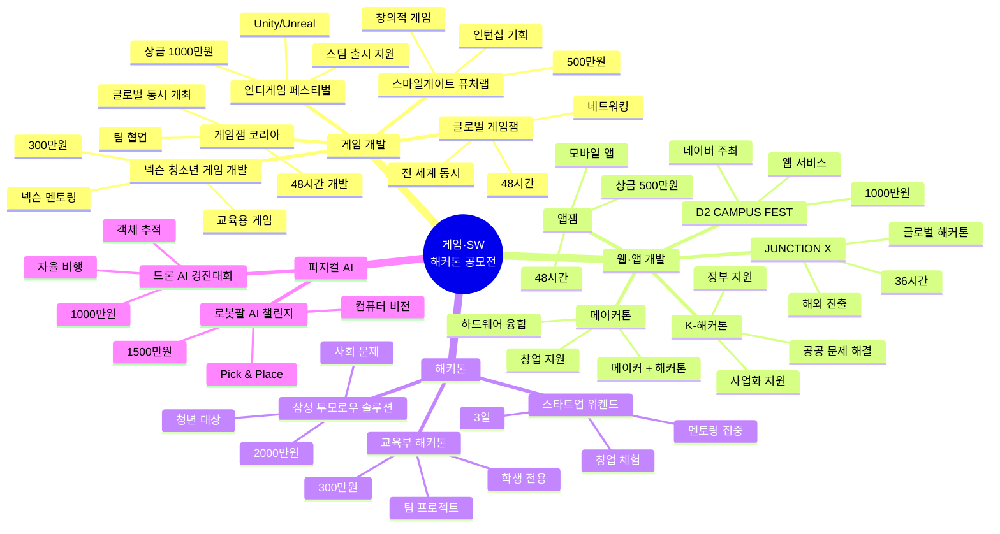
```mermaid
mindmap
  root((게임·SW<br/>해커톤 공모전))
    게임 개발
      인디게임 페스티벌
        Unity/Unreal
        상금 1000만원
        스팀 출시 지원
      넥슨 청소년 게임 개발
        교육용 게임
        300만원
        넥슨 멘토링
      게임잼 코리아
        48시간 개발
        팀 협업
        글로벌 동시 개최
      스마일게이트 퓨처랩
        창의적 게임
        500만원
        인턴십 기회
      글로벌 게임잼
        48시간
        전 세계 동시
        네트워킹
    웹·앱 개발
      앱잼
        모바일 앱
        48시간
        상금 500만원
      D2 CAMPUS FEST
        네이버 주최
        웹 서비스
        1000만원
      JUNCTION X
        글로벌 해커톤
        36시간
        해외 진출
      K-해커톤
        공공 문제 해결
        정부 지원
        사업화 지원
      메이커톤
        메이커 + 해커톤
        하드웨어 융합
        창업 지원
    해커톤
      교육부 해커톤
        학생 전용
        팀 프로젝트
        300만원
      스타트업 위켄드
        창업 체험
        3일
        멘토링 집중
      삼성 투모로우 솔루션
        사회 문제
        청년 대상
        2000만원
    피지컬 AI
      로봇팔 AI 챌린지
        컴퓨터 비전
        Pick & Place
        1500만원
      드론 AI 경진대회
        자율 비행
        객체 추적
        1000만원
```

## 필수 기술 스택 (공모전용)

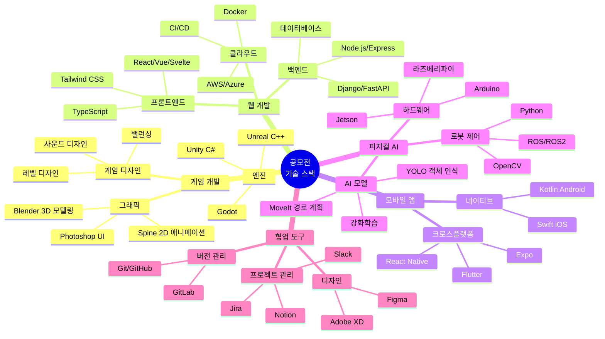
```mermaid
mindmap
  root((공모전<br/>기술 스택))
    게임 개발
      엔진
        Unity C#
        Unreal C++
        Godot
      그래픽
        Blender 3D 모델링
        Photoshop UI
        Spine 2D 애니메이션
      게임 디자인
        레벨 디자인
        밸런싱
        사운드 디자인
    웹 개발
      프론트엔드
        React/Vue/Svelte
        TypeScript
        Tailwind CSS
      백엔드
        Node.js/Express
        Django/FastAPI
        데이터베이스
      클라우드
        AWS/Azure
        Docker
        CI/CD
    모바일 앱
      네이티브
        Swift iOS
        Kotlin Android
      크로스플랫폼
        React Native
        Flutter
        Expo
    피지컬 AI
      로봇 제어
        ROS/ROS2
        Python
        OpenCV
      하드웨어
        라즈베리파이
        Jetson
        Arduino
      AI 모델
        YOLO 객체 인식
        MoveIt 경로 계획
        강화학습
    협업 도구
      버전 관리
        Git/GitHub
        GitLab
      디자인
        Figma
        Adobe XD
      프로젝트 관리
        Notion
        Jira
        Slack
```

---

## 게임 개발 공모전

### 1. 인디게임 페스티벌

#### 🌐 공식 정보 및 등록

**공식 사이트**
- 인디게임 페스티벌: [https://www.indiegamefestival.kr/](https://www.indiegamefestival.kr/)
- 주최: 한국콘텐츠진흥원
- 등록 기간: 매년 8-9월
- 참가비: **무료**

**참가 자격**
- 대상: **제한 없음** (중고등학생 참가 가능, 청소년부 별도)
- 팀 구성: 1-5명 (개인 참가 가능)
- 게임 장르: 제한 없음
- 플랫폼: PC, 모바일, 콘솔, 웹 모두 가능

**제출 요건**
- 플레이 가능한 데모 버전 (30분 이상)
- 개발 문서
- 시연 영상 (5분)
- 상업용 출시 안 된 게임

#### 📦 필수 개발 환경

| 도구 | 용도 | 가격 | 다운로드 |
|------|------|------|----------|
| **Unity** | 게임 엔진 | 무료 (학생) | [unity.com](https://unity.com/) |
| **Unreal Engine** | 게임 엔진 | 무료 | [unrealengine.com](https://www.unrealengine.com/) |
| **Visual Studio** | 코드 에디터 | 무료 | [visualstudio.com](https://visualstudio.microsoft.com/) |
| **Blender** | 3D 모델링 | 무료 | [blender.org](https://www.blender.org/) |
| **GIMP/Krita** | 2D 그래픽 | 무료 | [gimp.org](https://www.gimp.org/), [krita.org](https://krita.org/) |
| **Audacity** | 사운드 편집 | 무료 | [audacityteam.org](https://www.audacityteam.org/) |

**추천 에셋 스토어**
- Unity Asset Store: 무료 에셋 다수
- itch.io: 인디 개발자용 에셋
- OpenGameArt.org: 무료 오픈소스 에셋

**총 예상 비용**: **0원** (모두 무료 도구 사용 가능)

#### 📊 심사 평가 기준

| 평가 항목 | 배점 | 평가 내용 |
|----------|------|----------|
| **게임성** | 35% | 재미, 중독성, 플레이 시간 |
| **창의성** | 30% | 독창적 아이디어, 차별화 |
| **완성도** | 20% | 버그 없음, 안정성, UI/UX |
| **그래픽/사운드** | 10% | 비주얼, 사운드 퀄리티 |
| **기술력** | 5% | 구현 난이도, 최적화 |

**수상 및 혜택**

| 수상 | 상금 | 추가 혜택 |
|------|------|----------|
| **대상** | 1,000만원 | 스팀 출시 지원 + G-STAR 전시 |
| **최우수상** | 500만원 | G-STAR 전시 |
| **우수상** | 300만원 | 피칭 기회 |
| **청소년상** (특별) | 200만원 | 멘토링 6개월 |

#### 💪 필수 역량 체크리스트

**기술적 역량**
| 역량 | 난이도 | 학습 기간 | 필수도 |
|------|--------|----------|--------|
| ✅ Unity/Unreal 기초 | ⭐⭐⭐ | 2개월 | 필수 |
| ✅ C# 또는 C++ | ⭐⭐⭐ | 2개월 | 필수 |
| ✅ 게임 디자인 이론 | ⭐⭐☆ | 1개월 | 필수 |
| ✅ 레벨 디자인 | ⭐⭐⭐ | 1개월 | 권장 |
| ✅ 3D 모델링 (Blender) | ⭐⭐⭐⭐ | 3개월 | 선택 |
| ✅ 2D 아트 | ⭐⭐⭐ | 2개월 | 선택 |
| ✅ 사운드 디자인 | ⭐⭐☆ | 1개월 | 선택 |

**게임 디자인 역량**
- ✅ 재미 요소 설계 (리워드 시스템)
- ✅ 난이도 곡선 설정
- ✅ 플레이어 경험 (UX)
- ✅ 게임 밸런싱
- ✅ 스토리텔링

**팀 역할 (5명 기준)**
- 프로그래머 (2명): 게임 로직, 시스템
- 그래픽 아티스트 (1명): 2D/3D 그래픽
- 게임 디자이너 (1명): 기획, 레벨 디자인
- 사운드 디자이너 (1명): 음악, 효과음

#### 🎯 합격 전략 및 팁

**장르 선택 전략**
- **❌ 피해야 할 장르**: 대규모 RPG, MMORPG (시간 부족)
- **✅ 추천 장르**: 퍼즐, 플랫포머, 로그라이크, 인디 어드벤처

**개발 범위 설정**
- 30분 플레이 가능한 콘텐츠에 집중
- 핵심 재미 요소 하나에 집중
- 완성도 > 방대함

**흔한 실수**
- ❌ 범위가 너무 큼 (미완성)
- ❌ 버그 투성이
- ❌ 튜토리얼 없음
- ❌ 재미 요소 불명확

**성공 팁**
- ✅ 프로토타입 1개월 내 완성
- ✅ 플레이 테스트 10명 이상
- ✅ 첫 5분이 재밌어야 함
- ✅ "한 줄 소개"가 명확해야 함

#### 📅 준비 일정 (6개월)

**1-2개월: 프로토타입**
- 아이디어 구체화
- 핵심 메커니즘 구현
- 플레이 테스트 (조잡해도 OK)

**3-4개월: 본 개발**
- 레벨/콘텐츠 제작
- 그래픽/사운드 적용
- 밸런싱

**5-6개월: 완성 및 폴리싱**
- 버그 수정
- UI/UX 개선
- 시연 영상 제작

#### 🏆 수상작 사례

**2025년 청소년상 수상작**
- **게임명**: "Time Painter" (시간을 그리는 퍼즐 게임)
- **장르**: 퍼즐 플랫포머
- **팀**: 고등학생 3명 (프로그래머 1, 아티스트 1, 디자이너 1)
- **개발 기간**: 5개월
- **엔진**: Unity
- **핵심 메커니즘**: 과거로 되돌리기 + 그림 그리기
- **차별화**: 독특한 시간 메커니즘

**심사평**
- "단순하지만 중독성 있는 게임성"
- "고등학생이 만들었다고 믿기지 않는 완성도"
- "첫 5분부터 재미있음"

---

### 2. 넥슨 청소년 게임 개발 챌린지

#### 🌐 공식 정보

**공식 사이트**: [https://www.nexon.com/](https://www.nexon.com/)
- 주최: 넥슨, 넥슨재단
- 대상: 초등 5학년 ~ 고등 3학년
- 참가비: 무료
- 개최: 매년 6-10월

**특징**
- 교육용 게임에 초점
- 넥슨 개발자 멘토링
- 본사 견학 기회

#### 📊 심사 기준

| 평가 항목 | 배점 |
|----------|------|
| **교육적 가치** | 40% |
| **게임성** | 30% |
| **창의성** | 20% |
| **완성도** | 10% |

**수상**
- 대상: 300만원 + 넥슨 본사 방문
- 금상: 200만원 + 게임 아카데미 초청
- 은상: 100만원

#### 🎯 전략

**주제 선택**
- 교육 + 재미의 균형
- 예: 수학 퍼즐 게임, 역사 어드벤처, 과학 실험 시뮬레이션

---

### 3. 글로벌 게임잼 (Global Game Jam)

#### 🌐 공식 정보

**공식 사이트**: [https://globalgamejam.org/](https://globalgamejam.org/)
- 개최: 매년 1월 말 (금-일, 48시간)
- 대상: 전 연령
- 참가비: 무료 (장소별 상이)
- 전 세계 동시 개최

**특징**
- 상금 없음 (순수 경험)
- 48시간 동안 게임 개발
- 주제는 당일 발표
- 네트워킹 중심

#### 💪 준비 사항

**사전 준비**
- 팀 구성 (3-5명)
- 개발 환경 세팅
- 빠른 프로토타이핑 연습

**당일 전략**
- 첫 4시간: 아이디어 확정
- 다음 36시간: 개발
- 마지막 8시간: 폴리싱

---

## 웹·앱 개발 공모전

### 1. D2 CAMPUS FEST (네이버)

#### 🌐 공식 정보

**공식 사이트**: [https://d2.naver.com/](https://d2.naver.com/)
- 주최: 네이버 D2
- 대상: 대학생, 고등학생 (특별 부문)
- 참가비: 무료
- 개최: 매년 9-11월

**참가 자격**
- 고등학생 특별 부문
- 팀 3-5명
- 웹 서비스 또는 모바일 앱

#### 📦 필수 기술

**프론트엔드**
| 기술 | 난이도 | 학습 기간 |
|------|--------|----------|
| ✅ React | ⭐⭐⭐ | 2개월 |
| ✅ TypeScript | ⭐⭐⭐ | 1개월 |
| ✅ Tailwind CSS | ⭐⭐☆ | 2주 |

**백엔드**
| 기술 | 난이도 | 학습 기간 |
|------|--------|----------|
| ✅ Node.js/Express | ⭐⭐⭐ | 2개월 |
| ✅ Django/FastAPI | ⭐⭐⭐ | 2개월 |
| ✅ 데이터베이스 (PostgreSQL) | ⭐⭐⭐ | 1개월 |

**클라우드 (필수)**
- AWS, Azure, GCP 중 하나
- Docker 컨테이너화
- CI/CD 파이프라인

#### 📊 심사 기준

| 평가 항목 | 배점 | 평가 내용 |
|----------|------|----------|
| **기술력** | 35% | 아키텍처, 코드 품질, 최적화 |
| **실용성** | 30% | 실제 사용 가능성, 확장성 |
| **창의성** | 20% | 차별화된 아이디어 |
| **완성도** | 15% | UI/UX, 안정성 |

**수상**
- **대상**: 1,000만원 + 네이버 인턴십 기회
- **최우수상**: 500만원 + 네이버 부트캠프
- **우수상**: 300만원
- **고등학생 특별상**: 200만원 + 멘토링

#### 🎯 합격 전략

**프로젝트 주제**
- 실생활 문제 해결
- 명확한 타겟 사용자
- 기술적 도전 과제 포함

**예시 주제**
- 학생 시간표 관리 + AI 추천
- 지역 맛집 공유 플랫폼
- 온라인 스터디 그룹 매칭

**기술 스택 추천**
- Frontend: React + TypeScript + Tailwind
- Backend: Node.js + Express + PostgreSQL
- Cloud: AWS (EC2, RDS, S3)
- 기타: Docker, GitHub Actions

#### 📅 준비 일정 (4개월)

**1개월: 기획 및 설계**
- 아이디어 구체화
- 사용자 리서치
- UI/UX 디자인 (Figma)
- 기술 스택 선정

**2개월: 개발**
- MVP 개발
- API 설계 및 구현
- 데이터베이스 설계

**3개월: 완성**
- 기능 완성
- 테스트 (단위, 통합)
- 배포 (AWS)

**4개월: 폴리싱**
- 버그 수정
- 성능 최적화
- 발표 자료 준비

#### 🏆 수상팀 사례

**2025년 고등학생 특별상**
- **프로젝트**: "StudyMate" - AI 기반 스터디 매칭
- **팀**: 고등학생 4명
- **기술**: React + Django + PostgreSQL + AWS
- **차별화**: AI 추천 알고리즘, 실시간 채팅
- **실사용자**: 베타 테스트 100명

---

### 2. 앱잼 (AppJam)

#### 🌐 공식 정보

**공식 사이트**: [https://www.appjam.com/](https://www.appjam.com/)
- 주최: 대학생 IT 연합 동아리
- 형식: **48시간 해커톤**
- 대상: 대학생 중심 (고등학생 참가 가능)
- 개최: 1월, 7월 (연 2회)

**특징**
- 모바일 앱 개발에 특화
- 48시간 동안 앱 완성
- 네트워킹 중심

#### 📦 필수 기술

**네이티브 개발**
- iOS: Swift + UIKit/SwiftUI
- Android: Kotlin + Jetpack Compose

**크로스 플랫폼 (추천)**
| 프레임워크 | 장점 | 단점 |
|-----------|------|------|
| **React Native** | 웹 개발자 접근 쉬움 | 성능 제약 |
| **Flutter** | 빠른 개발, 예쁜 UI | Dart 언어 학습 필요 |
| **Expo** (React Native) | 가장 빠른 시작 | 네이티브 기능 제한 |

**추천: Flutter** (48시간 해커톤에 최적)

#### 📊 심사 기준

| 평가 항목 | 배점 |
|----------|------|
| **완성도** | 40% |
| **아이디어** | 30% |
| **기술력** | 20% |
| **디자인** | 10% |

**수상**
- 대상: 500만원
- 금상: 300만원
- 은상: 150만원

#### 🎯 48시간 전략

**Day 1 (16시간)**
- 0-4시간: 아이디어 확정, 역할 분담
- 4-16시간: MVP 개발 (핵심 기능 1-2개)

**Day 2 (24시간)**
- 16-32시간: 기능 확장
- 32-40시간: UI/UX 개선

**Day 3 (8시간)**
- 40-46시간: 버그 수정, 발표 준비
- 46-48시간: 최종 점검, 발표 리허설

**필수 준비물**
- 개발 환경 미리 세팅
- 템플릿 프로젝트
- UI 컴포넌트 라이브러리
- 백업 배터리, 간식

---

## 해커톤

### 1. 교육부 AI·SW 해커톤

#### 🌐 공식 정보

**공식 사이트**: 교육부/한국과학창의재단 공지
- 주최: 교육부
- 대상: 중·고등학생
- 형식: 2일 (12시간)
- 참가비: 무료

**주제**
- 교육 문제 해결
- AI 활용 필수
- 사회적 가치

#### 📊 심사 기준

| 평가 항목 | 배점 |
|----------|------|
| **문제 해결** | 40% |
| **AI 활용도** | 30% |
| **완성도** | 20% |
| **발표력** | 10% |

**수상**
- 대상: 300만원 + 교육부 장관상
- 금상: 200만원
- 은상: 100만원

---

### 2. 삼성 투모로우 솔루션

#### 🌐 공식 정보

**공식 사이트**: [https://www.tomorrowsolutions.org/](https://www.tomorrowsolutions.org/)
- 주최: 삼성전자
- 대상: 만 15-29세
- 주제: 사회 문제 해결
- 개최: 매년 3-10월

**특징**
- 기술 + 사회공헌
- 멘토링 6개월
- 사업화 지원

#### 📊 심사 기준

| 단계 | 평가 내용 |
|------|----------|
| **1차 서류** | 아이디어, 실행 계획 |
| **2차 심화** | 6개월 멘토링 + 개발 |
| **3차 최종** | 완성도, 사회적 영향 |

**수상**
- 대상: 2,000만원 + 사업화 지원
- 최우수: 1,000만원
- 우수: 500만원

#### 🎯 전략

**주제 선택**
- 명확한 사회 문제
- 기술로 해결 가능
- 지속 가능한 모델

**예시 주제**
- 시각장애인을 위한 AI 내비게이션
- 독거노인 안전 모니터링
- 저소득층 교육 격차 해소

---

## 피지컬 AI 공모전

### 1. 로봇팔 AI 챌린지

#### 🌐 공식 정보

**공식 사이트**: [https://www.kros.org/](https://www.kros.org/) (한국로봇학회)
- 주최: 산업통상자원부, 한국로봇산업진흥원
- 대상: 고등학생 이상
- 개최: 매년 8-11월
- 참가비: 30만원

**대회 내용**
- 로봇팔 + 컴퓨터 비전
- Pick & Place 미션
- AI로 객체 인식 및 분류

#### 📦 필수 장비

**하드웨어**
| 장비 | 가격 | 구매처 |
|------|------|--------|
| **협동 로봇팔 (대여 가능)** | 500-1000만원 | 두산로보틱스, 유니버설로봇 |
| **또는 오픈소스 로봇팔** | 200만원 | 자체 제작 |
| **RealSense D435** | 40만원 | Intel |
| **그리퍼** | 50만원 | ROBOTIS |
| **워크스테이션** | 200만원 | NVIDIA Jetson Xavier |

💡 **Tip**: 대부분 대학 연구실 장비 대여 가능

**소프트웨어**
- ROS/ROS2
- MoveIt (경로 계획)
- OpenCV + YOLO (객체 인식)
- Python

#### 📊 심사 기준

**예선 (시뮬레이션)**
| 평가 항목 | 배점 |
|----------|------|
| **알고리즘** | 50% |
| **정확도** | 30% |
| **속도** | 20% |

**본선 (실물 로봇)**
| 미션 | 배점 | 내용 |
|------|------|------|
| **Pick & Place** | 40점 | 물체 10개 정확히 옮기기 |
| **분류** | 30점 | 색상/형태별 분류 |
| **속도** | 20점 | 제한 시간 내 완료 |
| **안전성** | 10점 | 충돌 없이 작업 |

**수상**
- 대상: 1,500만원 + 산업체 인턴십
- 금상: 1,000만원
- 은상: 500만원
- 동상: 300만원

#### 💪 필수 역량

| 역량 | 난이도 | 학습 기간 |
|------|--------|----------|
| ✅ ROS/ROS2 | ⭐⭐⭐⭐⭐ | 6개월 |
| ✅ MoveIt | ⭐⭐⭐⭐ | 3개월 |
| ✅ 역기구학 (IK) | ⭐⭐⭐⭐⭐ | 3개월 |
| ✅ 컴퓨터 비전 | ⭐⭐⭐⭐ | 3개월 |
| ✅ YOLO/Faster R-CNN | ⭐⭐⭐⭐ | 2개월 |
| ✅ 경로 계획 | ⭐⭐⭐⭐⭐ | 3개월 |

#### 🎯 합격 전략

**개발 단계**
1. **시뮬레이션 먼저** (Gazebo, 2개월)
2. **카메라 캘리브레이션** (1주)
3. **객체 인식 모델 학습** (1개월)
4. **경로 계획 알고리즘** (2개월)
5. **실물 로봇 테스트** (2개월)

**고득점 팁**
- 정확도 > 속도
- 안전 영역 설정 (충돌 방지)
- 예외 처리 (물체 못 찾을 때)
- 데이터셋 1,000장 이상

---

### 2. 드론 AI 경진대회

#### 🌐 공식 정보

**공식 사이트**: 국토교통부 드론산업과
- 주최: 국토교통부, 한국드론산업진흥협회
- 대상: 대학생, 고등학생 (만 18세 이상)
- 개최: 매년 9-11월
- 참가비: 20만원

**대회 내용**
- 자율 비행 드론
- AI 기반 객체 추적
- 실내/실외 미션

#### 📦 필수 장비

**하드웨어**
| 장비 | 가격 | 구매처 |
|------|------|--------|
| **드론 프레임** | 30만원 | HobbyKing |
| **Pixhawk 비행컨트롤러** | 15만원 | 디바이스마트 |
| **Jetson Nano** | 15만원 | NVIDIA |
| **카메라** | 10만원 | RealSense T265 |
| **배터리 (LiPo)** | 10만원 | 배터리마트 |
| **예비 부품** | 20만원 | 각종 |

**총 예상 비용**: **약 100만원**

**소프트웨어**
- ROS
- PX4 (오토파일럿)
- MAVROS (통신)
- OpenCV + YOLO
- Python

#### 📊 심사 기준

**미션 1: 자율 비행 (30점)**
- 이륙 → 체크포인트 3곳 → 착륙
- GPS 기반 또는 비전 기반

**미션 2: 객체 추적 (40점)**
- 움직이는 물체 (사람, 차량) 추적
- 일정 거리 유지
- 시야 유지

**미션 3: 장애물 회피 (30점)**
- 장애물 있는 코스 비행
- 충돌 없이 통과

**수상**
- 대상: 1,000만원 + 드론 산업체 인턴
- 금상: 700만원
- 은상: 500만원
- 동상: 300만원

#### 💪 필수 역량

| 역량 | 난이도 | 학습 기간 |
|------|--------|----------|
| ✅ PX4 비행컨트롤 | ⭐⭐⭐⭐ | 3개월 |
| ✅ MAVROS | ⭐⭐⭐ | 1개월 |
| ✅ 컴퓨터 비전 | ⭐⭐⭐⭐ | 3개월 |
| ✅ 객체 추적 (KCF, YOLO) | ⭐⭐⭐⭐ | 2개월 |
| ✅ 경로 계획 | ⭐⭐⭐⭐ | 2개월 |
| ✅ 드론 조종 (수동) | ⭐⭐⭐ | 1개월 |

#### 🎯 안전 수칙

**필수 사항**
- [ ] 드론 자격증 (초경량비행장치)
- [ ] 비행 승인 (실외 비행 시)
- [ ] 안전 펜스 설치
- [ ] 비상 정지 기능
- [ ] 보험 가입

---

## 공모전 준비 총정리

### 분야별 투자 비용

| 분야 | 최소 비용 | 권장 비용 | 비고 |
|------|----------|----------|------|
| **게임 개발** | 0원 | 0-50만원 | 무료 도구 활용 가능 |
| **웹/앱** | 0원 | 0-30만원 | 클라우드 비용 |
| **해커톤** | 0원 | 0원 | 교통비, 숙식만 |
| **로봇팔 AI** | 대여 가능 | 500-1000만원 | 대학 장비 활용 |
| **드론 AI** | 100만원 | 100-200만원 | 직접 구매 |

### 기술 스택 로드맵

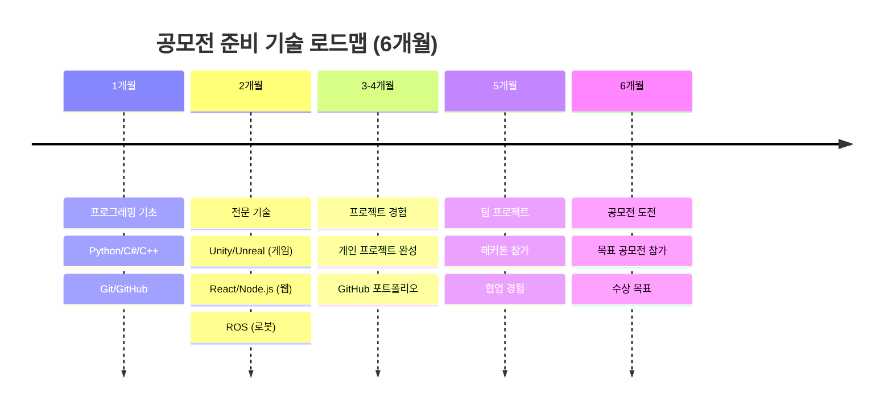
```mermaid
timeline
    title 공모전 준비 기술 로드맵 (6개월)
    
    1개월 : 프로그래밍 기초
          : Python/C#/C++
          : Git/GitHub
    
    2개월 : 전문 기술
          : Unity/Unreal (게임)
          : React/Node.js (웹)
          : ROS (로봇)
    
    3-4개월 : 프로젝트 경험
             : 개인 프로젝트 완성
             : GitHub 포트폴리오
    
    5개월 : 팀 프로젝트
          : 해커톤 참가
          : 협업 경험
    
    6개월 : 공모전 도전
          : 목표 공모전 참가
          : 수상 목표
```

### 팀 구성 가이드

**게임 개발 팀 (5명)**
- 프로그래머 2명
- 아티스트 1-2명
- 게임 디자이너 1명
- 사운드 1명 (선택)

**웹/앱 개발 팀 (4명)**
- 프론트엔드 2명
- 백엔드 1명
- 디자이너 1명

**피지컬 AI 팀 (6명)**
- 소프트웨어 3명
- 하드웨어 2명
- 기획/발표 1명

---

# Part 4: 대회 준비 전략

## 대회 준비 전략 전체 개요

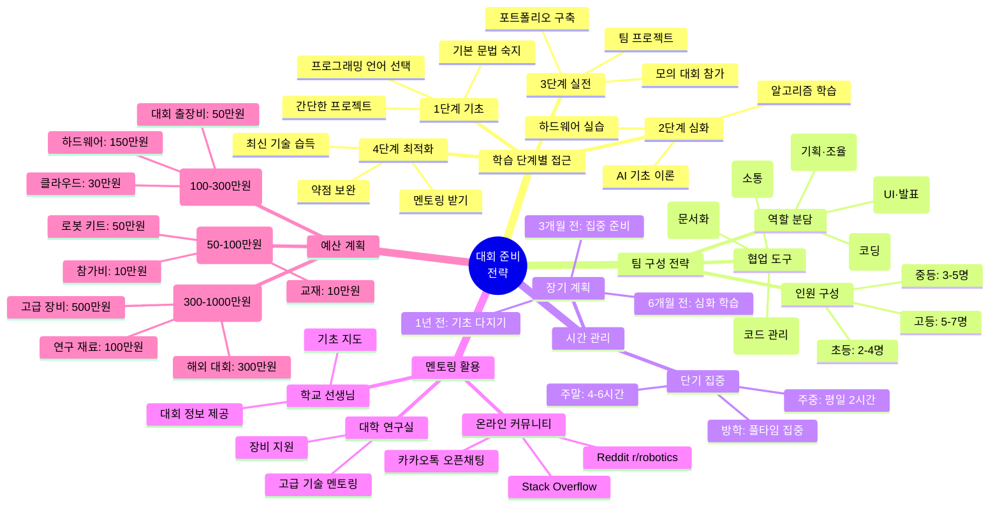
```mermaid
mindmap
  root((대회 준비<br/>전략))
    학습 단계별 접근
      1단계 기초
        프로그래밍 언어 선택
        기본 문법 숙지
        간단한 프로젝트
      2단계 심화
        알고리즘 학습
        AI 기초 이론
        하드웨어 실습
      3단계 실전
        모의 대회 참가
        팀 프로젝트
        포트폴리오 구축
      4단계 최적화
        약점 보완
        멘토링 받기
        최신 기술 습득
    팀 구성 전략
      역할 분담
        리더(기획·조율)
        개발자(코딩)
        디자이너(UI·발표)
      인원 구성
        초등: 2-4명
        중등: 3-5명
        고등: 5-7명
      협업 도구
        GitHub(코드 관리)
        Notion(문서화)
        Discord(소통)
    시간 관리
      장기 계획
        1년 전: 기초 다지기
        6개월 전: 심화 학습
        3개월 전: 집중 준비
      단기 집중
        주중: 평일 2시간
        주말: 4-6시간
        방학: 풀타임 집중
    멘토링 활용
      학교 선생님
        기초 지도
        대회 정보 제공
      대학 연구실
        고급 기술 멘토링
        장비 지원
      온라인 커뮤니티
        Stack Overflow
        Reddit r/robotics
        카카오톡 오픈채팅
    예산 계획
      초등(50-100만원)
        로봇 키트: 50만원
        참가비: 10만원
        교재: 10만원
      중등(100-300만원)
        하드웨어: 150만원
        클라우드: 30만원
        대회 출장비: 50만원
      고등(300-1000만원)
        고급 장비: 500만원
        해외 대회: 300만원
        연구 재료: 100만원
```

## 대회별 난이도 및 투자 대비 효과

```mermaid
quadrantChart
    title 대회 난이도 vs 입시 효과
    x-axis 낮은 난이도 --> 높은 난이도
    y-axis 낮은 효과 --> 높은 효과
    quadrant-1 집중 투자 대상
    quadrant-2 장기 도전 과제
    quadrant-3 입문용 추천
    quadrant-4 효율적 선택
    
    FLL: [0.3, 0.5]
    WRO: [0.4, 0.6]
    Bebras: [0.2, 0.3]
    AI 창의력: [0.35, 0.65]
    소프트웨어 창작: [0.3, 0.5]
    
    VEX: [0.5, 0.6]
    ISEF: [0.8, 0.95]
    IOI: [0.9, 1.0]
    KOI: [0.7, 0.85]
    Imagine Cup: [0.6, 0.7]
    
    휴머노이드: [0.95, 0.98]
    자율주행: [0.85, 0.9]
    Kaggle: [0.7, 0.8]
    FRC: [0.8, 0.85]
    AI 올림피아드: [0.75, 0.9]
```

## 학년별 준비 로드맵

### 초등학생 (3-6학년)

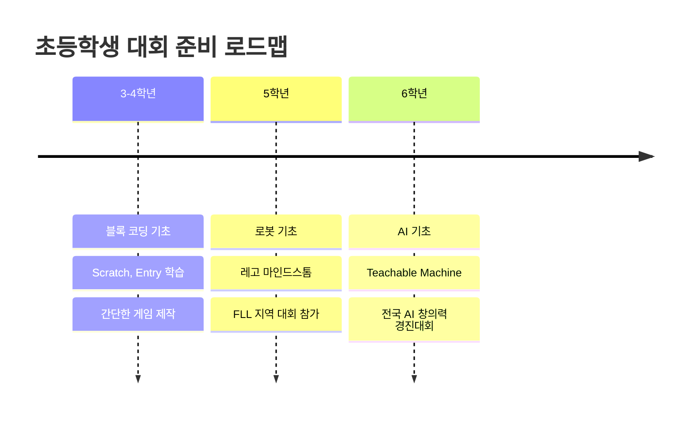
```mermaid
timeline
    title 초등학생 대회 준비 로드맵
    
    3-4학년 : 블록 코딩 기초
             : Scratch, Entry 학습
             : 간단한 게임 제작
    
    5학년 : 로봇 기초
          : 레고 마인드스톰
          : FLL 지역 대회 참가
    
    6학년 : AI 기초
          : Teachable Machine
          : 전국 AI 창의력 경진대회
```

**추천 대회 순서**
1. **5학년 1학기**: 학교 내부 코딩 대회 (연습)
2. **5학년 2학기**: FIRST LEGO League 지역 대회
3. **6학년 1학기**: 소프트웨어 창작 대회
4. **6학년 2학기**: 전국 AI 창의력 경진대회 (목표)

---

### 중학생 (1-3학년)

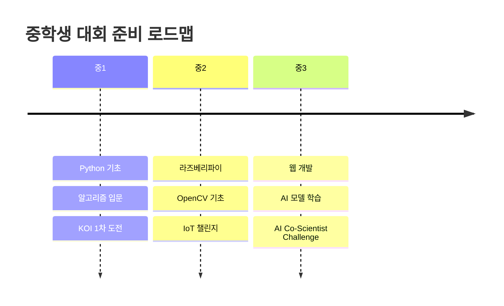
```mermaid
timeline
    title 중학생 대회 준비 로드맵
    
    중1 : Python 기초
        : 알고리즘 입문
        : KOI 1차 도전
    
    중2 : 라즈베리파이
        : OpenCV 기초
        : IoT 챌린지
    
    중3 : 웹 개발
        : AI 모델 학습
        : AI Co-Scientist Challenge
```

**추천 대회 순서**
1. **중1**: 한국정보올림피아드 (KOI) 1차
2. **중2**: IoT 챌린지 + VEX Robotics
3. **중3**: AI Co-Scientist Challenge (목표) + ISEF 도전

---

### 고등학생 (1-3학년)

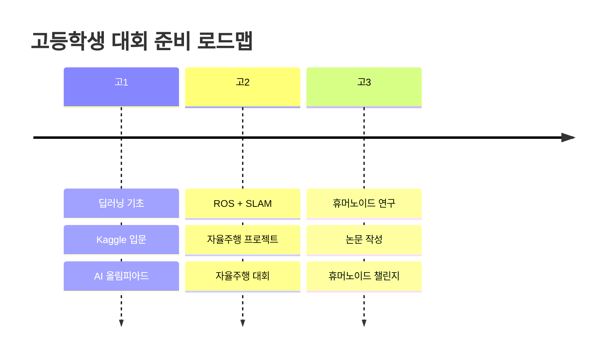
```mermaid
timeline
    title 고등학생 대회 준비 로드맵
    
    고1 : 딥러닝 기초
        : Kaggle 입문
        : AI 올림피아드
    
    고2 : ROS + SLAM
        : 자율주행 프로젝트
        : 자율주행 대회
    
    고3 : 휴머노이드 연구
        : 논문 작성
        : 휴머노이드 챌린지
```

**추천 대회 순서**
1. **고1**: Kaggle 입문 대회 + AI 올림피아드
2. **고2**: 자율주행 대회 + ISEF
3. **고3**: 휴머노이드 챌린지 (목표) + 대한민국 인재상

---

## 대회별 필수 기술 매트릭스

```mermaid
mindmap
  root((대회별<br/>기술 요구사항))
    로봇 중심 대회
      FLL/WRO/RoboCup
        하드웨어
          레고/VEX 조립
          센서 통합
          모터 제어
        소프트웨어
          블록코딩(초등)
          Python/C++(중고등)
          PID 제어
        필수 역량
          팀워크
          문제해결력
          시간관리
      FRC/VEX(고급)
        기계 설계
          CAD(SolidWorks)
          3D 프린팅
          재료 선택
        전기전자
          회로 설계
          모터 드라이버
          배터리 관리
        프로그래밍
          Java/C++
          ROS
          실시간 제어
    알고리즘 대회
      KOI/IOI
        필수 알고리즘
          DP/그리디
          그래프(BFS/DFS)
          최단경로
        자료구조
          세그먼트 트리
          유니온 파인드
          Trie
        수학
          정수론
          조합론
          확률
      NYPC/코딩테스트
        기초 알고리즘
          정렬/탐색
          완전탐색
          시뮬레이션
        문제해결
          논리적 사고
          디버깅
          최적화
    AI·데이터 대회
      Kaggle
        데이터 분석
          Pandas/NumPy
          EDA(탐색적 분석)
          시각화
        머신러닝
          전처리
          Feature Engineering
          앙상블
        딥러닝
          CNN/RNN
          Transfer Learning
          하이퍼파라미터 튜닝
      AI 올림피아드
        이론
          선형대수
          확률통계
          최적화
        실전
          PyTorch/TensorFlow
          모델 설계
          성능 평가
    융합 프로젝트 대회
      ISEF/과학전람회
        연구 방법론
          문제 정의
          가설 설정
          실험 설계
        논문 작성
          영문 작성(ISEF)
          논리적 구성
          데이터 분석
        발표 능력
          포스터 제작
          질의응답
          시연
      휴머노이드/자율주행
        로봇공학
          SLAM
          경로계획
          제어이론
        컴퓨터 비전
          OpenCV
          YOLO/R-CNN
          센서 융합
        시스템 통합
          ROS/ROS2
          실시간 처리
          에러 처리
```

## 학습 리소스 총정리

```mermaid
mindmap
  root((학습 리소스<br/>총정리))
    온라인 강좌
      무료 플랫폼
        Coursera
          Andrew Ng ML
          Deep Learning 특화
        edX
          MIT/Harvard 강좌
          CS50 입문
        Khan Academy
          수학 기초
          코딩 입문
      한국어 플랫폼
        인프런
          파이썬/웹 개발
          AI 실전 프로젝트
        부스트코스
          네이버 무료 강좌
          CS 전공 기초
        프로그래머스
          코딩테스트 준비
          알고리즘 학습
    필수 교재
      알고리즘(한글)
        구종만 "알고리즘 문제해결전략"
        이것이 코딩테스트다
        파이썬 알고리즘 인터뷰
      AI·머신러닝(한글)
        밑바닥부터 시작하는 딥러닝 1,2,3
        파이썬 머신러닝 완벽 가이드
        PyTorch로 시작하는 딥러닝
      로봇공학(한글)
        ROS 로봇 프로그래밍
        OpenCV 컴퓨터 비전
        라즈베리파이로 배우는 AI
      영문 고급서
        "Introduction to Algorithms" CLRS
        "Deep Learning" Goodfellow
        "Probabilistic Robotics" Thrun
    연습 플랫폼
      알고리즘
        백준(BOJ)
          한국 문제 다수
          단계별 학습
        Codeforces
          글로벌 대회
          레이팅 시스템
        LeetCode
          취업 준비
          기업별 문제
      AI·데이터
        Kaggle
          실전 데이터셋
          커뮤니티 토론
          무료 GPU
        Google Colab
          무료 GPU
          Jupyter 환경
        Papers with Code
          최신 논문
          구현 코드
      로봇 시뮬레이션
        Gazebo
          ROS 연동
          물리 엔진
        PyBullet
          강화학습 환경
          무료 오픈소스
        Webots
          교육용 로봇
          다양한 예제
    커뮤니티
      한국
        네이버 카페(로봇/코딩)
        오픈채팅방
        학교 동아리
      글로벌
        Reddit r/robotics
        Stack Overflow
        GitHub Discussions
```

## 수상 이력 활용 방법

### 수상 이력 활용 로드맵

```mermaid
mindmap
  root((수상 이력<br/>활용 전략))
    대학 입시
      학생부 종합전형
        자기소개서
          대회 준비 과정
          극복한 어려움
          배운 점
        생활기록부
          동아리 활동
          수상 경력
          세부능력특기사항
        포트폴리오
          프로젝트 결과물
          GitHub 링크
          시연 영상
      특기자 전형
        KAIST
          IOI 메달
          국제대회 수상
        서울대
          ISEF 수상
          연구 실적
        POSTECH
          과학올림피아드
          논문 실적
      입학사정관 전형
        전공적합성
          지속적 활동
          발전 과정
          열정 증명
        창의성
          독창적 프로젝트
          문제해결 능력
        리더십
          팀 프로젝트
          멘토 활동
    장학금 혜택
      국가장학금
        대한민국 인재상
          4년 전액
          5000만원 상당
        이공계 장학금
          대회 수상 우대
          학기당 지원
      기업 장학금
        삼성
          SSAFY 우수생
          드림클래스
        네이버
          커넥트재단
          AI 인재 양성
        현대차
          정몽구 재단
          자율주행 특기자
      대학 장학금
        KAIST
          국제대회 금상
          전액 장학금
        POSTECH
          올림피아드 메달
          전액+생활비
    취업 활용
      이력서 작성
        수상 경력
          대회명·수상등급
          프로젝트 설명
          기술 스택
        포트폴리오
          GitHub 프로필
          Kaggle 순위
          프로젝트 링크
      면접 대비
        경험 스토리텔링
          도전 과정
          문제 해결
          성장 경험
        기술 설명
          사용 기술
          구현 방법
          결과 분석
      네트워킹
        대회 인맥
          멘토 연결
          동료 네트워크
        추천서
          지도 교수
          멘토 기업
    해외 진출
      유학 지원
        미국 대학
          IOI/ISEF 수상
          장학금 유리
        유럽
          연구 실적 중시
        중국·싱가포르
          국제대회 실적
      글로벌 취업
        FAANG
          Kaggle Grandmaster
          GitHub 활동
        자율주행 기업
          Tesla·Waymo
          대회 수상
        로봇 기업
          Boston Dynamics
          RoboCup 실적
```

### 대회 선택 가이드

```mermaid
flowchart TD
    A[대회 선택 시작] --> B{현재 학년?}
    
    B -->|초등 3-4학년| C[블록코딩 기초 습득]
    B -->|초등 5-6학년| D[로봇·AI 입문]
    B -->|중학생| E[전문 분야 선택]
    B -->|고등학생| F[심화 및 입시 연계]
    
    C --> C1[Scratch/Entry 학습]
    C1 --> C2[Bebras Challenge]
    C2 --> C3[소프트웨어 창작대회]
    
    D --> D1{관심 분야?}
    D1 -->|로봇| D2[FLL/WRO]
    D1 -->|코딩| D3[NYPC 주니어]
    D1 -->|AI| D4[AI 창의력 경진대회]
    
    E --> E1{진로 방향?}
    E1 -->|알고리즘| E2[KOI → IOI 준비]
    E1 -->|AI 연구| E3[AI Co-Scientist]
    E1 -->|로봇 공학| E4[VEX/FRC]
    E1 -->|하드웨어| E5[IoT 챌린지]
    
    F --> F1{입시 전략?}
    F1 -->|특기자 전형| F2[IOI/ISEF 집중]
    F1 -->|학종 준비| F3[다양한 대회 경험]
    F1 -->|취업 준비| F4[Kaggle/SSAFY]
    
    F2 --> G[국제 대회 도전]
    F3 --> H[지속적 활동 기록]
    F4 --> I[실전 프로젝트 구축]
    
    E2 --> J[알고리즘 트레이닝]
    E3 --> K[연구 프로젝트 수행]
    E4 --> L[로봇 팀 활동]
    E5 --> M[하드웨어 프로젝트]
    
    D2 --> N[팀 구성 및 준비]
    D3 --> O[알고리즘 기초]
    D4 --> P[AI 도구 학습]
    
    style G fill:#ff6b6b,color:#111
    style J fill:#4ecdc4,color:#111
    style K fill:#ffe66d,color:#111
    style L fill:#95e1d3,color:#111
```

### 대학 입시 활용

#### 1. 학생부 종합전형
- **자기소개서**: 대회 준비 과정, 배운 점 강조
- **추천서**: 교사가 대회 활동 언급
- **포트폴리오**: 프로젝트 결과물, 소스 코드

#### 2. 특기자 전형
- **AI 특기자**: KAIST, POSTECH, 서울대
- **필요 수상**: 국제 대회 입상 또는 전국 대회 금상 이상
- **추가 서류**: 연구 계획서, 논문

#### 3. 입학사정관 전형
- **활동 우수성**: 대회 수상 + 지속적인 활동
- **성장 가능성**: 초등 → 중등 → 고등 발전 과정
- **전공 적합성**: AI, 컴퓨터공학 전공 지원 시 유리

### 장학금 신청

#### 1. 국가장학금
- **대한민국 인재상**: 4년 전액
- **이공계 장학금**: 대회 수상 시 우대

#### 2. 기업 장학금
- **삼성 드림클래스**: SSAFY 수료생
- **네이버 커넥트재단**: AI 대회 수상자
- **현대차 정몽구 재단**: 자율주행 대회 수상자

#### 3. 대학 장학금
- **KAIST**: 국제 대회 금상 → 전액 장학금
- **POSTECH**: IOI 메달리스트 → 전액 장학금
- **서울대**: ISEF 수상 → 입학 우대 + 장학금

### 취업 활용

#### 1. 대기업
- **삼성전자**: SSAFY 수료 + 프로젝트 우수상
- **네이버**: AI 해커톤 수상
- **현대자동차**: 자율주행 대회 수상

#### 2. 스타트업
- **포트폴리오**: GitHub, Kaggle 프로필
- **대회 수상**: 실력 증명
- **네트워킹**: 대회에서 만난 멘토, 팀원

#### 3. 해외 취업
- **Google, Microsoft**: Kaggle Grandmaster
- **Tesla, Waymo**: 자율주행 대회 수상
- **Boston Dynamics**: 로봇 대회 수상

---

## 대회 준비 완전 체크리스트

```mermaid
mindmap
  root((대회 준비<br/>체크리스트))
    대회 전 3개월
      기술 준비
        [x] 필수 언어 학습 완료
        [x] 개발 환경 구축
        [x] 기초 프로젝트 완성
      팀 구성
        [x] 팀원 모집 완료
        [x] 역할 분담 확정
        [x] 협업 도구 설정
      정보 수집
        [x] 대회 규칙 숙지
        [x] 과거 수상작 분석
        [x] 평가 기준 파악
    대회 전 1개월
      프로젝트 개발
        [x] 아이디어 구체화
        [x] 프로토타입 제작
        [x] 기능 구현 50%
      문서화
        [x] 기획서 작성
        [x] 진행 상황 기록
        [x] 발표 자료 초안
      테스트
        [x] 기능 테스트
        [x] 버그 수정
        [x] 성능 최적화
    대회 전 1주일
      최종 점검
        [x] 프로젝트 완성도 100%
        [x] 발표 자료 완성
        [x] 시연 연습 3회 이상
      제출 준비
        [x] 제출 서류 확인
        [x] 파일 형식 체크
        [x] 백업 파일 준비
      발표 준비
        [x] 발표 대본 암기
        [x] 질의응답 예상
        [x] 복장 및 태도 점검
    대회 당일
      체크 사항
        [x] 준비물 확인
        [x] 도착 시간 여유
        [x] 장비 동작 확인
      발표 마인드
        [x] 자신감 갖기
        [x] 침착하게 시연
        [x] 질문 경청
    대회 후
      피드백 수집
        [x] 심사평 분석
        [x] 부족한 점 파악
        [x] 개선 방안 도출
      다음 준비
        [x] 포트폴리오 업데이트
        [x] 수상 실적 기록
        [x] 다음 대회 계획
```

## 연간 대회 달력 (2026년)

```mermaid
gantt
    title 2026년 주요 AI·로봇 대회 일정
    dateFormat  YYYY-MM-DD
    
    section 초등 대회
    Bebras Challenge         :2026-11-01, 7d
    FLL 지역대회            :2026-11-15, 30d
    WRO 지역예선            :2026-05-01, 30d
    AI 창의력 경진대회 예선  :2026-09-01, 30d
    소프트웨어 창작 예선     :2026-10-01, 30d
    
    section 중등 대회
    KOI 1차                :2026-05-15, 1d
    KOI 2차                :2026-07-15, 1d
    IoT 챌린지 예선         :2026-09-01, 30d
    AI Co-Scientist 예선    :2026-06-01, 30d
    VEX 시즌 시작          :2026-10-01, 180d
    
    section 고등 대회
    IOI 한국대표 선발       :2026-03-01, 7d
    IOI 세계대회           :2026-07-20, 7d
    휴머노이드 챌린지 예선   :2026-07-01, 30d
    자율주행 대회 예선      :2026-09-01, 30d
    AI 올림피아드 예선      :2026-10-01, 1d
    
    section 연중 대회
    Kaggle Competitions    :2026-01-01, 365d
    SSAFY 모집(상반기)      :2026-01-01, 60d
    SSAFY 모집(하반기)      :2026-07-01, 60d
    
    section 국제 대회
    ISEF                  :2026-05-10, 7d
    RoboCup 세계대회       :2026-07-05, 7d
    FRC 세계대회           :2026-04-15, 7d
```

## 대회별 투자 대비 효과 분석

```mermaid
mindmap
  root((투자 대비<br/>효과 분석))
    비용 대비 높은 효과
      초등
        Bebras Challenge
          비용: 무료
          효과: 사고력 향상
          입문: 최적
        소프트웨어 창작
          비용: 무료
          효과: 실력 검증
          장학금: 최대 500만원
      중등
        KOI
          비용: 무료
          효과: 특목고 입학 우대
          가치: 무한대
        온라인 대회(Kaggle)
          비용: 무료
          효과: 글로벌 인정
          상금: 최대 수천만원
      고등
        AI 올림피아드
          비용: 무료
          효과: 대학 입학 우대
          가치: 무한대
        Kaggle Competitions
          비용: 무료
          효과: 취업 직결
          상금: 고액
    중간 투자 추천
      초등
        FLL
          비용: 100만원
          효과: 팀워크·기술력
          국제대회: 가능
        WRO
          비용: 80만원
          효과: 세계대회 진출
          상금: 최대 500만원
      중등
        IoT 챌린지
          비용: 150만원
          효과: 실전 프로젝트
          상금: 최대 1000만원
        VEX Robotics
          비용: 200만원
          효과: 국제 경험
          입시: 유리
      고등
        자율주행 대회
          비용: 500만원
          효과: 인턴십 기회
          상금: 최대 3000만원
    고비용 장기 투자
      중고등
        FRC
          비용: 1000만원
          효과: 본격 로봇공학
          NASA 방문: 가능
          스폰서 필수: 중요
      고등
        휴머노이드 챌린지
          비용: 1000만원
          효과: KAIST 입학 우대
          상금: 2000만원
          연구실 인턴: 확정
      모든 학년
        ISEF
          비용: 300만원(해외 출장)
          효과: 최고 권위
          상금: 최대 1억원
          유학: 유리
    무형의 가치
      인적 네트워크
        멘토 연결
        동료 협업
        산업 인맥
      실력 향상
        문제해결력
        프로젝트 경험
        실전 감각
      자신감
        성취감
        도전 정신
        성장 마인드
```

---

## 🏆 수상 프로젝트 사례 분석

```mermaid
mindmap
  root((수상 프로젝트<br/>패턴 분석))
    초등학생 수상작
      환경 보호 테마
        AI 쓰레기 분류기
          Teachable Machine
          App Inventor
          실생활 적용
        절전 도우미 로봇
          레고 마인드스톰
          센서 활용
          에너지 측정
      교육 테마
        AI 학습 도우미
          음성 인식
          퀴즈 생성
          개인화 학습
        장애인 지원 로봇
          음성 명령
          물체 인식
          사회적 가치
    중학생 수상작
      의료·건강
        AI 피부 질환 진단
          CNN 모델
          데이터셋 구축
          정확도 85%
        독거노인 모니터링
          IoT 센서
          실시간 알림
          웹 대시보드
      환경·에너지
        미세먼지 예측 AI
          시계열 분석
          LSTM 모델
          API 서비스
        태양광 최적화
          센서 데이터
          각도 제어
          효율 30% 향상
    고등학생 수상작
      자율주행
        실내 자율주행 로봇
          SLAM 구현
          ROS2 활용
          장애물 회피
        드론 배송 시스템
          경로 최적화
          컴퓨터 비전
          실제 비행
      휴머노이드
        재난 구조 로봇
          이족 보행
          물체 조작
          통합 미션
        서빙 로봇
          내비게이션
          사람 인식
          안전 제어
    성공 요인
      명확한 문제 정의
        실생활 관찰
        데이터 수집
        구체적 목표
      기술적 완성도
        안정적 동작
        에러 처리
        최적화
      효과적 발표
        스토리텔링
        시각 자료
        시연 성공
      사회적 영향
        실용성 검증
        확장 가능성
        지속 가능성
```

## 💡 실전 팁 모음

```mermaid
mindmap
  root((대회 성공<br/>실전 팁))
    프로젝트 기획
      문제 선정
        ✓ 자신의 경험에서 출발
        ✓ 해결 가능한 범위 설정
        ✓ 차별화 포인트 명확히
        ✗ 너무 거창한 목표
        ✗ 유행만 쫓기
      기술 선택
        ✓ 익숙한 기술 우선
        ✓ 안정적인 라이브러리
        ✓ 백업 플랜 준비
        ✗ 최신 기술만 고집
        ✗ 검증 안 된 기술
    팀 협업
      역할 분담
        ✓ 각자 강점 활용
        ✓ 명확한 마일스톤
        ✓ 주간 회의 필수
        ✗ 한 명에게 집중
        ✗ 소통 부족
      갈등 해결
        ✓ 즉시 논의
        ✓ 멘토 조언
        ✓ 타협점 찾기
        ✗ 감정적 대응
    시간 관리
      개발 일정
        초기 30%: 기획·설계
        중기 50%: 개발·구현
        후기 20%: 테스트·발표
      마감 전략
        D-30: 핵심 기능 완성
        D-14: 발표 자료 작성
        D-7: 최종 점검
        D-1: 충분한 휴식
    발표 준비
      자료 작성
        ✓ 문제→해결→결과 구조
        ✓ 시각 자료 풍부
        ✓ 핵심만 간결히
        ✗ 텍스트 과다
        ✗ 기술 용어 남발
      시연 준비
        ✓ 3회 이상 리허설
        ✓ 백업 장비
        ✓ 실패 대응 시나리오
        ✗ 즉흥적 시연
      질의응답
        ✓ 모르면 솔직히
        ✓ 질문 경청
        ✓ 간결한 답변
        ✗ 변명하기
        ✗ 장황한 설명
    멘탈 관리
      대회 전
        충분한 수면
        긍정적 마인드
        팀원 격려
      대회 중
        침착함 유지
        실수해도 계속
        최선 다하기
      대회 후
        결과 수용
        피드백 분석
        다음 준비
```

## 📚 단계별 학습 로드맵 상세

### 초등학생 3개년 마스터 플랜

```mermaid
gantt
    title 초등 4학년→6학년 완벽 준비 로드맵
    dateFormat  YYYY-MM
    
    section 4학년
    Scratch 기초           :2024-03, 3M
    Entry 게임 만들기       :2024-06, 2M
    첫 대회 도전(교내)      :2024-09, 1M
    레고 기초              :2024-11, 2M
    
    section 5학년
    레고 마인드스톰 심화    :2025-02, 3M
    Python 입문            :2025-05, 2M
    FLL 지역 대회          :2025-09, 3M
    AI 기초(Teachable)     :2025-12, 2M
    
    section 6학년
    AI 프로젝트 기획        :2026-03, 2M
    프로토타입 개발         :2026-05, 2M
    AI 창의력 대회(목표)    :2026-09, 2M
    중학교 대비 준비        :2026-11, 2M
```

### 중학생 알고리즘 마스터 로드맵

```mermaid
graph TD
    A[중1 시작] --> B[C++ 기초 3개월]
    B --> C[BOJ 브론즈 50문제]
    C --> D[KOI 1차 도전]
    
    D --> E[중1 여름방학]
    E --> F[알고리즘 집중 2개월]
    F --> G[BOJ 실버 100문제]
    
    G --> H[중2 시작]
    H --> I[DP/그래프 학습]
    I --> J[BOJ 골드 50문제]
    J --> K[KOI 1차 통과 목표]
    
    K --> L[중2 겨울]
    L --> M[Codeforces 입문]
    M --> N[고급 자료구조]
    
    N --> O[중3 시작]
    O --> P[KOI 2차 도전]
    P --> Q[겨울학교 목표]
    Q --> R[IOI 국가대표 준비]
    
    style D fill:#ffe66d,color:#111
    style K fill:#ffe66d,color:#111
    style P fill:#ff6b6b,color:#111
    style R fill:#ff6b6b,color:#111
```

### 고등학생 AI 엔지니어 로드맵

```mermaid
timeline
    title 고등 3개년 AI 전문가 과정
    
    고1 상반기 : Python 고급
              : NumPy/Pandas 숙달
              : 첫 Kaggle 대회 참가
    
    고1 하반기 : 머신러닝 완성
              : Scikit-learn 프로젝트
              : AI 올림피아드 예선
    
    고2 상반기 : 딥러닝 기초
              : TensorFlow/PyTorch
              : CNN/RNN 구현
    
    고2 하반기 : 컴퓨터 비전 특화
              : YOLO/R-CNN
              : 자율주행 프로젝트
    
    고3 상반기 : 고급 AI 연구
              : 논문 읽기
              : ISEF 준비
    
    고3 여름 : 목표 대회 집중
             : 휴머노이드/자율주행
             : 입시 자료 정리
```

---

## 💰 대회 준비 예산 계획서

```mermaid
mindmap
  root((대회별<br/>예산 계획))
    저비용 대회 0-50만원
      완전 무료
        Bebras Challenge
          온라인 시험만
        KOI/IOI
          컴퓨터만 있으면
        Kaggle
          무료 GPU 제공
        온라인 코딩 대회
          NYPC 예선
          Imagine Cup 예선
      저비용 50만원 이하
        소프트웨어 창작
          컴퓨터: 기존 사용
          소프트웨어: 무료
          참가비: 무료
        AI 창의력 경진대회
          웹캠: 5만원
          소프트웨어: 무료
          참가비: 무료
    중간 비용 50-200만원
      로봇 입문
        FLL
          레고 EV3: 50만원
          경기장 매트: 30만원
          참가비: 10만원
          총합: 90만원
        WRO
          로봇 키트: 60만원
          센서 추가: 20만원
          참가비: 15만원
          총합: 95만원
      하드웨어 프로젝트
        IoT 챌린지
          라즈베리파이: 10만원
          센서 키트: 30만원
          재료비: 20만원
          클라우드: 10만원
          참가비: 5만원
          총합: 75만원
        과학 발명품
          아두이노: 5만원
          부품: 30만원
          재료: 20만원
          총합: 55만원
    고비용 200만원 이상
      본격 로봇 대회
        VEX Robotics
          VEX 키트: 150만원
          부품 추가: 50만원
          참가비: 20만원
          출장비: 30만원
          총합: 250만원
        AI 로봇 대회
          Jetson Nano: 30만원
          센서: 50만원
          프레임: 40만원
          참가비: 10만원
          총합: 130만원
      최고급 대회
        FRC
          로봇 제작: 500만원
          부품: 200만원
          참가비: 100만원
          출장비: 200만원
          총합: 1000만원
        휴머노이드
          Darwin-OP: 500만원
          센서 추가: 200만원
          개발 장비: 100만원
          참가비: 20만원
          총합: 820만원
      해외 대회
        ISEF 세계대회
          항공료: 150만원
          숙박비: 100만원
          체재비: 50만원
          총합: 300만원
        IOI 세계대회
          국가대표 선발 시
          전액 지원
          개인 부담: 0원
    비용 절감 전략
      장비 공유
        학교 동아리
        지역 메이커스페이스
        도서관 장비 대여
      스폰서 후원
        기업 후원
        학교 지원금
        교육청 예산
      무료 리소스
        오픈소스 SW
        클라우드 무료 티어
        온라인 강좌
      단계적 투자
        기초: 최소 장비
        검증 후: 업그레이드
        대회 직전: 완성
```

## ❓ 자주 묻는 질문 (FAQ)

```mermaid
mindmap
  root((FAQ<br/>자주 묻는 질문))
    대회 참가
      Q: 코딩을 처음 배우는데 대회 참가 가능?
        A: Bebras/Scratch 대회부터 시작
        3-6개월 학습 후 도전
        교내 대회로 연습
      Q: 혼자 참가할 수 있나요?
        A: 개인 대회: KOI, IOI, Bebras, Kaggle
        팀 필수: FLL, WRO, FRC
        선택: 대부분 대회
      Q: 몇 학년부터 준비하는 게 좋나요?
        A: 초등 3-4학년: 블록코딩
        초등 5-6학년: 로봇/AI 입문
        중학생: 본격 대회 준비
        고등학생: 입시 연계
    기술 준비
      Q: 어떤 언어를 먼저 배워야 하나요?
        A: 초등: Scratch → Python
        중등: Python/C++ 선택
        고등: C++ + Python
      Q: 수학을 잘 못하는데 괜찮나요?
        A: 로봇 대회: 수학 비중 낮음
        알고리즘: 수학 중요
        AI: 통계 기초 필요
      Q: 하드웨어 경험이 없는데요?
        A: 레고로 시작 추천
        온라인 튜토리얼 활용
        메이커스페이스 방문
    대회 선택
      Q: 입시에 가장 유리한 대회는?
        A: 국제: IOI, ISEF
        국내: KOI, 휴머노이드
        지속성이 더 중요
      Q: 상금이 높은 대회는?
        A: 고등: 자율주행(3000만원)
        중등: AI Co-Scientist(2000만원)
        초등: AI 창의력(1500만원)
      Q: 해외 대회 가려면 비용이 많이 드나요?
        A: 국가대표: 전액 지원
        개인 참가: 300-500만원
        온라인 참가: 무료
    준비 과정
      Q: 혼자 공부하기 어려운데요?
        A: 학교 동아리 가입
        온라인 커뮤니티
        학원/과외 고려
      Q: 준비 기간은 얼마나?
        A: 기초 대회: 2-3개월
        전국 대회: 6개월
        국제 대회: 1년 이상
      Q: 실패하면 어떡하죠?
        A: 대회는 경험이 중요
        실패를 통해 성장
        여러 대회 도전
    멘토링·지원
      Q: 멘토를 어떻게 구하나요?
        A: 학교 선생님
        대학 동아리 선배
        기업 멘토링 프로그램
      Q: 학교 지원을 받을 수 있나요?
        A: 학교 예산 신청
        교육청 지원금
        발명진흥회 등
      Q: 저소득층 지원이 있나요?
        A: 교육청 바우처
        재단 장학금
        무료 교육 프로그램
```

## 📈 성공 사례 인터뷰

```mermaid
mindmap
  root((성공 사례<br/>핵심 키워드))
    초등 금상 수상자
      시작 계기
        "학교 동아리에서 처음 접함"
        "게임 만들고 싶어서"
      성공 요인
        "매일 1시간씩 꾸준히"
        "선생님께 질문 많이"
        "친구들과 협업"
      조언
        "재미있는 것부터 시작"
        "완벽하지 않아도 OK"
        "실패는 배움의 기회"
    중등 ISEF 수상자
      시작 계기
        "초등 때 FLL 경험"
        "AI로 할머니 돕고 싶어"
      준비 과정
        "1년간 연구 프로젝트"
        "대학 연구실 멘토링"
        "주말마다 실험"
      성공 요인
        "명확한 문제 정의"
        "꼼꼼한 실험 기록"
        "영어 논문 작성 연습"
      조언
        "진짜 문제를 해결하자"
        "멘토 도움 적극 활용"
        "포기하지 않기"
    고등 IOI 금메달
      시작 계기
        "중1 때 KOI 시작"
        "퍼즐 푸는 게 재밌어서"
      훈련 방법
        "하루 3-4시간 문제풀이"
        "Codeforces 매일"
        "겨울학교 집중 훈련"
      성공 요인
        "꾸준함이 재능을 이김"
        "체계적인 학습 계획"
        "약점 보완 집중"
      대학 입시
        "KAIST 무학과 전형"
        "전액 장학금"
        "입학 전 인턴십"
      조언
        "늦게 시작해도 괜찮아"
        "효율적 학습이 핵심"
        "건강 관리 중요"
    고등 휴머노이드 대상
      시작 계기
        "중학교 때 VEX"
        "걷는 로봇 만들고 싶어"
      팀 구성
        "친구 6명 모집"
        "역할 명확히 분담"
        "대학원생 멘토"
      개발 과정
        "8개월 개발"
        "시뮬레이션 먼저"
        "실물 제작 3개월"
      성공 요인
        "체계적 프로젝트 관리"
        "주간 회의 철저히"
        "문제 빠르게 해결"
      결과
        "KAIST 조기 합격"
        "연구실 인턴 확정"
        "논문 작성 중"
      조언
        "팀워크가 최우선"
        "완벽보다 완성"
        "시간 관리 필수"
```

---

## 📞 문의 및 등록

### AI Maker Lab
- **홈페이지**: https://aimakerlab.com
- **이메일**: edu@aimakerlab.com
- **전화**: 02-1234-5678
- **주소**: 서울특별시 강남구 테헤란로 123

### 대회 정보 사이트
- **FIRST**: [https://www.firstinspires.org/](https://www.firstinspires.org/)
- **WRO**: [https://wro-association.org/](https://wro-association.org/)
- **RoboCup**: [https://www.robocup.org/](https://www.robocup.org/)
- **Kaggle**: [https://www.kaggle.com/](https://www.kaggle.com/)
- **한국정보올림피아드**: [http://www.koi.or.kr/](http://www.koi.or.kr/)

---

## 📊 대회 비교 퀘� 레퍼런스

### 초등학생 대회 한눈에 비교

| 대회명 | 비용 | 난이도 | 팀/개인 | 입시효과 | 상금/혜택 | 추천 대상 |
|--------|------|--------|---------|----------|-----------|-----------|
| **Bebras** | 무료 | ★☆☆ | 개인 | ★★☆ | 금메달 | 입문자 |
| **FLL** | 90만원 | ★★☆ | 팀(2-10명) | ★★★ | 세계대회 | 로봇 관심 |
| **WRO** | 95만원 | ★★★ | 팀(2-3명) | ★★★ | 500만원 | 국제 경험 |
| **AI 창의력** | 무료 | ★★☆ | 팀(3-4명) | ★★★★ | 1,500만원 | 입시 준비 |
| **SW 창작** | 무료 | ★★☆ | 개인/팀 | ★★★ | 500만원 | 코딩 실력 |
| **과학 발명품** | 55만원 | ★★☆ | 개인/팀 | ★★★ | 500만원+특허 | 발명 관심 |
| **NYPC** | 무료 | ★★☆ | 개인 | ★★☆ | 300만원 | 알고리즘 |

### 중학생 대회 한눈에 비교

| 대회명 | 비용 | 난이도 | 팀/개인 | 입시효과 | 상금/혜택 | 추천 대상 |
|--------|------|--------|---------|----------|-----------|-----------|
| **KOI** | 무료 | ★★★★ | 개인 | ★★★★★ | 특목고 우대 | 알고리즘 |
| **IOI** | 무료 | ★★★★★ | 개인 | ★★★★★ | 대학 입학 | 최상위권 |
| **ISEF** | 300만원 | ★★★★★ | 개인/팀 | ★★★★★ | 1억원 | 연구 지향 |
| **VEX** | 250만원 | ★★★ | 팀(2-4명) | ★★★★ | 세계대회 | 로봇 심화 |
| **AI Co-Scientist** | 무료 | ★★★★ | 팀(2-3명) | ★★★★ | 2,000만원 | AI 연구 |
| **IoT 챌린지** | 75만원 | ★★★ | 팀(3-5명) | ★★★ | 1,000만원 | 하드웨어 |
| **Imagine Cup** | 무료 | ★★★ | 팀(1-3명) | ★★★ | 1,000만원 | 글로벌 |
| **Kaggle** | 무료 | ★★★★ | 개인 | ★★★★ | 다양 | AI 실전 |

### 고등학생 대회 한눈에 비교

| 대회명 | 비용 | 난이도 | 팀/개인 | 입시효과 | 상금/혜택 | 추천 대상 |
|--------|------|--------|---------|----------|-----------|-----------|
| **IOI** | 무료 | ★★★★★ | 개인 | ★★★★★ | 대학 우대 | 알고리즘 최상위 |
| **ISEF** | 300만원 | ★★★★★ | 개인/팀 | ★★★★★ | 1억원 | 연구 논문 |
| **휴머노이드** | 820만원 | ★★★★★ | 팀(5-7명) | ★★★★★ | 2,000만원+KAIST | 로봇 최상위 |
| **자율주행** | 500만원 | ★★★★★ | 팀(5-7명) | ★★★★★ | 3,000만원+인턴 | 자율주행 |
| **AI 올림피아드** | 무료 | ★★★★ | 개인 | ★★★★★ | 대학 우대 | AI 고급 |
| **Kaggle** | 무료 | ★★★★ | 개인 | ★★★★ | 최대 1억원 | 머신러닝 |
| **SSAFY** | 무료 | ★★★ | 팀 프로젝트 | ★★★★ | 월 100만원 | 취업 준비 |
| **인재상** | 무료 | ★★★★ | 개인 | ★★★★★ | 4년 전액 | 종합 우수자 |
| **FRC** | 1,000만원 | ★★★★ | 팀(10-30명) | ★★★★ | NASA 방문 | 대규모 로봇 |

### 게임·웹·해커톤 공모전 비교 (중고등)

| 대회명 | 비용 | 난이도 | 팀/개인 | 입시효과 | 상금/혜택 | 추천 대상 |
|--------|------|--------|---------|----------|-----------|-----------|
| **인디게임 페스티벌** | 무료 | ★★★★ | 팀(1-5명) | ★★★ | 1,000만원 | 게임 개발자 |
| **넥슨 게임 챌린지** | 무료 | ★★★ | 팀(2-4명) | ★★★ | 300만원 | 청소년 게임 |
| **글로벌 게임잼** | 무료 | ★★★ | 팀(3-5명) | ★★☆ | 경험/네트워킹 | 게임 입문 |
| **D2 CAMPUS FEST** | 무료 | ★★★★ | 팀(3-5명) | ★★★★ | 1,000만원+인턴 | 웹/앱 개발 |
| **앱잼 (AppJam)** | 무료 | ★★★ | 팀(3-5명) | ★★★ | 500만원 | 모바일 앱 |
| **삼성 투모로우 솔루션** | 무료 | ★★★★ | 팀(2-5명) | ★★★★ | 2,000만원 | 사회공헌 |
| **교육부 해커톤** | 무료 | ★★★ | 팀(3-5명) | ★★★ | 300만원 | 학생 AI |
| **로봇팔 AI** | 대여 가능 | ★★★★★ | 팀(5-7명) | ★★★★ | 1,500만원 | 로봇 비전 |
| **드론 AI** | 100만원 | ★★★★ | 팀(3-5명) | ★★★ | 1,000만원 | 드론 자율비행 |

### 분야별 추천 학습 순서

```mermaid
graph LR
    A[관심 분야 선택] --> B{어떤 분야?}
    
    B -->|로봇| C[초등: FLL]
    C --> D[중등: VEX]
    D --> E[고등: 휴머노이드/FRC]
    
    B -->|알고리즘| F[초등: Bebras]
    F --> G[중등: KOI]
    G --> H[고등: IOI]
    
    B -->|AI·데이터| I[초등: AI 창의력]
    I --> J[중등: Kaggle 입문]
    J --> K[고등: Kaggle 심화/AI 올림피아드]
    
    B -->|자율주행| L[초등: 라인트레이서]
    L --> M[중등: AI 로봇]
    M --> N[고등: 자율주행 대회]
    
    B -->|연구| O[초등: 과학발명품]
    O --> P[중등: ISEF 도전]
    P --> Q[고등: ISEF 수상]
    
    style E fill:#ff6b6b,color:#111
    style H fill:#4ecdc4,color:#111
    style K fill:#ffe66d,color:#111
    style N fill:#95e1d3,color:#111
    style Q fill:#a8e6cf,color:#111
```

### 월별 대회 캘린더 요약

| 월 | 초등 | 중등 | 고등 |
|----|------|------|------|
| **1월** | FRC 킥오프 | FRC 킥오프 | FRC 킥오프, SSAFY 모집 |
| **2월** | - | - | FRC 지역대회 |
| **3월** | RoboCup 지역 | IOI 대표 선발 | IOI 대표 선발 |
| **4월** | - | FRC 세계대회 | FRC 세계대회 |
| **5월** | WRO 예선 | KOI 1차, ISEF | KOI 1차, ISEF |
| **6월** | - | AI Co-Scientist 예선 | - |
| **7월** | KRO 전국대회 | KOI 2차, IOI, RoboCup | KOI 2차, IOI, 휴머노이드, RoboCup |
| **8월** | WRO 전국, NYPC | AI Co-Scientist 본선 | 휴머노이드 본선 |
| **9월** | AI 창의력 예선 | IoT 챌린지 예선 | 자율주행 예선 |
| **10월** | SW 창작 예선 | IoT 본선, AI 로봇 예선 | 자율주행 본선, AI 올림피아드, 인재상 신청 |
| **11월** | Bebras, FLL 지역, SW 본선 | AI 로봇 본선, SW 창작 | Bebras, FLL 지역 |
| **12월** | FLL 전국 | KOI 겨울학교, SW 본선 | KOI 겨울학교, 인재상 발표 |

### 투자 수익률(ROI) 분석

| 대회 | 투자 비용 | 예상 수익 | ROI | 무형 가치 |
|------|----------|----------|-----|-----------|
| **Bebras** | 0원 | 경험 | ∞ | 사고력 향상 |
| **KOI/IOI** | 0원 | 대학 입학 | ∞ | 알고리즘 실력 |
| **AI 창의력** | 10만원 | 1,500만원+장학금 | 150배 | 창의력, 팀워크 |
| **FLL** | 90만원 | 경험+국제대회 | 5배 | 로봇 기초 |
| **ISEF** | 300만원 | 1억원+대학 | 30배+ | 연구 경험 |
| **휴머노이드** | 820만원 | 2,000만원+KAIST | 3배+ | 최고급 기술 |
| **자율주행** | 500만원 | 3,000만원+인턴 | 6배+ | 산업 연계 |
| **Kaggle** | 0원 | 수천만원 가능 | ∞ | 실전 경험 |

---

## 🎓 대회 준비자를 위한 빠른 참조 가이드

### 공식 사이트 총정리

#### 글로벌 대회
| 대회명 | 공식 사이트 | 한국 사이트 | 등록 시기 |
|--------|------------|------------|----------|
| **FIRST LEGO League** | [firstinspires.org](https://www.firstinspires.org/) | [fll-korea.org](http://www.fll-korea.org/) | 7-9월 |
| **WRO** | [wro-association.org](https://wro-association.org/) | [wro-korea.org](http://www.wro-korea.org/) | 3-4월 |
| **RoboCup** | [robocup.org](https://www.robocup.org/) | [robocup.or.kr](http://www.robocup.or.kr/) | 1-2월 |
| **IOI** | [ioinformatics.org](https://ioinformatics.org/) | [koi.or.kr](http://www.koi.or.kr/) | 4월 |
| **ISEF** | [societyforscience.org](https://www.societyforscience.org/) | [kofac.re.kr](https://www.kofac.re.kr/) (한국 예선) | 2-3월 |
| **Kaggle** | [kaggle.com](https://www.kaggle.com/) | - | 연중 |
| **Imagine Cup** | [imaginecup.microsoft.com](https://imaginecup.microsoft.com/) | - | 연중 |
| **Bebras** | [bebras.org](https://www.bebras.org/) | [bebras.kr](http://www.bebras.kr/) | 10-11월 |

#### 국내 대회
| 대회명 | 주최 기관 사이트 | 등록 시기 |
|--------|----------------|----------|
| **KOI (정보올림피아드)** | [koi.or.kr](http://www.koi.or.kr/) | 4월 |
| **AI 창의력 경진대회** | [kofac.re.kr](https://www.kofac.re.kr/) | 8월 |
| **소프트웨어 창작대회** | [kiise.or.kr](https://www.kiise.or.kr/) | 9월 |
| **과학발명품 경진대회** | [kipa.org](https://www.kipa.org/) | 4-5월 |
| **IoT 챌린지** | [tta.or.kr](https://www.tta.or.kr/) | 8월 |
| **NYPC** | [nypc.co.kr](https://nypc.co.kr/) | 7월 |
| **SSAFY** | [ssafy.com](https://www.ssafy.com/) | 1월, 7월 |

#### 게임·SW 공모전
| 대회명 | 공식 사이트 | 등록 시기 |
|--------|------------|----------|
| **인디게임 페스티벌** | [indiegamefestival.kr](https://www.indiegamefestival.kr/) | 8-9월 |
| **넥슨 게임 개발 챌린지** | [nexon.com](https://www.nexon.com/) | 6월 |
| **글로벌 게임잼** | [globalgamejam.org](https://globalgamejam.org/) | 1월 |
| **D2 CAMPUS FEST** | [d2.naver.com](https://d2.naver.com/) | 9월 |
| **앱잼 (AppJam)** | [appjam.com](https://www.appjam.com/) | 1월, 7월 |
| **삼성 투모로우 솔루션** | [tomorrowsolutions.org](https://www.tomorrowsolutions.org/) | 3월 |
| **JUNCTION X** | [hackjunction.com](https://www.hackjunction.com/) | 연중 |

#### 피지컬 AI 공모전
| 대회명 | 공식 사이트 | 등록 시기 |
|--------|------------|----------|
| **로봇팔 AI 챌린지** | [kros.org](http://www.kros.org/) | 8월 |
| **드론 AI 경진대회** | [국토교통부](https://www.molit.go.kr/) | 9월 |

### 교구재 구매처 총정리

#### 온라인 쇼핑몰
| 사이트 | 주요 품목 | 특징 |
|--------|----------|------|
| **[디바이스마트](https://www.devicemart.co.kr/)** | 아두이노, 센서, 부품 | 국내 최대 전자부품몰 |
| **[엘레파츠](https://www.eleparts.co.kr/)** | 라즈베리파이, 모듈 | 빠른 배송 |
| **로보틱스코리아** | VEX, 레고 교육용 | 교육 로봇 전문 |
| **[레고 스토어](https://www.lego.com/ko-kr)** | 레고 마인드스톰, SPIKE | 공식 판매처 |
| **[ROBOTIS](https://www.robotis.com/)** | Dynamixel, Darwin-OP | 한국 로봇 전문 |
| **[쿠팡](https://www.coupang.com/)**, **[다나와](https://www.danawa.com/)** | 일반 부품, 웹캠 | 저렴한 가격 |

#### 오프라인 매장
| 지역 | 매장 | 주소 |
|------|------|------|
| 서울 | 용산 전자상가 | 용산역 인근 |
| 서울 | 선인상가 | 종로3가역 인근 |
| 부산 | 전포전자상가 | 서면역 인근 |
| 대구 | 동성로 전자상가 | 중앙로역 인근 |

#### 교육기관 장비 지원
- **학교 메이커스페이스**: 3D 프린터, 로봇 키트 무료 사용
- **지역 도서관**: 장비 대여 프로그램
- **교육청**: 과학 동아리 지원금 신청

### 심사 평가 기준 빠른 비교

#### 로봇 대회 공통 평가 요소
| 평가 항목 | FLL | WRO | RoboCup | VEX |
|----------|-----|-----|---------|-----|
| **미션 완수** | 50% | 60% | 70% | 60% |
| **기술력** | 12.5% | 10% | 20% | 20% |
| **프로젝트** | 25% | 0% | 0% | 0% |
| **팀워크** | 12.5% | 0% | 10% | 10% |
| **디자인** | 0% | 30% | 0% | 10% |

#### 소프트웨어 대회 평가 요소
| 평가 항목 | KOI/IOI | Kaggle | AI 창의력 | SW 창작 |
|----------|---------|--------|-----------|---------|
| **알고리즘** | 100% | - | - | - |
| **정확도** | - | 70% | 30% | 30% |
| **창의성** | - | - | 30% | 30% |
| **사회적 가치** | - | - | 20% | 20% |
| **발표력** | - | - | 20% | 20% |

#### 연구 프로젝트 대회
| 평가 항목 | ISEF | 과학발명품 | AI Co-Scientist |
|----------|------|-----------|-----------------|
| **과학적 방법** | 30% | 20% | 40% |
| **창의성** | 30% | 30% | 30% |
| **완성도** | 20% | 30% | 20% |
| **발표력** | 20% | 20% | 10% |

### 필수 역량 매트릭스

#### 학년별 × 분야별 필수 역량

```mermaid
mindmap
  root((필수 역량<br/>매트릭스))
    초등학생
      로봇 대회
        레고 조립 ⭐⭐
        블록 코딩 ⭐⭐
        센서 이해 ⭐⭐
        팀워크 ⭐⭐⭐
      소프트웨어
        Scratch ⭐⭐
        논리적 사고 ⭐⭐
        UI 디자인 ⭐
        발표력 ⭐⭐
      AI 프로젝트
        문제 발견 ⭐⭐⭐
        Teachable Machine ⭐⭐
        App Inventor ⭐⭐
        공감 능력 ⭐⭐⭐
    중학생
      로봇 대회
        로봇 설계 ⭐⭐⭐
        Python/C++ ⭐⭐⭐
        센서 융합 ⭐⭐⭐
        프로젝트 관리 ⭐⭐
      알고리즘
        C++ STL ⭐⭐⭐
        DP/그래프 ⭐⭐⭐⭐
        수학적 사고 ⭐⭐⭐
        집중력 ⭐⭐⭐⭐
      AI·IoT
        라즈베리파이 ⭐⭐⭐
        머신러닝 기초 ⭐⭐⭐
        OpenCV ⭐⭐⭐
        데이터 분석 ⭐⭐⭐
    고등학생
      휴머노이드
        ROS/ROS2 ⭐⭐⭐⭐⭐
        역기구학 ⭐⭐⭐⭐⭐
        SLAM ⭐⭐⭐⭐⭐
        하드웨어 통합 ⭐⭐⭐⭐
      알고리즘 최상위
        고급 자료구조 ⭐⭐⭐⭐⭐
        수학 이론 ⭐⭐⭐⭐
        최적화 ⭐⭐⭐⭐⭐
        인내심 ⭐⭐⭐⭐⭐
      AI·데이터
        딥러닝 ⭐⭐⭐⭐
        Feature Engineering ⭐⭐⭐⭐
        논문 읽기 ⭐⭐⭐⭐
        실험 설계 ⭐⭐⭐⭐
```

### 대회 선택 플로우차트 (상세)

```mermaid
flowchart TD
    Start[대회 선택 시작] --> Q1{현재 학년?}
    
    Q1 -->|초등 3-4| Elem1[입문 단계]
    Q1 -->|초등 5-6| Elem2[초등 고급]
    Q1 -->|중1-2| Mid1[중등 초반]
    Q1 -->|중3| Mid2[중등 후반]
    Q1 -->|고1-2| High1[고등 초반]
    Q1 -->|고3| High2[고3 입시]
    
    Elem1 --> E1Q{관심 분야?}
    E1Q -->|코딩| E1A[Bebras → Scratch 대회]
    E1Q -->|로봇| E1B[레고 기초 → FLL 준비]
    E1Q -->|AI| E1C[Teachable Machine → AI 창의력 준비]
    
    Elem2 --> E2Q{목표는?}
    E2Q -->|경험 쌓기| E2A[FLL + WRO 지역]
    E2Q -->|전국 대회| E2B[AI 창의력 집중]
    E2Q -->|해외 경험| E2C[WRO 세계대회 도전]
    
    Mid1 --> M1Q{진로 방향?}
    M1Q -->|알고리즘| M1A[KOI 1차 → 2차 목표]
    M1Q -->|로봇| M1B[VEX 또는 FRC]
    M1Q -->|AI 연구| M1C[Kaggle 입문 → AI Co-Scientist]
    M1Q -->|하드웨어| M1D[IoT 챌린지]
    
    Mid2 --> M2Q{특목고 진학?}
    M2Q -->|예| M2A[KOI 금은상 목표<br/>ISEF 도전]
    M2Q -->|아니오| M2B[다양한 대회 경험<br/>포트폴리오 구축]
    
    High1 --> H1Q{대학 목표?}
    H1Q -->|KAIST/POSTECH| H1A[IOI 국가대표<br/>또는<br/>휴머노이드/ISEF]
    H1Q -->|서울대 공대| H1B[올림피아드 메달<br/>+ 다양한 활동]
    H1Q -->|취업 준비| H1C[Kaggle Master<br/>+ SSAFY]
    
    High2 --> H2Q{입시 준비 상태?}
    H2Q -->|이미 수상 있음| H2A[최고 권위 대회 도전<br/>휴머노이드/IOI]
    H2Q -->|수상 필요| H2B[빠른 성과 가능한 대회<br/>AI 올림피아드]
    H2Q -->|포트폴리오 보강| H2C[Kaggle + 온라인 대회]
    
    style E2B fill:#ffe66d,color:#111
    style M1A fill:#ffe66d,color:#111
    style M2A fill:#ff6b6b,color:#111
    style H1A fill:#ff6b6b,color:#111
    style H2A fill:#ff6b6b,color:#111
```

### 예산별 추천 대회

#### 완전 무료 (0원)
1. **Bebras Challenge** - 온라인 시험
2. **KOI/IOI** - 컴퓨터만 필요
3. **Kaggle** - 무료 GPU 제공
4. **AI 창의력** (소프트웨어만 사용)
5. **온라인 코딩 대회** - Codeforces, AtCoder

#### 저예산 (10-50만원)
1. **AI 창의력** - 웹캠 + 프로토타입
2. **소프트웨어 창작** - 기존 컴퓨터 활용
3. **과학 발명품** - 간단한 재료
4. **NYPC** - 참가비 무료

#### 중간 예산 (50-150만원)
1. **FLL** - 레고 키트 약 90만원
2. **WRO** - 로봇 키트 약 95만원
3. **IoT 챌린지** - 라즈베리파이 약 75만원
4. **RoboCup Junior** - 약 100만원

#### 고예산 (150만원 이상)
1. **VEX Robotics** - 약 250만원
2. **FRC** - 약 1,000만원 (스폰서 필수)
3. **휴머노이드** - 약 800만원
4. **자율주행** - 약 500만원
5. **ISEF** (해외 출장) - 약 300만원

### 온라인 학습 자료 총정리

#### 무료 동영상 강좌
| 플랫폼 | 추천 강좌 | 대상 | 언어 |
|--------|----------|------|------|
| **[YouTube](https://www.youtube.com/)** | 생활코딩 | 초중고 | 한글 |
| **[YouTube](https://www.youtube.com/)** | 동빈나 코딩 | 중고등 | 한글 |
| **[Coursera](https://www.coursera.org/)** | Machine Learning (Andrew Ng) | 고등 | 영어 (한글 자막) |
| **[edX](https://www.edx.org/)** | CS50 | 중고등 | 영어 (한글 자막) |
| **[Khan Academy](https://www.khanacademy.org/)** | Computer Programming | 초중 | 영어 |
| **[부스트코스](https://www.boostcourse.org/)** | 네이버 AI 강좌 | 고등 | 한글 |
| **[Kaggle Learn](https://www.kaggle.com/learn)** | ML/DL 무료 강좌 | 중고등 | 영어 |

#### 온라인 저지 (알고리즘 연습)
| 사이트 | 난이도 | 특징 | 추천 대상 |
|--------|--------|------|----------|
| **[백준 (BOJ)](https://www.acmicpc.net/)** | ⭐-⭐⭐⭐⭐⭐ | 한국 문제 다수, 단계별 | 초등 고학년~ |
| **[코드업](https://codeup.kr/)** | ⭐ | 기초 문제 | 초등, 중1 |
| **[프로그래머스](https://programmers.co.kr/)** | ⭐⭐-⭐⭐⭐⭐ | 코테 준비, 기업 문제 | 중고등 |
| **[Codeforces](https://codeforces.com/)** | ⭐⭐⭐-⭐⭐⭐⭐⭐ | 글로벌 대회, 레이팅 | 중등~ |
| **[LeetCode](https://leetcode.com/)** | ⭐⭐-⭐⭐⭐⭐ | 영어, 취업 준비 | 고등 |
| **[AtCoder](https://atcoder.jp/)** | ⭐⭐-⭐⭐⭐⭐ | 일본 사이트, 친절한 문제 | 중고등 |

#### 커뮤니티 및 Q&A
| 사이트 | 용도 | 언어 |
|--------|------|------|
| **[Stack Overflow](https://stackoverflow.com/)** | 프로그래밍 질문 | 영어 |
| **[GitHub Discussions](https://github.com/)** | 오픈소스 질문 | 영어 |
| **[Reddit r/robotics](https://www.reddit.com/r/robotics/)** | 로봇 커뮤니티 | 영어 |
| **네이버 카페** (알고리즘/로봇) | 한국 커뮤니티 | 한글 |
| **디스코드/오픈채팅** | 실시간 소통 | 한글 |

---

## 📝 마지막 체크리스트

### 대회 참가 전 최종 점검

**□ 대회 선택 완료**
- [ ] 내 학년에 맞는 대회인가?
- [ ] 준비 기간이 충분한가? (최소 2-3개월)
- [ ] 예산이 확보되었는가?
- [ ] 필요한 역량이 있는가? (또는 배울 수 있는가?)

**□ 팀 구성 (팀 대회일 경우)**
- [ ] 팀원 모집 완료 (역할 균형)
- [ ] 지도교사 섭외
- [ ] 정기 회의 일정 확정
- [ ] 협업 도구 설정 (GitHub, Notion 등)

**□ 장비 및 소프트웨어**
- [ ] 필요한 교구재 목록 작성
- [ ] 구매 또는 대여 계획 수립
- [ ] 소프트웨어 설치 및 테스트
- [ ] 백업 장비 준비 (배터리, 센서 등)

**□ 학습 계획**
- [ ] 필수 기술 목록 확인
- [ ] 주간 학습 계획 수립
- [ ] 멘토 또는 강좌 선정
- [ ] 진도 체크 방법 결정

**□ 일정 관리**
- [ ] 등록 마감일 캘린더 등록
- [ ] 주차별 마일스톤 설정
- [ ] 예선/본선 날짜 확인
- [ ] 여유 시간 확보 (버퍼 2주)

**□ 멘털 준비**
- [ ] 실패해도 괜찮다는 마음가짐
- [ ] 꾸준함이 재능을 이긴다는 믿음
- [ ] 팀워크의 중요성 인식
- [ ] 즐기는 것이 우선

---

**📞 문의 및 추가 정보**

이 가이드에 대한 질문이나 추가 정보가 필요하시면:
- 이메일: edu@aimakerlab.com
- 전화: 02-1234-5678
- 카카오톡: AI Maker Lab 공식 채널

**🎯 대회 참가를 결정했다면?**

1. 위의 체크리스트를 프린트하여 확인
2. 공식 사이트에서 최신 정보 확인
3. 과거 수상작 분석
4. 팀원과 함께 첫 회의!

**"완벽한 준비보다 시작이 중요합니다. 지금 바로 도전하세요!"**

---

**최종 업데이트**: 2026-01-12  
**작성자**: AI Maker Lab 교육연구팀  
**문서 버전**: 4.0 (게임·웹·해커톤 완전판)

**📋 문서 업데이트 내역**
- v1.0 (2026-01-12): 대회 기본 정보 및 수상품 정리
- v2.0 (2026-01-12): Mermaid 다이어그램 추가
- v3.0 (2026-01-12): 실전 정보 추가 (사이트, 교구재, 심사 기준, 역량)
- v4.0 (2026-01-12): **게임·웹·해커톤·피지컬 AI 공모전 15개 추가**

---

## 📈 문서 최종 통계

### 총 수록 대회
- **로봇·AI 대회**: 30개 (초등 10 + 중등 10 + 고등 10)
- **게임·웹·해커톤**: 15개 (게임 5 + 웹 5 + 해커톤 3 + 피지컬 AI 2)
- **총계**: **45개 대회**

### 분야별 분류
| 분야 | 대회 수 | 최소 비용 | 최대 상금 |
|------|---------|----------|----------|
| 로봇 대회 | 15개 | 50만원 | 2,000만원 |
| 알고리즘 | 5개 | 0원 | 대학 입학 우대 |
| AI·데이터 | 8개 | 0원 | 1억원 |
| 게임 개발 | 5개 | 0원 | 1,000만원 |
| 웹·앱 | 5개 | 0원 | 1,000만원 |
| 해커톤 | 3개 | 0원 | 2,000만원 |
| 피지컬 AI | 4개 | 100만원 | 3,000만원 |

### 예산별 추천

**완전 무료 (0원)** - 15개 대회
- Bebras, KOI, Kaggle, AI 창의력(SW만), 소프트웨어 창작
- 게임잼, 인디게임 페스티벌, 넥슨 게임 챌린지
- D2 CAMPUS, 앱잼, 교육부 해커톤, 삼성 투모로우

**저예산 (10-100만원)** - 12개 대회
- FLL, WRO, 과학발명품, IoT 챌린지
- 드론 AI

**중간 예산 (100-500만원)** - 10개 대회
- VEX, AI 로봇, 자율주행, ISEF 출장비

**고예산 (500만원 이상)** - 8개 대회
- FRC, 휴머노이드, 로봇팔 AI

### 난이도별 입문 추천

**입문자 (처음 시작)** - 10개
- Bebras, Scratch 대회, 글로벌 게임잼
- AI 창의력, 교육부 해커톤

**중급자 (1년 경험)** - 15개
- FLL, WRO, KOI 1차, Kaggle 입문
- 인디게임 페스티벌, 앱잼

**고급자 (2년+ 경험)** - 20개
- IOI, ISEF, 휴머노이드, 자율주행
- D2 CAMPUS, 로봇팔 AI, 드론 AI

---

## 🎯 최종 가이드: 나에게 맞는 대회 찾기

### 1. 학년별 추천 (우선순위)

**초등 3-4학년**
1. Bebras Challenge (무료, 온라인)
2. Scratch 대회 (무료)
3. 학교 내부 대회 (연습용)

**초등 5-6학년**
1. ⭐ **AI 창의력 경진대회** (입시 효과 ★★★★, 무료)
2. FLL (경험 중시, 90만원)
3. 넥슨 게임 챌린지 (게임 관심 시, 무료)

**중학생**
1. ⭐ **KOI** (특목고 필수, 무료)
2. AI Co-Scientist (상금 2000만원, 무료)
3. Kaggle (실력 향상, 무료)
4. 앱잼 (개발 경험, 무료)

**고등학생**
1. ⭐ **IOI** (대학 입학 직결, 무료)
2. ⭐ **ISEF** (최고 권위, 300만원)
3. 휴머노이드/자율주행 (KAIST 목표, 500-800만원)
4. D2 CAMPUS (네이버 인턴, 무료)
5. Kaggle Master (취업, 무료)

### 2. 관심 분야별 추천

**게임 개발자가 되고 싶다면**
- 초등: 넥슨 게임 챌린지
- 중등: 글로벌 게임잼 → 스마일게이트
- 고등: 인디게임 페스티벌 → Unity 취업

**웹/앱 개발자가 되고 싶다면**
- 초등: Teachable Machine 앱
- 중등: 앱잼 → SW 창작
- 고등: D2 CAMPUS → 네이버/카카오 인턴

**AI 연구자가 되고 싶다면**
- 초등: AI 창의력
- 중등: Kaggle → AI Co-Scientist
- 고등: Kaggle Master → AI 올림피아드 → ISEF

**로봇 공학자가 되고 싶다면**
- 초등: FLL → WRO
- 중등: VEX → FRC
- 고등: 휴머노이드 → 로봇팔 AI → KAIST

**자율주행 엔지니어가 되고 싶다면**
- 초등: 라인 트레이서
- 중등: AI 로봇 대회
- 고등: 자율주행 대회 → 드론 AI → 현대차

**창업가가 되고 싶다면**
- 중등: 스타트업 위켄드
- 고등: 삼성 투모로우 → D2 CAMPUS → 사업화

### 3. 시간별 추천

**시간이 많이 있다 (1년+)**
- IOI/ISEF/휴머노이드: 장기 준비 필요

**시간이 보통이다 (3-6개월)**
- FLL, AI 창의력, 인디게임 페스티벌, D2 CAMPUS

**시간이 부족하다 (1-2개월)**
- Bebras, KOI 1차, Kaggle 입문 대회

**초단기 도전 (1주-48시간)**
- 글로벌 게임잼, 앱잼, 교육부 해커톤

### 4. 예산별 추천

**예산 0원**
- Bebras, KOI, Kaggle, AI 창의력(SW)
- 게임잼, 앱잼, 해커톤

**예산 10-50만원**
- 과학발명품, NYPC 준비 (교재)

**예산 50-150만원**
- FLL, WRO, IoT 챌린지, 드론 AI

**예산 500만원+**
- 휴머노이드, 자율주행, 로봇팔 AI (학교/스폰서 지원 필수)

---

## 💡 마지막 조언

### 대회 선택 시 고려사항

**✅ 해야 할 것**
- 자신의 관심사에 맞는 대회
- 준비 기간이 충분한 대회
- 예산 범위 내의 대회
- 장기적 진로에 도움되는 대회

**❌ 피해야 할 것**
- 상금만 보고 선택
- 준비 시간 부족한데 덤비기
- 혼자서 팀 대회 준비
- 관심 없는데 입시만 보고 하기

### 성공을 위한 핵심 3가지

**1. 꾸준함이 재능을 이긴다**
- 하루 1-2시간, 6개월이면 중급자
- 하루 3-4시간, 1년이면 고급자

**2. 실패는 배움의 기회**
- 첫 대회는 대부분 실패
- 3번째 대회부터 수상권
- 포기하지 않는 것이 핵심

**3. 네트워킹의 힘**
- 대회에서 만난 친구들
- 멘토와의 연결
- 커뮤니티 활동

---

## 🚀 지금 바로 시작하세요!

**이번 주 할 일**
1. [ ] 관심 대회 3개 선정
2. [ ] 공식 사이트 방문
3. [ ] 과거 수상작 분석
4. [ ] 팀원 모집 또는 학습 시작

**이번 달 할 일**
1. [ ] 개발 환경 세팅
2. [ ] 기초 기술 학습
3. [ ] 간단한 프로젝트 완성
4. [ ] 커뮤니티 가입

**3개월 후 목표**
1. [ ] 첫 대회 참가
2. [ ] 경험 쌓기
3. [ ] 포트폴리오 구축
4. [ ] 다음 대회 계획

---

**"완벽한 준비는 없습니다. 지금 바로 시작하세요!"**

**이 가이드가 여러분의 꿈을 향한 첫걸음이 되기를 바랍니다.**

**화이팅! 🎉**

