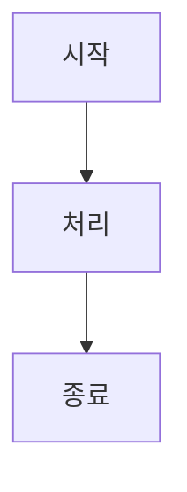
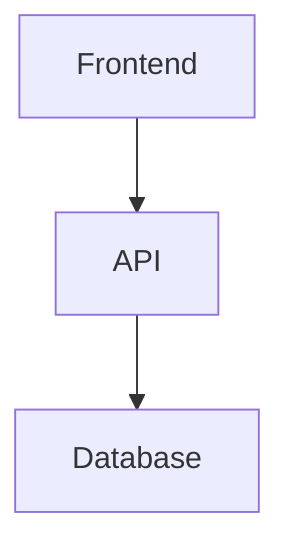

# 교육 게시판 (문서 페이지) 설치 가이드

## 📋 개요

`/docs` 경로에서 마크다운 파일을 렌더링하는 교육 게시판이 추가되었습니다.

---

## 🚀 빠른 시작

### 1. 필요한 패키지 설치

```bash
npm install mermaid
# 또는
pnpm add mermaid
```

### 2. 서버 실행

```bash
npm run dev
```

### 3. 브라우저에서 확인

```
http://localhost:3000/docs
```

---

## 📁 생성된 파일

### 페이지
- `/app/docs/page.tsx` - 문서 목록 페이지
- `/app/docs/[slug]/page.tsx` - 문서 상세 페이지
- `/app/docs/[slug]/MarkdownRenderer.tsx` - 마크다운 렌더러

### 헤더 메뉴
- `/components/header/config.ts` - "교육 게시판" 메뉴 추가됨

---

## 🎨 기능

### 1. 문서 목록 페이지 (`/docs`)

- **카테고리별 분류**: Backend, Frontend, Architecture, Legal
- **문서 카드**: 아이콘, 제목, 설명, 수정일, 파일 크기
- **검색 및 필터링**: 카테고리별로 그룹화
- **반응형 디자인**: 모바일/태블릿/데스크톱 최적화

### 2. 문서 상세 페이지 (`/docs/[slug]`)

- **마크다운 렌더링**:
  - 헤더 (H1, H2, H3)
  - 리스트 (ordered, unordered)
  - 코드 블록 (syntax highlighting)
  - 테이블
  - 링크, 볼드, 이탤릭
  - 인라인 코드
  - 수평선

- **Mermaid 다이어그램 지원**:
  - 플로우차트
  - 시퀀스 다이어그램
  - ERD (Entity Relationship Diagram)
  - 클래스 다이어그램
  - 상태 다이어그램

- **네비게이션**:
  - 목록으로 돌아가기
  - 다운로드 버튼
  - 카테고리 배지
  - 수정일 표시

---

## 📄 문서 추가 방법

### 1. 마크다운 파일 생성

`/frontend/documents/` 폴더에 `.md` 파일을 추가하세요.

```
frontend/documents/
├── API_INTEGRATION.md
├── GALLERY_IMPLEMENTATION.md
└── YOUR_NEW_DOC.md  ← 여기에 추가
```

### 2. 메타데이터 설정 (선택사항)

`/app/docs/page.tsx`와 `/app/docs/[slug]/page.tsx`에서 메타데이터를 추가할 수 있습니다:

```typescript
const docMetadata: Record<string, DocMetadata> = {
  'YOUR_NEW_DOC.md': {
    title: '문서 제목',
    description: '문서 설명',
    category: 'Frontend', // Backend, Frontend, Architecture, Legal
    icon: Code, // lucide-react 아이콘
    color: 'green', // blue, green, purple, yellow, red, gray
  },
};
```

### 3. 자동으로 목록에 표시됨

파일을 저장하면 자동으로 문서 목록에 표시됩니다!

---

## 🎨 지원하는 마크다운 문법

### 헤더
```markdown
# H1 제목
## H2 제목
### H3 제목
```

### 리스트
```markdown
- 항목 1
- 항목 2
  - 하위 항목

1. 첫 번째
2. 두 번째
```

### 코드 블록
````markdown
```typescript
const hello = "world";
```
````

### Mermaid 다이어그램
````markdown

````

### 테이블
```markdown
| 제목 1 | 제목 2 |
|--------|--------|
| 내용 1 | 내용 2 |
```

### 링크 및 강조
```markdown
[링크 텍스트](https://example.com)
**볼드**
*이탤릭*
`인라인 코드`
```

---

## 🔧 고급 설정

### Mermaid 테마 커스터마이징

`/app/docs/[slug]/MarkdownRenderer.tsx`에서 Mermaid 테마를 변경할 수 있습니다:

```typescript
mermaid.initialize({
  theme: 'default', // default, dark, forest, neutral
  themeVariables: {
    primaryColor: '#3b82f6',    // 메인 색상
    primaryTextColor: '#fff',   // 텍스트 색상
    primaryBorderColor: '#2563eb', // 테두리 색상
    // ... 더 많은 설정
  },
});
```

### 스타일 커스터마이징

`/app/docs/[slug]/MarkdownRenderer.tsx`의 `prose` 클래스를 수정하여 스타일을 변경할 수 있습니다:

```typescript
<div className="prose prose-lg max-w-none
  prose-headings:text-gray-900
  prose-p:text-gray-700
  prose-a:text-blue-600
  ...
">
```

---

## 📊 URL 구조

| URL | 설명 |
|-----|------|
| `/docs` | 문서 목록 |
| `/docs/api_integration` | API 통합 가이드 상세 |
| `/docs/gallery_implementation` | 갤러리 구현 가이드 상세 |
| `/docs/auth_system` | 인증 시스템 상세 |

**URL 변환 규칙:**
- 파일명: `API_INTEGRATION.md`
- Slug: `api_integration` (소문자, 언더스코어 유지)

---

## 🐛 트러블슈팅

### 1. Mermaid 다이어그램이 렌더링되지 않아요

**해결책:**
```bash
npm install mermaid
```

### 2. 문서가 목록에 표시되지 않아요

**확인 사항:**
1. 파일이 `/frontend/documents/` 폴더에 있나요?
2. 파일 확장자가 `.md`인가요?
3. 파일명이 `.backup`으로 끝나지 않나요?

### 3. 스타일이 깨져 보여요

**해결책:**
1. 개발 서버 재시작: `npm run dev`
2. 브라우저 캐시 삭제: `Cmd + Shift + R` (Mac) / `Ctrl + Shift + R` (Windows)

---

## 📚 예제 문서

### 예제 1: 기본 문서

```markdown
# 제목

간단한 설명입니다.

## 섹션 1

내용...

### 하위 섹션

더 많은 내용...
```

### 예제 2: Mermaid 포함

````markdown
# 시스템 구조

## 아키텍처



## 설명

위 다이어그램은...
````

---

## 🎯 추천 사항

1. **문서 구조화**: 카테고리별로 문서를 정리하세요
2. **메타데이터 활용**: 각 문서에 적절한 아이콘과 설명을 추가하세요
3. **Mermaid 활용**: 복잡한 개념은 다이어그램으로 시각화하세요
4. **코드 블록**: 언어를 명시하여 syntax highlighting을 활용하세요

---

## 🚀 다음 단계

1. ✅ 패키지 설치 (`npm install mermaid`)
2. ✅ 서버 실행 (`npm run dev`)
3. ✅ `/docs` 페이지 확인
4. ✅ 새 문서 추가
5. ✅ 메타데이터 커스터마이징

---

**완료!** 이제 교육 게시판을 사용할 수 있습니다! 🎉

문의사항이 있으시면 언제든지 연락주세요.

