# API 통합 문서 요약

## 📋 목차

1. [시스템 아키텍처](#-시스템-아키텍처)
2. [ERD (Entity Relationship Diagram)](#-erd-entity-relationship-diagram)
3. [데이터베이스 테이블 구조](#-데이터베이스-테이블-구조)
4. [REST API 엔드포인트](#-rest-api-엔드포인트)
5. [CRUD 매트릭스](#-crud-매트릭스)
6. [API 호출 시퀀스](#-api-호출-시퀀스)
7. [데이터 흐름도](#-데이터-흐름도)

---

## 🏗️ 시스템 아키텍처

```mermaid
graph TB
    subgraph "클라이언트"
        A[Next.js 15 Frontend]
        B[React 19 Components]
        C[Shadcn/ui]
    end
    
    subgraph "API Layer"
        D[Django REST Framework]
        E[JWT Authentication]
        F[ViewSets & Serializers]
    end
    
    subgraph "데이터베이스"
        G[(PostgreSQL 15+)]
        H[22개 테이블]
    end
    
    subgraph "외부 서비스"
        I[Email Service]
        J[File Storage]
        K[Payment Gateway]
    end
    
    A --> D
    B --> D
    C --> A
    D --> E
    D --> F
    F --> G
    D --> I
    D --> J
    D --> K
    
    style A fill:#61dafb,color:#111
    style D fill:#092e20
    style G fill:#336791
```

---

## 📊 ERD (Entity Relationship Diagram)

```mermaid
erDiagram
    USER ||--o{ ENROLLMENT : "수강신청"
    USER ||--o{ INQUIRY : "작성"
    USER ||--o{ GALLERY_WORK : "작품등록"
    USER ||--o{ GALLERY_REVIEW : "후기작성"
    USER ||--o{ QUOTE : "요청"
    USER ||--o{ PRODUCT_REVIEW : "작성"
    USER ||--o{ COMMENT : "작성"
    
    CURRICULUM ||--o{ CURRICULUM_MODULE : "포함"
    CURRICULUM ||--o{ SCHEDULE : "개설"
    
    SCHEDULE ||--|| INSTRUCTOR : "담당"
    SCHEDULE ||--o{ ENROLLMENT : "수강생"
    SCHEDULE ||--o{ REVIEW : "수강후기"
    SCHEDULE ||--o{ COMMENT : "질문답변"
    
    PRODUCT ||--o{ PRODUCT_IMAGE : "이미지"
    PRODUCT ||--o{ PRODUCT_COMPONENT : "구성품"
    PRODUCT ||--o{ PRODUCT_REVIEW : "후기"
    PRODUCT ||--o{ QUOTE_ITEM : "견적항목"
    
    QUOTE ||--o{ QUOTE_ITEM : "항목"
    
    VIDEO ||--o{ VIDEO_STEP : "제작단계"
    
    GALLERY_WORK ||--o{ GALLERY_WORK_IMAGE : "이미지"
    
    GALLERY_REVIEW ||--o{ GALLERY_REVIEW_IMAGE : "이미지"
    GALLERY_REVIEW ||--|| SCHEDULE : "수강강좌"
    
    USER {
        int id PK
        string email UK
        string password_hash
        string name
        string phone
        string role
        boolean is_verified
        timestamp created_at
    }
    
    CURRICULUM {
        int id PK
        string slug UK
        string title
        string category
        string difficulty
        jsonb learning_goals
        boolean is_active
    }
    
    SCHEDULE {
        int id PK
        int curriculum_id FK
        int instructor_id FK
        date start_date
        date end_date
        int capacity
        int enrolled_count
        decimal price
        string status
    }
    
    PRODUCT {
        int id PK
        string slug UK
        string title
        string category
        decimal price
        int stock_quantity
        boolean is_available
    }
    
    ENROLLMENT {
        int id PK
        int user_id FK
        int schedule_id FK
        int progress
        string status
        string payment_status
    }
    
    GALLERY_WORK {
        int id PK
        int user_id FK
        string title
        string category
        text project_details
        array tech_stack
        string difficulty
        int view_count
        int like_count
        string status
    }
    
    GALLERY_REVIEW {
        int id PK
        int user_id FK
        int schedule_id FK
        string title
        int rating
        text content
        array satisfaction
        boolean would_recommend
        int view_count
        int like_count
        string status
    }
    
    INQUIRY {
        int id PK
        int user_id FK
        string inquiry_type
        string title
        string institution
        string status
    }
    
    QUOTE {
        int id PK
        int user_id FK
        decimal total_amount
        string status
    }
```

---

## 🗄️ 데이터베이스 테이블 구조

### 1. 핵심 엔티티 (6개 테이블)

#### 1.1 accounts_user (사용자)

| 칼럼명 | 타입 | 제약조건 | 설명 |
|--------|------|----------|------|
| id | SERIAL | PK | 사용자 ID |
| email | VARCHAR(255) | UNIQUE, NOT NULL | 이메일 (로그인 ID) |
| password_hash | VARCHAR(255) | NOT NULL | 암호화된 비밀번호 |
| name | VARCHAR(100) | NOT NULL | 이름 |
| phone | VARCHAR(20) | | 전화번호 |
| profile_image | VARCHAR(500) | | 프로필 이미지 URL |
| role | VARCHAR(20) | DEFAULT 'student' | 역할 (student/teacher/admin) |
| is_active | BOOLEAN | DEFAULT TRUE | 활성 상태 |
| is_verified | BOOLEAN | DEFAULT FALSE | 이메일 인증 여부 |
| email_verification_token | VARCHAR(100) | | 이메일 인증 토큰 |
| birth_date | DATE | | 생년월일 |
| grade | VARCHAR(50) | | 학년 |
| school_name | VARCHAR(200) | | 학교명 |
| created_at | TIMESTAMP | DEFAULT NOW | 가입일 |
| updated_at | TIMESTAMP | DEFAULT NOW | 수정일 |
| deleted_at | TIMESTAMP | | 삭제일 (Soft Delete) |

**인덱스:**
- idx_user_email (email)
- idx_user_role (role)
- idx_user_deleted_at (deleted_at)

---

#### 1.2 curriculum (커리큘럼)

| 칼럼명 | 타입 | 제약조건 | 설명 |
|--------|------|----------|------|
| id | SERIAL | PK | 커리큘럼 ID |
| slug | VARCHAR(100) | UNIQUE, NOT NULL | URL 슬러그 |
| category | VARCHAR(50) | NOT NULL | 카테고리 |
| title | VARCHAR(200) | NOT NULL | 제목 |
| subtitle | VARCHAR(300) | | 부제목 |
| description | TEXT | | 설명 |
| badge | VARCHAR(50) | | 뱃지 |
| duration | VARCHAR(50) | | 기간 |
| capacity | VARCHAR(50) | | 정원 |
| total_hours | VARCHAR(50) | | 총 시간 |
| target_grade | VARCHAR(100) | | 대상 학년 |
| difficulty | VARCHAR(20) | | 난이도 (elementary/intermediate/advanced) |
| requirements | JSONB | | 요구사항 배열 |
| learning_goals | JSONB | | 학습 목표 |
| achievements | TEXT[] | | 기대 성과 배열 |
| is_active | BOOLEAN | DEFAULT TRUE | 활성 상태 |
| display_order | INTEGER | DEFAULT 0 | 표시 순서 |
| created_at | TIMESTAMP | DEFAULT NOW | 생성일 |
| updated_at | TIMESTAMP | DEFAULT NOW | 수정일 |

**인덱스:**
- idx_curriculum_slug (slug)
- idx_curriculum_category (category)
- idx_curriculum_display_order (display_order)

---

#### 1.3 curriculum_module (커리큘럼 모듈)

| 칼럼명 | 타입 | 제약조건 | 설명 |
|--------|------|----------|------|
| id | SERIAL | PK | 모듈 ID |
| curriculum_id | INTEGER | FK → curriculum.id | 커리큘럼 ID |
| module_order | INTEGER | NOT NULL | 모듈 순서 |
| title | VARCHAR(200) | NOT NULL | 제목 |
| duration | VARCHAR(50) | | 기간 |
| description | TEXT | | 설명 |
| topics | TEXT[] | | 주제 배열 |
| objectives | TEXT[] | | 학습 목표 배열 |
| materials | JSONB | | 학습 자료 |
| created_at | TIMESTAMP | DEFAULT NOW | 생성일 |

**UNIQUE 제약:** (curriculum_id, module_order)

---

#### 1.4 instructor (강사)

| 칼럼명 | 타입 | 제약조건 | 설명 |
|--------|------|----------|------|
| id | SERIAL | PK | 강사 ID |
| user_id | INTEGER | FK → accounts_user.id | 사용자 ID |
| name | VARCHAR(100) | NOT NULL | 이름 |
| title | VARCHAR(100) | | 직함 |
| profile_image | VARCHAR(500) | | 프로필 이미지 |
| experience | VARCHAR(50) | | 경력 |
| specialization | TEXT | | 전문 분야 |
| education | VARCHAR(200) | | 학력 |
| introduction | TEXT | | 자기소개 |
| total_students | INTEGER | DEFAULT 0 | 누적 수강생 수 |
| average_rating | DECIMAL(3,2) | DEFAULT 0 | 평균 평점 |
| is_active | BOOLEAN | DEFAULT TRUE | 활성 상태 |
| created_at | TIMESTAMP | DEFAULT NOW | 생성일 |

---

#### 1.5 schedule (강좌 스케줄)

| 칼럼명 | 타입 | 제약조건 | 설명 |
|--------|------|----------|------|
| id | SERIAL | PK | 강좌 ID |
| curriculum_id | INTEGER | FK → curriculum.id | 커리큘럼 ID |
| instructor_id | INTEGER | FK → instructor.id | 강사 ID |
| title | VARCHAR(200) | NOT NULL | 강좌명 |
| description | TEXT | | 설명 |
| start_date | DATE | NOT NULL | 시작일 |
| end_date | DATE | NOT NULL | 종료일 |
| schedule_time | VARCHAR(100) | | 수업 시간 |
| month | VARCHAR(7) | | 월 필터 (2025-03) |
| capacity | INTEGER | NOT NULL | 정원 |
| enrolled_count | INTEGER | DEFAULT 0 | 현재 수강 인원 |
| level | VARCHAR(20) | | 난이도 |
| duration | VARCHAR(50) | | 기간 |
| location | VARCHAR(200) | | 장소 |
| price | DECIMAL(10,2) | NOT NULL | 가격 |
| original_price | DECIMAL(10,2) | | 원래 가격 |
| discount_rate | INTEGER | DEFAULT 0 | 할인율 |
| rating | DECIMAL(3,2) | DEFAULT 0 | 평점 |
| review_count | INTEGER | DEFAULT 0 | 후기 수 |
| status | VARCHAR(20) | DEFAULT 'upcoming' | 상태 (upcoming/ongoing/completed) |
| created_at | TIMESTAMP | DEFAULT NOW | 생성일 |

**인덱스:**
- idx_schedule_curriculum (curriculum_id)
- idx_schedule_instructor (instructor_id)
- idx_schedule_month (month)
- idx_schedule_status (status)

---

#### 1.6 enrollment (수강 신청)

| 칼럼명 | 타입 | 제약조건 | 설명 |
|--------|------|----------|------|
| id | SERIAL | PK | 수강 ID |
| user_id | INTEGER | FK → accounts_user.id | 사용자 ID |
| schedule_id | INTEGER | FK → schedule.id | 강좌 ID |
| status | VARCHAR(20) | DEFAULT 'enrolled' | 상태 (enrolled/in_progress/completed) |
| progress | INTEGER | DEFAULT 0 | 진행률 (0-100) |
| completed_modules | INTEGER | DEFAULT 0 | 완료 모듈 수 |
| payment_status | VARCHAR(20) | DEFAULT 'pending' | 결제 상태 |
| payment_amount | DECIMAL(10,2) | | 결제 금액 |
| payment_method | VARCHAR(50) | | 결제 방법 |
| payment_date | TIMESTAMP | | 결제 일시 |
| enrolled_at | TIMESTAMP | DEFAULT NOW | 수강 신청일 |
| created_at | TIMESTAMP | DEFAULT NOW | 생성일 |

**UNIQUE 제약:** (user_id, schedule_id)

---

### 2. 제품 관리 (4개 테이블)

#### 2.1 product (제품)

| 칼럼명 | 타입 | 제약조건 | 설명 |
|--------|------|----------|------|
| id | SERIAL | PK | 제품 ID |
| slug | VARCHAR(100) | UNIQUE, NOT NULL | URL 슬러그 |
| category | VARCHAR(50) | NOT NULL | 카테고리 |
| title | VARCHAR(200) | NOT NULL | 제품명 |
| short_description | TEXT | | 짧은 설명 |
| description | TEXT | | 상세 설명 |
| educational_value | TEXT | | 교육적 가치 |
| price | DECIMAL(10,2) | NOT NULL | 가격 |
| original_price | DECIMAL(10,2) | | 원래 가격 |
| discount_rate | INTEGER | DEFAULT 0 | 할인율 |
| target_grade | VARCHAR(50) | | 대상 학년 |
| rating | DECIMAL(3,2) | DEFAULT 0 | 평점 |
| review_count | INTEGER | DEFAULT 0 | 후기 수 |
| sold_count | INTEGER | DEFAULT 0 | 판매 수 |
| stock_quantity | INTEGER | DEFAULT 0 | 재고 수량 |
| badges | TEXT[] | | 뱃지 배열 |
| features | TEXT[] | | 특징 배열 |
| main_image | VARCHAR(500) | | 대표 이미지 |
| is_available | BOOLEAN | DEFAULT TRUE | 판매 가능 여부 |
| created_at | TIMESTAMP | DEFAULT NOW | 생성일 |

---

#### 2.2 product_image (제품 이미지)

| 칼럼명 | 타입 | 제약조건 | 설명 |
|--------|------|----------|------|
| id | SERIAL | PK | 이미지 ID |
| product_id | INTEGER | FK → product.id | 제품 ID |
| image_url | VARCHAR(500) | NOT NULL | 이미지 URL |
| image_order | INTEGER | DEFAULT 0 | 순서 |
| alt_text | VARCHAR(200) | | 대체 텍스트 |
| created_at | TIMESTAMP | DEFAULT NOW | 생성일 |

---

#### 2.3 product_component (제품 구성품)

| 칼럼명 | 타입 | 제약조건 | 설명 |
|--------|------|----------|------|
| id | SERIAL | PK | 구성품 ID |
| product_id | INTEGER | FK → product.id | 제품 ID |
| component_name | VARCHAR(200) | NOT NULL | 구성품명 |
| quantity | INTEGER | DEFAULT 1 | 수량 |
| specification | VARCHAR(500) | | 사양 |
| purpose | VARCHAR(200) | | 용도 |
| created_at | TIMESTAMP | DEFAULT NOW | 생성일 |

---

#### 2.4 product_review (제품 후기)

| 칼럼명 | 타입 | 제약조건 | 설명 |
|--------|------|----------|------|
| id | SERIAL | PK | 후기 ID |
| product_id | INTEGER | FK → product.id | 제품 ID |
| user_id | INTEGER | FK → accounts_user.id | 사용자 ID |
| author_name | VARCHAR(100) | NOT NULL | 작성자명 |
| author_role | VARCHAR(100) | | 역할 |
| rating | INTEGER | CHECK (1-5) | 평점 |
| content | TEXT | NOT NULL | 내용 |
| photos | TEXT[] | | 사진 배열 |
| likes_count | INTEGER | DEFAULT 0 | 좋아요 수 |
| helpful_count | INTEGER | DEFAULT 0 | 도움됨 수 |
| created_at | TIMESTAMP | DEFAULT NOW | 작성일 |

---

### 3. 견적 및 문의 (3개 테이블)

#### 3.1 quote (견적)

| 칼럼명 | 타입 | 제약조건 | 설명 |
|--------|------|----------|------|
| id | SERIAL | PK | 견적 ID |
| user_id | INTEGER | FK → accounts_user.id | 사용자 ID |
| requester_name | VARCHAR(100) | NOT NULL | 요청자명 |
| requester_phone | VARCHAR(20) | NOT NULL | 전화번호 |
| requester_email | VARCHAR(255) | | 이메일 |
| organization | VARCHAR(200) | | 기관명 |
| total_amount | DECIMAL(10,2) | DEFAULT 0 | 총 금액 |
| message | TEXT | | 메시지 |
| status | VARCHAR(20) | DEFAULT 'pending' | 상태 |
| created_at | TIMESTAMP | DEFAULT NOW | 요청일 |
| processed_at | TIMESTAMP | | 처리일 |

---

#### 3.2 quote_item (견적 항목)

| 칼럼명 | 타입 | 제약조건 | 설명 |
|--------|------|----------|------|
| id | SERIAL | PK | 항목 ID |
| quote_id | INTEGER | FK → quote.id | 견적 ID |
| product_id | INTEGER | FK → product.id | 제품 ID |
| product_name | VARCHAR(200) | NOT NULL | 제품명 (스냅샷) |
| unit_price | DECIMAL(10,2) | NOT NULL | 단가 |
| quantity | INTEGER | NOT NULL | 수량 |
| subtotal | DECIMAL(10,2) | NOT NULL | 소계 |
| created_at | TIMESTAMP | DEFAULT NOW | 생성일 |

---

#### 3.3 inquiry (문의)

| 칼럼명 | 타입 | 제약조건 | 설명 |
|--------|------|----------|------|
| id | SERIAL | PK | 문의 ID |
| user_id | INTEGER | FK → accounts_user.id | 사용자 ID |
| inquiry_type | VARCHAR(20) | NOT NULL | 문의 타입 (online/outreach/general) |
| title | VARCHAR(200) | NOT NULL | 제목 |
| content | TEXT | NOT NULL | 내용 |
| requester_name | VARCHAR(100) | NOT NULL | 요청자명 |
| requester_contact | VARCHAR(20) | NOT NULL | 연락처 |
| requester_email | VARCHAR(255) | | 이메일 |
| institution | VARCHAR(200) | | 기관명 (출장 문의) |
| institution_type | VARCHAR(50) | | 기관 유형 |
| course | VARCHAR(100) | | 희망 과정 |
| grade | VARCHAR(50) | | 대상 학년 |
| preferred_date | DATE | | 희망 날짜 |
| location | VARCHAR(200) | | 장소 |
| status | VARCHAR(20) | DEFAULT 'pending' | 상태 |
| created_at | TIMESTAMP | DEFAULT NOW | 작성일 |

**인덱스:**
- idx_inquiry_type (inquiry_type)
- idx_inquiry_status (status)

---

### 4. 갤러리 (6개 테이블) - 작품/후기 분리

#### 4.1 gallery_work (학생 작품)

| 칼럼명 | 타입 | 제약조건 | 설명 |
|--------|------|----------|------|
| id | SERIAL | PK | 작품 ID |
| user_id | INTEGER | FK → accounts_user.id | 사용자 ID |
| title | VARCHAR(200) | NOT NULL | 작품명 |
| summary | VARCHAR(500) | | 요약 |
| description | TEXT | | 설명 |
| category | VARCHAR(50) | | 카테고리 (IoT/앱개발/로보틱스/AI) |
| author_name | VARCHAR(100) | | 작성자명 |
| author_grade | VARCHAR(50) | | 학년 |
| main_image | VARCHAR(500) | | 대표 이미지 |
| project_details | TEXT | | 프로젝트 상세 설명 |
| tags | TEXT[] | | 태그 배열 |
| tech_stack | TEXT[] | | 기술 스택 |
| tools | TEXT[] | | 사용 도구 |
| difficulty | VARCHAR(20) | | 난이도 |
| duration | VARCHAR(50) | | 제작 기간 |
| features | TEXT[] | | 주요 기능 |
| challenges | TEXT | | 어려웠던 점 |
| learnings | TEXT | | 배운 점 |
| view_count | INTEGER | DEFAULT 0 | 조회 수 |
| like_count | INTEGER | DEFAULT 0 | 좋아요 수 |
| status | VARCHAR(20) | DEFAULT 'pending' | 상태 (pending/approved/rejected) |
| is_featured | BOOLEAN | DEFAULT FALSE | 추천 작품 여부 |
| created_at | TIMESTAMP | DEFAULT NOW | 작성일 |
| updated_at | TIMESTAMP | DEFAULT NOW | 수정일 |

**인덱스:**
- idx_gallery_work_user (user_id)
- idx_gallery_work_category (category)
- idx_gallery_work_status (status)
- idx_gallery_work_is_featured (is_featured)

---

#### 4.2 gallery_work_image (작품 이미지)

| 칼럼명 | 타입 | 제약조건 | 설명 |
|--------|------|----------|------|
| id | SERIAL | PK | 이미지 ID |
| gallery_work_id | INTEGER | FK → gallery_work.id | 작품 ID |
| image_url | VARCHAR(500) | NOT NULL | 이미지 URL |
| image_order | INTEGER | DEFAULT 0 | 순서 |
| caption | VARCHAR(500) | | 캡션 |
| created_at | TIMESTAMP | DEFAULT NOW | 생성일 |

**인덱스:**
- idx_gallery_work_image (gallery_work_id, image_order)

---

#### 4.3 gallery_review (수업 후기 갤러리)

| 칼럼명 | 타입 | 제약조건 | 설명 |
|--------|------|----------|------|
| id | SERIAL | PK | 후기 ID |
| user_id | INTEGER | FK → accounts_user.id | 사용자 ID |
| schedule_id | INTEGER | FK → schedule.id | 수강한 강좌 ID |
| title | VARCHAR(200) | NOT NULL | 제목 |
| summary | VARCHAR(500) | | 요약 |
| content | TEXT | NOT NULL | 내용 |
| category | VARCHAR(50) | | 강좌 카테고리 |
| main_image | VARCHAR(500) | | 대표 이미지 |
| author_name | VARCHAR(100) | | 작성자명 |
| student_grade | VARCHAR(50) | | 학년 |
| rating | INTEGER | CHECK (1-5) | 평점 |
| course_type | VARCHAR(100) | | 수강 과정 |
| course_duration | VARCHAR(50) | | 수강 기간 |
| class_type | VARCHAR(50) | | 수업 형태 (소규모/출장/온라인) |
| satisfaction | JSONB | | 만족도 (curriculum/instructor/facility/management) |
| would_recommend | BOOLEAN | | 추천 의향 |
| target_audience | TEXT[] | | 추천 대상 |
| achievements | TEXT[] | | 성과/배운 점 |
| improvements | TEXT[] | | 개선되었던 부분 |
| view_count | INTEGER | DEFAULT 0 | 조회 수 |
| like_count | INTEGER | DEFAULT 0 | 좋아요 수 |
| status | VARCHAR(20) | DEFAULT 'pending' | 상태 (pending/approved/rejected) |
| is_featured | BOOLEAN | DEFAULT FALSE | 추천 후기 여부 |
| created_at | TIMESTAMP | DEFAULT NOW | 작성일 |
| updated_at | TIMESTAMP | DEFAULT NOW | 수정일 |

**인덱스:**
- idx_gallery_review_user (user_id)
- idx_gallery_review_schedule (schedule_id)
- idx_gallery_review_category (category)
- idx_gallery_review_status (status)
- idx_gallery_review_rating (rating)

---

#### 4.4 gallery_review_image (후기 이미지)

| 칼럼명 | 타입 | 제약조건 | 설명 |
|--------|------|----------|------|
| id | SERIAL | PK | 이미지 ID |
| gallery_review_id | INTEGER | FK → gallery_review.id | 후기 ID |
| image_url | VARCHAR(500) | NOT NULL | 이미지 URL |
| image_order | INTEGER | DEFAULT 0 | 순서 |
| caption | VARCHAR(500) | | 캡션 |
| created_at | TIMESTAMP | DEFAULT NOW | 생성일 |

**인덱스:**
- idx_gallery_review_image (gallery_review_id, image_order)

---

#### 4.5 video (교육 영상)

| 칼럼명 | 타입 | 제약조건 | 설명 |
|--------|------|----------|------|
| id | SERIAL | PK | 영상 ID |
| title | VARCHAR(200) | NOT NULL | 제목 |
| description | TEXT | | 설명 |
| thumbnail_url | VARCHAR(500) | | 썸네일 |
| video_url | VARCHAR(500) | NOT NULL | 영상 URL |
| video_id | VARCHAR(50) | | YouTube ID |
| duration | VARCHAR(20) | | 재생 시간 |
| difficulty | VARCHAR(20) | | 난이도 |
| category | VARCHAR(50) | | 카테고리 |
| view_count | INTEGER | DEFAULT 0 | 조회 수 |
| is_active | BOOLEAN | DEFAULT TRUE | 활성 상태 |
| created_at | TIMESTAMP | DEFAULT NOW | 생성일 |

---

#### 4.6 video_step (영상 제작 단계)

| 칼럼명 | 타입 | 제약조건 | 설명 |
|--------|------|----------|------|
| id | SERIAL | PK | 단계 ID |
| video_id | INTEGER | FK → video.id | 영상 ID |
| step_number | INTEGER | NOT NULL | 단계 번호 |
| step_title | VARCHAR(200) | NOT NULL | 단계 제목 |
| step_description | TEXT | | 설명 |
| youtube_timestamp | VARCHAR(20) | | YouTube 타임스탬프 |
| created_at | TIMESTAMP | DEFAULT NOW | 생성일 |

**UNIQUE 제약:** (video_id, step_number)

---

### 5. 리뷰 및 댓글 (2개 테이블)

#### 5.1 review (수강 후기)

| 칼럼명 | 타입 | 제약조건 | 설명 |
|--------|------|----------|------|
| id | SERIAL | PK | 후기 ID |
| user_id | INTEGER | FK → accounts_user.id | 사용자 ID |
| schedule_id | INTEGER | FK → schedule.id | 강좌 ID |
| enrollment_id | INTEGER | FK → enrollment.id | 수강 ID |
| student_name | VARCHAR(100) | NOT NULL | 학생명 |
| rating | INTEGER | CHECK (1-5) | 평점 |
| comment | TEXT | NOT NULL | 내용 |
| created_at | TIMESTAMP | DEFAULT NOW | 작성일 |

---

#### 5.2 comment (질문/답변)

| 칼럼명 | 타입 | 제약조건 | 설명 |
|--------|------|----------|------|
| id | SERIAL | PK | 댓글 ID |
| schedule_id | INTEGER | FK → schedule.id | 강좌 ID |
| user_id | INTEGER | FK → accounts_user.id | 사용자 ID |
| parent_comment_id | INTEGER | FK → comment.id | 부모 댓글 ID (답글) |
| user_name | VARCHAR(100) | NOT NULL | 작성자명 |
| user_type | VARCHAR(20) | | 사용자 타입 (student/instructor/admin) |
| question | TEXT | | 질문 |
| content | TEXT | | 답변/댓글 |
| likes_count | INTEGER | DEFAULT 0 | 좋아요 수 |
| created_at | TIMESTAMP | DEFAULT NOW | 작성일 |

---

### 6. CMS 콘텐츠 (3개 테이블)

#### 6.1 home_content (홈 콘텐츠)

| 칼럼명 | 타입 | 제약조건 | 설명 |
|--------|------|----------|------|
| id | SERIAL | PK | 콘텐츠 ID |
| content_key | VARCHAR(50) | UNIQUE, NOT NULL | 콘텐츠 키 |
| content_data | JSONB | NOT NULL | 콘텐츠 데이터 |
| created_at | TIMESTAMP | DEFAULT NOW | 생성일 |
| updated_at | TIMESTAMP | DEFAULT NOW | 수정일 |

---

#### 6.2 about_content (소개 콘텐츠)

| 칼럼명 | 타입 | 제약조건 | 설명 |
|--------|------|----------|------|
| id | SERIAL | PK | 콘텐츠 ID |
| content_key | VARCHAR(50) | UNIQUE, NOT NULL | 콘텐츠 키 |
| content_data | JSONB | NOT NULL | 콘텐츠 데이터 |
| created_at | TIMESTAMP | DEFAULT NOW | 생성일 |
| updated_at | TIMESTAMP | DEFAULT NOW | 수정일 |

---

#### 6.3 policy (정책 문서)

| 칼럼명 | 타입 | 제약조건 | 설명 |
|--------|------|----------|------|
| id | SERIAL | PK | 정책 ID |
| policy_type | VARCHAR(50) | UNIQUE, NOT NULL | 정책 타입 (terms/privacy) |
| title | VARCHAR(200) | NOT NULL | 제목 |
| content | TEXT | NOT NULL | 내용 |
| version | VARCHAR(20) | DEFAULT '1.0' | 버전 |
| is_active | BOOLEAN | DEFAULT TRUE | 활성 상태 |
| effective_date | DATE | NOT NULL | 시행일 |
| created_at | TIMESTAMP | DEFAULT NOW | 생성일 |

---

## 🔗 REST API 엔드포인트

### API 엔드포인트 구조

```mermaid
graph TD
    A["/api/v1<br/>Base URL"]
    
    A --> B["/auth<br/>인증"]
    A --> C["/users<br/>사용자"]
    A --> D["/curriculum<br/>커리큘럼"]
    A --> E["/schedules<br/>강좌"]
    A --> F["/enrollments<br/>수강신청"]
    A --> G["/products<br/>제품"]
    A --> H["/quotes<br/>견적"]
    A --> I["/gallery<br/>갤러리"]
    A --> J["/inquiries<br/>문의"]
    A --> K["/videos<br/>영상"]
    A --> L["/home<br/>홈"]
    A --> M["/about<br/>소개"]
    A --> N["/policies<br/>정책"]
    A --> O["/admin<br/>관리자"]
    
    B --> B1["register<br/>회원가입"]
    B --> B2["login<br/>로그인"]
    B --> B3["logout<br/>로그아웃"]
    
    C --> C1["profile<br/>프로필"]
    C --> C2["enrollments<br/>내 수강"]
    
    D --> D1["GET 목록<br/>POST 생성"]
    E --> E1["GET 목록<br/>POST 생성"]
    G --> G1["GET 목록<br/>POST 생성"]
    
    style A fill:#092e20,color:#fff
    style O fill:#ff6b6b,color:#fff
```

---

## 📊 CRUD 매트릭스

### 1. 인증 (Authentication)

| 엔드포인트 | Method | CRUD | 인증 필요 | 권한 | 설명 |
|------------|--------|------|-----------|------|------|
| `/api/v1/auth/register` | POST | C | ❌ | - | 회원가입 |
| `/api/v1/auth/login` | POST | R | ❌ | - | 로그인 |
| `/api/v1/auth/logout` | POST | - | ✅ | all | 로그아웃 |
| `/api/v1/auth/refresh` | POST | R | ❌ | - | 토큰 갱신 |
| `/api/v1/auth/verify-email/request` | POST | U | ✅ | all | 이메일 인증 요청 |
| `/api/v1/auth/verify-email/confirm` | POST | U | ❌ | - | 이메일 인증 확인 |
| `/api/v1/auth/password-reset/request` | POST | R | ❌ | - | 비밀번호 재설정 요청 |
| `/api/v1/auth/password-reset/confirm` | POST | U | ❌ | - | 비밀번호 재설정 |

---

### 2. 사용자 (User)

| 엔드포인트 | Method | CRUD | 인증 필요 | 권한 | 설명 |
|------------|--------|------|-----------|------|------|
| `/api/v1/users/profile` | GET | R | ✅ | all | 프로필 조회 |
| `/api/v1/users/profile` | PUT | U | ✅ | all | 프로필 수정 |
| `/api/v1/users/enrollments` | GET | R | ✅ | student | 내 수강 목록 |
| `/api/v1/users/inquiries` | GET | R | ✅ | all | 내 문의 목록 |

---

### 3. 커리큘럼 (Curriculum)

| 엔드포인트 | Method | CRUD | 인증 필요 | 권한 | 설명 |
|------------|--------|------|-----------|------|------|
| `/api/v1/curriculum` | GET | R | ❌ | - | 커리큘럼 목록 |
| `/api/v1/curriculum/:slug` | GET | R | ❌ | - | 커리큘럼 상세 |
| `/api/v1/admin/curriculum` | POST | C | ✅ | admin | 커리큘럼 생성 |
| `/api/v1/admin/curriculum/:id` | PUT | U | ✅ | admin | 커리큘럼 수정 |
| `/api/v1/admin/curriculum/:id` | DELETE | D | ✅ | admin | 커리큘럼 삭제 |

---

### 4. 강좌 (Schedule)

| 엔드포인트 | Method | CRUD | 인증 필요 | 권한 | 설명 |
|------------|--------|------|-----------|------|------|
| `/api/v1/schedules` | GET | R | ❌ | - | 강좌 목록 |
| `/api/v1/schedules/:id` | GET | R | ❌ | - | 강좌 상세 |
| `/api/v1/admin/schedules` | POST | C | ✅ | admin | 강좌 생성 |
| `/api/v1/admin/schedules/:id` | PUT | U | ✅ | admin | 강좌 수정 |
| `/api/v1/admin/schedules/:id` | DELETE | D | ✅ | admin | 강좌 삭제 |

---

### 5. 수강 신청 (Enrollment)

| 엔드포인트 | Method | CRUD | 인증 필요 | 권한 | 설명 |
|------------|--------|------|-----------|------|------|
| `/api/v1/enrollments` | POST | C | ✅ | student | 수강 신청 |
| `/api/v1/enrollments/:id` | GET | R | ✅ | student | 수강 상세 |
| `/api/v1/enrollments/:id` | PUT | U | ✅ | student | 수강 정보 수정 |
| `/api/v1/enrollments/:id` | DELETE | D | ✅ | student | 수강 취소 |

---

### 6. 제품 (Product)

| 엔드포인트 | Method | CRUD | 인증 필요 | 권한 | 설명 |
|------------|--------|------|-----------|------|------|
| `/api/v1/products` | GET | R | ❌ | - | 제품 목록 |
| `/api/v1/products/:slug` | GET | R | ❌ | - | 제품 상세 |
| `/api/v1/products/:id/reviews` | POST | C | ✅ | all | 제품 후기 작성 |
| `/api/v1/admin/products` | POST | C | ✅ | admin | 제품 생성 |
| `/api/v1/admin/products/:id` | PUT | U | ✅ | admin | 제품 수정 |
| `/api/v1/admin/products/:id` | DELETE | D | ✅ | admin | 제품 삭제 |

---

### 7. 견적 (Quote)

| 엔드포인트 | Method | CRUD | 인증 필요 | 권한 | 설명 |
|------------|--------|------|-----------|------|------|
| `/api/v1/quotes` | POST | C | ❌ | - | 견적 요청 |
| `/api/v1/admin/quotes` | GET | R | ✅ | admin | 견적 목록 |
| `/api/v1/admin/quotes/:id` | GET | R | ✅ | admin | 견적 상세 |
| `/api/v1/admin/quotes/:id` | PUT | U | ✅ | admin | 견적 상태 변경 |

---

### 8. 갤러리 (Gallery) - 작품/후기 분리

#### 8.1 학생 작품 (Gallery Work)

| 엔드포인트 | Method | CRUD | 인증 필요 | 권한 | 설명 |
|------------|--------|------|-----------|------|------|
| `/api/v1/gallery/works` | GET | R | ❌ | - | 작품 목록 (필터: category, difficulty, status=approved) |
| `/api/v1/gallery/works/:id` | GET | R | ❌ | - | 작품 상세 |
| `/api/v1/gallery/works` | POST | C | ✅ | student | 작품 등록 (이미지 업로드) |
| `/api/v1/gallery/works/:id` | PUT | U | ✅ | owner | 작품 수정 |
| `/api/v1/gallery/works/:id` | DELETE | D | ✅ | owner | 작품 삭제 |
| `/api/v1/gallery/works/:id/like` | POST | U | ✅ | all | 좋아요 |
| `/api/v1/admin/gallery/works` | GET | R | ✅ | admin | 전체 작품 목록 (승인 대기 포함) |
| `/api/v1/admin/gallery/works/:id` | PUT | U | ✅ | admin | 작품 승인/거절/수정 |
| `/api/v1/admin/gallery/works/:id` | DELETE | D | ✅ | admin | 작품 삭제 |
| `/api/v1/admin/gallery/works` | POST | C | ✅ | admin | 관리자가 직접 작품 등록 |

#### 8.2 수업 후기 (Gallery Review)

| 엔드포인트 | Method | CRUD | 인증 필요 | 권한 | 설명 |
|------------|--------|------|-----------|------|------|
| `/api/v1/gallery/reviews` | GET | R | ❌ | - | 후기 목록 (필터: schedule_id, rating, status=approved) |
| `/api/v1/gallery/reviews/:id` | GET | R | ❌ | - | 후기 상세 |
| `/api/v1/gallery/reviews` | POST | C | ✅ | student | 후기 등록 (수강생만) |
| `/api/v1/gallery/reviews/:id` | PUT | U | ✅ | owner | 후기 수정 |
| `/api/v1/gallery/reviews/:id` | DELETE | D | ✅ | owner | 후기 삭제 |
| `/api/v1/gallery/reviews/:id/like` | POST | U | ✅ | all | 좋아요 |
| `/api/v1/admin/gallery/reviews` | GET | R | ✅ | admin | 전체 후기 목록 |
| `/api/v1/admin/gallery/reviews/:id` | PUT | U | ✅ | admin | 후기 승인/거절/수정 |
| `/api/v1/admin/gallery/reviews/:id` | DELETE | D | ✅ | admin | 후기 삭제 |
| `/api/v1/admin/gallery/reviews` | POST | C | ✅ | admin | 관리자가 직접 후기 등록 |

---

### 9. 문의 (Inquiry)

| 엔드포인트 | Method | CRUD | 인증 필요 | 권한 | 설명 |
|------------|--------|------|-----------|------|------|
| `/api/v1/inquiries` | POST | C | ❌ | - | 문의 등록 |
| `/api/v1/inquiries/:id` | GET | R | ✅ | owner | 문의 상세 |
| `/api/v1/admin/inquiries` | GET | R | ✅ | admin | 문의 목록 |
| `/api/v1/admin/inquiries/:id` | PUT | U | ✅ | admin | 문의 답변 |
| `/api/v1/admin/inquiries/:id` | DELETE | D | ✅ | admin | 문의 삭제 |

---

### 10. 영상 (Video)

| 엔드포인트 | Method | CRUD | 인증 필요 | 권한 | 설명 |
|------------|--------|------|-----------|------|------|
| `/api/v1/videos` | GET | R | ❌ | - | 영상 목록 |
| `/api/v1/videos/:id` | GET | R | ❌ | - | 영상 상세 |
| `/api/v1/admin/videos` | POST | C | ✅ | admin | 영상 등록 |
| `/api/v1/admin/videos/:id` | PUT | U | ✅ | admin | 영상 수정 |
| `/api/v1/admin/videos/:id` | DELETE | D | ✅ | admin | 영상 삭제 |

---

### 11. CMS 콘텐츠

#### 11.1 Public API (읽기 전용)

| 엔드포인트 | Method | CRUD | 인증 필요 | 권한 | 설명 |
|------------|--------|------|-----------|------|------|
| `/api/v1/home` | GET | R | ❌ | - | 홈 콘텐츠 조회 |
| `/api/v1/about` | GET | R | ❌ | - | 소개 콘텐츠 조회 |
| `/api/v1/policies/:type` | GET | R | ❌ | - | 정책 문서 조회 |

#### 11.2 Admin API (전체 관리)

| 엔드포인트 | Method | CRUD | 인증 필요 | 권한 | 설명 |
|------------|--------|------|-----------|------|------|
| `/api/v1/admin/home` | GET | R | ✅ | admin | 홈 콘텐츠 상세 (편집용) |
| `/api/v1/admin/home` | PUT | U | ✅ | admin | 홈 콘텐츠 수정 |
| `/api/v1/admin/about` | GET | R | ✅ | admin | 소개 콘텐츠 상세 |
| `/api/v1/admin/about` | PUT | U | ✅ | admin | 소개 콘텐츠 수정 |
| `/api/v1/admin/policies` | GET | R | ✅ | admin | 정책 문서 목록 |
| `/api/v1/admin/policies/:type` | GET | R | ✅ | admin | 정책 문서 상세 |
| `/api/v1/admin/policies/:type` | PUT | U | ✅ | admin | 정책 문서 수정 |
| `/api/v1/admin/policies` | POST | C | ✅ | admin | 새 정책 문서 생성 |

---

## 🔄 API 호출 시퀀스

### 1. 회원가입 및 로그인 플로우

```mermaid
sequenceDiagram
    participant U as User
    participant F as Frontend
    participant A as API Server
    participant D as Database
    participant E as Email Service

    %% 회원가입
    U->>F: 회원가입 정보 입력
    F->>A: POST /api/v1/auth/register
    A->>D: INSERT accounts_user
    D-->>A: user_id
    A->>E: 이메일 인증 메일 발송
    A-->>F: tokens (access, refresh)
    F-->>U: 회원가입 완료

    %% 이메일 인증
    U->>E: 이메일 확인
    E->>F: 인증 링크 클릭
    F->>A: POST /api/v1/auth/verify-email/confirm
    A->>D: UPDATE is_verified = TRUE
    D-->>A: Success
    A-->>F: 인증 완료
    F-->>U: 인증 성공 메시지

    %% 로그인
    U->>F: 로그인 (email, password)
    F->>A: POST /api/v1/auth/login
    A->>D: SELECT accounts_user WHERE email
    D-->>A: user data
    A->>A: 비밀번호 검증
    A-->>F: tokens (access, refresh)
    F-->>U: 로그인 성공
```

---

### 2. 강좌 수강 신청 플로우

```mermaid
sequenceDiagram
    participant U as User
    participant F as Frontend
    participant A as API Server
    participant D as Database
    participant P as Payment Gateway

    %% 강좌 조회
    U->>F: 강좌 목록 페이지 접속
    F->>A: GET /api/v1/schedules
    A->>D: SELECT schedule JOIN curriculum
    D-->>A: schedules data
    A-->>F: 강좌 목록
    F-->>U: 강좌 목록 표시

    %% 강좌 상세
    U->>F: 강좌 상세 클릭
    F->>A: GET /api/v1/schedules/:id
    A->>D: SELECT schedule with reviews, comments
    D-->>A: schedule detail
    A-->>F: 강좌 상세 정보
    F-->>U: 상세 정보 표시

    %% 수강 신청
    U->>F: 수강 신청 버튼 클릭
    F->>P: 결제 프로세스 시작
    P-->>F: 결제 완료
    F->>A: POST /api/v1/enrollments (with payment_reference)
    A->>D: INSERT enrollment
    A->>D: UPDATE schedule.enrolled_count += 1
    D-->>A: enrollment_id
    A-->>F: 수강 신청 완료
    F-->>U: 수강 확인 메시지
```

---

### 3. 제품 견적 요청 플로우

```mermaid
sequenceDiagram
    participant U as User
    participant F as Frontend
    participant A as API Server
    participant D as Database
    participant E as Email Service

    %% 제품 목록 조회
    U->>F: 제품 페이지 접속
    F->>A: GET /api/v1/products
    A->>D: SELECT product
    D-->>A: products data
    A-->>F: 제품 목록
    F-->>U: 제품 목록 표시

    %% 견적 요청
    U->>F: 제품 선택 및 수량 입력
    U->>F: 견적 요청 버튼 클릭
    F->>A: POST /api/v1/quotes
    A->>D: INSERT quote
    A->>D: INSERT quote_item (multiple)
    D-->>A: quote_id
    A->>E: 견적 요청 알림 메일 (관리자)
    A-->>F: 견적 요청 완료
    F-->>U: 요청 완료 메시지

    %% 관리자 견적 처리
    Note over A,D: 관리자가 견적 검토
    A->>D: UPDATE quote SET status = 'sent'
    A->>E: 견적서 발송 (고객)
```

---

### 4. 학생 작품 등록 및 관리 플로우

```mermaid
sequenceDiagram
    participant U as Student
    participant F as Frontend
    participant A as API Server
    participant S as File Storage
    participant D as Database
    participant AD as Admin

    %% 학생이 작품 등록
    U->>F: 작품 등록 폼 작성
    U->>F: 이미지 업로드 (최대 5개)
    F->>S: 이미지 파일 업로드
    S-->>F: image_urls[]
    F->>A: POST /api/v1/gallery/works
    A->>D: INSERT gallery_work (status='pending')
    A->>D: INSERT gallery_work_image (multiple)
    D-->>A: gallery_work_id
    A-->>F: 등록 완료
    F-->>U: "승인 대기 중입니다"

    %% 관리자 승인 프로세스
    Note over AD: 관리자 페이지 접속
    AD->>A: GET /api/v1/admin/gallery/works?status=pending
    A->>D: SELECT * WHERE status='pending'
    D-->>A: pending works
    A-->>AD: 승인 대기 목록

    %% 관리자 승인
    AD->>A: PUT /api/v1/admin/gallery/works/:id
    Note over AD,A: {status: 'approved', is_featured: true}
    A->>D: UPDATE gallery_work SET status='approved'
    D-->>A: Success
    A-->>AD: 승인 완료
    
    Note over F,U: 작품이 갤러리에 공개됨
```

---

### 5. 관리자 페이지 - 콘텐츠 직접 관리 플로우


---

## 📈 데이터 흐름도

### 전체 시스템 데이터 흐름

```mermaid
flowchart TB
    subgraph "사용자 영역"
        A[웹 브라우저]
        B[모바일 앱]
    end

    subgraph "프론트엔드"
        C[Next.js App]
        D[API Client]
        E[State Management]
    end

    subgraph "API Layer"
        F[Django REST API]
        G[Authentication]
        H[ViewSets]
        I[Serializers]
    end

    subgraph "비즈니스 로직"
        J[Enrollment Service]
        K[Payment Service]
        L[Email Service]
        M[File Upload Service]
    end

    subgraph "데이터 저장"
        N[(PostgreSQL)]
        O[File Storage S3]
        P[Redis Cache]
    end

    subgraph "외부 서비스"
        Q[결제 게이트웨이]
        R[이메일 서비스]
        S[SMS 서비스]
    end

    A --> C
    B --> C
    C --> D
    D --> E
    E --> F
    
    F --> G
    G --> H
    H --> I
    
    I --> J
    I --> K
    I --> L
    I --> M
    
    J --> N
    K --> Q
    L --> R
    M --> O
    
    H --> P
    J --> S
    
    style C fill:#61dafb
    style F fill:#092e20
    style N fill:#336791
    style O fill:#ff9900
```

---

## 🔐 인증 흐름도

```mermaid
flowchart TD
    A[클라이언트 요청] --> B{인증 필요?}
    B -->|No| C[Public 엔드포인트]
    B -->|Yes| D{Authorization Header?}
    
    D -->|No| E[401 Unauthorized]
    D -->|Yes| F[JWT Token 추출]
    
    F --> G{Token 유효성 검증}
    G -->|Invalid| E
    G -->|Valid| H{Token 만료?}
    
    H -->|Yes| I{Refresh Token?}
    I -->|No| E
    I -->|Yes| J[새 Access Token 발급]
    J --> K[요청 처리]
    
    H -->|No| L{권한 확인}
    L -->|Insufficient| M[403 Forbidden]
    L -->|Sufficient| K
    
    C --> K
    K --> N[응답 반환]
    
    style E fill:#ff6b6b
    style M fill:#ffa500
    style N fill:#51cf66
```

---

## 📊 페이지네이션 및 필터링 구조


---

## 🎯 주요 비즈니스 로직 플로우

### 수강 신청 상태 변화

```mermaid
stateDiagram-v2
    [*] --> Enrolled: 수강 신청
    Enrolled --> InProgress: 강좌 시작
    InProgress --> Completed: 수료
    InProgress --> Dropped: 중도 포기
    
    Enrolled --> Cancelled: 수강 취소
    
    Completed --> [*]
    Dropped --> [*]
    Cancelled --> [*]
    
    note right of InProgress
        progress: 0-100%
        completed_modules 증가
    end note
    
    note right of Completed
        certificate_issued: true
        final_score 기록
    end note
```

---

### 견적 요청 처리 프로세스

```mermaid
stateDiagram-v2
    [*] --> Pending: 견적 요청
    Pending --> Processing: 관리자 검토 시작
    Processing --> Sent: 견적서 발송
    
    Sent --> Accepted: 고객 수락
    Sent --> Rejected: 고객 거절
    
    Pending --> Cancelled: 요청 취소
    Processing --> Cancelled: 처리 취소
    
    Accepted --> [*]
    Rejected --> [*]
    Cancelled --> [*]
    
    note right of Sent
        quote_pdf_url 생성
        이메일 발송
    end note
```

---

### 갤러리 승인 프로세스 (작품/후기 공통)


---

## 🎯 Admin 콘텐츠 관리 구조

### Admin이 직접 관리하는 콘텐츠 (CRUD)


### 사용자 vs Admin 권한

```mermaid
graph TD
    subgraph user["👤 사용자 권한"]
        A[회원가입/로그인]
        B[강좌 조회]
        C[수강 신청]
        D[제품 조회]
        E[견적 요청]
        F[문의 등록]
        G[작품 등록]
        H[후기 작성]
    end
    
    subgraph admin["🔐 Admin 권한"]
        I[모든 콘텐츠 CRUD]
        J[승인/거절]
        K[통계 조회]
        L[사용자 관리]
    end
    
    A --> C
    B --> C
    D --> E
    G -.승인대기.-> J
    H -.승인대기.-> J
    F -.답변대기.-> J
    
    I --> J
    I --> K
    I --> L
    
    style I fill:#ff6b6b,color:#fff
    style J fill:#ff6b6b,color:#fff
```

---

## 📊 통계 및 지표

### 데이터베이스 통계

| 항목 | 수량 | 설명 |
|------|------|------|
| **총 테이블 수** | 24개 | 모든 엔티티 테이블 (갤러리 분리) |
| **관계 (Foreign Key)** | 37개 | 테이블 간 관계 |
| **인덱스** | 65개+ | 성능 최적화 |
| **UNIQUE 제약** | 15개 | 데이터 무결성 |
| **CHECK 제약** | 8개 | 값 유효성 검증 |

### API 엔드포인트 통계

| 카테고리 | Public | Protected | Admin Only | 총 |
|----------|--------|-----------|------------|-----|
| 인증 | 6 | 2 | 0 | 8 |
| 사용자 | 0 | 4 | 0 | 4 |
| 커리큘럼 | 2 | 0 | 3 | 5 |
| 강좌 | 2 | 0 | 3 | 5 |
| 수강 신청 | 0 | 4 | 0 | 4 |
| 제품 | 2 | 1 | 4 | 7 |
| 견적 | 1 | 0 | 3 | 4 |
| 갤러리 작품 | 2 | 4 | 4 | 10 |
| 갤러리 후기 | 2 | 4 | 4 | 10 |
| 문의 | 1 | 1 | 3 | 5 |
| 영상 | 2 | 0 | 4 | 6 |
| CMS | 3 | 0 | 8 | 11 |
| **총계** | **23** | **24** | **45** | **92** |

---

## 🛠️ 기술 스택 및 의존성


---

## 📚 다음 단계

### 1단계: Django 프로젝트 설정

```bash
# 프로젝트 생성
cd backend
django-admin startproject config .

# 앱 생성
python manage.py startapp accounts
python manage.py startapp curriculum
python manage.py startapp products
python manage.py startapp gallery
python manage.py startapp inquiry
```

### 2단계: PostgreSQL 설정

```sql
-- 데이터베이스 생성
CREATE DATABASE aimakerlab_db;

-- 사용자 생성
CREATE USER aimakerlab_user WITH PASSWORD 'secure_password';

-- 권한 부여
GRANT ALL PRIVILEGES ON DATABASE aimakerlab_db TO aimakerlab_user;
```

### 3단계: Django 모델 작성

각 앱의 `models.py`에 테이블 정의 (API_INTEGRATION.md 참조)

### 4단계: 마이그레이션

```bash
python manage.py makemigrations
python manage.py migrate
```

### 5단계: Serializer 작성

각 앱의 `serializers.py` 작성

### 6단계: ViewSet 구현

각 앱의 `views.py`에 ViewSet 작성

### 7단계: URL 라우팅

```python
# config/urls.py
from django.urls import path, include
from rest_framework.routers import DefaultRouter

router = DefaultRouter()
router.register(r'curriculum', CurriculumViewSet)
router.register(r'schedules', ScheduleViewSet)
# ...

urlpatterns = [
    path('api/v1/', include(router.urls)),
]
```

---

## 📖 참고 문서

- **[API_INTEGRATION.md](./API_INTEGRATION.md)** - 완전한 API 명세 (2,609줄)
  - 상세 SQL 스키마
  - Django 모델 예시
  - ViewSet 예시
  - 전체 엔드포인트 명세

---

**최종 업데이트**: 2026-01-08  
**작성자**: AI Maker Lab 개발팀  
**프로젝트**: AI Maker Lab Web  
**버전**: 1.0.0
