# 1단계: 블록 코딩 (DWAI + Teachable Machine + MediaPipe)

## 🎯 과정 개요

**대상**: 초등 4-6학년, 중등 1-3학년, 고등 1-2학년  
**총 시수**: 56시간  
**핵심**: 컴퓨터 비전 3단계 → 손 인식 → 얼굴 인식 → 사물 인식

### 교육 철학: 컴퓨터 비전 AI 전문가 양성

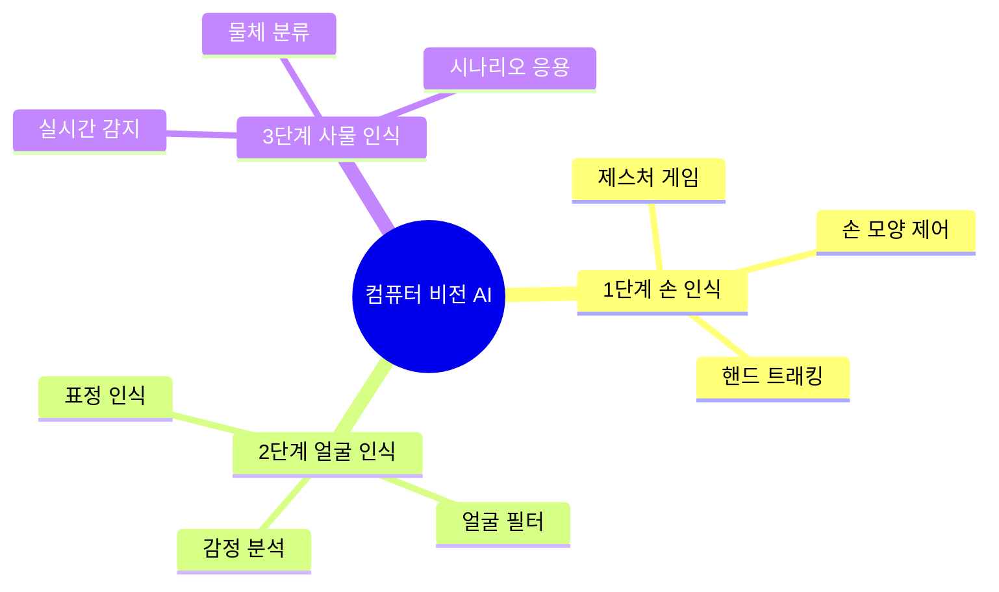
```mermaid
mindmap
  root((컴퓨터 비전 AI))
    1단계 손 인식
      제스처 게임
      손 모양 제어
      핸드 트래킹
    2단계 얼굴 인식
      표정 인식
      얼굴 필터
      감정 분석
    3단계 사물 인식
      물체 분류
      실시간 감지
      시나리오 응용
```

---

## 📊 컴퓨터 비전 3단계 학습 로드맵

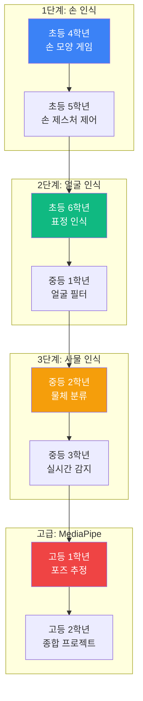
```mermaid
graph TB
    subgraph "1단계: 손 인식"
        H1[초등 4학년<br/>손 모양 게임]
        H2[초등 5학년<br/>손 제스처 제어]
    end
    
    subgraph "2단계: 얼굴 인식"
        F1[초등 6학년<br/>표정 인식]
        F2[중등 1학년<br/>얼굴 필터]
    end
    
    subgraph "3단계: 사물 인식"
        O1[중등 2학년<br/>물체 분류]
        O2[중등 3학년<br/>실시간 감지]
    end
    
    subgraph "고급: MediaPipe"
        M1[고등 1학년<br/>포즈 추정]
        M2[고등 2학년<br/>종합 프로젝트]
    end
    
    H1 --> H2 --> F1 --> F2 --> O1 --> O2 --> M1 --> M2
    
    style H1 fill:#3b82f6,color:#fff
    style F1 fill:#10b981,color:#fff
    style O1 fill:#f59e0b,color:#fff
    style M1 fill:#ef4444,color:#fff
```

---

## 🖐️ 1단계: 손 인식 (초등 4-5학년)

### 초등 4학년: 손 모양 게임 (8시간)

#### 학습 목표
- 손 모양을 AI가 인식하는 원리 이해
- Teachable Machine으로 손 데이터 학습
- 손 모양으로 조종하는 게임 2-3개 완성

---

#### 🎮 프로젝트 1: 가위바위보 마스터 (3시간)

**컴퓨터 비전 핵심**: 손 모양 3가지 분류

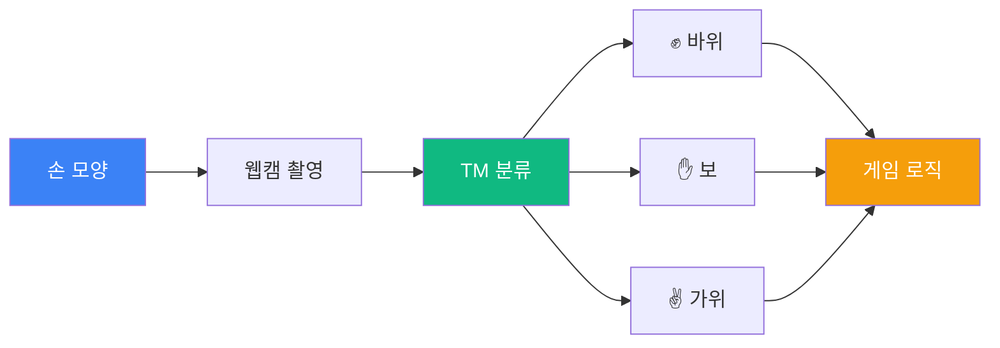
```mermaid
graph LR
    A[손 모양] --> B[웹캠 촬영]
    B --> C[TM 분류]
    C --> D1[✊ 바위]
    C --> D2[✋ 보]
    C --> D3[✌️ 가위]
    
    D1 --> E[게임 로직]
    D2 --> E
    D3 --> E
    
    style A fill:#3b82f6,color:#fff
    style C fill:#10b981,color:#fff
    style E fill:#f59e0b,color:#fff
```

**게임 제작 단계**:

1. **AI 학습 (30분)**
```
Teachable Machine:
- 클래스 1: ✊ 주먹 (바위) - 다양한 각도 30초
- 클래스 2: ✋ 손바닥 (보) - 다양한 각도 30초
- 클래스 3: ✌️ V자 (가위) - 다양한 각도 30초

💡 팁: 왼손/오른손, 가까이/멀리, 밝게/어둡게
```

2. **게임 구현 (1.5시간)**
```
🎮 게임 요소:
- 3, 2, 1 카운트다운
- 손 모양 인식 (실시간)
- 컴퓨터 랜덤 선택
- 승부 판정
- 점수 시스템 (승: +10, 무: 0, 패: -5)

🏆 게임 모드:
- 연습 모드: 천천히 연습
- 대전 모드: 10판 2선승
- 토너먼트: 친구들과 경쟁
```

3. **테스트 & 개선 (1시간)**
```
✅ 체크리스트:
- 인식 속도가 빠른가?
- 정확도가 90% 이상인가?
- 재미있는가?

💡 개선 아이디어:
- 필살기 추가 (3연승 시 2배 점수)
- 시간 제한 추가
- 효과음과 애니메이션
```

---

#### 🎮 프로젝트 2: 손 제어 레이싱 (2.5시간)

**컴퓨터 비전 핵심**: 손 위치와 방향 인식

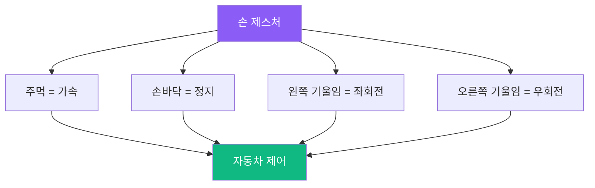
```mermaid
graph TB
    A[손 제스처]
    
    A --> B1[주먹 = 가속]
    A --> B2[손바닥 = 정지]
    A --> B3[왼쪽 기울임 = 좌회전]
    A --> B4[오른쪽 기울임 = 우회전]
    
    B1 --> C[자동차 제어]
    B2 --> C
    B3 --> C
    B4 --> C
    
    style A fill:#8b5cf6,color:#fff
    style C fill:#10b981,color:#fff
```

**게임 시스템**:
```
🏎️ 레이싱 게임:
- 손으로 자동차 조종
- 장애물 피하기
- 아이템 수집
- 랩타임 기록

📈 난이도:
- 레벨 1: 느린 속도, 장애물 적음
- 레벨 2: 중간 속도, 장애물 증가
- 레벨 3: 빠른 속도, 급커브
```

---

#### 🎮 프로젝트 3: 손가락 카운팅 게임 (2.5시간)

**컴퓨터 비전 핵심**: 손가락 개수 인식

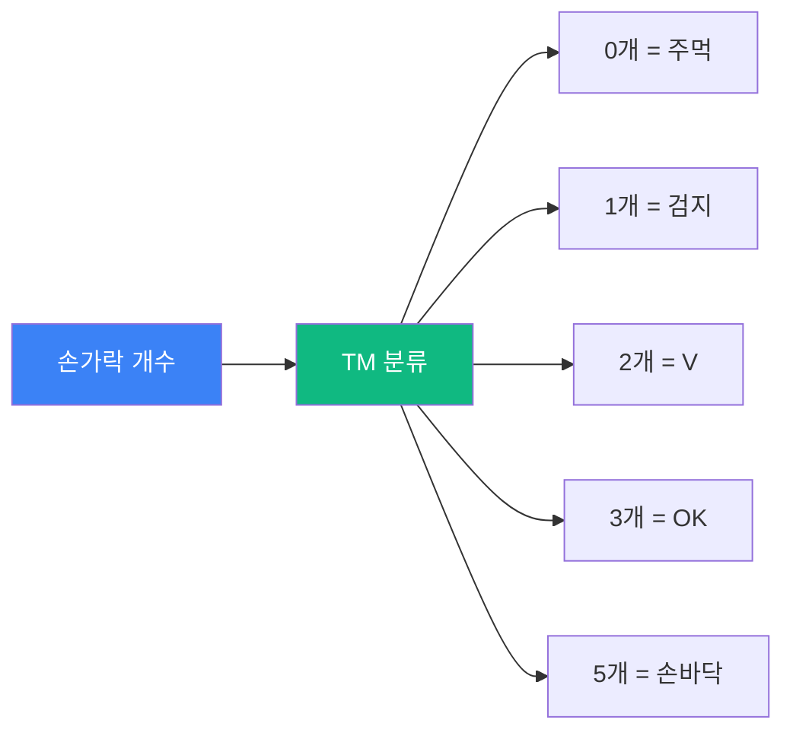
```mermaid
graph LR
    A[손가락 개수] --> B[TM 분류]
    B --> C1[0개 = 주먹]
    B --> C2[1개 = 검지]
    B --> C3[2개 = V]
    B --> C4[3개 = OK]
    B --> C5[5개 = 손바닥]
    
    style A fill:#3b82f6,color:#fff
    style B fill:#10b981,color:#fff
```

**게임 아이디어**:
```
🔢 숫자 맞추기 게임:
- 화면에 숫자 표시 (1-5)
- 손가락으로 해당 숫자 표현
- 빠르게 맞출수록 높은 점수

🧮 빠른 계산 게임:
- "3 + 2 = ?" 문제 출제
- 손가락 5개로 정답 표현
- 수학 학습 + AI 게임
```

---

### 초등 5학년: 손 제스처 고급 (8시간)

#### 🎮 프로젝트 1: 손 피아노 (3시간)

**컴퓨터 비전 핵심**: 손 위치별 인식

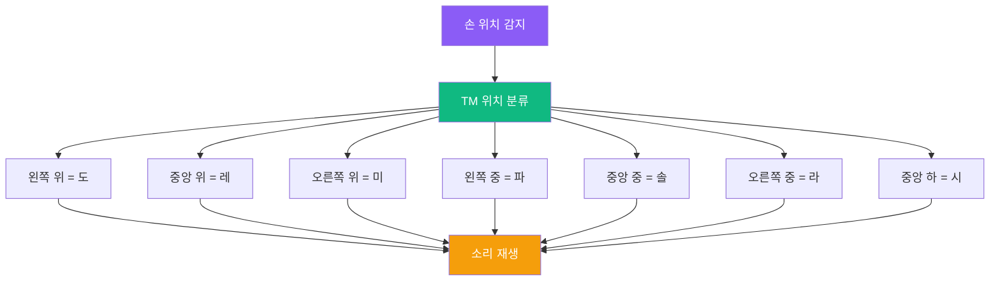
```mermaid
graph TB
    A[손 위치 감지]
    B[TM 위치 분류]
    
    A --> B
    B --> C1[왼쪽 위 = 도]
    B --> C2[중앙 위 = 레]
    B --> C3[오른쪽 위 = 미]
    B --> C4[왼쪽 중 = 파]
    B --> C5[중앙 중 = 솔]
    B --> C6[오른쪽 중 = 라]
    B --> C7[중앙 하 = 시]
    
    C1 --> D[소리 재생]
    C2 --> D
    C3 --> D
    C4 --> D
    C5 --> D
    C6 --> D
    C7 --> D
    
    style A fill:#8b5cf6,color:#fff
    style B fill:#10b981,color:#fff
    style D fill:#f59e0b,color:#fff
```

**기능**:
```
🎹 가상 피아노:
- 화면을 7개 영역으로 분할
- 손을 해당 영역에 가져가면 소리
- 간단한 곡 연주 가능

🎵 게임 모드:
- 자유 연주
- 따라 치기 (악보 표시)
- 속도 도전
```

---

#### 🎮 프로젝트 2: 공중 그림 그리기 (2.5시간)

**컴퓨터 비전 핵심**: 손 움직임 추적

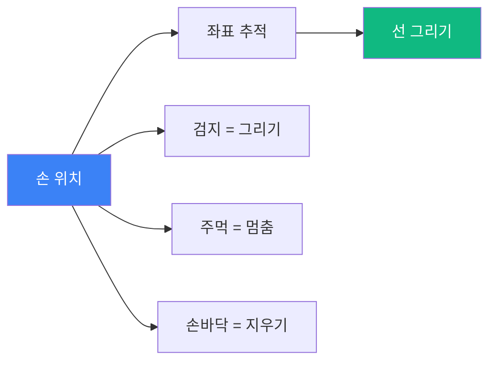
```mermaid
graph LR
    A[손 위치] --> B[좌표 추적]
    B --> C[선 그리기]
    
    A --> A1[검지 = 그리기]
    A --> A2[주먹 = 멈춤]
    A --> A3[손바닥 = 지우기]
    
    style A fill:#3b82f6,color:#fff
    style C fill:#10b981,color:#fff
```

**기능**:
```
✏️ 공중 드로잉:
- 검지 손가락으로 그림 그리기
- 색상 선택 (손 위치별)
- 저장 및 공유

🎨 게임 요소:
- 그림 퀴즈: 제시된 그림 따라 그리기
- 시간 제한 그리기 챌린지
- 친구와 릴레이 그림
```

---

#### 🎮 프로젝트 3: 손 싸움 게임 (2.5시간)

**컴퓨터 비전 핵심**: 2개 손 동시 인식

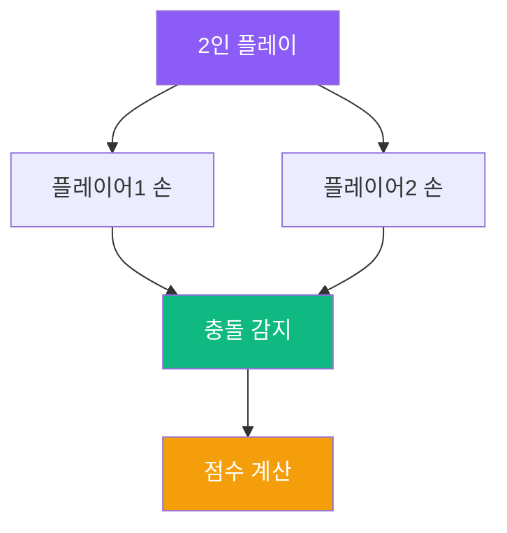
```mermaid
graph TB
    A[2인 플레이]
    
    A --> B1[플레이어1 손]
    A --> B2[플레이어2 손]
    
    B1 --> C[충돌 감지]
    B2 --> C
    
    C --> D[점수 계산]
    
    style A fill:#8b5cf6,color:#fff
    style C fill:#10b981,color:#fff
    style D fill:#f59e0b,color:#fff
```

---

## 😊 2단계: 얼굴 인식 (초등 6학년 - 중등 1학년)

### 초등 6학년: 표정 인식 게임 (8시간)

#### 🎮 프로젝트 1: 감정 연기자 (3시간)

**컴퓨터 비전 핵심**: 얼굴 표정 분류

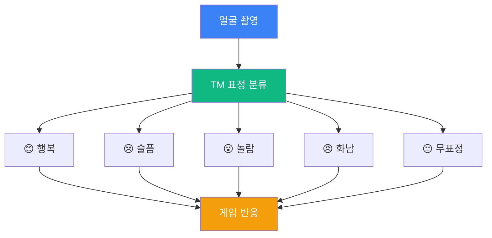
```mermaid
graph TB
    A[얼굴 촬영]
    B[TM 표정 분류]
    
    A --> B
    B --> C1[😊 행복]
    B --> C2[😢 슬픔]
    B --> C3[😮 놀람]
    B --> C4[😠 화남]
    B --> C5[😐 무표정]
    
    C1 --> D[게임 반응]
    C2 --> D
    C3 --> D
    C4 --> D
    C5 --> D
    
    style A fill:#3b82f6,color:#fff
    style B fill:#10b981,color:#fff
    style D fill:#f59e0b,color:#fff
```

**AI 학습**:
```
Teachable Machine:
- Happy: 활짝 웃기 (입 크게, 눈 찡긋)
- Sad: 슬픈 표정 (입 꾹, 눈썹 내리기)
- Surprised: 놀란 표정 (입 벌리기, 눈 크게)
- Angry: 화난 표정 (눈썹 찌푸리기)
- Neutral: 무표정

💡 각 표정 60초씩 촬영, 다양한 각도
```

**게임 모드**:
```
🎭 모드 1: 감정 퀴즈
- 화면에 감정 표시
- 5초 안에 해당 표정 짓기
- 정답: +10점, 콤보 보너스

🎭 모드 2: 감정 스토리
- 상황 제시
- 적절한 감정 표현
- 연기력 평가

🎭 모드 3: 감정 금지
- 특정 감정 금지
- 3초 이상 유지하면 실패
- 감정 컨트롤 훈련
```

---

#### 🎮 프로젝트 2: 표정으로 캐릭터 조종 (2.5시간)

**컴퓨터 비전 핵심**: 표정 → 게임 제어 매핑

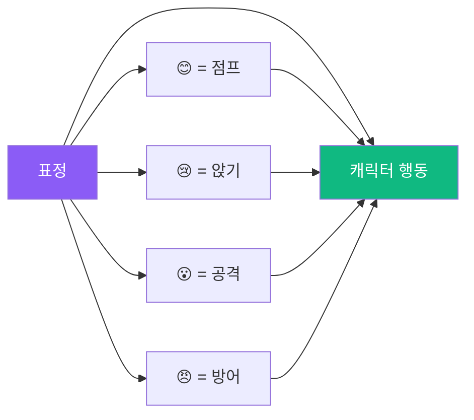
```mermaid
graph LR
    A[표정] --> B[캐릭터 행동]
    
    A --> A1[😊 = 점프]
    A --> A2[😢 = 앉기]
    A --> A3[😮 = 공격]
    A --> A4[😠 = 방어]
    
    A1 --> B
    A2 --> B
    A3 --> B
    A4 --> B
    
    style A fill:#8b5cf6,color:#fff
    style B fill:#10b981,color:#fff
```

**게임 시나리오**:
```
🎮 표정 모험 게임:
- 캐릭터가 자동으로 전진
- 표정으로 행동 제어
- 장애물 피하고 몬스터 처치

레벨 1: 1가지 표정 (웃으면 점프)
레벨 2: 2가지 표정 조합
레벨 3: 빠른 표정 전환 필요
```

---

#### 🎮 프로젝트 3: 표정 미러 게임 (2.5시간)

**컴퓨터 비전 핵심**: 표정 유사도 비교

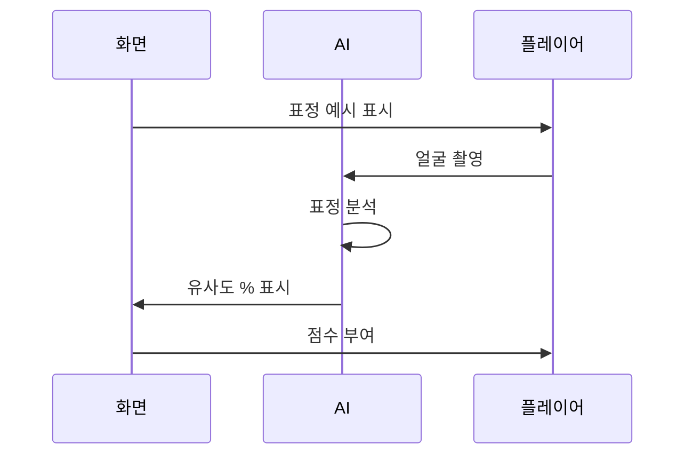
```mermaid
sequenceDiagram
    participant 화면
    participant AI
    participant 플레이어
    
    화면->>플레이어: 표정 예시 표시
    플레이어->>AI: 얼굴 촬영
    AI->>AI: 표정 분석
    AI->>화면: 유사도 % 표시
    화면->>플레이어: 점수 부여
```

---

### 중등 1학년: 얼굴 필터 & 인식 (8시간)

#### 🎮 프로젝트 1: AR 얼굴 필터 (3시간)

**컴퓨터 비전 핵심**: 얼굴 랜드마크 감지

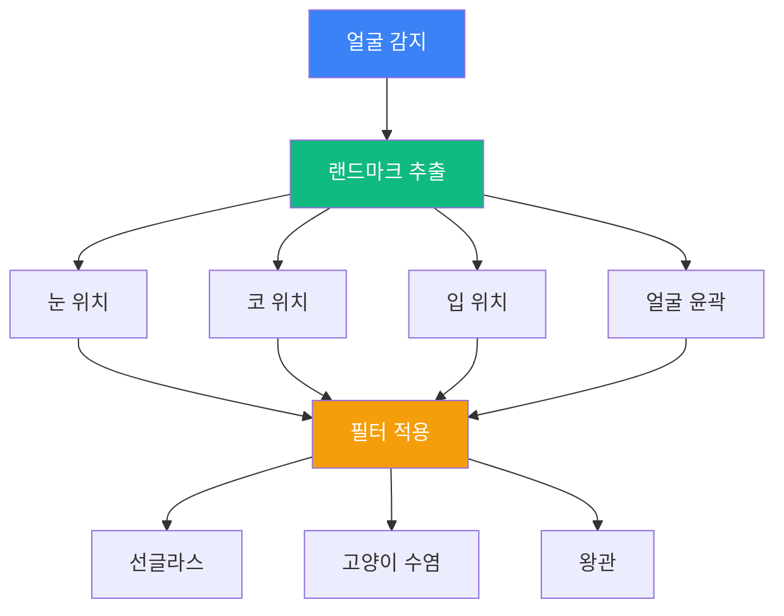
```mermaid
graph TB
    A[얼굴 감지]
    B[랜드마크 추출]
    C[필터 적용]
    
    A --> B
    B --> B1[눈 위치]
    B --> B2[코 위치]
    B --> B3[입 위치]
    B --> B4[얼굴 윤곽]
    
    B1 --> C
    B2 --> C
    B3 --> C
    B4 --> C
    
    C --> D1[선글라스]
    C --> D2[고양이 수염]
    C --> D3[왕관]
    
    style A fill:#3b82f6,color:#fff
    style B fill:#10b981,color:#fff
    style C fill:#f59e0b,color:#fff
```

**필터 종류**:
```
😎 필터 1: 선글라스
- 눈 위치에 선글라스 오버레이
- 얼굴 각도 따라 회전

🐱 필터 2: 고양이
- 귀, 수염, 코 추가
- 입 열면 혀 나옴

👑 필터 3: 왕관
- 머리 위에 왕관
- 반짝이는 효과
```

---

#### 🎮 프로젝트 2: 얼굴 인식 출입 시스템 (2.5시간)

**컴퓨터 비전 핵심**: 얼굴 비교 및 인증

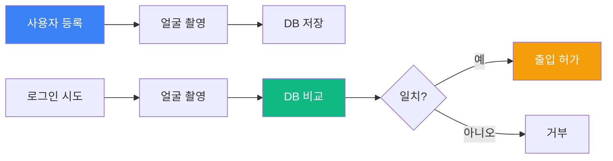
```mermaid
graph LR
    A[사용자 등록] --> B[얼굴 촬영]
    B --> C[DB 저장]
    
    D[로그인 시도] --> E[얼굴 촬영]
    E --> F[DB 비교]
    F --> G{일치?}
    G -->|예| H[출입 허가]
    G -->|아니오| I[거부]
    
    style A fill:#3b82f6,color:#fff
    style F fill:#10b981,color:#fff
    style H fill:#f59e0b,color:#fff
```

**기능**:
```
🔐 보안 시스템:
- 등록: 3장의 사진 촬영
- 인증: 실시간 얼굴 비교
- 로그: 출입 기록 저장

🎮 게임 요소:
- 나만의 비밀 기지
- 친구 초대 시스템
- 침입자 감지 알림
```

---

#### 🎮 프로젝트 3: 표정으로 이모티콘 만들기 (2.5시간)

**컴퓨터 비전 핵심**: 표정 → 이모티콘 생성

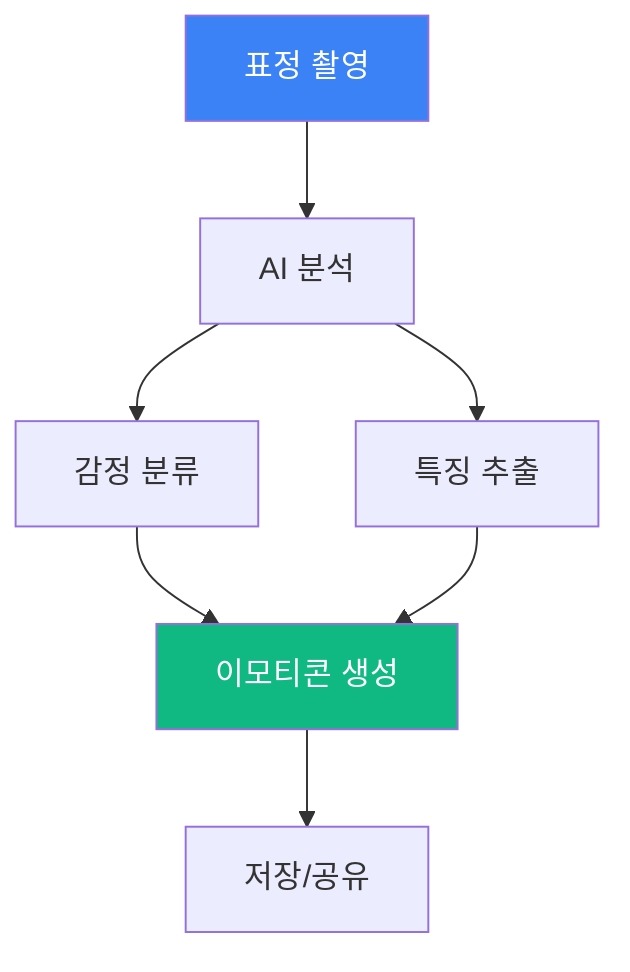
```mermaid
graph TB
    A[표정 촬영]
    B[AI 분석]
    C[이모티콘 생성]
    D[저장/공유]
    
    A --> B
    B --> B1[감정 분류]
    B --> B2[특징 추출]
    
    B1 --> C
    B2 --> C
    
    C --> D
    
    style A fill:#3b82f6,color:#fff
    style C fill:#10b981,color:#fff
```

---

## 📦 3단계: 사물 인식 (중등 2-3학년)

### 중등 2학년: 물체 분류 게임 (8시간)

#### 🎮 프로젝트 1: AI 마트 계산원 (3시간)

**컴퓨터 비전 핵심**: 다중 물체 분류

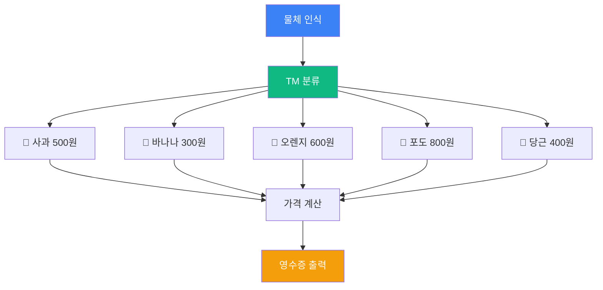
```mermaid
graph TB
    A[물체 인식]
    
    A --> B[TM 분류]
    B --> C1[🍎 사과 500원]
    B --> C2[🍌 바나나 300원]
    B --> C3[🍊 오렌지 600원]
    B --> C4[🍇 포도 800원]
    B --> C5[🥕 당근 400원]
    
    C1 --> D[가격 계산]
    C2 --> D
    C3 --> D
    C4 --> D
    C5 --> D
    
    D --> E[영수증 출력]
    
    style A fill:#3b82f6,color:#fff
    style B fill:#10b981,color:#fff
    style E fill:#f59e0b,color:#fff
```

**AI 데이터셋**:
```
Teachable Machine:
- 클래스 1-10: 다양한 과일/채소
- 각 물체당 50-100장 촬영
- 다양한 각도, 조명, 배경

💡 촬영 팁:
- 가까이/멀리
- 밝은 곳/어두운 곳
- 손에 들고/테이블 위
```

**게임 시스템**:
```
🛒 계산원 시뮬레이터:

레벨 1: 천천히 1개씩
- 물건 보여주기
- AI 인식 대기 (3초)
- 가격 확인
- 정확도 평가

레벨 2: 빠르게 3개
- 제한시간 30초
- 3개 연속 인식
- 총액 계산
- 등급 부여 (S, A, B, C)

레벨 3: 세일 계산
- 20% 할인
- 2+1 이벤트
- 쿠폰 적용
- 복잡한 계산
```

---

#### 🎮 프로젝트 2: 분리수거 교육 게임 (2.5시간)

**컴퓨터 비전 핵심**: 물체 → 카테고리 분류

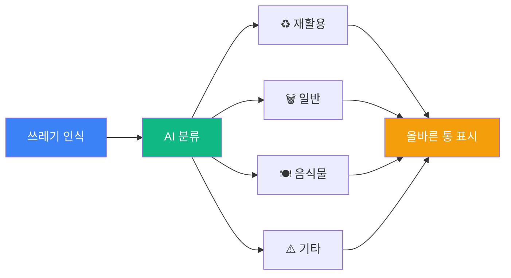
```mermaid
graph LR
    A[쓰레기 인식] --> B[AI 분류]
    
    B --> C1[♻️ 재활용]
    B --> C2[🗑️ 일반]
    B --> C3[🍽️ 음식물]
    B --> C4[⚠️ 기타]
    
    C1 --> D[올바른 통 표시]
    C2 --> D
    C3 --> D
    C4 --> D
    
    style A fill:#3b82f6,color:#fff
    style B fill:#10b981,color:#fff
    style D fill:#f59e0b,color:#fff
```

**교육 목표**:
```
♻️ 환경 교육:
- 올바른 분리수거 방법 학습
- AI로 쓰레기 자동 분류
- 게임으로 재미있게 배우기

🎮 게임 모드:
- 학습 모드: 천천히 배우기
- 도전 모드: 30초 안에 10개
- 실전 모드: 복잡한 쓰레기
```

---

#### 🎮 프로젝트 3: 물체 도감 수집 (2.5시간)

**컴퓨터 비전 핵심**: 물체 인식 + 데이터 수집

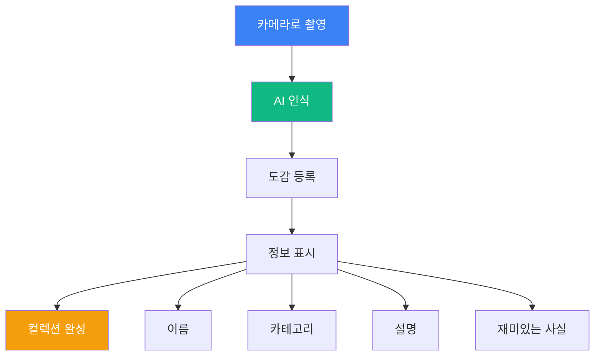
```mermaid
graph TB
    A[카메라로 촬영]
    B[AI 인식]
    C[도감 등록]
    D[정보 표시]
    E[컬렉션 완성]
    
    A --> B
    B --> C
    C --> D
    D --> E
    
    D --> D1[이름]
    D --> D2[카테고리]
    D --> D3[설명]
    D --> D4[재미있는 사실]
    
    style A fill:#3b82f6,color:#fff
    style B fill:#10b981,color:#fff
    style E fill:#f59e0b,color:#fff
```

**포켓몬 도감 스타일**:
```
📖 나의 물체 도감:

카테고리:
- 과일 (10종)
- 채소 (10종)
- 문구 (10종)
- 전자기기 (10종)
- 총 40종 수집

게임 요소:
- 도감 완성도 %
- 일일 도전: 3개 찾기
- 레어 물체 (찾기 어려운 것)
- 친구와 도감 교환
```

---

### 중등 3학년: 실시간 물체 감지 (8시간)

#### 🎮 프로젝트 1: 실시간 다중 물체 감지 (3시간)

**컴퓨터 비전 핵심**: 화면 속 여러 물체 동시 인식

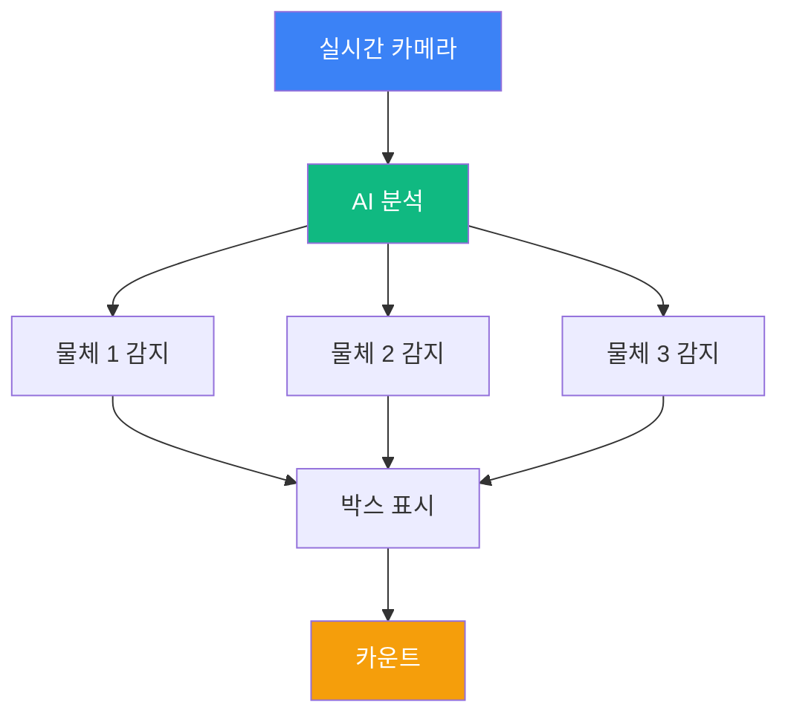
```mermaid
graph TB
    A[실시간 카메라]
    B[AI 분석]
    
    A --> B
    B --> C1[물체 1 감지]
    B --> C2[물체 2 감지]
    B --> C3[물체 3 감지]
    
    C1 --> D[박스 표시]
    C2 --> D
    C3 --> D
    
    D --> E[카운트]
    
    style A fill:#3b82f6,color:#fff
    style B fill:#10b981,color:#fff
    style E fill:#f59e0b,color:#fff
```

**게임 응용**:
```
🔍 물체 찾기 게임:
- "5초 안에 빨간 물체 3개 보여주세요"
- 실시간으로 개수 카운트
- 시간 내 완료 시 점수

🎯 스피드 퀴즈:
- "과일 2개, 문구 1개"
- 빠르게 찾아서 보여주기
- 랭킹 시스템
```

---

#### 🎮 프로젝트 2: 동작 인식 챌린지 (2.5시간)

**컴퓨터 비전 핵심**: 물체 움직임 감지

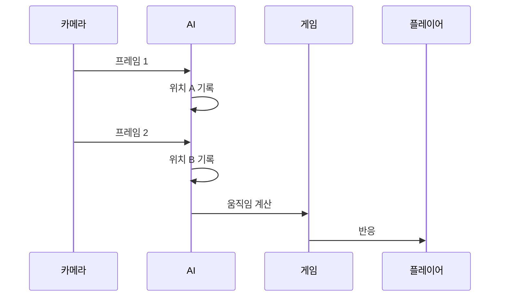
```mermaid
sequenceDiagram
    participant 카메라
    participant AI
    participant 게임
    
    카메라->>AI: 프레임 1
    AI->>AI: 위치 A 기록
    카메라->>AI: 프레임 2
    AI->>AI: 위치 B 기록
    AI->>게임: 움직임 계산
    게임->>플레이어: 반응
```

**게임 예시**:
```
🎮 피하기 게임:
- 카메라 앞에 물체 들기
- 화면에서 장애물 피하기
- 물체 움직임 = 게임 조작

🎯 타이밍 게임:
- 적절한 타이밍에 물체 보여주기
- 리듬 게임 스타일
- 콤보 시스템
```

---

#### 🎮 프로젝트 3: AI 보안 시스템 (2.5시간)

**컴퓨터 비전 핵심**: 이상 감지 시스템

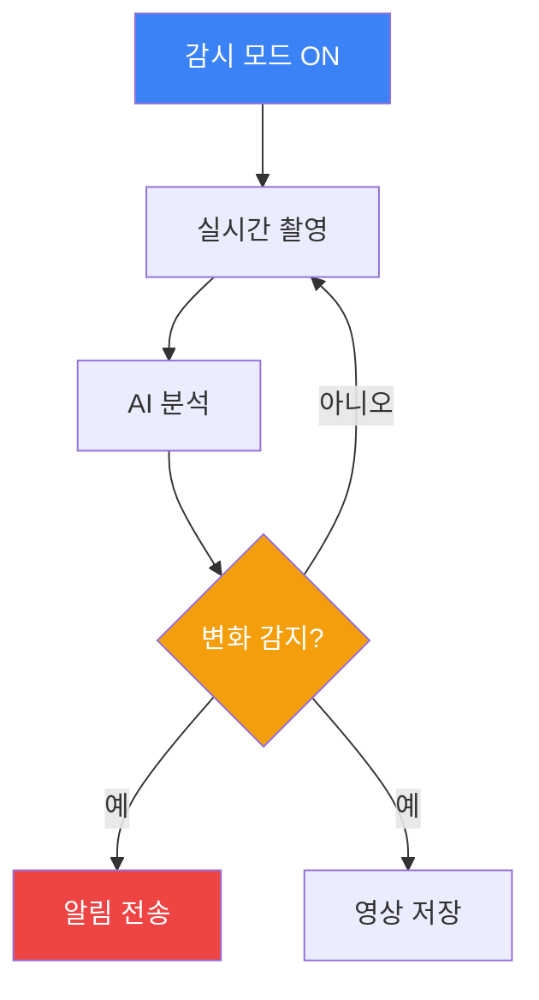
```mermaid
graph TB
    A[감시 모드 ON]
    B[실시간 촬영]
    C[AI 분석]
    D{변화 감지?}
    E[알림 전송]
    F[영상 저장]
    
    A --> B
    B --> C
    C --> D
    D -->|예| E
    D -->|예| F
    D -->|아니오| B
    
    style A fill:#3b82f6,color:#fff
    style D fill:#f59e0b,color:#fff
    style E fill:#ef4444,color:#fff
```

---

## 🚀 고급 과정: MediaPipe + Colab (고등 1-2학년)

### 고등 1학년: MediaPipe 기초 (12시간)

#### 📚 MediaPipe란?

```mermaid
graph LR
    A[Google MediaPipe] --> B[손 인식]
    A --> C[얼굴 인식]
    A --> D[포즈 추정]
    A --> E[물체 감지]
    
    B --> F[21개 손 랜드마크]
    C --> G[468개 얼굴 랜드마크]
    D --> H[33개 신체 랜드마크]
    
    style A fill:#10b981,color:#fff
    style F fill:#3b82f6,color:#fff
    style G fill:#f59e0b,color:#fff
    style H fill:#ef4444,color:#fff
```

---

#### 🎮 프로젝트 1: 손 랜드마크 추적 게임 (4시간)

**기술**: MediaPipe Hands (21개 랜드마크)

```python
# Google Colab 코드 예시
import mediapipe as mp
import cv2

# MediaPipe 초기화
mp_hands = mp.solutions.hands
hands = mp_hands.Hands()

# 웹캠에서 손 감지
cap = cv2.VideoCapture(0)
while cap.isOpened():
    ret, frame = cap.read()
    
    # BGR → RGB 변환
    rgb = cv2.cvtColor(frame, cv2.COLOR_BGR2RGB)
    
    # 손 감지
    results = hands.process(rgb)
    
    if results.multi_hand_landmarks:
        for hand_landmarks in results.multi_hand_landmarks:
            # 21개 랜드마크 좌표 추출
            # 게임 로직 적용
            pass
```

**게임 아이디어**:
```
✋ 손가락 피아노:
- 각 손가락 끝 = 건반
- 정확한 위치 감지
- 실제 피아노처럼 연주

🎯 손가락 사격:
- 검지 손가락 = 조준점
- 엄지+검지 = 발사
- 표적 맞추기 게임

✊ 가상 조이스틱:
- 손 위치 = 방향
- 손 모양 = 버튼
- 3D 게임 조종
```

---

#### 🎮 프로젝트 2: 전신 포즈 추정 게임 (4시간)

**기술**: MediaPipe Pose (33개 랜드마크)

```mermaid
graph TB
    A[전신 인식]
    
    A --> B[상체 포즈]
    A --> C[하체 포즈]
    A --> D[전신 균형]
    
    B --> E[팔 각도]
    B --> F[어깨 위치]
    
    C --> G[다리 각도]
    C --> H[무릎 높이]
    
    D --> I[중심 이동]
    
    style A fill:#3b82f6,color:#fff
    style E fill:#10b981,color:#fff
    style I fill:#f59e0b,color:#fff
```

**게임 프로젝트**:
```
🧘 요가 자세 평가:
- 정확한 포즈 비교
- 각도 측정 (팔, 다리)
- 균형 점수
- 개선 피드백

🏃 운동 카운터:
- 스쿼트 자동 카운트
- 팔굽혀펴기 카운트
- 자세 정확도 평가
- 운동 기록 저장

🕺 춤 평가 시스템:
- 춤 동작 분석
- 리듬 정확도
- 완성도 점수
- 리플레이 기능
```

---

#### 🎮 프로젝트 3: 얼굴 메시 AR (4시간)

**기술**: MediaPipe Face Mesh (468개 랜드마크)

```python
# 얼굴 메시 감지
mp_face_mesh = mp.solutions.face_mesh
face_mesh = mp_face_mesh.FaceMesh()

# 468개 랜드마크로 정밀한 얼굴 추적
results = face_mesh.process(rgb)

if results.multi_face_landmarks:
    for face_landmarks in results.multi_face_landmarks:
        # 눈, 코, 입, 윤곽선 정확히 추적
        # AR 효과 적용
        pass
```

**AR 프로젝트**:
```
😎 고급 AR 필터:
- 정확한 얼굴 추적
- 3D 모델 오버레이
- 표정 따라 변형
- 실시간 렌더링

📸 뷰티 필터:
- 얼굴 형태 분석
- 피부 보정
- 화장 효과
- 저장 및 공유

🎭 얼굴 변환:
- 나이 변화
- 성별 변환
- 동물 얼굴
- AI 합성
```

---

### 고등 2학년: 종합 프로젝트 (12시간)

#### 🎮 프로젝트 1: 번호판 인식 시스템 (4시간)

**기술**: OCR + 물체 감지

```mermaid
graph TB
    A[자동차 감지]
    B[번호판 영역 추출]
    C[문자 인식 OCR]
    D[번호 저장]
    E[데이터베이스]
    
    A --> B
    B --> C
    C --> D
    D --> E
    
    E --> F[주차 관리]
    E --> G[출입 관리]
    E --> H[통계 분석]
    
    style A fill:#3b82f6,color:#fff
    style C fill:#10b981,color:#fff
    style E fill:#f59e0b,color:#fff
```

**구현 단계**:
```python
# Google Colab 코드 구조

# 1단계: 자동차 감지
import cv2
import mediapipe as mp

# 2단계: 번호판 영역 찾기
# (YOLO 또는 Haar Cascade)

# 3단계: OCR 적용
import pytesseract

# 4단계: 데이터 저장
import sqlite3

# 5단계: 웹 대시보드
# (Flask 또는 Streamlit)
```

**응용 프로젝트**:
```
🅿️ 스마트 주차 시스템:
- 입차: 번호판 자동 인식
- 주차 시간 기록
- 주차 요금 자동 계산
- 출차: 자동 결제

🚗 학교 출입 관리:
- 등록 차량 확인
- 미등록 차량 알림
- 출입 기록 로그
- 통계 및 리포트
```

---

#### 🎮 프로젝트 2: 실시간 객체 추적 시스템 (4시간)

**기술**: Object Tracking + Kalman Filter

```mermaid
sequenceDiagram
    participant 카메라
    participant 감지기
    participant 추적기
    participant 예측기
    
    카메라->>감지기: 프레임 1
    감지기->>추적기: 물체 A 발견
    추적기->>예측기: 위치 기록
    
    카메라->>감지기: 프레임 2
    감지기->>추적기: 물체 A 이동
    추적기->>예측기: 궤적 예측
    
    예측기->>시스템: 다음 위치 예측
```

**프로젝트 예시**:
```
🎾 공 추적 게임:
- 공을 던지면 AI가 추적
- 궤적 예측
- 착지 지점 계산
- 점수 계산

⚽ 축구 경기 분석:
- 선수 추적
- 공 추적
- 패스 경로 분석
- 통계 생성

🚶 사람 동선 분석:
- 여러 사람 동시 추적
- 이동 경로 기록
- 혼잡도 분석
- 히트맵 생성
```

---

#### 🎮 프로젝트 3: AI 종합 프로젝트 (4시간)

**학생이 선택하는 주제**:

**카테고리 1: 생활 편의**
```
🏪 무인 편의점 시스템:
- 물체 인식: 상품 자동 인식
- 얼굴 인식: 고객 확인
- 손 인식: 제스처 결제
- 종합 시스템 구축

🏠 스마트 홈 시스템:
- 얼굴 인식: 가족 구별
- 제스처: 가전 제어
- 포즈: 건강 모니터링
- IoT 연동
```

**카테고리 2: 교육**
```
📚 AI 학습 도우미:
- 표정 분석: 이해도 파악
- 포즈 분석: 집중도 측정
- 물체 인식: 교구 자동 인식
- 맞춤 학습 제공

🎨 예술 창작 도구:
- 손 인식: 공중 그림
- 포즈 인식: 춤 안무
- 물체 인식: 재료 분류
- 창의성 발휘
```

**카테고리 3: 안전**
```
🚨 지능형 보안 시스템:
- 얼굴 인식: 출입 통제
- 포즈 분석: 이상 행동 감지
- 물체 감지: 위험 물체 탐지
- 알림 시스템

⚠️ 안전 모니터링:
- 낙상 감지
- 위험 상황 알림
- 긴급 호출
- 데이터 기록
```

---

## 📊 평가 시스템

### 컴퓨터 비전 프로젝트 평가

```mermaid
graph TB
    subgraph "AI 모델 40%"
        A1[데이터 수집<br/>10%]
        A2[학습 품질<br/>15%]
        A3[정확도<br/>15%]
    end
    
    subgraph "게임 구현 35%"
        G1[창의성<br/>15%]
        G2[완성도<br/>10%]
        G3[사용성<br/>10%]
    end
    
    subgraph "기술 이해 25%"
        T1[원리 설명<br/>10%]
        T2[문제 해결<br/>10%]
        T3[개선 능력<br/>5%]
    end
    
    A1 --> F[최종 점수]
    A2 --> F
    A3 --> F
    G1 --> F
    G2 --> F
    G3 --> F
    T1 --> F
    T2 --> F
    T3 --> F
    
    style A2 fill:#10b981,color:#fff
    style G1 fill:#3b82f6,color:#fff
    style T1 fill:#f59e0b,color:#fff
```

---

## 🛠️ 필요 도구 및 환경

### 학년별 도구

| 학년 | 플랫폼 | AI 도구 | 코딩 환경 | 비용 |
|------|--------|---------|----------|------|
| **초4-6** | DWAI | Teachable Machine | 브라우저 | 무료 |
| **중1-2** | App Inventor | Teachable Machine | 브라우저 | 무료 |
| **중3** | DWAI/Scratch | Teachable Machine | 브라우저 | 무료 |
| **고1-2** | Google Colab | MediaPipe | Python | 무료 |

### Google Colab 시작하기

```python
# 1. Google Colab 접속
# colab.research.google.com

# 2. 필수 라이브러리 설치
!pip install mediapipe opencv-python

# 3. 기본 템플릿
import mediapipe as mp
import cv2
import numpy as np

# 4. 웹캠 연동
from google.colab.patches import cv2_imshow
```

---

## 📚 학습 로드맵 요약

```mermaid
gantt
    title 컴퓨터 비전 AI 학습 여정
    dateFormat  YYYY-MM-DD
    
    section 초등 4-5학년
    손 인식 (6개)     :a1, 2024-01-01, 16d
    
    section 초등 6 - 중1
    얼굴 인식 (6개)    :a2, after a1, 16d
    
    section 중등 2-3학년
    사물 인식 (6개)    :a3, after a2, 16d
    
    section 고등 1-2학년
    MediaPipe (6개)   :a4, after a3, 24d
```

---

## 🎉 학생 포트폴리오 예시

### 초등 6학년 김○○
```
📁 프로젝트 목록:
1. AI 가위바위보 (초4)
2. 손 피아노 (초5)
3. 표정 게임 (초6)

🏆 성과:
- 학교 과학 대회 금상
- 친구들 20명이 플레이
- YouTube 조회수 1000회
```

### 중등 3학년 이○○
```
📁 프로젝트 목록:
1. AI 마트 계산원 (중2)
2. 분리수거 교육 게임 (중2)
3. 실시간 물체 감지 (중3)

🏆 성과:
- 지역 환경 축제 전시
- 초등학교 교육 자료 채택
- 환경부 장관상
```

### 고등 2학년 박○○
```
📁 프로젝트 목록:
1. 손 추적 시스템 (고1)
2. 번호판 인식 시스템 (고2)
3. 스마트 주차 관리 (고2)

🏆 성과:
- 학교 주차장에 실제 적용
- 특허 출원
- 대학 입시 포트폴리오
```

---

## 📞 문의

**홈페이지**: https://aimakerlab.com  
**이메일**: vision@aimakerlab.com

---

**최종 업데이트**: 2025-12-29  
**작성자**: AI Maker Lab 컴퓨터 비전팀  
**문서 버전**: 3.0 (컴퓨터 비전 3단계 + MediaPipe)
