# AI Agent 프로젝트 심화반 (끝판왕 과정)

## 🎯 과정 개요

**대상**: 고등 3학년 ~ 대학생 (바이브 코딩 이수자)  
**총 시수**: 40시간 (프로젝트당 10-15시간)  
**목표**: ChatGPT API로 **자율적으로 동작하는 AI Agent** 시스템 구축

### 교육 철학: AI Agent 개발이란?

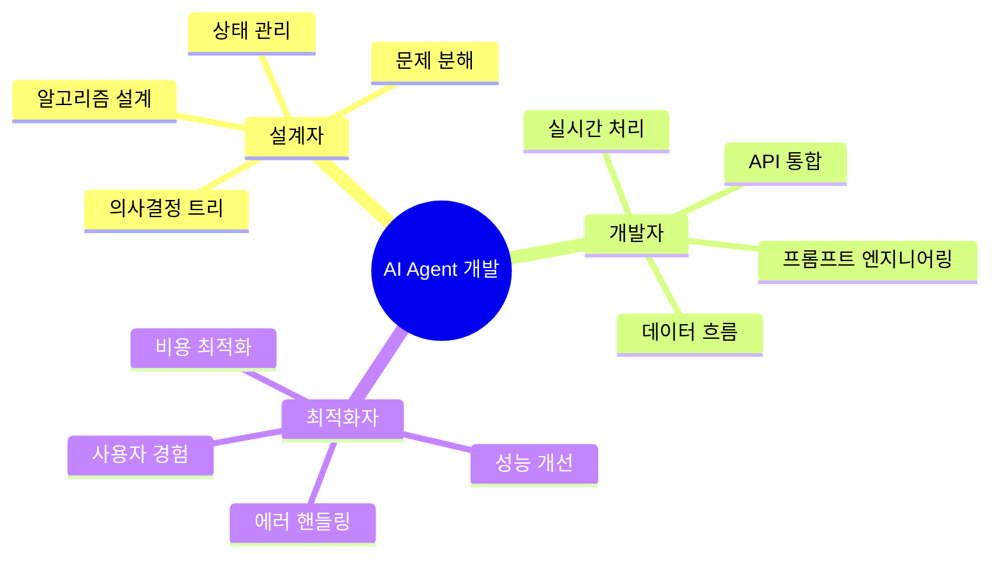

### 핵심 원칙

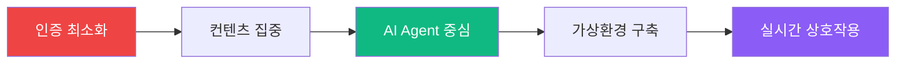

---

## 📚 3대 AI Agent 프로젝트

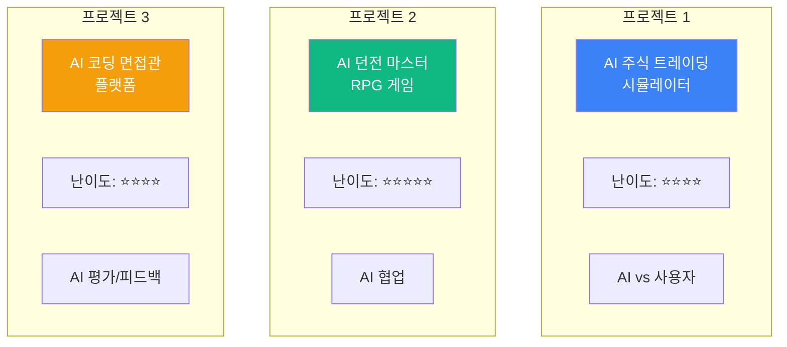

---

## 💹 프로젝트 1: AI 주식 트레이딩 시뮬레이터

### 프로젝트 개요

**컨셉**: 가상 주식 시장에서 **AI 트레이더와 경쟁**하며 투자 전략 학습

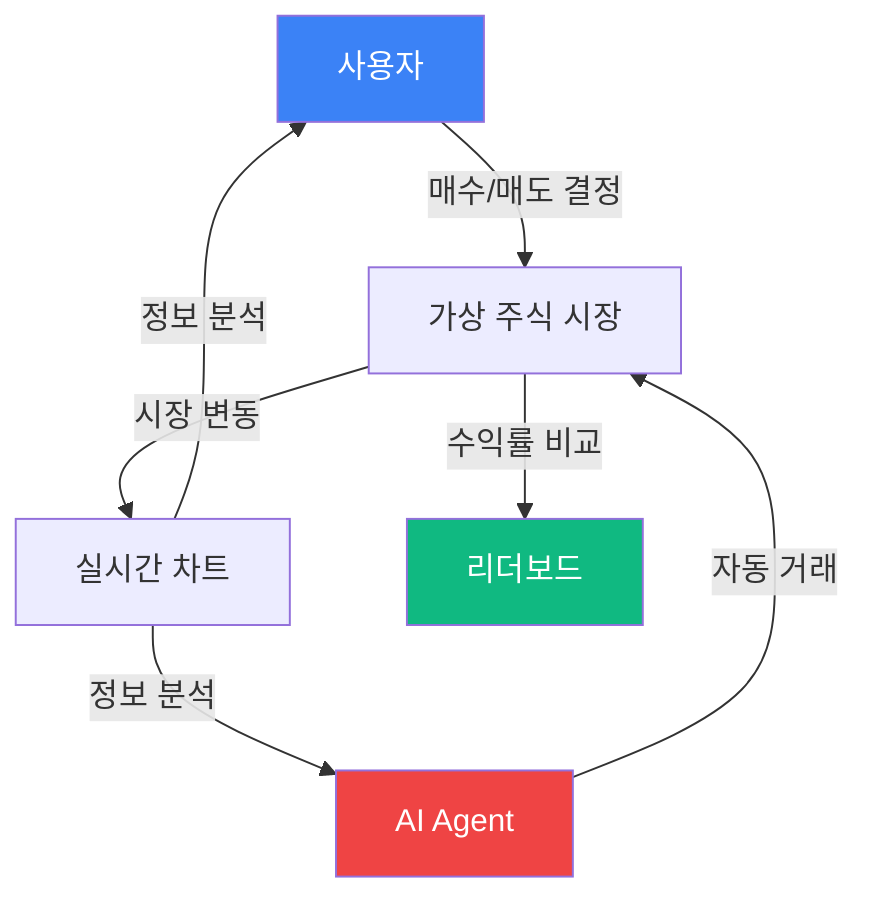

### 핵심 기능 (MVP)

| 기능 | 설명 | AI 역할 |
|------|------|---------|
| **가상 시장** | 실시간 주가 변동 시뮬레이션 | 뉴스 이벤트 생성 |
| **AI 트레이더** | 3종류의 AI 전략 (보수/중립/공격) | 자동 매매 실행 |
| **포트폴리오** | 보유 주식 및 수익률 추적 | 포트폴리오 분석 |
| **대결 모드** | AI vs 사용자 수익률 경쟁 | 실시간 의사결정 |

### 시스템 아키텍처

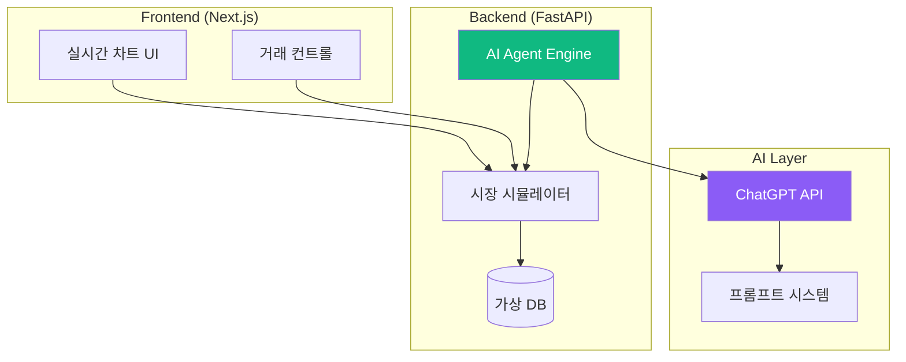

### 핵심 알고리즘 1: 시장 시뮬레이터

```python
"""
주식 시장 시뮬레이션 알고리즘
- 랜덤 워크 + 이벤트 기반 변동
- 현실적인 주가 움직임 재현
"""

class StockMarket:
    """
    가상 주식 시장 엔진
    """
    
    def __init__(self):
        self.stocks = {
            "TECH-A": {"price": 100, "volatility": 0.02},
            "FINANCE-B": {"price": 50, "volatility": 0.015},
            "ENERGY-C": {"price": 80, "volatility": 0.025},
        }
        self.events = []
        self.time_step = 0
    
    def update_market(self):
        """
        시장 업데이트 (1분마다 실행)
        
        알고리즘:
        1. 랜덤 워크 적용 (일반 변동)
        2. 이벤트 체크 (뉴스 영향)
        3. 가격 갱신
        """
        self.time_step += 1
        
        # 1. 랜덤 워크 (Geometric Brownian Motion 단순화)
        for symbol, data in self.stocks.items():
            volatility = data["volatility"]
            drift = 0.0001  # 상승 편향 (약간)
            
            # 정규 분포 랜덤 변동
            random_change = random.gauss(drift, volatility)
            data["price"] *= (1 + random_change)
            
            # 최소 가격 제한
            data["price"] = max(1, data["price"])
        
        # 2. 이벤트 체크 (10% 확률)
        if random.random() < 0.1:
            self.trigger_event()
        
        return self.get_market_data()
    
    def trigger_event(self):
        """
        시장 이벤트 발생 (AI 생성)
        
        알고리즘:
        1. GPT에게 뉴스 이벤트 생성 요청
        2. 영향받는 종목 및 변동률 결정
        3. 시장에 적용
        """
        # AI에게 뉴스 생성 요청
        event = self.generate_news_event()
        
        # 예: {"type": "긍정", "target": "TECH-A", "impact": 0.05}
        if event["type"] == "긍정":
            self.stocks[event["target"]]["price"] *= (1 + event["impact"])
        else:
            self.stocks[event["target"]]["price"] *= (1 - event["impact"])
        
        self.events.append(event)
    
    def generate_news_event(self):
        """
        ChatGPT로 뉴스 이벤트 생성
        """
        # 프롬프트 설계 (핵심!)
        pass
```

### 핵심 알고리즘 2: AI 트레이더 Agent

```python
"""
AI 트레이더 의사결정 알고리즘
- ChatGPT API를 활용한 매매 결정
- 3가지 성격 (보수/중립/공격)
"""

class AITrader:
    """
    자율 거래 AI Agent
    """
    
    def __init__(self, personality: str, initial_cash: float):
        self.personality = personality  # "conservative" | "balanced" | "aggressive"
        self.cash = initial_cash
        self.portfolio = {}
        self.transaction_history = []
        self.decision_memory = []  # 과거 결정 기억
    
    async def make_decision(self, market_data: dict, news: list):
        """
        매매 의사결정 (핵심 알고리즘)
        
        프로세스:
        1. 시장 데이터 분석
        2. ChatGPT에게 의견 요청
        3. 성격에 맞게 필터링
        4. 실행 결정
        """
        
        # 1. 컨텍스트 구성
        context = self.build_context(market_data, news)
        
        # 2. ChatGPT API 호출
        gpt_response = await self.ask_gpt(context)
        
        # 3. 응답 파싱
        decision = self.parse_decision(gpt_response)
        
        # 4. 성격별 조정
        adjusted_decision = self.adjust_by_personality(decision)
        
        # 5. 실행
        self.execute_trade(adjusted_decision)
        
        # 6. 기억 저장
        self.decision_memory.append({
            "time": market_data["time"],
            "decision": adjusted_decision,
            "reasoning": gpt_response,
        })
        
        return adjusted_decision
    
    def build_context(self, market_data: dict, news: list) -> str:
        """
        ChatGPT에게 전달할 컨텍스트 구성
        
        핵심: 프롬프트 엔지니어링
        """
        
        # 시장 현황
        market_summary = self.summarize_market(market_data)
        
        # 최근 뉴스 (최대 3개)
        recent_news = "\n".join([n["content"] for n in news[-3:]])
        
        # 내 포트폴리오
        portfolio_status = self.get_portfolio_summary()
        
        # 프롬프트 구성
        prompt = f"""
당신은 {self.personality} 성향의 주식 트레이더입니다.

## 현재 시장 상황
{market_summary}

## 최근 뉴스
{recent_news}

## 내 포트폴리오
- 보유 현금: ${self.cash:.2f}
- 보유 주식: {portfolio_status}
- 총 자산: ${self.get_total_value(market_data):.2f}

## 질문
지금 어떤 매매를 해야 할까요?

다음 형식으로 답변해주세요:
{{
  "action": "buy" | "sell" | "hold",
  "symbol": "종목코드" (buy/sell인 경우),
  "amount": 수량,
  "reasoning": "판단 이유"
}}
"""
        return prompt
    
    async def ask_gpt(self, prompt: str) -> dict:
        """
        ChatGPT API 호출
        """
        # OpenAI API 호출
        # response = await openai.ChatCompletion.create(...)
        # return JSON 파싱
        pass
    
    def adjust_by_personality(self, decision: dict) -> dict:
        """
        성격별 의사결정 조정
        
        알고리즘:
        - 보수적: 거래량 50% 감소, hold 확률 증가
        - 중립적: 그대로
        - 공격적: 거래량 50% 증가, 더 자주 거래
        """
        if self.personality == "conservative":
            if decision["action"] in ["buy", "sell"]:
                # 거래량 줄이기
                decision["amount"] = int(decision["amount"] * 0.5)
                # 너무 위험하면 hold로 변경
                if self.calculate_risk(decision) > 0.3:
                    decision["action"] = "hold"
        
        elif self.personality == "aggressive":
            if decision["action"] in ["buy", "sell"]:
                # 거래량 늘리기
                decision["amount"] = int(decision["amount"] * 1.5)
        
        return decision
```

### 핵심 알고리즘 3: 프롬프트 엔지니어링 시스템

```python
"""
AI Agent를 위한 프롬프트 최적화
- 역할 정의 (System Prompt)
- 컨텍스트 관리
- 일관성 유지
"""

class PromptEngine:
    """
    프롬프트 생성 및 관리
    """
    
    PERSONALITY_PROMPTS = {
        "conservative": """
당신은 보수적인 가치 투자자입니다.
- 안정적인 수익을 추구합니다
- 변동성이 큰 종목은 피합니다
- 분산 투자를 선호합니다
- 손실 회피 성향이 강합니다
        """,
        
        "balanced": """
당신은 균형잡힌 투자자입니다.
- 리스크와 수익의 균형을 맞춥니다
- 시장 상황에 따라 유연하게 대응합니다
- 포트폴리오를 적절히 관리합니다
        """,
        
        "aggressive": """
당신은 공격적인 성장 투자자입니다.
- 높은 수익을 추구합니다
- 변동성을 기회로 봅니다
- 빠른 의사결정을 합니다
- 트렌드를 적극 활용합니다
        """,
    }
    
    @staticmethod
    def create_system_prompt(personality: str) -> str:
        """
        System Prompt 생성
        
        역할: AI의 '성격' 정의
        """
        base_prompt = """
당신은 가상 주식 시장의 전문 트레이더입니다.
주어진 정보를 바탕으로 최선의 투자 결정을 내려야 합니다.
        """
        
        return base_prompt + PromptEngine.PERSONALITY_PROMPTS[personality]
    
    @staticmethod
    def create_news_generation_prompt() -> str:
        """
        시장 뉴스 생성 프롬프트
        """
        return """
가상 주식 시장의 뉴스를 생성해주세요.

## 종목
- TECH-A: 기술 기업
- FINANCE-B: 금융 기업
- ENERGY-C: 에너지 기업

## 요구사항
1. 현실적인 경제 뉴스
2. 특정 종목에 영향
3. 긍정적 또는 부정적 영향 명시

## 출력 형식
{
  "headline": "뉴스 제목",
  "content": "뉴스 내용 (1-2문장)",
  "affected_stock": "종목코드",
  "sentiment": "positive" | "negative",
  "impact_level": 0.01 ~ 0.10 (변동률)
}
        """
```

### 데이터 흐름 및 상태 관리

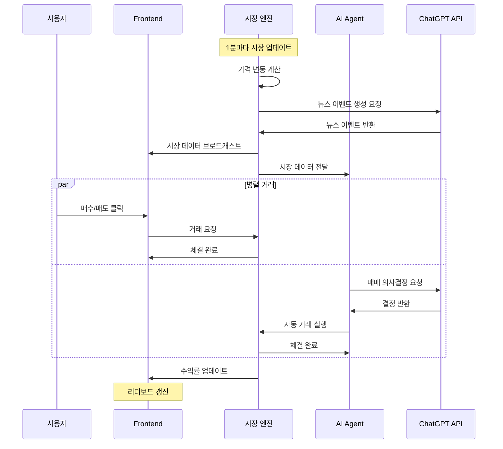

### 기술 스택 및 개발 프로세스

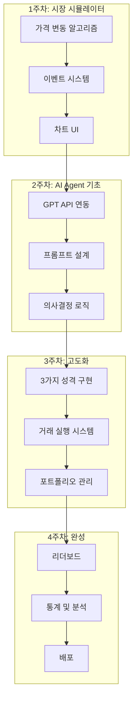

### 학습 포인트

| 알고리즘 | 개념 | 응용 |
|----------|------|------|
| **랜덤 워크** | 주가 변동 시뮬레이션 | 확률론, 통계 |
| **이벤트 드리븐** | 뉴스 기반 변동 | 실시간 시스템 |
| **의사결정 트리** | AI 판단 로직 | 알고리즘 설계 |
| **프롬프트 엔지니어링** | AI 제어 | LLM 활용 |
| **상태 관리** | 포트폴리오 추적 | 데이터 구조 |

---

## 🎮 프로젝트 2: AI 던전 마스터 RPG 게임

### 프로젝트 개요

**컨셉**: ChatGPT가 **실시간으로 스토리를 생성**하고, NPC 역할을 하는 텍스트 기반 RPG

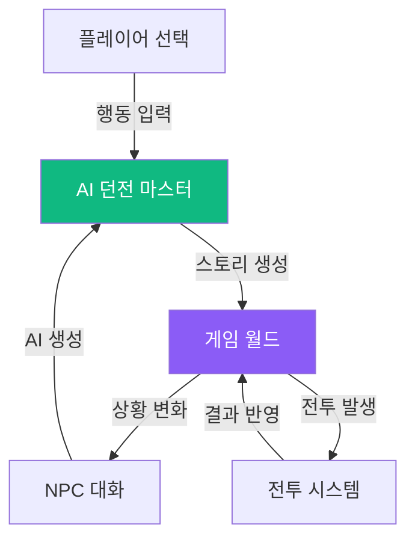

### 핵심 기능 (MVP)

| 기능 | 설명 | AI 역할 |
|------|------|---------|
| **동적 스토리** | 플레이어 선택에 따라 변화 | 스토리 생성 |
| **NPC 대화** | 자연스러운 대화 시스템 | 캐릭터 연기 |
| **전투 시스템** | 턴제 전투 | 전략 생성 |
| **인벤토리** | 아이템 관리 | 아이템 설명 생성 |
| **캐릭터 성장** | 경험치 및 레벨업 | 능력치 밸런싱 |

### 시스템 아키텍처

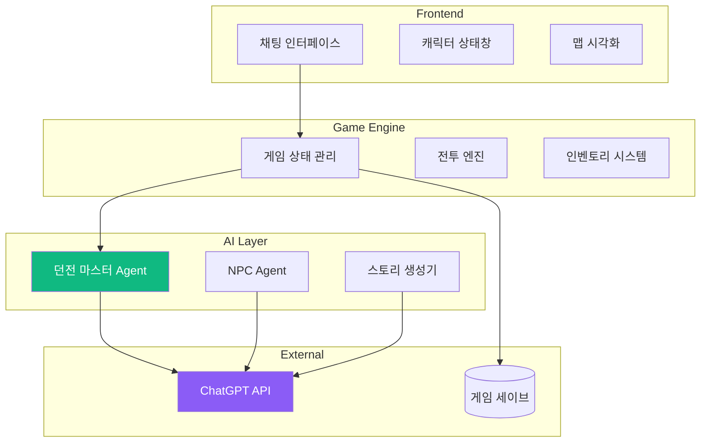

### 핵심 알고리즘 1: 던전 마스터 Agent

```python
"""
AI 던전 마스터 시스템
- 플레이어 행동 해석
- 스토리 생성 및 연결
- 게임 규칙 적용
"""

class DungeonMasterAgent:
    """
    게임의 핵심 AI: 던전 마스터
    """
    
    def __init__(self):
        self.story_context = []  # 지금까지의 스토리
        self.world_state = {}    # 월드 상태
        self.npc_memory = {}     # NPC별 기억
        self.quest_log = []      # 진행 중인 퀘스트
    
    async def process_player_action(self, action: str, game_state: dict):
        """
        플레이어 행동 처리 (핵심 알고리즘)
        
        프로세스:
        1. 행동 분석 및 분류
        2. 게임 규칙 적용 가능 여부 확인
        3. AI에게 스토리 전개 요청
        4. 게임 상태 업데이트
        5. 응답 생성
        """
        
        # 1. 행동 분류
        action_type = self.classify_action(action)
        # "move" | "talk" | "attack" | "use_item" | "examine"
        
        # 2. 게임 규칙 체크
        if not self.is_action_valid(action_type, game_state):
            return {"success": False, "message": "그 행동은 할 수 없습니다."}
        
        # 3. AI 스토리 생성
        story_prompt = self.build_story_prompt(action, action_type, game_state)
        ai_response = await self.ask_gpt(story_prompt)
        
        # 4. 게임 상태 업데이트
        new_state = self.update_game_state(action_type, ai_response, game_state)
        
        # 5. 응답 구성
        response = {
            "narrative": ai_response["story"],
            "game_state": new_state,
            "options": ai_response["next_actions"],
        }
        
        # 6. 컨텍스트 저장
        self.story_context.append({
            "player_action": action,
            "dm_response": ai_response["story"],
        })
        
        return response
    
    def build_story_prompt(self, action: str, action_type: str, game_state: dict) -> str:
        """
        스토리 생성 프롬프트 구성
        
        핵심: 일관성 있는 스토리 유지
        """
        
        # 지금까지의 스토리 요약 (최근 5턴)
        story_summary = self.summarize_recent_story(limit=5)
        
        # 현재 위치 및 상황
        current_location = game_state["location"]
        
        # 캐릭터 상태
        character_status = f"""
HP: {game_state['hp']}/{game_state['max_hp']}
레벨: {game_state['level']}
        """
        
        # 프롬프트 구성
        prompt = f"""
당신은 판타지 RPG의 던전 마스터입니다.

## 지금까지의 이야기
{story_summary}

## 현재 상황
- 장소: {current_location}
- 캐릭터 상태: {character_status}

## 플레이어 행동
"{action}"

## 요청
1. 위 행동의 결과를 생성해주세요
2. 스토리를 흥미롭게 전개하세요
3. 다음 선택지 3개를 제시하세요

## 출력 형식
{{
  "story": "행동 결과 서술 (2-3문장)",
  "next_actions": ["선택지1", "선택지2", "선택지3"],
  "event": "special_item" | "combat" | "npc_encounter" | null,
  "event_data": {{}}
}}

## 규칙
- 플레이어가 죽지 않게 조절
- 스토리 일관성 유지
- 현재 레벨에 맞는 난이도
        """
        
        return prompt
    
    def classify_action(self, action: str) -> str:
        """
        플레이어 행동 분류 (자연어 처리)
        
        알고리즘:
        - 키워드 매칭
        - GPT를 활용한 의도 파악
        """
        
        # 간단한 키워드 매칭
        keywords = {
            "move": ["가다", "이동", "걷다", "들어가다"],
            "talk": ["말하다", "대화", "물어보다", "질문"],
            "attack": ["공격", "때리다", "싸우다"],
            "use_item": ["사용", "먹다", "마시다"],
            "examine": ["조사", "살펴보다", "확인"],
        }
        
        for action_type, words in keywords.items():
            if any(word in action for word in words):
                return action_type
        
        # 복잡한 경우 GPT에게 질문
        return "custom"
```

### 핵심 알고리즘 2: NPC 대화 시스템

```python
"""
NPC Agent 시스템
- 각 NPC의 성격 및 기억 관리
- 자연스러운 대화 생성
"""

class NPCAgent:
    """
    개별 NPC를 위한 AI Agent
    """
    
    def __init__(self, npc_id: str, personality: dict):
        self.npc_id = npc_id
        self.name = personality["name"]
        self.role = personality["role"]  # "상인", "퀘스트 제공자", "적"
        self.personality_traits = personality["traits"]
        self.memory = []  # 플레이어와의 대화 기억
        self.relationship = 50  # 호감도 (0-100)
    
    async def generate_dialogue(self, player_message: str, context: dict):
        """
        NPC 대화 생성
        
        알고리즘:
        1. 이전 대화 기억 로드
        2. 현재 관계 고려
        3. 성격에 맞는 응답 생성
        4. 호감도 업데이트
        """
        
        # 1. 프롬프트 구성
        prompt = f"""
당신은 "{self.name}" 입니다.

## 캐릭터 정보
- 역할: {self.role}
- 성격: {", ".join(self.personality_traits)}
- 플레이어 호감도: {self.relationship}/100

## 이전 대화
{self.format_memory()}

## 플레이어 말
"{player_message}"

## 요청
위 캐릭터로 자연스럽게 응답해주세요.

## 출력 형식
{{
  "dialogue": "NPC 대사",
  "emotion": "happy" | "neutral" | "angry" | "sad",
  "relationship_change": -10 ~ +10
}}
        """
        
        # 2. GPT 호출
        response = await self.ask_gpt(prompt)
        
        # 3. 호감도 업데이트
        self.relationship += response["relationship_change"]
        self.relationship = max(0, min(100, self.relationship))
        
        # 4. 기억 저장
        self.memory.append({
            "player": player_message,
            "npc": response["dialogue"],
            "relationship": self.relationship,
        })
        
        return response
    
    def format_memory(self, limit: int = 3) -> str:
        """
        최근 대화 요약
        """
        if not self.memory:
            return "(처음 만남)"
        
        recent = self.memory[-limit:]
        lines = []
        for m in recent:
            lines.append(f"플레이어: {m['player']}")
            lines.append(f"{self.name}: {m['npc']}")
        
        return "\n".join(lines)
```

### 핵심 알고리즘 3: 동적 전투 시스템

```python
"""
AI 기반 전투 시스템
- 적의 전략적 행동 생성
- 밸런싱 자동 조절
"""

class CombatSystem:
    """
    턴제 전투 엔진
    """
    
    def __init__(self):
        self.turn = 0
        self.combat_log = []
    
    async def enemy_ai_turn(self, enemy: dict, player: dict):
        """
        적의 턴 (AI 의사결정)
        
        알고리즘:
        1. 전투 상황 분석
        2. GPT에게 전략 질문
        3. 행동 실행
        """
        
        # 1. 상황 분석
        enemy_hp_percent = enemy["hp"] / enemy["max_hp"]
        player_hp_percent = player["hp"] / player["max_hp"]
        
        # 2. 전략 프롬프트
        prompt = f"""
당신은 "{enemy['name']}" (적)입니다.

## 전투 상황
- 내 HP: {enemy['hp']}/{enemy['max_hp']} ({enemy_hp_percent*100:.0f}%)
- 플레이어 HP: {player['hp']}/{player['max_hp']} ({player_hp_percent*100:.0f}%)
- 턴: {self.turn}

## 사용 가능한 행동
1. 기본 공격 (데미지: 10-15)
2. 강력한 일격 (데미지: 20-30, 명중률 70%)
3. 방어 (다음 턴 데미지 50% 감소)
4. 회복 포션 사용 (HP +30, 1개 남음)

## 요청
최선의 전략을 선택하고 이유를 설명하세요.

## 출력 형식
{{
  "action": "attack" | "special_attack" | "defend" | "use_item",
  "reasoning": "선택 이유",
  "taunt": "전투 중 대사 (선택사항)"
}}
        """
        
        # 3. AI 결정
        decision = await self.ask_gpt(prompt)
        
        # 4. 행동 실행
        result = self.execute_action(decision["action"], enemy, player)
        
        # 5. 로그 기록
        self.combat_log.append({
            "turn": self.turn,
            "actor": enemy["name"],
            "action": decision["action"],
            "result": result,
            "taunt": decision.get("taunt"),
        })
        
        return result
```

### 데이터 흐름 (실시간 스토리 생성)

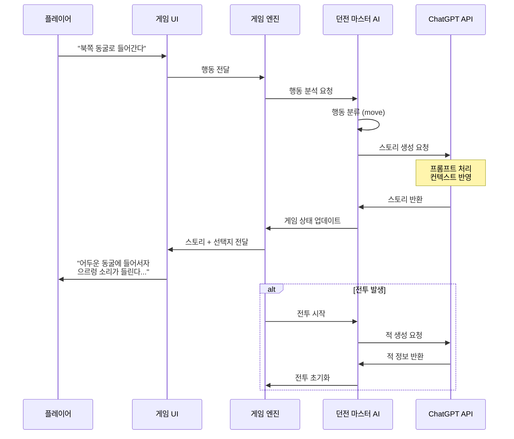

### 학습 포인트

| 알고리즘 | 개념 | 응용 |
|----------|------|------|
| **자연어 처리** | 플레이어 입력 해석 | NLP 기초 |
| **상태 머신** | 게임 상태 관리 | 상태 패턴 |
| **컨텍스트 관리** | 스토리 일관성 유지 | 메모리 최적화 |
| **프롬프트 체인** | 복잡한 AI 작업 분해 | LLM 활용 |
| **턴제 시스템** | 전투 로직 | 게임 로직 |

---

## 💼 프로젝트 3: AI 코딩 면접관 플랫폼

### 프로젝트 개요

**컨셉**: AI가 **실시간으로 코딩 문제를 내고 평가**하는 면접 연습 플랫폼

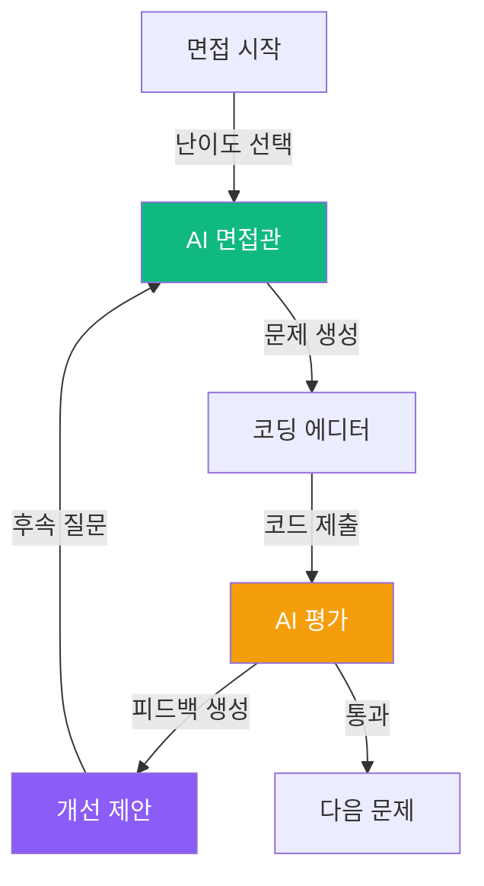

### 핵심 기능 (MVP)

| 기능 | 설명 | AI 역할 |
|------|------|---------|
| **문제 생성** | 맞춤형 코딩 문제 | 난이도별 문제 생성 |
| **실시간 평가** | 코드 품질 분석 | 코드 리뷰 |
| **대화형 힌트** | 막힐 때 도움 | 단계별 힌트 제공 |
| **개선 제안** | 최적화 방법 | 리팩토링 제안 |
| **면접 리포트** | 종합 평가서 | 강약점 분석 |

### 시스템 아키텍처

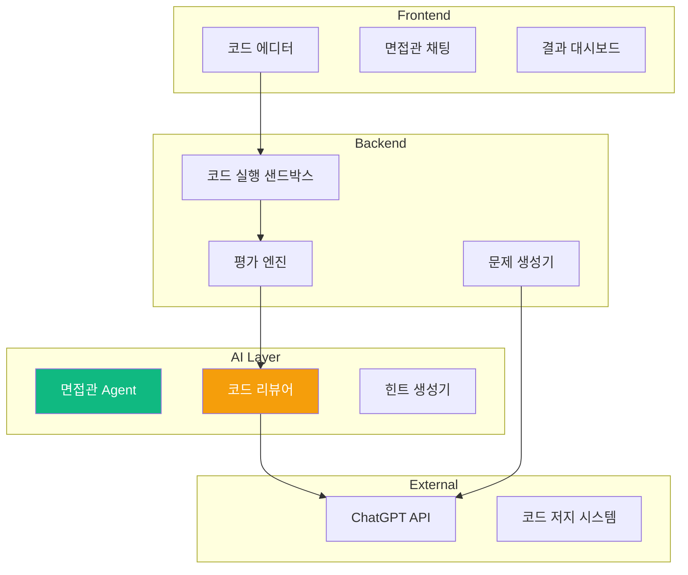

### 핵심 알고리즘 1: 문제 생성 Agent

```python
"""
맞춤형 코딩 문제 생성
- 사용자 레벨 분석
- 약점 보완 문제 생성
"""

class ProblemGeneratorAgent:
    """
    AI 기반 문제 생성기
    """
    
    def __init__(self):
        self.difficulty_levels = {
            "easy": {"time": 15, "complexity": "O(n)"},
            "medium": {"time": 30, "complexity": "O(n log n)"},
            "hard": {"time": 45, "complexity": "O(n²) 이상"},
        }
    
    async def generate_problem(
        self,
        difficulty: str,
        topic: str,
        user_history: dict
    ):
        """
        코딩 문제 생성 (핵심 알고리즘)
        
        프로세스:
        1. 사용자 이력 분석 (약점 파악)
        2. 주제 및 난이도 결정
        3. GPT로 문제 생성
        4. 테스트 케이스 생성
        5. 검증
        """
        
        # 1. 약점 분석
        weak_areas = self.analyze_weaknesses(user_history)
        
        # 2. 문제 생성 프롬프트
        prompt = f"""
당신은 코딩 면접 출제자입니다.

## 요구사항
- 난이도: {difficulty}
- 주제: {topic}
- 목표 시간: {self.difficulty_levels[difficulty]["time"]}분
- 목표 복잡도: {self.difficulty_levels[difficulty]["complexity"]}

## 사용자 약점
{", ".join(weak_areas)}

## 요청
위 조건에 맞는 코딩 문제를 생성하세요.

## 출력 형식
{{
  "title": "문제 제목",
  "description": "문제 설명 (상세하게)",
  "input_format": "입력 형식",
  "output_format": "출력 형식",
  "constraints": ["제약조건1", "제약조건2"],
  "examples": [
    {{"input": "...", "output": "...", "explanation": "..."}},
    ...
  ],
  "test_cases": [
    {{"input": "...", "output": "..."}},
    ...
  ],
  "hints": ["힌트1", "힌트2", "힌트3"],
  "optimal_solution_approach": "최적 해법 접근법"
}}
        """
        
        # 3. GPT 호출
        problem = await self.ask_gpt(prompt)
        
        # 4. 검증
        if not self.validate_problem(problem):
            # 재생성
            return await self.generate_problem(difficulty, topic, user_history)
        
        return problem
    
    def analyze_weaknesses(self, user_history: dict) -> list:
        """
        사용자 약점 분석
        
        알고리즘:
        - 틀린 문제 유형 추출
        - 자주 사용하지 않는 개념
        - 시간 초과한 알고리즘
        """
        weaknesses = []
        
        # 정답률 낮은 주제
        for topic, stats in user_history.get("topics", {}).items():
            if stats["accuracy"] < 0.5:
                weaknesses.append(topic)
        
        # 시간 초과 많은 유형
        if user_history.get("time_limit_exceeded", 0) > 3:
            weaknesses.append("시간 복잡도 최적화")
        
        return weaknesses
```

### 핵심 알고리즘 2: 코드 평가 Agent

```python
"""
AI 코드 리뷰어
- 정확성, 효율성, 가독성 평가
- 상세한 피드백 생성
"""

class CodeReviewerAgent:
    """
    AI 기반 코드 평가 시스템
    """
    
    def __init__(self):
        self.evaluation_criteria = {
            "correctness": 40,    # 정확성
            "efficiency": 30,     # 효율성
            "readability": 20,    # 가독성
            "best_practices": 10, # 모범 사례
        }
    
    async def evaluate_code(
        self,
        code: str,
        problem: dict,
        test_results: list
    ):
        """
        코드 평가 (핵심 알고리즘)
        
        프로세스:
        1. 정확성 평가 (테스트 케이스)
        2. 효율성 분석 (시간/공간 복잡도)
        3. 가독성 평가 (코드 스타일)
        4. GPT로 종합 평가
        5. 개선 제안 생성
        """
        
        evaluation = {}
        
        # 1. 정확성
        correctness_score = self.evaluate_correctness(test_results)
        evaluation["correctness"] = correctness_score
        
        # 2. 효율성 (GPT 분석)
        efficiency_analysis = await self.analyze_efficiency(code, problem)
        evaluation["efficiency"] = efficiency_analysis
        
        # 3. 가독성 (GPT 분석)
        readability_analysis = await self.analyze_readability(code)
        evaluation["readability"] = readability_analysis
        
        # 4. 종합 평가
        final_score = self.calculate_final_score(evaluation)
        
        # 5. 피드백 생성
        feedback = await self.generate_feedback(code, problem, evaluation)
        
        return {
            "score": final_score,
            "breakdown": evaluation,
            "feedback": feedback,
            "suggestions": feedback["improvements"],
        }
    
    async def analyze_efficiency(self, code: str, problem: dict):
        """
        효율성 분석 (시간/공간 복잡도)
        """
        
        prompt = f"""
다음 코드의 시간 및 공간 복잡도를 분석하세요.

## 코드
```python
{code}
```

## 문제의 최적 복잡도
{problem["optimal_solution_approach"]}

## 요청
1. 시간 복잡도 분석
2. 공간 복잡도 분석
3. 최적화 가능 여부
4. 점수 (0-100)

## 출력 형식
{{
  "time_complexity": "O(...)",
  "space_complexity": "O(...)",
  "is_optimal": true | false,
  "bottlenecks": ["병목1", "병목2"],
  "optimization_suggestions": ["제안1", "제안2"],
  "score": 0-100
}}
        """
        
        return await self.ask_gpt(prompt)
    
    async def analyze_readability(self, code: str):
        """
        가독성 분석
        """
        
        prompt = f"""
다음 코드의 가독성을 평가하세요.

## 코드
```python
{code}
```

## 평가 기준
- 변수명 명확성
- 함수 분리
- 주석 적절성
- 코드 구조

## 출력 형식
{{
  "variable_naming": {{"score": 0-100, "comment": "..."}},
  "code_structure": {{"score": 0-100, "comment": "..."}},
  "comments": {{"score": 0-100, "comment": "..."}},
  "overall_score": 0-100,
  "good_practices": ["좋은점1", "좋은점2"],
  "improvements": ["개선점1", "개선점2"]
}}
        """
        
        return await self.ask_gpt(prompt)
    
    async def generate_feedback(
        self,
        code: str,
        problem: dict,
        evaluation: dict
    ):
        """
        종합 피드백 생성
        """
        
        prompt = f"""
당신은 친절한 코딩 면접관입니다.

## 제출된 코드
```python
{code}
```

## 평가 결과
- 정확성: {evaluation["correctness"]["score"]}/100
- 효율성: {evaluation["efficiency"]["score"]}/100
- 가독성: {evaluation["readability"]["score"]}/100

## 요청
학생이 성장할 수 있도록 건설적인 피드백을 제공하세요.

## 출력 형식
{{
  "summary": "전체 평가 요약 (2-3문장)",
  "strengths": ["강점1", "강점2"],
  "weaknesses": ["약점1", "약점2"],
  "improvements": [
    {{
      "area": "개선 영역",
      "suggestion": "구체적 제안",
      "example_code": "개선된 코드 예시 (선택)"
    }}
  ],
  "next_steps": ["다음 학습 방향1", "다음 학습 방향2"]
}}
        """
        
        return await self.ask_gpt(prompt)
```

### 핵심 알고리즘 3: 대화형 힌트 시스템

```python
"""
단계별 힌트 제공
- 너무 많이 알려주지 않기
- 사고 유도형 힌트
"""

class HintSystemAgent:
    """
    스마트 힌트 생성기
    """
    
    def __init__(self):
        self.hint_levels = ["nudge", "guidance", "solution"]
        self.hint_count = 0
    
    async def generate_hint(
        self,
        problem: dict,
        current_code: str,
        level: int
    ):
        """
        단계별 힌트 생성
        
        알고리즘:
        1. 현재 코드 분석 (어디서 막혔나?)
        2. 힌트 레벨 결정
        3. 적절한 힌트 생성
        """
        
        self.hint_count += 1
        
        # 레벨별 프롬프트
        if level == 0:  # nudge: 방향만 제시
            prompt_instruction = "막힌 부분을 파악하고, 생각의 방향만 제시하세요. 답은 알려주지 마세요."
        elif level == 1:  # guidance: 접근 방법 제시
            prompt_instruction = "문제 해결 접근 방법을 단계별로 설명하세요. 코드는 제공하지 마세요."
        else:  # solution: 해답 제공
            prompt_instruction = "최적 해법의 핵심 아이디어와 간단한 슈도코드를 제공하세요."
        
        prompt = f"""
당신은 코딩 멘토입니다.

## 문제
{problem["description"]}

## 학생의 현재 코드
```python
{current_code if current_code else "(아직 작성 안함)"}
```

## 요청
{prompt_instruction}

## 힌트 횟수
{self.hint_count}/3

## 출력 형식
{{
  "hint": "힌트 내용",
  "follow_up_question": "학생에게 던질 질문",
  "encouragement": "격려 메시지"
}}
        """
        
        return await self.ask_gpt(prompt)
```

### 데이터 흐름 (실시간 면접 진행)

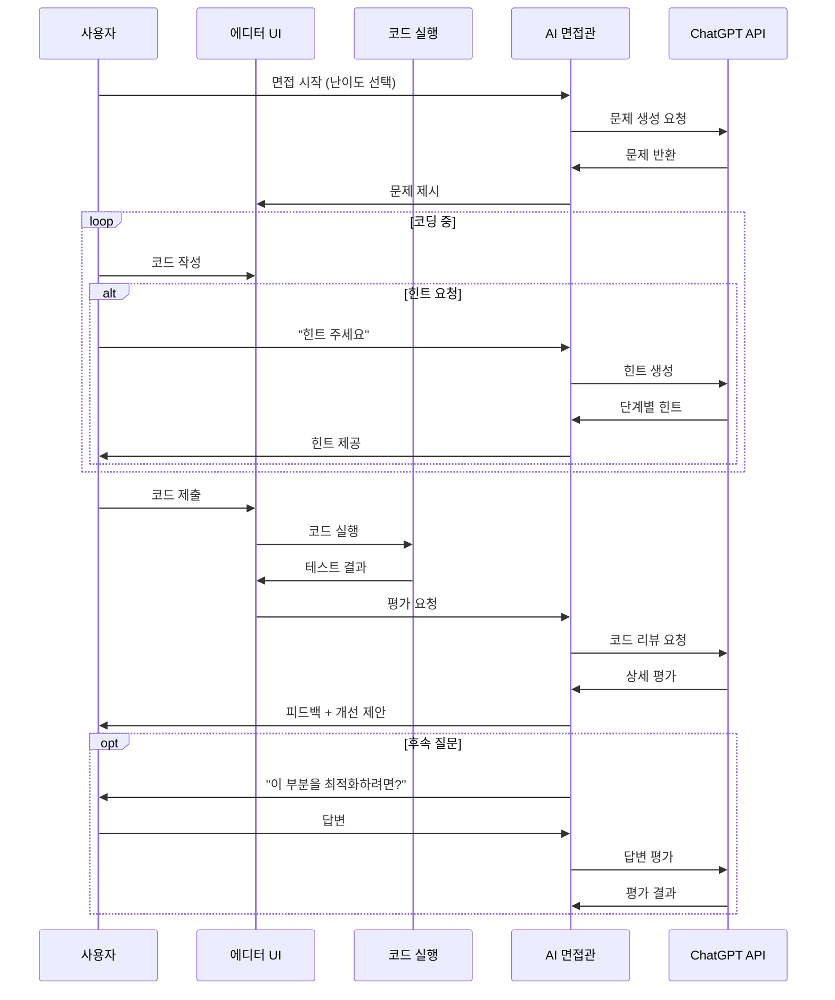

### 학습 포인트

| 알고리즘 | 개념 | 응용 |
|----------|------|------|
| **코드 분석** | AST 파싱, 복잡도 계산 | 정적 분석 |
| **테스트 케이스 생성** | Edge case 고려 | 소프트웨어 테스팅 |
| **피드백 시스템** | 건설적 평가 | 교육 심리학 |
| **단계별 힌트** | 사고 유도 | 문제 해결 전략 |
| **샌드박스 실행** | 안전한 코드 실행 | 보안 |

---

## 🎓 3개 프로젝트 비교

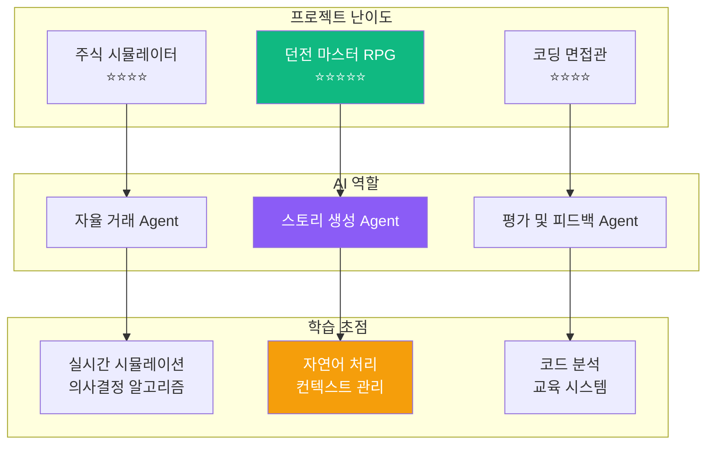

### 프로젝트별 특징

| 프로젝트 | 핵심 알고리즘 | AI Agent 역할 | 개발 기간 | 포트폴리오 임팩트 |
|----------|---------------|---------------|-----------|-------------------|
| **주식 시뮬레이터** | 랜덤 워크, 이벤트 드리븐, 의사결정 | 자율 거래봇 | 4주 | ⭐⭐⭐⭐ |
| **던전 마스터 RPG** | 자연어 처리, 상태 머신, 스토리 생성 | 게임 마스터 | 5주 | ⭐⭐⭐⭐⭐ |
| **코딩 면접관** | 코드 분석, 문제 생성, 평가 시스템 | 면접관/멘토 | 4주 | ⭐⭐⭐⭐⭐ |

---

## 🚀 공통 개발 프로세스

### 1단계: AI Agent 설계 (1주차)

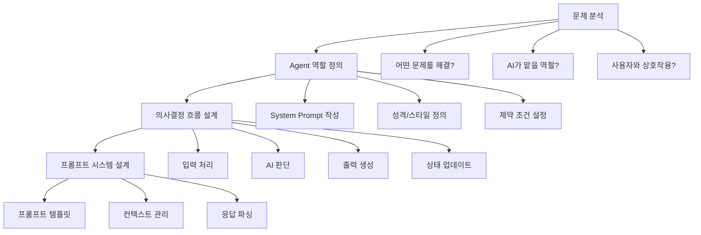

### 2단계: MVP 구현 (2주차)

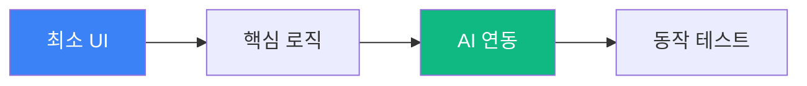

**MVP 체크리스트:**
- [ ] 로그인/회원가입 **제외** (localStorage 사용)
- [ ] 핵심 기능 **1개만** 완성
- [ ] AI Agent **기본 동작** 확인
- [ ] 실시간 상호작용 가능
- [ ] 로컬에서 실행 가능

### 3단계: AI 고도화 (3주차)

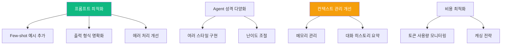

### 4단계: 완성 및 배포 (4주차)

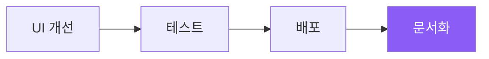

---

## 💡 AI Agent 개발 핵심 원칙

### 1. 프롬프트 엔지니어링

```python
"""
좋은 프롬프트 구조
"""

GOOD_PROMPT_TEMPLATE = """
## 역할 정의
당신은 [구체적인 역할]입니다.

## 현재 상황
[컨텍스트 정보]

## 요청
[구체적인 작업]

## 출력 형식
{
  "field1": "설명",
  "field2": "설명"
}

## 제약 조건
- 제약1
- 제약2

## 예시 (Few-shot)
입력: ...
출력: ...
"""
```

### 2. 상태 관리

```python
"""
Agent 상태 관리 패턴
"""

class AgentState:
    """Agent 상태를 추적"""
    
    def __init__(self):
        self.context_window = []  # 최근 N개 대화
        self.long_term_memory = {} # 중요 정보 저장
        self.current_goal = None    # 현재 목표
    
    def add_to_context(self, interaction: dict):
        """컨텍스트 추가"""
        self.context_window.append(interaction)
        
        # 윈도우 크기 제한 (토큰 비용 절감)
        if len(self.context_window) > 10:
            self.summarize_old_context()
    
    def summarize_old_context(self):
        """오래된 대화 요약"""
        # 오래된 대화를 GPT로 요약
        # 중요 정보만 long_term_memory에 저장
        pass
```

### 3. 에러 처리

```python
"""
Robust한 AI 시스템
"""

async def safe_gpt_call(prompt: str, max_retries: int = 3):
    """
    안전한 GPT 호출
    """
    for attempt in range(max_retries):
        try:
            response = await call_gpt_api(prompt)
            
            # JSON 파싱 검증
            if not validate_response(response):
                raise ValueError("Invalid response format")
            
            return response
            
        except Exception as e:
            if attempt == max_retries - 1:
                # 최종 실패 시 기본 응답
                return get_fallback_response()
            
            # 재시도
            await asyncio.sleep(2 ** attempt)  # Exponential backoff
```

---

## 📊 학습 로드맵 (심화반)

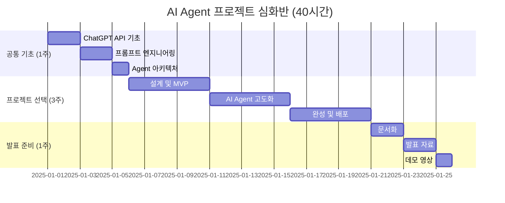

---

## 🎯 평가 기준

### 프로젝트 평가표

| 항목 | 배점 | 평가 기준 |
|------|------|-----------|
| **AI Agent 설계** | 30점 | 역할 정의, 의사결정 로직, 프롬프트 품질 |
| **알고리즘 구현** | 25점 | 핵심 로직, 효율성, 확장성 |
| **사용자 경험** | 20점 | 인터페이스, 반응성, 직관성 |
| **창의성** | 15점 | 독창적 기능, 차별화 포인트 |
| **완성도** | 10점 | 버그 없음, 배포 가능 |

### AI 활용 수준

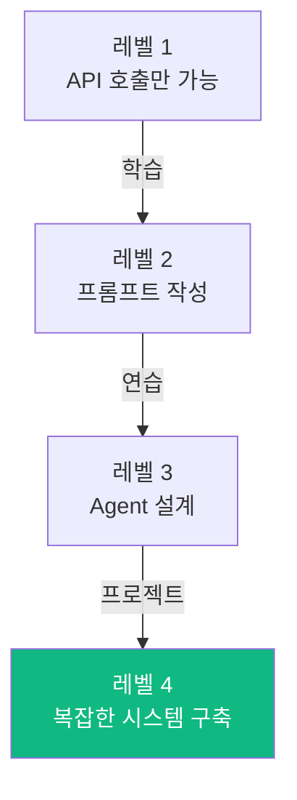

---

## 💸 비용 최적화 전략

### ChatGPT API 비용 절감

```python
"""
토큰 사용량 최적화
"""

class TokenOptimizer:
    """토큰 비용 최소화"""
    
    @staticmethod
    def compress_context(context: list) -> str:
        """
        컨텍스트 압축
        - 중복 제거
        - 핵심만 추출
        """
        # 오래된 대화는 요약
        # 중요 정보만 유지
        pass
    
    @staticmethod
    def use_cheaper_model_when_possible(task_complexity: str):
        """
        작업 복잡도에 따라 모델 선택
        - 간단한 작업: GPT-3.5 Turbo
        - 복잡한 작업: GPT-4
        """
        if task_complexity == "simple":
            return "gpt-3.5-turbo"
        else:
            return "gpt-4"
    
    @staticmethod
    def cache_common_responses():
        """
        자주 사용되는 응답 캐싱
        """
        # 동일한 질문에 대해 캐시 활용
        pass
```

### 예상 비용 (프로젝트당)

| 개발 단계 | 예상 API 호출 | 예상 비용 (USD) |
|-----------|---------------|-----------------|
| 개발 중 (4주) | ~500회 | $10-20 |
| 테스트 | ~200회 | $5-10 |
| **총합** | ~700회 | **$15-30** |

---

## 📚 추천 학습 자료

### ChatGPT API
- OpenAI 공식 문서: https://platform.openai.com/docs
- Prompt Engineering Guide: https://www.promptingguide.ai/

### Agent 설계
- LangChain 문서: https://python.langchain.com/
- AutoGPT 사례 연구

### 프로젝트 영감
- Awesome GPT Applications: GitHub 검색
- AI Agent 논문: arXiv.org

---

## 📞 문의

**AI Maker Lab 심화반**  
- 홈페이지: https://aimakerlab.com
- 이메일: advanced@aimakerlab.com
- Github: https://github.com/aimakerlab/ai-agent-projects

---

**최종 업데이트**: 2025-12-30  
**작성자**: AI Maker Lab 바이브 코딩팀  
**문서 버전**: 1.0 (AI Agent 프로젝트 심화반)

