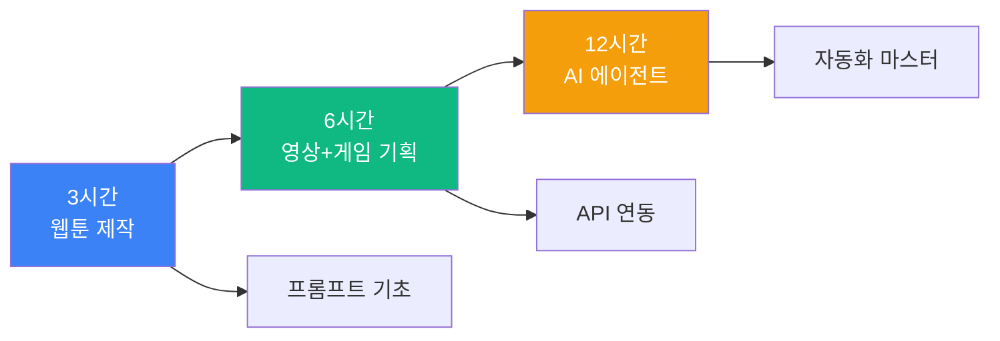
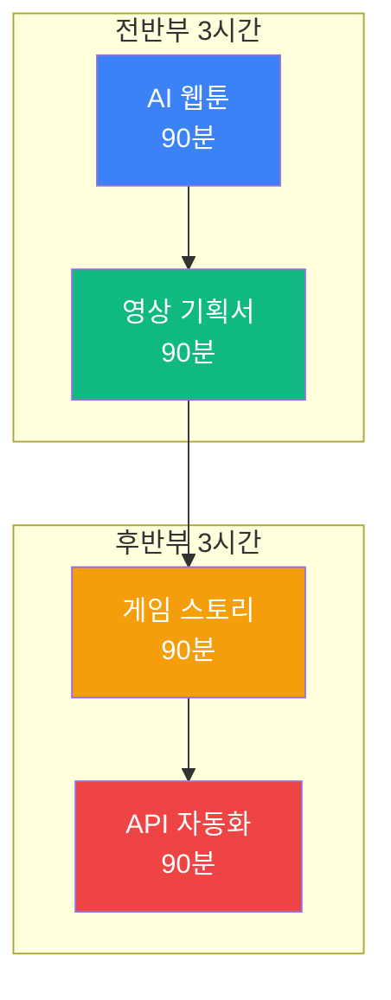
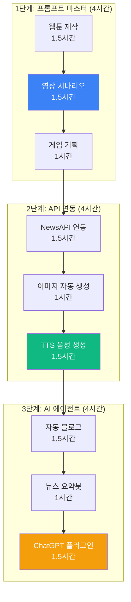
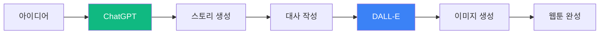
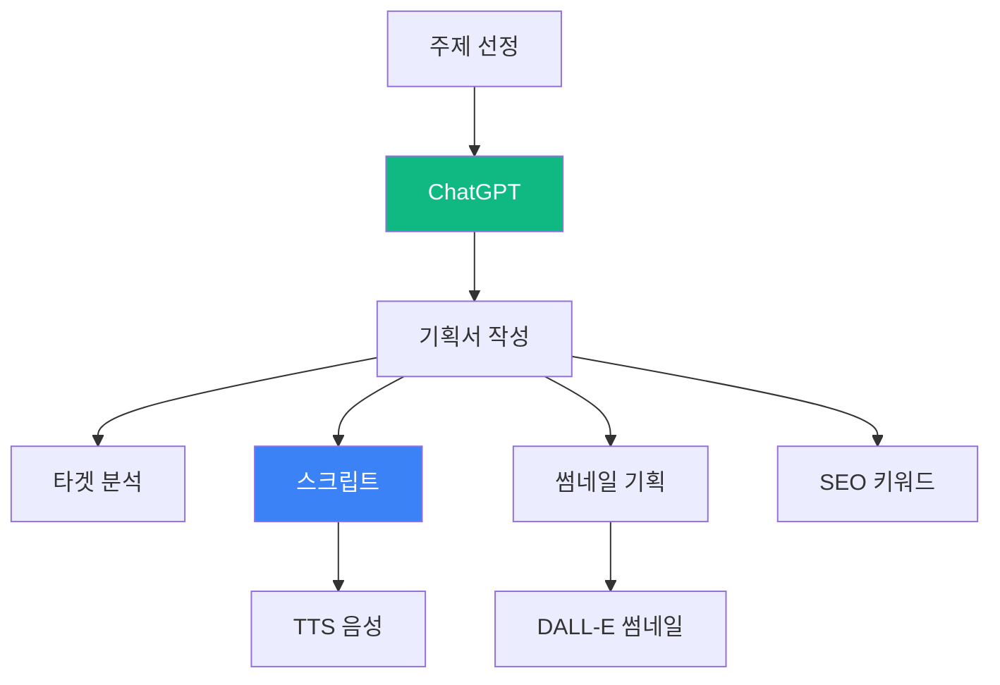
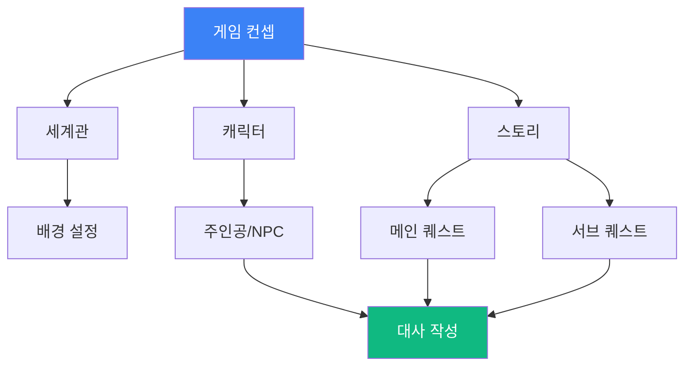
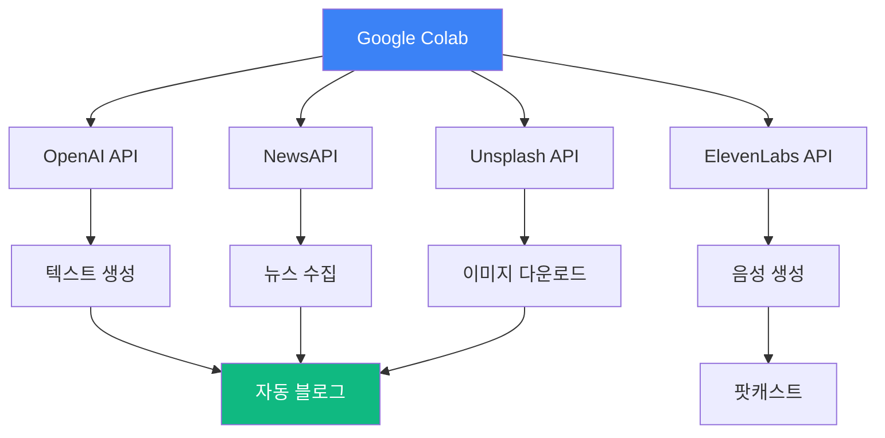
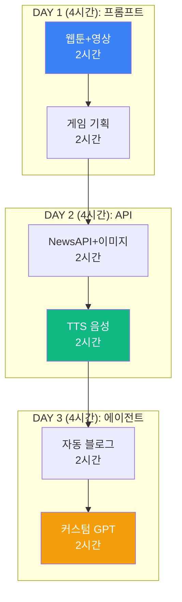
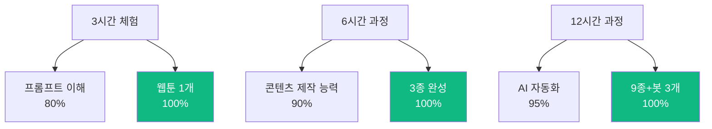

# 맛보기 출장수업: ChatGPT 크리에이터

## 🎯 Hero Section

**배지**: "AI로 콘텐츠 제작 10배 빠르게"  
**타이틀**: "ChatGPT 크리에이터 체험"  
**설명**: "코딩 없이 ChatGPT로 웹툰, 영상 시나리오, 게임 기획서를 만들어보세요"

### Features

| 아이콘 | 라벨 | 설명 |
|--------|------|------|
| 📝 | AI 작가 | 스토리 자동 생성 |
| 🎨 | AI 디자이너 | 이미지 생성 (DALL-E) |
| 🤖 | AI 에이전트 | 자동화 워크플로우 |
| 🌐 | API 연동 | 실전 서비스 통합 |

---

## 📊 Course Info

| 항목 | 아이콘 | 색상 | 내용 |
|------|--------|------|------|
| 수업 시간 | ⏰ Clock | purple | 3시간 / 6시간 / 12시간 선택 |
| 수강 인원 | 👥 Users | blue | 최대 30명 (개인 작업) |
| 준비물 | 💻 Laptop | green | 노트북 + ChatGPT 계정 |
| 수업 방식 | 🎯 Target | orange | PRIMM 방식 (체험→탐구→수정→창작) |

---

## 📖 과정 소개

### 타이틀
"왜 ChatGPT 크리에이터인가?"

### 내용

ChatGPT는 단순한 챗봇이 아닌 **AI 콘텐츠 제작 플랫폼**입니다. 프롬프트 엔지니어링과 API 연동으로 웹툰 시나리오, 영상 기획, 게임 스토리를 10배 빠르게 제작할 수 있습니다.

넷플릭스 작가, 유튜버, 게임 기획자처럼 **실제 크리에이터가 사용하는 AI 도구**를 직접 체험하고, ChatGPT + DALL-E + API 자동화로 완성도 높은 콘텐츠를 만듭니다.

**코딩 없이도 프롬프트 작성만으로** 콘텐츠를 생성하며, Colab 자동화로 대량 생산까지 가능합니다. 중학생부터 고등학생까지 모두 참여 가능하며, 3시간 만에 웹툰 1화 분량을 완성할 수 있습니다.

### 이미지 (3개)
- ChatGPT 인터페이스
- 학생들이 AI 생성 이미지 확인하는 모습
- 완성된 웹툰/영상 기획서

---

## 🎓 학습 경로 (Learning Path)

### 전체 구조도



### 3시간 과정: AI 웹툰 제작

| 단계 | 시간 | 내용 | 강조 |
|------|------|------|------|
| 1. 벤치마킹 | 15분 | AI 콘텐츠 사례 & 토론 | 📝 |
| 2. Predict | 10분 | 완성된 웹툰 체험 | 🎮 |
| 3. Run | 30분 | ChatGPT 스토리 생성 | ⭐ |
| 4. Investigate | 20분 | 프롬프트 엔지니어링 원리 | 🔍 |
| 5. Modify | 40분 | 캐릭터/설정/대사 수정 | ⭐⭐ |
| 6. Make | 50분 | DALL-E로 이미지 생성 | ⭐⭐⭐ |
| 7. 발표 | 15분 | 웹툰 공유 | 🎉 |

**완성 작품**: 8컷 AI 웹툰 1화 (스토리 + 이미지)

### 6시간 과정: 웹툰 + 영상 기획 + 게임 스토리



| 세션 | 시간 | 프로젝트 | 핵심 기술 |
|------|------|----------|-----------|
| 1교시 | 90분 | AI 웹툰 제작 | 프롬프트 + DALL-E |
| 2교시 | 90분 | 유튜브 영상 기획서 | 시나리오 생성 |
| 3교시 | 90분 | 게임 스토리 + 대사 | 캐릭터 설정 |
| 4교시 | 90분 | Colab 자동화 | API 연동 |

**완성 작품**: 3종 콘텐츠 (웹툰 + 영상 기획 + 게임 스토리)

### 12시간 과정: AI 에이전트 크리에이터



**일정표**

| 차시 | 시간 | 단계 | 프로젝트 | 완성도 |
|------|------|------|----------|--------|
| 1차시 | 2시간 | 프롬프트 1 | 웹툰 + 영상 시나리오 | ⭐⭐⭐ |
| 2차시 | 2시간 | 프롬프트 2 | 게임 기획서 + 대사집 | ⭐⭐⭐ |
| 3차시 | 2시간 | API 연동 1 | NewsAPI + 자동 요약 | ⭐⭐⭐ |
| 4차시 | 2시간 | API 연동 2 | DALL-E + TTS 음성 | ⭐⭐⭐ |
| 5차시 | 2시간 | 에이전트 1 | 자동 블로그 포스팅 | ⭐⭐⭐ |
| 6차시 | 2시간 | 에이전트 2 | 뉴스봇 + 커스텀 GPT | ⭐⭐⭐ |

**완성 작품**: 6개 AI 콘텐츠 + 3개 자동화 봇

---

## 🎮 프로젝트 상세

### 프로젝트 1: AI 웹툰 제작 (3시간 과정 메인)



**난이도**: ⭐⭐ (초급)  
**소요 시간**: 3시간  
**대상**: 중등 1학년 ~ 고등 3학년

**학습 목표**
- 효과적인 프롬프트 작성법
- ChatGPT 스토리 생성
- DALL-E 이미지 생성
- 콘텐츠 편집 및 보완

**제작 단계**

| 단계 | 내용 | 시간 | 도구 |
|------|------|------|------|
| 1. 기획 | 주제, 캐릭터, 세계관 설정 | 20분 | ChatGPT |
| 2. 스토리 | 8컷 스토리 생성 | 30분 | ChatGPT |
| 3. 대사 | 자연스러운 대사 작성 | 20분 | ChatGPT |
| 4. 이미지 | DALL-E 프롬프트 작성 | 20분 | DALL-E 3 |
| 5. 생성 | 8장 이미지 생성 | 40분 | DALL-E 3 |
| 6. 편집 | 말풍선, 효과음 추가 | 30분 | Canva |
| 7. 발표 | 웹툰 공유 | 10분 | - |

**핵심 기법: 프롬프트 엔지니어링**

**1) 캐릭터 설정 프롬프트**

```
프롬프트 템플릿:

학원물 웹툰을 만들고 싶어. 다음 조건으로 주인공 캐릭터를 만들어줘:

1. 기본 정보
   - 이름: [자유]
   - 나이: 16세 (고1)
   - 성격: 내성적이지만 정의감 강함
   - 특기: 컴퓨터 프로그래밍

2. 배경 스토리
   - 중학교 때 학교폭력 목격
   - 증거를 SNS에 올려 해결
   - 이후 "정의 해커"로 활동 시작

3. 외모 특징
   - 키: 170cm
   - 머리: 검은 단발
   - 패션: 후드티 + 청바지
   - 특징: 항상 노트북 휴대

이 캐릭터의 상세 프로필을 작성해줘. 말투, 습관, 좋아하는 것도 포함해.
```

**ChatGPT 응답 예시:**

```
【캐릭터 프로필】

이름: 한지우 (가명: Ghost_J)
나이: 16세 (고등학교 1학년)

성격:
- 평소에는 조용하고 말수가 적음
- 불의를 보면 참지 못하는 정의감
- 온라인에서는 자신감 넘치는 모습
- 친구는 적지만 신뢰가 깊음

배경 스토리:
중학교 2학년 때, 같은 반 친구가 학교폭력을 당하는 모습을 목격했다. 
선생님과 부모님께 말했지만 묵살당했고, 지우는 직접 증거를 모아 
익명 계정으로 SNS에 공개했다. 이 사건으로 가해자는 전학갔고, 
지우는 "정의를 위해 해킹 기술을 쓰는 사람"이 되기로 결심했다.
...
```

**2) 스토리 생성 프롬프트**

```
위 캐릭터로 8컷 웹툰을 만들고 싶어. 첫 에피소드 스토리를 만들어줘.

조건:
- 8컷 구성 (기승전결)
- 각 컷마다 장면 설명, 대사, 효과음 포함
- 독자가 몰입할 수 있도록 긴장감 있게
- 다음 화가 궁금해지는 클리프행어

형식:
[컷 1]
장면: (배경, 인물, 행동)
대사: "..."
효과음: (효과음)

이렇게 8컷까지 작성해줘.
```

**3) DALL-E 이미지 생성 프롬프트**

```
A Korean high school girl, 16 years old, short black hair, 
wearing a gray hoodie and jeans, holding a laptop, 
standing in front of school building, 
anime style, webtoon illustration, clean line art, 
soft lighting, detailed, 4K
```

**완성 예시 (1컷)**

```
[컷 1]
장면: 고등학교 정문 앞. 아침 8시. 학생들이 등교하는 모습.
인물: 한지우, 후드티에 노트북 가방을 멘 채 천천히 걷고 있음.
대사: "새 학기... 이번엔 평범하게 보내고 싶은데..."
효과음: 쨍그랑- (누군가 핸드폰을 떨어뜨림)

[이미지]
(DALL-E로 생성된 이미지)

[컷 2]
장면: 복도. 한 여학생이 핸드폰을 주우려는데 다른 학생이 발로 차버림.
인물: 가해자 3명, 피해자 1명, 멀리서 지켜보는 지우
대사: 가해자 - "야, 1학년. 선배한테 인사는?"
효과음: 탁-
...
```

**기대 효과**
- ✅ 프롬프트로 전문가급 스토리 생성
- ✅ 3시간 만에 웹툰 1화 완성
- ✅ 크리에이터로서의 자신감

### 프로젝트 2: 유튜브 영상 기획서 (6시간 과정 포함)



**난이도**: ⭐⭐⭐ (중급)  
**소요 시간**: 90분  
**대상**: 중등 2학년 ~ 고등 3학년

**기획서 구성**

| 섹션 | 내용 | ChatGPT 활용 |
|------|------|--------------|
| 1. 타겟 분석 | 연령, 관심사, 시청 패턴 | 페르소나 생성 |
| 2. 콘셉트 | 채널 정체성, 차별점 | 경쟁 분석 |
| 3. 스크립트 | 오프닝, 본편, 엔딩 | 대본 작성 |
| 4. 썸네일 | 디자인 기획 | DALL-E 프롬프트 |
| 5. SEO | 제목, 태그, 설명 | 키워드 분석 |

**프롬프트 예시**

```
주제: "10대를 위한 AI 코딩 교육"

다음 조건으로 유튜브 영상 기획서를 작성해줘:

1. 타겟:
   - 연령: 14-18세
   - 관심사: 코딩, AI, 게임 개발
   - 레벨: 완전 초보

2. 영상 길이: 10분

3. 톤앤매너:
   - 친근하고 재미있게
   - 어려운 용어는 쉽게 풀어서
   - MZ세대 유머 코드

4. 구성:
   - 오프닝 (30초): 임팩트 있게
   - 본편 (8분): 3가지 핵심 내용
   - 엔딩 (1분 30초): 행동 유도

각 섹션별로 상세 스크립트를 작성해줘. 
자막으로 들어갈 핵심 키워드도 표시해줘.
```

**ChatGPT 응답 (일부)**

```
【유튜브 영상 기획서】

제목 (안): "코딩 몰라도 3분 만에 AI 게임 만들기 🎮 (feat. ChatGPT)"

━━━━━━━━━━━━━━━━━━━━━━

🎬 오프닝 (0:00-0:30)

[화면]
- 빠르게 넘어가는 게임 화면들
- "코딩 = 어렵다?" 텍스트가 크게 등장 후 산산조각

[나레이션]
"코딩 몰라도 게임 만들 수 있다고?
오늘 여러분께 보여드릴 건 단 3분 만에 만드는 AI 게임!
ChatGPT만 있으면 누구나 가능합니다.
믿을 수 없다고요? 지금 바로 보여드릴게요!"

[자막 키워드]
코딩 ❌ / ChatGPT ⭕ / 3분 완성 🚀
...
```

### 프로젝트 3: 게임 스토리 + 대사 (6시간 과정 포함)

**난이도**: ⭐⭐⭐ (중급)  
**소요 시간**: 90분  
**대상**: 중등 3학년 ~ 고등 3학년

**게임 기획서 템플릿**



**ChatGPT 프롬프트**

```
RPG 게임 기획서를 작성하고 싶어. 다음 조건으로 만들어줘:

【게임 기본 정보】
- 장르: 판타지 RPG
- 플랫폼: PC (Steam)
- 플레이 시간: 20시간
- 타겟: 15-25세

【세계관】
- 배경: 마법과 기술이 공존하는 근미래
- 시대: 2077년, 마법이 재발견된 지 50년 후
- 사회: 마법사 vs 과학자 갈등

【주인공】
- 이름: [자유]
- 나이: 17세
- 특징: 마법과 과학을 동시에 쓸 수 있는 유일한 존재

이 설정으로:
1. 상세 세계관 (1000자)
2. 주인공 + 주요 NPC 5명 프로필
3. 메인 퀘스트 10개 (각 제목 + 3줄 요약)
4. 핵심 대사 20개 (명대사로 만들어줘)

를 작성해줘.
```

**ChatGPT 응답 (대사 예시)**

```
【명대사 20선】

1. [오프닝]
   주인공: "마법과 과학... 둘 중 하나를 선택하라고? 
            난 둘 다 가질 거야."

2. [멘토 NPC - 엘리아 교수]
   "진정한 힘은 마법도 과학도 아니란다. 
    그 둘을 이해하고 조화시키는 '지혜'지."

3. [악당 - 다크메이지]
   "과학은 차갑고, 마법은 불안정해. 
    하지만 둘을 합치면... 세상을 지배할 수 있지!"
...
```

### 프로젝트 4: API 자동화 (12시간 과정 핵심)

**난이도**: ⭐⭐⭐⭐ (중상급)  
**소요 시간**: 4시간  
**대상**: 고등 1-3학년

**시스템 구조**



**Colab 코드 예시: 자동 블로그 포스팅**

```python
import openai
import requests
from datetime import datetime

# OpenAI API 키 설정
openai.api_key = "YOUR_API_KEY"

# 1. 주제 선정 (트렌드 키워드)
def get_trending_topics():
    # NewsAPI로 최신 뉴스 가져오기
    url = "https://newsapi.org/v2/top-headlines"
    params = {
        "apiKey": "YOUR_NEWSAPI_KEY",
        "country": "kr",
        "category": "technology",
        "pageSize": 5
    }
    response = requests.get(url, params=params)
    articles = response.json()['articles']
    
    topics = [article['title'] for article in articles]
    return topics

# 2. ChatGPT로 블로그 글 작성
def write_blog_post(topic):
    prompt = f"""
    다음 주제로 1000자 블로그 글을 작성해줘:
    
    주제: {topic}
    
    구성:
    1. 흥미로운 오프닝 (2문장)
    2. 핵심 내용 (3가지 포인트)
    3. 실생활 적용 사례
    4. 마무리 + 행동 유도
    
    톤: 친근하고 전문적이게
    독자: 20-30대 직장인
    """
    
    response = openai.ChatCompletion.create(
        model="gpt-4",
        messages=[
            {"role": "system", "content": "너는 IT 전문 블로거야."},
            {"role": "user", "content": prompt}
        ],
        temperature=0.7,
        max_tokens=1500
    )
    
    return response.choices[0].message.content

# 3. DALL-E로 썸네일 생성
def generate_thumbnail(topic):
    response = openai.Image.create(
        prompt=f"Blog thumbnail image about '{topic}', professional, modern, tech style, 4K",
        n=1,
        size="1024x1024"
    )
    image_url = response['data'][0]['url']
    return image_url

# 4. 자동화 실행
def auto_blog():
    print("🚀 자동 블로그 포스팅 시작")
    
    # 주제 수집
    topics = get_trending_topics()
    print(f"✅ 주제 {len(topics)}개 수집")
    
    for i, topic in enumerate(topics):
        print(f"\n📝 포스트 {i+1} 작성 중...")
        
        # 글 작성
        content = write_blog_post(topic)
        print(f"✅ 본문 완성 ({len(content)}자)")
        
        # 썸네일 생성
        thumbnail = generate_thumbnail(topic)
        print(f"✅ 썸네일 생성: {thumbnail}")
        
        # 파일 저장
        filename = f"post_{datetime.now().strftime('%Y%m%d_%H%M%S')}.md"
        with open(filename, 'w', encoding='utf-8') as f:
            f.write(f"# {topic}\n\n")
            f.write(f"\n\n")
            f.write(content)
        
        print(f"✅ 저장 완료: {filename}")
    
    print("\n🎉 모든 포스트 작성 완료!")

# 실행
auto_blog()
```

**출력 예시**

```
🚀 자동 블로그 포스팅 시작
✅ 주제 5개 수집

📝 포스트 1 작성 중...
✅ 본문 완성 (1247자)
✅ 썸네일 생성: https://oaidalleapiprodscus.blob.core...
✅ 저장 완료: post_20251230_143022.md

📝 포스트 2 작성 중...
...

🎉 모든 포스트 작성 완료!
```

---

## 📚 커리큘럼 상세

### 3시간 과정: AI 웹툰 빠른 체험

**목표**: 8컷 웹툰 1화 완성

**시간표**

| 시간 | 내용 | 활동 | 산출물 |
|------|------|------|--------|
| 00:00-00:15 | 오리엔테이션 | AI 콘텐츠 사례 | - |
| 00:15-00:25 | 체험 (Predict) | 완성 웹툰 감상 | - |
| 00:25-00:45 | 기획 (Run) | 캐릭터 + 스토리 | 기획서 |
| 00:45-01:15 | 스토리 생성 | ChatGPT 8컷 | 스토리 |
| 01:15-01:35 | 이해 (Investigate) | 프롬프트 원리 | 체크리스트 |
| 01:35-02:15 | 이미지 생성 | DALL-E 8장 | 이미지 |
| 02:15-02:45 | 편집 (Make) | Canva 편집 | 웹툰 완성 |
| 02:45-03:00 | 발표 | 작품 공유 | 공유 링크 |

**준비물**
- 노트북 (개인)
- ChatGPT Plus 계정 (학생 또는 학교 제공)
- Canva 무료 계정

**제공 자료**
- 프롬프트 템플릿 20종
- 웹툰 예시 5개
- Canva 템플릿

### 6시간 과정: 3종 콘텐츠 제작

**목표**: 웹툰 + 영상 기획 + 게임 스토리

**일정 구성**

```mermaid
gantt
    title 6시간 과정 일정
    dateFormat HH:mm
    axisFormat %H:%M
    
    section 1부 (3시간)
    오리엔테이션: 09:00, 15m
    AI 웹툰: 09:15, 135m
    
    section 점심 (1시간)
    휴식: 12:00, 60m
    
    section 2부 (3시간)
    영상 기획서: 13:00, 90m
    게임 스토리: 14:30, 90m
```



**세부 시간표**

| 교시 | 시간 | 프로젝트 | 세부 활동 |
|------|------|----------|-----------|
| **1교시** | **09:00-10:30** | **AI 웹툰** | |
| | 09:00-09:15 | 오리엔테이션 | AI 크리에이터 소개 |
| | 09:15-09:45 | Predict + Run | 캐릭터 + 스토리 |
| | 09:45-10:15 | Modify | 8컷 생성 |
| | 10:15-10:30 | 발표 | 1차 작품 공유 |
| **2교시** | **10:30-12:00** | **이미지 생성** | |
| | 10:30-11:00 | DALL-E | 프롬프트 작성 |
| | 11:00-11:30 | 생성 | 이미지 8장 |
| | 11:30-12:00 | 편집 | Canva 완성 |
| **점심** | **12:00-13:00** | 휴식 | - |
| **3교시** | **13:00-14:30** | **영상 기획** | |
| | 13:00-13:30 | 기획서 | 타겟 + 콘셉트 |
| | 13:30-14:00 | 스크립트 | 대본 작성 |
| | 14:00-14:30 | 썸네일 | DALL-E 생성 |
| **4교시** | **14:30-16:00** | **게임 스토리** | |
| | 14:30-15:00 | 세계관 | 배경 설정 |
| | 15:00-15:30 | 캐릭터 | NPC 5명 |
| | 15:30-16:00 | 발표 | 3종 시연 |

### 12시간 과정: AI 에이전트 크리에이터

**목표**: 6개 콘텐츠 + 3개 자동화 봇

**전체 구조**



**일차별 계획**

| 일차 | 주제 | 프로젝트 | 시간 배분 |
|------|------|----------|-----------|
| **1일차** | **프롬프트 마스터** | | **4시간** |
| | 오리엔테이션 | ChatGPT 소개 | 30분 |
| | 웹툰 제작 | 8컷 웹툰 | 90분 |
| | 영상 기획 | 유튜브 스크립트 | 60분 |
| | 게임 스토리 | RPG 기획서 | 60분 |
| **2일차** | **API 연동** | | **4시간** |
| | 복습 | 1일차 리뷰 | 15분 |
| | NewsAPI | 뉴스 수집 자동화 | 60분 |
| | Unsplash API | 이미지 자동 다운로드 | 45분 |
| | DALL-E API | 대량 이미지 생성 | 60분 |
| | ElevenLabs | TTS 음성 생성 | 60분 |
| **3일차** | **AI 에이전트** | | **4시간** |
| | 복습 | 2일차 리뷰 | 15분 |
| | 자동 블로그 | Colab 자동화 | 90분 |
| | 뉴스 요약봇 | Telegram 봇 | 60분 |
| | 커스텀 GPT | Actions 연동 | 60분 |
| | 포트폴리오 | 9종 정리 & 발표 | 15분 |

---

## 💰 가격 정책

### 3시간 과정

| 항목 | 기본 | 프리미엄 |
|------|------|----------|
| 수업 시간 | 3시간 | 3시간 |
| 수강 인원 | 최대 30명 | 최대 30명 |
| 강사 | 1명 | 2명 |
| ChatGPT | 무료 계정 사용 | Plus 계정 제공 (1개월) |
| 제공 자료 | 디지털 | 디지털 + 템플릿 100종 |
| 완성 작품 | 웹툰 1개 | 웹툰 + 추가 콘텐츠 |
| 사후 지원 | - | 1주일 온라인 질문 |
| **가격** | **30만원** | **45만원** |

### 6시간 과정

| 항목 | 기본 | 프리미엄 |
|------|------|----------|
| 수업 시간 | 6시간 (1일) | 6시간 (1일) |
| 수강 인원 | 최대 30명 | 최대 30명 |
| 강사 | 2명 | 2명 + 보조 1명 |
| ChatGPT | 무료 | Plus (1개월) |
| 제공 자료 | 디지털 | 풀패키지 + USB |
| 완성 작품 | 3종 | 3종 + 포트폴리오 |
| 사후 지원 | 1주일 | 2주일 + 화상 |
| 추가 혜택 | - | • 정식 과정 20% 할인<br/>• API 크레딧 $10 |
| **가격** | **50만원** | **75만원** |

### 12시간 과정

| 항목 | 기본 | 프리미엄 |
|------|------|----------|
| 수업 시간 | 12시간 (3일, 각 4시간) | 12시간 (3일, 각 4시간) |
| 수강 인원 | 최대 30명 | 최대 30명 |
| 강사 | 2명 | 3명 |
| ChatGPT | Plus (1개월) | Plus (3개월) |
| 제공 자료 | 디지털 + 워크북 | 풀패키지 + USB |
| 완성 작품 | 9종 | 9종 + 자동화 봇 3개 |
| 사후 지원 | 2주일 | 1개월 + 월 1회 화상 |
| 추가 혜택 | 정식 과정 10% 할인 | • 정식 과정 30% 할인<br/>• API 크레딧 $50<br/>• 포트폴리오 웹사이트 |
| **가격** | **100만원** | **150만원** |

---

## 🎯 교육 효과

### 학습 성과



### 역량 비교

| 역량 | 3시간 | 6시간 | 12시간 |
|------|-------|-------|--------|
| 프롬프트 | ⭐⭐⭐ | ⭐⭐⭐⭐ | ⭐⭐⭐⭐⭐ |
| 콘텐츠 제작 | ⭐⭐ | ⭐⭐⭐⭐ | ⭐⭐⭐⭐⭐ |
| API 활용 | ⭐ | ⭐⭐ | ⭐⭐⭐⭐⭐ |
| 완성도 | ⭐⭐⭐ | ⭐⭐⭐⭐ | ⭐⭐⭐⭐⭐ |
| 크리에이터 마인드 | ⭐⭐⭐ | ⭐⭐⭐⭐ | ⭐⭐⭐⭐⭐ |

---

## 📞 문의

**홈페이지**: https://aimakerlab.com  
**이메일**: trial-chatgpt@aimakerlab.com  
**전화**: 02-XXXX-XXXX

---

## 📝 문서 정보

**최종 업데이트**: 2025-12-30  
**버전**: 1.0  
**작성자**: AI Maker Lab 교육팀

