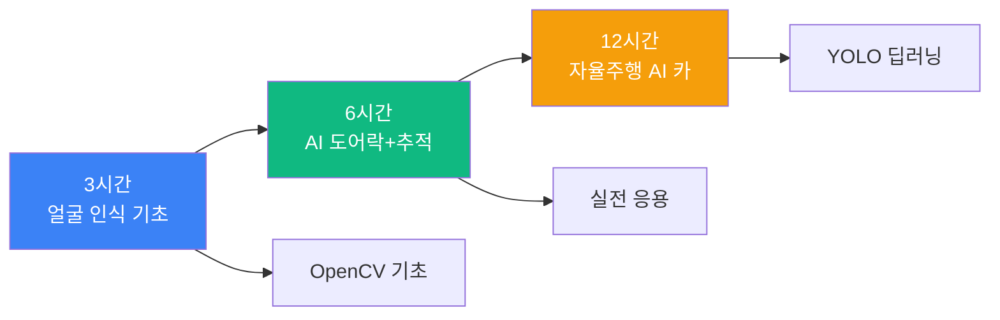
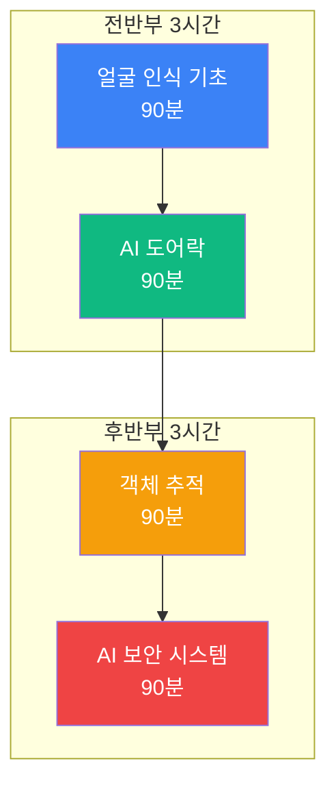
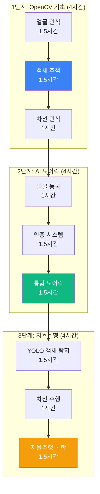
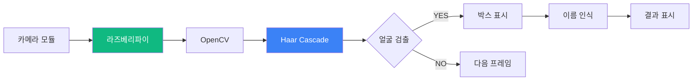
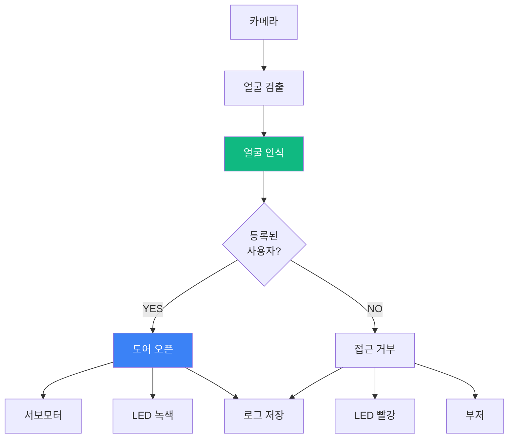
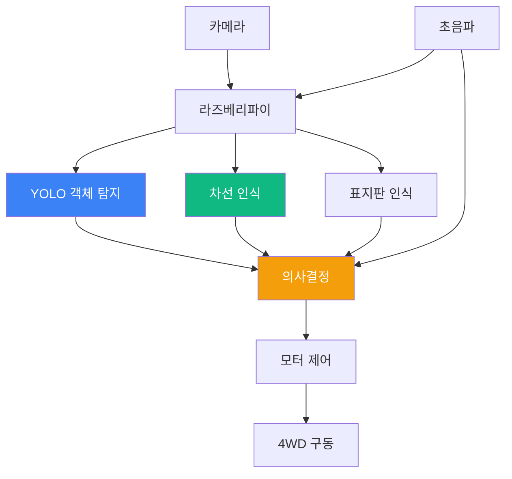
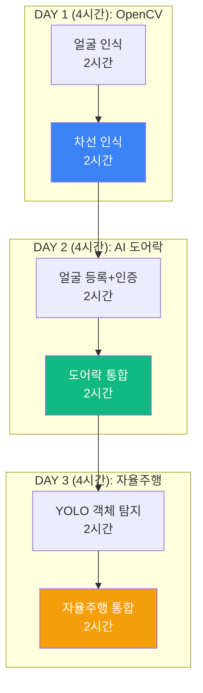
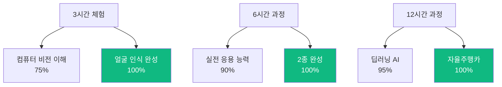

# 맛보기 출장수업: 라즈베리파이 AI

## 🎯 Hero Section

**배지**: "AI 비전으로 만드는 실전 IoT"  
**타이틀**: "라즈베리파이 AI 메이커"  
**설명**: "OpenCV와 YOLO로 얼굴 인식 도어락, 자율주행 AI 카를 만들어보세요"

### Features

| 아이콘 | 라벨 | 설명 |
|--------|------|------|
| 📷 | AI 카메라 | 실시간 객체 인식 |
| 🚗 | AI 자율주행 | YOLO 기반 주행 |
| 🔐 | 스마트 도어락 | 얼굴 인식 보안 |
| 🐧 | Linux | 라즈베리파이 OS |

---

## 📊 Course Info

| 항목 | 아이콘 | 색상 | 내용 |
|------|--------|------|------|
| 수업 시간 | ⏰ Clock | purple | 3시간 / 6시간 / 12시간 선택 |
| 수강 인원 | 👥 Users | blue | 최대 20명 (2인 1팀 권장) |
| 준비물 | 💻 Computer | green | 라즈베리파이 4 (제공) |
| 수업 방식 | 🎯 Target | orange | PRIMM 방식 (체험→탐구→수정→창작) |

---

## 📖 과정 소개

### 타이틀
"왜 라즈베리파이 AI인가?"

### 내용

라즈베리파이는 **Linux 운영체제가 실행되는 초소형 컴퓨터**로, 카메라 모듈을 연결하여 OpenCV와 YOLO 같은 AI 비전 기술을 실시간으로 구현할 수 있습니다.

테슬라 자율주행, 스마트 보안 시스템처럼 **실제 산업에서 사용되는 AI 기술**을 직접 체험하고, ESP32로는 불가능한 **딥러닝 모델 추론**을 라즈베리파이로 구현합니다.

**코딩 문법보다는 컴퓨터 비전 알고리즘(얼굴 인식, 객체 탐지, 트래킹)과 센서 데이터 융합**에 집중하며, 이미 작성된 코드를 수정하고 개선하는 메이커 방식으로 진행합니다.

중학생부터 고등학생까지 참여 가능하며, **3시간 만에 AI 카메라 앱**을, **12시간이면 자율주행 AI 카**를 완성할 수 있습니다.

### 이미지 (3개)
- 라즈베리파이 4 + 카메라 모듈
- 학생들이 AI 자율주행카 테스트하는 모습
- 얼굴 인식 도어락 시스템

---

## 🎓 학습 경로 (Learning Path)

### 전체 구조도



### 3시간 과정: 얼굴 인식 카메라

| 단계 | 시간 | 내용 | 강조 |
|------|------|------|------|
| 1. 벤치마킹 | 15분 | AI 비전 사례 & 토론 | 📷 |
| 2. Predict | 10분 | 완성된 얼굴 인식 체험 | 🎮 |
| 3. Run | 30분 | 라즈베리파이 셋업 & 실행 | ⭐ |
| 4. Investigate | 20분 | Haar Cascade 알고리즘 | 🔍 |
| 5. Modify | 40분 | 얼굴 필터, 카운터 추가 | ⭐⭐ |
| 6. Make | 50분 | 나만의 AI 카메라 앱 | ⭐⭐⭐ |
| 7. 발표 | 15분 | 작품 시연 & 공유 | 🎉 |

**완성 작품**: 실시간 얼굴 인식 카메라 (나이/성별/표정 분석)

### 6시간 과정: AI 도어락 + 객체 추적



| 세션 | 시간 | 프로젝트 | 핵심 기술 |
|------|------|----------|-----------|
| 1교시 | 90분 | 얼굴 인식 카메라 | Haar Cascade |
| 2교시 | 90분 | 얼굴 인식 도어락 | Face Recognition |
| 3교시 | 90분 | 객체 추적 로봇 | Object Tracking |
| 4교시 | 90분 | AI 보안 카메라 | Motion Detection |

**완성 작품**: AI 도어락 + 보안 카메라 시스템

### 12시간 과정: AI 자율주행카 완성



**일정표**

| 차시 | 시간 | 단계 | 프로젝트 | 완성도 |
|------|------|------|----------|--------|
| 1차시 | 2시간 | OpenCV 1 | 얼굴 인식 + 객체 추적 | ⭐⭐⭐ |
| 2차시 | 2시간 | OpenCV 2 | 차선 인식 + 신호등 인식 | ⭐⭐⭐ |
| 3차시 | 2시간 | AI 도어락 1 | 얼굴 등록 + 인증 | ⭐⭐⭐ |
| 4차시 | 2시간 | AI 도어락 2 | 서보모터 + 웹 대시보드 | ⭐⭐⭐ |
| 5차시 | 2시간 | 자율주행 1 | YOLO 객체 탐지 + 차선 주행 | ⭐⭐⭐ |
| 6차시 | 2시간 | 자율주행 2 | 장애물 회피 + 표지판 인식 | ⭐⭐⭐ |

**완성 작품**: 3개 AI 시스템 + 포트폴리오

---

## 🎮 프로젝트 상세

### 프로젝트 1: 얼굴 인식 카메라 (3시간 과정 메인)



**난이도**: ⭐⭐ (초급)  
**소요 시간**: 3시간  
**대상**: 중등 2학년 ~ 고등 3학년

**학습 목표**
- 라즈베리파이 기본 사용법
- OpenCV 이미지 처리
- Haar Cascade 얼굴 검출 알고리즘
- 실시간 비디오 처리

**제작 단계**

| 단계 | 내용 | 시간 | 도구 |
|------|------|------|------|
| 1. 셋업 | 라즈베리파이 부팅 & VNC 연결 | 20분 | VNC Viewer |
| 2. 카메라 | 카메라 모듈 연결 & 테스트 | 10분 | `raspistill` |
| 3. 코드 실행 | 얼굴 인식 예제 실행 | 20분 | Python |
| 4. 이해 | Haar Cascade 원리 설명 | 20분 | - |
| 5. 수정 | 색상, 텍스트, 카운터 추가 | 40분 | OpenCV |
| 6. 확장 | 나이/성별 추정 추가 | 40분 | 딥러닝 모델 |
| 7. 발표 | 실시간 시연 | 10분 | - |

**핵심 알고리즘: Haar Cascade 얼굴 검출**

```python
import cv2

# Haar Cascade 모델 로드
face_cascade = cv2.CascadeClassifier('haarcascade_frontalface_default.xml')

# 카메라 초기화
cap = cv2.VideoCapture(0)

while True:
    ret, frame = cap.read()
    gray = cv2.cvtColor(frame, cv2.COLOR_BGR2GRAY)
    
    # 얼굴 검출 (핵심 알고리즘)
    faces = face_cascade.detectMultiScale(
        gray, 
        scaleFactor=1.1,   # 이미지 피라미드 스케일
        minNeighbors=5,    # 최소 이웃 개수
        minSize=(30, 30)   # 최소 얼굴 크기
    )
    
    # 얼굴에 사각형 그리기
    for (x, y, w, h) in faces:
        cv2.rectangle(frame, (x, y), (x+w, y+h), (0, 255, 0), 2)
        cv2.putText(frame, f"Face {len(faces)}", (x, y-10), 
                    cv2.FONT_HERSHEY_SIMPLEX, 0.9, (0, 255, 0), 2)
    
    cv2.imshow('Face Detection', frame)
    
    if cv2.waitKey(1) & 0xFF == ord('q'):
        break

cap.release()
cv2.destroyAllWindows()
```

**기대 효과**
- ✅ 컴퓨터 비전 원리 체득
- ✅ 실시간 이미지 처리 이해
- ✅ 3시간 만에 작동하는 AI 카메라

### 프로젝트 2: 얼굴 인식 AI 도어락 (6시간 과정 포함)



**난이도**: ⭐⭐⭐ (중급)  
**소요 시간**: 90-180분  
**대상**: 중등 3학년 ~ 고등 3학년

**시스템 구성**

| 모듈 | 역할 | 통신 |
|------|------|------|
| 라즈베리파이 4 | 메인 컨트롤러 | - |
| 카메라 모듈 v2 | 얼굴 촬영 | CSI |
| 서보모터 | 도어락 제어 | GPIO PWM |
| LED (녹/빨) | 상태 표시 | GPIO |
| 부저 | 경고음 | GPIO |

**제어 로직**

```python
import cv2
import face_recognition
import RPi.GPIO as GPIO

# 서보모터 설정
SERVO_PIN = 18
GPIO.setmode(GPIO.BCM)
GPIO.setup(SERVO_PIN, GPIO.OUT)
pwm = GPIO.PWM(SERVO_PIN, 50)  # 50Hz
pwm.start(0)

# 등록된 얼굴 로드
known_face_encodings = []
known_face_names = []
# ... 얼굴 데이터 로드 ...

cap = cv2.VideoCapture(0)

def open_door():
    pwm.ChangeDutyCycle(7.5)  # 90도 회전
    GPIO.output(LED_GREEN, GPIO.HIGH)
    time.sleep(3)
    pwm.ChangeDutyCycle(2.5)  # 0도 (닫힘)
    GPIO.output(LED_GREEN, GPIO.LOW)

while True:
    ret, frame = cap.read()
    rgb_frame = cv2.cvtColor(frame, cv2.COLOR_BGR2RGB)
    
    # 얼굴 검출
    face_locations = face_recognition.face_locations(rgb_frame)
    face_encodings = face_recognition.face_encodings(rgb_frame, face_locations)
    
    for face_encoding in face_encodings:
        # 얼굴 인식 (핵심 알고리즘)
        matches = face_recognition.compare_faces(known_face_encodings, face_encoding)
        name = "Unknown"
        
        if True in matches:
            first_match_index = matches.index(True)
            name = known_face_names[first_match_index]
            
            # 인증 성공 → 도어 오픈
            open_door()
            log_access(name, True)
        else:
            # 인증 실패 → 경고
            GPIO.output(LED_RED, GPIO.HIGH)
            GPIO.output(BUZZER, GPIO.HIGH)
            time.sleep(0.5)
            GPIO.output(LED_RED, GPIO.LOW)
            GPIO.output(BUZZER, GPIO.LOW)
            log_access("Unknown", False)
    
    cv2.imshow('Door Lock', frame)
    if cv2.waitKey(1) & 0xFF == ord('q'):
        break
```

**기능 확장**

| 기능 | 설명 | 난이도 |
|------|------|--------|
| 웹 대시보드 | Flask로 접근 기록 조회 | ⭐⭐ |
| 스마트폰 알림 | Telegram 봇 연동 | ⭐⭐⭐ |
| 다중 사용자 | 얼굴 여러 명 등록 | ⭐⭐ |
| 음성 안내 | "환영합니다" TTS | ⭐⭐ |

### 프로젝트 3: AI 자율주행카 (12시간 과정 메인)

**난이도**: ⭐⭐⭐⭐⭐ (고급)  
**소요 시간**: 4-6시간  
**대상**: 고등 1-3학년

**시스템 구조**



**주요 알고리즘**

**1) 차선 인식**

```python
def detect_lane(frame):
    # 1. 관심 영역 (ROI) 설정
    height, width = frame.shape[:2]
    roi_vertices = [(0, height), (width/2, height/2), (width, height)]
    mask = np.zeros_like(frame)
    cv2.fillPoly(mask, np.array([roi_vertices], dtype=np.int32), 255)
    masked = cv2.bitwise_and(frame, mask)
    
    # 2. 엣지 검출
    gray = cv2.cvtColor(masked, cv2.COLOR_BGR2GRAY)
    blur = cv2.GaussianBlur(gray, (5, 5), 0)
    edges = cv2.Canny(blur, 50, 150)
    
    # 3. 허프 변환으로 직선 검출
    lines = cv2.HoughLinesP(edges, 1, np.pi/180, 50, maxLineGap=50)
    
    # 4. 좌우 차선 구분
    left_lines = []
    right_lines = []
    for line in lines:
        x1, y1, x2, y2 = line[0]
        slope = (y2 - y1) / (x2 - x1)
        if slope < 0:  # 왼쪽 차선
            left_lines.append(line)
        else:  # 오른쪽 차선
            right_lines.append(line)
    
    return left_lines, right_lines
```

**2) YOLO 객체 탐지**

```python
import cv2
import numpy as np

# YOLOv4-tiny 로드 (경량화 모델)
net = cv2.dnn.readNet("yolov4-tiny.weights", "yolov4-tiny.cfg")
layer_names = net.getLayerNames()
output_layers = [layer_names[i - 1] for i in net.getUnconnectedOutLayers()]

# COCO 클래스 (80종)
with open("coco.names", "r") as f:
    classes = [line.strip() for line in f.readlines()]

def detect_objects(frame):
    height, width = frame.shape[:2]
    
    # 이미지 전처리
    blob = cv2.dnn.blobFromImage(frame, 0.00392, (416, 416), (0, 0, 0), True, crop=False)
    net.setInput(blob)
    
    # YOLO 추론
    outs = net.forward(output_layers)
    
    # 결과 파싱
    class_ids = []
    confidences = []
    boxes = []
    
    for out in outs:
        for detection in out:
            scores = detection[5:]
            class_id = np.argmax(scores)
            confidence = scores[class_id]
            
            if confidence > 0.5:
                # 바운딩 박스 계산
                center_x = int(detection[0] * width)
                center_y = int(detection[1] * height)
                w = int(detection[2] * width)
                h = int(detection[3] * height)
                x = int(center_x - w / 2)
                y = int(center_y - h / 2)
                
                boxes.append([x, y, w, h])
                confidences.append(float(confidence))
                class_ids.append(class_id)
    
    # Non-maximum Suppression
    indexes = cv2.dnn.NMSBoxes(boxes, confidences, 0.5, 0.4)
    
    return boxes, confidences, class_ids, indexes
```

**3) 자율주행 의사결정**

```python
def autonomous_drive():
    cap = cv2.VideoCapture(0)
    
    while True:
        ret, frame = cap.read()
        
        # 1. 차선 인식
        left_lane, right_lane = detect_lane(frame)
        steering = calculate_steering(left_lane, right_lane)
        
        # 2. 객체 탐지
        boxes, confidences, class_ids, indexes = detect_objects(frame)
        
        # 3. 의사결정
        obstacles = []
        for i in indexes:
            x, y, w, h = boxes[i]
            label = classes[class_ids[i]]
            
            # 전방 장애물 감지
            if y + h > height * 0.6:  # 하단 40% 영역
                obstacles.append(label)
        
        # 4. 주행 제어
        if "person" in obstacles or "car" in obstacles:
            # 장애물 있음 → 정지
            motor_stop()
        elif abs(steering) > 30:
            # 급커브 → 감속
            motor_forward(speed=50)
            motor_steer(steering)
        else:
            # 정상 주행
            motor_forward(speed=80)
            motor_steer(steering)
        
        cv2.imshow('Autonomous Car', frame)
        if cv2.waitKey(1) & 0xFF == ord('q'):
            break
```

**완성 기능**

| 기능 | 설명 | 정확도 |
|------|------|--------|
| 차선 유지 | Canny + Hough Transform | 85% |
| 객체 탐지 | YOLOv4-tiny | 90% |
| 장애물 회피 | 초음파 + YOLO 융합 | 95% |
| 표지판 인식 | CNN 분류기 | 80% |
| 주차 | 라인 트래킹 | 90% |

---

## 📚 커리큘럼 상세

### 3시간 과정: 빠른 체험

**목표**: 얼굴 인식 카메라 완성

**시간표**

| 시간 | 내용 | 활동 | 산출물 |
|------|------|------|--------|
| 00:00-00:15 | 오리엔테이션 | AI 비전 사례 | - |
| 00:15-00:25 | 체험 (Predict) | 완성 프로그램 체험 | - |
| 00:25-00:45 | 셋업 (Run) | 라즈베리파이 부팅 | - |
| 00:45-01:05 | 실행 | 얼굴 인식 실행 | 동작 확인 |
| 01:05-01:25 | 이해 (Investigate) | Haar Cascade 설명 | 이해도 체크 |
| 01:25-02:05 | 수정 (Modify) | 색상/텍스트 수정 | 개선된 앱 |
| 02:05-02:45 | 창작 (Make) | 나이/성별 추정 추가 | 완성 작품 |
| 02:45-03:00 | 발표 | 실시간 시연 | 시연 영상 |

**준비물**
- 라즈베리파이 4 + 카메라 모듈 (2인 1세트)
- 모니터, 키보드, 마우스 (공용 또는 VNC)
- 전원 어댑터

**제공 자료**
- 라즈베리파이 이미지 (사전 설치)
- Python 예제 코드
- Haar Cascade 모델

### 6시간 과정: AI 도어락 + 보안 시스템

**목표**: 2개 AI 시스템 완성

**일정 구성**

```mermaid
gantt
    title 6시간 과정 일정
    dateFormat HH:mm
    axisFormat %H:%M
    
    section 1부 (3시간)
    오리엔테이션: 09:00, 15m
    얼굴 인식 기초: 09:15, 75m
    AI 도어락: 10:30, 90m
    
    section 점심 (1시간)
    휴식: 12:00, 60m
    
    section 2부 (3시간)
    객체 추적: 13:00, 90m
    AI 보안 카메라: 14:30, 90m
```



**세부 시간표**

| 교시 | 시간 | 프로젝트 | 세부 활동 |
|------|------|----------|-----------|
| **1교시** | **09:00-10:30** | **얼굴 인식** | |
| | 09:00-09:15 | 오리엔테이션 | AI 비전 개요 |
| | 09:15-09:45 | Predict + Run | 체험 + 코드 실행 |
| | 09:45-10:15 | Investigate | Haar Cascade |
| | 10:15-10:30 | Modify | 필터 추가 |
| **2교시** | **10:30-12:00** | **AI 도어락** | |
| | 10:30-11:00 | 얼굴 등록 | 사진 촬영 |
| | 11:00-11:30 | 인증 시스템 | face_recognition |
| | 11:30-12:00 | 하드웨어 | 서보모터 연동 |
| **점심** | **12:00-13:00** | 휴식 | - |
| **3교시** | **13:00-14:30** | **객체 추적** | |
| | 13:00-13:30 | Run | 추적 알고리즘 |
| | 13:30-14:00 | Modify | 추적 대상 선택 |
| | 14:00-14:30 | Make | 로봇카 연동 |
| **4교시** | **14:30-16:00** | **보안 카메라** | |
| | 14:30-15:00 | Motion Detection | 움직임 감지 |
| | 15:00-15:30 | 녹화 기능 | 영상 저장 |
| | 15:30-16:00 | 발표 | 2종 시연 |

### 12시간 과정: AI 자율주행카 완성

**목표**: 3개 AI 시스템 + 자율주행카

**전체 구조**



**일차별 계획**

| 일차 | 주제 | 프로젝트 | 시간 배분 |
|------|------|----------|-----------|
| **1일차** | **OpenCV 기초** | | **4시간** |
| | 오리엔테이션 | 라즈베리파이 & AI 비전 | 30분 |
| | 얼굴 인식 | Haar + Face Recognition | 90분 |
| | 객체 추적 | Object Tracking | 60분 |
| | 차선 인식 | Lane Detection | 60분 |
| **2일차** | **AI 도어락** | | **4시간** |
| | 복습 | 1일차 리뷰 | 15분 |
| | 얼굴 등록 | 데이터 수집 | 60분 |
| | 인증 시스템 | face_recognition 라이브러리 | 60분 |
| | 하드웨어 통합 | 서보모터 + LED + 부저 | 60분 |
| | 웹 대시보드 | Flask 앱 | 45분 |
| **3일차** | **자율주행카** | | **4시간** |
| | 복습 | 2일차 리뷰 | 15분 |
| | YOLO 설치 | 모델 다운로드 & 테스트 | 45분 |
| | 객체 탐지 | YOLO 추론 | 60분 |
| | 차선 주행 | 차선 인식 + 모터 제어 | 60분 |
| | 자율주행 통합 | YOLO + 차선 + 장애물 | 60분 |
| | 포트폴리오 | 3종 정리 & 발표 | 20분 |

---

## 💰 가격 정책

### 3시간 과정

| 항목 | 기본 | 프리미엄 |
|------|------|----------|
| 수업 시간 | 3시간 | 3시간 |
| 수강 인원 | 최대 20명 (2인 1팀) | 최대 20명 (1인 1팀) |
| 강사 | 1명 | 2명 |
| 키트 | 라즈베리파이 (공용 10세트) | 라즈베리파이 (개인 소유) |
| 제공 자료 | 디지털 | 디지털 + USB |
| 완성 작품 | 체험 (반납) | 개인 소유 |
| 사후 지원 | - | 1주일 온라인 질문 |
| **가격** | **50만원** | **80만원 + 키트비** |

※ 키트비: 라즈베리파이 4 (4GB) + 카메라 = 7만원

### 6시간 과정

| 항목 | 기본 | 프리미엄 |
|------|------|----------|
| 수업 시간 | 6시간 (1일) | 6시간 (1일) |
| 수강 인원 | 최대 20명 (2인 1팀) | 최대 20명 (1인 1팀) |
| 강사 | 2명 | 3명 |
| 키트 | 라즈베리파이 + 센서 (공용) | 풀세트 (개인 소유) |
| 제공 자료 | 디지털 | 풀패키지 + USB |
| 완성 작품 | 2종 (반납) | 2종 (개인 소유) |
| 사후 지원 | 1주일 | 2주일 + 화상 |
| 추가 혜택 | - | • 정식 과정 20% 할인<br/>• 센서 키트 |
| **가격** | **90만원** | **130만원 + 키트비** |

※ 키트비: 라즈베리파이 + 센서 + 서보모터 = 10만원

### 12시간 과정

| 항목 | 기본 | 프리미엄 |
|------|------|----------|
| 수업 시간 | 12시간 (3일, 각 4시간) | 12시간 (3일, 각 4시간) |
| 수강 인원 | 최대 20명 (2인 1팀) | 최대 20명 (1인 1팀) |
| 강사 | 2명 | 3명 |
| 키트 | 라즈베리파이 + AI카 (공용) | 풀세트 (개인 소유) |
| 제공 자료 | 디지털 + 워크북 | 풀패키지 + USB |
| 완성 작품 | 3종 (반납) | 3종 + 포트폴리오 |
| 사후 지원 | 2주일 | 1개월 + 월 1회 화상 |
| 추가 혜택 | 정식 과정 10% 할인 | • 정식 과정 30% 할인<br/>• 포트폴리오 웹사이트<br/>• 대회 참가 지원 |
| **가격** | **180만원** | **250만원 + 키트비** |

※ 키트비: 라즈베리파이 + AI카 풀세트 = 15만원

---

## 🎯 교육 효과

### 학습 성과



### 역량 비교

| 역량 | 3시간 | 6시간 | 12시간 |
|------|-------|-------|--------|
| OpenCV | ⭐⭐ | ⭐⭐⭐⭐ | ⭐⭐⭐⭐⭐ |
| 딥러닝 AI | ⭐ | ⭐⭐ | ⭐⭐⭐⭐⭐ |
| Linux | ⭐⭐ | ⭐⭐⭐ | ⭐⭐⭐⭐ |
| 완성도 | ⭐⭐⭐ | ⭐⭐⭐⭐ | ⭐⭐⭐⭐⭐ |
| 실전 활용 | ⭐⭐ | ⭐⭐⭐ | ⭐⭐⭐⭐⭐ |

---

## 📞 문의

**홈페이지**: https://aimakerlab.com  
**이메일**: trial-raspberry@aimakerlab.com  
**전화**: 02-XXXX-XXXX

---

## 📝 문서 정보

**최종 업데이트**: 2025-12-30  
**버전**: 1.0  
**작성자**: AI Maker Lab 교육팀

